# 九、SpringCloud

在本章中，我们将介绍一些重要的模式，这些模式与开发云本地应用以及使用 SpringCloud 保护伞下的项目实现它们有关。我们将介绍以下功能：

*   使用 SpringCloud配置服务器实现集中式微服务配置
*   使用 SpringCloud总线跨微服务实例同步配置
*   使用 Feign 创建声明性 REST 客户端
*   使用 Ribbon 实现客户端负载平衡
*   使用 Eureka 实现名称服务器
*   用 Zuul 实现 API 网关
*   使用 springcloudsleuth 和 Zipkin 实现分布式跟踪
*   使用 Hystrix 实现容错

# 介绍SpringCloud

在[第 4 章](04.html)*微服务和云原生应用的发展*中，我们讨论了单片应用的问题以及架构如何向微服务发展。然而，微服务也有自己的挑战：

*   采用微服务架构的组织还需要围绕微服务的一致性做出具有挑战性的决策，而不影响微服务团队的创新能力。
*   更小的应用意味着更多的构建、发布和部署。这通常通过更自动化的方式来解决。
*   微服务架构是基于大量较小的细粒度服务构建的。在管理这些服务的配置和可用性方面存在一些挑战。
*   由于应用的分布式特性，调试问题变得更加困难。

为了从微服务架构中获得最大的好处，微服务应该是云原生的——易于在云上部署。在[第 4 章](04.html)*微服务和云原生应用的发展*中，我们讨论了十二要素应用的特征——这些模式通常被认为是云原生应用中的良好实践。

SpringCloud 旨在为在云上构建系统时常见的一些模式提供解决方案。一些重要功能包括：

*   管理分布式微服务配置的解决方案
*   使用名称服务器的服务注册和发现
*   跨多个微服务实例的负载平衡
*   使用断路器提供更多容错服务
*   用于聚合、路由和缓存的 API 网关
*   跨微服务的分布式跟踪

理解 SpringCloud 不是一个单独的项目是很重要的。它是一组子项目，旨在解决与部署在云上的应用相关的问题。

以下是一些重要的 Spring Cloud 子项目：

*   **SpringCloud配置**：支持跨不同环境跨不同微服务的集中外部配置。
*   **SpringCloud网飞**：网飞是微服务架构的早期采用者之一。许多内部 Netflix 项目是在 Spring Cloud Netflix 的保护下开源的。例如 Eureka、Hystrix 和 Zuul。
*   **SpringCloud总线**：使构建微服务与轻量级消息代理的集成更加容易。
*   **Spring Cloud Sleuth**：与 Zipkin 一起提供分布式追踪解决方案。
*   **SpringCloud数据流**：提供围绕微服务应用构建编排的功能。提供 DSL、GUI 和 RESTAPI。
*   **Spring Cloud Stream**：提供了一个简单的声明性框架，用于将基于 Spring（和 Spring Boot）的应用与消息代理（如 Apache Kafka 或 RabbitMQ）集成。

Spring Cloud 保护伞下的所有项目都有一些共同点：

*   它们解决了在云上开发应用的一些常见问题
*   它们提供了与 Spring Boot 的良好集成
*   它们通常配置有简单的注释
*   他们广泛使用自动配置

# SpringCloud网飞

Netflix 是首批开始从单片架构向微服务架构转变的组织之一。Netflix 一直非常开放地记录这一经历。一些内部 Netflix 框架在 Spring Cloud Netflix 的保护下是开源的。如 Spring Cloud Netflix 网站（[所定义 https://cloud.spring.io/spring-cloud-netflix/](https://cloud.spring.io/spring-cloud-netflix/) ：

Spring Cloud Netflix 通过自动配置并绑定到 Spring 环境和其他 Spring 编程模型习惯用法，为 Spring 启动应用提供 Netflix OSS 集成。

Spring Cloud Netflix 旗下的一些重要项目如下：

*   **Eureka**：为微服务提供服务注册和发现功能的名称服务器。
*   **Hystrix**：通过断路器构建容错微服务的能力。还提供了一个仪表板。
*   **佯装**：声明式 REST 客户端使得调用使用 JAX-RS 和 Spring MVC 创建的服务变得很容易。
*   **Ribbon**：提供客户端负载平衡功能。
*   **Zuul**：提供典型的 API 网关功能，如路由、过滤、身份验证和安全性。它可以通过自定义规则和过滤器进行扩展。

# 演示微服务设置

我们将使用两个微服务来演示本章中的概念：

*   **微服务 A**：一个简单的微服务，公开了两个服务——一个从配置文件中检索消息，另一个`random service`提供随机数列表。
*   **服务消费者微服务**：一个简单的微服务，公开一个称为`add`服务的简单计算服务。`add`服务使用**微服务 A**中的`random service`并将数字相加。

下图显示了微服务与公开的服务之间的关系：

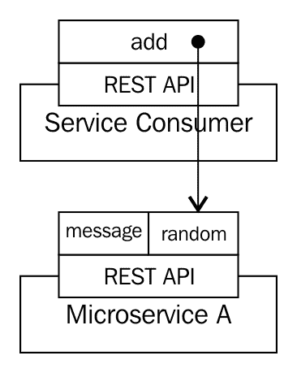

让我们快速设置这些微服务。

# 微服务

让我们使用 Spring 初始化器（[https://start.spring.io](https://start.spring.io) ）开始使用微服务 A。选择 GroupId、ArtifactId 和框架，如以下屏幕截图所示：

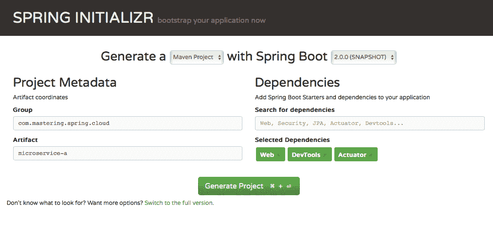

我们将创建一个服务来公开一组随机数：

```java
    @RestController
    public class RandomNumberController {
      private Log log =
        LogFactory.getLog(RandomNumberController.class);
      @RequestMapping("/random")
      public List<Integer> random() {
        List<Integer> numbers = new ArrayList<Integer>();
        for (int i = 1; i <= 5; i++) {
          numbers.add(generateRandomNumber());
        }
        log.warn("Returning " + numbers);
        return numbers;
      }
      private int generateRandomNumber() {
        return (int) (Math.random() * 1000);
      }
    }
```

需要注意的重要事项如下：

*   `@RequestMapping("/random") public List<Integer> random()`：随机服务返回随机数列表
*   `private int generateRandomNumber() {`：生成 0 到 1000 之间的随机数

以下代码片段显示了来自`http://localhost:8080/random`服务的响应示例：

```
    [666,257,306,204,992]
```

接下来，我们希望创建一个服务，从`application.properties`中的应用配置返回一条简单消息。

让我们用一个属性定义一个简单的应用配置--`message`：

```
    @Component
    @ConfigurationProperties("application")
    public class ApplicationConfiguration {
      private String message;
      public String getMessage() {
        return message;
      }
      public void setMessage(String message) {
        this.message = message;
      }
    }
```

需要注意的几个重要事项如下：

*   `@ConfigurationProperties("application")`：定义一个定义`application.properties`的类。
*   `private String message`：定义一个属性--`message`。该值可在`application.properties`中配置，键为`application.message`。

我们来配置`application.properties`，如下代码段所示：

```
    spring.application.name=microservice-a
    application.message=Default Message
```

需要注意的几个重要事项如下：

*   `spring.application.name=microservice-a`：`spring.application.name`用于为应用命名
*   `application.message=Default Message`：为`application.message`配置默认消息

让我们创建一个控制器来读取并返回消息，如以下代码段所示：

```
    @RestController
    public class MessageController {
      @Autowired
      private ApplicationConfiguration configuration;
      @RequestMapping("/message")
      public Map<String, String> welcome() {
        Map<String, String> map = new HashMap<String, String>();
        map.put("message", configuration.getMessage());
        return map;
      }
    }
```

需要注意的重要事项如下：

*   `@Autowired private ApplicationConfiguration configuration`：自动连线`ApplicationConfiguration`以启用读取配置的消息值。
*   `@RequestMapping("/message") public Map<String, String> welcome()`：在 URI/`message`处公开一个简单的服务。
*   `map.put("message", configuration.getMessage())`：服务返回一个带有一个条目的地图。它有一条关键信息，该值从`ApplicationConfiguration`中提取。

当服务在`http://localhost:8080/message`执行时，我们得到如下响应：

```
    {"message":"Default Message"}
```

# 服务消费者

让我们设置另一个简单的微服务来使用微服务 A 公开的`random service`。让我们使用 Spring 初始化器（[）https://start.spring.io](https://start.spring.io) ）初始化微服务，如下图所示：

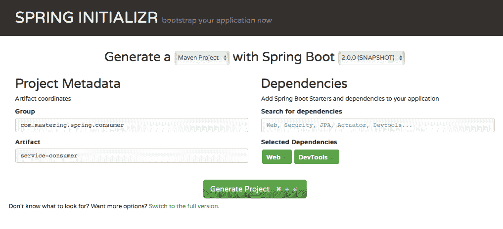

让我们添加要消费的服务`random service`：

```
    @RestController
    public class NumberAdderController {
      private Log log = LogFactory.getLog(
        NumberAdderController.class);
      @Value("${number.service.url}")
      private String numberServiceUrl;
      @RequestMapping("/add")
      public Long add() {
        long sum = 0;
        ResponseEntity<Integer[]> responseEntity =
          new RestTemplate()
          .getForEntity(numberServiceUrl, Integer[].class);
        Integer[] numbers = responseEntity.getBody();
        for (int number : numbers) {
          sum += number;
        }
        log.warn("Returning " + sum);
        return sum;
      }
    }
```

需要注意的重要事项如下：

*   `@Value("${number.service.url}") private String numberServiceUrl`：我们希望数字服务 URL 可以在应用属性中配置。
*   `@RequestMapping("/add") public Long add()`：公开 URI`/add`处的服务。`add`方法使用`RestTemplate`调用数字服务，并具有对响应中返回的数字求和的逻辑。

我们来配置`application.properties`，如下代码段所示：

```
    spring.application.name=service-consumer
    server.port=8100
    number.service.url=http://localhost:8080/random
```

需要注意的重要事项如下：

*   `spring.application.name=service-consumer`：为 SpringBoot应用配置名称
*   `server.port=8100`：使用`8100`作为服务消费者的端口
*   `number.service.url=http://localhost:8080/random`：配置要在添加服务中使用的号码服务 URL

在 URL`http://localhost:8100/add`调用服务时，返回以下响应：

```
    2890
```

以下是 Microservice A 日志的摘录：

```
    c.m.s.c.c.RandomNumberController : Returning [752,
      119, 493, 871, 445]
```

日志显示来自微服务 A 的`random service`返回了`5`号。服务使用者中的`add`服务将它们相加并返回结果`2890`。

我们现在已经准备好了示例微服务。在接下来的步骤中，我们将向这些微服务添加云原生功能。

# 港口

在本章中，我们将创建六种不同的微服务应用和组件。为了简单起见，我们将为特定的应用使用特定的端口。

下表显示了我们将保留供本章中创建的不同应用使用的端口：

| **微服务组件** | **使用的端口** |
| 微服务 | `8080`和`8081` |
| 服务消费者微服务 | `8100` |
| 配置服务器（SpringCloud配置） | `8888` |
| Eureka 服务器（名称服务器） | `8761` |
| Zuul API 网关服务器 | `8765` |
| Zipkin 分布式跟踪服务器 | `9411` |

我们已经准备好了两个微服务。我们已经准备好使用云技术实现我们的微服务。

# 集中式微服务配置

SpringCloudConfig 提供了将微服务配置外部化的解决方案。让我们首先了解将微服务配置外部化的必要性。

# 问题陈述

在微服务体系结构中，我们通常有许多相互交互的小型微服务，而不是一组大型单片应用。每个微服务通常部署在多个环境中——开发、测试、负载测试、暂存和生产。此外，在不同的环境中可以有多个微服务实例。例如，一个特定的微服务可能正在处理重负载。生产中可能存在该微服务的多个生产实例。

应用的配置通常包含以下内容：

*   **数据库配置**：连接数据库所需的详细信息
*   **Message broker 配置**：连接到 AMQP 或类似资源所需的任何配置
*   **外部服务配置**：微服务需要的其他服务
*   **微服务配置**：与微服务业务逻辑相关的典型配置

微服务的每个实例都可以有自己的配置——不同的数据库、它使用的不同外部服务，等等。例如，如果一个微服务部署在五个环境中，并且每个环境中有四个实例，那么该微服务总共可以有 20 种不同的配置。

下图显示了 Microservice A 所需的典型配置。我们正在查看开发中的两个实例、QA 中的三个实例、阶段中的一个实例和生产中的四个实例：


# 解决方案

单独维护不同微服务的配置将给运营团队带来困难。如下图所示，解决方案是创建一个集中式**配置服务器：**


集中式**配置服务器**保存属于所有不同微服务的所有配置。这有助于将配置与可部署的应用分开。

相同的可部署（EAR 或 WAR）可用于不同的环境。但是，所有配置（不同环境之间的配置不同）都将存储在集中式配置服务器中。

需要做出的一个重要决策是，确定是否存在针对不同环境的集中式配置服务器的单独实例。通常，与其他环境相比，您希望对生产配置的访问更具限制性。至少，我们建议为生产使用单独的集中式配置服务器。其他环境可以共享配置服务器的一个实例。

# 选择权

以下屏幕截图显示了 Spring Initializer 为云配置服务器提供的选项：


在本章中，我们将使用 SpringCloudConfig 配置云配置服务器。

# SpringCloud配置

SpringCloudConfig 提供了对集中式微服务配置的支持。它是两个重要组成部分的组合：

*   **SpringCloud配置服务器**：支持公开版本控制库（GIT 或 subversion）备份的集中式配置
*   **SpringCloud配置客户端**：支持应用连接到 SpringCloud配置服务器

下图显示了使用 SpringCloud 配置的典型微服务架构。多个微服务的配置存储在一个**GIT**存储库中：


# 实现 SpringCloud配置服务器

下图显示了使用 SpringCloud 配置更新的 Microservice A 和服务使用者的实现。在下图中，我们将 Microservice A 与 Spring Cloud Config 集成，以便从本地 Git 存储库检索其配置：

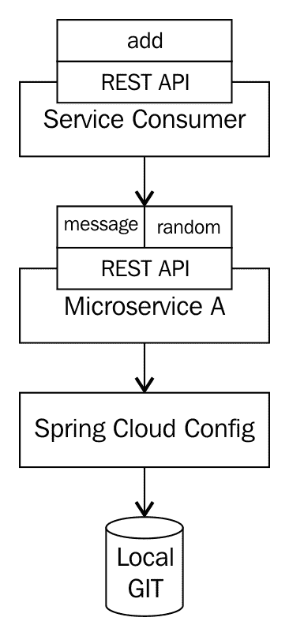

实现 SpringCloud配置需要以下几点：

1.  正在设置 SpringCloud配置服务器。
2.  设置本地 Git 存储库并将其连接到 SpringCloudConfigServer。
3.  更新 Microservice A 以使用云配置服务器的配置——使用 SpringCloud配置客户端。

# 设置 SpringCloud配置服务器

让我们使用 Spring 初始化器（[来设置云配置服务器 http://start.spring.io](http://start.spring.io) ）。下面的屏幕截图显示了要选择的 GroupId 和 ArtifactId。确保选择 Config Server 作为依赖项：


如果要将配置服务器添加到现有应用，请使用此处显示的依赖项：

```
    <dependency>
      <groupId>org.springframework.cloud</groupId>
      <artifactId>spring-cloud-config-server</artifactId>
    </dependency>
```

创建项目后，第一步是添加`EnableConfigServer`注释。以下片段显示了添加到`ConfigServerApplication`的注释：

```
    @EnableConfigServer
    @SpringBootApplication
    public class ConfigServerApplication {
```

# 将 SpringCloud配置服务器连接到本地 Git 存储库

配置服务器需要连接到 Git 存储库。为了保持简单，让我们连接到本地 Git 存储库。

您可以从[为您的特定操作系统安装 Githttps://git-scm.com](https://git-scm.com) 。

以下命令帮助您设置一个简单的本地 Git 存储库。

安装 Git 后切换到您选择的目录。在终端或命令提示符上执行以下命令：

```
mkdir git-localconfig-repo
cd git-localconfig-repo
git init
```

在`git-localconfig-repo`文件夹中创建一个名为`microservice-a.properties`的文件，内容如下：

```
    management.security.enabled=false
    application.message=Message From Default Local Git Repository
```

执行以下命令添加并提交`microservice-a.properties`到本地 Git 存储库：

```
git add -A
git commit -m "default microservice a properties"
```

现在配置好了本地 Git 存储库，我们需要将配置服务器连接到它。我们在`config-server`中配置`application.properties`，如下图：

```
    spring.application.name=config-server
    server.port=8888
    spring.cloud.config.server.git.uri=file:///in28Minutes
    /Books/MasteringSpring/git-localconfig-repo
```

需要注意的一些重要事项如下：

*   `server.port=8888`：配置配置服务器的端口。`8888`通常是配置服务器最常用的端口。
*   `spring.cloud.config.server.git.uri=file:///in28Minutes/Books/MasteringSpring/git-localconfig-repo`：将 URI 配置到本地 Git 存储库。如果要连接到远程 Git 存储库，可以在此处配置 Git 存储库的 URI。

启动服务器。当您点击 URL`http://localhost:8888/microservice-a/default`时，您将看到以下响应：

```
    {  
      "name":"microservice-a",
      "profiles":[  
        "default"
       ],
       "label":null,
       "version":null,
       "state":null,
       "propertySources":[  
        {  
          "name":"file:///in28Minutes/Books/MasteringSpring
          /git-localconfig-repo/microservice-a.properties",
          "source":{  
            "application.message":"Message From Default
             Local Git Repository"
          }
        }]
    }
```

需要了解的一些重要事项如下：

*   `http://localhost:8888/microservice-a/default`：URI 格式为`/{application-name}/{profile}[/{label}]`。这里，`application-name`为`microservice-a`，配置文件为`default`。
*   由于我们使用的是默认配置文件，因此服务将从`microservice-a.properties`返回配置。您可以在`propertySources`>`name`字段的响应中看到。
*   `"source":{"application.message":"Message From Default Local Git Repository"}`：响应的内容为属性文件的内容。

# 创建特定于环境的配置

让我们为`dev`环境的 Microservice a 创建一个特定的配置。

在`git-localconfig-repo`中新建一个名为`microservice-a-dev.properties`的文件，内容如下：

```
application.message=Message From Dev Git Repository
```

对本地 Git 库执行以下命令至`add`和`commit``microservice-a-dev.properties`：

```
git add -A
git commit -m "default microservice a properties" 
```

当您点击 URL`http://localhost:8888/microservice-a/dev`时，您将看到以下响应：

```
    {  
      "name":"microservice-a",
      "profiles":[  
        "dev"
      ],
      "label":null,
      "version":null,
      "state":null,
      "propertySources":[  
      {  
        "name":"file:///in28Minutes/Books/MasteringSpring
         /git-localconfig-repo/microservice-a-dev.properties",
        "source":{  
          "application.message":"Message From Dev Git Repository"
        }
      },
      {  
      "name":"file:///in28Minutes/Books/MasteringSpring
        /git-localconfig-repo/microservice-a.properties",
      "source":{  
        "application.message":"Message From Default
         Local Git Repository"
      }}]
    }
```

响应包含来自`microservice-a-dev.properties`的`dev`配置。还将返回默认属性文件（`microservice-a.properties`中的配置。`microservice-a-dev.properties`中配置的属性（特定于环境的属性）的优先级高于`microservice-a.properties`中配置的默认值。

与`dev`类似，可以为不同的环境创建微服务 a 的单独配置。如果在一个环境中需要多个实例，可以使用标记来区分。格式为`http://localhost:8888/microservice-a/dev/{tag}`的 URL 可用于根据特定标记检索配置。

下一步是将 Microservice A 连接到配置服务器。

# SpringCloud配置客户端

我们将使用 SpringCloud配置客户端将`Microservice A`连接到`Config Server`。这里显示了依赖关系。将以下代码添加到`Microservice A`的`pom.xml`文件中：

```
    <dependency>
      <groupId>org.springframework.cloud</groupId>
      <artifactId>spring-cloud-starter-config</artifactId>
    </dependency>
```

SpringCloud 的依赖项管理与 SpringBoot 不同。我们将使用依赖关系管理来管理依赖关系。以下代码段将确保使用所有 SpringCloud依赖项的正确版本：

```
    <dependencyManagement>
       <dependencies>
          <dependency>
             <groupId>org.springframework.cloud</groupId>
             <artifactId>spring-cloud-dependencies</artifactId>
             <version>Dalston.RC1</version>
             <type>pom</type>
             <scope>import</scope>
          </dependency>
       </dependencies>
    </dependencyManagement>
```

将`Microservice A`中的`application.properties`重命名为`bootstrap.properties`。

按如下所示进行配置：

```
    spring.application.name=microservice-a
    spring.cloud.config.uri=http://localhost:8888
```

因为我们希望`Microservice A`连接到`Config Server`，所以我们使用`spring.cloud.config.uri`提供`Config Server`的 URI。云配置服务器用于检索微服务 A 的配置，因此在`bootstrap.properties`中提供了配置。

**Spring Cloud Context**: Spring Cloud introduces a few important concepts for the Spring application deployed in the Cloud. The Bootstrap Application Context is an important concept. It is the parent context for the microservice application. It is responsible for loading an external configuration (for example, from Spring Cloud Config Server) and Decrypting Configuration Files (external and local). The Bootstrap context is configured using bootstrap.yml or bootstrap.properties. We had to change the name of application.properties to bootstrap.properties in Microservice A earlier because we want Microservice A to use the Config Server for bootstrapping.

重新启动 Microservice A 时的日志摘要如下所示：

```
    Fetching config from server at: http://localhost:8888
    Located environment: name=microservice-a, profiles=[default],
    label=null, version=null, state=null
    Located property source: CompositePropertySource 
    [name='configService', propertySources=[MapPropertySource
    [name='file:///in28Minutes/Books/MasteringSpring/git-localconfig-
    repo/microservice-a.properties']]]
```

`Microservice A`服务正在使用`http://localhost:8888`处`Spring Config Server`的配置。

以下是调用`http://localhost:8080/message`处的`Message Service`时的响应：

```
    {"message":"Message From Default Local Git Repository"}
```

该消息是从`localconfig-repo/microservice-a.properties`文件中提取的。

您可以将活动配置文件设置为`dev`以获取开发配置：

```
    spring.profiles.active=dev
```

服务消费者微服务的配置也可以存储在`local-config-repo`中，并使用 Spring Config Server 公开。

# SpringCloud巴士

SpringCloudBus 可以无缝地将微服务连接到轻量级消息代理，如 Kafka 和 RabbitMQ。

# 对 SpringCloud总线的需求

考虑在微服务中进行配置更改的示例。让我们假设有五个`Microservice A`实例正在生产中运行。我们需要进行紧急配置更改。例如，让我们在`localconfig-repo/microservice-a.properties`中做一个更改：

```
    application.message=Message From Default Local 
      Git Repository Changed
```

为了让`Microservice A`获取此配置更改，我们需要在`http://localhost:8080/refresh`上调用`POST`请求。可在命令提示符下执行以下命令发送`POST`请求：

```
curl -X POST http://localhost:8080/refresh
```

您将在`http://localhost:8080/message`处看到配置更改。以下是该服务的响应：

```
    {"message":"Message From Default Local Git Repository Changed"}
```

我们有五个运行 Microservice A 的实例。配置中的更改仅反映在执行 URL 的 Microservice A 实例中。在对其他四个实例执行刷新请求之前，它们不会收到配置更改。

如果一个微服务有多个实例，那么为每个实例执行刷新 URL 就会变得很麻烦，因为每次配置更改都需要这样做。

# 使用 SpringCloud总线发布配置更改

解决方案是使用 SpringCloudBus 通过消息代理（如 RabbitMQ）将配置更改传播到多个实例。

下图显示了不同的微服务实例（实际上，它们也可以是完全不同的微服务）如何使用 SpringCloud总线连接到 message broker：

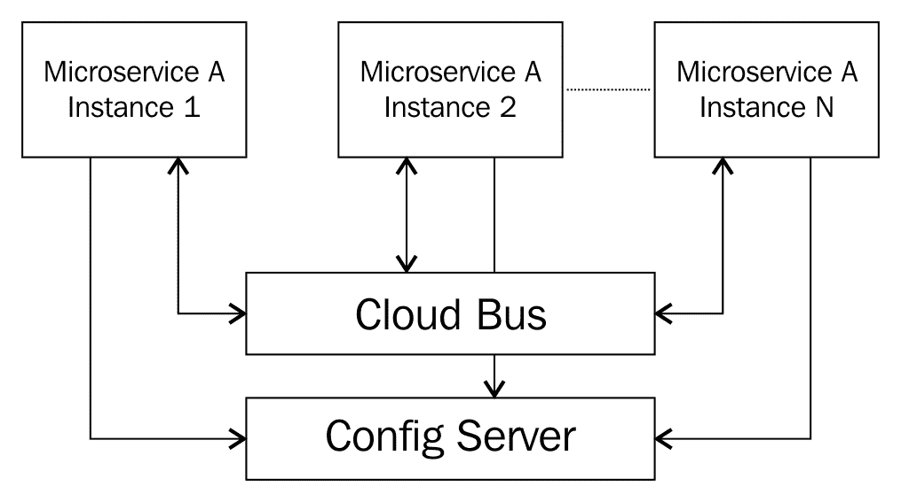

每个微服务实例将在应用启动时向 SpringCloud总线注册。

当在一个微服务实例上调用 refresh 时，SpringCloudBus 将向所有微服务实例传播一个更改事件。microservice 实例将在收到更改事件时从配置服务器请求更新的配置。

# 实施

我们将使用 RabbitMQ 作为消息代理。继续之前，请确保已安装并启动 RabbitMQ。

RabbitMQ 的安装说明见[https://www.rabbitmq.com/download.html](https://www.rabbitmq.com/download.html) 。

下一步是为`Microservice A`添加到 SpringCloud总线的连接。让我们在 Microservice A 的`pom.xml`文件中添加以下依赖项：

```
    <dependency>
      <groupId>org.springframework.cloud</groupId>
      <artifactId>spring-cloud-starter-bus-amqp</artifactId>
    </dependency>
```

我们可以通过提供端口作为启动 VM 参数之一，在不同的端口上运行`Microservice A`。下面的屏幕截图显示了如何在 Eclipse 中将服务器端口配置为 VM 参数。配置的值为`-Dserver.port=8081`：


我们将在端口`8080`（默认）和`8081`上运行微服务 A。以下是重新启动 Microservice A 时从日志中提取的内容：

```
o.s.integration.channel.DirectChannel : Channel 'microservice-a.springCloudBusInput' has 1 subscriber(s).
Bean with name 'rabbitConnectionFactory' has been autodetected for JMX exposure
Bean with name 'refreshBusEndpoint' has been autodetected for JMX exposure
Created new connection: SimpleConnection@6d12ea7c [delegate=amqp://guest@127.0.0.1:5672/, localPort= 61741]
Channel 'microservice-a.springCloudBusOutput' has 1 subscriber(s).
 declaring queue for inbound: springCloudBus.anonymous.HK-dFv8oRwGrhD4BvuhkFQ, bound to: springCloudBus
Adding {message-handler:inbound.springCloudBus.default} as a subscriber to the 'bridge.springCloudBus' channel
```

`Microservice A`的所有实例都注册到`Spring Cloud Bus`并监听云总线上的事件。RabbitMQ 连接的默认配置是自动配置魔力的结果。

现在我们用一条新消息更新`microservice-a.properties`：

```
    application.message=Message From Default Local
      Git Repository Changed Again
```

提交文件并使用 URL`http://localhost:8080/bus/refresh`在其中一个实例上触发刷新配置的请求，比如端口`8080`：

```
    curl -X POST http://localhost:8080/bus/refresh
```

以下是从`8081`端口上运行的`Microservice A`第二个实例的日志摘录：

```
Refreshing org.springframework.context.annotation.AnnotationConfigApplicationContext@510cb933: startup date [Mon Mar 27 21:39:37 IST 2017]; root of context hierarchy
Fetching config from server at: http://localhost:8888
Started application in 1.333 seconds (JVM running for 762.806)
Received remote refresh request. Keys refreshed [application.message]
```

您可以看到，即使在端口`8081`上没有调用刷新 URL，更新的消息也会从配置服务器中获取。这是因为 Microservice A 的所有实例都在 SpringCloud总线上侦听更改事件。一旦对其中一个实例调用了刷新 URL，它就会触发一个更改事件，而所有其他实例都会获取更改的配置。

您将在`http://localhost:8080/message`和`http://localhost:8081/message`的 Microservice A 实例中看到配置更改。以下是该服务的响应：

```
    {"message":"Message From Default Local 
      Git Repository Changed Again"}
```

# 声明性 REST 客户端-外挂

Feign 帮助我们使用最少的配置和代码为 REST 服务创建 REST 客户端。您只需要定义一个简单的接口并使用适当的注释。

`RestTemplate`通常用于进行 REST 服务调用。Feign 帮助我们编写 REST 客户机，而不需要`RestTemplate`及其逻辑。

Feign 与 Ribbon（客户端负载平衡）和 Eureka（名称服务器）集成良好。我们将在本章后面部分介绍这种集成。

要使用 Feign，让我们将 Feign starter 添加到服务消费者微服务的`pom.xml`文件中：

```
    <dependency>
      <groupId>org.springframework.cloud</groupId>
      <artifactId>spring-cloud-starter-feign</artifactId>
    </dependency>
```

我们需要将`dependencyManagement`for Spring Cloud 添加到`pom.xml`文件中，因为这是服务消费者 microservice 使用的第一个云依赖项：

```
    <dependencyManagement>
       <dependencies>
         <dependency>
           <groupId>org.springframework.cloud</groupId>
           <artifactId>spring-cloud-dependencies</artifactId>
           <version>Dalston.RC1</version>
           <type>pom</type>
           <scope>import</scope>
         </dependency>
       </dependencies>
    </dependencyManagement>
```

下一步是添加注释，以便能够扫描到`ServiceConsumerApplication`的外部客户端。以下代码片段显示了`@EnableFeignClients`注释的用法：

```
    @EnableFeignClients("com.mastering.spring.consumer")
    public class ServiceConsumerApplication {
```

我们需要定义一个简单的接口来为`random service`创建一个外部客户端。以下代码段显示了详细信息：

```
    @FeignClient(name ="microservice-a", url="localhost:8080")
    public interface RandomServiceProxy {
      @RequestMapping(value = "/random", method = RequestMethod.GET)
      public List<Integer> getRandomNumbers();
    }
```

需要注意的一些重要事项如下：

*   `@FeignClient(name ="microservice-a", url="localhost:8080")`：`FeignClient`注释用于声明需要创建具有给定接口的 REST 客户端。目前我们正在对`Microservice A`的 URL 进行硬编码。稍后，我们将研究如何将其连接到名称服务器，并消除硬编码的需要。
*   `@RequestMapping(value = "/random", method = RequestMethod.GET)`：这个特定的 GET 服务方法在 URI`/random`中公开。
*   `public List<Integer> getRandomNumbers()`：定义服务方法的接口。

让我们更新`NumberAdderController`使用`RandomServiceProxy`来调用服务。以下代码段显示了重要的详细信息：

```
    @RestController
    public class NumberAdderController {
      @Autowired
      private RandomServiceProxy randomServiceProxy;
      @RequestMapping("/add")
      public Long add() {
        long sum = 0;
        List<Integer> numbers = randomServiceProxy.getRandomNumbers();
        for (int number : numbers) {
          sum += number;
         }
          return sum;
        }
    }
```

需要注意的几个重要事项如下：

*   `@Autowired private RandomServiceProxy randomServiceProxy`：`RandomServiceProxy`自动接线。
*   `List<Integer> numbers = randomServiceProxy.getRandomNumbers()`：看看使用外国客户机有多简单。不要再和`RestTemplate`玩了。

当我们在`http://localhost:8100/add`调用服务消费者微服务中的`add`服务时，您将得到以下响应：

```
    2103
```

通过配置 GZIP 压缩，可以对外部请求启用 GZIP 压缩，如以下代码段所示：

```
    feign.compression.request.enabled=true
    feign.compression.response.enabled=true
```

# 负载平衡

微服务是云原生架构最重要的构建块。微服务实例根据特定微服务的负载进行放大和缩小。我们如何确保负载在微服务的不同实例之间均匀分布？这就是负载平衡的魔力所在。负载平衡对于确保负载在微服务的不同实例之间均匀分布非常重要。

# 带子

如下图所示，Spring Cloud Netflix Ribbon 在微服务的不同实例之间使用循环执行提供客户端负载平衡：

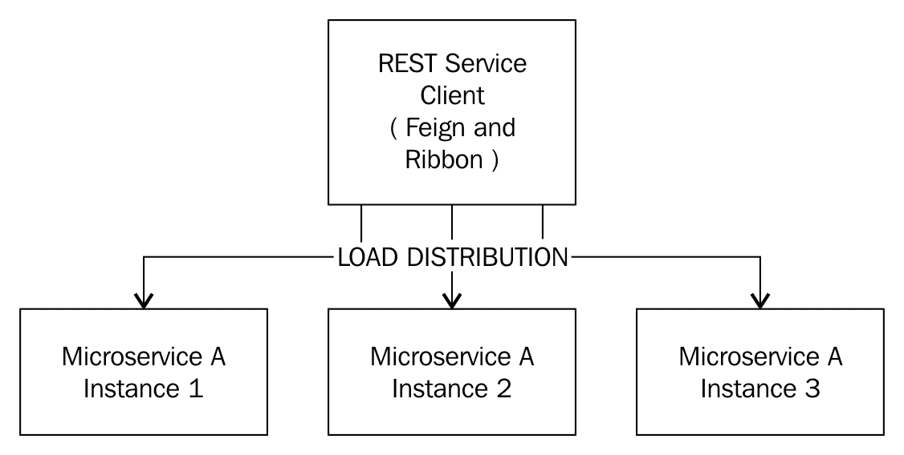

# 实施

我们将为服务消费者微服务添加功能区。服务使用者 microservice 将在 microservice A 的两个实例之间分配负载。

让我们首先将功能区依赖项添加到服务消费者微服务的`pom.xml`文件中：

```
    <dependency>
      <groupId>org.springframework.cloud</groupId>
      <artifactId>spring-cloud-starter-ribbon</artifactId>
    </dependency>
```

接下来，我们可以为 Microservice A 的不同实例配置 URL。将以下配置添加到`application.properties`in-service consumer Microservice：

```
    random-proxy.ribbon.listOfServers= 
      http://localhost:8080,http://localhost:8081
```

然后，在本例中，我们将在服务代理上指定`@RibbonClient`注释--`RandomServiceProxy`。`@RibbonClient`注释用于指定功能区客户端的声明性配置：

```
    @FeignClient(name ="microservice-a")
    @RibbonClient(name="microservice-a")
    public interface RandomServiceProxy {
```

当您重新启动服务消费者微服务并点击`http://localhost:8100/add`处的添加服务时，您将得到以下响应：

```
    2705
```

此请求由运行在端口`8080`上的`Microservice A`实例处理，日志摘录如下：

```
    c.m.s.c.c.RandomNumberController : Returning [487,
      441, 407, 563, 807]
```

当我们在同一 URL 上再次点击 add 服务时，`http://localhost:8100/add`我们得到以下响应：

```
    3423
```

但是，这一次，请求是由在端口`8081`上运行的`Microservice A`实例处理的。日志摘录如下所示：

```
    c.m.s.c.c.RandomNumberController : Returning [661,
      520, 256, 988, 998]
```

我们现在已经成功地在`Microservice A`的不同实例之间分配了负载。虽然这可以进一步改进，但这是一个良好的开端。

虽然 round robin（`RoundRobinRule`）是 Ribbon 使用的默认算法，但还有其他可用选项：

*   `AvailabilityFilteringRule`将跳过停机且具有多个并发连接的服务器。
*   `WeightedResponseTimeRule`将根据响应时间选择服务器。如果服务器需要很长时间才能响应，那么它将收到较少的请求。

可在应用配置中指定要使用的算法：

```
    microservice-a.ribbon.NFLoadBalancerRuleClassName = 
      com.netflix.loadbalancer.WeightedResponseTimeRule
```

`microservice-a`是我们在`@RibbonClient(name="microservice-a")`注释中指定的服务的名称。

下图显示了我们已经设置的组件的体系结构：


# 名称服务器

微服务体系结构涉及许多相互交互的小型微服务。此外，每个微服务可以有多个实例。手动维护外部服务连接和配置将很困难，因为微服务的新实例是动态创建和销毁的。名称服务器提供服务注册和服务发现功能。名称服务器允许微服务注册自己，还可以发现它们想要与之交互的其他微服务的 URL。

# 硬编码微服务 URL 的局限性

在上一个示例中，我们在服务使用者微服务的`application.properties`中添加了以下配置：

```
    random-proxy.ribbon.listOfServers=
      http://localhost:8080,http://localhost:8081
```

此配置代表 Microservice A 的所有实例。请查看以下情况：

*   创建了 Microservice A 的新实例
*   现有的 Microservice A 实例不再可用
*   Microservice A 已移动到其他服务器

在所有这些情况下，需要更新配置并刷新微服务，以获取更改。

# 名称服务器的工作原理

名称服务器是上述情况的理想解决方案。下图显示了名称服务器的工作方式：

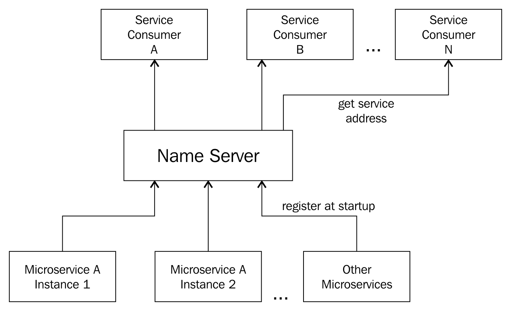

所有微服务（不同的微服务及其所有实例）将在每个微服务启动时向名称服务器注册。当服务使用者想要获取特定微服务的位置时，它会请求名称服务器。

为每个微服务分配一个唯一的微服务 ID。这在注册请求和查找请求中用作密钥。

微服务可以自动注册和注销自己。每当服务使用者使用微服务 ID 查找名称服务器时，它将获得该特定微服务的实例列表。

# 选择权

以下屏幕截图显示了 Spring Initializer（[中服务发现的不同选项 http://start.spring.io](http://start.spring.io) ：


在我们的示例中，我们将使用 Eureka 作为服务发现的名称服务器。

# 实施

在我们的例子中，Eureka 的实施包括以下内容：

1.  设置`Eureka Server`。
2.  正在更新`Microservice A`实例以向`Eureka Server`注册。
3.  正在更新服务使用者微服务以使用在`Eureka Server`注册的微服务 A 实例。

# 设置 Eureka 服务器

我们将使用 Spring 初始化器（[http://start.spring.io](http://start.spring.io) 为 Eureka 服务器建立一个新项目。以下屏幕截图显示了要选择的 GroupId、ArtifactId 和依赖项：

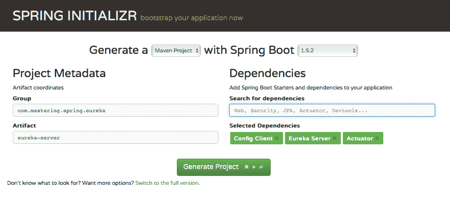

下一步是向`SpringBootApplication`类添加`EnableEurekaServer`注释。以下代码段显示了详细信息：

```
    @SpringBootApplication
    @EnableEurekaServer
    public class EurekaServerApplication {
```

以下代码段显示了`application.properties`中的配置：

```
    server.port = 8761
    eureka.client.registerWithEureka=false
    eureka.client.fetchRegistry=false
```

我们正在将端口`8761`用于`Eureka Naming Server`。启动`EurekaServerApplication`。

`http://localhost:8761`处的 Eureka 仪表板屏幕截图如下所示：

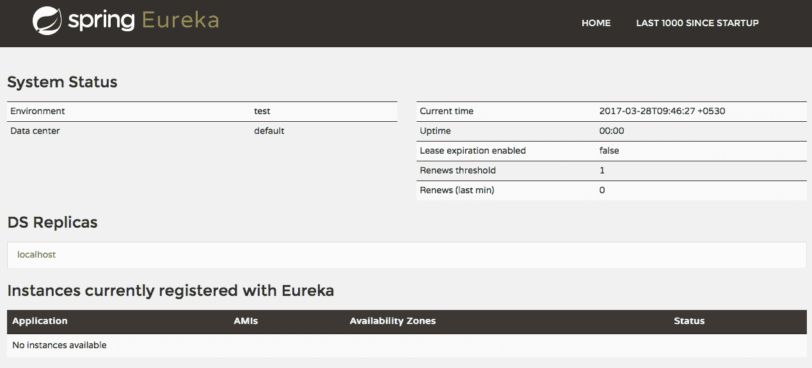

截至目前，没有向 Eureka 注册的申请。下一步，让我们向 Eureka 注册`Microservice A`和其他服务。

# 向 Eureka 注册微服务

要向 Eureka 名称服务器注册任何微服务，我们需要添加对 Eureka Starter 项目的依赖关系。需要将以下依赖项添加到 Microservice A 的`pom.xml`文件中：

```
    <dependency>
      <groupId>org.springframework.cloud</groupId>
      <artifactId>spring-cloud-starter-eureka</artifactId>
    </dependency>
```

下一步是将`EnableDiscoveryClient`添加到`SpringBootApplication`类中。`MicroserviceAApplication`的示例如下所示：

```
    @SpringBootApplication
    @EnableDiscoveryClient
    public class MicroserviceAApplication {
```

SpringCloudCommons 承载了不同 SpringCloud 实现中使用的公共类。`@EnableDiscoveryClient`注释就是一个很好的例子。Spring Cloud Netflix Eureka、Spring Cloud Consor Discovery 和 Spring Cloud Zookeeper Discovery 提供了不同的实现。

我们将在应用配置中配置命名服务器的 URL。对于 Microservice A，应用配置位于本地 Git 存储库文件`git-localconfig-repomicroservice-a.properties`：

```
    eureka.client.serviceUrl.defaultZone=
      http://localhost:8761/eureka
```

当`Microservice A`的两个实例都重新启动时，您将在`Eureka Server`的日志中看到以下消息：

```
    Registered instance MICROSERVICE-A/192.168.1.5:microservice-a
      with status UP (replication=false)
    Registered instance MICROSERVICE-A/192.168.1.5:microservice-a:
      8081 with status UP (replication=false)
```

`http://localhost:8761`的 Eureka 仪表板截图如下：

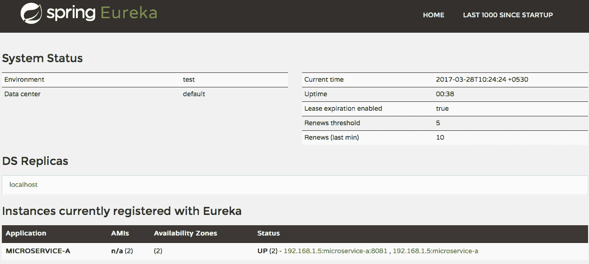

`Microservice A`的两个实例现在在`Eureka Server`注册。可以在`Config Server`上进行类似的更新，以便将其连接到`Eureka Server`。

在下一步中，我们希望连接服务消费者 microservice，从 Eureka 服务器获取 microservice A 实例的 URL。

# 将服务消费者微服务与 Eureka 连接

Eureka starter 项目需要作为依赖项添加到服务消费者微服务的`pom.xml`文件中：

```
    <dependency>
      <groupId>org.springframework.cloud</groupId>
      <artifactId>spring-cloud-starter-eureka</artifactId>
    </dependency>
```

目前，`Microservice A`不同实例的 URL 在服务消费者微服务中进行了硬编码，如`application.properties`所示：

```
    microservice-a.ribbon.listOfServers=
      http://localhost:8080,http://localhost:8081
```

然而，现在我们不想硬编码微服务 URL。我们希望服务消费者微服务从`Eureka Server`获取 URL。我们通过在服务消费者微服务的`application.properties`中配置`Eureka Server`的 URL 来实现这一点。我们将注释掉 Microservice A URL 的硬编码：

```
    #microservice-a.ribbon.listOfServers=
      http://localhost:8080,http://localhost:8081
    eureka.client.serviceUrl.defaultZone=
      http://localhost:8761/eureka
```

接下来我们将在`ServiceConsumerApplication`类上增加`EnableDiscoveryClient`，如下图：

```
    @SpringBootApplication
    @EnableFeignClients("com.mastering.spring.consumer")
    @EnableDiscoveryClient
    public class ServiceConsumerApplication {
```

一旦重新启动服务使用者微服务，您将看到它将在`Eureka Server`中注册自身。以下为`Eureka Server`日志摘录：

```
    Registered instance SERVICE-CONSUMER/192.168.1.5:
      service-consumer:8100 with status UP (replication=false)
```

在`RandomServiceProxy`中，我们已经在外部客户端上为`microservice-a`配置了一个名称，如下所示：

```
    @FeignClient(name ="microservice-a")
    @RibbonClient(name="microservice-a")
    public interface RandomServiceProxy {
```

服务消费者微服务将使用此 ID（微服务 A）查询`Eureka Server`实例。一旦从`Eureka Service`获取 URL，它将调用 Ribbon 选择的服务实例。

当在`http://localhost:8100/add`调用`add`服务时，它返回一个适当的响应。

下面是对所涉及的不同步骤的快速回顾：

1.  当微服务 A 的每个实例启动时，它都会向`Eureka Name Server`注册。
2.  服务消费者微服务请求`Eureka Name Server`微服务 A 实例。
3.  服务使用者微服务使用功能区客户端负载平衡器来决定要调用的微服务的特定实例。
4.  服务使用者 microservice 调用 microservice a 的特定实例。

`Eureka Service`的最大优点是服务消费者微服务现在与微服务 A 分离。每当微服务 A 的新实例出现或现有实例出现故障时，服务消费者微服务不需要重新配置。

# API 网关

微服务有许多交叉关注点：

*   **认证、授权和安全**：我们如何确保微服务消费者是他们声称的那样？我们如何确保消费者有权使用微服务？
*   **速率限制**：消费者可能有不同种类的 API 计划，每个计划有不同的限制（微服务调用次数）。我们如何对特定消费者实施限制？
*   **动态路由**：特定情况（如微服务关闭）可能需要动态路由。
*   **服务聚合**：手机的 UI 需求与桌面不同。一些微服务架构具有针对特定设备定制的服务聚合器。
*   **容错**：如何确保一个微服务的故障不会导致整个系统崩溃？

当微服务彼此直接对话时，这些问题必须由单个微服务解决。这种体系结构可能很难维护，因为每个微服务可能以不同的方式处理这些问题。

最常见的解决方案之一是使用 API 网关。微服务之间的所有服务调用都应该通过 API 网关。API 网关通常为微服务提供以下功能：

*   认证和安全
*   速率限制
*   洞察和监测
*   动态路由和静态响应处理
*   减载
*   来自多个服务的响应的聚合

# 用 Zuul 实现客户端负载平衡

Zuul 是 SpringCloudNetflix 项目的一部分。它是一个 API 网关服务，提供动态路由、监视、筛选、安全等功能。

将 Zuul 实现为 API 网关涉及以下内容：

1.  设置新的 Zuul API 网关服务器。
2.  配置服务使用者以使用 Zuul API 网关。

# 设置新的 Zuul API 网关服务器

我们将使用 Spring 初始化器（[http://start.spring.io](http://start.spring.io) 为 Zuul API 网关新建一个项目。以下屏幕截图显示了要选择的 GroupId、ArtifactId 和依赖项：

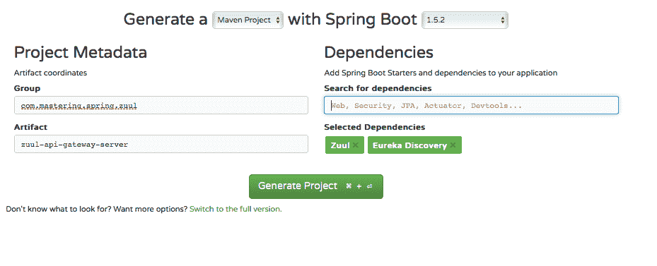

下一步是在 SpringBoot应用上启用 Zuul 代理。这是通过在`ZuulApiGatewayServerApplication`类上添加`@EnableZuulProxy`注释来完成的。以下代码段显示了详细信息：

```
    @EnableZuulProxy
    @EnableDiscoveryClient
    @SpringBootApplication
    public class ZuulApiGatewayServerApplication {
```

我们将在端口`8765`上运行 Zuul 代理。以下代码段显示了`application.properties`中需要的配置：

```
    spring.application.name=zuul-api-gateway
    server.port=8765
    eureka.client.serviceUrl.defaultZone=http://localhost:8761/eureka
```

我们正在为 Zuul 代理配置端口，并将其连接到 Eureka 名称服务器。

# Zuul 自定义过滤器

Zuul 提供了创建自定义过滤器的选项，以实现典型的 API 网关功能，如身份验证、安全性和跟踪。在本例中，我们将创建一个简单的日志过滤器来记录每个请求。以下代码段显示了详细信息：

```
    @Component
    public class SimpleLoggingFilter extends ZuulFilter {
      private static Logger log = 
        LoggerFactory.getLogger(SimpleLoggingFilter.class);
      @Override
      public String filterType() {
        return "pre";
      }
      @Override
      public int filterOrder() {
        return 1;
      }
      @Override
      public boolean shouldFilter() {
        return true;
      }
      @Override
      public Object run() {
        RequestContext context = RequestContext.getCurrentContext();
        HttpServletRequest httpRequest = context.getRequest();
        log.info(String.format("Request Method : %s n URL: %s", 
        httpRequest.getMethod(),
        httpRequest.getRequestURL().toString()));
        return null;
      }
    }
```

需要注意的几个重要事项如下：

*   `SimpleLoggingFilter extends ZuulFilter`：`ZuulFilter`是为 Zuul 创建过滤器的基本抽象类。任何过滤器都应实现此处列出的四种方法。
*   `public String filterType()`：可能返回值为`"pre"`用于预路由筛选，`"route"`用于路由到原点，`"post"`用于后路由筛选，`"error"`用于错误处理。在本例中，我们希望在执行请求之前进行筛选。我们返回一个值`"pre"`。
*   `public int filterOrder()`：定义过滤器的优先级。
*   `public boolean shouldFilter()`：如果只在一定条件下执行过滤，可以在这里执行逻辑。如果希望始终执行筛选器，请返回`true`。
*   `public Object run()`：实现过滤器逻辑的方法。在我们的示例中，我们将记录请求方法和请求的 URL。

当我们通过启动`ZuulApiGatewayServerApplication`作为 Java 应用启动 Zuul 服务器时，您将在`Eureka Name Server`中看到以下日志：

```
    Registered instance ZUUL-API-GATEWAY/192.168.1.5:zuul-api-
      gateway:8765 with status UP (replication=false)
```

这表明`Zuul API gateway`已启动并运行。`Zuul API gateway`也在`Eureka Server`注册。这允许微服务消费者与名称服务器对话，以获取有关`Zuul API gateway`的详细信息。

下图显示了位于`http://localhost:8761`的 Eureka 仪表板。您可以看到，`Microservice A`、`service consumer`和`Zuul API Gateway`的实例现在已注册到`Eureka Server`：

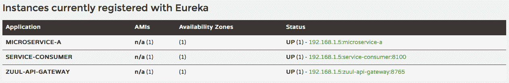

以下是`Zuul API gateway`日志的摘录：

```
    Mapped URL path [/microservice-a/**] onto handler of type [
    class org.springframework.cloud.netflix.zuul.web.ZuulController]
    Mapped URL path [/service-consumer/**] onto handler of type [
    class org.springframework.cloud.netflix.zuul.web.ZuulController]
```

默认情况下，Microservice A 和服务使用者 Microservice 中的所有服务都由 Zuul 启用反向代理。

# 通过 Zuul 调用微服务

现在让我们通过服务代理调用`random service`。随机微服务的直接 URL 为`http://localhost:8080/random`。这是由应用名为`microservice-a`的微服务 A 公开的。

通过`Zuul API Gateway`调用服务的 URL 结构为`http://localhost:{port}/{microservice-application-name}/{service-uri}`。所以，`random service`的`Zuul API Gateway`URL 是`http://localhost:8765/microservice-a/random`。当您通过 API 网关调用`random service`时，您会得到如下所示的响应。响应与直接调用随机服务时通常得到的响应类似：

```
    [73,671,339,354,211]
```

以下是`Zuul Api Gateway`日志的摘录。您可以看到我们在`Zuul API Gateway`中创建的`SimpleLoggingFilter`是针对请求执行的：

```
    c.m.s.z.filters.pre.SimpleLoggingFilter : Request Method : GET
    URL: http://localhost:8765/microservice-a/random
```

`add`服务由服务使用者公开，其应用名为服务使用者，服务 URI 为`/add`。因此，通过 API 网关执行`add`服务的 URL 为`http://localhost:8765/service-consumer/add`。服务的响应如下所示。该响应与直接调用`add`服务时通常得到的响应类似：

```
    2488
```

以下是`Zuul API Gateway`日志的摘录。您可以看到初始的`add`服务调用正在通过 API 网关进行：

```
    2017-03-28 14:05:17.514 INFO 83147 --- [nio-8765-exec-1] 
    c.m.s.z.filters.pre.SimpleLoggingFilter : Request Method : GET
    URL: http://localhost:8765/service-consumer/add
```

`add`服务在`Microservice A`上调用`random service`。当添加服务的初始调用通过 API 网关时，从添加服务（服务消费者微服务）到`random service`（微服务 A）的调用不会通过 API 网关路由。在理想情况下，我们希望所有通信都通过 API 网关进行。

在下一步中，让来自服务消费者微服务的请求也通过 API 网关。

# 配置服务使用者以使用 Zuul API 网关

下面的代码显示了`RandomServiceProxy`的现有配置，用于在`Microservice A`上调用`random service`。`@FeignClient`注释中的 name 属性配置为使用 Microservice A 的应用名称。请求映射使用`/random`URI：

```
    @FeignClient(name ="microservice-a")
    @RibbonClient(name="microservice-a")
    public interface RandomServiceProxy {
    @RequestMapping(value = "/random", method = RequestMethod.GET)
      public List<Integer> getRandomNumbers();
    }
```

现在，我们希望调用通过 API 网关。我们需要在请求映射中使用 API 网关的应用名和新 URI`random service`。下面的代码片段显示了更新后的`RandomServiceProxy`类：

```
    @FeignClient(name="zuul-api-gateway")
    //@FeignClient(name ="microservice-a")
    @RibbonClient(name="microservice-a")
    public interface RandomServiceProxy {
      @RequestMapping(value = "/microservice-a/random", 
      method = RequestMethod.GET)
      //@RequestMapping(value = "/random", method = RequestMethod.GET)
      public List<Integer> getRandomNumbers();
    }
```

当我们在`http://localhost:8765/service-consumer/add`调用 add 服务时，我们会看到典型的响应：

```
    2254
```

然而，现在我们将看到更多的事情发生在`Zuul API gateway`。以下是`Zuul API gateway`日志的摘录。您可以看到，服务使用者上的初始添加服务调用以及`Microservice A`上的`random service`调用现在正在通过 API 网关路由：

```
2017-03-28 14:10:16.093 INFO 83147 --- [nio-8765-exec-4] c.m.s.z.filters.pre.SimpleLoggingFilter : Request Method : GET
URL: http://localhost:8765/service-consumer/add
2017-03-28 14:10:16.685 INFO 83147 --- [nio-8765-exec-5] c.m.s.z.filters.pre.SimpleLoggingFilter : Request Method : GET
URL: http://192.168.1.5:8765/microservice-a/random
```

我们在`Zuul API Gateway`上看到了一个简单日志过滤器的基本实现。类似的方法可用于实现其他横切关注点的过滤器。

# 分布式跟踪

在典型的微服务架构中，涉及到许多组件。以下列出了其中的一些：

*   不同的微服务
*   API 网关
*   命名服务器
*   配置服务器

一个典型的呼叫可能涉及四个或五个以上的组件。以下是要问的重要问题：

*   我们如何调试问题？
*   我们如何才能找出特定问题的根本原因？

典型的解决方案是使用仪表板进行集中式日志记录。将所有 microservice 日志整合到一个位置，并在其顶部提供一个仪表板。

# 分布式跟踪选项

以下屏幕截图显示了 Spring Initializer 网站上的分布式跟踪选项：


在本例中，我们将使用 SpringCloudSleuth 和 ZipkinServer 的组合来实现分布式跟踪。

# 实现 springcloudsleuth 和 Zipkin

**Spring Cloud Sleuth**提供了跨不同微服务组件唯一跟踪服务调用的功能。**Zipkin**是一个分布式跟踪系统，用于收集解决微服务延迟问题所需的数据。我们将结合 Spring Cloud Sleuth 和 Zipkin 来实现分布式跟踪。

以下是所涉及的步骤：

1.  将微服务 A、API 网关和服务消费者与 Spring Cloud Sleuth 集成。
2.  设置 Zipkin 分布式跟踪服务器。
3.  将微服务 A、API 网关和服务消费者与 Zipkin 集成。

# 将微服务组件与 Spring Cloud Sleuth 集成

当我们在服务使用者上调用 add 服务时，它将通过 API 网关调用 Microservice。为了能够跨不同组件跟踪服务调用，我们需要为跨组件的请求流分配一些独特的内容。

Spring Cloud Sleuth 使用名为**span**的概念，提供了跨不同组件跟踪服务调用的选项。每个跨度都有一个唯一的 64 位 ID。该唯一 ID 可用于跨组件跟踪调用。

以下代码段显示了对`spring-cloud-starter-sleuth`的依赖关系：

```
    <dependency>
      <groupId>org.springframework.cloud</groupId>
      <artifactId>spring-cloud-starter-sleuth</artifactId>
    </dependency>
```

我们需要将前面对 Spring Cloud Sleuth 的依赖添加到以下三个项目中：

*   微服务
*   服务消费者
*   Zuul API 网关服务器

我们将从跨微服务跟踪所有服务请求开始。为了能够跟踪所有请求，我们需要配置一个`AlwaysSampler`bean，如以下代码段所示：

```
    @Bean
    public AlwaysSampler defaultSampler() {
      return new AlwaysSampler();
    }
```

`AlwaysSampler`bean 需要在以下微服务应用类中配置：

*   `MicroserviceAApplication`
*   `ServiceConsumerApplication`
*   `ZuulApiGatewayServerApplication`

当我们在`http://localhost:8765/service-consumer/add`调用`add`服务时，我们会看到典型的响应：

```
    1748
```

但是，您将开始在日志条目中看到更多详细信息。服务消费者微服务日志中的一个简单条目如下所示：

```
2017-03-28 20:53:45.582 INFO [service-consumer,d8866b38c3a4d69c,d8866b38c3a4d69c,true] 89416 --- [l-api-gateway-5] c.netflix.loadbalancer.BaseLoadBalancer : Client:zuul-api-gateway instantiated a LoadBalancer:DynamicServerListLoadBalancer:{NFLoadBalancer:name=zuul-api-gateway,current list of Servers=[],Load balancer stats=Zone stats: {},Server stats: []}ServerList:null
```

`[service-consumer,d8866b38c3a4d69c,d8866b38c3a4d69c,true]`：第一个值`service-consumer`为应用名称。关键部分是第二个值--`d8866b38c3a4d69c`。这是可用于跨其他 microservice 组件跟踪此请求的值。

以下是`service consumer`日志中的一些其他条目：

```
2017-03-28 20:53:45.593 INFO [service-consumer,d8866b38c3a4d69c,d8866b38c3a4d69c,true] 89416 --- [l-api-gateway-5] c.n.l.DynamicServerListLoadBalancer : Using serverListUpdater PollingServerListUpdater
 2017-03-28 20:53:45.597 INFO [service-consumer,d8866b38c3a4d69c,d8866b38c3a4d69c,true] 89416 --- [l-api-gateway-5] c.netflix.config.ChainedDynamicProperty : Flipping property: zuul-api-gateway.ribbon.ActiveConnectionsLimit to use NEXT property: niws.loadbalancer.availabilityFilteringRule.activeConnectionsLimit = 2147483647
2017-03-28 20:53:45.599 INFO [service-consumer,d8866b38c3a4d69c,d8866b38c3a4d69c,true] 89416 --- [l-api-gateway-5] c.n.l.DynamicServerListLoadBalancer : DynamicServerListLoadBalancer for client zuul-api-gateway initialized: DynamicServerListLoadBalancer:{NFLoadBalancer:name=zuul-api-gateway,current list of Servers=[192.168.1.5:8765],Load balancer stats=Zone stats: {defaultzone=[Zone:defaultzone; Instance count:1; Active connections count: 0; Circuit breaker tripped count: 0; Active connections per server: 0.0;]
 [service-consumer,d8866b38c3a4d69c,d8866b38c3a4d69c,true] 89416 --- [nio-8100-exec-1] c.m.s.c.service.NumberAdderController : Returning 1748
```

以下是`Microservice A`日志的摘录：

```
[microservice-a,d8866b38c3a4d69c,89d03889ebb02bee,true] 89404 --- [nio-8080-exec-8] c.m.s.c.c.RandomNumberController : Returning [425, 55, 51, 751, 466]
```

以下是`Zuul API Gateway`日志的摘录：

```
[zuul-api-gateway,d8866b38c3a4d69c,89d03889ebb02bee,true] 89397 --- [nio-8765-exec-8] c.m.s.z.filters.pre.SimpleLoggingFilter : Request Method : GET
URL: http://192.168.1.5:8765/microservice-a/random
```

正如您在前面的日志摘录中所看到的，我们可以使用日志中的第二个值（称为 span ID）跨 microservice 组件跟踪服务调用。在此示例中，跨度 ID 为`d8866b38c3a4d69c`。

然而，这需要搜索所有微服务组件的日志。一种选择是使用类似于**麋鹿**（**Elasticsearch**、**Logstash**和**Kibana**堆栈的东西实现集中式日志。在下一步中，我们将采用更简单的方法创建 Zipkin 分布式跟踪服务。

# 设置 Zipkin 分布式跟踪服务器

我们将使用 Spring 初始化器（[http://start.spring.io](http://start.spring.io) 建立一个新项目。以下屏幕截图显示了要选择的 GroupId、ArtifactId 和依赖项：


依赖项包括以下内容：

*   **Zipkin 流**：配置 Zipkin 服务器有多个选项。在本例中，我们将通过创建一个独立的服务监听事件并将信息存储在内存中来保持简单。
*   **Zipkin UI**：提供具有搜索功能的仪表板。
*   **流兔子**：用于将 Zipkin 流与 RabbitMQ 服务绑定。

在生产中，您可能希望有一个更强健的基础架构。一种选择是将永久数据存储连接到 Zipkin 流服务器。

接下来，我们将向`ZipkinDistributedTracingServerApplication`类添加`@EnableZipkinServer`注释，以启用 Zipkin 服务器的自动配置。以下代码段显示了详细信息：

```
    @EnableZipkinServer
    @SpringBootApplication
    public class ZipkinDistributedTracingServerApplication {
```

我们将使用端口`9411`来运行跟踪服务器。以下代码段显示了需要在`application.properties`文件中添加的配置：

```
    spring.application.name=zipkin-distributed-tracing-server
    server.port=9411
```

您可以在`http://localhost:9411/`启动 Zipkin UI 仪表板。下面是一个截图。没有显示任何数据，因为没有任何微服务连接到 Zipkin：

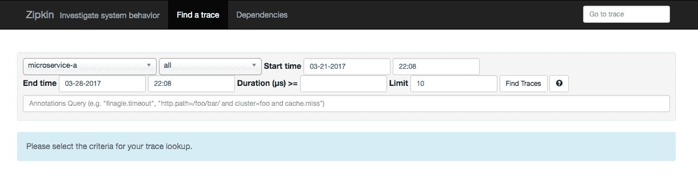

# 将微服务组件与 Zipkin 集成

我们需要连接所有要跟踪的微服务组件`Zipkin server`。以下是我们将从以下组件开始的列表：

*   微服务
*   服务消费者
*   Zuul API 网关服务器

我们需要做的就是将对`spring-cloud-sleuth-zipkin`和`spring-cloud-starter-bus-amqp`的依赖项添加到前面项目的`pom.xml`文件中：

```
    <dependency>
      <groupId>org.springframework.cloud</groupId>
      <artifactId>spring-cloud-sleuth-zipkin</artifactId>
    </dependency>
    <dependency>
      <groupId>org.springframework.cloud</groupId>
      <artifactId>spring-cloud-starter-bus-amqp</artifactId>
    </dependency>
```

继续并在`http://localhost:8100/add`执行`add`服务。现在可以在 Zipkin 仪表板上查看详细信息。以下屏幕截图显示了一些详细信息：

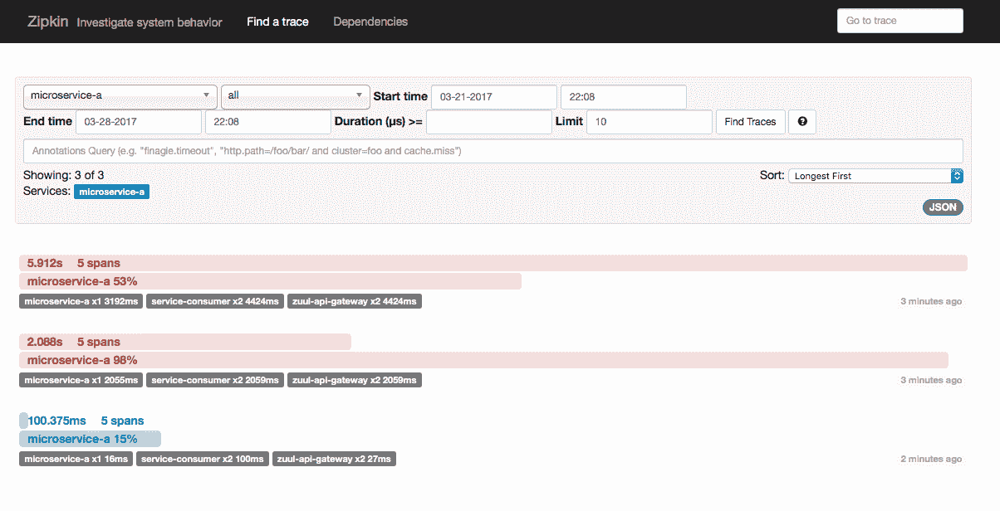

前两行显示失败的请求。第三行显示成功请求的详细信息。我们可以通过单击成功的行进一步深入研究。以下屏幕截图显示了显示的详细信息：


每一项服务都被压抑。您可以通过点击服务栏进一步深入了解。以下屏幕截图显示了显示的详细信息：

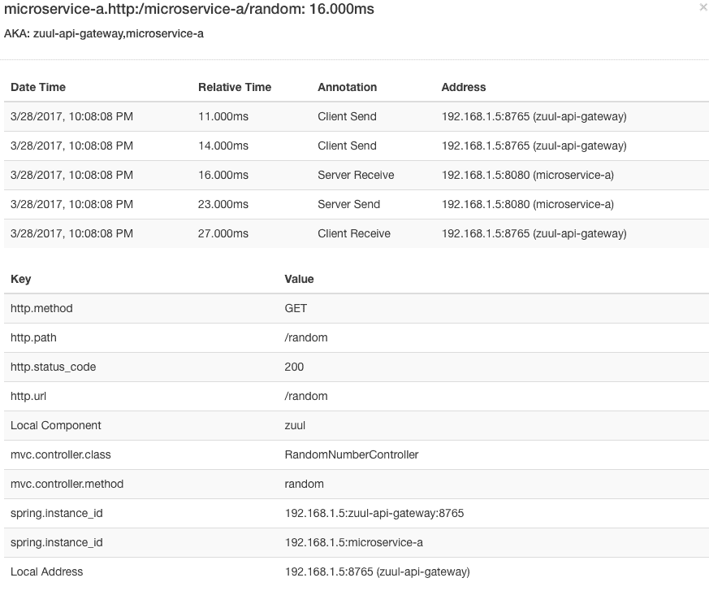

在本节中，我们为微服务添加了分布式跟踪。我们现在将能够直观地跟踪我们的微服务所发生的一切。这将使跟踪和调试问题变得容易。

# Hystrix-容错

微服务架构是由许多微服务组件构建的。如果一个微服务坏了怎么办？是否所有依赖的微服务都会失败并导致整个系统崩溃？或者，是否会优雅地处理错误，并为用户提供降级的最低功能？这些问题决定了微服务架构的成功。

微服务架构应该具有弹性，能够优雅地处理服务错误。Hystrix 为微服务提供容错功能。

# 实施

我们将把 Hystrix 添加到我们的服务消费者微服务中，并增强 add 服务，以便在微服务 a 关闭时返回基本响应。

我们将首先将 Hystrix Starter 添加到服务消费者微服务的`pom.xml`文件中。以下代码段显示了依赖项的详细信息：

```
    <dependency>
      <groupId>org.springframework.cloud</groupId>
      <artifactId>spring-cloud-starter-hystrix</artifactId>
    </dependency>
```

接下来，我们将通过向`ServiceConsumerApplication`类添加`@EnableHystrix`注释来启用 Hystrix 自动配置。以下代码段显示了详细信息：

```
    @SpringBootApplication
    @EnableFeignClients("com.mastering.spring.consumer")
    @EnableHystrix
    @EnableDiscoveryClient
    public class ServiceConsumerApplication {
```

`NumberAdderController`公开具有请求映射`/add`的服务。它使用`RandomServiceProxy`获取随机数。如果这项服务失败怎么办？Hystrix 提供了一个后备方案。下面的代码片段显示了如何向请求映射添加回退方法。我们需要做的就是在`fallbackMethod`属性中添加`@HystrixCommand`注释，定义回退方法的名称——在本例中为`getDefaultResponse`：

```
    @HystrixCommand(fallbackMethod = "getDefaultResponse")
    @RequestMapping("/add")
    public Long add() {
      //Logic of add() method 
    }
```

接下来，我们使用与`add()`方法相同的返回类型定义`getDefaultResponse()`方法。它返回默认的硬编码值：

```
    public Long getDefaultResponse() {
      return 10000L;
     }
```

让我们关闭微服务 A 并调用`http://localhost:8100/add`。您将得到以下响应：

```
    10000
```

当`Microservice A`失败时，服务消费者微服务优雅地处理它，并提供减少的功能。

# 总结

SpringCloud 使向微服务添加云原生功能变得容易。在本章中，我们研究了开发云本地应用的一些重要模式，并使用各种 SpringCloud项目实现了它们。

重要的是要记住，开发云本地应用的领域仍处于初始阶段——在最初几年。它需要更多的时间来成熟。预计未来几年模式和框架会有一些变化。

在下一章中，我们将把注意力转移到 Spring 数据流上。云上的典型用例包括实时数据分析和数据管道。这些用例涉及多个微服务之间的数据流。Spring 数据流为分布式流和数据管道提供了模式和最佳实践。