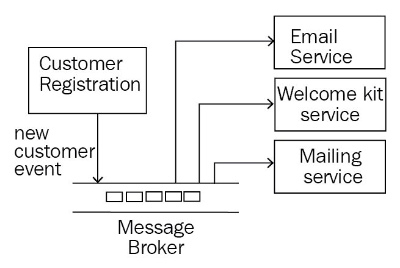
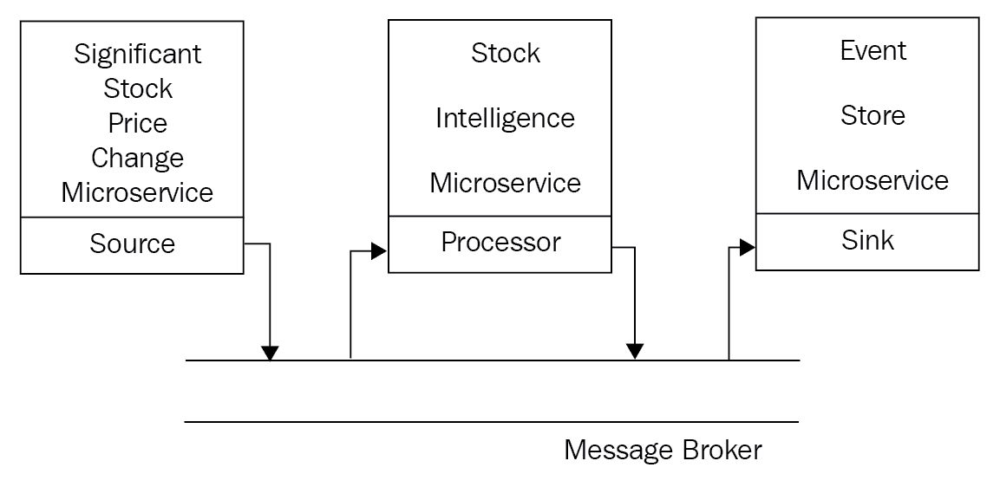
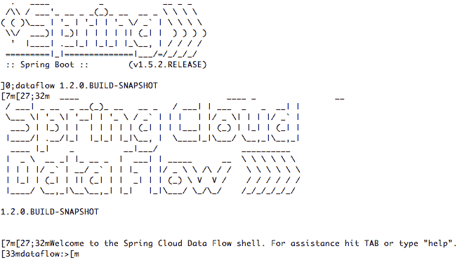
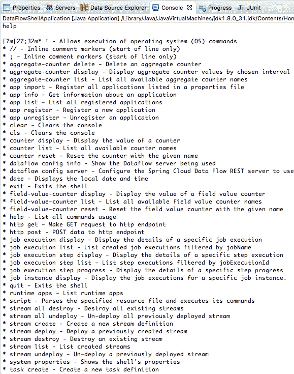
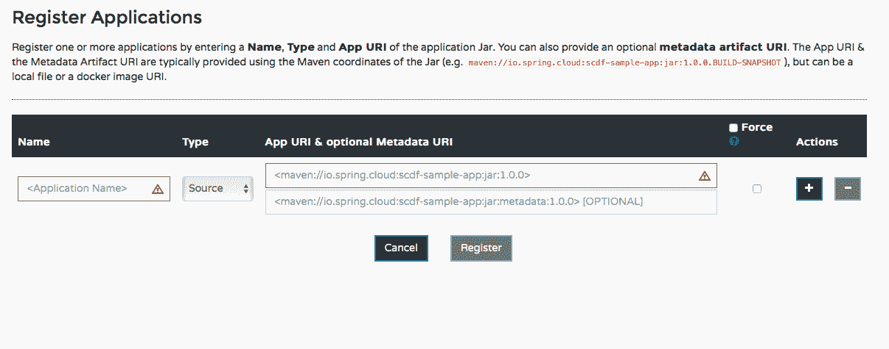
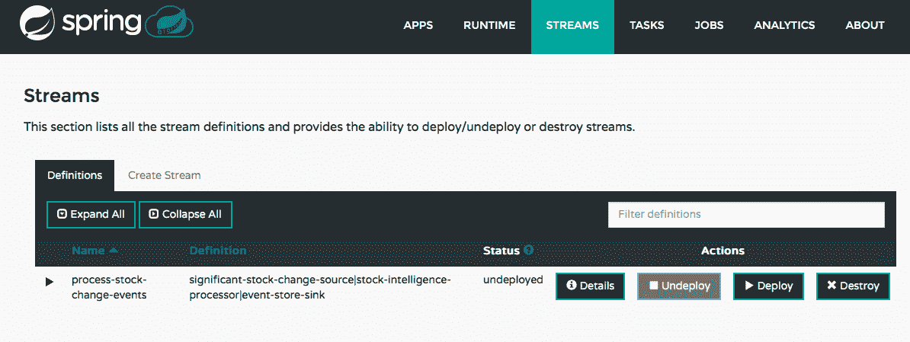
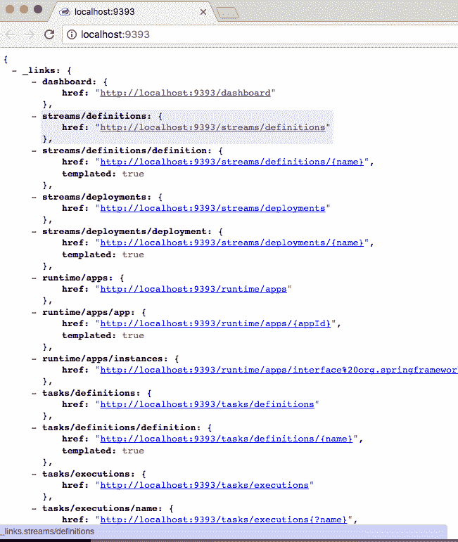

# 十、SpringCloud 数据流

Spring 数据流将微服务体系结构引入到典型的数据流和事件流场景中。我们将在本章后面讨论更多关于这些场景的内容。在其他 Spring 项目（如 SpringCloud Stream、SpringIntegration 和 SpringBoot）的基础上，SpringData Flow 使得使用基于消息的集成来定义和扩展涉及数据和事件流的用例变得非常容易。

在本章中，我们将讨论以下主题：

*   为什么我们需要异步通信？
*   什么是 SpringCloud 溪？它是如何建立在 Spring 集成之上的？
*   为什么我们需要 Spring 数据流？
*   您需要了解 Spring 数据流中的哪些重要概念？
*   Spring 数据流有用的用例有哪些？

我们还将实现一个简单的事件流场景，其中三个微服务充当源（生成事件的应用）、处理器和接收器（使用事件的应用）。我们将使用 SpringCloudStream 实现微服务，并使用 SpringCloud 数据流通过 MessageBroker 在它们之间建立连接。

# 基于消息的异步通信

集成应用时有两个选项：

*   **同步**：服务使用者调用服务提供者并等待响应。
*   **异步**：服务使用者通过将消息放在消息代理上调用服务提供者，但不等待响应。

我们在*[第五章](10.html)中用 Spring Boot 构建的服务，用 Spring Boot 构建微服务，*（`random`服务，`add`服务）就是同步集成的例子。这些是通过 HTTP 公开的典型 web 服务。服务使用者调用服务并等待响应。下一次呼叫仅在上一次服务呼叫完成时进行。

这种方法的一个重要缺点是期望服务提供者始终可用。如果服务提供者停机，或者由于某种原因，服务执行失败，服务使用者将需要再次重新执行服务。

另一种方法是使用基于消息的异步通信。服务使用者将消息放在消息代理上。服务提供者监听消息代理，一旦消息可用，它就会处理它。

这里的一个优点是，即使服务提供商停机一段时间，只要它恢复，它也可以在 MessageBroker 上处理消息。服务提供商不需要一直可用。虽然存在滞后的可能性，但数据最终将是一致的。

下图显示了基于异步消息的通信示例：


异步通信提高可靠性的场景有两种：

*   如果服务提供程序关闭，则消息将在 MessageBroker 中排队。当服务提供商备份时，它将处理这些消息。因此，即使服务提供商停机，消息也不会丢失。
*   如果处理消息时出错，服务提供商会将消息放入错误通道。分析并修复错误后，可以将消息从错误通道移动到输入通道，并排队等待重新处理。

需要注意的重要一点是，在上述两种情况下，如果服务提供者停机或消息处理失败，服务使用者不需要担心。服务消费者发送了一条消息并忘记了它。消息传递体系结构确保消息最终被成功处理。

基于消息的异步通信通常用于事件流和数据流：

*   **事件流**：这涉及基于事件的处理逻辑。例如，新客户事件、股票价格变化事件或货币变化事件。下游应用将在 MessageBroker 上侦听事件并对其作出反应。
*   **数据流**：这涉及通过多个应用增强的数据，最终存储到数据存储中。

在功能上，数据流体系结构之间交换的消息内容不同于事件流体系结构。然而，从技术上讲，这只是从一个系统发送到另一个系统的另一条消息。在本章中，我们将不区分事件流和数据流。SpringCloud 数据流可以处理所有这些流——尽管名称中只有数据流。我们交替使用事件流、数据流或消息流来表示不同应用之间的消息流。

# 异步通信的复杂性

虽然前面的示例是两个应用之间的简单通信，但实际应用中的典型流可能要复杂得多。

下图显示了一个涉及跨三个不同应用的消息流的示例场景。源应用生成事件。处理器应用处理事件并生成另一条消息，该消息将由接收器应用处理：


另一个示例场景涉及由多个应用使用的事件。例如，当客户注册时，我们希望向他们发送电子邮件、欢迎工具包和邮件。此场景的简单消息传递体系结构如下图所示：



要实现上述场景，需要执行许多不同的步骤：

1.  配置消息代理。
2.  在 MessageBroker 上创建不同的通道。
3.  编写应用代码以连接到 MessageBroker 上的特定通道。
4.  在应用中安装必要的绑定以连接到消息代理。
5.  设置应用和 MessageBroker 之间的连接。
6.  构建和部署应用。

考虑一个场景，其中流程中的一些应用必须处理大量的消息。我们需要根据负载创建此类应用的多个实例。实现的复杂性是多重的。这些是 SpringCloudDataFlow 和 SpringCloudStream 旨在解决的挑战。

在下一节中，我们将看一看不同的 Spring 项目——SpringCloud 流（构建在 Spring 集成之上）和 SpringCloud 数据流如何使我们能够在很少配置的情况下进行基于消息的集成。

# 用于异步消息的 Spring 项目

在本节中，我们将研究 Spring 提供的不同项目，以支持应用之间基于消息的通信。我们将从 Spring 集成开始，然后继续讨论支持基于消息的集成的项目，即使是在云上——SpringCloud 流和 SpringCloud 数据流。

# Spring 集成

Spring 集成有助于通过消息代理无缝集成微服务。它允许程序员关注业务逻辑，并控制框架的技术基础架构（使用什么消息格式？如何连接到 MessageBroker？）。Spring 集成通过定义良好的接口和消息适配器提供各种配置选项。Spring 集成网站（[https://projects.spring.io/spring-integration/](https://projects.spring.io/spring-integration/) ：

Extends the Spring programming model to support the well-known Enterprise Integration Patterns. Spring Integration enables lightweight messaging within Spring-based applications and supports integration with external systems via declarative adapters. Those adapters provide a higher-level of abstraction over Spring's support for remoting, messaging, and scheduling. Spring Integration's primary goal is to provide a simple model for building enterprise integration solutions while maintaining the separation of concerns that is essential for producing maintainable, testable code.

Spring Integration 提供的功能包括：

*   企业集成模式的简单实现
*   来自多个服务的响应的聚合
*   从服务中筛选结果
*   服务消息转换
*   多协议支持--HTTP、FTP/SFTP、TCP/UDP、JMS
*   支持不同风格的 Web 服务（SOAP 和 REST）
*   支持多个消息代理，例如 RabbitMQ

在上一章中，我们使用 SpringCloud 使我们的微服务云成为本地的——部署在云中并利用云部署的所有好处。

然而，使用 Spring 集成构建的应用，特别是那些与消息代理交互的应用，需要大量配置才能部署到云中。这使他们无法利用云的典型优势，例如自动缩放。

我们希望扩展 SpringIntegration 提供的功能，并使其在云上可用。我们希望我们的微服务云实例的新实例能够自动与消息代理集成。我们希望能够自动扩展我们的微服务云实例，而无需手动配置。这就是 SpringCloud 流和 SpringCloud 数据流的用武之地。

# SpringCloud 流

SpringCloudStream 是为云构建消息驱动微服务的首选框架。
Spring Cloud Stream 允许程序员专注于围绕事件处理的业务逻辑构建微服务，将此处列出的基础设施问题留给框架：

*   MessageBroker 配置和通道创建
*   消息的特定于 MessageBroker 的转换
*   创建绑定以连接到 message broker

springcloudstream 与微服务架构完美契合。事件处理或数据流的用例中所需的典型微服务可以通过清晰的关注点分离来设计。单个微服务可以处理业务逻辑，定义输入/输出通道，并将基础设施问题留给框架处理。

典型的流应用涉及事件的创建、事件的处理以及数据存储。Spring Cloud Stream 提供了三种简单的应用来支持典型的流：

*   **来源**：来源是事件的创建者，例如触发股价变动事件的应用。
*   **处理器**：处理器消耗偶数，即处理一条消息，围绕它进行一些处理，并使用结果创建一个事件。
*   **接收器**：接收器消耗事件。它侦听消息代理并将事件存储到持久数据存储。

SpringCloudStream 用于在数据流中创建单个微服务。SpringCloudStream 微服务定义业务逻辑和连接点、输入和/或输出。SpringCloud 数据流有助于定义流，即连接不同的应用。

# SpringCloud 数据流

SpringCloud 数据流有助于在使用 SpringCloudStream 创建的不同类型的微服务之间建立消息流。

基于流行的开源项目，**Spring XD**简化了数据管道和工作流的创建——特别是对于大数据用例。然而，SpringXD 在适应与数据管道相关的新需求（例如，金丝雀部署和分布式跟踪）方面面临挑战。SpringXD 体系结构基于依赖于多个外围设备的运行时。这使得调整集群的大小成为一项具有挑战性的工作。SpringXD 现在改名为 SpringCloud 数据流。SpringCloud 数据流的体系结构基于可组合的微服务应用。

SpringCloud 数据流的重要特性如下：

*   配置流，即数据或事件如何从一个应用流向另一个应用。流 DSL 用于定义应用之间的流。
*   在应用和 MessageBroker 之间建立连接。
*   围绕应用和流提供分析。
*   将流中定义的应用部署到目标运行时。
*   支持多目标运行时。几乎所有流行的云平台都受到支持。
*   在云上扩展应用。
*   创建和调用任务。

有时，术语可能会有点混乱。流是流的另一个术语。重要的是要记住，SpringCloudStream 实际上并没有定义整个流。它只帮助创建整个流中涉及的一个微服务。正如我们将在下一节中看到的，流实际上是使用 SpringCloud 数据流中的流 DSL 定义的。

# SpringCloud 流

SpringCloudStream 用于创建流中涉及的单个微服务，并定义到消息代理的连接点。
春雨云流是在两个重要的春雨项目之上建造的：

*   **Spring Boot**：用于创建生产就绪的微服务
*   **Spring 集成**：支持微服务通过消息代理进行通信

Spring 云流的一些重要特征如下：

*   将微服务连接到消息代理的最低配置。
*   支持多种消息代理——RabbitMQ、Kafka、Redis 和 GemFire。
*   对消息持久性的支持——如果服务关闭，它可以在备份后开始处理消息。
*   对消费群体的支持——在负载较重的情况下，您需要同一微服务的多个实例。您可以将所有这些 microservice 实例分组到单个使用者组下，以便仅由一个可用实例拾取消息。
*   对分区的支持——在某些情况下，您可能希望确保由同一实例处理一组特定的消息。分区允许您配置条件，以标识要由同一分区实例处理的消息。

# SpringCloud 流架构

下图显示了一个典型的 SpringCloudStream 微服务的架构。源只有一个输入通道，处理器有输入和输出通道，而接收器只有一个输出通道：


应用声明他们想要的连接类型——输入和/或输出。SpringCloudStream 将建立通过 MessageBroker 连接应用所需的所有功能。

Spring Cloud Stream 将执行以下操作：

*   将输入和/或输出通道注入应用
*   通过特定于 message=broker 的绑定器与 messagebroker 建立连接

绑定器为 SpringCloud 流应用带来了可配置性。字符串云流应用仅声明通道。部署团队可以在运行时配置通道连接到的 MessageBroker（Kafka 或 RabbitMQ）。SpringCloudStream 使用自动配置来检测类路径上可用的绑定器。要连接到不同的 MessageBroker，我们需要做的就是更改项目的依赖关系。另一个选项是在类路径中包含多个绑定，并选择一个在运行时使用。

# 事件处理-股票交易示例

让我们想象一个场景。股票交易者对他/她投资的股票的重大股价变化感兴趣。下图显示了使用 Spring Cloud Stream 构建的此类应用的简单架构：



需要注意的重要事项如下：

*   **重大股价变动微服务**：每当在交易所上市的任何股票的价格发生重大变动时，该服务就会在 message broker 上触发一个事件。这是**源**应用。
*   **股票智能微服务**：监听券商关于股价变动事件的消息。当出现新消息时，它会根据库存检查库存，并将用户当前持有量的信息添加到消息中，并将另一条消息放在消息代理上。这是**处理器**应用。
*   **事件存储微服务**：在消息代理上监听投资股票警报的股价变化。当有新消息时，它会将其存储在数据存储中。这是**接收器**应用。

上述体系结构使我们能够灵活地增强系统，而无需进行重大更改：

*   E-mail-microservice 和 SMS-microservice 在消息代理上侦听投资股票警报上的股票价格变化，并发送电子邮件/SMS 警报。
*   股票交易者可能希望对他们没有投资的其他股票进行重大调整。股票智能微服务可以进一步增强。

正如我们前面讨论的，SpringCloudStream 帮助我们构建流的基本构建块，即微服务。我们将使用 SpringCloudStream 创建三个微服务。稍后我们将使用这三个微服务并创建一个流，即使用 SpringCloud 数据流在应用之间的流。

在下一节中，我们将首先使用 SpringCloudStream 创建微服务。在开始使用源、处理器和接收流应用之前，我们将设置一个简单的模型项目：

# 股票交易模型实例

`StockPriceChangeEvent`类包含股票的股票代码、股票的旧价格和股票的新价格：

```java
    public class StockPriceChangeEvent {
      private final String stockTicker;
      private final BigDecimal oldPrice;
      private final BigDecimal newPrice;
      //Setter, Getters and toString()
    }
```

`StockPriceChangeEventWithHoldings`类扩展了`StockPriceChangeEvent`。它还有一个附加属性--`holdings`。`holdings`变量用于存储交易员当前拥有的股票数量：

```
    public class StockPriceChangeEventWithHoldings 
    extends StockPriceChangeEvent {
      private Integer holdings;
      //Setter, Getters and toString()
    }
```

`StockTicker`枚举存储应用支持的股票列表：

```
    public enum StockTicker {
      GOOGLE, FACEBOOK, TWITTER, IBM, MICROSOFT
    }
```

# 源应用

源应用将是股票价格变化事件的生产者。它将定义一个输出通道并将一条消息放在消息代理上。

让我们使用 Spring 初始化器（[https://start.spring.io](https://start.spring.io) 设置应用。提供此处列出的详细信息，然后单击生成项目：

*   组：`com.mastering.spring.cloud.data.flow`
*   神器：`significant-stock-change-source`
*   依赖项：`Stream Rabbit`

下面列出了`pom.xml`文件中的一些重要依赖项：

```
    <dependency>
      <groupId>org.springframework.cloud</groupId>
      <artifactId>spring-cloud-starter-stream-rabbit</artifactId>
    </dependency>
```

使用以下代码更新`SpringBootApplication`文件：

```
    @EnableBinding(Source.class)
    @SpringBootApplication
    public class SignificantStockChangeSourceApplication {
      private static Logger logger = LoggerFactory.getLogger 
     (SignificantStockChangeSourceApplication.class);
     // psvm - main method
     @Bean
     @InboundChannelAdapter(value = Source.OUTPUT, 
     poller = @Poller(fixedDelay = "60000", maxMessagesPerPoll = "1"))
     public MessageSource<StockPriceChangeEvent>
     stockPriceChangeEvent()     {
       StockTicker[] tickers = StockTicker.values();
       String randomStockTicker = 
       tickers[ThreadLocalRandom.current().nextInt(tickers.length)] 
      .name();
       return () - > {
        StockPriceChangeEvent event = new         
        StockPriceChangeEvent(randomStockTicker,
        new BigDecimal(getRandomNumber(10, 20)), new   
        BigDecimal(getRandomNumber(10, 20)));
        logger.info("sending " + event);
        return MessageBuilder.withPayload(event).build();
        };
      }
     private int getRandomNumber(int min, int max) {
       return ThreadLocalRandom.current().nextInt(min, max + 1);
     }
    }
```

需要注意的几个重要事项如下：

*   `@EnableBinding(Source.class)`：`EnableBinding`注释允许将类与其所需的相应通道绑定—输入和/或输出。source 类用于向一个输出通道注册云流。
*   `@Bean @InboundChannelAdapter(value = Source.OUTPUT, poller = @Poller(fixedDelay = "60000", maxMessagesPerPoll = "1"))`：`InboundChannelAdapter`注释用于指示此方法可以创建一条消息，将其放到 MessageBroker 上。value 属性用于指示要放置消息的通道的名称。`Poller`用于调度消息的生成。在本例中，我们使用`fixedDelay`每分钟生成一次消息（60*1000 毫秒）。
*   `private int getRandomNumber(int min, int max)`：此方法用于在作为参数传递的范围内创建一个随机数。

`Source`接口定义了一个输出通道，如下代码所示：

```
    public abstract interface 
    org.springframework.cloud.stream.messaging.Source {
      public static final java.lang.String OUTPUT = "output";
      @org.springframework.cloud.stream.
      annotation.Output(value="output")
      public abstract org.springframework.
      messaging.MessageChannel   output();
     }
```

# 加工机

处理器应用将从 MessageBroker 上的输入通道拾取消息。它将处理消息并将其发送到消息代理的输出通道上。在此特定示例中，处理涉及将当前持有的位置添加到消息中。

让我们使用 Spring 初始化器（[https://start.spring.io](https://start.spring.io) 设置应用。提供此处列出的详细信息，然后单击生成项目：

*   组：`com.mastering.spring.cloud.data.flow`
*   神器：`stock-intelligence-processor`
*   依赖项：`Stream Rabbit`

使用以下代码更新`SpringBootApplication`文件：

```
    @EnableBinding(Processor.class)@SpringBootApplication
    public class StockIntelligenceProcessorApplication {
      private static Logger logger = 
      LoggerFactory.getLogger
      (StockIntelligenceProcessorApplication.class);
      private static Map < StockTicker, Integer > holdings =
        getHoldingsFromDatabase();
        private static Map < StockTicker,
        Integer > getHoldingsFromDatabase() {
          final Map < StockTicker,
          Integer > holdings = new HashMap < >();
          holdings.put(StockTicker.FACEBOOK, 10);
          holdings.put(StockTicker.GOOGLE, 0);
          holdings.put(StockTicker.IBM, 15);
          holdings.put(StockTicker.MICROSOFT, 30);
          holdings.put(StockTicker.TWITTER, 50);
          return holdings;
        }
        @Transformer(inputChannel = Processor.INPUT,
        outputChannel = Processor.OUTPUT)
        public Object addOurInventory(StockPriceChangeEvent event) {
          logger.info("started processing event " + event);
          Integer holding =  holdings.get(
            StockTicker.valueOf(event.getStockTicker()));
          StockPriceChangeEventWithHoldings eventWithHoldings =
            new StockPriceChangeEventWithHoldings(event, holding);
          logger.info("ended processing eventWithHoldings " 
            + eventWithHoldings);
          return eventWithHoldings;
        }
        public static void main(String[] args) {
          SpringApplication.run(
            StockIntelligenceProcessorApplication.class,args);
        }
    }
```

需要注意的几个重要事项如下：

*   `@EnableBinding(Processor.class)`：`EnableBinding`注释允许将类与其所需的相应通道绑定—输入和/或输出。`Processor`类用于注册具有一个输入通道和一个输出通道的云流。
*   `private static Map<StockTicker, Integer> getHoldingsFromDatabase()`：此方法处理一条消息，更新持有量，并返回一个新对象，作为新消息放入输出通道。
*   `@Transformer(inputChannel = Processor.INPUT, outputChannel = Processor.OUTPUT)`：`Transformer`注释用于表示能够将一种消息格式转换/增强为另一种消息格式的方法。

如下面的代码所示，`Processor`类扩展了`Source`和`Sink`类。因此，它定义了输出和输入通道：

```
   public abstract interface 
   org.springframework.cloud.stream.messaging.Processor extends 
   org.springframework.cloud.stream.messaging.Source, 
   org.springframework.cloud.stream.messaging.Sink {
  }
```

# 下沉

Sink 将从 MessageBroker 中拾取消息并对其进行处理。在本例中，我们将选取消息并记录它。接收器将仅定义输入通道。

让我们使用 Spring 初始化器（[https://start.spring.io](https://start.spring.io) 设置应用。提供此处列出的详细信息，然后单击生成项目：

*   组：`com.mastering.spring.cloud.data.flow`
*   神器：`event-store-sink`
*   依赖项：`Stream Rabbit`

使用以下代码更新`SpringBootApplication`文件：

```
    @EnableBinding(Sink.class)@SpringBootApplication
    public class EventStoreSinkApplication {
      private static Logger logger = 
      LoggerFactory.getLogger(EventStoreSinkApplication.class);
      @StreamListener(Sink.INPUT)
      public void loggerSink(StockPriceChangeEventWithHoldings event) {
      logger.info("Received: " + event);
    }
    public static void main(String[] args) {
      SpringApplication.run(EventStoreSinkApplication.class, args);
    }
   }
```

需要注意的几个重要事项如下：

*   `@EnableBinding(Sink.class)`：`EnableBinding`注释允许将类与其所需的相应通道绑定—输入和/或输出。`Sink`类用于向一个输入通道注册云流。
*   `public void loggerSink(StockPriceChangeEventWithHoldings event)`：此方法通常包含将消息存储到数据存储的逻辑。在本例中，我们将消息打印到日志中。
*   `@StreamListener(Sink.INPUT)`：`StreamListener`注释用于在通道上侦听传入消息。在此示例中，`StreamListener`被配置为在默认输入通道上侦听。

如下图所示，`Sink`接口定义了一个输入通道：

```
    public abstract interface   
    org.springframework.cloud.stream.messaging.Sink {
      public static final java.lang.String INPUT = "input";
      @org.springframework.cloud.stream.annotation.Input(value="input")
      public abstract org.springframework.messaging.SubscribableChannel 
      input();
    }
```

现在我们已经准备好了三个流应用，我们需要将它们连接起来。在下一节中，我们将介绍 SpringCloud 数据流如何帮助连接不同的流。

# SpringCloud 数据流

SpringCloud 数据流有助于在使用 SpringCloudStream 创建的不同类型的微服务之间建立消息流。通过 SpringCloudDataFlow 服务器部署的所有微服务都应该是定义适当通道的 SpringBoot 微服务。

SpringCloudDataFlow 提供了使用 SpringDSL 定义应用和它们之间的流的接口。Spring 数据流服务器理解 DSL 并建立应用之间的流。

通常，这涉及多个步骤：

*   使用应用名称和应用的可部署单元之间的映射从存储库下载应用构件。SpringDataFlowServer 支持 Maven 和 Docker 存储库。
*   将应用部署到目标运行时。
*   在 MessageBroker 上创建通道。
*   在应用和 MessageBroker 通道之间建立连接。

SpringCloudDataFlow 还提供了在需要时扩展相关应用的选项。部署清单将应用映射到目标运行时。部署清单回答的几个问题如下：

*   需要创建多少个应用实例？
*   应用的每个实例需要多少内存？

Data Flow Server 了解部署清单，并根据指定创建目标运行时。SpringCloud 数据流支持多种运行时：

*   云铸造
*   阿帕奇纱线
*   库伯内特斯
*   阿帕奇 Mesos
*   用于开发的本地服务器

我们将在本章的示例中使用本地服务器。

# 高级体系结构

在前面的示例中，我们有三个需要在数据流中连接的微服务。下图显示了使用 SpringCloud 数据流实现解决方案的高层架构：


在上图中，源、接收器和处理器是使用 Spring Cloud Stream 创建的 Spring Boot 微服务：

*   源微服务定义了一个输出通道
*   处理器微服务定义输入和输出通道
*   接收器微服务定义了一个输入通道

# 实现 SpringCloud 数据流

实施 SpringCloud 数据流包括五个步骤：

1.  正在设置 SpringCloud 数据流服务器。
2.  设置数据流外壳程序项目。
3.  配置应用。
4.  配置流。
5.  顺流而下。

# 设置 SpringCloud 数据流服务器

让我们使用 Spring 初始化器（[https://start.spring.io](https://start.spring.io) 设置应用。提供此处列出的详细信息，然后单击生成项目：

*   组：`com.mastering.spring.cloud.data.flow`
*   神器：`local-data-flow-server`
*   依赖项：`Local Data Flow Server`

下面列出了`pom.xml`文件中的一些重要依赖项：

```
    <dependency>
      <groupId>org.springframework.cloud</groupId>
      <artifactId>spring-cloud-starter-dataflow-server-
      local</artifactId>
    </dependency>
```

使用以下代码更新`SpringBootApplication`文件：

```
    @EnableDataFlowServer
    @SpringBootApplication
    public class LocalDataFlowServerApplication {
      public static void main(String[] args) {
        SpringApplication.run(LocalDataFlowServierApplication.class,
        args);
      }
    }
```

`@EnableDataFlowServer`注释用于激活 SpringCloud 数据流服务器实现。

在运行本地数据流服务器之前，请确保 MessageBroker RabbitMQ 已启动并正在运行。

以下是启动`LocalDataFlowServerApplication`时启动日志的重要摘录：

```
Tomcat initialized with port(s): 9393 (http)
Starting H2 Server with URL: jdbc:h2:tcp://localhost:19092/mem:dataflow
Adding dataflow schema classpath:schema-h2-common.sql for h2 database
Adding dataflow schema classpath:schema-h2-streams.sql for h2 database
Adding dataflow schema classpath:schema-h2-tasks.sql for h2 database
Adding dataflow schema classpath:schema-h2-deployment.sql for h2 database
Executed SQL script from class path resource [schema-h2-common.sql] in 37 ms.
Executed SQL script from class path resource [schema-h2-streams.sql] in 2 ms.
Executed SQL script from class path resource [schema-h2-tasks.sql] in 3 ms.
Executing SQL script from class path resource [schema-h2-deployment.sql]
Executed SQL script from class path resource [schema-h2-deployment.sql] in 3 ms.
Mapped "{[/runtime/apps/{appId}/instances]}" onto public org.springframework.hateoas.PagedResources
Mapped "{[/runtime/apps/{appId}/instances/{instanceId}]}" onto public 
Mapped "{[/streams/definitions/{name}],methods=[DELETE]}" onto public void org.springframework.cloud.dataflow.server.controller.StreamDefinitionController.delete(java.lang.String)
Mapped "{[/streams/definitions],methods=[GET]}" onto public org.springframework.hateoas.PagedResources
Mapped "{[/streams/deployments/{name}],methods=[POST]}" onto public void org.springframework.cloud.dataflow.server.controller.StreamDeploymentController.deploy(java.lang.String,java.util.Map<java.lang.String, java.lang.String>)
Mapped "{[/runtime/apps]}" onto public org.springframework.hateoas.PagedResources<org.springframework.cloud.dataflow.rest.resource.AppStatusResource> org.springframework.cloud.dataflow.server.controller.RuntimeAppsController.list(org.springframework.data.domain.Pageable,org.springframework.data.web.PagedResourcesAssembler<org.springframework.cloud.deployer.spi.app.AppStatus>) throws java.util.concurrent.ExecutionException,java.lang.InterruptedException
Mapped "{[/tasks/executions],methods=[GET]}" onto public org.springframework.hateoas.PagedResources
```

需要注意的几个重要事项如下：

*   SpringCloud 数据流服务器默认端口为`9393`。这可以通过在`application.properties`中指定不同的端口`server.port`来改变。
*   SpringCloudDataFlowServer 使用一个内部模式来存储应用、任务和流的所有配置。在本例中，我们没有配置任何数据库。因此，默认情况下，使用内存中的`H2`数据库。SpringCloudDataFlowServer 支持多种数据库，包括 MySQL 和 Oracle，以存储配置。
*   由于使用了`H2`内存数据库，您可以看到在启动期间设置了不同的模式，并且执行了不同的 SQL 脚本来设置数据。
*   SpringCloudDataFlowServer 围绕其配置、应用、任务和流公开了许多 API。我们将在后面的部分中详细讨论这些 API。

以下截图显示`http://localhost:9393/dashboard`处的 SpringCloud 数据流启动画面：


有不同的选项卡可用于查看和修改应用、流和任务。在下一步中，我们将使用命令行界面——数据流 Shell 来设置应用和流。

# 设置数据流 Shell 项目

Data Flow Shell 提供了使用命令配置 Spring Data Flow Server 中的流和其他内容的选项。

让我们使用 Spring 初始化器（[https://start.spring.io](https://start.spring.io) 设置应用。提供此处列出的详细信息，然后单击生成项目：

*   组：`com.mastering.spring.cloud.data.flow`
*   神器：`data-flow-shell`
*   依赖项：`Data Flow Shell`

下面列出了`pom.xml`文件中的一些重要依赖项：

```
    <dependency>
      <groupId>org.springframework.cloud</groupId>
      <artifactId>spring-cloud-dataflow-shell</artifactId>
    </dependency>
```

使用以下代码更新`SpringBootApplication`文件：

```
    @EnableDataFlowShell
    @SpringBootApplication
    public class DataFlowShellApplication {
      public static void main(String[] args) {
      SpringApplication.run(DataFlowShellApplication.class, args);
     }
    }
```

`@EnableDataFlowShell`注释用于激活 SpringCloud 数据流外壳。

下面的屏幕截图显示了启动 Data Flow Shell 应用时显示的消息。我们可以在命令提示符下键入命令：



您可以尝试使用“help”命令来获取支持的命令列表。以下屏幕截图显示了执行`help`命令时打印的一些命令：



您将看到，当您执行以下任何命令时，您会发现打印的是空列表，因为我们尚未配置这些命令中的任何一个：

*   `app list`
*   `stream list`
*   `task list`
*   `runtime apps`

# 配置应用

在开始配置流之前，我们需要注册构成流的应用。我们要注册三个应用——源、处理器和接收器。

要在 SpringCloud 数据流中注册应用，您需要访问可部署的应用。SpringCloudDataFlow 提供了从 Maven 存储库获取可部署应用的选项。为了保持简单，我们将从本地 Maven 存储库获取应用。

在我们使用 Spring Cloud Stream 创建的所有三个应用上运行`mvn clean install`：

*   `significant-stock-change-source`
*   `stock-intelligence-processor`
*   `event-store-sink`

这将确保所有这些应用都构建并存储在本地 Maven 存储库中。

从 Maven 存储库注册应用的命令语法如下所示：

```
app register —-name {{NAME_THAT_YOU_WANT_TO_GIVE_TO_APP}} --type source --uri maven://{{GROUP_ID}}:{{ARTIFACT_ID}}:jar:{{VERSION}}
```

三个应用的 Maven URI 如下所示：

```
maven://com.mastering.spring.cloud.data.flow:significant-stock-change-source:jar:0.0.1-SNAPSHOT
maven://com.mastering.spring.cloud.data.flow:stock-intelligence-processor:jar:0.0.1-SNAPSHOT
maven://com.mastering.spring.cloud.data.flow:event-store-sink:jar:0.0.1-SNAPSHOT
```

此处列出了创建应用的命令。可以在 Data Flow Shell 应用上执行以下命令：

```
app register --name significant-stock-change-source --type source --uri maven://com.mastering.spring.cloud.data.flow:significant-stock-change-source:jar:0.0.1-SNAPSHOT

app register --name stock-intelligence-processor --type processor --uri maven://com.mastering.spring.cloud.data.flow:stock-intelligence-processor:jar:0.0.1-SNAPSHOT

app register --name event-store-sink --type sink --uri maven://com.mastering.spring.cloud.data.flow:event-store-sink:jar:0.0.1-SNAPSHOT
```

成功注册应用后，您将看到此处显示的消息：

```
Successfully registered application 'source:significant-stock-change-source'

Successfully registered application 'processor:stock-intelligence-processor'

Successfully registered application 'sink:event-store-sink'
```

您还可以在`http://localhost:9393/dashboard`的 Spring Cloud Data Flow Dashboard 上看到注册的应用，如下图所示：


我们还可以使用仪表板注册应用，如以下屏幕截图所示：



# 配置流

流 DSL 可用于配置流——这里展示了一个连接`app1`到`app2`的简单示例。`app1`放在输出通道上的消息将在`app2`的输入通道上接收：

```
app1 | app2
```

我们希望连接这三个应用。以下代码段显示了用于连接上述应用的 DSL 示例：

```
#source | processor | sink

significant-stock-change-source|stock-intelligence-processor|event-store-sink
```

这表明：

*   源的输出通道应链接到处理器的输入通道
*   处理器的输出通道应链接到接收器的输入通道

创建流的整个命令如下所示：

```
stream create --name process-stock-change-events --definition significant-stock-change-source|stock-intelligence-processor|event-store-sink
```

如果成功创建流，则应看到以下输出：

```
Created new stream 'process-stock-change-events'
```

您也可以在`http://localhost:9393/dashboard`的 SpringCloud 数据流面板的 Streams 页签上看到注册的流，如下图所示：



# 部署流

要部署流，我们可以在数据流外壳上执行以下命令：

```
stream deploy --name process-stock-change-events
```

当发送创建流的请求时，您将看到此处显示的消息：

```
Deployment request has been sent for stream 'process-stock-change-events'
```

以下摘录显示了本地数据流服务器日志的摘录：

```
o.s.c.d.spi.local.LocalAppDeployer : deploying app process-stock-change-events.event-store-sink instance 0

Logs will be in /var/folders/y_/x4jdvdkx7w94q5qsh745gzz00000gn/T/spring-cloud-dataflow-3084432375250471462/process-stock-change-events-1492100265496/process-stock-change-events.event-store-sink

o.s.c.d.spi.local.LocalAppDeployer : deploying app process-stock-change-events.stock-intelligence-processor instance 0

Logs will be in /var/folders/y_/x4jdvdkx7w94q5qsh745gzz00000gn/T/spring-cloud-dataflow-3084432375250471462/process-stock-change-events-1492100266448/process-stock-change-events.stock-intelligence-processor

o.s.c.d.spi.local.LocalAppDeployer : deploying app process-stock-change-events.significant-stock-change-source instance 0

Logs will be in /var/folders/y_/x4jdvdkx7w94q5qsh745gzz00000gn/T/spring-cloud-dataflow-3084432375250471462/process-stock-change-events-1492100267242/process-stock-change-events.significant-stock-change-source
```

需要注意的几个重要事项如下：

*   当我们部署流时，SpringCloud 数据流将部署流中的所有应用，并通过 MessageBroker 建立应用之间的连接。应用代码独立于 MessageBroker。与 RabbitMQ 相比，Kafka 具有不同的消息代理设置。SpringCloud 数据流会处理好它。如果要从 RabbitMQ 切换到 Kafka，则不需要更改应用代码。
*   本地数据流服务器日志包含所有应用（源、处理器和接收器）日志的路径。

# 日志消息-设置与消息工厂的连接

下面的代码片段显示了从`Source`、`Transformer`和`Sink`应用中设置 MessageBroker 的相关摘录：

```
#Source Log
CachingConnectionFactory : Created new connection: SimpleConnection@725b3815 [delegate=amqp://guest@127.0.0.1:5672/, localPort= 58373]

#Transformer Log
o.s.i.endpoint.EventDrivenConsumer : Adding {transformer:stockIntelligenceProcessorApplication.addOurInventory.transformer} as a subscriber to the 'input' channel

o.s.integration.channel.DirectChannel : Channel 'application:0.input' has 1 subscriber(s).

o.s.i.endpoint.EventDrivenConsumer : started stockIntelligenceProcessorApplication.addOurInventory.transformer

o.s.i.endpoint.EventDrivenConsumer : Adding {message-handler:inbound.process-stock-change-events.significant-stock-change-source.process-stock-change-events} as a subscriber to the 'bridge.process-stock-change-events.significant-stock-change-source' channel

o.s.i.endpoint.EventDrivenConsumer : started inbound.process-stock-change-events.significant-stock-change-source.process-stock-change-events

#Sink Log

c.s.b.r.p.RabbitExchangeQueueProvisioner : declaring queue for inbound: process-stock-change-events.stock-intelligence-processor.process-stock-change-events, bound to: process-stock-change-events.stock-intelligence-processor

o.s.a.r.c.CachingConnectionFactory : Created new connection: SimpleConnection@3de6223a [delegate=amqp://guest@127.0.0.1:5672/, localPort= 58372]
```

需要注意的几点如下：

*   `Created new connection: SimpleConnection@725b3815 [delegate=amqp://guest@127.0.0.1:5672/, localPort= 58373]`：因为我们在三个应用的类路径中都添加了`spring-cloud-starter-stream-rabbit`，所以使用的消息代理是 RabbitMQ。
*   `Adding {transformer:stockIntelligenceProcessorApplication.addOurInventory.transformer} as a subscriber to the 'input' channel`：与此类似，每个应用的输入和/或输出通道都设置在 MessageBroker 上。源和处理器应用在通道上侦听传入消息。

# 日志消息-事件流

与消息处理相关的摘录如下所示：

```
#Source Log
SignificantStockChangeSourceApplication : sending StockPriceChangeEvent [stockTicker=MICROSOFT, oldPrice=15, newPrice=12]

#Transformer Log
.f.StockIntelligenceProcessorApplication : started processing event StockPriceChangeEvent [stockTicker=MICROSOFT, oldPrice=18, newPrice=20]

.f.StockIntelligenceProcessorApplication : ended processing eventWithHoldings StockPriceChangeEventWithHoldings [holdings=30, toString()=StockPriceChangeEvent [stockTicker=MICROSOFT, oldPrice=18, newPrice=20]]

#Sink Log
c.m.s.c.d.f.EventStoreSinkApplication : Received: StockPriceChangeEventWithHoldings [holdings=30, toString()=StockPriceChangeEvent [stockTicker=MICROSOFT, oldPrice=18, newPrice=20]]
```

源应用发送`StockPriceChangeEvent`。`Transformer`应用接收事件，将保留内容添加到消息中，并创建一个新的`StockPriceChangeEventWithHoldings`事件。接收器应用接收并记录此消息。

# SpringCloud 数据流 RESTAPI

SpringCloudDataFlow 围绕应用、流、任务、作业和度量提供 RESTfulAPI。通过向`http://localhost:9393/`发送`GET`请求，可以获得完整的列表。

以下屏幕截图显示了对`GET`请求的响应：



所有 API 都是不言自明的。让我们看一个向`http://localhost:9393/streams/definitions`发送`GET`请求的示例：

```
{  
  "_embedded":{  
  "streamDefinitionResourceList":[  
         {  
            "name":"process-stock-change-events"
            "dslText":"significant-stock-change-source|stock-
            intelligence-processor|event-store-sink",
            "status":"deployed",
            "statusDescription":"All apps have been successfully
             deployed",
            "_links":{  
               "self":{  
                  "href":"http://localhost:9393/streams/definitions/
                   process-stock-change-events"
               }
            }
         }
      ]
   },
   "_links":{  
      "self":{  
         "href":"http://localhost:9393/streams/definitions"
      }
   },
   "page":{
      "size":20,
      "totalElements":1,
      "totalPages":1,
      "number":0
   }
}
```

需要注意的重要事项如下：

*   API 是 RESTful 的。`_embedded`元素包含请求的数据。`_links`元素包含 HATEOAS 链接。页面元素包含分页信息。
*   `_embedded.streamDefinitionResourceList.dslText`包含流`"significant-stock-change-source|stock-intelligence-processor|event-store-sink"`的定义。
*   `_embedded.streamDefinitionResourceList.status`

# SpringCloud 任务

SpringCloud 数据流还可以用于创建和调度批处理应用。在过去十年中，SpringBatch 一直是开发批处理应用的首选框架。SpringCloud 任务扩展了这一点，并支持在云上执行批处理程序。

让我们使用 Spring 初始化器（[https://start.spring.io](https://start.spring.io) 设置应用。提供此处列出的详细信息，然后单击生成项目：

*   组：`com.mastering.spring.cloud.data.flow`
*   神器：`simple-logging-task`
*   依赖项：`Cloud Task`

使用以下代码更新`SimpleLoggingTaskApplication`类：

```
@SpringBootApplication
@EnableTask

public class SimpleLoggingTaskApplication {

@Bean
public CommandLineRunner commandLineRunner() {
  return strings -> System.out.println(
  "Task execution :" + new SimpleDateFormat().format(new Date()));
  }
public static void main(String[] args) {
  SpringApplication.run(SimpleLoggingTaskApplication.class, args);
  }
}
```

这段代码只是将一个带有当前时间戳的 sysout 放出来。`@EnableTask`注释启用 Spring Boot 应用中的任务功能。

我们可以使用以下命令在数据流外壳上注册任务：

```
app register --name simple-logging-task --type task --uri maven://com.mastering.spring.cloud.data.flow:simple-logging-task:jar:0.0.1-SNAPSHOT
task create --name simple-logging-task-definition --definition "simple-logging-task"
```

这些命令与我们之前创建的用于注册流应用的命令非常相似。我们正在添加一个任务定义，以便能够执行该任务。

可以使用以下命令启动任务：

```
task launch simple-logging-task-definition
```

任务执行也可以在 SpringCloudFlow 仪表板上触发和监控。

# 总结

SpringCloudDataFlow 为数据流和事件流带来了云本地特性。它使在云上创建和部署流变得容易。在本章中，我们介绍了如何使用 SpringCloudStream 设置事件驱动流中的各个应用。我们对使用 SpringCloud 任务创建任务进行了 1000 英尺的观察。我们使用 SpringCloud 数据流来设置流，并执行简单的任务。

在下一章中，我们将开始理解一种构建 web 应用的新方法——反应式风格。我们将理解为什么非阻塞应用被大肆宣传，以及如何使用 springreactive 构建反应式应用。