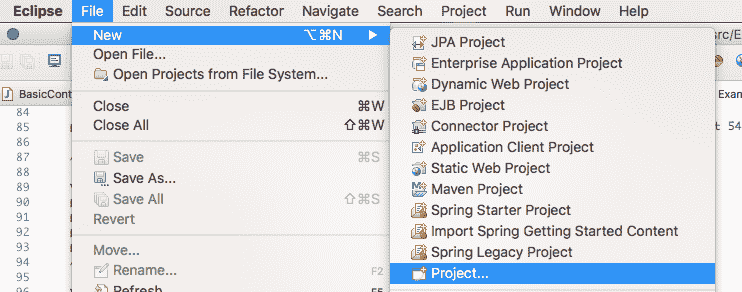
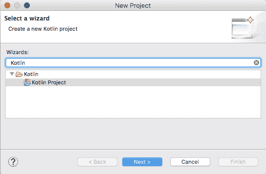
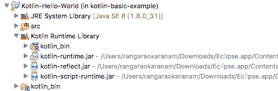
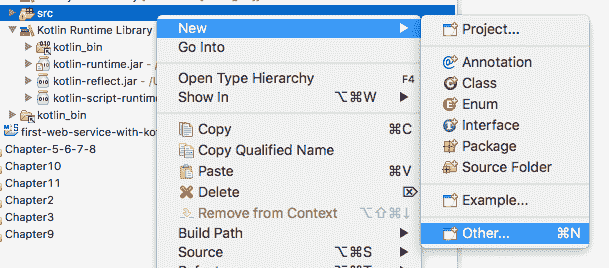
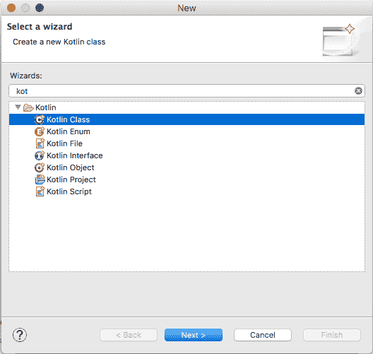
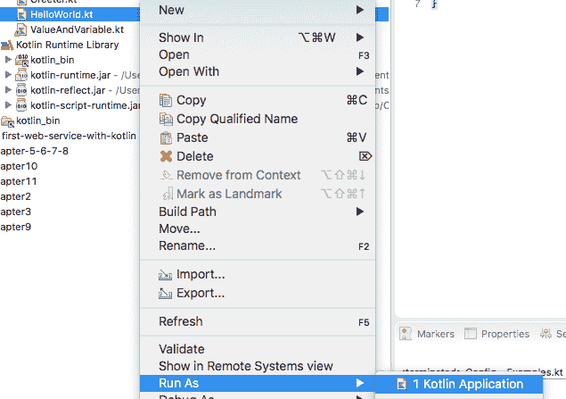
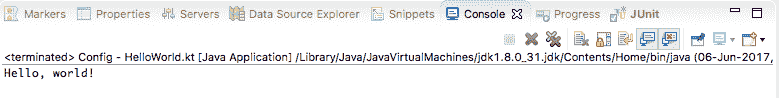
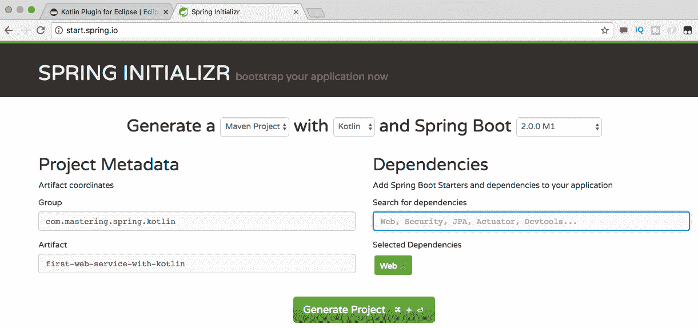
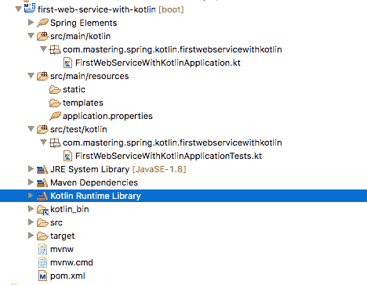
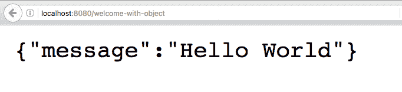

# 十三、Spring 与 Kotlin 的协作

Kotlin 是一种静态类型的 JVM 语言，支持具有表达性、简短性和可读性的代码。SpringFramework 5.0 对 Kotlin 有很好的支持。

在本章中，我们将探讨 Kotlin 的一些重要特性，并学习如何使用 Kotlin 和 Spring Boot 创建基本的 REST 服务。

在本章结束时，您将了解以下内容：

*   Kotlin 是什么？
*   它与 Java 相比如何？
*   如何在 Eclipse 中创建 Kotlin 项目？
*   如何使用 Kotlin 创建 Spring 启动项目？
*   如何使用 Kotlin 实现和单元测试一个简单的 Spring Boot REST 服务？

# Kotlin

Kotlin 是一种开源的静态类型语言，可用于构建在 JVM、Android 和 JavaScript 平台上运行的应用。Kotlin 由 JetBrains 根据 Apache 2.0 许可证开发，源代码可在 GitHub（[上获得 https://github.com/jetbrains/kotlin](https://github.com/jetbrains/kotlin) ）。

下面列出了 Kotlin 首席语言设计师 Andrey Breslav 的几句话。这些有助于我们理解 Kotlin 背后的思维过程：

<q>The primary purpose of Project Kotlin is to create for developers a general-purpose language that can serve as a useful tool that is safe, concise, flexible, and 100 percent Java-compatible.</q>

Kotlin 被设计成一种工业级的面向对象语言，是一种比 Java“更好的语言”，但仍然可以与 Java 代码完全互操作，允许公司逐步从 Java 迁移到 Kotlin。

Kotlin 是 Android 支持的官方语言之一。Kotlin 的官方 Android 开发者页面（[https://developer.android.com/kotlin/index.html](https://developer.android.com/kotlin/index.html) 强调了 Kotlin 迅速受到开发者欢迎的重要原因：

Kotlin 表达力强、简洁、可扩展、功能强大，读写都很有趣。它在可空性和不变性方面具有出色的安全特性，这与我们的投资相一致，使 Android 应用在默认情况下保持健康和性能。最重要的是，它可以与我们现有的 Android 语言和运行时进行互操作。

关于 Kotlin 的一些重要事项包括：

*   与 Java 完全兼容。您可以从 Kotlin 调用 Java 代码，反之亦然。
*   简明易读的语言。Kotlin 常见问题解答（[http://kotlinlang.org/docs/reference/faq.html](http://kotlinlang.org/docs/reference/faq.html) 估计代码行数会减少 40%。
*   支持函数式和面向对象编程。
*   IntelliJ IDEA、Android Studio、Eclipse 和 NetBeans 是支持 Kotlin 的 IDE。虽然对 Java 的支持不如对 Java 的支持好，但它正在日臻完善。
*   所有主要的构建工具——Gradle、Maven 和 Ant——都支持构建 Kotlin 项目。

# Kotlin 与 Java

Java 由 Sun Microsystems 的 James Gosling 开发，并于 1995 年发布。20 多年来，它一直是一种流行语言。

Java 流行的一个重要原因是 Java 平台，包括 Java 虚拟机（JVM）。Java 平台为 Java 语言提供了安全性和可移植性。在过去几年中出现了许多旨在利用 Java 平台优势的语言。它们编译成字节码，可以在 JVM 上运行。这些语言包括以下框架：

*   Clojure
*   棒极了
*   斯卡拉
*   JRuby
*   杰顿

Kotlin 旨在解决 Java 语言中的一些重要问题，并提供一个简洁的替代方案。与 Java 语言的一些重要区别如下。

# 变量与类型推断

Kotlin 根据分配给它的值推断变量的类型。在以下示例中，`intVariable`被分配了一种类型`Int`：

```java
    //Type Inference
    var intVariable = 10
```

由于 Kotlin 是类型安全的，如果未注释，以下代码段将导致编译错误：

```
    //intVariable = "String" 
    //If uncommented -> Type mismatch: 
    //inferred type is String but Int was expected
```

# 变量和不变性

通常，与所有其他编程语言一样，变量的值可以更改。以下代码段显示了一个示例：

```
    var variable = 5
    variable = 6 //You can change value
```

但是，如果使用`val`（而不是`var`）定义变量，则该变量是不可变的。无法更改变量的值。这类似于 Java 中的`final`变量。考虑下面的代码：

```
    val immutable = 6
    //immutable = 7 //Val cannot be reassigned
```

# 类型系统

在 Kotlin，一切都是一个对象。没有原始变量。

以下是重要的数字类型：

*   双精度--64 位
*   浮点--32 位
*   长--64 位
*   Int--32 位
*   短--16 位
*   字节——8 位

与 Java 不同，Kotlin 不将字符视为数字类型。对字符的任何数字操作都将导致编译错误。考虑下面的代码：

```
    var char = 'c'
    //Operator '==' cannot be applied to 'Char' and 'Int'
    //if(char==1) print (char);
    Null safety
```

Java 程序员非常熟悉`java.lang.NullPointerException`。对引用 null 的对象变量执行的任何操作都将抛出`NullPointerException`。

Kotlin 的类型系统旨在消除`NullPointerException`。普通变量不能为 null。如果未注释，则不会编译以下代码段：

```
    var string: String = "abc"
    //string = null //Compilation Error
```

为了能够在变量中存储 null，需要使用特殊声明。也就是说，类型后面跟着 a？。例如，考虑下面的公式 T0：

```
    var nullableString: String? = "abc"
    nullableString = null
```

一旦变量被声明为可空，则只允许安全（？）或非空断言（！！）调用。直接引用将导致编译 e

```
    //Compilation Error
    //print(nullableString.length)
    if (nullableString != null) {
      print(nullableString.length)
     }
    print(nullableString?.length)
```

# 功能

在 Kotlin 中，函数是使用`fun`关键字声明的。以下代码段显示了一个示例：

```
    fun helloBasic(name: String): String {
      return "Hello, $name!"
    }
```

函数参数在函数名后的括号中指定。`name`是一个类型为`String`的参数。函数返回类型在参数后指定。函数的返回类型为`String`。

以下代码行显示了对`helloBasic`函数的调用：

```
    println(helloBasic("foo")) // => Hello, foo!
```

Kotlin 还允许 n。以下代码行显示了一个示例：

```
    println(helloBasic(name = "bar"))
```

函数参数可以有一个 defa

```
    fun helloWithDefaultValue(name: String = "World"): String {
      return "Hello, $name!"
    }
```

以下代码行显示了在不指定任何参数的情况下调用`helloWithDefaultValue`函数。使用 name 参数的默认值：

```
    println(helloWithDefaultValue()) //Hello, World
```

如果函数只有一个表达式，则可以在一行上定义它。`helloWithOneExpression`函数是`helloWithDefaultValue`函数的简化版本。返回类型是从该值推断出来的

```
    fun helloWithOneExpression(name: String = "world") 
    = "Hello, $name!"
```

返回 void 且只有一个表达式的函数也可以在一行上定义。以下代码段显示了一个示例：

```
    fun printHello(name: String = "world") 
    = println("Hello, $name!")
```

# 阵列

数组由 Kotlin 中的类`Array`表示。下面的代码片段显示了`Array`类中的一些重要属性和方法：

```
    class Array<T> private constructor() {
      val size: Int
      operator fun get(index: Int): T
      operator fun set(index: Int, value: T): Unit
      operator fun iterator(): Iterator<T>
      // ...
     }
```

可以使用`intArrayOf`fu 创建一个数组

```
    val intArray = intArrayOf(1, 2, 10)
```

以下代码段显示了可以在阵列上执行的一些重要操作：

```
    println(intArray[0])//1
    println(intArray.get(0))//1
    println(intArray.all { it > 5 }) //false
    println(intArray.any { it > 5 }) //true
    println(intArray.asList())//[1, 2, 10]
    println(intArray.max())//10
    println(intArray.min())//1
```

# 收藏

Kotlin 具有初始化集合的简单功能。以下代码行显示了初始化列表的示例：

```
    val countries = listOf("India", "China", "USA")
```

以下代码段显示了可以在列表上执行的一些重要操作：

```
    println(countries.size)//3
    println(countries.first())//India
    println(countries.last())//USA
    println(countries[2])//USA
```

使用`listOf`创建的列表在 Kotlin 中是不可变的。为了能够更改列表的内容，`mutableListOf`函数需要

```
    //countries.add("China") //Not allowed
    val mutableContries = mutableListOf("India", "China", "USA")
    mutableContries.add("China")
```

`mapOf`函数用于初始化映射，如下代码段所示：

```
    val characterOccurances = 
    mapOf("a" to 1, "h" to 1, "p" to 2, "y" to 1)//happy
    println(characterOccurances)//{a=1, h=1, p=2, y=1}
```

以下代码行显示检索特定键的值：

```
    println(characterOccurances["p"])//2
```

映射可以在循环中分解为其键值成分。以下代码行显示了详细信息：

```
    for ((key, value) in characterOccurances) {
      println("$key -> $value")
    }
```

# 没有 c

Java 中的已检查异常必须处理或重试。这会导致大量不必要的代码。下面的示例展示了`try catch`块如何处理`new FileReader("pathToFile") - throws FileNotFoundException`和`reader.read() - throws IOException`抛出的已检查异常：

```
    public void openSomeFileInJava(){
      try {
            FileReader reader = new FileReader("pathToFile");
            int i=0;
            while(i != -1){
              i = reader.read();
              //Do something with what was read
            }
      reader.close();
      } catch (FileNotFoundException e) {
           //Exception handling code
        } catch (IOException e) {
        //Exception handling code
      }
    }
```

Kotlin 没有任何已检查的异常。如果他们想处理异常，这取决于客户机代码。在客户端上不强制执行异常处理。

# 数据类

通常，我们将创建许多 bean 类来保存数据。Kotlin 引入了数据类的概念。以下代码块显示数据类的声明：

```
    data class Address(val line1: String,
    val line2: String,
    val zipCode: Int,
    val state: String,
    val country: String)
```

Kotlin 为数据类提供了一个主构造函数`equals()`、`hashcode()`和一些其他实用方法。以下代码行显示了使用构造函数创建对象的过程：

```
    val myAddress = Address("234, Some Apartments", 
    "River Valley Street", 54123, "NJ", "USA")
```

Kotlin 还提供了一个`toString`：

```
    println(myAddress)
    //Address(line1=234, Some Apartments, line2=River Valley 
    //Street, zipCode=54123, state=NJ, country=USA)
```

`copy`功能可用于复制（克隆）现有数据类对象。以下代码段显示了详细信息：

```
    val myFriendsAddress = myAddress.copy(line1 = "245, Some Apartments")
    println(myFriendsAddress)
    //Address(line1=245, Some Apartments, line2=River Valley 
    //Street, zipCode=54123, state=NJ, country=USA)
```

数据类的对象可以很容易地被分解。下面的代码行显示了详细信息。`println`使用字符串模板打印值：

```
    val (line1, line2, zipCode, state, country) = myAddress;
```

```
tln("$line1 $line2 $zipCode $state $country"); 
    //234, Some Apartments River Valley Street 54123 NJ USA
```

# 在 Eclipse 中创建 Kotlin 项目

在 Eclipse 中使用 Kotlin 之前，我们需要在 Eclipse 中安装 Kotlin 插件。

# Kotlin 插件

Kotlin 插件可从[安装 https://marketplace.eclipse.org/content/kotlin-plugin-eclipse](https://marketplace.eclipse.org/content/kotlin-plugin-eclipse) 。单击以下屏幕截图中显示的安装按钮：


选择 Kotlin Plugin for 并单击确认按钮，如以下屏幕截图所示：


在安装插件的后续步骤中接受默认值。安装需要一点时间。插件安装完成后重新启动 Eclipse。

# 创建 Kotlin 项目

现在，让我们创建一个新的 Kotlin 项目。在 Eclipse 中，单击文件|新建|项目…，如以下屏幕截图所示：



从列表中选择 Kotlin 项目。



提供`Kotlin-Hello-World`作为项目名称，接受所有默认值，然后单击 Finish。Eclipse 将创建一个新的 Kotlin 项目。

以下屏幕截图显示了典型 Kotlin 项目的结构。`Kotlin Runtime Library`和`JRE System Library`在本项目中均可用。



# 创建 Kotlin 类

要创建新的 Kotlin 类，请右键单击文件夹并选择 new | Other，如以下屏幕截图所示：



选择类，如以下屏幕截图所示：



为您的新 Kotlin 类指定一个名称（`HelloWorld`和一个包（`com.mastering.spring.kotlin.first`。点击 Finish。


创建一个主函数，如以下代码行所示：

```
    fun main(args: Array<String>) {
      println("Hello, world!")
    }
```

# 运行 Kotlin 类

右键点击`HelloWorld.kt`文件，点击 Run as|tlin，如下图所示：



`Hello, World`打印在控制台上，如下图：



# 使用 Kotlin 创建 Spring 启动项目

我们将使用 Spring 初始化器（[http://start.spring.io](http://start.spring.io) 初始化 Kotlin 项目。以下屏幕截图显示了要从中选择的组和 ArtifactId：



以下是需要注意的几个重要事项：

*   选择 Web 作为依赖项
*   选择 Kotlin 作为语言（屏幕截图顶部的第二个下拉列表）
*   单击 GenerateProject 并将下载的项目作为 Maven 项目导入 eclipse

以下屏幕截图显示了生成项目的结构：



以下是一些需要注意的重要事项：

*   `src/main/kotlin`：这是所有 Kotlin 源代码所在的文件夹。这类似于 Java 项目中的`src/main/java`。
*   `src/test/kotlin`：这是所有 Kotlin 测试代码所在的文件夹。这类似于 Java 项目中的`src/test/java`。
*   资源文件夹与典型的 Java 项目相同--`src/main/resources`和`src/test/resources`。
*   使用 Kotlin 运行时库代替 JRE 作为执行环境。

# 依赖项和插件

除了 Java SpringBoot 项目中的正常依赖项之外，`pom.xml`中还有两个额外的依赖项

```
    <dependency>
      <groupId>org.jetbrains.kotlin</groupId>
      <artifactId>kotlin-stdlib-jre8</artifactId>
      <version>${kotlin.version}</version>
    </dependency>

    <dependency>
      <groupId>org.jetbrains.kotlin</groupId>
      <artifactId>kotlin-reflect</artifactId>
      <version>${kotlin.version}</version>
    </dependency>
```

以下是需要注意的几个重要事项：

*   `kotlin-stdlib-jre8`是支持 Java 8 中添加的新 JDK API 的标准库
*   `kotlin-reflect`是在 Java 平台上使用反射特性的运行时组件

除了`spring-boot-maven-plugin`之外，在`pom.xml`中增加了`kotlin-maven-plugin`作为插件。`kotlin-maven-plugin`编译 Kotlin 源代码和模块。此插件配置为在`compile`和`test-compile`阶段使用。以下代码显示了详细信息：

```
    <plugin>
     <artifactId>kotlin-maven-plugin</artifactId>
     <groupId>org.jetbrains.kotlin</groupId>
     <version>${kotlin.version}</version>
     <configuration>
       <compilerPlugins>
         <plugin>spring</plugin>
       </compilerPlugins>
       <jvmTarget>1.8</jvmTarget>
     </configuration>
    <executions>
    <execution>
      <id>compile</id>
      <phase>compile</phase>
      <goals>
        <goal>compile</goal>
      </goals>
    </execution>
    <execution>
      <id>test-compile</id>
      <phase>test-compile</phase>
      <goals>
        <goal>test-compile</goal>
      </goals>
     </execution>
    </executions>
    <dependencies>
      <dependency>
        <groupId>org.jetbrains.kotlin</groupId>
        <artifactId>kotlin-maven-allopen</artifactId>
        <version>${kotlin.version}</version>
       </dependency>
    </dependencies>
   </plugin>
```

# Spring 启动应用类

下面的代码块显示生成的`SpringBootApplication`类`FirstWebServiceWithKotlinApplication`。我们打开该类以使 Spring Boot 能够覆盖它：

```
    @SpringBootApplication
    open class FirstWebServiceWithKotlinApplication
    fun main(args: Array<String>) {
      SpringApplication
      .run(
         FirstWebServiceWithKotlinApplication::class.java,
         *args)
    }
```

以下是一些需要注意的重要事项：

*   包、导入和注释与 Java 类相同。
*   Java 中主函数的声明为`public static void main(String[] args)`。在前面的示例中，我们使用的是 Kotlin 函数语法。Kotlin 没有静态方法。在类之外声明的任何函数都可以调用，而不需要类引用。
*   在 Java 中启动`SpringApplication`是使用`SpringApplication.run(FirstWebServiceWithKotlinApplication.class, args)`完成的。
*   `::`用于获取 Kotlin 类运行时引用。因此，`FirstWebServiceWithKotlinApplication::class`为我们提供了对 Kotlin 类的运行时引用。要获得 Java 类引用，我们需要在引用上使用`.java`属性。因此，在 Kotlin 中，语法是`FirstWebServiceWithKotlinApplication::class.java`。
*   在 Kotlin 中，`*`被称为扩展运算符。它用于将数组传递给接受变量参数的函数。因此，我们将使用`*args`将数组传递给`run`方法。

通过将`FirstWebServiceWithKotlinApplication`作为 Kotlin 应用运行，可以启动该应用。

# Spring 启动应用测试类

下面的代码片段显示了生成的`SpringBootApplicationTest`类`FirstWebServiceWithKotlinApplicationTests`：

```
    @RunWith(SpringRunner::class)
    @SpringBootTest
    class FirstWebServiceWithKotlinApplicationTests {
      @Test
      fun contextLoads() {
      }
    }
```

以下是一些需要注意的重要事项：

*   包、导入和注释与 Java 类相同。
*   `::`用于获取 Kotlin 类运行时引用。与 Java 中的`@RunWith(SpringRunner.class)`相比，Kotlin 代码使用`@RunWith(SpringRunner::class)`。
*   测试类的声明使用 Kotlin 函数语法。

# 使用 Kotlin 实现 REST 服务

我们将首先创建一个返回硬编码字符串的服务。之后，我们将讨论一个返回正确 JSON 响应的示例。我们还将看一个传递路径参数的示例。

# 返回字符串的简单方法

让我们从创建一个返回`welcome`消息的简单 REST 服务开始：

```
    @RestController
    class BasicController {
      @GetMapping("/welcome")
      fun welcome() = "Hello World"
    }
```

类似的 Java 方法如下所示。一个主要区别是我们如何在 Kotlin 中的一行中定义函数--`fun welcome() = "Hello World"`：

```
    @GetMapping("/welcome")
    public String welcome() {
      return "Hello World";
    }
```

如果我们将`FirstWebServiceWithKotlinApplication.kt`作为 Kotlin 应用运行，它将启动嵌入式 Tomcat 容器。我们可以在浏览器中启动 URL（`http://localhost:8080/welcome`），如下图所示：


# 单元测试

让我们快速编写一个单元测试来测试前面的控制器方法：

```
    @RunWith(SpringRunner::class)
    @WebMvcTest(BasicController::class)
    class BasicControllerTest {
      @Autowired
      lateinit var mvc: MockMvc;
      @Test
      fun `GET welcome returns "Hello World"`() {
        mvc.perform(
           MockMvcRequestBuilders.get("/welcome").accept(
           MediaType.APPLICATION_JSON))
           .andExpect(status().isOk())
           .andExpect(content().string(equalTo("Hello World")));
       } 
     }
```

在前面的单元测试中，我们将使用`BasicController`启动一个模拟 MVC 实例。以下是一些需要注意的事项：

*   注释`@RunWith(SpringRunner.class)`和`@WebMvcTest(BasicController::class)`与 Java 类似，只是类引用不同。
*   `@Autowired lateinit var mvc: MockMvc`：这会自动连接可用于发出请求的`MockMvc`bean。声明为非 null 的属性必须在构造函数中初始化。对于通过依赖项注入自动连接的属性，我们可以通过在变量声明中添加`lateinit`来避免空检查。
*   `fun `GET welcome returns "Hello World"`()`：这是 Kotlin 的一大特色。我们给出的不是测试方法的名称，而是测试的描述。这非常棒，因为在理想情况下，测试方法不会从另一个方法调用。
*   `mvc.perform(MockMvcRequestBuilders.get("/welcome").accept(MediaType.APPLICATION_JSON))`：执行对`/welcome`的请求，其接受头值为`application/json`，与 Java 代码类似。
*   `andExpect(status().isOk())`：期望响应状态为`200`（成功）。
*   `andExpect(content().string(equalTo("Hello World")))`：这期望响应的内容等于`"Hello World"`。

# 集成测试

当我们进行集成测试时，我们希望启动带有所有已配置的控制器和 bean 的嵌入式服务器。下面的代码块显示了如何创建简单的集成测试：

```
    @RunWith(SpringRunner::class)
    @SpringBootTest(webEnvironment = SpringBootTest.WebEnvironment.RANDOM_PORT)
    class BasicControllerIT {
      @Autowired
      lateinit var restTemplate: TestRestTemplate
      @Test
      fun `GET welcome returns "Hello World"`() {
        // When
        val body = restTemplate.getForObject("/welcome", 
        String::class.java)
        // Then
        assertThat(body).isEqualTo("Hello World")
      }
    }
```

需要注意的几个重要事项如下：

*   `@RunWith(SpringRunner::class), @SpringBootTest(webEnvironment = SpringBootTest.WebEnvironment.RANDOM_PORT)`：`SpringBootTest`在弹簧`TestContext`上提供附加功能。它支持为完全运行容器和 TestRestTemplate 配置端口（以执行请求）。除了类引用之外，这与 Java 代码类似。
*   `@Autowired lateinit var restTemplate: TestRestTemplate`：`TestRestTemplate`通常用于集成测试。它在`RestTemplate`之上提供了额外的功能，这在测试上下文的集成中特别有用。它不遵循重定向，因此我们可以断言响应位置。`lateinit`允许我们避免自动连接变量的空检查。

# 返回对象的简单 REST 方法

我们将创建一个简单的 POJO`WelcomeBean`，其中包含一个名为 message 的成员字段和一个参数构造函数，如下代码行所示：

```
    data class WelcomeBean(val message: String = "")
```

对应的 Java 类如下所示：

```
    public class WelcomeBean {
      private String message;
      public WelcomeBean(String message) {
        super();
        this.message = message;
      }
      public String getMessage() {
      return message;
     }
   }
```

Kotlin 会自动向数据类添加构造函数和其他实用程序方法。

在前面的方法中，我们返回了一个字符串。让我们创建一个返回正确 JSON 响应的方法。请看以下方法：

```
    @GetMapping("/welcome-with-object")
    fun welcomeWithObject() = WelcomeBean("Hello World")
```

该方法返回一个简单的用`"Hello World"`消息初始化的`WelcomeBean`。

# 执行请求

让我们发送一个测试请求，看看得到了什么响应。以下屏幕截图显示了输出：



`http://localhost:8080/welcome-with-object`URL 的响应如下：

```
    {"message":"Hello World"}
```

# 单元测试

让我们快速编写一个检查 JSON 响应的单元测试，然后将测试添加到`BasicControllerTest`：

```
    @Test
    fun `GET welcome-with-object returns "Hello World"`() {
      mvc.perform(
      MockMvcRequestBuilders.get("/welcome-with-object")
      .accept(MediaType.APPLICATION_JSON))
      .andExpect(status().isOk())
      .andExpect(content().string(
      containsString("Hello World")));
    }
```

此测试与早期的单元测试非常相似，只是我们使用`containsString`检查内容是否包含`"Hello World"`子字符串。

# 集成测试

让我们把注意力转移到编写集成测试上，然后向`BasicControllerIT`添加一个方法，如下面的代码片段所示：

```
    @Test
    fun `GET welcome-with-object returns "Hello World"`() {
      // When
      val body = restTemplate.getForObject("/welcome-with-object",
      WelcomeBean::class.java)
      // Then
     assertThat(body.message, containsString("Hello World"));
   }
```

此方法类似于早期的集成测试，只是我们在`assertThat`方法中断言了一个子字符串。

# 使用路径变量获取方法

让我们把注意力转移到路径变量上。路径变量用于将 URI 中的值绑定到控制器方法上的变量。在以下示例中，我们希望参数化名称，以便使用名称自定义欢迎消息：

```
    @GetMapping("/welcome-with-parameter/name/{name}")
    fun welcomeWithParameter(@PathVariable name: String) = 
    WelcomeBean("Hello World, $name")
```

以下是一些需要注意的重要事项：

*   `@GetMapping("/welcome-with-parameter/name/{name}")`：`{name}`表示该值为变量。一个 URI 中可以有多个变量模板。
*   `welcomeWithParameter(@PathVariable String name)`：`@PathVariable`确保 URI 中的变量值绑定到变量名。
*   `fun welcomeWithParameter(@PathVariable name: String) = WelcomeBean("Hello World, $name")`：我们使用 Kotlin 单表达式函数声明直接返回创建的`WelcomeBean`。`"Hello World, $name"`使用 Kotlin 字符串模板。`$name`将被路径变量名的值替换。

# 执行请求

让我们发送一个测试请求，看看得到了什么响应。以下屏幕截图显示了响应：


`http://localhost:8080/welcome-with-parameter/name/Buddy`URL 的响应如下：

```
    {"message":"Hello World, Buddy!"}
```

正如预期的那样，URI 中的名称用于在响应中形成消息。

# 单元测试

让我们为前面的方法快速编写一个单元测试。我们希望传递一个名称作为 URI 的一部分，并检查响应是否包含该名称。下面的代码显示了我们如何做到这一点：

```
    @Test
    fun `GET welcome-with-parameter returns "Hello World, Buddy"`() {
      mvc.perform(
      MockMvcRequestBuilders.get(
      "/welcome-with-parameter/name/Buddy")
     .accept(MediaType.APPLICATION_JSON))
     .andExpect(status().isOk())
     .andExpect(content().string(
     containsString("Hello World, Buddy")));
    }
```

需要注意的几个重要事项如下：

*   `MockMvcRequestBuilders.get("/welcome-with-parameter/name/Buddy")`：与 URI 中的变量模板匹配。我们将传入名称。
*   `.andExpect(content().string(containsString("Hello World, Buddy")))`：我们希望响应包含带有名称的消息。

# 集成测试

上述方法的集成测试非常简单。请看下面的`test`方法：

```
   @Test
   fun `GET welcome-with-parameter returns "Hello World"`() {
     // When
     val body = restTemplate.getForObject(
     "/welcome-with-parameter/name/Buddy", 
     WelcomeBean::class.java)
     // Then
    assertThat(body.message, 
    containsString("Hello World, Buddy"));
   }
```

需要注意的几个重要事项如下：

*   `restTemplate.getForObject("/welcome-with-parameter/name/Buddy", WelcomeBean::class.java)`：与 URI 中的变量模板匹配。我们正在传递名称`Buddy`。
*   `assertThat(response.getBody(), containsString("Hello World, Buddy"))`：我们希望响应包含带有名称的消息。

在本节中，我们了解了使用 SpringBoot 创建简单 REST 服务的基础知识。我们还确保有良好的单元测试和集成测试。

# 总结

Kotlin 帮助开发人员编写简洁易读的代码。它与 Spring Boot 的理念相契合，使应用开发更容易、更快。

在本章中，我们首先了解 Kotlin 及其与 Java 的比较。我们用 Spring Boot 和 Kotlin 构建了两个简单的 REST 服务。我们看到了使用 Kotlin 进行服务和单元测试的代码是如何简洁的示例。

Kotlin 在过去几年中取得了巨大的进步——成为 Android 的官方支持语言是一个伟大的第一步。SpringFramework 5.0 中对 Kotlin 的支持是锦上添花。Kotlin 的未来取决于它在更大的 Java 开发社区中的成功程度。它有潜力成为你武器库中的一个重要工具。