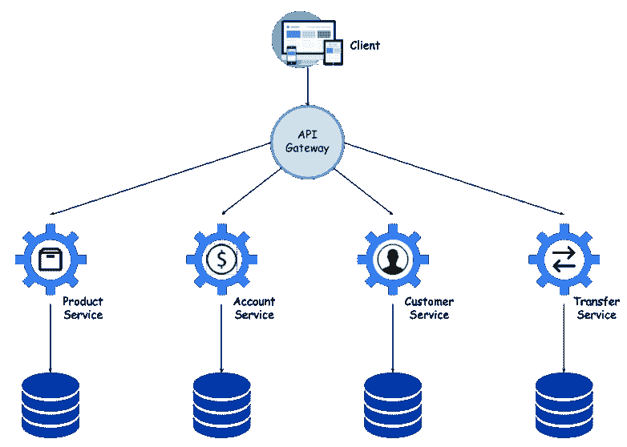
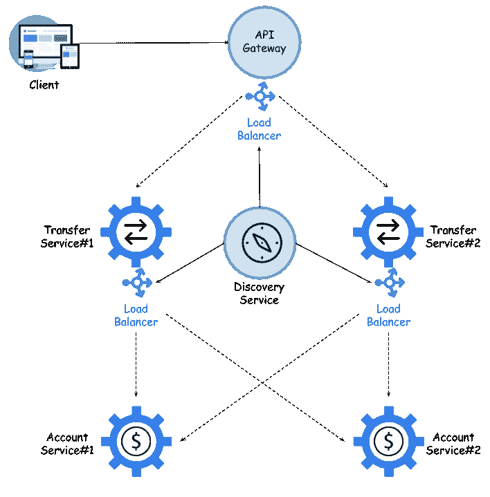

# 微服务简介

微服务是过去几年 IT 界出现的最热门趋势之一。相对而言，确定其日益流行的最重要原因相对容易。它们的优点和缺点都是众所周知的，尽管我们所说的缺点可以通过使用正确的工具轻松解决。它们提供的优势包括可扩展性、灵活性和独立交付；这就是它迅速流行的原因。早期的一些 IT 趋势对微服务的流行产生了一定的影响。我指的是一些趋势，比如公共云环境的使用以及从关系数据库到 NoSQL 的迁移。

在详细讨论之前，让我们先看看本章将介绍的主题：

*   使用 SpringCloud 进行云本地开发
*   基于微服务的体系结构中最重要的元素
*   服务间通信模型
*   断路器和后备模式简介

# 微服务的祝福

微服务的概念定义了一种 IT 系统体系结构的方法，该方法将应用程序划分为实现业务需求的松散耦合服务集合。事实上，这是**面向服务架构**（**SOA**概念的变体。迁移到基于微服务的体系结构的最重要好处之一是能够连续交付大型复杂应用程序。

到目前为止，您可能已经有机会阅读了一些有关微服务的书籍或文章。我想他们中的大多数人都会给你详细描述他们的优点和缺点。使用微服务有许多优点。首先，对于项目中的新开发人员来说，微服务相对较小且易于理解。我们通常希望确保在一个地方执行的代码更改不会对应用程序的所有其他模块产生不必要的影响。有了微服务，我们可以更加确定这一点，因为我们只实现一个业务领域，而不像单片应用程序，有时甚至看似不相关的功能也放在同一条船上。这还不是全部。我注意到，通常情况下，在小型微服务中维护预期的代码质量比在大型整体中维护预期的代码质量更容易，因为在大型整体中，许多开发人员已经引入了他们的更改。

关于微服务体系结构，我喜欢的第二件事是部门。直到现在，当我必须处理复杂的企业系统时，我总是看到将系统划分为子系统是根据其他子系统来完成的。例如，电信组织总是有一个计费子系统。然后创建一个子系统，该子系统隐藏计费复杂性并提供 API。然后，您发现您需要的数据不能存储在计费系统中，因为它不容易定制。因此，您创建了另一个子系统。这实际上会导致您构建一个复杂的子系统网格，这不容易理解，尤其是如果您是组织中的新员工。使用微服务，您不会遇到这样的问题。如果设计良好，每个微服务都应该负责整个选定区域。在某些情况下，无论一个组织在哪个部门活动，这些领域都是相似的。

# 使用 Spring 框架构建微服务

尽管微服务的概念多年来一直是一个重要的话题，但仍然没有很多稳定的框架支持运行完整微服务环境所需的所有功能。自从我开始使用微服务以来，我一直在努力跟上最新的框架，并找出为满足微服务需求而开发的功能。还有一些其他有趣的解决方案，如 Vert.x 或 ApacheCamel，但它们都不适合 Spring 框架

SpringCloud 实现了所有在基于微服务的体系结构中使用的经过验证的模式，如服务注册中心、配置服务器、断路器、云总线、OAuth2 模式和 API 网关。它有一个强大的社区，因此新功能的发布频率很高。它基于 Spring 的开放编程模型，全世界数百万 Java 开发人员都在使用该模型。它也有很好的记录。在线查找许多可用的 Spring 框架使用示例不会有任何问题。

# 云本地开发

微服务与云计算平台有着内在的联系，但微服务的实际概念并不新鲜。这种方法已经在 IT 开发领域应用了很多年，但现在，随着云解决方案的普及，它已经发展到一个更高的水平。不难指出这种流行的原因。与组织内部的内部部署解决方案相比，云的使用为您提供了可扩展性、可靠性和较低的维护成本。这导致了云本机应用程序开发方法的兴起，这些方法旨在让您受益于云提供的所有优势，如弹性伸缩、不可变部署和一次性实例。这一切归结为一件事：减少满足新需求所需的时间和成本。今天，软件系统和应用程序正在不断改进。如果您采用传统的基于单片的开发方法，那么代码库将不断增长，变得过于复杂，无法进行修改和维护。引入新的功能、框架和技术变得很困难，这反过来会影响创新并抑制新的想法。我们对此无可争辩

这枚硬币还有另一面。今天，几乎每个人都在考虑迁移到云，部分原因是它很流行。每个人都需要这个吗？当然不是。那些对将应用程序迁移到远程云提供商（如 AWS、Azure 或 Google）没有绝对把握的人，希望至少拥有本地私有云或 Docker 容器。但它真的会给他们带来补偿所产生费用的好处吗？在研究云本机开发和云平台之前，回答这个问题是值得的。

我并不是想劝阻你不要使用 SpringCloud，相反。我们必须彻底理解什么是云本机开发。这里有一个非常好的定义：

“本机云应用程序是专门为云计算环境设计的程序，而不是简单地迁移到云。”

Spring 旨在加速您的云本机开发。使用 Spring Boot 构建应用程序非常快；在下一章中，我将向您详细介绍如何做到这一点。SpringCloud 实现了微服务架构模式，并帮助我们使用该领域最流行的解决方案。使用这些框架开发的应用程序可以很容易地部署在关键的 Cloud Foundry 或 Docker 容器上，但它们也可以像在一台或多台机器上以分离流程的传统方式启动一样，您将拥有微服务方法的优势。现在让我们深入研究微服务体系结构。

# 学习微服务架构

让我们想象一下，一个客户接近你，希望你为他们设计一个解决方案。他们需要某种银行应用程序来保证整个系统内的数据一致性。到目前为止，我们的客户一直在使用 Oracle 数据库，并从他们这边购买了支持。不用考虑太多，我们决定设计一个基于关系数据模型的单片应用程序。您可以在此处看到系统设计的简化图：

有四个实体映射到数据库中的表中：

*   其中第一个**客户**存储并检索活动客户列表
*   每个客户可以有一个或多个账户，由**账户**实体运营
*   **转账**实体负责执行系统内账户之间的所有资金转账
*   还有一个**产品**实体，用于存储分配给客户的存款和信用等信息

在不深入讨论更多细节的情况下，应用程序公开了 API，该 API 提供了在设计的数据库上实现操作所需的所有操作。当然，实现符合三层模型

一致性不再是最重要的要求；这甚至不是强制性的。客户机需要一个解决方案，但不希望开发需要重新部署整个应用程序。它应该是可扩展的，并且应该能够轻松地扩展新的模块和功能。此外，客户机不会对开发人员施加压力，要求他们使用 Oracle 或其他关系数据库，不仅如此，他还很乐意避免使用它。这些是决定迁移到微服务的充分理由吗？让我们假设他们是。我们将单片应用程序划分为四个独立的微服务，每个微服务都有一个专用的数据库。在某些情况下，它仍然可以是关系数据库，而在其他情况下，它可以是 NoSQL 数据库。现在，我们的系统由许多在我们的环境中独立构建和运行的服务组成。随着微服务数量的增加，系统复杂性也在不断提高。我们想对外部 API 客户机隐藏这种复杂性，它不应该知道它与服务*X*对话，而不是*Y*。网关负责将所有请求动态路由到不同的端点。例如，单词*动态*意味着它应该基于服务发现中的条目，我将在*一节了解服务发现的必要性*中讨论。

隐藏特定服务的调用或动态路由不是 API 网关的唯一功能。因为它是我们系统的入口点，所以它可以成为跟踪重要数据、收集请求指标和统计其他统计数据的好地方。它可以丰富请求或响应头，以便包含系统内应用程序可用的一些附加信息。它应该执行一些安全操作，例如身份验证和授权，并且应该能够检测每个资源的需求并拒绝不满足这些需求的请求。下面的图表说明了示例系统，该系统由四个独立的微服务组成，对 API 网关后面的外部客户端隐藏：

# 了解服务发现的需求

让我们设想一下，我们已经将单片应用程序划分为更小的独立服务。从外部看，我们的系统看起来仍然和以前一样，因为它的复杂性隐藏在 API 网关后面。事实上，微服务并不多，但很可能还有更多。此外，它们中的每一个都可以相互作用。这意味着每个微服务都必须保留其他微服务的网络地址信息。维护这样的配置可能会非常麻烦，尤其是当涉及到手动覆盖每个配置时。如果这些地址在重新启动后动态地改变呢？下图显示了示例微服务之间的调用路由：

服务发现是在计算机网络上自动检测这些设备提供的设备和服务。在基于微服务的体系结构中，这是必要的机制。启动后的每个服务都应该在所有其他服务都可以访问的中心位置注册自己。注册密钥应该是服务或标识符的名称，在整个系统中必须是唯一的，以便其他人能够使用该名称查找和调用服务。具有给定名称的每个键都有一些指定值。在最常见的情况下，这些属性表示服务的网络位置。更准确地说，它们表示微服务的一个实例，因为它可以作为独立的应用程序在不同的机器或端口上运行。有时可以发送一些附加信息，但这取决于具体的服务发现提供商。然而，这里重要的是，在一个密钥下，可以注册同一服务的多个实例。除了注册之外，每个服务都会获得在特定发现服务器上注册的其他服务的完整列表。不仅如此，每个微服务都必须知道注册列表中的任何更改。这可以通过定期更新先前从远程服务器收集的配置来实现。

有些解决方案将服务发现的使用与服务器配置功能结合起来。归根结底，这两种方法非常相似。服务器的配置允许您集中管理系统中的所有配置文件。通常，这样的配置是作为 RESTWeb 服务的服务器。在启动之前，每个微服务都会尝试连接到服务器，并专门为其准备参数。其中一种方法将这样的配置存储在版本控制系统中，例如 Git。然后，配置服务器更新其 Git 工作副本，并将所有属性作为 JSON 提供。在另一种方法中，我们可以使用存储键值对并在服务发现过程中履行提供者角色的解决方案。最流行的工具是领事和动物园管理员。下图说明了系统的体系结构，该体系结构由一些微服务组成，这些微服务具有在一个称为**发现服务**的中央服务中注册的数据库后端：

# 服务之间的通信

为了保证系统的可靠性，我们不能允许每个服务只有一个实例在运行。我们通常的目标是至少有两个运行实例，以防其中一个发生故障。当然，可能会有更多，但出于性能原因，我们会将其保持在较低水平。无论如何，同一服务的多个实例使得有必要对传入请求使用负载平衡。首先，**负载平衡器**通常内置在 API 网关中。此负载平衡器应从发现服务器获取已注册实例的列表。如果没有理由不这样做，那么我们通常使用一个循环规则，在所有运行实例之间平衡 50/50 的传入流量。同样的规则也适用于微服务端的负载平衡器。

下图说明了两个示例微服务的多个实例之间的服务间通信所涉及的最重要组件：

大多数人在听说微服务时，都认为它是由 JSON 符号组成的 REST Web 服务，但这只是其中的一种可能性。我们可以使用其他一些交互样式，当然，这些样式不仅适用于基于微服务的体系结构。应该执行的第一个分类是一对一或一对多通信。在一对一交互中，每个传入的请求都由一个服务实例处理，而在一对多交互中，它由多个服务实例处理。但最流行的划分标准是调用是同步的还是异步的。此外，异步通信可以分为通知。当客户机向服务发送请求，但不需要应答时，它可以只执行简单的异步调用，而不阻塞线程并异步应答

此外，值得一提的是反应式微服务。现在，从版本 5 开始，Spring 也支持这种类型的编程。还有一些库支持与 NoSQL 数据库交互，例如 MongoDB 或 Cassandra。最后一种众所周知的通信类型是发布-订阅。这是一种一对多交互类型，其中客户端发布一条消息，然后由所有侦听服务使用。通常，此模型是使用消息代理实现的，如 ApacheKafka、RabbitMQ 和 ActiveMQ

# 故障和断路器

我们已经讨论了与微服务体系结构相关的大多数重要概念。这些机制（如服务发现、API 网关和配置服务器）是帮助我们创建可靠高效系统的有用元素。即使在设计系统的体系结构时考虑了这些方面的许多方面，您也应该时刻为失败做好准备。在许多情况下，故障的原因完全超出持有者的控制范围，例如网络或数据库问题。对于基于微服务的系统，这种错误可能特别严重，其中一个输入请求在许多后续调用中被处理。第一个好的实践是在等待响应时始终使用网络超时。如果单个服务存在性能问题，我们应该尽量减少对其他服务的影响。发送错误响应比长时间等待回复、阻塞其他线程要好

网络超时问题的一个有趣的解决方案可能是**断路器模式**。这是一个与微服务方法密切相关的概念。断路器负责计算成功和失败的请求。如果错误率超过假定的阈值，它将跳闸并导致所有进一步的尝试立即失败。经过一段特定的时间后，API 客户端应该返回发送请求，如果请求成功，它将关闭断路器。如果每个服务都有许多实例可用，并且其中一个实例的工作速度比其他实例慢，那么结果就是在负载平衡过程中忽略了它。处理部分网络故障的第二种常用机制是**回退**。这是请求失败时必须执行的逻辑。例如，服务可以返回缓存数据、默认值或结果的空列表。就我个人而言，我不太喜欢这种解决方案。我更愿意将错误代码传播到其他系统，而不是返回缓存数据或默认值

# 总结

SpringCloud 的最大优势在于它支持我们所研究的所有模式和机制。与其他一些框架不同，这些也是稳定的实现。我将在[第 3 章](03.html)、*Spring Cloud Overview*中详细描述哪个 Spring Cloud 项目支持哪些模式。

在本章中，我们讨论了与微服务体系结构相关的最重要概念，如云本机开发、服务发现、分布式配置、API 网关和断路器模式。我试图就这种方法在企业应用程序开发中的优缺点提出自己的观点。然后，我描述了与微服务相关的主要模式和解决方案。其中一些是已经存在多年的众所周知的模式，在 IT 世界中被视为新事物。在这个总结中，我想让你们注意一些事情。微服务本质上是云本地的。SpringBoot 和 SpringCloud 等框架可以帮助您加速云本机开发。迁移到云本机开发的主要动机是能够更快地实施和交付应用程序，同时保持高质量。在许多情况下，微服务可以帮助我们实现这一点，但有时单片方法并不是一个坏的选择

尽管微服务是小型的独立单元，但它们是集中管理的。网络位置、配置、日志文件和度量等信息应存储在一个中心位置。有各种类型的工具和解决方案提供所有这些功能。我们将在本书的几乎所有章节中详细讨论它们。SpringCloud 项目旨在帮助我们集成所有这些东西。我希望能有效地指导您完成它提供的最重要的集成