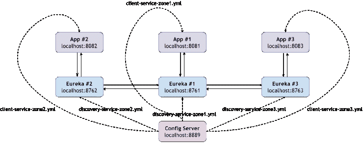
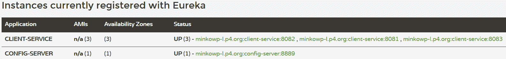
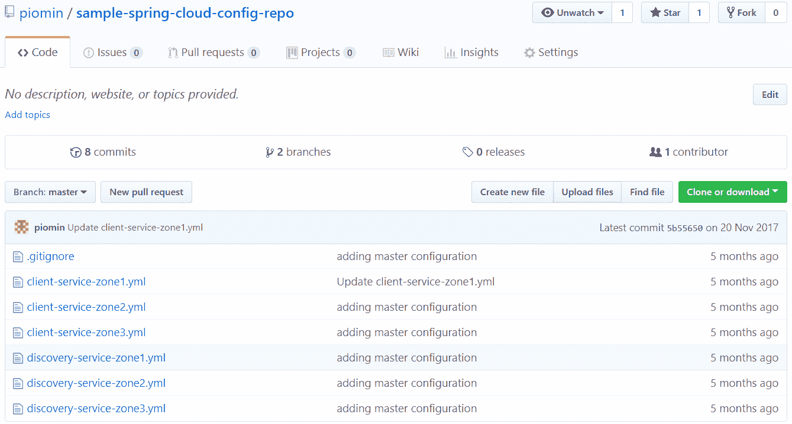
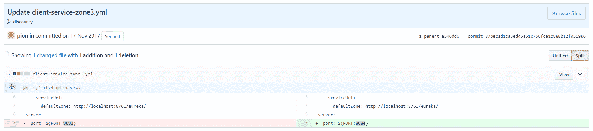
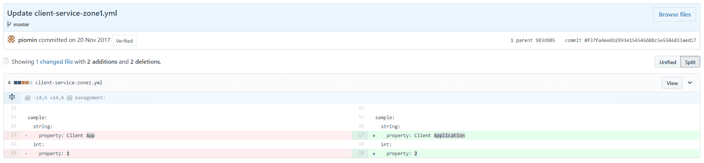

# 五、使用 SpringCloud 配置的分布式配置

现在正是在我们的体系结构中引入一个新元素的时候，即分布式配置服务器。与服务发现类似，这是微服务的关键概念之一。在上一章中，我们详细讨论了如何在服务器端和客户端准备发现。但到目前为止，我们始终使用放置在 fat JAR 文件中的属性为应用程序提供配置。这种方法有一个很大的缺点，它需要重新编译和重新部署微服务的实例。Spring Boot 支持的另一种方法假定使用存储在 fat JAR 之外的文件系统中的显式配置。在应用程序启动期间，可以使用`spring.config.location`属性轻松地对其进行配置。这一方法不需要重新部署，但也并非没有缺点。对于很多微服务，基于文件系统中显式文件的配置管理可能会非常麻烦。此外，让我们设想每个微服务都有许多实例，每个实例都有一个特定的配置。好吧，有了这种方法，最好不要去想象它。

无论如何，分布式配置是云本地环境中非常流行的标准。SpringCloudConfig 为分布式系统中的外部化配置提供服务器端和客户端支持。有了这个解决方案，我们就有了一个中心位置，可以管理所有环境中应用程序的外部属性。这个概念非常简单，易于实现。服务器只是公开 HTTP 和基于资源的 API 接口，这些接口以 JSON、YAML 或属性格式返回`property`文件。此外，它还对返回的属性值执行解密和加密操作。客户机需要从服务器获取配置设置，如果在服务器端启用了此类功能，还需要对其进行解密。

配置数据可能存储在不同的存储库中。`EnvironmentRepository`的默认实现使用 Git 后端。也可以设置其他 VCS 系统，如 SVN。如果不想利用 VCS 提供的功能作为后端，可以使用文件系统或 Vault。Vault 是一种用于管理机密的工具，它存储并控制对令牌、密码、证书和 API 密钥等资源的访问。

我们将在本章中介绍的主题包括：

*   SpringCloud配置服务器公开的 HTTP API
*   服务器端不同类型的存储库后端
*   与服务发现集成
*   使用 SpringCloudBus 和 MessageBroker 自动重新加载配置

# HTTP API 资源简介

配置服务器提供 HTTP API，可以通过各种方式调用该 API。以下端点可用：

*   `/{application}/{profile}[/{label}]`：返回 JSON 格式的数据；label 参数是可选的
*   `/{application}-{profile}.yml`：返回 YAML 格式
*   `/{label}/{application}-{profile}.yml`：前一个端点的变体，在这里我们可以传递一个可选的标签参数
*   `/{application}-{profile}.properties`：返回属性文件使用的简单键/值格式
*   `/{label}/{application}-{profile}.properties`：前一个端点的变体，在这里我们可以传递一个可选的标签参数

从客户端的角度来看，应用程序参数是应用程序的名称，该名称取自`spring.application.name`或`spring.config.name`属性，并且 profile 是活动概要文件或以逗号分隔的活动概要文件列表。最后一个可用参数`label`是一个可选属性，只有在将 Git 用作后端存储时才很重要。设置配置 Git 分支的名称，默认为`master`。

# 本机配置文件支持

让我们从最简单的例子开始，它基于文件系统后端。默认情况下，SpringCloudConfigServer 尝试从 Git 存储库获取配置数据。要启用本机配置文件，我们应该启动服务器，并将`spring.profiles.active`选项设置为`native`。它搜索存储在以下位置的文件：`classpath:/`、`classpath:/config`、`file:./`、`file:./config`。这意味着属性或 YAML 文件也可以放在 JAR 文件中。出于测试目的，我在`src/main/resources`中创建了一个配置文件夹。我们的配置文件将存储在该位置。现在，我们需要回到上一章的例子。您可能还记得，我介绍了集群发现环境的配置，其中每个客户机服务实例都是在不同的区域中启动的。共有三个可用区域和三个客户端实例，它们在`application.yml`文件中都有自己的配置文件。该示例的源代码可在`config`分支中找到。以下是链接：

[https://github.com/piomin/sample-spring-cloud-netflix/tree/config](https://github.com/piomin/sample-spring-cloud-netflix/tree/config)

我们当前的任务是将该配置迁移到 SpringCloudConfig 服务器。让我们提醒自己为该示例设置的属性。以下是用于客户端应用程序第一个实例的配置文件设置。根据所选配置文件，有一个正在更改的实例运行端口、一个默认的 discovery server URL 和一个区域名称：

```java
---
spring:
 profiles: zone1

eureka:
 instance:
   metadataMap:
     zone: zone1
   client:
     serviceUrl:
       defaultZone: http://localhost:8761/eureka/

server: 
 port: ${PORT:8081}
```

在所描述的示例中，为了简单起见，我将所有配置文件设置放在一个`application.yml`文件中。该文件也可以分为三个不同的文件，名称包括配置文件、`application-zone1.yml`、`application-zone2.yml`和`application-zone3.yml`。当然，这些名称对于单个应用程序来说是唯一的，因此如果我们决定将文件移动到远程配置服务器中，我们应该注意它们的名称。客户端应用程序名称从`spring.application.name`注入，在本例中为`client-service`。最后，我在`src/main/resources/config`目录中创建了三个名为`client-service-zone[n].yml`的配置文件，其中[`n`是一个实例的编号。现在，当您调用`http://localhost:8888/client-service/zone1`端点时，您将收到以下 JSON 格式的响应：

```java
{
 "name":"client-service",
 "profiles":["zone1"],
 "label":null,
 "version":null,
 "state":null,
 "propertySources":[{
 "name":"classpath:/config/client-service-zone1.yml",
 "source":{
 "eureka.instance.metadataMap.zone":"zone1",
 "eureka.client.serviceUrl.defaultZone":"http://localhost:8761/eureka/",
 "server.port":"${PORT:8081}"
 }
 }]
}
```

对于第二个实例，我们也可以调用`http://localhost:8888/client-service-zone2.properties`，它以属性列表的形式返回以下响应：

```java
eureka.client.serviceUrl.defaultZone: http://localhost:8762/eureka/
eureka.instance.metadataMap.zone: zone2
server.port: 8082
```

HTTP API 端点的最后可用版本`http://localhost:8889/client-service-zone3.yml`返回与输入文件相同的数据。下面是第三个实例的结果：

```java
eureka:
 client:
 serviceUrl:
 defaultZone: http://localhost:8763/eureka/
 instance:
 metadataMap:
 zone: zone3
server:
 port: 8083
```

# 构建服务器端应用程序

我们首先讨论了 HTTP，一种由 SpringCloudConfigServer 提供的基于资源的 API，以及在那里创建和存储属性的方法。但现在让我们回到最基本的方面。与发现服务器相同，配置服务器可以作为 Spring 引导应用程序运行。要在服务器端启用它，我们应该在`pom.xml`文件的依赖项中包含`spring-cloud-config-server`：

```java
<dependency>
  <groupId>org.springframework.cloud</groupId>
  <artifactId>spring-cloud-config-server</artifactId>
</dependency>
```

除此之外，我们还应该在主应用程序类上启用配置服务器。最好将服务器端口更改为`8888`，因为它是客户端`spring.cloud.config.uri`属性的默认值。例如，它是在客户端自动配置的。要将服务器切换到其他端口，您应该在`8888`上设置`server.port`属性，或者使用`spring.config.name=configserver`属性启动它。`spring-cloud-config-server`库中嵌入了一个`configserver.yml`：

```java
@SpringBootApplication
@EnableConfigServer
public class ConfigApplication {

 public static void main(String[] args) {
   new SpringApplicationBuilder(ConfigApplication.class).web(true).run(args);
 }

}
```

# 构建客户端应用程序

如果您将端口`8888`设置为服务器的默认端口，那么客户端的配置非常简单。您所需要做的就是为`bootstrap.yml`文件提供应用程序名称，并在`pom.xml`中包含以下依赖项。当然，该规则仅适用于本地主机，因为客户端的自动配置配置服务器地址为`http://localhost:8888`：

```java
<dependency>
  <groupId>org.springframework.cloud</groupId>
  <artifactId>spring-cloud-starter-config</artifactId>
</dependency>
```

如果您为服务器设置了一个不同于`8888`的端口，或者它运行在不同于客户端应用程序的机器上，您还应该在`bootstrap.yml`中设置它的当前地址。以下是引导上下文设置，允许您从端口`8889`上可用的服务器获取`client-service`的属性。当使用`--spring.profiles.active=zone1`参数运行应用程序时，它会自动获取配置服务器中`zone1`配置文件的属性设置：

```java
spring: 
 application:
   name: client-service
 cloud:
   config:
     uri: http://localhost:8889
```

# 添加 Eureka 服务器

您可能已经注意到，在客户端的属性中有发现服务网络位置地址。因此，在启动客户机服务之前，我们应该运行一个 Eureka 服务器。当然，Eureka 也有自己的配置，该配置已存储在上一章示例的`application.yml`文件中。该配置类似于`client-service`，被分为三个配置文件，其中每个配置文件的属性不同于其他配置文件，例如服务器 HTTP 端口的数量和要与之通信的发现对等点的列表。

现在，我们将这些`property`文件放在配置服务器上。Eureka 在启动时获取分配给所选配置文件的所有设置。文件命名与已经描述的标准一致，即`discovery-service-zone[n].yml`。在运行 Eureka 服务器之前，我们应该在依赖项中包含`spring-cloud-starter-config`以启用 Spring Cloud Config Client，并将`application.yml`替换为`bootstrap.yml`，如下所示：

```java
spring: 
 application:
   name: discovery-service
 cloud:
   config:
     uri: http://localhost:8889
```

现在，通过在`--spring.profiles.active`属性中设置不同的配置文件名称，我们可以在对等通信模式下运行三个 Eureka 服务器实例。启动三个`client-service`实例后，我们的架构如下图所示。与前一章中的示例相比，客户端和发现服务都从 Spring Cloud Config Server 获取配置，而不是将其作为 YML 文件保存在 fat JAR 中：



# 客户端引导方法

在前面描述的示例解决方案中，所有应用程序都必须保留配置服务器的网络位置。服务发现的网络位置作为属性存储在那里。在这一点上，我们面临着一个有趣的问题来讨论。我们可以询问我们的微服务是否应该知道配置服务器的网络地址。在前面的讨论中，我们一致认为所有服务的网络位置都应该保留在服务发现服务器上。与其他微服务一样，配置服务器也是一个 Spring 引导应用程序，因此从逻辑上讲，它应该向 Eureka 注册，以便为必须从 Spring Cloud 配置服务器获取数据的其他服务启用自动发现机制。这反过来需要将服务发现连接设置置于`bootstrap.yml`而不是`spring.cloud.config.uri`属性中。

在设计系统架构时，您需要在这两种不同的方法之间进行选择。这并不是说一个解决方案比另一个好。使用`spring-cloud-config-client`工件的任何应用程序的默认行为在 SpringCloud命名法中称为**配置第一引导**。当配置客户机启动时，它绑定到服务器并使用远程属性源初始化上下文。本章的第一个示例介绍了这种方法。在第二种解决方案中，配置服务器向服务发现注册，所有应用程序都可以使用`DiscoveryClient`来定位它。这种方法被称为**发现第一引导**。让我们实现一个例子来说明这个概念。

# 配置服务器发现

要在 GitHub 上访问该示例，您需要切换到`config_with_discovery`分支。以下是链接：

[https://github.com/piomin/sample-spring-cloud-netflix/tree/config_with_discovery](https://github.com/piomin/sample-spring-cloud-netflix/tree/config_with_discovery) 。

第一个变化与`sample-service-discovery`模块有关。我们不需要那里的`spring-cloud-starter-config`依赖关系。简单配置不是从远程属性源获取的，而是在`bootstrap.yml`中设置的。与上一个示例不同，我们启动一个独立的 Eureka 实例以简化练习：

```java
spring: 
 application:
   name: discovery-service 

server: 
 port: ${PORT:8761} 

eureka:
 client:
   registerWithEureka: false
   fetchRegistry: false
```

相比之下，我们应该包括配置服务器的`spring-cloud-starter-eureka`依赖项。现在，依赖项的完整列表显示在下面的代码中。此外，必须通过在主类上声明`@EnableDiscoveryClient`注释来启用发现客户端，并且应该通过在`application.yml`文件中将`eureka.client.serviceUrl.defaultZone`属性设置为`http://localhost:8761/eureka/`来提供 Eureka 服务器地址：

```java
<dependency>
  <groupId>org.springframework.cloud</groupId>
  <artifactId>spring-cloud-config-server</artifactId>
</dependency>
<dependency>
  <groupId>org.springframework.cloud</groupId>
  <artifactId>spring-cloud-starter-eureka</artifactId>
</dependency>
```

在客户端应用程序端，不再需要保存配置服务器的地址。唯一需要设置的是服务 ID，以防它与配置服务器不同。根据所示示例中用于服务的命名约定，该 ID 为`config-server`。它应该被`spring.cloud.config.discovery.serviceId`属性覆盖。为了允许发现机制使发现机制能够从配置服务器获取远程属性源，我们应该设置`spring.cloud.config.discovery.enabled=true`：

```java
spring: 
 application:
   name: client-service
 cloud:
   config:
     discovery:
       enabled: true
       serviceId: config-server
```

这是带有 Eureka 仪表板的屏幕，其中一个配置服务器实例和三个注册的`client-service`实例。客户机的 Spring Boot 应用程序的每个实例都与前一个示例相同，并且是使用`--spring.profiles.active=zone[n]`参数启动的，其中`n`是区域的编号。唯一的区别是，Spring Cloud Config 服务器提供的所有客户端服务配置文件都与 Eureka 服务器具有相同的连接地址：



# 存储库后端类型

本章前面的所有示例都使用了文件系统后端，这意味着配置文件是从本地文件系统或类路径加载的。这种类型的后端非常适合用于教程或测试。如果您想在生产中使用 SpringCloud 配置，那么值得考虑其他选项。第一个是基于 Git 的存储库后端，默认情况下也是启用的。它不是唯一一个**版本控制系统**（**VCS**）可以用作配置源的存储库。另一个选项是 SVN，或者我们甚至可以决定创建一个复合环境，它可能由 Git 和 SVN 存储库组成。下一个受支持的后端类型基于 HashiCorp、Vault 提供的工具。它在管理安全属性（如密码或证书）时特别有用。让我们仔细看看这里列出的每一个解决方案。

# 文件系统后端

关于这个话题我不会写太多，因为前面的例子已经讨论过了。它们都展示了如何在类路径中存储属性源。还可以从磁盘加载它们。默认情况下，SpringCloudConfig 服务器尝试在应用程序的工作目录或该位置的 Config 子目录中查找文件。我们可以用`spring.cloud.config.server.native.searchLocations`属性覆盖默认位置。搜索位置路径可能包含`application`、`profile`和`label`的占位符。如果在位置路径中不使用任何占位符，则存储库会自动将 label 参数作为后缀追加。

因此，将从每个搜索位置和与标签同名的子目录加载配置文件。例如，`file:/home/example/config`与`file:/home/example/config,file:/home/example/config/{label}`相同。可通过将`spring.cloud.config.server.native.addLabelLocations`设置为`false`来禁用此行为。

正如我已经提到的，对于生产部署来说，文件系统后端不是一个好的选择。如果将属性源放在 JAR 文件内的类路径中，则每次更改都需要重新编译应用程序。另一方面，在 JAR 之外使用文件系统不需要重新编译，但是如果您有多个配置服务实例在高可用性模式下工作，这种方法可能会很麻烦。在这种情况下，跨所有实例共享文件系统，或者为每个正在运行的实例保留所有属性源的副本。Git 后端没有这些缺点，这就是为什么建议在生产中使用它。

# Git 后端

Git 版本控制系统具有一些特性，使其作为属性源的存储库非常有用。它允许您轻松管理和审核更改。通过使用众所周知的 VCS 机制，如提交、恢复和分支，我们可以执行比文件系统方法简单得多的重要操作。这种类型的后端还有另外两个关键优势。它强制将配置服务器源代码与`property`文件存储库分离。如果您再看一次前面的示例，您将看到`property`文件与应用程序源代码一起存储。也许你们中的一些人会说，即使我们使用了文件系统后端，我们也可以将整个配置作为一个单独的项目存储在 Git 上，并根据需要将其上传到远程服务器。当然，你是对的。但是，当在 SpringCloud 配置中使用 Git 后端时，这些机制是现成的。此外，它还解决了与运行多个服务器实例相关的问题。如果使用远程 Git 服务器，则可以轻松地在所有正在运行的实例之间共享更改。

# 不同协议

要为应用程序设置 Git 存储库的位置，我们应该使用`application.yml`中的`spring.cloud.config.server.git.uri`属性。如果您熟悉 Git，您就知道可以使用文件、http/https 和 ssh 协议实现克隆。本地存储库访问允许您在没有远程服务器的情况下快速启动。配置文件、前缀，如`spring.cloud.config.server.git.uri=file:/home/git/config-repo`。为了在高可用性模式下运行 Config Server 时获得更高级的使用，您应该使用远程协议 SSH 或 HTTPS。在本例中，SpringCloudConfig 克隆了一个远程存储库，然后将其作为缓存基于本地工作副本。

# 在 URI 中使用占位符

这里还支持所有最近列出的占位符`application`、`profile`和`label`。我们可以使用占位符为每个应用程序创建一个存储库，如`https://github.com/piomin/{application}`中所示，甚至可以为每个配置文件`https://github.com/piomin/{profile}`创建一个存储库。这种类型的后端实现将 HTTP 资源的 label 参数映射到 Git 标签，Git 标签可以引用提交 ID、分支或标记名。对于我们来说，发现有趣特性的最合适的方法显然是通过一个例子。让我们首先创建一个 Git 存储库，专门用于存储应用程序的属性源。

# 构建服务器应用程序

我创建了一个示例配置存储库，可以在 GitHub 上找到：

[https://github.com/piomin/sample-spring-cloud-config-repo.git](https://github.com/piomin/sample-spring-cloud-config-repo.git) 。

我放置了本章第一个示例中使用的所有属性源，其中说明了对运行在不同发现区域的客户端应用程序的本机概要文件支持。现在，我们的存储库保存以下列表中可见的文件：



默认情况下，SpringCloudConfig 服务器会在第一次 HTTP 资源调用后尝试克隆存储库。如果要在启动后强制克隆，应将`cloneOnStart`属性设置为`true`。除此之外，还需要设置存储库连接设置和帐户身份验证凭据：

```java
spring:
 application:
   name: config-server
 cloud:
   config:
     server:
       git:
         uri: https://github.com/piomin/sample-spring-cloud-config-repo.git
         username: ${github.username}
         password: ${github.password}
         cloneOnStart: true
```

运行服务器后，我们可以调用前面练习中已知的端点，例如，`http://localhost:8889/client-service/zone1`或`http://localhost:8889/client-service-zone2.yml`。结果将与早期测试的结果相同；唯一的区别在于数据源。现在，让我们进行另一个练习。您可能还记得，当我们使用启用了`native`配置文件的 discovery first bootstrap 创建示例时，我们必须稍微更改客户机的属性。因为现在我们使用的是 Git 后端，所以我们可以为这种情况开发更智能的解决方案。在当前的方法中，我们将创建`discovery`分支（[https://github.com/piomin/sample-spring-cloud-config-repo/tree/discovery](https://github.com/piomin/sample-spring-cloud-config-repo/tree/discovery) ）在 GitHub 上的配置存储库中，我们会将专用于说明 discovery first 引导机制的应用程序的文件放入其中。如果您使用`label`参数设置为`discovery`调用配置服务器端点，您将从我们的新分支获取数据。尝试呼叫`http://localhost:8889/client-service/zone1/discovery`和/或`http://localhost:8889/discovery/client-service-zone2.yml`并检查结果

 *让我们考虑另一种情况。我更改了第三个实例`client-service`的服务器端口，但出于某种原因，我想返回到以前的值。我是否必须更改并使用以前的端口值提交`client-service-zone3.yml`？不，我所要做的就是在调用 HTTP API 资源时将提交 ID 作为`label`参数传递。执行的更改如以下屏幕截图所示：



如果使用父提交 ID 而不是分支名称调用 API 端点，则旧的端口号将作为响应返回。下面是调用`http://localhost:8889/e546dd6/client-service-zone3.yml`的结果，其中`e546dd6`是前一个提交 ID：

```java
eureka:
  client:
    serviceUrl:
      defaultZone: http://localhost:8761/eureka/
  instance:
    metadataMap:
      zone: zone3
server:
  port: 8083
```

# 客户端配置

在使用 Git 后端构建服务器端时，我只向您展示了 HTTP 资源调用的示例。我们也可以在`spring.profiles.active`运行参数中传递`profile`属性，而不是在`bootstrap.yml`中设置`profile`属性。此配置使客户端从`discovery`分支获取属性。我们也可以通过在`label`属性中设置某个提交 ID 来决定切换到该 ID，正如我已经提到的：

```java
spring: 
 application:
   name: client-service
 cloud:
   config:
     uri: http://localhost:8889
     profile: zone1
     label: discovery
#    label: e546dd6 // uncomment for rollback
```

# 多存储库

有时，您可能需要为单个配置服务器配置多个存储库。我可以想象这样一种情况：您必须将业务配置与典型的技术配置分开。这是绝对可能的：

```java
spring:
 cloud:
   config:
     server:
       git:
         uri: https://github.com/piomin/spring-cloud-config-repo/config-repo
         repos:
           simple: https://github.com/simple/config-repo
           special:
             pattern: special*/dev*,*special*/dev*
             uri: https://github.com/special/config-repo
           local:
             pattern: local*
             uri: file:/home/config/config-repo 
```

# 保险库后端

我已经提到，Vault 是一种通过统一界面安全访问机密的工具。为了使配置服务器能够使用该类型的后端，必须使用 Vault 配置文件`--spring.profiles.active=vault`运行配置服务器。当然，在运行配置服务器之前，您需要安装并启动 Vault 实例。我建议你用 Docker 来做这个。我知道这是我们在本书中第一次接触 Docker，并不是每个人都知道这个工具。我在[第 14 章](14.html)*【Docker 支持】中简要介绍了 Docker 及其基本命令和用例。因此，如果这是您第一次接触该技术，请先看一下介绍。对于熟悉 Docker 的人，下面是在开发模式下运行 Vault 容器的命令。我们可以使用`VAULT_DEV_LISTEN_ADDRESS`参数覆盖默认侦听地址，或者使用`VAULT_DEV_ROOT_TOKEN_ID`参数覆盖初始生成的根令牌的 ID：*

```java
docker run --cap-add=IPC_LOCK -d --name=vault -e 'VAULT_DEV_ROOT_TOKEN_ID=client' -p 8200:8200 vault 
```

# Vault 入门

Vault 提供了一个命令行界面，可用于向服务器添加新值并从服务器读取这些值。这里显示了调用这些命令的示例。但是，我们已将 Vault 作为 Docker 容器运行，因此管理机密最方便的方法是通过 HTTP API：

```java
$ vault write secret/hello value=world
$ vault read secret/hello
```

HTTP API 可用于我们的 Vault 实例，地址为`http://192.168.99.100:8200/v1/secret`。调用该 API 的每个方法时，需要传递一个令牌作为请求头`X-Vault-Token`。因为我们在启动 Docker 容器时在`VAULT_DEV_ROOT_TOKEN_ID`环境参数中设置了该值，所以它等于`client`。否则，它将在启动期间自动生成，并可通过调用命令`docker logs vault`从日志中读取。要开始使用 Vault，我们实际上需要了解两种 HTTP 方法-`POST`和`GET`。调用`POST`方法时，我们可以定义应该添加到服务器的机密列表。此处显示的`curl`命令中传递的参数是使用 kv 后端创建的，其作用类似于密钥/值存储：

```java
$ curl -H "X-Vault-Token: client" -H "Content-Type: application/json" -X POST -d '{"server.port":8081,"sample.string.property": "Client App","sample.int.property": 1}' http://192.168.99.100:8200/v1/secret/client-service
```

可以使用`GET`方法从服务器读取新添加的值：

```java
$ curl -H "X-Vault-Token: client" -X GET http://192.168.99.100:8200/v1/secret/client-service
```

# 与 SpringCloud配置的集成

正如我前面提到的，我们必须使用`--spring.profiles.active=vault`参数运行 SpringCloudConfig 服务器，以启用 Vault 作为后端存储。要覆盖默认的自动配置设置，我们应该在`spring.cloud.config.server.vault.*`键下定义属性。这里显示了示例应用程序的当前配置。GitHub 上提供了一个示例应用程序；您需要切换到`config_vault`分支（[https://github.com/piomin/sample-spring-cloud-netflix/tree/config_vault](https://github.com/piomin/sample-spring-cloud-netflix/tree/config_vault) ）要访问它：

```java
spring:
 application:
   name: config-server
 cloud:
   config:
     server:
       vault:
         host: 192.168.99.100
         port: 8200
```

现在，您可以调用配置服务器公开的端点。您必须在请求头中传递令牌，但这次它的名称是`X-Config-Token`：

```java
$ curl -X "GET" "http://localhost:8889/client-service/default" -H "X-Config-Token: client"
```

响应应该与下面显示的内容相同。这些属性是客户端应用程序的所有配置文件的默认属性。您还可以通过调用 Vault HTTP`API`方法为所选配置文件添加特定设置，在配置文件名称后面加上逗号字符，如`http://192.168.99.100:8200/v1/secret/client-service,zone1`。如果调用路径中包含此类配置文件名称，则响应中将返回`default`和`zone1`配置文件的属性：

```java
{
    "name":"client-service",
    "profiles":["default"],
    "label":null,
    "version":null,
    "state":null,
    "propertySources":[{
        "name":"vault:client-service",
        "source":{
            "sample.int.property":1,
            "sample.string.property":"Client App",
            "server.port":8081
        }
    }]
} 
```

# 客户端配置

将 Vault 用作配置服务器的后端时，客户端需要传递令牌，服务器才能从 Vault 检索值。此令牌应在客户端配置设置中提供，并在`bootstrap.yml`文件中具有`spring.cloud.config.token`属性：

```java
spring:
 application:
   name: client-service
 cloud:
   config:
     uri: http://localhost:8889
     token: client
```

# 附加功能

让我们来看看 SpringCloud配置的一些其他有用的特性。

# 启动失败并重试

有时，如果配置服务器不可用，则启动应用程序没有任何意义。在这种情况下，我们希望在出现异常时停止客户端。为此，我们必须将引导配置属性`spring.cloud.config.failFast`设置为`true`。这种激进的解决方案并不总是理想的行为。如果配置服务器只是偶尔无法访问，更好的方法是继续尝试重新连接，直到成功为止。`spring.cloud.config.failFast`属性仍然必须等于`true`，但我们还需要添加`spring-retry`库和`spring-boot-starter-aop`应用程序类路径。默认行为假定重试六次，初始退避间隔为 1000 毫秒。您可以使用`spring.cloud.config.retry.*`配置属性覆盖这些设置。

# 安全客户端

与服务发现一样，我们可以使用基本身份验证来保护配置服务器。使用 Spring Security，可以在服务器端轻松启用它。在这种情况下，客户端需要设置的只是`bootstrap.yml`文件中的用户名和密码：

```java
spring:
 cloud:
   config:
     uri: https://localhost:8889
     username: user
     password: secret
```

# 自动重新加载配置

我们已经讨论了 SpringCloudConfig 最重要的特性。此时，我们实现了一些示例，演示了如何将不同的后端存储用作存储库。但无论我们决定选择文件系统、Git 还是 Vault，我们的客户端应用程序都需要重新启动才能从服务器获取最新配置。然而，有时这不是一个最佳的解决方案，特别是当我们有许多微服务在运行，其中一些使用相同的通用配置时。

# 解决方案体系结构

即使我们为每个应用程序创建了一个专用的`property`文件，也有机会在不重新启动的情况下动态重新加载它。正如您可能已经推断的，这样的解决方案适用于 Spring 引导，因此也适用于 SpringCloud。在[第 4 章](04.html)*服务发现*中，在描述从服务发现服务器注销时，我引入了一个端点`/shutdown`，可以用于优雅地关闭。还有一个端点可用于 Spring 上下文重启，其工作方式与 shutdown 类似

客户端的端点只是更大系统的一个组件，需要包括该系统才能为 SpringCloud配置启用推送通知。最流行的源代码存储库提供商，如 GitHub、GitLab 和 Bitbucket，我们可以通过提供 WebHook 机制来发送有关存储库中更改的通知。我们可以使用提供程序的 web 仪表板作为 URL 和选定事件类型的列表来配置 WebHook。这样的提供程序将调用 WebHook 中定义的`POST`方法，其主体包含提交列表。需要在项目中包含 SpringCloud总线依赖项，以便在配置服务器端启用监控器端点。当此端点作为 WebHook 激活的结果被调用时，配置服务器准备并发送一个事件，其中包含上次提交修改的属性源列表。该事件被发送到消息代理。SpringCloud总线为 RabbitMQ 和 ApacheKafka 提供了实现。第一个依赖项可以通过包含`spring-cloud-starter-bus-amqp`依赖项来为项目启用，第二个依赖项可以通过包含`spring-cloud-starter-bus-kafka`依赖项来启用。还应该为客户端应用程序声明这些依赖项，以便能够从消息代理接收消息。我们还应该在客户端启用动态刷新机制，用`@RefreshScope`注释所选的配置类。此解决方案的体系结构如下所示：


# 使用@RefreshScope 重新加载配置

这次我们将从客户端开始。示例应用程序可在 GitHub（[上获得 https://github.com/piomin/sample-spring-cloud-config-bus.git](https://github.com/piomin/sample-spring-cloud-config-bus.git) ）。与前面的示例相同，它使用 Git 存储库作为后端存储，这也是在 GitHub（[上创建的 https://github.com/piomin/sample-spring-cloud-config-repo](https://github.com/piomin/sample-spring-cloud-config-repo) ）。我向客户端的配置文件添加了一些新属性，并将更改提交到存储库。以下是客户端配置的当前版本：

```java
eureka:
 instance:
   metadataMap:
     zone: zone1
 client:
   serviceUrl:
     defaultZone: http://localhost:8761/eureka/
server: 
 port: ${PORT:8081}
management:
 security:
   enabled: false 
sample:
 string:
   property: Client App
 int:
   property: 1
```

我通过将`management.security.enabled`设置为`false`禁用了弹簧启动执行器端点的安全性。需要能够在不传递安全凭据的情况下调用这些端点。我还添加了两个测试参数，`sample.string.property`和`sample.int.property`，以根据示例中的值演示 bean 刷新机制。SpringCloud 为 Spring 引导执行器提供了一些额外的 HTTP 管理端点。其中一个是`/refresh`，负责重新加载引导上下文并刷新用`@RefreshScope`注释的 bean。这是一个 HTTP`POST`方法，可以在`http://localhost:8081/refresh`的客户端实例上调用。在测试该功能之前，我们需要运行发现和配置服务器。应使用`--spring.profiles.active=zone1 `参数启动客户端应用程序。下面是将测试属性`sample.string.property`和`sample.int.property`注入字段的类：

```java
@Component
@RefreshScope
public class ClientConfiguration {

 @Value("${sample.string.property}")
 private String sampleStringProperty;
 @Value("${sample.int.property}")
 private int sampleIntProperty; 

 public String showProperties() {
   return String.format("Hello from %s %d", sampleStringProperty, sampleIntProperty);
 }

}
```

该 bean 被注入到`ClientController`类中，并在`ping`方法中调用，该方法在`http://localhost:8081/ping`中公开：

```java
@RestController
public class ClientController {

 @Autowired
 private ClientConfiguration conf; 

 @GetMapping("/ping")
 public String ping() {
     return conf.showProperties();
 } 

}
```

现在，让我们更改`client-service-zone1.yml`中测试属性的值并提交它们。如果调用配置服务器 HTTP 端点`/client-service/zone1`，您将看到作为响应返回的最新值。但是，当您调用客户端应用程序上公开的`/ping`方法时，您仍然会在下面屏幕的左侧看到较旧的值。为什么？尽管配置服务器自动检测存储库更改，但客户端应用程序无法在没有任何触发器的情况下自动刷新。需要重新启动才能读取最新设置，或者我们可以通过调用前面描述的`/refresh`方法强制重新加载配置：



在客户端应用程序上调用`/refresh`端点后，您将在日志文件中看到配置已重新加载。现在，如果您再次调用`/ping`，响应中将返回最新的属性值。该示例说明了 SpringCloud应用程序的热重新加载是如何工作的，但它显然不是我们的目标解决方案。下一步是启用与 message broker 的通信：


# 从消息代理消费事件

我已经提到，我们可以在与 SpringCloud总线集成的两个消息代理之间进行选择。在本例中，我将向您展示如何运行和使用 RabbitMQ。让我简单介绍一下该解决方案，因为我们在本书中首次讨论了它。RabbitMQ 已发展成为最流行的消息代理软件。用 Erlang 编写，实现**高级消息队列协议**（**AMQP**）。它易于使用和配置，即使我们讨论的是集群或高可用性等机制

在您的机器上运行 RabbitMQ 最方便的方法是通过 Docker 容器。两个端口暴露在容器外部。第一个用于客户端连接（`5672`，第二个专用于管理仪表板（`15672`。我还运行了带有管理标记的图像以启用 UI 仪表板，该仪表板在默认版本中不可用：

```java
docker run -d --name rabbit -p 5672:5672 -p 15672:15672 rabbitmq:management
```

为了支持示例客户端应用程序的 RabbitMQ 代理，我们应该在`pom.xml`中包含以下依赖项：

```java
 <dependency>
     <groupId>org.springframework.cloud</groupId>
     <artifactId>spring-cloud-starter-bus-amqp</artifactId>
 </dependency>
```

该库包含自动配置设置。因为我在 Windows 上运行 Docker，所以需要覆盖一些默认属性。完整服务配置存储在 Git 存储库中，因此更改只影响远程文件。我们应该将以下参数添加到以前使用的客户端属性源版本中：

```java
spring:
 rabbitmq:
   host: 192.168.99.100
   port: 5672
   username: guest
   password: guest
```

如果运行客户机应用程序，将在 RabbitMQ 中自动创建一个 exchange 和一个队列。您可以通过登录`http://192.168.99.100:15672`上的管理仪表板轻松查看此信息。默认用户名和密码为`guest/guest`。这是我的 RabbitMQ 实例的屏幕。创建了一个名为`SpringCloudBus`的交换，它有两个到客户机队列和配置服务器队列的绑定（我已经使用下一节中描述的更改运行了它）。在这个阶段，我不想详细介绍 RabbitMQ 及其体系结构。这样一个讨论的好地方是关于 Spring Cloud Stream 项目的[第 11 章](11.html)*消息驱动微服务*：


# 监视配置服务器上的存储库更改

在前面描述的过程中，SpringCloudConfigServer 必须执行两个任务。首先，它必须检测存储在 Git 存储库中的`property`文件中的更改。这可以通过公开一个特殊的端点来实现，该端点将由存储库提供者通过 WebHook 调用。第二步是准备并发送针对可能已更改的应用程序的`RefreshRemoteApplicationEvent`。这反过来要求我们与消息代理建立连接。`spring-cloud-config-monitor`库负责启用`/monitor`端点。要启用对 RabbitMQ 代理的支持，我们应该包括与客户端应用程序相同的启动程序工件：

```java
<dependency>
 <groupId>org.springframework.cloud</groupId>
 <artifactId>spring-cloud-config-monitor</artifactId>
</dependency>
<dependency>
 <groupId>org.springframework.cloud</groupId>
 <artifactId>spring-cloud-starter-bus-amqp</artifactId>
</dependency>
```

还不止这些。配置监视器也应在`application.yml`中激活。因为每个存储库提供者在 Spring Cloud 中都有一个专用的实现，所以有必要选择应该启用哪一个：

```java
spring:
 application:
   name: config-server
 cloud:
   config:
     server:
       monitor:
         github:
           enabled: true
```

可以定制更改检测机制。默认情况下，它检测与应用程序名称匹配的文件中的更改。要覆盖该行为，您需要提供一个自定义的`PropertyPathNotificationExtractor`实现。它接受请求头和主体参数，并返回已更改的文件路径列表。为了支持 GitHub 的通知，我们可以使用`spring-cloud-config-monitor`提供的`GithubPropertyPathNotificationExtractor`：

```java
@Bean
public GithubPropertyPathNotificationExtractor githubPropertyPathNotificationExtractor() {
    return new GithubPropertyPathNotificationExtractor();
}
```

# 手动模拟更改事件

在 Git 存储库提供程序（如 GitHub、Bitbucket 或 GitLab）上配置的 WebHook 可以调用监控器端点。在本地主机上运行的应用程序中测试这样的功能很麻烦。事实证明，通过手动调用`POST /monitor`，我们可以很容易地模拟这种 WebHook 激活。例如，`Github`命令应该在请求中包含头`X-Github-Event`。在`property`文件中有更改的 JSON 正文应如本 cURL 请求所示：

```java
$ curl -H "X-Github-Event: push" -H "Content-Type: application/json" -X POST -d '{"commits": [{"modified": ["client-service-zone1.yml"]}]}' http://localhost:8889/monitor
```

现在，让我们更改并提交`client-service-zone1.yml`文件中一个属性的值，例如`sample.int.property`。然后，我们可以使用前面示例命令中显示的参数调用`POST /monitor`方法。如果您按照我的描述配置了所有内容，您应该会在客户端应用程序端看到以下日志行，`Received remote refresh request. Keys refreshed [sample.int.property]`。*如果调用客户端微服务公开的`/ping`端点，它应该返回更改属性的最新值。*

 *# 使用 GitLab 实例进行本地测试

对于那些不喜欢模拟事件的人，我建议做一个更实际的练习。然而，我要指出的是，它不仅需要您的开发技能，还需要您对持续集成工具的基本知识。首先，我们将使用 Docker 映像在本地运行 GitLab 实例。GitLab 是一个开源的基于 web 的 Git 存储库管理器，具有 wiki 和问题跟踪功能。它与 GitHub 或 Bitbucket 等工具非常相似，但可以轻松地部署在本地计算机上：

```java
docker run -d --name gitlab -p 10443:443 -p 10080:80 -p 10022:22 gitlab/gitlab-ce:latest
```

可在`http://192.168.99.100:10080`处查看 web 仪表板。第一步是创建管理员用户，然后使用提供的凭据登录。我不会深入讨论 GitLab 的细节。它有一个用户友好和直观的 GUI 界面，所以我很确定你不用花太多力气就能处理它。总之，接下来，我在 GitLab 中创建了一个名为`sample-spring-cloud-config-repo`的项目。可从`http://192.168.99.100:10080/root/sample-spring-cloud-config-repo.git`克隆。我在那里提交了同一组配置文件，这些文件在 GitHub 上的示例存储库中可用。下一步是定义一个 WebHook，通过推送通知调用配置服务器的`/monitor`端点。要为项目添加新的 WebHook，您需要转到设置|集成部分，然后在 URL 字段中填写服务器地址（使用主机名而不是本地主机）。保持“推送事件”复选框处于选中状态：


与使用 GitHub 作为后端存储库提供程序的配置服务器实现相比，我们需要更改`application.yml`中启用的监视器类型，当然还需要提供不同的地址：

```java
spring:
 application:
   name: config-server
 cloud:
   config:
     server:
       monitor:
         gitlab:
           enabled: true
       git:
         uri: http://192.168.99.100:10080/root/sample-spring-cloud-config-repo.git
         username: root
         password: root123
         cloneOnStart: true 
```

我们还应该注册另一个实现`PropertyPathNotificationExtractor`的 bean：

```java
@Bean
public GitlabPropertyPathNotificationExtractor gitlabPropertyPathNotificationExtractor() {
    return new GitlabPropertyPathNotificationExtractor();
}
```

最后，您可以在配置文件中进行并推送一些更改。WebHook 应该被激活，客户端应用程序的配置应该被刷新。这是本章的最后一个例子；我们可以得出结论。

# 总结

在本章中，我描述了 SpringCloud 配置项目的最重要特性。与服务发现一样，我们从基础开始，这是客户端和服务器端的一个简单用例。我们讨论了配置服务器的不同后端存储库类型。我实现了一些示例，演示了如何使用文件系统、Git，甚至第三方工具（如 Vault）作为`property`文件的存储库。我特别关注与其他组件的互操作性，例如服务发现或大型系统中的多个微服务实例。最后，我向您展示了如何在不重新启动的情况下重新加载基于 Webhook 和 MessageBroker 的应用程序配置。总之，在阅读本章之后，您应该能够将 SpringCloud 配置作为基于微服务的体系结构的一个元素，并充分利用其主要功能。

在我们讨论了使用 SpringCloud 实现服务发现和配置服务器之后，我们可以继续进行服务间通信。在接下来的两章中，我们将分析一些基本的和更高级的示例，这些示例演示了几个微服务之间的同步通信。**