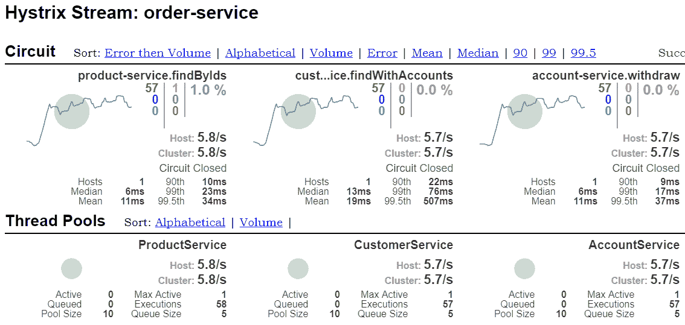

# 七、高级负载平衡和断路器

在本章中，我们将继续上一章中讨论的主题，即服务间通信。我们将把它扩展到更高级的负载平衡、超时和电路中断示例

SpringCloud 提供的特性使微服务之间的通信实现变得简单而漂亮。不过，我们不可忘记，我们在处理这类通讯时所面对的主要困难，是有关系统的处理时间。如果系统中有许多微服务，那么首先需要解决的问题之一就是延迟问题。在本章中，我将讨论一些 SpringCloud特性，它们帮助我们避免由于处理单个输入请求时服务之间的多次跳跃、多个服务的响应缓慢或服务暂时不可用而导致的延迟问题。有几种处理部分故障的策略。这些包括设置网络超时、限制等待请求的数量、实现不同的负载平衡方法，或者设置断路器模式和回退实现。

我们还将再次讨论 Ribbon 和外国客户机，这次重点讨论它们更高级的配置功能。这里将介绍的一个全新的库是 Netflix Hystrix。该库实现断路器模式。

本章将介绍的主题包括：

*   功能区客户端的不同负载平衡算法
*   为应用启用断路器
*   使用配置属性自定义 Hystrix
*   监控与 Hystrix 仪表板的军种间通信
*   与外国客户一起使用 Hystrix

# 负载平衡规则

Spring Cloud Netflix 提供了不同的负载平衡算法，以便为用户提供不同的好处。支持方法的选择取决于您的需要。在 Netflix OSS 术语中，这种算法被称为**规则**。自定义规则类应该实现了一个`IRule`基接口。默认情况下，Spring Cloud 中提供以下实现：

*   `RoundRobinRule`：此规则只是使用众所周知的循环算法选择服务器，其中传入的请求按顺序分布在所有实例上。它通常用作更高级规则的默认规则或回退，例如`ClientConfigEnabledRoundRobinRule`和`ZoneAvoidanceRule`。`ZoneAvoidanceRule`是功能区客户端的默认规则。
*   `AvailabilityFilteringRule`：此规则将跳过标记为电路跳闸或具有大量并发连接的服务器。它还使用`RoundRobinRule`作为基类。默认情况下，如果 HTTP 客户机连续三次未能与其建立连接，则实例将发生电路跳闸。此方法可以使用`niws.loadbalancer.<clientName>.connectionFailureCountThreshold`属性进行定制。一旦实例电路跳闸，它将在下一次重试之前保持此状态 30 秒。此属性也可以在配置设置中重写。
*   `WeightedResponseTimeRule`：通过此实现，实例的流量转发器与实例的平均响应时间成反比。换句话说，响应时间越长，得到的重量就越小。在这些情况下，负载平衡客户端将记录服务的每个实例的流量和响应时间。
*   `BestAvailableRule`：根据类文档的描述，此规则跳过*触发*断路器的服务器，并选择并发请求最低的服务器。

跳闸断路器是一个取自电气工程的术语，意思是没有电流流过电路。在 IT 术语中，它指的是发送到服务的太多连续请求失败的情况，因此任何进一步调用远程服务的尝试都将立即被客户端软件中断，以释放服务器端应用程序

# 加权响应时间规则

到目前为止，我们通常通过从 web 浏览器或 REST 客户端调用服务来手动测试我们的服务。当前的更改不允许这种方法，因为我们需要为服务设置假延迟，并生成许多 HTTP 请求。

# 引入悬停蝇进行测试

现在，我想介绍一个有趣的框架，它可能是此类测试的完美解决方案。我说的是 Hoverfly，一种轻量级服务虚拟化工具，用于存根或模拟 HTTP 服务。它最初是用 Go 编写的，但也为您提供了一个用于在 Java 中管理 Hoverfly 的表达式 API。由 SpectoLabs 维护的 Hoverfly Java 提供了抽象二进制和 API 调用的类、用于创建模拟的 DSL 以及与 JUnit 测试框架的集成。这个框架有一个我非常喜欢的特性。通过调用 DSL 定义中的一个方法，您可以轻松地为每个模拟服务添加延迟。要为您的项目启用 Hoverfly，您必须在 Maven`pom.xml`中包含以下依赖项：

```java
<dependency>
    <groupId>io.specto</groupId>
    <artifactId>hoverfly-java</artifactId>
    <version>0.9.0</version>
    <scope>test</scope>
</dependency>
```

# 检验规则

我们在这里讨论的示例可以在 GitHub 上获得。要访问它，您必须切换到`weighted_lb`分支（[https://github.com/piomin/sample-spring-cloud-comm/tree/weighted_lb](https://github.com/piomin/sample-spring-cloud-comm/tree/weighted_lb) 。我们的 JUnit 测试类名为`CustomerControllerTest`，可在`src/test/java`目录下使用。要为测试启用 Hoverfly，我们应该定义 JUnit`@ClassRule`。`HoverflyRule`类提供了一个 API，允许我们模拟具有不同地址、特征和响应的许多服务。在下面的源代码片段中，您可能会看到我们的示例微服务`account-service`的两个实例已在`@ClassRule`中声明。您可能还记得，该服务已被`customer-service`和`order-service`调用。

让我们来看一个来自于 TyoT0.Ex 模块的测试类。它通过端口`8091`和`9091`上可用的`account-service`两个实例的预定义响应来模拟`GET /customer/*`方法。第一个延迟了`200`毫秒，第二个延迟了`50`毫秒：

```java
@ClassRule
public static HoverflyRule hoverflyRule = HoverflyRule
 .inSimulationMode(dsl(
 service("account-service:8091")
     .andDelay(200, TimeUnit.MILLISECONDS).forAll()
     .get(startsWith("/customer/"))
     .willReturn(success("[{\"id\":\"1\",\"number\":\"1234567890\",\"balance\":5000}]", "application/json")),
 service("account-service:9091")
     .andDelay(50, TimeUnit.MILLISECONDS).forAll()
     .get(startsWith("/customer/"))
     .willReturn(success("[{\"id\":\"2\",\"number\":\"1234567891\",\"balance\":8000}]", "application/json"))))
 .printSimulationData();
```

在运行测试之前，我们还应该修改`ribbon.listOfServers`配置文件，将其更改为`listOfServers: account-service:8091, account-service:9091`。我们只应该在使用 Hoverfly 时进行这样的修改。

这里有一个`test`方法，它调用`customer-service`一千次暴露的`GET /withAccounts/ {id}`端点。这反过来调用`account-service`中的`GET customer/{customerId}`端点，其中包含客户拥有的帐户列表。使用`WeightedResponseTimeRule`在`account-service`的两个实例之间对每个请求进行负载平衡：

```java
@RunWith(SpringRunner.class)
@SpringBootTest(webEnvironment = WebEnvironment.DEFINED_PORT)
public class CustomerControllerTest {

    private static Logger LOGGER = LoggerFactory.getLogger(CustomerControllerTest.class);

    @Autowired
    TestRestTemplate template; 
    // ...

    @Test
    public void testCustomerWithAccounts() {
        for (int i = 0; i < 1000; i++) {
            Customer c = template.getForObject("/withAccounts/{id}", Customer.class, 1);
            LOGGER.info("Customer: {}", c);
        }
    }

}
```

使用加权响应规则实现的方法非常有趣。刚开始测试，传入请求在两个`account-service`实例之间以 50:50 的比率进行负载平衡。但是，经过一段时间后，它们中的大多数会以较小的延迟转发到实例。

最后，端口`9091`上可用的实例处理了 731 个请求，端口`8091`上的实例处理了 269 个请求，以便在我的本地机器上启动 JUnit 测试。但是，在测试结束时，该比例看起来有点不同，并且对延迟较小的实例进行了加权，其中，传入流量在两个实例之间以 4:1 的比例分配。

现在，我们将稍微更改一下测试用例，添加第三个`account-service`实例，延迟大约 10 秒。此修改旨在模拟 HTTP 通信中的超时。以下是 JUnit`@ClassRule`定义中的片段，其中最新的服务实例监听端口`10091`：

```java
service("account-service:10091")
    .andDelay(10000, TimeUnit.MILLISECONDS).forAll()
    .get(startsWith("/customer/"))
    .willReturn(success("[{\"id\":\"3\",\"number\":\"1234567892\",\"balance\":10000}]", "application/json"))
```

我们应相应地对 Ribbon 配置进行更改，以便对最新的`account-service`实例实现负载平衡：

```java
listOfServers: account-service:8091, account-service:9091, account-service:10091
```

最后一件必须更改的事情是`RestTemplate`bean 声明，它与前面的测试用例保持不变。在本例中，我将读取和连接超时都设置为 1 秒，因为在测试期间启动的`account-service`的第三个实例延迟了 10 秒。发送到那里的每个请求都会在一秒钟后超时终止：

```java
@LoadBalanced
@Bean
RestTemplate restTemplate(RestTemplateBuilder restTemplateBuilder) {
    return restTemplateBuilder
        .setConnectTimeout(1000)
        .setReadTimeout(1000)
        .build();
}
```

如果您运行与以前相同的测试，结果将不令人满意。所有声明实例之间的分布将是 420，由监听端口`8091`的实例处理（延迟`200`毫秒），468，由监听端口`9091`的实例处理（延迟`50`毫秒），112 发送到第三个实例，由超时终止。为什么我要引用这些统计数字？我们可以将默认负载平衡规则从`WeightedResponseTimeRule`更改为`AvailabilityFilteringRule`，然后重新运行测试。如果我们这样做，496 个请求将同时发送到第一个和第二个实例，而只有 8 个请求将发送到第三个实例，超时时间为 1 秒。有趣的是，如果将`BestAvailableRule`设置为默认规则，则所有请求都将发送到第一个实例。

现在您已经阅读了这个示例，您可以很容易地看到功能区客户端的所有可用负载平衡规则之间的差异。

# 自定义功能区客户端

功能区客户端的多个配置设置可能会被 Springbean 声明覆盖。与 Feign 一样，它应该在名为 configuration 的客户机注释字段中声明，例如，`@RibbonClient(name = "account-service", configuration = RibbonConfiguration.class)`。可使用此方法自定义以下功能：

*   `IClientConfig`：默认实现为`DefaultClientConfigImpl`。
*   `IRule`：该组件用于确定从列表中选择哪个服务实例。`ZoneAvoidanceRule`实现类是自动配置的。
*   `IPing`：这是一个在后台运行的组件。它负责确保服务实例正在运行。
*   `ServerList<Server>`：可以是静态的，也可以是动态的。如果是动态的（由`DynamicServerListLoadBalancer`使用），后台线程将以预定义的间隔刷新和过滤列表。默认情况下，Ribbon 使用从配置文件中获取的服务器的静态列表。由`ConfigurationBasedServerList`实现。
*   `ServerListFilter<Server>`：`ServerListFilter`是`DynamicServerListLoadBalancer`用来过滤`ServerList`实现返回的服务器的组件。该接口有两种自动配置的实现方式`ZonePreferenceServerListFilter`和`ServerListSubsetFilter`。
*   `ILoadBalancer`：负责在客户端服务的可用实例之间进行负载平衡。默认情况下，Ribbon 使用`ZoneAwareLoadBalancer`。
*   `ServerListUpdater`：负责更新给定应用的可用实例列表。默认情况下，Ribbon 使用`PollingServerListUpdater`。

让我们看一个示例配置类，它定义了`IRule`和`IPing`组件的默认实现。通过提供`@RibbonClients(defaultConfiguration = RibbonConfiguration.class)`注释，可以为单个功能区客户端以及应用程序类路径中可用的所有功能区客户端定义此类配置：

```java
@Configuration
public class RibbonConfiguration {

    @Bean
    public IRule ribbonRule() {
        return new WeightedResponseTimeRule();
    }

    @Bean
    public IPing ribbonPing() {
        return new PingUrl();
    }

}
```

即使您没有使用 Spring 的任何经验，您可能已经猜到（基于前面的示例），也可以使用`properties`文件自定义配置。在这种情况下，Spring Cloud Netflix 与 Netflix 提供的 Ribbon 文档中描述的属性兼容。以下类是受支持的属性，它们的前缀应为`<clientName>.ribbon`，如果它们适用于所有客户端，则应为`ribbon`：

*   `NFLoadBalancerClassName`：`ILoadBalancer`默认实现类
*   `NFLoadBalancerRuleClassName`：`IRule`默认实现类
*   `NFLoadBalancerPingClassName`：`IPing`默认实现类
*   `NIWSServerListClassName`：`ServerList`默认实现类
*   `NIWSServerListFilterClassName`：`ServerListFilter`默认实现类

下面是一个类似于前面的`@Configuration`类的示例，它覆盖了 SpringCloud应用程序使用的`IRule`和`IPing`默认实现：

```java
account-service:
 ribbon:
   NFLoadBalancerPingClassName: com.netflix.loadbalancer.PingUrl
   NFLoadBalancerRuleClassName: com.netflix.loadbalancer.WeightedResponseTimeRule
```

# Hystrix 的断路器型式

我们已经讨论了 SpringCloudNetflix 中负载平衡器算法的不同实现。其中一些是基于对实例响应时间或故障数的监控。在这些情况下，负载平衡器根据这些统计信息决定应该调用哪个实例。断路器模式应视为该解决方案的延伸。断路器背后的主要思想非常简单。受保护的函数调用被包装在断路器对象中，断路器对象负责监视多个故障调用。如果故障达到阈值，电路将断开，所有后续呼叫将自动失败。通常，如果断路器跳闸，也需要某种类型的监控警报。在应用程序中使用断路器模式的一些关键好处是，当相关服务出现故障时，能够继续运行，防止级联故障，并为故障服务提供恢复时间。

# 使用 Hystrix 构建应用程序

Netflix 在其库中提供了断路器模式的实现，称为**Hystrix**。该库还作为 SpringCloud 断路器的默认实现包含在内。Hystrix 还有一些其他有趣的特性，也应该被视为处理分布式系统延迟和容错的综合工具。重要的是，如果断路器断开，Hystrix 会将所有调用重定向到指定的回退方法。回退方法旨在提供通用响应，而不依赖于网络，通常从内存缓存中读取，或仅作为静态逻辑实现。如果需要执行网络呼叫，建议您使用另一个`HystrixCommand`或`HystrixObservableCommand`来实现。要将 Hystrix 包括在项目中，您应该使用`spring-cloud-starter-netflix-hystrix`或`spring-cloud-starter-hystrix`启动器，用于早于 1.4.0 的 Spring Cloud Netflix 版本：

```java
<dependency>
    <groupId>org.springframework.cloud</groupId>
    <artifactId>spring-cloud-starter-hystrix</artifactId>
</dependency>
```

# 实现 Hystrix 的命令

Spring Cloud Netflix Hystrix 寻找一个用`@HystrixCommand`注释注释的方法，然后将其包装在一个连接到断路器的代理对象中。正因为如此，Hystrix 能够监控此类方法的所有调用。此注释目前仅适用于标记为`@Component`或`@Service`的类。这对我们来说是很重要的信息，因为我们已经在 REST 控制器类中实现了与其他服务调用相关的逻辑，该类在前面的所有示例中都使用`@RestController`注释进行了标记。因此，在`customer-service`应用程序中，所有逻辑都被移动到新创建的`CustomerService`类中，然后注入控制器 bean。负责与`account-service`沟通的方法已用`@HystrixCommand`注释。我还实现了一个回退方法，该方法的名称将传递到`fallbackMethod`注释的字段中。此方法仅返回空列表：

```java
@Service
public class CustomerService {

    @Autowired
    RestTemplate template;
    @Autowired
    CustomerRepository repository;
    // ...

    @HystrixCommand(fallbackMethod = "findCustomerAccountsFallback")
    public List<Account> findCustomerAccounts(Long id) {
        Account[] accounts = template.getForObject("http://account-service/customer/{customerId}", Account[].class, id);
        return Arrays.stream(accounts).collect(Collectors.toList());
    }

    public List<Account> findCustomerAccountsFallback(Long id) {
        return new ArrayList<>();
    }

}
```

别忘了用`@EnableHystrix`标记主类，这是告诉 Spring Cloud 应用程序应该使用断路器所需的。我们还可以选择使用`@EnableCircuitBreaker`注释一个类，其作用相同。出于测试目的，`account-service.ribbon.listOfServers`属性应该包含`localhost:8091, localhost:9091`服务的两个实例的网络地址。虽然我们已经为 Ribbon 客户端声明了两个`account-service`实例，但我们将启动`8091`端口上唯一可用的实例。如果调用`customer-service`方法`GET http://localhost:8092/withAccounts/{id}`，Ribbon 将尝试在这两个已声明实例之间平衡每个传入请求的负载，也就是说，一旦收到包含帐户列表的响应，第二次收到空帐户列表，反之亦然。下面的应用程序日志片段说明了这一点。下面的应用程序日志片段说明了这一点。要访问示例应用程序的源代码，您应该切换到`hystrix_basic`分支（[https://github.com/piomin/sample-spring-cloud-comm/tree/hystrix_basic](https://github.com/piomin/sample-spring-cloud-comm/tree/hystrix_basic) ）与上一章中的示例位于同一 GitHub 存储库中：

```java
{"id":1,"name":"John Scott","type":"NEW","accounts":[]}
```

```java
{"id":1,"name":"John Scott","type":"NEW","accounts":[{"id":1,"number":"1234567890","balance":5000},{"id":2,"number":"1234567891","balance":5000},{"id":3,"number":"1234567892","balance":0}]}
```

# 使用缓存数据实现回退

上一个示例中介绍的回退实现非常简单。返回空列表对于在生产环境中运行的应用程序没有多大意义。例如，在请求失败的情况下，从缓存读取数据时，在应用程序中使用回退方法更有意义。这种缓存可以在客户端应用程序内部实现，也可以使用第三方工具（如 Redis、Hazelcast 或 EhCache）实现。最简单的实现可以在 Spring 框架中使用，并且可以在将`spring-boot-starter-cache`工件包含在依赖项中之后使用。要为 Spring Boot 应用程序启用缓存，您应该使用`@EnableCaching`注释 main 或 configuration 类，并在以下上下文中提供`CacheManager`bean：

```java
@SpringBootApplication
@RibbonClient(name = "account-service")
@EnableHystrix
@EnableCaching
public class CustomerApplication {

    @LoadBalanced
    @Bean
    RestTemplate restTemplate() {
        return new RestTemplate();
    }

    public static void main(String[] args) {
        new SpringApplicationBuilder(CustomerApplication.class).web(true).run(args);
    }

    @Bean
    public CacheManager cacheManager() {
        return new ConcurrentMapCacheManager("accounts");
    }
    // ...

}
```

然后您可以使用`@CachePut`注释标记断路器包裹的方法。这将把从调用方法返回的结果添加到缓存映射中。在这种情况下，我们的地图被命名为`accounts`。最后，您可以通过直接调用`CacheManager`bean 来读取回退方法实现中的数据。如果您多次重试同一请求，您将看到空帐户列表不再作为响应返回。相反，服务总是返回在第一次成功调用期间缓存的数据：

```java
@Autowired
CacheManager cacheManager;
@CachePut("accounts")
@HystrixCommand(fallbackMethod = "findCustomerAccountsFallback")
public List<Account> findCustomerAccounts(Long id) {
    Account[] accounts = template.getForObject("http://account-service/customer/{customerId}", Account[].class, id);
    return Arrays.stream(accounts).collect(Collectors.toList());
}

public List<Account> findCustomerAccountsFallback(Long id) {
    ValueWrapper w = cacheManager.getCache("accounts").get(id);
    if (w != null) {
        return (List<Account>) w.get();
    } else {
    return new ArrayList<>();
    }
}
```

# 跳闸断路器

让我建议你做一个练习。到目前为止，您已经了解了如何使用 Hystrix 和 Spring Cloud 在应用程序中启用和实现断路器，以及如何使用回退方法从缓存中获取数据。但您仍然没有使用跳闸断路器来防止负载平衡器调用故障实例。现在，我想配置 Hystrix，如果失败百分比大于`30`百分比，则在三次失败的调用尝试后打开电路，并在接下来的 5 秒钟内阻止调用 API 方法。测量时间窗口约为`10`秒。为了满足这些要求，我们必须覆盖几个默认的 Hystrix 配置设置。可以使用`@HystrixCommand`中的`@HystrixProperty`注释执行。

以下是负责从`customer-service`获取账户列表的方法的当前实现：

```java
@CachePut("accounts")
@HystrixCommand(fallbackMethod = "findCustomerAccountsFallback",
 commandProperties = {
    @HystrixProperty(name = "execution.isolation.thread.timeoutInMilliseconds", value = "500"),
    @HystrixProperty(name = "circuitBreaker.requestVolumeThreshold", value = "10"),
    @HystrixProperty(name = "circuitBreaker.errorThresholdPercentage", value = "30"),
    @HystrixProperty(name = "circuitBreaker.sleepWindowInMilliseconds", value = "5000"),
    @HystrixProperty(name = "metrics.rollingStats.timeInMilliseconds", value = "10000")
 }
)
public List<Account> findCustomerAccounts(Long id) {
    Account[] accounts = template.getForObject("http://account-service/customer/{customerId}", Account[].class, id);
    return Arrays.stream(accounts).collect(Collectors.toList());
}
```

Hystrix 配置属性的完整列表可在 Netflix 的 GitHub 网站[上获得 https://github.com/Netflix/Hystrix/wiki/Configuration](https://github.com/Netflix/Hystrix/wiki/Configuration) 。我不会全部讨论，只讨论微服务之间通信的最重要属性。以下是示例中使用的属性列表及其说明：

*   `execution.isolation.thread.timeoutInMilliseconds`：此属性以毫秒为单位设置时间，之后将发生读取或连接超时，客户端将退出命令执行。Hystrix 将此类方法调用标记为失败，并执行回退逻辑。通过将`command.timeout.enabled`属性设置为`false`，可以完全关闭该超时。默认值为 1000 毫秒。
*   `circuitBreaker.requestVolumeThreshold`：此属性设置滚动窗口中使电路跳闸的最小请求数。默认值为 20。在我们的示例中，该属性被设置为`10`，这意味着前九个不会使电路跳闸，即使它们全部失败。我设置这个值是因为我们假设如果`30`%的传入请求失败，电路应该打开，但传入请求的最小数量是 3。
*   `circuitBreaker.errorThresholdPercentage`：此属性设置最小错误百分比。超过此百分比将导致电路断开，系统将开始对回退逻辑的短路请求。默认值为 50。我将其设置为`30`，因为在我们的示例中，我希望`30`%的失败请求应该打开电路。
*   `circuitBreaker.sleepWindowInMilliseconds`：此属性设置电路跳闸和允许尝试之间的一段时间，以确定是否应再次关闭电路。在此期间，所有传入请求均被拒绝。默认值为`5,000`。因为我们想等待`10`秒，然后在电路断开后第一次呼叫终止，所以我将其设置为`10,000`。
*   `metrics.rollingStats.timeInMilliseconds`：此属性设置统计滚动窗口的持续时间（毫秒）。这是 Hystrix 为断路器使用和发布保留度量的时间。

通过这些设置，我们可以运行与前面示例相同的 JUnit 测试。我们使用`HoverflyRule`发射了两个`account-service`存根。其中第一个将延迟 200 毫秒，而第二个延迟 2000 毫秒的将大于为具有`execution.isolation.thread.timeoutInMilliseconds`属性的`@HystrixCommand`设置的超时。运行 JUnit`CustomerControllerTest`后，查看打印的日志。我已经插入了从我的机器上启动的测试中获取的日志。来自`customer-service`的第一个请求与第一个实例进行负载平衡，延迟 200 毫秒`(1)`。发送到`9091`上可用实例的每个请求都会在一秒钟后超时。发送 10 个请求后，第一个故障导致电路`(2)`跳闸。然后，在接下来的 10 秒钟内，每个请求都由回退方法处理，该方法返回缓存数据`(3)`、`(4)`。10 秒后，客户端再次尝试调用`account-service`的实例并成功`(5)`，因为它命中的实例延迟了 200 毫秒。该成功导致电路关闭。不幸的是，`account-service`的第二个实例仍然响应缓慢，因此该场景会再次发生，直到 JUnit 测试完成`(6)`和`(7)`。本详细说明向您准确展示了带 Hystrix 的断路器如何为 Spring Cloud 工作：

```java
16:54:04+01:00 Found response delay setting for this request host: {account-service:8091 200} // (1)
16:54:05+01:00 Found response delay setting for this request host: {account-service:9091 2000}
16:54:05+01:00 Found response delay setting for this request host: {account-service:8091 200}
16:54:06+01:00 Found response delay setting for this request host: {account-service:9091 2000}
16:54:06+01:00 Found response delay setting for this request host: {account-service:8091 200}
...
16:54:09+01:00 Found response delay setting for this request host: {account-service:9091 2000} // (2)
16:54:10.137 Customer [id=1, name=John Scott, type=NEW, accounts=[Account [id=1, number=1234567890, balance=5000]]] // (3)
...
16:54:20.169 Customer [id=1, name=John Scott, type=NEW, accounts=[Account [id=1, number=1234567890, balance=5000]]] // (4)
16:54:20+01:00 Found response delay setting for this request host: {account-service:8091 200} // (5)
16:54:20+01:00 Found response delay setting for this request host: {account-service:9091 2000}
16:54:21+01:00 Found response delay setting for this request host: {account-service:8091 200}
...
16:54:25+01:00 Found response delay setting for this request host: {account-service:8091 200} // (6)
16:54:26.157 Customer [id=1, name=John Scott, type=NEW, accounts=[Account [id=1, number=1234567890, balance=5000]]] // (7)
```

# 监控延迟和容错

正如我已经提到的，Hystrix 不仅仅是实现断路器模式的简单工具。它是一种解决分布式系统延迟和容错问题的解决方案。Hystrix 提供的一个有趣的特性是能够公开与服务间通信相关的最重要指标，并使用 UI 仪表板显示这些指标。此函数可用于使用 Hystrix 命令包装的客户端。
在之前的一些示例中，我们仅分析了系统的一部分，以模拟`customer-service`和`account-service`之间的通信延迟。在测试高级负载平衡算法或不同的断路器配置设置时，这是一种非常好的方法，但现在我们将返回到分析整个示例系统设置作为一组独立的 Spring Boot 应用程序。这使我们能够观察 SpringCloud 如何与 Netflix OSS 工具结合，帮助我们监控和应对微服务之间通信的延迟问题和故障。示例系统以简单的方式模拟故障。它有一个静态配置，有两个实例的网络地址，`account-service`和`product-service`，但每个服务只有一个实例在运行。

为了刷新您的内存，我们的示例系统的体系结构（考虑到有关故障的假设）如下图所示：


这一次，我们将从一个不同的测试开始。下面是测试方法的片段，它在循环中被调用。首先，它从`order-service`调用`POST http://localhost:8090/`端点，发送`Order`对象，并接收设置了`id`、`status`和`price`的响应。在该请求中，`order-service`与`product-service `和`customer-service`进行通信，并且`customer-service`从`account-service`调用端点，该请求在上图中标记为`(1)`。如果订单已被接受，测试客户端调用带有订单的`id`的`PUT http://localhost:8090/{id}`方法接受订单并从账户中提取资金。在服务器端，这种情况下只有一个服务间通信，在上图中标记为`(2)`。在运行此测试之前，您必须启动作为我们系统一部分的所有微服务：

```java
Random r = new Random();
Order order = new Order();
order.setCustomerId((long) r.nextInt(3)+1);
order.setProductIds(Arrays.asList(new Long[] {(long) r.nextInt(10)+1,(long) r.nextInt(10)+1}));
order = template.postForObject("http://localhost:8090", order, Order.class); // (1)
if (order.getStatus() != OrderStatus.REJECTED) {
    template.put("http://localhost:8090/{id}", null, order.getId()); // (2)
}
```

# 公开 Hystrix 的度量流

使用 Hystrix 与其他微服务通信的每个微服务可能会公开使用 Hystrix 命令包装的每个集成的度量。要启用这样的度量流，您应该包括对`spring-boot-starter-actuator`的依赖关系。这将公开`/hystrix.stream`对象作为管理端点。还需要包括`spring-cloud-starter-hystrix`，它已经添加到我们的示例应用程序中：

```java
<dependency>
    <groupId>org.springframework.boot</groupId>
    <artifactId>spring-boot-starter-actuator</artifactId>
</dependency>
```

生成的流作为进一步的 JSON 条目公开，其中包含表征方法中单个调用的指标。以下是来自`customer-service`的`GET /withAccounts/{id}`方法中调用的单个条目：

```java
{"type":"HystrixCommand","name":"customer-service.findWithAccounts","group":"CustomerService","currentTime":1513089204882,"isCircuitBreakerOpen":false,"errorPercentage":0,"errorCount":0,"requestCount":74,"rollingCountBadRequests":0,"rollingCountCollapsedRequests":0,"rollingCountEmit":0,"rollingCountExceptionsThrown":0,"rollingCountFailure":0,"rollingCountFallbackEmit":0,"rollingCountFallbackFailure":0,"rollingCountFallbackMissing":0,"rollingCountFallbackRejection":0,"rollingCountFallbackSuccess":0,"rollingCountResponsesFromCache":0,"rollingCountSemaphoreRejected":0,"rollingCountShortCircuited":0,"rollingCountSuccess":75,"rollingCountThreadPoolRejected":0,"rollingCountTimeout":0,"currentConcurrentExecutionCount":0,"rollingMaxConcurrentExecutionCount":1,"latencyExecute_mean":5,"latencyExecute":{"0":0,"25":0,"50":0,"75":15,"90":16,"95":31,"99":47,"99.5":47,"100":62},"latencyTotal_mean":5,"latencyTotal":{"0":0,"25":0,"50":0,"75":15,"90":16,"95":31,"99":47,"99.5":47,"100":62},"propertyValue_circuitBreakerRequestVolumeThreshold":10,"propertyValue_circuitBreakerSleepWindowInMilliseconds":10000,"propertyValue_circuitBreakerErrorThresholdPercentage":30,"propertyValue_circuitBreakerForceOpen":false,"propertyValue_circuitBreakerForceClosed":false,"propertyValue_circuitBreakerEnabled":true,"propertyValue_executionIsolationStrategy":"THREAD","propertyValue_executionIsolationThreadTimeoutInMilliseconds":2000,"propertyValue_executionTimeoutInMilliseconds":2000,"propertyValue_executionIsolationThreadInterruptOnTimeout":true,"propertyValue_executionIsolationThreadPoolKeyOverride":null,"propertyValue_executionIsolationSemaphoreMaxConcurrentRequests":10,"propertyValue_fallbackIsolationSemaphoreMaxConcurrentRequests":10,"propertyValue_metricsRollingStatisticalWindowInMilliseconds":10000,"propertyValue_requestCacheEnabled":true,"propertyValue_requestLogEnabled":true,"reportingHosts":1,"threadPool":"CustomerService"}
```

# Hystrix 仪表板

Hystrix dashboard 显示以下信息：

*   健康和交通量显示为一个圆圈，该圆圈随着传入统计信息的变化而改变其颜色和大小
*   过去 10 秒内的错误百分比
*   过去两分钟内的请求速率（以数字表示），并将结果显示在图表上
*   断路器状态（打开/关闭）
*   服务主机的数量
*   最后一分钟的延迟百分比
*   服务的线程池

# 使用仪表板构建应用程序

Hystrix 仪表板与 Spring Cloud 集成。在系统内部实现仪表板时，最好的方法是将独立的 Spring Boot 应用程序与仪表板分离。要将 Hystrix 仪表板包括在项目中，请使用`spring-cloud-starter-hystrix-netflix-dashboard`启动器或`spring-cloud-starter-hystrix-dashboard`用于早于 1.4.0 的 Spring Cloud Netflix 版本：

```java
<dependency>
    <groupId>org.springframework.cloud</groupId>
    <artifactId>spring-cloud-starter-hystrix-dashboard</artifactId>
</dependency>
```

应用程序的主类应该用`@EnableHystrixDashboard`注释。启动后，Hystrix 仪表板在`/hystrix`上下文路径下可用：

```java
@SpringBootApplication
@EnableHystrixDashboard
public class HystrixApplication {

    public static void main(String[] args) {
        new SpringApplicationBuilder(HystrixApplication.class).web(true).run(args);
    }

}
```

在我们的示例系统中，我将端口`9000`配置为 Hystrix 应用程序的默认端口，该端口在`hystrix-dashboard`模块中实现。因此，如果您在启动`hystrix-dashboard`后在 web 浏览器中调用`http://localhost:9000/hystrix`地址，它将显示如下屏幕截图所示的页面。在这里，您应该提供 Hystrix 流端点的地址，以及（可选）标题。如果要显示从`order-service`调用的所有端点的指标，请键入地址`http://localhost:8090/hystrix.stream`，然后单击监控流按钮：


# 监控仪表板上的指标

在本节中，我们将介绍如何从`customer-service`调用`GET /withAccounts/{id}`方法。用`@HystrixCommand`包裹。它显示在 Hystrix 仪表板上，标题为`customer-service.findWithAccounts`，取自`commandKey`属性。此外，UI 仪表板还显示了分配给每个 Springbean 的线程池的信息，Springbean 提供了使用 Hystrix 命令包装的方法的实现。在这种情况下，它是`CustomerService`：

```java
@Service
public class CustomerService {

    // ...
    @CachePut("customers")
    @HystrixCommand(commandKey = "customer-service.findWithAccounts", fallbackMethod = "findCustomerWithAccountsFallback",
        commandProperties = {
            @HystrixProperty(name = "execution.isolation.thread.timeoutInMilliseconds", value = "2000"),
            @HystrixProperty(name = "circuitBreaker.requestVolumeThreshold", value = "10"),
            @HystrixProperty(name = "circuitBreaker.errorThresholdPercentage", value = "30"),
            @HystrixProperty(name = "circuitBreaker.sleepWindowInMilliseconds", value = "10000"),
            @HystrixProperty(name = "metrics.rollingStats.timeInMilliseconds", value = "10000")
        })
    public Customer findCustomerWithAccounts(Long customerId) {
        Customer customer = template.getForObject("http://customer-service/withAccounts/{id}", Customer.class, customerId);
        return customer;
    }

    public Customer findCustomerWithAccountsFallback(Long customerId) {
        ValueWrapper w = cacheManager.getCache("customers").get(customerId);
        if (w != null) {
            return (Customer) w.get();
        } else {
            return new Customer();
        }
    }

}
```

这是 JUnit 测试开始后 Hystrix 仪表板上的屏幕。我们监控用`@HystrixCommand`包装的所有三种方法的状态。如预期，电路已从`product-service`为`findByIds`方法打开。几秒钟后，电路也从`account-service`为`withdraw`方法打开：


过一会儿，局势就会稳定下来。所有电路都保持关闭状态，因为只有一小部分流量被发送到应用程序的非活动实例。这显示了带有 Hystrix 和 Ribbon 的 Spring Cloud 的威力。系统能够自动重新配置自身，以便根据负载平衡器和断路器生成的指标将大多数传入请求重定向到工作实例：



# 用涡轮机聚合 Hystrix 的流

您可能已经注意到，我们只能在 Hystrix 仪表板中查看服务的单个实例。当我们显示`order-service`的命令状态时，`customer-service`和`account-service`之间的通信没有度量，反之亦然。我们还可以想象，`order-service`运行的实例不止一个，这使得有必要在 Hystrix 仪表板中的不同实例或服务之间定期切换。幸运的是，有一个名为**涡轮机**的应用程序，它将所有相关`/hystrix.stream`端点聚合为一个组合`/turbine.stream`，使我们能够监控整个系统的整体健康状况

# 启用涡轮

在为我们的应用程序启用 Turbine 进行任何更改之前，我们应该先启用服务发现，这在这里是必需的。切换到`hystrix_with_turbine`分支以访问我们的样本系统版本，该系统支持使用 Eureka 进行服务发现，并使用 Turbine 聚合 Hystrix 的流。要为项目启用 Turbine 以公开 UI 仪表板，只需在依赖项中包含`spring-cloud-starter-turbine`并用`@EnableTurbine`注释主应用程序类：

```java
<dependency>
    <groupId>org.springframework.cloud</groupId>
    <artifactId>spring-cloud-starter-turbine</artifactId>
</dependency>
```

`turbine.appConfig`配置属性是 Turbine 用于查找实例的 Eureka 服务名称列表。然后，可在 Hystrix 仪表板的 URL`http://localhost:9000/turbine.stream`下找到涡轮气流。地址也由`turbine.aggregator.clusterConfig`属性`http://localhost:9000/turbine.stream?cluster=<clusterName>`的值确定。如果名称为`default`，则集群参数可以省略。以下是 Turbine 配置，它将 Hystrix 的所有可视化指标组合在一个 UI 仪表板中：

```java
turbine:
 appConfig: order-service,customer-service
   clusterNameExpression: "'default'"
```

现在，整个样本系统的所有 Hystrix 指标都显示在一个仪表板站点中。我们需要显示的只是监控统计数据流，可在`http://localhost:9000/turbine.stream`下找到：


或者，我们可以通过提供带有`turbine.aggregator.clusterConfig`属性的服务列表，为每个服务配置集群。在这种情况下，您可以通过为服务名称`cluster`提供`http://localhost:9000/turbine.stream?cluster=ORDER-SERVICE`参数在集群之间切换。群集名称必须以大写形式提供，因为 Eureka 服务器返回的值是大写的：

```java
turbine:
  aggregator:
    clusterConfig: ORDER-SERVICE,CUSTOMER-SERVICE
  appConfig: order-service,customer-service
```

默认情况下，Turbine 正在 Eureka 中其`homePageUrl`地址下的注册实例上查找`/hystrix.stream`端点。然后它将`/hystrix.stream`附加到该 URL。我们的示例应用程序`order-service`是在端口`8090`下启动的，因此我们还应该将默认管理端口覆盖为`8090`。`order-service`的当前配置如以下代码片段所示。或者，您也可以使用`eureka.instance.metadata-map.management.port`属性更改该端口：

```java
spring: 
 application:
   name: order-service 

server:
 port: ${PORT:8090} 

eureka:
 client:
   serviceUrl:
     defaultZone: ${EUREKA_URL:http://localhost:8761/eureka/}

management:
 security:
   enabled: false
     port: 8090
```

# 使用流媒体启用涡轮

从所有分布式 Hystrix 命令中提取度量的经典涡轮机模型并不总是一个好的选择。还可以使用消息代理异步实现从 HTTP 端点收集度量的操作。为了使 Turbine 能够进行流式处理，我们应该在项目中包含以下依赖项，然后用`@EnableTurbineStream`注释主应用程序。以下示例使用 RabbitMQ 作为默认消息代理，但您可以通过包括`spring-cloud-starter-stream-kafka`来使用 Apache Kafka：

```java
<dependency>
 <groupId>org.springframework.cloud</groupId>
 <artifactId>spring-cloud-starter-turbine-stream</artifactId>
</dependency>
<dependency>
 <groupId>org.springframework.cloud</groupId>
 <artifactId>spring-cloud-starter-stream-rabbit</artifactId>
</dependency>
```

前面代码中可见的依赖项应该包含在服务器端。对于客户端应用程序，它们是`order-service`和`customer-service`，我们需要添加`spring-cloud-netflix-hystrix-stream`库。如果您已经在本地运行了 MessageBroker，那么它应该能够在自动配置的设置上成功运行。您也可以使用 Docker 容器运行 RabbitMQ，正如我们在[第 5 章](05.html)、*使用 Spring Cloud Config*的分布式配置中描述的使用 AMQP 总线的 Spring Cloud Config 示例中所做的那样。然后您应该覆盖`application.yml`中客户端和服务器端应用程序的以下属性：

```java
spring:
 rabbitmq:
   host: 192.168.99.100
   port: 5672
   username: guest
   password: guest
```

如果您登录到 RabbitMQ 管理控制台（在`http://192.168.99.100:15672`下可用），您将看到在我们的示例应用程序启动后创建了名为`springCloudHystrixStream`的新 exchange。现在，剩下要做的唯一一件事就是运行 JUnit 测试，就像我们在上一节描述的演示经典 Turbine 方法的示例中所做的一样。所有指标都通过 MessageBroker 发送，并且可以在`http://localhost:9000`端点下观察到。如果您想自己尝试，请切换到`hystrix_with_turbine_stream`分支（参见[https://github.com/piomin/sample-spring-cloud-comm/tree/hystrix_with_turbine_stream](https://github.com/piomin/sample-spring-cloud-comm/tree/hystrix_with_turbine_stream) 了解更多信息）。

# 故障与断路器外型

默认情况下，外部客户端与 Ribbon 和 Hystrix 集成。这意味着，如果您愿意，您可以在使用该库时应用不同的方法来处理系统中的延迟和超时。第一种方法是功能区客户端提供的连接重试机制。第二种是 Hystrix 项目下可用的断路器模式和回退实施，本章前面章节已经讨论过。

# 正在重试与 Ribbon 的连接

当使用外部库时，应用程序默认启用 Hystrix。这意味着如果您不想使用它，您应该在配置设置中禁用它。为了使用 Ribbon 测试重试机制，我建议您禁用 Hystrix。为了使连接能够为外挂重试，您只需要设置两个配置属性-`MaxAutoRetries`和`MaxAutoRetriesNextServer`。在本例中，重要的设置也是`ReadTimeout`和`ConnectTimeout`。所有这些都可以在`application.yml`文件中重写。以下是最重要的功能区设置列表：

*   `MaxAutoRetries`：同一服务器或服务实例的最大重试次数。第一次尝试被排除在此计数之外。
*   `MaxAutoRetriesNextServer`：这是要重试的下一个服务器或服务实例的最大数量，不包括第一个服务器。
*   `OkToRetryOnAllOperations`：表示该客户端可以重试所有操作。
*   `ConnectTimeout`：这是与服务器或服务实例建立连接的最长等待时间。
*   `ReadTimeout`：这是建立连接后等待服务器响应的最长时间。

假设我们有两个目标服务实例。与第一个的连接已建立，但响应太慢，出现超时。客户端根据`MaxAutoRetries=1`属性对该实例执行一次重试。如果仍然没有成功，它将尝试连接该服务的第二个可用实例。如果发生故障，根据`MaxAutoRetriesNextServer=2`属性中的设置，此操作将重复两次。如果所述机制最终*不成功*，则将超时返回给外部客户端。在这种情况下，即使超过 4 秒也可能发生。请查看以下配置：

```java
ribbon:
 eureka:
   enabled: true
 MaxAutoRetries: 1
 MaxAutoRetriesNextServer: 2
 ConnectTimeout: 500
 ReadTimeout: 1000

feign:
 hystrix:
   enabled: false
```

此解决方案是为基于微服务的环境实现的标准重试机制。我们还可以查看与 Ribbon 超时和重试的不同配置设置相关的其他一些场景。我们没有理由不将该机制与 Hystrix 的断路器一起使用。但是，我们必须记住，`ribbon.ReadTimeout`应该低于 Hystrix 的`execution.isolation.thread.timeoutInMilliseconds`属性的值

我建议您测试我们刚才描述为练习的配置设置。您可以使用先前引入的 Hoverfly JUnit 规则来模拟服务实例的延迟和存根。

# 希斯特里克斯对外国投资的支持

首先，我想重申，当使用外文库时，应用程序默认启用 Hystrix，但仅适用于较旧版本的 SpringCloud。根据 Spring Cloud 最新版本的文档，我们应该将`feign.hystrix.enabled`属性设置为`true`，这将强制 Faign 使用断路器包装所有方法。

在 SpringCloudDalston 发布之前，如果 Hystrix 在类路径上，默认情况下，Feign 会将所有方法包装在断路器中。这个默认行为在 SpringCloudDalston 中被更改，以支持选择加入方法。

当与外部客户机一起使用 Hystrix 时，提供先前在`@HystrixCommand`内部设置了`@HystrixProperty`的配置属性的最简单方法是通过`application.yml`文件。以下是前面介绍的示例的等效配置：

```java
hystrix:
 command:
   default:
     circuitBreaker:
       requestVolumeThreshold: 10
       errorThresholdPercentage: 30
       sleepWindowInMilliseconds: 10000
     execution:
       isolation:
         thread:
           timeoutInMilliseconds: 1000
     metrics:
       rollingStats:
         timeInMilliseconds: 10000
```

Faign 支持回退的表示法。要为给定的`@FeignClient`启用回退，我们应该使用提供回退实现的类名设置`fallback`属性。实现类应定义为 Springbean：

```java
@FeignClient(name = "customer-service", fallback = CustomerClientFallback.class)
public interface CustomerClient {

    @CachePut("customers")
    @GetMapping("/withAccounts/{customerId}")
    Customer findByIdWithAccounts(@PathVariable("customerId") Long customerId);

}
```

回退实现基于缓存，实现带`@FeignClient`注释的接口：

```java
@Component
public class CustomerClientFallback implements CustomerClient {

    @Autowired
    CacheManager cacheManager;

    @Override 
    public Customer findByIdWithAccountsFallback(Long customerId) {
        ValueWrapper w = cacheManager.getCache("customers").get(customerId);
        if (w != null) {
            return (Customer) w.get();
        } else {
            return new Customer();
        }
    }

}
```

或者，我们可以实现一个`FallbackFactory`类。这种方法有一个很大的优点，它可以让您访问导致回退触发的原因。要为 Faign 声明一个`FallbackFactory`类，只需使用`@FeignClient`中的`fallbackFactory`属性：

```java
@FeignClient(name = "account-service", fallbackFactory = AccountClientFallbackFactory.class)
public interface AccountClient {

    @CachePut
    @GetMapping("/customer/{customerId}")
    List<Account> findByCustomer(@PathVariable("customerId") Long customerId); 

}
```

自定义`FallbackFactory`类需要实现一个`FallbackFactory`接口，该接口声明一个必须被重写的`T create(Throwable cause)`方法：

```java
@Component
public class AccountClientFallbackFactory implements FallbackFactory<AccountClient> {

    @Autowired
    CacheManager cacheManager;

    @Override
    public AccountClient create(Throwable cause) {
        return new AccountClient() {
            @Override
            List<Account> findByCustomer(Long customerId) {
                ValueWrapper w = cacheManager.getCache("accounts").get(customerId);
                if (w != null) {
                    return (List<Account>) w.get();
                } else {
                    return new Customer();
                }
            }
        }
    }
}
```

# 总结

如果您已经使用自动配置的客户端进行服务间通信，则可能不知道本章中描述的配置设置或工具。然而，我认为有必要了解一些高级机制，即使它们可以在后台运行和/或开箱即用。在本章中，我试图通过使用简单示例演示负载平衡器、重试、回退或断路器的工作原理，让您更深入地了解这些主题。阅读本章后，您应该能够定制 Ribbon、Hystrix 或外部客户机，以满足您在小型和大型微服务之间的通信需求。您还应该了解在系统中使用它们的时间和原因。在本章中，我们将结束对基于微服务的体系结构中核心元素的讨论。现在，我们有一个更重要的组件要看，它在系统之外相当多的地方，网关。这对外部客户机隐藏了系统复杂性。