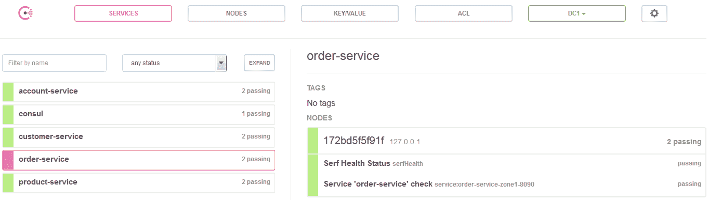
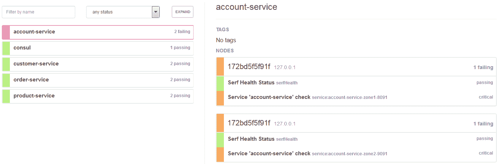
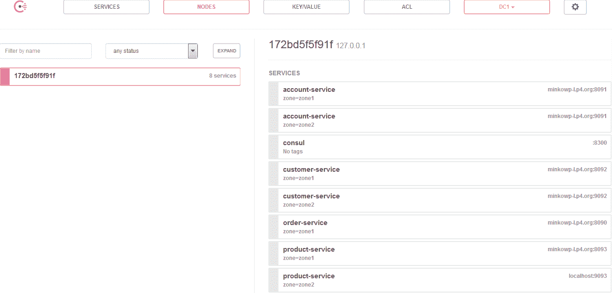
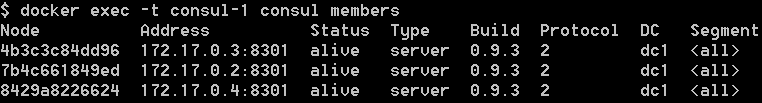
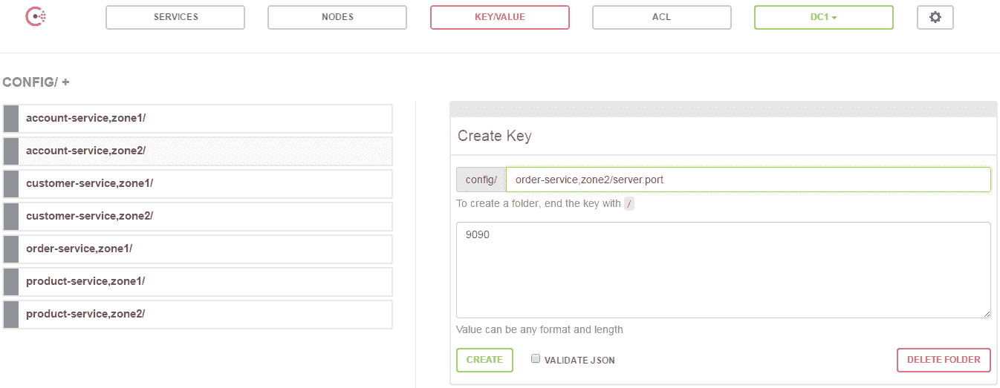
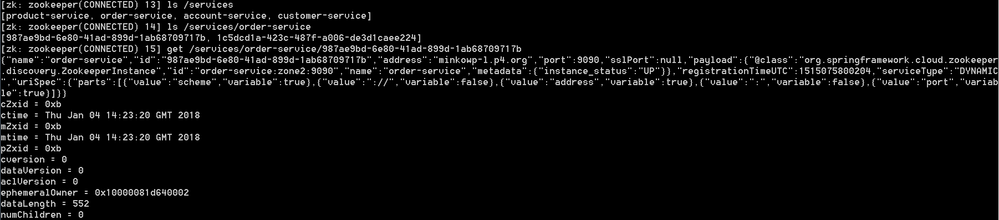

# 十、其他配置和发现功能

我们在[第 4 章](04.html)、*服务发现*、[第 5 章](05.html)、*使用 Spring Cloud 配置*进行分布式配置时，都讲了很多关于服务发现和分布式配置的内容。我们详细讨论了两种解决方案。第一个是 Eureka，由 Netflix OSS 提供，并已被 Spring Cloud 用于服务发现。第二个是专门用于分布式配置的 SpringCloudConfig 项目。然而，市场上有一些有趣的解决方案有效地结合了这两个特性。目前，Spring Cloud 支持其中两种：

*   **领事**：本产品由 HashiCorp 制造。它是一个高可用的分布式解决方案，旨在跨动态分布式基础架构连接和配置应用程序。Concur 是一个相当复杂的产品，有多个组件，但其主要功能是跨任何基础架构发现和配置服务。
*   这是由 Apache 软件基金会建立的。它是一个用 Java 编写的分布式、分层的键/值存储。它旨在维护配置信息、命名和分布式同步。与 Concur 相比，它更像是一个原始的密钥/值存储，而不是一个现代服务发现工具。然而，Zookeeper 仍然非常流行，特别是对于基于 Apache 软件堆栈的解决方案。

对该地区另外两种流行产品的支持仍处于开发阶段。以下项目尚未添加到官方的 SpringCloud发布系列中：

*   **Kubernetes**：这是一个开源解决方案，旨在自动化容器化应用程序的部署、扩展和管理，最初由谷歌创建。这个工具现在非常流行。最近，Docker 平台开始支持 Kubernetes。
*   **Etcd**：这是一个分布式可靠的密钥/值存储，用于存储用 Go 编写的分布式系统的最关键数据。许多公司和其他软件产品（例如 Kubernetes）都在生产中使用它。

在本章中，我将只介绍官方支持的解决方案，即 Concur 和 Zookeeper。Kubernetes 不仅仅是一个键/值存储或服务注册表，将在[第 14 章](14.html)、*Docker Support*中讨论。

# 使用 SpringCloud 领事

SpringCloudConcur 项目通过自动配置为 Concur 和 SpringBoot 应用程序提供集成。通过使用众所周知的 Spring 框架注释样式，我们可以在基于微服务的环境中启用和配置公共模式。这些模式包括使用领事代理的服务发现、使用领事密钥/值存储的分布式配置、使用 SpringCloudBus 的分布式事件以及领事事件。该项目还支持基于 Netflix Ribbon 的客户端负载平衡器和基于 Netflix Zuul 的 API 网关。在我们开始讨论这些特性之前，我们首先必须运行并配置领事代理。

# 运行领事代理

我们将从在本地机器上启动领事代理的最简单方法开始。使用 Docker 容器可以轻松设置独立开发模式。以下命令将从 Docker Hub 上提供的官方 Hashicorp 图像启动领事容器：

```java
docker run -d --name consul -p 8500:8500 consul
```

启动后，可在地址`http://192.168.99.100:8500`下找到领事。它公开了 RESTfulHTTPAPI，即主接口。所有 API 路由都以`/v1/`为前缀。当然，不需要直接使用 API。有一些编程库可以用来更方便地使用 API。其中一个是`consul-api`，客户端是用 Java 编写的，也是 Spring Cloud Consor 内部使用的。还有 Consor 提供的 web UI 仪表板，其地址与 HTTP API 相同，但位于不同的上下文路径`/ui/`。它允许查看所有已注册的服务和节点，查看所有运行状况检查及其当前状态，以及读取和设置键/值数据。

正如我在本节前言中所提到的，我们将使用 Consor agent、events 和 KV store 的三种不同功能。它们中的每一个分别由端点组`/agent`、`/event`和`/kv`表示。最有趣的代理端点是那些与服务注册相关的端点。以下是这些端点的列表：

| **方法** | **路径** | **说明** |
| `GET` | `/agent/services` | 它返回向本地代理注册的服务列表。如果 Concur 以集群模式运行，则该列表可能不同于在集群成员之间执行同步之前由`/catalog`端点报告的列表。 |
| `PUT` | `/agent/service/register` | 它向本地代理添加一个新服务。代理负责管理本地服务，并向服务器发送更新以执行全局编录的同步。 |
| `PUT` | `/agent/service/deregister/:service_id` | 它从本地代理中删除带有`service_id`的服务。代理负责在全局编录中注销服务。 |

`/kv`端点专用于管理简单的键/值存储，这对于存储服务配置或其他元数据特别有用。值得注意的是，每个数据中心都有自己的 KV 存储，因此为了在多个节点上共享它，我们应该配置领事复制守护进程。无论如何，下面列出了管理键/值存储的三个端点：

| **方法** | **路径** | **说明** |
| `GET` | `/kv/:key` | 它返回给定键名的值。如果请求的密钥不存在，HTTP 状态 404 将作为响应返回。 |
| `PUT` | `/kv/:key` | 它用于向存储添加新密钥，或仅使用密钥名称更新现有密钥。 |
| `DELETE` | `/kv/:key` | 它是用于删除具有相同前缀的单个键或所有键的最后一个 CRUD 方法。 |

SpringCloud 使用 Concur 事件提供动态配置重新加载。有两种简单的 API 方法。第一个`PUT /event/fire/:name`触发了一个新事件。第二个，`GET /event/list`返回事件列表，可以按名称、标记、节点或服务名称进行过滤。

# 客户端的集成

要在项目中激活领事服务发现，您应该将初学者`spring-cloud-starter-consul-discovery`包含在依赖项中。如果您想使用 concur 启用分布式配置，只需包括`spring-cloud-starter-consul-config`。在某些情况下，您可能会在客户端应用程序中同时使用这两个特性。然后，您应该声明对`spring-cloud-starter-consul-all`工件的依赖关系：

```java
<dependency>
    <groupId>org.springframework.cloud</groupId>
    <artifactId>spring-cloud-starter-consul-all</artifactId>
</dependency>
```

默认情况下，领事代理人应在地址`localhost:8500`下可用。如果您的申请不同，您应在`application.yml`或`bootstrap.yml`文件中提供适当的地址：

```java
spring:
 cloud:
  consul:
   host: 192.168.99.100
   port: 18500
```

# 服务发现

通过使用通用 Spring Cloud`@EnableDiscoveryClient`注释主类，可以为应用程序启用 Consor 发现。您应该记住[第 4 章](04.html)中的*服务发现*，因为与 Eureka 相比没有区别。默认服务名称也取自`${spring.application.name}`属性。在 GitHub 上的[中提供了使用 Concur 作为发现服务器的示例微服务 https://github.com/piomin/sample-spring-cloud-consul.git](https://github.com/piomin/sample-spring-cloud-consul.git) 存储库。系统的体系结构与前几章中的示例相同。有四个微服务，`order-service`、`product-service`、`customer-service`、`account-service`，API 网关在模块`gateway-service`中实现。对于服务间通信，我们将使用外部客户端和功能区负载平衡器：

```java
@SpringBootApplication
@EnableDiscoveryClient
@EnableFeignClients
public class CustomerApplication {

    public static void main(String[] args) {
        new SpringApplicationBuilder(CustomerApplication.class).web(true).run(args);
    }

}
```

默认情况下，Spring Boot 应用程序在 Consor 中注册，实例 ID 作为从属性`spring.application.name`、`spring.profiles.active`、`server.port`中获取的值的串联而生成。在大多数情况下，确保 ID 是唯一的就足够了，但是如果需要自定义模式，可以使用`spring.cloud.consul.discovery.instanceId`属性轻松设置：

```java
spring:
 cloud:
  consul:
   discovery:
    instanceId: ${spring.application.name}:${vcap.application.instance_id:${spring.application.instance_id:${random.value}}}
```

启动所有示例微服务后，请查看 Consour UI 仪表板。您应该看到注册了四种不同的服务，如以下屏幕截图所示：



或者，您可以使用 RESTful HTTP API 端点`GET /v1/agent/services`查看已注册服务的列表。以下是 JSON 响应的片段：

```java
"customer-service-zone1-8092": {
 "ID": "customer-service-zone1-8092",
 "Service": "customer-service",
 "Tags": [],
 "Address": "minkowp-l.p4.org",
 "Port": 8092,
 "EnableTagOverride": false,
 "CreateIndex": 0,
 "ModifyIndex": 0
},
"order-service-zone1-8090": {
 "ID": "order-service-zone1-8090",
 "Service": "order-service",
 "Tags": [],
 "Address": "minkowp-l.p4.org",
 "Port": 8090,
 "EnableTagOverride": false,
 "CreateIndex": 0,
 "ModifyIndex": 0
}
```

现在，您可以使用`pl.piomin.services.order.OrderControllerTest`JUnit 测试类向`order-service`发送一些测试请求，从而轻松地测试整个系统。一切都应该很好，就像发现尤里卡一样。

# 健康检查

领事通过调用`/health`端点检查每个注册实例的运行状况。如果您不希望在类路径中提供 Spring Boot Actuator 库，或者您的服务存在一些问题，则可以在 web 仪表板上看到：



如果出于任何原因，健康检查端点在不同的上下文路径下可用，则可以使用`spring.cloud.consul.discovery.healthCheckPath`属性覆盖该路径。还可以通过使用模式定义`healthCheckInterval`来更改状态刷新间隔，例如，秒为`10s`或分钟为`2m`。

```java
spring:
 cloud:
  consul:
   discovery:
    healthCheckPath: admin/health
    healthCheckInterval: 20s
```

# 地带

我想您还记得我们在[第 4 章](04.html)、*服务发现*中讨论过可用于发现的分区机制。当主机被放置在不同的位置，并且您更希望在同一区域中注册的实例之间进行通信时，此功能非常有用。春云领事的官方文件（[http://cloud.spring.io/spring-cloud-static/spring-cloud-consul/1.2.3.RELEASE/single/spring-cloud-consul.html](http://cloud.spring.io/spring-cloud-static/spring-cloud-consul/1.2.3.RELEASE/single/spring-cloud-consul.html) 没有提到这样的解决方案，幸运的是，这并不意味着它没有得到实施。SpringCloud 提供了一种基于领事标签的分区机制。应用程序的默认区域可以配置有`spring.cloud.consul.discovery.instanceZone`属性。它使用传递的值设置在`spring.cloud.consul.discovery.defaultZoneMetadataName`属性中配置的标记。默认元数据标签名称为`zone`。

让我们回到示例应用程序。我已经用两个配置文件扩展了所有配置文件，`zone1`和`zone2`。这是`order-service`的`bootstrap.yml`文件：

```java
spring: 
 application:
  name: order-service
 cloud:
  consul:
   host: 192.168.99.100
   port: 8500

---
spring:
 profiles: zone1
 cloud:
  consul:
   discovery:
    instanceZone: zone1
server: 
 port: ${PORT:8090}

---
spring:
 profiles: zone2
  cloud:
   consul:
    discovery:
     instanceZone: zone2
server: 
 port: ${PORT:9090}
```

在两个不同的区域中注册的每个微服务都有两个运行实例。在使用`mvn clean install`命令构建整个项目后，您应该使用活动配置文件`zone1`或`zone2`启动 Spring Boot 应用程序，例如`java -jar --spring.profiles.active=zone1 target/order-service-1.0-SNAPSHOT.jar`。您可以在“节点”部分中看到用分区标记的已注册实例的完整列表。在以下屏幕截图中可以看到领事仪表板的视图：



我们架构的最后一个元素是基于 Zuul 的 API 网关。我们还在不同的区域运行两个`gateway-service`实例。我们希望省略在 concur 中的注册，只允许获取配置，功能区客户端在执行负载平衡时使用该配置。这是`gateway-service`的`bootstrap.yml`文件的片段。通过将属性`spring.cloud.
consul.discovery.register`和`spring.cloud.consul.discovery.
registerHealthCheck`设置为`false`已禁用注册：

```java
---
spring:
 profiles: zone1
 cloud:
 consul:
 discovery:
 instanceZone: zone1
 register: false
 registerHealthCheck: false
server: 
 port: ${PORT:8080}

---
spring:
 profiles: zone2
 cloud:
 consul:
 discovery:
 instanceZone: zone2
 register: false
 registerHealthCheck: false
server: 
 port: ${PORT:9080}
```

# 客户端设置自定义

可以通过配置文件中的属性定制 Spring Cloud Concur 客户端。其中一些设置已在本章前面的章节中介绍。下表列出了其他有用的设置。均以`spring.cloud.consul.discovery`为前缀：

| **物业** | **默认值** | **说明** |
| `enabled` | `true` | 它设置是为应用程序启用还是禁用领事发现 |
| `failFast` | `true` | 如果`true`，则在服务注册时抛出异常；否则，它会记录警告 |
| `hostname` | - | 它在 Consor 中注册时设置实例的主机名 |
| `preferIpAddress` | `false` | 它强制应用程序在注册期间发送其 IP 地址而不是主机名 |
| `scheme` | `http` | 它设置服务在 HTTP 或 HTTPS 协议下是否可用 |
| `serverListQueryTags` | - | 它允许通过单个标记过滤服务 |
| `serviceName` | - | 它覆盖服务名称，默认情况下该名称取自属性`spring.application.name` |
| `tags` | - | 它使用注册服务时使用的值设置列表标记 |

# 在集群模式下运行

到目前为止，我们一直在启动一个单独的 concur 实例。就开发模式而言，这是一个合适的解决方案，对于产品来说还不够。在这里，我们希望有一个可扩展的、生产级的服务发现基础设施，由集群内协同工作的一些节点组成。Concur 基于用于成员间通信的八卦协议和领导层选举的 Raft 共识协议，为集群提供支持。我不想详细介绍这个过程，但是应该澄清一些关于领事架构的基础知识。

我们已经讨论过领事代理人，但没有解释它到底是什么以及它的角色是什么。代理是领事集群中每个成员上的长时间运行的守护进程。它可以在客户端或服务器模式下运行。所有代理都负责在不同的节点上运行检查并保持服务在全球范围内同步注册。

本节的主要目标是使用其 Docker 映像设置和配置 Concur 集群。首先，我们将启动容器，它充当集群的领导者。当前使用的 Docker 命令与独立的 Concur 服务器只有一个区别。我们设置了环境变量`CONSUL_BIND_INTERFACE=eth0`，以便将集群代理的网络地址从`127.0.0.1`更改为可用于其他成员容器的网络地址。我的领事服务器正在内部地址`172.17.0.2`运行。要查看您的地址（应该是相同的），您可以运行命令`docker logs consul`。容器启动后立即记录相应的信息：

```java
docker run -d --name consul-1 -p 8500:8500 -e CONSUL_BIND_INTERFACE=eth0 consul
```

了解该地址非常重要，因为现在我们必须将它作为集群连接参数传递给每个成员容器启动命令。我们还通过将`0.0.0.0`设置为客户端地址将其绑定到所有接口。现在，我们可以使用`-p`参数轻松地在容器外部公开客户端代理 API：

```java
docker run -d --name consul-2 -p 8501:8500 consul agent -server -client=0.0.0.0 -join=172.17.0.2
docker run -d --name consul-3 -p 8502:8500 consul agent -server -client=0.0.0.0 -join=172.17.0.2
```

在使用 Consor agent 运行两个容器后，您可以通过在领导者的容器上执行以下命令来签出集群成员的完整列表：



领事服务器代理在`8500`端口公开，成员代理在`8501`和`8502`端口公开。即使 microservice 实例将自己注册到成员代理，集群的所有成员都可以看到它：


通过更改配置属性，我们可以轻松更改 Spring Boot 应用程序的默认领事代理地址：

```java
spring: 
 application:
  name: customer-service
 cloud:
  consul:
   host: 192.168.99.100
   port: 8501
```

# 分布式配置

类路径中具有 Spring Cloud Consor Config 库的应用程序在引导阶段从 Consor 键/值存储中获取配置。即默认情况下存储在`/config`文件夹中。当我们首先创建一个新密钥时，我们必须设置一个文件夹路径。然后，该路径用于标识密钥并将其分配给应用程序。SpringCloudConfig 尝试根据应用程序名称和活动配置文件解析存储在文件夹中的属性。假设我们在`bootstrap.yml`文件中将`spring.application.name`属性设置为`order-service`，并将`spring.profiles.active`运行参数设置为`zone1`，它将尝试按以下顺序定位属性源：`config/order-service,zone1/`、`config/order-service/`、`config/application,zone1/`、`config/application/`。前缀为`config/application`的所有文件夹是专用于所有没有特定于服务的属性源的应用程序的默认配置。

# 在领事馆管理财产

向 Consour 添加单个键的最舒适方式是通过其 web 仪表板。另一种方法是使用`/kv`HTTP 端点，本章开头已经描述过。使用 web 控制台时，必须转到“键/值”部分。然后，您可以查看所有当前存在的密钥，还可以通过以任何格式提供其完整路径和值来创建新密钥。该功能在以下屏幕截图中显示：



每个密钥都可以更新或删除：


要访问使用 Consor 中存储的属性源的示例应用程序，应切换到与上一个示例相同的存储库中的分支配置。我为每个微服务创建了键`server.port`和`spring.cloud.consul.discovery.instanceZone`，而不是在`application.yml`或`bootstrap.yml`文件中定义它。

# 客户定制

领事配置客户端可以自定义以下属性，前缀为`spring.cloud.consul.config`：

*   `enabled`：通过将此属性设置为`false`，可以禁用领事配置。如果您包括`spring-cloud-starter-consul-all`，它将同时启用发现和分布式配置，这将非常有用。
*   `fail-fast`：设置是在配置查找时抛出异常，还是在连接失败时抛出日志警告。将其设置为`true`允许应用程序继续正常启动。
*   `prefix`：设置所有配置值的基本文件夹。默认为`/config`。
*   `defaultContext`：设置所有没有特定配置的应用程序使用的文件夹名称。默认为`/application`。例如，如果将其覆盖为`app`，则应在文件夹`/config/apps`中搜索属性
*   `profileSeparator`：默认情况下，配置文件与应用程序名称之间用逗号分隔。该属性允许您重写该分隔符的值。例如，如果将其设置为`::`，则应创建文件夹`/config/order-service::zone1/`。下面是一个例子：

```java
spring:
 cloud:
  consul:
   config:
    enabled: true
    prefix: props
    defaultContext: app
    profileSeparator: '::'
```

有时，您希望存储以 YAML 或 properties 格式创建的属性 blob，而不是单个键/值对。在这种情况下，您应该将`spring.cloud.consul.config.format`属性设置为`YAML`或`PROPERTIES`。然后，应用程序将查找位于具有数据密钥的文件夹内的配置属性，例如，`config/order-service,zone1/data`、`config/order-service/data`、`config/application,zone1/data`或`config/application/data`。可以使用`spring.cloud.consul.config.data-key`属性更改默认数据键。

# 监视配置更改

上一节讨论的示例在应用程序启动时加载配置。如果希望重新加载该配置，则应向`/refresh`端点发送 HTTP`POST`。为了研究这种刷新对我们的应用程序的作用，我们修改了负责创建一些测试数据的应用程序代码片段。到目前为止，它作为一个存储库`@Bean`提供，其中包含一些硬编码的内存对象。请看下面的代码：

```java
@Bean
CustomerRepository repository() {
    CustomerRepository repository = new CustomerRepository();
    repository.add(new Customer("John Scott", CustomerType.NEW));
    repository.add(new Customer("Adam Smith", CustomerType.REGULAR));
    repository.add(new Customer("Jacob Ryan", CustomerType.VIP));
    return repository;
}
```

我们的目标是使用 concur 键/值特性将此处可见的代码移动到配置存储区。为了实现这一点，我们必须为每个对象创建三个键，分别命名为`id`、`name`和`type`。配置是从带有`repository`前缀的属性加载的：

```java
@RefreshScope
@Repository
@ConfigurationProperties(prefix = "repository")
public class CustomerRepository {

    private List<Customer> customers = new ArrayList<>();

    public List<Customer> getCustomers() {
        return customers;
    }

    public void setCustomers(List<Customer> customers) {
        this.customers = customers;
    }
    // ...
}
```

下一步是使用 Concur web dashboard 为每个服务定义适当的键。下面是由`Customer`对象组成的列表的示例配置。该列表在应用程序启动时初始化：


您可以更改每个属性的值。由于领事能够监视密钥前缀，更新事件将自动发送到应用程序。如果有新的配置数据，刷新事件将发布到队列。所有队列和交换都是在应用程序启动时由 Spring Cloud Bus 创建的，它作为`spring-cloud-starter-consul-all`的依赖项包含在项目中。如果您的应用程序收到此类事件，它将在日志中打印以下信息：

```java
Refresh keys changed: [repository.customers[1].name]
```

# 使用 SpringCloudZooKeeper

SpringCloud 支持作为微服务架构一部分使用的各种产品。您可以在阅读本章时了解到这一点，在本章中，Concur 与作为发现工具的 Eureka 以及作为分布式配置工具的 Spring Cloud Config 进行了比较。Zookeeper 是另一个解决方案，可以作为前面列出的解决方案的替代选择。与 Concur 一样，它可以用于服务发现和分布式配置。要在项目中启用 Spring Cloud Zookeeper，您应该为服务发现功能包含`spring-cloud-starter-zookeeper-discovery`启动器，或为配置服务器功能包含`spring-cloud-starter-zookeeper-config`。或者，您可以声明一个激活应用程序所有功能的`spring-cloud-starter-zookeeper-all`依赖项。不要忘记包括`spring-boot-starter-web`，它仍然是提供 web 功能所必需的：

```java
<dependency>
    <groupId>org.springframework.cloud</groupId>
    <artifactId>spring-cloud-starter-zookeeper-all</artifactId>
</dependency>
<dependency>
    <groupId>org.springframework.boot</groupId>
    <artifactId>spring-boot-starter-web</artifactId>
</dependency>
```

Zookeeper 连接设置是自动配置的。默认情况下，客户端尝试连接到`localhost:2181`。为了覆盖它，您应该使用当前服务器网络地址定义`spring.cloud.zookeeper.connect-string`属性：

```java
spring:
 cloud:
  zookeeper:
   connect-string: 192.168.99.100:2181
```

与 Spring Cloud Consour 一样，Zookeeper 支持 Spring Cloud Netflix 提供的所有最流行的通信库，如 Faign、Ribbon、Zuul 或 Hystrix。在开始处理示例实现之前，首先必须启动 Zookeeper 实例。

# 流动动物园管理员

正如您可能猜到的，我将使用 Docker 图像在本地机器上启动 Zookeeper。以下命令启动 Zookeeper 服务器实例。由于<q>快速</q>故障，最好的方法是始终重新启动：

```java
docker run -d --name zookeeper --restart always -p 2181:2181 zookeeper
```

与之前在此领域讨论的解决方案（如 Concur 或 Eureka）不同，Zookeeper 没有提供简单的 RESTful API 或 web 管理控制台，使我们能够轻松管理它。它有一个针对 Java 和 C 的官方 API 绑定。我们也可以使用它的命令行界面，它可以在 Docker 容器中轻松启动。此处可见的命令使用命令行客户端启动容器，并将其链接到 Zookeeper 服务器容器：

```java
docker run -it --rm --link zookeeper:zookeeper zookeeper zkCli.sh -server zookeeper
```

Zookeeper CLI 允许执行一些有用的操作，例如：

*   **创建 znode**：要创建具有给定路径的 znode，请使用命令`create /path /data`。
*   **获取数据**：命令`get /path`返回与 znode 关联的数据和元数据。
*   **查看 znode 的更改**：如果 znode 或 znode 的子数据发生更改，则显示通知。只能通过`get`命令设置观看。
*   **设置数据**：要设置 znode 数据，请使用`set /path /data`命令。
*   **创建 znode 子节点**：此命令类似于创建单个 znode 的命令，唯一的区别是子 znode 的路径包含父路径`create /parent/path/subnode/path /data`。
*   **列出 znode**的子项：可以使用`ls /path`命令显示。
*   **校验状态**：可通过`stat /path`命令进行校验。状态描述指定 znode 的元数据，如时间戳或版本号。
*   **删除/删除 znode**：命令`rmr /path`删除 znode 及其所有子节点。

在该片段中，术语*znode*首次出现。在存储数据时，Zookeeper 使用树结构，其中每个节点称为**znode**。这些 znode 的名称基于从根节点获取的路径。每个节点都有一个名称。可以使用从根节点开始的绝对路径访问它。此概念类似于领事文件夹，用于在密钥/值存储中创建密钥。

# 服务发现

ApacheZooKeeper 最流行的 Java 客户端库是 ApacheCurator。它提供了一个 API 框架和实用程序，使使用 ApacheZooKeeper 变得更加容易。它还包括常见用例和扩展的配方，如服务发现或 Java8 异步 DSL。SpringCloudZooKeeper 利用这样一个扩展来实现服务发现。SpringCloudZooKeeper 对 Curator 库的使用对于开发人员来说是完全透明的，所以我不想在这里详细描述它。

# 客户端实现

客户端的用法与其他与服务发现相关的 SpringCloud项目相同。应用程序主类或`@Configuration`类应该用`@EnableDiscoveryClient`注释。默认服务名称、实例 ID 和端口分别取自`spring.application.name`、Spring 上下文 ID 和`server.port`。
示例应用程序源代码可在 GitHub 存储库的[中找到 https://github.com/piomin/sample-spring-cloud-zookeeper.git](https://github.com/piomin/sample-spring-cloud-zookeeper.git) 。从根本上说，除了依赖于 SpringCloudZooKeeper 发现之外，它与为 Concur 引入的示例系统没有什么不同。它仍然由四个相互通信的微服务组成。现在，在克隆存储库之后，使用`mvn clean install`命令构建它。然后，使用`java -jar`命令，例如`java -jar --spring.profiles.active=zone1 order-service/target/order-service-1.0-SNAPSHOT.jar`，使用活动配置文件名运行每个服务。

您可以使用 CLI 命令`ls`和`get`查看已注册服务和实例的列表。Spring Cloud Zookeeper 默认情况下在`/services`根文件夹中注册所有实例。它可能被`spring.cloud.zookeeper.discovery.root`属性覆盖。通过将 Docker 容器与命令行客户端一起使用，您可以签出当前已注册服务的列表：



# 动物园管理员依赖关系

Spring Cloud Zookeeper 还有一个附加功能，称为**Zookeeper 依赖项**。依赖项应理解为在 Zookeeper 中注册的其他应用程序，这些应用程序通过外部客户端或 Spring`RestTemplate`调用。这些依赖项可以作为应用程序的属性提供。将`spring-cloud-starter-zookeeper-discovery`启动器加入项目后，通过自动配置启用该功能。可通过将`spring.cloud.zookeeper.dependency.enabled`属性设置为`false`来禁用。

Zookeeper 依赖机制的配置提供了`spring.cloud.zookeeper.dependencies.*`属性。下面是`order-service`中的`bootstrap.yml`文件片段。此服务与所有其他可用服务集成：

```java
spring: 
 application:
  name: order-service
 cloud:
  zookeeper:
   connect-string: 192.168.99.100:2181
  dependency:
   resttemplate:
    enabled: false
  dependencies:
   account:
    path: account-service
    loadBalancerType: ROUND_ROBIN
    required: true
   customer:
    path: customer-service
    loadBalancerType: ROUND_ROBIN
    required: true
   product:
    path: product-service
    loadBalancerType: ROUND_ROBIN
    required: true
```

让我们仔细看看前面的配置。每个被调用服务的根属性都是别名，外国客户端或`@LoadBalanced RestTemplate`可以使用别名作为服务名称：

```java
@FeignClient(name = "customer")
public interface CustomerClient {

    @GetMapping("/withAccounts/{customerId}")
    Customer findByIdWithAccounts(@PathVariable("customerId") Long customerId); 

}
```

配置中的下一个非常重要的字段是路径。它设置在 Zookeeper 中注册依赖项的路径。因此，如果该属性的值为`customer-service`，则表示 Spring Cloud Zookeeper 尝试在路径`/services/customer-service`下查找适当的服务 znode。还有一些其他属性可以自定义客户端的行为。其中一个是`loadBalancerType`，用于应用负载平衡策略。我们可以在三种可用策略中进行选择：`ROUND_ROBIN`、`RANDOM`和`STICKY`。我还为每个服务映射将`required`属性设置为`true`。现在，如果您的应用程序在启动时无法检测到所需的依赖关系，它将无法启动。Spring Cloud Zookeeper 依赖项还允许管理 API 版本（属性`contentTypeTemplate`和`versions`）和请求头（属性`headers`）

默认情况下，Spring Cloud Zookeeper 启用`RestTemplate`与依赖项进行通信。在分支依赖项（[中提供的示例应用程序中 https://github.com/piomin/sample-spring-cloud-zookeeper/tree/dependencies](https://github.com/piomin/sample-spring-cloud-zookeeper/tree/dependencies) ），我们使用外挂客户端而不是`@LoadBalanced RestTemplate`，为了禁用该功能，我们应该将属性`spring.cloud.zookeeper.dependency.resttemplate.enabled`设置为`false`。

# 分布式配置

Zookeeper 的配置管理与 SpringCloudConcur 配置的配置管理非常相似。默认情况下，所有属性源都存储在`/config`文件夹中（或 Zookeeper 术语中的 znode）。让我再指出一次。假设我们在`bootstrap.yml`文件中将`spring.application.name`属性设置为`order-service`，并将`spring.profiles.active`运行参数设置为`zone1`，它将尝试按以下顺序定位属性源：`config/order-service,zone1/`、`config/order-service/`、`config/application,zone1/`、`config/application/`。存储在名称空间中前缀为`config/application`的文件夹中的属性可用于所有使用 Zookeeper 进行分布式配置的应用程序。

要访问示例应用程序，您需要切换到[中的分支配置 https://github.com/piomin/sample-spring-cloud-zookeeper.git](https://github.com/piomin/sample-spring-cloud-zookeeper.git) 存储库。此处可见的本地`application.yml`或`bootstrap.yml`文件中定义的配置现在已移动到 Zookeeper：

```java
---
spring:
 profiles: zone1
server: 
 port: ${PORT:8090}

---
spring:
 profiles: zone2
server: 
 port: ${PORT:9090}
```

必须使用 CLI 创建所需的 znode。下面是 Zookeeper 命令列表，这些命令使用给定路径创建 zNode。我使用了`create /path /data`命令：


# 总结

在本章中，我将引导您了解两个 SpringCloud 项目 Concur 和 Zookeeper 的主要功能。我不仅关注 SpringCloud的功能，还向您介绍了如何启动、配置和维护其工具实例。我们讨论了更高级的场景，例如使用 Docker 设置由多个成员组成的集群。在那里，您有机会看到 Docker 作为开发工具的真正威力。它允许我们只使用三个简单的命令初始化一个由三个成员组成的集群，而不需要任何额外的配置。

在使用 SpringCloud 时，Concur 似乎是 Eureka 作为发现服务器的重要替代品。我不能对动物园管理员说同样的话。正如你们可能已经注意到的，我写的关于领事的文章比关于动物园管理员的要多得多。此外，春云将动物园管理员视为第二选择。与 SpringCloudConcur 相比，它仍然没有分区机制，也没有监视已实现的配置更改的功能。你不应该对此感到惊讶。Concur 是一种现代解决方案，旨在满足最新体系结构（如基于微服务的系统）的需求，而 Zookeeper 是一种密钥/价值存储，用作分布式环境中运行的应用程序的服务发现工具。但是，如果在系统中使用 Apache 基础堆栈，则值得考虑该工具。有鉴于此，您可以利用 Zookeeper 和其他 Apache 组件（如 Camel 或 Karaf）之间的集成，轻松发现使用 SpringCloud框架创建的服务。

总之，在阅读本章之后，您应该能够在基于微服务的体系结构中使用 Spring Cloud Consult 和 Spring Cloud Zookeeper 的主要功能。您还应该了解 SpringCloud 中所有可用的发现和配置工具的主要优点和缺点，以便为您的系统选择最合适的解决方案。