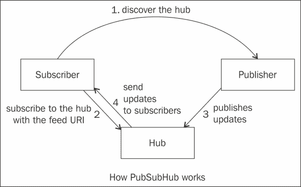
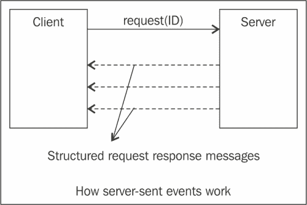

# 第 6 章新兴标准与 REST 的未来

本章介绍了新兴和不断发展的技术，这些技术将增强 RESTful 服务的功能，并对 REST 以及其他实时 API 支持者的未来提供一些展望。我们将介绍一些实时 API，并了解它们如何对轮询等较旧的方法有所帮助。考虑到 Twitter、Facebook 和 Stripe 等平台的普遍流行，它们采用了范式转换，从而提供实时 API，在事件发生时向客户端提供信息也就不足为奇了。

本章将涵盖以下主题：

*   实时 API
*   投票
*   网钩
*   网袋
*   其他实时 API 支持者，包括以下内容：
    *   PubSubHubbub
    *   服务器发送事件
    *   XMPP
    *   XMPP 上的波什
*   使用 WebHook 和 WebSocket 的公司案例研究
*   Webhook 与 WebSocket 的比较
*   休息和微型服务

我们将首先定义实时 API 所指的内容，然后介绍轮询及其缺点。接下来，我们将介绍广泛用于异步实时通信的不同模型。最后，我们将详细阐述 webhook 和 WebSockets 的实用方法。

# 实时 API

在我们的上下文中，实时 API 帮助 API 使用者在事件发生时接收他们感兴趣的事件。实时更新的一个例子是，有人在 Facebook 上发布链接，或者有人在 Twitter 上关注某个话题。实时 API 的另一个示例是接收股票价格变化的反馈。

# 投票

轮询是从产生事件和更新流的数据源获取数据的最传统方式。客户机定期发出请求，如果有响应，服务器发送数据。如果服务器没有要发送的数据，则返回空响应。下图显示了连续轮询的工作原理：


轮询有多个缺点，例如当服务器上没有更新时，对请求的响应为空；这导致了带宽和处理时间的浪费。较低频率的轮询将导致客户端在接近更新发生时间时丢失更新，过于频繁的轮询将导致资源浪费，并面临服务器施加的速率限制。

为了消除轮询的这些缺点，我们将介绍以下主题：

*   PuSH 模型 pubsubbub
*   流媒体模型

## 推送模式——PubSubHubbub

PuSH 是一个基于发布/订阅协议的简单主题，它基于 ATOM/RSS。它的目标是将 atom 提要转换为实时数据，并消除影响提要消费者的轮询。订阅者登记他们对某个主题的兴趣，原始出版商告诉感兴趣的订阅者他们感兴趣的新内容。

为了分发发布和内容分发的任务，有一个**集线器**的概念，可以委托将内容发送给订阅者。下图描述了 PubSubHubbub 模型：



让我们看看这个模型是如何工作的：

1.  **订阅者**通过从**发布者**获取提要，发现了**集线器**。
2.  一旦**集线器**被发现，**订户**使用感兴趣的提要 URI 订阅**集线器**。
3.  现在，当**发布者**有更新要发送时，它会让**集线器**获取更新。
4.  然后，**集线器**将更新发送给所有发布者。

这种模式的优势在于发布者不必关心向所有订阅者发送更新。另外，在另一端，订阅者有一个优势，因为他们在更新发生时从集线器获得更新，而无需连续轮询发布者。

后续章节中讨论的**WebHooks**范例使用此协议。

## 流媒体模型

异步通信的流模型涉及保持通道开放，并在数据发生时发送数据。在这种情况下，插座连接需要保持打开状态。

### 服务器发送事件

**服务器发送事件**（**SSE**是一种基于流媒体模型的技术，浏览器通过 HTTP 连接从服务器获取自动更新。W3C 已经将服务器发送事件 EventSourceAPI 标准化为 HTML5 的一部分。

使用 SSE，客户端使用`"text/eventstream"`MimeType 向服务器发起请求。一旦初始握手发生，服务器可以在事件发生时继续向客户端发送事件。事件是从服务器发送到客户端的纯文本消息。它们可以是事件侦听器可以在客户端使用的数据，并且事件侦听器可以解释和响应接收到的事件。

SSE 为从服务器发送到客户端的事件定义消息格式。消息格式由一行由字符流分隔的纯文本组成。携带消息体或数据的行以`data:`开头，以`\n\n`结尾，如以下代码段所示：

```java
data: My message \n\n
```

带有一些**服务质量**（**QoS**指令）的行（例如，`retry`和`id`以 QoS 属性名称开头，后跟`:`，然后是 QoS 属性的值。标准格式使围绕 SSE 开发通用库成为可能，从而简化软件开发。

下面的图显示了 SSE 的工作原理：



如图所示，客户机订阅了一个事件源。服务器会在更新发生时不断发送更新。

此外，服务器可以将 ID 与整个消息关联并发送，如以下代码段所示：

```java
id: 12345\n
data: Message1\n
data: Message 2\n\n
```

前面的代码片段显示了如何发送带有事件 ID 和数据的多行消息，最后一行以两个`\n\n`字符结尾。

通过设置 ID，客户端可以跟踪上次触发的事件，这样，如果断开与服务器的连接，则会使用客户端发送的新请求设置一个特殊的 HTTP 头（`Last-Event-ID`。

接下来的部分将介绍如何将 ID 与 SSE 关联，SSE 如何处理连接丢失和重试，以及如何将事件名称与 SSE 关联。

#### 将 ID 与事件关联

每个 SSE 消息都可以有一个消息标识符，该标识符可用于多种目的，例如，跟踪客户端接收到的消息，并为其保留一个检查点。在 SSE 中使用消息 ID 时，客户端可以提供最后一个消息 ID 作为连接参数之一，以指示服务器从特定消息继续。当然，服务器端代码应该实现一个适当的过程，以便根据客户机的请求从消息 ID 恢复通信。

ID 为的 SSE 消息示例显示在以下代码段中：

```java
id: 123 \n
data: This is a single line event \n\n
```

#### 连接失败时重试

Firefox、Chrome、Opera 和 Safari 支持服务器发送事件。如果浏览器和服务器之间的连接丢失，浏览器可以尝试重新连接到服务器。有一个 retry 指令，服务器可以配置该指令以启用客户端的重试。重试间隔的默认值为 3 秒。要将重试间隔增加到 5 秒，服务器可以发送重试事件，如图所示：

```java
retry: 5000\n
data: This is a single line data\n\n
```

#### 将事件名称与事件关联

另一个 SSE 指令是事件名称。每个事件源可以生成多个类型的事件，客户端可以根据订阅的事件类型决定如何使用每个事件类型。下面的代码片段显示了`name`事件指令如何合并到消息中：

```java
event: bookavailable\n
data: {"name" : "Game of Thrones"}\n\n
event: newbookadded\n
data: {"name" :"Storm of Swords"}\n\n
```

### 服务器发送事件和 JavaScript

对于 java 开发者来说，客户端的 SSE 的基础是 AUTYT2 T3。`EventSource`接口包含相当多的功能和属性，但最重要的功能和属性如下表所示：

<colgroup><col style="text-align: left"> <col style="text-align: left"></colgroup> 
| 

函数名

 | 

描述

 |
| --- | --- |
| `addEventListener` | 此函数添加事件侦听器，根据事件类型处理传入事件。 |
| `removeEventListener` | 此函数删除已注册的侦听器。 |
| `onmessage` | 此函数在消息到达时调用。使用`onmessage`方法时没有可用的自定义事件处理。侦听器管理自定义事件处理。 |
| `onerror` | 此函数在连接出错时调用。 |
| `onopen` | 此函数在连接打开时调用。 |
| `onclose` | 此函数在连接关闭时调用。 |

下面的片段展示了如何订阅一个源忽略的不同事件类型。该代码段假定传入消息是 JSON 格式的消息。例如，有一个应用程序可以在某些存储中有新书时将更新流式传输给用户。`'bookavailable'`侦听器使用一个简单的 JSON 解析器来解析传入的 JSON。

然后，它将使用它来更新 GUI，`'newbookadded'`侦听器使用 reviver 函数过滤并选择性地处理 JSON 对。

```java
var source = new EventSource('books');
source.addEventListener('bookavailable', function(e) {
  var data = JSON.parse(e.data);
  // use data to update some GUI element...
}, false);

source.addEventListener('newbookadded', function(e) {
  var data = JSON.parse(e.data, function (key, value) {
    var type;
    if (value && typeof value === 'string') {
return "String value is: "+value;
    }
    return value;
```

### 服务器发送事件和消息

SS 不是标准 JAX-RS 规范的一部分。但是，它们在 JAX-RS 的 Jersey 实现中得到了支持。有关更多详细信息，请查看[https://jersey.java.net/documentation/latest/sse.html](https://jersey.java.net/documentation/latest/sse.html) 。

# 网钩

**WebHooks**是一种用户定义的自定义 HTTP 回调。使用 WebHook 模型，客户端向事件生成器提供一个端点，事件生成器可以*向该端点发布*事件。将事件发布到端点时，对此类事件感兴趣的客户端应用程序可以采取适当的操作。Webhook 的一个例子是使用 GIT post 接收钩子触发事件，例如 Hudson 作业。

要确认订阅者接收到 WebHook 没有任何问题，订阅者的端点应该返回一个`200 OK HTTP`状态码。事件生成器将忽略请求主体和任何其他请求头（状态除外）。200 个范围之外的任何响应代码，包括 3xx 代码，都将表明它们没有收到 WebHook，API 可能会重试发送 HTTP`POST`请求。

GitHub 生成的 WebHooks 事件提供了有关存储库中活动的有效负载信息。Webhook 可以跨多个不同的操作触发。例如，消费者可能会在任何时候提交、分叉存储库或创建问题时请求信息有效负载。

下图描述了 Webhook 如何与 GitHub 或 GitLab 一起工作：


让我们看看 Webhook 是如何工作的：

1.  用户进行**Git**推送。
2.  有一个自定义 WebHook URL，用于发布消费者向 GitHub 注册的事件对象。当事件发生时，例如，当提交时，GitHub 服务将使用**POST**消息向使用者提供的端点发送关于提交的信息的有效负载。
3.  The consumer application can then store data in the **dB** or take some other action such as triggering a continuous integration build.

    ### 注

    **一些流行的 WebHooks 案例研究**

    Twilio 使用 Webhook 发送短信。GitHub 使用 Webhook 发送存储库更改通知，还可以选择发送一些有效负载。

    PayPal 使用**即时支付通知**（**IPN**）这一消息服务，自动通知商户与 PayPal 交易相关的事件，并基于 Webhook。

    Facebook 的实时 API 使用 Webhook，基于**PubSubHubbub**（**推送**）。

正如前面提到的，如果一个 API 不提供一种形式的 Webhook 通知，那么它的消费者将不得不保持对数据的轮询，这不仅效率低下，而且也不是实时的。

## 网袋

WebSocket 协议是一种通过单个 TCP 连接提供全双工通信信道的协议。

WebSocket 协议是一个独立的基于 TCP 的协议，它与 HTTP 的唯一关系是，切换到 WebSocket 的握手被 HTTP 服务器解释为一个`Upgrade`请求。

它提供了在客户端（例如，web 浏览器）和端点之间进行全双工实时通信的选项，而无需建立连接或轮询资源的固定成本。WebSocket 广泛应用于社交提要、多人游戏、协作编辑等领域。

以下几行显示 WebSocket 协议握手，该握手以`Upgrade`请求开始：

```java
GET /text HTTP/1.1\r\n Upgrade: WebSocket\r\n Connection: Upgrade\r\n Host: www.websocket.org\r\n …\r\n 
HTTP/1.1 101 WebSocket Protocol Handshake\r\n 
Upgrade: WebSocket\r\n 
Connection: Upgrade\r\n 
…\r\n
```

下图显示了使用`HTTP/1.1 Upgrade`请求和`HTPP/1.1 Switching Protocols`响应进行握手的示例：


一旦通过`Upgrade`请求和`HTTP/1.1`响应在客户端和服务器之间建立了连接，就可以从两个方向在客户端和服务器之间来回发送 WebSocket 数据帧（二进制或文本）。

WebSocket 数据的帧最小为 2 字节；与 HTTP 标头传输的内容相比，这大大减少了开销。

使用 JavaScript WebSockets API 的一个非常基本的示例如下所示：

```java
//Constructionof the WebSocket object
var websocket = new WebSocket("coffee"); 
//Setting the message event Function
websocket.onmessage = function(evt) { 
onMessageFunc(evt)
};
//onMessageFunc which when a message arrives is invoked.
function onMessageFunc (evt) { 
//Perform some GUI update depending the message content
}
//Sending a message to the server
websocket.send("coffee.selected.id=1020"); 
//Setting an event listener for the event type "open".
addEventListener('open', function(e){
        onOpenFunc(evt)});

//Close the connection.
websocket.close();
```

下表将详细描述 WebSocket 功能和各种功能：

<colgroup><col style="text-align: left"> <col style="text-align: left"></colgroup> 
| 

函数名

 | 

描述

 |
| --- | --- |
| `send` | 此功能可用于向服务器指定的 URL 发送消息。 |
| `onopen` | 此函数在创建连接时调用。`onopen`函数处理`open`事件类型。 |
| `onmessage` | 当新消息到达时，调用`onmessage`函数处理`message`事件。 |
| `onclose` | 此函数在连接关闭时调用。`onclose`方法处理`close`事件类型。 |
| `onerror` | 当通信通道发生错误时，调用此函数来处理`error`事件。 |
| `close` | 此功能用于关闭通讯套接字，结束客户端与服务器的交互。 |

### 注

**热门 WebSocket 案例研究**

Zynga Poker 是首批大规模利用 WebSockets 连接的游戏之一。在 Zynga Poker HTML5 中使用 WebSockets 可提供流畅、高速的游戏体验，从而在移动网络上实现同步体验。它根据连接的不同而变化，但游戏几乎会立即加载和刷新。

# 额外的实时 API 支持者

有一些更常用的实时或近实时通信协议和 API，它们主要在浏览器之外使用。这些协议和 API 中的一些将在后续章节中介绍。

## XMPP

XMPP 协议的开发是为了满足面向短信和互联网聊天解决方案的需求。XMPP 的基本通信模型是客户端到服务器、服务器到服务器、服务器到客户端。为了支持这一点，它定义了一个客户机到服务器协议和一个基于直接通过 TCP 编码和传输的 XML 消息的服务器到服务器协议。

XMPP 是一个成熟的协议，有许多不同语言和平台的实现。与 XMPP 相关的主要缺点是长轮询和开放套接字来处理入站和出站通信。

## 对 XMPP 的唠叨

XEP-0124 中规定的同步 HTTP（**BOSH**上的**双向流是通过 HTTP 进行 XMPP 的标准化方式。对于客户机启动的协议，客户机只需在 HTTP 上发送 XMPP 数据包，而对于服务器启动的协议，服务器使用长轮询，并在预先指定的时间段内打开连接。**

BOSH 的主要优势在于，它可以通过利用 BOSH 的任何 JavaScript 实现，将 web 浏览器用作 XMPP 客户端。Emite、JSJaC 和 xmpp4js 是一些支持 BOSH 的库。

# Webhook、WebSocket 和服务器发送事件之间的比较

与 WebSocket 不同，SSE 通过 HTTP 发送。SSE 仅提供从服务器到客户端的事件单向通信，不支持 WebSocket 那样的全双工通信。SSE 能够自动重试连接；它们还具有可与消息关联的事件 ID，以提供**服务质量**（**QoS**功能。WebSocket 规范不支持这些功能。

另一方面，WebSocket 支持全双工通信，减少了延迟并有助于提高吞吐量，因为存在通过 HTTP 的初始握手，但随后，消息通过 TCP 在端点之间传输。

与前面提到的两个协议相比，Webhook 具有更低的进入壁垒，并且为应用程序和服务提供了一种简单的相互集成方式。这使得能够通过 HTTP 请求相互连接和交换一组松散耦合的云服务。

下表比较了不同地区的网钩、网箱和 SSE，并进行了对比：

<colgroup><col style="text-align: left"> <col style="text-align: left"> <col style="text-align: left"> <col style="text-align: left"></colgroup> 
| 

标准

 | 

网钩

 | 

网袋

 | 

服务器发送事件

 |
| --- | --- | --- | --- |
| 异步实时通信支持 | 对 | 对 | 对 |
| 已注册回调 URL | 对 | 不 | 不 |
| 长寿命开放连接 | 不 | 对 | 对 |
| 双向的 | 不 | 对 | 不 |
| 错误处理 | 不 | 对 | 对 |
| 易于支持和实现 | 对 | 需要浏览器和代理服务器支持 | 对 |
| 需要回退到投票 | 不 | 对 | 不 |

下一节将介绍高可用性云应用程序如何向基于微服务的体系结构发展。

# 休息和微服务

随着微服务体系结构的出现，SOA 的梦想已经成为现实。微服务体系结构包括将单个应用程序分解为一组细粒度服务。现在，我们将研究微服务与单片服务相比的不同优势。

## 简单

许多开发人员发现，使用轻量级 API 服务构建同一应用程序证明更具弹性、可扩展性和可维护性，而不是使用更复杂的传统企业。这种风格是基于微服务的体系结构。这与 CORBA 和 RMI 的传统 RPC 方法或 SOAP 等庞大的 Web 服务协议形成对比。

## 问题隔离

在单片应用程序中，服务的所有组件都加载在单个应用程序工件（WAR、EAR 或 JAR 文件）中，该工件部署在单个 JVM 上。这意味着，如果应用程序或应用程序服务器出现故障，则意味着所有服务都将失败。

但是，使用微服务体系结构，服务可以是独立的 WAR/EAR 文件。这些服务可以使用 REST 和 JSON 或 XML 相互通信。微服务体系结构中服务之间通信的另一种方式是使用消息传递协议，如 AMQP/Rabbit MQ。

## 放大和缩小

使用单片服务时，可能不需要扩展已部署应用程序文件中的所有服务，但它们都必须遵循在部署级别制定的相同的放大和缩小规则。

通过微服务体系结构，应用程序可以由可独立部署和扩展的较小服务构建。这就形成了一个能够适应故障、可扩展且灵活的体系结构，用于从特性定义阶段到生产阶段快速开发、构建和部署服务。

## 能力的明确分离

在微服务架构中，这些服务可以基于业务能力进行组织。例如，库存服务可以与计费服务分离，计费服务可以与发货服务分离。如果其中一个服务失败，其他服务仍可以继续提供*问题隔离*部分中提到的请求。

## 语言独立性

微服务体系结构的另一个优势是，服务使用简单易用的基于 REST/JSON 的 API 构建，其他语言或框架（如 PHP、Ruby On Rails、Python 和 node.js）可以轻松使用该 API。

亚马逊和 Netflix 是微服务架构的先驱。eBay 拥有开源 Turmeric，这是一个全面的、策略驱动的 SOA 平台，可用于开发、部署、保护、运行和监控 SOA 服务和消费者。

# 推荐阅读

以下是到附加资源的链接，感兴趣的读者可以查看这些链接，以便更完整地了解本章中提到的用例：

*   [https://stripe.com/docs/webhooks](https://stripe.com/docs/webhooks) ：WebHooks 支持
*   [https://github.com/sockjs](https://github.com/sockjs) ：GitHub SockJs
*   [https://developer.github.com/webhooks/testing/](https://developer.github.com/webhooks/testing/) ：GitHub WebHooks
*   [http://www.twilio.com/platform/webhooks](http://www.twilio.com/platform/webhooks) ：Twilio WebHooks
*   [http://xmpp4js.sourceforge.net/](http://xmpp4js.sourceforge.net/) ：XMPP4JS BOSH 库
*   [https://code.google.com/p/emite/](https://code.google.com/p/emite/) ：Emite 波什图书馆

# 总结

在本章中，我们介绍了一些高级主题，如 WebHooks、SSE、WebSocket，以及在本章中使用它们的位置和方式。本章的主要收获之一是理解提供实时 API 以避免重复轮询带来的低效是多么重要。我们看到了在解决方案中同时使用 Webhook 和 WebSocket 的公司案例研究。我们在书中的各个章节中看到了不同的最佳实践和设计原则；本章作为结尾，对 REST 和异步通信的未来进行了实质性的介绍。社交数据的激增有可能成为语义网发展的巨大催化剂，语义网将使代理能够代表我们采取非平凡的行动，并使用我们讨论的各种模式获得实时更新。

此外，我们还看到高可用性云应用程序趋向于向网络化组件模型过渡，在该模型中，应用程序被分解为*微*服务，这些服务可以使用微服务体系结构独立部署和扩展。有关构建 RESTful 服务的更多详细信息，请参阅书籍*使用 JAX-RS2.0、WebSocket 和 JSON*、*Bhakti Mehta 和 Masoud Kalali*、*Packt Publishing*开发 RESTful 服务。