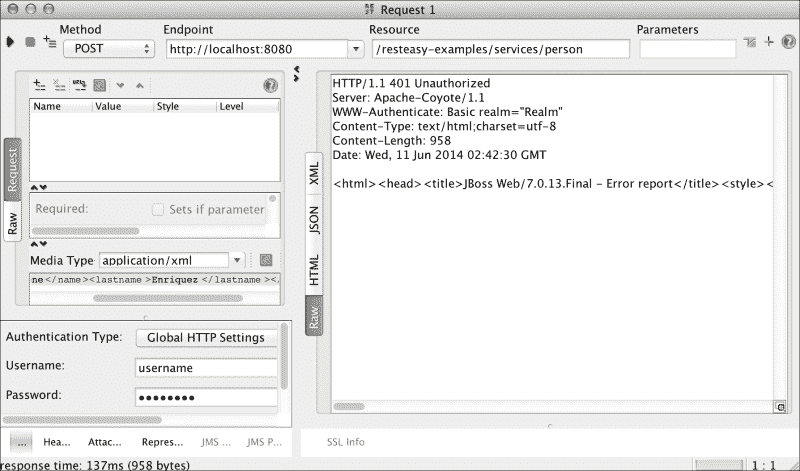
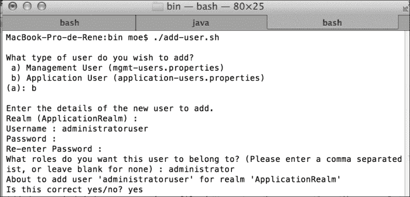
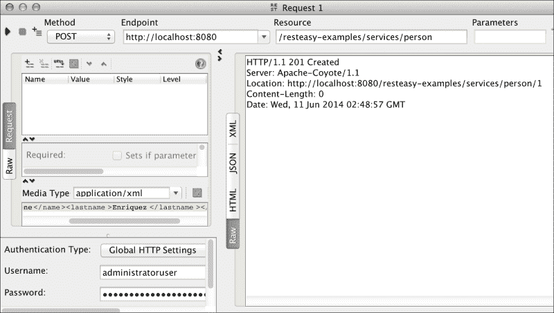
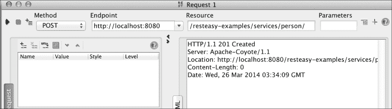
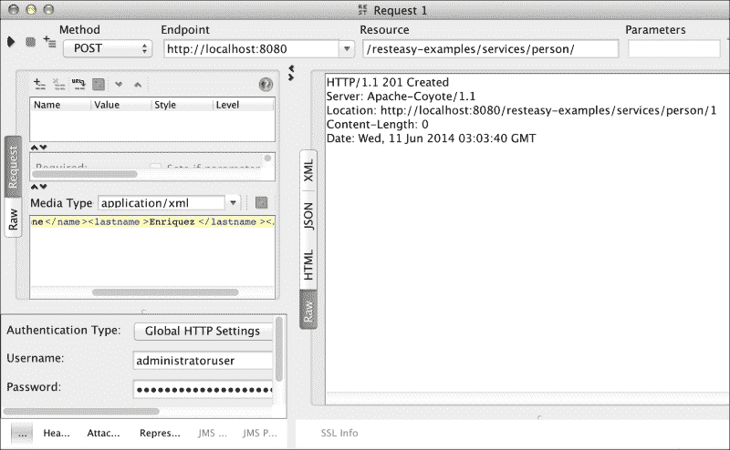
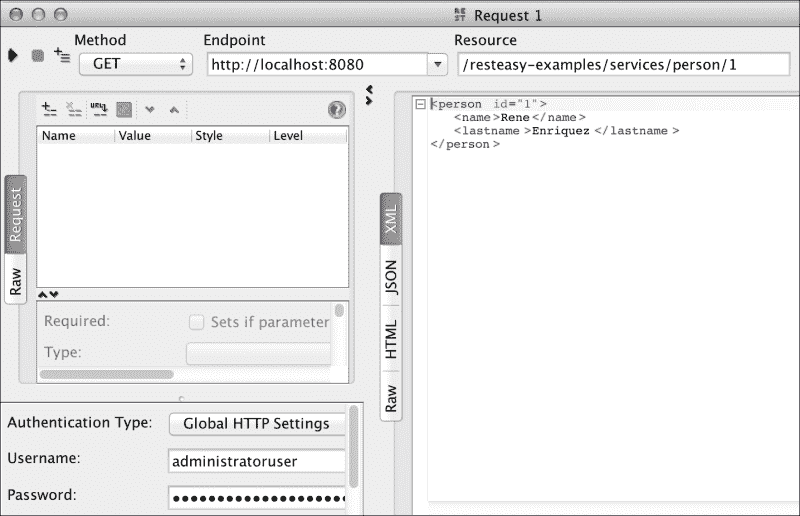

# 第三章 RESTEasy 安全管理

欢迎来到第三章。我们希望您能享受并与我们一起学习。在本章中，您将更多地参与安全管理。您还将使用一些更高级的安全概念。

使用 RESTfulWeb 服务构建的应用程序中的安全管理可以比我们在上一章中回顾的更细粒度。如果我们考虑认证和授权主题，我们描述了前者；授权被搁置。这是因为我们希望在本章中以非常详细的方式缓慢地处理它。

本章涵盖的主题包括：

*   在应用程序中实现与身份验证和授权相关的安全限制
*   实现细粒度安全性
*   使用注释在资源访问控制上获得更高的粒度

# 细粒度和粗粒度安全

我们可以管理两个级别的安全性：**细粒度**和**粗粒度**。

当我们在安全上下文中提到术语粗粒度时，我们指的是在应用程序中通常在高级别处理的安全系统。[第 2 章](2.html "Chapter 2. The Importance of Securing Web Services")、*安全 Web 服务的重要性*中的示例，其中任何角色的用户都可以使用这些服务，是粗粒度的完美示例因为粗粒度选项是在安全限制允许用户访问时使用的，而不必担心身份验证用户的角色或更具体的功能。这意味着，为了让系统允许访问功能，我们只需验证用户身份；换句话说，它对用户进行身份验证。然而，在现实生活中，仅仅拥有应用程序的经过身份验证的用户是不够的。还必须授权用户使用某些功能。我们可以使用细粒度控件来实现这一点。验证用户分配的访问功能的权限意味着使用授权控制。

为了以实用的方式演示这些概念，我们将使用上一章中创建的应用程序。您可以通过基本身份验证部分下的以下 URL 访问 GitHub 上的源代码：

[https://github.com/restful-java-web-services-security/source-code/tree/master/chapter02/basic-authentication](https://github.com/restful-java-web-services-security/source-code/tree/master/chapter02/basic-authentication)

让我们开始；假设我们只希望角色为`administrator`的用户能够使用应用程序中的功能。首先要做的是更改`web.xml`文件并添加一个约束，如下所示。请注意更改以粗体显示的方式：

```java
<?xml version="1.0" encoding="UTF-8"?>
<web-app version="3.0" 
  xmlns:xsi="http://www.w3.org/2001/XMLSchema-instance"
  xsi:schemaLocation="http://java.sun.com/xml/ns/javaee 
  http://java.sun.com/xml/ns/javaee/web-app_3_0.xsd">

  <security-role>
 <description>Application roles</description>
 <role-name>administrator</role-name>
  </security-role>
  <security-constraint>
    <display-name>Area secured</display-name>
    <web-resource-collection>
      <web-resource-name>protected_resources</web-resource-name>
      <url-pattern>/services/*</url-pattern>
    </web-resource-collection>
    <auth-constraint>
 <description>User with administrator role</description>
 <role-name>administrator</role-name>
    </auth-constraint>
  </security-constraint>
  <login-config>
    <auth-method>BASIC</auth-method>
  </login-config>
</web-app>
```

现在，让我们尝试使用我们刚刚创建的用户（`username`）发出请求。当你得到一个`403 Forbidden`错误时，你会感到惊讶。

请注意，如果您尝试使用无效凭据发出请求，则会出现错误`HTTP/1.1 401 Unauthorized`。错误很明显；访问未经授权。这意味着我们发送了无效的凭据，因此无法对用户进行身份验证。我们刚刚得到的错误是`HTTP/1.1 403 Forbidden`，这表示用户已成功登录，但未被授权使用他们所需的功能。以下屏幕截图演示了这一点：



现在，让我们使用`JBOSS_HOME/standalone/bin/adduser.sh`文件创建一个角色为`administrator`的新用户。输入请求的信息，如以下屏幕截图所示：



当我们在 SoapUI 中更改凭证时，请求的结果是成功的，如下图所示：



如您所见，我们使用了一个额外的控件，在该控件中，我们仅限制分配了`administrator`角色的经过身份验证的用户；他们能够使用 web 服务功能。在实际应用程序上管理安全性时，使用此类控件是非常常见的。随着我们实现了更详细的控制级别，该平台为我们提供了实现更细粒度控制的机会，例如我们现在将看到的控制。

## 保护 HTTP 方法

JAAS 的好处之一是，我们甚至可以在 HTTP 方法级别进行控制。因此，我们可以实施安全控制，仅允许具有特定角色的用户在方便的情况下使用特定的方法；例如，一个角色保存信息，另一个角色删除信息，其他角色读取信息，等等。

为了实现这些类型的控件，我们有必要了解应用程序中 HTTP 方法的功能。在我们的示例中，我们已经知道为了保存信息，应用程序总是使用`HTTP POST`方法。此外，当我们想要读取信息时，应用程序使用`HTTP GET`方法。因此，我们将修改我们的示例，以便只有具有`administrator`角色的用户才能使用`savePerson`（`HTTP POST`方法。同时，只有具有`reader`角色的人才能使用和`findById`（`HTTP GET`方法读取信息。

以此为目标，我们将修改`web.xml`文件如下：

```java
<?xml version="1.0" encoding="UTF-8"?>
<web-app version="3.0" 
  xmlns:xsi="http://www.w3.org/2001/XMLSchema-instance"
xsi:schemaLocation="http://java.sun.com/xml/ns/javaee 
  http://java.sun.com/xml/ns/javaee/web-app_3_0.xsd">
  <!-- Roles -->
  <security-role>
    <description>Role for save information</description>
    <role-name>administrator</role-name>
  </security-role>
  <security-role>
    <description>Role for read information</description>
    <role-name>reader</role-name>
  </security-role>

  <!-- Resource / Role Mapping -->
  <security-constraint>
    <display-name>Administrator area</display-name>
    <web-resource-collection>
  <web-resource-name>protected_resources</web-resource-name>
      <url-pattern>/services/*</url-pattern>
      <http-method>POST</http-method>
    </web-resource-collection>
    <auth-constraint>
    <description>User with administrator role</description>
      <role-name>administrator</role-name>
    </auth-constraint>
  </security-constraint>
  <security-constraint>
    <display-name>Reader area</display-name>
    <web-resource-collection>
  <web-resource-name>protected_resources</web-resource-name>
      <url-pattern>/services/*</url-pattern>
      <http-method>GET</http-method>
    </web-resource-collection>
    <auth-constraint>
      <description>User with reader role</description>
      <role-name>reader</role-name>
    </auth-constraint>
  </security-constraint>

  <login-config>
    <auth-method>BASIC</auth-method>
  </login-config>
</web-app>
```

在继续之前，我们必须使用`JBOSS_HOME/standalone/bin/adduser.sh`脚本创建一个角色为`reader`的新用户（`readeruser`。

现在，让我们使用 SoapUI 测试角色及其权限。

### HTTP 方式-POST

我们将使用一个没有所需权限的角色来测试`POST`方法。您将看到权限错误消息。

角色：读者

使用此角色时不允许使用此方法。以下屏幕截图演示了这一点：


角色：管理员

有了这个角色，你可以成功地执行这个方法。下面的屏幕截图演示了这一点：



### HTTP 方法–获取

现在，我们将使用具有所需权限的用户来使用 GET 方法。此角色的执行应该是成功的。

角色：读者

现在，此角色的执行已成功。以下屏幕截图演示了这一点：


角色：管理员

管理员角色无权访问此方法。下面的屏幕截图演示了这一点：


URL 模式也可以使用相同的角色考虑。在我们的示例中，我们对`/services/*`模式应用了限制。但是，您可以在更深层次上应用它，例如`/services/person/*`。我们的意思是，如果我们有另一个服务在 URL`/services/other-service/`下公开，我们可以设置它，以便角色可以访问路径`/services/person/*`下的服务和路径`/services/other-service/*`下的不同访问级别。这个例子非常简单，是作为一个基本的例子向读者提出的。

应用所有更改后，我们对`web.xml`文件中列出的所有方法设置了安全性。但是，我们必须问自己一个问题；未包含的方法会发生什么情况？

OWASP（开放式 Web 应用程序安全项目），一个致力于发现和修复软件安全漏洞的非营利组织，已经就此撰写了一篇论文，其名称如下：

*通过 HTTP 动词篡改绕过 Web 身份验证和授权：如何无意中允许攻击者完全访问您的 Web 应用程序。*

如果要签出完整的文档，可以访问以下链接：

[http://dl.packetstormsecurity.net/papers/web/Bypassing_VBAAC_with_HTTP_Verb_Tampering.pdf](http://dl.packetstormsecurity.net/papers/web/Bypassing_VBAAC_with_HTTP_Verb_Tampering.pdf)

OWASP 在上述文档中描述的内容很简单。这表明，如果我们不采取某些预防措施，JEE 在`web.xml`配置文件中暴露出潜在的安全漏洞，因为文件中未列出的所有方法都可以不受任何限制地使用。这意味着未在应用程序中进行身份验证的用户可以调用任何其他 HTTP 方法。

OWASP 在前一篇文章中陈述了以下内容：

*不幸的是，几乎所有这种机制的实现都在一场意外和不安全的战争中工作。它们不拒绝规则中未指定的方法，而是允许未列出的任何方法。具有讽刺意味的是，通过在规则中列出特定方法，开发人员实际上允许了比预期更多的访问。*

为了更好地理解这一点，让我们关注一个类比。

假设您有一个编写书籍的 web 应用程序，它处理两个角色：一个是能够编写书籍页面的作者，另一个是只能阅读书籍并添加注释的审阅者。现在，假设用户错误地获取了应用程序的 URL。该用户没有任何凭据可提供，显而易见的是，该用户甚至不应该能够访问该应用程序。然而，OWASP 演示的问题是，它不做看似显而易见的事情，而是实际允许未经身份验证的用户访问应用程序，并拥有足够的权限对书籍执行任何操作，例如删除书籍。

让我们举一个例子来看看这一不便，然后，我们将实施 OWASP 的建议来解决它。

让我们在类`PersonService`中创建一个新方法；这次我们将使用`web.xml`文件中未列出的方法之一。最常用的方法之一是`HTTP DELETE`；其功能是使用其 ID 删除存储在内存中的一个条目。这将记录的 ID 作为 URL 中的参数传递，因此请求的 URL 如下所示：

`http://localhost:8080/resteasy-examples/services/person/[ID]`

方法实现应如下所示：

```java
@DELETE
@Path("{id}")
public Response delete(@PathParam("id") int id) {
  Person person = dataInMemory.get(id);
if (person == null) {
  // There is no person with this ID
throw new WebApplicationException(Response.Status.NOT_FOUND);
  }
  dataInMemory.remove(id);
  return Response.status(Status.GONE).build();
}
```

为了测试该方法，我们必须首先通过 SoapUI 创建一对寄存器，同时使用`HTTP POST`方法和如下字符串：

```java
<person><name>Rene</name><lastname>Enriquez</lastname></person>
```

现在，在 SoapUI 中选择`DELETE`方法，删除我们用于身份验证的凭证信息，并使用其中一个项目 ID 执行请求，如以下屏幕截图所示：


如您所见，该项目已被删除，服务器返回消息`HTTP/1.1 410 Gone`。这表示资源不再可用。正如您所注意到的，当我们没有指定默认情况下应该保护此方法时，它被标记为可用。在我们的例子中，任何不需要身份验证的用户都可以删除我们的应用程序资源。

为了克服这个缺点，OWASP 建议在`web.xml`文件中添加另一个安全约束。此新的安全约束本身不应列出任何 HTTP 方法，这意味着拒绝访问所有 HTTP 方法，如以下代码所示：

```java
<security-constraint>
  <display-name>For any user</display-name>
  <web-resource-collection>
  <web-resource-name>protected_resources</web-resource-name>
    <url-pattern>/services/*</url-pattern>
  </web-resource-collection>
  <auth-constraint>
    <description>User with any role</description>
    <role-name>*</role-name>
  </auth-constraint>
</security-constraint> 
```

此外，我们还必须添加一个新角色，以确定应用程序中经过身份验证的用户，如以下代码所示：

```java
<security-role>
    <description>Any role</description>
    <role-name>*</role-name>
  </security-role>
```

现在，我们从 SoapUI 运行请求，可以看到错误消息`HTTP/1.1 401 Unauthorized`。这表示您无法执行请求，因为用户尚未通过身份验证，这意味着未经身份验证的用户无法使用`DELETE`或任何其他方法。

## 通过注释实现细粒度安全

`web.xml`文件，允许所有安全设置的文件，不是实现细粒度安全实现的唯一方式；该平台还提供了使用注释进行安全检查的可能性。为此，可根据您的需要选择以下三个选项：

*   `@RolesAllowed`
*   `@DenyAll`
*   `@PermitAll`

### @RolesAllowed 注释

`@RolesAllowed`注释可以应用于方法或类级别。通过此注释，您可以定义一组允许使用注释资源的角色。作为参数注释，让我们编写所有允许的角色。对于本例，我们将修改我们的`web.xml`文件，如下所示：

```java
<?xml version="1.0" encoding="UTF-8"?>
<web-app version="3.0" 
  xmlns:xsi="http://www.w3.org/2001/XMLSchema-instance"
xsi:schemaLocation="http://java.sun.com/xml/ns/javaee 
  http://java.sun.com/xml/ns/javaee/web-app_3_0.xsd">
  <!-- Roles -->
 <context-param>
 <param-name>resteasy.role.based.security</param-name>
 <param-value>true</param-value>
 </context-param>
  <security-role>
    <description>Any role</description>
    <role-name>*</role-name>
  </security-role>
  <!-- Resource / Role Mapping -->
  <security-constraint>
  <display-name>Area for authenticated users</display-name>
    <web-resource-collection>
  <web-resource-name>protected_resources</web-resource-name>
      <url-pattern>/services/*</url-pattern>
    </web-resource-collection>
    <auth-constraint>
      <description>User with any role</description>
      <role-name>*</role-name>
    </auth-constraint>
  </security-constraint>
  <login-config>
    <auth-method>BASIC</auth-method>
  </login-config>
</web-app>
```

在`PersonService`类中，让我们在每个方法上使用注释以及我们希望能够执行该方法的角色，如下所示：

```java
  @RolesAllowed({ "reader", "administrator" })
  @POST
  @Consumes("application/xml")
  public Response savePerson(Person person) {...

  @RolesAllowed({ "administrator" })
  @GET
  @Path("{id}")
  @Produces("application/xml")
  public Person findById(@PathParam("id") int id) {...
```

现在是通过 SoapUI 测试它的时候了。

#### 储蓄人法

现在，我们将使用 admin 角色测试类的方法`savePerson`，如下图所示：



正如您在前面的屏幕截图中所看到的，执行是成功的。原因是我们在`@RolesAllowed`注释中包含了这两个角色。另外，我们将使用`reader`角色测试执行是否成功，如下面的屏幕截图所示：


如您所见，当我们使用注释`@RolesAllowed`时，我们将权限授予特定角色。对于这种方法，我们使用了`administrator`和`reader`。

#### findById 方法

我们现在用`administrator`角色测试`findById`方法，如下面的截图所示：



屏幕截图显示执行成功，因为`@RolesAllowed`注释包含 admin。由于我们没有包含`reader`角色，下一次执行不应该被授权。现在让我们测试它，如下面的屏幕截图所示：


我们再次使用注释`@RolesAllowed`在方法级别授予权限，但这次我们只指定了一个角色`administrator`。

本章的所有源代码可在以下 URL 中找到：

[https://github.com/restful-java-web-services-security/source-code/tree/master/chapter03](https://github.com/restful-java-web-services-security/source-code/tree/master/chapter03)

### @DenyAll 注释

`@DenyAll`注释允许我们定义无法调用的操作，无论用户是否通过身份验证或角色是否与用户相关。本规范对该注释的定义如下：

*指定不允许任何安全角色调用指定的方法-即，这些方法将被排除在 J2EE 容器中的执行之外。*

### @PermitAll 注释

当我们使用`@PermitAll`注释时，我们告诉容器被注释的资源（一个方法或类的所有方法）可以被登录到应用程序的任何用户调用。这意味着只需要对用户进行身份验证；它不需要指定任何特定的角色。

从这三个注释中，使用最多的无疑是第一个注释（`@RolesAllowed`）；由于`@PermitAll`可以在`web.xml`文件中轻松替换，而`@DenyAll`只能在少数情况下使用，因此不经常使用其他选项。

## 细粒度安全的程序实现

RESTEasy 除了提供我们已经看到的安全管理选项外，还以编程方式提供了一种额外的访问控制机制。

在 web 服务的操作中，您可以向该方法添加额外的参数。这允许访问安全上下文，而不改变客户端调用方法或方法执行的操作的方式。参数必须以以下方式包含：

```java
@GET...
@Consumes("text/xml")
public returnType methodName(@Context SecurityContext secContext, …) {...
```

假设在我们的示例中，在方法`savePerson`中，我们希望访问此功能。我们需要做的唯一更改显示在以下代码段中。

之前，该方法只使用了一个参数，如下代码所示：

```java
@POST
@Consumes("application/xml")
public Response savePerson(Person person) {
  int id = dataInMemory.size() + 1;
  person.setId(id);
  dataInMemory.put(id, person);
  return Response.created(URI.create("/person/" + id)).build();
}
```

现在，该方法有另一个参数，如下代码所示：

```java
@POST
@Consumes("application/xml")
public Response savePerson(@Context SecurityContext secContext, Person person) {
  int id = dataInMemory.size() + 1;
  person.setId(id);
  dataInMemory.put(id, person);
  return Response.created(URI.create("/person/" + id)).build();
}
```

界面`javax.ws.rs.core.SecurityContext`提供以下三个有趣的特性：

*   `isUserInRole()`
*   `getUserPrincipal()`
*   `isSecure()`

方法`isUserInRole ()`的功能与注释`@RolesAllowed`类似；其目标是执行检查，以确定登录用户是否属于指定角色，如下所示：

```java
@POST
@Consumes("application/xml")
public Response savePerson(@Context SecurityContext secContext, Person person) {
  boolean isInDesiredRole = 	secContext.isUserInRole ("NameOfDesiredRole");
  int id = dataInMemory.size() + 1;
  person.setId(id);
  dataInMemory.put(id, person);
  return Response.created(URI.create("/person/" + id)).build();
}
```

`getUserPrincipal()`方法获取应用程序中的主用户，即登录用户。您可以通过该用户获得代表它的用户名等信息；这在希望生成审核跟踪的场景中总是很有用的。

最后，方法`isSecure()`确定调用是否通过安全通信方式进行，例如您是否使用 HTTPS。

如你所知，HTTP 和 HTTPS 是交换信息的协议；前者通常在您共享不敏感的信息时使用，后者通常在信息敏感且我们需要安全通道时使用。

让我们想象一下 ABC 银行的门户网站，特别是主页，其中显示了与银行业务相关的、可以通过 HTTP 进行管理的服务和内容的信息。我们无法管理使用 HTTP 协议处理帐户或转账信息的网页；这是因为信息没有受到保护。通过 HTTPS 协议，我们可以对信息进行加密；当信息被诸如 Wireshark 之类的流量分析器截获时，无法对其进行解释。

可以通过将更改应用于项目以启用 HTTPS 来测试此功能，正如我们在[第 2 章](2.html "Chapter 2. The Importance of Securing Web Services")*中向您展示的保护 Web 服务*的重要性。

当您使用 HTTP 调用此方法时，结果将为 false，但当您使用 HTTPS 调用同一方法时，结果将为 true。

当我们想要实现细粒度安全检查时，我们刚才分析的这三种方法非常有用。对于示例，当我们想要实施审计时，我们可以确定是否使用 HTTPS 等传输安全协议执行了一个操作；此外，我们还可以发现有关执行操作的用户的信息。

# 总结

我们在实现应用程序安全性时的需求可能是多种多样的。在本章中，我们看到了 JAX-RS 如何提供处理安全性的机制，从一个相当基本的模型（粗粒度）到一个更精细的模型（细粒度），在这个模型中，您可以执行更详尽的控制，包括编程控制和通过配置文件的控制。

当然，始终建议将这些检查保存在配置文件中，如`web.xml`。由于控制集中在一个地方，因此便于维护。在源代码级别处理安全性时不会发生这种情况，因为当项目中有许多类时，当需要对当前功能进行某种形式的修改时，任务会变得复杂。

现在，您应该准备下一章，在这一章中我们将讨论 OAuth。这是一个非常激动人心的话题，因为该协议被广泛接受并在互联网应用程序中使用。万维网的 rockstar 公司，如谷歌、推特和 Facebook 等，都非常成功地使用了它。