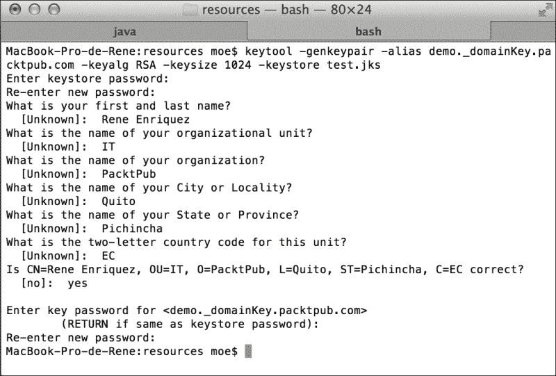
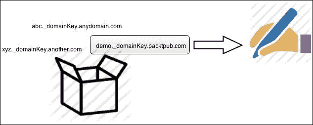
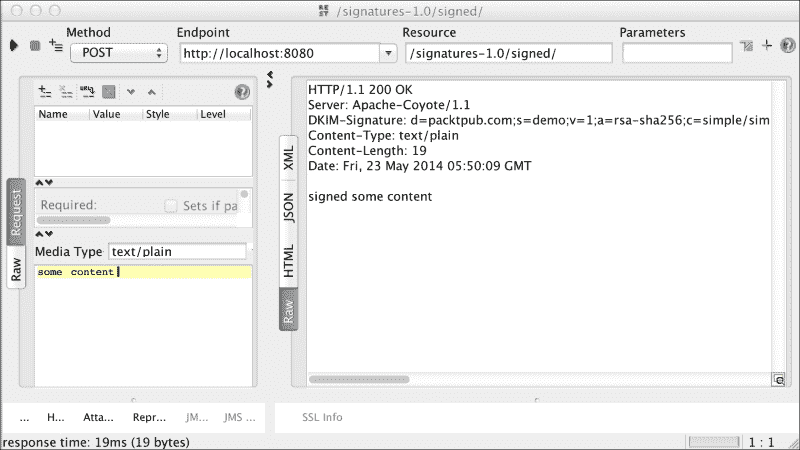
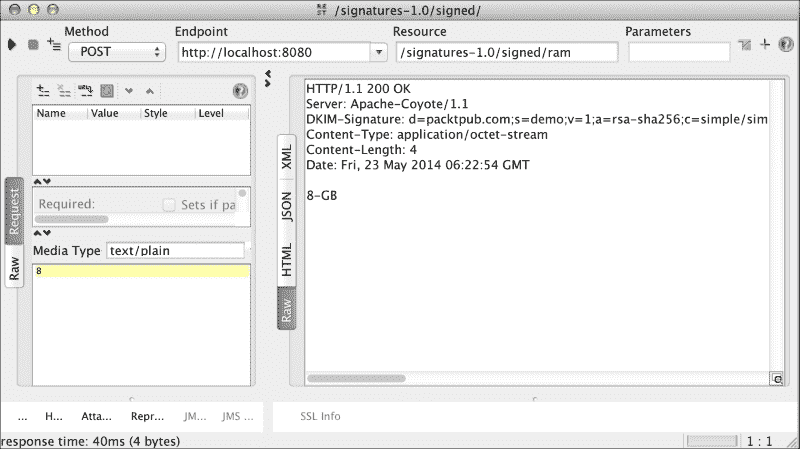
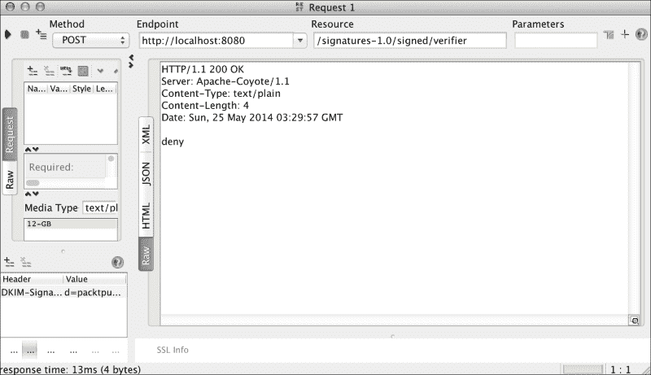
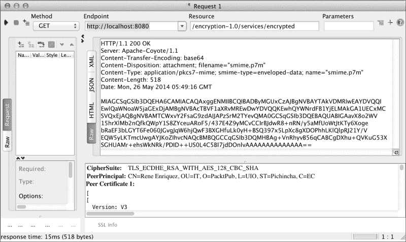
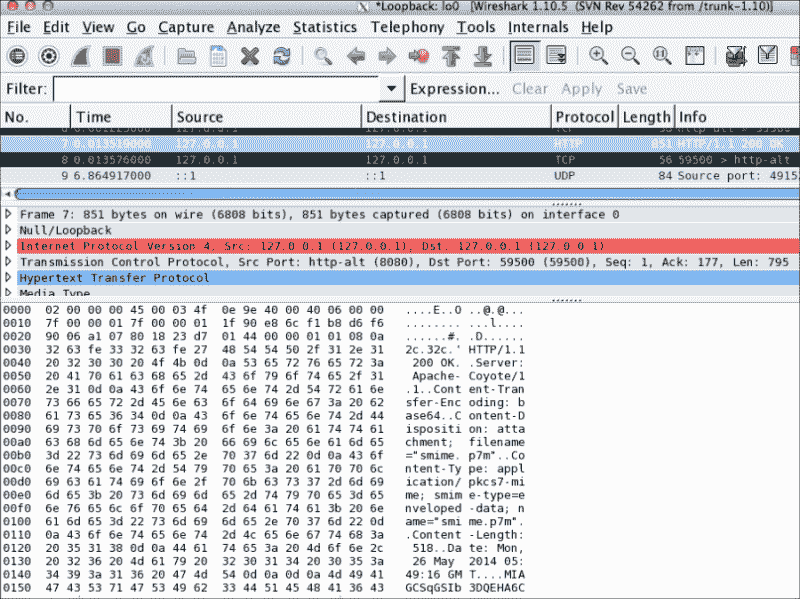

# 第五章信息的数字签名和加密

由于许多系统相互交互以实现其业务目标，因此我们经常感到有义务与他人公开的服务交互。此外，当安全需求发挥重要作用时，我们必须验证我们收到的信息是否是我们期望的人发送的，并且没有被更改。在这里，数字签名将发挥重要作用，帮助我们满足这一需求。

此外，我们有时可能需要加密消息体，以防止被不需要的人截获时读取。在这里，我们可以使用安全/多用途的 Internet 邮件扩展，或 S/MIME 标准，这是电子邮件世界中常用的用于公钥（[的标准 http://en.wikipedia.org/wiki/Public_key](http://en.wikipedia.org/wiki/Public_key) 、加密（[http://en.wikipedia.org/wiki/Encryption](http://en.wikipedia.org/wiki/Encryption) ），并签字（ [http://en.wikipedia.org/wiki/Digital_signature MIME 数据的](http://en.wikipedia.org/wiki/Digital_signature)[http://en.wikipedia.org/wiki/MIME](http://en.wikipedia.org/wiki/MIME) ），它还提供了适应 HTTP 协议的能力，并允许我们在 RESTful web 服务上使用它。

在本章中，我们将了解以下内容：

*   签名消息
*   验证签名
*   使用 S/MIME 加密消息体

# 数字签名

如今，数字签名是一种广泛使用的机制。它们主要用于签署数字文件和签发电子发票等。

使用它们的好处包括：

*   他们允许接收者获得签名者的身份。
*   它们提供了验证发送的信息自发行人签名后未被更改的能力。

为了对我们将通过 RESTful web 服务交换的信息进行电子签名，我们将使用名为**DomainKeys Identified Mail**（**DKIM**）的身份验证机制，该机制允许我们使用 DOSETA 规范规定的规则用头来修饰消息。该认证机制主要用于电子邮件身份验证；然而，它也可以通过 HTTP 等其他协议工作，正因为如此，我们可以将它与 RESTful web 服务集成。因此，为了签名，我们将元数据注入到我们的消息中，并且这些签名可以被希望消费的人验证。

此时，我们将构建一个示例，演示如何对消息进行签名，然后剖析消息的每个部分以了解其操作。

如果需要，可以使用 GitHub 上的以下链接下载源代码：

[https://github.com/restful-java-web-services-security/source-code/tree/master/chapter05/signatures](https://github.com/restful-java-web-services-security/source-code/tree/master/chapter05/signatures)

否则，我们将在以下几页中解释。让我们从创建一个新项目开始。打开终端并键入以下内容：

```java
mvn archetype:generate -DgroupId=com.packtpub -DartifactId=signatures -DarchetypeArtifactId=webapp-javaee6 -DarchetypeGroupId=org.codehaus.mojo.archetypes

```

当它向您询问版本时，将默认值`1.0-SNAPSHOT`更改为`1.0`

现在，我们将生成密钥，这些密钥允许我们对消息进行加密，并将它们放置在应用程序的类路径中。为此，我们将首先将项目导入 EclipseIDE，然后在项目中创建一个文件夹，在其中放置要生成的键。在 Eclipse 中，右键单击名为`signatures`的新项目，并选择选项**新建****源文件夹**。

在**文件夹名称**字段中，我们将输入`src/main/resources`，然后按下**完成**按钮。

现在，让我们从命令行转到该目录并执行以下指令：

```java
keytool -genkeypair -alias demo._domainKey.packtpub.com -keyalg RSA -keysize 1024 -keystore demo.jks

```

现在，我们应该为密钥库和用于签名消息的密钥输入密码。当它要求您输入密码时，请键入`changeit`，这与我们在本书示例中一直使用的密码相同。然后，我们输入请求的信息，如以下屏幕截图所示：



现在，我们将实现一些源代码来签署消息。我们首先需要将所需的依赖项添加到`pom.xml`文件中。

首先，添加从中获取工件的 JBoss 存储库，如以下代码所示：

```java
<repositories>
  <repository>
    <id>jboss</id>
    <url>http://repository.jboss.org/maven2</url>
  </repository>
</repositories>
```

现在，让我们添加签署消息所需的所有依赖项，如下所示：

```java
  <dependencies>
    <dependency>
      <groupId>org.jboss.resteasy</groupId>
      <artifactId>resteasy-jaxrs</artifactId>
      <version>3.0.6.Final</version>
    </dependency>
    <dependency>
      <groupId>org.jboss.resteasy</groupId>
      <artifactId>resteasy-crypto</artifactId>
      <version>3.0.6.Final</version>
    </dependency>
  </dependencies>
```

为了避免类路径中重复的类，我们应该删除以下依赖项：

```java
    <dependency>
      <groupId>javax</groupId>
      <artifactId>javaee-web-api</artifactId>
      <version>6.0</version>
      <scope>provided</scope>
    </dependency>
```

## 更新 RESTEasy JAR 文件

由于我们使用的是 3.0.6.Final 版本来编译项目，因此有必要更新 JBoss 中的现有版本。那么，我们将转到 URL[http://sourceforge.net/projects/resteasy/files/Resteasy%20JAX-RS/](http://sourceforge.net/projects/resteasy/files/Resteasy%20JAX-RS/)并下载我们刚才描述的版本。

解压`.zip`文件时，会发现一个名为`resteasy-jboss-modules-3.0.6.Final.zip`的文件。让我们也解压缩这个文件，然后将其所有内容粘贴到我们的目录`JBOSS_HOME/modules`中。鉴于 RESTEasy 模块具有依赖性，我们也必须更新它们。所以，在我们更新 RESTEasy 模块之后，我们应该更新模块`org.apache.httpcomponents`。让我们转到目录`JBOSS_HOME/modules/org/apache/httpcomponents`并更新以下工件：

*   `httpclient-4.1.2.jar`至`httpclient-4.2.1.jar`
*   `httpcore-4.1.4.jar`至`httpcore-4.2.1.jar`

另外，我们修改了`module.xml`文件，因为 JAR 文件的名称不同，如下所示：

```java
<?xml version="1.0" encoding="UTF-8"?>

<!--
 ...
  -->

<module  name="org.apache.httpcomponents">
    <properties>
        <property name="jboss.api" value="private"/>
    </properties>

    <resources>
 <resource-root path="httpclient-4.2.1.jar"/>
 <resource-root path="httpcore-4.2.1.jar"/>
        <resource-root path="httpmime-4.1.2.jar"/>
        <!-- Insert resources here -->
    </resources>

    <dependencies>
        <module name="javax.api"/>
        <module name="org.apache.commons.codec"/>
        <module name="org.apache.commons.logging"/>
        <module name="org.apache.james.mime4j"/>
    </dependencies>
</module>
```

## 应用数字签名

现在我们已经拥有了编译项目所需的一切，我们将创建一个非常简单的操作并应用签名。为了实现这一点，我们在名为`com.packtpub.resteasy.services`的源代码包中创建一个名为`SignedService`的类，如下图所示：


要对消息签名，我们从密钥库中获取一个密钥并使用它。我们可以通过密钥的别名和所属域以独特的方式识别密钥。例如，密钥`demo._domainKey.packtpub.com`别名为`demo`，所属域为密钥`packtpub.com`。鉴于我们可以在密钥库中找到多个密钥，RESTEasy 提供了使用注释`@Signed`选择所需密钥的功能。

让我们将以下代码中突出显示的方法添加到类中，并观察注释的工作方式：

```java
  @POST
  @Produces("text/plain")
 @Signed(selector = "demo", domain = "packtpub.com")
  public String sign(String input) {
    System.out.println("Aplyng signature " + input);
    return "signed " + input;
  }
```

下图以更好的方式向我们展示了如何选择密钥对消息进行签名：



现在，我们将在下定义我们的签名资源将可用的路径，因此让我们对该类进行如下注释：

```java
import javax.ws.rs.Consumes;
import javax.ws.rs.POST;
import javax.ws.rs.Path;

import org.jboss.resteasy.annotations.security.doseta.Signed;

@Path("/signed")
public class SignedService {
...
```

为了使应用程序正常工作，我们将向其提供信息，以便其能够应用适当的签名。

首先，在文件夹`src/main/webapp`中，我们将创建包含空`web.xml`文件的`WEB-INF`文件夹。

让我们从`web.xml`文件开始，它应该如下所示：

```java
<?xml version="1.0" encoding="UTF-8"?>
<web-app version="3.0" 
  xmlns:xsi="http://www.w3.org/2001/XMLSchema-instance"
  xsi:schemaLocation="http://java.sun.com/xml/ns/javaee 
  http://java.sun.com/xml/ns/javaee/web-app_3_0.xsd">

  <display-name>signatures</display-name>

</web-app>
```

现在，我们要做的第一件事是告诉应用程序我们要签名的资源，即包含我们要签名的方法的类。为此，我们将参数`resteasy.resources`配置为相应的完整类名，如下所示：

```java
<context-param>
<param-name>resteasy.resources</param-name>
<param-value>com.packtpub.resteasy.services.SignedResource</param-value>
</context-param>
```

接下来，我们将使用我们应用签名的通知我们的应用程序密钥的位置（我们之前创建的`.jks`文件）。为此，我们有两个上下文参数可用，`resteasy.doseta.keystore.classpath`和`resteasy.keystore.filename`。让我们使用第一个参数，使我们的文件如下所示：

```java
<context-param>
<param-name>resteasy.doseta.keystore.classpath</param-name>
<param-value>demo.jks</param-value>
</context-param>
```

正如您所记得的，我们在创建密钥时被要求输入密钥库的密码。我们将使用参数`resteasy.doseta.keystore.password`告诉我们的应用程序这是什么。让我们添加以下内容：

```java
  <context-param>
    <param-name>resteasy.doseta.keystore.password</param-name>
    <param-value>changeit</param-value>
  </context-param>
```

要创建密钥库，从中提取允许我们对消息签名的密钥，必须添加以下参数：

```java
<context-param>
  <param-name>resteasy.context.objects</param-name>
  <param-value>org.jboss.resteasy.security.doseta.KeyRepository : org.jboss.resteasy.security.doseta.ConfiguredDosetaKeyRepository</param-value>
</context-param>
```

最后，我们应该添加 RESTEasy servlet，如下所示：

```java
  <servlet>
    <servlet-name>Resteasy</servlet-name>
    <servlet-class>org.jboss.resteasy.plugins.server.servlet.HttpServletDispatcher</servlet-class>
  </servlet>
  <servlet-mapping>
    <servlet-name>Resteasy</servlet-name>
    <url-pattern>/*</url-pattern>
  </servlet-mapping>
```

在这里，我们展示了添加完所有必需信息后，`web.xml`文件的外观：

```java
<?xml version="1.0" encoding="UTF-8"?>
<web-app version="3.0" 
  xmlns:xsi="http://www.w3.org/2001/XMLSchema-instance"
  xsi:schemaLocation="http://java.sun.com/xml/ns/javaee 
  http://java.sun.com/xml/ns/javaee/web-app_3_0.xsd">
<web-app>
  <display-name>signatures</display-name>
  <context-param>
    <param-name>resteasy.resources</param-name>
    <param-value>com.packtpub.resteasy.services.SignedService</param-value>
  </context-param>
  <context-param>
    <param-name>resteasy.doseta.keystore.classpath</param-name>
    <param-value>demo.jks</param-value>
  </context-param>
  <context-param>
    <param-name>resteasy.doseta.keystore.password</param-name>
    <param-value>changeit</param-value>
  </context-param>
  <context-param>
    <param-name>resteasy.context.objects</param-name>
    <param-value>org.jboss.resteasy.security.doseta.KeyRepository : org.jboss.resteasy.security.doseta.ConfiguredDosetaKeyRepository</param-value>
  </context-param>
  <servlet>
    <servlet-name>Resteasy</servlet-name>
    <servlet-class>org.jboss.resteasy.plugins.server.servlet.HttpServletDispatcher</servlet-class>
  </servlet>
  <servlet-mapping>
    <servlet-name>Resteasy</servlet-name>
    <url-pattern>/*</url-pattern>
  </servlet-mapping>
</web-app>
```

现在，让我们通过执行以下命令来生成 WAR 文件：

```java
mvn install

```

在此之后，我们将把生成的工件复制到 JBoss 部署目录中。

## 功能测试

现在，打开 SoapUI，测试 web 服务是否按预期运行，如下图所示：



正如您在响应中所看到的，我们获得了用于对消息进行签名的`DKIM-Signature`头。此标题的全部内容如下：

```java
DKIM-Signature: d=packtpub.com;s=demo;v=1;a=rsa-sha256;c=simple/simple;bh=lc+ECoAqpQCB4ItWLUomBv34m3F9G0pkIBAI8Z/yWcQ=;b=AlJY6iiCtdCnHrJa+Of9aRgBXeIp7V7cEG7eyUp0CRbD9wjFodbQGRQjhfwDgd1WIBzVLIWelTdI85BlGl3ACNcMLBjPv2iBBjo+78e/9HcYs81YNlPRAAj6jzymA/+jkmpTVcthWaEEyoPJJBAI5FvP33zH7etfkFaGX+bwer0=
```

从这整条线来看，对我们来说重要的是：

*   `d=`：这是域，在我们实现方法时指示的值。
*   `a=`：这是 RESTEasy 用来对消息进行签名的算法。在本例中，我们使用 RSA，因为它是框架迄今为止支持的唯一算法。

其他参数不是很重要，它们仅对已签名的消息是必需的。

现在，为了验证签名的真实性，我们将创建一个类，从中进行验证。

我们将使用 JUnit；因此，首先在`pom.xml`文件中添加对应的依赖项，如下代码段所示：

```java
    <dependency>
      <groupId>junit</groupId>
      <artifactId>junit</artifactId>
      <version>4.8.2</version>
      <scope>test</scope>
    </dependency>
```

现在，让我们创建一个名为`scr/test/java`的新源文件夹，并在其中创建一个名为`com.packtpub.resteasy.services.test`的包。在包中，让我们使用以下内容创建类`SignedServiceTest`：

```java
import javax.ws.rs.client.Entity; 
import javax.ws.rs.client.Invocation; 
import javax.ws.rs.client.WebTarget; 
import javax.ws.rs.core.Response;  
import junit.framework.Assert;  
import org.jboss.resteasy.client.jaxrs.ResteasyClient; 
import org.jboss.resteasy.client.jaxrs.ResteasyClientBuilder; 
import org.jboss.resteasy.security.doseta.DosetaKeyRepository; 
import org.jboss.resteasy.security.doseta.Verification; 
import org.jboss.resteasy.security.doseta.Verifier; 
import org.junit.Test;

public class SignedServiceTest {

  @Test
  public void testVerification() {
    // Keys repository
    DosetaKeyRepository repository = new DosetaKeyRepository();
    repository.setKeyStorePath("demo.jks");
    repository.setKeyStorePassword("changeit");
    repository.start();
    // Building the client
  ResteasyClient client = new ResteasyClientBuilder().build();
    Verifier verifier = new Verifier();
    Verification verification = verifier.addNew();
    verification.setRepository(repository);
    WebTarget target = client
             .target(
      "http://localhost:8080/signatures-1.0/signed");
    Invocation.Builder request = target.request();
    request.property(Verifier.class.getName(), verifier);
    // Invocation to RESTful web service
    Response response = request.post(Entity.text("Rene"));
    // Status 200 OK
    Assert.assertEquals(200, response.getStatus());
    System.out.println(response.readEntity(String.class));
    response.close();
    client.close();
  }
}
```

如果一切顺利，我们的测试结果将显示一个绿色的条，如以下屏幕截图所示：


## 使用注释验证签名

验证资源是否已签名的更简单方法是使用注释。此解决方案主要用于必须满足的签名流。

例如，假设 Packt Publishing 公司的员工有一个系统，他们可以通过该系统申请增加计算机的 RAM。要将此类请求视为有效，必须由提出请求的人签字。我们的意思是，我们只需要签署请求就可以被认为是有效的，如下图所示：


对于这个例子，我们将向`SignedService`类添加两个方法；第一种方法将允许我们发送请求，如图所示：

```java
  @POST
  @Path("ram")
  @Signed(selector = "demo", domain = "packtpub.com")
  @Consumes("text/plain")
  public String requestRam(int numberOfGB) {
    return numberOfGB + "-GB";
  }
```

为了满足业务需求，我们将使用`@Verify`注释，在注释中我们可以增加对签名的限制。现在，我们只需要验证请求是否已签名。

以下是方法，显示了老板批准或拒绝员工电脑内存增加的所有复杂逻辑：

```java
@Verify
@POST
@Path("verifier")
@Produces("text/plain")
public String processRequestRam (String input) {
  int numberOfGbRequested = Integer.valueOf(input.split("-")[0]);
  if (numberOfGbRequested > 4) {
    return "deny";
  } else {
    return "accepted";
  }
}
```

现在，让我们在 JBoss 上部署应用程序，并使用 SoapUI 进行测试。正如我们所提到的，必须签署请求才能处理。因此，首先向方法`processRequestRam`发出一个没有签名的请求，如下图所示：


处理申请所必需的是，它来自公司域，在本例中为`packtpub.com`。之后，老板对申请进行了严格的分析，并做出判断，以确定申请是被批准还是被拒绝。

对于这个例子，我们将删除前面创建的方法，并将两个方法添加到我们的`SignedService`类中；第一种方法将允许我们发送请求，如图所示：

```java
@POST
@Signed(selector = "demo", domain = "packtpub.com")
@Consumes("text/plain")
public Response requestRAM(int numberOfGB) {
  return Response.seeOther(
    URI.create("/signed/" + "GB:" + numberOfGB)).build();
}
```

输出非常清楚地向我们显示了错误。无法处理该请求，因为没有包含验证签名信息的`DKIM-Signature`头。这意味着头不在那里，因为它们没有提前签名。

为了成功处理请求，我们将调用对请求进行签名的 web 服务。我们将在头中添加签名信息，并再次调用`processRequestRam`方法。

让我们先调用`requestRam`操作，如下图所示：



通过此回调，我们将获得以下值：

```java
DKIM-Signature: d=packtpub.com;s=demo;v=1;a=rsa-sha256;c=simple/simple;bh=uA6n2udZlWdx+ouwCEeeyM6Q48KH0EWa2MnfBwMP+vM=;b=T0drw9QWud7rs1w//5384hs8GCatJKzmljIhgiTrHWdVx/IhCVl915yycchN+hQ+ljUaS6bPtLYo/ZNspcv2LtAe/tKTPpng4RWlr52k0TqnV3XX2KvJ7kBOpEU2Rg6f6lBOJT5v+o0iV05ObagfzKDfQ9o09WpZjQKcBG+/xvE=

RESPONSE: 8 GB
```

让我们继续前进！现在，我们将使用这些值来发出请求。在 SoapUI 中，让我们调用`processRequestRam`操作，并关注请求编辑器的左下角区域；有一个选项显示**标题**。让我们选择这个选项并点击**+**符号。现在，我们必须输入`DKIM-Signature`标题并放置相应的值。另外，不要忘记发送请求参数`8-GB`，该参数是调用`requestRam`操作的响应，如以下屏幕截图所示：


如我们所见，请求已成功处理，但 boss 拒绝增加内存。现在，我们表明数字签名允许我们验证信息在签名后不会被更改。假设恶意软件截获了响应，并以而不是`8-GB`传递了值`12-GB`。让我们按照数字签名理论在 SoapUI 中提出这个请求。此请求应无效；但是，我们必须检查：


错误消息清楚地表明消息主体已更改，因此请求未被处理，我们得到`HTTP 401 Unauthorized`消息。这证实了之前关于签名消息完整性的声明。

然而，RESTEasy 允许我们做的不仅仅是验证消息是否已签名。我们可以验证签名者是否属于特定域。在我们的例子中，一家公司只有在属于`packtpub.com`领域时才被视为有效。要执行这种类型的控制，我们将进行以下更改：

```java
@Verify(identifierName = "d", identifierValue = "packtpub.com")
@POST
@Path("verifier")
@Produces("text/plain")
public String processRequestRam(String input) {
  int numberOfGbRequested = Integer.valueOf(input.split("-")[0]);
  if (numberOfGbRequested > 4) {
    return "deny";
  } else {
    return "accepted";
  }
}
```

让我们在 JBoss 中部署应用程序，并从 SoapUI 再次执行请求：


现在，让我们强制一个错误。我们将假定有效消息仅为从域`itpacktpub.com`签名的消息。那么，让我们应用以下更改：

```java
@Verify(identifierName = "d", identifierValue = "itpacktpub.com")
@POST
@Path("verifier")
@Produces("text/plain")
public String processRequestRam(String input) {
  int numberOfGbRequested = Integer.valueOf(input.split("-")[0]);
  if (numberOfGbRequested > 4) {
    return "deny";
  } else {
    return "accepted";
  }
}
```

让我们再次在 JBoss 中部署应用程序，并执行来自 SoapUI 的请求：


正如我们所料，这次请求失败了。显然，这是因为无法验证签名，因为消息是用`packtpub.com`域签名的，而不是我们在操作`processRequestRam`中设置的`itpacktpub.com`域。

突然，您想知道为什么标识的名称的值是`d`。如前所述，字母`d`代表域。RESTEasy 文档对标题中的每个参数进行了详细解释。在这里，我们向您展示了与本主题相关的 JBoss 文档中的一个示例：

*以下是 DKIM 签名头的示例：*

*DKIM 签名：v=1；*

*a=rsa-sha256；*

*d=example.com；*

*s=burke；*

*c=简单/简单；*

*h=内容类型；*

*x=0023423111111；*

*bh=234222111；*

*b=M232234=*

*如您所见，它是一组由“；”分隔的名称-值对。虽然知道头的结构并不重要，但下面是对每个参数的解释：*

*五：协议版本。总是 1。*

*a：用于对消息进行哈希和签名的算法。RSA 签名和 SHA256 哈希是 RESTEasy 目前唯一支持的算法。*

*d：签名者的域。这用于识别签名者以及发现用于验证签名的公钥。*

*s：域的选择器。还用于识别签名者和发现公钥。*

*c：标准算法。目前只支持 simple/simple。基本上，这允许您在计算散列之前转换消息体。*

*h：签名计算中包含的以分号分隔的标题列表。*

*x:签名到期时。这是一个从历元开始以秒为单位的长时间数值。允许签名者控制已签名邮件的签名何时过期。*

*t：签名时间戳。自历元起的时间长数值，以秒为单位。允许验证器控制签名何时过期。*

*bh：消息体的 Base 64 编码哈希。*

*b:Base 64 编码签名。*

现在我们有了这个信息，很明显假设如果你想检查签名人，我们必须使用字母`s`，而不是`packtpub.com`，我们将使用`demo`。应用这些更改后，我们的代码应如下所示：

```java
@Verify(identifierName = "s", identifierValue = "demo")
@POST
@Path("verifier")
@Produces("text/plain")
public String processRequestRam(String input) {
  int numberOfGbRequested = Integer.valueOf(input.split("-")[0]);
  if (numberOfGbRequested > 4) {
    return "deny";
  } else {
    return "accepted";
  }
}

```

此外，如果要验证签名者的名称和域，则必须应用轻微更改。这一次，我们将使用`@Verifications`注释；此注释接收一个`@Verify`注释数组作为参数，允许我们执行前面描述的操作。在这种情况下，我们应该使用`@Verify`注释添加两个控件，我们的代码应该如下所示：

```java
@Verifications({ 
@Verify(identifierName = "s", identifierValue = "demo"),
@Verify(identifierName = "d", identifierValue = "packtpub.com") })
@POST
@Path("verifier")
@Produces("text/plain")
public String processRequestRam(String input) {
  int numberOfGbRequested = Integer.valueOf(input.split("-")[0]);
  if (numberOfGbRequested > 4) {
    return "deny";
  } else {
    return "accepted";
  }
}
```

一旦我们应用了变更，我们就可以使用 SoapUI 执行请求。我们应该得到一个成功的执行结果，如下面的屏幕截图所示：



# 消息体加密

在上一章中，我们了解了如何使用 HTTPS 加密完整的 HTTP 消息。现在，我们将解释如何只加密消息体以及每个进程之间的差异。我们从构造一个简单的示例开始，然后，当我们对实现执行相应的测试时，我们将了解它是如何工作的。

为了不破坏我们以前的项目，我们将建造一个新项目。为此，我们将在终端中执行以下命令：

```java
mvn archetype:generate -DgroupId=com.packtpub -DartifactId=encryption -DarchetypeArtifactId=webapp-javaee6 -DarchetypeGroupId=org.codehaus.mojo.archetypes

```

如本章前面所述，当要求您提供版本时，请将默认值`1.0-SNAPSHOT`更改为`1.0`。

当然，如果您愿意，您可以从以下 URL 下载 GitHub 的所有源代码：

[https://github.com/restful-java-web-services-security/source-code/tree/master/chapter05/encryption](https://github.com/restful-java-web-services-security/source-code/tree/master/chapter05/encryption)

现在，让我们将项目导入 Eclipse，删除`pom.xml`文件中现有的默认依赖项，并添加对工件`resteasy-jaxrs`和`resteasy-crypto`的依赖项。

`dependencies`部分应如下所示：

```java
  <dependencies>
    <dependency>
      <groupId>org.jboss.resteasy</groupId>
      <artifactId>resteasy-jaxrs</artifactId>
      <version>3.0.6.Final</version>
      <scope>provided</scope>
    </dependency>
    <dependency>
      <groupId>org.jboss.resteasy</groupId>
      <artifactId>resteasy-crypto</artifactId>
      <version>3.0.6.Final</version>
    </dependency>
  </dependencies>
```

现在，让我们在包`com.packtpub`中创建类`EncryptedService`。在这个类中，我们将创建一个非常简单的操作，如图所示：

```java
package com.packtpub;

import javax.ws.rs.GET;
import javax.ws.rs.Path;

@Path("/encrypted")
public class EncryptedService {

  @GET
  public String gretting() {
    return "Hello world";
  }
}
```

为了注册我们应用程序的服务，我们创建类`EncryptedApplication`，如图所示：

```java
package com.packtpub;

import java.util.HashSet;
import java.util.Set;

import javax.ws.rs.ApplicationPath;
import javax.ws.rs.core.Application;

@ApplicationPath("/services")
public class EncryptedApplication extends Application {

  private Set<Object> resources = new HashSet<Object>();

  public EncryptedApplication() throws Exception {
    resources.add(new EncryptedService());
  }

  @Override
  public Set<Object> getSingletons() {
    return resources;
  }
}
```

## 功能测试

在这之后，我们的申请应该准备好了。那么，让我们从 SoapUI 执行一个测试来使用 Wireshark 观察流量，如下面的屏幕截图所示：


Wireshark 向我们展示了以下内容：


正如我们所看到的，流量分析仪显示了所有信息是如何直线传播的，以及它是如何容易解释的。现在，让我们在 JBoss 上启用 HTTPS 来显示整个消息是如何加密的。

## 使用 HTTPS 启用服务器

因此，首先我们必须创建一个证书密钥库。我们可以通过在终端上执行以下命令来实现这一点：

```java
keytool -genkey -alias tomcat -keyalg RSA

```

当它要求您输入密码时，您应该使用`changeit`，因为我们在本书中已经使用过它。

现在，我们查看在`JBOSS_HOME/standalone/configuration/standalone.xml`文件中，在包含`<connector name="http"`的行中，添加以下内容：

```java
<connector name="https" protocol="HTTP/1.1" scheme="https" 
socket-binding="https" secure="true">
  <ssl/>
</connector>
```

完成此更改后，我们将重新启动应用程序服务器，部署应用程序，并编辑请求。这一次，我们将使用端口 8443 和 HTTPS 协议。因此，URL 应如下所示：

`https://localhost:8443/encryption-1.0/services/encrypted`

让我们使用 SoapUI 执行请求；我们的流量分析器现在将向我们显示以下结果：


正如我们所料，这一次，分析器非常清楚地向我们显示，所有信息都已加密。

继续我们的示例，我们现在将在 JBoss 中禁用 HTTPS。为此，我们必须删除之前添加的连接器。现在，我们将使用 S/MIME 只加密响应的消息体。首先，让我们检查一些有助于我们理解其工作原理的概念。

S/MIME 来自安全 MIME。MIME 代表多用途 Internet 邮件扩展，它不仅可以帮助我们发送消息，如“Hello world”，还可以发送更多有趣的内容，如视频、音频等。MIME 与 SMTP 和 HTTP 等电子邮件协议配合使用。这有助于我们使用 RESTful S/MIME web 服务。另一方面，MIME 为我们提供了以下特性：

*   消息加密
*   正在验证发送消息的用户的身份
*   验证消息信息完整性的能力

鉴于 S/MIME 与证书一起工作，这就是保存消息发送者信息的地方。当接收者收到消息时，他们观察消息的所有公共部分。然后可以使用密钥对消息进行解密。此外，接收器可以访问其内容。如果您想继续使用 S/MIME，我们建议您访问链接[http://datatracker.ietf.org/wg/smime/charter/](http://datatracker.ietf.org/wg/smime/charter/) 。

让我们从做一些改变开始。首先，我们将在应用程序中创建源文件夹`src/main/resources`；在此目录中，我们将放置加密消息所需的资源。

然后，我们使用`openssl`生成一个证书，从控制台转到刚才创建的目录，在终端上的命令行上运行以下操作：

```java
openssl req -x509 -nodes -days 365 -newkey rsa:1024 -keyout demokey.pem -out democert.pem

```

现在，我们必须输入请求的信息，如以下屏幕截图所示：


这将生成两个文件：`demokey.pem`，这是一个私钥，`democert.pem`，这是我们将用于加密消息体的证书。为了表示签名响应，RESTEasy 使用`EnvelopedOutput`对象。在下图中，我们向您展示了 RESTEasy 如何加密消息：


因此，我们必须在`EncryptedService`类中替换方法`gretting()`的返回类型。让我们将字符串更改为`EnvelopedOutput`，并使用之前生成的证书对消息体进行加密。应用这些更改，我们的方法应如下所示：

```java
@GET
public EnvelopedOutput gretting() throws Exception {
  InputStream certPem = Thread.currentThread()
                       .getContextClassLoader()
                       .getResourceAsStream("democert.pem");
  X509Certificate myX509Certificate = PemUtils.
      decodeCertificate(certPem)
  EnvelopedOutput output = new 
    EnvelopedOutput("Hello world", MediaType.TEXT_PLAIN);
  output.setCertificate(myX509Certificate);
  return output;
}
```

让我们在`pom.xml`文件中更改。我们将按以下方式修改`dependencies`部分：

```java
  <dependencies>
    <dependency>
      <groupId>junit</groupId>
      <artifactId>junit</artifactId>
      <version>4.8.1</version>
    </dependency>
    <dependency>
      <groupId>org.jboss.resteasy</groupId>
      <artifactId>resteasy-jaxrs</artifactId>
      <version>3.0.6.Final</version>
      <scope>provided</scope>
    </dependency>
    <dependency>
      <groupId>org.jboss.resteasy</groupId>
      <artifactId>resteasy-jaxb-provider</artifactId>
      <version>3.0.6.Final</version>
      <scope>provided</scope>
    </dependency>
    <dependency>
      <groupId>org.jboss.resteasy</groupId>
      <artifactId>resteasy-crypto</artifactId>
      <version>3.0.6.Final</version>
    </dependency>
  </dependencies>
```

注意我们是如何改变`resteasy-jaxrs`和`resteasy-jaxb-provider`工件的范围的；这对于在加密消息时避免重复类是必要的。因为这些工件是应用服务器中的模块，所以您需要指出我们想要加载它们。为此，我们将修改`maven-war-plugin`插件部分的`pom.xml`文件，如下所示：

```java
<plugin>
  <groupId>org.apache.maven.plugins</groupId>
  <artifactId>maven-war-plugin</artifactId>
  <configuration>
    <failOnMissingWebXml>false</failOnMissingWebXml>
    <archive>
      <manifestEntries>
        <Dependencies>org.jboss.resteasy.resteasy-jaxb-provider export, org.jboss.resteasy.resteasy-jaxrs export</Dependencies>
      </manifestEntries>
    </archive>
  </configuration>
</plugin>
```

由于 JBoss 版本 7 是一个基于模块的应用服务器，默认情况下，只有少数模块在启动时被激活。如果要访问其他模块，则必须明确指出这些依赖关系。这可以通过`MANIFEST.MF`文件或创建一个名为`jboss-deployment-structure.xml`的文件来完成。

在这种情况下，我们将使用`maven-war-`插件选择第一个文件，以指示所需的依赖关系。

### 功能测试

现在，让我们再次从 SoapUI 向 URL`http://localhost:8080/encryption-1.0/services/encrypted`发出请求。

这一次，我们将得到的响应显示在以下屏幕截图中：



以下是我们将从流量分析器中看到的内容：



正如我们所看到的，它向我们展示了与 SoapUI 非常相似的东西。要解密内容，我们必须拥有私钥和证书。通过这两个资源，我们可以获取对象`EnvelopedInput`并从中获取消息，如下图所示：


这将通过单元测试在以下代码中演示。但是，在继续之前，我们想说明在使用 S/MIME 加密消息时，头仍然是可读的，但消息体是完全加密的。因此，如果我们没有资源，信息就过时了，无法解释。

现在，我们将编写一个类，允许我们读取消息体。为此，我们将创建一个名为`src/main/test`的新源文件夹。

在这个文件夹中，我们创建具有以下内容的类`com.packtpub.EncryptedServiceTest`：

```java
package com.packtpub;

import java.security.PrivateKey;
import java.security.cert.X509Certificate;

import javax.ws.rs.client.Client;
import javax.ws.rs.client.WebTarget;

import junit.framework.Assert;

import org.jboss.resteasy.client.jaxrs.ResteasyClientBuilder;
import org.jboss.resteasy.security.PemUtils;
import org.jboss.resteasy.security.smime.EnvelopedInput;
import org.junit.Test;

public class EncryptedServiceTest {

  @Test
  public void testEncryptedGet() throws Exception {
    // LOADING THE CERTIFICATE
    X509Certificate myX509Certificate = PemUtils.decodeCertificate(
        Thread
        .currentThread().getContextClassLoader()
        .getResourceAsStream("democert.pem"));
    // LOADING THE KEY
    PrivateKey myPrivateKey = PemUtils.decodePrivateKey(Thread
        .currentThread().getContextClassLoader()
        .getResourceAsStream("demokey.pem"));
    // CREATING A CLIENT FOR THE WEB SERVICE
    Client client = new ResteasyClientBuilder().build();
    WebTarget target = client.target(
      "http://localhost:8080/encryption-1.0/services/encrypted"
    );
    // RETRIEVING THE RESULT OF METHOD EXECUTION
    EnvelopedInput<?> input = target.request().
            get(EnvelopedInput.class);
    Assert.assertEquals("Hello world",
        input.getEntity(String.class, 
        myPrivateKey, myX509Certificate));
    client.close();
  }

}
```

请注意，我们如何需要私钥和证书来解密消息，以获得由包含消息`Hello world`的字符串形成的实体。

当我们运行这个单元测试时，如果一切顺利，我们应该得到一个绿色的条。这表示要解密消息，使用以前的资源（私钥和证书）已获得预期的消息。

# 总结

在本章中，我们使用了数字签名，并学习了如何在 RESTfulWeb 服务中使用它们。如今，人们经常使用数字签名，因为数字签名可以保证消息的完整性，并且信息在从发送者传递到接收者的过程中不会受到损害。我们已经知道，信息可以在传输过程中修改，但当您验证签名信息时，接收者可以注意到它并采取他/她认为适当的措施。例如，他们可以发送另一个请求以避免处理损坏的信息。在本章的最后，我们使用了消息体加密，我们看到了使用这些加密和 HTTPS 之间的区别。最后，我们看到了接收者如何使用密钥来计算消息体，以便根据他们的需要使用信息。