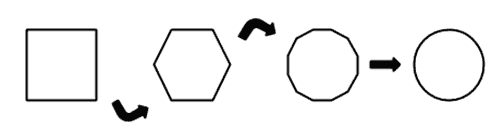
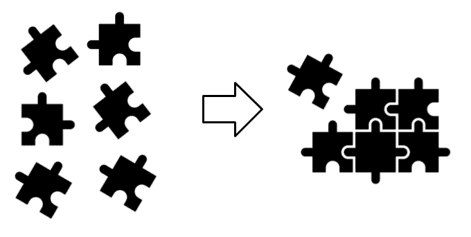
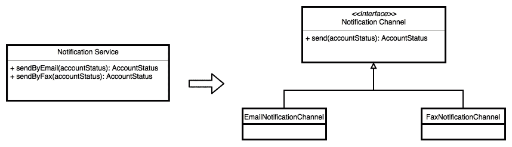

# 一、当今的软件架构

在本章中，我们将回顾什么是软件架构，以及为什么它今天仍然相关。我们还将讨论在过去几年中指导软件开发世界的新业务需求，以及它们如何影响整个软件行业。

软件和技术日新月异，引入了企业必须满足的新需求，以便在竞争激烈的市场中保持相关性。不管他们的核心业务是什么，每一家有竞争力的公司都不得不求助于技术。世界各地的在线交易和客户只是为了保持领先而必须掌握的一些挑战。

为了支持这些新的要求，我们一直在探索新的工作方式。已经做出并采用了重大变更，直接影响了我们的**软件开发生命周期**（**SDLC**）。这些变化的一些例子反映在我们在以下阶段的工作中：

*   收集要求
*   组织团队
*   设计软件架构
*   编写代码
*   部署应用

在本章中，我们将首先回顾软件架构的基本概念，这些概念已经存在了很长一段时间，今天仍然相关。

本章将涵盖以下主题：

*   定义软件架构
*   创建架构时常见的错误
*   建筑与建筑师
*   软件架构原则
*   应用高内聚和低耦合以创建组件
*   坚实的原则
*   康威定律
*   为您选择合适的技术
*   新技术趋势

# 定义软件架构

无论是否有人在团队中担任软件架构师角色，每个应用都有一个需要有人处理的架构。这是一个重要的步骤，因为它帮助我们避免编写纠缠不清的代码，这使得软件系统不可能在未来发展。

第一件事：为了知道为什么需要记住软件架构，我们首先需要理解它是什么以及它为什么重要。

在软件中，术语*架构*很难定义。作者经常借用建筑行业的定义，这是错误的。软件架构并不全是关于图表的，比如建筑物或房屋的平面图，它不仅仅是这些。这是关于技术人员甚至非技术人员对整个团队正在创建的应用的共享知识，模块如何连接以形成它，以及围绕它的所有复杂而重要的元素。好的软件架构主要关注业务需求，而不是框架、编程语言、图表和编程范例。当然，我们需要这些，因为我们使用它们创建应用。然而，他们不必定义支配我们如何构思软件的基本原则。相反，应该根据业务需求来扮演这个角色。

应用的长期成功主要取决于其架构，如前所述，必须创建该架构以支持一组定义良好的业务需求。由于应用需要解决这些特定需求，因此它们必须指导应用的架构。但是，有两种主要场景，我们基于技术而不是业务需求指导软件架构决策：

*   我知道我的土地
*   我想保持领先

# 我知道我的土地

当我们使用我们已经知道的框架和编程语言创建软件架构时，就会出现这种情况，而没有密切关注业务需求。

假设 ABC 公司需要一个应用来处理大型日志文件中的文本。如果有人要求处理这个需求，那么他们将选择在开发过程中熟悉的编程语言，而不是在其他地方寻找最佳方法。

假设负责创建此应用的人员已经掌握了 JavaScript。在这种情况下，您认为使用 Node JS 或服务器上运行的另一个 JavaScript 框架编写代码以编写应用来操作日志文件是一个好主意吗？我不是说这是不可能的，你能做到。然而，您认为使用这种方法创建的应用能够比用 Perl、Python 或 C 编写的系统更好地执行和扩展吗？这并不是说 JavaScript 很糟糕，重要的是要知道这种方法不适合 JavaScript。

# 我想保持领先

我们都希望在技术方面保持领先，利用编程世界的最新趋势，拥有更好的技术背景，从而获得更酷的工作。有些人倾向于编写应用，牢记这一点。让我们使用上一节中提到的用于操作日志文件的应用示例来解释这个场景。

假设你被要求解决我们在*我知道我的土地*一节中提到的问题。在这个场景中，你唯一关心的是技术。例如，假设您想在最新的 PHP 版本中尝试最新的特性。在本例中，您将使用 PHP 构建此应用。虽然自从 Facebook 开始向其添加新功能以来，这种编程语言在过去几年中一直在改进，但编写一个应用来使用 PHP 操作大型日志文件的想法是疯狂的。您可能知道，此编程语言旨在创建其他类型的应用，主要是那些必须使用 web 浏览器访问且没有高事务性要求的应用。

同样，您可以使用 PHP 编写一个应用来处理大型日志文件，但是当需要更多功能时会发生什么呢？您认为考虑到这种方法创建的软件架构能够快速响应新的需求和本例中使用的应用的固有特性吗？

# 预测未来

虽然我们无法在创建应用时预测应用的每个细节，但我们可以记住一些明显的假设，以避免出现明显的错误，如前几节中暴露的错误。即使您使用错误的方法创建了应用，软件架构（architecture）过程的一部分就是不时评估代码库，并基于此采取纠正措施。这一点很重要，因为现有的软件架构需要不断发展，以避免变得无用。在开发过程中，由于我们不想错过既定的项目截止日期，我们经常使用`FIXME`和`TODO`标记。然而，我们应该密切关注这些问题，并尽快采取行动，因为它们代表着一种技术债务，随着时间的推移，这种债务会越来越严重。想象一下，在下一次迭代中摆脱最近引入的债务是多么容易。现在，想象一下，如果添加债务的开发人员不再在项目上工作，甚至不再在同一家公司工作，这将是多么困难。

请记住，这些标记表示债务，债务的利息随着时间的推移而增加。

改进现有软件架构的过程有时比从头开始创建新的架构更有趣。这是因为您现在有了更多关于业务需求以及应用在生产时的执行情况的信息。

当您向现有应用添加新功能时，您将了解最初的想法有多好。如果添加新特性的过程很简单，并且只需要对其结构进行一些更改，那么我们可以得出这样的结论：软件架构做得很好。否则，如果我们需要对原始设计的基础部分进行实质性更改，我们可以说最初的想法和假设都是错误的。然而，在这一点上，负责产品的团队应该有足够的责任使其不断发展，而不是编写额外的补丁来支持新功能。

尽管修补某些东西听起来类似于让它进化，但事实并非如此。尼尔·福特（Neal Ford）、丽贝卡·帕森斯（Rebecca Parsons）和帕特里克·夸尔（Patrick Kua）所著的书*构建进化架构*中清楚地解释了这一想法。

积极主动的团队不断地应用变化，使其能够更好地支持现有的和新的功能，而不是简单地坐着等待事情失控时出现混乱。更改初始设计没有什么错，而且这样做总是值得的。下图说明了应用于几何形状的该过程：



进化原始设计

既然我们知道业务需求必须指导应用架构，那么我们可以得出结论，如果它不能支持新功能，那么新的业务机会就会错过，使应用及其架构变得无用。

# 建筑与建筑师

在 agile 和 DevOps 方法出现之前，架构师通常专注于创建编写代码的标准和规则。在过去，编写代码的架构师很常见，但这种方法在编程方面已经过时。在过去几年中，架构师的概念一直在消失，这一切都要归功于新出现的创建团队的模型。敏捷运动在软件行业已经有一段时间了，帮助我们重新思考如何构建软件和组织团队。

如今，几乎不可能找到有架构师与之合作的软件团队。此外，将不同群体的人作为使用筒仓式协作的组织的一部分（在开始新任务之前必须完成一项任务）的想法正在消失。几年前，我们有明确的角色，甚至有专门的部门负责以下角色：

*   业务分析师
*   开发者
*   质量保证工程师
*   建筑师
*   数据库管理员
*   从事基础设施建设的人员
*   操作
*   安全

下图显示了团队如何使用竖井样式工作：


作为筒仓工作的团队

在特定情况下，前面的列表也会增加。使用思洛风格的团队用于生成定义的工件，如文档、UML 图和其他通常不完整的东西。

这种方法正在发生变化，由小型多学科团队负责处理应用的每一个细节现在更为常见。这种方法有助于创建具有强大技能的主动式团队，使我们能够确保软件架构始终在运行。

很明显，并非每个团队成员都具备在每个阶段工作所需的全部技能，从收集需求到在生产中部署应用，但他们之间的沟通使我们能够缩小技术差距，更好地了解应用的整体情况。这是软件架构最重要的方面之一。

这种共享知识有助于团队继续改进现有的软件架构，克服最复杂的问题。所有负责编写软件的团队都可以了解正在开发的系统的详细信息，而不是将此职责仅委派给一个人，甚至委派给一个部门。这种方法可能会导致我们依赖于一些人或团队，这些人或团队会稍微脱离创建应用的业务环境。这是因为过去参与该项目但由于参与多个项目而不再积极参与的人员无法完全理解每个系统的所有细节。

# 软件架构原则

软件架构应通过以下两个通常难以实现的简单原则进行改进：

*   低耦合
*   高内聚

无论您使用何种编程语言、范式或工具来构建应用，这两条原则都应该指导您构建软件架构组件。

为了构建将塑造您的架构的组件，始终值得遵循这些指导原则。即使存在多年，这些仍然是相关的，并且在创建组件时应始终考虑它们。在本节中，我将讨论固体原理和康威定律，我们将在本章后面更详细地讨论。现在是时候更详细地了解哪些组件。

# 组件

组件是解决一个问题的一组函数、数据结构和算法。这意味着用于构建组件的所有代码和构件都具有高度的内聚性；这里的规则是，创建组件的类或文件应该同时出于相同的原因进行更改。

软件架构是使用许多组件构建的，您不应该担心这些组件数量过多。编写的组件越多，将它们分配给不同开发人员甚至不同团队的自由度就越大。大型软件架构可以使用许多可以独立开发和部署的较小组件来创建。

一旦我们将这些组件彼此连接起来，它们就允许我们创建所需的软件架构。

如下图所示，我们可以将组件视为拼图的一部分，它们组合在一起形成一个应用：



构成更大应用的组件

连接的组件定义了应用架构，它们的设计描述了每个组件是如何在内部创建的。正是在这里，图案设计和坚实的原则必须用来创造良好的设计。

# 低耦合

低耦合是指组件通过其下部结构而不是接口相互依赖的程度，从而在组件之间形成紧密耦合。让我们通过一个简单的例子来让这更容易理解。假设您需要处理下一个用户的故事：

*作为银行客户，我希望通过电子邮件或传真接收我的银行对账单，以避免打开银行申请。*

您可能会发现，开发人员应该做两件事来解决这个问题：

*   添加在系统中保存用户首选项的功能
*   通过使用请求的通知渠道向客户发送银行对账单

第一个要求似乎相当简单。要测试此实现，我们将使用相当简单的代码，例如以下代码：

```java
@Test 
public void 
theNotificationChannelsAreSavedByTheDataRepository() 
throws Exception 
{ 
  // Test here 
} 
```

对于第二个要求，我们需要阅读这些首选通知渠道，并使用它们发送银行对账单。指导此实现的测试如下所示：

```
@Test 
public void 
theBankStatementIsSendUsingThePreferredNotificationChannels() 
 throws Exception 
{ 
  // Test here 
} 
```

现在是时候展示一个紧密耦合的代码来理解这个问题了。让我们来看看下面的实现：

```
public void sendBankStatement(Customer customer) 
{
  List<NotificationChannel> preferredChannels = customerRepository
  .getPreferredNotificationChannels(customer);
  BankStatement bankStatement = bankStatementRepository
  .getCustomerBankStatement(customer);
  preferredChannels.forEach
  (
    channel -> 
    {
      if ("email".equals(channel.getChannelName())) 
      {
        notificationService.sendByEmail(bankStatement);
      } 
      else if ("fax".equals(channel.getChannelName())) 
      {
        notificationService.sendByFax(bankStatement);
      }
    }
  );
}
```

注意这段代码是如何与`NotificationService`类的实现紧密耦合的；它甚至知道该服务拥有的方法的名称。现在，假设我们需要添加一个新的通知通道。为了使这段代码正常工作，我们需要添加另一个`if`语句，并从这个类中调用相应的方法。即使示例引用的是紧密耦合的类，这种设计问题也经常发生在模块之间。

现在，我们将重构此代码并显示其低耦合版本：

```
public void sendBankStatement(Customer customer) 
{
  List<NotificationType> preferredChannels = customerRepository
  .getPreferredNotificationChannels(customer);
  BankStatement bankStatement = bankStatementRepository
  .getCustomerBankStatement(customer);
  preferredChannels.forEach
  (
    channel ->
    notificationChannelFactory
    .getNotificationChannel(channel)
    .send(bankStatement)
  );
}
```

这一次，获取通知通道的责任被传递给`Factory`类，而不管需要什么类型的通道。我们需要从`channel`类中了解的独特细节是它有一个`send`方法。

下图显示了如何重构发送通知的类，以使用不同的通道发送通知，并支持每个通知通道实现前的接口：



重构后的类

这一微小但重要的变化必须使我们封装用于发送通知的机制的细节。这只公开了一个定义良好的接口，其他类应该使用该接口。

虽然我们已经用类展示了这个示例，但同样的原则也适用于组件，应该使用同样的策略来实现它们，并避免它们之间的耦合。

# 高内聚

高内聚性原则也有一个非常简单的定义：一个组件应该执行一个且仅执行一个定义良好的工作。虽然描述非常简单，但我们往往会感到困惑，违反这一原则。

在前面的示例中，我们有`NotificationService`，负责通过电子邮件和传真发送通知。`and`一词在识别违反这一原则的行为时可能会对我们有所帮助。现在我们有了两个不同的类（每个通知通道一个），可以公平地说，我们的类只有一个职责。

同样，组件也是如此，保持相同想法的另一个原因是，您可能会让每个组件只完成一个特定的需求。例如，如果我们的所有客户都希望通过电子邮件接收他们的银行对账单，会发生什么；你认为依赖一个也能发送传真的类可以吗？

尽管上一个问题可能看起来不重要，但假设您解决了一个与使用传真作为通知机制发送通知相关的现有问题，然后在该机制中引入了一个新问题，以便错误地发送电子邮件通知。

请记住，组件塑造了您的软件架构，架构师应该以最大化团队生产力的方式来设计它们。将组件与高内聚性原则对齐是将它们分开的一种很好的方法，并允许团队独立处理应用的不同部分。这种创建具有明确职责的各种组件的能力将使您在解决其他问题和添加新功能时更加容易，并且还将使您不太容易引入 bug。

关于上一个示例，您可能想知道为什么`NotificationChannel`类显然在发送带有`BankStatement`参数的通知。

常识使我们相信，我们需要用任何其他泛型类型替换这个类。允许应用发送不同类型的通知，而不仅仅是银行对账单，这可能会有帮助：这可能包括缺点，或者当账户中收到新存款时。尽管支持传入需求的想法看起来像是您在此阶段可能希望在程序中包含的东西，但应用目前不需要此功能。这就是为什么我们现在没有必要添加此功能的原因。相反，这种设计应该在必要时进行演变；这样，我们就坚持了接吻原则（[https://www.techopedia.com/definition/20262/keep-it-simple-stupid-principle-kiss-principle](https://www.techopedia.com/definition/20262/keep-it-simple-stupid-principle-kiss-principle) ）并遵循仅构建最基本功能的指示，以使应用正常工作。

# 坚实的原则

SOLID 是一个首字母缩略词，代表指导良好软件设计的五个基本原则。设计与创建塑造软件架构的组件有关。

2004 年，Michael Feathers 向《这些原则》的作者 Robert C.Martin 提出了这个缩写。创建它们的过程花费了他大约 20 年的时间，在这段时间里，其中许多被添加、删除和合并，以实现一套强大的原则，名为 SOLID。让我们回顾一下每一条原则，并提供一个简短而清晰的解释，这将有助于我们准确了解如何使用它们。

我们将使用术语*模块*与模块塑造组件的思想相结合，并将参考**面向对象编程**（**OOP**世界，使用诸如*类*和*接口*等术语以便对模块进行更精确的解释。

# 单一责任原则（SRP）

SRP 与我们前面回顾的高内聚性密切相关。这一原则背后的理念是，一个模块只应出于一个原因进行更改

这个定义使我们得出结论，一个模块应该只有一个职责。验证您的设计是否实现了这一原则的一种方法是回答以下问题：

*   模块的名称是否表示其公开的功能？

答案应该是肯定的。例如，如果模块名称引用域，则模块应包含域类以及与模块名称本身相关的域对象周围的一些功能。例如，您不希望代码支持您正在使用的模块范围之外的审核元素或任何其他方面。如果模块支持其他功能，则可能需要将支持这些附加功能的代码移动到现有审核模块，或者创建新的审核模块。

*   当需要进行新的更改时，模块有多少部分受到影响？

这个问题的答案应该是很多；模块中的所有类都是高度连接的，因此新的更改将改变它们。通过公开的接口可以防止更改所需的行为，但后台实现通常是不稳定的。

# 开闭原理（OCP）

OCP 编写简单，但难以解释。因此，我将首先编写以下定义，然后再进行描述：

*新功能可以通过扩展而不是修改添加到现有模块中。*

听起来很简单，不是吗？为了从实践的角度理解这一概念，有必要重温上一个示例。让我们通过回答以下问题来检查我们是否实现了这一原则：

*   为了支持新的通知通道，我们需要什么？

我们需要编写一个新的类（模块），这应该实现一个现有的接口。请注意，在提供的答案中，开闭原则是如何有意义的。为了在应用中支持新的通知通道，我们需要创建一个新类，但不需要修改现有代码。根据我们之前进行的重构，如果我们需要支持此需求，我们必须调整现有服务以发送通知。

验证这一原则实现情况的几个问题如下：

不可以。如果您希望添加新功能，您将编写一个新类，而不是修改现有类。这是因为您正在添加而不是更改功能。

希望是一点点。在一个完美的世界中，您不需要修改任何内容，但有时需要更改一些部分以支持现实世界中的新功能。这里的规则是，如果您要添加一个新特性，您的原始设计应该能够支持此需求，而只需进行最小的更改。如果不是这样，建议重构或更改初始设计。

大的源代码文件是一个坏主意，没有理由让它们变大。如果您的源代码文件有成百上千行，请重新访问您的函数，并考虑将代码移动到新文件中，以便使源代码文件更小且易于理解。

这是一个棘手的问题。如果某个东西只有一个具体的实现，那么就不需要抽象类或接口。编写代码和创造新的可能场景是不可取的，但是如果您至少有两个相互关联的具体实现，那么您必须考虑为它们编写一个抽象。例如，如果我们只需要发送电子邮件通知，就没有理由为此编写接口。然而，由于我们通过两个不同的渠道发送通知，我们当然需要一个抽象来处理它们。

# Liskov 替换原理

**利斯科夫替代原则**（**LSP**有一个奇特的定义：

*只要 B 是 A 的子类型，模块 A 可以被模块 B 替换。*

定义良好的合同在很大程度上支持这一定义，并帮助我们减少模块之间的耦合。以下问题可以帮助您了解这一原则的实现情况：

*   模块是否使用抽象或具体实现进行交互？

在这里，答案应该是模块不应该与任何一个选项交互。没有理由通过使用模块的具体实现而不是接口来建立模块之间的交互。

*   我是否应该铸造对象以使用它们？

我希望不是。如果是这样，那是因为接口设计得不好，应该创建一个新的接口来避免这种行为。使用`instanceOf`功能也是不可取的。

*   模块之间的交互是否由`IF `语句引导？

没有理由这样做。您的模块应该以一种可以通过使用接口和正确的依赖注入来解决其具体实现的方式进行连接。

# 接口隔离原则（ISP）

界面分离原则的主要动机与精益运动一致，在精益运动中，用较少的资源创造价值至关重要。这里有一个简短的定义：

*避免你不使用的东西。*

您可能已经看到类（模块）使用一些方法实现来实现接口，例如：

```
public  class Abc implements Xyz 
{ 
  @Override 
  public void doSomething(Param a) 
  { 
 throw new UnsupportedOperationException 
    ("A good explanation here"); 
  } 
  // Other method implementations 
} 

```

或者，也可以使用另一个名为*注释的选项**实现*，如下代码所示：

```
public  class Abc implements Xyz 
{ 
  @Override 
  public void doSomething(Param a) 
  { 
 // This method is not necessary here because of ... 
  } 
  // Other method implementations 
} 
```

前面的示例成功地描述了创建此原则所要解决的问题。处理此问题的最佳方法是创建符合其他解释原则的更一致的接口。此问题的主要问题与空方法实现无关，而是与根本不使用的附加功能有关。

假设一个应用依赖于一个*XYZ*库，而系统只使用了 10%的可用功能。如果应用新的更改来解决其他 90%中存在的问题，那么修改后的代码将对应用正在使用的部分构成风险，即使它与应用没有直接关系。

以下问题将帮助您确定您的表现：

*   我是否有像前面提到的那些空的或愚蠢的实现？

请不要回答“是”。

*   我的界面有很多方法吗？

希望不会，因为这将使在具体实现中实现所有抽象方法变得更加困难。如果你有很多方法，请参考下一个问题。

*   所有方法名称是否与接口名称一致？

方法名称应与接口名称一致。如果一个或多个方法根本没有意义，那么应该创建一个新接口来放置它们。

*   我可以把这个接口分成两个而不是一个吗？

如果是，就去做吧。

*   从一整套公开的函数中，我使用了多少个函数？

如果与接口交互的模块仅使用少数公开的功能，那么其他模块可能应移动到另一个接口，甚至移动到新模块。

# 依赖倒置（DI）原理

现在是定义依赖项反转原则的时候了：

*模块应该依赖于抽象，而不是具体的实现。*

抽象表示模块的高级细节，模块之间的交互应该在这个级别上完成。低层次的细节不稳定且不断演变。我们之前说过，进化模块没有问题，但是当然，我们不想因为低层次的细节而破坏模块的交互，一个很好的方法是使用抽象而不是具体的实现。以下问题将帮助您确定您的表现：

*   我是否将抽象作为模块的一部分？

正如本章前面所讨论的，许多具体的实现前面都应该有一个抽象。然而，当涉及到一个特定的实现时，情况可能并非如此。

*   我是否每次都自己创建新实例？

这里的答案应该是否定的。负责应用内部依赖项注入的框架或机制负责完成这项工作。

# 康威定律

梅尔·康韦（Mel Conway）在 1968 年发表了一篇论文，这篇论文至今仍然相关，指出了公司应该朝着哪个方向发展。长期以来，我们专注于为每件事定义规则，例如：

*   你应该什么时候到办公室
*   人们应该工作的最短时间
*   每周工作多少天
*   工作时间适合穿什么类型的衣服

这些规则适用于任何类型的公司，在许多情况下，它们今天仍然适用。在 IT 界（尤其是软件行业），我们创建了另一套规则来指导我们的团队（如果您不想感到无聊，请随时避免阅读这些规则）：

*   业务分析师应该创建具有定义良好的结构的用例，允许开发人员忽略业务细节，并将重点放在流程的技术部分。
*   开发人员应该遵循多年前由产品的软件架构师创建的标准文档。
*   每天编写的代码行应该表明开发人员的工作效率。
*   创建新数据库对象时，必须更新现有的可信任数据库字典。
*   一旦您的代码准备好推送，使用电子邮件模板请求 QA 团队进行修订。在他们批准后，与设计团队重复此过程，然后再次与架构（architecture）团队重复此过程。
*   对推送代码的任何更改都将迫使您重复前面规则中解释的过程。
*   当您完成指定用例的编码时，不要忘记 UML 图。并非所有这些都是必需的，只有最重要的，如以下所列：
    *   类图
    *   对象图
    *   包装图
    *   组件图
    *   序列图
    *   部署图

在某些情况下，前面的图表列表会更大。幸运的是，如今情况已经发生了变化，迫使我们编写大量文档并创建不同图表的疯狂流程不再使用。考虑到这些前提，梅尔·康韦在论文中写道：

“任何设计系统的组织都不可避免地会产生一种设计，其结构是该组织通信结构的副本。”

康威的论文仍然是相关的，并一直影响着我们构建团队的方式，以创建成功的项目并避免浪费资源。

人是团队的组成部分，在过去几年中，如何安排这些人来创建成功的团队的问题已经在许多方面得到了回答。所有这些答案都建议建立小型和多学科团队，这些团队应该足够小，可以用一个比萨饼喂饱，并且应该足够多学科，以避免在 SDLC 期间形成筒仓。

通过这种方式，公司正在促进团队内部共享和持续学习的文化。团队不断从成功和失败中学习。它们直接相互交互，而不是使用中介或其他通信协议。

业务边界由团队定义，允许他们使用定义良好的接口进行沟通，并且由于沟通由他们自己直接管理，快速反馈将使他们能够解决问题并在必要时采取纠正措施。

# 为您选择合适的技术

在本章前面，我们定义了什么是软件架构以及围绕它的相关元素。我们还提到，框架、编程语言、范例等不是指导软件架构的基本元素。许多人支持尽可能推迟技术决策的想法，以使您的设计向新选项开放，这是值得的。然而，你不能永远推迟这些选择。

市场上有很多可用的框架。其中许多是新的，但旧的框架仍然可用。即使在流程开始时，当所有这些都只是一个细节时，您也需要仔细选择用于构建软件架构的框架，因为这个细节将使您的生活更轻松（或更困难），这取决于您为解决业务需求而实现的功能。我将向您展示在决定使用哪个框架时需要牢记的一些注意事项：

*   有多少文档可用？

这是一个需要考虑的重要因素。在这里，您必须考虑为供应商编写了多少文档，以及在线提供了多少课程（不仅由供应商提供，也由其他开发人员提供）。如果你能找到书籍、文章和展示，那么你总是值得去探索它们，因为它们可以让你了解你决定使用的工具。

*   你选择的社区有多大？

有很多人致力于改进产品是你应该感激的事情。您的选择不仅应该得到供应商的支持，还应该得到使用该产品来解决其需求的其他开发人员和公司的支持。

*   使用您心目中定义的技术编写测试是否困难？

无论您的编程风格是什么，将测试作为 SDLC 的一部分始终会让您受益匪浅。您还将受益于包含软件另一方面的测试（或者至少包括单元测试、集成测试、功能测试和负载测试）。如果您的框架使此任务变得困难，那么最好选择另一个框架。如果您正在使用一个框架 ABC 来进行依赖注入，那么应该对其进行测试，但是如果这些测试很难编写，您就不想浪费时间了。考虑到这一点，Spring 对测试有很好的支持，我们将在后续章节中使用实际操作的方法介绍这一点。

*   我可以插入组件以添加更多功能吗？

您可能会想“如果我想添加一个新组件，我可以简单地包括一个 JAR”。在某些情况下，这是正确的，而在其他情况下，您需要发现一整套依赖项才能使其正常工作。这是一个痛苦的过程，因为有时您需要特定库的特定版本，这更难由我们自己解决，而这不是您应该花费太多时间的事情。Spring 包括 SpringBoot，它提供了一种非常好的方法，可以直接将依赖项添加到项目中。您应该只向 Spring 指出您希望在应用创建过程中使用 JPA（例如），而 Spring 本身将能够找出所有必需的依赖项，使其能够自行工作。

当您第一次寻找正确的工件来引导您的应用时，与 Maven 斗争是很常见的。Spring 的好消息是您有了 Spring Initializer，它是一个友好的网站，只需点击几下就可以引导您的应用。您可以参考[https://start.spring.io](https://start.spring.io) 了解更多详情。

*   公司使用该产品的目的是什么？

即使市场上充斥着看起来很有前途的新工具，在选择技术和框架时，你也不想冒险。在选择框架或技术之前，我鼓励您在 YouTube 上观看一些会议视频。如果有机会的话，你可以去参加其中一个，那就更好了。您还可以阅读有关特定技术的论文、展示和案例研究，以及哪些公司正在使用这些技术。您甚至可以根据这些信息创建类比，以了解特定技术适合您的程度。

然而，多年来，我看到人们一直在与 Spring 合作，以满足不同行业的业务需求。

这个框架已经成熟，并且正在不断发展，以适应软件行业中新的编程风格和新兴技术。例如，Spring 的最新版本包括对 Java 世界和整个行业中引入的最新特性的支持，如反应式编程、最新 Java 版本，甚至支持其他正在流行的编程语言，如 Kotlin 和 Groovy。

# 新趋势

在过去几年中，出现了许多编程语言来解决新的业务需求，其中许多语言都在 JVM 上运行，这给 Java 开发人员带来了巨大的优势，使得接受新的编程语言变得不那么困难。

新出现的软件架构被创建并不是巧合。业务已经扩展到世界各地，这使得扩展旧应用更具挑战性。这种方法迫使我们重新思考如何划分业务边界，以提供可扩展的服务来解决业务需求。因为我们需要向世界各地的客户提供服务，所以出现了云，现在我们甚至可以选择地区来减少应用的延迟。

随着云准备好使用，X 作为一种服务范例出现。我们现在有了专门针对特定需求创建的服务，如在线支付、身份验证、数据存储等。这导致我们创建了无服务器架构；有了这些，公司将更多的精力放在他们的业务需求上，而不是放在其他公司解决的细节上，这些细节是作为随时可用的服务提供的。

在世界各地拥有客户端意味着需要存储更多的数据，而改进的数据存储正在取代旧的关系模型。NoSQL 是被迫构思的，推荐的技术（如规范化）已经被这些模型所取代，使得以前很好的实践和建议现在完全无用。这场运动甚至迫使人们围绕它创造新的职业。我们目前正在研究这些数据，并使其有价值。如今，数据科学家正变得越来越受欢迎，他们的角色是确定数据背后隐藏着哪些其他商业机会，以及人们需要在此基础上采取哪些行动。

允许客户快速使用服务是公司所寻求的功能，而对话界面正引导我们走上正确的道路。包含允许人们使用语音建立对话的软件的设备（如 Alexa、Cortana 和 Siri 等）正在为更方便、更快地使用服务提供新的可能性。SDK 工具目前可用于多种编程语言的开发人员，因为现在多语言开发人员是最常见的。

并非所有企业都需要接受这些新趋势。然而，这些新的选择正在将公司引入一个充满机遇的世界，这将为他们提供比那些不接受机会的公司更大的优势。

# 总结

在本章中，我们研究了软件架构固有的基本概念。即使公开的原则在行业中已经存在了一段时间，它们仍然是相关的，在进行架构方面的工作时值得考虑它们。需要记住的是，高内聚和低耦合指的是如何连接组件以形成软件架构，并且坚实的原则适用于每个组件的设计。

最后，在本章中，我们讨论了软件行业如何发展以迎接公司当前面临的新业务挑战。在下一章中，我们将深入回顾什么是软件架构维度，我们还将学习如何使用 C4 模型来记录软件架构。