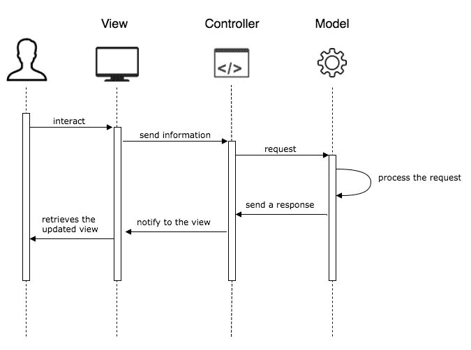
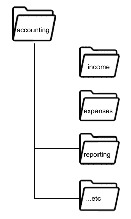
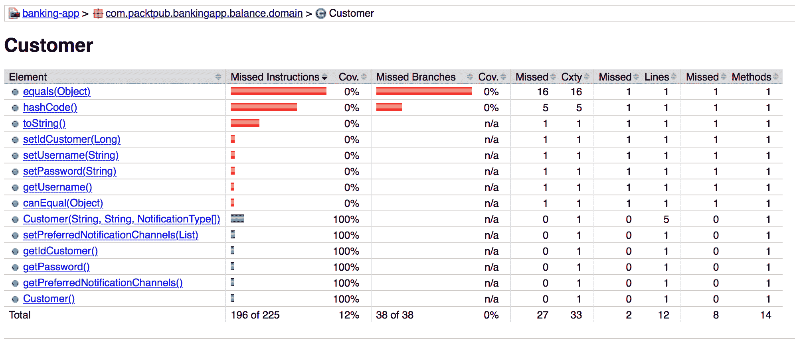
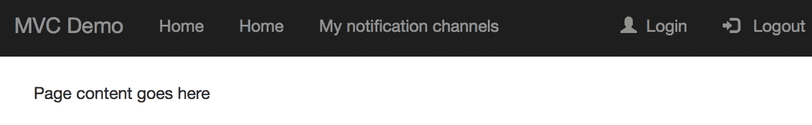
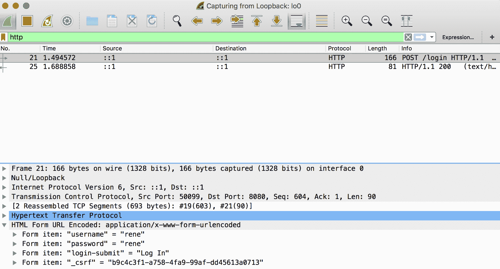
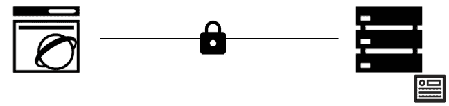

# 五、模型-视图-控制器架构

在本章中，我们将深入探讨当今框架使用的最常见的架构模式之一。

**模型视图控制器**（**MVC**架构模式由 Trygve Reenskaug 于 1979 年制定。这是为图形用户界面创建有组织的方法的第一次尝试之一。尽管从那时起已经过去了很多年，但即使在最现代的 UI 框架中，这种模式仍然非常流行。这是因为它设计用于构建几乎任何类型的应用，包括最常见的应用类型，如移动、桌面和 web 应用。

这种模式之所以流行，主要是因为它易于理解。MVC 提供了一种将应用分为三个不同组件的极好方法，我们将在本章中对此进行回顾。

在本章中，我们将介绍以下主题：

*   MVC 的要素包括：
    *   模型
    *   看法
    *   控制器
*   使用 MVC 架构的好处
*   常见的陷阱
*   使用 MVC 实现应用：
    *   Spring MVC
    *   测试
    *   UI 框架：Thymeleaf
    *   保护 MVC 应用：
        *   基本身份验证
        *   HTTP 和 HTTPS

# MVC

支持 MVC 模式的想法是 Trygve Reenskagug 研究的一部分，他在研究中总结了以下关键想法：

“MVC 被认为是解决用户控制大型复杂数据集问题的通用解决方案。最难的部分是为不同的架构组件找到好名字。模型视图编辑器是第一组。”

–[http://heim.ifi.uio.no/~trygver/themes/mvc/mvc-index.html](http://heim.ifi.uio.no/~trygver/themes/mvc/mvc-index.html)

计算机科学中最大的问题之一与命名有关，这就是为什么最初的名称是模型视图编辑器。它后来演变成 MVC，如前一链接所述：

“经过长时间的讨论，特别是与 Adele Goldberg 的讨论，我们以术语“模型视图控制器”结束。”

MVC 是一种软件架构模式，它可以在应用的域对象（业务逻辑所在的位置）和用于构建 UI 的元素之间建立清晰的分离

考虑到这个概念，在这些部分之间隔离和分离关注点是非常重要的。它们还构成了使用此模式构建应用的基本原则。在接下来的部分中，让我们回顾一下应用的业务逻辑和表示层如何适应 MVC 模式。

# 模型（M）

在此上下文中，**模型**表示表示表示支持应用固有需求的业务逻辑所需的域对象。在这里，所有用例都表示为真实世界的抽象，并且定义良好的 API 可供任何类型的交付机制（如 web）使用。

对于传统应用，与数据库或中间件交互的所有逻辑都在模型中实现。然而，模型（MVC 中的 M）应该公开易于理解的功能（在业务方面）。我们还应该避免建立只允许与数据库交互的贫血模型，并且对于项目团队的其他成员来说很难理解。

一旦应用的这一部分被编码，理想情况下，我们应该能够创建允许用户与模型交互的任何 UI。此外，由于 UI 可以相互延迟（移动、web 和桌面应用），因此模型对所有应用都应该是不可知的。

在一个完美的世界中，一个孤立的团队将能够构建应用的这一部分，但在现实生活中，这种假设是完全错误的。需要与负责构建 GUI 的团队进行交互，以便创建能够满足所有业务需求并公开全面 API 的有效模型。

# 观点（五）

**视图**是模型的视觉表示（MVC 中的 M），但有一些细微的差异。作为这些差异的一部分，视图倾向于删除、添加和/或转换特定的模型属性，目的是使与视图交互的用户能够理解模型。

由于模型有时很复杂，因此可以使用许多视图来表示模型的一部分，相反，模型的许多部分可以仅作为视图的一部分包含。

# 控制员（C）

**控制器**是应用最终用户与模型实现的业务逻辑之间的链接。控制器是负责获取用户输入并确定应该调用模型的哪一部分以实现定义的业务目标的对象。由于这种交互，模型经常会发生更改，这些更改应该使用控制器传播到视图。

视图和模型之间的直接通信决不能发生，因为它违反了此模式的工作方式。

记住前面的提示，所有通信都应该按照特定的顺序从 MVC 模式的每个部分进行，将信息从视图传递到控制器，从控制器传递到模型，而不要直接从模型传递到视图，如以下交互图所示：



MVC 交互图

为了传播这些更改，视图元素被绑定到控制器中的表示，这使得可以根据需要对其进行操作。更新视图的过程发生在模型更新时，通常涉及重新加载数据或隐藏/显示视图中的某些元素。

当更改应该传播到视图中的多个元素时，各种控制器可以协同工作以实现该目标。在这些情况下，观察者设计模式的简单实现通常有助于避免纠缠代码。

下图以图形表示了此模式中的各个部分在表示层或业务逻辑层中的排列方式：


MVC 图形表示法

# 使用 MVC 的好处

MVC 为使用它实现的应用提供了许多好处；主要的好处是清晰地分离了关注点，对应用的每个部分都有一个单独的责任，从而避免了弄乱代码并使代码易于理解。

虽然控制器和视图被绑定在一起，以使用 MVC 构建应用的可视化表示，但模型是绝对独立的。这使得可以重用同一模型来创建不同类型的应用，包括但不限于以下内容：

*   可移动的
*   网状物
*   桌面

您可能会得出这样的结论：使用此模型开发的项目可以依靠团队在开发阶段并行工作，但单独工作，这在某些情况下是正确的，但通常不是规则。如前所述，整个应用的构建仍然需要团队间的有效沟通。

# 常见的陷阱

当我们使用 MVC 处理应用时，通常会发现项目采用 MVC 首字母缩略词进行结构，如下图所示：


MVC 项目结构

此目录结构表示以下内容：

*   项目名称为**abc 网站**
*   这是一个 web 应用
*   应用使用 MVC 架构（结构）

不幸的是，这些要点都不能为负责创建或维护应用的团队提供有意义的信息。这是因为从事项目的团队对文件组织不感兴趣。相反，根据业务规则、用例或与业务本身相关的其他因素而不是技术方面来组织代码更有用

考虑到这一点，我们建议更有用的目录结构如下：



可理解的项目结构

从这张图中，我们可以推断出以下几点：

*   这是一个**会计**系统。
*   该项目的主要特点与以下及更多方面有关：
    *   收入
    *   费用
    *   报告

使用上图所示的项目布局，如果我们的任务是修复一个不再工作的报告，我们可以考虑查看报告文件夹。这种方法有助于减少完成项目任务所需的时间和精力。

我们可以得出结论，与第一个项目结构相比，第二个项目结构提供的信息更加有用和实用，因为第一个项目结构根本不提供有关业务的信息。

项目的每个部分都应该传达有关业务的信息，而不是关于所使用的交付机制或模式的信息。

这些细节虽小，但却是必不可少的。在本书的开头，我们提到一个好的架构是围绕业务需求构建的，架构追求的任何目标都应该被整个团队理解。我们应该处理每一个细节，以实现这一目标。记住：细节很重要。

# 使用 MVC 实现应用

现在，您已经了解了 MVC 架构背后的理论，是时候将您所学到的概念付诸实践，并看看 Spring 框架如何实现它们了。我们将首先回顾 SpringMVC，这是一个允许我们实现这种架构风格的项目。

# Spring MVC

Spring 通过 SpringMVC 为 MVC 架构模式提供支持。这个 Spring 项目允许合并大量的 UI 框架，以便构建表单和相关组件，使用户能够与应用交互。 

SpringMVC 构建在 ServletAPI 之上，ServletAPI 旨在创建 web 应用。使用此工具无法创建桌面或任何其他类型的应用。尽管 MVC 架构模式可以应用于所有这些模式，但 SpringMVC 只关注 web。

SpringMVC 的正式名称是 SpringWebMVC。

尽管 SpringMVC 支持大量的视图技术，但最常用的技术往往是 Thymeleaf，因为它具有平滑的集成。但是，您也可以使用其他框架，例如：

*   JSF
*   自由标记
*   支柱
*   GWT

SpringMVC 是围绕前端控制器模式设计的，它依赖于单个对象来处理所有传入的请求并提供相应的响应。在 Spring MVC 中，这个对象由`org.springframework.web.servlet.DispatcherServlet`类实现的`Servlet`表示。

该`Servlet`负责将请求委托给控制器，并在屏幕上呈现相应的页面，以及所需的数据。下图显示了`DispatcherServlet`如何处理请求：


DispatcherServlet 请求处理

在上图中，我们可以看到控制器是一个 Java 类，**视图**是一个 HTML 文件。在后一种情况下，我们还可以使用任何`tag-library/template-engine`标记，这些标记稍后将被编译为 HTML 代码，并在 web 浏览器中呈现。

Spring 中的控制器是在类名上使用`@Controller`注释创建的，如以下代码段所示：

```java
import org.springframework.stereotype.Controller;

@Controller
public class DemoController 
{
  ...
}
```

既然类被标记为控制器，那么我们需要指出将处理哪些请求映射，以及作为请求处理的一部分需要执行哪些操作。为了支持此功能，我们需要使用`@RequestMapping`注释编写一个简单的方法，如下代码所示：

```
@RequestMapping(value = "/ABC", method = RequestMethod.GET)
public String handleRequestForPathABC() {
    // do something
    return "ui-template";
}
```

如您所见，前面的方法处理来自`/ABC`路径**、**的传入请求，处理完成后，将提供一个`ui-template`**，在浏览器上呈现**

 **此操作由 Spring MVC 使用视图解析器完成，视图解析器将呈现一个名为`ui-template.html`的文件。如果需要，还可以编写自定义解析程序向视图添加后缀或前缀

当我们需要将数据从控制器传递到视图时，我们可以使用由 Spring 视图解析器启用的`Model`对象。此对象可以填充任何要在视图中使用的数据。同样，当用户从视图提交数据时，该对象将填充输入的信息，控制器可以使用这些信息执行任何所需的逻辑。

为了将数据从控制器发送到视图，我们需要在处理请求的方法中包含`Model`对象作为参数，如下所示：

```
@RequestMapping(value = "/ABC", method = RequestMethod.GET)
public String passDataToTheView(Model Model) {
    Model.addAttribute("attributeName", "attributeValue");
    // do something
    return "ui-template";
}
```

所有模板都能够使用`${...}`语法（称为表达式语言）读取从控制器传递的属性：

```
<!DOCTYPE html>
<html lang="en">
    <head>
        <title>Title</title>
    </head>
```

```
    <body>
        ${attributeName} 
    </body>
</html>
```

或者，如果要将数据从视图组件传递到控制器，则必须在视图中填充对象（例如，使用表单），如下所示：

```
<!DOCTYPE html>
<html lang="en">
    <head>
        <title>Title</title>
    </head>
    <body>
        <form action="#" th:action="@{/process}"   
        th:object="${myObject}">
            <label for="name">Name:</label>
            <input type="text" id="name" th:field="*{name}"/>
            <button type="submit">OK</button>
         </form>
    </body>
</html>
```

填充对象字段并按下提交按钮后，将发送请求，以便我们可以声明处理请求的方法：

```
@RequestMapping(value = "/process", method = POST)
public String processForm(@ModelAttribute MyObject myObject) {
    String name = myObject.getName();
    // do something
    return "ui-template";
}
```

在本例中，您可能已经注意到我们正在使用`@ModelAttribute`捕获请求中发送的数据

# 测试

测试对我们的应用至关重要。当我们使用 SpringMVC 时，我们可以依靠`spring-test`模块来添加对上下文感知的单元和集成测试的支持，这意味着我们可以依赖注释来连接依赖项。我们还可以使用`@Autowired`注释来测试特定组件。

以下是编写上下文感知测试的一个简单示例：

```
@RunWith(SpringRunner.class)
@SpringBootTest
public class ContextAwareTest {

    @Autowired
    ClassUnderTest classUnderTest;

    @Test
    public void validateAutowireWorks() throws Exception {
        Assert.assertNotNull(classUnderTest);
    }
}
```

让我们用粗体查看代码，以了解其工作原理：

*   前两个注释为我们完成了所有工作；它们将允许在 servlet 容器中运行我们的测试，用于测试的 Spring 引导注释将以与生产中运行的代码相同的方式连接所有类。
*   由于我们添加了前面提到的注释，现在我们可以使用`@Autowired`注释连接我们想要测试的组件。
*   代码验证被测试的类是否已成功实例化，并准备好使用。这也意味着类中的所有依赖项都已成功连接。

这是一种测试必须与数据库、MessageBroker 服务器或任何其他中间件交互的代码的简单方法。用于验证与数据库服务器交互的方法使用内存中数据库（如 H2），用于传统 SQL 数据库（如 PostgreSQL 或 MySQL）；NoSQL 数据库也有一些选项，例如嵌入式 Cassandra 或 Mongo。

另一方面，当您需要测试与其他第三方软件的集成时，需要记住的一个很好的方法是使用沙盒。沙盒是一种类似于生产环境的环境，提供给软件供应商用于测试。这些沙盒通常部署在生产环境中，但它们也有一些限制。例如，与付款相关的操作不在最后阶段处理

当您无法在自己的环境中部署应用时，这种测试方法非常有用，但当然，您需要测试集成是否与您的应用一起工作。

假设您正在构建一个与 Facebook 集成的应用。在本例中，很明显，为了在您自己的暂存区域中部署 Facebook 实例进行测试，不需要进行任何更改。这是一个沙箱环境何时合适的完美例子。

请记住，沙盒使用第三方软件测试集成。如果你是一个软件供应商，你需要考虑提供沙盒，让你的客户在测试模式下试用你的产品。

SpringMVC 测试也有一个流畅的 API，使编写高表达性测试成为可能。该框架提供了一个`MockMvc`对象，可用于模拟最终用户请求，然后验证提供的响应。常见用例包括以下内容：

*   验证 HTTP 代码状态
*   验证响应中的预期内容
*   URL 重定向

下面的代码片段使用`MockMvc`对象来测试前面描述的示例：

```
@RunWith(SpringRunner.class)
@SpringBootTest
@AutoConfigureMockMvc
public class RedirectionTest 
{
  @Autowired
 private MockMvc mockMvc;
  @Test
  public void contentAndRedirectionTest() throws Exception 
  {
 this.mockMvc.perform(get("/urlPage"))
 .andExpect(redirectedUrl("/expectedUrlPage") .andDo(print()).andExpect(status().isOk())
    .andExpect(
      content().string(containsString("SomeText")))
    );
  }
}
```

让我们快速回顾一下粗体代码，以了解其工作原理：

*   `AutoConfigureMockMvc`注释生成所有必需的管道代码，以便在测试中使用`MockMvc`对象。
*   `MockMvc`对象是自动连接的，可以随时使用。
*   `MockMvc`提供的 fluent API 用于验证响应中的预期状态代码。我们还测试了一个简单的重定向，以及重定向完成后页面上预期的内容。

# 测试覆盖率

当我们讨论测试时，经常听到术语**测试覆盖率。**这是一种用于检查套件测试执行了多少代码的度量，它有助于确定哪些代码的替代路径未经测试，因此容易出现错误。

假设您正在编写一个具有`if`语句的方法。在这种情况下，您的代码有两条可选路径可供遵循；因此，如果您想要实现 100%的覆盖率，您将需要编写测试来验证代码可以遵循的所有可选路径。

有许多有用的库可用于测量代码的覆盖率。在本章中，我们将介绍 Java 世界中最流行的库之一；该图书馆名为 JaCoCo（[http://www.eclemma.org/jacoco/](http://www.eclemma.org/jacoco/) ）。

为了使 JaCoCo 成为我们应用的一部分，我们需要使用我们首选的构建工具将其作为插件包含进来。

以下是使用 Gradle 包括 JaCoCo 所需的配置：

```
apply plugin: "jacoco"
jacoco 
{
  toolVersion = "VERSION"
} 
```

以下是使用 Maven 包含 JaCoCo 所需的配置：

```
<plugin>
  <groupId>org.jacoco</groupId>
  <artifactId>jacoco-maven-plugin</artifactId>
  <version>VERSION</version>
</plugin>
```

一旦 JaCoCo 作为项目的一部分被包括进来，我们将有新的任务可以用来测量代码的覆盖率。让我们通过执行以下 Gradle 任务生成覆盖率报告：

```
$ ./gradlew test jacocoTestReport
```

生成的覆盖率报告将以 HTML 格式提供，如以下屏幕截图所示：


雅科科报告

尽管我们确实希望实现代码的高覆盖率，但我们需要小心我们正在编写的测试类型，因为考虑到这种方法，我们可能会试图编写无用的测试，只是为了实现 100%的覆盖率。

为了完全理解我在这里谈论的内容，让我们回顾一下 JaCoCo 为域包中的一个类生成的报告：



域类的测试覆盖率报告

报告显示，有些方法根本没有测试。其中一些方法是任何 Java 对象的标准方法，而另一些方法只是 getter 和 setter（accessor），不需要测试。编写 getter 和 setter 通常会导致构建贫乏的域模型，而且，大多数情况下，这只用于使代码与依赖 javabean 约定的框架兼容。出于这个原因，不需要编写涵盖 getter 和 setter 的测试。

我见过人们为这些方法编写测试只是为了达到 100%的覆盖率，但这是一个无用且不切实际的过程，应该避免，因为它不会增加代码或书面测试的质量

现在，让我们回顾一下其中一个类的报告，该类具有一些值得测试的逻辑：


服务类别的 JaCoCo 覆盖率报告

令人惊讶的是，这门课的覆盖率是 100%。让我们回顾一下这个类的相关测试，如下所示：

```
@RunWith(MockitoJUnitRunner.class)
public class BankingUserDetailServiceTest 
{
  @Mock
  CustomerRepository customerRepository;
  @InjectMocks
  BankingUsersDetailService bankingUsersDetailService;
 @Test(expected = UsernameNotFoundException.class)
  public void whenTheUserIsNotFoundAnExceptionIsExpected() 
  throws Exception 
  {
    String username = "foo";
    Mockito.when(customerRepository.findByUsername(username))
    .thenReturn(Optional.empty());
    bankingUsersDetailService.loadUserByUsername(username);
  }
  @Test
  public void theUserDetailsContainsTheInformationFromTheFoundCustomer
  () throws Exception 
  {
    String username = "foo";
    String password = "bar";
    Customer customer = 
    new Customer(username, password, NotificationType.EMAIL);
    Mockito.when(customerRepository.findByUsername(username))
    .thenReturn(Optional.of(customer));
    UserDetails userDetails = bankingUsersDetailService
    .loadUserByUsername(username);
 Assert.assertEquals(userDetails.getUsername(), username);
    Assert.assertEquals(userDetails.getPassword(), password);
    Assert.assertEquals(userDetails.getAuthorities()
 .iterator().next().getAuthority(), "ROLE_CUSTOMER");
  }
}
```

我们不能像本例中那样始终实现 100%的覆盖率。然而，一个好的衡量标准往往是 80%。您必须将前面提到的百分比视为一项建议，而不是一项规则；如果您验证您的测试是否执行了所需的所有逻辑，那么有时小于 80%的值就可以了

您需要变得聪明，使用生成的报告找出需要测试的逻辑，然后再进行操作，而不是对结果感到沮丧。

使用这种工具的好处之一是，您可以将其集成为持续集成服务器的一部分，以生成始终可见的报告。通过这种方式，可以使用报告不断检查覆盖率是在增长还是在下降，并采取行动。我们将在[第 11 章](11.html)、*DevOps 和发布管理*中更详细地讨论这个话题。

# 用户界面框架

当您使用 SpringMVC 时，您可以从大量技术中进行选择来构建 web 页面。根据您选择的框架，您需要添加相应的配置，以便让 Spring 知道您的选择。

正如我们所知，Spring 支持按代码配置，因此您需要添加一些注释和/或配置类来使您的框架工作。如果你想避免这些步骤，你可以使用 Thymeleaf；该框架可以很容易地集成为现有 Spring 应用的一部分，包括 thymeleafstarter 依赖项。根据所使用的工具，可使用不同的代码行，如下所示：

*   使用 Gradle 时的依赖关系如下所示：

```
compile('org.springframework.boot:spring-boot-starter-thymeleaf')
```

*   使用 Maven 时的依赖关系如下：

```
<dependency>
  <groupId>org.springframework.boot</groupId>
  <artifactId>spring-boot-starter-thymeleaf</artifactId>
</dependency>
```

一旦应用启动，SpringBoot 将为您完成所有枯燥的工作，为您的应用使用 Thymeleaf 做准备。

# 百里香

Thymeleaf 是一个相对较新的模板引擎；第一版于 2011 年发布。Thymeleaf 与 HTML 非常相似，它不需要任何 servlet 容器来预览浏览器中的内容。这是为了允许设计师在不部署应用的情况下处理应用的外观和感觉。

让我们回顾一下如何使用 HTML 和 Bootstrap 将 web 模板构建转换为 Thymeleaf 模板，以确保此模板引擎不具有侵入性。以下代码表示一个非常基本的 HTML 模板：

```
<!DOCTYPE html>
<html lang="en">
  <head>
    <meta charset="UTF-8"/>
    <title>Default title</title>
    <meta name="viewport" content="width=device-width, 
    initial-scale=1"/>
    <link rel="stylesheet" href="https://maxcdn.bootstrapcdn.com/
    bootstrap/3.3.7/css/bootstrap.min.css"/>
    <script src="https://ajax.googleapis.com/ajax/libs/
    jquery/3.3.1/jquery.min.js"></script>
    <script src="https://maxcdn.bootstrapcdn.com/bootstrap/
    3.3.7/js/bootstrap.min.js"></script>
  </head>
  <body>
    <nav class="navbar navbar-inverse">
      <div class="container-fluid">
        <div class="navbar-header">
          <a class="navbar-brand" href="#">MVC Demo</a>
        </div>
        <ul class="nav navbar-nav">
          <li><a href="/index">Home</a></li>
          <li><a href="/notifications">My notification channels</a> 
          </li>
        </ul>
        <ul class="nav navbar-nav navbar-right">
          <li>
            <a href="/login"><span class="glyphicon glyphicon-user"> 
            </span>  Login</a>
          </li>
          <li>
            <a href="/logout">
              <span class="glyphicon glyphicon-log-in"></span>
                Logout
            </a>
          </li>
        </ul>
      </div>
    </nav>
    <div class="container">
      <div class="row">
        <div class="col-md-3"></div>
        <div class="col-md-6">
          Page content goes here
        </div>
        <div class="col-md-3"></div>
      </div>
    </div>
  </body>
</html>
```

由于这是一个常规 HTML 文件，您可以在浏览器中打开它以查看其外观：


HTML 和引导模板

现在，让我们实现一些要求，以使我们的模板以更现实的方式工作：

*   只有当用户登录时，才应显示注销选项
*   如果用户未登录，则“我的通知频道”选项**不应出现**
***   用户登录后，登录选项不应出现*   用户登录后，Home 选项应使用其用户名显示欢迎消息**

 **当我们创建 web 应用时，这些需求是微不足道的，幸运的是，它们也很容易使用 Thymeleaf 实现

为了在用户登录后显示/隐藏网页中的某些元素，我们需要包含一个额外的库来处理这些内容。

要将库包含在 Gradle 中，请使用以下命令：

```
compile('org.thymeleaf.extras:thymeleaf-extras-springsecurity4')
```

要将库包含在 Maven 中，请使用以下命令：

```
<dependency>
    <groupId>org.thymeleaf.extras</groupId>
    <artifactId>thymeleaf-extras-springsecurity4</artifactId>
</dependency>
```

现在，我们需要在 HTML 文件中添加一个标记声明，以便使用 Thymeleaf 和添加的新扩展名：

```
<html lang="en"
      xmlns:layout="http://www.ultraq.net.nz/thymeleaf/layout"
      xmlns:sec="http://www.thymeleaf.org/thymeleaf-extras-springsecurity4">
```

一旦我们包含了这些标签，我们将能够使用提供的内置功能。当您需要隐藏/显示某个元素时，根据用户是否登录，您可以使用`isAuthenticated()`条件，如下所示：

```
<ul class="nav navbar-nav navbar-right">
    <li sec:authorize="!isAuthenticated()">
        <a href="/login"><span class="glyphicon glyphicon-user"></span>  Login</a>
    </li>
    <li sec:authorize="isAuthenticated()">
        <a href="/logout">
            <span class="glyphicon glyphicon-log-in"></span>
              Logout
        </a>
    </li>
</ul>
```

根据分配的用户角色，限制访问也是很常见的。使用添加的扩展也很容易实现这些检查，如以下代码所示：

```
<li sec:authorize="hasRole('ROLE_ADMIN')"><a href="/a">Admins only</a></li>
<li sec:authorize="hasRole('ROLE_EDITOR')"><a href="/b">Editors only</a></li>
```

要完成此操作，如果需要在网页上显示用户名，可以在 HTML 文件中使用以下标记：

```
<p>Hello, <span sec:authentication="name"></span>!</p>
```

或者，一旦我们的设计师或前端专家创建了模板，我们将希望在整个应用中使用它，以保持一致的外观和感觉。为了实现这一目标，我们需要使用`layout`标记定义页面的哪一部分将被模板中的特定内容替换：

```
<div class="col-md-6" layout:fragment="content">
    Page content goes here
</div>
```

然后，页面将需要定义模板名称和应在定义的片段中显示的内容，如下所示：

```
<!DOCTYPE html>
<html lang="en"
      xmlns:layout="http://www.ultraq.net.nz/thymeleaf/layout"
      xmlns:sec="http://www.thymeleaf.org/thymeleaf-extras-springsecurity4"
 layout:decorator="default-layout">
<head>
    <title>Home</title>
</head>
<body>
<div layout:fragment="content">
    // Content here
</div>
</body>
</html>
```

我们在前面提到，Thymeleaf 根本不具有侵入性，我们将向您展示原因。一旦使用 Thymeleaf 标记实现了所有所需的逻辑，就可以使用常规浏览器再次打开模板，而无需在 servlet 容器中部署应用。您将得到以下结果：



Thymeleaf 和引导模板

我们有重复的菜单选项，我们仍然可以看到登录和注销选项，因为浏览器无法解释 Thymeleaf 标记。然而，好消息是引入的代码根本不会损害模板。这正是为什么你的网页设计师可以继续工作，仍然有一个预览在浏览器中。无论在模板中引入了多少 Thymeleaf 标记，这些标记都不会干扰现有的 HTML 代码。

# 保护 MVC 应用的安全

安全性是软件开发中的一个关键方面，如果我们想避免应用遭受常见的攻击，就需要认真对待它。此外，我们可能希望限制非授权人员访问。我们将在[第 13 章](13.html)、*安全*中回顾一些确保软件安全的技术。同时，您将学习如何使用 SpringSecurity 保护 MVC 应用。

到目前为止，我们已经回顾了如何使用 Thymeleaf 和 SpringMVC 构建 web 应用。在使用 web 应用时，最常见的身份验证机制之一是基本身份验证。让我们更详细地讨论这个问题。

# 基本身份验证

基本身份验证或基本访问身份验证是用于限制或提供对服务器中特定资源的访问的机制。在 web 应用中，资源通常是 web 页面，但这种机制也可以用于保护 RESTful web 服务。然而，这种方法并不常见；首选基于令牌的不同机制。

当网站使用基本身份验证进行安全保护时，用户需要在请求网站页面之前提供其凭据。用户凭据只是用户名和密码的简单组合，使用 Base64 算法进行编码，以计算应在**身份验证**头中的值。服务器稍后将使用它来验证用户是否经过身份验证并有权访问请求的资源。如果用户经过身份验证，这意味着提供的用户名和密码组合是有效的；被授权意味着经过身份验证的用户有权执行特定操作或查看单个页面。

使用此身份验证机制的一个问题是，当用户在身份验证过程中向服务器发送凭据时，凭据以纯文本形式发送。如果随后拦截了请求，则会公开凭据。下面的屏幕截图显示了这个问题；在本例中，使用名为 Wireshark（[的工具拦截请求 https://www.wireshark.org](https://www.wireshark.org) ：



拦截的 HTTP 请求

使用 HTTP 的安全版本可以很容易地解决此问题，在该版本中，加密服务器和浏览器之间交换的数据需要证书。证书应由受信任的**证书颁发机构**（**CA**）颁发，并应位于服务器中。浏览器有一个可信 CA 根证书列表，这些证书在建立安全连接时进行验证。验证证书后，地址栏将显示挂锁，如以下屏幕截图所示：


地址栏中显示的挂锁

正如您在下面的屏幕截图中所看到的，HTTPS 协议使用的是`8443`端口，而不是用于 HTTP 的标准`80`：


使用 HTTPS 的地址栏

出于开发目的，您可以生成自己的证书，但浏览器将向您显示一条警告，指示证书无法验证；您可以添加异常以使用 HTTPS 打开请求的页面。

下图显示了如何使用 HTTPS 协议建立连接：



HTTPS 连接

位于中间的挂锁表示当它通过计算机网络时被加密的数据，这使得它不可能读取。以下屏幕截图显示了使用 Wireshark 截取数据时数据的外观：


截获的 HTTPS 请求

如您所见，这些截获的数据很难理解。这样，发送的所有信息都受到保护，即使在传输过程中捕获，也无法轻松读取。这种攻击被称为中间人攻击，是最常见的攻击类型之一。

# 实现基本身份验证

既然您已经了解了与基本身份验证相关的基础知识以及它是如何工作的，那么让我们回顾一下如何在 SpringMVC 应用中实现它。

首先，我们需要包含 Spring 安全性的 starter 依赖项。

它可以包含在 Gradle 中，如下所示：

```
compile('org.springframework.boot:spring-boot-starter-security')
```

它可以包含在 Maven 中，如下所示：

```
<dependency>
    <groupId>org.springframework.boot</groupId>
    <artifactId>spring-boot-starter-security</artifactId>
</dependency>
```

添加此依赖项后，Spring Boot 将为我们完成所有枯燥的工作，我们不必做任何事情来保护应用。如果我们不添加任何额外的配置，Spring 将生成一个用于测试的用户，并且密码将在控制台中打印出来。当我们仅处于开发的早期阶段时，这种情况是完美的

另一方面，如果我们需要一种定制的方式来允许或限制用户访问，那么我们需要做的就是实现`loadUserByUsername`方法，它是`UserDetailsService`接口的一部分。

实现相当简单；该方法检索提供的`username`，使用该用户名，您需要返回一个包含用户信息的`UserDetails`对象

让我们回顾一个示例，如下所示：

```
@Service
public class MyCustomUsersDetailService implements UserDetailsService {

    @Override
    public UserDetails loadUserByUsername(String username) throws UsernameNotFoundException {
        Optional<Customer> customerFound = findByUsername(username);
        if (customerFound.isPresent()) {
            Customer customer = customerFound.get();
            User.UserBuilder builder = User
                    .withUsername(username)
                    .password(customer.getPassword())
                    .roles(ADD_YOUR_ROLES_HERE);
            return builder.build();
        } else {
            throw new UsernameNotFoundException("User not found.");
        }
    }
}
```

`findByUsername`方法负责在数据库或任何其他存储中查找所需的用户。一旦自定义了用户所在的位置，就必须对网页进行授权。这可以通过实现`WebSecurityConfigurerAdapter`接口来实现，如下代码所示：

```
@Configuration
@EnableWebSecurity
public class SecurityConfig extends WebSecurityConfigurerAdapter {

    @Override
    protected void configure(HttpSecurity httpSecurity) throws Exception {
         httpSecurity.authorizeRequests()
             .antMatchers("/index").permitAll()
             .antMatchers("/guest/**").permitAll()
 .antMatchers("/customers/**").hasAuthority("ROLE_CUSTOMER")
             .anyRequest().authenticated()
             .and()
             .formLogin()
 .loginPage("/login")
            .failureUrl("/login?error")
            .successForwardUrl("/home")
             .usernameParameter("username").passwordParameter("password")
                .permitAll()
             .and()
 .logout().logoutSuccessUrl("/logout")
             .and()
             .csrf(); 
    }
}
```

让我们回顾一下以粗体突出显示的代码：

*   我们正在配置一个路径来授予任何用户访问权限，无论请求是否经过身份验证
*   为`customers`路径下的所有页面添加了一个仅限具有`CUSTOMER`角色的用户访问的配置
*   配置了登录页面，以及转发成功和失败的身份验证尝试的页面
*   提供 URL`/logout`，以便在注销过程发生后重定向用户

如您所见，一旦实现了前面的配置类，您将拥有保护应用中的 web 页面所需的所有资源。

我们前面提到过，一个很好的方法是使用 HTTPS 加密在浏览器和服务器之间发送的数据。为了实现这一目标，Spring Boot 提供了将以下配置属性添加到`application.properties`文件的能力：

```
server.port: 8443
server.ssl.key-store: keystore.p12
server.ssl.key-store-password: spring
server.ssl.keyStoreType: PKCS12
server.ssl.keyAlias: tomcat
```

让我们回顾一下此文件中的配置：

*   如前所述，HTTPS 使用`8443`端口。
*   下一个参数允许指定数字证书名称。
*   还应提供密钥库密码。请注意，此值可以在作为参数执行应用时提供。更好的方法是从配置服务器获取这些值，而不是将它们硬编码到`application.properties`文件中。
*   此参数用于指定生成证书时使用的存储类型。
*   最后一个参数对应于数字证书的别名。

请注意，不应修改代码以在应用中启用 HTTPS

为了进行测试，可以使用密钥工具创建自签名证书，该工具是标准 Java 安装的一部分，如以下屏幕截图所示：


自签名证书创建

# 总结

在本章中，我们探讨了与 MVC 架构相关的概念及其工作原理。我们还讨论了人们在使用这种架构风格构建应用时容易犯的错误。

然后，我们回顾了如何使用 SpringMVC 创建应用，查看了不同的测试以及如何使用 Spring 提供的特性实现它们。我们还回顾了如何将 Thymeleaf 与 springmvc 结合使用，以便为 web 应用构建 UI。为了完成本章，我们讨论了一些安全概念，包括如何在 SpringMVC 应用中应用它们。

在下一章中，您将了解事件驱动架构，它正变得非常流行。****