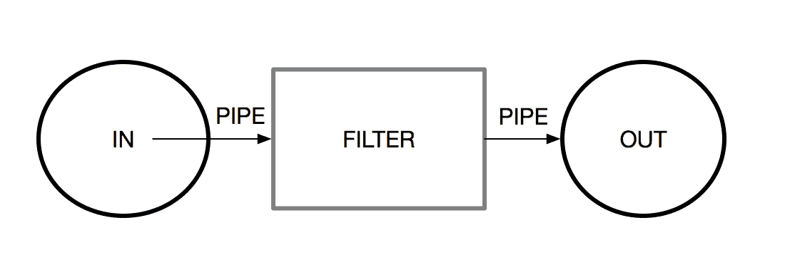
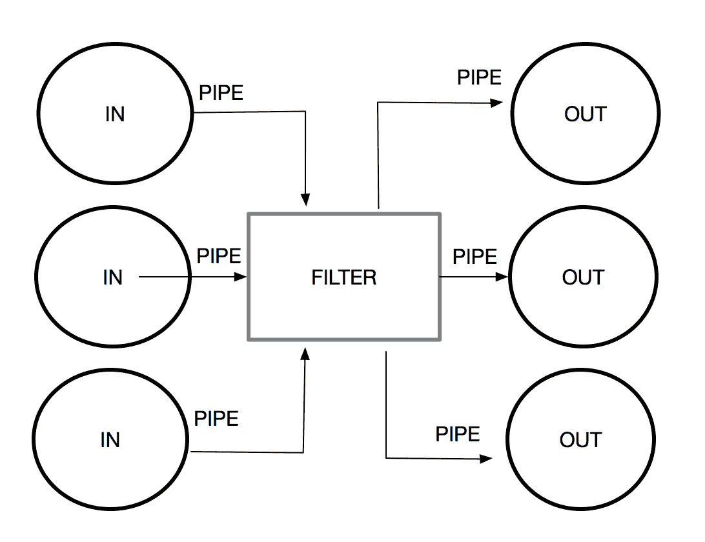
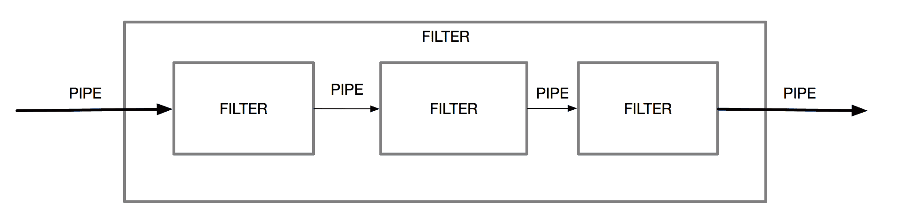
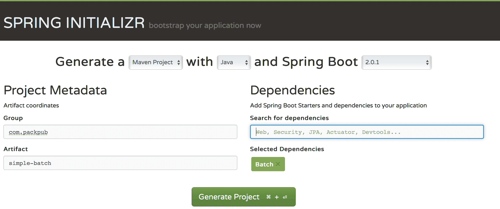
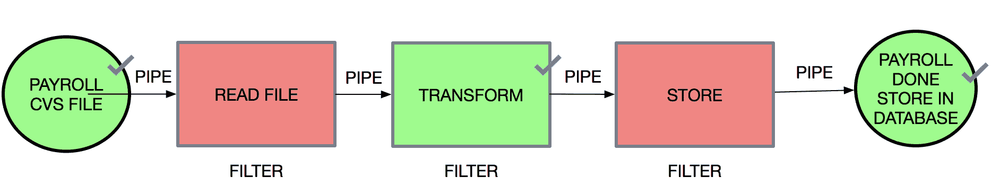
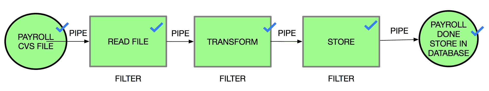
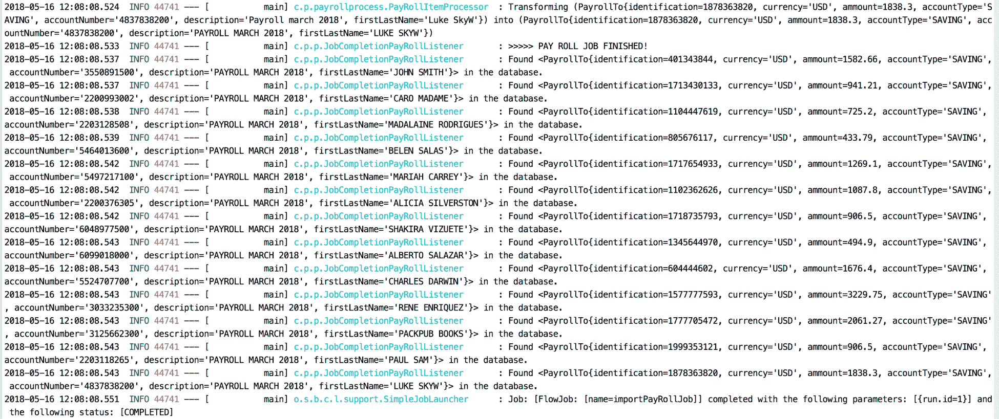

# 管道和过滤器体系结构

在本章中，我们将回顾一个名为 Pipe 和 Filter 的有用范例体系结构，您将了解如何使用 Spring 框架实现应用程序。

我们还将解释如何构建一个封装独立任务链的管道，该任务链旨在过滤和处理大量数据，重点是 SpringBatch 的使用。

本章将介绍以下主题：

*   管道和过滤器概念简介
*   登机管道和过滤器结构
*   管道和过滤器体系结构的用例
*   春批
*   用 Spring 批处理实现管道

我们将首先介绍管道和过滤器体系结构以及与之相关的概念。

# 介绍管道和过滤器概念

管道和过滤器体系结构是指 20 世纪 70 年代早期引入的一种体系结构。在本节中，我们将介绍管道和过滤器体系结构，以及过滤器和管道等概念

Doug McIlroy 于 1972 年在 Unix 中引入了管道和过滤器体系结构。这些实现也称为管道，它们由处理元素链组成，每个元素的输出都是下一个元素的输入，如下图所示：


如上图所示，管道和过滤器体系结构由几个名为过滤器的组件组成，这些组件可以在整个流程中转换（或过滤）数据。然后，数据通过连接到每个组件的管道传递到其他组件（过滤器）。

# 过滤器

过滤器是用于转换（或过滤）数据的组件，这些数据通过管道（连接器）作为输入从以前的组件接收。每个过滤器都有一个输入管道和一个输出管道，如下图所示：



这个概念的另一个特点是，过滤器可以有几个输入管道和几个输出管道，如下图所示：



# 管

管道是过滤器的连接件。管道的作用是在过滤器和组件之间传递消息或信息。我们必须记住的是，流是单向的，数据应该存储到过滤器能够处理它为止。下图显示了这一点，可以看到过滤器之间的连接器：


管道和过滤器体系结构样式用于将较大的流程、任务或数据划分为一系列由管道连接的小而独立的步骤（或过滤器）。

# 登机管道和过滤器结构

基于我们最近在企业应用程序领域引入的关于管道和过滤器的概念，我们在几种场景中使用这种体系结构，以便处理大量数据（或大文件），从而触发需要处理的几个步骤（或任务）。当我们需要在数据中执行大量转换时，这种体系结构非常有用。

为了了解管道和过滤器的工作原理，我们将回顾一个处理工资记录的经典示例。在本例中，消息通过一系列筛选器发送，其中每个筛选器在不同的事务中处理消息。

当我们应用管道和过滤器方法时，我们将整个过程分解为一系列可重用的独立任务。使用这些任务，我们可以更改接收到的消息的格式，然后将其拆分以执行单独的事务。作为这样做的一个好处，我们改进了流程的性能、可伸缩性和可重用性。

这种架构风格使创建递归过程成为可能。在这种情况下，过滤器可以单独包含。在流程内部，我们可以包括另一个管道和过滤器序列，如下图所示：



在这种情况下，每个过滤器通过管道接收输入消息。然后，过滤器处理消息并将结果发布到下一个管道。这个可重复的过程会持续我们需要的次数。我们可以根据业务需求添加过滤器、接受或省略接收到的输入，并将任务重新排序或重新安排为新的序列。在下一节中，我们将详细介绍应用管道和过滤器体系结构样式的最常见用例。

# 管道和过滤器体系结构的用例

管道和过滤器体系结构最常见的用例如下：

*   将一个大流程分解为几个独立的小步骤（过滤器）
*   通过多个过滤器，使用可通过并行处理独立扩展的进程来扩展系统
*   转换输入或接收到的消息
*   在**企业服务总线**（**ESB**组件中应用过滤作为集成模式

# 春批

SpringBatch 是创建健壮的批处理应用程序的完整框架（[https://projects.spring.io/spring-batch/](https://projects.spring.io/spring-batch/) ）。我们可以创建可重用的函数来处理大量数据或任务，通常称为批量处理。

Spring Batch 提供了许多有用的功能，例如：

*   记录和追踪
*   事务管理
*   就业统计
*   管理流程；例如，通过重新启动作业、跳过步骤和资源管理
*   管理 Web 控制台

该框架旨在管理大量数据，并通过使用分区功能实现高性能批处理。我们将从一个简单的项目开始，解释 Spring 批次的每个主要组成部分。

如 Spring 批次文件（[中所述 https://docs.spring.io/spring-batch/trunk/reference/html/spring-batch-intro.html](https://docs.spring.io/spring-batch/trunk/reference/html/spring-batch-intro.html) ），使用该框架最常见的场景如下：

*   定期提交批处理过程
*   并行批处理用于并行处理作业
*   分阶段、企业消息驱动的处理
*   大规模并行批处理
*   故障后手动或计划重新启动
*   相关步骤的顺序处理（扩展到工作流驱动的批处理）
*   部分处理：跳过记录（例如，回滚时）
*   整批事务：用于小批量或现有存储过程/脚本的情况

在企业应用程序中，需要处理数百万条记录（数据）或从一个源读取数据是非常常见的。此源可能包含包含多个记录（如 CSV 或 TXT 文件）或数据库表的大型文件。在每个记录上，应用一些业务逻辑、执行验证或转换并完成任务，将结果写入另一种输出格式（例如，数据库或文件）是很常见的。

SpringBatch 提供了一个完整的框架来实现这种需求，最大限度地减少了人员交互

我们将回顾 Spring batch 的基本概念，如下所示：

*   作业封装了批处理过程，并且必须由一个或多个步骤组成。每个步骤可以按顺序运行、并行运行或分区。
*   步骤是作业的顺序阶段。
*   JobLauncher 负责执行正在运行的作业。
*   JobRepository 是 JobExecution 的元数据存储库。

让我们创建一个使用 SpringBatch 的作业的简单示例，以了解它是如何工作的。首先，我们将创建一个简单的 Java 项目，并包含`spring-batch`依赖项。为此，我们将使用其初始值设定项（[创建一个 Spring 启动应用程序 https://start.spring.io](https://start.spring.io) ），如下图截图所示：



注意，我们为 Spring 批处理添加了依赖项。您可以通过在依赖项框内的搜索栏中键入`Spring Batch`，然后单击*输入*来完成此操作。“所选依赖项”部分将出现一个带有“批处理”字样的绿色框。完成后，我们将单击 Generate Project 按钮。

该项目的结构如下：


如果我们查看由初始值设定项添加的依赖项部分，我们将看到`pom.xml`文件上的`spring-batch`启动器，如下所示：

```java
<dependency>
  <groupId>org.springframework.boot</groupId>
  <artifactId>spring-boot-starter-batch</artifactId>
</dependency>
<dependency>
  <groupId>org.springframework.boot</groupId>
  <artifactId>spring-boot-starter-test</artifactId>
  <scope>test</scope>
</dependency>
<dependency>
  <groupId>org.springframework.batch</groupId>
  <artifactId>spring-batch-test</artifactId>
  <scope>test</scope>
</dependency>
```

如果我们不使用 Spring Boot，我们可以显式地添加`spring-batch-core`作为项目依赖项。下面显示了使用 Maven 时它的外观：

`<dependencies>`
`  <dependency>`

`    <artifactId>spring-batch-core</artifactId>`
`    <version>4.0.1.RELEASE</version>`

`</dependencies>`

或者，我们可以使用 Gradle 进行此操作，如下所示：

`{`
`  compile 'org.springframework.batch:spring-batch-core:4.0.1.RELEASE'`
`}`

该项目将需要一个数据源；如果我们尝试在没有应用程序的情况下运行应用程序，我们将在控制台中收到一条显示错误的消息，如下所示：


为了解决这个问题，我们将添加一个依赖项作为`pom.xml`文件的一部分，以配置嵌入式数据源。出于测试目的，我们将使用 HSQL（[http://hsqldb.org/](http://hsqldb.org/) ），具体如下：

```
<dependency>
   <groupId>org.hsqldb</groupId>
   <artifactId>hsqldb</artifactId>
   <scope>runtime</scope>
</dependency>
```

现在，我们需要在应用程序中添加`@EnabledBatchProcessing`和`@Configuration`注释：

```

@SpringBootApplication
@EnableBatchProcessing @Configuration
public class SimpleBatchApplication {

```

接下来，我们将使用`JobBuildFactory`类和一个任务流程来设置我们的第一个作业，基于 Spring Batch，使用`StepBuilderFactory`类：

```
@Autowired
private JobBuilderFactory jobBuilderFactory;

@Autowired
private StepBuilderFactory stepBuilderFactory;
```

然后，`Job`方法将显示它正在启动，如下所示：

```
@Bean
public Job job(Step ourBatchStep) throws Exception {
   return jobBuilderFactory.get("jobPackPub1")
         .incrementer(new RunIdIncrementer())
         .start(ourBatchStep)
         .build();
}
```

创建`Job`后，我们将在`Job`中添加一个新任务（`Step`，如下所示：

```
@Bean
public Step ourBatchStep() {
   return stepBuilderFactory.get("stepPackPub1")
         .tasklet(new Tasklet() {
            public RepeatStatus execute(StepContribution contribution, 
            ChunkContext chunkContext) {
               return null;
```

```
            }
         })
         .build();
}
```

以下代码显示了应用程序类的外观：

```
@EnableBatchProcessing
@SpringBootApplication
@Configuration
public class SimpleBatchApplication {

   public static void main(String[] args) {
      SpringApplication.run(SimpleBatchApplication.class, args);
   }

   @Autowired
   private JobBuilderFactory jobBuilderFactory;

   @Autowired
   private StepBuilderFactory stepBuilderFactory;

   @Bean
   public Step ourBatchStep() {
      return stepBuilderFactory.get("stepPackPub1")
            .tasklet(new Tasklet() {
               public RepeatStatus execute
                (StepContribution contribution, 
                    ChunkContext chunkContext) {
                  return null;
               }
            })
            .build();
   }

   @Bean
   public Job job(Step ourBatchStep) throws Exception {
      return jobBuilderFactory.get("jobPackPub1")
            .incrementer(new RunIdIncrementer())
            .start(ourBatchStep)
            .build();
   }
}
```

为了检查一切是否正常，我们将运行应用程序。为此，我们将在命令行上执行以下操作：

```
$ mvn spring-boot:run
```

或者，我们可以通过运行 maven 构建应用程序，如下所示：

```
$ mvn install
```

接下来，我们将在终端上运行最近构建的 jar，如下所示：

```
$ java -jar target/simple-batch-0.0.1-SNAPSHOT.jar
```

不要忘记，在构建或运行应用程序和 JDK 8 之前，您需要安装 Maven 或 Gradle。

最后，我们将在控制台中看到以下输出：


注意控制台输出。为此，我们运行名为`jobPackPub1`的作业，并将 bean 作为`stepPackPub1`执行。

现在，我们将更详细地了解以下步骤背后的组件：

*   ItemReader 表示检索步骤的输入
*   ItemProcessor 表示项目的业务处理
*   ItemWriter 表示步骤的输出

下图显示了 Spring Batch 主要元素的大图：


现在，我们将使用 ItemReader、ItemProcessor 和 ItemWriter 来完成我们的示例。通过使用和解释这些组件，我们将向您展示如何使用 SpringBatch 实现管道和过滤器体系结构。

# 用 Spring 批处理实现管道

现在我们已经说明了 Spring 批处理是什么，我们将通过以下步骤实现工资单文件处理用例（如前一节中定义的）：

*   编码从 CSV 电子表格导入工资单数据的流程
*   使用业务类转换文件元组
*   将结果存储在数据库中

下图说明了我们的实现：


首先，我们将使用 Spring 初始值设定项（[创建一个新的、干净的项目 https://start.spring.io](https://start.spring.io) ），如前一节所述：


记住向我们的项目添加`Batch`引用，就像我们在前面的示例中所做的那样。

别忘了在`pom.xml`文件中添加数据库驱动程序作为依赖项。出于测试目的，我们将使用 HSQL（[http://hsqldb.org/](http://hsqldb.org/) ），具体如下：

```
<dependency>
   <groupId>org.hsqldb</groupId>
   <artifactId>hsqldb</artifactId>
   <scope>runtime</scope>
</dependency>
```

如果您想使用另一个数据库，可以参考 Spring Boot 文档（[中的详细说明 https://docs.spring.io/spring-boot/docs/current/reference/html/boot-features-sql.html](https://docs.spring.io/spring-boot/docs/current/reference/html/boot-features-sql.html) ）。

现在，我们将以文件的形式创建输入数据，以数据库表的形式创建输出结构，如下图所示：


我们将向资源文件夹（`src/main/resources/payroll-data.csv`中添加一个 CSV 文件，内容如下：

```
0401343844,USD,1582.66,SAVING,3550891500,PAYROLL MARCH 2018,JAIME PRADO
1713430133,USD,941.21,SAVING,2200993002,PAYROLL MARCH 2018,CAROLINA SARANGO
1104447619,USD,725.20,SAVING,2203128508,PAYROLL MARCH 2018,MADALAINE RODRIGUEZ
0805676117,USD,433.79,SAVING,5464013600,PAYROLL MARCH 2018,BELEN CALERO
1717654933,USD,1269.10,SAVING,5497217100,PAYROLL MARCH 2018,MARIA VALVERDE
1102362626,USD,1087.80,SAVING,2200376305,PAYROLL MARCH 2018,VANESSA ARMIJOS
1718735793,USD,906.50,SAVING,6048977500,PAYROLL MARCH 2018,IGNACIO BERRAZUETA
1345644970,USD,494.90,SAVING,6099018000,PAYROLL MARCH 2018,ALBERTO SALAZAR
0604444602,USD,1676.40,SAVING,5524707700,PAYROLL MARCH 2018,XIMENA JARA
1577777593,USD,3229.75,SAVING,3033235300,PAYROLL MARCH 2018,HYUN WOO
1777705472,USD,2061.27,SAVING,3125662300,PAYROLL MARCH 2018,CARLOS QUIROLA
1999353121,USD,906.50,SAVING,2203118265,PAYROLL MARCH 2018,PAUL VARELA
1878363820,USD,1838.30,SAVING,4837838200,PAYROLL MARCH 2018,LEONARDO VASQUEZ
```

我们项目的结构如下所示：


此电子表格包含标识、货币、账号、账户类型、交易描述、受益人电话和受益人姓名。它们显示在每行上，用逗号分隔。这是一种常见的模式，由 Spring 开箱即用地处理。

现在，我们将创建数据库结构，在其中存储工资单处理的结果。我们将使用以下内容将其添加到我们的资源文件夹（`src/main/resources/schema-all.sql`）：

```
DROP TABLE PAYROLL IF EXISTS;

CREATE TABLE PAYROLL  (
    transaction_id BIGINT IDENTITY NOT NULL PRIMARY KEY,
    person_identification VARCHAR(20),
    currency VARCHAR(20),
    tx_ammount DOUBLE,
    account_type VARCHAR(20),
    account_id VARCHAR(20),
    tx_description VARCHAR(20),
    first_last_name VARCHAR(20)
);
```

我们将创建的文件将遵循以下模式名称：`schema-@@platform@@.sql`。Spring Boot 将在启动期间运行 SQL 脚本；这是所有平台的默认行为。

到目前为止，我们已经将输入数据创建为一个`.csv`文件，以及输出存储库，它将在其中存储完整的工资流程。因此，我们现在将创建过滤器，并使用为我们带来 Spring 批处理的默认管道。

首先，我们将创建一个表示业务数据的类，其中包含我们将要接收的所有字段。我们将其命名为`PayRollTo.java`（**工资转账对象**：

```
package com.packpub.payrollprocess;

public class PayrollTo {

    private Integer identification;

    private String currency;

    private Double ammount;

    private String accountType;

    private String accountNumber;

    private String description;

    private String firstLastName;

    public PayrollTo() {
    }

    public PayrollTo(Integer identification, String currency, Double ammount, String accountType, String accountNumber, String description, String firstLastName) {
        this.identification = identification;
        this.currency = currency;
        this.ammount = ammount;
        this.accountType = accountType;
        this.accountNumber = accountNumber;
        this.description = description;
        this.firstLastName = firstLastName;
    }

    // getters and setters

    @Override
    public String toString() {
        return "PayrollTo{" +
                "identification=" + identification +
                ", currency='" + currency + '\'' +
                ", ammount=" + ammount +
                ", accountType='" + accountType + '\'' +
                ", accountNumber='" + accountNumber + '\'' +
                ", description='" + description + '\'' +
                ", firstLastName='" + firstLastName + '\'' +
                '}';
    }
}
```

现在，我们将创建过滤器，这些过滤器在 Spring Batch 中表示为处理器。与框架为我们提供开箱即用的行为类似，我们将首先集中于转换用于转换输入数据的业务类，如下图所示：


在每一行都包含一个`PayrollTo`类的文件表示之后，我们需要一个过滤器，将每个数据文件转换为大写。使用 SpringBatch，我们将创建一个处理器，该处理器将转换数据文件，然后将数据发送到以下步骤。那么，让我们创建一个实现`org.springframework.batch.item.ItemProcessor<InputObject, OutputObjet>`**接口的`PayRollItemProcessor.java`对象，如下所示：**

 **```
package com.packpub.payrollprocess;

import org.slf4j.Logger;
import org.slf4j.LoggerFactory;
import org.springframework.batch.item.ItemProcessor;

public class PayRollItemProcessor implements 
                    ItemProcessor<PayrollTo, PayrollTo> {

    private static final Logger log = LoggerFactory
                    .getLogger(PayRollItemProcessor.class);

    @Override
    public PayrollTo process(PayrollTo payrollTo) throws Exception {

        final PayrollTo resultTransformation = new PayrollTo();
        resultTransformation.setFirstLastName
            (payrollTo.getFirstLastName().toUpperCase());
        resultTransformation.setDescription
            (payrollTo.getDescription().toUpperCase());
        resultTransformation.setAccountNumber
            (payrollTo.getAccountNumber());
        resultTransformation.setAccountType(payrollTo.getAccountType());
        resultTransformation.setCurrency(payrollTo.getCurrency());
        resultTransformation.setIdentification
            (payrollTo.getIdentification());

        // Data Type Transform
        final double ammountAsNumber = payrollTo.getAmmount()
                                                    .doubleValue();
        resultTransformation.setAmmount(ammountAsNumber);

        log.info
            ("Transforming (" + payrollTo + ") into (" 
                                + resultTransformation + ")");
        return resultTransformation;
    }
}
```

根据 API 接口，我们将接收一个传入的`PayrollTo`对象，之后我们将其转换为大写的`PayrollTo`，用于`firstLastName`和描述属性。

输入对象和输出对象的类型是否不同并不重要。在许多情况下，筛选器将接收一种消息或数据，而下一个筛选器需要另一种消息或数据。

现在，我们将创建批处理作业并使用一些 Spring 批处理开箱即用特性。例如，**ItemReader**有一个有用的 API 来处理文件，**ItemWriter**可以用来指定如何存储生成的数据：



最后，我们将使用作业连接所有流数据。

使用 Spring Batch，我们需要专注于我们的业务（就像我们在`PayRollItemProcessor.java`课程中所做的那样），然后将所有部分连接在一起，如下所示：

```
@Configuration
@EnableBatchProcessing
public class BatchConfig {

    @Autowired
    public JobBuilderFactory jobBuilderFactory;

    @Autowired
    public StepBuilderFactory stepBuilderFactory;

 // READ THE INPUT DATA
    @Bean
    public FlatFileItemReader<PayrollTo> reader() {
        return new FlatFileItemReaderBuilder<PayrollTo>()
                .name("payrollItemReader")
                .resource(new ClassPathResource("payroll-data.csv"))
                .delimited()
                .names(
                    new String[]{
                        "identification", "currency", "ammount",
                        "accountType", "accountNumber", "description",
                        "firstLastName"})
                .fieldSetMapper(
                    new BeanWrapperFieldSetMapper<PayrollTo>() {{
                    setTargetType(PayrollTo.class);
                }})
                .build();
    }

 // PROCESS THE DATA
    @Bean
    public PayRollItemProcessor processor() {
        return new PayRollItemProcessor();
    }

 // WRITE THE PRODUCED DATA
    @Bean
    public JdbcBatchItemWriter<PayrollTo> writer(DataSource dataSource) {
        return new JdbcBatchItemWriterBuilder<PayrollTo>()
                .itemSqlParameterSourceProvider(
                    new BeanPropertyItemSqlParameterSourceProvider<>())
                .sql(
                    "INSERT INTO PAYROLL (PERSON_IDENTIFICATION,
                        CURRENCY, TX_AMMOUNT, ACCOUNT_TYPE, ACCOUNT_ID, 
                        TX_DESCRIPTION, FIRST_LAST_NAME) VALUES 
                    (:identification,:currenxcy,:ammount,:accountType,
                     :accountNumber, :description, :firstLastName)")
                .dataSource(dataSource)
                .build();
    }

    @Bean
    public Job importPayRollJob(JobCompletionPayRollListener listener, Step step1) {
        return jobBuilderFactory.get("importPayRollJob")
                .incrementer(new RunIdIncrementer())
                .listener(listener)
                .flow(step1)
                .end()
                .build();
    }

    @Bean
    public Step step1(JdbcBatchItemWriter<PayrollTo> writer) {
        return stepBuilderFactory.get("step1")
                .<PayrollTo, PayrollTo> chunk(10)
                .reader(reader())
                .processor(processor())
                .writer(writer)
                .build();
    }
}
```

有关如何使用 Spring Batch ItemReaders 和 ItemWriter 的详细说明，请转至[https://docs.spring.io/spring-batch/trunk/reference/html/readersAndWriters.html](https://docs.spring.io/spring-batch/trunk/reference/html/readersAndWriters.html)

让我们回顾一下`Step`bean 是如何工作的，如下所示：

```
@Bean
    public Step step1(JdbcBatchItemWriter<PayrollTo> writer)
 {
        return stepBuilderFactory.get("step1")
                .<PayrollTo, PayrollTo> chunk(10)
                .reader(reader())
 .processor(processor())
 .writer(writer)
                .build();
 }
```

首先将步骤配置为读取**10 条记录**的数据块，然后配置相应的`reader`、`processor`和`writer`对象。

我们现在已经实现了我们计划的所有管道和过滤器，如下图所示：



最后，我们将添加一个侦听器，以检查处理后的工资单数据。为此，我们将创建一个扩展类`JobExecutionListenerSupport`的`JobCompletionPayRollListener.java`类，并实现`afterJob(JobExecution jobExecution)`**方法。**

 **现在，我们将回顾我们从处理的数据中处理了多少`insert`操作：

```

@Component
public class JobCompletionPayRollListener 
            extends JobExecutionListenerSupport {

    private static final Logger log = 
        LoggerFactory.getLogger(JobCompletionPayRollListener.class);

    private final JdbcTemplate jdbcTemplate;

    @Autowired
    public JobCompletionPayRollListener(JdbcTemplate jdbcTemplate) {
        this.jdbcTemplate = jdbcTemplate;
    }

    @Override
    public void afterJob(JobExecution jobExecution) {
        if (jobExecution.getStatus() == BatchStatus.COMPLETED) {
 log.info(">>>>> PAY ROLL JOB FINISHED! ");

            jdbcTemplate
            .query(
                "SELECT PERSON_IDENTIFICATION, CURRENCY, TX_AMMOUNT,                          ACCOUNT_TYPE, ACCOUNT_ID, TX_DESCRIPTION, 
                        FIRST_LAST_NAME FROM PAYROLL",
                    (rs, row) -> new PayrollTo(
                            rs.getInt(1),
                            rs.getString(2),
                            rs.getDouble(3),
                            rs.getString(4),
                            rs.getString(5),
                            rs.getString(6),
                            rs.getString(7))
            ).forEach(payroll -> 
                log.info("Found <" + payroll + "> in the database.")
                );
        }
    }
}
```

为了检查是否一切正常，我们将使用以下命令执行应用程序：

```
$ mvn spring-boot:run
```

或者，我们可以使用 maven 构建应用程序，如下所示：

```
$ mvn install
```

接下来，我们将在终端上运行最近构建的`jar`：

```
$ java -jar target/payroll-process-0.0.1-SNAPSHOT.jar
```

最后，我们将在控制台上看到以下输出。此输出表示已实现为转换数据的 ItemProcessor 的筛选器：


我们还可以通过监听器看到流程的验证，监听器实现为一个`JobExecutionListenerSupport`，它打印存储在数据库中的结果：



我们可以将 Spring 批处理应用程序打包到 WAR 文件中，然后运行 servlet 容器（如 Tomcat）或任何 JEE 应用程序服务器（如 Glassfish 或 JBoss）。要将`.jar`文件打包为 WAR 文件，请使用`spring-boot-gradle-plugin`或`spring-boot-maven-plugin`。对于 Maven，您可以参考 Spring 引导文档（[https://docs.spring.io/spring-boot/docs/current/reference/htmlsingle/#build-工具插件 maven 包装](https://docs.spring.io/spring-boot/docs/current/reference/htmlsingle/#build-tool-plugins-maven-packaging)。对于 Gradle，您可以参考[https://docs.spring.io/spring-boot/docs/current/gradle-plugin/reference/html/#packaging-可执行的战争](https://docs.spring.io/spring-boot/docs/current/gradle-plugin/reference/html/#packaging-executable-wars)

# 总结

在本章中，我们讨论了管道和过滤器体系结构的概念、其实现的主要用例，以及如何将其用于企业应用程序。此外，您还学习了如何使用 SpringBatch 实现该体系结构，以及如何管理不同数量的数据并将流程拆分为更小的任务。

在下一章中，我们将回顾容器化应用程序的重要性。****