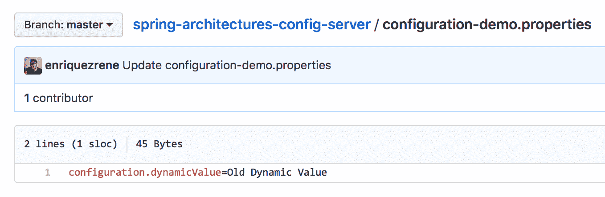
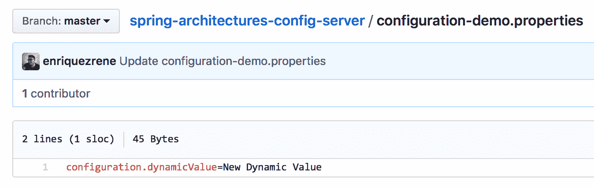
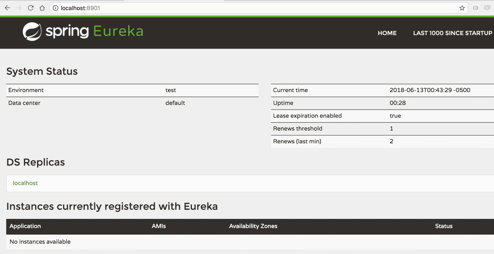
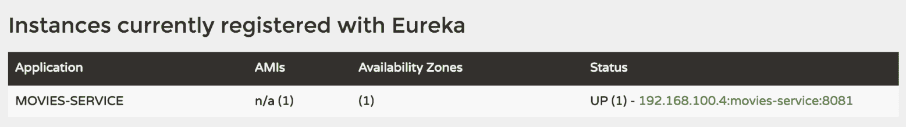
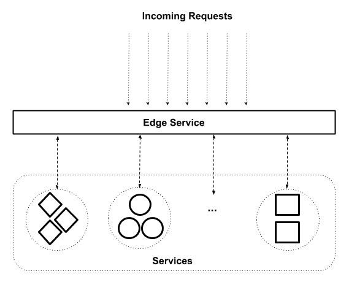
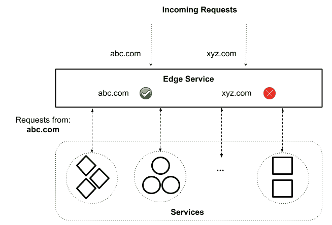
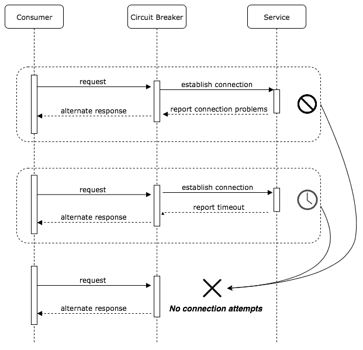

# 八、微服务

我们一直在寻找新的方法来创建软件系统，以满足拥有支持其业务需求的应用的快乐客户和受到尖端技术挑战的开发人员。满足这两类目标用户的平衡很重要；它使我们能够实现业务目标，避免失去熟练的开发人员。

另一方面，作为开发人员，我们也在尝试创建模块和专门的库，以满足特定的技术或业务需求。稍后，我们将在不同的项目中重用这些模块和库，以遵守**不要重复自己**（**DRY**原则。

以本简介为出发点，我们将回顾微服务架构如何解决这些问题以及更多问题。在本章中，我们将研究以下主题：

*   微服务原理
*   建模微服务

# 微服务原理

网络上有很多关于微服务的定义。经常出现的问题如下：

“微服务是小型、自主的服务，可以很好地协同工作。”

让我们开始更详细地了解这个定义及其含义。

# 大小

事实上，microservices 这个词包含了*micro*这个词，这让我们认为服务的大小一定非常小。然而，几乎不可能使用诸如有多少行代码或文件或特定可部署工件的大小等指标来定义服务的正确大小。相反，使用以下想法要简单得多：

“服务应专注于做好一件事。”

-萨姆·纽曼

*一件事*可以被认为是一个商业领域。例如，如果您正在为在线商店构建系统，它们可能涵盖以下**业务域**：

*   客户管理
*   产品目录
*   购物车
*   命令

其思想是构建一个能够满足特定业务领域所有需求的服务。最终，当业务域变得太大而无法作为一个微服务来处理时，您也可能会将一个服务拆分为其他微服务。

# 自主的

当我们谈论微服务时，自治非常重要。微服务应该能够独立于其周围的其他服务进行更改和发展。

验证微服务是否足够自治的最佳方法是对其应用更改并部署新版本的服务。部署过程不应要求您修改服务本身以外的任何内容。如果在部署过程中需要重新启动其他服务或其他任何东西，则应考虑移除这些附加步骤的方法。另一方面，服务的自治性也与构建它的团队的组织有关。我们将在本章后面详细讨论这一点。

# 合作愉快

不可能孤立地构建彼此不交互的系统。即使我们正在构建单独的服务来满足不同业务领域的需求，我们最终还是需要使它们作为一个整体进行交互，以满足业务需求。此交互是通过**应用编程接口**（**API**实现的。

API 是一组命令、函数、协议和对象，程序员可以使用这些命令、函数、协议和对象创建软件或与外部系统交互。它为开发人员提供了执行常见操作的标准命令，因此他们不必从头开始编写代码

-API 定义来自 https://techterms.com/definition/api

单片应用倾向于执行数据库集成。这是应该不惜一切代价避免的事情；服务之间需要的任何交互都只能使用提供的服务 API 来完成。

# 优势

微服务提供了许多值得了解的优势，以了解公司可能会从中受益。最常见的优点如下：

*   与单一责任原则保持一致
*   连续释放
*   独立可伸缩性
*   更多地采用新技术

# 与单一责任原则保持一致

使用微服务需要创建单独的组件。每个组件都是为解决特定的业务领域模型而设计的。因此，这个域模型定义了服务的单一责任。该服务不应违反其限制，并应使用其他微服务提供的 API 请求超出限制的任何信息。每个微服务都应该公开一个 API，该 API 具有所有必需的功能，以允许其他微服务从中获取信息。

# 连续释放

由于大型单片应用处理许多业务领域模型，因此它们由大量源代码和配置文件组成。这会产生需要花费大量时间部署的大型工件。此外，大型单片应用通常涉及分布在世界各地的大型团队，这使得通信变得困难。在处理新功能或修复应用中的错误时，这会成为一个问题。微服务能够轻松解决这个问题，因为一个团队将负责一个或多个服务，而一个服务很少由多个团队编写。这意味着可以在团队内部规划新版本，这允许他们更快更频繁地推出新版本。

此外，即使是代码中最小的更改也涉及到大型工件的新部署，这使得整个应用在部署过程中不可用。但是，对于微服务，只应部署具有错误修补程序或新功能的服务。部署速度很快，不会影响其他服务。

# 独立可伸缩性

如果我们需要扩展单个应用，那么整个系统应该部署在不同的服务器上。服务器应该非常强大，以允许应用运行良好。并非所有特性都具有相同的通信量，但由于所有代码都捆绑为单个工件，因此无法仅扩展所需的特性。有了微服务，我们可以自由地只扩展我们需要的东西。云提供商通过按需提供更多服务器或在需要时自动添加更多资源来扩展应用是很常见的

# 更多地采用新技术

并非所有的业务领域模型都是平等的，这就是为什么需要不同的技术集。由于一个微服务只能满足一个域模型的需求，不同的服务可以很容易地采用不同的技术。使用不同的编程语言、框架、云提供商和数据库对微服务进行编码的公司很常见。此外，我们有能力为小型应用试验新技术，然后可以在其他地方使用。由于采用了新技术，公司最终得到了异构应用，如下图所示：


异构应用允许我们创建专门的系统，以使用正确的技术集解决特定的业务需求。因此，我们最终得到了易于单独部署和扩展的小工件。

# 缺点

尽管微服务具有我们前面列出的所有优点，但重要的是要了解它们也有一些缺点。让我们回顾一下这些问题，并考虑它们是如何处理的：

*   选择太多
*   开头慢
*   监测
*   事务和最终一致性

# 选择太多

由于您有机会选择要使用哪种技术构建微服务，您可能会感到不知所措，因为有各种各样的选项可供选择。这可以通过使用一些新技术来解决，而不是试图一次将它们全部融入其中。

# 开头慢

当您在采用微服务的过程中，您必须构建整个生态系统，以使其工作。您需要寻找新的方法来连接分布式系统，保护它们，并使它们作为一个整体工作。只编写一个应用来完成所有这一切更容易。然而，几个月后，其他微服务将重用您在开始时投入的所有工作，这意味着过程将显著加快。为了充分利用这种创建系统的方式，尝试部署应用、使其按需扩展、监视和记录应用的新方法非常重要。审查处理业务核心的微服务的功能也很重要。这些系统有时会变成半整体，为了便于管理，应该将其拆分。

# 监测

监视单个应用比监视不同服务的多个实例更容易。创建仪表盘和自动化工具来提供度量标准，以使这项任务更容易完成，这一点很重要。当出现新错误时，可能很难找出问题所在。应该使用良好的日志跟踪机制来识别应用的哪个服务未按预期工作。这意味着您不必分析所有服务。

# 事务和最终一致性

虽然大型单体的事务边界定义得很好，而且因为我们在编写微服务时经常使用诸如两阶段提交之类的技术，所以我们必须以另一种方式处理这些需求。

我们应该记住，每个微服务都是自己数据存储的所有者，我们应该只使用它们的 API 访问它们的数据。当操作无法按预期工作时，保持数据最新并使用补偿事务非常重要。当我们编写单片应用时，许多操作作为单个事务执行。对于微服务，我们需要重新考虑操作和事务，使它们适合每个微服务边界。

# 建模微服务

作为开发人员，我们总是尝试创建可重用组件来与系统或服务交互，以避免多次编写代码。到目前为止，我们构建的大多数单片应用都遵循三层架构模式，如下图所示：


三层架构

当使用此模型构建的应用需要更改时，通常需要修改所有三个层。根据应用的创建方式，您可能需要许多部署。此外，由于大型单片应用共享许多功能，因此经常会发现多个团队在使用它们，这使得它们更难快速发展。有时，专业团队处理特定的层，因为这些层由许多组件组成。通过这种方式，水平应用更改以使应用增长和发展。

有了微服务，应用会垂直发展，因为它们是围绕特定的业务领域建模的。下图显示了在线商店应用的一些微服务：


微服务图

这些名称本身解释了与微服务相关的功能的意图和集合。只要读名字，任何人都能理解他们在做什么；在这一点上，如何执行任务以及如何实施任务是无关紧要的。由于这些服务是围绕一个定义良好的业务领域构建的，因此当需要进行新的更改时，只应修改一个服务。由于在一个微服务上工作的团队不应超过一个，因此与大型独石相比，让它们进化更容易。负责该服务的团队对该特定服务如何工作以及如何使其发展有着深刻的理解。

负责微服务的团队由该服务业务领域的专家组成，但不包括其周围其他服务的技术专家。毕竟，技术选择包括细节；服务的主要动机是业务领域。

# 加速

我们在本章前面提到，开发基于微服务的应用在一开始是一个耗时的过程，因为您实际上是从零开始的。无论您是要启动一个新项目，还是要将现有的遗留应用拆分为单独的微服务，您都必须完成所有必要的步骤，以便将应用从开发带到生产。

# 加快发展进程

让我们从开发阶段开始。在处理旧的应用时，在编写第一行代码之前，通常必须完成以下步骤：

1.  在本地计算机中安装所需的工具。
2.  设置所有必需的依赖项。
3.  创建一个或多个配置文件。
4.  查找未作为文档一部分列出的所有缺失零件。
5.  加载测试数据。
6.  运行应用。

现在，假设您是一个团队的一员，该团队拥有许多用不同编程语言编写并使用不同数据库技术的微服务。您能想象在编写第一行代码之前需要付出的努力吗？

使用微服务应该能够为您提供更快的解决方案，但所有需要的设置都会使最初的速度变慢。对于大型单片应用，您只需设置一个环境，但对于异构应用，您必须设置许多不同的环境。为了有效地解决这个问题，您需要接受自动化文化。您可以运行一个脚本来完成上述操作，而不是手动执行上述所有步骤。这样，每次您想要处理不同的项目时，您只需要执行脚本，而不是重复列出的所有步骤。

市场上有一些非常酷的工具，比如 Nanobox（[https://nanobox.io](https://nanobox.io) 、Docker Compose（[https://docs.docker.com/compose/](https://docs.docker.com/compose/) 、流浪者（[https://www.vagrantup.com](https://www.vagrantup.com) ）。通过运行单个命令，可以提供类似于生产环境的环境，从而为您提供帮助。

采用前面技巧中提到的工具将对开发团队的生产力产生很大的影响。您不希望开发人员通过提供自己的环境来浪费时间；相反，您希望他们编写代码为您的产品添加新功能。

# 拥抱测试

让我们谈谈代码编写过程。当我们在大型巨石上工作时，每次发布新功能或错误修复时，都需要通知许多人。在极端情况下，QA 团队需要自己检查整个环境，以确保新的更改不会影响应用的现有功能。想象一下，对于具有多个微服务的每个版本重复此任务将多么耗时。因此，您需要将测试作为开发过程的一个重要部分。

有许多不同级别的测试。让我们来看看 Jason Huggins 在 2005 推出的金字塔测试，这是在下面的图表中显示的：


金字塔试验

作为金字塔基础的一部分的测试易于编写和执行。运行单元测试只需要几分钟，对于验证独立的代码片段是否按预期工作非常有用。另一方面，集成测试有助于验证代码在与外部服务（如数据库、第三方应用或其他微服务）交互时是否工作。这些测试需要几十分钟才能运行。最后，**端到端**（**e2e**测试帮助您从最终用户的角度验证代码是否按预期工作。如果您正在编写 RESTAPI，e2e 测试将使用不同的数据验证 API 中的 HTTP 响应代码。这些测试通常很慢，而且总是在变化。

理想情况下，所有新特性都应该经过所有这些测试，以在投入生产之前验证代码是否按预期工作。你写的测试越多，你就越有信心。毕竟，如果你已经涵盖了所有可能的场景，会出现什么问题？此外，Michael Bryzek 还引入了在生产中进行测试的想法（参见[https://www.infoq.com/podcasts/Michael-Bryzek-testing-in-production](https://www.infoq.com/podcasts/Michael-Bryzek-testing-in-production) 了解更多信息）。这有助于您通过定期执行自动化任务或机器人程序来评估您的服务是否正常工作，以在生产中运行系统的关键部分。

# 投入生产

您必须以自动化开发环境的方式自动化生产环境。如今，使用云提供商部署系统和 API 驱动工具提供服务器的公司已经司空见惯。

安装操作系统并添加使应用工作所需的依赖项是必须自动化的。如果要提供多个服务器，只需多次执行相同的脚本。Docker、Puppet 和 Chef 等技术可以帮助您做到这一点。使用代码提供环境的一个间接好处是，您将拥有使应用工作所需的所有依赖项的完美文档。随着时间的推移，这些脚本可以得到改进。它们存储在版本控制系统中，这样可以很容易地跟踪对它们所做的每一次更改。我们将在[第 11 章](11.html)*DevOps 和发布管理*中进一步了解这一点。

# 实现微服务

现在我们已经很好地理解了什么是微服务以及它们的用途，我们将开始研究如何使用 Spring 框架实现微服务架构。在接下来的几节中，我们将介绍一些重要的概念，这些概念到目前为止还没有涉及。最好从实际的角度来处理这些问题，使它们更容易理解。

# 动态配置

我们都在使用不同配置文件或相关元数据的应用上工作过，这些应用允许您指定使应用工作的配置参数。当我们谈论微服务时，我们需要以不同的方式处理这个配置过程。我们应该避免配置文件，而是采用十二个事实应用配置样式（如[所述）https://12factor.net](https://12factor.net) ），由 Heroku 提出。当我们使用这种配置风格时，我们希望将每个环境中不同的所有属性外部化，并使它们易于创建和更改。

默认情况下，Spring 引导应用可以使用命令行参数、JNDI 名称或环境变量工作。Spring Boot 还提供了使用`.properties`或`.yaml`配置文件的能力。为了以安全的方式使用配置变量，Spring Boot 引入了`@ConfigurationProperties`注释，它允许您将属性映射到**普通旧 Java 对象**（**POJO**）。当应用启动时，它会检查是否提供了所有配置，格式是否正确，是否符合`@Valid`注释要求。让我们来看看这个映射是如何工作的。

假设您有以下`application.yaml`文件作为申请的一部分：

```java
middleware:
  apiKey: ABCD-1234
  port: 8081

event-bus:
  domain: event-bus.api.com
  protocol: http
```

现在，让我们使用`@ConfigurationProperties`注释将这些变量映射到两个不同的 POJO。让我们从给定的中间件配置开始：

```java
@Data
@Component
@ConfigurationProperties("middleware")
public class Middleware 
{
  private String apiKey;
  private int port;
}
```

以下代码段表示`eventBus`配置部分所需的类：

```java
@Data
@Component
@ConfigurationProperties("event-bus")
public class EventBus 
{
  private String domain;
  private String protocol;
}
```

lombok 的`@Data`注释用于避免编写标准的访问器方法。您现在可以打印这些类的`.toString()`结果，您将在控制台中看到以下输出：

```java
EventBus(domain=event-bus.api.com, protocol=http)
Middleware(apiKey=ABCD-1234, port=8081)
```

将所有这些配置变量硬编码可能很有用。这意味着，当您希望在另一个环境中部署应用时，只需通过提供其他参数来覆盖它们，如下所示：

```java
$ java -Dmiddleware.port=9091 -jar target/configuration-demo-0.0.1-SNAPSHOT.jar
```

在这里，我们在运行`.jar`文件之前覆盖了一个配置变量，因此您将得到如下输出：

```java
EventBus(domain=event-bus.api.com, protocol=http)
Middleware(apiKey=ABCD-1234, port=9091)
```

尽管这种配置很容易实现，但对于微服务或任何现代应用来说，它还不够好。首先，在应用任何更改后，需要重新启动应用，这是不可取的。最糟糕的是，你无法跟踪你所应用的更改。这意味着，如果提供了环境变量，就无法知道是谁提供了它。为了解决这个问题，Spring 提供了一种使用 Spring 云配置服务器集中所有配置的方法。

服务器提供了一种集中、日志化和安全的方式来存储配置值。由于它将所有配置值存储在 Git 存储库中，可以是本地的，也可以是远程的，因此您将免费获得与版本控制系统相关的所有好处。

# 实现配置服务器

SpringCloud 配置服务器构建在常规 Spring 引导应用之上。您只需添加以下附加依赖项：

```java
compile('org.springframework.cloud:spring-cloud-config-server')
```

添加依赖项后，需要在应用中使用附加注释激活配置服务器，如以下代码所示：

```java
@SpringBootApplication
@EnableConfigServer
public class ConfigServerApplication 
{
  public static void main(String[] args) 
  {
    SpringApplication.run(ConfigServerApplication.class, args);
  }
}
```

最后，您需要提供 Git 存储库 URL，它将微服务的配置存储在`application.yaml`文件中，如下所示：

```java
spring:
  cloud:
    config:
      server:
        git:
          uri: https://github.com/enriquezrene/spring-architectures-config-server.git
```

前面的 Git 存储库有单独的配置文件来管理每个微服务的配置。例如，`configuration-demo.properties`文件用于管理配置演示微服务的配置。

# 实现配置客户端

配置客户端是常规的 Spring 引导应用。您只需提供服务器配置 URI 即可读取集中配置，如下所示：

```java
spring:
  application:
 name: configuration-demo
  cloud:
    config:
 uri: http://localhost:9000
```

以下代码段显示了一个 REST 端点读取集中配置并将读取的值作为自己的响应提供服务：

```java
@RestController
@RefreshScope
public class ConfigurationDemoController {

 @Value("${configuration.dynamicValue}")
    private String dynamicValue;

    @GetMapping(path = "/dynamic-value")
    public ResponseEntity<String> readDynamicValue() {
        return new ResponseEntity<>(this.dynamicValue, HttpStatus.OK);
    }
}
```

以下屏幕截图显示了存储在 Git 存储库中的配置文件：



存储在 Git 存储库中的配置文件

一旦对前面的端点执行请求，它将生成以下输出：

```java
$ curl http://localhost:8080/dynamic-value 
Old Dynamic Value
```

更改 Git 中存储的文件中配置变量的值，如以下屏幕截图所示：



应用更改的配置文件

如果命中端点，将检索与以前相同的输出。为了重新加载配置，您需要通过使用`POST`请求点击`/refresh`端点来重新加载配置变量，如下代码所示：

```java
$ curl -X POST http://localhost:8080/actuator/refresh
["config.client.version","configuration.dynamicValue"]
```

重新加载配置后，端点将使用新提供的值提供响应，如以下输出所示：

```java
$ curl http://localhost:8080/dynamic-value
New Dynamic Value
```

# 服务发现和注册

在过去，我们的应用生活在一个物理服务器上，应用和实现它的后端之间有 1:1 的关系。在这种情况下，查找服务非常简单：您只需要知道服务器 IP 地址或关联的 DNS 名称。

后来，应用是分布式的，这意味着它们生活在许多物理服务器上，以提供高可用性。在本例中，我们在服务和后端服务器之间有一个 1:*N*关系，*N*可以表示多个。使用负载平衡器来管理传入请求，以便在可用服务器之间路由请求。

当物理服务器被虚拟机取代时，也使用相同的方法。负载平衡器需要一些配置来注册可用的新服务器并正确路由请求。此任务过去由运营团队执行。

今天，在容器中部署应用是很常见的，我们将在[第 10 章](10.html)*将应用容器化*中进一步讨论。每毫秒都会不断地提供和销毁容器，因此手动注册新服务器是一项不可能的任务，必须实现自动化。为此，Netflix 创建了一个名为 Eureka 项目的项目。

# 尤里卡介绍

Eureka 是一个允许您自动发现和注册服务器的工具。你可以把它想象成一个电话簿，所有的服务都在这里注册。它有助于避免在服务器之间建立直接通信。例如，假设您有三个服务，它们都在相互交互。使它们作为一个整体工作的唯一方法是指定服务器或其负载平衡器的 IP 地址和端口，如下图所示：


相互交互的服务

如上图所示，交互直接发生在服务器或其负载平衡器之间。添加新服务器时，应手动或使用现有的自动机制在负载平衡器中注册。此外，使用 Eureka，您可以使用在其上注册的服务名称建立通信。下图显示了相同的交互如何与 Eureka 协同工作：


使用 Eureka 注册的服务

这意味着，当您需要在服务之间建立通信时，您只需要提供名称，而不需要提供 IP 地址和端口。当一个服务的多个实例可用时，Eureka 还将充当负载平衡器。

# 实现 Netflix Eureka 服务注册表

由于创建 Eureka 是为了与 Spring Boot 实现平滑集成，因此只需添加以下依赖项即可实现服务注册表：

```java
compile
 ('org.springframework.cloud:spring-cloud-starter-netflix-eureka-server')
```

`application`类也应该修改，以指示应用将作为 Eureka 服务器工作，如下所示：

```java
@EnableEurekaServer
@SpringBootApplication
public class ServiceRegistryApplication 
{
  public static void main(String[] args) 
  {
    SpringApplication.run(ServiceRegistryApplication.class, args);
  }
}
```

运行应用后，您可以在`http://localhost:8901/`看到 web 控制台，如下图所示：



尤里卡网络控制台

# 实现服务注册表客户端

在前面，我们提到负载平衡器通过使用多个服务器作为后端来提供高可扩展性。Eureka 以同样的方式工作，但主要的好处是，当提供了更多服务器实例时，您不需要在服务注册表中添加任何配置。相反，每个实例都应该让 Eureka 知道它想要注册。

注册新服务非常简单。您只需要包含以下依赖项：

```java
compile
 ('org.springframework.cloud:spring-cloud-starter-netflix-eureka-client')
```

服务应用类应包括将被发现的附加注释，如下所示：

```java
@EnableDiscoveryClient
@SpringBootApplication
public class MoviesServiceApplication 
{
  public static void main(String[] args) 
  {
    SpringApplication.run(MoviesServiceApplication.class, args);
  }
}
```

最后，您需要将 Eureka 服务器 URI 指定为`application.properties`文件的一部分，如下代码所示：

```java
# This name will appear in Eureka
spring.application.name=movies-service
eureka.client.serviceUrl.defaultZone=http://localhost:8901/eureka
```

运行此 Spring Boot 应用后，它将自动在 Eureka 中注册。您可以通过刷新 Eureka web 控制台来验证这一点。您将看到服务已注册，如以下屏幕截图所示：



在 Eureka 注册的实例

注册服务后，您将希望使用它们。使用服务最简单的方法之一是使用 Netflix Ribbon。

# Netflix Ribbon

Ribbon 是一个客户端负载平衡解决方案，与 Spring 云生态系统平滑集成。它可以通过指定服务名称来使用使用 Eureka 公开的服务。由于所有服务器实例都在 Eureka 中注册，因此它将选择其中一个来执行请求。

假设我们有另一个名为`cinema-service`的服务。假设此服务有一个端点，可用于通过其 ID 查询电影院。作为电影院有效负载的一部分，我们希望包括`movies-service`中可用的所有电影。

首先，我们需要添加以下依赖项：

```java
compile('org.springframework.cloud:spring-cloud-starter-netflix-ribbon')
```

然后，作为`application`类的一部分，我们需要创建一个新的`RestTemplate`bean，该 bean 将被注入，以便使用 Eureka 中可用的服务：

```java
@EnableDiscoveryClient
@SpringBootApplication
public class CinemaServiceApplication 
{
  public static void main(String[] args) 
  {
    SpringApplication.run(CinemaServiceApplication.class, args);
  }
 @LoadBalanced
  @Bean
  RestTemplate restTemplate() 
  {
 return new RestTemplate();
  }
}
```

`RestTemplate`短语是用于使用 RESTful web 服务的客户端。可以对`movies-service`执行如下请求：

```java
@RestController
public class CinemasController 
{
  private final CinemaRepository cinemaRepository;
 private final RestTemplate restTemplate;
  public CinemasController(CinemaRepository cinemaRepository,
  RestTemplate restTemplate) 
  {
    this.cinemaRepository = cinemaRepository;
 this.restTemplate = restTemplate;
  }
  @GetMapping("/cinemas/{cinemaId}/movies")
  public ResponseEntity<Cinema> queryCinemaMovies   
  (@PathVariable("cinemaId") Integer cinemaId) 
  {
    Cinema cinema = cinemaRepository.findById(cinemaId).get();
    Movie[] movies = restTemplate
    .getForObject(
 "http://movies-service/movies", Movie[].class);
    cinema.setAvailableMovies(movies);
    return new ResponseEntity<>(cinema, HttpStatus.OK);
  }
}
```

请注意服务名称是如何指定的，我们不必提供任何其他信息，例如 IP 地址或端口。这是很好的，因为当需要创建和销毁新服务器时，不可能确定这些信息。

# 边缘服务

边缘服务是向外部世界和下游服务公开的中间组件。它作为一个网关，允许它周围的所有服务之间进行交互。下图显示了如何使用边缘服务：



边缘服务

请注意，所有传入的请求都直接指向边缘服务，该服务稍后将寻找正确的服务来正确重定向请求。

边缘服务以不同的方式使用，以根据其周围的服务添加其他行为或功能。最常见的例子是跨源资源共享（CORS）（[https://developer.mozilla.org/en-US/docs/Web/HTTP/CORS](https://developer.mozilla.org/en-US/docs/Web/HTTP/CORS) 过滤器。您可以向边缘服务添加 CORS 过滤器，这意味着下游服务不需要实现任何东西。假设我们只允许来自域**abc.com**的传入请求。我们可以将此逻辑作为边缘服务的一部分来实现，如下图所示：



使用边缘服务的 CORS 筛选器

在这里，我们可以看到所有的逻辑只添加在一个地方，并且下游服务不必实现任何东西来管理所需的行为。

边缘服务还用于我们将在下一节讨论的许多其他需求。市场上有不同的边缘服务实现。在下一节中，我们将讨论 Netflix 的 Zuul，因为它提供了与 Spring 云的平滑集成。

# 介绍祖尔

Zuul 是 Netflix 创建的一种边缘服务，其功能基于过滤器。Zuul 过滤器遵循拦截器过滤器模式（如[所述）http://www.oracle.com/technetwork/java/interceptingfilter-142169.html](http://www.oracle.com/technetwork/java/interceptingfilter-142169.html) ）。使用过滤器，您可以在 HTTP 请求和响应的路由过程中对其执行一组操作。

Zuul 是电影中的守门人的名字（参见[http://ghostbusters.wikia.com/wiki/Zuul](http://ghostbusters.wikia.com/wiki/Zuul) 了解更多详细信息），并准确表示该项目所具有的功能，即守门员的功能。

您可以在四个阶段应用过滤器，如下图所示：


Zuul 过滤器

让我们回顾一下以下每个阶段：

*   **前置**：请求处理前
*   **路由**：请求路由到服务时
*   **post**：请求处理完成后
*   **错误**：请求过程中发生错误时

使用这些阶段，您可以编写自己的过滤器来处理不同的需求。过滤器在`pre`阶段的一些常见用途如下：

*   认证
*   批准
*   利率限制
*   请求正文中的转换和转换操作
*   自定义标头注入
*   适配器

`route`阶段过滤器的一些常见用途如下：

*   金丝雀释放
*   代理

微服务处理请求后，您有两种情况：

*   成功处理
*   处理请求时出错

如果请求成功，将执行与`post`阶段相关联的所有过滤器。在此阶段执行的过滤器的一些常见用途如下：

*   响应负载中的转换和转换操作
*   存储与业务本身相关的指标

另一方面，当请求处理过程中出现错误时，将执行所有的`error`过滤器。此阶段过滤器的一些常见用途如下：

*   保存请求的关联元数据
*   出于安全原因从响应中删除技术细节

前面的几点只是每个阶段中过滤器的一些常见用途。在编写针对您需求的过滤器时，请考虑您自己的业务。

为了编写 Zuul 过滤器，`ZuulFilter`类应该扩展。此类有以下四个需要实现的抽象方法：

```java
public abstract class ZuulFilter 
implements IZuulFilter, Comparable<ZuulFilter> 
{
  public abstract String filterType();
  public abstract int filterOrder();
 public abstract boolean shouldFilter();
  public abstract Object run() throws ZuulException;
  ...
}
```

粗体显示的两个方法不是直接在`ZuulFilter`类中声明的，而是从该类实现的`IZuulFilter`接口继承的。

让我们回顾一下这些方法中的每一种，以了解 Zuul 过滤器是如何工作的。

首先，您有`filterType`方法，其中需要指定要执行当前过滤器的阶段。此方法的有效值如下所示：

*   `pre`
*   `post`
*   `route`
*   `error`

您可以自己编写前面的值，但最好使用`FilterConstant`类，如下所示：

```java
@Override
public String filterType() 
{
  return FilterConstants.PRE_TYPE;
}
```

我们前面提到的课程中列出了所有阶段：

```java
public class FilterConstants 
{ 
  ...
  public static final String ERROR_TYPE = "error";
  public static final String POST_TYPE = "post";
  public static final String PRE_TYPE = "pre";
  public static final String ROUTE_TYPE = "route";
}
```

`filterOrder`方法用于定义过滤器的执行顺序。每个阶段通常有多个过滤器，因此通过使用此方法，可以为每个过滤器配置所需的顺序。最高值表示较低的执行顺序。

使用`org.springframework.core.Ordered`接口可以很容易地配置执行顺序，该接口有两个值可以作为参考：

```java
package org.springframework.core;
public interface Ordered 
{
  int HIGHEST_PRECEDENCE = -2147483648;
  int LOWEST_PRECEDENCE = 2147483647;
  ...
}
```

`shouldFilter`方法用于确定是否应执行过滤逻辑。在此方法中，您可以使用`RequestContext`类访问请求信息，如下所示：

```java
RequestContext ctx = RequestContext.getCurrentContext();
// do something with ctx 
```

此方法应返回一个布尔值，指示是否应执行`run`方法。

最后，`run`方法包含应用于过滤器的逻辑。在这个方法中，您还可以使用`RequestContext`类来执行所需的逻辑。

例如，让我们使用之前实现的端点来查询电影院放映的电影：

```java
curl http://localhost:8701/cinemas-service/cinemas/1/movies
```

以下是打印请求的方法和 URL 的简单实现：

```java
@Override
public Object run() throws ZuulException {
    RequestContext ctx = RequestContext.getCurrentContext();
    HttpServletRequest request = ctx.getRequest();
    log.info("Requested Method: {}", request.getMethod());
    log.info("Requested URL: {}", request.getRequestURL());
    return null;
}
```

处理请求后，您将获得以下输出：

```java
PRE FILTER
Requested Method: GET
Requested URL: http://localhost:8701/cinemas-service/cinemas/1/movies
```

# 帽定理

2000 年，在分布式计算原理**SPDC**的**研讨会上，Eric Brewer 提出了以下理论：**

“共享数据系统不可能同时提供三个属性（一致性、高可用性和分区容差）中的两个以上。”

-埃里克·布鲁尔

让我们回顾一下这三个属性。

# 一致性

一致性系统能够在每次后续操作中报告其当前状态，直到外部代理显式更改状态为止。换句话说，每个`read`操作都应该检索上次写入的数据。

# 高可用性

高可用性是指系统在从外部代理检索任何请求时始终提供有效响应的能力。在一个完美的世界中，系统应该始终能够处理传入的请求，并且永远不会产生错误。它至少应该以用户感觉不到的方式处理它们。

# 分区公差

即使无法建立与某个节点的通信，分区容错分布式系统也应始终保持运行。

布鲁尔的理论一般可以应用于任何分布式系统。由于微服务架构基于分布式计算的概念，这意味着该理论也适用于它们。

尽管该理论指出一个系统不能同时完成所有三个属性，但我们应该构建能够优雅地处理故障的系统。这是可以应用断路器模式的地方。

# 断路器

断路器模式用于处理系统与使用远程调用在不同进程中运行的其他系统交互时产生的故障。此模式背后的主要思想是使用能够监视故障并生成成功响应的对象包装调用，如下图所示：



断路器型式

请注意，一旦无法与目标服务建立连接，断路器模式将提供备用响应。让我们看看如何实现这个模式，并使用 Hystrix 将其作为应用的一部分。

# 希斯特里克斯

Hystrix 是 Netflix 于 2011 年创建的一个库。创建它是为了在执行与外部服务的交互时处理延迟和连接问题。Hystrix 的主要目的是提供一种在出现通信问题时执行的替代方法。可按如下方式实施：

```java
@Service
public class MoviesService {

    private final RestTemplate restTemplate;

    public MoviesService(RestTemplate restTemplate) {
        this.restTemplate = restTemplate;
    }

    @HystrixCommand(fallbackMethod = "emptyMoviesArray")
    public Movie[] getMovies(){
        return restTemplate.getForObject
            ("http://movies-service/movies", Movie[].class);
    }

    public Movie[] emptyMoviesArray(){
        Movie movie = new Movie();
        movie.setId(-1);
        movie.setName("Coming soon");
        return new Movie[]{movie};
    }
}
```

注意`getMovies`方法如何尝试与另一个服务交互以获取电影列表。该方法以`@HystrixCommand(fallbackMethod = "emptyMoviesArray")`注释。`fallbackMethod`值表示在与其他服务通信期间发生错误时，作为替代方法使用的替代方法。在这种情况下，备用方法提供一个带有硬编码电影的数组。这样，当需要与外部服务交互时，可以避免级联故障。这通过优雅地处理故障为最终用户提供了更好的体验。

# 总结

在本章中，我们介绍了微服务的原理及其优缺点。之后，我们学习了如何对微服务建模，并讨论了这种架构风格所固有的有关分布式计算的一些重要概念。最后，我们回顾了 CAP 定理以及如何在与其他服务交互期间优雅地处理故障。在下一章中，我们将研究无服务器架构样式，它也可以集成为微服务环境的一部分。