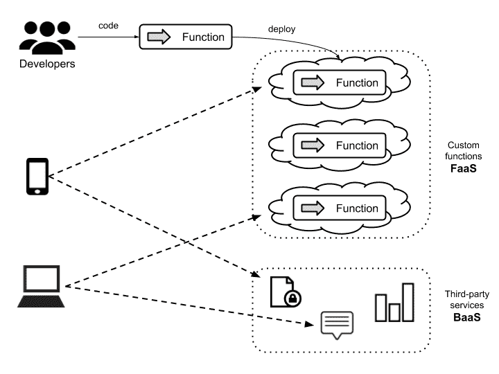
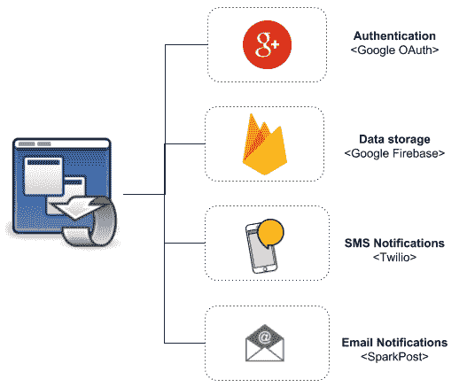
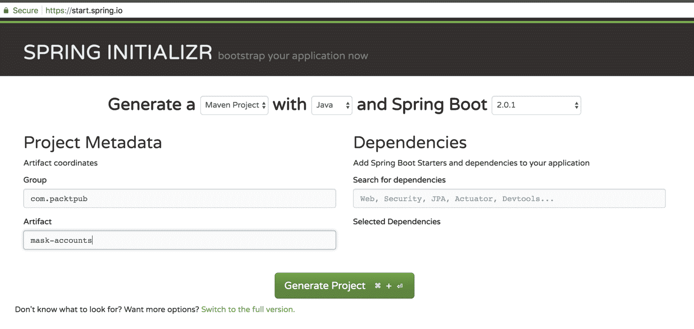
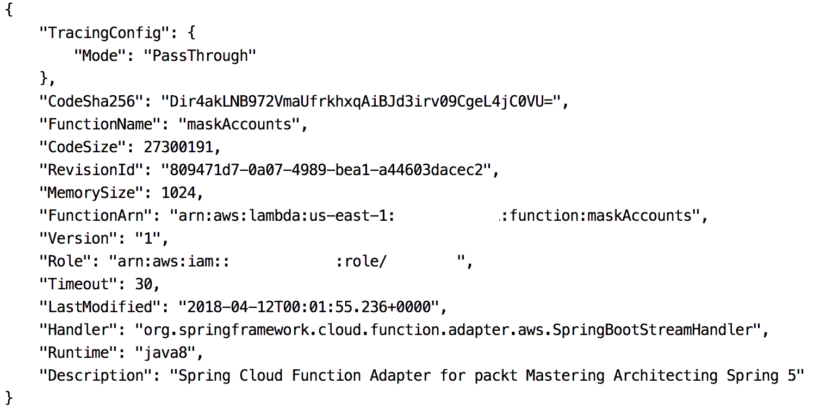
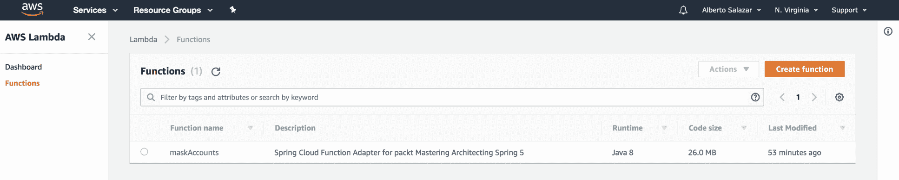
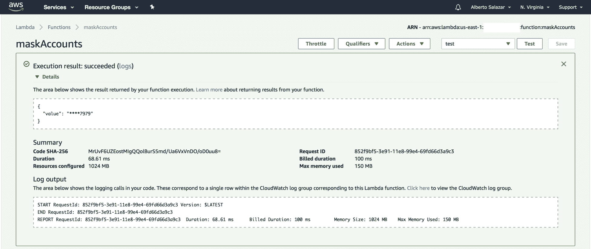
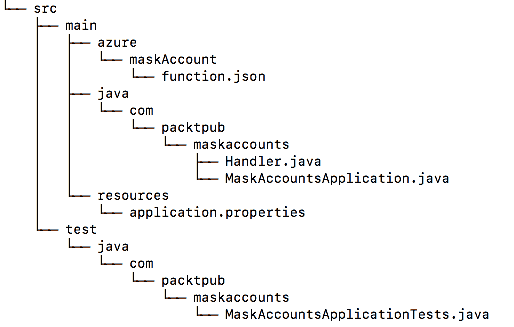
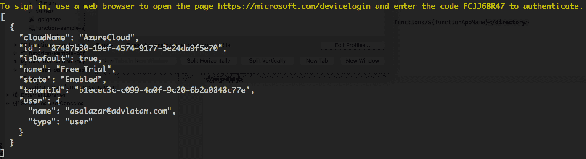
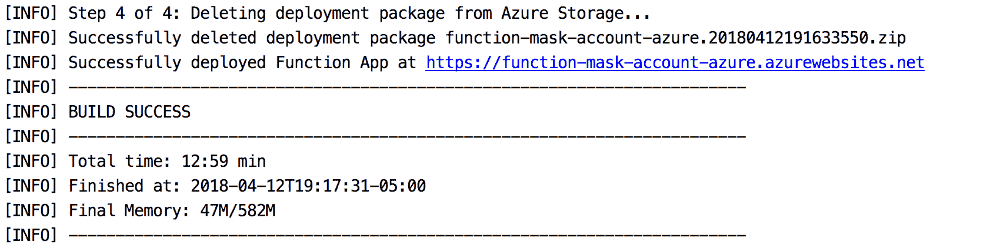
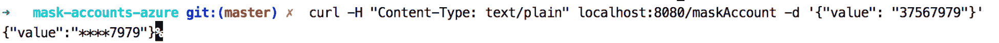

# 九、无服务器架构

无服务器架构正在成为 IT 系统构建中的一种流行趋势。因此，经常听到人们讨论云提供商，如**亚马逊网络服务**（**AWS**）、谷歌云和微软 Azure 等

在本章中，我们将探讨无服务器架构的含义，以及这种构建系统的新方法如何帮助我们在更短的时间内满足业务需求，从而减少构建业务解决方案所需的工作量。我们还将研究如何使用这种方法，通过利用现成的第三方服务和实现自定义功能，从而创建可以部署在云上的无状态功能，从而大幅减少实现生产所需的时间。

在本章中，我们将介绍以下主题：

*   无服务器架构简介
*   基础架构和文件存储
*   利与弊
*   后端即服务
*   服务功能
*   有关无服务器架构的问题：
    *   供应商锁定问题
    *   安全问题
    *   框架支持
    *   故障排除
*   无服务器架构的示例和常见用法
*   使用无服务器架构实现应用：
    *   如何用 Spring 编写函数
    *   使用 AWS Lambda 和 Azure 的适配器

# 无服务器架构简介

无服务器架构是通过 Amazon 的倡议诞生的。该公司希望推广一种环境，在这种环境中，开发团队可以是自主的、小型的、自我管理的，允许它在整个软件开发周期中工作，从编写代码到交付到生产环境。

无服务器架构有时被误解为不需要物理服务器即可部署的软件系统的概念。为了理解这个想法，您可以在 Martin Fowler 的博客中查看无服务器的定义：

“理解无服务器架构是一种开发人员将业务逻辑编码为函数的方法，这一点很重要，而忽略了服务器的配置和逻辑将在何处执行的扩展问题。”

-[https://martinfowler.com/articles/serverless.html](https://martinfowler.com/articles/serverless.html)

无服务器和 FAA 的常见示例包括：

*   认证
*   短信通知
*   电子邮件服务

另一方面，在一个没有服务器的世界中，创建应用时通常采用第三方服务作为系统的一部分（而不是从头开始创建服务）。这些服务通常被称为**后端即服务**（**BaaS**）或**移动后端即服务**（**MBaaS**）。

按照相同的方法，我们可以将自定义业务逻辑编码为可以部署在云上的函数形式。这些服务称为**作为服务的功能**（**FaaS**。

下图说明了不同软件系统如何创建、部署和使用第三方服务和自定义功能：



第三方服务和自定义功能

# 基础架构和文件存储

基础架构和文件存储也被认为是无服务器的，因为拥有系统的企业（或个人）不必购买、租用或调配服务器或虚拟机来使用它们。

作为开发人员，如果我们采用老式的方法（通过使用内部部署环境来提供所有基础设施），我们必须为我们想要部署软件系统的每个环境设置所有软件和硬件需求。在我们投入生产之前，必须对所有环境重复此资源调配过程，在这一点上，我们必须考虑其他功能，例如扩展和监视。在许多情况下，我们的基础设施将得不到充分利用，这是一种浪费，因为我们已经购买了功能强大的服务器来部署不需要太多资源的应用。

# 利与弊

采用无服务器架构方法来创建应用为我们提供了许多好处，但也有一些缺陷需要解决。让我们先回顾一下这些好处：

*   使用无服务器架构的开发人员可以主要关注代码，并且可以忘记与配置服务器相关的一切，这是云提供商自己处理的任务。
*   代码的伸缩性是短暂的，这意味着它可以根据检索到的请求数量进行伸缩，并可以向上或向下旋转。
*   根据定义，用于编码业务逻辑的所有函数都必须是无状态的，因此是松散耦合的。通过这种方式，任务集中在定义明确的职责上。
*   事件可以异步触发函数。
*   我们只需支付所消耗的计算时间
*   这些函数的功能基于事件驱动模型。
*   开发人员可以通过透明的方式实现无限扩展

另一方面，也存在一些陷阱：

*   缺乏可用作参考的文档和展示
*   必须同时使用多个服务时引入的延迟问题
*   某些功能只能从某些云提供商处获得
*   厂商锁定

为了解决供应商锁定的陷阱，强烈建议使用**polycloud**方法作为无服务器架构的一部分。多云战略涉及使用多个云提供商。这一点很重要，因为有了它，我们可以利用不同供应商和不同产品的优势。例如，谷歌为机器学习提供了非常棒的服务，AWS 提供了各种各样的标准服务，Microsoft Azure 为远程调试等功能提供了非常棒的功能。另一方面，云不可知论策略建议我们尽可能避免拘泥于确定的云提供商，以便在任何时候都可以自由地部署系统。然而，这将很难实现，因为这意味着以更通用的方式设计系统，而忽略提供额外优势的特定供应商功能。

# 后端即服务

使用 BaaS 方法的最简单场景发生在我们创建**单页应用**（**SPA**）或与云中可用服务交互的移动应用时。

常见的应用中，身份验证过程委托给第三方服务，使用标准协议（如 OAuth）、在云数据库中保存信息（如 Google Firebase）或通过 SMS 服务（如 Twilio）发送通知。

BAA 可以帮助我们解决一些现成的问题，这样我们就可以部署到生产环境中，而不必担心应用的服务器或虚拟机。此外，BaaS 还为我们提供了完整的基础设施和节点，例如：

*   负载平衡器
*   用于存储数据的数据库（NoSQL 或 RDBMS）
*   文件系统
*   队列服务器

BaaS 还应满足以下要求：

*   备份
*   复制
*   补丁
*   规模
*   高可用性

另一方面，BaaS 增加了新产品作为服务的诞生，包括：

*   **Firebase**：这为我们提供了分析、数据库、消息和崩溃报告等功能
*   **Amazon DynamoDB**：存储的这个键值是一个非关系型数据库
*   **Azure Cosmos DB**：这是一个全球分布的多模型数据库服务

有了所有这些变化和新工具，我们必须采用新的思维方式，打破构建应用的模式。由于无服务器是一项新技术，建议从使用应用的一小部分开始进行试验。从您当前的应用中考虑三个使用无服务器方法进行重构的示例。现在，与您的团队协商并组织一次架构冲突（[http://architecturalclash.org/](http://architecturalclash.org/) 研讨会，以确定您的想法是否可行。

# 服务功能

自 2014 年 AWS Lambda 普及以来，作为函数实现的代码的使用变得越来越流行。在某些情况下，甚至可以选择使用 FaaS 方法构建整个应用；在其他情况下，该方法用于解决特定需求。

以函数形式部署的代码在事件发生时执行。事件发生后，执行代码，然后关闭函数。因此，函数本质上是无状态的，因为没有状态或上下文可与其他应用共享。

FaaS 是短暂的，这意味着当需要执行某个函数时，云提供商将使用与该函数关联的元数据自动提供一个环境。这将根据处理需求进行扩展，一旦处理完成，执行环境将被破坏，如下图所示：


短暂火焰原子吸收光谱法

使用 FaaS 方法实现代码将为您提供以下好处：

*   您不必担心主机配置
*   按需透明放大
*   自动旋转向上/向下
*   你将只为你使用的东西付费

# 关注无服务器架构

新的技术趋势有时会带来恢复力和担忧，但它们也为应用和业务提供了试验和获益的机会

无服务器架构中最常见的问题如下：

*   厂商锁定
*   安全
*   框架支持
*   故障排除

# 厂商锁定

对于供应商锁定，主要关注的是不可能将新服务作为供应商无服务器架构的一部分。这种担心可以归结为担心被锁定在云服务提供商那里。

建议尽可能多地使用您选择的云提供商的功能。您可以通过启动试点并评估云提供商来实现这一目标；在将更多代码移动到云上之前，请确保对利弊进行评估。

不要因为这个问题而放弃使用无服务器架构。相反，建议启动概念验证并评估云提供商。无服务器是一项新技术，它将随着时间的推移而发展，有一些方法可以保持 FaaS 的独立性，比如使用 Spring 云功能。我们将在本章后面的一节中研究这方面的一个示例。

最后，您应该了解，转移到另一个供应商（从一个云到另一个云）并不像过去那样困难（当我们将应用或遗留代码转移到本地环境时）。

# 安全

安全性是一个关键问题，独立于应用的架构，无服务器也不例外。因为我们是在云中创建作为服务的函数，所以我们需要在身份验证、执行授权和 OWASP 中小心。然而，在这种情况下，云提供商（如 AWS 或 Azure）为我们提供了开箱即用的指南和实践，以尽量减少我们的担忧。

另一个需要考虑的安全问题是缺乏清晰的安全边界。换句话说，当一个功能的安全周界结束而另一个开始时，不同的云提供商提供不同的方式使这些功能作为一个整体工作；例如，AWS 通过使用称为 API 网关的服务来实现这一点。此 API 用于编排和组合创建的 FAA。另一方面，与所有短暂的情况一样，这些问题中的许多可能会消失，因为 FaaS 中短暂的概念是，函数将被创建、运行和销毁，因为每次调用 FaaS 时，接收到的请求都会被隔离。

为了澄清任何顾虑，我们将开始将部分代码移动到 serverless/FaaS，创建一个实验性开发，并在我们对该概念更有信心时增加。

# 框架支持

有几个框架致力于创建开发无服务器架构的环境，而无需连接到云提供商。根据我的经验，最好将函数创建为尽可能利用云平台的服务。由于函数是一小段具有清晰输入或输出的代码，因此最好使用您感到熟悉的语言和技术，甚至尝试新技术或编程语言，以确定它们有多好。

在这个阶段，serverless 支持几种语言来构建函数。目前，部署 FAA 的最常见选项如下：

*   AWS 兰巴
*   Azure 函数
*   谷歌功能

Java 开发人员的一个好处是，大多数云提供商都支持将 Java 作为一种编程语言来部署函数。此外，Spring 框架有一个名为 Spring Functions 的项目，可用于编写函数；在本章后面，我们将使用该项目实现一些功能。

使用 Spring 函数的一个好处是，我们可以在本地机器上开发和测试代码，然后使用适配器包装代码，以便将其部署到云提供商上。

# 故障排除

一旦应用（或函数，在这种情况下）被部署到生产中，要考虑的一个关键方面是如何跟踪、查找和修复错误。对于无服务器系统，这可能会很棘手，因为我们正在处理一个更加隔离的场景，并且我们的系统有一些小部分，没有划分为服务和微服务。有几个函数是较小的逻辑和代码片段。为了解决这个问题，每个云提供商都有监控和跟踪功能的工具，在短暂的环境中处理一个错误。如果我们为几个函数组合逻辑，我们将不得不应用聚合日志等技术，并使用工具收集与执行代码相关的信息。我们将在[第 12 章](12.html)、*监控*中回顾一些处理这一概念的技术。

# 示例和常见用例

即使无服务器架构为我们提供了很多好处，这些好处也不能应用于所有方面。当应用使用部署在传统服务器（内部部署或基于云）上的后端，并使用 FaaS 或第三方服务满足特定需求时，使用混合模型的应用非常常见。

可应用于无服务器架构的一些常见场景如下：

*   处理 webhook
*   在某些情况下应计划或触发的任务或作业
*   数据转换，例如：
    *   图像处理、压缩或转换
    *   转录成文本的语音数据，如 Alexa 或 Cortana
*   基于移动后端即服务方法的移动应用的特定逻辑
*   单页应用
*   聊天机器人

另一方面，无服务器架构不适用于以下场景：

*   需要大量资源（如 CPU 和内存）的长时间运行的进程
*   任何阻塞进程

# SPA 采用无服务器架构

**单页应用（SPA）**为采用无服务器架构方法提供了最合适的场景之一。毕竟，它们不涉及太多编码的业务逻辑，它们主要服务和使用部署在其他地方的服务提供的内容。

例如，假设我们需要构建一个应用来向用户发送世界杯结果。在本例中，我们需要满足以下要求：

*   认证
*   数据存储
*   通知机制

使用无服务器架构方法，以下服务提供商可以满足这些需求：

*   **认证**：谷歌 OAuth
*   **数据****存储**：谷歌 Firebase
*   **通知****机制**：
    *   SMS，使用 Twilio
    *   使用 SparkPost 发送电子邮件

下图说明了如何将上述服务（Google OAuth、Firebase、Twilo 和 SparkPost）用作应用的一部分：



集成不同的第三方应用

上图显示了一些最知名的服务提供商，但在 internet 上还有许多其他选项。

上述服务的好处之一是，它们都提供了一个 SDK 或库，可以直接从 SPA 使用，包括常见的 JavaScript 库，如 Angular。

# 用 Spring 云函数实现 FaaS

在 Spring 项目的保护伞下，您会发现 Spring 云功能项目（[https://cloud.spring.io/spring-cloud-function/](https://cloud.spring.io/spring-cloud-function/) ），设计用于使用无服务器架构模型实现应用。

使用 SpringCloud 函数，我们可以编写可以在支持 FaaS 的不同云提供商上启动的函数。没有必要从头开始学习新东西，因为 Spring 框架的所有核心概念和主要功能，如自动配置、依赖项注入和内置度量，都是以相同的方式应用的。

一旦一个函数被编码，它就可以被部署为 web 端点、流处理器或由某些事件或通过调度器触发的简单任务。

查看 SPA 示例，我们可以使用第三方服务、现有 REST API 和自定义函数实现应用。下图说明了如何使用前面提到的所有选项创建应用：


在应用中集成 FaaS

让我们回顾一下上图中的组件是如何工作的：

*   身份验证由第三方服务提供
*   应用使用驻留在 RESTAPI 中的业务逻辑
*   自定义功能可以用作 SPA 的一部分

下图说明了函数的工作原理：


服务功能

让我们回顾一下图表的每个部分：

*   函数提供了一种使用事件驱动编程模型的方法。
*   我们可以以对开发者透明的方式无限扩展。这个规模将由我们用来部署功能的平台来处理。
*   最后，我们只支付函数在执行期间所消耗的时间和资源。

# 弹簧的功能

Spring 云功能为我们带来了四个主要特性，在官方文档（[中有详细描述 https://github.com/spring-cloud/spring-cloud-function](https://github.com/spring-cloud/spring-cloud-function) ），这里值得一提的是：

*   它提供了包装`@Beans`类型的功能、消费者和供应商的能力。这使得可以使用消息代理（如 RabbitMQ、ActiveMQ 或 Kafka）将功能公开为 HTTP 端点，并通过侦听器或发布器进行流式消息传递。
*   它提供编译后的字符串，这些字符串将被包装为函数体。
*   我们可以使用我们的函数部署一个 JAR 文件，使用一个独立的类加载器，该类加载器将在单个 Java 虚拟机上运行。
*   它为支持无服务器架构的不同云提供商提供适配器，例如：
    *   AWS Lambda
    *   开式搅拌器
    *   蔚蓝色的

# 编写示例代码

现在，我们将创建一个屏蔽银行帐号的函数。让我们从使用 Spring Initializer 网站（[从头开始创建一个新的 Spring 启动应用开始 https://start.spring.io](https://start.spring.io) ：



Spring 初始化器网站

目前，不需要将其他依赖项作为项目的一部分。项目结构非常简单，如下所示：


为了使用 Spring 编写函数，我们必须将 Spring 云函数项目作为一个依赖项包含在内；首先，让我们添加一些属性来指定要使用的版本，如下所示：

```java
  <parent>
      <groupId>org.springframework.boot</groupId>
      <artifactId>spring-boot-starter-parent</artifactId>
 <version>1.5.11.RELEASE</version>
      <relativePath/>
   </parent>

   <properties>
      <project.build.sourceEncoding>UTF-
      8</project.build.sourceEncoding>
      <project.reporting.outputEncoding>UTF-
      8</project.reporting.outputEncoding>
      <java.version>1.8</java.version>
      <spring-cloud-function.version>
        1.0.0.BUILD-SNAPSHOT
      </spring-cloud-function.version>
 <reactor.version>3.1.2.RELEASE</reactor.version>
 <wrapper.version>1.0.9.RELEASE</wrapper.version>
   </properties>
```

请注意，我们将把 Spring 版本降级到 1.5.11 版本，因为 SpringCloud 功能目前还没有准备好在 SpringBoot2 中使用。

现在，我们将添加依赖项，如下所示：

```
<dependency>
  <groupId>org.springframework.cloud</groupId>
  <artifactId>spring-cloud-starter-function-web</artifactId>
</dependency>
<dependency>
  <groupId>org.springframework.cloud</groupId>
  <artifactId>spring-cloud-function-compiler</artifactId>
</dependency>

```

然后，我们必须添加一个条目作为依赖项管理部分的一部分，以允许 Maven 自动解析所有可传递的依赖项：

```
<dependencyManagement>
  <dependencies>
    <dependency>
      <groupId>org.springframework.cloud</groupId>
      <artifactId>spring-cloud-function-dependencies</artifactId>
      <version>${spring-cloud-function.version}</version>
      <type>pom</type>
      <scope>import</scope>
    </dependency>
  </dependencies>
</dependencyManagement>
```

最后，我们将包括一些插件，通过添加以下条目作为`pom.xml`文件的一部分，允许我们包装编码函数：

```
<build>
  <plugins>
    <plugin>
      <groupId>org.apache.maven.plugins</groupId>
      <artifactId>maven-deploy-plugin</artifactId>
      <configuration>
        <skip>true</skip>
      </configuration>
    </plugin>
    <plugin>
      <groupId>org.springframework.boot</groupId>
      <artifactId>spring-boot-maven-plugin</artifactId>
      <dependencies>
        <dependency>
          <groupId>org.springframework.boot.experimental</groupId>
          <artifactId>spring-boot-thin-layout</artifactId>
          <version>${wrapper.version}</version>
        </dependency>
      </dependencies>
    </plugin>
  </plugins>
</build>

```

我们现在准备实现一个函数来屏蔽帐号。让我们回顾一下以下代码片段：

```
package com.packtpub.maskaccounts;

import org.springframework.boot.SpringApplication;
import org.springframework.boot.autoconfigure.SpringBootApplication;
import org.springframework.cloud.function.context.FunctionScan;
import org.springframework.context.annotation.Bean;
import reactor.core.publisher.Flux;

import java.util.function.Function;

@FunctionScan
@SpringBootApplication
public class MaskAccountsApplication 
{
  public static void main(String[] args) {
    SpringApplication.run(MaskAccountsApplication.class, args);
  }

  @Bean
  public Function<Flux<String>, Flux<String>> maskAccounts() 
  {
 return flux -> 
    {
 return flux
      .map(value -> 
        value.replaceAll("\\w(?=\\w{4})", "*")
      );
 };
 }
}
```

`@FunctionScan`注释用于允许 Spring 函数适配器查找将作为云提供程序中的函数部署的 bean。

函数编码完成后，我们将使用`application.properties`文件进行注册，如下所示：

```
spring.cloud.function.stream.default-route: maskAccounts
spring.cloud.function.scan.packages: com.packtpub.maskaccounts
```

现在，使用以下步骤在本地执行该函数：

1.  生成工件：

```
$ mvn install
```

2.  执行生成的工件：

```
$ java -jar target/mask-accounts-0.0.1-SNAPSHOT.jar
```

您现在应该看到类似于以下内容的输出：


控制台输出

让我们尝试使用以下`CURL`命令执行该函数：

```
$ curl -H "Content-Type: text/plain" http://localhost:8080/maskAccounts -d 37567979
%****7979
```

因此，我们将获得一个隐藏的账号：`****7979`。

在下一节中，我们将回顾如何使用不同的云提供商部署该功能。

为了在任何云提供商（如 AWS 或 Azure）上创建帐户，您将需要信用卡或借记卡，即使该提供商提供免费分层。

# 适配器

SpringCloudFunction 为不同的云提供商提供适配器，以便使用函数部署编码的业务逻辑。目前，有一些适配器可用于以下云提供商：

*   AWS Lambda
*   蔚蓝色的
*   ApacheOpenWhisk

在下一节中，我们将介绍如何使用这些适配器。

# AWS Lambda 适配器

该项目旨在允许将使用 Spring 云功能的应用部署到 AWS Lambda（[https://aws.amazon.com/lambda/](https://aws.amazon.com/lambda/) ）。

该适配器是 Spring 云函数应用上的一层，它允许我们将函数部署到 AWS 中。

您可以在 GitHub 上找到该项目的来源，链接如下：[https://github.com/spring-cloud/spring-cloud-function/tree/master/spring-cloud-function-adapters/spring-cloud-function-adapter-aws](https://github.com/spring-cloud/spring-cloud-function/tree/master/spring-cloud-function-adapters/spring-cloud-function-adapter-aws)

在使用 AWS Lambda 适配器之前，我们必须将其添加为项目的依赖项。让我们首先在`pom.xml`文件中定义一些属性：

```
<aws-lambda-events.version>
    2.0.2
</aws-lambda-events.version>
<spring-cloud-stream-servlet.version>
    1.0.0.BUILD-SNAPSHOT
</spring-cloud-stream-servlet.version>
<start-class>
    com.packtpub.maskaccounts.MaskAccountsApplication
</start-class>
```

现在，我们必须为 AWS 添加所需的依赖项：

```
<dependency>
      <groupId>org.springframework.cloud</groupId>
      <artifactId>spring-cloud-function-adapter-aws</artifactId>
</dependency>
<dependency>
      <groupId>com.amazonaws</groupId>
      <artifactId>aws-lambda-java-events</artifactId>
      <version>${aws-lambda-events.version}</version>
      <scope>provided</scope>
    </dependency>
<dependency>
      <groupId>com.amazonaws</groupId>
      <artifactId>aws-lambda-java-core</artifactId>
      <version>1.1.0</version>
      <scope>provided</scope>
</dependency>
```

现在，将其添加到`dependency`管理部分，如下所示：

```
<dependency>
  <groupId>org.springframework.cloud</groupId>
  <artifactId>spring-cloud-stream-binder-servlet</artifactId>
  <version>${spring-cloud-stream-servlet.version}</version>
</dependency>
```

最后，将其添加到`plugin`部分，如下所示：

```
<plugin>
  <groupId>org.apache.maven.plugins</groupId>
  <artifactId>maven-shade-plugin</artifactId>
  <configuration>
    <createDependencyReducedPom>false</createDependencyReducedPom>
    <shadedArtifactAttached>true</shadedArtifactAttached>
    <shadedClassifierName>aws</shadedClassifierName>
  </configuration>
</plugin>
```

接下来，我们将编写一个类，该类将用作 AWS 的适配器。该适配器应扩展`SpringBootRequestHandler`类，如下所示：

```
package com.packtpub.maskaccounts;

public class Handler 
    extends SpringBootRequestHandler<Flux<String>, Flux<String>> {

}
```

一旦编写了适配器，我们就需要将先前实现的函数作为`MaskAccountsApplication.java`文件的一部分进行修改。在这里，我们将把方法的名称改为`function`，函数的输入和输出将是**普通旧 Java 对象（POJO）**，带有 setter 和 getter，如下所示：

```
package com.packtpub.maskaccounts;

import org.springframework.boot.SpringApplication;
import org.springframework.boot.autoconfigure.SpringBootApplication;
import org.springframework.cloud.function.context.FunctionScan;
import org.springframework.context.annotation.Bean;

import java.util.function.Function;

@FunctionScan
@SpringBootApplication
public class MaskAccountsApplication {

    public static void main(String[] args) {
        SpringApplication.run(MaskAccountsApplication.class, args);
    }

    @Bean
    public Function<In, Out> function() {
            return value -> new Out(value.mask());
    }
}

class In {

    private String value;

    In() {
    }

    public In(String value) {
        this.value = value;
    }

    public String mask() {
        return value.replaceAll("\\w(?=\\w{4})", "*");
    }

    public String getValue() {
        return value;
    }

    public void setValue(String value) {
        this.value = value;
    }
}

class Out {

    private String value;

    Out() {
    }

    public Out(String value) {
        this.value = value;
    }

    public String getValue() {
        return value;
    }

    public void setValue(String value) {
        this.value = value;
    }
}
```

为了包装编码函数，我们必须使用以下 Maven 目标创建一个 JAR 文件：

```
$ mvn clean package
```

一旦创建了 JAR 文件，我们就可以使用 AWS（[提供的**命令行界面（CLI）**https://aws.amazon.com/cli/](https://aws.amazon.com/cli/) ）通过运行以下命令上传生成的 JAR 文件：

```
$ aws lambda create-function --function-name maskAccounts --role arn:aws:iam::[USERID]:role/service-role/[ROLE] --zip-file fileb://target/mask-accounts-aws-0.0.1-SNAPSHOT-aws.jar --handler org.springframework.cloud.function.adapter.aws.SpringBootStreamHandler --description "Spring Cloud Function Adapter for packt Mastering Architecting Spring 5" --runtime java8 --region us-east-1 --timeout 30 --memory-size 1024 --publish
```

`[USERID]`报价基于您的 AWS 账户和`[ROLE]`报价。如果您对如何创建 AWS 帐户有任何疑问，请转至[https://aws.amazon.com/premiumsupport/knowledge-center/create-and-activate-aws-account/](https://aws.amazon.com/premiumsupport/knowledge-center/create-and-activate-aws-account/) 。

有关 AWS lambda`create-function`的更多信息，请参阅[https://docs.aws.amazon.com/cli/latest/reference/lambda/create-function.html](https://docs.aws.amazon.com/cli/latest/reference/lambda/create-function.html) 。

如果您没有设置 AWS 帐户的凭据，您将收到一条错误消息，说明*无法找到凭据。*您可以通过运行`aws configure`命令来配置凭据。

不要忘记，您将需要创建一个 AWS 用户，其角色具有运行 AWS Lambda 的权限。

成功部署该功能后，您将在控制台中看到类似于以下内容的输出：



输出处理

最近部署的功能现在将在 AWS Lambda 控制台中列出，如下所示：



AWS Lambda 控制台

如果在 web 控制台中没有看到最近部署的函数，则必须查看创建函数的位置。在本例中，我们使用了`us-east-1`区域，这意味着该功能部署在北弗吉尼亚州。您可以在 AWS Lambda 控制台顶部的姓名旁边检查此值

最后，我们将在 AWS Lambda 控制台中测试我们的结果。在测试部分中，使用要屏蔽的值创建一些输入，如下所示：

```
{"value": "37567979"}
```

预期结果如下：

```
{"value": "****7979"}
```

在 AWS 控制台中，您将看到以下结果：



maskAccount 功能的 AWS 控制台测试结果

# Azure 适配器

在本节中，我们将回顾如何将先前编码的函数部署到 Azure，Azure 是 Microsoft 支持的云提供商。Azure 通过使用 Microsoft Azure 函数（[支持函数 https://azure.microsoft.com/en-us/services/functions/](https://azure.microsoft.com/en-us/services/functions/) ）。

Azure 适配器是一个在 Spring 云功能项目上编码的层。您可以在 GitHub（[上找到项目的来源 https://github.com/spring-cloud/spring-cloud-function/tree/master/spring-cloud-function-adapters/spring-cloud-function-adapter-azure](https://github.com/spring-cloud/spring-cloud-function/tree/master/spring-cloud-function-adapters/spring-cloud-function-adapter-azure) ）。

让我们首先在属性部分添加以下属性作为`pom.xml`文件的一部分：

```
<functionAppName>function-mask-account-azure</functionAppName><functionAppRegion>westus</functionAppRegion>
<start-class>
    com.packtpub.maskaccounts.MaskAccountsApplication
</start-class>
```

现在，让我们为该适配器添加所需的依赖项，如下所示：

```
<dependency>
  <groupId>org.springframework.cloud</groupId>
  <artifactId>spring-cloud-function-adapter-azure</artifactId>
</dependency>
<dependency>
  <groupId>org.springframework.cloud</groupId>
  <artifactId>spring-cloud-starter-function-web</artifactId>
  <scope>provided</scope>
</dependency>
<dependency>
  <groupId>com.microsoft.azure</groupId>
  <artifactId>azure-functions-java-core</artifactId>
  <version>1.0.0-beta-2</version>
  <scope>provided</scope>
</dependency>
```

然后，我们将添加一些插件以允许适配器工作，如下所示：

```
<plugin>
  <groupId>com.microsoft.azure</groupId>
  <artifactId>azure-functions-maven-plugin</artifactId>
  <configuration>
    <resourceGroup>java-functions-group</resourceGroup>
    <appName>${functionAppName}</appName>
    <region>${functionAppRegion}</region>
    <appSettings>
      <property>
        <name>FUNCTIONS_EXTENSION_VERSION</name>
        <value>beta</value>
      </property>
    </appSettings>
  </configuration>
</plugin>
<plugin>
  <artifactId>maven-resources-plugin</artifactId>
  <executions>
    <execution>
      <id>copy-resources</id>
      <phase>package</phase>
      <goals>
        <goal>copy-resources</goal>
      </goals>
      <configuration>
        <overwrite>true</overwrite>
        <outputDirectory>${project.build.directory}/azure-
        functions/${functionAppName}
        </outputDirectory>
        <resources>
          <resource>
            <directory>${project.basedir}/src/main/azure</directory>
            <includes>
              <include>**</include>
            </includes>
          </resource>
        </resources>
      </configuration>
    </execution>
  </executions>
</plugin>
<plugin>
  <groupId>org.apache.maven.plugins</groupId>
  <artifactId>maven-shade-plugin</artifactId>
  <configuration>
    <createDependencyReducedPom>false</createDependencyReducedPom>
    <shadedArtifactAttached>true</shadedArtifactAttached>
    <shadedClassifierName>azure</shadedClassifierName>
    <outputDirectory>${project.build.directory}/azure-
    functions/${functionAppName}</outputDirectory>
  </configuration>
</plugin>
<plugin>
  <groupId>org.apache.maven.plugins</groupId>
  <artifactId>maven-assembly-plugin</artifactId>
  <executions>
    <execution>
      <id>azure</id>
      <phase>package</phase>
      <goals>
        <goal>single</goal>
      </goals>
      <inherited>false</inherited>
      <configuration>
        <attach>false</attach>
        <descriptor>${basedir}/src/assembly/azure.xml</descriptor>
        <outputDirectory>${project.build.directory}/azure- 
        functions</outputDirectory>
        <appendAssemblyId>false</appendAssemblyId>
        <finalName>${functionAppName}</finalName>
      </configuration>
    </execution>
  </executions>
</plugin>
```

最后，我们将创建一个适配器，该适配器应扩展自`AzureSpringBootRequestHandler`类。扩展类将为我们提供输入和输出类型，使 Azure 函数能够检查类并执行任何 JSON 转换以使用/生成数据：

```
public class Handler 
    extends AzureSpringBootRequestHandler<Flux<String>,Flux<String>> {

    public Flux<String> execute
                    (Flux<String>in, ExecutionContext context) {
        return handleRequest(in, context);
    }
}
```

现在，我们将修改驻留在`MaskAccountsApplication.java`文件中的编码函数；我们将更改函数的输入和输出，以便使用带有 setter 和 getter 的普通旧 Java 对象：

```
package com.packtpub.maskaccounts;

import org.springframework.boot.SpringApplication;
import org.springframework.boot.autoconfigure.SpringBootApplication;
import org.springframework.cloud.function.context.FunctionScan;
import org.springframework.context.annotation.Bean;

import java.util.function.Function;

@FunctionScan
@SpringBootApplication
public class MaskAccountsApplication {

    public static void main(String[] args) {
        SpringApplication.run(MaskAccountsApplication.class, args);
    }

    @Bean
    public Function<In, Out> maskAccount() {
            return value -> new Out(value.mask());
    }
}

class In {

    private String value;

    In() {
    }

    public In(String value) {
        this.value = value;
    }

    public String mask() {
        return value.replaceAll("\\w(?=\\w{4})", "*");
    }

    public String getValue() {
        return value;
    }

    public void setValue(String value) {
        this.value = value;
    }
}

class Out {

    private String value;

    Out() {
    }

    public Out(String value) {
        this.value = value;
    }

    public String getValue() {
        return value;
    }

    public void setValue(String value) {
        this.value = value;
    }
}
```

然后我们必须为 Azure 工具添加一个 JSON 配置，因此我们将在`src/main`文件夹后面的一个新文件夹中创建一个名为`function.json`的 JSON 文件，该文件名为函数名（`maskAccount`。通过指定将用作入口点的 Java 类，此文件将用于让 Azure 知道我们要部署的函数。`src`文件夹应如下所示：



`function.json`文件的内容如下：

```
{
   "scriptFile": "../mask-accounts-azure-1.0.0.BUILD-SNAPSHOT-azure.jar",
   "entryPoint": "com.packtpub.maskaccounts.Handler.execute",
"bindings": [
 {
 "type": "httpTrigger",
 "name": "in",
 "direction": "in",
 "authLevel": "anonymous",
 "methods": [
 "get",
 "post"
 ]
 },
 {
 "type": "http",
 "name": "$return",
 "direction": "out"
 }
 ],
 "disabled": false
}
```

可以使用 Maven 插件为非 Spring 函数创建 JSON 文件，但该工具不能与当前版本的适配器一起使用。

在生成要部署的工件之前，我们必须创建一个`assembly`文件，这是我们正在使用的 Azure Maven 插件所需要的。

`assembly`文件应放在`src/assembly`目录下；文件名为`azure.xml`，包含以下内容：

```
<assembly

   xmlns:xsi="http://www.w3.org/2001/XMLSchema-instance"
   xsi:schemaLocation="http://maven.apache.org/plugins/maven-assembly-plugin/assembly/1.1.3 http://maven.apache.org/xsd/assembly-1.1.3.xsd">
   <id>azure</id>
   <formats>
      <format>zip</format>
   </formats>
   <baseDirectory></baseDirectory>
   <fileSets>
      <fileSet>
         <directory>${project.build.directory}/azure-functions/${functionAppName}</directory>
         <outputDirectory></outputDirectory>
         <includes>
            <include>*-azure.jar</include>
            <include>**/*.json</include>
         </includes>
      </fileSet>
   </fileSets>
</assembly>
```

现在，可以使用以下 Maven 目标创建 JAR 文件：

```
$ mvn clean package
```

出于测试目的，可以在本地部署该函数，使用以下命令将 JAR 文件作为常规 Java 应用运行：

```
$ java -jar target/mask-accounts-azure-0.0.1-SNAPSHOT.jar
```

然后，您将看到应用正在运行，如下所示：


本地运行的 Spring 应用的输出

让我们使用以下`curl`命令来尝试该函数：

```
$ curl -H "Content-Type: text/plain" localhost:8080/maskAccount -d '{"value": "37567979"}'
```

您将看到以下输出：


或者，我们可以使用 Azure 功能核心工具将我们的功能部署到 Azure。

为此，首先，您必须使用[中提供的信息安装所有必需的工具 https://github.com/azure/azure-functions-core-tools#installing](https://github.com/azure/azure-functions-core-tools#installing) 。安装所需工具后，您可以在终端中使用以下命令登录 Azure：

```
$ az login
```

输入凭据后，您将在控制台上看到以下输出：



将编码函数部署到 Azure 非常简单；您只需执行以下 Maven：

```
$ mvn azure-functions:deploy
```

现在，您可以使用以下`curl`命令尝试部署的功能：

```
$ curl https:///api/maskAccount -d '{"value": "37567979"}'
```

`<azure-function-url-from-the-log>`是运行`mvn azure-functions:deploy`命令后将获得的 URL。例如，在下面的屏幕截图中，您可以看到`https://function-mask-account-azure.azurewebsites.net/`URL：



执行`curl`命令后，接收到的输出如下：



输出处理

我们还可以在 Azure 函数控制台上测试相同的函数，就像我们对 AWS Lambda 所做的那样。

# 总结

在本章中，我们讨论了无服务器架构背后的概念。您了解了如何使用 Spring 云函数实现函数，并且我们回顾了可用于在不同云提供商（如 AWS Lambda 和 Microsoft Azure 函数）中部署函数的适配器。

在下一章中，我们将描述什么是容器，以及如何使用它们来容器化应用。