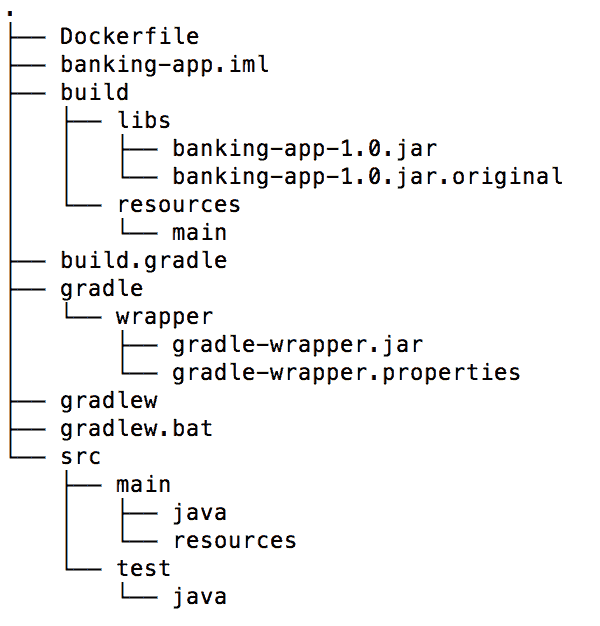
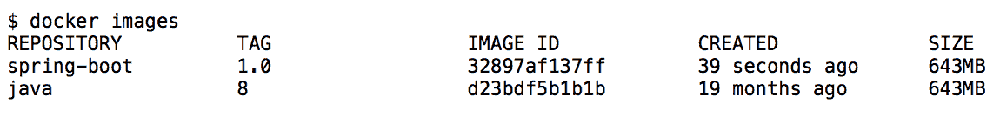
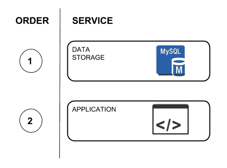

# 十、容器化应用

容器正在成为软件开发的关键因素之一，改变了开发人员编写和部署 IT 系统的方式。这些主要用于解决与设置环境相关的问题。

当您必须管理多个容器和多实例环境时，使用容器可能会非常困难。然而，已经发布了一些非常酷的工具，这些工具旨在完成这些容器编排任务。我们将在本章中介绍这些工具，以及以下主题：

*   **集装箱**：
    *   基本概念
    *   基本命令
    *   建立自己的形象
*   **集装箱化应用**：Docker Gradle 插件
*   **注册处**：发布图片
*   **配置多容器环境**：Docker Compose
*   **与 Kubernetes**的容器编排：
    *   豆荚
    *   标签
    *   复制控制器
    *   服务

# 容器

容器提供了一种轻量级的虚拟化方法，包括提供应用工作所需的最低限度。在过去，虚拟机曾经是供应环境和运行应用的主要选择。然而，它们需要一个完整的操作系统才能工作。另一方面，容器重用主机操作系统来运行和提供所需的环境。让我们通过查看下图来了解有关此概念的更多信息：


虚拟机和容器

在上图中，我们可以看到左侧的**虚拟机**（**虚拟机**），右侧的**容器**。让我们从学习虚拟机如何工作开始。

虚拟机需要使用虚拟机管理程序支持的分配给虚拟机的硬件来使用自己的操作系统。上图显示了三个虚拟机，这意味着我们需要安装三个操作系统，每个虚拟机一个。在 VMS 中运行应用时，必须考虑应用和操作系统所消耗的资源。

另一方面，容器使用操作系统主机提供的内核，该内核还为所有容器提供基本服务，使用虚拟内存支持进行隔离。在这种情况下，不需要为每个容器安装整个操作系统；就内存和存储使用而言，这是一种有效的方法。当使用容器运行应用时，只需考虑应用所消耗的资源。

容器很小，可以以数十兆字节为单位进行测量，只需几秒钟即可配置。相比之下，虚拟机的测量单位是数十 GB，但它们甚至需要几分钟才能开始工作。在使用 VM 时，还应该考虑 OS 许可证，您必须为每个安装的 OS 的许可付费。当使用容器时，您只需要一个操作系统，所有容器都将使用它来运行。

目前市场上有不同的容器，但 Docker 是目前最流行的实现。因此，我们将选择此选项来解释本章中的所有概念。

# 基本概念

在本节中，我们将回顾一些日常常用的基本概念和命令。这将有助于您理解本章的其余部分。

# 容器和图像

当谈到 Docker 时，人们经常使用术语*容器*和*图像*。这两个术语之间的区别很简单：容器是映像的实例，而映像是不可变的文件，本质上是容器的快照。就**面向对象编程**（**OOP**而言，可以说图像就像类，容器就是这些类的实例。例如，假设您有一个由 CentOS 和 Java8 组成的 Docker 映像。使用此映像，您可以创建一个容器来运行 Spring 引导应用，并创建另一个容器来运行 JEE 应用，如下图所示：


Docker 图像和容器

# 基本命令

Docker 有大量的命令，可以使用容器和图像执行不同的操作。然而，没有必要对所有这些都熟悉。现在，我们将回顾使用 Docker 所需了解的一些最常见的命令。

# 流动容器

我们前面提到过，容器是图像的实例。要运行 Docker 容器时，可以使用以下命令：

```java
docker run IMAGE_NAME
```

互联网上有很多 Docker 图片。在创建自定义映像之前，您应该首先查看 Docker Hub（[上可用的映像列表 https://hub.docker.com/](https://hub.docker.com/) ）。

Docker Hub 是一个基于云的注册表服务，它允许您链接到代码存储库、构建图像并测试它们。它还存储手动推送的图像和到 Docker Cloud 的链接，以便您可以将图像部署到主机。Docker Hub 为容器和映像发现、分发和更改管理提供了集中化的资源；用户和团队协作；以及整个开发过程中的工作流自动化。

假设您希望使用`nginx`运行一个容器。在这种情况下，您只需在终端中执行以下命令：

```java
docker run nginx
```

运行此命令后，Docker 将尝试在本地查找图像。如果在那里找不到，它将使用所有可用的注册表查找映像（稍后我们将讨论注册表）。在我们的例子中，这是 Docker Hub。您应该在终端中看到的第一件事是类似于以下内容的输出：

```java
⋊> ~ docker run nginx
 Unable to find image 'nginx:latest' locally
 latest: Pulling from library/nginx
 f2aa67a397c4: Downloading [==================================> ] 15.74MB/22.5MB
 3c091c23e29d: Downloading [=======> ] 3.206MB/22.11MB
 4a99993b8636: Download complete
```

执行此操作后，您将得到一个类似于`d38bbaffa51cdd360761d0f919f924be3568fd96d7c9a80e7122db637cb8f374`的字符串，表示图像 ID。

运行容器的一些有用标志如下：

*   `-d`标志作为守护进程运行映像
*   `-p`标志将映像端口连接到主机

例如，以下命令可以将`nginx`作为守护进程运行，并将端口`80`从容器映射到主机上的端口`32888`：

```java
docker run -p 32888:80 -d nginx
```

现在您将再次控制终端，您可以在`http://localhost:32888/`URL 中看到`nginx`主页，如下图所示：


Nginx 主页

容器只有工作所必需的软件和服务，这就是为什么您会发现它们甚至不包含 SSH 条目的原因。如果你想进入一个容器，你可以使用`-it`标志，它在容器内执行一个命令，如下所示：

```java
⋊> ~ docker run -it nginx /bin/bash
# Now you're inside the container here
root@0c546aef5ad9:/#
```

# 使用容器

如果您对检查主机上运行的所有容器感兴趣，可以使用以下`ps`命令：

```java
docker ps
```

前面的命令将列出主机上运行的所有容器。如果您还想检查未运行的图像，可以使用`-a`标志。执行上述命令后，终端中的输出类似于以下屏幕截图：


Docker ps 命令输出

前面屏幕截图的第一列解释了以下列表中的信息。此输出最有用的部分是容器 ID**，可用于执行以下操作：**

 ***   重新启动容器：

```java
docker restart <CONTAINER ID> 
```

*   停止容器：

```java
docker stop <CONTAINER ID> 
```

*   启动容器：

```java
docker start <CONTAINER ID> 
```

*   卸下容器：

```java
docker rm <CONTAINER ID>
```

这些是最常见的命令，它们提供了开始使用 Docker 容器所需的所有功能。

# 处理图像

Docker 还有一些命令允许您的系统处理图像。最常用的命令如下：

*   列出主机上可用的所有图像：

```java
⋊> ~ docker images
REPOSITORY TAG IMAGE ID CREATED SIZE
nginx latest ae513a47849c 4 weeks ago 109MB
```

*   删除图像：

```java
⋊> ~ docker rmi nginx
Untagged: nginx:latest
Untagged: nginx@sha256:0fb320e2a1b1620b4905facb3447e3d84ad36da0b2c8aa8fe3a5a81d1187b884
Deleted: sha256:ae513a47849c895a155ddfb868d6ba247f60240ec8495482eca74c4a2c13a881
Deleted: sha256:160a8bd939a9421818f499ba4fbfaca3dd5c86ad7a6b97b6889149fd39bd91dd
Deleted: sha256:f246685cc80c2faa655ba1ec9f0a35d44e52b6f83863dc16f46c5bca149bfefc
Deleted: sha256:d626a8ad97a1f9c1f2c4db3814751ada64f60aed927764a3f994fcd88363b659
```

*   下载图像：

```java
⋊> ~ docker pull <IMAGE NAME>
```

# 建立自己的形象

在互联网上，我们可以找到许多随时可用的 Docker 图像。这些映像是使用名为 Dockerfile 的配置文件创建的，该文件包含配置容器的所有说明。

作为此文件的一部分，您可以找到以下常用命令：

*   `FROM`
*   `MAINTAINER`
*   `RUN`
*   `ENV`
*   `EXPOSE`
*   `CMD`

让我们逐一检查所有这些命令，以了解它们是如何工作的。

# 从命令

`FROM`命令用于指定 Docker 文件将用于构建新映像的基本 Docker 映像。例如，如果要基于 Debian 创建自定义映像，则应在文件中添加以下行：

```java
FROM debian:stretch-slim 
```

# 维修指挥部

`MAINTAINER`命令完全用于文档目的，其中包含 Dockerfile 的作者姓名及其电子邮件，如以下代码所示：

```java
MAINTAINER  Your Name <your@email.com>
```

# 运行命令

Dockerfile 通常包含多个`RUN`命令。这些命令将作为系统 bash 命令的一部分执行，主要用于安装软件包。例如，以下`RUN`命令用于安装 Java 8：

```java
RUN \ 
 echo oracle-java8-installer shared/accepted-oracle-license-v1-1 
 select true | debconf-set-selections && \ 
 add-apt-repository -y ppa:webupd8team/java && \ 
 apt-get update && \ 
 apt-get install -y oracle-java8-installer && \ 
 rm -rf /var/lib/apt/lists/* && \ 
 rm -rf /var/cache/oracle-jdk8-installer
```

前面的命令取自名为`oracle-java8`（[的图像提供的 Dockerfilehttps://github.com/dockerfile/java/blob/master/oracle-java8/Dockerfile](https://github.com/dockerfile/java/blob/master/oracle-java8/Dockerfile) 。

该命令易于阅读，每一行都描述了如何完成安装过程。最后两行从容器中删除一些目录，因为它们不再需要。

所有安装都作为一行完成，因为每个`RUN`命令都会生成一个新层。例如，在`RUN`命令中，我们可以看到一次执行六条指令。如果我们一个接一个地运行这些指令，我们将得到六个映像，每个映像都包含基本映像和执行的`RUN`命令。在本书中，我们不会详细讨论层，但如果您感到好奇，我强烈建议您在[上阅读有关层的内容 https://docs.docker.com/storage/storagedriver/#images-和层](https://docs.docker.com/storage/storagedriver/#images-and-layers)。

# 环境司令部

`ENV`命令用于在系统中创建环境变量。以下`ENV`命令用作前面提到的 Dockerfile 的一部分，用于定义`JAVA_HOME `变量：

```java
ENV JAVA_HOME /usr/lib/jvm/java-8-oracle
```

# EXPOSE 命令

`EXPOSE`命令定义我们将从容器中公开哪些端口。例如，如果要公开端口`80`和`32777`，则需要在 Dockerfile 中添加以下行：

```java
EXPOSE 80 32777
```

# 命令

`CMD`命令用于指定容器启动后应执行的命令。例如，如果要使用标准的`java -jar`命令运行 Java 应用，则需要在文件中添加以下行：

```java
CMD java - jar your-application.jar
```

完成 Dockerfile 后，应运行`build`命令在本地创建图像，如下代码所示：

```java
docker build -t <docker-image-name>
```

# 集装箱化应用

停靠的应用是一个基本的可部署单元，以后可以将其集成为整个应用生态系统的一部分。在对应用进行 Dockerfile 时，您必须创建自己的 Dockerfile，其中包含使应用正常工作所需的所有说明。

正如我们在上一节中提到的，我们可以使用`FROM`命令使用现有的基本映像创建一个容器。您也可以复制基本映像的 Dockerfile 内容，但这种做法非常不可取，因为复制创建映像时已编写的代码没有意义。

强烈建议您在 DockerHub 中找到官方图片。因为 Dockerfile 是可用的，所以您应该始终阅读它，以避免安全问题，并充分了解映像的工作方式。

在停靠应用之前，让系统使用环境变量而不是配置文件是很重要的。通过这种方式，您可以创建可被其他应用重用的映像。使用 Spring 框架的最大优点之一是能够使用不同的方法来配置应用。这是我们在[第 8 章](08.html)*微服务**中使用配置服务器集中所有应用配置时所做的事情。Spring 使我们可以使用本地配置文件作为应用的一部分，并且我们可以稍后使用环境变量覆盖这些配置值*

 *现在，让我们看一下如何对 Spring 引导应用进行 dockerize。

在第一步中，我们将创建 Dockerfile 来运行我们的应用。此文件的内容显示在以下代码中：

```java
FROM java:8 
WORKDIR / 
ARG JAR_FILE 
COPY ${JAR_FILE} app.jar 
EXPOSE 8080 
ENTRYPOINT ["java","-jar","app.jar"]
```

让我们简要回顾一下 Dockerfile 中列出的命令：

| **命令** | **说明** |
| `FROM java:8` | 使用基础`java:8`图像 |
| `WORKDIR` | 映像文件系统中的默认目录 |
| `ARG` | 我们将为 JAR 文件使用一个参数 |
| `COPY` | 提供的文件将作为`app.jar`在容器内复制 |
| `EXPOSE` | 容器的端口 8080 暴露在外 |
| `ENTRYPOINT` | 在容器内运行 Java 应用 |

此 Dockerfile 应位于项目的根目录中。以下屏幕截图显示了项目布局：



项目布局

应用 JAR 位于`PROJECT/build/libs`目录下。此工件是通过使用 Gradle 包装器运行`bootRepackage`任务生成的，如下所示：

```java
./gradlew clean bootRepackage
```

创建工件后，通过运行以下命令来创建 Docker 映像：

```java
$ docker build -t spring-boot:1.0 . --build-arg JAR_FILE=build/libs/banking-app-1.0.jar
```

命令完成后，映像应在本地存在。您可以通过运行`docker images`命令来检查这一点：



Docker 图像控制台输出

请注意，`java`图像也存在。这是在`spring-boot`映像构建过程中下载的。然后，我们可以通过运行以下命令，使用最近创建的图像创建容器：

```java
$ docker run -p 8081:8080 -d --name banking-app spring-boot:1.0
```

您现在可以访问`http://localhost:8081/index `URL 中容器中部署的应用。以下屏幕截图显示了此应用：


容器中部署的应用

映像的构建过程可以而且应该使用您首选的构建工具实现自动化。Gradle 和 Maven 的插件可以集成为应用的一部分。让我们看看如何为这项任务集成 Gradle 插件。

# Docker Gradle 插件

即使在生成 Docker 图像时，使用 Docker 命令也不难或复杂；尽可能地自动化所有这些步骤总是一个好主意。Docker Gradle 插件对于完成此任务非常有用。让我们学习如何将此部分作为应用的一部分。

首先，我们需要将包含插件的存储库和插件本身作为依赖项包含在`buildscript`部分中，如下代码所示：

```java
buildscript 
{
  ...
  repositories 
  {
    ...
    maven 
    {
      url "https://plugins.gradle.org/m2/"
    }
  }
  dependencies 
  {
    ...
    classpath('gradle.plugin.com.palantir.gradle.docker:gradledocker:
    0.13.0')
  }
}
```

稍后，该插件应用于项目的方式应与使用其 ID 的任何其他插件相同。如下代码所示：

```java
apply plugin: 'com.palantir.docker'
```

图像构建过程可以使用[官方文档中描述的参数进行定制 https://github.com/palantir/gradle-docker](https://github.com/palantir/gradle-docker) 。为了简单起见，我们只需要指出`docker`块中需要的图像名称，如下代码所示：

```java
docker 
{
  name "enriquezrene/spring-boot-${jar.baseName}:${version}"
  files jar.archivePath
  buildArgs(['JAR_FILE': "${jar.archiveName}"])
}
```

正如您可能已经注意到的，我们现在正在使用`build.gradle`文件中可用的变量，例如生成的 JAR 名称及其版本。

现在插件已完全集成到项目中，您可以通过运行以下 Gradle 任务来构建映像：

```java
$ ./gradlew build docker
```

您还可以检查最近创建的图像，如以下屏幕截图所示：


docker 图像控制台输出

将所有这些步骤自动化是一个好主意，因为这样可以提供免费文档，如果需要的话，可以在将来进行改进。

# 登记处

正如我们所看到的，Docker 帮助我们复制用于部署应用的设置，但它也帮助我们将应用分发到不同的环境中使用。可以使用注册表执行此任务。

注册表是负责托管和分发 Docker 映像的服务。Docker 使用的默认注册表是 Docker Hub。市场上还有其他可用作 Docker 注册表的选项，包括：

*   码头
*   谷歌容器注册
*   AWS 容器注册表

Docker Hub 非常受欢迎，因为它的工作方式你甚至没有注意到。例如，如果您正在创建一个容器，而您的本地存储库中不存在该映像，它将自动从 Docker Hub 下载该映像。所有现有映像都是由其他人创建并在这些注册表中发布的。同样，我们可以发布自己的图像，以便通过使用私有存储库将其提供给组织内的其他人。或者，您可以在公共存储库中发布它们。您还可以使用 Nexus、JFrog 等解决方案在自己的硬件上自行托管 Docker 注册表。

Docker Hub 有一个免费计划，允许您创建无限数量的公共存储库和一个私有存储库。它还提供了另一个计划，使您能够在必要时拥有更多的私有存储库。我们对 Docker 使用 Docker Hub 的方式与对 Git 存储库使用 GitHub 的方式相同。

# 发布图像

为了在 Docker Hub 中发布 Docker 映像，您需要创建一个帐户，然后使用终端使用`docker login`命令登录 Docker Hub。输入凭据后，您应该会在终端中看到类似于以下代码的输出：

```java
$ docker login 
Login with your Docker ID to push and pull images from Docker Hub. If you don't have a Docker ID, head over to https://hub.docker.com to create one.
Username: enriquezrene
Password:
Login Succeeded
```

现在您已经登录，可以使用`docker push`命令将图像推入注册表，如下代码所示：

```java
$ docker push <docker-hub-username/docker-image:tag-version>
```

未指定标签版本时，默认使用`latest `值。在我们的例子中，应该对`build.gradle`文件进行一个非常小的更改，以附加 Docker Hub 所需的`docker-hub-username`前缀，如下代码所示：

```java
docker 
{
  name "enriquezrene/spring-boot-${jar.baseName}:${version}"
  files jar.archivePath
  buildArgs(['JAR_FILE': "${jar.archiveName}"])
}
```

再次生成镜像后，使用`docker login`命令从终端登录 Docker Hub，以后可以推送镜像，如下代码所示：

```java
# Login into Docker Hub
$ docker login
Login with your Docker ID to push and pull images from Docker Hub. If you don't have a Docker ID, head over to https://hub.docker.com to create one.
Username: <username>
Password: <password>
Login Succeeded
# Push the image
$ docker push enriquezrene/spring-boot-banking-app:1.0
```

推送图像后，您可以通过键入以下命令将其拉入并在任何其他计算机中运行容器：

```java
$ docker run enriquezrene/spring-boot:1.0
```

这将从 Docker Hub 下载映像并在本地运行应用。同样，我们可以重复这个过程，在任何环境中部署应用。

以下屏幕截图显示了 Docker Hub 上推送的图像的外观：


Docker 映像被推入 Docker Hub

`push`命令应使用持续集成服务器自动执行。一个好主意是，一旦分支合并到一个`master`标记中，或者在版本控制系统中创建了一个新标记，就执行这个命令。您应该始终避免使用默认的`latest`标记值。相反，您应该使用自动过程自己创建版本号，就像我们在上一节中使用 Gradle 插件所做的那样。

集成插件还可以使用`dockerPush`Gradle 任务推送图像。

# 调配多容器环境

在使用分布式应用时，我们遇到的最大问题之一是很难提供应用工作所需的所有依赖项。例如，假设您正在处理一个将信息持久化到 MySQL 数据库中并使用 RabbitMQ 发送消息的应用，如下图所示：


具有 RabbitMQ 和 MySQL 依赖关系的应用

在这种情况下，团队中的所有开发人员都需要在他们的计算机上安装 MySQL 和 RabbitMQ，如果他们想让整个环境在本地工作的话。

安装几个工具并不是那么困难，但是一旦应用开始有越来越多的依赖项，这个任务就变成了一场噩梦。这正是 Docker 编写地址的问题。

# Docker Compose

Docker Compose 是一个允许您定义和执行多个容器 Docker 环境的工具。这意味着应用中的每个依赖项都将通过此工具进行容器化和管理。Docker Compose 作为一个独立的开源项目诞生，名为**FIG**，后来被整合为 Docker 家族的一部分。目前，最新的 Compose 版本是 2.4。

在前面的示例中，您需要运行两个额外的服务：MySQL 和 RabbitMQ。

使用 Docker Compose 时，您可以在`docker-compose.yaml`文件中构建应用服务，然后使用此配置文件启动和停止所有这些服务，而不是逐个安装上述服务。此配置文件使用 YAML 语法，易于理解。

获取 RabbitMQ 和 MySQL 服务并在本地运行所需的配置文件的内容如下：

```java
mysql:
 image: mysql
 ports:
 - "3306:3306"
 environment:
 - MYSQL_ROOT_PASSWORD=my-password

rabbitmq:
 image: rabbitmq:management
 ports:
 - "5672:5672"
 - "15672:15672"
```

同样，我们可以在配置文件中继续添加所需数量的服务。`docker-compose.yaml`文件的用例是不言自明的，值得一提的是，该文件具有 Dockerfile 中未定义的特定配置，例如端口映射。运行这个文件一点也不困难：您只需使用 Docker Compose 的`up`命令，如下代码所示：

```java
$ docker-compose up
```

作为一种良好的做法，建议您在项目中提供一个`docker-compose.yaml`文件。这样，团队成员就可以轻松地完成资源调配过程。

# 链接容器

当您运行分布式应用时，必须连接不同的服务才能使它们协同工作。要实现此要求，您需要知道服务的主机名或 IP 地址以及其他配置变量。提供服务的顺序也很重要。让我们考虑以下简单的应用：



服务依赖关系

上图是最简单的应用；它对数据库服务器只有一个依赖项。在本例中，应用需要一些数据库配置参数，如 IP 地址、端口等。当然，数据库服务应该在启动应用之前可用；否则，应用将无法启动。

为了解决这个简单的需求，您可以在`docker-compose.yaml`文件中使用以下两个选项：

*   `links`
*   `depends_on`

# 链接

`links`选项可用于按名称连接各种容器。这样，您根本不需要知道他们的主机名或 IP 地址。

# 取决于

使用`depends_on`选项，您可以指定服务启动的顺序。如果需要，一个服务可以依赖于多个服务。

让我们回顾一下下面的`docker-compose.yaml`文件，它使用了这两个选项：

```java
version: '3.1'
services:
    database:
        image: mysql:5
        ports:
            - "3306:3306"
        volumes:
          # Use this option to persist the MySQL data in a shared 
          volume.
            - db-data:/host/absolute/path/.mysql
        environment:
            - MYSQL_ROOT_PASSWORD=example
            - MYSQL_DATABASE=demo

    application:
        image: enriquezrene/docker-compose-banking-app:1.0
        ports:
            - "8081:8080"
 depends_on:
            - database
        environment:
            - spring.datasource.url=jdbc:mysql://database:3306/demo
            - spring.datasource.password=example
 links:
            - database

volumes:
 db-data:
```

前面代码中的`depends_on`和`links`选项以粗体突出显示。从这一点很容易理解，一旦数据库启动，应用就会连接到数据库服务器。

`enriquezrene/docker-compose-banking-app: 1.0`映像中运行着一个 Spring 启动应用。作为本应用的一部分，我们拥有名为`application.properties`的配置文件，其内容如下：

```java
spring.thymeleaf.cache=false
spring.jpa.hibernate.ddl-auto=create-drop
spring.datasource.username=root
spring.datasource.url=jdbc:mysql://localhost:3306/demo
spring.datasource.password=root
```

您可能会注意到，已经提供了密码和数据源 URL 参数。然而，Spring 提供了通过使用环境变量覆盖这些配置的能力，正如我们在`docker-compose.yaml`文件中所做的那样。

Docker Compose 易于使用，并且具有与 Docker 相同的选项。让我们快速回顾一些允许我们开始使用它的命令。

此命令允许我们启动配置文件中列出的所有容器：

```java
docker-compose up
```

`up`命令还允许`-d`标志作为守护进程运行所有进程。如果您愿意，您只能从指定服务名称的`docker-compose.yaml`文件中启动一个服务。假设我们只想运行数据库服务器。允许您执行此操作的命令如下：

```java
$ docker-compose up database
```

通过这种方式，您可以为 Docker Compose 中可用的其他命令指定服务名称。

服务启动后，您可以使用以下命令列出正在运行的所有容器：

```java
$ docker-compose ps
```

如果要停止所有已启动的命令，则需要使用以下命令：

```java
$ docker-compose stop
```

Docker Compose 由大量命令组成。如需完整参考，请访问[https://docs.docker.com/compose/reference/](https://docs.docker.com/compose/reference/) 。

# 使用 Kubernetes 的容器编排

Kubernetes 为使用 Docker 容器的环境引入了一组新概念。我们可以说，Kubernetes 在生产中所做的工作与 Docker Compose 在开发中所做的一样，但其意义远不止于此。Kubernetes 是一个开源系统，最初是为 Google 云引擎创建的，但您可以将其与 AWS 或任何其他云提供商一起使用。它旨在远程管理不同环境中的 Docker 群集。

Kubernetes 介绍了以下主要概念：

*   豆荚
*   复制控制器
*   服务
*   标签

# 豆荚

pod 是 Kubernetes 引入的一个新概念。pod 由一组表示特定应用的相关容器组成。这是库伯内特斯最基本的单位；你不必一直想着容器，因为豆荚是你应该关注的。

让我们考虑一个名为 XYZ 的应用，它将其信息存储在一个数据库中，该数据库公开了其 UI 所消耗的 REST API，如下图所示：


XYZ 应用及其依赖项

很明显，我们需要三个独立的服务来让这个应用工作。如果我们和 Docker 打交道，我们会说我们需要三个不同的容器，但从 Kubernetes 的角度来看，所有这三个容器代表一个吊舱。这种抽象使我们能够更轻松地管理分布式应用。为了创建 pod 定义，您应该创建一个`.yaml`文件，描述属于 pod 的所有容器。下面的代码中描述了我们前面提到的 XYZ 应用的一个示例：

```java
apiVersion: v1
kind: Pod
metadata:
    name: application-xyz
spec:
    containers:
        - name: nginx
          image: nginx
          ports:
            - containerPort: 80 

        - name: database
          image: mysql
          volumeMounts:
            - name: mysql-data
              mountPath: /path

        - name: api
          image: <your-api-image>
```

创建文件后，可以使用以下 Kubernetes 命令执行 pod：

```java
kubectl create -f <file-name.yaml>
```

# 标签

一旦一个组织内的应用数量增加，管理所有应用往往是一场噩梦。假设您只有 15 个微服务和两个环境：一个用于暂存，另一个用于生产。在这种情况下，识别所有正在运行的 pod 将非常困难，您需要记住所有 pod 名称才能查询它们的状态。

标签旨在使此任务更容易。您可以使用它们为豆荚添加标签名称，这些标签名称易于记忆，并且对您有意义。因为标签是一个键值对，所以您有机会使用您想要的任何东西，例如，包括`environment:<environment-name>`。让我们回顾一下以下`application-xyz-pod.yaml`示例文件：

```java
apiVersion: v1
kind: Pod
metadata:
    name: application-xyz
 labels:
 environment:production
 otherLabelName: otherLabelValue
spec:
    containers:
        - name: nginx
          image: nginx
          ports:
            - containerPort: 80 

        - name: database
          image: mysql
          volumeMounts:
            - name: mysql-data
              mountPath: /path

        - name: api
          image: <your-api-image>
```

粗体代码显示了如何创建标签。在这里，您可以添加任意多个标签。让我们使用以下命令创建此 pod：

```java
kubectl create -f application-xyz-pod.yaml 
```

创建 pod 后，您可以通过以下命令使用标签查找 pod：

```java
kubectl get pod -l environment=production
```

# 复制控制器

乍一看，人们可能认为我们应该关心 POD，但 Kubernetes 建议使用另一种称为复制控制器的抽象。

您永远不会在生产环境中运行一个 pod 实例。相反，您将运行它们中的许多，以提供高可用性并支持所有流量。复制控制器旨在确保指定数量的 POD 已启动并正在运行。在野外运行的服务经常出现问题，有时主机崩溃，导致一个或多个 POD 不可用。复制控制器不断监控系统是否存在此类问题，当 pod 崩溃时，它会自动为此 pod 创建一个新副本，如下图所示：


副本服务和 POD

副本控制器对于推出新的应用版本也很有用。您可以轻松地关闭与特定副本关联的所有 POD，然后打开新的 POD

让我们查看以下文件，其中显示了复制控制器的示例：

```java
apiVersion: v1
kind: ReplicationController
metadata:
    name: application-xyz-rc
spec:
    replicas: 3
    selector:
 tier:front-end    template:
        metadata: 
            label:
                env:production
        spec:
            containers:             
               ...
```

该文件的内容与 pods 非常相似；主要区别在于指定的 Docker 服务的类型。在这种情况下，它使用`ReplicaController`值。稍后，我们将定义所需的副本数量，选择器部分可用于指定标签。

使用此文件，可以通过运行`kubectl create`命令创建副本，如下所示：

```java
kubectl create -f application-xyz-rc.yaml 
```

您可以在需要时验证如何创建吊舱。您可以使用以下命令删除 pod：

```java
kubectl delete pod <pod-name>
```

然后，您可以使用以下命令查询可用的 POD：

```java
kubectl get pod
```

# 服务

为了提供良好的用户体验，通常会有许多副本服务为生产中的应用提供服务。然而，无论这个过程涉及多少主机或映像，我们都需要为所有这些功能提供一个独特的入口点：这就是 Kubernetes 服务的目的。

Kubernetes 服务充当特定应用的端点和负载平衡器。由于服务位于一组复制的 pod 前面，因此它将在所有可用实例之间分配流量。

记住，POD 和 Docker 容器是短暂的，我们不能依赖它们的 IP 地址。这就是为什么 Kubernetes 服务对于持续提供服务非常重要。

让我们看一个 Kubernetes 服务的配置文件示例：

```java
apiVersion: v1
kind: Service
metadata:
    name: application-xyz-service
spec:
    ports: 
        port:80
        targetPort: 80
        protocol: TCP
    selector:
 tier:front-end
```

第 2 行的`kind`配置条目有一个新值，在本例中该值为`Service`。选择器指示与此服务关联的副本容器，其余配置参数是不言自明的。使用此文件，您可以按如下方式使用`kubectl create`命令：

```java
kubectl create -f application-xyz-service.yaml
```

此外，如果不想为服务创建文件，可以使用以下命令直接公开现有副本控制器：

```java
kubectl expose rc application-xyz-rc
```

# 总结

在本章中，我们开始回顾容器的基本概念，以及它们是如何应用于 Docker 的，Docker 是用于集装箱运输应用的最流行的产品之一。

然后，我们学习了如何将此过程自动化，并将其作为 Java 应用构建过程的一部分，使用 Gradle 作为构建工具。自动化背后的主要意图是与 DevOps 原则保持一致；我们将在下一章详细讨论 DevOps。在本章的最后，我们介绍了其他 Docker 工具，这些工具可以在开发环境中自动化资源调配过程，我们还了解了 Kubernetes 以及如何将其用于生产环境。在下一章中，我们将回顾 DevOps 和发布管理概念。***