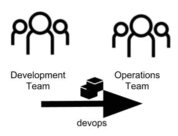
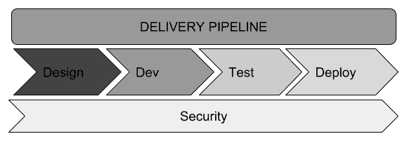
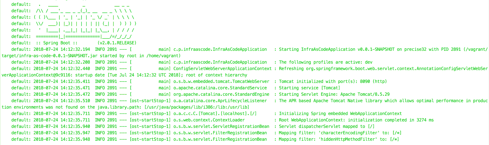
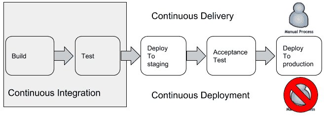
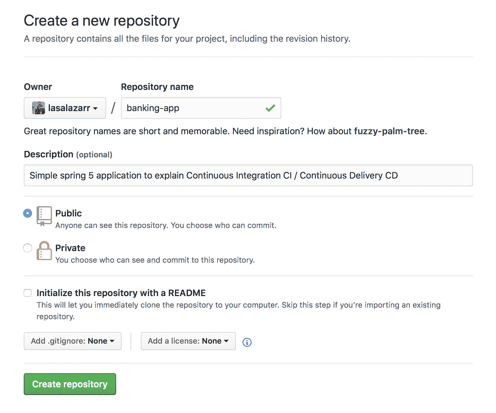
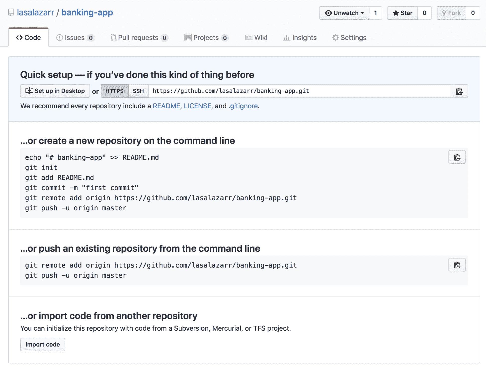
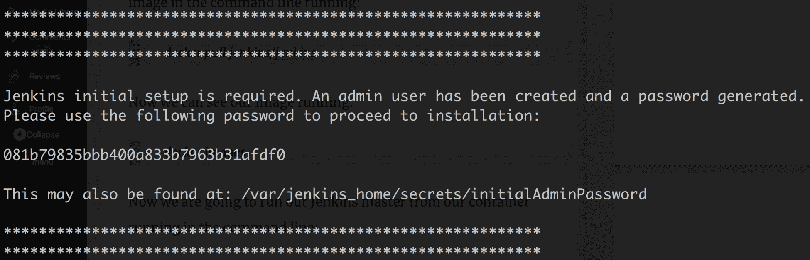
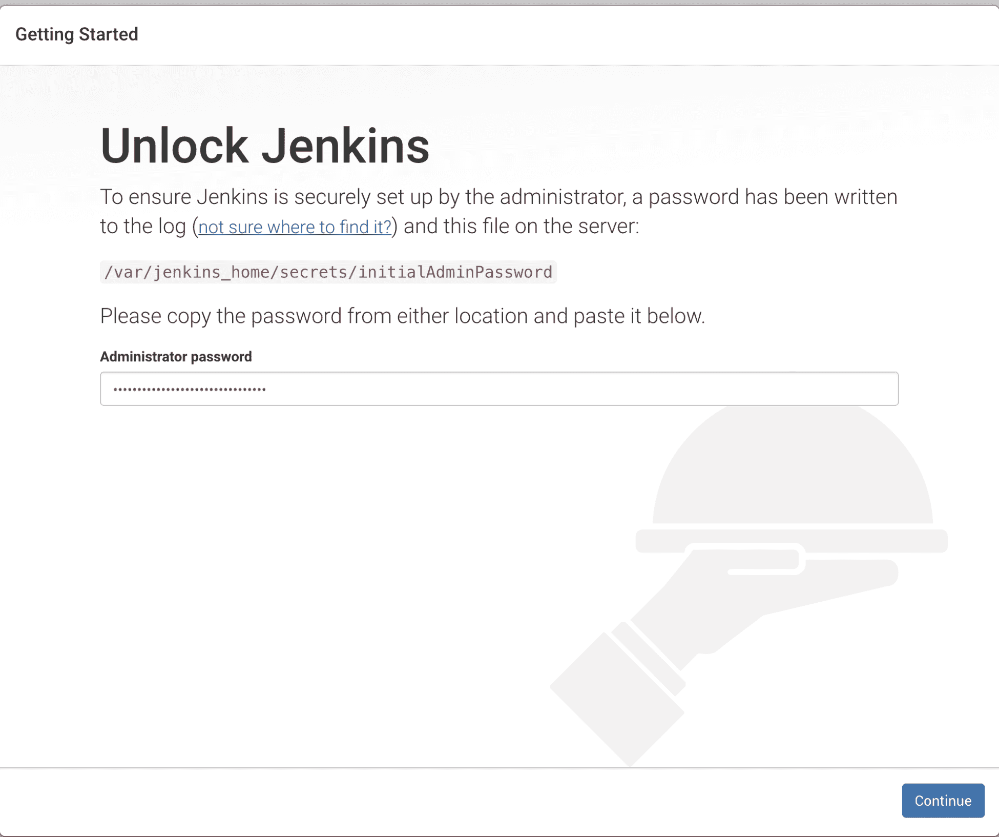
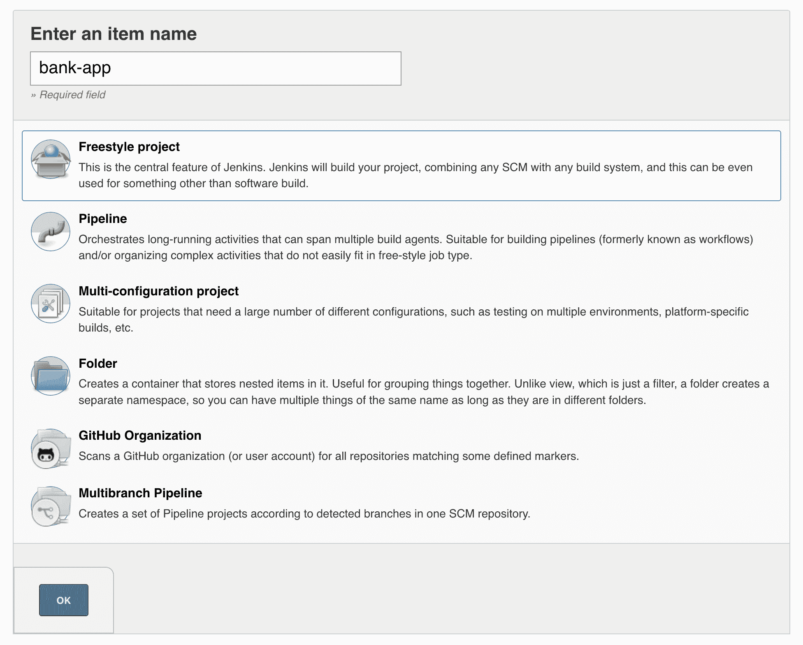
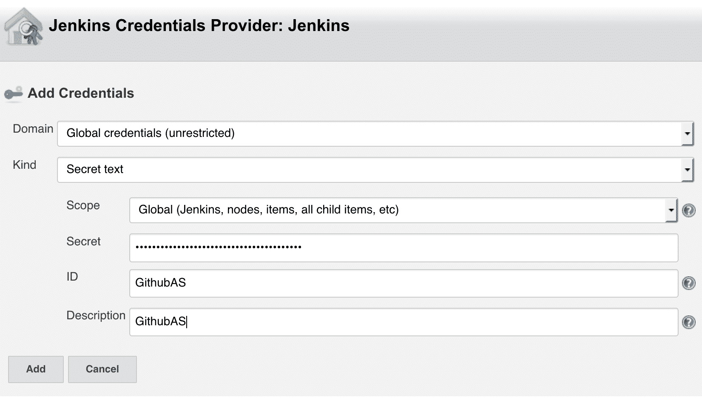

# DevOps 和发布管理

DevOps 是一项重要的技术，它可以帮助团队防止他们的工作变得孤立。它还有助于在整个软件开发周期中消除无聊的过程和不必要的官僚作风。这种技术贯穿于整个软件开发过程，从编写代码到部署应用程序到生产。

本章将演示如何通过采用自动化来实现这些目标，以减少手动任务的数量，并使用负责验证编写的代码、资源调配基础设施和将所需工件部署到生产环境中的自动化管道来部署应用程序。在本章中，我们将回顾以下主题：

*   筒仓
*   德沃斯文化动机
*   德沃斯领养
*   拥抱自动化
*   作为代码的基础设施
*   使用 Spring 框架应用 DevOps 实践
*   发布管理管道
*   连续交付

# 筒仓

几年前，软件行业使用瀑布模型来管理**系统开发生命周期**（**SDLC**）。瀑布模型包括许多阶段，例如收集需求、设计解决方案、编写代码、验证代码是否满足用户需求，以及最终交付产品。为了在每个阶段工作，创建了不同的团队和角色，包括分析师、开发人员、软件架构师、QA 团队、操作人员、项目经理等等。这些角色中的每一个都负责生成输出并将其交付给下一个团队。

使用瀑布模型创建软件系统所需的步骤如下：

1.  分析人员收集软件需求
2.  软件架构师仔细地审查需求，并用将要使用的工具和技术、创建系统必须编写的模块、显示组件如何连接以作为一个整体工作的图表等信息来扩展文档
3.  开发人员遵循架构师发布的指示，编写应用程序代码
4.  QA 必须验证所创建的软件是否按预期工作
5.  操作团队部署该软件

从这些步骤中您可能会注意到，在每个阶段，不同的团队都在生成定义良好的输出，并将其交付给下一个创建链的团队。这个过程完美地描述了团队是如何使用筒仓心态工作的。

这种软件生产过程乍一看似乎很好。但是，这种方法有几个缺点。首先，不可能在每个阶段产生完美的输出，并且经常产生不完整的工件。因此，专注于自己流程的团队和部门开始较少关注组织中其他人的工作。如果一个团队的成员觉得对另一个团队中出现的问题不太负责，那么这一领域就会出现冲突，因为每个团队都单独工作，彼此之间存在多个障碍，导致沟通中断等问题，从而中断信息的自由流畅流动

# 如何打破筒仓

在上一节中，我们研究了如何组织团队以产生输出。不言而喻的是，每个团队成员大体上都与其他团队成员拥有相同的技能。因此，不可能要求一组分析人员为特定功能编写代码，或提供基础设施以将应用程序部署到生产环境中

打破筒仓的第一步是创建多学科团队。这意味着团队成员应具备不同的技能，以帮助团队解决不同的问题和需求。

理想情况下，每个团队成员都应该具备满足任何需求的所有必要技能。然而，这一目标几乎不可能实现

一旦你有了一个多学科的团队，你可以很容易地让人们在同一个团队中使用竖井式的工作方式。为了解决这个问题，您需要定义一个计划，使每个成员将更多技能作为其投资组合的一部分。例如，您可以使用结对编程技术让开发人员与 QA 专家一起工作。通过这种方式，开发人员将了解 QA 专家的想法，QA 将获得开发技能。

多学科团队在 SDLC 的所有阶段创建协作环境。

# 德沃斯文化

DevOps 有很多定义。我们将使用以下方法：

“DevOps 是一种鼓励运营和开发团队共同工作的文化，而不会剥夺每个团队的特定技能和责任。”

这意味着软件开发团队对他们生成的代码承担责任和所有权。DevOps 改变了人们在 SDLC 中的组织方式和流程。

此区域性消除了筒仓，因为它要求所有角色都参与 SDLC 并协同工作，如下图所示：



打破组织中的筒仓

# 动机

为了理解采用 DevOps 的动机，让我们来看一个在开发软件的公司和组织中经常遇到的常见现实场景。

假设我们在一家尚未在软件开发过程中采用 DevOps 或实践**持续集成**（**CI**）和**持续部署**（**CD**的公司工作。让我们想象一下，这家公司有以下团队负责发布功能或新软件：

*   **开发团队：**该团队使用表示新特性或错误修复的分支编写代码并提交给源代码版本控制系统
*   **运营团队：**该团队在不同的环境中安装工件，例如，通过测试和生产
*   **QA 团队：**该团队从最终用户和技术角度验证生成的工件是否按预期工作，并批准或拒绝生成的代码

每次开发人员发布功能和错误修复时，都会重复此过程。在第一次经历这一常见过程时，我们意识到存在以下几个问题：

*   **不同的环境：**开发代码的环境通常与暂存和生产环境具有不同的环境和配置。

*   **沟通：**基于 DevOps 实践组建多学科团队将有助于我们打破组织中的筒仓。否则，通过会议、电话会议和/或电子邮件解决团队之间缺乏沟通的问题。
*   **不同的行为：**生产环境中产生的 bug 数量与开发环境中产生的 bug 数量相比有所不同。还有一些情况下，bug 根本无法复制。

正如我们所看到的，这里有几个问题我们需要解决。让我们看看如何解决上述每一个问题：

*   **不同的环境**：通过将基础设施作为代码实践，我们可以创建文件，使每个环境都能够与不可变的服务器一起工作，这是我们将在以后关于基础设施作为代码的一节中讨论的概念。
*   **沟通**：基于 DevOps 实践组建一个多学科团队将有助于我们打破相关组织中的筒仓。
*   **不同的行为**：使用基础架构作为代码的方法，我们将能够创建不变的服务器，保证在不同的环境（如开发、测试和生产）中有相同的行为。
*   **上市时间**：应用**连续交付**（**CD**），使我们能够尽快将新功能部署到生产中。

其中大多数是现实场景中的常见问题，这就是为什么一些组织采用 DevOps 的原因。这首先要打破筒仓，这对开发团队有几个好处。例如，它允许他们以更少的错误尽快部署。它还允许他们对变化做出快速反应，使流程更有效率。因此，我鼓励您的组织打破筒仓，变得敏捷，以便快速生成更高质量的应用程序。

# 德沃斯领养

DevOps 的采用满足了组织更快地发布应用程序的需要，最大限度地减少了将软件交付到生产环境中的错误和风险。作为此过程的一部分，我们需要增加用于测试应用程序的自动化过程的数量，强烈建议我们删除手动过程以避免可能导致我们产生错误的人工交互。

可以自动化的两个过程是环境配置和部署过程。让我们看看 SDLC 的改进：


瀑布方法与敏捷方法及 DevOps

然而，为了更快地交付软件，我们必须处理几个问题。首先，我们需要拥抱自动化文化。自动化文化迫使我们使用许多工具，我们将在下一节中介绍这些工具，我们需要了解，由于具有更复杂和分布式系统的微服务的兴起，DevOps 已经成为我们流程中必不可少的一部分。但是，不要忘记 DevOps 的主要目标是协作，而不仅仅是自动化。

# 拥抱自动化

拥抱自动化是采用 DevOps 的关键因素之一。有几种工具可以帮助我们完成这一过程。

我们需要找到能够帮助我们在整个 SDLC 的所有阶段实现流程自动化的工具。这些阶段如下图所示：



组织中的管道

在一个组织内，设计了一个管道来保持软件交付过程的简单。第一步是确定不同的阶段，正如我们在前面的图中所做的那样，然后我们应该选择正确的工具，使每个阶段自动化。让我们回顾与每个阶段相关的阶段和工具/软件：

*   代码（Git、SVN 等）。
*   构建（Maven、Gradle、npm 等）。
*   测试自动化。这还可以包括集成测试（JUnit、Postman、Newman、JFrog、Selenium、Cucumber、Gherkin 等等）。
*   部署（Ansible、Vagrant、Docker、Chef、Puppet 等）。
*   监控（我们将在[第 12 章](12.html)、*监控*中深入讨论监控）。
*   持续集成和持续部署（Jenkins、Hudson 等）。
*   代码分析（Sonatype、Jacoco、PMD、FindBugs 等）。

正如我们在[第 10 章](10.html)*对应用程序进行容器化*中所了解的，我们知道如何提供基于容器的环境，我们需要了解，我们创建的示例也可以作为代码应用于基础设施的概念，我们将在下一节中介绍。

# 作为代码的基础设施

作为代码的 Infrastructure 指的是创建文件的过程，以及用于提供环境的环境定义和过程。DevOps 概念开始在存储库中与代码一起使用这些脚本或文件，以便我们可以确定将在哪个环境中部署哪些代码。使用这些实践，我们可以确保所有服务器和环境都是一致的。

典型的组织或团队将在多个环境中部署其应用程序，主要用于测试目的。当我们有用于开发、登台和生产的环境时，开发人员面临的最大问题是，每个环境都不同，需要不同的属性。

除其他外，这些属性可能包括以下配置：

*   服务器名称
*   IP 地址和端口号
*   服务器队列连接
*   数据库连接
*   资格证书

软件开发的现代时代突然给我们带来了构建基础设施的可测试性、可重复性和透明度。如今的一个关键目标是在内部部署或云环境中重新创建或构建完整的软件环境，除了物理服务器资源外别无他物。

因此，我们应该能够创建数据库实例，使用脚本或备份文件中的初始数据填充它们，并重建源代码以创建可以在任何时候部署的构件。

我们可以使用许多工具将基础架构的概念应用为代码：

*   对于配置同步，我们可以使用 Chef、Puppet 或 Ansible
*   对于集装箱服务器，我们可以使用 Docker 部署新的应用程序版本

我们将要接受的一些关键好处如下：

*   *不可变服务器*，通过在我们的基础架构中重建服务器而不是修改现有服务器来应用更改
*   *测试*对基础设施的更改，这涉及到使用我们可以在应用程序和基础设施的不同阶段测试的文件复制环境

下图显示了在每个阶段重新创建环境这两个关键好处背后的主要思想：


不变的基础设施

配置服务器的自动化流程为我们带来了以下好处：

*   可以自动重新创建任何环境或服务器
*   配置文件可以存储凭据或自定义配置，这些配置对于每个环境都可能不同
*   在不同的阶段，环境总是一样的

在下一节中，我们将创建一些作为代码的基础结构示例。

# Spring 应用程序和 DevOps 实践

Spring 提供了符合 DevOps 原则的现成功能。让我们看看其中的一些

首先，我们将使用[提供的 Spring 初始化器创建一个新的 Spring 引导应用程序 https://start.spring.io](https://start.spring.io/) 。

# 支持不同的环境

交付应用程序的常见场景是，我们在开发环境（几乎总是我们自己的计算机）上编写应用程序，然后将应用程序部署在不同的测试和生产环境中。Spring 配置文件允许我们在每个环境上使用不同的配置。我们可以使用本地配置文件作为应用程序的一部分，然后，我们可以使用环境变量覆盖这些配置值。这是通常需要的，因为我们对部署配置的每个环境使用不同的凭据和配置。

在为我们需要部署应用程序的每个不同环境创建不同的 Spring 配置文件之前，我们将在`/main/resources/static`文件夹后面添加一个带有以下标签的`index.html`静态页面：

```
<!DOCTYPE html>
<html lang="en">
<head>
    <meta charset="UTF-8">
    <title>Welcome devops</title>
</head>

```

在接下来的步骤中，我们将展示 Spring 为 DevOps 提供的一些特性。我们还将完成一个练习，其中我们将为 Docker 容器提供层，这些层将被配置为支持不同的环境，例如开发、测试和生产环境

首先，我们将为我们的应用程序创建一个不同的概要文件。例如，我们可以使用`/infra-as-code/src/main/resources`文件夹中名为`application-dev.properties`、`application-test.properties`和`application-production.properties`的三个文件为开发、测试和生产创建不同的配置文件：


为了了解 Spring 概要文件是如何工作的，我们将更改应用程序使用的端口。用于配置端口的属性为`server.port`。让我们为每个不同的文件更改此值，如下所示：

`application-dev.properties`：

```
server.port = 8090
```

`application-test.properties`：

```
server.port = 8091
```

`application-production.properties`：

```
server.port = 8092
```

# 选择配置文件

在运行支持不同配置文件的应用程序之前，您需要选择所需的配置文件以使用所需的配置文件。可以使用 JVM 参数使用`spring.profiles.active`标志选择配置文件，如下所示：

```
$ java -Dspring.profiles.active=dev -jar target/infra-as-code-0.0.1-SNAPSHOT.jar
```

最后，您可以使用与提供的配置文件关联的端口在浏览器中检查应用程序。`spring.profiles.active`标志的有效值如下：

*   `dev`
*   `production`
*   `test`

如果您没有为标志提供任何值，那么将使用来自`application.properties`的配置。

这是一个在春季探索剖面的简单示例。请记住，通过配置文件，我们还可以配置数据源、队列、bean 以及您需要的任何内容。您始终可以使用环境变量覆盖任何提供的配置变量。

此外，正如我们在[第 10 章](10.html)*中所看到的，将您的应用程序容器化*，我们能够对接 Spring Boot 应用程序，通过这些知识，我们可以了解不可变服务器以及如何测试基础架构更改

在本节中，我们将学习使用 Vagrant（[创建基础设施的类似方法 https://www.vagrantup.com/](https://www.vagrantup.com/) 版本 1.7.0 或更高版本。这可能需要虚拟化软件（例如，VirtualBox:[https://www.virtualbox.org/](https://www.virtualbox.org/) ）。

另一个可以执行相同任务的工具是 Ansible（[http://ansible.com/](http://ansible.com/) ），本章未涉及。

# 流浪汉

Vagrant 是一种旨在重新创建主要用于开发的虚拟环境的工具。该功能基于 VirtualBox，可以使用诸如 Chef、Salt 或 Puppet 之类的资源调配工具。

它还可以与不同的提供商合作，如 Amazon EC2、DigitalOcean、VMware 等。

Vagrant 使用一个名为`Vagrantfile`的配置文件，其中包含提供所需环境所需的所有配置。一旦创建了上述配置文件，`vagrant up`命令用于使用提供的说明安装和配置环境。

在我们继续之前，必须在机器上安装流浪者。为此，请遵循[上提供的工具文档 https://www.vagrantup.com/intro/getting-started/install.html](https://www.vagrantup.com/intro/getting-started/install.html) 。

# 与流浪汉共事

现在，我们将在应用程序的根目录中创建一个`Vagrantfile`配置文件，以创建一个简单的环境。我们将提供一个 Linux 分发环境，即 Ubuntu。`Vagrantfile`的内容如下：

```
# Vagrantfile API/syntax version. Don't touch unless you know what you're doing!
VAGRANTFILE_API_VERSION = "2"

Vagrant.configure(VAGRANTFILE_API_VERSION) do |config|

  config.vm.box = "hashicorp/precise32"

  config.vm.network :forwarded_port, guest: 8090, host: 8090
  config.vm.network "public_network", ip: "192.168.1.121"
  #config.vm.synced_folder "target","/opt"

  config.vm.provider "virtualbox" do |vb|
    vb.customize ["modifyvm", :id, "--memory", "2048"]
  end

  # provision
  config.vm.provision "shell", path:"entrypoint.sh"

end
```

注意`Vagrantfile`第 6 行：

```
config.vm.box = "hashicorp/precise32"
```

我们正在从`hashicorp/precise32`中已经构建的虚拟机盒创建 Linux 环境。

在继续使用 Vagrant 提供环境之前，我们将创建一个`ssh`文件，为我们安装 JDK 8。在项目的根目录下，创建一个包含以下内容的`entrypoint.sh`文件：

```
#!/usr/bin/env bash
sudo apt-get update

echo "Install Java 8.."
sudo apt-get install -y software-properties-common python-software-properties

echo oracle-java8-installer shared/accepted-oracle-license-v1-1 select true | sudo /usr/bin/debconf-set-selections
sudo add-apt-repository ppa:webupd8team/java -y

sudo apt-get update

sudo apt-get install oracle-java8-installer
echo "Set env variables for Java 8.."
sudo apt-get install -y oracle-java8-set-default

# Start our simple web application with specific JVM_ARGS and SPRING_PROFILE
echo "Run our springboot application."
java -Dspring.profiles.active=dev -jar /vagrant/target/infra-as-code-0.0.1-SNAPSHOT.jar
```

然后，要创建框并配置 VM，我们将在控制台上运行以下操作：

```
vagrant up
```

在第一次尝试时，需要几分钟来下载机箱并配置服务器。在这些过程之间，您将被问及将使用哪个网络接口向服务器提供问题*网络应桥接到哪个接口？*。然后您可以选择对您的机器更方便的设备。

在执行的整个输出结束时，我们将看到 Spring 应用程序在配置的服务器上运行，如以下屏幕截图所示：



现在我们可以检查我们的应用程序是否在浏览器的端口`8090`（`http://localhost:8090/`上运行。您可以通过以下命令访问`ssh`来检查 Vagrant 内部运行的 Java 进程：

```
vagrant ssh
```

这将在我们的供应服务器上打开一个`ssh`会话，允许我们查看控制台中已经创建的流程：

```
vagrant@precise32:~$ ps aux | grep java
```

结果的输出将是我们正在运行的 Java 进程，如以下屏幕截图所示：


要停止 VM，我们可以使用控制台中的`vagrant halt`命令：

```
vagrant halt
```

要销毁创建的 VM，可以输入以下内容：

```
vagrant destroy
```

我们刚刚学会使用 Vagrant 将我们的基础设施表示为代码。我们可以使用不同的工具创建不同阶段所需的环境或服务器；我们可以在前一章中回顾这一点。在下一节中，我们将创建一个发布管理过程的示例。

# 发布管理

要将代码投入生产，必须对流程进行规划。

此计划过程称为**发布管理**。在整个过程中，我们需要注意现有服务的完整性和一致性，确保系统的运行。

为了理解发布管理过程中涉及的步骤，我们将研究以下概念：

*   管道
*   连续积分
*   持续交付和持续部署

# 管道

管道是我们为实现目标而必须经历的一系列步骤。我们在[第 7 章](07.html)*管道和过滤器架构*中了解了这一概念。本文中的相同概念用于执行发布管理过程中的一系列步骤。在不同环境中的软件交付过程中，管道将为我们提供帮助。我们将创建一个由五个阶段组成的简单管道：

*   自动构建我们的项目
*   运行测试（如单元和集成）
*   部署到暂存
*   运行验收测试
*   部署到生产环境（包括在云中或内部部署服务器中部署我们的应用程序）

下图显示了管道的外观：



管道 CI/CD

每个阶段都可能有一个或多个任务或作业，例如创建数据库模式、使用 Vagrant 设置一个框、克隆 Docker 容器等等。

上图分为两部分：

*   连续积分
*   连续部署

在接下来的几节中，我们将简要介绍这两个概念。

# 连续积分

持续集成（CI）是指开发人员尽可能多地将其生成的代码合并到主分支中的实践。合并后的代码应该可以正常工作，没有 bug，并且应该为业务提供价值

使用 CI，我们可以通过运行一组自动化测试来自动验证提交的代码。当我们使用这种实践时，我们正在处理 CI 代码库，避免了过去在安排发布构建的特定日期和时间时出现的问题。

使用 CI 方法，最重要的目标是自动化测试，以确保在将新提交推送到主源代码分支时应用程序不会被破坏。

# 持续交付和持续部署

CD 是一个基于 CI 的流程。作为 CD 流程的一部分，我们需要将应用程序部署到生产环境所需的其他步骤，包括配置和调配服务器（基础架构作为代码）、验收测试以及为生产环境准备构建等任务。

在没有*人工*干预的生产环境中部署时，连续部署过程不同于连续交付过程。

我们现在将基于我们的简单管道创建一个示例。为了关注 CI 和 CD 的过程，我们将使用上一章的*Docker Compose*部分中创建的项目，该部分向您展示了如何将应用程序容器化。该项目包括一个准备好使用的完整环境，其中已经包括一个自动化测试。

# 自动化管道

如前所述，对于我们的示例，我们需要几个工具来自动化我们的管道。为此，我们将使用以下方法：

*   代码的 GitHub 存储库：我们可以将代码推送到存储库中，并创建一个自动启动构建和测试的合并
*   Gradle 或 Maven 来构建我们的项目
*   Junit、Postman 和 Newman 来测试自动化
*   Docker 将部署到 ContainerJenkins 中，作为 CI 和 CD 的自动化服务器

首先，我们将把代码推送到存储库。为此，我们将使用 GitHub。如果尚未创建帐户，请创建帐户。

打开终端并转到应用程序的根文件夹。为了方便起见，我们将从机器中推送存储库，因此我们将把项目初始化为存储库。在命令行中，执行以下操作：

```
$ git init
```

命令的输出如下所示：

```
Initialized empty Git repository in /Users/alberto/TRABAJO/REPOSITORIES/banking-app/.git/
```

然后，我们将把所有文件添加到一个新的本地存储库中，如下代码所示：

```
$ git add –A
```

现在我们将在本地提交代码，如以下代码所示：

```
$ git commit -m initial
```

本地提交的输出将打印以下初始行：

```
[master (root-commit) 5cc5f44] initial  40 files changed, 1221 insertions(+)
```

为了推送代码，我们需要在 GitHub 帐户中创建一个存储库。我们可以通过转到“存储库”部分，单击绿色的“创建存储库”按钮，并填写存储库的名称和说明来创建新的存储库，如以下屏幕截图所示：



创建 GitHub 存储库

我们现在有了存储库的 URL，例如，`https://github.com/$YOUR_GITHUB_USER/bank-app`。我们创建的存储库的结果将如以下屏幕截图所示：



GitHub 存储库

根据 GitHub 中给出的说明，我们现在需要使用命令行将代码推送到存储库：

```
$ git remote add origin https://github.com/lasalazarr/banking-app.git
```

然后，我们将更改从本地存储库推送到 GitHub 存储库，如下代码所示：

```
$ git push -u origin master
```

现在，我们可以查看 GitHub 帐户存储库中的代码，并根据建议添加一个`README`文件来解释应用程序的用途。

在下一节中，在继续练习之前，我们将了解 CI 服务器的概念。

# 詹金斯

Jenkins 是一个持续集成服务器，负责自动化我们的管道。在与 Git 存储库集成以自动构建应用程序之前，让我们回顾一下 CI 服务器背后的关键概念：

*   **管道**：管道由一组顺序步骤组成，这些步骤将按顺序排列。管道也是我们可以并行化任务的地方。
*   **作业**：这是一个小的工作单元，比如*运行测试*或者*拉我们的代码*。
*   **队列**：表示 CI 服务器有能力运行的所有队列作业。
*   **插件**：这些是我们可以添加到 CI 服务器的功能。例如，我们可以使用一个插件连接到 Git 存储库。
*   **主/从**：主是可以将工作委托给从客户端机器以扩展 CI 的主机。

詹金斯有不同的分配方法。我们可以在[上看到有关该项目的更多详细信息 https://jenkins.io/download/](https://jenkins.io/download/) 。在我们的示例中，我们将使用一个随时可用的 Docker 映像。

由于我们已经安装了 Docker，我们可以通过运行以下命令在命令行中提取 Jenkins 映像：

```
$ docker pull jenkins/jenkins
```

现在，我们可以通过运行以下命令查看图像：

```
$ docker images
```

现在，我们将通过在命令行中运行以下命令，从容器中运行 Jenkins master：

```
$ docker run -p 8080:8080 -p 50000:50000 -v jenkins_home:/var/jenkins_home jenkins/jenkins:lts
```

注意生成管理员密码的控制台输出，如下图所示：



生成詹金斯密码

我们现在可以看到 Jenkins 服务器正在使用`http://localhost:8080/`运行。

第一步是粘贴我们刚才在控制台上看到的管理员密码，如以下屏幕截图所示：



解锁詹金斯

我们现在要安装建议的插件，这需要一段时间。然后，我们将通过创建管理员用户和 URL 来继续此过程。

我们将启用构建触发，因此我们将配置 Jenkins 实例以从 GitHub 接收推送通知。要执行此操作，请执行以下步骤：

1.  进入詹金斯主页（`http://localhost:8080`，然后点击左侧菜单中的**新项目**图标。
2.  输入项目名称并选择“自由式项目”。完成此操作后，单击确定按钮，如以下屏幕截图所示：



3.  Jenkins 将显示一个页面，其中应配置作业步骤。首先，输入创建的项目和 GitHub URL 存储库的描述，如以下屏幕截图所示：


4.输入 GitHub 用户帐户的凭据，如以下屏幕截图所示：



5.最后，在页面末尾，选择 Gradle 作为项目的构建工具：


创建的作业可以配置为在每次向 GitHub 提交代码时触发。作业将下载代码，运行测试，并使用 Gradle 生成可部署工件（JAR 文件）。您可以在此作业中添加其他步骤，以在 Docker Hub 中构建、标记和推送 Docker 映像，然后将其自动部署到本地或基于云的服务器上。

# 总结

在本章中，我们已经熟悉了 DevOps 文化的含义以及它如何影响组织的流程。我们还研究了如何自动化服务器的检测过程，使用诸如基础架构之类的技术作为代码来实现自动化。此外，我们还学习了如何构建能够从存储库获取最新实现的功能、验证代码、在不同级别上运行测试以及将应用程序投入生产的管道。在下一章中，我们将讨论围绕应用程序监控的问题，以及为什么关注它们如此重要