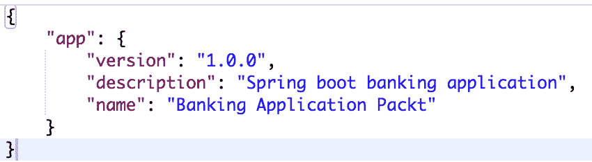
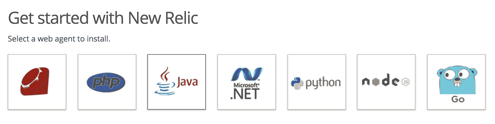
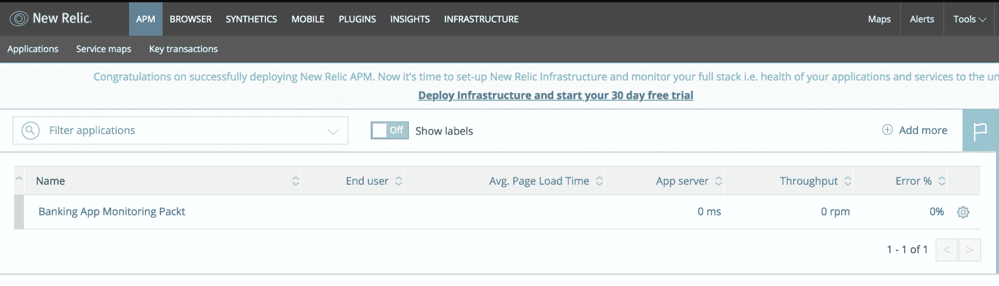
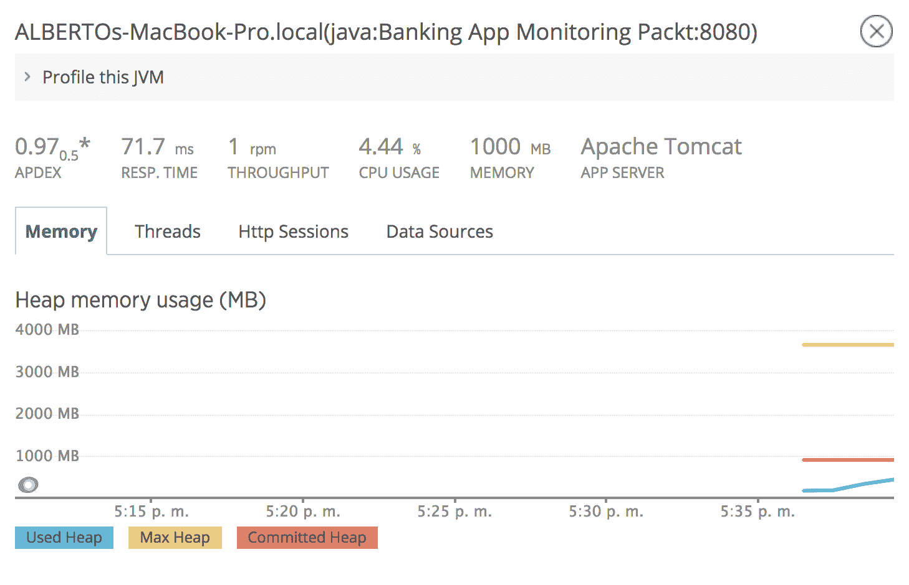
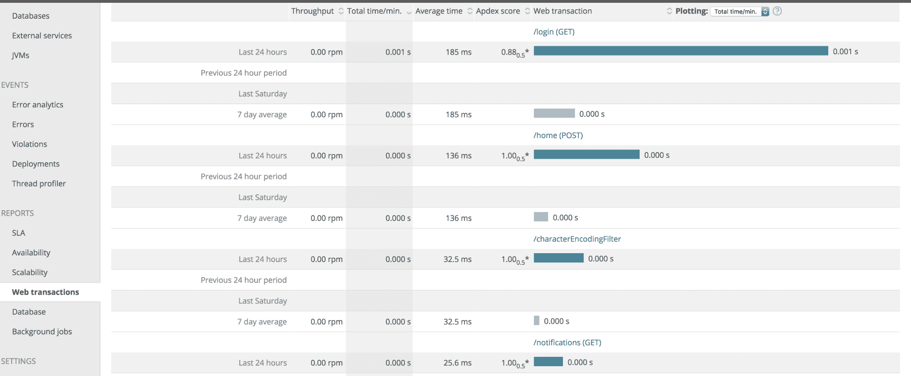

# 十二、监测

一旦将应用部署到生产环境中，监控就是其中一个关键方面。在这里，我们需要控制不寻常和意外的行为；了解应用的工作方式非常重要，这样我们就可以尽快采取行动来解决任何不希望出现的行为。

本章给出了一些关于可用于监控应用性能的技术和工具的建议，同时考虑到技术和业务指标。

在本章中，我们将介绍以下主题：

*   监测
    *   应用监控
    *   业务监控
*   监视 Spring 应用
*   APM 应用监视工具
    *   响应时间
    *   数据库度量
    *   JVM 度量
    *   网络交易

# 监测

创建每个应用都是为了解决特定的业务需求和实现特定的业务目标，因此定期评估应用以验证这些目标是否已实现是非常必要的。作为验证过程的一部分，我们希望使用能够让我们深入了解以下因素的指标来衡量应用的运行状况和性能：

*   **应用监控**：当我们谈论应用的运行状况时，了解正在使用的资源量很重要，例如 CPU、内存消耗、线程或 I/O 进程。识别潜在的错误和瓶颈对于了解我们是否需要扩展、调优或重构代码非常重要。
*   **业务监控**：这些指标有助于了解业务本身的关键业务指标。例如，如果我们有一家在线商店，我们想知道我们是否正在实现既定的销售目标，或者在银行应用中，我们想知道我们在某个分支机构、渠道等收到多少交易和客户。

我们将使用在[第 5 章](05.html)、*模型视图控制器架构*中创建的银行应用，举个例子，列出一些可以应用于它的监控概念。让我们开始展示如何使用 Spring 框架提供的工具监控前面提到的应用。

# 监视 Spring 应用

Spring 框架具有一些内置功能，用于监视和提供度量来了解应用的运行状况。我们有多种方法可以做到这一点，因此让我们回顾一下其中的一些方法：

*   我们可以使用一种老式的方法，即围绕方法创建拦截器，以记录我们想要记录的所有方法。
*   弹簧执行器可用于侧弹簧靴应用。使用此库，我们可以查看应用的运行状况；它提供了一种通过 HTTP 请求或 JMX 监视应用的简单方法。此外，我们可以使用工具对生成的数据进行索引，并创建有助于理解度量的图形。创建图形有很多选项，包括：
    *   麋鹿堆（ElasticSearch、Logstash 和 Kibana）
    *   Spring 开机管理
    *   普罗米修斯
    *   电报
    *   涌入，以及
    *   格拉法纳等

弹簧执行器可以集成为现有弹簧启动应用的一部分，并添加以下依赖项作为`build.gradle`文件的一部分：

```java
compile('org.springframework.boot:spring-boot-starter-actuator')
```

如果我们正在使用**Maven**，我们将添加以下依赖项作为`pom.xml`文件的一部分：

```java
<dependency>
    <groupId>org.springframework.boot</groupId>
    <artifactId>spring-boot-starter-actuator</artifactId>
</dependency>
```

致动器支持许多必须在`application.properties`文件中提供的配置。我们将向该文件添加一些属性以提供元数据，例如应用的名称、描述和版本。此外，我们将在禁用安全模型的另一个端口中运行执行器端点：

```java
info.app.name=Banking Application Packt
info.app.description=Spring boot banking application
info.app.version=1.0.0
management.port=8091
management.address=127.0.0.1
management.security.enabled=false
```

然后，在运行应用之后，由执行器提供的一些端点将可用。让我们回顾一下其中的一些：

*   **运行状况**：该端点在`http://localhost:8091/health`URL 中提供了一些关于应用运行状况的一般信息：


健康终点结果

*   **信息**：该端点提供应用元数据的相关信息，该元数据以前在`application.properties`文件中配置过。有关信息，请访问`http://localhost:8080/info`：



信息端点结果

*   **指标**：提供操作系统、JVM、线程、加载类、内存等信息，可在`http://localhost:8080/metrics`查看：


指标端点结果

*   **跟踪**：这提供了有关最近向我们的应用发出的请求的信息。我们可以在`http://localhost:8080/trace`查看此信息：


跟踪端点结果

如果我们想查看所有端点，可以在 spring 的官方文档中找到这些端点：[https://docs.spring.io/spring-boot/docs/current/reference/htmlsingle/#production-准备好端点](https://docs.spring.io/spring-boot/docs/current/reference/htmlsingle/#production-ready-endpoints)。

正如我们在 Actuator 库中看到的，我们在某个时间获取应用的快照，了解应用的状态和运行状况，甚至跟踪最常用的端点。

有时，提供的信息就足够了。如果您希望获得图形并检查历史数据，那么应该集成我们前面提到的工具。

SpringActuator 还提供了收集有关应用的自定义度量的能力；这有助于收集业务指标。例如，如果我们正在使用一个应用创建储蓄帐户，我们可以收集指标以了解创建了多少帐户。然后，在开设更多的分支机构后，我们可以看到创建了多少账户，并计算出它对业务本身的影响

当我们收集业务指标时，关键因素是理解什么对业务很重要。为了完成这项任务，与商界人士合作非常重要

业务指标也有助于理解我们在发布新功能后产生的影响。它还有助于理解意外的行为或 bug。假设您使用不同的电子邮件提供商推出新的应用版本；您应该将更改后发送的电子邮件数量与更改电子邮件提供商之前发送的电子邮件数量进行比较。如果你发现这些数字有很大差异，你需要检查发生了什么，因为差异不应该太大。如果您想了解如何创建自定义指标，我建议您访问以下链接：[https://docs.spring.io/spring-boot/docs/current/reference/html/production-ready-metrics.html](https://docs.spring.io/spring-boot/docs/current/reference/html/production-ready-metrics.html)

市场上有许多工具允许我们在不更改代码的情况下监控应用，这些工具被称为**应用性能管理**工具（**APM**。我们将在下一节中回顾这些如何工作。

# 应用性能管理（APM）工具

自云计算兴起以来，监控和工具出现了巨大的变化；有些工具和公司只是完全使用 APM 工具。其中一些工具基于 JVM 和字节码检测，今天这些工具已经发展到甚至可以测量应用的用户体验。目前最受欢迎的是：

*   新文物（[https://newrelic.com/](https://newrelic.com/) ）
*   应用动态（[https://www.appdynamics.com/](https://www.appdynamics.com/) ）
*   动态跟踪（[https://www.dynatrace.com/technologies/java-monitoring/spring/](https://www.dynatrace.com/technologies/java-monitoring/spring/) ）
*   数据狗（[https://www.datadoghq.com/](https://www.datadoghq.com/) ）

所有这些工具都使我们能够监视应用层、运行状况（CPU、内存、线程、I/O）、数据库和顶级 SQL 查询。它们还允许我们检测瓶颈、业务指标和响应时间。例如，我们将使用 New Relic 监控我们的应用。

# 新遗迹

New Relic 是一种为整个环境而不仅仅是应用提供工具的工具。因此，我们可以监视应用的整个环境，包括数据库、应用服务器、负载平衡器等因素。

例如，我们将在以下链接（[中创建一个试用帐户 https://newrelic.com/signup](https://newrelic.com/signup) ）。注册 New Relic 帐户后，您将被引导到控制面板，如以下屏幕截图所示：


我们将通过以下步骤继续此过程：

1.  选择监控应用并接受 14 天免费试用：


2.  选择 Java 应用选项：



3.  生成许可证密钥并下载并安装代理。在这里，我们将在应用的根目录中创建一个文件夹名`newrelic`，并复制最近下载的 ZIP 的内容：


4.  我们现在将用我们的密钥许可证和应用名称替换`newrelic.yml`，如以下屏幕截图所示：


5.  重新启动应用，包括`javaagent`参数，如下所示：

```java
-javaagent:/full/path/to/newrelic.jar
```

6.  在我们的示例中，使用代理运行应用的步骤如下所示：

```java
java -javaagent:newrelic/newrelic.jar -jar build/libs/banking-app-1.0.jar
```

最后，我们可以看到我们在`newrelic.yaml`文件中定义的同名 new relic 仪表板（银行应用监控包）。这将包含我们申请的所有信息：



您还可以多次导航到该应用，以查看提供给 APM 的更多数据。

然后，我们可以深入了解所提供的信息，包括以下内容：

*   响应时间：


*   数据库指标：


*   JVM 指标：



*   网上交易：



您可以浏览左侧菜单中的所有选项卡，以查看我们应用的更多指标。正如我们所了解到的，使用所有这些工具，我们可以确保应用的健康，并检查我们是否没有问题和瓶颈。然后，您可以继续探索 APMs。

# 总结

在本章中，我们学习了如何从技术和业务角度收集有关指标的有用指标。我们还学习了如何使用 APMs 监控我们的环境，并获取我们需要的信息，以便了解大多数使用的事务的运行状况、状态和统计信息，包括应用的响应时间。所有这些信息将有助于我们在生产中维护应用，并快速响应任何可能的性能问题。

在下一章中，我们将回顾安全实践以及如何使用 Spring 编写它们。