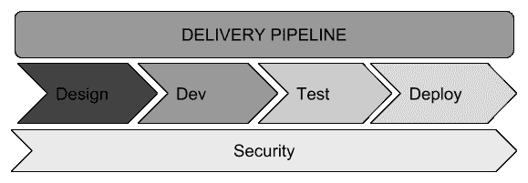
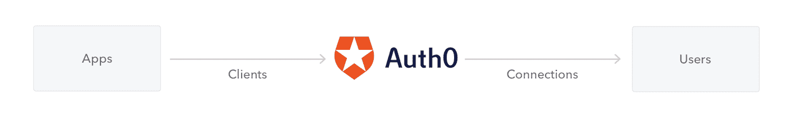

# 安全

安全性是一个团队在开发其产品时通常不会密切关注的领域。在编写代码时，开发人员应该记住几个关键注意事项。本章中列出的大多数注意事项是显而易见的，但其他注意事项则不是，因此我们将讨论所有这些事项。

本章将介绍以下主题：

*   为什么安全性作为应用程序体系结构的一部分很重要
*   确保软件安全的主要建议：
    *   认证和授权
    *   加密
    *   数据输入验证
    *   敏感数据
    *   社会工程
    *   渗透测试
*   身份验证即服务

我们将首先介绍安全性作为应用程序体系结构一部分的重要性。

# 为什么安全性作为应用程序体系结构的一部分很重要

在过去几年中，我看到许多组织或公司在投入生产后重新审视其软件安全问题的案例。这通常发生在他们的系统面临安全问题或他们的业务由于停机或数据泄露而赔钱时

众所周知，安全问题和过程应作为**软件开发生命周期**（**SDLC**的一部分。由于安全性是每个应用程序都应考虑的一个方面，因此必须确保我们的应用程序和代码具有安全约束，使我们能够在所有阶段（设计、开发、测试和部署）对软件充满信心：



作为 SDLC 一部分的安全性

我们的主要目标应该是在将应用程序交付到生产环境之前防止其受到损害。这样可以避免暴露敏感数据，并确保在设计应用程序时牢记可能存在的漏洞。理想情况下，我们应该在客户使用我们的系统之前解决所有安全问题。作为开发人员，我们通常只接收功能需求。但是，有时我们没有收到安全要求。在开发代码和应用程序时，我们必须像关注性能、可伸缩性和其他非功能性需求一样关注安全性。

在编写旨在避免安全威胁的软件时，应记住以下几个关键方面：

*   系统很难解密
*   应在 SDLC 的每个阶段测试系统安全性
*   应针对应用程序执行渗透测试
*   系统中应确保安全的端到端通信
*   应在应用程序代码中应用反钓鱼实践

在下一节中，我们将提供一组建议，以解决 SDLC 过程中的安全问题。

# 主要安全建议

有几种类型的攻击可针对系统或网络，并可用于建立通信。常见的例子包括病毒、恶意软件、网络钓鱼、鱼叉式网络钓鱼、**拒绝服务**（**DoS**等。每年都会发现更多复杂的攻击，攻击目标多种多样。在本节中，我们将重点介绍**有关 web 和移动应用程序的代码和环境安全的关键安全建议。**

 **有几种过程和模型可用于确保 web 和移动应用程序的安全性。在接下来的部分中，我们将探讨保护您的软件免受常见安全威胁的主要建议。

# 认证和授权

身份验证最简单的定义是验证用户身份的过程；授权是验证经过身份验证的用户可以做什么的过程。例如，当我们以用户身份登录计算机时，我们被授予访问权限，允许我们使用可用资源（包括文件、应用程序等）执行操作。

在我们创建的应用程序中，身份验证是验证对应用程序访问的过程，而授权是保护我们的资源（如页面、web 服务、数据库、文件、队列等）的过程。在身份验证过程中，我们验证使用应用程序的用户的身份。身份验证包括以下过程：在提供有效凭据之前阻止对应用程序的访问、多因素身份验证（如安全映像）、**一次性密码（OTP）**、令牌等。

关于实现，在前面的章节中，我们已经使用 SpringSecurity 创建了一些应用程序示例，SpringSecurity 是一个可用于保护 Java 应用程序的可扩展框架。Spring 安全性还可以用于处理身份验证和授权，它使用的声明式风格不会干扰现有代码。

如今，有几种身份行业标准、开放规范和协议规定了如何设计身份验证和授权机制，包括以下内容：

*   **基本认证**：这是最常用的方法，包括在每次请求时发送用户名和密码。我们已经在我们的银行应用程序示例中使用 Spring Security 实现了此方法，我们在[第 10 章](10.html)、*将您的应用程序容器化*、[第 11 章](11.html)、*DevOps 和发布管理*以及[第 12 章](12.html)、*监控*中使用了此方法。
*   **JSON Web 令牌**（**JWT**）：这是一个开放标准，定义了如何建立安全机制来安全地在双方之间交换消息（信息）。这里有几个经过良好测试的库可供使用，我们在[第 4 章](04.html)*客户机-服务器体系结构*中创建了一个示例。该顺序可以如下所示：


JWT 认证流

如前所述，前面的序列图可以帮助我们理解令牌验证的过程。对于身份验证，客户端应将其凭据发送到服务器，服务器将以字符串形式的令牌进行响应。此令牌应用于后续请求。当它们被执行时，如果提供的令牌无效或过期，我们将从服务器收到 401 未授权状态代码。否则，请求将成功。我们前面提到的身份验证机制遵循基本身份验证模型，这是 web 应用程序的首选。然而，当您编写 API 时，您将需要其他方法来处理基于令牌（如 JWT）使用的安全性。如果您没有编写 API，那么可以使用 JSON Web 令牌 RFC（[来保护您的应用程序 https://tools.ietf.org/html/rfc7519](https://tools.ietf.org/html/rfc7519) ）。

今天，这是验证移动应用程序、现代单页应用程序（SPA）和 REST API 的最常用方法。

让我们回顾一下围绕使用令牌的身份验证机制创建的一些标准：

*   **OAuth**（**开放授权**）：这是基于令牌的身份验证和授权的开放标准，允许使用第三方参与者委托身份验证过程。只有当您有三方需要您的用户数据时，才应使用此标准：您自己、您的用户和第三方应用程序开发人员。
*   **OAuth 2**：这是 OAuth 标准的一个更为完善的版本，它允许用户授予有限的访问权限，以将资源从一个应用程序传输到另一个应用程序，而无需提供其凭据。无论何时使用 Google 或 GitHub 帐户登录站点，都应使用此标准。这样做时，您将被询问是否同意共享您的电子邮件地址或帐户。
*   **完整请求签名**：AWS 认证推广了这一点，并在[第 9 章](09.html)、*无服务器架构*中进行了探讨，当时我们演示了如何将我们的**功能部署为服务**（**FaaS**）。我们通过在服务器和客户端之间共享一个秘密来使用这个概念。客户机使用共享机密对完成的请求进行签名，服务器对其进行验证。有关更多详细信息，请访问[http://docs.aws.amazon. com/general/latest/gr/sigv4_si gning.html](http://docs.aws.amazon.%20com/general/latest/gr/sigv4_si%20gning.html)。 

# 密码学

密码学是将文本信息转换为不可理解文本的过程，反之亦然：从加密文本转换为可理解文本。在我们的应用程序中，我们在创建数据机密性和防止未经授权的修改的过程中使用加密技术。

我们使用加密技术来加密客户端和服务器之间的通信。这是通过使用 HTTPS 的公钥加密实现的，HTTPS 使用**传输层安全（TLS）**协议。TLS 协议是**安全套接字层（SSL）**协议的后续协议。

# 数据输入验证

数据输入验证是指控制在应用程序的每个集成或层中接收的数据的过程。我们需要验证数据输入，以避免在系统中产生任何不一致。换句话说，我们应该验证应用程序中的数据是否一致，并且不会遇到与 SQL 注入、资源对应用程序的控制或服务器等相关的任何问题。更高级的技术包括白名单验证和输入类型验证。

# 敏感数据

这种做法涉及保护敏感数据，并确定如何以正确的方式保护敏感数据。数据敏感性涉及使用加密技术来保护数据机密性或完整性和冗余。

例如，在应用程序用于连接数据库的密码中使用无意义文本是一种常见做法，因此我们通过加密凭据来确保此建议的准确性。另一种情况可能涉及处理银行应用程序并需要提供信用卡号码。在这种情况下，我们会加密这个数字，甚至可能会屏蔽这个数字，使它对人类来说难以辨认。

# 社会工程

为了帮助你理解什么是社会工程，我们将提供一个简单的定义；也就是说，一个人的心理操纵，使该人提供机密信息。

以此定义为起点，社会工程已经成为应用程序难以控制的安全问题。这是因为失败的原因在于，用户是一个人，能够被分析和操纵以交出秘密信息或凭证，从而有可能访问系统。

# OWASP 前 10 名

**开放式 Web 应用程序安全项目（OWASP）**前十名列出了 Web 应用程序中十大最重要的安全风险，并由 OWASP 组织每三年发布和更新一次。我们需要遵循 OWASP 清单，以确保我们的 web 应用程序不会留下安全漏洞。该列表可在**[找到 https://www.owasp.oimg/7/72/OWASP_Top_10-2017_%28en%29.pdf.pdf](https://www.owasp.oimg/7/72/OWASP_Top_10-2017_%28en%29.pdf.pdf) [。](https://www.owasp.oimg/7/72/OWASP_Top_10-2017_%28en%29.pdf.pdf)**

 **2017 年发布的最新检查表包括以下几个方面：

*   A1：注射
*   A2：中断的身份验证和会话管理
*   A3:**跨站点脚本**（**XSS**）
*   A4：不安全的直接对象引用
*   A5：安全配置错误
*   A6：敏感数据暴露
*   A7：缺少功能级访问控制
*   A8:**跨站点请求伪造**（**CSRF**）
*   A9：使用具有已知漏洞的组件
*   A10：未验证的重定向和转发

为了测试和验证其中几个漏洞，我们可以使用 Burp 套件（[https://portswigger.net/burp](https://portswigger.net/burp) ）。这个过程很容易理解，并且会检查应用程序中大多数已知的安全漏洞。作为一种工具，Burp 随 Kali Linux 发行版一起提供，我们将在下一节中对此进行解释。

# 渗透测试

**渗透测试（pen 测试）**是对评估其安全性的系统进行的模拟攻击。对于这个测试，我们可以使用像 Kali Linux（[这样的工具 https://www.kali.org/](https://www.kali.org/)) ），这是一个基于 Debian 的 Linux 发行版，有一个渗透测试平台，该平台有多个工具可用于验证 OWASP 前 10 名，等等。

Kali 有一系列工具，可用于多种目的，如无线攻击、信息收集、利用和验证 web 应用程序等。如果您想查看工具的详细列表，请访问以下链接：[https://tools.kali.org/tools-listing](https://tools.kali.org/tools-listing) 。团队应在将应用程序交付到生产环境之前提供笔测试。

在下一节中，我们将创建一个基于 Spring 安全性的 Java 应用程序。我们将使用 Auth0 作为身份验证和授权服务平台，这是基于 OAuth2 标准和 JWTs 的第三方授权。

# 身份验证和授权即服务

我们将使用 Auth0 作为平台的提供者，作为服务进行身份验证和授权。我们将创建一个这样的示例来保护我们的应用程序；您不必是安全专家就可以实现这一点。以下屏幕截图是从 Auth0 入门指南中借用的：

Auth0 认证和身份验证流程

在我们插入或连接到 Auth0 之后，这将是身份验证和授权服务器，用于在用户每次尝试进行身份验证时验证其身份并将所需信息发送回应用程序。

我们不仅限于 Java；Auth0 为不同的技术和语言提供了多个 SDK 和 API。

使用 Auth0 创建身份验证和授权服务示例的步骤如下：

1.  在[的 Auth0 中创建您的免费开发者帐户 https://auth0.com/](https://auth0.com/) 。
2.  登录到 Auth0 门户并创建应用程序：


Auth0 创建应用程序

3.  为应用程序命名，然后选择常规 Web 应用程序选项，其中包括 Java 应用程序（您还可以创建本机移动应用程序、单页应用程序和**物联网**（**物联网**））：


5.  选择使用 Spring 安全性的示例应用程序。
6.  单击下载应用程序并将项目的文件夹名称更改为`packt-secure-sample`。

要运行该示例，我们需要在我们创建的应用程序的设置选项卡中设置**回调 URL**（`http://localhost:3000/callback`。

要在控制台上运行此操作，请在示例目录中执行以下命令：

```
# In Linux / macOS./gradlew clean bootRun
# In Windowsgradlew clean bootRun
```

您可以在 URL`http://localhost:3000/`处看到该应用程序，如下所示：


请注意，应用程序登录页面重定向到 Auth0。通过第三方应用程序、Google 帐户或 Auth0 提供的凭据登录后，我们将看到以下结果，其中显示生成的令牌：


现在，您已经了解了如何使用 OAuth2 和 JWT 等标准，将 Auth0 作为一个平台，作为服务进行身份验证和授权。

# 总结

在本章中，我们解释了如何应用安全准则和实践，以涵盖应用程序可能遇到的最常见的安全问题。在这里，我们介绍了身份验证和授权、密码学、数据输入验证、敏感数据、OWASP 前 10 名、社会工程和渗透测试。这些概念和方法将增强应用程序的安全性。

在下一章中，我们将回顾高性能技术和建议，以完成使用 Spring5 创建应用程序的过程。****