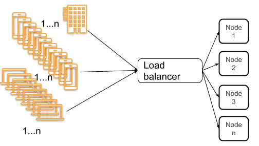
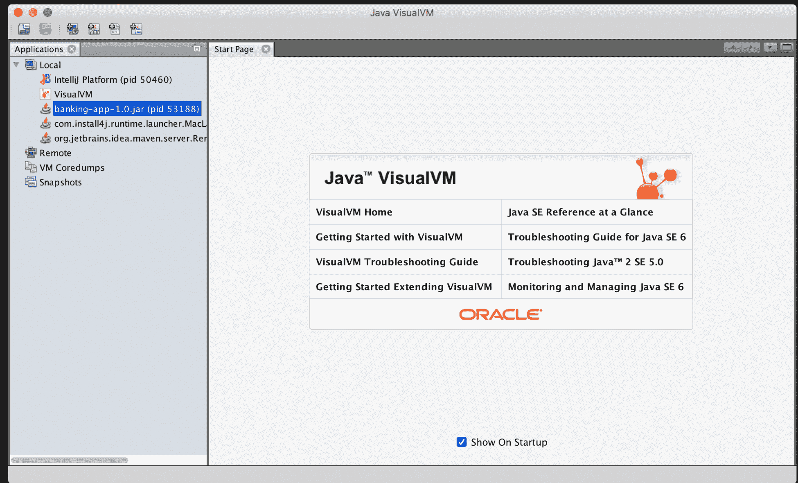
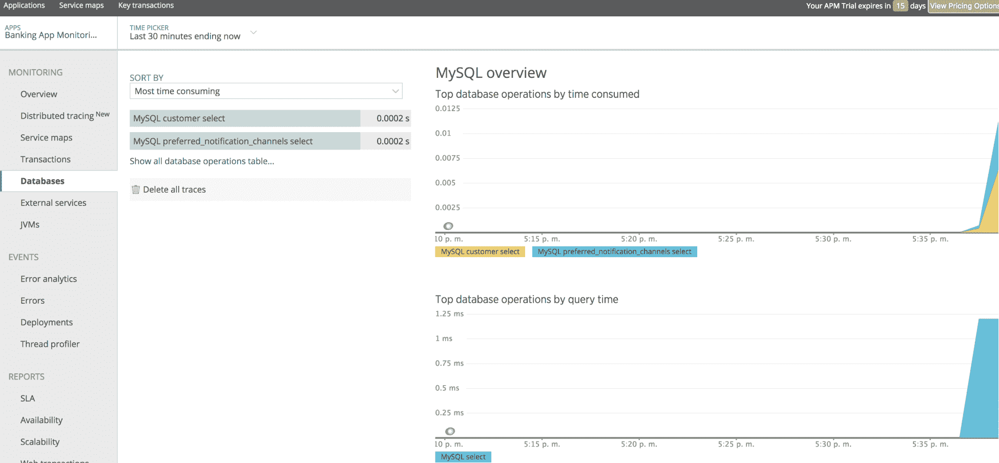
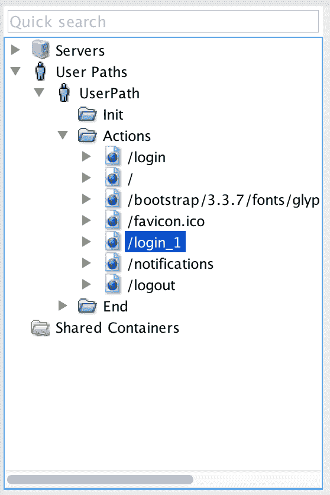
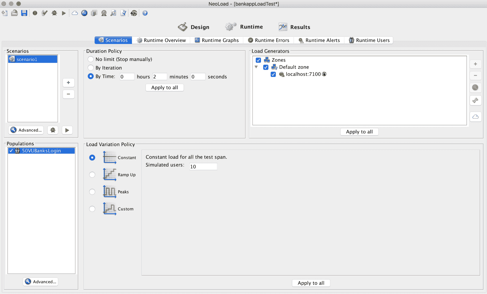
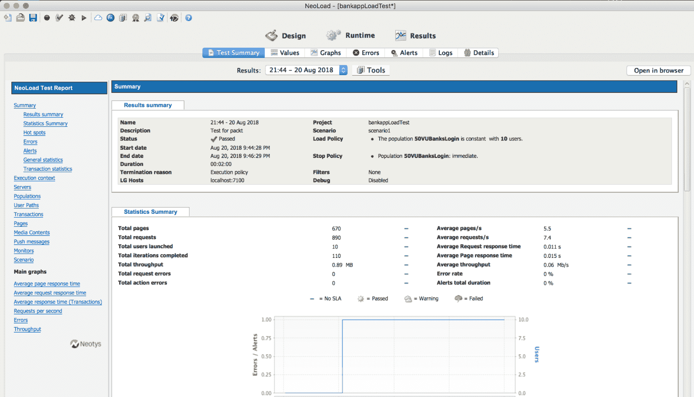

# 高性能

当应用程序以意外的方式运行时，没有什么比不得不处理生产中的问题更令人失望的了。在本章中，我们将讨论一些可以应用的简单技术，以消除这些恼人的问题，将简单的建议应用到您的日常工作中，以确保应用程序的性能。在本章中，我们将回顾以下主题：

*   为什么绩效很重要
    *   可伸缩性
    *   可利用性
    *   表演
*   避免软件出现性能问题的关键建议
    *   分析应用程序
    *   SQL 查询优化
    *   负载测试

让我们从介绍性能的重要性开始。

# 为什么绩效很重要

在过去二十年中，作为一名顾问，我访问了几家政府机构、银行和金融机构，确定了在生产中运行的应用程序缺乏性能的共同因素，并发现了一些常见问题，如果您将一组良好做法作为 SDLC 的一部分，可以避免这些问题。

密切关注性能非常重要，因为它给公司、项目发起人和客户带来了巨大的麻烦，因为面对此问题的应用程序会在多个层面上带来不满。

在给出建议之前，我们将回顾并理解可伸缩性、可用性和性能等非功能性需求。

# 可伸缩性

这描述了系统处理高工作负载的能力，以及根据工作需求增加系统容量以解决更多请求的能力。

# 水平可伸缩性

如下图所示，通过添加具有系统所有功能的附加节点、重新分配请求来解决此问题：


水平可伸缩性

# 垂直可扩展性

我们通过向节点或服务器等添加资源（如 RAM、CPU 或硬盘）来使用垂直扩展来处理系统的更多请求。我看到的一种常见做法是，它向数据库服务器添加了更多硬件，以更好地执行使用它的多个连接；我们只能通过添加更多资源来扩展服务，如下图所示：


垂直可扩展性

# 高可用性

这是指保证系统持续提供服务或资源的能力。此容量与**服务水平协议**（**SLA**直接相关。

SLA 是根据系统的维护窗口计算的，SLA 定义了系统应该扩大还是缩小。

# 表演

这是系统在给定时间间隔内执行任何操作的响应能力。作为软件系统的一部分，我们需要开始定义可测量的性能目标，例如：

*   最小或平均响应时间
*   并发用户的平均数量
*   高负载或并发期间每秒的请求数

作为开发人员，我们今天面临的主要挑战是我们的应用程序必须处理的客户和设备的数量，更重要的是，我们的应用程序是在 internet 上运行还是仅在 intranet 内运行。下图显示了应用程序通常如何部署和使用的拓扑结构：



对系统的高负载请求

在理解了性能、可伸缩性和可用性背后的主要概念之后，让我们回顾一下提高应用程序性能的一些关键建议。

# 避免性能问题的关键建议

通常使用负载测试工具、**应用程序性能监视器**（**APMs**）和分析工具来发现和修复软件系统中的性能问题。为了模拟生产中的用户数量，我们需要为系统最常用的功能运行负载测试创建场景，同时跟踪和监视应用程序运行状况测量资源，如 CPU、RAM、IO、堆使用率、线程和数据库访问。在这些过程的输出中，我们可以给出一些关键建议，以避免您的软件出现性能问题。

在下一节中，我们将解释我们能找到的最常见的瓶颈，以及如何避免它们。

# 识别瓶颈

企业应用程序每天都变得越来越复杂。当业务成功时，支持该业务的应用程序将拥有更多的用户，这意味着每天都会收到更大的负载，因此我们需要注意可能出现的性能瓶颈。

为了理解术语**瓶颈**，我们将给出一个简单的定义。在软件系统中，当一个应用程序或系统的功能开始受到单个组件的限制时，就会出现瓶颈，这就像比较瓶颈使总体水流变慢一样。

换句话说，如果我们的应用程序开始执行缓慢或开始超过预期的响应时间，我们可以看到瓶颈。不同类型的瓶颈可能会出现这种情况，例如：

*   **CPU**：当该资源繁忙且无法正确响应系统时会发生这种情况。当我们开始看到 CPU 的利用率在很长一段时间内超过 80%时，就会出现这种瓶颈。
*   **内存**：当系统没有足够的 RAM 或快速 RAM 时会发生这种情况。有时，应用程序日志会显示内存不足异常或内存泄漏问题。
*   **网络**：与缺乏必要带宽相关
*   应用程序本身、代码问题、太多无法控制的异常、资源使用不当等等

使用 APM 识别瓶颈是一种很好的方法，因为 APM 可以在不降低应用程序性能的情况下收集运行时信息。

为了识别瓶颈，我们可以使用一些实践；负载测试和监视工具，或分析工具。以下部分介绍分析工具。

# 分析应用程序

我们可以查看代码并开始分析我们怀疑存在性能问题的系统部分，也可以使用分析程序获取整个系统的信息。这些工具收集运行时数据，并根据 CPU、内存、线程、类和 I/O 监控资源消耗。

有几种工具可用于分析 Java 应用程序，包括：

*   JVM 附带的工具，如 VisualVM、JStat、JMap 等
*   专用工具，如 JProfiler、Java Mision Control 和 Yourkit
*   APM 附带的轻型探查器，如我们在[第 12 章](12.html)、*监控*中看到的，使用 New Relic

# 可视虚拟机

这是一个集成为 JDK 一部分的可视化工具，JDK 具有评测应用程序的功能。让我们运行前几章中的银行应用程序，回顾一下我们可以使用它收集哪些信息。

要运行上一个银行应用程序，请转到项目文件夹并通过命令行运行以下命令：`java -jar build/libs/banking-app-1.0.jar`。

现在，我们将使用 VisualVM 收集有关 JVM 的一些指标。我们可以使用以下命令从控制台运行此工具：

```java
$ cd JAVA_HOME/bin
$ jvisualvm
```

我们将看到一个类似于以下屏幕截图的屏幕：



Java VisualVM

使用 Locals 菜单选项，您必须附加要监视的 Java 进程。在本例中，我们将选择 banking-app-1.0.jar。然后，我们应该看到应用程序使用的资源的简历：


VisualVM CPU、RAM、类和线程

还有一个选项卡提供有关线程的信息，如以下屏幕截图所示：


VisualVM 线程

我们可以使用任何我们觉得舒服的工具；Jprofiler 是一个很好的起点，也是一个易于使用的工具，但所有这些工具都为我们提供了类似的信息。我们需要了解并跟踪在应用程序中发现的任何瓶颈可能产生的问题。

调试生产中的性能问题可能是一项困难的任务，在某些情况下很难找到和解决。我们需要一个能够自信地理解瓶颈的工具，因此我们需要尝试不同的工具并进行负载测试，以找到适合我们的工具。

在你知道这是必要的之前不要进行优化；首先，运行应用程序并运行负载测试，看看我们是否能够接近为性能定义的非功能性需求。

# SQL 查询优化

优化企业应用程序的查询和数据访问层是避免瓶颈和性能问题的关键。我们可以将 New Relic 用作 APM，这将帮助我们使用数据库访问图形来检测瓶颈和性能问题。通过这些图形，我们可以找到应用程序使用的 SQL 语句，如果我们继续深入查看信息，可以找到延迟事务或阻塞表，直到我们还可以找到使用的最多 SQL 语句和管理的连接数，如以下屏幕截图所示：



来自 NewRelic 的数据库度量

从应用程序中，我们可以确定最常用的查询，并检查优化它们的机会。我们需要索引或重构代码以获得更好的性能。另一方面，在不使用 APM 或分析工具的情况下，我们可以使用多种技术来改进 SQL 和数据访问层，例如：

*   **查看 SQL 语句**：通过 profiler 或 APM 逐个查看执行和优化的 SQL 语句，应用索引，选择正确的列类型，必要时使用本机查询优化关系。
*   **JDBC 批处理**：使用`prepared`语句进行批处理，Oracle 等一些数据库支持`prepared`语句的批处理。

*   **连接管理**：检查连接池的使用情况，测量并设置正确的池大小。

*   **放大和缩小**：这在*可伸缩性*一节中解释。

*   **缓存**：使用内存缓冲区结构避免磁盘访问。

*   **避免 ORM**：**对象关系映射**（**ORM**工具用于将数据库表作为 Java 对象来持久化信息。但是，在某些情况下，最好使用普通 SQL 语句来避免不必要的连接，这会导致我们同时提高应用程序和数据库的性能。

在下一节中，我们将了解如何模拟虚拟用户，以便为应用程序创建负载测试。

# 负载测试示例

负载测试用于检查应用程序在用于确定数量的并发用户后的行为；并发用户数是针对应用程序将在生产中拥有的用户数而给出的。您应该始终定义一个性能测试套件，使用以下工具测试整个应用程序：

*   新荷载
*   ApacheJMeter
*   爱情追逐者
*   加载用户界面
*   Rational 性能测试仪

我们需要将负载测试和概要文件定义为应用程序管道的一部分，并在性能改进之前和之后运行它。我们将创建一个使用 Neoload 的示例，以查看应用程序示例中的这些关键建议。

首先，我们需要定义一个场景来运行负载测试；在我们的例子中，我们将从[第 12 章](12.html)、*监控*中获取银行应用程序，该应用程序已准备好使用，并定义一个功能通用场景，例如：

1.  用户将使用以下凭据登录：`rene`/`rene`。
2.  然后，用户将单击“通知”菜单。
3.  最后，用户将单击注销链接。

首先，我们将从以下 URL 下载 Neoload:[https://www.neotys.com/download.](https://www.neotys.com/download)

Neoload 为我们提供了一个试用版，我们可以模拟多达 50 个虚拟并发用户。

安装 Neoload 后，我们将打开应用程序并创建一个项目：


然后，我们将单击开始录制，并选择用于录制应用程序的浏览器：


然后，在浏览器中，我们将输入应用程序的 URL:`http://localhost:8080/login`，并以用户身份导航以列出客户的通知集。因此，过程如下：

1.  登录
2.  点击菜单通知
3.  单击注销

选择我们正在录制的主机，在本例中是 localhost，然后按照下面的说明进行操作，直到结束。最后，我们将点击停止录制按钮，我们将在左侧菜单中看到我们的动作被录制：



然后，我们将通过单击鼠标悬停在用户图标上方的复选图标来运行录制的场景：


我们应该看到我们的场景运行时没有错误，模拟一个并发用户，如以下屏幕截图所示：


现在，让我们生成负载测试，创建一个总体（临时用户模拟场景）：


然后，单击运行时图标以使用 10 个并发用户运行负载测试 2 分钟：



然后，单击播放图标：


最后，测试完成后，我们可以检查结果；表示我们在负载测试期间访问了 670 个页面并发出 890 个请求，使用了 20 个并发用户：



另一方面，在使用 VisualVM 进行负载测试期间，我们可以检查应用程序的性能，并查看它在检查线程时的性能，如以下屏幕截图所示：


我们将发现，通过虚拟用户的模拟，JVM、内存和线程看起来与仅在应用程序上导航不同。

在运行负载测试以确定问题可能出现的位置时，监视应用程序的所有资源是值得的

最后，我们了解到，除了负载测试工具之外，使用探查器工具或 APM 还可以确保在将代码发布到生产环境之前，我们的应用程序和系统能够在性能改进方面发挥作用。

在添加代码以提高应用程序的性能之后，最好运行性能测试，以检查更改的实现情况。

# 总结

在本章中，我们解释了可伸缩性、可用性和性能的含义。我们还学习了如何应用一些技术和工具来避免在生产中处理性能问题，以及如何提高应用程序的性能以实现更好的响应时间。