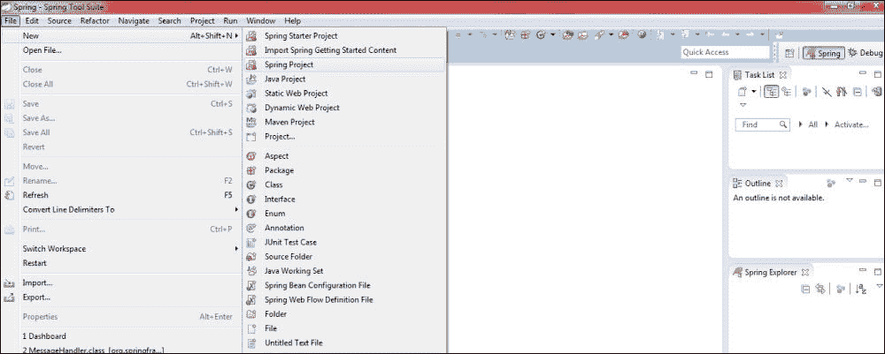
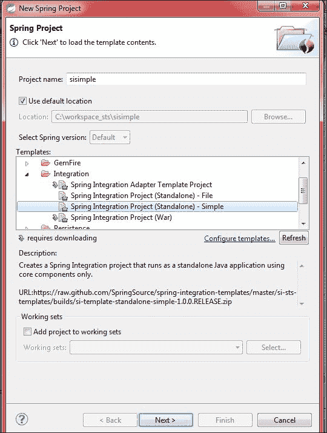
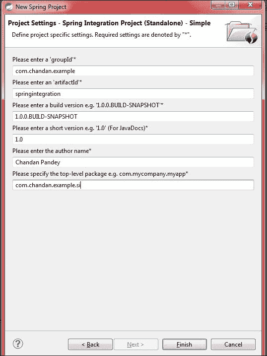
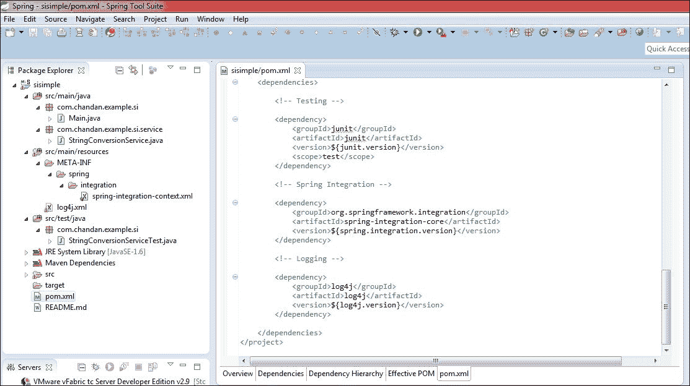

# 第一章开始

在本章中，我们将设置开发环境，并讨论如何最大限度地利用**SpringSource 工具套件**（**STS**。尽管任何流行的 Java 开发 IDE，如*Eclipse*、*intelliJ*、*NetBeans*等，都可以用于开发 Spring 集成解决方案，但 Spring 集成的先锋 pivotal 公司建议您使用**STS**这是一个基于 Eclipse 的 IDE。

# 设置 STS

STS 附带了许多现成的插件、可视化编辑器和其他功能，从而简化了 Spring 驱动的企业应用程序的开发。IDE 的外观和感觉与 Eclipse 非常相似。按照以下步骤安装 STS：

1.  JDK 1.6 和上面的是一个先决条件，从[下载并安装 http://www.oracle.com/technetwork/java/javase/downloads/java-archive-downloads-javase6-419409.html](http://www.oracle.com/technetwork/java/javase/downloads/java-archive-downloads-javase6-419409.html) 。
2.  按照[文档中的说明设置`JAVA_HOME`属性 https://docs.oracle.com/cd/E19182-01/820-7851/inst_cli_jdk_javahome_t/index.html](https://docs.oracle.com/cd/E19182-01/820-7851/inst_cli_jdk_javahome_t/index.html) 。
3.  从[下载 STShttp://spring.io/tools/sts](http://spring.io/tools/sts) 。
4.  下载的文件是 ZIP 格式的。将其解压缩到首选文件夹，即可完成所有设置。
5.  转到`<installation-directory>\sts-bundle\sts-3.6.1.RELEASE`。`STS.exe`文件是启动 IDE 的可执行文件。
6.  此步骤是可选的，但有助于操作系统编辑器的有效运行更改内存分配参数。找到`STS.ini`（与`STS.exe`在同一文件夹中）并更改`Xmx`的值。对于 2GB，我将其设置为`Xmx2048m`。

# 创建您的第一个项目

以下步骤将帮助您创建第一个项目：

1.  Create a Spring Integration project by navigating to **File** | **Spring Project**, as shown in the following screenshot:

    

2.  Under the templates section, select **Spring Integration Project - Simple**. Provide a project name, for example, `sisimple`, as shown in the following screenshot:

    

3.  Fill in the information required to create a Maven-based project, as shown in this screenshot:

    

4.  Click on **Finish**; this will create a project with the name that was provided by us (`sisimple`), as shown in this screenshot:

    

这个项目尽可能简单。让我们来看看下面几点生成的 java 类：

*   `Main.java`：此文件位于路径：`/sisimple/src/main/java/com/chandan/example/si/`。它具有 main 方法，将用于运行此示例。在软件包浏览器中右键单击此文件，然后单击**作为****Java 应用程序**运行-这将启动程序。此类具有引导 Spring 集成配置文件并加载其中定义的组件的代码。此外，它将用户输入转换为大写。
*   `StringConversionService.java`：此文件位于路径：`/sisimple/src/main/java/com/chandan/example/si/service/`。这是用于将用户输入转换为大写的服务接口。
*   `spring-integration-context.xml`：此文件位于路径：`/sisimple/src/main/resources/META-INF/spring/integration/`。它是 Spring 集成配置文件。它包含基于 XML 的 Spring 集成组件声明。
*   `log4j.xml`：此文件位于路径：`/sisimple/src/main/resources/`。它是`Log4j`配置文件。可以对其进行编辑以控制日志级别、附加器和其他日志相关方面。
*   `StringConversionServiceTest.java`：此文件位于路径：`/sisimple/src/test/java/com/chandan/example/si/`。这是`StringConversionService`的测试文件。这将用于对服务类运行测试。
*   `pom.xml`：用于 rmaven 依赖关系管理的文件，位于`/sisimple/`中。它包含项目使用的所有依赖项的条目。

在没有建立一些理论概念的情况下解释这些类和配置文件中的每个组件将有点繁重和过早。我们将在章节中详细讨论每个元素。

# STS 可视化编辑器

STS 提供了添加不同名称空间的可视化方法。在`/sisimple/src/main/resources/META-INF/spring/integration/`下方找到`spring-integration-context.xml`并打开。这是默认的 Spring 配置文件。点击**名称空间**选项卡，管理 Spring 集成的不同名称空间。以下屏幕截图显示了此示例项目的导入名称空间：

在同一编辑器中，点击**集成图**选项卡将打开一个可视化编辑器，可用于添加/修改或删除 Spring 集成的端点、通道和其他组件。以下屏幕截图包含示例项目的集成图：

让我们快速查看一下生成的 Maven POM，总体上有三个依赖项；只有一个用于 Spring 集成，另一个用于*Junit*和*log4j*，如下图所示：

# Spring 集成 Scala DSL

这仍处于非常早期的阶段，是一个孵化项目。Scala DSL 不应与 Scala 中提供的其他 EIP 实现混淆，相反，它构建在 Spring 集成之上，并提供基于 DSL 的配置和流管理。

### 注

查看官方 Spring Integration Scala DSL 博客[http://spring.io/blog/2012/03/05/introducing-spring-integration-scala-dsl/](http://spring.io/blog/2012/03/05/introducing-spring-integration-scala-dsl/) 和位于[的 GitHub 页面 https://github.com/spring-projects/spring-integration-dsl-groovy](https://github.com/spring-projects/spring-integration-dsl-groovy) 。

# 总结

在本章中，您学习了如何设置 IDE 并创建了一个基本项目。我们还尝试了 STS 的可视化编辑器，并简要介绍了即将推出的用于 Spring 集成的 Scala DSL。在接下来的章节中，我们将利用这些知识，使用 STS 构建一个引人注目的 Spring 集成应用程序。

在下一章中，我们将介绍如何在应用程序中接收消息，然后如何处理它们。