# 一、揭开微服务的神秘面纱

微服务是一种架构风格和软件开发方法，以满足现代业务需求。微服务不是发明出来的；它们更多的是从以前的建筑风格演变而来的。

在本章的开头，我们将更仔细地了解微服务体系结构从传统单片体系结构的演变。我们还将研究微服务的定义、概念和特征。最后，我们将分析微服务的典型用例，并建立微服务与其他架构方法（如**面向服务架构**（**SOA**）和十二要素应用程序）之间的相似性和关系。12 因素应用程序定义了一套针对云开发应用程序的软件工程原则。

在本章中，您将了解：

*   微服务的演变
*   微服务体系结构的定义及示例
*   微服务体系结构的概念和特征
*   微服务体系结构的典型用例
*   微服务与 SOA 和十二要素应用程序的关系

# 微服务的演变

微服务是继 SOA 之后越来越流行的架构模式之一，由 DevOps 和云补充。在过去几年中，现代商业中的颠覆性数字创新趋势和技术的发展极大地影响了微服务的发展。我们将在本节中研究这两个因素。

## 业务需求是微服务发展的催化剂

在这个数字化转型的时代，企业越来越多地将技术作为大幅增加收入和客户基础的关键因素之一。企业主要使用社交媒体、移动、云、大数据和物联网作为实现颠覆性创新的工具。利用这些技术，企业可以找到新的方式快速进入市场，这对传统的 IT 交付机制构成了严峻挑战。

下图显示了传统开发和微服务的状态，以应对新的企业挑战，如敏捷性、交付速度和规模。

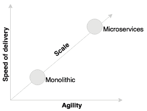

### 提示

与传统的单片应用程序相比，微服务具有更高的灵活性、交付速度和可扩展性。

企业投资于大型应用程序开发的周期只有几年的日子已经一去不复返了。企业不再像几年前那样对开发整合应用程序来管理其端到端业务功能感兴趣。

下图显示了传统单片应用程序和微服务的状态与周转时间和成本的对比。

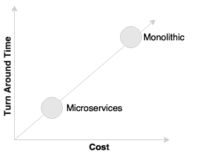

### 提示

微服务提供了一种开发快速敏捷应用程序的方法，从而降低了总体成本。

例如，今天，航空公司或金融机构不再投资重建其核心大型机系统，而将其视为另一个巨大的庞然大物。零售商和其他行业不会重建重量级的供应链管理应用程序，比如他们的传统 ERP。重点已转移到构建快速赢点解决方案，以尽可能最敏捷的方式满足业务的特定需求。

让我们以一个在线零售商为例，它使用一个遗留的单片应用程序运行。如果零售商希望通过根据客户过去的购物、偏好等向客户提供个性化产品来创新其销售，并希望通过根据客户的购买倾向提供产品来启发客户，他们将根据当前的需求快速开发个性化引擎或产品，并将其插入遗留应用程序。

如上图所示，与其投资于重建核心遗留系统，不如通过将响应传递给新功能来实现，如标有**A**的图所示，或者通过修改核心遗留系统来调用这些功能作为处理的一部分，如标有**B**的图表所示。这些函数通常写为微服务。

这种方法为组织提供了大量的机会，可以在实验模式下以较低的成本快速尝试新功能。企业可以稍后验证关键性能指标，并在需要时更改或替换这些实现。

### 提示

现代建筑有望最大限度地提高更换部件的能力，并将更换部件的成本降至最低。微服务方法是实现这一点的一种手段。

## 技术是微服务发展的催化剂

新兴的技术也让我们重新思考构建软件系统的方式。例如，几十年前，我们甚至无法想象没有两阶段提交的分布式应用程序。后来，NoSQL 数据库让我们有了不同的想法。

类似地，这些技术上的范式转变已经重塑了软件架构的所有层次。

HTML5 和 CSS3 的出现以及移动应用程序的发展重新定位了用户界面。客户端 JavaScript 框架，如 Angular、Ember、React、主干等，由于其客户端呈现和响应性设计而非常流行。

随着云应用进入主流，**平台即服务**（**PaaS**）提供商，如 Pivotal CF、AWS、Salesforce.com、IBMs Bluemix、RedHat OpenShift 等，让我们重新思考构建中间件组件的方式。Docker 创造的容器革命从根本上影响了基础设施空间。如今，基础设施被视为商品服务。

随着**整合平台即服务**（**iPaaS**）的出现，整合格局也发生了变化，正在兴起。诸如 Dell Boomi、Informatica、MuleSoft 等平台就是 iPaaS 的例子。这些工具帮助组织将集成边界扩展到传统企业之外。

NoSQLs 彻底改变了数据库空间。几年前，我们只有几个流行的数据库，都基于关系数据建模原则。今天我们有一长串数据库：Hadoop、Cassandra、CouchDB 和 Neo 4j 等等。这些数据库中的每一个都解决了特定的体系结构问题。

## 命令式架构演进

应用程序体系结构一直伴随着苛刻的业务需求和技术的发展而发展。体系结构经历了从古老的大型机系统到完全抽象的云服务（如 AWS Lambda）的演变。

### 提示

使用 AWS Lambda，开发人员现在可以将他们的“功能”放入完全管理的计算服务中。

更多关于 Lambda 的信息，请访问：[https://aws.amazon.com/documentation/lambda/](https://aws.amazon.com/documentation/lambda/)

不同的体系结构方法和风格（如大型机、客户机-服务器、N 层和面向服务）在不同的时间段很流行。无论建筑风格如何选择，我们总是使用一种或另一种形式的单片建筑。微服务体系结构的发展是现代业务需求的结果，如敏捷性和交付速度、新兴技术以及对前几代体系结构的学习。

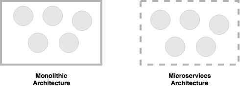

微服务帮助我们打破单一应用程序的界限，构建逻辑上独立的小型系统体系，如上图所示。

### 提示

如果我们将单片应用视为包含物理边界的一组逻辑子系统，则微服务是一组独立的子系统，没有封闭的物理边界。

# 什么是微服务？

微服务是当今许多组织作为游戏规则改变者使用的一种架构风格，旨在实现高度的灵活性、交付速度和规模。微服务为我们提供了一种开发更多物理分离的模块化应用程序的方法。

微服务不是发明出来的。许多组织，如 Netflix、Amazon 和 eBay，成功地使用分而治之技术将其单片应用程序功能性地划分为更小的原子单元，每个单元执行单个功能。这些组织解决了他们在单片应用程序中遇到的一些普遍问题。

随着这些组织的成功，许多其他组织开始采用这种通用模式来重构其单片应用程序。后来，福音派将这种模式称为微服务体系结构。

微服务起源于 Alistair Cockburn 提出的六边形架构的理念。六边形架构也称为端口和适配器模式。

### 提示

在[阅读更多关于六边形建筑的信息 http://alistair.cockburn.us/Hexagonal+建筑](http://alistair.cockburn.us/Hexagonal+architecture)。

微服务是一种体系结构风格或方法，用于将 IT 系统构建为一组自主、自包含且松散耦合的业务功能：

上图描述了一个传统的 N 层应用程序体系结构，包括表示层、业务层和数据库层。模块**A**、**B**和**C**代表三种不同的业务能力。图中的层表示架构关注点的分离。每一层包含与该层相关的所有三个业务功能。表示层包含所有三个模块的 web 组件，业务层包含所有三个模块的业务组件，数据库托管所有三个模块的表。在大多数情况下，层是物理上可扩展的，而层内的模块是硬连线的。

现在让我们来研究一种基于微服务的体系结构。

正如我们在前面的图中所注意到的，在微服务架构中，边界是反向的。每个垂直切片表示一个微服务。每个微服务都有自己的表示层、业务层和数据库层。微服务与业务能力保持一致。这样，对一个微服务的更改不会影响其他微服务。

微服务的通信或传输机制没有标准。一般来说，微服务使用广泛采用的轻量级协议（如 HTTP 和 REST）或消息传递协议（如 JMS 或 AMQP）相互通信。在特定情况下，可以选择更优化的通信协议，如 Thrift、ZeroMQ、协议缓冲区或 Avro。

由于微服务更符合业务能力，并且具有独立可管理的生命周期，因此它们是从事 DevOps 和云计算的企业的理想选择。DevOps 和云是微服务的两个方面。

### 提示

DevOps 是一种 IT 重组，旨在缩小传统 IT 开发和运营之间的差距，以提高效率。

阅读更多关于 DevOps 的：

[http://dev2ops.org/2010/02/what-is-devops/](http://dev2ops.org/2010/02/what-is-devops/)

# 微服务——蜂窝类比

蜂巢是代表进化微服务架构的理想类比。

在现实世界中，蜜蜂通过排列六角形的蜡细胞来建造蜂巢。他们从小开始，使用不同的材料来构建细胞。施工基于施工时可用的材料。重复的细胞形成一个图案，并形成一个强大的织物结构。蜂窝中的每个单元是独立的，但也与其他单元集成。通过添加新的细胞，蜂巢可以有机地生长成一个大而坚固的结构。每个单元格内的内容都是抽象的，外部不可见。对一个细胞的损伤不会对其他细胞造成损伤，蜜蜂可以在不影响整个蜂巢的情况下重建这些细胞。

# 微服务原则

在本节中，我们将研究微服务体系结构的一些原则。在设计和开发微服务时，这些原则是“必须具备的”。

## 每项服务的单一责任

单一责任原则是定义为实体设计模式一部分的原则之一。它规定一个单位只应承担一项责任。

### 提示

有关立体设计模式的更多信息，请访问：

[http://c2.com/cgi/wiki?PrinciplesOfObjectOrientedDesign](http://c2.com/cgi/wiki?PrinciplesOfObjectOrientedDesign)

这意味着一个单元，无论是类、函数还是服务，都应该只有一个职责。在任何情况下，两个单位都不应分担一项责任，或一个单位承担不止一项责任。具有多个职责的单元表示紧密耦合。

如上图所示，**客户**、**产品**、**订单**是电子商务应用的不同功能。与其将它们全部构建到一个应用程序中，不如有三个不同的服务，每个服务只负责一个业务功能，这样对一个职责的更改不会损害其他职责。在上述场景中，**客户**、**产品**和**订单**将被视为三个独立的微服务。

## 微服务是自主的

微服务是自包含、可独立部署和自主的服务，对业务能力及其执行负全部责任。它们将所有依赖项（包括库依赖项）和执行环境（如 web 服务器和容器或抽象物理资源的虚拟机）捆绑在一起。

微服务和 SOA 之间的主要区别之一在于它们的自治级别。虽然大多数 SOA 实现提供服务级抽象，但微服务更进一步，抽象了实现和执行环境。

在传统的应用程序开发中，我们构建 WAR 或 EAR，然后将其部署到 JEE 应用程序服务器中，如 JBoss、WebLogic、WebSphere 等。我们可以将多个应用程序部署到同一个 JEE 容器中。在微服务方法中，每个微服务都将构建为一个胖 Jar，嵌入所有依赖项，并作为一个独立的 Java 进程运行。

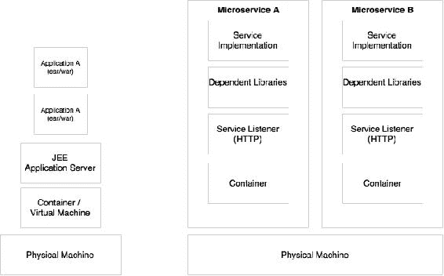

微服务也可以获得自己的容器来执行，如上图所示。容器是可移植的、可独立管理的轻量级运行时环境。容器技术（如 Docker）是部署微服务的理想选择。

# 微服务的特点

本章前面讨论的微服务定义是任意的。福音传道者和实践者对微服务有强烈但有时不同的观点。对于微服务，没有一个单一、具体和普遍接受的定义。然而，所有成功的微服务实现都表现出一些共同的特征。因此，重要的是理解这些特征，而不是坚持理论定义。本节详细介绍了一些常见特征。

## 服务是一等公民

在微服务世界中，服务是一流的公民。微服务将服务端点公开为 API，并抽象其所有实现细节。内部实现逻辑、体系结构和技术（包括编程语言、数据库、服务质量机制等）完全隐藏在服务 API 后面。

此外，在微服务体系结构中，没有更多的应用程序开发；相反，组织专注于服务开发。在大多数企业中，这需要在应用程序的构建方式上进行重大的文化转变。

在**客户档案**微服务中，隐藏了数据结构、技术、业务逻辑等内部内容。它们对任何外部实体都不公开或不可见。通过服务端点或 API 限制访问。例如客户档案微服务可能会公开**注册客户**和**获取客户**两个 API 供他人交互。

### 微服务中的服务特征

由于微服务或多或少类似于 SOA，SOA 中定义的许多服务特征也适用于微服务。

以下是适用于微服务的服务的一些特征：

*   **服务合同**：类似于 SOA，微服务是通过定义良好的服务合同来描述的。在微服务世界中，JSON 和 REST 被普遍接受用于服务通信。对于 JSON/REST，有许多技术用于定义服务契约。JSON 模式、WADL、Swagger 和 RAML 就是几个例子。
*   **松耦合**：微服务是独立的、松耦合的。在大多数情况下，微服务接受一个事件作为输入，并用另一个事件进行响应。消息传递、HTTP 和 REST 通常用于微服务之间的交互。基于消息的端点提供了更高级别的解耦。
*   **服务抽象**：在微服务中，服务抽象不仅仅是对服务实现的抽象，还提供了对所有库和环境细节的完整抽象，如前所述。
*   **服务重用**：微服务是过程粒度的可重用业务服务。移动设备、桌面频道、其他微服务甚至其他系统都可以访问这些服务。
*   **无状态**：设计良好的微服务是无状态的，不共享任何东西，没有服务维护的共享状态或会话状态。在需要维护状态的情况下，它们被维护在数据库中，可能是在内存中。
*   **服务可发现**：微服务可发现。在典型的微服务环境中，微服务自我宣传其存在，并使其自身可供发现。当服务消亡时，它们会自动从微服务生态系统中退出。
*   **服务互操作性**：服务可以互操作，因为它们使用标准协议和消息交换标准。消息传递、HTTP 等用作传输机制。REST/JSON 是微服务世界中开发互操作服务最流行的方法。在需要对通信进行进一步优化的情况下，可以使用协议缓冲区、Thrift、Avro 或 Zero MQ 等其他协议。然而，这些协议的使用可能会限制服务的整体互操作性。
*   **服务可组合性**：微服务是可组合的。服务可组合性可以通过服务编排或服务编排来实现。

### 提示

有关 SOA 原则的更多详细信息，请访问：

[http://serviceorientation.com/serviceorientation/index](http://serviceorientation.com/serviceorientation/index)

## 微服务是轻量级的

精心设计的微服务与单一业务功能相一致，因此它们只执行一项功能。因此，我们在大多数实现中看到的一个共同特征是占用空间较小的微服务。

在选择支持技术（如 web 容器）时，我们必须确保它们也是轻量级的，以便总体布局保持可控。例如，与更复杂的传统应用程序服务器（如 WebLogic 或 WebSphere）相比，Jetty 或 Tomcat 是作为微服务应用程序容器的更好选择。

与 VMWare 或 Hyper-V 等虚拟机监控程序相比，Docker 等容器技术还帮助我们尽可能减少基础架构占用。

如上图所示，微服务通常部署在 Docker 容器中，Docker 容器封装了业务逻辑和所需的库。这有助于我们在新机器或完全不同的托管环境上快速复制整个设置，甚至可以跨不同的云提供商移动。由于没有物理基础设施依赖性，容器化的微服务很容易移植。

## 多批次架构的微服务

由于微服务是自治的，并且抽象了服务 API 背后的所有内容，因此对于不同的微服务，可能有不同的体系结构。我们在微服务实现中看到的几个常见特征是：

*   不同的服务使用相同技术的不同版本。一个微服务可以在 Java1.7 上编写，另一个可以在 Java1.8 上编写。
*   不同的语言用于开发不同的微服务，例如一个微服务是用 Java 开发的，另一个是用 Scala 开发的。
*   使用不同的架构，例如一个微服务使用 Redis 缓存来提供数据，而另一个微服务可以使用 MySQL 作为持久数据存储。

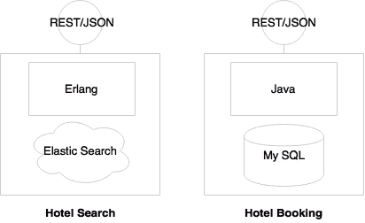

在前面的示例中，由于**酒店搜索**预计具有高事务量和严格的性能要求，因此使用 Erlang 实现。为了支持预测搜索，使用 Elasticsearch 作为数据存储。同时，**酒店预订**需要更多的交易特征。因此，它是使用 MySQL 和 Java 实现的。内部实现隐藏在 HTTP 上定义为 REST/JSON 的服务端点后面。

## 微服务环境中的自动化

大多数微服务实现从开发到生产都实现了最大程度的自动化。

随着微服务将单一应用程序分解为许多较小的服务，大型企业可能会看到微服务的激增。大量的微服务在实现自动化之前很难管理。更小的微服务占地面积也有助于我们将微服务开发自动化到部署生命周期。一般来说，微服务是端到端自动化的，例如，自动化构建、自动化测试、自动化部署和弹性扩展。

如上图所示，自动化通常应用于开发、测试、发布和部署阶段：

*   开发阶段使用版本控制工具（如 Git）和**持续集成**（**CI**）工具（如 Jenkins、Travis CI 等）实现自动化。这还可能包括代码质量检查和单元测试自动化。使用微服务也可以实现每个代码签入的完整构建的自动化。
*   测试阶段将使用测试工具（如 Selenium、Cucumber 和其他 AB 测试策略）实现自动化。由于微服务与业务功能相一致，与单片应用程序相比，要自动化的测试用例数量更少，因此每个构建上的回归测试也成为可能。
*   基础设施供应是通过容器技术（如 Docker）以及发布管理工具（如 Chef 或 Puppet）和配置管理工具（如 Ansible）完成的。使用 Spring Cloud、Kubernetes、Mesos 和 Marathon 等工具处理自动化部署。

## 支持生态系统的微服务

大多数大型微服务实现都有一个支持生态系统。生态系统功能包括 DevOps 进程、集中式日志管理、服务注册、API 网关、广泛的监视、服务路由和流控制机制。

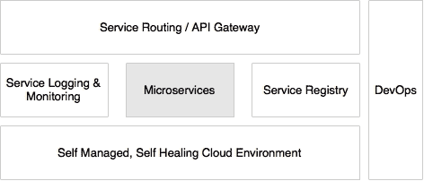

如上图所示，当支持功能到位时，微服务工作良好。

## 微服务是分布式的、动态的

成功的微服务实现将逻辑和数据封装在服务中。这导致了两种非常规情况：分布式数据和逻辑以及分散治理。

与将所有逻辑和数据整合到一个应用程序边界的传统应用程序相比，微服务分散了数据和逻辑。每个与特定业务能力相一致的服务都拥有自己的数据和逻辑。

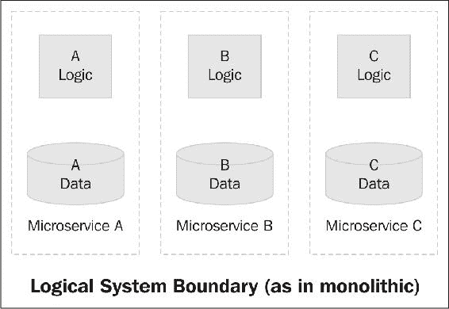

上图中的虚线表示逻辑单片应用程序边界。当我们将其迁移到微服务时，每个微服务**A**、**B**和**C**都会创建自己的物理边界。

微服务通常不像在 SOA 中使用的那样使用集中式治理机制。微服务实现的一个共同特征是它们不依赖于重量级企业级产品，例如**企业服务总线**（**ESB**）。相反，业务逻辑和智能作为服务本身的一部分嵌入。

上图显示了一个典型的 SOA 实现。通过协调客户、订单和产品公开的不同服务，购物逻辑在 ESB 中完全实现。另一方面，在微服务方法中，购物本身将作为一个独立的微服务运行，它以一种相当解耦的方式与客户、产品和订单交互。

SOA 实现严重依赖于静态注册表和存储库配置来管理服务和其他工件。微服务带来了更具动态性的特性。因此，静态治理方法被视为维护最新信息的开销。这就是为什么大多数微服务实现使用自动机制从运行时拓扑动态构建注册表信息的原因。

## 抗敏、快速失效、自愈

减敏性是一项在 Netflix 成功试验的技术。它是现代软件开发中构建故障安全系统的最强大的方法之一。

### 提示

Nassim Nicholas Taleb 在他的书*抗敏捷：从无序中获得的东西*中介绍了抗敏捷性的概念。

在抗敏捷性实践中，软件系统始终受到挑战。软件系统在这些挑战中不断发展，并在一段时间内越来越善于应对这些挑战。亚马逊的 GameDay 演习和 Netflix 的猿猴军队就是这类抗敏捷性实验的好例子。

Fail fast 是另一个用于构建容错、弹性系统的概念。这一理念提倡预期失败的系统，而不是构建永不失败的系统。应重视系统故障的速度，如果发生故障，系统从故障中恢复的速度。通过这种方法，重点从**平均无故障时间**（**MTBF**）转移到**平均恢复时间**（**MTTR**）。这种方法的一个关键优点是，如果出现问题，它会自杀，并且下游功能不会受到压力。

自愈是常用于微服务部署，在微服务部署中，系统会自动从故障中学习并自我调整。这些系统还可以防止将来的故障。

# 微服务示例

在实现微服务时，没有“一刀切”的方法。在本节中，将分析不同的示例，以使微服务概念具体化。

## 假日门户的一个示例

在第一个示例中，我们将回顾一个假日门户**飞越点**。Fly By Points 收集客户通过在线网站预订酒店、航班或汽车时累积的积分。当客户登录 Fly By Points 网站时，他/她可以查看积分累积情况、可通过兑换积分获得的个性化优惠以及即将到来的旅行（如果有）。

让我们假设前面的页面是登录后的主页。**Jeo**将有两次行程，四次个性化优惠，21123 积分。当用户单击每个框时，将查询并显示详细信息。

holiday portal 具有基于 Java Spring 的传统单片应用程序体系结构，如下所示：

如上图所示，假日门户的架构是基于 web 的模块化架构，层与层之间有明显的分离。按照惯例，假日门户还作为单个 WAR 文件部署在 web 服务器（如 Tomcat）上。数据存储在一个包罗万象的后台关系数据库中。在复杂性较少的情况下，这非常适合于特定的体系结构。随着业务的增长，用户群也在扩大，复杂性也在增加。这导致交易量按比例增加。此时，企业应该考虑将单片应用程序重新架构为微服务，以获得更好的交付速度、灵活性和可管理性。

通过查看此应用程序的 simple microservices 版本，我们可以立即注意到此架构中的一些内容：

*   每个子系统现在已经成为一个独立的系统，一个微服务。三个微服务代表三个业务功能：**出行**、**优惠**、**积分**。每一个都有其内部数据存储和中间层。每个服务的内部结构保持不变。
*   每个服务都封装了自己的数据库以及自己的 HTTP 侦听器。与之前的模型不同，没有 web 服务器或 WAR。相反，每个服务都有自己的嵌入式 HTTP 侦听器，如 Jetty、Tomcat 等。
*   每个微服务公开一个 REST 服务，以操作属于该服务的资源/实体。

假设表示层是使用客户端 JavaScript MVC 框架（如 Angular JS）开发的。这些客户端框架能够直接调用 REST 调用。

加载网页时，所有三个框、行程、优惠和积分都将显示详细信息，如积分、优惠数量和行程数量。这将由每个框使用 REST 独立地对各自的后端微服务进行异步调用来完成。服务层的服务之间没有依赖关系。当用户单击任何框时，屏幕将转换并加载所单击项目的详细信息。这将通过再次调用相应的微服务来完成。

## 基于微服务的订单管理系统

让我们来看另一个微服务的例子：一个在线零售网站。在这种情况下，我们将更多地关注后端服务，例如订单服务，它处理客户通过网站下订单时生成的订单事件：

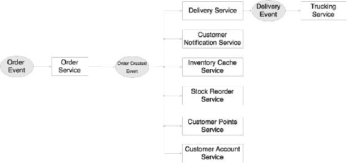

这个微服务系统完全是基于反应式编程实践设计的。

### 提示

阅读更多关于反应式编程的信息，网址为：

[http://www.reactivemanifesto.org](http://www.reactivemanifesto.org)

发布事件时，许多微服务在接收到事件时准备启动。它们中的每一个都是独立的，不依赖于其他微服务。这种模式的优点是，我们可以不断添加或替换微服务以满足特定需求。

在上图中，显示了八个微服务。以下活动在**订单事件**到达时发生：

1.  订单服务在收到订单事件时启动。订单服务创建订单并将详细信息保存到自己的数据库中。
2.  如果订单成功保存，订单服务将创建并发布订单成功事件。
3.  订单成功事件到达时会发生一系列操作。
4.  送货服务接受事件并放置送货记录以将订单交付给客户。这反过来会生成传递事件并发布该事件。
5.  卡车运输服务接收并处理交付事件。例如，卡车运输服务创建一个卡车运输计划。
6.  客户通知服务向客户发送通知，通知客户已下订单。
7.  库存缓存服务使用可用产品计数更新库存缓存。
8.  库存再订购服务检查库存限额是否足够，并在需要时生成补充事件。
9.  Customer Points Service 根据此次购买重新计算客户的忠诚度积分。
10.  **客户账户服务**更新客户账户中的订单历史记录。

在这种方法中，每个服务只负责一项功能。服务接受并生成事件。每个服务都是独立的，不知道它的邻居。因此，如蜂巢类比中所述，邻里可以有机地生长。必要时可以添加新服务。添加新服务不会影响任何现有服务。

## 旅行社门户网站示例

第三个例子是一个简单的旅行社门户应用程序。在本例中，我们将看到同步 REST 调用和异步事件。

在这种情况下，门户只是一个容器应用程序，门户中有多个菜单项或链接。当请求特定页面时，例如，当单击菜单或链接时，将从特定的微服务加载这些页面。

当客户请求预订时，内部会发生以下事件：

1.  旅行社打开航班 UI，搜索航班，并为客户识别正确的航班。在幕后，flight UI 是从 flight microservice 加载的。flight UI 仅与 flight microservice 中自己的后端 API 交互。在这种情况下，它对 Flight microservice 进行 REST 调用，以加载要显示的航班。
2.  然后，旅行社通过访问客户 UI 查询客户详细信息。与航班用户界面类似，客户用户界面是从客户微服务加载的。customer UI 中的操作将调用 customer microservice 上的 REST 调用。在这种情况下，通过调用 customer microservice 上的适当 API 来加载客户详细信息。
3.  然后，旅行社检查签证详细信息，了解客户是否有资格前往所选国家。这也遵循前两点中提到的相同模式。
4.  接下来，旅行社使用来自 booking microservice 的 booking UI 进行预订，这同样遵循相同的模式。
5.  付款页面是从 payment microservice 加载的。一般来说，支付服务具有附加约束，例如 PCIDSS 合规性（保护和加密运动数据和静止数据）。微服务方法的优点是，与单一应用程序不同，其他微服务都不需要在 PCIDSS 的权限范围内考虑，其中完整的应用程序受 PCIDSS 的管辖规则管辖。付款也遵循前面描述的相同模式。
6.  提交预订后，预订微服务将呼叫航班服务以验证和更新航班预订。此编排被定义为预订微服务的一部分。预订微服务中还提供预订智能。作为预订流程的一部分，它还验证、检索和更新客户微服务。
7.  最后，Booking microservice 发送预订事件，通知服务接收并向客户发送预订事件通知。

这里的有趣的因素是，我们可以在不影响任何其他微服务的情况下更改微服务的用户界面、逻辑和数据。

这是一个干净整洁的方法。许多门户应用程序可以通过从不同的微服务组合不同的屏幕来构建，特别是针对不同的用户社区。总体行为和导航将由门户应用程序控制。

这种方法有很多挑战，除非页面设计时考虑到这种方法。请注意，网站布局和静态内容将由**内容管理系统**（**CMS**加载为布局模板。或者，可以将其存储在 web 服务器中。站点布局可能包含将在运行时从微服务加载的 UI 片段。

# 微服务效益

微服务比传统的多层、单片架构提供了许多好处。本节解释了微服务体系结构方法的一些关键好处。

## 支持多批次架构

通过微服务，架构师和开发人员可以为每个微服务选择适合目的的架构和技术。这为以更具成本效益的方式设计更适合的解决方案提供了灵活性。

由于微服务是自主和独立的，因此每个服务都可以使用自己的体系结构或技术或不同版本的技术运行。

下面展示了一个简单实用的带有微服务的多语言体系结构示例。

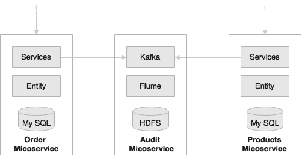

要求审核所有系统事务并记录事务细节，如请求和响应数据、发起事务的用户、调用的服务等。

如上图所示，虽然 Order 和 Products 微服务等核心服务使用关系数据存储，但 Audit 微服务将数据保存在 Hadoop 文件系统（HDFS）中。在存储大数据量（如审计数据）时，关系数据存储既不理想也不经济。在单片方法中，应用程序通常使用一个共享的单一数据库来存储订单、产品和审计数据。

在本例中，审计服务是一种使用不同体系结构的技术微服务。类似地，不同的功能服务也可以使用不同的体系结构。

在另一个例子中，Java 7 上可能运行一个预订微服务，而 Java 8 上可能运行一个搜索微服务。类似地，Order 微服务可以在 Erlang 上编写，而 Delivery 微服务可以是在线语言。这些都不可能与单片架构。

## 实现实验和创新

现代企业正朝着速胜的方向蓬勃发展。微服务是企业进行破坏性创新的关键因素之一，它提供了快速试验和失败的能力。

由于服务相当简单且规模较小，企业可以负担得起试验新流程、算法、业务逻辑等的费用。对于大型单片应用，实验并不容易；这也不是直接的或具有成本效益的。企业不得不花费巨资构建或更改应用程序以尝试新的东西。使用微服务，可以编写一个小型微服务来实现目标功能，并以反应式的方式将其插入系统。然后，人们可以在几个月内试用新功能，如果新的微服务不能按预期工作，我们可以更改它或用另一个微服务替换它。与整体方法相比，变更成本将大大降低。

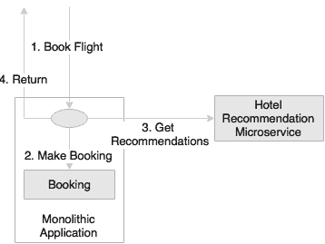

在航空公司预订网站的另一个示例中，航空公司希望在其预订页面中显示个性化的酒店推荐。建议必须显示在预订确认页面上。

如上图所示，编写一个可以插入到单片应用程序预订流中的微服务是很方便的，而不是将此需求合并到单片应用程序本身中。航空公司可能会选择从一个简单的推荐服务开始，并不断用更新的版本取代它，直到达到所需的准确性。

## 具有弹性和选择性伸缩性

由于微服务是更小的工作单元，它们使我们能够实现选择性的可伸缩性。

对于应用程序中的不同功能，可伸缩性要求可能不同。单个应用程序打包为单个 WAR 或 EAR，只能作为一个整体进行扩展。当使用高速数据流传输时，I/O 密集型功能很容易降低整个应用程序的服务级别。

在微服务的情况下，每个服务都可以独立地放大或缩小。由于可伸缩性可以选择性地应用于每个服务，因此使用微服务方法进行扩展的成本相对较低。

实际上，有许多不同的方法可用于扩展应用程序，并且在很大程度上取决于应用程序的体系结构和行为。**缩放立方体**主要定义了三种缩放应用程序的方法：

*   通过水平克隆应用程序来缩放*x*轴
*   通过拆分不同功能缩放*y*轴
*   通过对数据进行分区或分片来缩放*z*轴

### 提示

在以下网站上阅读更多关于天平立方体的：

[http://theartofscalability.com/](http://theartofscalability.com/)

当*y*轴缩放应用于单片应用程序时，它会将单片应用程序拆分为与业务功能一致的较小单元。许多组织成功地应用了这一技术，以摆脱单一应用程序。原则上，生成的功能单元符合微服务的特性。

例如，在一个典型的航空公司网站上，统计数据表明，航班搜索与航班预订的比例可能高达 500:1。这意味着每 500 次搜索交易就有一次预订交易。在这种情况下，搜索需要的可伸缩性是预订功能的 500 倍。这是选择性缩放的理想用例。

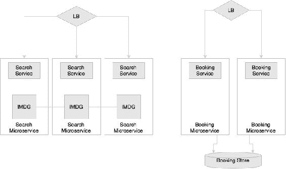

解决方案是区别对待搜索请求和预订请求。对于单片体系结构，只有在缩放立方体中进行*z*缩放时才可能实现。然而，这种方法成本很高，因为在*z*规模中，整个代码库都是复制的。

在前面的图中，搜索和预订被设计为不同的微服务，因此搜索的规模可以不同于预订。在图中，Search 有三个实例，Booking 有两个实例。选择性可伸缩性不仅限于图中所示的实例数量，还包括微服务的架构方式。在搜索的情况下，诸如 Hazelcast 的**内存数据网格**（**IMDG**）可以用作数据存储。这将进一步提高搜索的性能和可伸缩性。实例化新的 Search microservice 实例时，会向 IMDG 集群添加一个额外的 IMDG 节点。预订不需要相同级别的可扩展性。在预订的情况下，预订微服务的两个实例都连接到数据库的同一个实例。

## 允许替换

微服务是自包含、独立的部署模块，能够用另一个类似的微服务替换一个微服务。

许多大型企业遵循购买与构建策略来实现软件系统。一个常见的场景是在内部构建大部分功能，并从外部专家处购买特定的利基功能。这给传统的单片应用程序带来了挑战，因为这些应用程序组件具有高度的内聚性。尝试将第三方解决方案插入单片应用程序会导致复杂的集成。对于微服务，这不是事后才想到的。在架构上，一个微服务可以很容易地被另一个内部开发的微服务所取代，甚至可以由第三方开发的微服务来扩展。

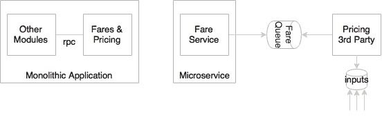

航空业中的定价引擎非常复杂。使用复杂的数学公式（称为定价逻辑）计算不同路线的票价。航空公司可能会选择从市场上购买定价引擎，而不是在内部构建产品。在整体结构中，定价是票价和预订的函数。在大多数情况下，定价、票价和预订都是硬连接的，因此几乎不可能分离。

在设计良好的微服务系统中，预订、票价和定价将是独立的微服务。更换定价微服务对任何其他服务的影响都很小，因为它们都是松散耦合和独立的。如今，它可能是第三方服务；明天，它将很容易被另一个第三方或本土服务所取代。

## 能够构建有机体系

微服务帮助我们构建本质上是有机的系统。当单片系统逐渐迁移到微服务时，这一点非常重要。

有机系统是在一段时间内通过增加越来越多的功能而横向生长的系统。在实践中，应用程序在其生命周期内增长得不可思议地大，并且在大多数情况下，应用程序的可管理性在同一时间段内显著降低。

微服务都是独立管理的服务。这使我们能够根据需要不断添加越来越多的服务，而对现有服务的影响最小。建立这样的系统不需要巨额资本投资。因此，企业可以将建筑作为其运营支出的一部分。

几年前，一家航空公司建立了一套针对个别乘客的忠诚度系统。一切都很好，直到航空公司开始向其公司客户提供忠诚度福利。公司客户是按公司分组的个人。由于当前的系统核心数据模型是扁平的，以个人为目标，公司环境需要对核心数据模型进行根本性的更改，因此需要进行大量的修改，以纳入这一需求。

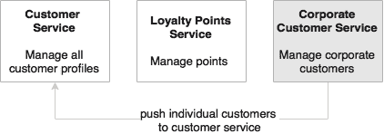

如上图所示，在基于微服务的体系结构中，客户信息将由客户微服务管理，忠诚度将由忠诚度积分微服务管理。

在这种情况下，很容易添加新的企业客户微服务来管理企业客户。当一家公司注册时，单个成员将被推送到 Customer microservice，以便像往常一样对其进行管理。公司客户微服务通过聚合来自客户微服务的数据来提供公司视图。它还将提供服务，以支持特定于公司的业务规则。使用这种方法，添加新服务对现有服务的影响最小。

## 帮助减少技术债务

由于微服务规模较小，依赖性最小，因此它们允许以最低成本迁移使用寿命终止技术的服务。

技术变化是软件开发的障碍之一。在许多传统的单片应用程序中，由于技术的快速变化，今天的下一代应用程序甚至在投入生产之前就很容易成为传统应用程序。架构师和开发人员倾向于通过添加抽象层来增加很多对技术变化的保护。然而，在现实中，这种方法并不能解决问题，反而会导致过度设计的系统。由于技术升级通常具有风险且成本高昂，没有直接的业务回报，因此业务部门可能不愿意投资于减少应用程序的技术债务。

使用微服务，可以单独更改或升级每个服务的技术，而不是升级整个应用程序。

例如，用 EJB1.1 和 Hibernate 编写的 500 万行代码升级一个应用程序到 Spring、JPA 和 REST 服务几乎类似于重写整个应用程序。在微服务世界中，这可以以增量方式完成。

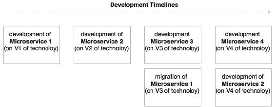

如上图所示，虽然旧版本的服务在旧版本的技术上运行，但新的服务开发可以利用最新的技术。与增强单片应用程序相比，使用寿命终止技术迁移微服务的成本要低得多。

## 允许不同版本共存

由于微服务将服务运行时环境与服务本身打包在一起，这使得服务的多个版本能够在同一环境中共存。

在某些情况下，我们必须同时运行同一服务的多个版本。零停机升级，即必须从一个版本优雅地切换到另一个版本，是这样一个场景的一个示例，因为将有一个时间窗口，其中两个服务必须同时启动和运行。对于单片应用程序，这是一个复杂的过程，因为在集群的一个节点中升级新服务很麻烦，例如，这可能会导致类加载问题。金丝雀版本是服务的多个版本必须共存的另一个例子，在金丝雀版本中，新版本只发布给少数用户以验证新服务。

有了微服务，这两种场景都很容易管理。由于每个微服务都使用独立的环境，包括 Tomcat 或 Jetty embedded 等服务监听器，因此可以发布多个版本，并在没有很多问题的情况下优雅地进行转换。当消费者查找服务时，他们会查找特定版本的服务。例如，在金丝雀版本中，向用户 a 发布了一个新的用户界面。当用户 a 向微服务发送请求时，它将查找金丝雀版本，而所有其他用户将继续查找上一个生产版本。

在数据库级别需要注意确保数据库设计始终向后兼容，以避免破坏更改。

如上图所示，**客户**服务的版本 1 和版本 2 可以共存，因为它们在各自的部署环境下不会相互干扰。如图所示，可以在网关上设置路由规则，将流量转移到特定实例。或者，客户端可以请求特定版本作为请求本身的一部分。在图中，网关根据发起请求的区域选择版本。

## 支持自组织系统建设

微服务帮助我们建立自组织系统。自组织系统支持将自动化部署，具有弹性，并展示自我修复和自学习能力。

在架构良好的微服务系统中，服务不知道其他服务。它接受来自所选队列的消息并对其进行处理。在流程结束时，它可能会发送另一条消息，从而触发其他服务。这使我们能够在不分析对整个系统的影响的情况下将任何服务放入生态系统。基于输入和输出，服务将自组织到生态系统中。不需要额外的代码更改或服务编排。没有中枢大脑来控制和协调这些过程。

假设现有的通知服务监听**输入**队列并向**SMTP**服务器发送通知，如下图所示：

让我们假设，稍后需要引入一个个性化引擎，负责将消息的语言更改为客户的母语，以便在将消息发送给客户之前对其进行个性化。个性化引擎负责将消息的语言更改为客户的母语。

使用微服务，将创建一个新的个性化微服务来完成这项工作。输入队列将被配置为外部配置服务器中的输入，个性化服务将从输入队列（之前，通知服务使用该队列）中拾取消息，并在完成过程后将消息发送到输出队列。然后，NotificationServices 输入队列将发送到输出。从下一刻起，系统将自动采用此新消息流。

## 支持事件驱动架构

微服务使我们能够开发透明的软件系统。传统系统通过本机协议相互通信，因此其行为类似于黑盒应用程序。业务事件和系统事件，除非明确发布，否则很难理解和分析。现代应用程序需要数据进行业务分析、了解动态系统行为和分析市场趋势，并且还需要对实时事件做出响应。事件是数据提取的有用机制。

架构良好的微服务总是与输入和输出的事件一起工作。任何服务都可以利用这些事件。一旦提取，事件可以用于各种用例。

例如，业务部门希望实时查看按产品类型分类的订单速度。在单片系统中，我们需要考虑如何提取这些事件。这可能会对系统进行更改。

在微服务世界中，**订单事件**已经在订单创建时发布。这意味着只需添加一个新服务来订阅同一主题、提取事件、执行请求的聚合，并推送另一个事件供仪表板使用。

## 启用 DevOps

微服务是 DevOps 的关键促成因素之一。DevOps 被许多企业广泛采用，主要是为了提高交付速度和灵活性。成功采用 DevOps 需要文化变化、流程变化以及架构变化。DevOps 提倡拥有敏捷开发、高速发布周期、自动测试、自动基础设施配置和自动部署。

使用传统的单片应用程序很难实现所有这些过程的自动化。微服务不是最终的答案，但微服务在许多 DevOps 实现中处于中心阶段。许多 DevOps 工具和技术也在围绕微服务的使用而发展。

考虑一个完整的应用程序，需要几个小时来完成完整的构建和 20 到 30 分钟的启动应用程序；可以看出，这种应用程序并不适合 DevOps 自动化。很难在每次提交时自动执行连续集成。由于大型单片应用程序不利于自动化，因此也很难实现连续测试和部署。

另一方面，占地面积小的微服务对自动化更友好，因此更容易支持这些需求。

微服务还支持更小、专注的敏捷团队进行开发。团队将根据微服务的边界进行组织。

# 与其他建筑风格的关系

既然我们已经了解了微服务的特点和好处，在本节中，我们将探讨微服务与其他密切相关的架构风格（如 SOA 和十二要素应用程序）的关系。

## 与 SOA 的关系

SOA 和微服务遵循类似的概念。在本章前面，我们讨论了微服务是从 SOA 演变而来的，并且在这两种方法中有许多服务特性是共同的。

然而，它们是相同的还是不同的？

由于微服务是从 SOA 演化而来的，因此微服务的许多特性与 SOA 类似。让我们首先检查 SOA 的定义。

开放集团联合体*对 SOA 的定义如下：*

> “面向服务的体系结构（SOA）是一种支持面向服务的体系结构样式。面向服务是一种考虑服务和基于服务的开发以及服务结果的思维方式。
> 
> 服务：
> 
> 是具有特定结果的可重复业务活动的逻辑表示（例如，检查客户信用、提供天气数据、合并钻井报告）
> 
> 它是独立的。
> 
> 它可能由其他服务组成。
> 
> 对于服务的消费者来说，这是一个“黑匣子”

我们在微服务中也观察到了类似的方面。那么，微服务在哪些方面有所不同呢？答案是：视情况而定。

上一个问题的答案可能是肯定的，也可能是否定的，这取决于组织及其对 SOA 的采用。SOA 是一个更广泛的术语，不同的组织以不同的方式处理 SOA 以解决不同的组织问题。微服务和 SOA 之间的区别在某种程度上取决于组织如何处理 SOA。

为了明确起见，将对一些案例进行审查。

### 面向服务的集成

面向服务的集成是指许多组织使用的基于服务的集成方法。

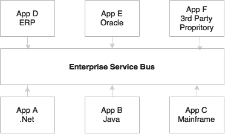

许多组织将使用 SOA 主要解决其集成复杂性，也称为集成意大利面。一般称为**面向服务的集成**（**SOI**。在这种情况下，应用程序使用标准协议和消息格式（如 HTTP 或 JMS 上基于 SOAP/XML 的 web 服务）通过公共集成层相互通信。这些类型的组织关注**企业集成模式**（**EIP**）来建模他们的集成需求。此方法强烈依赖于重量级 ESB，如 TIBCO Business Works、WebSphere ESB、Oracle ESB 等。大多数 ESB 供应商还将一组相关产品（如规则引擎、业务流程管理引擎等）打包为 SOA 套件。这些组织的整合深深扎根于其产品中。它们要么在 ESB 层编写繁重的编排逻辑，要么在服务总线中编写业务逻辑本身。在这两种情况下，所有企业服务都是通过 ESB 部署和访问的。这些服务通过企业治理模型进行管理。对于这样的组织，微服务与 SOA 完全不同。

### 遗产现代化

SOA 还被用于在遗留应用程序之上构建服务层。

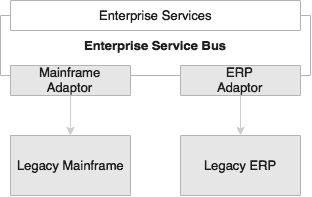

另一类组织将在转换项目或遗留现代化项目中使用 SOA。在这种情况下，服务是在 ESB 层中构建和部署的，该层使用 ESB 适配器连接到后端系统。对于这些组织，微服务不同于 SOA。

### 面向服务的应用

一些组织在应用程序级别采用 SOA。

在这种方法中，轻量级集成框架（如 ApacheCamel 或 SpringIntegration）嵌入到应用程序中，以处理与服务相关的交叉功能，如协议中介、并行执行、编排和服务集成。由于一些轻量级集成框架具有本机 Java 对象支持，这些应用程序甚至会使用本机**普通旧 Java 对象**（**POJO**）服务进行服务间的集成和数据交换。因此，所有服务都必须打包为一个整体 web 归档。这些组织可以将微服务视为其 SOA 的下一个逻辑步骤。

### 使用 SOA 的整体迁移

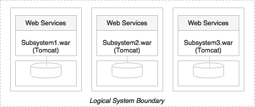

最后一种可能性是在单片系统达到临界点后，将单片应用程序转换为更小的单元。它们将把应用程序分解为更小的、物理上可部署的子系统，类似于前面介绍的*y*轴扩展方法，并将它们部署为 web 服务器上的 web 存档或部署在一些自制容器上的 JAR。这些子系统即服务将使用 web 服务或其他轻量级协议在服务之间交换数据。他们还将使用 SOA 和服务设计原则来实现这一点。对于这样的组织，他们可能倾向于认为微服务是新瓶装的旧酒。

## 与十二因子 APP 的关系

云计算是快速发展的技术之一。云计算带来了许多好处，如成本优势、速度、灵活性、灵活性和弹性。有许多云提供商提供不同的服务。它们降低了成本模型，使其对企业更具吸引力。不同的云提供商，如 AWS、Microsoft、Rackspace、IBM、Google 等，使用不同的工具、技术和服务。另一方面，企业意识到这一不断演变的战场，因此，他们正在寻找从锁定到单一供应商的风险降低方案。

许多组织确实将其应用程序提升并转移到云上。在这种情况下，应用程序可能无法实现云平台承诺的所有好处。有些应用程序需要大修，而有些应用程序在迁移到云计算之前可能需要稍作调整。这大体上取决于应用程序的架构和开发方式。

对于示例，如果应用程序将其生产数据库服务器 URL 硬编码为应用程序战争的一部分，则需要在将应用程序移动到云之前对其进行修改。在云中，基础设施对应用程序是透明的，尤其是不能假设物理 IP 地址。

我们如何确保一个应用程序，甚至是微服务能够跨多个云提供商无缝运行，并利用云服务（如弹性）的优势？

在开发云本地应用程序时，遵循某些原则很重要。

### 提示

Cloud native 是一个术语，用于开发能够在云环境中高效工作的应用程序，理解和利用云行为，如弹性、基于利用率的收费、故障感知等。

Heroku 提出的 12 因素应用程序是一种描述现代云应用程序预期特征的方法。12 因素应用程序同样适用于微服务。因此，了解十二因素应用程序非常重要。

### 单一代码库

代码库原则建议每个应用程序都有一个代码库。同一代码库可以有多个部署实例，例如开发、测试和生产。代码通常在诸如 Git、Subversion 等源代码管理系统中进行管理。

扩展微服务的相同理念，每个微服务都应该有自己的代码库，这个代码库不与任何其他微服务共享。这也意味着一个微服务正好有一个代码库。

### 捆绑依赖项

根据这一原则，所有应用程序都应该将其依赖项与应用程序包捆绑在一起。使用 Maven 和 Gradle 等构建工具，我们显式地管理`pom.xml`或`.gradle`文件中的依赖项，并使用 Nexus 或 Archiva 等中央构建工件库将它们链接起来。这样可以确保正确管理版本。最终的可执行文件将打包为 WAR 文件或可执行 JAR 文件，嵌入所有依赖项。

在微服务环境中，这是需要遵循的基本原则之一。每个微服务都应该将所有必需的依赖项和执行库（如 HTTP 侦听器等）捆绑在最终的可执行捆绑包中。

### 外化配置

此原则建议将代码中的所有配置参数外部化。应用程序的配置参数因环境而异，例如对外部系统的电子邮件 ID 或 URL、用户名、密码、队列名称等的支持。这些对于开发、测试和生产来说都是不同的。所有服务配置都应该外部化。

同样的原则对于微服务也是显而易见的。应从外部源加载 microservices 配置参数。这也将有助于自动化发布和部署过程，因为这些环境之间的唯一区别是配置参数。

### 支持服务是可寻址的

所有支持服务应通过可寻址 URL 访问。所有服务在执行的生命周期中都需要与一些外部资源进行对话。例如，他们可以监听消息或向消息传递系统发送消息，发送电子邮件，将数据持久化到数据库，等等。所有这些服务都应该可以通过 URL 访问，而无需复杂的通信需求。

在微服务世界中，微服务要么与消息传递系统通信以发送或接收消息，要么接受消息或向其他服务 API 发送消息。在常规情况下，这些端点可以是使用 REST 和 JSON 的 HTTP 端点，也可以是基于 TCP 或 HTTP 的消息传递端点。

### 构建、发布和运行之间的隔离

这一原则提倡在构建、发布和运行阶段之间进行严格隔离。构建阶段指的是通过包含所需的所有资产来编译和生成二进制文件。发布阶段指的是将二进制文件与特定于环境的配置参数相结合。运行阶段是指在特定的执行环境中运行应用程序。管道是单向的，因此不可能将更改从运行阶段传播回构建阶段。本质上，这也意味着不建议为生产进行特定构建；相反，它必须通过管道。

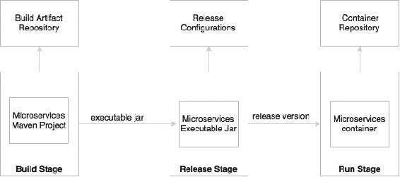

在微服务中，构建将创建可执行的 JAR 文件，包括服务运行时，如 HTTP 侦听器。在发布阶段，这些可执行文件将与发布配置（如生产 URL 等）相结合，并创建一个发布版本，很可能是一个类似于 Docker 的容器。在运行阶段，这些容器将通过容器调度器部署到生产环境中。

### 无状态、无共享的进程

这个原则建议进程应该是无状态的，不共享任何内容。如果应用程序是无状态的，那么它是容错的，并且可以很容易地扩展。

所有微服务都应设计为无状态功能。如果需要存储状态，则应使用备份数据库或内存缓存来完成。

### 通过端口绑定公开服务

十二因素应用预计是独立的。传统上，应用程序部署到服务器：web 服务器或应用程序服务器，如 ApacheTomcat 或 JBoss。12 因素应用程序不依赖于外部 web 服务器。诸如 Tomcat 或 Jetty 之类的 HTTP 侦听器必须嵌入到服务本身中。

端口绑定是微服务自治和自包含的基本要求之一。微服务将服务侦听器作为服务本身的一部分嵌入。

### 扩展的并发性

该原则规定流程的设计应通过复制流程来扩展。这是在进程中使用线程的补充。

在微服务领域，服务被设计成向外扩展而不是向上扩展。*x*轴缩放技术主要用于通过旋转另一个相同的服务实例来缩放服务。这些服务可以根据交通流进行弹性伸缩或收缩。此外微服务可以利用并行处理和并发框架来进一步加速或扩展事务处理。

### 可处置性，开销最小

这个原则提倡以最少的启动和关闭时间构建应用程序，并提供优雅的关闭支持。在自动化部署环境中，我们应该能够尽快启动或关闭实例。如果应用程序的启动或关闭需要相当长的时间，则会对自动化产生不利影响。启动时间与应用程序的大小成正比。在以自动扩展为目标的云环境中，我们应该能够快速启动新实例。这也适用于推广新版本的服务。

在 microservices 上下文中，为了实现完全自动化，以最少的启动和关闭时间保持应用程序的大小尽可能小是极其重要的。微服务也应该考虑对象和数据的惰性加载。

### 开发生产平价

该原则说明了保持开发和生产环境尽可能一致的重要性。例如，让我们考虑一个具有多个服务或进程的应用程序，例如作业调度程序服务、缓存服务和一个或多个应用程序服务。在开发环境中，我们倾向于在一台机器上运行所有这些过程，而在生产环境中，我们将促进独立机器运行这些过程中的每一个过程。这主要是为了管理基础设施的成本。缺点是，如果生产失败，就没有相同的环境来重新生产和修复问题。

这一原则不仅适用于微服务，而且也适用于任何应用程序开发。

### 外化日志

12 因素应用程序从不尝试存储或发送日志文件。在云中，最好避免本地 I/O。如果在给定的基础设施中 I/O 速度不够快，可能会造成瓶颈。解决方案是使用集中式日志框架。Splunk、Greylog、Logstash、Logplex 和 Loggly 是日志传送和分析工具的一些示例。推荐的方法是通过点击 logback Appender 将日志发送到中央存储库，并写入发货人的一个端点。

在微服务生态系统中，这一点非常重要，因为我们正在将一个系统分解为许多较小的服务，这可能导致分散的日志记录。如果它们将日志存储在本地存储中，那么将很难在服务之间关联日志。

在开发过程中，微服务可将日志流引导至`stdout`，而在生产过程中，这些日志流将由日志托运人捕获并发送至中央日志服务进行存储和分析。

### 包管理流程

除了应用程序服务之外，大多数应用程序还提供管理任务。此原则建议对应用程序服务和管理任务使用相同的发布包以及相同的环境。管理代码也应该与应用程序代码一起打包。

这一原则不仅适用于微服务，而且适用于任何应用程序开发。

# 微服务用例

微服务不是银弹，也无法解决当今世界的所有架构挑战。关于何时使用微服务，没有硬性规定或严格的指导方针。

微服务可能不适合每个用例。微服务的成功在很大程度上取决于用例的选择。第一个也是最重要的活动是针对微服务的好处对用例进行试金石测试。石蕊测试必须涵盖我们在本章前面讨论的所有微服务的好处。对于给定的用例，如果没有可量化的好处或者成本大于好处，那么用例可能不是微服务的正确选择。

让我们讨论一些常用的场景，它们适合微服务体系结构：

*   由于在可伸缩性、可管理性、灵活性或交付速度方面需要改进而迁移单片应用程序。另一个类似的场景是重写一个使用率很高的报废遗留应用程序。在这两种情况下，微服务都提供了机会。使用微服务体系结构，可以通过缓慢地将功能转换为微服务来重新构建遗留应用程序。这种方法有好处。无需巨额前期投资，无重大业务中断，无严重业务风险。众所周知，服务依赖关系可以很好地管理微服务依赖关系。
*   效用计算场景，如集成优化服务、预测服务、价格计算服务、预测服务、报价服务、推荐服务等，都是微服务的理想选择。这些是独立的无状态计算单元，它们接受特定数据、应用算法并返回结果。独立的技术服务，如通信服务、加密服务、身份验证服务等，也是微服务的理想选择。
*   在许多情况下，我们可以构建无头业务应用程序或服务，这些应用程序或服务本质上是自治的，例如，支付服务、登录服务、航班搜索服务、客户档案服务、通知服务等等。它们通常跨多个通道重用，因此，它们很适合作为微服务构建。
*   可以有微观或宏观应用程序服务于单一目的并履行单一职责。简单的时间跟踪应用程序就是此类应用程序的一个示例。它所做的只是捕获执行的时间、持续时间和任务。通用企业应用程序也是微服务的候选对象。
*   架构良好、响应迅速的客户端 MVC web 应用程序的后端服务（**后端即服务**（**BaaS**场景）响应用户导航按需加载数据。在大多数情况下，数据可能来自多个逻辑上不同的数据源，如前面提到的*飞越点*示例所述。
*   高度敏捷的应用程序、要求交付速度或上市时间的应用程序、创新试点、为 DevOps 选择的应用程序、创新型系统的应用程序等也可以被视为微服务体系结构的潜在候选。
*   我们可以预期从微服务中获益的应用程序，如多克隆需求、需要**命令查询责任分离**（**CQRS**等，也是微服务体系结构的潜在候选者。

如果用例属于这些类别中的任何一种，那么它就是微服务体系结构的潜在候选。

我们不应考虑避免微服务的情况：

*   如果组织的策略被迫使用集中管理的重量级组件（如 ESB）来承载业务逻辑，或者如果组织有妨碍微服务基本原则的任何其他策略，则除非组织流程放松，否则微服务不是正确的解决方案。
*   如果组织的文化、流程等基于传统的瀑布式交付模型、冗长的发布周期、矩阵式团队、手动部署和繁琐的发布流程、没有基础设施供应等等，那么微服务可能并不适合。这是以康威定律为基础的。这表明组织结构和它所创建的软件之间存在着紧密的联系。

### 提示

有关康威定律的更多信息，请访问：

[http://www.melconway.com/Home/Conways_Law.html](http://www.melconway.com/Home/Conways_Law.html)

## 微服务早期采用者

许多组织已经成功地踏上了走向微服务世界的征程。在本节中，我们将考察微服务领域的一些领先者，分析他们为什么这么做以及他们是如何做到的。我们将在最后进行一些分析，得出一些结论：

*   **网飞**[www.Netflix.com](http://www.netflix.com)：网飞是国际点播流媒体公司，是微服务领域的先锋。Netflix 将开发传统单片代码的大量开发人员转变为生产微服务的小型开发团队。这些微服务共同为数以百万计的 Netflix 客户提供数字媒体流。在 Netflix，工程师们从单片开始，经历了痛苦，然后将应用程序分解成更小的单元，这些单元松散耦合并与业务能力保持一致。
*   **优步**（[www.Uber.com](http://www.uber.com)）：优步是一家国际交通网络公司，于 2008 年开始采用单一代码库的单片架构。所有服务都嵌入到单片应用程序中。当优步将业务从一个城市扩展到多个城市时，挑战就开始了。Uber 随后转向基于 SOA 的体系结构，将系统拆分为更小的独立单元。每个模块都分配给不同的团队，使他们能够选择自己的语言、框架和数据库。Uber 在其生态系统中部署了许多使用 RPC 和 REST 的微服务。
*   **Airbnb**（[www.Airbnb.com](http://www.airbnb.com)）：Airbnb 是全球领先的住宿市场提供商，它从一个单片应用程序开始，该应用程序可执行业务的所有必需功能。Airbnb 面临流量增加带来的可扩展性问题。单个代码库变得过于复杂，无法管理，导致关注点分离不良，并遇到性能问题。Airbnb 将其单片应用程序拆分为更小的部分，并在不同的机器上以不同的部署周期运行不同的代码库。Airbnb 围绕这些服务开发了自己的微服务或 SOA 生态系统。
*   **Orbitz**（[www.Orbitz.com](http://www.orbitz.com)）：Orbitz 是一个在线旅游门户网站，在 2000 年代开始采用单一架构，包括 web 层、业务层和数据库层。随着 Orbitz 业务的扩展，他们面临着单片分层体系结构的可管理性和可扩展性问题。然后，Orbitz 经历了持续的架构更改。后来，Orbitz 将其单片应用程序分解为许多较小的应用程序。
*   **易趣**（[www.eBay.com](http://www.ebay.com)）：易趣是最大的在线零售商之一，于 20 世纪 90 年代末开始使用单一的 Perl 应用程序，FreeBSD 作为数据库。随着业务的增长，eBay 也遇到了规模问题。它一直在投资改进其架构。21 世纪中期，eBay 转向基于 Java 和 web 服务的小型分解系统。他们采用数据库分区和功能分离来满足所需的可伸缩性。
*   Amazon To 0T.Amazon ApplyT1（PurtT2 www. Amazon）AdditTo.To.T.3）：Amazon，一个最大的在线零售商网站，在 2001 上运行在 C++上的一个大的单片应用程序中。结构良好的单片应用程序基于具有许多模块化组件的分层体系结构。然而，所有这些组件都是紧密耦合的。因此，亚马逊无法通过将团队分成更小的小组来加快开发周期。Amazon 随后将代码分离为独立的功能性服务，用 web 服务包装，并最终升级为微服务。
*   **Gilt**[www.Gilt.com](http://www.gilt.com)：Gilt，一个在线购物网站，于 2007 年开始，其背后是一个分层的单片 Rails 应用程序和一个 Postgres 数据库。与许多其他应用程序类似，随着流量的增加，web 应用程序无法提供所需的恢复能力。Gilt 通过引入 Java 和 polyglot 持久性进行了架构大修。后来，Gilt 转向使用微服务概念的许多小型应用程序。
*   **推特**（[www.Twitter.com](http://www.twitter.com)）：推特是最大的社交网站之一，于本世纪中叶开始使用三层整体 rails 应用程序。后来，当 Twitter 的用户群增长时，他们经历了一个架构重构周期。通过这种重构，Twitter 从一个典型的 web 应用程序转移到了一个基于 API 甚至驱动的核心。Twitter 使用 Scala 和 Java 开发具有多语言持久性的微服务。
*   **耐克**（[www.Nike.com](http://www.nike.com)）：全球服装和鞋类领域的领导者耐克将其单片应用程序转变为微服务。与许多其他组织类似，耐克也使用难以稳定的古老遗留应用程序运行。在他们的发展历程中，Nike 转向了重量级商业产品，其目标是稳定遗留应用程序，但最终发展成规模昂贵、发布周期长、部署和管理应用程序需要大量手动工作的单片应用程序。后来，Nike 转向基于微服务的架构，大大缩短了开发周期。

## 共同的主题是整体迁移

当我们分析前面的企业时，有一个共同的主题。所有这些企业都从单一应用程序开始，并通过应用以前版本中的学习和痛点，过渡到微服务体系结构。

即使在今天，许多初创企业还是从 monolith 开始，因为它很容易启动、概念化，然后在需求出现时慢慢转向微服务。单片到微服务的迁移场景还有一个额外的优势：它们预先拥有所有信息，可随时用于重构。

虽然，对于所有这些企业来说，这是一个整体的转型，但不同组织的催化剂是不同的。一些常见的动机是缺乏可伸缩性、较长的开发周期、流程自动化、可管理性以及业务模型的变化。

虽然整体迁移是不需要动脑筋的，但是有机会从头开始构建微服务。不仅仅是建立基础系统，还要寻找机会来建立小型服务，这些服务对业务来说是快速取胜的，例如，将卡车运输服务添加到航空公司的端到端货物管理系统中，或将客户评分服务添加到零售商的忠诚度系统中。这些可以实现为独立的微服务，与各自的单片应用程序交换消息。

另一个点是，许多组织仅将微服务用于其业务关键型客户参与应用程序，而剩下的遗留单片应用程序则走自己的路。

另一个重要的观察结果是，之前检查过的大多数组织在其微服务过程中都处于不同的成熟度水平。当 eBay 在 21 世纪初从单一应用程序转型时，他们在功能上将应用程序拆分为更小、独立和可部署的单元。这些逻辑上划分的单元用 web 服务包装。虽然单一责任和自主性是他们的基本原则，但架构仅限于当时可用的技术和工具。Netflix 和 Airbnb 等组织建立了自己的能力，以解决它们所面临的具体挑战。总之，所有这些都不是真正的微服务，而是遵循相同特征的小型、与业务一致的服务。

没有所谓的“确定的或最终的微服务”状态。这是一个旅程，并在一天一天地发展和成熟。架构师和开发人员的口头禅是可替换性原则；构建一个体系结构，该体系结构能够最大限度地更换其部件，并将更换部件的成本降至最低。归根结底，企业不应该仅仅按照宣传来开发微服务。

# 总结

在本章中，您通过几个示例了解了微服务的基础知识。

我们探讨了微服务从传统单片应用程序的演变。我们研究了现代应用程序体系结构所需的一些原则和思想转变。我们还研究了微服务和用例的特性和好处。在本章中，我们建立了微服务与面向服务架构和十二要素应用程序的关系。最后，我们分析了几个不同行业的企业的例子。

我们将在下一章中开发一些示例微服务，以使我们在本章中的学习更加清晰。