# 三、应用微服务概念

微服务是好的，但如果构思不当，也可能是坏的。错误的微服务解释可能导致无法恢复的故障。

本章将探讨围绕微服务实际实现的技术挑战。它还将为成功开发微服务的关键设计决策提供指导。还将研究围绕微服务提出的一些常见问题的解决方案和模式。本章还将回顾企业级微服务开发中的挑战，以及如何克服这些挑战。更重要的是，最终将建立微服务生态系统的能力模型。

在本章中，您将了解以下内容：

*   开发微服务时要考虑的不同设计选择和模式之间的权衡
*   企业级微服务开发中的挑战与反模式
*   微服务生态系统的能力模型

# 模式和常见设计决策

微服务近年来获得了巨大的普及。它们已经发展成为架构师的首选，将 SOA 放到了后院。虽然承认微服务是开发可伸缩云本机系统的工具，但成功的微服务需要精心设计以避免灾难。微服务并不是所有架构问题的万能解决方案。

一般来说，微服务是构建轻量级、模块化、可扩展和分布式系统的最佳选择。过度的工程设计、错误的用例和误解很容易将系统变成灾难。虽然选择正确的用例对于开发成功的微服务至关重要，但通过进行适当的权衡分析来做出正确的设计决策也同样重要。在设计微服务时，需要考虑许多因素，详见以下章节。

## 建立适当的微服务边界

与微服务相关的最常见问题之一是服务的规模。一个微服务能有多大（微型单片）或多小（纳米服务），或者有类似于合适大小的服务吗？尺寸真的重要吗？

快速回答可以是“每个微服务一个 REST 端点”，或者“少于 300 行代码”，或者“执行单个职责的组件”。但在我们回答这些问题之前，还有很多分析要做，以了解我们服务的边界。

**领域驱动设计**（**DDD**定义了有界上下文的概念。有界上下文是负责执行特定功能的更大域或系统的子域或子系统。

### 提示

更多关于 DDD 的信息，请访问[http://domainlanguage.com/ddd/](http://domainlanguage.com/ddd/) 。

下图是域模型的一个示例：


在财务后台办公室中，系统发票、会计、账单等代表不同的有界上下文。这些有界上下文是与业务能力密切相关的强隔离域。在财务领域，发票、会计和账单是不同的业务能力，通常由财务部门下的不同子部门处理。

有界上下文是确定微服务边界的好方法。每个有界上下文都可以映射到单个微服务。在现实世界中，有界上下文之间的通信通常不那么耦合，而且常常是断开的。

尽管现实世界的组织边界是建立有界环境的最简单机制，但在某些情况下，由于组织结构中的固有问题，这些机制可能被证明是错误的。例如，业务能力可以通过不同的渠道交付，如前台、在线、漫游代理等。在许多组织中，业务单元可能基于交付渠道而不是实际的底层业务能力来组织。在这种情况下，组织边界可能无法提供准确的服务边界。

自上而下的区域分解可能是建立正确有界上下文的另一种方法。

建立微服务边界没有银弹，这通常是相当具有挑战性的。在单片应用程序到微服务迁移的场景中，建立边界要容易得多，因为服务边界和依赖关系是从现有系统中已知的。另一方面，在绿色领域的微服务开发中，很难预先建立依赖关系。

设计微服务边界最实用的方法是通过许多可能的选项运行当前场景，就像服务石蕊测试一样。请记住，可能有多个条件与给定场景相匹配，这将导致权衡分析。

以下场景有助于定义微服务边界。

### 自主功能

如果审查中的功能本质上是自治的，那么可以将其视为微服务边界。自治服务通常对外部功能的依赖性较小。它们接受输入，使用其内部逻辑和数据进行计算，并返回结果。所有实用程序功能（如加密引擎或通知引擎）都是简单的候选功能。

接受订单、处理订单，然后通知卡车运输服务的送货服务是自治服务的另一个示例。基于缓存的座位可用性信息的在线航班搜索是自主功能的另一个示例。

### 可展开单元的尺寸

大多数微服务生态系统将利用自动化，例如自动集成、交付、部署和扩展。涵盖更广泛功能的微服务导致部署单元更大。大型部署单元在自动文件复制、文件下载、部署和启动时间方面带来了挑战。例如，服务的大小随着其实现的函数的密度而增加。

良好的微服务确保其可部署单元的大小保持可控。

### 最合适的函数或子域

重要的是分析从单片应用程序中分离出的最有用的组件是什么。这在将单片应用程序分解为微服务时特别适用。这可以基于资源密集度、拥有成本、业务收益或灵活性等参数。

在一个典型的酒店预订系统中，大约 50-60%的请求是基于搜索的。在这种情况下，移出搜索功能可以立即带来灵活性、业务效益、成本降低、资源释放等。

### 多批次体系结构

微服务的关键特征之一是支持多语言体系结构。为了满足不同的非功能性和功能性要求，部件可能需要不同的处理。它可以是不同的体系结构、不同的技术、不同的部署拓扑等等。确定组件后，根据 polyglot 架构的要求对其进行审查。

在前面提到的酒店预订场景中，预订微服务可能需要事务完整性，而搜索微服务可能不需要事务完整性。在这种情况下，Booking microservice 可能使用 ACID 遵从性数据库（如 MySQL），而 Search microservice 可能使用最终一致性数据库（如 Cassandra）。

### 选择性定标

选择性缩放与前面讨论的多克隆体系结构相关。在这种情况下，所有功能模块可能不需要相同级别的可伸缩性。有时，根据可伸缩性需求确定边界可能是合适的。

例如，在酒店预订场景中，由于搜索请求的速度更快，搜索微服务的规模必须大大超过许多其他服务，如预订微服务或通知微服务。在这种情况下，可以在 Elasticsearch 或内存数据网格上运行单独的搜索微服务，以获得更好的响应。

### 小型敏捷团队

微服务通过小型、专注的团队开发饼图的不同部分，实现了敏捷开发。在某些情况下，系统的某些部分可能由不同的组织构建，甚至跨不同的地理位置构建，或者由具有不同技能集的团队构建。例如，在制造业中，这种方法是一种常见的做法。

在微服务世界中，每个团队构建不同的微服务，然后将它们组装在一起。虽然这不是理想的系统分解方式，但组织最终可能会遇到这种情况。因此，不能完全排除这种做法。

在在线产品搜索场景中，服务可以根据客户的需求提供个性化选项。这可能需要复杂的机器学习算法，因此需要一个专家团队。在这个场景中，这个功能可以由一个独立的专家团队构建为一个微服务。

### 单一责任

理论上，单一责任原则可以应用于方法、类或服务。然而，在微服务的上下文中，它不一定映射到单个服务或端点。

更实际的方法是将单一责任转化为单一业务能力或单一技术能力。根据*单一责任*原则，一个责任不能由多个微服务共享。同样，一个微服务不应执行多重职责。

但是，在某些特殊情况下，单个业务能力可能被划分为多个服务。其中一种情况是管理客户概要文件，在这种情况下，您可能会使用两种不同的微服务，使用**命令查询责任分离**（**CQRS**方法来管理读写，以实现一些质量属性。

### 可复制性或可变性

创新和速度在 IT 交付中至关重要。微服务边界的确定方式应确保每个微服务都可以轻松地从整个系统中分离出来，并且重写成本最低。如果系统的一部分只是一个实验，那么理想情况下，它应该作为一个微服务来隔离。

组织可以开发推荐引擎或客户排名引擎作为实验。如果业务价值没有实现，那么就扔掉该服务，或者用另一个服务替换它。

许多组织遵循启动模式，其中重视会议功能和快速交付。这些组织可能不太担心架构和技术。相反，重点将放在哪些工具或技术可以更快地提供解决方案上。组织越来越多地选择通过整合一些服务并允许系统发展来开发**最低可行产品**（**MVP**）的方法。在这样的情况下，微服务扮演着至关重要的角色：系统不断发展，服务逐渐被重写或替换。

### 耦合与内聚

耦合和内聚是决定服务边界的两个最重要参数。必须仔细评估微服务之间的依赖关系，以避免高度耦合的接口。功能分解以及建模的依赖关系树有助于建立微服务边界。避免过多的聊天服务、过多的同步请求-响应调用和循环同步依赖是三个关键点，因为这些很容易破坏系统。一个成功的等式是保持微服务内的高内聚性，以及微服务之间的松散耦合。除此之外，确保事务边界不会跨微服务延伸。第一类微服务将在接收到一个事件作为输入时做出反应，执行许多内部函数，最后发送另一个事件。作为计算函数的一部分，它可以将数据读写到自己的本地存储中。

### 将微服务视为一种产品

DDD 还建议将有界上下文映射到产品。根据 DDD，每个有界上下文都是产品的理想候选。将微服务本身看作一种产品。当微服务边界建立起来时，从产品的角度对其进行评估，看看它们是否真的是产品。对于业务用户来说，从产品的角度考虑边界要容易得多。产品边界可能有许多参数，例如目标社区、部署灵活性、可销售性、可重用性等。

## 设计沟通方式

微服务之间的通信可以设计为同步（请求-响应）或异步（触发-遗忘）方式。

### 同步式通信

下图显示了一个示例请求/响应样式服务：

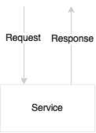

在同步通信中，没有共享状态或对象。当调用方请求服务时，它传递所需信息并等待响应。这种方法有许多优点。

应用程序是无状态的，从高可用性的角度来看，许多活动实例可以启动并运行，接受流量。由于没有其他基础架构依赖项（如共享消息服务器），因此管理开销更少。如果在任何阶段发生错误，错误将立即传播回调用方，使系统处于一致状态，而不会影响数据完整性。

同步请求-响应通信的缺点是，用户或调用者必须等待请求的进程完成。因此，调用线程将等待响应，因此，这种方式可能会限制系统的可伸缩性。

同步样式在微服务之间添加了硬依赖关系。如果服务链中的一个服务失败，那么整个服务链都将失败。为了使服务成功，所有依赖的服务都必须启动并运行。许多故障场景必须使用超时和循环来处理。

### 异步式通信

下图是一个服务，用于接受异步消息作为输入，并异步发送响应供其他人使用：


异步样式基于反应式事件循环语义，该语义将微服务解耦。这种方法提供了更高级别的可伸缩性，因为服务是独立的，并且可以在内部生成线程来处理负载的增加。过载时，消息将在消息服务器中排队，以便稍后处理。这意味着，如果其中一项服务放缓，将不会影响整个供应链。这提供了服务之间更高级别的解耦，因此维护和测试将更简单。

缺点是它依赖于外部消息服务器。消息传递服务器的容错处理非常复杂。消息传递通常使用主动/被动语义。因此，处理消息传递系统的连续可用性更难实现。由于消息传递通常使用持久性，因此需要更高级别的 I/O 处理和调优。

### 如何决定选择哪种风格？

两种方法都有各自的优点和局限性。仅仅用一种方法开发一个系统是不可能的。基于用例，这两种方法需要结合使用。原则上，异步方法非常适合构建真正的、可伸缩的微服务系统。然而，试图将所有事物建模为异步会导致复杂的系统设计。

在最终用户单击 UI 以获取配置文件详细信息的上下文中，下面的示例看起来如何？


这可能是对后端系统的一个简单查询，以获得请求-响应模型中的结果。也可以通过将消息推送到输入队列，并在输出队列中等待响应，直到收到给定关联 ID 的响应为止，以异步方式对此进行建模。但是，尽管我们使用异步消息传递，但在整个查询过程中，用户仍然被阻止。

另一个用例是用户单击 UI 搜索酒店，如下图所示：


这与前面的场景非常类似。但是，在这种情况下，我们假设此业务功能在将酒店列表返回给用户之前会在内部触发许多活动。例如，当系统收到此请求时，它计算客户排名，根据目的地获取报价，根据客户偏好获取建议，根据客户价值和收入因素优化价格，等等。在这种情况下，我们有机会并行执行许多这些活动，以便在向客户展示这些结果之前，我们可以汇总所有这些结果。如上图所示，实际上任何计算逻辑都可以插入到侦听队列中的**的搜索管道中。**

在这种情况下，一种有效的方法是从同步请求-响应开始，然后重构，以便在这样做有价值时引入异步样式。

以下示例显示了一种完全异步的服务交互样式：

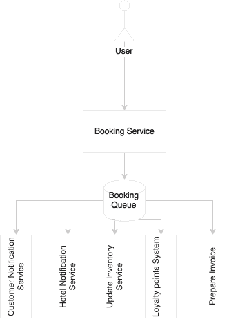

当用户点击预订功能时触发服务。从本质上讲，这也是一种同步式的交流。预订成功后，它会向客户的电子邮件地址发送消息，向酒店的预订系统发送消息，更新缓存的库存，更新忠诚度积分系统，准备发票，甚至更多。与其将用户推入长等待状态，更好的方法是将服务分解为多个部分。让用户等待预订服务创建预订记录。成功完成后，将发布预订活动，并向用户返回确认消息。随后，所有其他活动将并行、异步地进行。

在这三个示例中，用户都必须等待响应。使用新的 web 应用程序框架，可以异步发送请求，定义回调方法，或者设置观察者以获取响应。因此，不会完全阻止用户执行其他活动。

一般来说，在微服务世界中，异步样式总是更好，但是确定正确的模式应该完全基于优点。如果用异步样式对事务建模没有好处，那么就使用同步样式，直到找到合适的案例为止。在以异步方式建模用户驱动的请求时，使用反应式编程框架避免复杂性。

## 微服务编排

可组合性是服务设计原则之一。这导致了关于谁负责组合服务的混淆。在 SOA 世界中，ESB 负责组成一组细粒度服务。在一些组织中，ESB 扮演着代理的角色，服务提供者自己组成并公开粗粒度服务。在 SOA 世界中，有两种方法可以处理此类情况。

第一种方法是编排，如下图所示：

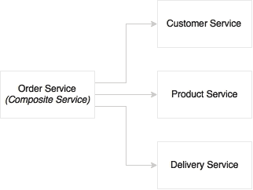

在编排方法中，将多个服务缝合在一起以获得完整的功能。中央大脑起着协调器的作用。如图所示，订单服务是一个组合服务，它将协调其他服务。主进程可以有顺序分支，也可以有并行分支。每个任务都将由原子任务服务（通常是 web 服务）完成。在 SOA 世界中，ESB 扮演着编排的角色。经编排的服务将由 ESB 作为复合服务公开。

第二种方法是编排，如下图所示：

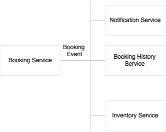

在编舞方法中，没有中枢大脑。一个事件，在本例中是预订事件，由制作人发布，许多消费者等待该事件，并在传入事件上独立应用不同的逻辑。有时，事件甚至可以嵌套在用户可以发送另一个将由另一个服务使用的事件的位置。在 SOA 世界中，调用方将消息推送到 ESB，下游流将由消费服务自动确定。

微服务是自主的。这本质上意味着在理想情况下，完成其功能所需的所有组件都应该在服务中。这包括数据库、其内部服务的编排、内部状态管理等。服务端点提供粗粒度 API。只要不需要外部接触点，这是非常好的。但在现实中，微服务可能需要与其他微服务对话以实现其功能。

在这种情况下，编排是将多个微服务连接在一起的首选方法。遵循自治原则，位于微服务外部并控制流的组件不是理想的选择。如果用例可以以舞蹈风格建模，那将是处理这种情况的最佳方式。

但不可能在所有情况下都对舞蹈进行建模。下图对此进行了描述：

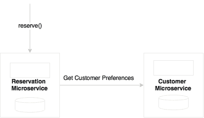

在前面的示例中，预订和客户是两个微服务，具有明确分离的功能职责。当预订在创建预订时希望获得客户偏好时，可能会出现这种情况。在开发复杂系统时，这是非常正常的场景。

我们是否可以将客户转移到预订，以便预订可以自行完成？如果基于各种因素将 Customer 和 Reservation 确定为两个微服务，那么将 Customer 移动到 Reservation 可能不是一个好主意。在这种情况下，我们迟早会遇到另一个单片应用程序。

我们可以预约客户电话吗？该示例如下图所示：


预订进行需要客户偏好，因此可能需要对客户进行同步阻塞调用。通过异步建模来改进这一点并没有真正意义。

我们能不能去掉中的编排部分，创建另一个复合微服务，然后将预订和客户组合起来？


在一个微服务中组合多个组件的方法中，这是可以接受的。但创建复合微服务可能不是一个好主意。我们最终将创建许多没有业务一致性的微服务，这将不是自治的，并可能导致许多细粒度的微服务。

我们可以通过将偏好数据的从属副本保留到保留中来复制客户偏好吗？


只要主服务器中有更改，就会传播更改。在这种情况下，预订可以使用客户偏好，而无需打电话。这是一个有效的想法，但我们需要仔细分析这一点。今天，我们复制了客户偏好，但在另一种情况下，我们可能想联系客户服务部，看看客户是否被列入预订黑名单。在决定复制哪些数据时，我们必须非常小心。这可能会增加复杂性。

## 微服务中有多少个端点？

在许多情况下，开发人员对每个微服务的端点数量感到困惑。真正的问题是，是将每个微服务限制为一个端点还是多个端点：


端点的数量实际上不是一个决策点。在某些情况下，可能只有一个端点，而在其他一些情况下，微服务中可能有多个端点。例如，考虑传感器数据服务，它收集传感器信息，并有两个逻辑端点：创建和读取。但为了处理 CQR，我们可以创建两个单独的物理微服务，如上图中的**预订**案例所示。Polyglot 架构可能是我们将端点拆分为不同微服务的另一种场景。

考虑到通知引擎，将发送通知以响应事件。对于不同的事件，通知过程（如数据准备、人员身份识别和交付机制）是不同的。此外，我们可能希望在不同的时间窗口以不同的方式扩展这些进程。在这种情况下，我们可能会决定将每个通知端点拆分为一个单独的微服务。

在另一个示例中，忠诚度积分微服务可能有多个服务，如累积、兑换、转账和余额。我们可能不希望对这些服务有不同的对待。所有这些服务都已连接，并使用 points 表获取数据。如果我们对每个服务使用一个端点，那么最终会出现这样的情况：许多细粒度服务访问来自同一数据存储或同一数据存储的复制副本的数据。

简言之，端点的数量不是设计决策。一个微服务可以承载一个或多个端点。为微服务设计合适的有界上下文更为重要。

## 每个虚拟机一个微服务还是多个？

通过复制部署以实现可扩展性和可用性，可以在多个**虚拟机**（**虚拟机**中部署一个微服务。这是一个不需要动脑筋的问题。问题是多个微服务是否可以部署在一个虚拟机中？这种方法有优点也有缺点。这个问题通常出现在服务简单且流量较小的情况下。

考虑一个例子，我们有几个微服务，每分钟的总事务小于 10。还假设可用的最小虚拟机大小是 2 核 8 GB RAM。另一个假设是，在这种情况下，2 核 8GB 虚拟机可以每分钟处理 10-15 个事务，而不存在任何性能问题。如果我们为每个微服务使用不同的虚拟机，可能不具有成本效益，我们最终将为基础设施和许可证支付更多的费用，因为许多供应商根据核心数量收费。

解决此问题的最简单方法是问几个问题：

*   VM 是否有足够的容量在峰值使用率下运行这两个服务？
*   我们是否希望以不同的方式对待这些服务以实现 SLA（选择性扩展）？例如，为了可伸缩性，如果我们有一个一体式 VM，我们将不得不复制复制所有服务的 VM。
*   是否存在任何冲突的资源需求？例如，不同的 OS 版本、JDK 版本和其他版本。

如果您的答案都是*否*，那么也许我们可以从并置部署开始，直到遇到更改部署拓扑的场景。但是，我们必须确保这些服务不共享任何内容，并且作为独立的操作系统进程运行。

话虽如此，在一个拥有成熟虚拟化基础设施或云基础设施的组织中，这可能不是一个大问题。在这样的环境中，开发人员不必担心服务在哪里运行。开发人员甚至可能不会考虑容量规划。服务将部署在计算云中。根据基础架构可用性、SLA 和服务的性质，基础架构自行管理部署。AWS Lambda 就是此类服务的一个很好的例子。

## 规则引擎-共享还是嵌入？

规则是任何系统的重要组成部分。例如，在做出“是”或“否”决定之前，优惠资格服务可能会执行许多规则。我们要么手工编写规则，要么使用规则引擎。许多企业在规则存储库中集中管理规则，并集中执行它们。这些企业规则引擎主要用于为业务部门提供编写和管理规则以及重用中央存储库中的规则的机会。**Drools**是流行的开源规则引擎之一。IBM、FICO 和 Bosch 是商业领域的先驱。这些规则引擎提高了生产率，允许重用规则、事实、词汇表，并使用 rete 算法提供更快的规则执行。

在微服务的上下文中，中央规则引擎意味着将调用从微服务分散到中央规则引擎。这也意味着服务逻辑现在位于两个位置，一个在服务内部，另一个在服务外部。然而，微服务的目标是减少外部依赖性：

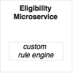

如果规则足够简单，数量很少，仅在服务范围内使用，并且不向业务用户公开以供创作，那么手工编写业务规则可能比依赖企业规则引擎更好：


如果规则很复杂，仅限于服务上下文，并且没有提供给业务用户，那么最好在服务中使用嵌入式规则引擎：


如果规则是由业务部门管理和编写的，或者如果规则很复杂，或者如果我们正在重用来自其他服务域的规则，那么具有本地嵌入式执行引擎的中央编写存储库可能是更好的选择。

请注意，必须仔细评估这一点，因为所有供应商可能都不支持本地规则执行方法，并且可能存在技术依赖性，例如仅在特定应用程序服务器中运行规则等。

## BPM 和工作流的作用

**业务流程管理****BPM**和**智能业务流程管理****iBPM**是设计、执行和监控业务流程的工具套件。

BPM 的典型用例有：

*   协调长期运行的业务流程，其中一些流程是通过现有资产实现的，而其他一些领域可能是利基的，并且没有流程的具体实现。BPM 允许组合这两种类型，并提供端到端的自动化流程。这通常涉及系统和人与人之间的互动。
*   以流程为中心的组织，如那些实施了六西格玛的组织，希望监控其流程以持续提高效率。
*   通过重新定义组织的业务流程，采用自上而下的方法重新设计流程。

BPM 适用于微服务世界的情况可能有两种：

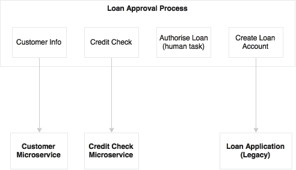

第一个场景是业务流程重新设计，或如前所述，为端到端长时间运行的业务流程线程化。在这种情况下，BPM 在更高的级别上运行，通过缝合大量粗粒度的微服务、现有的遗留连接器和人员交互，它可以自动化跨功能、长期运行的业务流程。如上图所示，贷款审批 BPM 调用微服务以及遗留应用程序服务。它还集成了人工任务。

在这种情况下，微服务是实现子流程的无头服务。从微服务的角度来看，BPM 只是另一个消费者。在这种方法中需要注意避免从 BPM 流程接受共享状态，以及将业务逻辑移动到 BPM：


第二个场景是监控流程，并优化流程以提高效率。这与一个完全自动化、异步编排的微服务生态系统密切相关。在这种情况下，微服务和 BPM 作为独立的生态系统工作。微服务在不同的时间段发送事件，如流程开始、状态更改、流程结束等。BPM 引擎使用这些事件来绘制和监视流程状态。为此，我们可能不需要一个成熟的 BPM 解决方案，因为我们只是在模拟业务流程以监控其效率。在这种情况下，订单交付流程不是 BPM 实现，而是捕获和显示流程进度的监控仪表板。

总之，在端到端跨功能业务流程通过自动化系统和人员交互建模的情况下，BPM 仍然可以在更高的级别上用于组合多个微服务。一种更好、更简单的方法是使用一个业务流程仪表板，如第二个场景中所述，MicroService 向其提供状态更改事件。

## 微服务能否共享数据存储？

在原则中，微服务应该抽象表示、业务逻辑和数据存储。如果服务按照指南被破坏，每个微服务在逻辑上可以使用一个独立的数据库：

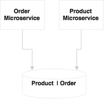

在上图中，**产品**和**订单**微服务共享一个数据库和一个数据模型。在开发微服务时，共享数据模型、共享模式和共享表是灾难的秘诀。这在一开始可能很好，但在开发复杂的微服务时，我们倾向于添加数据模型之间的关系，添加联接查询，等等。这可能导致物理数据模型紧密耦合。

如果服务只有几个表，那么像 Oracle 数据库实例那样投资一个完整的数据库实例可能不值得。在这种情况下，架构级别的隔离足以从以下方面开始：

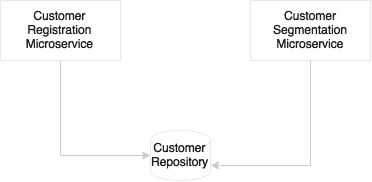

在某些情况下，我们可能倾向于考虑将共享数据库用于多个服务。以企业级管理的客户数据存储库或主数据为例，客户注册和客户细分微服务在逻辑上共享同一客户数据存储库：


如上图所示，此场景中的另一种方法是通过为微服务添加本地事务数据存储，将微服务的事务数据存储与企业数据存储库分离。这将有助于服务在重新构建本地数据存储时具有灵活性，并针对其目的进行了优化。当客户数据存储库发生任何更改时，企业客户存储库发送更改事件。类似地，如果任何事务数据存储中有任何更改，则必须将更改发送到中央客户存储库。

## 设置交易边界

操作系统中的事务用于通过将多个操作组合到一个原子块中来维护存储在 RDBMS 中的数据的一致性。它们要么提交，要么回滚整个操作。分布式系统遵循两阶段提交的分布式事务概念。如果异构组件（如 RPC 服务、JMS 等）参与事务，则尤其需要这样做。

在微服务中有交易场所吗？事务不是坏事，但是应该通过分析我们正在尝试做的事情来仔细使用事务。

对于给定的微服务，可以选择像 MySQL 这样的 RDBMS 作为后备存储，以确保 100%的数据完整性，例如，数据完整性是关键的库存或库存管理服务。使用本地事务在微系统内定义事务边界是合适的。然而，在微服务上下文中应该避免分布式全局事务。需要进行适当的依赖性分析，以确保事务边界尽可能不跨越两个不同的微服务。

### 更改用例以简化事务需求

最终的一致性是比跨多个微服务的分布式事务更好的选择。最终的一致性降低了很多开销，但应用程序开发人员可能需要重新考虑他们编写应用程序代码的方式。这可能包括重构函数、排序操作以最小化故障、批处理插入和修改操作、重构数据结构，最后是抵消影响的补偿操作。

一个典型的问题是酒店预订用例中最后一个房间销售场景。如果只剩下一个房间，并且有多个客户预订了这个单一的可用房间怎么办？业务模式的改变有时会降低此场景的影响。我们可以设置一个“在预订模式下”，实际可预订房间数可以低于实际房间数（*可预订=可用-3*），预计会有一些取消。此范围内的任何内容都将被视为“以确认为准”，只有在确认付款后，才会向客户收取费用。预订将在设定的时间窗口内确认。

现在考虑一个场景，我们在 NoSQL 数据库中创建客户配置文件，比如 CoucDB。在使用 RDBMS 的更传统的方法中，我们首先插入客户，然后插入客户的地址、配置文件详细信息，然后是首选项，所有这些都在一个事务中完成。在使用 NoSQL 时，我们可能不会执行相同的步骤。相反，我们可以准备一个包含所有细节的 JSON 对象，并一次性将其插入 CouchDB。在第二种情况下，不需要显式的事务边界。

### 分布式事务场景

理想的场景是在需要时在微服务中使用本地事务，并完全避免分布式事务。在某些情况下，在一个服务的执行结束时，我们可能希望向另一个微服务发送消息。例如，假设旅游预订有轮椅请求。一旦预订成功，我们将不得不向另一个处理辅助预订的微服务发送轮椅预订信息。预订请求本身将在本地事务上运行。如果发送此消息失败，我们仍处于事务边界，可以回滚整个事务。如果我们创建了一个预订并发送了消息，但是在发送了消息之后，我们在预订中遇到了一个错误，预订事务失败，随后，预订记录被回滚，该怎么办？现在，我们陷入了一种不必要地创建孤儿轮椅预订的情况：

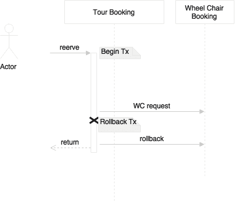

有几种方法可以解决这种情况。第一种方法是延迟发送消息直到结束。这样可以确保在发送消息后发生任何故障的可能性更小。尽管如此，如果在发送消息后出现故障，那么将运行异常处理例程，也就是说，我们将发送一条补偿消息以撤销轮椅预订。

## 服务端点设计考虑

微服务的一个重要方面是服务设计。服务设计有两个关键要素：契约设计和协议选择。

### 合同设计

服务设计的首要原则是简单。服务应设计为消费者消费。复杂的服务契约会降低服务的可用性。**KISS**（**保持简单愚蠢**原则有助于我们更快地建立更好的优质服务，并降低维护和更换成本。**雅格尼**（**你不需要它**是支持这个想法的另一个原则。预测未来的需求和建筑系统，在现实中，不是未来的证明。这将导致大量的前期投资以及更高的维护成本。

进化设计是一个伟大的概念。做足够的设计来满足今天的需求，并在需要时不断更改和重构设计以适应新特性。尽管如此，除非有强有力的治理，否则这可能并不简单。

**消费者驱动契约**（**CDC**是一个支持进化设计的好主意。在许多情况下，当服务契约发生变化时，所有消费应用程序都必须接受测试。这使得改变变得困难。CDC 有助于建立消费者应用程序的信心。CDC 提倡每个消费者以测试用例的形式向提供者提供他们的期望，以便提供者在服务合同变更时将其用作集成测试。

波斯特尔定律也适用于这种情况。波斯特尔定律主要针对 TCP 通信；然而，这同样适用于服务设计。在服务设计方面，服务提供商在接受消费者请求时应尽可能灵活，而服务消费者应遵守与提供商商定的合同。

### 协议选择

在 SOA 世界中，HTTP/SOAP 和消息传递是服务交互的默认服务协议。微服务遵循相同的服务交互设计原则。松耦合也是微服务领域的核心原则之一。

微服务将应用程序分割成许多物理上独立的可部署服务。这不仅增加了通信成本，而且容易发生网络故障。这也可能导致服务表现不佳。

#### 面向消息的服务

如果我们选择异步通信方式，则用户断开连接，因此响应时间不会受到直接影响。在这种情况下，我们可以使用标准 JMS 或 AMQP 协议与 JSON 进行通信，作为有效负载。HTTP 上的消息传递也很流行，因为它降低了复杂性。消息传递服务的许多新进入者支持基于 HTTP 的通信。异步 REST 也是可能的，并且在调用长时间运行的服务时非常方便。

#### HTTP 和 REST 端点

HTTP 上的通信在互操作性、协议处理、流量路由、负载平衡、安全系统等方面总是更好。由于 HTTP 是无状态的，因此它更适合处理无关联的无状态服务。大多数开发框架、测试工具、运行时容器、安全系统等对 HTTP 更友好。

随着 REST 和 JSON 的普及和接受，它成为微服务开发人员的默认选择。HTTP/REST/JSON 协议栈使构建可互操作系统变得非常简单和友好。HATEOAS 是设计渐进式渲染和自助导航的设计模式之一。如前一章所述，HATEOAS 提供了一种将资源链接在一起的机制，以便使用者可以在资源之间导航。RFC 5988–Web 链接是另一个即将推出的标准。

#### 优化通信协议

如果服务响应时间很严格，那么我们需要特别注意通信方面。在这种情况下，我们可以选择替代协议，如 Avro、协议缓冲区或 Thrift，用于服务之间的通信。但这限制了服务的互操作性。在性能和互操作性需求之间进行权衡。自定义二进制协议需要仔细评估，因为它们绑定使用者和生产者双方的本机对象。这可能会遇到版本管理问题，例如基于 Java 的 RPC 样式通信中的类版本不匹配。

#### API 文件

最后一件事：好的 API 不仅简单，而且应该为消费者提供足够的文档。现在有许多工具可用于记录基于 REST 的服务，如 Swagger、RAML 和 API Blueprint。

## 处理共享库

微服务背后的原则是它们应该是自治的和自包含的。为了坚持这一原则，我们可能需要复制代码和库。这些可以是技术库或功能组件。


例如，航班升级的资格将在登记入住时以及登机时进行检查。如果登记和登机是两种不同的微服务，我们可能需要在这两种服务中重复资格规则。这是添加依赖项与代码复制之间的权衡。

与添加额外的依赖项相比，嵌入代码可能更容易，因为它支持更好的发布管理和性能。但这违反了干燥原则。

### 注

**干燥原理**

在一个系统中，每一项知识都必须有一个单一的、明确的、权威的表示。

这种方法的缺点是，如果共享库出现 bug 或增强，则必须在多个位置对其进行升级。这可能不是一个严重的挫折，因为每个服务都可以包含不同版本的共享库：


将共享库开发为另一种微服务本身的备选方案需要仔细分析。如果从业务能力的角度来看，它不符合微服务的条件，那么它可能会增加比其有用性更大的复杂性。权衡分析是在通信开销与在多种服务中复制图书馆之间进行的。

## 微服务中的用户界面

微服务原则主张将微服务作为从数据库到表示的垂直切片：


实际上，我们需要构建快速 UI 和移动应用程序，将现有的 API 混搭在一起。这在现代场景中并不少见，因为企业需要快速的周转时间：


移动应用的普及是这种方法的原因之一。在许多组织中，移动开发团队将与业务团队坐在一起，通过组合和混合来自内部和外部多个源的 API 来开发快速移动应用程序。在这种情况下，我们可能只公开服务，让移动团队按照业务需要的方式实现服务。在本例中，我们将构建无头微服务，并将其留给移动团队来构建表示层。

另一类问题是，企业可能希望构建面向社区的整合 web 应用程序：


例如业务部门可能希望开发一个针对机场用户的离境控制应用程序。离境控制 web 应用程序可能具有登机、休息室管理、登机等功能。这些可以设计为独立的微服务。但从业务的角度来看，所有这些都需要整合到一个 web 应用程序中。在这种情况下，我们必须通过从后端混搭服务来构建 web 应用程序。

一种方法是构建一个容器 web 应用程序或占位符 web 应用程序，它链接到后端的多个微服务。在本例中，我们开发了全栈微服务，但由此产生的屏幕可以嵌入到另一个占位符 web 应用程序中。这种方法的优点之一是，您可以拥有多个针对不同用户社区的占位符 web 应用程序，如上图所示。我们可以使用 API 网关来避免这些交叉连接。我们将在下一节中探讨 API 网关。

## 微服务中 API 网关的使用

随着 AngularJS 等客户端 JavaScript 框架的进步，服务器有望公开 RESTful 服务。这可能导致两个问题。第一个问题是合同预期不匹配。第二个问题是多次调用服务器来呈现页面。

我们从合同不匹配的情况开始。例如，`GetCustomer`可能返回包含多个字段的 JSON：

```java
Customer {
  Name: 
  Address: 
  Contact: 
}
```

在前面的案例中，`Name`、`Address`和`Contact`是嵌套的 JSON 对象。但移动客户端可能只需要基本信息，如名字和姓氏。在 SOA 世界中，ESB 或移动中间件为客户机完成了数据转换的工作。微服务中的默认方法是获取`Customer`的所有元素，然后客户端负责过滤这些元素。在这种情况下，开销在网络上。

我们可以考虑几种方法来解决这个问题：

```java
Customer {
  Id: 1
  Name: /customer/name/1
  Address: /customer/address/1
  Contact: /customer/contact/1
}
```

在第一种方法中，通过链接发送最少的信息，如 HATEOAS 部分所述。在前一种情况下，对于客户 ID`1`，有三个链接，这将帮助客户访问特定的数据元素。该示例是一个简单的逻辑表示，而不是实际的 JSON。在这种情况下，移动客户端将获得基本的客户信息。客户机进一步使用这些链接来获取所需的附加信息。

第二种方法在客户机进行 REST 调用时使用；它还将所需字段作为查询字符串的一部分发送。在这种情况下，客户机发送一个以`firstname`和`lastname`作为查询字符串的请求，以指示客户机只需要这两个字段。缺点是，它最终会陷入复杂的服务器端逻辑，因为它必须根据字段进行过滤。服务器必须根据传入的查询发送不同的元素。

第三种方法是引入一个间接层次。在这种情况下，网关组件位于客户端和服务器之间，并根据用户的规范转换数据。这是一个更好的方法，因为我们不会在后端服务合同上妥协。这导致了所谓的 UI 服务。在许多情况下，API 网关充当后端的代理，公开一组特定于消费者的 API：

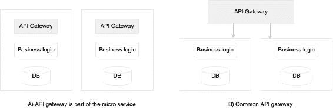

有两种方法可以部署 API 网关。第一个是每个微服务一个 API 网关，如图**A**所示。第二种方法（图**B**是为多个服务提供一个公共 API 网关。选择取决于我们在寻找什么。如果我们使用 API 网关作为反向代理，那么现成的网关（如 Apigee、Mashery 等）可以用作共享平台。如果我们需要对流量整形和复杂转换进行细粒度控制，那么每服务定制 API 网关可能更有用。

一个相关的问题是，我们将不得不从客户端向服务器进行多次调用。如果我们参考[第 1 章](01.html "Chapter 1. Demystifying Microservices")*中的假日示例*，您知道，为了呈现每个小部件，我们必须调用服务器。虽然我们只传输数据，但它仍然会在网络上增加大量开销。这种方法并非完全错误，因为在许多情况下，我们使用响应式设计和渐进式设计。数据将根据用户导航按需加载。为了做到这一点，客户机中的每个小部件都应该以延迟模式对服务器进行独立调用。如果带宽是一个问题，那么 API 网关就是解决方案。API 网关充当中间人，从多个微服务组合和转换 API。

## 将 ESB 和 iPaaS 与微服务结合使用

从理论上讲，SOA 并不完全是关于 ESB 的，但现实是，ESB 一直是许多 SOA 实现的中心。ESB 在微服务世界中扮演什么角色？

一般来说，微服务是完全云计算的本机系统，占用空间较小。微服务的轻量级特性实现了部署、扩展等的自动化。相反，企业 ESB 本质上是重量级的，并且大多数商业 ESB 都不是云友好的。ESB 的关键特性是协议中介、转换、编排和应用程序适配器。在典型的微服务生态系统中，我们可能不需要这些功能。

与微服务相关的有限 ESB 功能已经可以通过更轻量级的工具（如 API 网关）使用。编排从中央总线移动到微服务本身。因此，在微服务的情况下，不存在预期的集中式编排功能。由于服务被设置为使用 REST/JSON 调用接受更通用的消息交换样式，因此不需要协议中介。我们从 ESB 获得的最后一项功能是连接回遗留系统的适配器。对于微服务，服务本身提供了一个具体的实现，因此不需要遗留连接器。由于这些原因，在微服务世界中没有 ESB 的自然空间。

许多组织将 ESB 作为其应用程序集成（EAI）的主干。此类组织中的企业架构策略是围绕 ESB 构建的。在使用 ESB 进行集成时，可能存在许多企业级策略，如审计、日志记录、安全性、验证等。然而，微服务提倡更分散的治理。如果与微服务集成，ESB 将是一种过度杀伤力。

并非所有服务都是微服务。企业有遗留应用程序、供应商应用程序等。传统服务使用 ESB 与微服务连接。ESB 仍然占据着传统集成和供应商应用程序在企业级集成的位置。

随着云技术的发展，ESB 的能力不足以管理云之间的集成、云到内部部署等。**集成平台即服务**（**iPaaS**）正在演变为下一代应用集成平台，这进一步降低了 ESB 的作用。在典型部署中，iPaaS 调用 API 网关来访问微服务。

## 服务版本控制注意事项

当我们允许服务发展时，要考虑的一个重要方面是服务版本控制。服务版本控制应该预先考虑，而不是事后考虑。版本控制帮助我们在不破坏现有消费者的情况下发布新服务。旧版本和新版本将同时部署。

语义版本广泛用于服务版本控制。语义版本有三个组件：**大调**、**小调**和**补丁**。当有突破性的更改时使用 Major，当有向后兼容的更改时使用 minor，当有向后兼容的 bug 修复时使用 patch。

当一个微服务中有多个服务时，版本控制可能会变得复杂。与操作级别相比，在服务级别对服务进行版本设置总是很简单的。如果其中一个操作发生更改，则该服务将升级并部署到 V2。版本更改适用于服务中的所有操作。这就是不可变服务的概念。

我们可以通过三种不同的方式对 REST 服务进行版本设置：

*   URI 版本控制
*   媒体类型版本控制
*   自定义标题

在 URI 版本控制中，版本号包含在 URL 本身中。在这种情况下，我们只需要担心主要版本。因此，如果有微小的版本更改或补丁，消费者不必担心更改。将最新版本别名为非版本化 URI 是一种很好的做法，具体操作如下：

```java
/api/v3/customer/1234
/api/customer/1234  - aliased to v3.

@RestController("CustomerControllerV3")
@RequestMapping("api/v3/customer")
public class CustomerController {

}
```

稍微不同的方法是将版本号用作 URL 参数的一部分：

```java
api/customer/100?v=1.5
```

媒体类型版本控制时，客户端在 HTTP`Accept`头上设置版本如下：

```java
Accept:  application/vnd.company.customer-v3+json
```

版本控制的一种不太有效的方法是在自定义标头中设置版本：

```java
@RequestMapping(value = "/{id}", method = RequestMethod.GET, headers = {"version=3"})
public Customer getCustomer(@PathVariable("id") long id) {
     //other code goes here.
}
```

在 URI 方法中，客户端使用服务很简单。但这有一些固有的问题，例如，嵌套 URI 资源的版本控制可能很复杂。事实上，与媒体类型的方法相比，迁移客户端稍微复杂一些，多个版本的服务和其他服务都存在缓存问题。然而，这些问题并不重要，我们不能不使用 URI 方法。谷歌、推特、LinkedIn 和 Salesforce 等大多数大型互联网公司都在采用 URI 方法。

## 交叉原点设计

对于微服务，不能保证服务将从同一主机或同一域运行。复合 UI web 应用程序可以调用多个微服务来完成一项任务，这些微服务可能来自不同的域和主机。

CORS 允许浏览器客户端向托管在不同域上的服务发送请求。这在基于微服务的体系结构中至关重要。

一种方法是使所有微服务都能够允许来自其他受信任域的跨源请求。第二种方法是使用 API 网关作为客户端的单个受信任域。

## 处理共享参考数据

当破坏大型应用程序时，我们看到的一个常见问题是主数据或参考数据的管理。参考数据更像是不同微服务之间需要的共享数据。城市管理员、国家管理员等将用于许多服务，如航班时刻表、预订等。

有几种方法可以解决这个问题。例如，对于相对静态、永不更改的数据，每个服务都可以在所有微服务中硬编码这些数据：


如上图所示，另一种方法是将其构建为另一个微服务。这是好的、干净的、整洁的，但缺点是每个服务可能需要多次调用主数据。如**搜索**和**预订**示例图所示，存在事务性微服务，它们使用**地理**微服务访问共享数据：


另一个选项是使用每个微服务复制数据。没有单一所有者，但每个服务都有其所需的主数据。当有更新时，所有服务都会更新。这对性能非常友好，但必须在所有服务中复制代码。在所有微服务中保持数据同步也很复杂。如果代码库和数据比较简单，或者数据比较静态，那么这种方法是有意义的。


还有一种方法与第一种方法类似，但每个服务都有一个本地近缓存，用于存储所需的数据，这些数据将以增量方式加载。也可以根据数据量使用本地嵌入式缓存（如 Ehcache）或数据网格（如 Hazelcast 或 Infinispan）。对于大量依赖主数据的微服务来说，这是最首选的方法。

## 微服务和批量操作

由于我们已将单片应用程序分解为更小、专注的服务，因此不再可能跨微服务数据存储使用连接查询。这可能导致一个服务可能需要来自其他服务的许多记录来执行其功能的情况。


例如，每月计费功能需要许多客户的发票来处理计费。更复杂的是，发票可能有很多订单。当我们将账单、发票和订单分为三种不同的微服务时，所面临的挑战是**账单**服务必须为每个客户查询**发票**服务以获取所有发票，然后为每个发票调用**订单**服务以获取订单。这不是一个好的解决方案，因为到其他微服务的呼叫数量很高：


我们可以考虑两种方法来解决这个问题。第一种方法是在创建数据时预先聚合数据。创建订单时，将发送一个事件。**计费**微服务在收到事件后，会在内部不断聚合数据，以便每月进行处理。在这种情况下，**计费**微服务不需要进行处理。这种方法的缺点是存在重复数据。

当无法进行预聚合时，第二种方法是使用批处理 API。在这种情况下，我们调用`GetAllInvoices`，然后使用多个批，每个批进一步使用并行线程获取订单。Spring 批处理在这些情况下很有用。

# 微服务挑战

在前面的部分中，您了解了要采取的正确设计决策以及要应用的权衡。在本节中，我们将回顾微服务面临的一些挑战，以及如何解决这些挑战以实现成功的微服务开发。

## 数据岛

微服务抽象出自己的本地事务存储，用于自己的事务目的。存储类型和数据结构将针对微服务提供的服务进行优化。

例如，如果我们想要开发一个客户关系图，我们可以使用像 Neo4j、OrientDB 之类的图数据库。基于任何相关信息（如护照号码、地址、电子邮件、电话等）查找客户的预测性文本搜索最好使用索引搜索数据库（如 Elasticsearch 或 Solr）实现。

这将使我们陷入一种独特的情况，即将数据分割成异构数据孤岛。例如，客户、忠诚度积分、预订和其他都是不同的微服务，因此使用不同的数据库。如果我们希望通过合并来自所有三个数据存储的数据，对所有高价值客户进行近实时分析，该怎么办？使用单片应用程序很容易做到这一点，因为所有数据都存在于单个数据库中：


为了满足此要求，需要一个数据仓库或数据湖。Oracle、Teradata 等传统数据仓库主要用于批量报告。但有了 NoSQL 数据库（如 Hadoop）和微博客技术，数据湖的概念就可以实现近实时分析。与为批量报告而专门构建的传统仓库不同，数据湖存储原始数据，而不假设数据将如何使用。现在真正的问题是如何将数据从微服务移植到数据池中。

从微服务到数据湖或数据仓库的数据移植可以通过多种方式完成。传统的 ETL 可能是一种选择。由于我们允许使用 ETL 进行后门进入，并打破了抽象，因此这被认为不是数据移动的有效方式。更好的方法是在微服务发生时发送事件，例如，客户注册、客户更新事件等。数据摄取工具使用这些事件，并将状态更改适当地传播到数据湖。数据摄取工具是高度可伸缩的平台，如 Spring Cloud data Flow、Kafka、Flume 等。

## 测井与监测

日志文件是用于分析和调试的良好的信息。由于每个微服务都是独立部署的，所以它们会发出单独的日志，可能会发送到本地磁盘。这会导致日志碎片化。当我们跨多台机器扩展服务时，每个服务实例都可以生成单独的日志文件。这使得通过日志挖掘调试和理解服务的行为非常困难。

将**订单**、**交付**和**通知**作为三种不同的微服务进行检查，我们发现无法将运行于这三种微服务之间的客户交易关联起来：

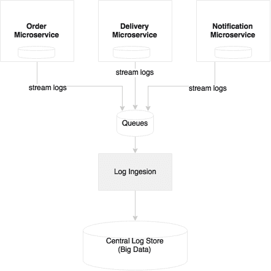

在实现微服务时，我们需要能够将日志从每个服务发送到集中管理的日志存储库。使用这种方法，服务不必依赖本地磁盘或本地 I/O。第二个优点是日志文件是集中管理的，可用于各种分析，如历史、实时和趋势分析。通过引入关联 ID，可以轻松跟踪端到端事务。

有了大量的微服务，有了多个版本和服务实例，就很难找出哪个服务正在哪个服务器上运行，这些服务的运行状况如何，服务依赖性如何等等。对于针对特定或固定服务器集进行标记的单片应用程序，这要容易得多。

除了了解部署拓扑和运行状况外，它还对识别服务行为、调试和识别热点提出了挑战。管理这样的基础设施需要强大的监控能力。

我们将在[第 7 章](07.html "Chapter 7. Logging and Monitoring Microservices")、*记录和监控微服务*中介绍记录和监控方面。

## 依赖关系管理

依赖关系管理是大型微服务部署中的关键问题之一。我们如何识别和减少变更的影响？我们如何知道是否所有相关服务都已启动并运行？如果其中一个依赖服务不可用，该服务将如何运行？

太多的依赖关系可能会给微服务带来挑战。以下是四个重要的设计方面：

*   通过正确设计服务边界来减少依赖性。
*   通过设计尽可能松散耦合的依赖项来减少影响。此外，还可以通过异步通信样式设计服务交互。
*   使用断路器等模式解决依赖性问题。
*   使用可视依赖关系图监视依赖关系。

## 组织文化

微服务实施中最大的挑战之一是组织文化。为了控制微服务的交付速度，组织应该采用敏捷开发流程、持续集成、自动化 QA 检查、自动化交付管道、自动化部署和自动化基础设施供应。

采用瀑布式开发或重量级发布管理流程且发布周期不频繁的组织对微服务开发来说是一个挑战。自动化程度不足也是微服务部署的一个挑战。

简而言之，Cloud 和 DevOps 支持微服务开发的各个方面。这些对于成功实现微服务至关重要。

## 治理挑战

微服务实施分散式治理，这与传统 SOA 治理形成了鲜明对比。组织可能会发现很难适应这种变化，这可能会对微服务开发产生负面影响。

分散治理模式带来了许多挑战。我们如何理解谁在使用服务？我们如何确保服务重用？我们如何定义组织中可用的服务？我们如何确保企业政策的实施？

第一件事是制定一套关于如何实施更好服务的标准、最佳实践和指导方针。这些应该以标准库、工具和技术的形式提供给组织。这确保了所开发的服务是高质量的，并且以一致的方式开发。

第二个重要的考虑因素是，所有利益相关者不仅可以看到所有服务，还可以看到他们的文档、合同和服务级别协议。Swagger 和 API Blueprint 通常用于处理这些需求。

## 运营费用

微服务部署通常会增加可部署单元和虚拟机（或容器）的数量。这增加了大量管理费用，增加了运营成本。

对于单个应用程序，除非业务收益非常高，否则内部数据中心中专用数量的容器或虚拟机可能没有多大意义。成本通常随着规模经济而降低。部署在完全自动化的共享基础设施中的大量微服务更有意义，因为这些微服务没有针对任何特定 VM 或容器进行标记。围绕基础架构自动化、资源调配、容器化部署等方面的功能对于大规模微服务部署至关重要。如果没有这种自动化，将导致巨大的运营开销和成本增加。

在很多微服务中，**可配置项**（**CI**）的数量太多，部署这些 CI 的服务器数量也可能无法预测。这使得在传统的**配置管理数据库**（**CMDB**中管理数据非常困难。在许多情况下，动态发现当前运行的拓扑比静态配置的 CMDB 样式部署拓扑更有用。

## 测试微服务

微服务也对服务的可测试性提出了挑战。为了实现全服务功能，一个服务可以依赖另一个服务，而另一个服务又可以同步或异步依赖另一个服务。问题是我们如何测试端到端服务以评估其行为？相关服务在测试时可能可用，也可能不可用。

服务虚拟化或服务模拟是用于测试没有实际依赖关系的服务的技术之一。在测试环境中，当服务不可用时，模拟服务可以模拟实际服务的行为。微服务生态系统需要服务虚拟化功能。然而，这可能不会提供完全的信心，因为在许多情况下，模拟服务可能不会模拟，特别是在存在深度依赖的情况下。

如前所述，另一种方法是使用消费者驱动的契约。翻译后的集成测试用例可以或多或少地覆盖服务调用的所有角落案例。

测试自动化、适当的性能测试和连续交付方法（如 A/B 测试、未来标志、金丝雀测试、蓝绿部署和红黑部署）都可以降低生产发布的风险。

## 基础设施供应

正如简要提到的运营管理费用，手动部署可能会严重挑战微服务的推出。如果部署有手动元素，部署人员或操作管理员应该知道正在运行的拓扑，手动重新路由流量，然后逐个部署应用程序，直到所有服务升级。由于许多服务器实例正在运行，这可能会导致大量的操作开销。此外，这种手动方法出错的几率很高。

微服务需要一个支持弹性云的基础设施，它可以自动配置虚拟机或容器，自动部署应用程序，调整流量，将新版本复制到所有实例，并优雅地淘汰旧版本。自动化还负责通过按需添加容器或虚拟机来弹性扩展，并在负载低于阈值时进行缩减。

在具有许多微服务的大型部署环境中，我们可能还需要其他工具来管理虚拟机或容器，这些虚拟机或容器可以进一步自动启动或销毁服务。

# 微服务能力模型

在我们结束本章之前，我们将回顾一个基于本章描述的设计指南、通用模式和解决方案的微服务能力模型。

下图描述了微服务功能模型：

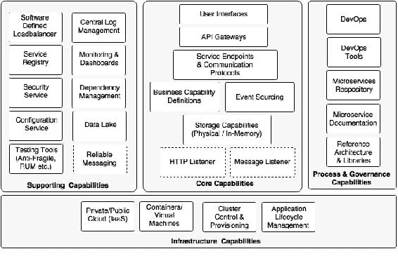

能力模型大致分为四个方面：

*   **核心能力**：这些是微服务本身的一部分
*   **支持能力**：这些是支持核心微服务实现的软件解决方案
*   **基础设施能力**：这些是成功实现微服务的基础设施级期望
*   **治理能力**：这些更多的是流程、人员和参考信息

## 核心能力

核心能力解释如下：

*   **服务侦听器**（HTTP/消息传递）：如果为基于 HTTP 的服务端点启用了微服务，则 HTTP 侦听器嵌入到微服务中，从而消除了任何外部应用程序服务器需求的需要。HTTP 侦听器在应用程序启动时启动。如果微服务基于异步通信，则会启动消息侦听器，而不是 HTTP 侦听器。或者，也可以考虑其他协议。如果微服务是定时服务，则可能没有任何侦听器。SpringBoot 和 SpringCloudStreams 提供了这一功能。
*   **存储能力**：微服务具有某种存储机制来存储与业务能力相关的状态或事务数据。这是可选的，取决于实现的功能。存储可以是物理存储（RDBMS，如 MySQL；NoSQL，如 Hadoop、Cassandra、Neo 4J、Elasticsearch 等），也可以是内存存储（缓存，如 Ehcache，数据网格，如 Hazelcast、Infinispan 等）
*   **业务能力定义**：这是微服务的核心，实现业务逻辑。这可以用任何适用的语言实现，如 Java、Scala、Concure、Erlang 等。实现该功能所需的所有业务逻辑都将嵌入到微服务本身中。
*   **事件来源**：微服务向外部世界发送状态变化，而不必真正担心这些事件的目标消费者。这些事件可能被其他微服务、审计服务、复制服务或外部应用程序等使用。这允许其他微服务和应用程序响应状态更改。
*   **服务端点和通信协议**：定义外部消费者使用的 API。这些端点可以是同步端点或异步端点。同步端点可以基于 REST/JSON 或任何其他协议，如 Avro、Thrift、协议缓冲区等。异步端点通过 RabbitMQ、其他消息传递服务器或其他消息传递样式实现（如 ZeroMQ）支持的 SpringCloud流。
*   **API 网关**：API 网关通过代理服务端点或组合多个服务端点来提供一定级别的间接寻址。API 网关对于策略实施也很有用。它还可以提供实时负载平衡功能。市场上有许多 API 网关可用。SpringCloudZuul、Mashery、Apigee 和 3scale 是 API 网关提供程序的一些示例。
*   **用户界面**：一般情况下，用户界面也是微服务的一部分，用于用户与微服务实现的业务能力进行交互。这些可以在任何技术中实现，并且与通道和设备无关。

## 基础设施能力

成功部署和管理大规模微服务需要某些基础设施功能。在大规模部署微服务时，没有适当的基础架构功能可能会带来挑战，并可能导致失败：

*   **云**：微服务在传统的数据中心环境中难以实施，基础设施的供应周期较长。即使每个微服务都有大量专用的基础设施，也可能不太划算。在数据中心内部管理它们可能会增加拥有成本和运营成本。类似云的基础设施更适合微服务部署。
*   **容器或虚拟机**：管理大型物理机并不划算，而且它们也很难管理。对于物理机器，也很难处理自动容错。虚拟化被许多组织采用，因为它能够提供物理资源的最佳利用。它还提供了资源隔离。它还减少了管理大型物理基础架构组件的开销。容器是下一代虚拟机。VMWare、Citrix 等提供了虚拟机技术。Docker、Drawbridge、Rocket 和 LXD 是一些容器船技术。
*   **集群控制和资源调配**：一旦我们有了大量的容器或虚拟机，就很难自动管理和维护它们。群集控制工具在容器顶部提供统一的操作环境，并跨多个服务共享可用容量。Apache Mesos 和 Kubernetes 是集群控制系统的例子。
*   **应用程序生命周期管理**：应用程序生命周期管理工具帮助在启动新容器时调用应用程序，或在容器关闭时终止应用程序。应用程序生命周期管理允许脚本应用程序部署和发布。它自动检测故障场景，并对这些故障做出响应，从而确保应用程序的可用性。这与群集控制软件配合使用。Marathon 部分解决了此功能。

## 保障能力

支持功能与微服务没有直接联系，但它们对大规模微服务开发至关重要：

*   **软件定义的负载平衡器**：负载平衡器应该足够智能，能够理解部署拓扑的变化，并做出相应的响应。这与在负载平衡器中配置静态 IP 地址、域别名或群集地址的传统方法不同。当新服务器添加到环境中时，它应该自动检测到这一点，并通过避免任何手动交互将它们包括在逻辑集群中。类似地，如果服务实例不可用，它应该将其从负载平衡器中取出。Ribbon、Eureka 和 Zuul 的组合在 Spring Cloud Netflix 中提供了这一功能。
*   **集中日志管理**：如本章前面所述，需要功能来集中具有相关 ID 的服务实例发出的所有日志。这有助于调试、识别性能瓶颈和预测分析。结果反馈给生命周期经理，以采取纠正措施。
*   **服务注册中心**：服务注册中心为服务提供一个运行时环境，以便服务在运行时自动发布其可用性。注册表将是一个很好的信息源，可以随时了解服务拓扑。SpringCloud 的 Eureka、Zookeeper 和 Etcd 是一些可用的服务注册工具。
*   **安全服务**：分布式微服务生态系统需要一台中央服务器来管理服务安全。这包括服务身份验证和令牌服务。基于 OAuth2 的服务广泛用于微服务安全。springsecurity 和 springsecurityoauth 是构建此功能的良好候选。
*   **服务配置**：所有服务配置都应该按照在十二要素应用原则中所讨论的进行外部化。所有配置的中央服务都是一个不错的选择。SpringCloudConfigServer 和 Archaius 是现成的配置服务器。
*   **测试工具（抗易碎品、朗姆酒等）**：网飞使用 Simian Army 进行抗易碎品测试。成熟的服务需要一致的挑战来查看服务的可靠性，以及回退机制有多好。Simian 陆军组件创建各种错误场景，以探索故障场景下系统的行为。
*   **监控和仪表盘**：微服务也需要强大的监控机制。这不仅是在基础架构级别的监控，而且是在服务级别。Spring Cloud Netflix Turbine、Histerix Dashboard 等提供服务级别信息。端到端监控工具（如 AppDynamic、New Relic、Dynatrace）以及其他工具（如 statd、Sensu 和 Spigo）可以为微服务监控增加价值。
*   **依赖项和 CI 管理**：我们还需要工具来发现运行时拓扑、服务依赖项以及管理可配置项。基于图形的 CMDB 是管理这些场景的最明显工具。
*   **数据湖**：正如本章前面讨论的，我们需要一种机制来组合存储在不同微服务中的数据，并执行近实时分析。数据湖是实现这一目标的良好选择。数据摄取工具（如 Spring Cloud Data Flow、Flume 和 Kafka）用于消费数据。HDF、Cassandra 等用于存储数据。
*   **可靠消息传递**：如果通信是异步的，我们可能需要可靠的消息传递基础设施服务，如 RabbitMQ 或任何其他可靠消息传递服务。云消息传递或消息即服务是 Internet 规模的基于消息的服务端点中的一种流行选择。

## 流程和治理能力

难题中的最后一块是微服务所需的流程和治理能力：

*   **DevOps**：成功实现微服务的关键在于采用 DevOps。DevOps 通过支持敏捷开发、高速交付、自动化和更好的变更管理来支持微服务开发。
*   **DevOps 工具**：DevOps 用于敏捷开发、持续集成、持续交付和持续部署的工具对于成功交付微服务至关重要。自动化功能、真实用户测试、综合测试、集成、发布和性能测试需要大量的强调。
*   **微服务存储库**：微服务存储库是放置微服务版本化二进制文件的地方。这些可以是简单的 Nexus 存储库或容器存储库，如 Docker 注册表。
*   **微服务文档**：正确记录所有微服务非常重要。Swagger 或 API 蓝图有助于实现良好的微服务文档。
*   **参考体系结构和图书馆**：参考体系结构提供了组织层面的蓝图，以确保服务按照一定的标准和指南以一致的方式开发。其中许多可以转化为许多可重用的库，这些库实施服务开发理念。

# 总结

在本章中，您学习了如何处理微服务开发中出现的实际场景。

您学习了可以应用于解决常见微服务问题的各种解决方案选项和模式。我们回顾了在开发大规模微服务时面临的一些挑战，以及如何有效应对这些挑战。

我们还为基于微服务的生态系统构建了一个能力参考模型。能力模型有助于在构建互联网规模的微服务时弥补差距。本章学习的能力模型将成为本书的主干。其余章节将深入探讨能力模型。

在下一章中，我们将处理一个实际问题，并使用微服务体系结构对其进行建模，以了解如何将我们学到的知识转化为实践。