# 四、微服务演进——案例研究

与 SOA 一样，不同的组织可以根据手头的问题对微服务体系结构进行不同的解释。除非详细研究一个相当大的现实问题，否则微服务的概念很难理解。

本章将介绍布朗菲尔德航空公司（BF），一家虚构的廉价航空公司，以及他们从单一的**客运销售和服务**（**PSS**应用程序到下一代微服务架构的历程。本章详细介绍了 PSS 应用程序，并解释了单片系统向基于微服务的体系结构的挑战、方法和转换步骤，遵循了前一章中介绍的原则和实践。

本案例研究的目的是让我们尽可能接近真实场景，以便将架构概念固定下来。

在本章结束时，您将了解以下内容：

*   以布朗菲尔德航空公司的 PSS 应用程序为例，介绍了将单片系统迁移到基于微服务的系统的实际案例
*   将单片应用程序迁移到微服务的各种方法和转换策略
*   使用 Spring 框架组件设计一个新的未来微服务系统来取代 PSS 应用程序

# 回顾微服务能力模型

本章中的示例从[第 3 章](03.html "Chapter 3. Applying Microservices Concepts")*应用微服务概念*中讨论的微服务能力模型中探索以下微服务能力：

*   **HTTP 侦听器**
*   **消息侦听器**
*   **存储能力（物理/内存中）**
*   **业务能力定义**
*   **服务端点&通信协议**
*   **用户界面**
*   **保安服务**
*   **微服务文档**

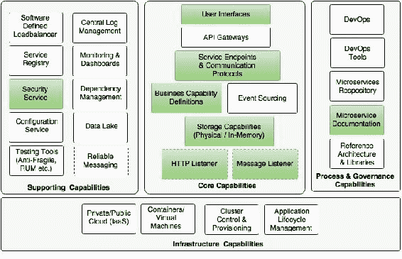

在[第 2 章](02.html "Chapter 2. Building Microservices with Spring Boot")*使用 Spring Boot 构建微服务*中，我们探讨了隔离中的所有这些功能，包括如何保护 Spring Boot 微服务。本章将基于真实案例研究构建一个全面的微服务示例。

### 提示

本章的完整源代码可在代码文件中的`Chapter 4`项目下获得。

# 了解 PSS 应用

布朗菲尔德航空公司是发展最快的低成本地区航空公司之一，从其枢纽直飞 100 多个目的地。作为一家初创航空公司，布朗菲尔德航空公司开始运营时目的地很少，飞机也很少。BrownField 开发了自己开发的 PSS 应用程序，用于处理乘客销售和服务。

## 业务流程视图

为了便于讨论，这个用例被大大简化了。下图中的流程视图显示了当前 PSS 解决方案涵盖的布朗菲尔德航空公司的端到端客运服务运营：

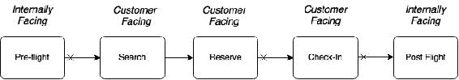

当前的解决方案是自动化某些面向客户的功能以及某些面向内部的功能。有两个面向内部的功能，**飞行前**和**飞行后**。**飞行前**功能包括计划阶段，用于编制航班时刻表、计划、飞机等。**飞行后**功能由后台用于收入管理、会计等。**搜索**和**预订**功能是在线座位预订流程的一部分，**值机**功能是在机场接受乘客的流程。**签到**功能也可供最终用户通过互联网在线签到。

上图中箭头开头的十字标记表示它们已断开连接，并出现在不同的时间线。例如，旅客可以提前 360 天预订，而登机手续通常在航班起飞前 24 小时办理。

## 功能视图

下图显示了布朗菲尔德航空公司 PSS 景观的功能构建块。每个业务流程及其相关子功能都以一行表示：

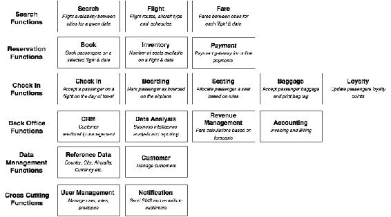

上图中显示的每个子功能都解释了其在整个业务流程中的作用。一些子功能参与多个业务流程。例如，在搜索和预订中都使用库存。为避免任何复杂情况，此图中未显示。数据管理和交叉子功能用于许多业务功能。

## 建筑景观

为了有效管理端到端的客运运营，布朗菲尔德在近十年前开发了内部 PSS 应用程序。这个架构良好的应用程序是使用 Java 和 JEE 技术以及当时最好的开源技术开发的。

总体架构和技术如下图所示：


该体系结构具有明确的边界。此外，不同的关注点被划分为不同的层。该 web 应用程序被开发为一个*N*层、基于组件的模块化系统。这些函数通过以 EJB 端点形式定义的定义良好的服务契约相互交互。

## 设计视图

应用程序有许多逻辑功能分组或子系统。此外，每个子系统都有许多组件，如下图所示：


子系统通过使用 IIOP 协议的远程 EJB 调用相互交互。事务边界跨越子系统。子系统中的组件通过本地 EJB 组件接口相互通信。理论上，由于子系统使用远程 EJB 端点，它们可以在不同的物理上分离的应用程序服务器上运行。这是设计目标之一。

## 实现视图

下图中的实现视图展示了子系统及其组件的内部组织。该图的目的还在于显示不同类型的工件：

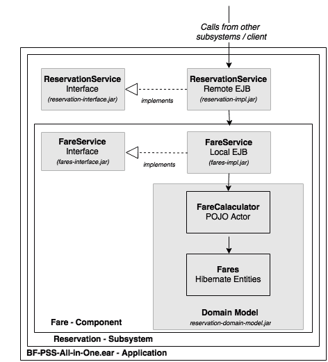

在上图中，灰色阴影框被视为不同的 Maven 项目，并转化为物理工件。子系统和组件的设计遵循*程序到接口*的原则。接口被打包为单独的 JAR 文件，以便客户机从实现中抽象出来。业务逻辑的复杂性隐藏在域模型中。本地 EJB 用作组件接口。最后，将所有子系统打包成一个一体式 EAR，并部署在应用服务器中。

## 部署视图

应用程序的初始部署简单明了，如下图所示：

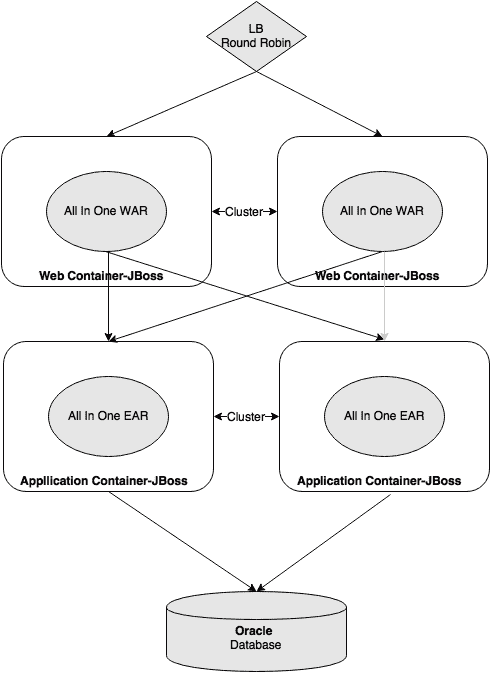

web 模块和业务模块被部署到单独的应用程序服务器集群中。通过向集群添加越来越多的应用服务器，应用程序水平扩展。

零停机部署是通过创建备用集群来处理的，并将流量优雅地转移到该集群。主集群使用新版本进行修补并恢复服务后，备用集群将被销毁。大多数数据库更改都是为了向后兼容而设计的，但破坏性更改会随着应用程序中断而升级。

# 巨石之死

PSS 应用程序运行良好，成功支持所有业务需求和预期服务级别。该系统在最初几年随着业务的有机增长而扩展方面没有问题。

这项业务在一段时间内取得了巨大的增长。车队规模显著增加，网络中增加了新的目的地。由于这种快速增长，预订数量增加，导致交易量急剧增加，达到最初估计的 200 至 500 倍。

## 痛点

业务的快速增长最终给应用程序带来了压力。奇怪的稳定性问题和性能问题浮出水面。新的应用程序版本开始破坏工作代码。此外，变更成本和交付速度开始对业务运营产生深刻影响。

下令进行端到端架构（architecture）审查，该审查揭示了系统的弱点以及许多故障的根本原因，如下所示：

*   **稳定性**：稳定性问题主要是由于线程卡住，限制了应用服务器接受更多事务的能力。被卡住的线程主要是由于数据库表锁造成的。内存问题是稳定性问题的另一个原因。某些资源密集型操作中也存在影响整个应用程序的问题。
*   **停机**：由于服务器启动时间的增加，停机窗口大幅增加。这个问题的根本原因归结为耳朵太大。任何停机窗口期间的消息堆积都会在停机窗口结束后立即导致应用程序的大量使用。因为所有东西都打包在一个 EAR 中，所以任何小的应用程序代码更改都会导致完全重新部署。前面描述的零停机部署模型的复杂性以及服务器启动时间增加了停机次数及其持续时间。
*   **敏捷性**：随着时间的推移，代码的复杂性也显著增加，部分原因是在实现更改时缺乏纪律性。因此，变革变得更加难以实施。此外，影响分析变得过于复杂，无法执行。因此，不准确的影响分析通常会导致修复，从而破坏工作代码。应用程序构建时间急剧增加，从几分钟增加到几个小时，导致开发效率下降，令人无法接受。构建时间的增加也导致了构建自动化的困难，最终停止了**持续集成**（**CI**）和单元测试。

## 权宜之计

性能问题通过在缩放立方体中应用 Y 轴缩放方法得到部分解决，如[第 1 章](01.html "Chapter 1. Demystifying Microservices")、*去神秘化微服务*所述。将包罗万象的 EAR 部署到多个不相交的集群中。安装了一个软件代理，以有选择地将流量路由到指定群集，如下图所示：


这有助于 BrownField 的 IT 部门扩展应用服务器。因此，稳定性问题得到了控制。然而，这很快导致了数据库级别的瓶颈。Oracle 的**Real Application Cluster**（**RAC**）是在数据库层实现的解决方案。

这种新的扩展模型减少了稳定性问题，但代价是增加了复杂性和拥有成本。技术债务在一段时间内也有所增加，这导致了一个国家，完全重写是减少技术债务的唯一选择。

## 回顾

尽管应用程序的架构良好，但功能组件之间存在明显的分离。它们松散耦合，编程为接口，通过基于标准的接口进行访问，并且具有丰富的域模型。

显而易见的问题是，为什么这样一个架构良好的应用程序没有达到预期的效果？建筑师还能做些什么？

了解在一段时间内出现的问题很重要。在本书的上下文中，理解微服务如何避免这些场景的重复也很重要。我们将在后续章节中研究其中一些场景。

### 共享数据

几乎所有功能模块都需要参考数据，如航空公司详细信息、飞机详细信息、机场和城市列表、国家、货币等。例如，根据出发点（城市）计算票价，航班在出发点和目的地（机场）之间，登机手续在出发点机场（机场）办理，等等。在某些函数中，参考数据是信息模型的一部分，而在某些其他函数中，它用于验证目的。

许多参考数据既不是完全静态的，也不是完全动态的。当航空公司引入新航线时，可能会增加国家、城市、机场等。当航空公司购买新飞机或更改现有飞机的座椅配置时，飞机参考数据可能会发生变化。

参考数据的常见使用场景之一是基于某些参考数据过滤操作数据。例如，假设用户希望查看到某个国家的所有航班。在这种情况下，事件流可能如下所示：查找所选国家/地区的所有城市，然后查找城市中的所有机场，然后发出请求，将所有航班发送到该国家/地区确定的最终机场列表。

架构师在设计系统时考虑了多种方法。与其他子系统一样，将参考数据分离为独立的子系统是考虑的选项之一，但这可能会导致性能问题。与其他事务相比，团队决定采用异常方法处理参考数据。考虑到前面讨论的查询模式的性质，该方法将参考数据用作共享库。

在这种情况下，允许子系统直接使用引用传递语义数据而不是通过 EJB 接口访问引用数据。这也意味着，无论子系统是什么，hibernate 实体都可以使用引用数据作为其实体关系的一部分：


如上图所示，允许预订子系统中的**预订**实体使用参考数据实体，在本例中为**机场**作为其关系的一部分。

### 单一数据库

虽然在中间层强制了足够的隔离，但所有函数都指向一个数据库，甚至指向同一个数据库模式。单一模式方法引发了大量问题。

#### 本机查询

Hibernate 框架提供了对底层数据库的良好抽象。它生成高效的 SQL 语句，在大多数情况下，使用特定方言以数据库为目标。然而，有时候，编写本机 JDBCSQLs 可以提供更好的性能和资源效率。在某些情况下，使用本机数据库函数可以提供更好的性能。

单一数据库方法在一开始运行良好。但在一段时间内，它通过连接不同子系统拥有的数据库表为开发人员打开了一个漏洞。原生 JDBCSQL 是实现这一点的好工具。

下图显示了使用本机 JDBC SQL 连接两个子系统拥有的两个表的示例：

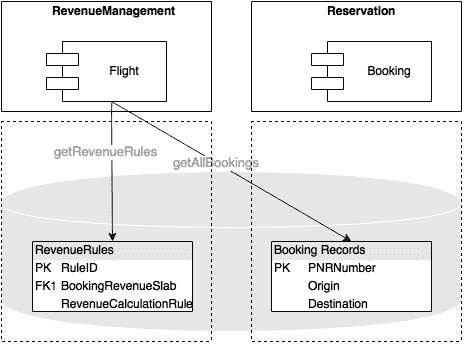

如上图所示，会计组件要求预订组件提供给定城市一天的所有预订记录，以处理日终账单。基于子系统的设计强制执行会计，以便向预订部门发出服务呼叫，以获取给定城市的所有预订记录。假设这会导致*N*预订记录。现在，对于每个预订记录，Accounting 必须执行一个数据库调用，以根据附加到每个预订记录的票价代码查找适用的规则。这可能导致*N+1*JDBC 调用，这是低效的。解决方法，如批处理查询或并行和批处理执行，都是可用的，但这会增加编码工作和更高的复杂性。开发人员通过本地 JDBC 查询解决了这个问题，这是一个易于实现的快捷方式。本质上，这种方法可以将调用的数量从*N+1*减少到单个数据库调用，只需最少的编码工作。

这种习惯在许多 JDBC 本机查询中继续，这些查询跨多个组件和子系统连接表。这不仅导致组件紧密耦合，还导致未记录、难以检测的代码。

#### 存储过程

由于使用单一数据库而出现的另一个问题是使用复杂的存储过程。在中间层编写的一些复杂的以数据为中心的逻辑性能不佳，导致响应速度慢、内存问题和线程阻塞问题。

为了解决这个问题，开发人员决定通过直接在存储过程中实现逻辑，将一些复杂的业务逻辑从中间层移动到数据库层。此决定提高了某些事务的性能，并消除了一些稳定性问题。在一段时间内，增加了越来越多的程序。然而，这最终打破了应用程序的模块化。

### 域边界

尽管域边界已经建立，但所有组件都打包为单个 EAR 文件。由于所有组件都设置为在单个容器上运行，因此开发人员无法停止跨越这些边界引用对象。经过一段时间，项目团队发生了变化，交付压力增加，复杂性大大增加。开发人员开始寻找快速解决方案，而不是正确的解决方案。缓慢但稳定地，应用程序的模块化特性消失了。

如下图所示，跨子系统边界创建了 hibernate 关系：

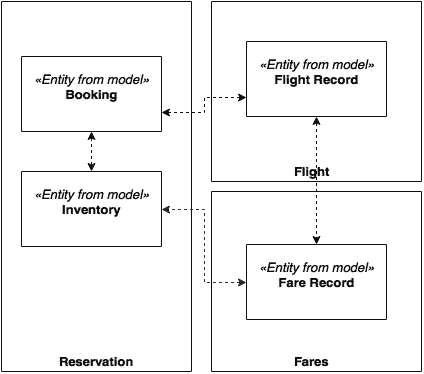

# 为救援提供微服务

没有太多的改进机会来支持布朗菲尔德航空公司不断增长的业务需求。布朗菲尔德航空公司希望用一种进化的方法而不是一种革命性的模式来重新构建该系统的平台。

在这些情况下，微服务是在对业务中断最小的情况下转换遗留单片应用程序的理想选择：

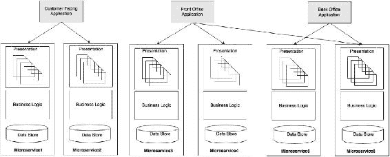

如上图所示，目标是转向与业务能力相一致的基于微服务的体系结构。每个微服务将保存数据存储、业务逻辑和表示层。

布朗菲尔德航空公司采取的方法是针对特定用户群体（如面向客户、前台和后台）构建大量 web 门户应用程序。这种方法的优势在于建模的灵活性，以及对不同社区进行不同处理的可能性。例如，面向 Internet 层的策略、体系结构和测试方法与面向 intranet 的 web 应用程序不同。面向互联网的应用程序可以利用**CDN**（**内容交付网络**）将页面移动到尽可能靠近客户的位置，而内部网应用程序可以直接从数据中心为页面提供服务。

# 商业案例

当为迁移构建业务案例时，一个常见的问题是“微服务体系结构如何避免在未来五年内再次出现相同的问题？”

微服务提供了一个完整的好处列表，您在[第 1 章](01.html "Chapter 1. Demystifying Microservices")、*揭开微服务的神秘面纱*中了解到了这一点，但在此列出一些在这种情况下至关重要的好处非常重要：

*   **服务依赖性**：当从单片应用程序迁移到微服务时，依赖性更为人所知，因此架构师和开发人员更适合避免破坏依赖性和解决未来的依赖性问题。单片应用程序的经验教训有助于架构师和开发人员设计更好的系统。
*   **物理边界**：微服务在所有领域强制物理边界，包括数据存储、业务逻辑和表示层。由于物理隔离，跨子系统或微服务的访问确实受到限制。在物理边界之外，它们甚至可以在不同的技术上运行。
*   **选择性扩展**：在微服务架构中，选择性扩展是可能的。与单片场景中使用的 Y 尺度方法相比，这提供了一种更具成本效益的缩放机制。
*   **技术过时**：技术迁移可以应用于微服务级别，而不是整体应用级别。因此，它不需要巨大的投资。

# 计划进化

打破一个拥有数百万行代码的应用程序并不简单，尤其是当代码具有复杂的依赖关系时。我们如何打破它？更重要的是，我们从哪里开始，如何解决这个问题？

## 进化方法

解决这个问题的最佳方法是建立一个过渡计划，并逐步将功能迁移为微服务。在每一步中，都会在单片应用程序之外创建一个微服务，流量将转向新服务，如下图所示：

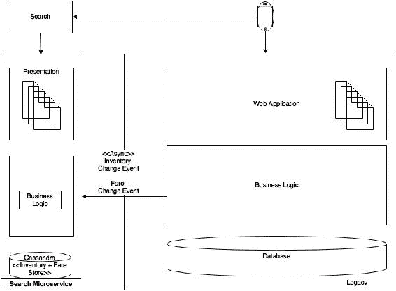

为了成功运行本次迁移，需要从过渡的角度回答几个关键问题：

*   微服务边界的识别
*   为迁移确定微服务优先级
*   在过渡阶段处理数据同步
*   处理用户界面集成，处理新旧用户界面
*   新系统中参考数据的处理
*   测试策略，以确保业务功能完好无损并正确复制
*   确定微服务开发的任何先决条件，如微服务功能、框架、流程等

## 微服务边界识别

第一个也是最重要的活动是识别微服务的边界。这是问题中最有趣的部分，也是最困难的部分。如果没有正确识别边界，迁移可能会导致更复杂的可管理性问题。

与 SOA 一样，服务分解是识别服务的最佳方式。但是，需要注意的是，分解在业务能力或有界上下文中停止。在 SOA 中，服务分解进一步深入到原子、粒度服务级别。

自顶向下的方法通常用于区域分解。自下而上的方法在破坏现有系统的情况下也很有用，因为它可以利用现有单片应用程序的大量实用知识、功能和行为。

前面的分解步骤将给出可能的微服务列表。需要注意的是，这并不是微服务的最终列表，但它是一个很好的起点。我们将运行许多过滤机制以获得最终列表。在这种情况下，功能分解的第一部分将类似于本章前面介绍的功能视图下显示的图表。

### 分析依赖关系

下一步是分析我们在上一节中创建的初始候选微服务集之间的依赖关系。此活动结束时，将生成依赖关系图。

### 注

此练习需要一个由架构师、业务分析师、开发人员、版本管理和支持人员组成的团队。

生成依赖关系图的一种方法是列出遗留系统的所有组件和覆盖依赖关系。这可以通过结合下列一种或多种方法来实现：

*   分析手动代码并重新生成依赖项。
*   使用开发团队的经验重新生成依赖项。
*   使用 Maven 依赖关系图。我们可以使用许多工具来重新生成依赖关系图，例如 PomExplorer、PomParser 等等。
*   使用性能工程工具（如 AppDynamics）来识别调用堆栈和汇总依赖项。

让我们假设我们重现了函数及其依赖关系，如下图所示：


不同模块之间有许多相互依赖的关系。底层显示跨多个模块使用的横切功能。在这一点上，模块更像意大利面条，而不是自治单元。

下一步是分析这些依赖关系，并提出更好、简化的依赖关系图。

#### 与查询相反的事件

依赖项可以是基于查询的或基于事件的。基于事件的方法更适合于可伸缩系统。有时，可以将基于查询的通信转换为基于事件的通信。在许多情况下，这些依赖关系的存在是因为业务组织是这样管理的，或者是由于旧系统处理业务场景的方式。

从上图中，我们可以提取收入管理和票价服务：


收入管理是一个模块，用于根据预订需求预测计算最优票价。如果始发地和目的地之间的票价发生变化，收入管理会调用票价模块上的更新票价，以更新票价模块中的相应票价。

另一种思路是，票价模块在票价发生任何变化时订阅收入管理，而收入管理在票价发生变化时发布。这种反应式编程方法提供了额外的灵活性，通过这种灵活性，票价和收入管理模块可以保持独立，并通过可靠的消息传递系统将它们连接起来。同样的模式也可以应用于许多其他场景，从登记到忠诚度和登机模块。

接下来，检查 CRM 和预订的场景：


此场景与前面解释的场景略有不同。CRM 模块用于管理乘客投诉。当 CRM 收到投诉时，它检索相应乘客的预订数据。事实上，与预订数量相比，投诉数量微不足道。如果我们盲目地应用 CRM 订阅所有预订的前一种模式，我们会发现它不具有成本效益：


检查签入和预订模块之间的另一个场景。不必在预订时致电 Get Bookings 服务进行登记，您是否可以在登记时收听预订活动？这是可能的，但这里的挑战是预订可以提前 360 天进行，而登记通常只在航班起飞前 24 小时开始。提前 360 天在值机模块中复制所有预订和预订更改不是明智的决定，因为在航班起飞前 24 小时，值机不需要这些数据。

另一种选择是，当航班的值机柜台打开时（起飞前 24 小时），值机柜台呼叫预订模块上的服务，以获取给定航班的预订快照。一旦完成，签入可以预订该航班的预订活动。在这种情况下，将使用基于查询和基于事件的方法的组合。通过这样做，除了减少这两个服务之间的查询数量外，我们还减少了不必要的事件和存储。

简言之，没有一个单一的策略可以控制所有场景。每个场景都需要逻辑思维，然后应用最合适的模式。

#### 与同步更新相反的事件

除了查询模型之外，依赖关系还可以是更新事务。考虑收入管理和预订之间的情景：


为了对当前需求进行预测和分析，收入管理需要所有航班的所有预订。如依赖关系图所示，当前的方法是收入管理有一个调度作业，该作业调用 Get Booking on Booking 以获取自上次同步以来的所有增量预订（新的和更改的）。

另一种方法是在预订模块中以异步推送方式发送新预订和预订中的更改。同样的模式可以应用于许多其他场景，例如从预订到会计，从航班到库存，以及从航班到预订。在这种方法中，源服务将所有状态更改事件发布到主题。所有相关方都可以订阅此事件流并在本地存储。这种方法消除了许多硬接线，并保持系统松散耦合。

下一个图中描述了依赖关系：


在上图中描述的这个例子中，我们更改了这两个依赖项，并将它们转换为异步事件。

最后一个要分析的案例是从预订模块到库存模块的更新库存呼叫：


预订完成后，库存状态通过耗尽库存服务中存储的库存进行更新。例如，当有 10 个经济舱座位可用时，在预订结束时，我们必须将其减少到 9 个。在当前系统中，预订和更新库存在相同的事务边界内执行。这是为了处理这样一种情况，即只剩下一个座位，而多个客户正试图预订。在新的设计中，如果我们应用相同的事件驱动模式，将库存更新作为事件发送到库存可能会使系统处于不一致的状态。这需要进一步的分析，我们将在本章后面讨论。

#### 质询要求

在许多情况下，可以通过再次查看需求来实现目标状态：

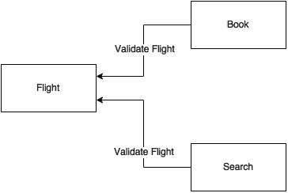

有两个验证航班呼叫，一个来自预订，另一个来自搜索模块。验证飞行调用用于验证来自不同通道的输入飞行数据。最终目标是避免存储或维护不正确的数据。当客户进行航班搜索时，如“BF100”，系统将验证该航班以查看以下内容：

*   这是否是有效航班？
*   该航班是否在该特定日期存在？
*   这趟航班有订票限制吗？

另一种解决方法是根据这些给定条件调整航班的库存。例如，如果航班有限制，则将库存更新为零。在这种情况下，情报将保留在 Flight 中，并不断更新库存。就搜索和预订而言，两者都只是查找库存，而不是验证每个请求的航班。与原始方法相比，此方法更有效。

接下来，我们将回顾支付用例。由于安全约束的性质，例如 PCIDS 之类的标准，支付通常是一种断开连接的功能。捕获付款最明显的方法是将浏览器重定向到付款服务中托管的付款页面。由于卡处理应用程序属于 PCIDSS 的权限，因此明智的做法是从支付服务中删除任何直接依赖项。因此，我们可以删除从预订到付款的直接依赖关系，并选择 UI 级集成。

#### 挑战服务边界

在本节中，我们将根据需求和依赖关系图审查一些服务边界，考虑登机手续及其与座位和行李的依赖关系。

座位功能根据飞机座位分配的当前状态运行一些算法，并找出定位下一位乘客的最佳方式，以满足重量和平衡要求。这基于许多预定义的业务规则。但是，除了值机，没有其他模块对座椅功能感兴趣。从业务能力的角度来看，座位只是签入的功能，而不是业务能力本身。因此，最好将此逻辑嵌入 Check 本身。

这同样适用于行李。棕色地带有一个单独的行李处理系统。PSS 上下文中的行李功能是打印行李标签，并根据值机记录存储行李数据。没有与此特定功能关联的业务功能。因此，理想的做法是移动此函数以检入自身。

重新设计后，图书、搜索和库存功能如下图所示：

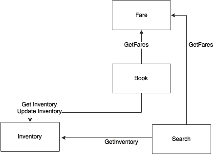

同样，库存和搜索是预订模块的更多支持功能。它们与任何业务功能本身都不一致。与之前的判断类似，将搜索和库存功能移至预订是理想的选择。假设搜索、库存和预订暂时移动到一个名为 Reservation 的微服务。

根据棕地的统计数据，搜索交易的频率是预订交易的 10 倍。此外，与预订相比，搜索不是一项创收交易。由于这些原因，我们需要不同的搜索和预订可伸缩性模型。如果搜索中的交易突然激增，预订不应受到影响。从业务的角度来看，放弃搜索事务而保存有效的预订事务更为可取。

这是一个多语言需求的例子，它否决了业务能力一致性。在这种情况下，将搜索作为一项独立于预订服务的服务更有意义。假设我们删除了搜索。只保留库存和预订。现在，搜索必须回击预订以执行库存搜索。这可能会影响预订交易：

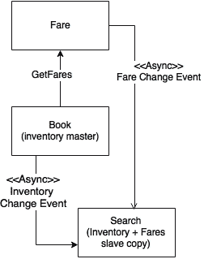

更好的方法是将库存与预订模块一起保存，并保存一份正在搜索的库存的只读副本，同时通过可靠的消息传递系统持续同步库存数据。由于库存和预订都是并置的，这也将解决两阶段提交的需要。由于它们都是本地的，因此可以很好地处理本地事务。

现在让我们挑战票价模块的设计。当客户在给定日期搜索 a 和 B 之间的航班时，我们希望同时显示航班和票价。这意味着我们的只读库存副本也可以同时包含票价和库存。然后，Search 将为任何票价更改事件订阅票价。智能仍然保留在票价服务中，但它会不断向正在搜索的缓存票价数据发送票价更新。

#### 最终依赖关系图

仍有一些同步呼叫，目前我们将保持原样。

通过应用所有这些更改，最终的依赖关系图将如下所示：


现在我们可以安全地把前面席中的每个盒子看作一个微服务。我们已经确定了许多依赖项，并将其中许多项建模为异步的。整个系统或多或少是以反应式设计的。图中仍有一些以粗体线条显示的同步呼叫，例如从登记处获取批量、从 CRM 获取预订以及从预订中获取票价。根据权衡分析，这些同步调用基本上是必需的。

## 为迁移确定微服务优先级

我们已经确定了我们基于微服务架构的第一个裁剪版本。下一步，我们将分析优先级，并确定迁移顺序。这可以通过考虑多个因素来实现解释如下：

*   **Dependency**: One of the parameters for deciding the priority is the dependency graph. From the service dependency graph, services with less dependency or no dependency at all are easy to migrate, whereas complex dependencies are way harder. Services with complex dependencies will also need dependent modules to be migrated along with them.

    与预订和登记相比，会计、忠诚度、CRM 和登机的依赖性更小。具有高度依赖性的模块在迁移过程中也会有更高的风险。

*   **Transaction volume**: Another parameter that can be applied is analyzing the transaction volumes. Migrating services with the highest transaction volumes will relieve the load on the existing system. This will have more value from an IT support and maintenance perspective. However, the downside of this approach is the higher risk factor.

    如前所述，搜索请求的数量是预订请求的十倍。入住申请是继搜索和预订之后的第三大交易量。

*   **Resource utilization**: Resource utilization is measured based on the current utilizations such as CPU, memory, connection pools, thread pools, and so on. Migrating resource intensive services out of the legacy system provides relief to other services. This helps the remaining modules to function better.

    航班、收入管理和会计是资源密集型服务，因为它们涉及数据密集型事务，如预测、计费、航班时刻表更改等。

*   **Complexity**: Complexity is perhaps measured in terms of the business logic associated with a service such as function points, lines of code, number of tables, number of services, and others. Less complex modules are easy to migrate as compared to the more complex ones.

    与登机、搜索和值机服务相比，预订极其复杂。

*   **Business criticality**: The business criticality could be either based on revenue or customer experience. Highly critical modules deliver higher business value.

    从业务角度来看，预订是最能带来收入的服务，而值机手续对业务至关重要，因为它可能导致航班起飞延误，从而导致收入损失以及客户不满。

*   **Velocity of changes**: Velocity of change indicates the number of change requests targeting a function in a short time frame. This translates to speed and agility of delivery. Services with high velocity of change requests are better candidates for migration as compared to stable modules.

    统计数据显示，搜索、预订和票价经常发生变化，而入住是最稳定的功能。

*   **Innovation**: Services that are part of a disruptive innovative process need to get priority over back office functions that are based on more established business processes. Innovations in legacy systems are harder to achieve as compared to applying innovations in the microservices world.

    与后台会计相比，大多数创新都围绕着搜索、预订、票价、收入管理和入住登记。

根据 BrownField 的分析，搜索具有最高优先级，因为它需要创新，具有较高的变化速度，对业务不太重要，并能更好地缓解业务和 it 的压力。搜索服务具有最小的依赖性，不需要将数据同步回旧系统。

## 迁移过程中的数据同步

在过渡阶段，遗留系统和新的微服务将并行运行。因此，保持两个系统之间的数据同步非常重要。

最简单的选择是使用任何数据同步工具在数据库级别同步两个系统之间的数据。当新旧系统都建立在相同的数据存储技术上时，这种方法效果很好。如果数据存储技术不同，复杂性会更高。这种方法的第二个问题是，我们允许后门进入，因此将微服务的内部数据存储暴露在外部。这违反了微服务的原则。

在我们得出一个通用解决方案之前，让我们以个案为基础进行分析。以下图显示了一旦进行搜索，数据迁移和同步方面：


假设我们使用 NoSQL 数据库在搜索服务下保存库存和票价。在这种特殊情况下，我们只需要遗留系统使用异步事件向新服务提供数据。我们必须对现有系统进行一些更改，以将票价更改或任何库存更改作为事件发送。然后搜索服务接受这些事件，并将它们本地存储到本地 NoSQL 存储中。

这对于复杂的预订服务来说有点乏味。

在这种情况下，新的 Booking microservice 将库存更改事件发送到搜索服务。除此之外，遗留应用程序还必须发送票价更改事件以进行搜索。然后，Booking 将新的 Booking 服务存储在其 MySQL 数据存储中。

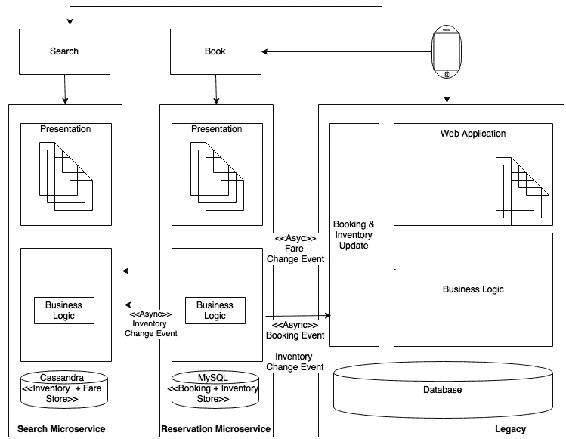

最复杂的部分是预订服务，它必须将预订事件和库存事件发送回遗留系统。这是为了确保遗留系统中的功能继续像以前一样工作。最简单的方法是编写一个更新组件，该组件接受事件并更新旧的 booking records 表，以便在其他遗留模块中不需要更改。我们将继续这样做，直到没有任何遗留组件引用预订和库存数据。这将帮助我们最小化遗留系统中的更改，从而降低故障风险。

简言之，单一的方法可能是不够的。需要一种基于不同模式的多管齐下的方法。

## 管理参考数据

将单片应用程序迁移到微服务的最大挑战之一是管理参考数据。一种简单的方法是将参考数据构建为另一个微服务本身，如下图所示：


在这种情况下，任何需要参考数据的人都应该通过微服务端点访问它。这是一种结构良好的方法，但可能会导致原始遗留系统中遇到的性能问题。

另一种方法是将参考数据作为所有管理和 CRUD 功能的微服务。然后，将在每个服务下创建近缓存，以增量缓存来自主服务的数据。瘦引用数据访问代理库将嵌入到每个服务中。引用数据访问代理提取数据是来自缓存还是来自远程服务。

这将在下一个图表中描述。给定图表中的主节点是实际参考数据微服务：


挑战是在主设备和从设备之间同步数据。频繁更改的数据缓存需要订阅机制。

更好的方法是使用内存中的数据网格替换本地缓存，如下图所示：


参考数据微服务将写入数据网格，而嵌入其他服务中的代理库将具有只读 API。这消除了订阅数据的要求，并且更加高效和一致。

## 用户界面和 web 应用程序

在过渡阶段，我们必须将新旧用户界面保持在一起。在这种情况下，通常采用三种方法。

第一种方法是将新旧用户界面作为独立的用户应用程序，它们之间没有链接，如下图所示：

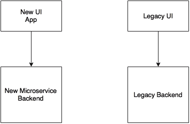

用户登录到新应用程序以及旧应用程序，就像两个不同的应用程序一样，它们之间没有**单一登录**（**SSO**）。这种方法很简单，没有开销。在大多数情况下，除非针对两个不同的用户社区，否则这可能是业务部门无法接受的。

第二种方法是将旧用户界面用作主应用程序，然后当用户请求新应用程序的页面时，将页面控件转移到新用户界面：


在这种情况下，由于新旧应用程序都是在 web 浏览器窗口中运行的基于 web 的应用程序，用户将获得无缝体验。SSO 必须在新旧用户界面之间实现。

第三种方法是将现有的遗留用户界面直接集成到新的微服务后端，如下图所示：


在这种情况下，新的微服务构建为无头应用程序，没有表示层。这可能具有挑战性，因为它可能需要对旧用户界面进行许多更改，例如引入服务调用、数据模型转换等。

最后两个案例中的另一个问题是如何处理资源和服务的身份验证。

### 会话处理与安全

假设新服务是基于 Spring Security 编写的，采用基于令牌的授权策略，而旧应用程序使用自定义的身份验证及其本地身份存储。

下图显示了如何在旧服务和新服务之间进行集成：


最简单的方法，如上图所示，是使用 Spring Security 构建一个带有身份验证服务的新身份存储，作为一个新的微服务。这将用于我们未来所有的资源和服务保护，以及所有的微服务。

现有用户界面应用程序根据新的身份验证服务对自身进行身份验证，并保护令牌。此令牌将被传递到新的用户界面或新的微服务。在这两种情况下，用户界面或微服务将调用身份验证服务来验证给定令牌。如果令牌有效，则 UI 或微服务接受该调用。

这里的问题是旧标识存储必须与新标识存储同步。

## 测试策略

从测试的角度来看，需要回答的一个重要问题是，我们如何确保所有功能都以迁移前的方式工作？

应该为迁移或重构之前要迁移的服务编写集成测试用例。这确保了一旦迁移，我们将获得相同的预期结果，并且系统的行为保持不变。自动回归测试包必须到位，并且每次我们在新的或旧的系统中进行更改时都必须执行。

在下图中，对于每个服务，我们需要一个针对 EJB 端点的测试，另一个针对 MicroService 端点的测试：

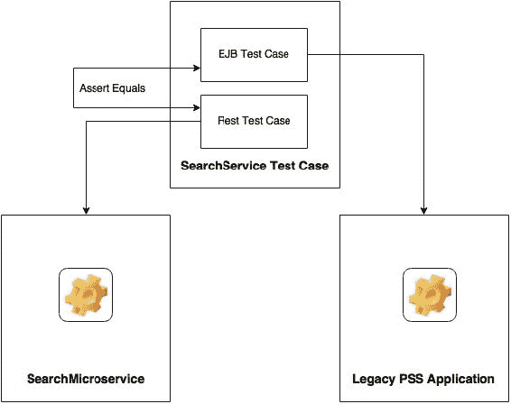

## 建设生态系统能力

在开始实际迁移之前，我们必须构建能力模型中提到的所有微服务能力，如[第 3 章](03.html "Chapter 3. Applying Microservices Concepts")、*应用微服务概念*所述。这些是开发基于微服务的系统的先决条件。

除了这些功能外，还需要预先构建某些应用程序功能，如参考数据、安全性和 SSO 以及客户和通知。数据仓库或数据湖也是一个先决条件。一种有效的方法是以增量方式构建这些功能，将开发推迟到真正需要时。

# 仅在需要时迁移模块

在前面的章节中，我们研究了从单一应用程序到微服务的转换方法和步骤。重要的是要理解，除非确实需要，否则没有必要将所有模块迁移到新的微服务体系结构。一个主要原因是这些迁移会产生成本。

我们将在这里回顾一些这样的场景。棕地已决定使用外部收入管理系统代替 PSS 收入管理功能。棕地公司也正在集中其会计职能，因此无需从遗留系统迁移会计职能。在这一点上，CRM 的迁移并没有给业务增加多少价值。因此，决定将 CRM 保留在遗留系统中。作为云战略的一部分，该公司计划转向基于 SaaS 的 CRM 解决方案。还请注意，在迁移过程中途暂停可能会严重影响系统的复杂性。

# 目标架构

下图所示的架构蓝图将先前的讨论整合到架构视图中。图中的每个块表示一个微服务。阴影框是核心微服务，其他框支持微服务。该图还显示了每个微服务的内部功能。用户管理在目标体系结构的安全性下移动：


每个服务都有自己的体系结构，通常由表示层、一个或多个服务端点、业务逻辑、业务规则和数据库组成。正如我们所看到的，我们使用了不同的数据库选择，这些数据库更适合于每个微服务。每个服务都是自治的，服务之间的编排最少。大多数服务使用服务端点彼此交互。

## 微服务内部分层

在这一节中，我们将进一步探讨微服务的内部结构。微服务的内部架构没有可遵循的标准。经验法则是在简单的服务端点后面抽象实现。

典型结构如下图所示：


UI 通过服务网关访问 REST 服务。API 网关可以是每个微服务一个，也可以是多个微服务一个，这取决于我们希望如何使用 API 网关。微服务可能会公开一个或多个 rest 端点。这些端点依次连接到服务中的一个业务组件。然后，业务组件在域实体的帮助下执行所有业务功能。存储库组件用于与后端数据存储交互。

## 编排微服务

预订编排和规则执行的逻辑位于预订服务中。大脑仍然以一个或多个预订业务组件的形式存在于预订服务中。在内部，业务组件协调由其他业务组件甚至外部服务公开的私有 API：


如上图所示，预订服务在内部调用以更新其自身组件的库存，而不是调用票价服务。

此活动是否需要任何编排引擎？这取决于需求。在复杂的场景中，我们可能需要同时做很多事情。例如，创建预订会在内部应用许多预订规则，它会验证票价，并在创建预订之前验证库存。我们可能希望并行执行它们。在这种情况下，我们可以使用 Java 并发 API 或反应式 Java 库。

在极其复杂的情况下，我们可能会选择集成框架，如嵌入式模式下的 Spring 集成或 Apache Camel。

## 与其他系统的集成

在微服务世界中，我们使用 API 网关或可靠的消息总线与其他非微服务集成。

让我们假设棕色地带中有另一个系统需要预订数据。不幸的是，系统无法订阅 booking microservice 发布的预订活动。在这种情况下，可以使用**企业应用集成**（**EAI**解决方案），该解决方案监听我们的预订事件，然后使用本机适配器更新数据库。

## 管理共享库

某些业务逻辑用于多个微服务。在本例中，搜索和预订使用库存规则。在这种情况下，这些共享库将在两个微服务中复制。

## 异常处理

检查预订场景，了解不同的异常处理方法。在下面的维修顺序图中，有三行用十字标记。这些是可能发生异常的潜在领域：


在预订和票价之间存在同步通信。如果没有票价服务怎么办？如果票价服务不可用，将错误返回给用户可能会导致收入损失。另一种想法是信任作为传入请求一部分的费用。当我们提供搜索服务时，搜索结果也会有票价。当用户选择航班并提交时，请求将具有所选的票价。如果票价服务不可用，我们相信收到的请求，并接受预订。我们将使用断路器和回退服务，该服务仅创建具有特殊状态的预订，并将预订排队以进行手动操作或系统重试。

如果创建预订失败怎么办？如果创建预订意外失败，更好的选择是向用户发回消息。我们可以尝试其他选择，但这可能会增加系统的整体复杂性。这同样适用于库存更新。

在创建预订和更新库存的情况下，我们避免了创建预订和库存更新以某种方式失败的情况。由于库存至关重要，最好在本地事务中同时创建预订和更新库存。这是可能的，因为两个组件位于同一子系统下。

如果我们考虑签入方案，签入将事件发送到登机和预订，如下一个图表所示：

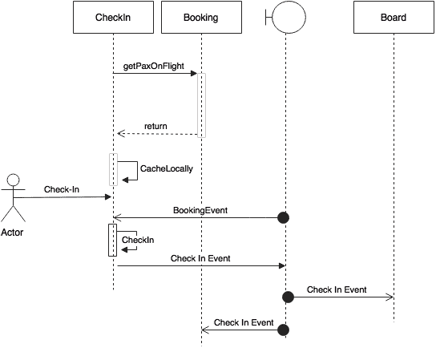

考虑一下，To.T0.一个在签入完成事件之后立即发送签入服务失败的场景。其他使用者处理了此事件，但实际的签入被回滚。这是因为我们没有使用两阶段提交。在这种情况下，我们需要一种恢复该事件的机制。这可以通过捕获异常并发送另一个签入取消事件来完成。

在这种情况下，请注意，为了尽量减少补偿事务的使用，将签入事件发送移到签入事务的末尾。这减少了发送事件后失败的机会。

另一方面，如果签入成功，但发送事件失败怎么办？我们可以想出两种方法。第一种方法是调用回退服务将其存储在本地，然后使用另一个扫描程序在稍后发送事件。它甚至可以重试多次。这可能会增加复杂性，而且并非在所有情况下都有效。另一种方法是将异常抛出给用户，以便用户可以重试。然而，从客户参与的角度来看，这可能并不总是好的。另一方面，较早的选项更有利于系统的健康。需要进行权衡分析，以找出给定情况下的最佳解决方案。

# 目标实现视图

下图为棕地 PSS 微服务系统的实施视图：


如上图所示，我们以实现四个微服务为例：搜索、票价、预订和入住。为了测试该应用程序，有一个网站应用程序是使用 SpringMVC 和 Thymeleaf 模板开发的。异步消息传递是在 RabbitMQ 的帮助下实现的。在这个示例实现中，出于演示目的，默认的 H2 数据库被用作内存存储。

本节中的代码展示了本章*回顾微服务能力模型*一节中强调的所有能力。

## 实施项目

布朗菲尔德航空公司 PSS 微服务系统的基本实施有五个核心项目，如下表所示。该表还显示了用于这些项目的端口范围，以确保本书的一致性：

<colgroup class="calibre17"><col class="calibre18"> <col class="calibre18"> <col class="calibre18"></colgroup> 
| 

微服务

 | 

项目

 | 

港口范围

 |
| --- | --- | --- |
| 图书微服务 | `chapter4.book` | `8060`-`8069` |
| 签入微服务 | `chapter4.checkin` | `8070`-`8079` |
| 票价微服务 | `chapter4.fares` | `8080`-`8089` |
| 搜索微服务 | `chapter4.search` | `8090`-`8099` |
| 网站 | `chapter4.website` | `8001` |

网站是用于测试 PSS 微服务的 UI 应用程序。

本例中的所有 microservice 项目都遵循与包结构相同的模式，如以下屏幕截图所示：

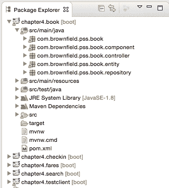

不同的软件包及其用途解释如下：

*   根文件夹（`com.brownfield.pss.book`包含默认的 Spring 引导应用程序。
*   `component`包承载实现业务逻辑的所有服务组件。
*   `controller`包承载 REST 端点和消息传递端点。控制器类内部使用组件类执行。
*   `entity`包包含用于映射到数据库表的 JPA 实体类。
*   存储库类打包在`repository`包中，基于 Spring 数据 JPA。

## 项目的运行和测试

按照下面列出的步骤构建和测试本章开发的微服务：

1.  使用 Maven 构建每个项目。确保`test`标志已关闭。测试程序假定其他依赖服务已启动并正在运行。如果从属服务不可用，则会失败。在我们的示例中，预订和票价有直接的依赖关系。我们将在[第 7 章](07.html "Chapter 7. Logging and Monitoring Microservices")、*记录和监控微服务*：

    ```java
    mvn -Dmaven.test.skip=true install

    ```

    中学习如何规避这种依赖性
2.  运行 RabbitMQ 服务器：

    ```java
    rabbitmq_server-3.5.6/sbin$ ./rabbitmq-server

    ```

3.  在单独的终端窗口中运行以下命令：

    ```java
    java -jar target/fares-1.0.jar
    java -jar target/search-1.0.jar
    java -jar target/checkin-1.0.jar
    java -jar target/book-1.0.jar
    java -jar target/website-1.0.jar

    ```

4.  网站项目有一个`CommandLineRunner`，它在启动时执行所有测试用例。所有服务成功启动后，在浏览器中打开`http://localhost:8001`。
5.  浏览器要求提供基本的安全凭据。使用`guest`或`guest123`作为凭证。此示例仅显示具有基本身份验证机制的网站安全性。如[第 2 章](02.html "Chapter 2. Building Microservices with Spring Boot")所述，*使用SpringBoot构建微服务*，使用 OAuth2 可以实现服务级别的安全性。
6.  Entering the correct security credentials displays the following screen. This is the home screen of our BrownField PSS application:

    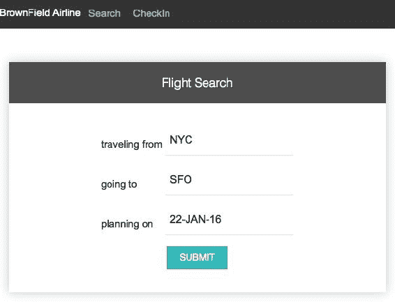

7.  **提交**按钮调用搜索微服务，获取符合屏幕条件的可用航班。一些航班是在搜索微服务启动时预先填充的。如果需要，编辑搜索微服务代码以输入其他航班。
8.  The output screen with a list of flights is shown in the next screenshot. The **Book** link will take us to the booking screen for the selected flight:

    

9.  The following screenshot shows the booking screen. The user can enter the passenger details, and create a booking by clicking on the **CONFIRM** button. This invokes the Booking microservice, and internally, the Fare service as well. It also sends a message back to the Search microservice:

    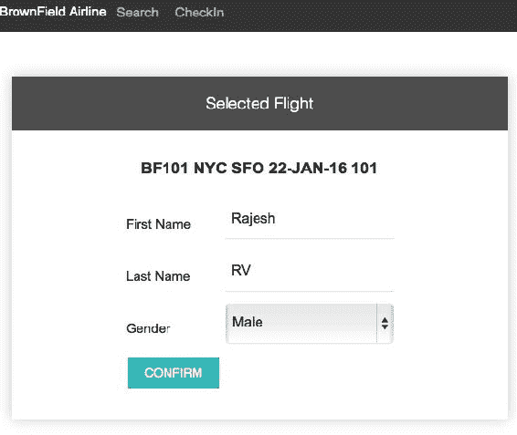

10.  If booking is successful, the next confirmation screen is displayed with a booking reference number:

    

11.  Let us test the Check-in microservice. This can be done by clicking on **CheckIn** in the menu at the top of the screen. Use the booking reference number obtained in the previous step to test Check-in. This is shown in the following screenshot:

    

12.  Clicking on the **SEARCH** button in the previous screen invokes the Booking microservice, and retrieves the booking information. Click on the **CheckIn** link to perform the check-in. This invokes the Check-in microservice:

    

13.  If check-in is successful, it displays the confirmation message, as shown in the next screenshot, with a confirmation number. This is done by calling the Check-in service internally. The Check-in service sends a message to Booking to update the check-in status:

    

# 总结

在本章中，我们使用基本的 Spring 引导功能实现并测试了 BrownField PSS 微服务。我们学习了如何使用 microservices 架构来处理实际用例。

我们研究了从单一应用程序向微服务发展的现实世界的各个阶段。我们还评估了多种方法的优缺点，以及迁移单片应用程序时遇到的障碍。最后，我们解释了我们所研究的用例的端到端微服务设计。一个成熟的微服务实现的设计和实现也得到了验证。

在下一章中，我们将看到 SpringCloud项目如何帮助我们将已开发的棕地 PSS 微服务转变为互联网规模的部署。