# 第五章：用 Spring 云扩展微服务

为了管理 Internet 规模的微服务，需要比 Spring Boot 框架提供的功能更多的功能。SpringCloud 项目有一套专门构建的组件，可以轻松实现这些附加功能。

本章将根据[第 3 章](03.html "Chapter 3. Applying Microservices Concepts")*应用微服务概念*中讨论的微服务能力模型，深入了解 Spring 云项目的各个组件，如 Eureka、Zuul、Ribbon 和 Spring Config。它将演示 Spring 云组件如何帮助扩展 BrownField 航空公司在上一章中开发的 PSS 微服务系统。

在本章结束时，您将了解以下内容：

*   用于外部化配置的 Spring 配置服务器
*   用于服务注册和发现的 Eureka 服务器
*   Zuul 作为服务代理和网关的相关性
*   微服务自动注册和服务发现的实现
*   用于异步微服务组合的 Spring 云消息传递

# 回顾微服务能力

本章中的示例从[第 3 章](03.html "Chapter 3. Applying Microservices Concepts")*应用微服务概念*中讨论的微服务能力模型中探索以下微服务能力：

*   **软件定义的负载平衡器**
*   **服务注册**
*   **配置服务**
*   **可靠的云消息**
*   **API 网关**

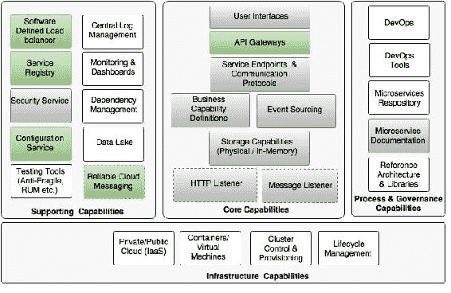

# 审查棕地的 PSS 实施情况

在[第 4 章](04.html "Chapter 4. Microservices Evolution – A Case Study")*微服务演进——案例研究*中，我们使用 Spring 框架和 Spring Boot 为棕地航空公司设计并开发了基于微服务的 PSS 系统。从开发的角度来看，实现是令人满意的，并且它为低交易量的交易服务。但是，这还不足以部署具有数百甚至数千个微服务的大型企业级部署。

在[第 4 章](04.html "Chapter 4. Microservices Evolution – A Case Study")*微服务演进——案例研究*中，我们开发了四种微服务：搜索、预订、票价和入住。我们还开发了一个网站来测试微服务。

到目前为止，我们在微服务实施中完成了以下项目：

*   每个微服务公开一组 REST/JSON 端点，用于访问业务功能
*   每个微服务都使用 Spring 框架实现某些业务功能。
*   每个微服务都使用 H2（内存中的数据库）存储自己的持久数据
*   微服务是用 Spring Boot 构建的，Spring Boot 有一个嵌入式 Tomcat 服务器作为 HTTP 侦听器
*   RabbitMQ 用作外部消息传递服务。搜索、预订和签入通过异步消息传递相互交互
*   Swagger 与所有微服务集成，用于记录 RESTAPI。
*   为了保护微服务，开发了基于 OAuth2 的安全机制

# 什么是春云？

Spring 云项目是 Spring 团队的一个总括项目，它实现了分布式系统所需的一组通用模式，作为一组易于使用的 JavaSpring 库。尽管名称不同，SpringCloud 本身并不是一个云解决方案。相反，它提供了许多功能，这些功能在开发针对云部署的应用程序时是必不可少的，这些应用程序遵循十二要素应用程序原则。通过使用 SpringCloud，开发人员只需专注于使用 SpringBoot 构建业务功能，并利用 SpringCloud 提供的分布式、容错和自愈功能。

Spring 云解决方案与部署环境无关，可以在台式 PC 或弹性云中开发和部署。使用 SpringCloud 开发的云就绪解决方案也是不可知的，可以跨许多云提供商（如 CloudFoundry、AWS、Heroku 等）移植。当不使用 SpringCloud 时，开发人员最终将使用云供应商本机提供的服务，从而导致与 PaaS 提供商的深度耦合。开发人员的另一种选择是编写大量样板代码来构建这些服务。SpringCloud 还提供了简单易用的 Spring 友好 API，这些 API 抽象了云提供商的服务 API，如 AWS 通知服务附带的 API。

基于 Spring 的“约定优先于配置”方法，SpringCloud 默认所有配置，并帮助开发人员快速启动。SpringCloud 还隐藏了复杂性，并提供了简单的声明性配置来构建系统。Spring 云组件占用的空间较小，这使得它对开发人员非常友好，也使得开发云本地应用程序变得容易。

SpringCloud 根据开发人员的需求为他们提供了许多解决方案选择。例如，服务注册可以使用流行的选项来实现，例如，如 Eureka、ZooKeeper 或 Concur。SpringCloud 的组件是相当解耦的，因此，开发人员可以灵活地选择所需的组件。

### 注

**春云和云铸造有什么区别？**

Spring 云是用于开发互联网规模的 Spring Boot 应用程序的开发工具包，而 Cloud Foundry 是一个开源平台，用于构建、部署和扩展应用程序。

## 春云释放

Spring 云项目是一个总体 Spring 项目，包括不同组件的组合。这些组件的版本在`spring-cloud-starter-parent`BOM 中定义。

在本书中，我们依靠的是`Brixton.RELEASE`版本的春云：

```java
  <dependency>
    <groupId>org.springframework.cloud</groupId>
    <artifactId>spring-cloud-dependencies</artifactId>
    <version>Brixton.RELEASE</version>
    <type>pom</type>
    <scope>import</scope>
  </dependency>
```

`spring-cloud-starter-parent`对其子组件的不同版本定义如下：

```java
<spring-cloud-aws.version>1.1.0.RELEASE</spring-cloud-aws.version>
<spring-cloud-bus.version>1.1.0.RELEASE</spring-cloud-bus.version>
<spring-cloud-cloudfoundry.version>1.0.0.RELEASE</spring-cloud-cloudfoundry.version>
<spring-cloud-commons.version>1.1.0.RELEASE</spring-cloud-commons.version>
<spring-cloud-config.version>1.1.0.RELEASE</spring-cloud-config.version>
<spring-cloud-netflix.version>1.1.0.RELEASE</spring-cloud-netflix.version>
<spring-cloud-security.version>1.1.0.RELEASE</spring-cloud-security.version>
<spring-cloud-cluster.version>1.0.0.RELEASE</spring-cloud-cluster.version>
<spring-cloud-consul.version>1.0.0.RELEASE</spring-cloud-consul.version>
<spring-cloud-sleuth.version>1.0.0.RELEASE</spring-cloud-sleuth.version>
<spring-cloud-stream.version>1.0.0.RELEASE</spring-cloud-stream.version>
<spring-cloud-zookeeper.version>1.0.0.RELEASE </spring-cloud-zookeeper.version>
```

### 注

春季云释放的名称按字母顺序排列，以 A 开头，紧跟伦敦地铁站的名称。**Angel**是第一个版本，**Brixton**是第二个版本。

## 春云成分

每个 Spring 云组件都专门针对特定的分布式系统功能。下图底部的灰色框显示了这些功能，位于这些功能顶部的框显示了解决这些功能的 Spring Cloud 子项目：


Spring 云功能解释如下：

*   **分布式配置**：当有很多微服务实例在开发、测试、生产等不同配置文件下运行时，配置属性很难管理。因此，重要的是以受控的方式集中管理它们。分布式配置管理模块是将微服务配置参数外部化和集中化。Spring Cloud Config 是一个外部化的配置服务器，以 Git 或 SVN 作为后台存储库。SpringCloudBus 支持将配置更改传播到多个订阅者，通常是一个微服务实例。或者，ZooKeeper 或 HashiCorp 的领事也可以用于分布式配置管理。
*   **路由**：路由是一个 API 网关组件，主要用于类似于反向代理，将消费者的请求转发给服务提供商。网关组件还可以执行基于软件的路由和筛选。Zuul 是一个轻量级 API 网关解决方案，为开发人员提供细粒度的流量整形和请求/响应转换控制。
*   **负载平衡**：负载平衡功能需要一个软件定义的负载平衡模块，该模块可以使用各种负载平衡算法将请求路由到可用的服务器。Ribbon 是支持此功能的 Spring 云子项目。Ribbon 可以作为独立组件使用，也可以与 Zuul 无缝集成并用于流量路由。
*   **服务注册和发现**：服务注册和发现模块使服务能够在服务可用且准备接受流量时以编程方式向存储库注册。微服务宣传它们的存在，并使它们易于发现。然后，使用者可以查询注册表，以获得服务可用性和端点位置的视图。在许多情况下，注册表或多或少是一个转储。但是注册表周围的组件使生态系统变得智能化。SpringCloud 下有许多支持注册和发现功能的子项目。Eureka、ZooKeeper 和 concur 是实现注册功能的三个子项目。
*   **服务到服务调用**：SpringCloud 下的 SpringCloud 外挂子项目提供了一种声明性方法，可以同步进行 RESTful 服务到服务调用。声明式方法允许应用程序使用与**POJO**（**普通旧 Java 对象**接口，而不是低级 HTTP 客户端 API。Feign 内部使用反应库进行通信。
*   **断路器**：断路器子项目实现断路器模式。当断路器在主服务中遇到故障时，通过将通信量转移到另一个临时备用服务，断路器断开电路。当服务恢复正常时，它还会自动重新连接回主服务。最后，它提供了一个用于监视服务状态更改的监视仪表板。Spring Cloud Hystrix 项目和 Hystrix 仪表板分别实现断路器和仪表板。
*   **全局锁、领导选举和集群状态**：在处理大型部署时，集群管理和协调需要此功能。它还提供用于各种目的的全局锁，如序列生成。SpringCloudCluster 项目使用 Redis、ZooKeeper 和 Concur 实现这些功能。
*   **安全**：使用外部化授权提供商（如 OAuth2）为云本地分布式系统构建安全性需要安全能力。Spring 云安全项目使用可定制的授权和资源服务器实现此功能。它还提供 SSO 功能，这在处理许多微服务时是必不可少的。
*   **大数据支持**：大数据支持能力是与大数据解决方案相关的数据服务和数据流所需要的能力。Spring 云流和 Spring 云数据流项目实现了这些功能。SpringCloud 数据流是 SpringXD 的重新设计版本。
*   **分布式跟踪**：分布式跟踪功能有助于线程化和关联跨越多个微服务实例的转换。springcloudsleuth 通过在各种分布式跟踪机制（如 Zipkin 和 HTrace）之上提供一个抽象并支持 64 位 ID 来实现这一点。
*   **分布式消息传递**：Spring Cloud Stream 在 Kafka、Redis 和 RabbitMQ 等可靠消息传递解决方案的基础上提供声明式消息传递集成。
*   **云支持**：Spring Cloud 还提供了一组功能，在不同的云提供商（如 Cloud Foundry 和 AWS）之上提供各种连接器、集成机制和抽象。

### 春云与网飞 OSS

对于微服务部署而言，至关重要的许多 Spring 云组件来自**Netflix 开源软件**（**Netflix OSS**中心。Netflix 是微服务领域的先驱者和早期改革者之一。为了管理大规模的微服务，Netflix 的工程师们提出了许多自主开发的工具和技术来管理他们的微服务。这些基本上都是精心设计的，以填补 AWS 平台在管理 Netflix 服务方面的一些软件空白。后来，Netflix 将这些组件开源，并在 Netflix OSS 平台下提供给公众使用。这些组件广泛用于生产系统，并在 Netflix 的大规模微服务部署中进行了作战测试。

SpringCloud 为这些 Netflix OSS 组件提供了更高级别的抽象，使其更为 Spring 开发者友好。它还提供了一种声明性机制，与 Spring Boot 和 Spring 框架进行了很好的集成和协调。

# 设置棕地 PSS 环境

在本章中，我们将使用 Spring 云功能修改[第 4 章](04.html "Chapter 4. Microservices Evolution – A Case Study")、*微服务演变——案例研究*中开发的棕地 PSS 微服务。我们还将研究如何使用 Spring 云组件使这些服务成为企业级服务。

本章后面的部分将探讨如何利用 Spring cloud 项目提供的一些现成功能，为云级部署扩展上一章中开发的微服务。本章的其余部分将探讨 Spring 云的功能，例如使用 Spring 配置服务器进行配置、基于功能区的服务负载平衡、使用 Eureka、Zuul for API gateway 进行服务发现，最后是用于基于消息的服务交互的 Spring 云消息传递。我们将通过修改[第 4 章](04.html "Chapter 4. Microservices Evolution – A Case Study")、*微服务演变——案例研究*中开发的棕地 PSS 微服务来展示这些能力。

为了准备本章的环境，将（`chapter4.*`导入并重命名为`chapter5.*`项目到新的 STS 工作区中。

### 注

本章的完整源代码可在代码文件中的`Chapter 5`项目下获得。

# 春云形态

Spring 云配置服务器是一个外部化的配置服务器，应用程序和服务可以在其中存放、访问和管理所有运行时配置属性。Spring 配置服务器还支持配置属性的版本控制。

在 Spring Boot 的早期示例中，所有配置参数都是从项目内部打包的属性文件中读取的，`application.properties`或`application.yaml`。这种方法很好，因为所有属性都从代码中移到属性文件中。然而，当微服务从一个环境移动到另一个环境时，这些属性需要进行更改，这需要重新构建应用程序。这违反了十二要素应用程序原则之一，该原则提倡一次性构建和跨环境移动二进制文件。

更好的方法是使用概要文件的概念。如[第 2 章](02.html "Chapter 2. Building Microservices with Spring Boot")所述，*使用 Spring Boot*构建微服务的配置文件用于为不同的环境划分不同的属性。配置文件特定的配置将命名为`application-{profile}.properties`。例如，`application-development.properties`表示针对开发环境的属性文件。

然而，这种方法的缺点是配置是与应用程序一起静态打包的。配置属性中的任何更改都需要重新生成应用程序。

有其他方法可以从应用程序部署包外部化配置属性。还可以通过多种方式从外部源读取可配置属性：

*   使用 JNDI 命名空间（`java:comp/env`从外部 JNDI 服务器发送）
*   使用 Java 系统属性（`System.getProperties()`或使用`–D`命令行选项
*   使用`PropertySource`配置：

    ```java
    @PropertySource("file:${CONF_DIR}/application.properties")
      public class ApplicationConfig {
    }
    ```

*   使用命令行参数将文件指向外部位置：

    ```java
    java -jar myproject.jar --spring.config.location=

    ```

JNDI 操作成本高、缺乏灵活性、复制困难，并且不受版本控制。`System.properties`对于大规模部署来说不够灵活。最后两个选项依赖于安装在服务器上的本地或共享文件系统。

对于大规模部署，需要一个简单但功能强大的集中式配置管理解决方案：

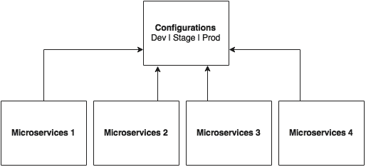

如上图所示，所有微服务都指向一个中央服务器，以获取所需的配置参数。然后，微服务在本地缓存这些参数以提高性能。配置服务器将配置状态更改传播到所有订阅的微服务，以便可以使用最新的更改更新本地缓存的状态。配置服务器还使用配置文件解析特定于环境的值。

如下面的屏幕截图所示，SpringCloud 项目下有多个选项可用于构建配置服务器。**配置服务器**、**动物园管理员配置**、**领事配置**可供选择。但是，本章将只关注 Spring 配置服务器实现：


Spring 配置服务器将属性存储在版本控制的存储库中，如 Git 或 SVN。Git 存储库可以是本地的，也可以是远程的。高可用性远程 Git 服务器是大规模分布式微服务部署的首选。

Spring 云配置服务器架构如下图所示：

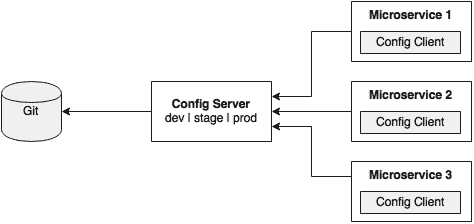

如上图所示，Spring Boot microservices 中嵌入的配置客户端使用简单的声明机制从中央配置服务器执行配置查找，并将属性存储到 Spring 环境中。配置属性可以是应用程序级配置（如每日交易限额），也可以是与基础结构相关的配置（如服务器 URL、凭据等）。

与 SpringBoot 不同，SpringCloud 使用引导上下文，它是主应用程序的父上下文。引导上下文负责从配置服务器加载配置属性。引导上下文查找用于加载初始配置属性的`bootstrap.yaml`或`bootstrap.properties`。要在 Spring 引导应用程序中实现此功能，请将`application.*`文件重命名为`bootstrap.*`。

## 下一步是什么？

接下来的几节将演示如何在真实场景中使用配置服务器。为此，我们将修改搜索微服务（`chapter5.search`以使用配置服务器。下图描述了该场景：

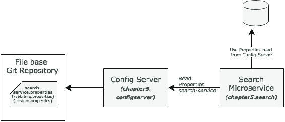

在这个示例中，搜索服务将在启动时通过传递服务名称来读取配置服务器。在这种情况下，搜索服务的服务名称将为`search-service`。为`search-service`配置的属性包括 RabbitMQ 属性以及自定义属性。

### 注

本节的完整源代码可在`chapter5.configserver`项目的代码文件中找到。

## 设置配置服务器

使用 STS 创建新的配置服务器需要遵循以下步骤：

1.  Create a new **Spring Starter Project**, and select **Config Server** and **Actuator** as shown in the following diagram:

    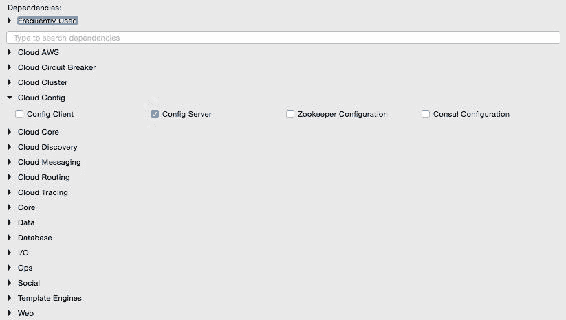

2.  建立一个 Git 存储库。这可以通过指向远程 Git 配置存储库（如位于[的存储库）来实现 https://github.com/spring-cloud-samples/config-repo](https://github.com/spring-cloud-samples/config-repo) 。这个 URL 是一个指示性的 URL，Spring 云示例使用的 Git 存储库。我们将不得不使用我们自己的 Git 存储库。
3.  或者，可以使用基于本地文件系统的 Git 存储库。在实际生产场景中，建议使用外部 Git。本章中的配置服务器将使用基于本地文件系统的 Git 存储库进行演示。
4.  Enter the commands listed next to set up a local Git repository:

    ```java
    $ cd $HOME
    $ mkdir config-repo
    $ cd config-repo
    $ git init .
    $ echo message : helloworld > application.properties
    $ git add -A .
    $ git commit -m "Added sample application.properties"

    ```

    此代码段在本地文件系统上创建一个新的 Git 存储库。还创建了一个名为`application.properties`的属性文件，该文件具有`message`属性和值`helloworld`。

    创建文件`application.properties`是为了演示。我们将在后续章节中对此进行更改。

5.  The next step is to change the configuration in the Config server to use the Git repository created in the previous step. In order to do this, rename the file `application.properties` to `bootstrap.properties`:

    

6.  Edit the contents of the new `bootstrap.properties` file to match the following:

    ```java
    server.port=8888
    spring.cloud.config.server.git.uri: file://${user.home}/config-repo
    ```

    端口`8888`是配置服务器的默认端口。即使没有配置`server.port`，配置服务器也应该绑定到`8888`。在 Windows 环境中，文件 URL 中需要额外的`/`。

7.  可选地，将自动生成的`Application.java`的默认包从`com.example`重命名为`com.brownfield.configserver`。在`Application.java`中增加`@EnableConfigServer`：

    ```java
    @EnableConfigServer
    @SpringBootApplication
    public class ConfigserverApplication {
    ```

8.  右键点击项目，运行配置服务器，并将其作为 Spring Boot 应用程序运行。
9.  访问`http://localhost:8888/env`查看服务器是否正在运行。如果一切正常，将列出所有环境配置。注意，`/env`是一个执行器端点。
10.  勾选`http://localhost:8888/application/default/master`查看`application.properties`特有的属性，这些属性是在前面的步骤中添加的。浏览器将显示在`application.properties`中配置的属性。浏览器应显示类似以下内容：

    ```java
    {"name":"application","profiles":["default"],"label":"master","version":"6046fd2ff4fa09d3843767660d963866ffcc7d28","propertySources":[{"name":"file:///Users/rvlabs /config-repo /application.properties","source":{"message":"helloworld"}}]}
    ```

## 了解配置服务器 URL

在上一节的中，我们使用`http://localhost:8888/application/default/master`来探索这些属性。我们如何解释这个 URL？

URL 中的第一个元素是应用程序名称。在给定示例中，应用程序名称应为`application`。应用程序名称是应用程序的逻辑名称，使用 Spring Boot 应用程序的`bootstrap.properties`中的`spring.application.name`属性。每个应用程序必须具有唯一的名称。配置服务器将使用该名称解析并从配置服务器存储库中获取适当的属性。应用程序名称有时也被称为服务 ID。如果有一个名为`myapp`的应用程序，那么配置存储库中应该有一个`myapp.properties`来存储与该应用程序相关的所有属性。

URL 的第二部分表示配置文件。存储库中可以为应用程序配置多个配置文件。这些概要文件可用于各种场景。两种常见的场景是隔离不同的环境，如`Dev`、`Test`、`Stage`、`Prod`等，或者隔离服务器配置，如`Primary`、`Secondary`等。第一个表示应用程序的不同环境，而第二个表示部署应用程序的不同服务器。

配置文件名称是逻辑名称，用于匹配存储库中的文件名。默认配置文件名为`default`。要为不同的环境配置属性，我们必须按照以下示例中给出的配置不同的文件。在本例中，第一个文件用于开发环境，而第二个文件用于生产环境：

```java
application-development.properties
application-production.properties
```

可分别使用以下 URL 访问这些 URL:

*   http://localhost:8888/application/development
*   http://localhost:8888/application/production

URL 的最后一部分是标签，默认名称为`master`。标签是一个可选的 Git 标签，如果需要，可以使用它。

简而言之，URL 基于以下模式：`http://localhost:8888/{name}/{profile}/{label}`。

也可以通过忽略配置文件来访问配置。在前面的示例中，以下三个 URL 都指向相同的配置：

*   http://localhost:8888/application/default
*   http://localhost:8888/application/master
*   http://localhost:8888/application/default/master

对于不同的配置文件，可以选择使用不同的 Git 存储库。这对于生产系统是有意义的，因为对不同存储库的访问可能不同。

### 从客户端访问配置服务器

在上一节中，使用 web 浏览器设置并访问配置服务器。在本节中，将修改 Search microservice 以使用配置服务器。搜索微服务将充当配置客户端。

按照以下步骤使用配置服务器，而不是从`application.properties`文件中读取属性：

1.  将弹簧云配置依赖项和执行器（如果执行器尚未就位）添加到`pom.xml`文件中。刷新配置属性时必须使用执行器：

    ```java
      <dependency>
        <groupId>org.springframework.cloud</groupId>
        <artifactId>spring-cloud-starter-config</artifactId>
      </dependency>
    ```

2.  由于我们正在修改前一章中的 SpringBootSearch 微服务，因此我们必须添加以下内容以包括 SpringCloud 依赖项。如果项目是从头开始创建的，则不需要此选项：

    ```java
      <dependencyManagement>
        <dependencies>
          <dependency>
            <groupId>org.springframework.cloud</groupId>
            <artifactId>spring-cloud-dependencies</artifactId>
            <version>Brixton.RELEASE</version>
            <type>pom</type>
            <scope>import</scope>
          </dependency>
        </dependencies>
      </dependencyManagement>
    ```

3.  The next screenshot shows the Cloud starter library selection screen. If the application is built from the ground up, select the libraries as shown in the following screenshot:

    

4.  Rename `application.properties` to `bootstrap.properties`, and add an application name and a configuration server URL. The configuration server URL is not mandatory if the Config server is running on the default port (`8888`) on the local host:

    新的`bootstrap.properties`文件如下所示：

    ```java
    spring.application.name=search-service 
    spring.cloud.config.uri=http://localhost:8888

    server.port=8090

    spring.rabbitmq.host=localhost
    spring.rabbitmq.port=5672
    spring.rabbitmq.username=guest
    spring.rabbitmq.password=guest
    ```

    `search-service`是搜索微服务的逻辑名称。这将被视为服务 ID。配置服务器将在存储库中查找`search-service.properties`以解析属性。

5.  为`search-service`创建新的配置文件。在创建 Git 存储库的`config-repo`文件夹下创建一个新的`search-service.properties`。注意，`search-service`是在`bootstrap.properties`文件中提供给搜索微服务的服务 ID。将特定于服务的属性从`bootstrap.properties`移动到新的`search-service.properties`文件。以下属性将从`bootstrap.properties`中删除，并添加到`search-service.properties`：

    ```java
    spring.rabbitmq.host=localhost
    spring.rabbitmq.port=5672
    spring.rabbitmq.username=guest
    spring.rabbitmq.password=guest
    ```

6.  In order to demonstrate the centralized configuration of properties and propagation of changes, add a new application-specific property to the property file. We will add `originairports.shutdown` to temporarily take out an airport from the search. Users will not get any flights when searching for an airport mentioned in the shutdown list:

    ```java
    originairports.shutdown=SEA
    ```

    在本例中，当以`SEA`为原点进行搜索时，我们不会返回任何航班。

7.  通过执行以下命令将此新文件提交到 Git 存储库：

    ```java
    git add –A .
    git commit –m "adding new configuration" 

    ```

8.  最终的`search-service.properties`文件应如下所示：

    ```java
    spring.rabbitmq.host=localhost
    spring.rabbitmq.port=5672
    spring.rabbitmq.username=guest
    spring.rabbitmq.password=guest
    originairports.shutdown:SEA
    ```

9.  `chapter5.search`项目的`bootstrap.properties`应该如下所示：

    ```java
    spring.application.name=search-service
    server.port=8090
    spring.cloud.config.uri=http://localhost:8888
    ```

10.  修改搜索微服务代码以使用配置参数`originairports.shutdown`。必须在类级别添加一个`RefreshScope`注释，以便在发生更改时刷新属性。在本例中，我们将向`SearchRestController`类添加一个刷新范围：

    ```java
    @RefreshScope
    ```

11.  添加以下实例变量作为刚刚添加到配置服务器中的新属性的占位符。`search-service.properties`文件中的属性名称必须匹配：

    ```java
      @Value("${originairports.shutdown}")
      private String originAirportShutdownList;
    ```

12.  Change the application code to use this property. This is done by modifying the `search` method as follows:

    ```java
      @RequestMapping(value="/get", method = RequestMethod.POST)
      List<Flight> search(@RequestBody SearchQuery query){
        logger.info("Input : "+ query);
      if(Arrays.asList(originAirportShutdownList.split(",")).contains(query.getOrigin())){
        logger.info("The origin airport is in shutdown state");
        return new ArrayList<Flight>();
      }
      return searchComponent.search(query);
      }
    ```

    修改`search`方法读取参数`originAirportShutdownList`并查看请求的原点是否在停机列表中。如果存在匹配项，则搜索方法将返回空航班列表，而不是继续实际搜索。

13.  启动配置服务器。然后启动搜索微服务。确保 RabbitMQ 服务器正在运行。
14.  修改`chapter5.website`项目以匹配`bootstrap.properties`内容，如下所示，以使用配置服务器：

    ```java
    spring.application.name=test-client
    server.port=8001
    spring.cloud.config.uri=http://localhost:8888
    ```

15.  将`Application.java`中`CommandLineRunner`的`run`方式改为查询 SEA 作为始发机场：

    ```java
    SearchQuery = new SearchQuery("SEA","SFO","22-JAN-16");
    ```

16.  运行`chapter5.website`项目。`CommandLineRunner`现在将返回一个空的航班列表。服务器中将打印以下消息：

    ```java
    The origin airport is in shutdown state

    ```

## 处理配置变更

本节将演示在发生更改时如何传播配置属性：

1.  Change the property in the `search-service.properties` file to the following:

    ```java
    originairports.shutdown:NYC
    ```

    在 Git 存储库中提交更改。刷新此服务的配置服务器 URL（`http://localhost:8888/search-service/default`），查看是否反映了属性更改。如果一切顺利，我们将看到财产的变化。前面的请求将强制配置服务器从存储库中再次读取属性文件。

2.  Rerun the website project again, and observe the `CommandLineRunner` execution. Note that in this case, we are not restarting the Search microservice nor the Config server. The service returns an empty flight list as earlier, and still complains as follows:

    ```java
    The origin airport is in shutdown state

    ```

    这意味着更改不会反映在搜索服务中，并且该服务仍在使用配置属性的旧副本。

3.  为了强制重新加载配置属性，调用 Search microservice 的`/refresh`端点。这实际上是执行器的刷新端点。以下命令将向`/refresh`端点发送一个空 POST:

    ```java
    curl –d {} localhost:8090/refresh

    ```

4.  Rerun the website project, and observe the `CommandLineRunner` execution. This should return the list of flights that we have requested from SEA. Note that the website project may fail if the Booking service is not up and running.

    `/refresh`端点将刷新本地缓存的配置属性，并从配置服务器重新加载新值。

## 用于传播配置更改的 Spring 云总线

使用上述方法，可以在不重新启动微服务的情况下更改配置参数。当只有一个或两个服务实例在运行时，这是很好的。如果有许多实例，会发生什么？例如，如果有五个实例，那么我们必须针对每个服务实例点击`/refresh`。这绝对是一项累赘的活动：

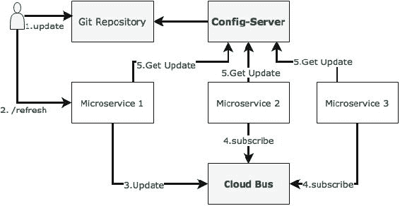

Spring 云总线提供了一种跨多个实例刷新配置的机制，而不知道有多少实例或它们的位置。当有许多微服务实例正在运行或有许多不同类型的微服务正在运行时，这一点特别方便。这是通过单个消息代理连接所有服务实例来完成的。每个实例订阅更改事件，并在需要时刷新其本地配置。通过点击`/bus/refresh`端点调用任何一个实例触发刷新，然后该端点通过云总线和公共消息代理传播更改。

在本例中，RabbitMQ 用作 AMQP 消息代理。通过以下记录的步骤来实现这一点：

1.  在`chapter5.search`项目的`pom.xml`文件中添加一个新的依赖项，引入云总线依赖项：

    ```java
    <dependency>
       <groupId>org.springframework.cloud</groupId>
       <artifactId>spring-cloud-starter-bus-amqp</artifactId>
    </dependency>
    ```

2.  搜索微服务还需要连接 RabbitMQ，但这已在`search-service.properties`中提供。
3.  Rebuild and restart the Search microservice. In this case, we will run two instances of the Search microservice from a command line, as follows:

    ```java
    java -jar -Dserver.port=8090  search-1.0.jar 
    java -jar -Dserver.port=8091  search-1.0.jar

    ```

    搜索服务的两个实例现在将运行，一个在端口`8090`上，另一个在`8091`上。

4.  重新运行网站项目。这只是为了确保一切正常。搜索服务此时应返回一个航班。
5.  现在，用以下值更新`search-service.properties`，并提交到 Git:

    ```java
    originairports.shutdown:SEA
    ```

6.  对`/bus/refresh`执行以下命令。请注意，我们正在针对其中一个实例运行一个新的总线端点，在本例中为`8090`：

    ```java
    curl –d {} localhost:8090/bus/refresh

    ```

7.  Immediately, we will see the following message for both instances:

    ```java
    Received remote refresh request. Keys refreshed [originairports.shutdown]

    ```

    总线端点在内部向消息代理发送一条消息，该消息最终被所有实例使用，并重新加载它们的属性文件。通过指定应用程序名称，也可以将更改应用于特定应用程序，如下所示：

    ```java
    /bus/refresh?destination=search-service:**
    ```

我们还可以通过将属性名称设置为参数来刷新特定属性。

## 设置配置服务器的高可用性

前面的部分探讨了如何设置配置服务器，允许实时刷新配置属性。但是，在此体系结构中，配置服务器是单点故障。

在上一节中建立的默认体系结构中有三个单点故障。其中一个是配置服务器本身的可用性，第二个是 Git 存储库，第三个是 RabbitMQ 服务器。

下图显示了配置服务器的高可用性架构：


架构（architecture）机制和原理解释如下：

配置服务器需要高可用性，因为如果配置服务器不可用，服务将无法引导。因此，高可用性需要冗余配置服务器。但是，如果启动服务后配置服务器不可用，则应用程序可以继续运行。在这种情况下，服务将以上次已知的配置状态运行。因此，配置服务器可用性与微服务可用性不在同一关键级别。

为了使配置服务器高度可用，我们需要配置服务器的多个实例。由于配置服务器是无状态 HTTP 服务，因此可以并行运行多个配置服务器实例。根据配置服务器上的负载，必须调整多个实例。`bootstrap.properties`文件不能处理多个服务器地址。因此，应将多个配置服务器配置为在负载平衡器后面或在具有故障切换和回退功能的本地 DNS 后面运行。负载平衡器或 DNS 服务器 URL 将在 microservices 的`bootstrap.properties`文件中配置。这是基于 DNS 或负载平衡器高度可用且能够处理故障转移的假设。

在生产场景中，不建议使用基于本地文件的 Git 存储库。配置服务器通常应该由高可用性 Git 服务支持。这可以通过使用外部高可用 Git 服务或内部高可用 Git 服务来实现。SVN 也可以考虑。

话虽如此，已经启动的配置服务器始终能够使用配置的本地副本。因此，只有当配置服务器需要扩展时，我们才需要高可用性 Git。因此，这也不像微服务可用性或配置服务器可用性那么重要。

### 注

设置高可用性的 GitLab 示例可在[中找到 https://about.gitlab.com/high-availability/](https://about.gitlab.com/high-availability/) 。

RabbitMQ 还必须配置为高可用性。RabbitMQ 的高可用性仅用于将配置更改动态推送到所有实例。由于这更像是一个离线控制的活动，因此它实际上并不需要组件所需的高可用性。

RabbitMQ 高可用性可以通过使用云服务或本地配置的高可用 RabbitMQ 服务来实现。

### 注

为 Rabbit MQ 设置高可用性记录在[https://www.rabbitmq.com/ha.html](https://www.rabbitmq.com/ha.html) 。

## 监控配置服务器运行状况

配置服务器只不过是一个 Spring 引导应用程序，默认情况下，配置有执行器。因此，所有执行器端点都适用于配置服务器。可以使用以下执行器 URL 监控服务器的运行状况：`http://localhost:8888/health`。

## 配置文件的配置服务器

我们可能会遇到需要外部化完整配置文件（如`logback.xml`的情况。配置服务器提供了配置和存储此类文件的机制。这可以通过使用如下 URL 格式实现：`/{name}/{profile}/{label}/{path}`。

名称、配置文件和标签的含义与前面解释的相同。路径表示文件名，如`logback.xml`。

## 完成更改以使用配置服务器

为了建立完成布朗菲尔德航空公司 PSS 的能力，我们必须为所有服务使用配置服务器。`chapter5.*`中给出的示例中的所有微服务都需要进行类似的更改，以查看配置服务器以获取配置参数。

以下是一些关键的变更注意事项：

*   The Fare service URL in the booking component will also be externalized:

    ```java
    private static final String FareURL = "/fares";

    @Value("${fares-service.url}")
    private String fareServiceUrl;

    Fare = restTemplate.getForObject(fareServiceUrl+FareURL +"/get?flightNumber="+record.getFlightNumber()+"&flightDate="+record.getFlightDate(),Fare.class);
    ```

    如前面的代码片段所示，通过一个新属性`fares-service.url`获取票价服务 URL。

*   目前，我们没有将搜索、预订和值机服务中使用的队列名称外部化。在本章后面，这些将被更改为使用 Spring 云流。

# 假装是声明性 REST 客户机

在预订微服务中，有一个同步的票价呼叫。`RestTemplate`用于进行同步呼叫。使用`RestTemplate`时，URL 参数以编程方式构造，并将数据发送到其他服务。在更复杂的场景中，我们必须了解`RestTemplate`提供的 HTTP API 的详细信息，甚至需要了解更低级别的 API。

Feign 是一个 SpringCloudNetflix 库，用于提供比基于 REST 的服务调用更高级别的抽象。springcloud-Feign 的工作原理是声明性的。当使用 Feign 时，我们在客户端编写声明性 REST 服务接口，并使用这些接口对客户端进行编程。开发人员不必担心这个接口的实现。这将由 Spring 在运行时动态配置。使用这种声明性方法，开发人员无需深入了解`RestTemplate`提供的 HTTP 级 API 的细节。

以下代码段是 Booking microservice 中用于调用票价服务的现有代码：

```java
Fare fare = restTemplate.getForObject(FareURL +"/get?flightNumber="+record.getFlightNumber()+"&flightDate="+record.getFlightDate(),Fare.class);
```

为了使用外文，首先我们需要将`pom.xml`文件更改为包含外文依赖项，如下所示：

```java
<dependency>
  <groupId>org.springframework.cloud</groupId>
  <artifactId>spring-cloud-starter-feign</artifactId>
</dependency>
```

对于新的 Spring Starter 项目，可以从 Starter library 选择屏幕中选择**外文**，或者从[中选择 http://start.spring.io/](http://start.spring.io/) 。这在**云路由**下可用，如以下屏幕截图所示：


下一步是创建一个新的`FareServiceProxy`接口。这将作为实际票价服务的代理接口：

```java
@FeignClient(name="fares-proxy", url="localhost:8080/fares")
public interface FareServiceProxy {
  @RequestMapping(value = "/get", method=RequestMethod.GET)
  Fare getFare(@RequestParam(value="flightNumber") String flightNumber, @RequestParam(value="flightDate") String flightDate);
}
```

`FareServiceProxy`接口有`@FeignClient`注释。此注释告诉 Spring 基于提供的接口创建 REST 客户端。该值可以是服务 ID 或逻辑名称。`url`表示目标服务运行的实际 URL。名称或值都是必需的。在本例中，因为我们有`url`，所以`name`属性是不相关的。

使用此服务代理调用票价服务。在预订微服务中，我们必须告诉 Spring，Spring 启动应用程序中存在外来客户端，这些客户端将被扫描和发现。这将通过在`BookingComponent`级别添加`@EnableFeignClients`来实现。或者，我们也可以指定要扫描的包名。

更改`BookingComponent`，并更改呼叫部分。这与调用另一个 Java 接口一样简单：

```java
Fare = fareServiceProxy.getFare(record.getFlightNumber(), record.getFlightDate());
```

重新运行 Booking microservice 以查看效果。

`FareServiceProxy`界面的票价服务 URL 为硬编码：`url="localhost:8080/fares"`。

目前，我们将保持这样的状态，但我们将在本章稍后部分对此进行更改。

# 负载平衡色带

在之前的设置中，我们总是使用一个微服务实例运行。URL 在客户端和服务到服务调用中都是硬编码的。在现实世界中，这不是推荐的方法，因为可能有多个服务实例。如果有多个实例，那么理想情况下，我们应该使用负载平衡器或本地 DNS 服务器来抽象实际的实例位置，并在客户端中配置别名或负载平衡器地址。然后，负载平衡器接收别名，并使用一个可用实例解析它。通过这种方法，我们可以在负载平衡器后面配置尽可能多的实例。它还帮助我们处理对客户端透明的服务器故障。

这是可以通过 Spring Cloud Netflix Ribbon 实现的。Ribbon 是一个客户端负载平衡器，它可以跨一组服务器进行循环负载平衡。Ribbon 库可能还有其他负载平衡算法。SpringCloud 提供了一种声明性的方式来配置和使用 Ribbon 客户端。

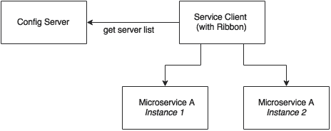

如上图所示，Ribbon 客户端查找配置服务器以获取可用微服务实例的列表，默认情况下，应用循环负载平衡算法。

为了使用 Ribbon 客户端，我们必须将以下依赖项添加到`pom.xml`文件中：

```java
<dependency>
  <groupId>org.springframework.cloud</groupId>
  <artifactId>spring-cloud-starter-ribbon</artifactId>
</dependency>
```

如果是从头开始的开发，可以从 Spring Starter 库或[中选择 http://start.spring.io/](http://start.spring.io/) 。功能区在**云路由**下可用：

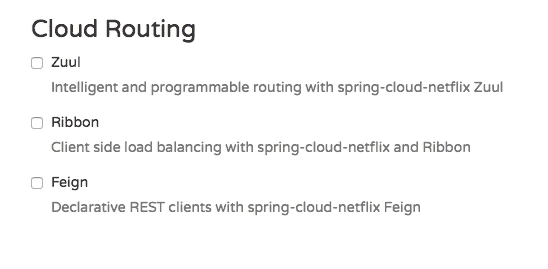

更新预订微服务配置文件`booking-service.properties`，以包含一个新的属性来保存票价微服务列表：

```java
fares-proxy.ribbon.listOfServers=localhost:8080,localhost:8081
```

返回并编辑上一节中创建的`FareServiceProxy`类以使用 Ribbon 客户端，我们注意到`@RequestMapping`注释的值从`/get`更改为`/fares/get`，以便我们可以轻松地将主机名和端口移动到配置：

```java
@FeignClient(name="fares-proxy")
@RibbonClient(name="fares")
public interface FareServiceProxy {
  @RequestMapping(value = "fares/get", method=RequestMethod.GET)
```

我们现在可以运行两个 Fares 微服务实例。在`8080`上启动一个，在`8081`上启动另一个：

```java
java -jar -Dserver.port=8080 fares-1.0.jar
java -jar -Dserver.port=8081 fares-1.0.jar

```

运行预订微服务。当预订微服务启动时，`CommandLineRunner`自动插入一条预订记录。这将转到第一台服务器。

当运行网站项目时，它会调用预订服务。此请求将转到第二台服务器。

在预订服务中，我们看到以下跟踪，显示有两台服务器登记：

```java
DynamicServerListLoadBalancer:{NFLoadBalancer:name=fares-proxy,current 

list of Servers=[localhost:8080, localhost:8081],Load balancer stats=Zone stats: {unknown=[Zone:unknown;  Instance count:2;  Active connections count: 0;  Circuit breaker tripped count: 0;  Active connections per server: 0.0;]
}, 

```

# Eureka 用于注册和发现

到目前为止，我们已经实现了配置参数的外部化以及跨多个服务实例的负载平衡。

基于功能区的负载平衡足以满足大多数微服务需求。但是，这种方法在以下几种情况下存在不足：

*   如果有大量的微服务，并且如果我们想要优化基础设施的利用率，我们就必须动态地更改服务实例和相关服务器的数量。在配置文件中预测和预配置服务器 URL 并不容易。
*   考虑到云环境的弹性，针对高可伸缩微服务的云部署，静态注册和发现不是一个好的解决方案。
*   在云部署场景中，IP 地址是不可预测的，并且很难在文件中进行静态配置。每次地址发生变化时，我们都必须更新配置文件。

Ribbon 方法部分解决了这个问题。使用 Ribbon，我们可以动态更改服务实例，但无论何时添加新服务实例或关闭实例，我们都必须手动更新配置服务器。尽管配置更改将自动传播到所有必需的实例，但手动配置更改将不适用于大规模部署。在管理大型部署时，尽可能实现自动化是最重要的。

为了弥补这一差距，微服务应该通过动态注册服务可用性来自我管理其生命周期，并为消费者提供自动发现。

## 了解动态服务注册和发现

动态注册主要是从服务提供商的角度进行的。通过动态注册，当新服务启动时，它会自动在中央服务注册中心登记其可用性。类似地，当服务停止服务时，它将自动从服务注册表中退出。注册表始终保持可用服务的最新信息及其元数据。

从服务消费者的角度来看，动态发现是适用的。动态发现是客户端查找服务注册表以获取服务拓扑的当前状态，然后相应地调用服务的地方。在这种方法中，不是静态地配置服务 URL，而是从服务注册中心获取 URL。

客户端可以保留注册表数据的本地缓存，以便更快地访问。一些注册表实现允许客户端监视他们感兴趣的项目。在这种方法中，注册表服务器中的状态更改将传播给相关方，以避免使用过时的数据。

有许多选项可用于动态服务注册和发现。Netflix Eureka、ZooKeeper 和 Concur 作为 Spring Cloud 的一部分提供，如[所示 http://start.spring.io/](http://start.spring.io/) 下面给出屏幕截图。Etcd 是 Spring 云之外的另一个服务注册中心，用于实现动态服务注册和发现。在本章中，我们将重点介绍 Eureka 的实施：


## 了解尤里卡

春云 Eureka 也来自 Netflix OSS。SpringCloud 项目为将 Eureka 与基于 Spring 的应用程序集成提供了一种 Spring 友好的声明性方法。Eureka 主要用于自注册、动态发现和负载平衡。Eureka 在内部使用 Ribbon 进行负载平衡：


如上图所示，Eureka 由服务器组件和客户端组件组成。服务器组件是所有微服务在其中注册其可用性的注册表。注册通常包括服务标识及其 URL。微服务使用 Eureka 客户端注册其可用性。消费组件还将使用 Eureka 客户端来发现服务实例。

当一个微服务被引导时，它会接触到 Eureka 服务器，并用绑定信息宣传它的存在。注册后，服务端点每 30 秒向注册表发送 ping 请求以续订租约。如果某个服务端点在几次尝试后无法续订其租约，则该服务端点将从服务注册表中删除。注册表信息将复制到所有 Eureka 客户端，以便客户端必须为每个请求转到远程 Eureka 服务器。Eureka 客户端从服务器获取注册表信息，并在本地缓存。之后，客户机使用该信息查找其他服务。通过获取上一个获取周期和当前获取周期之间的增量更新，定期（每 30 秒）更新此信息。

当客户端希望联系 microservice 端点时，Eureka 客户端将根据请求的服务 ID 提供当前可用服务的列表。Eureka 服务器具有区域感知功能。注册服务时还可以提供区域信息。当客户端请求服务实例时，Eureka 服务会尝试查找在同一区域中运行的服务。然后，功能区客户端在 Eureka 客户端提供的这些可用服务实例之间进行负载平衡。Eureka 客户端和服务器之间的通信使用 REST 和 JSON 完成。

## 设置 Eureka 服务器

在本节中，我们将介绍设置 Eureka 服务器所需的步骤。

### 注

本节的完整源代码可在`chapter5.eurekaserver`项目的代码文件中找到。请注意，Eureka 服务器注册和刷新周期最多需要 30 秒。因此，在运行服务和客户端时，请等待 40-50 秒。

1.  Start a new Spring Starter project, and select **Config Client**, **Eureka Server**, and **Actuator**:

    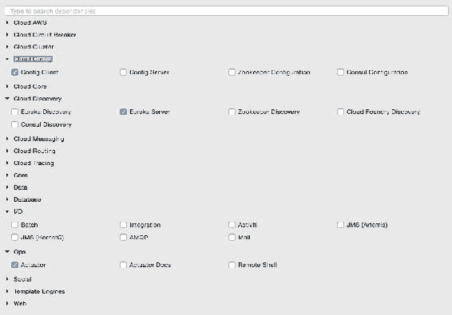

    Eureka 服务器的项目结构如下图所示：

    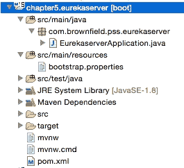

    请注意，主应用程序名为`EurekaserverApplication.java`。

2.  Rename `application.properties` to `bootstrap.properties` since this is using the Config server. As we did earlier, configure the details of the Config server in the `bootsratp.properties` file so that it can locate the Config server instance. The `bootstrap.properties` file will look as follows:

    ```java
    spring.application.name=eureka-server1
    server.port:8761
    spring.cloud.config.uri=http://localhost:8888
    ```

    Eureka 服务器可以在独立模式或集群模式下设置。我们将从独立模式开始。默认情况下，Eureka 服务器本身是另一个 Eureka 客户端。当有多台 Eureka 服务器运行以实现高可用性时，这一点尤其有用。客户端组件负责从其他 Eureka 服务器同步状态。通过配置`eureka.client.serviceUrl.defaultZone`属性，将 Eureka 客户端传送到其对等方。

    在独立模式下，我们将`eureka.client.serviceUrl.defaultZone`指向同一个独立实例。稍后，我们将了解如何在集群模式下运行 Eureka 服务器。

3.  创建一个`eureka-server1.properties`文件，并在 Git 存储库中更新它。`eureka-server1`是上一步申请的`bootstrap.properties`文件中给出的申请名称。如下面的代码所示，`serviceUrl`指向同一台服务器。添加以下属性后，将文件提交到 Git 存储库：

    ```java
    spring.application.name=eureka-server1
    eureka.client.serviceUrl.defaultZone:http://localhost:8761/eureka/
    eureka.client.registerWithEureka:false
    eureka.client.fetchRegistry:false
    ```

4.  更改默认值`Application.java`。在本例中，包也被重命名为`com.brownfield.pss.eurekaserver`，类名更改为`EurekaserverApplication`。在`EurekaserverApplication`中增加`@EnableEurekaServer`：

    ```java
    @EnableEurekaServer
    @SpringBootApplication
    public class EurekaserverApplication {
    ```

5.  我们现在准备启动 Eureka 服务器。确保配置服务器也已启动。右键单击应用程序，然后选择**以**运行**春季开机应用程序**。启动应用程序后，在浏览器中打开`http://localhost:8761`以查看 Eureka 控制台。
6.  在控制台中，请注意当前在 Eureka 注册的**实例下没有注册的实例。由于没有在启用 Eureka 客户端的情况下启动任何服务，因此此时列表为空。**
7.  Making a few changes to our microservice will enable dynamic registration and discovery using the Eureka service. To do this, first we have to add the Eureka dependencies to the `pom.xml` file. If the services are being built up fresh using the Spring Starter project, then select **Config Client**, **Actuator**, **Web** as well as **Eureka discovery** client as follows:

    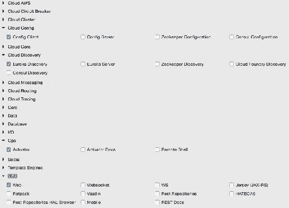

8.  由于我们正在修改我们的微服务，因此在其`pom.xml`文件中向所有微服务添加以下附加依赖项：

    ```java
    <dependency>
      <groupId>org.springframework.cloud</groupId>
      <artifactId>spring-cloud-starter-eureka</artifactId>
    </dependency>
    ```

9.  以下属性必须添加到`config-repo`下相应配置文件中的所有微服务中。这将有助于微服务连接到 Eureka 服务器。更新完成后提交到 Git:

    ```java
    eureka.client.serviceUrl.defaultZone: http://localhost:8761/eureka/
    ```

10.  将`@EnableDiscoveryClient`添加到各自 Spring Boot 主类中的所有微服务中。这要求 Spring Boot 在启动时注册这些服务，以公布它们的可用性。
11.  启动除预订外的所有服务器。由于我们在预订服务上使用 Ribbon 客户端，因此在类路径中添加 Eureka 客户端时，行为可能会有所不同。我们很快就会解决这个问题。
12.  Going to the Eureka URL (`http://localhost:8761`), you can see that all three instances are up and running:

    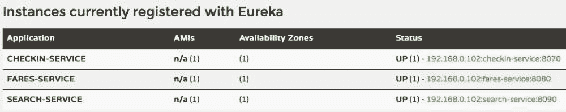

    是时候通过预订解决问题了。我们将删除以前的 Ribbon 客户端，并改用 Eureka。Eureka 内部使用 Ribbon 进行负载平衡。因此，负载平衡行为不会改变。

13.  删除以下依赖项：

    ```java
    <dependency>
      <groupId>org.springframework.cloud</groupId>
      <artifactId>spring-cloud-starter-ribbon</artifactId>
    </dependency>
    ```

14.  同时从`FareServiceProxy`类中删除`@RibbonClient(name="fares")`注释。
15.  更新`@FeignClient(name="fares-service")`以匹配实际票价微服务的服务 ID。在这种情况下，`fare-service`是票价微服务的`bootstrap.properties`中配置的服务 ID。这是 Eureka discovery 客户端发送到 Eureka 服务器的名称。服务 ID 将用作在 Eureka 服务器中注册的服务的密钥。
16.  同时从`booking-service.properties`文件中删除服务器列表。使用 Eureka，我们将从 Eureka 服务器动态发现此列表：

    ```java
    fares-proxy.ribbon.listOfServers=localhost:8080, localhost:8081
    ```

17.  Start the Booking service. You will see that `CommandLineRunner` successfully created a booking, which involves calling the Fare services using the Eureka discovery mechanism. Go back to the URL to see all the registered services:

    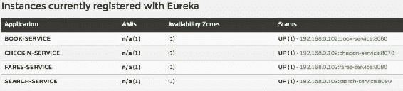

18.  将网站项目的文件更改为使用 Eureka，而不是直接连接到服务实例。在这种情况下，我们不会使用外部客户端。相反，出于演示目的，我们将使用负载平衡`RestTemplate`。将这些更改提交到 Git 存储库：

    ```java
    spring.application.name=test-client
    eureka.client.serviceUrl.defaultZone: http://localhost:8761/eureka/
    ```

19.  将`@EnableDiscoveryClient`添加到`Application`类中以使客户机 Eureka 知晓。
20.  同时编辑`Application.java`和`BrownFieldSiteController.java`。添加三个`RestTemplate`实例。这一次，我们用`@Loadbalanced`注释它们，以确保使用 Eureka 和 Ribbon 的负载平衡功能。`RestTemplate`不能自动注射。因此，我们必须提供如下配置条目：

    ```java
    @Configuration
    class AppConfiguration {
        @LoadBalanced
        @Bean
        RestTemplate restTemplate() {
            return new RestTemplate();
        }
    }
    @Autowired
    RestTemplate searchClient;

    @Autowired
    RestTemplate bookingClient;

    @Autowired
    RestTemplate checkInClient;
    ```

21.  我们使用这些`RestTemplate`实例来调用微服务。将硬编码 URL 替换为在 Eureka 服务器中注册的服务 ID。在下面的代码中，我们使用服务名称`search-service`、`book-service`和`checkin-service`，而不是显式的主机名和端口：

    ```java
    Flight[] flights = searchClient.postForObject("http://search-service/search/get", searchQuery, Flight[].class);

    long bookingId = bookingClient.postForObject("http://book-service/booking/create", booking, long.class);

    long checkinId = checkInClient.postForObject("http://checkin-service/checkin/create", checkIn, long.class);
    ```

22.  我们现在已经准备好运行客户端。运行网站项目。如果一切正常，网站项目的`CommandLineRunner`将成功执行搜索、预订和登记。也可以使用浏览器将浏览器指向`http://localhost:8001`进行测试。

## Eureka 的高可用性

在前面的示例中，只有一台 Eureka 服务器处于独立模式。这对于真正的生产系统来说还不够好。

Eureka 客户端连接到服务器，获取注册表信息，并将其本地存储在缓存中。客户端始终使用此本地缓存。Eureka 客户端定期检查服务器的任何状态更改。在状态更改的情况下，它从服务器下载更改，并更新缓存。如果无法访问 Eureka 服务器，则 Eureka 客户端仍可根据客户端缓存中可用的数据处理服务器的最后一个已知状态。然而，这可能很快导致过时的状态问题。

本节将探讨 Eureka 服务器的高可用性。高可用性体系结构如下图所示：

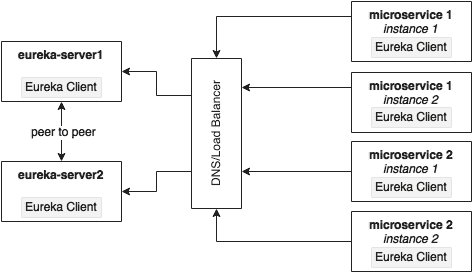

Eureka 服务器采用对等数据同步机制。运行时状态信息不存储在数据库中，而是使用内存缓存进行管理。高可用性实现支持 CAP 定理中的可用性和分区容差，而忽略了一致性。由于 Eureka 服务器实例使用异步机制彼此同步，因此服务器实例之间的状态可能并不总是匹配的。点对点同步通过相互指向`serviceUrls`来完成。如果有多个 Eureka 服务器，则每个服务器必须连接到至少一个对等服务器。由于状态在所有对等方之间复制，因此 Eureka 客户端可以连接到任何一台可用的 Eureka 服务器。

实现 Eureka 高可用性的最佳方法是将多个 Eureka 服务器群集，并在负载平衡器或本地 DNS 后运行它们。客户端始终使用 DNS/负载平衡器连接到服务器。在运行时，负载平衡器负责选择适当的服务器。此负载平衡器地址将提供给 Eureka 客户端。

本节将展示如何在集群中运行两台 Eureka 服务器以实现高可用性。为此，定义两个属性文件：`eureka-server1`和`eureka-server2`。这些是对等服务器；如果一个失败，另一个将接管。这些服务器中的每一个都将充当另一个服务器的客户端，以便能够同步它们的状态。以下代码段中定义了两个属性文件。将这些属性上载并提交到 Git 存储库。

客户端 URL 彼此指向，形成一个对等网络，如以下配置所示：

```java
eureka-server1.properties
eureka.client.serviceUrl.defaultZone:http://localhost:8762/eureka/
eureka.client.registerWithEureka:false
eureka.client.fetchRegistry:false

eureka-server2.properties
eureka.client.serviceUrl.defaultZone:http://localhost:8761/eureka/
eureka.client.registerWithEureka:false
eureka.client.fetchRegistry:false
```

更新 Eureka 的`bootstrap.properties`文件，并将申请名称更改为`eureka`。由于我们使用两个配置文件，根据启动时提供的活动配置文件，配置服务器将查找`eureka-server1`或`eureka-server2`：

```java
spring.application.name=eureka
spring.cloud.config.uri=http://localhost:8888
```

启动两个 Eureka 服务器实例，`8761`上的`server1`和`8762`上的`server2`：

```java
java -jar –Dserver.port=8761 -Dspring.profiles.active=server1 demo-0.0.1-SNAPSHOT.jar
java -jar –Dserver.port=8762 -Dspring.profiles.active=server2 demo-0.0.1-SNAPSHOT.jar

```

我们所有的服务仍然指向第一台服务器`server1`。打开两个浏览器窗口：`http://localhost:8761`和`http://localhost:8762`。

启动所有微服务。打开`8761`的一个会立即反映变化，而另一个会花费 30 秒来反映状态。由于这两个服务器都在一个集群中，因此这两个服务器之间的状态是同步的。如果我们将这些服务器放在负载平衡器/DNS 后面，那么客户端将始终连接到可用的服务器之一。

完成此练习后，切换回独立模式进行其余练习。

# Zuul 代理作为 API 网关

在大多数微服务实现中，内部微服务端点不会暴露在外部。它们作为私人服务。将使用 API 网关向客户端公开一组公共服务。这样做的原因有很多：

*   客户端只需要一组选定的微服务。
*   如果要应用特定于客户端的策略，则可以在单个位置而不是多个位置应用它们。这种情况的一个例子是跨源访问策略。
*   很难在服务端点实现特定于客户端的转换。
*   如果有必要的数据聚合，特别是为了避免带宽受限环境中的多个客户端调用，则在中间需要网关。

Zuul 是一种简单的网关服务或边缘服务，非常适合这些情况。Zuul 还来自 Netflix 微服务产品系列。与许多企业 API 网关产品不同，Zuul 为开发人员提供了基于特定需求进行配置或编程的完整控制：


Zuul 代理在内部使用 Eureka 服务器进行服务发现，并使用 Ribbon 在服务实例之间进行负载平衡。

Zuul 代理还能够路由、监视、管理弹性、安全性等。简单地说，我们可以考虑 ZUUL 反向代理服务。使用 Zuul，我们甚至可以通过在 API 层重写底层服务来更改它们的行为。

## 建立 Zuul

与 Eureka 服务器和 Config 服务器不同，在典型部署中，Zuul 特定于微服务。然而，在一些部署中，一个 API 网关覆盖了许多微服务。在本例中，我们将为每个微服务添加 Zuul：搜索、预订、票价和入住：

### 注

本节的完整源代码可在`chapter5.*-apigateway`项目的代码文件中找到。

1.  Convert the microservices one by one. Start with Search API Gateway. Create a new Spring Starter project, and select **Zuul**, **Config Client**, **Actuator**, and **Eureka Discovery**:

    

    `search-apigateway`项目结构如下图所示：

    

2.  The next step is to integrate the API gateway with Eureka and the Config server. Create a `search-apigateway.property` file with the contents given next, and commit to the Git repository.

    此配置还设置了如何转发流量的规则。在这种情况下，任何来自 API 网关的`/api`端点的请求都应该发送到`search-service`：

    ```java
    spring.application.name=search-apigateway
    zuul.routes.search-apigateway.serviceId=search-service
    zuul.routes.search-apigateway.path=/api/**
    eureka.client.serviceUrl.defaultZone:http://localhost:8761/eureka/
    ```

    `search-service`是搜索服务的服务 ID，将使用 Eureka 服务器解析。

3.  更新`search-apigateway`的`bootstrap.properties`文件如下。此配置中没有任何新内容—服务的名称、端口和配置服务器 URL:

    ```java
    spring.application.name=search-apigateway
    server.port=8095
    spring.cloud.config.uri=http://localhost:8888
    ```

4.  编辑`Application.java`。在这种情况下，包名和类名也分别更改为`com.brownfield.pss.search.apigateway`和`SearchApiGateway`。同时添加`@EnableZuulProxy`告知 Spring Boot 这是一个 Zuul 代理：

    ```java
    @EnableZuulProxy
    @EnableDiscoveryClient
    @SpringBootApplication
    public class SearchApiGateway {
    ```

5.  将此作为 Spring 启动应用程序运行。在此之前，请确保配置服务器、Eureka 服务器和搜索微服务正在运行。
6.  更改网站项目的`CommandLineRunner`和`BrownFieldSiteController`使用 API 网关：

    ```java
    Flight[] flights = searchClient.postForObject("http://search-apigateway/api/search/get", searchQuery, Flight[].class); 
    ```

在这种情况下，Zuul 代理充当反向代理，将所有 microservice 端点代理给消费者。在前面的示例中，Zuul 代理没有增加多少价值，因为我们只是将传入的请求传递给相应的后端服务。

当我们有以下一个或多个需求时，Zuul 特别有用：

*   在网关上强制执行身份验证和其他安全策略，而不是在每个微服务端点上执行。网关可以在将请求传递给相关服务之前处理安全策略、令牌处理等。它还可以根据一些业务策略进行基本的拒绝，例如阻止来自某些黑名单用户的请求。
*   业务洞察和监控可以在网关级别实现。收集实时统计数据，并将其推送到外部系统进行分析。这将非常方便，因为我们可以在一个位置执行此操作，而不是将其应用于许多微服务。
*   API 网关在需要基于细粒度控制的动态路由的场景中非常有用。例如，根据特定于业务的值（如“原产国”）向不同的服务实例发送请求。另一个例子是来自一个区域的所有请求都要发送到一组服务实例。另一个例子是，所有请求特定产品的请求都必须路由到一组服务实例。
*   处理负载分解和限制需求是 API 网关有用的另一个场景。此时，我们必须根据设置的阈值（如一天中的请求数）来控制负载。例如，来自低值第三方在线渠道的控制请求。
*   Zuul 网关对于细粒度负载平衡场景非常有用。Zuul、Eureka 客户端和 Ribbon 一起提供了对负载平衡需求的细粒度控制。因为 Zuul 实现只是另一个 Spring 引导应用程序，所以开发人员完全可以控制负载平衡。
*   Zuul 网关在有数据聚合需求的场景中也很有用。如果使用者需要更高级别的粗粒度服务，那么网关可以通过代表客户端调用多个服务来在内部聚合数据。这尤其适用于客户端在低带宽环境中工作的情况。

Zuul 还提供了许多过滤器。这些过滤器分为前置过滤器、路由过滤器、后置过滤器和错误过滤器。正如名称所示，它们应用于服务调用生命周期的不同阶段。Zuul 还为开发人员提供了编写自定义过滤器的选项。为了编写自定义过滤器，从摘要`ZuulFilter`进行扩展，并实现以下方法：

```java
public class CustomZuulFilter extends ZuulFilter{
public Object run(){}
public boolean shouldFilter(){}
public int filterOrder(){}
public String filterType(){}
```

实现自定义筛选器后，将该类添加到主上下文中。在我们的示例中，将其添加到`SearchApiGateway`类中，如下所示：

```java
@Bean
public CustomZuulFilter customFilter() {
    return new CustomZuulFilter();
}
```

如前所述，Zuul 代理是 Spring 引导服务。我们可以用我们想要的方式以编程方式自定义网关。如以下代码所示，我们可以向网关添加自定义端点，而网关又可以调用后端服务：

```java
@RestController 
class SearchAPIGatewayController {

  @RequestMapping("/")
  String greet(HttpServletRequest req){
    return "<H1>Search Gateway Powered By Zuul</H1>";
  }
}
```

在前面的例子中，它只添加一个新端点，并从网关返回一个值。我们可以进一步使用`@Loadbalanced RestTemplate`调用后端服务。因为我们拥有完全的控制权，所以我们可以进行转换、数据聚合等等。我们还可以使用 Eureka API 获取服务器列表，并实现完全独立的负载平衡或流量整形机制，而不是 Ribbon 提供的现成负载平衡功能。

## Zuul 的高可用性

Zuul 只是一个具有 HTTP 端点的无状态服务，因此，我们可以根据需要拥有任意多的 Zuul 实例。不需要亲和力或粘性。但是，Zuul 的可用性非常关键，因为从消费者到提供商的所有流量都通过 Zuul 代理。然而，弹性伸缩需求并不像后端微服务那样重要，在后端微服务中，所有繁重的工作都会发生。

Zuul 的高可用性体系结构由我们使用 Zuul 的场景决定。典型的使用场景有：

*   当客户端 JavaScript MVC（如 AngularJS）从远程浏览器访问 Zuul 服务时。
*   另一个微服务或非微服务通过 Zuul 访问服务

在某些情况下，客户端可能没有能力使用 Eureka 客户端库，例如，在 PL/SQL 上编写的遗留应用程序。在某些情况下，组织策略不允许 Internet 客户端处理客户端负载平衡。对于基于浏览器的客户端，可以使用第三方 Eureka JavaScript 库。

这一切归结为客户机是否正在使用 Eureka 客户机库。基于此，有两种方法可以设置 Zuul 以实现高可用性。

### 当客户也是 Eureka 客户时，Zuul 的高可用性

在这种情况下，由于客户端也是另一个 Eureka 客户端，Zuul 可以像其他微服务一样进行配置。Zuul 使用服务 ID 向 Eureka 注册。然后，客户端使用 Eureka 和服务 ID 解析 Zuul 实例：

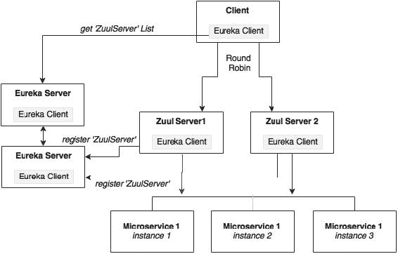

如上图所示，Zuul 服务使用服务 ID`search-apigateway`向 Eureka 注册。Eureka 客户端请求 ID 为`search-apigateway`的服务器列表。Eureka 服务器返回基于当前 Zuul 拓扑的服务器列表。Eureka 客户端根据此列表选择其中一台服务器，并发起呼叫。

如前所述，客户端使用服务 ID 解析 Zuul 实例。在以下情况下，`search-apigateway`是向 Eureka 注册的 Zuul 实例 ID：

```java
Flight[] flights = searchClient.postForObject("http://search-apigateway/api/search/get", searchQuery, Flight[].class); 
```

### 当客户不是 Eureka 客户时的高可用性

在这种情况下，客户端无法使用 Eureka 服务器处理负载平衡。如下图所示，客户机将请求发送到负载平衡器，负载平衡器将识别正确的 Zuul 服务实例。在本例中，Zuul 实例将在负载平衡器（如 HAProxy）或硬件负载平衡器（如 NetScaler）后面运行：


微服务仍将由 Zuul 使用 Eureka 服务器进行负载平衡。

## 为所有其他服务填写 Zuul

在中，为了完成此练习，为我们所有的微服务添加 API 网关项目（命名为`*-apigateway`。完成此任务需要以下步骤：

1.  为每个服务创建新的属性文件，并签入 Git 存储库。
2.  将`application.properties`更改为`bootstrap.properties`，并添加所需配置。
3.  在每个`*-apigateway` 项目中，将`@EnableZuulProxy`添加到`Application.java`。
4.  在每个`*-apigateway`项目下的所有`Application.java`文件中添加`@EnableDiscoveryClient`。
5.  （可选）更改默认生成的包名和文件名。

最后，我们将有以下 API 网关项目：

*   `chapter5.fares-apigateway`
*   `chapter5.search-apigateway`
*   `chapter5.checkin-apigateway`
*   `chapter5.book-apigateway`

# 用于反应式微服务的流

Spring 云流提供了对消息传递基础设施的抽象。底层消息传递实现可以是 RabbitMQ、Redis 或 Kafka。Spring Cloud Stream 提供了一种用于发送和接收消息的声明性方法：


如上图所示，云流基于**源**和汇的概念工作。源表示消息的发送方透视图，而接收器表示消息的接收方透视图。

在图中所示的示例中，发送方定义了一个名为`Source.OUTPUT`的逻辑队列，发送方向该队列发送消息。接收方定义了一个名为`Sink.INPUT`的逻辑队列，接收方从中检索消息。通过配置管理`OUTPUT`到`INPUT`的物理绑定。在这种情况下，两者都链接到 RabbitMQ 上的相同物理队列-`MyQueue`。因此，在一端，`Source.OUTPUT`指向`MyQueue`，在另一端，`Sink.INPUT`指向相同的`MyQueue`。

SpringCloud 提供了在一个应用程序中使用多个消息传递提供者的灵活性，例如将 Kafka 的输入流连接到 Redis 输出流，而无需管理复杂性。Spring Cloud Stream 是基于消息的集成的基础。Cloud Stream Module 子项目是另一个 Spring 云库，它提供了许多端点实现。

下一步，重建与云流的微服务间消息传递通信。如下图所示，我们将在搜索微服务下定义一个连接到`InventoryQ`的`SearchSink`。预订将定义一个用于发送连接到`InventoryQ`的库存变更消息的`BookingSource`。同样，签入定义了一个用于发送签入消息的`CheckinSource`。Booking 定义了一个接收器`BookingSink`，用于接收绑定到 RabbitMQ 上`CheckinQ`队列的消息：

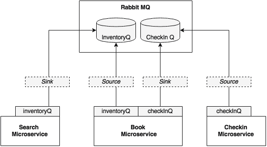

在本例中，我们将使用 RabbitMQ 作为消息代理：

1.  将以下 Maven 依赖项添加到预订、搜索和签入，因为这是使用消息传递的三个模块：

    ```java
    <dependency>
      <groupId>org.springframework.cloud</groupId>
      <artifactId>spring-cloud-starter-stream-rabbit</artifactId>
    </dependency>
    ```

2.  将以下两个属性添加到`booking-service.properties`。这些属性将逻辑队列`inventoryQ`绑定到物理队列`inventoryQ`，将逻辑队列`checkinQ`绑定到物理队列`checkinQ`：

    ```java
    spring.cloud.stream.bindings.inventoryQ.destination=inventoryQ
    spring.cloud.stream.bindings.checkInQ.destination=checkInQ
    ```

3.  将以下属性添加到`search-service.properties`。此属性将逻辑队列`inventoryQ`绑定到物理队列`inventoryQ`：

    ```java
    spring.cloud.stream.bindings.inventoryQ.destination=inventoryQ
    ```

4.  将以下属性添加到`checkin-service.properties`。此属性将逻辑队列`checkinQ`绑定到物理队列`checkinQ`：

    ```java
    spring.cloud.stream.bindings.checkInQ.destination=checkInQ
    ```

5.  将所有文件提交到 Git 存储库。
6.  The next step is to edit the code. The Search microservice consumes a message from the Booking microservice. In this case, Booking is the source and Search is the sink.

    将`@EnableBinding`添加到预订服务的`Sender`类中。这使云流能够基于类路径中可用的 MessageBroker 库进行自动配置。在我们的例子中，是 RabbitMQ。参数`BookingSource`定义了用于此配置的逻辑通道：

    ```java
    @EnableBinding(BookingSource.class)
    public class Sender {
    ```

7.  在这种情况下，`BookingSource`定义了一个名为`inventoryQ`的消息通道，该通道物理绑定到 RabbitMQ 的`inventoryQ`，如配置中所配置。`BookingSource`使用注释`@Output`表示这是一种输出类型，即从模块发出的消息。此信息将用于自动配置消息通道：

    ```java
    interface BookingSource {
        public static String InventoryQ="inventoryQ"; 
        @Output("inventoryQ")
        public MessageChannel inventoryQ();      
    }
    ```

8.  如果服务只有一个源和汇，我们也可以使用 Spring Cloud Stream 附带的默认`Source`类，而不是定义自定义类：

    ```java
    public interface Source {
      @Output("output")
      MessageChannel output();
    }
    ```

9.  根据`BookingSource`在发送方定义消息通道。以下代码将注入一个名为`inventory`的输出消息通道，已在`BookingSource`中配置：

    ```java
      @Output (BookingSource.InventoryQ)
      @Autowired
      private MessageChannel;
    ```

10.  重新实现`BookingSender`：

    ```java
    public void send(Object message){
      messageChannel.
        send(MessageBuilder.withPayload(message).
        build());
    }
    ```

    中的`send`消息方法
11.  现在将以下内容添加到`SearchReceiver`类中，方法与预订服务相同：

    ```java
    @EnableBinding(SearchSink.class)
    public class Receiver {
    ```

12.  在这种情况下，`SearchSink`接口将如下所示。这将定义与其连接的逻辑接收队列。本例中的消息通道定义为`@Input`，表示该消息通道接受消息：

    ```java
    interface SearchSink {
        public static String INVENTORYQ="inventoryQ"; 
        @Input("inventoryQ")
        public MessageChannel inventoryQ();
    }
    ```

13.  修改搜索服务以接受此消息：

    ```java
    @ServiceActivator(inputChannel = SearchSink.INVENTORYQ)
    public void accept(Map<String,Object> fare){
            searchComponent.updateInventory((String)fare.
            get("FLIGHT_NUMBER"),(String)fare.
            get("FLIGHT_DATE"),(int)fare.
            get("NEW_INVENTORY"));
    }
    ```

14.  我们仍然需要配置文件中的 RabbitMQ 配置来连接到 MessageBroker:

    ```java
    spring.rabbitmq.host=localhost
    spring.rabbitmq.port=5672
    spring.rabbitmq.username=guest
    spring.rabbitmq.password=guest
    server.port=8090
    ```

15.  运行所有服务，并运行网站项目。如果一切正常，网站项目将成功执行搜索、预订和签入功能。也可以使用浏览器指向`http://localhost:8001`对进行测试。

# 棕地 PSS 架构概述

下面的图显示了我们使用 Config server、Eureka、Feign、Zuul 和 Cloud Streams 创建的总体架构。该体系结构还包括所有组件的高可用性。在这种情况下，我们假设客户端使用 Eureka 客户端库：


下表列出了项目及其监听端口的摘要：

<colgroup class="calibre17"><col class="calibre18"> <col class="calibre18"> <col class="calibre18"></colgroup> 
| 

微服务

 | 

项目

 | 

港口城市

 |
| --- | --- | --- |
| 图书微服务 | `chapter5.book` | `8060`至`8064` |
| 签入微服务 | `chapter5.checkin` | `8070`至`8074` |
| 票价微服务 | `chapter5.fares` | `8080`至`8084` |
| 搜索微服务 | `chapter5.search` | `8090`至`8094` |
| 网站客户端 | `chapter5.website` | `8001` |
| Spring 云配置服务器 | `chapter5.configserver` | `8888`/`8889` |
| SpringCloudEureka 服务器 | `chapter5.eurekaserver` | `8761`/`8762` |
| 图书 API 网关 | `chapter5.book-apigateway` | `8095`至`8099` |
| 签入 API 网关 | `chapter5.checkin-apigateway` | `8075`至`8079` |
| 票价 API 网关 | `chapter5.fares-apigateway` | `8085`至`8089` |
| 搜索 API 网关 | `chapter5.search-apigateway` | `8065`至`8069` |

按照以下步骤进行最终运行：

1.  运行 RabbitMQ。
2.  在根级别使用`pom.xml`构建所有项目：

    ```java
    mvn –Dmaven.test.skip=true clean install 

    ```

3.  从各自的文件夹中运行以下项目。请记住，在开始下一项服务之前，请等待 40 至 50 秒。这将确保在我们启动新服务之前，相关服务已注册且可用：

    ```java
    java -jar target/fares-1.0.jar
    java -jar target/search-1.0.jar
    java -jar target/checkin-1.0.jar
    java -jar target/book-1.0.jar
    java –jar target/fares-apigateway-1.0.jar
    java –jar target/search-apigateway-1.0.jar
    java –jar target/checkin-apigateway-1.0.jar
    java –jar target/book-apigateway-1.0.jar
    java -jar target/website-1.0.jar

    ```

4.  打开浏览器窗口，指向`http://localhost:8001`。按照[第 4 章](04.html "Chapter 4. Microservices Evolution – A Case Study")*微服务演进——案例研究*中*运行和测试项目*部分提到的步骤进行操作。

# 总结

在本章中，您学习了如何使用 SpringCloud 项目扩展 12 因素 SpringBoot 微服务。您所学到的知识随后应用于我们在上一章中开发的布朗菲尔德航空公司的 PSS 微服务。

然后，我们研究了 Spring 配置服务器以实现微服务配置的外部化，以及部署配置服务器以实现高可用性的方法。我们还讨论了使用 Feign 的声明性服务调用，研究了 Ribbon 和 Eureka 在负载平衡、动态服务注册和发现方面的使用。通过实现 Zuul 检查 API 网关的实现。最后，我们总结了使用 SpringCloudStream 的反应式微服务集成。

布朗菲尔德航空公司的 PSS 微服务现在可以在互联网上部署。其他 Spring 云组件，如 Hytrix、Sleuth 等将在[第 7 章](07.html "Chapter 7. Logging and Monitoring Microservices")、*记录和监控微服务*中介绍。下一章将演示自动缩放功能，扩展棕地 PSS 实施。