# 六、自动校准微服务

SpringCloud 为大规模部署微服务提供了必要的支持。为了充分利用云环境，微服务实例还应该能够根据流量模式自动扩展和缩小。

本章将详细介绍如何通过有效地使用从 Spring Boot 微服务收集的执行器数据，通过实现简单的生命周期管理器来控制部署拓扑，从而使微服务弹性地增长和收缩。

在本章结束时，您将了解以下主题：

*   自动缩放的基本概念和自动缩放的不同方法
*   微服务环境下生命周期管理器的重要性和能力
*   检查自定义生命周期管理器以实现自动缩放
*   以编程方式从 Spring 引导执行器收集统计信息，并使用它来控制和塑造传入流量

# 回顾微服务能力模型

本章将涵盖[第 3 章](03.html "Chapter 3. Applying Microservices Concepts")*应用微服务概念*中讨论的微服务能力模型中的**应用生命周期管理**能力，如下图所示：


我们将在本章中看到生命周期管理器的基本版本，这将在后面的章节中得到增强。

# 使用 Spring Cloud 扩展微服务

在[第 5 章](05.html "Chapter 5. Scaling Microservices with Spring Cloud")*使用 Spring Cloud 扩展微服务*中，您学习了如何使用 Spring Cloud 组件扩展 Spring Boot 微服务。我们实现的 SpringCloud 的两个关键概念是自注册和自发现。这两种功能支持自动化微服务部署。通过自注册，只要实例准备好接受流量，微服务就可以通过向中央服务注册中心注册服务元数据来自动公布服务可用性。一旦注册了微服务，消费者就可以通过使用注册表服务发现服务实例，从下一刻开始使用新注册的服务。注册表是这种自动化的核心。

这与传统 JEE 应用服务器采用的传统集群方法有很大不同。对于 JEE 应用服务器，服务器实例的 IP 地址或多或少是在负载平衡器中静态配置的。因此，群集方法不是在 Internet 规模部署中实现自动扩展的最佳解决方案。此外，集群还带来了其他挑战，比如它们必须在所有集群节点上拥有完全相同版本的二进制文件。由于节点之间的紧密依赖关系，一个集群节点的故障也可能会毒害其他节点。

注册表方法将服务实例解耦。它还消除了在负载平衡器中手动维护服务地址或配置虚拟 IP 的需要：

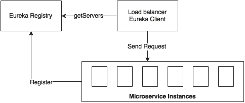

如图所示，在我们的自动化微服务部署拓扑中有三个关键组件：

*   **Eureka**是用于微服务注册和发现的中央注册组件。使用者和提供者都使用 RESTAPI 来访问注册表。注册表还保存服务元数据，如服务标识、主机、端口、运行状况等。
*   **Eureka**客户端与**Ribbon**客户端一起提供客户端动态负载平衡。消费者使用 Eureka 客户端查找 Eureka 服务器，以确定目标服务的可用实例。功能区客户端使用此服务器列表在可用的微服务实例之间实现负载平衡。同样，如果服务实例停止服务，这些实例将从 Eureka 注册表中删除。负载平衡器会自动对这些动态拓扑更改做出反应。
*   第三个组件是使用启用了执行器端点的 Spring Boot 开发的**微服务**实例。

然而，这种方法有一个缺陷。当需要额外的 microservice 实例时，需要手动任务启动新实例。在理想情况下，微服务实例的启动和停止也需要自动化。

例如，当需要添加另一个 Search microservice 实例来处理流量增加或负载突发场景时，管理员必须手动启动一个新实例。此外，当搜索实例空闲一段时间时，需要手动将其退出服务，以获得最佳的基础结构使用率。当服务在按使用情况付费的云环境中运行时，这一点尤其重要。

# 理解自动缩放的概念

Autoscaling 是一种通过复制要扩展的服务，根据资源使用情况自动扩展实例以满足 SLA 要求的方法。

系统会自动检测流量的增加，增加额外的实例，并使它们可用于流量处理。类似地，当流量下降时，系统会自动检测并通过从服务中取回活动实例来减少实例数：

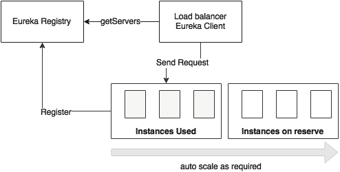

如上图所示，自动缩放通常使用一组备用机器完成。

由于许多云订阅都基于现收现付模式，这是针对云部署的一项基本功能。这种方法通常被称为**弹性**。也称为**动态资源调配和取消调配**。自动缩放是一种专门针对具有不同流量模式的微服务的有效方法。例如，会计服务在月末和年末的流量会很高。永久调配实例来处理这些季节性负载是没有意义的。

在自动缩放方法中，通常有一个资源池，其中包含许多备用实例。根据需求，实例将从资源池移动到活动状态，以满足剩余需求。这些实例没有针对任何特定的微服务进行预标记，也没有使用任何微服务二进制文件进行预打包。在高级部署中，Spring 引导二进制文件是根据需要从工件库（如 Nexus 或 Artifactory）下载的。

## 自动缩放的好处

实现自动缩放机制有很多好处。在传统部署中，管理员为每个应用程序保留一组服务器。使用自动缩放时，不再需要此预分配。此带前缀的服务器分配可能会导致服务器未充分利用。在这种情况下，即使相邻服务争夺额外资源，也无法使用空闲服务器。

对于数百个微服务实例，为每个微服务预先分配固定数量的服务器并不划算。一种更好的方法是为一组微服务保留多个服务器实例，而无需根据微服务预先分配或标记它们。相反，根据需求，一组服务可以共享一组可用资源。这样，通过优化使用以下资源，可以在可用服务器实例之间动态移动微服务：

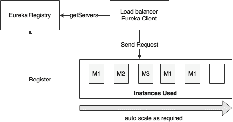

如上图所示，**M1**微服务有三个实例，**M2**有一个实例，**M3**有一个实例启动运行。另一台服务器保持未分配状态。根据需要，未分配的服务器可用于任何微服务：**M1**、**M2**或**M3**。如果**M1**有更多的服务请求，则未分配实例将用于**M1**。当服务使用率下降时，服务器实例将被释放并移回池中。以后如果**M2**需求增加，可以使用**M2**激活同一个服务器实例。

自动缩放的一些关键好处包括：

*   **It has high availability and is fault tolerant**: As there are multiple service instances, even if one fails, another instance can take over and continue serving clients. This failover will be transparent to the consumers. If no other instance of this service is available, the autoscaling service will recognize this situation and bring up another server with the service instance. As the whole process of bringing up or bringing down instances is automatic, the overall availability of the services will be higher than the systems implemented without autoscaling. The systems without autoscaling require manual intervention to add or remove service instances, which will be hard to manage in large deployments.

    例如，假设两个预订服务实例正在运行。如果流量增加，在正常情况下，现有实例可能会过载。在大多数情况下，整个服务集都将被阻塞，导致服务不可用。在自动缩放的情况下，可以快速启动新的预订服务实例。这将平衡负载并确保服务可用性。

*   **它增加了可伸缩性**：自动缩放的一个关键好处是水平可伸缩性。自动缩放允许我们根据流量模式有选择地自动放大或缩小服务。
*   **它具有最佳利用率和成本节约**：在现收现付订阅模式中，计费基于实际资源利用率。使用自动缩放方法，实例将根据需求启动和关闭。因此，资源得到了最佳利用，从而节约了成本。
*   **It gives priority to certain services or group of services**: With autoscaling, it is possible to give priority to certain critical transactions over low-value transactions. This will be done by removing an instance from a low-value service and reallocating it to a high-value service. This will also eliminate situations where a low-priority transaction heavily utilizes resources when high-value transactions are cramped up for resources.

    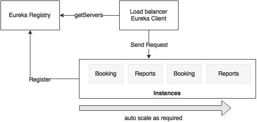

    例如，**预订**和**报告**服务运行两个实例，如上图所示。假设**预订**服务是一项创收服务，因此其价值高于**报告**服务。如果**预订**服务有更多需求，则可以设置策略，将**报表**服务从服务中取出，释放此服务器进行**预订**服务。

## 不同的自动缩放模型

自动缩放可以应用于应用程序级别或基础架构级别。简而言之，应用程序扩展是通过仅复制应用程序二进制文件进行扩展，而基础结构扩展是复制整个虚拟机，包括应用程序二进制文件。

### 自动缩放应用程序

在这个场景中，通过复制微服务而不是底层基础设施（如虚拟机）来实现扩展。假设有一个虚拟机池或物理基础设施可用于扩展微服务。这些虚拟机具有与任何依赖项（如 JRE）融合的基本映像。还假设微服务在本质上是同质的。这为不同的服务重用相同的虚拟机或物理机提供了灵活性：

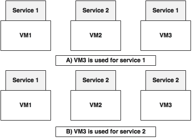

如上图所示，在场景**A**中**VM3**用于**服务 1**，而在场景**B**中，相同的**VM3**用于**服务 2**。在本例中，我们只交换了应用程序库，而没有交换底层基础结构。

这种方法提供了更快的实例化，因为我们只处理应用程序二进制文件，而不处理底层 VM。由于二进制文件的大小更小，而且也不需要操作系统引导，因此切换更容易、更快。然而，这种方法的缺点是，如果某些微服务需要操作系统级调优或使用多语言技术，那么动态交换微服务将不会有效。

### 自动缩放基础设施

与前面的方法不同，在这种情况下，基础设施也会自动配置。在大多数情况下，这将动态创建一个新的虚拟机，或根据需要销毁虚拟机：


如上图所示，保留实例被创建为具有预定义服务实例的 VM 映像。当**业务 1**有需求时，**VM3**移动到激活状态。当有**服务 2**的需求时，**VM4**移动到激活状态。

如果应用程序依赖于基础结构级别（如操作系统）的参数和库，那么这种方法是有效的。此外，这种方法更适合于 polyglot 微服务。缺点是虚拟机映像的繁重性以及启动新虚拟机所需的时间。在这种情况下，首选 Dockers 等轻量级容器，而不是传统的重量级虚拟机。

## 云中的自动缩放

弹性或自动缩放是大多数云提供商的基本特征之一。云提供商使用基础设施扩展模式，如前一节所述。它们通常基于一组池化机器。

例如，在 AWS 中，这些是基于引入具有预定义 AMI 的新 EC2 实例。AWS 在自动缩放组的帮助下支持自动缩放。每个组都设置了最小和最大实例数。AWS 确保在这些范围内按需缩放实例。对于可预测的流量模式，可以根据时间线配置资源调配。AWS 还为应用程序提供自定义自动缩放策略的能力。

Microsoft Azure 还支持基于资源利用率（如 CPU、消息队列长度等）的自动缩放。IBMBlueMix 支持基于资源（如 CPU 使用率）的自动缩放。

其他 PaaS 平台，如 CloudBees 和 OpenShift，也支持 Java 应用程序的自动缩放。Pivotal Cloud Foundry 借助 Pivotal Autoscale 支持自动缩放。扩展策略通常基于资源利用率，例如 CPU 和内存阈值。

有一些组件运行在云上，并提供细粒度控件来处理自动缩放。Netflix Fenzo、Eucalyptus、Boxfuse 和 Mesosphere 是这一类别中的一些组件。

# 自动缩放方法

自动标定是通过考虑不同的参数和阈值来处理的。在本节中，我们将讨论通常用于决定何时扩大或缩小规模的不同方法和政策。

## 资源约束下的扩展

此方法基于通过监控机制收集的实时服务度量。通常，资源扩展方法根据计算机的 CPU、内存或磁盘做出决定。这也可以通过查看在服务实例本身上收集的统计信息来完成，例如堆内存使用情况。

当机器的 CPU 利用率超过 60%时，典型的策略可能会启动另一个实例。类似地，如果堆大小超过某个阈值，我们可以添加一个新实例。当资源利用率低于设定的阈值时，这同样适用于缩小计算容量。这是通过逐渐关闭服务器来实现的：

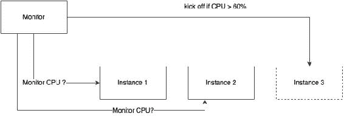

在典型的生产场景中，在第一次出现阈值违反时不会创建附加服务。最合适的方法是定义滑动窗口或等待期。

以下是一些例子：

*   **响应滑动窗口**的一个示例是，如果特定事务的 60%响应时间在 60 秒的采样窗口中始终大于设置的阈值，则增加服务实例
*   在**CPU 滑动窗口**中，如果 CPU 利用率在 5 分钟滑动窗口中持续超过 70%，则会创建一个新实例
*   **异常滑动窗口**的一个例子是，如果 60 秒或 10 次连续执行的滑动窗口中 80%的事务导致特定的系统异常，例如由于线程池耗尽导致连接超时，则创建一个新的服务实例

在许多情况下，我们将设置一个低于实际预期阈值的阈值。例如，不要将 CPU 利用率阈值设置为 80%，而是将其设置为 60%，以便系统有足够的时间在实例停止响应之前启动实例。类似地，缩小时，我们使用比实际值更低的阈值。例如，我们将使用 40%的 CPU 利用率来缩小规模，而不是 60%。这允许我们有一个冷却期，以便在关闭实例时不会出现任何资源冲突。

基于资源的扩展也适用于服务级别参数，如服务吞吐量、延迟、应用程序线程池、连接池等。这些也可以在应用程序级别，例如基于内部基准测试的服务实例中**销售订单**处理的数量。

## 特定时间段内的缩放

基于时间的扩展是一种基于一天、一个月或一年中的特定时段扩展服务的方法，以处理季节性或业务高峰。例如，某些服务可能在办公时间内发生较多的交易，而在办公时间以外发生的交易则相当少。在这种情况下，在白天，服务自动缩放以满足需求，并在非办公时间自动缩小规模：

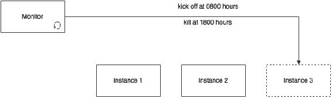

世界上许多机场对夜间降落实行限制。因此，与白天相比，夜间在机场办理登机手续的乘客数量较少。因此，在夜间减少实例的数量具有成本效益。

## 基于消息队列长度的伸缩

当微服务基于异步消息传递时，这一点特别有用。在这种方法中，当队列中的消息超出某些限制时，会自动添加新的使用者：

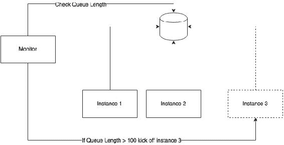

这种方法基于竞争性消费者模式。在本例中，使用实例池来使用消息。根据消息阈值，添加新实例以使用其他消息。

## 基于业务参数的缩放

在这个案例中，添加实例是基于某些业务参数的，例如，在处理**销售结算**交易之前旋转一个新实例。一旦监控服务接收到预配置的业务事件（例如**销售结束减去 1 小时**），就会出现一个新实例，以预测大量交易。这将提供基于业务规则的细粒度扩展控制：

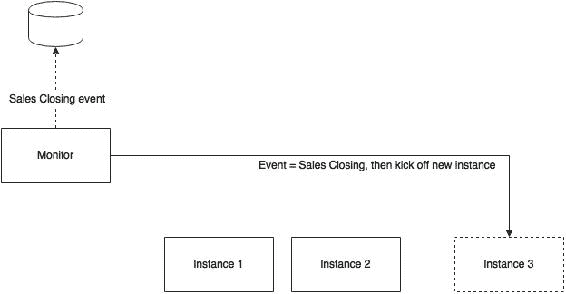

## 预测性自动校准

预测标度是一种新的自动标度范式，不同于传统的基于实时度量的自动标度。预测引擎将获取多个输入，例如历史信息、当前趋势等，以预测可能的交通模式。自动缩放是基于这些预测完成的。预测性自动缩放有助于避免硬编码规则和时间窗口。相反，该系统可以自动预测此类时间窗口。在更复杂的部署中，预测分析可以使用认知计算机制来预测自动缩放。

在流量突然增加的情况下，传统的自动缩放可能没有帮助。在自动校准组件对情况做出反应之前，尖峰会击中并损坏系统。预测系统可以理解这些情景，并在其实际发生之前进行预测。例如，在计划停机后立即处理大量请求。

Netflix Scryer 就是这样一个可以提前预测资源需求的系统的例子。

# 自动标定棕地 PSS 微服务

在部分中，我们将研究如何增强[第 5 章](05.html "Chapter 5. Scaling Microservices with Spring Cloud")中开发的用于自动缩放的*使用 Spring Cloud*缩放微服务。我们需要一个组件来监控某些性能指标并触发自动缩放。我们将此组件称为**生命周期管理器**。

服务生命周期管理器或应用程序生命周期管理器负责检测扩展需求并相应地调整实例数量。它负责动态启动和关闭实例。

在本节中，我们将了解一个原始的自动缩放系统，以了解基本概念，这些概念将在后面的章节中得到增强。

## 自动校准系统所需的能力

典型的自动校准系统的功能如下图所示：

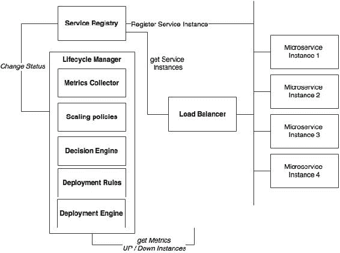

自动缩放生态系统在微服务环境中涉及的组件解释如下：

*   **微服务**：这些是一组启动并运行的微服务实例，它们不断发送运行状况和度量信息。或者，这些服务公开用于度量集合的执行器端点。在上图中，这些表示为**微服务 1**到**微服务 4**。
*   **服务注册中心**：服务注册中心记录所有服务、其运行状况、元数据和端点 URI。
*   **负载均衡器**：这是一个客户端负载均衡器，它查找服务注册表以获取可用服务实例的最新信息。
*   **生命周期管理器**：生命周期管理器负责自动校准，自动校准有以下子组件：
    *   **度量收集器**：度量收集单元负责收集所有服务实例的度量。生命周期经理将汇总这些指标。它还可以保持滑动时间窗口。这些指标可以是基础架构级别的指标，如 CPU 使用率，也可以是应用程序级别的指标，如每分钟事务数。
    *   **缩放策略**：缩放策略只是一组规则，指示何时缩放微服务，例如，在 5 分钟的滑动窗口中，90%的 CPU 使用率超过 60%。
    *   **决策引擎**：一个决策引擎负责根据聚合的度量和缩放策略做出放大和缩小的决策。
    *   Apple T0.部署规则 AuthT1：部署引擎使用部署规则来决定部署服务时要考虑哪些参数。例如，服务部署约束可能会说实例必须分布在多个可用性区域或服务所需的最小 4GB 内存。
    *   **部署引擎**：部署引擎根据决策引擎的决策，可以通过改变服务的运行状况来启动或停止微服务实例或更新注册表。例如，它将运行状况设置为“停止服务”，以临时取消服务。

## 使用 Spring Boot 实现定制生命周期管理器

本节中介绍的生命周期管理器是了解自动缩放功能的一个最小实现。在后面的章节中，我们将使用容器和集群管理解决方案来增强此实现。Ansible、Marathon 和 Kubernetes 是构建此功能的一些有用工具。

在本节中，我们将使用 Spring Boot 为[第 5 章](05.html "Chapter 5. Scaling Microservices with Spring Cloud")、*使用 Spring Cloud*扩展微服务中开发的服务实现应用级自动缩放组件。

## 了解部署拓扑

以下图显示了棕地 PSS 微服务的示例部署拓扑：


如图所示，有四台物理机器。八个虚拟机由四台物理机器创建。假设所有服务具有相同的资源需求，每个物理机器都能够承载两个 VM，每个 VM 都能够运行两个 Spring 引导实例。

四个虚拟机**VM1**到**VM4**处于活动状态，用于处理流量。**VM5**至**VM8**保留为备用 VM，以处理可扩展性。**VM5**和**VM6**可用于任何微服务，也可根据扩展需求在微服务之间切换。冗余服务使用从不同物理机器创建的虚拟机来提高容错能力。

我们的目标是在使用四台虚拟机**VM5**到**VM8**的流量增加时，扩展任何服务，并在负载不足时缩小规模。我们解决方案的架构如下。

## 了解执行流程

查看以下流程图：


如上图所示，以下活动对我们很重要：

*   SpringBoot 服务代表诸如搜索、预订、票价和入住等微服务。服务在启动时自动将端点详细信息注册到 Eureka 注册表。这些服务是执行器启用的，因此生命周期管理器可以从执行器端点收集度量。
*   生命周期管理器服务只是另一个 Spring 引导应用程序。生命周期管理器有一个度量收集器，它运行后台作业，定期轮询 Eureka 服务器，并获取所有服务实例的详细信息。然后，度量收集器调用在 Eureka 注册表中注册的每个微服务的执行器端点，以获取运行状况和度量信息。在实际生产场景中，数据收集的订阅方法更好。
*   使用收集的度量信息，生命周期管理器执行策略列表，并得出是否放大或缩小实例的决策。这些决策要么在特定 VM 上启动特定类型的新服务实例，要么关闭特定实例。
*   在关闭的情况下，它使用执行器端点连接到服务器，并调用关闭服务以正常关闭实例。
*   在启动新实例的情况下，生命周期管理器的部署引擎使用缩放规则，并决定在何处启动新实例以及启动实例时使用哪些参数。然后，它使用 SSH 连接到相应的 vm。一旦连接，它将通过将所需约束作为参数传递来执行预安装的脚本（或将此脚本作为执行的一部分传递）。此脚本从保存生产二进制文件的中央 Nexus 存储库获取应用程序库，并将其作为 Spring 引导应用程序启动。端口号由生命周期管理器参数化。需要在目标计算机上启用 SSH。

在本例中，我们将使用**TPM**（**每分钟事务数**）或**RPM**（**每分钟请求数**）作为决策的采样器度量。如果搜索服务有超过 10 个 TPM，那么它将启动一个新的搜索服务实例。类似地，如果 TPM 低于 2，则其中一个实例将被关闭并释放回池。

启动新实例时，将应用以下策略：

*   任何点上的服务实例数应至少为 1，最多为 4。这也意味着至少有一个服务实例将始终处于启动和运行状态。
*   扩展组的定义方式是在不同物理机器上的 VM 上创建新实例。这将确保服务在不同的物理机器上运行。

这些政策可以进一步加强。理想情况下，生命周期管理器提供了通过 RESTAPI 或 Groovy 脚本定制这些规则的选项。

## 生命周期管理器代码演练

我们来看看一个简单的生命周期管理器是如何实现的。本节将对代码进行演练，以了解生命周期管理器的不同组件。

### 提示

完整的源代码可在`Chapter 6`项目的代码文件中找到。将`chapter5.configserver`、`chapter5.eurekaserver`、`chapter5.search`和`chapter5.search-apigateway`分别复制并重命名为`chapter6.*`。

执行以下步骤以实现自定义生命周期管理器：

1.  Create a new Spring Boot application and name it `chapter6.lifecyclemanager`. The project structure is shown in the following diagram:

    

    该示例的流程图如下图所示：

    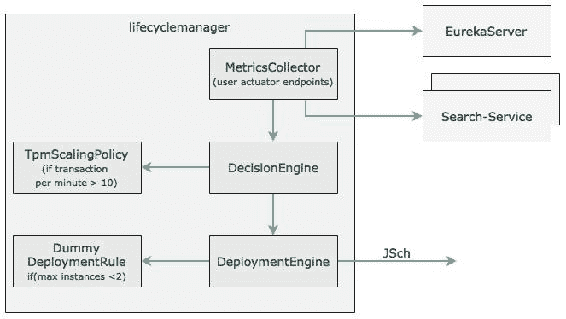

    此图的组件将在此处详细说明。

2.  Create a `MetricsCollector` class with the following method. At the startup of the Spring Boot application, this method will be invoked using `CommandLineRunner`, as follows:

    ```java
    public void start(){
      while(true){ 
        eurekaClient.getServices().forEach(service -> {        System.out.println("discovered service "+ service);
          Map metrics = restTemplate.getForObject("http://"+service+"/metrics",Map.class);
          decisionEngine.execute(service, metrics);
        });  
      }    
    }
    ```

    前面的方法查找在 Eureka 服务器中注册的服务并获取所有实例。在现实世界中，实例应该将度量发布到一个公共位置，而不是轮询，在那里将发生度量聚合。

3.  以下`DecisionEngine`代码接受该度量并应用某些扩展策略来确定服务是否需要扩展：

    ```java
      public boolean execute(String serviceId, Map metrics){
      if(scalingPolicies.getPolicy(serviceId).execute(serviceId, metrics)){    
          return deploymentEngine.scaleUp(deploymentRules.getDeploymentRules(serviceId), serviceId);  
        }
        return false;
      }
    ```

4.  基于服务 ID，将拾取并应用与服务相关的策略。在这种情况下，在`TpmScalingPolicy`中实现了一个最小 TPM 扩展策略，如下所示：

    ```java
    public class TpmScalingPolicy implements ScalingPolicy {
      public boolean execute(String serviceId, Map metrics){
        if(metrics.containsKey("gauge.servo.tpm")){
          Double tpm = (Double) metrics.get("gauge.servo.tpm");
          System.out.println("gauge.servo.tpm " + tpm);
          return (tpm > 10);
        }
        return false;
      }
    }
    ```

5.  如果策略返回`true`，则`DecisionEngine`调用`DeploymentEngine`启动另一个实例。`DeploymentEngine`利用`DeploymentRules`决定如何执行缩放。这些规则可以强制执行最小和最大实例数、新实例必须在哪个区域或机器上启动、新实例所需的资源等。`DummyDeploymentRule`只需确保最大实例不超过 2 个。
6.  `DeploymentEngine`在本例中，使用**JSch**（**Java 安全通道**）库从 JCraft 到 SSH 到达目的服务器并启动服务。这需要以下额外的 Maven 依赖项：

    ```java
    <dependency>
        <groupId>com.jcraft</groupId>
        <artifactId>jsch</artifactId>
        <version>0.1.53</version>
    </dependency>
    ```

7.  The current SSH implementation is kept simple enough as we will change this in future chapters. In this example, `DeploymentEngine` sends the following command over the SSH library on the target machine:

    ```java
     String command ="java -jar -Dserver.port=8091 ./work/codebox/chapter6/chapter6.search/target/search-1.0.jar";

    ```

    使用 Linux 脚本和 Nexus CLI 或使用`curl`在目标机器上实现与 Nexus 的集成。在本例中，我们将不探讨 Nexus。

8.  The next step is to change the Search microservice to expose a new gauge for TPM. We have to change all the microservices developed earlier to submit this additional metric.

    我们将只在本章中检查搜索，但为了完成它，必须更新所有服务。为了获得`gauge.servo.tpm`指标，我们必须将`TPMCounter`添加到所有微服务中。

    以下代码在 1 分钟的滑动窗口内统计事务：

    ```java
    class TPMCounter {
      LongAdder count;
      Calendar expiry = null; 
      TPMCounter(){
        reset();
      }  
      void reset (){
        count = new LongAdder();
        expiry = Calendar.getInstance();
        expiry.add(Calendar.MINUTE, 1);
      }
      boolean isExpired(){
        return Calendar.getInstance().after(expiry);
      }
      void increment(){
         if(isExpired()){
           reset();
         }
         count.increment();
      }
    }
    ```

9.  需要在`SearchController`中添加以下代码来设置`tpm`值：

    ```java
    class SearchRestController {
      TPMCounter tpm = new TPMCounter();
      @Autowired
      GaugeService gaugeService;
       //other code 
    ```

10.  以下代码来自`SearchRestController`的 get REST 端点（搜索方法），它将`tpm`值作为量规提交给执行器端点：

    ```java
    tpm.increment();
    gaugeService.submit("tpm", tpm.count.intValue()); 
    ```

## 运行生命周期管理器

执行以下步骤以运行上一节中开发的生命周期管理器：

1.  编辑`DeploymentEngine.java`并更新密码以反映机器的密码，如下所示。这是 SSH 连接所必需的：

    ```java
    session.setPassword("rajeshrv");
    ```

2.  通过以下命令从根文件夹（`Chapter 6`）运行 Maven 来构建所有项目：

    ```java
    mvn -Dmaven.test.skip=true clean install

    ```

3.  然后，运行 RabbitMQ，如下所示：

    ```java
    ./rabbitmq-server

    ```

4.  确保配置服务器指向正确的配置存储库。我们需要为生命周期管理器添加一个属性文件。
5.  从相应的项目文件夹中运行以下命令：

    ```java
    java -jar target/config-server-0.0.1-SNAPSHOT.jar
    java -jar target/eureka-server-0.0.1-SNAPSHOT.jar
    java -jar target/lifecycle-manager-0.0.1-SNAPSHOT.jar
    java -jar target/search-1.0.jar
    java -jar target/search-apigateway-1.0.jar
    java -jar target/website-1.0.jar

    ```

6.  所有服务启动后，打开浏览器窗口并加载`http://localhost:8001`。
7.  在一分钟内依次执行 11 次航班搜索。这将触发决策引擎实例化搜索微服务的另一个实例。
8.  Open the Eureka console (`http://localhost:8761`) and watch for a second **SEARCH-SERVICE**. Once the server is started, the instances will appear as shown here:

    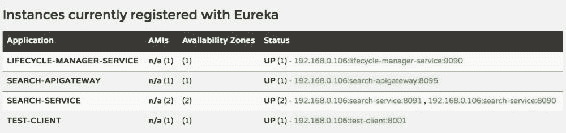

# 总结

在本章中，您了解了在部署大规模微服务时自动缩放的重要性。

我们还探讨了自动缩放的概念以及自动缩放的不同模型和方法，如基于时间、基于资源、基于队列长度和预测的模型和方法。然后，我们回顾了生命周期管理器在微服务环境中的角色，并回顾了其功能。最后，我们在本章结束时回顾了一个简单的定制生命周期管理器在棕地 PSS 微服务环境中的示例实现。

在处理大规模微服务时，自动缩放是一种重要的支持功能。我们将在[第 9 章](09.html "Chapter 9. Managing Dockerized Microservices with Mesos and Marathon")*中讨论生命周期管理器的更成熟实现，即使用 Mesos 和 Marathon*管理容器化的微服务。

下一章将探讨成功部署微服务所必需的日志记录和监视功能。