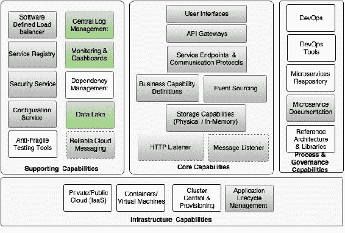
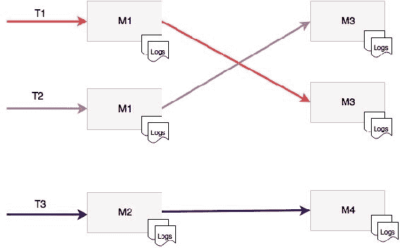
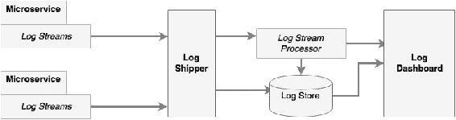
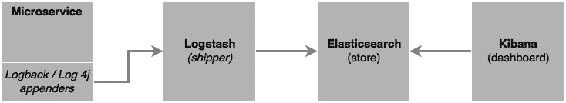
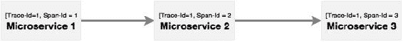
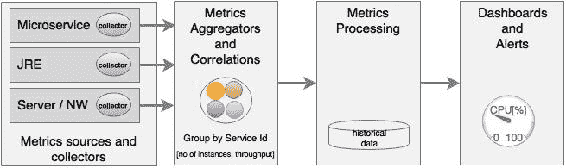
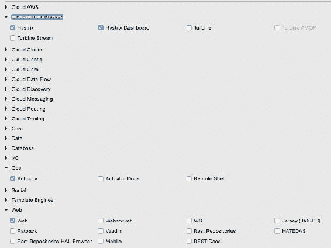
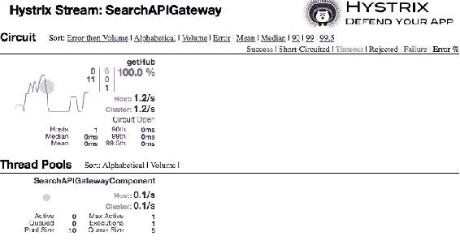
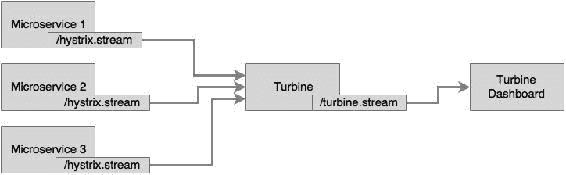
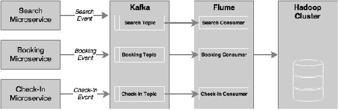

# 第 7 章记录和监控微服务

由于互联网规模的微服务部署的非常分散的性质，最大的挑战之一是单个微服务的日志记录和监控。通过关联不同微服务发出的日志，很难跟踪端到端事务。与单片应用程序一样，没有单一的玻璃来监控微服务。

本章将介绍微服务部署中日志记录和监视的必要性和重要性。本章将进一步研究使用一些潜在的体系结构和技术解决日志记录和监视的挑战和解决方案。

在本章结束时，您将了解：

*   日志管理的不同选项、工具和技术
*   springcloudsleuth 在跟踪微服务中的应用
*   用于端到端监控微服务的不同工具
*   使用 Spring Cloud Hystrix 和涡轮机进行电路监控
*   使用数据湖实现业务数据分析

# 回顾微服务能力模型

在本章中，我们将从[第 3 章](03.html "Chapter 3. Applying Microservices Concepts")、*应用微服务概念*中讨论的微服务能力模型中探索以下微服务能力：

*   **中央日志管理**
*   **监控和仪表盘**
*   **依赖关系管理**（监控和仪表盘部分）
*   **数据湖**



# 了解日志管理挑战

日志只不过是来自正在运行的进程的事件流。对于传统的 JEE 应用程序，有许多框架和库可供记录。Java 日志（JUL）是 Java 本身的现成选项。Log4j、Logback 和 SLF4J 是其他一些流行的日志框架。这些框架支持 UDP 和 TCP 协议进行日志记录。应用程序将日志条目发送到控制台或文件系统。文件回收技术通常用于避免日志填满所有磁盘空间。

日志处理的最佳实践之一是关闭生产中的大多数日志条目，因为磁盘 IO 的成本很高。磁盘 IOs 不仅会降低应用程序的速度，还会严重影响可扩展性。将日志写入磁盘还需要高磁盘容量。磁盘空间不足的情况会导致应用程序停机。日志框架提供了在运行时控制日志的选项，以限制要打印的内容和不打印的内容。这些框架中的大多数都提供了对日志记录控件的细粒度控制。它们还提供了在运行时更改这些配置的选项。

另一方面，如果分析得当，日志可能包含重要信息，具有很高的价值。因此，限制日志条目实际上限制了我们理解应用程序行为的能力。

当从传统部署转移到云部署时，应用程序不再锁定在特定的预定义机器上。虚拟机和容器不是与应用程序硬连接的。用于部署的计算机可以随时更改。此外，像 Docker 这样的容器是短暂的。这本质上意味着不能依赖磁盘的持久状态。一旦容器停止并重新启动，写入磁盘的日志就会丢失。因此，我们不能依赖本地计算机的磁盘来写入日志文件。

正如我们在[第 1 章](01.html "Chapter 1. Demystifying Microservices")、*揭开微服务的神秘面纱*中所讨论的，十二要素应用程序的原则之一是避免应用程序本身路由或存储日志文件。在微服务的上下文中，它们将在孤立的物理或虚拟机上运行，导致日志文件碎片化。在这种情况下，几乎不可能跟踪跨多个微服务的端到端事务：



如图所示，每个微服务向本地文件系统发送日志。在这种情况下，微服务 M1 调用 M3。这些服务将日志写入自己的本地文件系统。这使得关联和理解端到端事务流变得更加困难。此外，如图所示，有两个 M1 实例和两个 M2 实例在两台不同的机器上运行。在这种情况下，很难实现服务级别的日志聚合。

# 集中式日志解决方案

为了应对前面提到的挑战，传统的日志解决方案需要认真反思。新的日志记录解决方案除了解决上述挑战外，还将支持以下概述的功能：

*   能够收集所有日志消息并在日志消息之上运行分析
*   端到端关联和跟踪事务的能力
*   能够将日志信息保留更长时间以进行趋势分析和预测
*   消除对本地磁盘系统依赖的能力
*   能够聚合来自多个源（如网络设备、操作系统、微服务等）的日志信息

这些问题的解决方案是集中存储和分析所有日志消息，而不考虑日志的来源。新日志解决方案中采用的基本原则是将日志存储和处理与服务执行环境分离。与在微服务执行环境中存储和处理大量日志消息相比，大数据解决方案更适合于存储和处理大量日志消息。

在集中式日志解决方案中，日志消息将从执行环境发送到中央大数据存储。日志分析和处理将使用大数据解决方案：



如前面的逻辑图所示，集中式日志解决方案中有许多组件，如下所示：

*   **日志流**：这些是来自源系统的日志消息流。源系统可以是微服务、其他应用程序，甚至是网络设备。在典型的基于 Java 的系统中，这些消息相当于流式传输 Log4j 日志消息。
*   **日志托运人**：日志托运人负责收集来自不同来源或端点的日志消息。然后，日志托运人将这些消息发送到另一组端点，例如写入数据库、推送到仪表板或将其发送到流处理端点以进行进一步的实时处理。
*   **日志存储**：日志存储是存储所有日志消息的地方，用于实时分析、趋势分析等。通常，日志存储是一个 NoSQL 数据库，如 HDFS，能够处理大量数据。
*   **日志流处理器**：日志流处理器能够实时分析日志事件，快速决策。流处理器执行诸如向仪表板发送信息、发送警报等操作。对于自愈系统，流处理器甚至可以采取措施纠正问题。
*   **日志仪表板**：仪表板是一块玻璃，用于显示日志分析结果，如图表。这些仪表盘是为运营和管理人员设计的。

这种集中式方法的好处是没有本地 I/O 或阻止磁盘写入。它也不使用本地计算机的磁盘空间。该体系结构与用于大数据处理的 lambda 体系结构基本相似。

### 注

欲了解更多关于 Lambda 架构的信息，请访问[http://lambda-architecture.net](http://lambda-architecture.net) 。

在每个日志消息中包含上下文、消息和关联 ID 非常重要。上下文通常包含时间戳、IP 地址、用户信息、流程详细信息（如服务、类和函数）、日志类型、分类等。信息将是简单明了的自由文本信息。关联 ID 用于建立服务调用之间的链接，以便可以跟踪跨微服务的调用。

# 测井方案的选择

有个选项可用于实现集中式日志记录解决方案。这些解决方案使用不同的方法、体系结构和技术。了解所需的功能并选择满足需求的正确解决方案非常重要。

## 云服务

有很多云日志服务可用，比如 SaaS 解决方案。

Loggly 是最流行的基于云的日志服务之一。SpringBoot 微服务可以使用 Loggly 的 Log4j 和 Logback 附加器将日志消息直接流式传输到 Loggly 服务中。

如果应用程序或服务部署在 AWS 中，AWS CloudTrail 可以与 Loggly 集成以进行日志分析。

Papertrial、Logsene、Sumo Logic、Google Cloud Logging 和 Logentries 是其他基于云的日志解决方案的示例。

云日志服务通过提供简单易集成的服务，消除了管理复杂基础设施和大型存储解决方案的开销。然而，延迟是选择云日志作为服务时要考虑的关键因素之一。

## 现成的解决方案

有许多专门构建的工具可提供端到端日志管理功能，这些功能可在本地数据中心或云中安装。

Graylog 是流行的开源日志管理解决方案之一。Graylog 将 Elasticsearch 用作日志存储，将 MongoDB 用作元数据存储。Graylog 还将 GELF 库用于 Log4j 日志流。

Splunk 是一种流行的用于日志管理和分析的商业工具。Splunk 使用日志文件传送方法，而其他解决方案则使用日志流来收集日志。

## 最佳集成

最后一种方法是挑选最佳组件并构建定制日志解决方案。

### 原木托运人

有可以与其他工具相结合构建端到端日志管理解决方案的日志托运人。不同的日志传送工具的功能不同。

Logstash 是一个强大的数据管道工具，可用于收集和发送日志文件。Logstash 充当代理，提供一种机制来接受来自不同源的流数据并将其同步到不同的目的地。Log4j 和 Logback Appender 还可以用于直接从 Spring Boot 微服务向 Logstash 发送日志消息。Logstash 的另一端连接到 Elasticsearch、HDFS 或任何其他数据库。

Fluentd 是另一个与 Logstash 非常相似的工具，LogSpoot 也是如此，但后者更适合于基于 Docker 容器的环境。

### 日志流处理器

流处理技术可选择性地用于动态处理日志流。例如，如果 404 错误作为对特定服务调用的响应持续发生，则表示服务有问题。这种情况必须尽快处理。流处理器在这种情况下非常方便，因为它们能够对某些事件流做出反应，而传统的反应性分析无法做到这一点。

用于流处理的典型架构是 Flume 和 Kafka 以及 Storm 或 Spark 流的组合。Log4j 有水槽附加器，用于收集日志消息。这些消息被推送到分布式 Kafka 消息队列中。流处理器从 Kafka 收集数据，并在将数据发送到 Elasticsearch 和其他日志存储之前对其进行动态处理。

Spring Cloud Stream、Spring Cloud Stream 模块和 Spring Cloud 数据流也可用于构建日志流处理。

### 日志存储

实时日志消息通常存储在 Elasticsearch 中。Elasticsearch 允许客户端根据基于文本的索引进行查询。除了 Elasticsearch，HDFS 还常用于存储归档日志消息。MongoDB 或 Cassandra 用于存储汇总数据，例如每月汇总的事务计数。脱机日志处理可以使用 Hadoop 的 MapReduce 程序完成。

### 仪表盘

中央日志解决方案中需要的最后一件事是仪表板。日志分析最常用的仪表板是 Elasticsearch 数据存储顶部的 Kibana。Graphite 和 Grafana 也用于显示日志分析报告。

## 自定义日志记录实现

前面提到的工具可以用来构建定制的端到端日志解决方案。自定义日志管理最常用的体系结构是 Logstash、Elasticsearch 和 Kibana 的组合，也称为 ELK 堆栈。

### 注

本章的完整源代码可在`Chapter 7`项目的代码文件中找到。将`chapter5.configserver`、`chapter5.eurekaserver`、`chapter5.search`、`chapter5.search-apigateway`和`chapter5.website`复制到新的 STS 工作区中，并将其重命名为`chapter7.*`。

下图显示了日志监控流程：



在本节中，将研究使用 ELK 堆栈的自定义日志解决方案的简单实现。

按照以下步骤实现用于日志记录的 ELK 堆栈：

1.  从[下载并安装 Elasticsearch、Kibana 和 Logstashhttps://www.elastic.co](https://www.elastic.co) 。
2.  更新搜索微服务（`chapter7.search`。检查并确保 Search microservice 中有一些日志语句。日志语句没有什么特别之处，只是使用了`slf4j`的简单日志语句，如下所示：

    ```java
    import org.slf4j.Logger;
    import org.slf4j.LoggerFactory;
      //other code goes here
      private static final Logger logger = LoggerFactory.getLogger(SearchRestController.class);
    //other code goes here

    logger.info("Looking to load flights...");
    for (Flight flight : flightRepository.findByOriginAndDestinationAndFlightDate("NYC", "SFO", "22-JAN-16")) {
          logger.info(flight.toString());
    }
    ```

3.  添加`logstash`依赖项，将`logback`集成到搜索服务`pom.xml`文件中的 Logstash 中，如下所示：

    ```java
    <dependency>
      <groupId>net.logstash.logback</groupId>
      <artifactId>logstash-logback-encoder</artifactId>
      <version>4.6</version>
    </dependency>
    ```

4.  此外，通过以下行降级`logback`版本以与 Spring 1.3.5.RELEASE 兼容：

    ```java
    <logback.version>1.1.6</logback.version>
    ```

5.  Override the default Logback configuration. This can be done by adding a new `logback.xml` file under `src/main/resources`, as follows:

    ```java
    <?xml version="1.0" encoding="UTF-8"?>
    <configuration>
        <include resource="org/springframework/boot/logging/logback/defaults.xml"/>
      <include resource="org/springframework/boot/logging/logback/console-appender.xml" />
        <appender name="stash" class="net.logstash.logback.appender.LogstashTcpSocketAppender">
            <destination>localhost:4560</destination>
            <!-- encoder is required -->
            <encoder class="net.logstash.logback.encoder.LogstashEncoder" />
        </appender>
      <root level="INFO">
        <appender-ref ref="CONSOLE" />
        <appender-ref ref="stash" />
      </root>
    </configuration>
    ```

    前面的配置通过添加一个新的 TCP 套接字`appender`覆盖默认的 Logback 配置，该套接字将所有日志消息流式传输到 Logstash 服务，该服务正在侦听端口`4560`。如前一配置中所述，添加编码器非常重要。

6.  创建如下代码所示的配置，并将其存储在`logstash.conf`文件中。此文件的位置与此无关，因为它将在启动 Logstash 时作为参数传递。此配置将从监听`4560`的套接字获取输入，并将输出发送到`9200`上运行的 Elasticsearch。`stdout`是可选的，设置为调试：

    ```java
    input {
      tcp {
         port => 4560
         host => localhost
      }
    }
    output {
    elasticsearch { hosts => ["localhost:9200"] }
      stdout { codec => rubydebug }
    }
    ```

7.  从各自的安装文件夹中运行 Logstash、Elasticsearch 和 Kibana，如下所示：

    ```java
    ./bin/logstash -f logstash.conf
    ./bin/elasticsearch
    ./bin/kibana

    ```

8.  运行搜索微服务。这将调用单元测试用例并打印前面提到的日志语句。
9.  进入浏览器并访问 Kibana，位于`http://localhost:5601`。
10.  Go to **Settings** | **Configure an index pattern**, as shown here:

    

11.  Go to the **Discover** menu to see the logs. If everything is successful, we will see the Kibana screenshot as follows. Note that the log messages are displayed in the Kibana screen.

    Kibana 提供了开箱即用的功能，可以使用日志消息构建摘要图表：

    

## 使用 Spring Cloud Sleuth 进行分布式跟踪

上一节通过集中日志数据解决了微服务的分布式和碎片化日志记录问题。使用中央日志解决方案，我们可以将所有日志存储在中央存储器中。然而，跟踪端到端事务几乎仍然是不可能的。为了进行端到端跟踪，跨微服务的事务需要有一个相关 ID。

Twitter 的 Zipkin、Cloudera 的 HTrace 和 Google 的 Dapper 系统都是分布式跟踪系统的例子。springcloud 使用 springcloudsleuth 库在这些组件之上提供了一个包装器组件。

分布式跟踪采用**span**和**trace**的概念。跨度是一个工作单元；例如，调用服务由 64 位的跨度 ID 标识。形成树状结构的一组跨度称为跟踪。使用跟踪 ID，可以端到端跟踪呼叫：



如图所示，**微服务 1**调用**微服务 2**，而**微服务 2**调用**微服务 3**。在这种情况下，如图所示，相同的跟踪 ID 在所有的微服务中传递，可用于端到端跟踪事务。

为了演示这一点，我们将使用搜索 API 网关和搜索微服务。必须在搜索 API 网关（`chapter7.search-apigateway`中添加一个新端点，该网关在内部调用搜索服务以返回数据。如果没有跟踪 ID，几乎不可能跟踪或链接来自网站的调用，以搜索 API 网关来搜索微服务。在这种情况下，它只涉及两到三个服务，而在复杂的环境中，可能会有许多相互依赖的服务。

按照以下步骤使用 Sleuth 创建示例：

1.  更新搜索和搜索 API 网关。在此之前，需要将 Sleuth 依赖项添加到相应的 POM 文件中，这可以通过以下代码完成：

    ```java
    <dependency>
      <groupId>org.springframework.cloud</groupId>
      <artifactId>spring-cloud-starter-sleuth</artifactId>
    </dependency>
    ```

2.  In the case of building a new service, select **Sleuth** and **Web**, as shown here:

    

3.  将 Logstash 依赖项添加到搜索服务以及 Logback 配置中，如前一个示例所示。
4.  The next step is to add two more properties in the Logback configuration, as follows:

    ```java
    <property name="spring.application.name" value="search-service"/>
    <property name="CONSOLE_LOG_PATTERN" value="%d{yyyy-MM-dd HH:mm:ss.SSS} [${spring.application.name}] [trace=%X{X-Trace-Id:-},span=%X{X-Span-Id:-}] [%15.15t] %-40.40logger{39}: %m%n"/>
    ```

    第一个属性是应用程序的名称。本文中给出的名称分别是 Search 和 Search API Gateway 中的服务 ID:`search-service`和`search-apigateway`。第二个属性是一个可选模式，用于打印带有跟踪 ID 和跨度 ID 的控制台日志消息。前面的更改需要应用于这两个服务。

5.  添加以下代码，以告知 Sleuth 何时在 Spring Boot 应用程序类中启动新的 span ID。在这种情况下，`AlwaysSampler`用于指示每次调用命中服务时都必须创建 span ID。此更改需要应用于两个服务：

    ```java
      @Bean
        public AlwaysSampler defaultSampler() {
          return new AlwaysSampler();
        }
    ```

6.  向 Search API Gateway 添加一个新端点，该端点将调用搜索服务，如下所示。这是为了演示跟踪 ID 在多个微服务之间的传播。网关中的新方法通过调用搜索服务返回机场运营枢纽，如下所示：

    ```java
      @RequestMapping("/hubongw")
      String getHub(HttpServletRequest req){
        logger.info("Search Request in API gateway for getting Hub, forwarding to search-service ");
        String hub = restTemplate.getForObject("http://search-service/search/hub", String.class);
        logger.info("Response for hub received,  Hub "+ hub);
        return hub; 
      }
    ```

7.  在搜索服务中添加另一个端点，如下所示：

    ```java
      @RequestMapping("/hub")
      String getHub(){
        logger.info("Searching for Hub, received from search-apigateway ");
        return "SFO"; 
      }
    ```

8.  Once added, run both the services. Hit the gateway's new hub on the gateway (`/hubongw`) endpoint using a browser ( `http://localhost:8095/hubongw`).

    如前所述，搜索 API 网关服务在`8095`上运行，搜索服务在`8090`上运行。

9.  查看控制台日志以查看打印的跟踪 ID 和范围 ID。第一个打印来自搜索 API 网关，第二个打印来自搜索服务。请注意，这两种情况下的跟踪 ID 相同，如下所示：

    ```java
    2016-04-02 17:24:37.624 [search-apigateway] [trace=8a7e278f-7b2b-43e3-a45c-69d3ca66d663,span=8a7e278f-7b2b-43e3-a45c-69d3ca66d663] [io-8095-exec-10] c.b.p.s.a.SearchAPIGatewayController    : Response for hub received,  Hub DXB

    2016-04-02 17:24:37.612 [search-service] [trace=8a7e278f-7b2b-43e3-a45c-69d3ca66d663,span=fd309bba-5b4d-447f-a5e1-7faaab90cfb1] [nio-8090-exec-1] c.b.p.search.component.SearchComponent  : Searching for Hub, received from search-apigateway
    ```

10.  Open the Kibana console and search for the trace ID using this trace ID printed in the console. In this case, it is `8a7e278f-7b2b-43e3-a45c-69d3ca66d663`. As shown in the following screenshot, with a trace ID, one can trace service calls that span multiple services:

    

# 监控微服务

微服务是真正的分布式系统，具有流畅的部署拓扑。如果没有完善的监控，运营团队在管理大规模微服务时可能会遇到麻烦。传统的单片应用程序部署仅限于许多已知的服务、实例、机器等。与可能在不同机器上运行的大量微服务实例相比，这更易于管理。为了增加复杂性，这些服务动态地更改其拓扑。集中式日志功能只能解决部分问题。对于操作团队来说，了解运行时部署拓扑以及系统的行为非常重要。这需要比集中式日志记录更高的性能。

在一般应用中，监视更多地是度量、聚合及其对特定基线值的验证的集合。如果存在服务级别违规，则监控工具将生成警报并将其发送给管理员。由于有成百上千的相互连接的微服务，传统的监控并不能真正提供价值。在大规模的微服务中，用一块玻璃监视或监视一切的“一刀切”方法是不容易实现的。

微服务监控的主要目标之一是从用户体验的角度理解系统的行为。这将确保端到端行为是一致的，并且符合用户的期望。

## 监测挑战

与零碎的日志记录问题类似，监控微服务的关键挑战在于，微服务生态系统中有许多活动部分。

典型问题总结如下：

*   统计数据和度量数据在许多服务、实例和机器上都是分散的。
*   异构技术可以用来实现微服务，这使得事情变得更加复杂。单个监控工具可能无法提供所有必需的监控选项。
*   微服务部署拓扑是动态的，因此不可能预先配置服务器、实例和监视参数。

许多传统的监控工具很适合监控单片应用程序，但在监控大规模、分布式、互连的微服务系统方面存在不足。许多传统的监控系统都是在目标机器或应用程序实例上基于代理的预安装代理。这带来了两个挑战：

*   如果代理需要与服务或操作系统进行深度集成，那么在动态环境中很难进行管理
*   如果这些工具在监视或检测应用程序时带来开销，则可能会导致性能问题

许多传统工具需要基线度量。此类系统使用预设规则工作，例如，如果 CPU 利用率超过 60%并保持在该水平 2 分钟，则应向管理员发送警报。在大规模的 Internet 规模部署中，很难预先配置这些值。

新一代监控应用程序自行了解应用程序的行为并设置自动阈值。这将使管理员从这项平凡的任务中解脱出来。自动化基线有时比人工预测更准确：



如图所示，微服务监控的关键领域是：

*   **Metrics sources and data collectors**: Metrics collection at the source is done either by the server pushing metrics information to a central collector or by embedding lightweight agents to collect information. Data collectors collect monitoring metrics from different sources, such as network, physical machines, containers, software components, applications, and so on. The challenge is to collect this data using autodiscovery mechanisms instead of static configurations.

    这可以通过在源计算机上运行代理、流式传输源数据或定期轮询来完成。

*   **Aggregation and correlation of metrics**: Aggregation capability is required for aggregating metrics collected from different sources, such as user transaction, service, infrastructure, network, and so on. Aggregation can be challenging as it requires some level of understanding of the application's behavior, such as service dependencies, service grouping, and so on. In many cases, these are automatically formulated based on the metadata provided by the sources.

    通常，这是由接受度量的中介机构完成的。

*   **Processing metrics and actionable insights**: Once data is aggregated, the next step is to do the measurement. Measurements are typically done using set thresholds. In the new-generation monitoring systems, these thresholds are automatically discovered. Monitoring tools then analyze the data and provide actionable insights.

    这些工具可能使用大数据和流分析解决方案。

*   **Alerting, actions, and dashboards**: As soon as issues are detected, they have to be notified to the relevant people or systems. Unlike traditional systems, the microservices monitoring systems should be capable of taking actions on a real-time basis. Proactive monitoring is essential to achieving self-healing. Dashboards are used to display SLAs, KPIs, and so on.

    仪表板和警报工具能够处理这些需求。

微服务监控通常通过三种方法完成。要进行有效的监控，确实需要将这些因素结合起来：

*   **应用程序性能监控**（**APM**）：这是一种更传统的系统指标收集、处理、警报和仪表板呈现方法。这些都是从系统的角度来看的。应用程序拓扑发现和可视化是许多 APM 工具实现的新功能。不同的 APM 提供商的能力各不相同。
*   **综合监控**：这是一种技术，用于在生产或类似生产的环境中，通过使用多个测试场景的端到端事务来监控系统的行为。收集数据以验证系统的行为和潜在热点。综合监控也有助于了解系统依赖关系。
*   **真实用户监控**（**RUM**或**用户体验监控**：这通常是一款基于浏览器的软件，记录真实用户统计信息，如响应时间、可用性和服务级别。对于微服务，随着更频繁的发布周期和动态拓扑结构，用户体验监控更加重要。

## 监控工具

有许多工具可用于监控微服务。其中许多工具之间也存在重叠。监测工具的选择实际上取决于需要监测的生态系统。在大多数情况下，监控整个微服务生态系统需要不止一个工具。

本节的目的是熟悉一些常见的微服务友好型监控工具：

*   根据 Gartner 幻方图 2015，AppDynamics、Dynatrace 和 New Relic 是 APM 领域的顶级商业供应商。这些工具对微服务友好，并在单个控制台中有效地支持微服务监控。Ruxit、Datadog 和 Dataloop 是为基本上对微服务友好的分布式系统专门构建的其他商业产品。多个监控工具可以使用插件向 Datadog 提供数据。
*   云供应商有自己的监控工具，但在许多情况下，这些监控工具本身可能不足以进行大规模微服务监控。例如，AWS 使用 CloudWatch，Google 云平台使用云监控从各种来源收集信息。
*   一些数据收集库，如 Zabbix、statd、collectd、jmxtrans 等，在收集运行时统计信息、度量、仪表和计数器时在较低的级别上运行。通常，这些信息被输入数据采集器和处理器（如 Riemann、Datadog 和 Librato）或仪表板（如 Graphite）。
*   正如我们在[第 2 章](02.html "Chapter 2. Building Microservices with Spring Boot")、*使用弹簧靴构建微服务*中所讨论的，弹簧靴致动器是收集微服务度量、计量和计数器的良好工具之一。Netflix Servo 是一个类似于 Actuator 的度量收集器，QBit 和 Dropwizard 度量也属于同一类度量收集器。所有这些指标收集器都需要一个聚合器和仪表板，以便于进行全面监控。
*   在微服务监控中，通过日志进行监控很流行，但效率较低。在这种方法中，如前一节所讨论的，日志消息从各种来源（如微服务、容器、网络等）发送到中心位置。然后，我们可以使用日志文件来跟踪事务、识别热点等。Loggly、ELK、Splunk 和 Trace 是该空间的候选对象。
*   Sensu 是开源社区微服务监控的热门选择。Weave Scope 是另一种工具，主要针对集装箱化部署。Spigo 是专门构建的微服务监控系统之一，与 Netflix 堆栈密切相关。
*   Pingdom、New Relic Synthetics、Runscope、Catchpoint 等为实时系统上的综合事务监控和用户体验监控提供了选项。
*   Circonus 更多地被归类为 DevOps 监控工具，但也可以进行微服务监控。Nagios 是一种流行的开源监控工具，但更多地属于传统监控系统。
*   Prometheus 提供了一个时间序列数据库和可视化 GUI，可用于构建定制的监控工具。

## 监控微服务依赖关系

当存在大量具有依赖关系的微服务时，重要的是要有一个能够显示微服务之间依赖关系的监控工具。它不是静态配置和管理这些依赖关系的可伸缩方法。有许多工具可用于监视微服务依赖关系，如下所示：

*   AppDynamics、Dynatrace 和 New Relic 等指导工具可以在微服务之间建立依赖关系。端到端事务监视还可以跟踪事务依赖关系。其他监控工具，如 Spigo，也可用于微服务依赖关系管理。
*   CMDB 工具（如 Device42）或专门构建的工具（如 Compliance）在管理微服务的依赖性方面很有用。**Veritas 风险顾问**（**VRA**）也有助于基础设施发现。
*   使用图形数据库（如 Neo4j）的自定义实现也很有用。在这种情况下，微服务必须预先配置其直接和间接依赖关系。在服务启动时，它发布并交叉检查其与 Neo4j 数据库的依赖关系。

## 用于容错微服务的 Spring Cloud Hystrix

本节将探讨 Spring Cloud Hystrix 作为容错和延迟容错微服务实现的库。Hystrix 基于*快速故障*和*快速恢复*原则。如果服务存在问题，Hystrix 会帮助隔离它。它通过退回到另一个预配置的回退服务来帮助快速恢复。Hystrix 是 Netflix 的另一个经过战斗测试的库。Hystrix 基于断路器模式。

### 注

阅读更多关于[处断路器模式的信息 https://msdn.microsoft.com/en-us/library/dn589784.aspx](https://msdn.microsoft.com/en-us/library/dn589784.aspx) 。

在本节中，我们将使用 Spring Cloud Hystrix 构建断路器。执行以下步骤更改 Search API 网关服务以将其与 Hystrix 集成：

1.  Update the Search API Gateway service. Add the Hystrix dependency to the service. If developing from scratch, select the following libraries:

    

2.  在 Spring Boot 应用程序类中，添加`@EnableCircuitBreaker`。此命令将告知 Spring Cloud Hystrix 为此应用启用断路器。它还公开了度量集合的`/hystrix.stream`端点。
3.  使用方法向 Search API 网关服务添加组件类；在本例中，这是用`@HystrixCommand`注释的`getHub`。这告诉 Spring 这种方法很容易失败。SpringCloud 库封装了这些方法，通过启用断路器来处理容错和延迟容错。Hystrix 命令后面通常带有回退方法。如果出现故障，Hystrix 将自动启用上述回退方法，并将流量转移到回退方法。如下面代码所示，在这种情况下，`getHub`将返回到`getDefaultHub`：

    ```java
    @Component  
    class SearchAPIGatewayComponent { 
      @LoadBalanced
      @Autowired 
      RestTemplate restTemplate;

      @HystrixCommand(fallbackMethod = "getDefaultHub")
      public String getHub(){
        String hub = restTemplate.getForObject("http://search-service/search/hub", String.class);
        return hub;
      }
      public String getDefaultHub(){
        return "Possibily SFO";
      }
    }
    ```

4.  `SearchAPIGatewayController`的`getHub`方法调用`SearchAPIGatewayComponent`的`getHub`方法，如下所示：

    ```java
    @RequestMapping("/hubongw") 
    String getHub(){
      logger.info("Search Request in API gateway for getting Hub, forwarding to search-service ");
      return component.getHub(); 
    }
    ```

5.  本练习的最后一部分是构建 Hystrix 仪表板。为此，构建另一个 Spring 引导应用程序。构建此应用程序时，包括 Hystrix、Hystrix 仪表板和执行器。
6.  在 Spring Boot 应用程序类中，添加`@EnableHystrixDashboard`注释。
7.  启动搜索服务、搜索 API 网关和 Hystrix 仪表板应用程序。将浏览器指向 Hystrix 仪表板应用程序的 URL。在本例中，Hystrix 仪表板在端口`9999`上启动。所以，打开 URL`http://localhost:9999/hystrix`。
8.  A screen similar to the following screenshot will be displayed. In the Hystrix Dashboard, enter the URL of the service to be monitored.

    在这种情况下，搜索 API 网关正在端口`8095`上运行。因此，`hystrix.stream`URL 将为`http://localhost:8095/hytrix.stream`，如图所示：

    

9.  The Hystrix Dashboard will be displayed as follows:

    

    ### 提示

    请注意，至少必须执行一个事务才能看到显示。这可以通过点击`http://localhost:8095/hubongw`来完成。

10.  通过关闭搜索服务创建故障场景。请注意，当点击 URL`http://localhost:8095/hubongw`时，将调用回退方法。
11.  If there are continuous failures, then the circuit status will be changed to open. This can be done by hitting the preceding URL a number of times. In the open state, the original service will no longer be checked. The Hystrix Dashboard will show the status of the circuit as **Open**, as shown in the following screenshot. Once a circuit is opened, periodically, the system will check for the original service status for recovery. When the original service is back, the circuit breaker will fall back to the original service and the status will be set to **Closed**:

    

    ### 注

    要了解这些参数的含义，请访问 Hystrix wiki，网址为[https://github.com/Netflix/Hystrix/wiki/Dashboard](https://github.com/Netflix/Hystrix/wiki/Dashboard) 。

## 将 Hystrix 溪流与涡轮机聚合

在前面的示例中，我们的微服务的`/hystrix.stream`端点在 Hystrix 仪表板中给出。Hystrix 仪表板一次只能监控一个微服务。如果有许多微服务，那么每次我们将微服务切换到监视器时，指向该服务的 Hystrix 仪表板都必须更改。一次查看一个实例是乏味的，尤其是当一个微服务或多个微服务有多个实例时。

我们必须有一种机制来聚合来自多个`/hystrix.stream`实例的数据，并将其整合到单个仪表板视图中。涡轮机也做同样的事情。Turbine 是另一个从多个实例收集 Hystrix 流并将其合并到一个`/turbine.stream`实例的服务器。现在，Hystrix 仪表板可以指向`/turbine.stream`以获取合并信息：



### 提示

Turbine 当前仅适用于不同的主机名。每个实例都必须在不同的主机上运行。如果在同一台主机上本地测试多个服务，则更新主机文件（`/etc/hosts`）以模拟多个主机。完成后，`bootstrap.properties`必须按如下方式配置：

```java
eureka.instance.hostname: localdomain2
```

此示例演示如何使用 Turbine 跨多个实例和服务监控断路器。在本例中，我们将使用搜索服务和搜索 API 网关。涡轮机内部使用 Eureka 解析配置用于监控的服务 ID。

执行以下步骤以生成并执行此示例：

1.  可以使用 SpringBootStarter 将 Turbine 服务器创建为另一个 SpringBoot 应用程序。选择 Turbine 以包括 Turbine 库。
2.  创建应用程序后，将`@EnableTurbine`添加到主 Spring Boot 应用程序类中。在本例中，Turbine 和 Hystrix Dashboard 都配置为在同一 Spring Boot 应用程序上运行。这可以通过向新创建的涡轮机应用程序添加以下注释来实现：

    ```java
    @EnableTurbine
    @EnableHystrixDashboard
    @SpringBootApplication
    public class TurbineServerApplication {
    ```

3.  在`.yaml`或属性文件中添加以下配置，以指向我们感兴趣监视的实例：

    ```java
    spring:
       application:
         name : turbineserver
    turbine:
       clusterNameExpression: new String('default')
       appConfig : search-service,search-apigateway
    server:
      port: 9090
    eureka:
      client:
        serviceUrl:
           defaultZone: http://localhost:8761/eureka/
    ```

4.  前面的配置指示涡轮机服务器查找 Eureka 服务器以解析`search-service`和`search-apigateway`服务。`search-service`和`search-apigateways`服务 ID 用于向 Eureka 注册服务。Turbine 通过检查 Eureka 服务器，使用这些名称解析实际的服务主机和端口。然后，它将使用这些信息从每个实例中读取`/hystrix.stream`。然后，Turbine 将读取所有单独的 Hystrix 流，聚合所有这些流，并在 Turbine 服务器的`/turbine.stream`URL 下公开它们。
5.  集群名称表达式指向默认集群，因为在本例中没有明确的集群配置。如果集群是手动配置的，则必须使用以下配置：

    ```java
    turbine:
      aggregator:
        clusterConfig: [comma separated clusternames]
    ```

6.  更改搜索服务的`SearchComponent`以添加另一个断路器，如下所示：

    ```java
      @HystrixCommand(fallbackMethod = "searchFallback")
      public List<Flight> search(SearchQuery query){
    ```

7.  另外，将`@EnableCircuitBreaker`添加到搜索服务中的主应用程序类中。
8.  将以下配置添加到搜索服务的`bootstrap.properties`。这是必需的，因为所有服务都在同一台主机上运行：

    ```java
    Eureka.instance.hostname: localdomain1
    ```

9.  同样，在搜索 API 网关服务的`bootstrap.properties`中添加以下内容。这是为了确保两个服务使用不同的主机名：

    ```java
    eureka.instance.hostname: localdomain2
    ```

10.  在本例中，我们将运行两个`search-apigateway`实例：一个在`localdomain1:8095`上，另一个在`localdomain2:8096`上。我们还将在`localdomain1:8090`上运行一个`search-service`实例。
11.  运行带命令行覆盖的微服务来管理不同的主机地址，如下所示：

    ```java
    java -jar -Dserver.port=8096 -Deureka.instance.hostname=localdomain2 -Dserver.address=localdomain2 target/chapter7.search-apigateway-1.0.jar
    java -jar -Dserver.port=8095 -Deureka.instance.hostname=localdomain1 -Dserver.address=localdomain1 target/chapter7.search-apigateway-1.0.jar
    java -jar -Dserver.port=8090 -Deureka.instance.hostname=localdomain1 -Dserver.address=localdomain1 target/chapter7.search-1.0.jar

    ```

12.  将浏览器指向`http://localhost:9090/hystrix`打开 Hystrix 仪表板。
13.  这次我们将指向`/turbine.stream`，而不是给出`/hystrix.stream`。在本例中，涡轮流在`9090`上运行。因此，Hystrix 仪表板中给出的 URL 为`http://localhost:9090/turbine.stream`。
14.  Fire a few transactions by opening a browser window and hitting the following two URLs: `http://localhost:8095/hubongw` and `http://localhost:8096/hubongw`.

    完成此操作后，仪表板页面将显示**getHub**服务。

15.  Run `chapter7.website`. Execute the search transaction using the website `http://localhost:8001`.

    执行上述搜索后，仪表板页面也会显示**搜索服务**。这显示在以下屏幕截图中：

    

正如我们在仪表板上看到的，**搜索服务**来自搜索微服务，**getHub**来自搜索 API 网关。由于我们有两个 Search API Gateway 实例，**getHub**来自两台主机，由**主机 2**表示。

# 使用数据湖进行数据分析

与碎片化日志和监控场景类似，碎片化数据是微服务架构中的另一个挑战。碎片化数据给数据分析带来了挑战。这些数据可以用于简单的业务事件监视、数据审核，甚至可以从数据中导出业务智能。

数据湖或数据中心是处理此类场景的理想解决方案。事件源架构模式通常用于将状态和状态更改作为事件与外部数据存储共享。当发生状态更改时，MicroService 会将状态更改发布为事件。相关方可订阅这些活动，并根据其要求进行处理。中央事件存储也可以订阅这些事件，并将其存储在大数据存储中以供进一步分析。

下图显示了此类数据处理常用的体系结构之一：



在我们的案例中，微服务生成的状态更改事件、**搜索**、**预订**和**签入**事件被推送到分布式高性能消息系统，如 Kafka。数据摄取服务（如 Flume）可以订阅这些事件并将其更新到 HDFS 集群。在某些情况下，这些消息将通过 Spark 流实时处理。为了处理异类事件源，还可以在事件源和 Kafka 之间使用 Flume。

Spring 云流、Spring 云流模块和 Spring 数据流也可用作高速数据摄取的替代方案。

# 总结

在本章中，您了解了在处理 Internet 规模的微服务时围绕日志记录和监视的挑战。

我们探讨了集中式日志记录的各种解决方案。您还了解了如何使用 Elasticsearch、Logstash 和 Kibana（ELK）实现定制的集中式日志记录。为了理解分布式跟踪，我们使用 SpringCloudSleuth 升级了 BrownField 微服务。

在本章的后半部分中，我们深入探讨了微服务监控解决方案所需的功能和不同的监控方法。随后，我们研究了许多可用于微服务监控的工具。

BrownField 微服务通过 Spring Cloud Hystrix 和 Turbine 进一步增强，以监控服务间通信的延迟和故障。这些示例还演示了在发生故障时如何使用断路器模式返回到另一个服务。

最后，我们还讨论了数据湖的重要性以及如何在微服务环境中集成数据湖体系结构。

微服务管理是我们在处理大规模微服务部署时需要解决的另一个重要挑战。下一章将探讨容器如何帮助简化微服务管理。