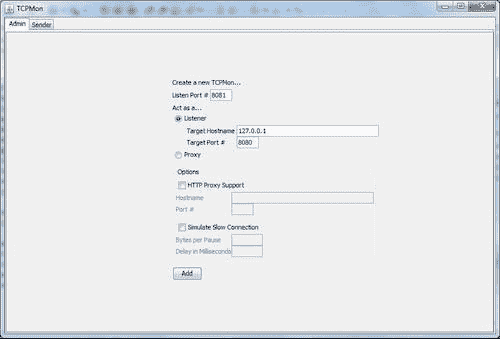
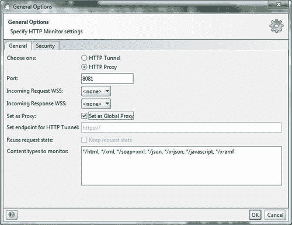
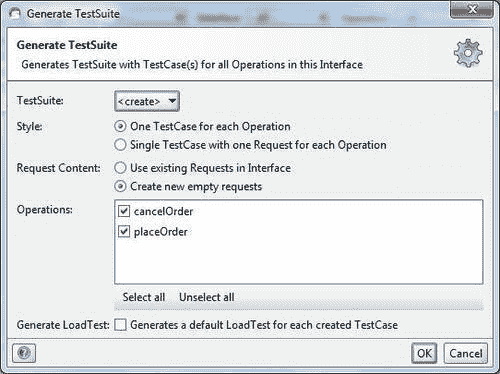
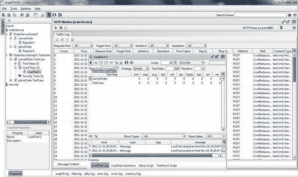
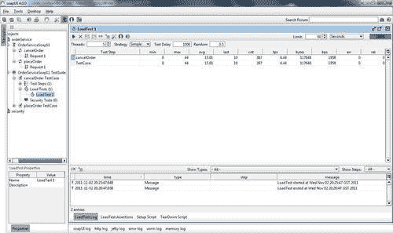

# 第 3 章测试和监控 Web 服务

在本章中，我们将介绍：

*   使用 SpringJUnit 支持的集成测试
*   使用 `MockWebServiceClient`进行服务器端集成测试
*   使用 `MockWebServiceServer`进行客户端集成测试
*   使用 TCPMon 监视 Web 服务的 TCP 消息
*   使用 soapUI 监视和加载/功能测试 Web 服务

# 导言

新的软件开发策略需要全面的测试，以实现软件开发过程中的质量。测试驱动设计（TDD）是开发过程的一种进化方法，它结合了测试优先开发过程和重新分解。在测试优先的开发过程中，您需要在编写完整的生产代码之前编写一个测试，以简化测试。该测试包括单元测试和集成测试。

Spring 使用 Spring 测试包为集成测试特性提供支持。这些特性包括依赖注入和在测试环境中加载应用程序上下文。

编写一个使用模拟框架（例如 EasyMock 和 JMock 来测试 Web 服务）的单元测试非常简单。但是，它没有测试 XML 消息的内容，因此它没有模拟测试的实际生产环境。

SpringWebServices2.0 提供了创建服务器端集成测试和客户端集成测试的功能。使用这些集成测试特性，测试 SOAP 服务非常简单，在测试服务器端时无需将其部署在服务器上，在测试客户端时无需设置服务器。

在第一个配方中，我们将讨论如何使用 Spring 框架进行集成测试。在接下来的两个配方中，详细介绍了 SpringWS2.0 集成测试的新特性。在最后两个配方中，介绍了使用工具（如 soapUI 和 TCPMon）来监视和测试 Web 服务。

# 使用 Spring JUnit 支持的集成测试

Spring 支持使用 `org.springframework.test`包中的类进行集成测试。这些特性使用产品的应用程序上下文或任何定制的上下文在测试用例中提供依赖项注入。这个方法介绍了如何使用 JUnit 测试用例，包括特性 `spring-test.jar`、JUnit4.7 和 XMLUnit1.1。

### 注

请注意，要运行集成测试，我们需要启动服务器。然而，在接下来的两个方案中，我们将使用新特性来集成测试 SpringWS2.0，这些特性不需要启动服务器。

## 准备好了吗

在此配方中，项目名称为 `LiveRestaurant_R-3.1`（用于服务器端 Web 服务），并具有以下 Maven 依赖项：

*   `spring-ws-core-2.0.1.RELEASE.jar`
*   `log4j-1.2.9.jar`

以下是 `LiveRestaurant_R-3.1-Client`的 Maven 依赖项（对于客户端 Web 服务）：

*   `spring-ws-core-2.0.1.RELEASE.jar`
*   `spring-test-3.0.5.RELEASE.jar`
*   `log4j-1.2.9.jar`
*   `junit-4.7.jar`
*   `xmlunit-1.1.jar`

## 怎么做。。。

此配方使用配方*中使用的项目，通过注释[第 1 章](01.html "Chapter 1. Building SOAP Web-Services")*构建 SOAP Web 服务*中讨论的有效负载根*来设置端点，作为服务器端项目。以下是客户端的设置：

1.  使用 `src/test`中的 `WebServiceTemplate`创建一个调用 Web 服务服务器的测试类。
2.  在 `applicationContext.xml`中配置 `WebServiceTemplate`。
3.  从文件夹 `Liverestaurant_R-3.1`中，运行以下命令：

    ```java
    mvn clean package tomcat:run 

    ```

4.  打开新的命令窗口到 `Liverestaurant_R-3.1-Client`并运行以下命令：

```java
mvn clean package. 

```

*   以下是客户端输出：

```java
.................
-------------------------------------------------------
T E S T S
-------------------------------------------------------
Running com.packtpub.liverestaurant.client.OrderServiceClientTest
............................
Tests run: 2, Failures: 0, Errors: 0, Skipped: 0, Time elapsed: 1.633 sec
Results :
Tests run: 2, Failures: 0, Errors: 0, Skipped: 0 

```

## 它是如何工作的。。。

服务器端项目设置 Web 服务服务器，客户端项目运行集成测试，向服务器发送预定义的请求消息，并从服务器获取响应消息。然后将服务器响应与预期响应进行比较。在前两章中已经详细介绍了如何设置 Web 服务和 Web 服务的客户机。这里只详细介绍了测试框架。

在 `OrderServiceClientTest.java`中，首先调用方法 `setUpBefore()`初始化数据（因为它是由 `@before)`注释的，接下来是由 `@Test``(testCancelOrderRequest`或 `testPalceOrderRequest)`注释的测试方法，最后调用方法 `setUpAfter()`释放资源（因为它是由 `@after)`注释的）

当您运行 `mvn clean package`时，Maven 会构建并运行 `src/test/java`文件夹中的任何测试类。因此在 `OrderServiceClientTest.java`中，首先加载测试应用程序上下文。在应用上下文中，只需要配置 `WebServiceTemplate`：

```java
<bean id="messageFactory" class="org.springframework.ws.soap.saaj.SaajSoapMessageFactory" />
<bean id="webServiceTemplate" class="org.springframework.ws.client.core.WebServiceTemplate">
<constructor-arg ref="messageFactory" />
<property name="defaultUri" value="http://localhost:8080/LiveRestaurant/spring-ws/OrderService" />
</bean>

```

在 `OrderServiceClientTest.java`中，为了包含 Spring 依赖项注入，以及为了设置和运行测试，代码被注释了一些信息。JUnit `@RunWith`注释告诉 JUnit 使用 Spring `TestRunner`。Spring 的 `@ContextConfiguration`注释告诉加载哪个应用程序上下文，并使用该上下文注入 `applicationContext`和 `webServiceTemplate`，这两个上下文都用 `@Autowired:`注释

```java
@RunWith(SpringJUnit4ClassRunner.class)
@ContextConfiguration("/applicationContext.xml")
public class OrderServiceClientTest {
@Autowired
private WebServiceTemplate webServiceTemplate;
........

```

JUnit 中的`@Before`告知在运行测试用例之前运行标记的方法（`setUpBefore`。JUnit `@After`导致在执行测试用例后调用标记的方法。JUnit 的 `@Test`将标记的方法（`testCancelOrderRequest`和 `testPlaceOrderRequest)`转换为 JUnit 测试方法：

```java
@After
public void setUpAfter() {
applicationContext.close();
}
@Test
public final void testPlaceOrderRequest() throws Exception {
Result result = invokeWS(placeOrderRequest);
XMLAssert.assertXMLEqual("Invalid content received", getStringFromInputStream(placeOrderResponse), result.toString());
}
@Test
public final void testCancelOrderRequest() throws Exception {
Result result = invokeWS(cancelOrderRequest);
XMLAssert.assertXMLEqual("Invalid content received", getStringFromInputStream(cancelOrderResponse), result.toString());
}
private Result invokeWS(InputStream is) {
StreamSource source = new StreamSource(is);
StringResult result = new StringResult();
webServiceTemplate.sendSourceAndReceiveToResult(source, result);
return result;
}
public String getStringFromInputStream (InputStream is)
throws IOException {
BufferedInputStream bis = new BufferedInputStream(is);
ByteArrayOutputStream buf = new ByteArrayOutputStream();
int result = bis.read();
while(result != -1) {
byte b = (byte)result;
buf.write(b);
result = bis.read();
}
return buf.toString();
}

```

注意，对于每种试验方法， `@After`和 `@Before`方法将执行一次。 `XMLAssert.assertXMLEqual`将实际结果与预期的 XML 消息进行比较。

### 提示

在实际情况中，数据每天都会动态变化。我们应该能够根据日期和数据库动态构建数据。这有助于在一段时间内进行持续集成和烟雾测试。

## 另见

配方*通过注释有效负载根*来设置端点，在[第 1 章](01.html "Chapter 1. Building SOAP Web-Services")*构建 SOAP Web 服务中讨论。*

*在 HTTP 传输*上创建 Web 服务客户端的方法，在[第 2 章](02.html "Chapter 2. Building Clients for SOAP Web-Services")*为 SOAP Web 服务构建客户端中讨论。*

# 使用 MockWebServiceClient 进行服务器端集成测试

编写使用模拟框架（如 EasyMock 和 JMock）测试 Web 服务的单元测试非常容易。但是，它不测试 XML 消息的内容，因此它不是模拟真实的测试生产环境（因为这些模拟对象模拟软件的一部分，该部分没有运行，这既不是单元测试也不是集成测试）。

SpringWebServices2.0 提供了创建服务器端集成测试的功能。使用此功能，测试 SOAP 服务非常简单，无需在服务器上部署，也无需在 Spring 配置文件中配置测试客户机。

服务器端集成测试的主要类是来自 `org.springframework.ws.test.server`包的 `MockWebServiceClient`。此类创建请求消息，将请求发送到服务，并获取响应消息。客户端将响应与预期消息进行比较。

## 准备好了吗

在此配方中，项目名称为 `LiveRestaurant_R-3.2`（作为服务器端 Web 服务，包括使用 `MockWebServiceClient)`并具有以下 Maven 依赖项的测试用例）：

*   `spring-ws-core-2.0.1.RELEASE.jar`
*   `spring-ws-test-2.0.1.RELEASE.jar`
*   `spring-test-3.0.5.RELEASE.jar`
*   `log4j-1.2.9.jar`
*   `junit-4.7.jar`

## 怎么做。。。

此配方使用*中通过注释有效负载根*来设置端点的项目[第 1 章](01.html "Chapter 1. Building SOAP Web-Services")、*构建 SOAP Web 服务*中讨论的项目作为服务器端项目。以下是测试用例的设置：

1.  在 `pom.xml:`

    ```java
    <testResources>
    <testResource>
    <directory>src/main/webapp</directory>
    </testResource>
    </testResources>
    </build>

    ```

    中包含以下数据
2.  在文件夹`src/test/java.` 中添加测试用例类
3.  对 `Liverestaurant_R-3.2:`运行以下命令

```java
mvn clean package 

```

*   以下是服务器端输出：

```java
..................
-------------------------------------------------------
T E S T S
-------------------------------------------------------
Running com.packtpub.liverestaurant.service.test.OrderServiceServerSideIntegrationTest
l.........
Tests run: 2, Failures: 0, Errors: 0, Skipped: 0, Time elapsed: 1.047 sec
Results :
Tests run: 2, Failures: 0, Errors: 0, Skipped: 0 

```

## 它是如何工作的。。。

在 `OrderServiceServerSideIntegrationTest.java`类中，注释和单元测试材料与使用 Spring JUnit 支持的配方*集成测试中使用的材料相同。这里唯一的区别是我们没有设置服务器。相反，我们在测试用例类中加载服务器应用程序上下文：*

```java
@RunWith(SpringJUnit4ClassRunner.class)
@ContextConfiguration("/WEB-INF/spring-ws-servlet.xml")
public class OrderServiceServerSideIntegrationTest {
.......................

```

`@Before`方法中的测试用例类初始化客户端模拟对象的实例和 XML 消息：

```java
@Before
public void createClient() {
wsMockClient = MockWebServiceClient.createClient(applicationContext);
placeOrderRequest = new OrderServiceServerSideIntegrationTest().getClass().getResourceAsStream("placeOrderRequest.xml");
cancelOrderRequest = new OrderServiceServerSideIntegrationTest().getClass().getResourceAsStream("cancelOrderRequest.xml");
placeOrderResponse = new OrderServiceServerSideIntegrationTest().getClass().getResourceAsStream("placeOrderResponse.xml");
cancelOrderRsponse = new OrderServiceServerSideIntegrationTest().getClass().getResourceAsStream("cancelOrderResponse.xml");
}

```

然后，它发送一条消息并接收响应。然后比较预期响应和实际响应：

```java
@After
public void setUpAfterClass() {
applicationContext.close();
}
@Test
public final void testPlaceOrderRequest() throws Exception {
Source requestPayload = new StreamSource(placeOrderRequest);
Source responsePayload = new StreamSource(placeOrderResponse);
wsMockClient.sendRequest(withPayload(requestPayload)).
andExpect(payload(responsePayload));
}
@Test
public final void testCancelOrderRequest() throws Exception {
Source requestPayload = new StreamSource(cancelOrderRequest);
Source responsePayload = new StreamSource(cancelOrderRsponse);
wsMockClient.sendRequest(withPayload(requestPayload)).
andExpect(payload(responsePayload));
}

```

在方法 `createClient(), MockWebServiceClient.createClient(applicationContext)`中，创建客户端模拟对象的实例（`wsMockClient`。在测试用例方法`(testCancelOrderRequest, testPlaceOrderRequest)`中，模拟客户端使用代码 `wsMockClient.sendRequest(withPayload(requestPayload)).andExpect(payload(responsePayload))`发送一条 XML 消息，并将响应（来自服务器端点）与预期响应进行比较（客户端模拟从应用程序上下文文件中知道服务器端点，当它向服务器发送请求时，调用端点方法并获取响应）。

## 另见

本章讨论了使用 Spring JUnit 支持的*集成测试方法*和使用 MockWebServiceServer 的*客户端集成测试方法。*

配方*通过注释有效负载根*来设置端点，在[第 1 章](01.html "Chapter 1. Building SOAP Web-Services")*构建 SOAP Web 服务中讨论。*

# 使用 MockWebServiceServer 进行客户端集成测试

编写使用模拟框架测试 Web 服务客户端的客户端单元测试非常容易。但是，它不会测试通过网络发送的 XML 消息的内容，特别是在模拟整个客户机类时。

SpringWebServices2.0 提供了创建客户端集成测试的功能。使用此功能，在不设置服务器的情况下测试 SOAP 服务的客户端非常简单。

客户端集成测试的主要类是来自 `org.springframework.ws.test.server`包的 `MockWebServiceServer`。此类接受来自客户端的请求消息，根据预期的请求消息对其进行验证，然后将响应消息返回给客户端。

由于该项目是使用 `MockWebServiceServer`的客户端测试集成，因此不需要任何外部服务器端 Web 服务。

## 准备好了吗

在此配方中，项目名称为 `LiveRestaurant_R-3.3-Client`（作为客户端项目，包括使用 `MockServiceServer`作为服务器的测试用例），并且具有以下 Maven 依赖项：

*   `spring-ws-core-2.0.1.RELEASE.jar`
*   `spring-ws-test-2.0.1.RELEASE.jar`
*   `spring-test-3.0.5.RELEASE.jar`
*   `log4j-1.2.9.jar`
*   `junit-4.7.jar`

## 怎么做。。。

此配方使用了*在 HTTP 传输*上创建 Web 服务客户端的客户端项目，在[第 2 章](02.html "Chapter 2. Building Clients for SOAP Web-Services")*为 SOAP Web 服务构建客户端*中进行了讨论。以下是测试用例的设置：

1.  在 `src/test`下创建一个测试用例类。
2.  创建扩展 `WebServiceGatewaySupport`以发送/接收消息的类。
3.  对 `Liverestaurant_R-3.3-Client:`运行以下命令

```java
mvn clean package 

```

*   以下是客户端输出：

```java
**************************
-------------------------------------------------------
T E S T S
-------------------------------------------------------
Running com.packtpub.liverestaurant.client.test.ClientSideIntegrationTest
........
Tests run: 3, Failures: 0, Errors: 0, Skipped: 0, Time elapsed: 0.945 sec
Results :
Tests run: 3, Failures: 0, Errors: 0, Skipped: 0 

```

## 它是如何工作的。。。

测试用例类 `ClientSideIntegrationTest.java`中的流程如下：

1.  使用扩展了 `WebServiceGatewaySupport)`的 `WebServiceGatewaySupport``(OrderServiceClient`创建一个 `MockWebServiceServer`。您也可以使用 `WebServiceTemplate`或 `ApplicationContext`创建 `MockWebServiceServer`。
2.  使用 `RequestMatcher`设置请求期望，并使用 `ResponseCreator`返回响应。
3.  使用 `WebServiceTemplate`进行客户端呼叫。
4.  调用 `verify`方法以确保满足所有期望。应用上下文文件只是 `WebServiceTemplate`和 `OrderServiceClient:`

    ```java
    <bean id="client" class=" com.packtpub.liverestaurant.client.test.OrderServiceClient">
    <property name="webServiceTemplate" ref="webServiceTemplate"/>
    </bean>
    <bean id="webServiceTemplate" class="org.springframework.ws.client.core.WebServiceTemplate">
    <property name="defaultUri" value="http://www.packtpub.com/liverestaurant/OrderService/schema"/>
    </bean>
    </beans>

    ```

    的配置

在 `ClientSideIntegrationTest.java`内部，注释和单元测试材料与使用 Spring JUnit 支持的配方*集成测试中使用的材料相同。方法 `createServer()`使用 `WebServiceGatewaySupport``(OrderServiceClient`创建 `MockWebServiceServer`扩展 `WebServiceGatewaySupport):`*

```java
public class OrderServiceClient extends WebServiceGatewaySupport {
public Result getStringResult(Source source) {
StringResult result = new StringResult();
getWebServiceTemplate().sendSourceAndReceiveToResult(source, result);
return result;
}
}

```

在测试中，方法 `testExpectedRequestResponse, mockServer.expect`设置了预期的请求，响应`(webServiceTemplate`在 `client-integration-test.xml`中配置为“测试模式”。当调用 `sendSourceAndReceiveToResult`方法时，模板实际上会调用服务器（没有任何真正的 HTTP 连接）。然后 `client.getStringResult`调用 `webserviceTemplate`调用服务器`(MockWebServiceServer)`。然后， `mockServer.verify`检查返回的响应是否与预期响应匹配：

```java
@Test
public void testExpectedRequestResponse() throws Exception {
Source requestPayload = new StringSource(getStringFromInputStream(placeOrderRequest));
Source responsePayload = new StringSource(getStringFromInputStream(placeOrderResponse));
mockServer.expect(payload(requestPayload)).andRespond(withPayload(responsePayload));
Result result = client.getStringResult(requestPayload);
XMLAssert.assertXMLEqual("Invalid content received", xmlToString(responsePayload), result.toString());
mockServer.verify();
}

```

在测试方法 `testSchema`中，不使用硬编码请求/响应，而是使用预期请求和响应的模式。此测试可以测试请求/响应的格式是否符合预期。如下所示：

```java
. @Test
public void testSchema() throws Exception {
Resource schema=new FileSystemResource("orderService.xsd");
mockServer.expect(validPayload(schema));
client.getStringResult(new StreamSource(placeOrderRequest));
mockServer.verify();
}

```

在测试方法 `testSchemaWithWrongRequest`中，使用了预期请求和响应的模式。但是，客户端尝试发送无效请求，即失败：

```java
@Test(expected = AssertionError.class)
public void testSchemaWithWrongRequest() throws Exception {
Resource schema=new FileSystemResource("orderService.xsd");
mockServer.expect(validPayload(schema));
client.getStringResult(new StringSource(getStringFromInputStream(cancelOrderRequestWrong)));
mockServer.verify();
}

```

## 另见

使用 Spring JUnit 支持的配方*集成测试，将在本章中讨论。*

# 使用 TCPMon 监控 Web 服务的 TCP 消息

**TCPMon**是一个带有 Swing UI 的 Apache 项目，它提供了监视客户端和服务器之间传输的基于 TCP 的消息的功能。还可以使用 TCPMon 将 SOAP 消息发送到服务器。

此方法介绍如何监视 Web 服务客户端和服务器之间传递的消息。此外，它还展示了如何使用 TCPMon 发送 SOAP 消息。使用 Spring JUnit 支持的配方*集成测试*用于服务器端和客户端项目。

## 准备好了吗

从网站[下载并安装 TCPMon 1.0http://ws.apache.org/commons/tcpmon/download.cgi](http://ws.apache.org/commons/tcpmon/download.cgi) 。

## 怎么做。。。

监控客户端和服务器之间的消息，如下所示：

1.  在 Windows 上使用 `tcpmon.bat (tcpmon.sh`运行（适用于 Linux）。
2.  Enter the values **8081** and **8080** into the **Listen port #** and **Target port #** fields and click on the **Add** option.

    

3.  将 `LiveRestaurant_R-3.1-Client`中的 `applicationContext.xml`更改为 `webserviceTemplate:`

    ```java
    <bean id="messageFactory" class="org.springframework.ws.soap.saaj.SaajSoapMessageFactory" />
    <bean id="webServiceTemplate" class="org.springframework.ws.client.core.WebServiceTemplate">
    <constructor-arg ref="messageFactory" />
    <property name="defaultUri" value="http://localhost:8081/LiveRestaurant/spring-ws/OrderService" />
    </bean>

    ```

    使用**8081**端口
4.  使用以下命令从项目 `LiveRestaurant_R-3.1`运行服务器：

    ```java
    mvn clean package tomcat:run 

    ```

5.  使用以下命令从项目 `LiveRestaurant_R-3.1-Client`运行客户端：

    ```java
    mvn clean package 

    ```

6.  进入**端口 8081**选项卡，查看请求和响应消息，如下图所示：


按如下方式向服务器发送 SOAP 请求：

转到**发送者**选项卡。输入 SOAP 服务地址和 SOAP 请求消息，然后单击**发送**按钮查看响应：


## 它是如何工作的。。。

监控客户端和 Web 服务服务器之间传输的消息是 TCPMon 最重要的用途。此外，TCPMon 还可以用作客户端，向 Web 服务服务器发送消息。这是一个中介角色，显示客户端和服务器之间传输的消息。客户端必须指向中间层而不是服务器服务。


第二个活动（向服务器发送 SOAP 请求）显示使用 TCPMon 向服务器发送消息、接收响应，并在 TCPMon 上显示所有这些。

## 另见

本章讨论了使用 Spring JUnit 支持进行集成测试的方法*。*

# 使用 soapUI 对 Web 服务进行监视和负载/功能测试

soapUI 是用于测试 web 服务的开源测试解决方案。使用用户友好的 GUI，该工具提供了创建和执行自动化功能和负载测试以及监视 SOAP 消息的功能。

该方法介绍了如何使用 soapUI 监视 Web 服务的 SOAP 消息以及功能和负载测试。为了建立一个 Web 服务，使用了使用 Spring JUnit 支持的 `Recipe 3.1`*集成测试*。

## 准备好了吗

首先执行以下步骤：

1.  安装并运行 soapUI 4.0（[http://www.soapui.org/](http://www.soapui.org/) ）。
2.  从文件夹 `LiveRestaurant_R-3.1:`运行以下命令

```java
mvn clean package tomcat:run 

```

## 怎么做。。。

要运行功能测试并监视 SOAP 消息，请执行以下步骤：

1.  Right-click on the **Projects** node. Select **New soapUI Project** and enter the WSDL URL and the **Project Name**.

    

2.  Right-click on the project's name, **OrderService**, in the navigator pane. Select **Launch HTTP Monitor** and enable the option **Set as Global Proxy**. Click on the **OK** button:

    

3.  Expand the **OrderService** methods **(cancelOrder** and **placeOrder)**. Double-click **cancelOrder**. Click on **Submit Request to Specific Endpoint URL** (The green icon on the top-left corner of the **Request1** screen). The following is the output of this action:

    

4.  Right-click **OrderServiceSoap11** | **Generate Test Suite** | **OK**. Enter **OrderServiceSoap11 TestSuite**.

    

5.  Double-click on **OrderServiceSoap11 TestSuite** on the navigator pane. Click Run the selected **TestCases**.

    

6.  以下是测试套件运行时的输出：


按如下方式运行负载测试：

1.  Right-click the **cancelOrder** test case. Select **New Local Test** and enter the **Load Test Name**.

    

2.  Double-click **Load test name**. Enter **Parameter** and click on **Run Load Test**.

    

3.  以下是测试的输出：



## 它是如何工作的。。。

功能测试和监视 SOAP 消息：soapUI 提供三个级别的功能测试：测试套件、测试用例和测试步骤。

测试用例是从 WSDL 文件生成的单元测试，测试套件是这些单元测试的集合。测试步骤控制执行流并验证要测试的服务的功能。例如，前面提到的**cancelOrder**的测试套件中的测试用例可以首先测试数据库。如果有这样的订单，它将取消订单。

负载测试：soapUI 提供了一个功能，可以在测试用例上运行多个线程（尽可能多的线程）。运行负载测试时，将在内部为每个线程克隆底层测试用例。延迟设置允许每个线程在启动之前等待，并允许每个线程的 Web 服务休息。

## 另见

使用 Spring JUnit 支持的配方*集成测试，将在本章中讨论。*