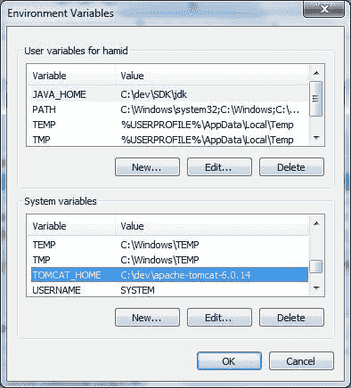
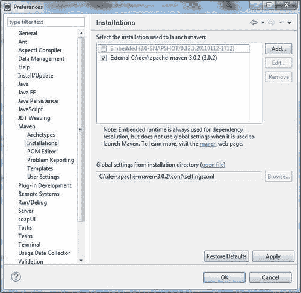
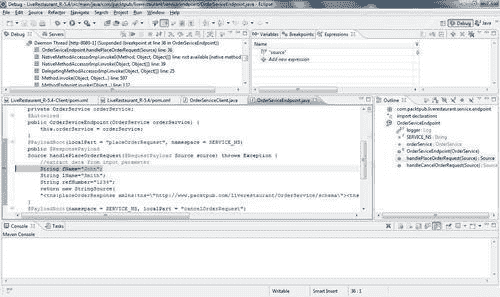

# 五、SOAP 消息的记录和跟踪

在本章中，我们将介绍：

*   手动记录消息有效负载
*   使用 log4j 记录请求和响应 SOAP 信封
*   使用 SpringWS 的拦截器记录请求和响应
*   使用 EclipseIDE 调试 SpringWS

# 导言

记录和跟踪是指捕获和记录软件程序执行的事件和数据结构，以提供审计跟踪。它帮助开发人员和支持团队收集软件程序执行的运行时信息。对于任何严肃的软件开发团队来说，在他们的系统中实现日志记录是非常重要的。

对于 Web 服务开发，能够看到在客户端和服务器之间传输的 SOAP 消息是非常有用的。SpringWeb 服务提供 SOAP 消息到达时或发送前的日志记录和跟踪。SpringWS 中的日志记录由标准 Commons 日志记录接口管理。

通常，在 Spring 项目中，log4j 被用作具体的日志库（因为 Spring 日志功能是基于 log4j 构建的）。本章说明了记录 SOAP 消息的几种简单方法。

这里说明的配方可以应用于本书中任何配方的项目来源。出于演示目的，使用配方*的现有项目源，通过注释有效负载根*来设置端点，因为这可以应用于本书中使用的任何项目。

# 手动记录消息有效负载

消息负载是 SOAP 消息元素 `SOAP-ENV:Body`的内容。这是整个 SOAP 信封中请求和响应的确切消息部分。

此配方演示如何从代码内部手动记录消息负载。

## 准备好了吗

在此配方中，项目名称为 `LiveRestaurant_R-5.1`（用于服务器端 Web 服务），并具有以下 Maven 依赖项：

*   `spring-ws-core-2.0.1.RELEASE.jar`
*   `log4j-1.2.9.jar`

和 `LiveRestaurant_R-5.1-Client`（对于客户端），具有以下 Maven 依赖项：

*   `spring-ws-core-2.0.1.RELEASE.jar`
*   `log4j-1.2.9.jar`

## 怎么做。。。

此配方使用配方*中使用的项目，通过在[第 1 章](01.html "Chapter 1. Building SOAP Web-Services")*构建 SOAP Web 服务中注释有效负载根*来设置端点。*

1.  修改 `log4j.properties`将日志级别默认为 `INFO`。删除 `log4j.properties`中任何包或 API 的任何类型的调试设置。
2.  修改 `OrderServiceEndpoint`创建两个 `xmlToString`方法，调用这两个方法将传入消息转换成字符串并记录。
3.  在 Maven 嵌入式 Tomcat 服务器中构建和部署项目。在命令行窗口中从项目的根目录运行 `mvn clean package tomcat:run`。
4.  要测试这一点，请打开一个新的命令行窗口，转到文件夹 `LiveRestaurant_R-5.1-Client`并运行： `mvn clean package exec:java`。
5.  以下是服务器端控制台的输出：

```java
INFO [http-8080-1] (OrderSeviceEndpoint.java:49) -
Message Payload method handlePlaceOrderRequest start ====
<?xml version="1.0" encoding="UTF-8"?>
<tns:placeOrderRequest xmlns:tns="....">
<tns:order>
<tns:refNumber>9999</tns:refNumber>
..........
</tns:customer>
<tns:dateSubmitted>2008-09-29T05:49:45</tns:dateSubmitted>
<tns:orderDate>2014-09-19T03:18:33</tns:orderDate>
<tns:items>
<tns:type>Snacks</tns:type>
<tns:name>Pitza</tns:name>
<tns:quantity>2</tns:quantity>
</tns:items>
</tns:order>
</tns:placeOrderRequest>
==== Message Payload End
........................
INFO [http-8080-1] (OrderSeviceEndpoint.java:67) -
Message Payload method handleCancelOrderRequest start ====
<?xml version="1.0" encoding="UTF-8"?>
<tns:cancelOrderRequest xmlns:tns="...">
<tns:refNumber>9999</tns:refNumber>
</tns:cancelOrderRequest>
==== Message Payload End 

```

## 它是如何工作的。。。

代码只是手动记录消息负载，而不改变应用程序中的任何配置。 `log4j.properties`中的更改确保日志消息打印到控制台（因为追加器是 `ConsoleAppender)`并且没有打印调试消息：

```java
log4j.rootLogger=INFO, stdout
log4j.appender.stdout=org.apache.log4j.ConsoleAppender
log4j.appender.stdout.layout=org.apache.log4j.PatternLayout
# Pattern to output the caller's file name and line number.
log4j.appender.stdout.layout.ConversionPattern=%5p [%t] (%F:%L) - %m%n

```

方法 `xmlToString(...)`使用 `StringWriter:`将 XML 源/元素对象转换为 `String`

```java
private String xmlToString(Node node) {
try {
Source source = new DOMSource(node);
StringWriter stringWriter = new StringWriter();
Result result = new StreamResult(stringWriter);
TransformerFactory factory = TransformerFactory.newInstance();
Transformer transformer = factory.newTransformer();
transformer.transform(source, result);
return stringWriter.getBuffer().toString();
} catch (TransformerConfigurationException e) {
e.printStackTrace();
} catch (TransformerException e) {
e.printStackTrace();
}
return null;
}
private static String xmlToString(Source source) {
try {
StringWriter stringWriter = new StringWriter();
Result result = new StreamResult(stringWriter);
TransformerFactory factory = TransformerFactory.newInstance();
Transformer transformer = factory.newTransformer();
transformer.transform(source, result);
return stringWriter.getBuffer().toString();
} catch (TransformerConfigurationException e) {
e.printStackTrace();
} catch (TransformerException e) {
e.printStackTrace();
}
return null;
}

```

在 `handleCancelOrderRequest()`和 `handlePlaceOrderRequest()`方法中，通过 `RequestPayload`的源/元素调用 `xmlToString()`，以字符串实例的形式返回消息负载，然后将消息负载记录到配置的日志追加器中（本例中为控制台）：

```java
@PayloadRoot(localPart = "placeOrderRequest", namespace = SERVICE_NS)
public @ResponsePayload
Source handlePlaceOrderRequest(@RequestPayload Source source) throws Exception {
String placeOrderRequestMessage = xmlToString(source);
logger.info("\n\n Message Payload method handlePlaceOrderRequest start ==== \n\n\n " + placeOrderRequestMessage + "\n\n\n ==== Message Payload End\n\n");
//extract data from input parameter
String fName="John";
String lName="Smith";
String refNumber="1234";
return new StringSource(
"<tns:placeOrderResponse xmlns:tns=\"http://www.packtpub.com/liverestaurant/OrderService/schema\"><tns:refNumber>"+orderService.placeOrder(fName, lName, refNumber)+"</tns:refNumber></tns:placeOrderResponse>");
}
@PayloadRoot(namespace = SERVICE_NS, localPart = "cancelOrderRequest")
@ResponsePayload
public Source handleCancelOrderRequest(@RequestPayload Element cancelOrderRequest) throws Exception {
String refNumber=cancelOrderRequest.getElementsByTagNameNS(SERVICE_NS, "refNumber") .item(0).getTextContent();
String cancelOrderRequestMessage = xmlToString(cancelOrderRequest);
logger.info("\n\nMessage Payload method handleCancelOrderRequest start ==== \n\n\n " + cancelOrderRequestMessage + "\n\n\n ==== Message Payload End\n\n");
return new StringSource(
"<tns:cancelOrderResponse xmlns:tns=\"http://www.packtpub.com/liverestaurant/OrderService/schema\"><tns:cancelled>"+orderService.cancelOrder(refNumber)+"</tns:cancelled></tns:cancelOrderResponse>");
}

```

### 提示

作为良好的实践，我们在调试模式下记录消息。为了获得更好的性能，我们采取以下措施：

```java
If(logger.isDebugEnabled())
logger.debug(message);

```

在运行时，我们可以根据需求启用和禁用日志。

## 还有更多。。。

此配方中给出的示例使用了 `SimpleMethodEndpointMapping`，它在 `RequestPayload`注释的帮助下接收 XML 源`(javax.xml.transform.Source)`或元素`(org.w3c.dom.Element)`对象形式的消息负载作为方法参数，而在其他情况下，传入消息将采用不同的形式。例如，编组端点输入已经是编组对象。在这些情况下，您需要采用适当的机制来转换传入的参数。之后的食谱将为您提供有关其他日志记录和跟踪方法的见解。

## 另见

*   *通过在[第 1 章](01.html "Chapter 1. Building SOAP Web-Services")*构建 SOAP Web 服务中注释有效负载根*来设置端点。*

# 使用 log4j 记录请求和响应 SOAP 信封

SpringWS 框架允许开发人员使用简单的记录器配置记录整个 SOAP 消息。此配方说明了如何使用 log4j logger 框架通过框架配置 SOAP 消息的内部日志记录。

## 准备好了吗

在此配方中，项目名称为 `LiveRestaurant_R-5.2`（用于服务器端 Web 服务），并具有以下 Maven 依赖项：

*   `spring-ws-core-2.0.1.RELEASE.jar`
*   `log4j-1.2.9.jar`

它还有 `LiveRestaurant_R-5.2-Client`（用于客户端），具有以下 Maven 依赖项：

*   `spring-ws-core-2.0.1.RELEASE.jar`
*   `log4j-1.2.9.jar`

## 怎么做。。。

此配方使用配方*中使用的项目，通过注释有效负载根来设置端点：*

1.  修改 `log4j.properties`设置消息跟踪。
2.  在 Maven 嵌入式 Tomcat 服务器中构建和部署项目。在命令行窗口中从项目的根目录运行 `mvn clean package tomcat:run`。
3.  要测试这一点，请打开一个新的命令行窗口，转到文件夹 `LiveRestaurant_R-5.1-Client`，然后运行 `mvn clean package exec:java`。

以下是服务器端控制台的输出（请注意消息中生成的 Web 服务响应的 `SOAP-Env:Envelope`元素）：

```java
DEBUG [http-8080-1] (MessageDispatcher.java:167) - Received request
....
<SOAP-ENV:Envelope xmlns:SOAP-ENV="..."><SOAP-ENV:Body>
....
<tns:placeOrderRequest xmlns:tns="......">
<tns:order>
<tns:refNumber>9999</tns:refNumber>
<tns:customer>
......
</tns:customer>
<tns:dateSubmitted>2008-09-29T05:49:45</tns:dateSubmitted>
<tns:orderDate>2014-09-19T03:18:33</tns:orderDate>
<tns:items>
<tns:type>Snacks</tns:type>
<tns:name>Pitza</tns:name>
<tns:quantity>2</tns:quantity>
</tns:items>
</tns:order>
</tns:placeOrderRequest>
</SOAP-ENV:Body></SOAP-ENV:Envelope>
....
DEBUG [http-8080-1] (MessageDispatcher.java:177) - Sent response
....
<SOAP-ENV:Envelope xmlns:SOAP-ENV="..."><SOAP-ENV:Body>
.....
<tns:placeOrderResponse xmlns:tns="...">
<tns:refNumber>order-John_Smith_1234</tns:refNumber></tns:placeOrderResponse>
</SOAP-ENV:Body></SOAP-ENV:Envelope>
...
DEBUG [http-8080-1] (MessageDispatcher.java:167) - Received request ...
<SOAP-ENV:Envelope xmlns:SOAP-ENV="..."><SOAP-ENV:Body>
....
<tns:cancelOrderRequest xmlns:tns="....">
<tns:refNumber>9999</tns:refNumber>
</tns:cancelOrderRequest>
</SOAP-ENV:Body></SOAP-ENV:Envelope>
...
DEBUG [http-8080-1] (MessageDispatcher.java:177) - Sent response
...
<SOAP-ENV:Envelope xmlns:SOAP-ENV="..."><SOAP-ENV:Body>
.....
<tns:cancelOrderResponse xmlns:tns="....">
<tns:cancelled>true</tns:cancelled></tns:cancelOrderResponse>
</SOAP-ENV:Body></SOAP-ENV:Envelope>
... 

```

## 它是如何工作的。。。

Spring WS-framework 的核心组件，即 `MessageDispatcher`，在从 `MessageContext`提取消息内容后，如果启用了跟踪或调试日志记录，则在 `receive()`方法中接收到每个传入的 SOAP 消息后，会立即对其进行日志记录。

在 `receive()`方法中，它检查命名日志实例的日志设置， `org.springframework.ws.server.MessageTracing.received`检查记录 SOAP 请求， `org.springframework.ws.server.MessageTracing.sent`检查 SOAP 响应。如果这些设置的值为 `TRACE`或 `DEBUG`，它将打印相应请求或响应的整个 SOAP 信封：

```java
log4j.rootLogger=INFO, stdout, R
log4j.appender.stdout=org.apache.log4j.ConsoleAppender
log4j.appender.stdout.layout=org.apache.log4j.PatternLayout
# Pattern to output the caller's file name and line number.
log4j.appender.stdout.layout.ConversionPattern=%5p [%t] (%F:%L) - %m%n
#RollingFileAppender
log4j.appender.R=org.apache.log4j.RollingFileAppender
log4j.appender.R.File=LiveRestaurant.log
log4j.appender.R.MaxFileSize=100KB
# Keep one backup file
log4j.appender.R.MaxBackupIndex=1
log4j.appender.R.layout=org.apache.log4j.PatternLayout
log4j.appender.R.layout.ConversionPattern=%p %t %c - %m%n
log4j.logger.org.springframework.ws.server.MessageTracing.received=TRACE
log4j.logger.org.springframework.ws.server.MessageTracing.sent=TRACE

```

如前所述，日志跟踪或调试的最简单设置是在 `log4j.properties`中。

### 提示

以前，出于安全目的，消息是加密的，因此启用日志记录并非始终有用。最好在 entry 方法中完成解密后记录消息。

## 另见

*   *通过在[第 1 章](01.html "Chapter 1. Building SOAP Web-Services")*构建 SOAP Web 服务中注释有效负载根*来设置端点。*

# 使用 Spring WS 的拦截器记录请求和响应

SpringWS 提供了记录传入/传出消息的功能。这些设施是通过使用**Commons Logging log**记录的 `PayloadLoggingInterceptor`和 `SoapEnvelopeLoggingInterceptor`类提供的。当 `PayloadLoggingInterceptor`只记录消息的有效负载时， `SoapEnvelopeLoggingInterceptor`记录整个 SOAP 信封，包括标题。要使用这两个拦截器激活日志功能， `log4j`属性文件中的 log 属性应设置为 debug for interceptors 包。

在此配方中，将解释使用 `PayloadLoggingInterceptor`和 `SoapEnvelopeLoggingInterceptor`记录 Web 服务消息。

## 准备好了吗

在此配方中，项目名称为 `LiveRestaurant_R-5.3`（用于服务器端 Web 服务），并具有以下 Maven 依赖项：

*   `spring-ws-core-2.0.1.RELEASE.jar`
*   `log4j-1.2.9.jar`

和 `LiveRestaurant_R-5.3-Client`（对于客户端）具有以下 Maven 依赖项：

*   `spring-ws-core-2.0.1.RELEASE.jar`
*   `log4j-1.2.9.jar`

## 怎么做。。。

此配方使用配方*中使用的项目，通过注释有效负载根来设置端点：*

1.  打开 `log4j.properties`并设置日志以调试包 `org.springframework.ws.server.endpoint.interceptor`。
2.  在服务器端应用程序上下文中注册 `PayloadLoggingInterceptor`。
3.  在 Maven 嵌入式 Tomcat 服务器中构建和部署项目。在命令行窗口中从项目的根目录运行 `mvn clean package tomcat:run`。
4.  要测试这一点，请打开一个新的命令行窗口，转到文件夹 `LiveRestaurant_R-5.3-Client`，然后运行 `mvn clean package exec:java`。

以下是服务器端控制台的输出：

```java
DEBUG [http-8080-1] (AbstractLoggingInterceptor.java:160) - Request:
<tns:placeOrderRequest xmlns:tns=".....">
<tns:order>
<tns:refNumber>9999</tns:refNumber>
<tns:customer>
......
</tns:customer>
<tns:dateSubmitted>2008-09-29T05:49:45</tns:dateSubmitted>
<tns:orderDate>2014-09-19T03:18:33</tns:orderDate>
<tns:items>
<tns:type>Snacks</tns:type>
<tns:name>Pitza</tns:name>
<tns:quantity>2</tns:quantity>
</tns:items>
</tns:order>
</tns:placeOrderRequest>
DEBUG [http-8080-1] (AbstractLoggingInterceptor.java:160) - Response:
<tns:placeOrderResponse xmlns:tns="...">
<tns:refNumber>order-John_Smith_1234</tns:refNumber></tns:placeOrderResponse>
DEBUG [http-8080-1] (AbstractLoggingInterceptor.java:160) - Request:
<tns:cancelOrderRequest xmlns:tns="...">
<tns:refNumber>9999</tns:refNumber>
</tns:cancelOrderRequest>
DEBUG [http-8080-1] (AbstractLoggingInterceptor.java:160) - Response:
<tns:cancelOrderResponse xmlns:tns="...">
<tns:cancelled>true</tns:cancelled>
</tns:cancelOrderResponse> 

```

要使用 `SoapEnvelopeLoggingInterceptor`记录 Web 服务消息，请执行以下步骤：

1.  在服务器端应用程序上下文中注册 `SoapEnvelopeLoggingInterceptor`。
2.  打开 `log4j.properties`并设置日志以调试包 `org.springframework.ws.soap.server.endpoint.interceptor`。
3.  在 Maven 嵌入式 Tomcat 服务器中构建和部署项目。在命令行窗口中从项目的根目录运行 `mvn clean package tomcat:run`。
4.  要测试这一点，请打开一个新的命令行窗口，转到文件夹 `LiveRestaurant_R-5.3-Client`，然后运行 `mvn clean package exec:java`。

以下是服务器端控制台的输出：

```java
DEBUG [http-8080-1] (AbstractLoggingInterceptor.java:160) - Request:
<SOAP-ENV:Envelope xmlns:SOAP-ENV=....">
<SOAP-ENV:Header/><SOAP-ENV:Body>
<tns:placeOrderRequest xmlns:tns="....">
<tns:order>
<tns:refNumber>9999</tns:refNumber>
<tns:customer>
.....
</tns:customer>
<tns:dateSubmitted>2008-09-29T05:49:45</tns:dateSubmitted>
<tns:orderDate>2014-09-19T03:18:33</tns:orderDate>
<tns:items>
<tns:type>Snacks</tns:type>
<tns:name>Pitza</tns:name>
<tns:quantity>2</tns:quantity>
</tns:items>
</tns:order>
</tns:placeOrderRequest>
</SOAP-ENV:Body></SOAP-ENV:Envelope>
DEBUG [http-8080-1] (AbstractLoggingInterceptor.java:160) - Response:
<SOAP-ENV:Envelope xmlns:SOAP-ENV=..."><SOAP-ENV:Header/><SOAP-ENV:Body>
<tns:placeOrderResponse xmlns:tns="...">
<tns:refNumber>order-John_Smith_1234</tns:refNumber>
</tns:placeOrderResponse>
</SOAP-ENV:Body></SOAP-ENV:Envelope>
DEBUG [http-8080-1] (AbstractLoggingInterceptor.java:160) - Request:
<SOAP-ENV:Envelope xmlns:SOAP-ENV="..."><SOAP-ENV:Header/><SOAP-ENV:Body>
<tns:cancelOrderRequest xmlns:tns="...">
<tns:refNumber>9999</tns:refNumber>
</tns:cancelOrderRequest>
</SOAP-ENV:Body></SOAP-ENV:Envelope>
DEBUG [http-8080-1] (AbstractLoggingInterceptor.java:160) - Response:
<SOAP-ENV:Envelope xmlns:SOAP-ENV="..."><SOAP-ENV:Header/><SOAP-ENV:Body>
<tns:cancelOrderResponse xmlns:tns="...a">
<tns:cancelled>true</tns:cancelled></tns:cancelOrderResponse>
</SOAP-ENV:Body></SOAP-ENV:Envelope>

```

## 它是如何工作的。。。

`MessageDispatcherServlet`在接收到消息时，以及在端点中调用 handler 方法之前，以及在将响应发送回客户端之前，调用拦截器（如果有）。

在 `spring-ws-servlet.xml`内注册 `PayloadLoggingInterceptor`只记录消息的有效负载：

```java
<sws:interceptors>
<bean class="org.springframework.ws.server.endpoint.interceptor.PayloadLoggingInterceptor"/>
</sws:interceptors>

```

类似地，在 `spring-ws-servlet.xml`中注册 `SoapEnvelopeLoggingInterceptor`会记录整个消息的 SOAP 信封：

```java
<sws:interceptors>
<bean class="org.springframework.ws.soap.server.endpoint.interceptor.SoapEnvelopeLoggingInterceptor"/>
</sws:interceptors>

```

在这两种情况下，这些拦截器的包名都应设置为 debug，以便进行日志记录：

```java
........
log4j.appender.R.layout=org.apache.log4j.PatternLayout
log4j.appender.R.layout.ConversionPattern=%p %t %c - %m%n
log4j.logger.org.springframework.ws.soap.server.endpoint.interceptor=debug
log4j.logger.org.springframework.ws.server.endpoint.interceptor=debug

```

## 还有更多。。。

将 `PayloadLoggingInterceptor`的 `logRequest`和 `logResponse`属性设置为 true/false，启用/禁用请求/响应消息的日志记录。

```java
<bean class="org.springframework.ws.server.endpoint.interceptor.PayloadLoggingInterceptor">
<property name="logRequest" value="false" />
<property name="logResponse" value="true" />
</bean>

```

除了 `logRequest`和 `logResponse`之外， `SoapEnvelopeLoggingInterceptor`还有一个 `logFault`属性，将它们设置为 true/false，可以启用/禁用请求/响应/故障消息的日志记录：

```java
....
<bean class="org.springframework.ws.soap.server.endpoint.interceptor.SoapEnvelopeLoggingInterceptor">
<property name="logRequest" value="false" />
<property name="logResponse" value="true" />
<property name="logFault" value="true" ></property>
</bean>

```

## 另见

*   *通过在[第 1 章](01.html "Chapter 1. Building SOAP Web-Services")*构建 SOAP Web 服务中注释有效负载根*来设置端点。*
*   *使用 Log4j*记录请求和响应 SOAP 信封

# 使用 Eclipse IDE 调试 Spring WS

在开发阶段调试应用程序的能力是 IDE 最重要的功能之一，因为它可以帮助开发人员轻松地发现错误，从而加快开发速度。对于更复杂的服务器端应用程序，调试能力对于缺陷发现更为重要。附加到 IDE（如 Eclipse）的远程调试器可以显著缩短问题分析时间，并使过程更加愉快。

Eclipse 可以配置为在具有嵌入式和远程服务器的 web/app 服务器中进行调试。这个方法解释了如何使用外部远程 Tomcat 实例从 Eclipse 内部将 SpringWS 项目作为 web 应用程序进行调试。

## 准备好了吗

要开始，请执行以下操作：

1.  安装 Apache-Tomcat-6.0.14。
2.  下载并安装适用于 JavaEE 开发人员 Helios 的 EclipseIDE。

在此配方中，项目名称为 `LiveRestaurant_R-5.4`（用于服务器端 Web 服务），并具有以下 Maven 依赖项：

*   `spring-ws-core-2.0.1.RELEASE.jar`
*   `log4j-1.2.9.jar`

它还有 `LiveRestaurant_R-5.4-Client`（用于客户端），具有以下 Maven 依赖项：

*   `spring-ws-core-2.0.1.RELEASE.jar`
*   `log4j-1.2.9.jar`

## 怎么做。。。

1.  Modify the profile in user home `(/home/weblogic)` for Linux, or in the system variable in Windows for Tomcat.

    在 Linux>edit.profile>上安装 Tomcat 之后，为 Tomcat 添加以下行：

    ```java
    export TOMCAT_HOME=/opt2/apache-tomcat-6.0.14
    export PATH=$TOMCAT_HOME:$PATH

    ```

2.  On Windows >edit system variable, set the system variable for Tomcat, as shown in the following screenshot:

    

3.  在 `$TOMCAT_HOME/conf/tomcat-users.xml`文件中，将角色设置为 `manager`、 `username`和 `password`，如下所示：

    ```java
    <?xml version='1.0' encoding='utf-8'?>
    <tomcat-users>
    <role rolename="manager"/>
    <user username="tomcat" password="tomcat" roles="manager"/>
    </tomcat-users>

    ```

4.  在 `MAVEN_HOME/conf/settings.xml`文件中，如果有 `.m2/settings.xml``(.m2`是 maven repository 文件夹），则添加名为 `tomcat`的用户登录配置，密码为 `tomcat`，如下所示：

    ```java
    <server>
    <id>myserver</id>
    <username>tomcat</username>
    <password>tomcat</password>
    </server>

    ```

5.  Modify `debug.sh/debug.bat TOMCAT_HOME/bin/` at the end of the file:

    在 Windows 上，修改 debug.bat：

    ```java
    set JPDA_TRANSPORT=dt_socket
    set JPDA_ADDRESS=8000
    call "%EXECUTABLE%" jpda start %CMD_LINE_ARGS%

    ```

6.  在 Linux 上，修改 debug.sh:

    ```java
    export JPDA_ADDRESS=8000
    export JPDA_TRANSPORT=dt_socket
    exec "$PRGDIR"/"$EXECUTABLE" jpda start "$@"

    ```

7.  使用 `TOMCAT_HOME/bin/`中的 `debug.sh/debug.bat`在 Linux/Windows 上运行 Tomcat。
8.  修改 `LiveRestaurant_R-5.4:`

    ```java
    <!-- <plugin>
    <groupId>org.codehaus.mojo</groupId>
    <artifactId>tomcat-maven-plugin</artifactId>
    <version>1.1</version>
    </plugin> -->
    <plugin>
    <groupId>org.codehaus.mojo</groupId>
    <artifactId>tomcat-maven-plugin</artifactId>
    <version>1.1</version>
    <configuration>
    <server>myserver</server>
    <path>/LiveRestaurant</path>
    </configuration>
    </plugin>

    ```

    的 `pom.xml`文件
9.  将项目 `LiveRestaurant_R-5.4`导入 Eclipse，在 `handleCancelOrderRequest`方法的 `com.packtpub.liverestaurant.service.endpoint.OrderEndpoint.java`类中设置断点。
10.  从 `LiveRestaurant_R-5.4`运行 `mvn clean package`，然后将 WAR 文件复制到 `tomcat/webapp`（应用程序将部署到 Tomcat 中）。
11.  In Eclipse, set Maven installation: **Windows** | **Preferences** | **Maven** | **Installations**, click on the **Add** button, and set external Maven:

    

12.  Open Eclipse. Right-click on **LiveRestaurant_R-5.4** | **Debug as** | **Debug Configurations** | **Remote Java Application**, click on **New**, and then click on the **Debug** button:

    

13.  From the project `LiveRestaurant_R-5.4-Client`, run `mvn clean package`

    以下是本次测试的输出：

    

14.  现在，您可以尝试调试应用程序的不同选项，例如：
    *   跨过（F5）
    *   进入（F5）
    *   跳出（F7）
    *   看
    *   检查

## 它是如何工作的。。。

这个方法使用了**Java 调试器（JDB）**工具，帮助查找和修复本地和服务器上 Java 语言程序中的错误。JDB 是**Java 平台调试架构**（JPDA）的一部分，它提供了为 Java 平台构建最终用户调试器应用程序所需的基础设施。

要在 JavaEE 应用服务器或 servlet 容器（如 Tomcat）中使用 JDB，必须首先在启用调试的情况下启动它，并通过 JPDA 端口（默认端口为 1044）将其从调试器连接到服务器。在步骤 4，JPDA 端口设置为 8000。此配方使用 `debug.bat/debug.sh`启动服务器，而不是 `run.bat/run.sh`，这意味着服务器是在调试模式下启动的。

JDB 参数指定调试器的操作方式。例如， `JPDA_TRANSPORT=dt_socket`指示 JVM 将通过套接字进行调试器连接， `JPDA_ADDRESS=8000`参数通知 JVM 端口号将为 8000。

然后将 EclipseIDE 连接到接受调试连接的 JVM。该项目被设置为 Eclipse 中的一个远程 Java 应用程序，它监听同一个端口，即 8000，用于任何调试活动。在下一步中，断点将设置在服务类内部，该服务类将在运行时由 JDB 管理并重定向到 IDE。

当 `LiveRestaurant_R-5.4-Client`项目作为服务的客户端程序执行时，将调用服务类 `OrderServiceEndpoint`，并在 JVM 处命中断点，JVM 处于调试模式。它通知前端 JDI 在哪里实现，在本例中哪个是 IDE。

## 还有更多。。。

与 Tomcat 服务器类似，您可以将任何应用程序服务器连接到任何 IDE，如 Eclipse、NetBeans 或 JDeveloper。概念是一样的。但是，每个应用服务器和 IDE 的步骤可能有所不同。

### 提示

启用调试模式后，尝试将给定层中的消息所花费的总时间作为 XML 消息中的属性之一发送。这有助于在性能测试中排除故障。