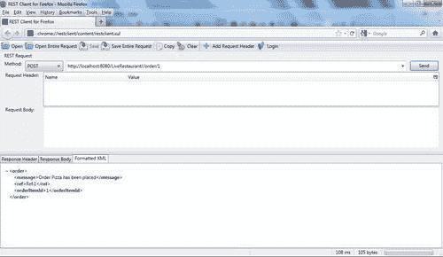
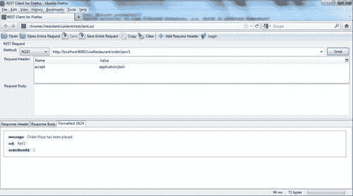
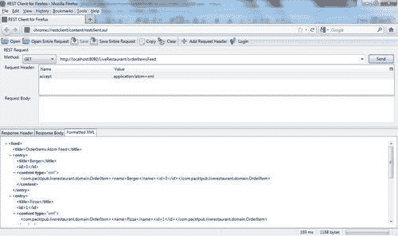

# 九、RESTful Web 服务

在本章中，我们将介绍：

*   使用 SpringMVC 中的 RESTful 特性设置 SpringRESTfulWeb 服务
*   使用 `RESTClient`工具访问 Spring RESTful Web 服务
*   使用 HTTP 消息转换设置 Spring RESTful Web 服务
*   使用 Spring 模板类为 Spring RESTful Web 服务创建 WS-client

# 导言

**简单对象访问协议（SOAP）**允许应用程序使用 XML 作为通信格式相互通信（SOAP 是很好理解的），但由于它是基于 XML 的，所以即使对于非常简单的 Web 服务场景，它也往往是冗长的。

**表征状态转移（REST）**，Roy Fielding 于 2000 年作为博士论文发表，旨在简化 Web 服务的使用。

虽然 SOAP 使用大量 XML（看起来非常复杂）进行通信，但 REST 使用非常轻量级和人类可读的数据（例如，请求 URI[http://localhost:8080/LiveRestaurant/customerAccount/234](http://localhost:8080/LiveRestaurant/customerAccount/234) 返回 `123-3456`。将此简单的请求和响应与本书前面几章中已介绍的 SOAP 请求/响应信封进行比较。由于 REST Web 服务实现非常灵活且可能非常简单，因此不需要工具包。但是，基于 SOAP 的 Web 服务需要工具来简化（例如，要调用 SOAP Web 服务，您可以使用工具为 contract-last Web 服务类生成客户端代理类，或者使用工具从 contract-first Web 服务中的架构生成域类）。在前面的章节中，您将了解 contract-first Web 服务对 `request/response`格式的严格程度（必须与合同相符）。REST Web 服务 `request/response`格式完全由开发人员决定，可以尽可能轻松地设计。使用 SOAP Web 服务时，使用 JavaScript 并不容易（需要大量代码）。REST 使用通过 AJAX 技术和 JSON 格式简化。

以下是 REST 的一些缺点：REST 只在 HTTP 上工作；调用 RESTful Web 服务受到 HTTP 谓词的限制：GET、POST、PUT 和 DELETE。

RESTful 是基于 REST 的原则构建的，在 REST 中，HTTP 的方法是基于它们的概念使用的。例如，HTTP 的 `GET, POST, PUT`和 `DELETE`都在 RESTful 体系结构中使用，它们的含义与 HTTP 相同。

RESTful Web 服务公开其资源的状态。例如，在本章中，当在在线餐厅下订单时，将公开一个 RESTful 服务来获取可用订单项目列表和订单对象。为了获得可用订单项目的列表，使用 `GET`方法，对于下订单，使用 `POST`方法。方法 `PUT`可用于添加/更新条目， `DELETE`可用于删除条目。

下面是进行 RESTful Web 服务调用并获取可用订单项列表的示例 URL:

[http://localhost:8080/LiveRestaurant/orderItems](http://localhost:8080/LiveRestaurant/orderItems) 。

以下是返回响应（响应格式不一定是 XML 格式；它可以是 JSON、纯文本或任何格式）：

```java
<list>
<orderItem>
<name>Burger</name>
<id>0</id>
</orderItem>
<orderItem>
<name>Pizza</name>
<id>1</id>
</orderItem>
<orderItem>
<name>Sushi</name><id>2</id>
</orderItem>
<orderItem>
<name>Salad</name>
<id>3</id>
</orderItem>
</list> 

```

RESTful Web 服务有几种实现，例如 `Restlet, RestEasy`，其中最重要的 `Jersey. Jersey`是 JAX-RS（JSR 311）的实现。

Spring 是广泛使用的 JavaEE 框架，在第 3 版中引入了对 RESTfulWeb 服务的支持。RESTful 已经集成到 Spring 的 MVC 层，该层允许应用程序使用 RESTful 特性在 Spring 上构建。这些功能中最重要的包括：

*   **注释**，如 `@RequestMapping`和 `@PathVariable`，用于 URI 映射和传递参数。
*   `ContentNegotiatingViewResolver`，允许使用不同的 MIME 类型（如 `text/xml, text/json`和 `text/plain)`
*   `HttpMessageConverter`，它允许基于客户端请求（如 ATOM、XML 和 JSON）生成多个表示。

# 使用 SpringMVC 中的 RESTful 功能设置 SpringRESTfulWeb 服务

Spring3.0 支持基于 SpringMVC 的 RESTfulWeb 服务。Spring 使用注释来设置 RESTful Web 服务，并且需要配置（在 Spring 应用程序上下文文件中）以扫描注释。设置 RESTful Web 服务需要 SpringMVC 控制器。 `@Controller`注释将一个类标记为 MVC 控制器（[http://static.springsource.org/spring/docs/current/spring-framework-reference/html/mvc.html](http://static.springsource.org/spring/docs/current/spring-framework-reference/html/mvc.html) 。 `@RequestMapping`注释将传入请求映射到控制器类中适当的 Java 方法。使用此注释，可以定义 URI 和映射到 Java 类方法的 HTTP 方法。例如，在下面的示例中，如果请求 URI 后面跟有 `/orderItems`，则调用方法 `loadOrderItems`，而 `@PathVariable`用于将请求参数（`{cayegoryId}`变量的值注入到方法参数 `(String cayegoryId):`中

```java
@RequestMapping( value="/orderItem/{cayegoryId}", method=RequestMethod.GET )
public ModelAndView loadOrderItems(@PathVariable String cayegoryId)
{...}

```

本文介绍了使用 Spring3MVC 实现 RESTfulWeb 服务。此 Web 服务的客户端项目在这里实现，但将在本章的最后一个配方中详细介绍：*使用 Spring 模板类*为 Spring RESTful Web 服务创建 WS-client。

## 准备好了吗

在此配方中，项目名称为 `LiveRestaurant_R-9.1`（出于测试目的， `LiveRestaurant_R-9.1-Client`项目包含在代码中），具有以下 Maven 依赖关系：

*   `com.springsource.javax.servlet-2.5.0.jar`
*   `spring-oxm-3.0.5.RELEASE.jar`
*   `spring-web-3.0.5.RELEASE.jar`
*   `spring-webmvc-3.0.5.RELEASE.jar`
*   `xstream-1.3.1.jar`
*   `commons-logging-1.1.1.jar`

`spring-oxm`是对 Object/XML 映射的 Spring 支持， `spring-web`和 `spring-webmvc`是对 Seb 和 MVC 的支持， `xstream`是对 Object/XML 映射框架的支持。

## 怎么做。。。

1.  在 `web.xml`文件`(URL:http://<host>:<port>/<appcontext>`/*中配置 `MessageDispatcherServlet`以转发到此 servlet）。
2.  定义控制器文件（`OrderController.java`）。
3.  定义域 POJO（`Order.java,OrderItem.java`和服务 `(OrderService, OrderServiceImpl)`。
4.  配置服务器端应用程序上下文文件（`order-servlet.xml`。
5.  在 `Liverestaurant_R-9.1:`

    ```java
    mvn clean package tomcat:run 

    ```

    上运行以下命令
6.  在 `Liverestaurant_R-9.1-Client:`

    ```java
    mvn clean package 

    ```

    ```java
    .... Created POST request for "http://localhost:8080/LiveRestaurant/order/1"
    .....Setting request Accept header to [application/xml, text/xml, application/*+xml]
    .... POST request for "http://localhost:8080/LiveRestaurant/order/1" resulted in 200 (OK)
    .....Reading [com.packtpub.liverestaurant.domain.Order] as "application/xml;charset=ISO-8859-1"
    .....
    .....Created GET request for "http://localhost:8080/LiveRestaurant/orderItems"
    .....Setting request Accept header to [application/xml, text/xml, application/*+xml]
    .....GET request for "http://localhost:8080/LiveRestaurant/orderItems" resulted in 200 (OK) 

    ```

    上运行以下命令
    *   以下是客户端输出：
7.  浏览此链接：[http://localhost:8080/LiveRestaurant/orderItems](http://localhost:8080/LiveRestaurant/orderItems) ，您将得到以下回复：

```java
<list>
<orderItem>
<name>Burger</name>
<id>0</id>
</orderItem>
<orderItem>
<name>Pizza</name>
<id>1</id>
</orderItem>
<orderItem>
<name>Sushi</name><id>2</id>
</orderItem>
<orderItem>
<name>Salad</name>
<id>3</id>
</orderItem>
</list> 

```

## 它是如何工作的。。。

该应用程序是一个 MVC web 项目，其中一个控制器返回 Spring 的 `Model`和 `View`对象。Spring 的 `MarshallingView`使用 `marshaller`（`XStreamMarshaller`）将模型对象编组为 XML，并将 XML 发送回客户端。

所有请求都将到达 `DispatcherServlet`，该请求将转发给控制器- `OrderController`，并根据请求 URI 调用适当的方法，将响应返回给调用者。 `web.xml`中的以下配置将所有请求转发给 `DispatcherServlet:`

```java
<servlet>
<servlet-name>order</servlet-name>
<servlet-class>
org.springframework.web.servlet.DispatcherServlet
</servlet-class>
<load-on-startup>1</load-on-startup>
</servlet>
<servlet-mapping>
<servlet-name>order</servlet-name>
<url-pattern>/*</url-pattern>
</servlet-mapping>

```

`order-context.xml`中的以下设置导致 Spring 检测包中的所有注释（包括 `OrderService`和 `OrderController)`。 `BeanNameViewResolver`用于将 `OrderController)`中的名称`(orderXmlView`映射到视图（bean `orderXmlView)`，它是 `org.springframework.web.servlet.view.xml.MarshallingView:`的实例）

```java
<context:component-scan base-package= "com.packtpub.liverestaurant.orderservice" />
<bean class= "org.springframework.web.servlet.view.BeanNameViewResolver" />
<bean id="orderXmlView" class= "org.springframework.web.servlet.view.xml.MarshallingView">
...
</bean>

```

`@Controller`以 MVC 模式将类 `OrderController`标记为控制器。所有调用方请求都将转发到此类，并基于请求 URI 调用适当的方法。例如，如果具有 HTTP `POST`方法的任何类似于 `http://<host>:<port>/<appcontext>/order/1`的 URI 来自调用方请求，则将调用方法 `placeOrder`。

```java
@RequestMapping(value = "/order/{orderId}", method = RequestMethod.POST)
public ModelAndView placeOrder(@PathVariable String orderId) {..}

```

`@PathVariable`导致 URI 中的 `orderId`参数被注入并传递给 `placeOrder`方法。

方法主体 `placeOrder`从 `OrderService`接口调用一个方法并返回 `Order`对象：

```java
Order order = orderService.placeOrder(orderId);
ModelAndView mav = new ModelAndView("orderXmlView", BindingResult.MODEL_KEY_PREFIX + "order", order);
return mav;

```

然后，它使用 `Marshallingview`bean（MVC 中的视图 MarshallingView 使用 `XStreamMarshaller`将模型对象编组为 XML 格式）将 `Order`对象编组为 XML 格式，并将其返回给服务的调用者。

```java
<bean id="orderXmlView" class= "org.springframework.web.servlet.view.xml.MarshallingView">
<constructor-arg>
<bean class="org.springframework.oxm.xstream.XStreamMarshaller">
<property name="autodetectAnnotations" value="true"/>
</bean>
</constructor-arg>
</bean>

```

`loadOrderItems`方法的工作方式相同，只是 URI 应该类似于以下模式： `http://<host>:<port>/<appcontext>/orderItems`，带有 HTTP `GET:`

```java
@RequestMapping(value = "/orderItems", method = RequestMethod.GET)
public ModelAndView loadOrderItems() {
List<OrderItem> orderItems = orderService.listOrderItems();
ModelAndView modelAndView = new ModelAndView("orderXmlView", BindingResult.MODEL_KEY_PREFIX + "orderItem", orderItems);
return modelAndView;
}

```

在此配方中，未实现数据库活动。然而，在实际应用中，HTTP 方法 `DELETE`可用于从数据库中删除实体（例如， `orderItem)`，而 `PUT`方法可用于更新记录（例如， `order)`。

## 另见。。。

在本书中：

[第 6 章](06.html "Chapter 6. Marshalling and Object-XML Mapping (OXM)")、*编组和对象 XML 映射（OXM）：*

*与 XStream*编组

# 使用 REST 客户端工具访问 Spring RESTful Web 服务

**REST 客户端**是一个调用和测试 RESTful Web 服务的应用程序。REST 客户端作为 Firefox/Flock 插件提供。Firefox REST 客户端支持所有 HTTP 方法，**RFC2616（HTTP/1.1）、**和**RFC2518（WebDAV）。**使用此插件，您可以构建自己的自定义 URI，添加头，将其发送到 RESTful Web 服务，并获取响应。

在本教程中，我们将学习如何使用 FirefoxREST 客户端来测试 RESTful Web 服务的呈现方式。这个方法使用了本章的第一个方法，*使用 SpringMVC*中的 RESTful 特性设置 SpringRESTfulWeb 服务，作为 RESTfulWeb 服务。

## 准备好了吗

下载并安装以下 Firefox 插件：

[https://addons.mozilla.org/en-US/firefox/addon/restclient/](http://https://addons.mozilla.org/en-US/firefox/addon/restclient/) 。

## 怎么做。。。

1.  从本章开始运行 `LiveRestaurant_R-9.1`。
2.  打开 Firefox 浏览器，进入**工具【Rest 客户端】。**
3.  Change the **Method** to **GET** and enter the URL: [http://localhost:8080/LiveRestaurant/orderItems](http://localhost:8080/LiveRestaurant/orderItems), and click on **Send:**

    结果如下：

    

4.  将**方式**改为**张贴**，输入 URL:[http://localhost:8080/LiveRestaurant/order/1](http://localhost:8080/LiveRestaurant/order/1) ，点击**发送：**



## 另见。。。

在本章中：

*在 Spring MVC*中使用 RESTful 功能设置 Spring RESTful Web 服务

# 使用 HTTP 消息转换设置 Spring RESTful Web 服务

HTTP 协议上的客户端和服务器使用文本格式交换数据。最终，需要接受不同的请求格式，并将文本格式转换为有意义的格式，例如对象或 JSON 格式。Spring 提供了一些功能，可以向同一文本格式提供多个请求/演示。

Spring3 引入了 `ContentNegotiatingViewResolver`，它可以从同一个 URI 中选择不同的视图，并且可以提供多个演示。

执行相同任务的另一种方法是使用 `HttpMessageConverter`接口和 `@ResponseBody`注释。Spring 的 `HttpMessageConverter`接口实现将 HTTP 消息转换为多种格式。其广泛使用的实现包括：

*   `StringHttpMessageConverter`实现从 HTTP 请求/响应读取/写入文本。这是默认的转换器。
*   `MarshallingHttpMessageConverter`实现从文本 HTTP 请求/响应中封送/解封对象。它获取一个构造函数参数来指定封送拆收器的类型（例如 `Jaxb, XStream`，等等）。
*   `MappingJacksonHttpMessageConverter`实现将文本转换为 JSON 数据格式，反之亦然。

在此配方中，介绍了使用 `MarshallingHttpMessageConverter, MappingJacksonHttpMessageConverter`和 `AtomFeedHttpMessageConverter`的消息转换。由于该项目类似于本章的第一个配方，*使用 Spring MVC*中的 RESTful 特性建立 Spring RESTful Web 服务，因此它被重用为该项目的模板。此配方的不同之处在于控制器实现和应用程序上下文配置。

此 Web 服务的客户端项目在这里实现，但将在本章的最后一个配方中详细介绍，*使用 Spring 模板类*为 Spring RESTful Web 服务创建 WS-client。

## 准备好了吗

在本配方中，项目名称 `LiveRestaurant_R-9.2 (LiveRestaurant_R-9.2-Client`包含在代码中，用于本配方中的测试目的。但是，它将在最后一个配方中解释），并且它具有以下 Maven 依赖项：

*   `com.springsource.javax.servlet-2.5.0.jar`
*   `spring-oxm-3.0.5.RELEASE.jar`
*   `spring-web-3.0.5.RELEASE.jar`
*   `spring-webmvc-3.0.5.RELEASE.jar`
*   `xstream-1.3.1.jar`
*   `commons-logging-1.1.1.jar`
*   `jackson-core-asl-1.7.5.jar`
*   `jackson-mapper-asl-1.7.5.jar`
*   `rome-1.0.jar`

`jackson-core`和 `jackson-mapper`支持 JSON 格式，其他支持 ATOM 格式。

## 怎么做。。。

1.  配置 `web.xml`文件`(URL:http://<host>:<port>/<appcontext>`/*内的 `DispatcherServlet`将转发到此 servlet）。
2.  定义控制器文件（`OrderController.java`）。
3.  定义域 POJO（`Order.java,OrderItem.java`和服务 `(OrderService, OrderServiceImpl)`
4.  配置服务器端应用上下文文件（`order-servlet.xml`并注册转换器。
5.  Change the **Method** to **POST** and add a **Request Header: Name** - `accept`, **Value** - `application/json`. Enter the URL [http://localhost:8080/LiveRestaurant/orderJson/1](http://localhost:8080/LiveRestaurant/orderJson/1) and click on **Send:**

    

6.  将**方法**改为**获取**，增加**请求头：名称**- `accept`、**值**- `application/atom+xml`。输入 URL[http://localhost:8080/LiveRestaurant/orderItemsFeed](http://localhost:8080/LiveRestaurant/orderItemsFeed) 点击**发送：**



## 它是如何工作的。。。

此配方与本章的第一个配方几乎相同，只是它使用消息转换器和 `@ResponseBody`提供多个演示。

在第一个配方中， `MarshallingView`负责将响应转换为视图的选定 XML 类型（使用 `XstreamMarshaller)`。然而，这里，消息转换器负责将数据模型呈现为选定的格式， `MarshallingHttpMessageConverter`负责将 `List<OrderItem>`转换为 `application/xml`格式（使用 `XstreamMarshaller)`和 `MappingJacksonHttpMessageConverter`用于将订单转换为 `application/json`格式。 `AtomFeedHttpMessageConverter`用于将 `Feed`（将 `List<OrderItem>`使用 `XStreamMarshaller`生成的 XML 内容包装为 `application/atom+xml`格式：

```java
<context:component-scan base-package= "com.packtpub.liverestaurant.orderservice" />
<bean id="xStreamMarshaller" class= "org.springframework.oxm.xstream.XStreamMarshaller"/>
<bean class="org.springframework. web.servlet.mvc.annotation.DefaultAnnotationHandlerMapping" />
<bean class="org.springframework. web.servlet.mvc.annotation.AnnotationMethodHandlerAdapter">
<property name="messageConverters">
<list>
<ref bean="marshallingConverter" />
<ref bean="jsonConverter" />
<ref bean="atomConverter" />
</list>
</property>
</bean>
<bean id="marshallingConverter" class="org.springframework. http.converter.xml.MarshallingHttpMessageConverter">
<constructor-arg>
<bean class="org.springframework.oxm.xstream.XStreamMarshaller">
<property name="autodetectAnnotations" value="true"/>
</bean>
</constructor-arg>
<property name="supportedMediaTypes" value="application/xml"/>
</bean>
<bean id="jsonConverter" class="org.springframework. http.converter.json.MappingJacksonHttpMessageConverter">
<property name="supportedMediaTypes" value="application/json" />
</bean>
<bean id="atomConverter"class="org.springframework. http.converter.feed.AtomFeedHttpMessageConverter">
<property name="supportedMediaTypes" value="application/atom+xml" />
</bean>

```

在控制器中，以下代码导致控制器的方法接受请求 URI 方法的 `POST`格式- `json:`

```java
@RequestMapping(method=RequestMethod.POST, value="/orderJson/{orderId}", headers="Accept=application/json")
public @ResponseBody Order placeOrderJson(@PathVariable String orderId) {
Order order=orderService.placeOrder(orderId);
return order;
}

```

返回 JSON 格式的 `Order`对象（使用 `@ResponseBody`和 `MappingJacksonHttpMessageConverter`，在 `order-context.xml):`中配置）

```java
{"message":"Order Pizza has been placed","ref":"Ref:1","orderItemId":"1"} 

```

以下代码导致控制器的方法接受请求 URI 方法的 `GET`格式- `atom:`

```java
@RequestMapping(method=RequestMethod.GET, value="/orderItemsFeed", headers="Accept=application/atom+xml")
public @ResponseBody Feed loadOrderItemsAtom() {
Feed feed = null;
try {
feed= getOrderItemsFeed(orderService.listOrderItems());
} catch (Exception e) {
throw new RuntimeException(e);
}
return feed;
}

```

还返回 `Atom`格式的 `List<OrderItem>`对象（使用 `@ResponseBody`和 `AtomFeedHttpMessageConverter`，在 `order-context.xml):`中配置）

```java
<?xml version="1.0" encoding="UTF-8"?>
<feed >
<title>OrderItems Atom Feed</title>
<entry>
<title>Burger</title>
<id>0</id>
<content type="xml">
&lt;com.packtpub.liverestaurant.domain.OrderItem&gt;&lt;name&gt; Burger&lt;/name&gt;&lt;id&gt;0&lt;/id&gt;&lt;/com.packtpub. liverestaurant.domain.OrderItem&gt;
</content>
</entry>
<entry>
<title>Pizza</title>
<id>1</id>
<content type="xml">&lt;com.packtpub.liverestaurant.domain. OrderItem&gt;&lt;name&gt;Pizza&lt;/name&gt;&lt;id&gt;1&lt; /id&gt;&lt;/com.packtpub.liverestaurant.domain.OrderItem&gt;
</content>
</entry>
...

```

## 另见。。。

在本章中：

*在 Spring MVC*中使用 RESTful 功能设置 Spring RESTful Web 服务

# 使用 Spring 模板类为 Spring RESTful Web 服务创建 WS 客户端

Spring 提供了各种各样的模板类，它们使用不同的技术简化了许多复杂性。例如， `WebServiceTemplate`用于调用基于 SOAP 的 Web 服务， `JmsTemplate`用于发送/接收 JMS 消息。Spring 还具有简化与 RESTful Web 服务交互的 `RestTemplate`。

使用 `RestTemplate:`

*   创建 `RestTemplate`的实例（可以使用 `@Autowired`功能完成）
*   配置一对多消息转换器（如前一配方中所述）
*   调用 `RestTemplate`的方法调用 RESTful Web 服务并获取响应

在本食谱中，我们将学习使用 `RestTemplate`使用 RESTful Web 服务。这个方法使用本章的第三个方法，*使用 HTTP 消息转换*建立一个 Spring RESTful Web 服务，作为 RESTful Web 服务。

## 准备好了吗

在本配方中，项目名称为 `LiveRestaurant_R-9.2-Client`（`LiveRestaurant_R-9.2`包含在本配方中，用于设置 RESTful 服务器，如前面的配方*使用 HTTP 消息转换设置 Spring RESTful Web 服务】*所述，具有以下 Maven 依赖项：

*   `spring-oxm-3.0.5.RELEASE.jar`
*   `spring-web-3.0.5.RELEASE.jar`
*   `xstream-1.3.1.jar`
*   `commons-logging-1.1.1.jar`
*   `jackson-core-asl-1.7.5.jar`
*   `jackson-mapper-asl-1.7.5.jar`
*   `rome-1.0.jar`
*   `junit-4.6.jar`
*   `spring-test-3.0.5.RELEASE.jar`

## 怎么做。。。

1.  定义域 POJO `(Order.java, OrderItem.java)`和服务 `(OrderService, OrderServiceImpl)`。
2.  配置客户端应用上下文文件（`order-servlet.xml`并注册转换器。
3.  创建一个 helper 类（`OrderClient`，该类使用 `RestTemplate`包装调用 RESTful Web 服务。
4.  在 `Liverestaurant_R-9.2:`

    ```java
    mvn clean package tomcat:run 

    ```

    上运行以下命令
5.  在 `Liverestaurant_R-9.2-Client:`上运行以下命令

```java
mvn clean package 

```

*   以下是客户端输出：

```java
....
.. Created GET request for "http://localhost:8080/LiveRestaurant/orderItems"
.. Setting request Accept header to [application/xml, text/xml, application/*+xml, application/json]
.. GET request for "http://localhost:8080/LiveRestaurant/orderItems" resulted in 200 (OK)
.. Reading [java.util.List] as "application/xml" using ....
.. Created POST request for "http://localhost:8080/LiveRestaurant/orderJson/1"
.. Setting request Accept header to [application/xml, text/xml, application/*+xml, application/json]
.. POST request for "http://localhost:8080/LiveRestaurant/orderJson/1" resulted in 200 (OK)
.. Reading [com.packtpub.liverestaurant.domain.Order] as "application/xml" using ...
...Created GET request for "http://localhost:8080/LiveRestaurant/orderItemsFeed"
.. Setting request Accept header to [application/xml, text/xml, application/*+xml, application/json, application/atom+xml]
.. GET request for "http://localhost:8080/LiveRestaurant/orderItemsFeed" resulted in 200 (OK)
.. Reading [com.sun.syndication.feed.atom.Feed] as "application/xml" using ... 

```

## 它是如何工作的。。。

由 `OrderServiceClientTest`加载的应用上下文，加载、实例化 `RestTemplate`并将其注入 `OrderClient`。此类使用 `RestTemplate`调用控制器的方法，并将值返回给测试套件类（`OrderServiceClientTest`。

在套件类测试方法中，将响应与期望值进行比较。

`applicationContext.xml`定义 `restTemplate`bean 并设置消息转换器列表：

```java
......
<bean id="restTemplate" class="org.springframework.web.client.RestTemplate">
<property name="messageConverters">
<list>
<ref bean="xmlMarshallingHttpMessageConverter" />
<ref bean="jsonConverter" />
<ref bean="atomConverter" />
</list>
</property>
</bean>
<bean id="xmlMarshallingHttpMessageConverter" class="org.springframework. http.converter.xml.MarshallingHttpMessageConverter">
<constructor-arg>
<ref bean="xStreamMarshaller" />
</constructor-arg>
</bean>
<bean id="xStreamMarshaller" class="org.springframework.oxm.xstream.XStreamMarshaller">
<property name="annotatedClasses">
<list>
<value>com.packtpub.liverestaurant.domain.Order</value>
<value>com.packtpub.liverestaurant.domain.OrderItem</value>
</list>
</property>
</bean>
<bean id="atomConverter" class="org.springframework. http.converter.feed.AtomFeedHttpMessageConverter">
<property name="supportedMediaTypes" value="application/atom+xml" />
</bean>
<bean id="jsonConverter" class="org.springframework. http.converter.json.MappingJacksonHttpMessageConverter">
<property name="supportedMediaTypes" value="application/json" />
</bean>

```

`messageConverters`中设置的转换器负责将不同格式（XML、JSON、ATOM）的请求/响应转换回 `object`类型。 `XstreamMarshaller`使用这些类中的注释标记获取已识别 POJO `(Order, OrderItem)`的列表。

`OrderClient.java`是一个助手类，使用 `RestTemplate:`包装调用 RESTful Web 服务

```java
protected RestTemplate restTemplate;
private final static String serviceUrl = "http://localhost:8080/LiveRestaurant/";
@SuppressWarnings("unchecked")
public List<OrderItem> loadOrderItemsXML() {
HttpEntity<String> entity = getHttpEntity(MediaType.APPLICATION_XML);
ResponseEntity<List> response = restTemplate.exchange(serviceUrl + "orderItems", HttpMethod.GET, entity, List.class);
return response.getBody();
}
.....
...
public String loadOrderItemsAtom() {
HttpEntity<String> httpEntity = getHttpEntity(MediaType.APPLICATION_ATOM_XML);
String outputStr = null;
ResponseEntity<Feed> responseEntity = restTemplate.exchange(serviceUrl + "orderItemsFeed", HttpMethod.GET, httpEntity, Feed.class);
WireFeed wireFeed = responseEntity.getBody();
WireFeedOutput wireFeedOutput = new WireFeedOutput();
try {
outputStr = wireFeedOutput.outputString(wireFeed);
} catch (Exception e) {
throw new RuntimeException(e);
}
return outputStr;
}
private HttpEntity<String> getHttpEntity(MediaType mediaType) {
HttpHeaders httpHeaders = new HttpHeaders();
httpHeaders.setContentType(mediaType);
HttpEntity<String> httpEntity = new HttpEntity<String>(httpHeaders);
return httpEntity;
}

```

## 还有更多

此配方只使用了 `RestTemplate`的两种方法（交换和 `postForEntity)`，但 `RestTemplate`支持几种调用方方法：

*   `exchange:`调用特定的 HTTP（GET、 `POST, PUT`和 `DELETE)`方法，并转换 HTTP 响应
*   `getForObject:`调用 HTTP `GET`方法，将 HTTP 响应转换为对象
*   `postForObject:`调用 HTTP `POST`方法，将 HTTP 响应转换为对象

## 另见。。。

在本章中：

*   *在 Spring MVC*中使用 RESTful 功能设置 Spring RESTful Web 服务
*   *使用 HTTP 消息转换*设置 Spring RESTful Web 服务

这本书，*RESTful Java Web 服务*，位于[http://www.packtpub.com/restful-java-web-services/book](http://www.packtpub.com/restful-java-web-services/book) 。