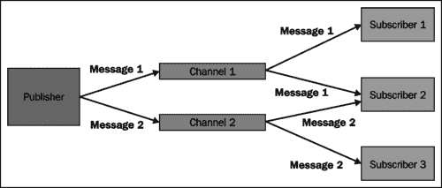

# 第一章开始

在本书中，我们将集中讨论两个特定的子项目，它们支持 Java 持久性 API 2.0 和 Redis 键值存储。但在我们说到点子上之前，我们需要对这两种技术做一个简单的介绍。我们这样做有两个原因：

首先，如果我们想真正了解 SpringDataJPA 的好处，我们需要了解在使用标准 API 时如何创建数据库查询。只要我们将这些代码示例与使用 Spring 数据 JPA 的查询创建代码进行比较，就会发现它的好处。

其次，有关 Redis key value store 的基本知识将帮助我们理解本书的第二部分，该部分描述了我们如何在应用程序中使用它。毕竟，我们应该熟悉应用程序中使用的任何技术。正当

在本章中，我们将介绍以下主题：

*   Java 持久性 API 背后的动机
*   Java 持久性 API 的主要组件
*   如何使用 Java 持久性 API 创建数据库查询
*   Redis 键值存储支持的数据类型。
*   Redis 键值存储的主要功能。

# Java 持久化 API

在引入**Java 持久化 API**（**JPA**之前，我们有以下三种替代技术可以用来实现我们的持久化层：

*   **Enterprise JavaBeans**（**EJB**2.x 规范提供的持久化机制
*   **JDBC**API
*   第三方**对象关系映射**（**ORM**框架如 Hibernate。

这让我们在为工作选择最佳工具时有了一些自由，但一如既往，这些选项中没有一个是没有问题的。

EJB2.x 的问题是它太重和复杂。其配置依赖于复杂的 XML 文档，其编程模型需要大量样板代码。此外，EJB 要求将应用程序部署到**JavaEE**应用服务器。

针对 JDBCAPI 的编程相当简单，我们可以在任何 servlet 容器中部署应用程序。然而，当我们将域模型的信息转换为查询或从查询结果构建域模型对象时，我们必须编写大量样板代码。

第三方 ORM 框架通常是一个不错的选择，因为它们使我们不用编写用于构建查询或根据查询结果构建域对象的不必要代码。这种自由是有代价的：对象和关系数据是不兼容的生物，尽管 ORM 框架可以解决**对象-关系不匹配**造成的大多数问题，但它们无法有效解决的问题是最让我们痛苦的。

Java 持久性 API 提供了一种标准机制，用于实现使用关系数据库的持久性层。它的主要动机是取代 EJB2.x 的持久性机制，并为对象关系映射提供标准化的方法。它的许多特性最初是由第三方 ORM 框架引入的，这些框架后来成为 Java 持久性 API 的实现。下一节将介绍它的关键概念，并描述如何使用它创建查询。

## 关键概念

**实体**是一个持久域对象。每个**实体类**通常表示一个数据库表，该类的实例包含一个表行的数据。每个实体实例都有一个唯一的对象标识符，这对于实体来说与数据库表的主键是一样的。

**实体管理器工厂**创建**实体管理器**实例。由同一实体管理器工厂创建的所有实体管理器实例将使用相同的配置和数据库。如果需要访问多个数据库，则必须为每个使用的数据库配置一个 entity manager 工厂。实体管理器工厂的方法由`EntityManagerFactory`接口指定。

实体管理器管理应用程序的实体。实体管理器可用于对实体执行**CRUD**（**创建**、**读取**、**更新**、**删除**）操作，并对数据库执行复杂查询。实体管理器的方法由`EntityManager`接口声明。

**持久化单元**指定所有实体类，由应用程序的实体管理器管理。每个持久化单元包含表示存储在单个数据库中的数据的所有类。

**持久化上下文**包含实体实例。在持久性上下文中，每个对象标识符只能有一个实体实例。每个持久性上下文都与特定的实体管理器相关联，该实体管理器管理持久性上下文所包含的实体实例的生命周期。

## 创建数据库查询

Java 持久化 API 引入了两种创建数据库查询的新方法：**Java 持久化查询语言**（**JPQL**）和**标准 API**。使用这些技术编写的查询不直接处理数据库表。相反，查询是在应用程序的实体及其持久状态上编写的。从理论上讲，这可以确保所创建的查询是可移植的，并且不会绑定到特定的数据库模式或数据库提供程序。

也可以使用 SQL 查询，但这会将应用程序绑定到特定的数据库模式。如果使用特定于数据库提供程序的扩展，那么我们的应用程序也将绑定到数据库提供程序。

接下来，我们将了解如何使用 Java 持久性 API 通过使用 SQL、JPQL 和 Criteria API 构建数据库查询。我们的示例查询将从数据库中获取名为“John”的所有联系人。本例使用一个名为`Contact`的简单实体类，它表示存储在`contacts`表中的数据。下表将实体的属性映射到数据库的列：

<colgroup><col style="text-align: left"> <col style="text-align: left"></colgroup> 
| 

联系

 | 

联络

 |
| --- | --- |
| `firstName` | `first_name` |

### 本机 SQL 查询

SQL 是一种标准化查询语言，旨在管理存储在关系数据库中的数据。下面的代码示例描述了如何使用 SQL 实现指定的查询：

```java
//Obtain an instance of the entity manager
EntityManager em = ...

//Build the SQL query string with a query parameter
String getByFirstName="SELECT * FROM contacts c WHERE c.first_name = ?1";

//Create the Query instance
Query query = em.createNativeQuery(getByFirstName, Contact.class);

//Set the value of the query parameter
query.setParameter(1, "John");

//Get the list of results
List contacts = query.getResultList();
```

这个例子告诉我们三件事：

*   为了使用 JPA 构建查询，我们不必学习新的查询语言。
*   创建的查询不是类型安全的，我们必须先强制转换结果，然后才能使用它们。
*   我们必须先运行应用程序，然后才能验证查询是否存在拼写或语法错误。这增加了开发人员反馈循环的长度，并降低了生产效率。

因为 SQL 查询绑定到特定的数据库模式（或所使用的数据库提供程序），所以我们应该仅在绝对必要时使用它们。通常使用 SQL 查询的原因是性能，但我们可能还有其他原因使用它。例如，我们可能正在将一个遗留应用程序迁移到 JPA，但一开始我们没有时间正确地进行迁移。

### Java 持久化查询语言

JPQL 是一种基于字符串的查询语言，其语法类似于 SQL。因此，只要您有 SQL 方面的经验，学习 JPQL 是相当容易的。执行指定查询的代码示例如下：

```java
//Obtain an instance of the entity manager
EntityManager em = ...

//Build the JPQL query string with named parameter
String getByFirstName="SELECT c FROM Contact c WHERE c.firstName = :firstName";

//Create the Query instance
TypedQuery<Contact> query = em.createQuery(getByFirstName, Contact.class);

//Set the value of the named parameter
query.setParameter("firstName", "John");

//Get the list of results
List<Contact> contacts = query.getResultList();
```

这个例子告诉我们三件事：

*   创建的查询是类型安全的，我们不必强制转换查询结果。
*   JPQL 查询字符串可读性强，易于解释。
*   编译期间无法验证创建的查询字符串。验证查询字符串是否存在拼写或语法错误的唯一方法是运行应用程序。不幸的是，这意味着开发人员反馈循环的长度增加了，从而降低了生产率。

JPQL 是静态查询的好选择。换句话说，如果查询参数的数量总是相同的，那么 JPQL 应该是我们选择的武器。但是使用 JPQL 实现动态查询通常很麻烦，因为我们必须手动构建查询字符串。

### 标准 API

引入了标准 API 来解决使用 JPQL 时发现的问题，并使第三方 ORM 框架的标准化工作标准化。它用于构造查询定义对象，并将其转换为执行的 SQL 查询。下一个代码示例演示了我们可以使用 Criteria API 实现查询：

```java
//Obtain an instance of entity manager
EntityManager em = ...
//Get criteria builder
CriteriaBuilder cb = em.getCriteriaBuilder();

//Create criteria query
CriteriaQuery<Contact> query = cb.greateQuery(Contact.class);

//Create query root
Root<Contact> root = query.from(Contact.class);

//Create condition for the first name by using static meta
//model. You can also use "firstName" here.
Predicate firstNameIs = cb.equal(root.get(Contact_.firstName, "John");

//Specify the where condition of query
query.where(firstNameIs);

//Create typed query and get results
TypedQuery<Contact> q = em.createQuery(query);
List<Contact> contacts = q.getResultList();
```

从这个例子中我们可以看到三件事：

*   所创建的查询是类型安全的，无需强制转换即可获得结果
*   代码的可读性不如使用 SQL 或 JPQL 的相应代码
*   因为我们处理的是 Java API，所以 Java 编译器确保不可能创建语法错误的查询

如果我们必须创建动态查询，criteriaapi 是一个很好的工具。创建动态查询更容易，因为我们可以处理对象，而不是手动构建查询字符串。不幸的是，当创建的查询的复杂性增加时，创建查询定义对象可能会很麻烦，代码也会变得更难理解。

# Redis

Redis 是一种内存中的数据存储，它将其整个数据集保存在内存中，并且仅将磁盘空间用作辅助持久存储。因此，Redis 可以提供非常快速的读写操作。问题是 Redis 数据集的大小不能大于内存量。Redis 的其他功能包括：

*   对复杂数据类型的支持
*   多重持久性机制
*   主从复制
*   发布/订阅消息传递模式的实现

以下小节介绍了这些功能。

## 支持的数据类型

Redis 存储的每个值都有一个键。键和值都是二进制安全的，这意味着键或存储的值可以是字符串或二进制文件的内容。然而，Redis 不仅仅是一个简单的键值存储。它支持多种二进制安全数据类型，每个程序员都应该熟悉这些类型。这些数据类型如下：

*   **字符串**：这是一种数据类型，其中一个键总是指向一个值。
*   **列表**：此是一种数据类型，一个键表示多个字符串值，按插入顺序排序。
*   **集合**：此是无序字符串的集合，不能多次包含相同的值。
*   **排序集**：这与集合类似，但其每个值都有一个分数，用于将排序集的值从最低分数排序到最高分数。相同的分数可以分配给多个值。
*   **散列**：这是一种数据类型，其中单个散列键总是指字符串键和值的特定映射。

## 持久性

Redis 支持两种持久化机制，可以将数据集存储在磁盘上。详情如下:

*   **RDB** is the simplest persistence mechanism of Redis. It takes snapshots from the in-memory data sets at configured intervals, and stores the snapshot on disk. When a server is started, it will read the data set back to the memory from the snapshot file. This is the default persistence mechanism of Redis.

    RDB 最大限度地提高了 Redis 服务器的性能，其文件格式非常紧凑，这使它成为灾难恢复的一个非常有用的工具。此外，如果要使用主从复制，则必须使用 RDB，因为在主复制和从复制之间同步数据时会使用 RDB 快照。

    但是，如果您必须在所有情况下将数据丢失的机会降至最低，那么 RDB 不是适合您的解决方案。因为 RDB 以配置的时间间隔保存数据，所以在将最后一个快照保存到磁盘后，您始终可能会丢失存储在 Redis 实例中的数据。

*   **Append Only File** (**AOF**) is a persistence model, which logs each operation changing the state of the in-memory data set to a specific log file. When a Redis instance is started, it will reconstruct the data set by executing all operations found from the log file.

    AOF 的优势在于，它将所有情况下的数据丢失机会降至最低。此外，由于日志文件是一个附加日志，它不能被不可逆转地损坏。另一方面，对于相同的数据，AOF 日志文件通常比 RDB 文件大，如果服务器遇到巨大的写负载，AOF 可能比 RDB 慢。

您还可以启用这两种持久性机制，并充分利用这两种机制。您可以使用 RDB 创建数据集的备份，但仍可以确保数据安全。在这种情况下，Redis 将使用 AOF 日志文件在服务器启动时构建数据集，因为它很可能包含最新的数据。

如果您将 Redis 用作临时数据存储，并且不需要持久性，则可以禁用这两种持久性机制。这意味着服务器关闭时数据集将被销毁。

## 复制

Redis 支持主从复制，其中单个主设备可以有一个或多个从设备。每个从机都是其主机的精确副本，它可以连接到主机和其他从机。换句话说，奴隶可以是其他奴隶的主人。从 Redis 2.6 开始，默认情况下每个从机都是只读的，并且拒绝对从机的所有写入操作。如果需要将临时信息存储到从机，则必须将该从机配置为允许写操作。

复制在两侧都是非阻塞的。即使一个或多个从机第一次同步其数据，它也不会阻止向主机发出的查询。从机可以配置为在与主机同步数据时为旧数据提供服务。但是，当旧数据替换为新数据时，到从机的传入连接将在短时间内被阻止。

如果从机与主机失去连接，它将继续为旧数据提供服务，或者根据其配置向客户端返回错误。当主设备和从设备之间的连接丢失时，从设备将自动重新打开连接并向主设备发送同步请求。

## 发布/订阅消息模式

发布/订阅消息模式是一种消息模式，其中消息发送方（发布方）不直接向接收方（订户）发送消息。相反，称为**通道**的附加元素用于将消息从发布者传输到订阅者。发布者可以向一个或多个频道发送消息。订阅者可以选择感兴趣的频道，并通过订阅这些频道来接收发送到这些频道的消息。

让我们考虑一种情况，一个发布者将消息发布到两个频道，频道 1 和频道 2。通道 1 有两个订户：订户 1 和订户 2。频道 2 还有两个订户：订户 2 和订户 3。下图说明了这种情况：



发布/订阅模式确保发布者不知道订阅者，反之亦然。这使我们能够将应用程序划分为更小的模块，这些模块之间具有松散耦合。这使得模块更易于维护和更换（如果需要）。

然而，发布/订阅模式的最大优点也是它最大的缺点。首先，我们的应用程序不能依赖于特定组件已订阅特定通道这一事实。第二，我们没有明确的方法来核实情况是否如此。事实上，我们的应用程序不能假设有人在听。

Redis 为发布/订阅模式提供了可靠的支持。其发布/订阅实现的主要功能包括：

*   发布者可以同时将消息发布到一个或多个频道
*   订阅者可以使用频道名称或包含通配符的模式订阅感兴趣的频道
*   从频道取消订阅还支持名称和模式匹配

# 总结

在本章中，我们了解到：

*   引入 Java 持久性 API 是为了解决与 EJB2.x 相关的问题，并为对象关系映射提供标准方法。它的特性选自最流行的第三方持久性框架的特性。
*   Redis 是一个内存中的数据存储，它将整个数据集保存在内存中，支持复杂的数据类型，可以将磁盘用作持久存储，并支持主从复制。它还实现了发布/订阅消息传递模式。

在下一章中，我们将学习如何建立一个使用 SpringDataJPA 的 web 应用程序项目，并使用它实现一个简单的联系人管理器应用程序。