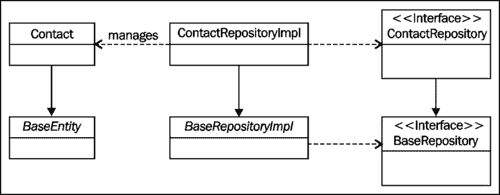
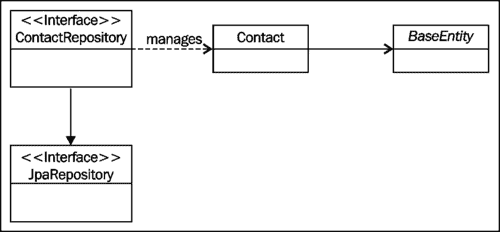

# 第二章，Spring 数据 JPA 入门

本章为我们提供了使用 SpringDataJPA 建立 web 应用程序项目和管理实体所需的基本知识。在本章中，我们将学习：

*   如何使用**Maven**下载所需的依赖项
*   如何使用**编程配置**配置 Spring**应用上下文**
*   如何使用编程配置配置我们的 web 应用程序以加载 Spring 应用程序上下文（不使用`web.xml`）
*   如何为具有 Spring 数据 JPA 的实体类实现**CRUD**（**创建**、**读取**、**更新、**和**删除**功能

# 使用 Maven 下载依赖项

本书涵盖了 SpringDataJPA 的 1.2.0.RELEASE 版本，这是本书创作期间可用的最新版本。Spring Data JPA 所需的其他组件如下表所示：

<colgroup><col style="text-align: left"> <col style="text-align: left"> <col style="text-align: left"></colgroup> 
| 

组成部分

 | 

描述

 | 

版本

 |
| --- | --- | --- |
| 数据源 | BoneCP 是一个快速连接池库，用作我们应用程序的数据源。 | 0.7.1.1 发布 |
| JPA 提供商 | JPA 提供者是实现 Java 持久性 API 的库。我们将使用 Hibernate 作为 JPA 提供者。 | 4.1.4.最终版本 |
| 弹簧框架 | Spring 框架用于使用 Java 开发现代企业应用程序。 | 3.1.2.1 发布 |
| 数据库 | H2 是一个嵌入式内存数据库，支持标准 SQL 和 JDBCAPI。 | 1.3.166 |

我们将使用应用程序其他依赖项的最新可用版本。

我们可以通过在`POM`文件中声明来下载 Maven 所需的依赖项。为此，我们必须将以下依赖项声明添加到`pom.xml`文件的依赖项部分：

```java
<!-- Spring Data JPA -->
<dependency>
  <groupId>org.springframework.data</groupId>
  <artifactId>spring-data-jpa</artifactId>
  <version>1.2.0.RELEASE</version>
</dependency>
<!-- Hibernate -->
<dependency>
  <groupId>org.hibernate</groupId>
  <artifactId>hibernate-core</artifactId>
  <version>4.1.4.Final</version>
</dependency>
<dependency>
  <groupId>org.hibernate</groupId>
  <artifactId>hibernate-entitymanager</artifactId>
  <version>4.1.4.Final</version>
</dependency>
<!-- H2 Database -->
<dependency>
  <groupId>com.h2database</groupId>
  <artifactId>h2</artifactId>
  <version>1.3.166</version>
</dependency>
<!-- BoneCP -->
<dependency>
  <groupId>com.jolbox</groupId>
  <artifactId>bonecp</artifactId>
  <version>0.7.1.RELEASE</version>
</dependency>
```

### 提示

**下载示例代码**

您可以下载您在[账户购买的所有 Packt 书籍的示例代码文件 http://www.packtpub.com](http://www.packtpub.com) 。如果您在其他地方购买了本书，您可以访问[http://www.packtpub.com/support](http://www.packtpub.com/support) 并注册，将文件直接通过电子邮件发送给您。

# 配置 Spring 应用程序上下文

传统上，我们将使用声明性配置和 XML 配置文件，但在 SpringFramework3.0 发布后，可以使用编程配置来配置 Spring 应用程序上下文。当我们配置应用程序的应用程序上下文时，这是我们选择的武器。

我们可以通过以下步骤配置 Spring 应用程序上下文：

1.  为配置参数的值创建属性文件。
2.  创建应用程序上下文配置类。

## 创建属性文件

配置参数的实际值存储在名为`application.properties`的属性文件中。此文件包含数据库连接详细信息、Hibernate 配置和实体的基本包。该文件的内容如下：

```java
#Database Configuration
db.driver=org.h2.Driver
db.url=jdbc:h2:mem:datajpa
db.username=sa
db.password=

#Hibernate Configuration
hibernate.dialect=org.hibernate.dialect.H2Dialect
hibernate.format_sql=true
hibernate.hbm2ddl.auto=create-drop
hibernate.ejb.naming_strategy=org.hibernate.cfg.ImprovedNamingStrategy
hibernate.show_sql=true

#EntityManager
entitymanager.packages.to.scan=com.packtpub.springdata.jpa.model

#General Spring configuration is added here.
```

## 创建应用上下文配置类

我们可以通过以下步骤创建应用程序上下文配置类：

1.  创建包含应用程序常规配置的应用程序上下文配置框架。
2.  配置数据源 bean。
3.  配置实体管理器工厂 bean。
4.  配置事务管理器 bean。

### 创建应用上下文配置框架

创建 Spring 应用上下文的骨架配置类所需的步骤如下：

1.  `@Configuration`注释将该类标识为应用程序上下文配置类。
2.  组件扫描指令配置有`@ComponentScan`注释。在我们的示例中，SpringIOC 容器被配置为扫描包含控制器和服务类的包。
3.  `@EnableJpaRepositories`注释用于启用 Spring 数据 JPA 并配置我们存储库的基本包。
4.  `@EnableTransactionManagement`注释支持 Spring 框架的注释驱动事务管理。
5.  `@EnableWebMcv` 注释导入 Spring MVC 的默认配置。
6.  使用`@PropertySource`注释导入包含配置参数值的属性文件。我们可以通过使用 Spring IoC 容器注入的`Environment`接口的实现来访问存储在该文件中的属性值。

我们的应用程序上下文配置框架的源代码如下所示：

```java
@Configuration
@ComponentScan(basePackages = {
        "com.packtpub.springdata.jpa.controller",
        "com.packtpub.springdata.jpa.service"
})
@EnableJpaRepositories("com.packtpub.springdata.jpa.repository")
@EnableTransactionManagement
@EnableWebMvc
@PropertySource("classpath:application.properties")
public class ApplicationContext extends WebMvcConfigurerAdapter {

    @Resource
    private Environment env;

//Add configuration here
}

```

### 注

我们还可以使用 XML 配置 Spring 数据 JPA。我们可以通过将 SpringDataJPA 的`repositories`名称空间元素添加到我们的应用程序上下文配置文件中来实现这一点。

### 配置数据源 bean

我们将通过在`ApplicationContext`类中添加`dataSource()`方法并使用`@Bean`注释对该方法进行注释来启动数据源 bean 的配置。该方法的实现如下所示：

1.  创建`BoneCPDataSource`类的实例。
2.  设置数据库连接详细信息。
3.  返回创建的对象。

数据源 bean 的配置如下所示：

```java
@Bean
public DataSource dataSource() {
  BoneCPDataSource ds = new BoneCPDataSource();   

  ds.setDriverClass(env.getRequiredProperty("db.driver")); 
  ds.setJdbcUrl(env.getRequiredProperty("db.url")); 
  ds.setUsername(env.getRequiredProperty("db.username"));  
  ds.setPassword(env.getRequiredProperty("db.password"));

  return ds;
}
```

### 配置实体管理器工厂 bean

我们可以通过在`ApplicationContext`类中添加一个名为`entityManagerFactory()`的方法并用`@Bean`注释该方法来配置实体管理器工厂 bean。该方法的实现如下所示：

1.  创建`LocalContainerEntityManagerFactoryBean` 类的实例。
2.  将所用数据源 bean 的引用传递给所创建的对象。
3.  将 Hibernate 的默认配置设置为实体管理器工厂 bean。我们可以通过创建一个新的`HibernateJpaVendorAdapter`对象并将其传递给实体管理器工厂 bean 来实现这一点。
4.  设置实体的基本包。
5.  设置从属性文件获取的附加配置。
6.  返回创建的对象。

所创建方法的源代码如下所示：

```java
@Bean
public LocalContainerEntityManagerFactoryBean entityManagerFactory() {
    LocalContainerEntityManagerFactoryBean em = new LocalContainerEntityManagerFactoryBean();

    em.setDataSource(dataSource());
    em.setJpaVendorAdapter(new HibernateJpaVendorAdapter());em.setPackagesToScan(env.getRequiredProperty("entitymanager.packages.to.scan"));

    Properties p = new Properties();
    p.put("hibernate.dialect", env.getRequiredProperty("hibernate.dialect"));
    p.put("hibernate.format_sql", env.getRequiredProperty("hibernate.format_sql"));
    p.put("hibernate.hbm2ddl.auto", env.getRequiredProperty("hibernate.hbm2ddl.auto"));
    p.put("hibernate.ejb.naming_strategy", env.getRequiredProperty("hibernate.ejb.naming_strategy"));
    p.put("hibernate.show_sql", env.getRequiredProperty("hibernate.show_sql");
    em.setJpaProperties(p);

    return em;
}
```

### 配置事务管理器 bean

我们可以通过在`ApplicationContext`类中添加`transactionManager()`方法并使用`@Bean`注释对该方法进行注释来配置事务管理器 bean。该方法的实现如下所示：

1.  创建一个新的`JpaTransactionManager`对象。
2.  设置所用实体管理器工厂的引用。
3.  返回创建的对象。

事务管理器 bean 配置的源代码如下所示：

```java
@Bean
public JpaTransactionManager transactionManager() {
    JpaTransactionManager transactionManager = new JpaTransactionManager();
    transactionManager.setEntityManagerFactory(entityManagerFactory().getObject());
    return transactionManager;
}
```

# 加载应用程序上下文配置

加载我们的应用程序的应用程序上下文配置的旧方法是使用**web 应用程序部署描述符**文件，该文件通常被称为`web.xml`。但是，因为我们在 Servlet 3.0 环境中使用 Spring Framework 3.1，所以我们可以通过实现`WebApplicationInitializer`接口来创建 web 应用程序配置类。这确保了 Spring 框架在 servlet 容器启动时自动检测我们的配置类。

我们将使用我们的 web 应用程序配置类：

1.  加载我们的应用程序上下文配置类。
2.  配置**调度器 servlet**。
3.  创建**上下文加载程序侦听器**并将其添加到我们的**servlet 上下文**。

我们的配置类的源代码如下所示：

```java
public class DataJPAExampleInitializer implements WebApplicationInitializer {

    @Override
    public void onStartup(ServletContext servletContext) throws ServletException {
        //Loading application context
        AnnotationConfigWebApplicationContext rootContext = new AnnotationConfigWebApplicationContext();
        rootContext.register(ApplicationContext.class);

        //Dispatcher servlet
        ServletRegistration.Dynamic dispatcher = servletContext.addServlet("dispatcher", new DispatcherServlet(rootContext));
        dispatcher.setLoadOnStartup(1);
        dispatcher.addMapping("/");

        //Context loader listener
        servletContext.addListener(new ContextLoaderListener(rootContext));
    }
}
```

# 为实体实现 CRUD 功能

我们现在已经配置了 Spring 应用程序上下文，并将 web 应用程序配置为在启动期间加载它。我们现在将为一个简单实体实现 CRUD 函数。我们的示例应用程序用于查看和管理联系人信息，我们可以通过以下步骤来实现：

1.  创建域模型。
2.  为实体创建存储库。
3.  实现 CRUD 函数。

### 注

本章仅描述了解 SpringDataJPA 如何工作所需的应用程序部分。

## 领域模型

我们的应用程序的域模型由两类组成：`Contact`和`Address`。本小节将涉及以下事项：

*   每个类的信息内容
*   我们如何使用**构建器模式**（另请参见：*有效 Java*（*第二版*）、*Joshua Bloch*、*Addison Wesley*）创建新对象
*   如何更新对象的信息

### 联系人

`Contact`类是我们域模型的唯一实体，它包含单个联系人的信息。此信息主要由简单属性组成。此规则的唯一例外是用于存储地址信息的`Address`类。`Contact`类源代码的相关部分如下：

```java
@Entity
@Table(name = "contacts")
public class Contact {

    @Id
    @GeneratedValue(strategy = GenerationType.AUTO)
    private Long id;

    private Address address;

    @Column(name = "email_address", length = 100)
    private String emailAddress;

    @Column(name = "first_name", nullable=false, length = 50)
    private String firstName;

    @Column(name = "last_name", nullable=false, length = 100)
    private String lastName;

    @Column(name = "phone_number", length = 30)
    private String phoneNumber;

    @Version
    private long version;

//Getters and other methods
}
```

让我们继续了解如何创建新联系人和更新联系人信息。

#### 创建新的联系人对象

我们将使用构建器模式来创建新联系人。为此，我们必须遵循以下步骤：

1.  实现用于构建新的`Contact`对象的静态内部类。
2.  在`Contact`类中添加一个静态`getBuilder()`方法。此方法用于获取对所用生成器的引用。

首先，我们将按照以下步骤向`Contact`类添加一个静态内部类：

1.  实现一个将所需属性作为参数的构造函数。联系人所需的属性为名字和姓氏。
2.  实现可选属性的属性方法。这些属性包括电子邮件地址、电话号码和地址信息。每个属性方法都返回对所用生成器对象的引用。
3.  实现一个返回构建对象的`build()`方法。

`Contact.Builder`类的源代码如下：

```java
public static class Builder {

        private Contact built;

        public Builder (String firstName, String lastName) {
            built = new Contact();
            built.firstName = firstName;
            built.lastName = lastName;
        }

        public Builder address(String streetAddress, String postCode, String postOffice, String state, String country) {
            Address address = Address.getBuilder(streetAddress, postCode, postOffice)
                    .state(state)
                    .country(country)
                    .build();
            built.address = address;
            return this;
        }

        public Builder emailAddress(String emailAddress) {
            built.emailAddress = emailAddress;
            return this;
        }

        public Builder phoneNumber(String phoneNumber) {
            built.phoneNumber = phoneNumber;
            return this;
        }

        public Contact build() {
            return built;
        }
    }
}
```

我们还必须向`Contact`类添加一个静态`getBuilder()`方法。我们的实现非常简单。我们创建一个新的`Contact.Builder`对象并返回所创建的对象。此方法的源代码如下所示：

```java
public static Builder getBuilder(String firstName, String lastName) {
    return new Builder(firstName, lastName);
}
```

#### 更新联系方式

`Contact`类有两种方法可以用来更新联系人信息：更新联系人信息的`update()`方法和更新联系人地址信息的`updateAddress()`方法。这些方法的源代码如下所示：

```java
public void update(final String firstName, final String lastName, final String emailAddress, final String phoneNumber) {
    this.firstName = firstName;
    this.lastName = lastName;
    this.emailAddress = emailAddress;
    this.phoneNumber = phoneNumber;
}

public void updateAddress(final String streetAddress, final String postCode, final String postOffice, final String state, final String country) {
    if (address == null) {
        address = new Address();
    }
    address.update(streetAddress, postCode, postOffice, state, country);
}
```

### 地址

`Address`类是用于存储地址信息的嵌入式类。**嵌入式类**是一个只能与其父类一起持久化的类。嵌入式类通常用于表示域模型的常见概念，并强调其面向对象的本质。`Address`类的源代码如下：

```java
@Embeddable
public class Address {

    @Column(name = "country", length = 20)
    private String country;

    @Column(name = "street_address", length =150)
    private String streetAddress;

    @Column(name = "post_code", length = 10)
    private String postCode;

    @Column(name = "post_office", length = 40)
    private String postOffice;

    @Column(name = "state", length = 20)
    private String state;

  //The default constructor and other methods
}
```

接下来，我们将了解如何创建新的`Address`对象并更新现有对象的地址信息。

#### 创建新地址

我们将使用 builder 模式创建新的`Address`对象。我们可以通过以下步骤实现 builder 模式：

1.  实现用于构建新的`Address`对象的静态内部类。
2.  在`Address`类中添加一个静态`getBuilder()`方法。此方法用于获取对所用生成器的引用。

我们可以通过以下步骤实现静态内部类：

1.  实现一个将所需属性作为参数的构造函数。`Address`类所需的属性为`streetAddress`、`postCode`和`postOffice`。
2.  实现用于设置可选地址信息的属性方法。这些信息包括州和国家。每个属性方法都返回对所用生成器的引用。
3.  实现一个返回构建对象的`build()`方法。

`Address.Builder`类的源代码如下：

```java
public static class Builder {

  private Address built;

  public Builder(String streetAddress, String postCode, String postOffice) {
    built = new Address();
    built.streetAddress = streetAddress;
    built.postCode = postCode;
    built.postOffice = postOffice;
  }

  public Builder country(String country) {
    built.country = country;
    return this;
  }

  public Builder state(String state) {
    built.state = state;
    return this;
  }

  public Address build() {
    return built;
   }
}
```

我们还必须实现一个方法，该方法用于获取对所用构建器对象的引用。我们可以通过简单地创建一个新的`Address.Builder`对象并返回所创建的对象来实现这一点。`Address`类的静态`getBuilder()`方法的源代码如下：

```java
public static Builder getBuilder(String streetAddress, String postCode, String postOffice) {
    return new Builder(streetAddress, postCode, postOffice);
}
```

#### 更新地址信息

我们可以通过调用`Address`对象的`update()`方法来更新对象的信息。此方法的源代码如下所示：

```java
public void update(final String streetAddress, final String postCode, final String postOffice, final String state, final String country) {
    this.streetAddress = streetAddress;
    this.postCode = postCode;
    this.postOffice = postOffice;
    this.state = state;
    this.country = country;
}
```

## 创建自定义存储库

为了真正理解 Spring 数据 JPA 的简单性，我们必须回顾一下不太遥远的过去，了解在 Spring 数据 JPA 发布之前具体的存储库是如何创建的。这应该让我们清楚地了解 SpringDataJPA 的好处。

### 以旧式方式创建自定义存储库

传统上，创建具体存储库的过程包括六个步骤。详情如下:

1.  创建为其子类提供属性映射的基类。它通常用于为实体提供 ID、版本和时间戳映射。
2.  创建一个通用存储库接口，该接口声明所有存储库共享的方法。通常，这些方法为我们的实体提供 CRUD 操作。
3.  创建一个通用存储库。
4.  创建一个实体类。
5.  创建特定于实体的存储库接口。
6.  创建特定于实体的具体存储库。

首先，我们必须创建一个抽象基类，由每个实体类扩展。我们可以通过以下步骤创建此类：

1.  创建一个抽象类，该类将实体 ID 的类型作为类型参数。
2.  用`@MappedSuperclass`注释注释创建的类。它用于声明从此类中找到的映射应用于其子类。
3.  创建一个抽象的`getId()`方法，该方法返回一个具体类的 id。

`BaseEntity`类的源代码如下：

```java
@MappedSuperclass
public abstract class BaseEntity<ID> {

    @Version
    private Long version;

    public abstract ID getId();
}
```

其次，我们必须创建一个通用存储库接口，该接口声明所有具体存储库共享的方法。我们可以通过以下步骤创建此接口：

1.  添加实体的类型和实体 ID 的类型作为类型参数。
2.  声明所有具体存储库共享的方法。

`BaseRepository`接口的源代码如下：

```java
public interface BaseRepository<T extends BaseEntity, ID extends Serializable> {

    public T deleteById(ID id);
    public List<T> findAll();
    public T findById(ID id);
    public void persist(T entity);
}
```

第三，我们必须创建一个抽象的通用存储库。我们可以通过以下步骤来实现这一点：

1.  创建一个抽象类，将具体实体的类型和实体 ID 的类型作为类型参数。
2.  使用`@PersistenceContext`注释获取对所用实体管理器的引用。
3.  实现`BaseRepository`接口。
4.  实现一个从类型参数获取实体类类型的构造函数。
5.  提供一个`getEntityManager()`方法，返回对所用实体管理器的引用。此类的子类将使用此方法获取用于构建数据库查询的实体管理器引用。
6.  提供返回实体类型的`getEntityClass()`方法。子类使用此方法通过使用 CriteriaAPI 构建数据库查询。

`BaseRepositoryImpl`类的源代码如下：

```java
public abstract class BaseRepositoryImpl<T extends BaseEntity, ID extends Serializable> implements BaseRepository<T, ID> {

    private Class<T> entityClass;

    @PersistenceContext(unitName = "pu")
    private EntityManager em;

    public BaseDAOImpl() {
        this.entityClass = ((Class<T>) ((ParameterizedType) getClass().getGenericSuperclass()).getActualTypeArguments()[0]);
    }

    @Override
    @Transactional(propagation = Propagation.REQUIRED)
    public T deleteById(ID id) {
        T entity = findById(id);
        if (entity != null) {
            em.remove(entity);
        }
        return entity;
    }

    @Override
    public List<T> findAll() {
        CriteriaBuilder cb = em.getCriteriaBuilder();
        CriteriaQuery<T> query = cb.createQuery(entityClass);
        Root<T> root = query.from(entityClass);
        return em.createQuery(query).getResultList();
    }

    @Override
    public T findById(ID id) {
        return em.find(getEntityClass(), id);
    }

    @Override
    @Transactional(propagation = Propagation.REQUIRED)
    public void persist(T entity) {
        em.persist(entity);
    }

    protected Class<T> getEntityClass() {
        return entityClass;
    }

    protected EntityManager getEntityManager() {
        return em;
    }
}
```

接下来，我们必须创建一个实体类。我们可以通过以下步骤创建此类：

1.  扩展`BaseEntity`类，并提供实体 ID 的类型作为类型参数。
2.  实现返回实体 ID 的`getId()`方法。

`Contact`类的源代码如下：

```java
@Entity
@Table(name = "contacts")
public class Contact extends BaseEntity<Long> {

    @Id
    @GeneratedValue(strategy = GenerationType.AUTO) private Long id;

    @Override
    public Long getId() {
        return id;
    }
}
```

接下来，我们必须为特定于实体的存储库创建一个接口。我们可以通过扩展`BaseRepository`接口并提供实体的类型及其 ID 的类型作为类型参数来实现这一点。`ContactRepository`接口的源代码如下：

```java
public interface ContactRepository extends BaseRepository<Contact, Long> {
//Declare custom methods here.
}
```

接下来，我们必须创建特定于实体的具体存储库。我们可以通过以下步骤创建一个具体的存储库：

1.  用将创建的类标识为存储库类的`@Repository`注释注释具体的存储库类。
2.  扩展`BaseRepositoryImpl`类，并将实体的类型和实体 ID 的类型作为类型参数。
3.  实现`ContactRepository`接口。

`ContactRepositoryImpl`类的源代码如下：

```java
@Repository
public class ContactRepositoryImpl extends BaseRepositoryImpl<Contact, Long> implements ContactRepository {
  //Add custom query methods here
}
```

祝贺我们现在已经以老式的方式创建了一个单一的具体存储库。我们的存储库实现的结构如下图所示：



正如我们所注意到的，实现具体的存储库是一个复杂的过程，需要花费大量的时间，我们可以花在实际的生产上。幸运的是，这不是为实体创建存储库的唯一方法。接下来，我们将学习一种创建自定义存储库的更简单、更容易的方法。当然，我们谈论的是 Spring 数据 JPA。

### 使用 Spring 数据 JPA 创建自定义存储库

Spring Data JPA 能够从特殊的存储库接口自动创建具体的存储库实现。此功能简化了自定义存储库的创建过程。

我们可以通过创建接口为实体创建 JPA 存储库，该接口扩展了`JpaRepository`接口。当我们扩展`JpaRepository`接口时，我们必须提供两个类型参数：实体的类型和实体的对象标识符的类型。

在本例中，我们需要为`Contact`实体创建一个存储库。其对象标识符的类型为`Long`。因此，`ContactRepository`接口的源代码应该如下所示：

```java
public interface ContactRepository extends JpaRepository<Contact, Long> {
}
```

仅此而已。我们现在已经为`Contact`实体创建了一个存储库。我们的存储库实现的结构如下图所示：



正如我们所看到的，定制存储库的创建再简单不过了。Spring Data JPA 减少了我们需要编写和维护的代码量，以及编写代码所需的时间。换句话说，我们可以通过在更短的时间内编写更简单的代码来获得相同的功能。这种特殊待遇很难被打败。

通过扩展`JpaRepository`接口，我们现在可以访问实现 CRUD 应用程序所需的四种方法。下表介绍了这些方法：

<colgroup><col style="text-align: left"> <col style="text-align: left"></colgroup> 
| 

方法

 | 

描述

 |
| --- | --- |
| `Void delete(Contact contact)` | 从数据库中删除单个联系人。 |
| `Contact findOne(Long id)` | 返回单个联系人，如果未找到联系人，则返回 null。 |
| `List<Contact> findAll()` | 返回存储到数据库的所有联系人。 |
| `Contact save(Contact contact)` | 将给定联系人保存到数据库并返回保存的联系人。 |

## 积垢

我们已经配置了 Spring 应用程序上下文，实现了应用程序的域模型，并为`Contact`实体创建了存储库。我们终于准备好编写为`Contact`实体提供 CRUD 函数的服务类的源代码了。

让我们先为我们的服务创建一个接口。它的作用是声明用于处理联系人信息的方法。我们把这个接口称为`ContactService`。我们接口的源代码如下：

```java
public interface ContactService {

    public Contact add(ContactDTO added);
    public Contact deleteById(Long id) throws NotFoundException;
    public List<Contact> findAll();
    public Contact findById(Long id) throws NotFoundException;
    public Contact update(ContactDTO updated) throws NotFoundException;
}
```

`ContactService`接口提到了一个名为`ContactDTO`的类。它是一个**数据传输对象**（**DTO**，用于将信息传递给我们的服务实现。此 DTO 用作应用程序 web 层中的表单对象，它只包含添加或更新联系人信息所需的信息。换句话说，它没有逻辑。这就是为什么这里不讨论它的源代码。

### 注

数据传输对象的概念在[中描述 http://martinfowler.com/eaaCatalog/dataTransferObject.html](http://martinfowler.com/eaaCatalog/dataTransferObject.html) 。

我们的下一步是创建`ContactService`接口的实现。让我们先创建一个虚拟的实现，然后添加实际的逻辑。虚拟服务实现描述如下：

1.  `@Service`注释用于将我们的实现标记为服务类。通过添加此注释，我们可以确保在类路径扫描期间自动检测到该类。
2.  我们使用`@Resource`注释告诉 Spring**IoC 容器**，它必须将创建的存储库实现注入服务的`repository`字段。

### 注

服务类的每个方法都使用`@Transactional`注释标记为事务性。`rollbackFor`配置选项确保在抛出任何配置的异常时回滚事务。

我们的虚拟服务类的源代码如下所示：

```java
@Service
public class RepositoryContactService implements ContactService {

    @Resource
    private ContactRepository repository;

    //Empty method skeletons
}
```

接下来，我们将动手学习如何使用 Spring 数据 JPA 创建、读取、更新和删除实体。

### 创建

我们可以通过以下步骤创建一个新实体：

1.  使用生成器模式创建一个新的`Contact`对象。
2.  将创建的对象传递给我们存储库的`save()`方法。
3.  返回创建的对象。

`add()`方法的源代码如下：

```java
@Transactional
@Override
public Contact add(ContactDTO added) {
    //Creates an instance of a Contact by using the builder pattern
    Contact contact = Contact.getBuilder(added.getFirstName(), added.getLastName())
            .address(added.getStreetAddress(), added.getPostCode(), added.getPostOffice(), added.getState(), added.getCountry())
            .emailAddress(added.getEmailAddress())
            .phoneNumber(added.getPhoneNumber())
            .build();
    return repository.save(contact);
}
```

### 阅读

我们的应用程序必须向用户提供所有联系人的列表和单个联系人的信息。接口`ContactService`声明了与这些用例相关的两种方法。这些方法是：`findAll()`和`findById()`。

我们对`findAll()`方法的实现相当简单。我们只需将方法调用委托给存储库。`findAll()`方法的源代码如下：

```java
@Transactional(readOnly = true)
@Override
public List<Contact> findAll() {
    return repository.findAll();
}
```

现在我们必须创建一个`findById()`方法的实现。我们的实施包括以下步骤：

1.  通过调用我们存储库的`findOne()`方法找到联系人。
2.  如果未找到触点，则抛出一个`NotFoundException`。
3.  返回找到的联系人。

`findById()`方法的源代码如下：

```java
@Transactional(readOnly = true)
@Override
public Contact findById(Long id) throws NotFoundException {
    Contact found = repository.findOne(id);

    if (found == null) {
        throw new NotFoundException("No contact found with id: " + id);
    }

    return found;
}
```

### 更新

我们可以通过以下步骤更新联系人信息：

1.  使用服务的`findById()`方法查找更新的联系人。因此，如果未找到触点，则抛出一个`NotFoundException`。
2.  更新联系信息。
3.  更新地址信息。
4.  返回更新的联系人。

`update()`方法的源代码如下：

```java
@Transactional(rollbackFor = NotFoundException.class)
@Override
public Contact update(ContactDTO updated) throws NotFoundException {
    Contact found = findById(updated.getId());

    found.update(updated.getFirstName(), updated.getLastName(), updated.getEmailAddress(), updated.getPhoneNumber());

    found.updateAddress(updated.getStreetAddress(), updated.getPostCode(), updated.getPostOffice(), updated.getState(), updated.getCountry());

    return found;
}
```

### 注

如果我们在读写事务中，则在更新实体信息后，不必显式调用存储库的`save()`方法。提交事务时，对持久实体所做的所有更改都会自动更新到数据库中。

### 删除

我们可以通过以下步骤删除联系人：

1.  通过调用`findById()`方法查找已删除的联系人，如果未找到联系人，该方法将抛出一个`NotFoundException`。
2.  将联系人作为参数传递给我们存储库的`delete()`。
3.  返回已删除的联系人。

方法的源代码如下：

```java
@Transactional(rollbackFor = NotFoundException.class)
@Override
public Contact deleteById(Long id) throws NotFoundException {
    Contact deleted = findById(id);
    repository.delete(deleted);
    return deleted;
}
```

# 总结

在本章中，我们了解到：

*   Maven 提供了一种设置 SpringDataJPA 项目的简单方法
*   如果使用 SpringFramework3.0 或更高版本，我们可以使用编程配置来配置应用程序的应用程序上下文
*   如果我们在 Servlet 3.0 环境中使用 Spring Framework 3.1，我们可以在不使用`web.xml`的情况下配置 web 应用程序
*   SpringDataJPA 简化了自定义存储库的创建，因为它可以自动创建存储库接口的具体实现

构建 CRUD 应用程序是一个良好的开端，但它不能帮助我们创建真实的应用程序。在下一章中，我们将讨论这个问题，并描述如何使用 SpringDataJPA 创建数据库查询。