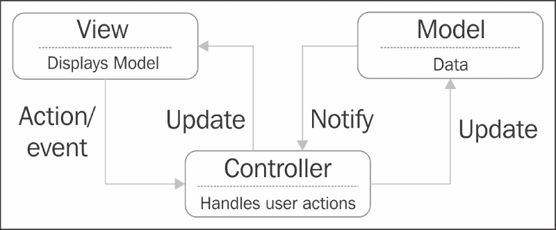
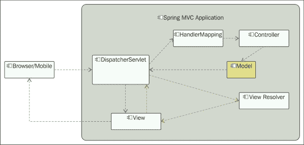
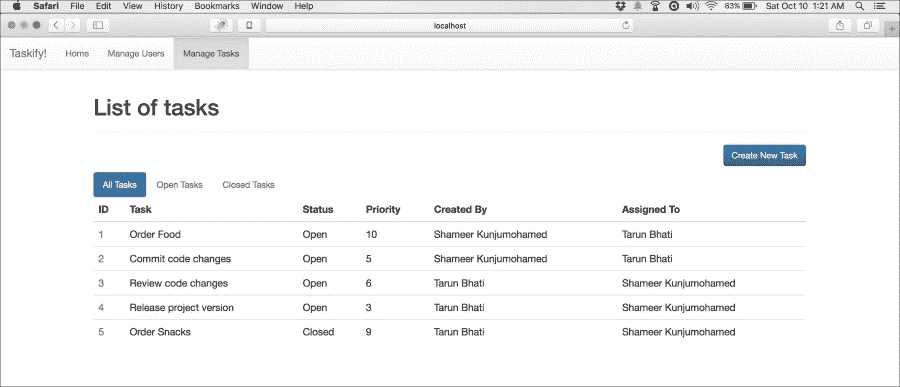

# 第二章用 SpringWebMVC 构建 Web 层

Web 应用程序开发是企业系统的一个主要关注领域。在这个云和大数据时代，web 应用程序承受着巨大的负载，越来越多的并发用户通过手机、平板电脑以及传统桌面 web 浏览器等多种设备访问这些应用程序。现代 web 应用程序必须满足一系列较新的非功能需求，如可扩展性、性能、生产效率、响应能力和多设备支持。

SpringMVC 是 Spring 的一个 web 框架，从一开始就完美地构建，以解决现代 web 应用程序的问题。SpringMVC 是一个轻量级、高性能的 web 框架，它的设计初衷是高效、灵活，并可适应多种视图技术。它位于强大的 Spring 框架之上，可以很好地与所有 JavaEE 技术和其他开源框架集成。与 Spring 产品组合中的任何技术一样，SpringMVC 也通过一组定义良好的注释、名称空间 XML 标记和 web 支持组件来促进 POJO 编程。

本章向您介绍 SpringMVC 及其强大功能，描述如何设置它，并通过相关示例指导您了解其高级用法、配置和优化。为了简单起见，我们在这些示例中主要使用注释。在本章的最后，您将能够使用 SpringMVC 构建 web 应用程序，这些应用程序具有基于 HTML 的用户界面以及 JSON 和 XML 格式的 RESTfulAPI。

# Spring MVC 的特点

与竞争对手的 web 技术相比，Spring MVC 捆绑了一系列引人注目的功能和优势。了解这些将帮助您根据自己的需求选择 SpringMVC。以下列表涵盖了其中的大部分：

*   利用 Spring 和其他开放源代码库的强大功能，实现与 Spring 框架的简单配置和本机集成
*   构建在 JavaWeb 技术（如 Servlet、JSP 和 JSTL）之上，可以部署到任何标准 Servlet 容器（如 Tomcat）中
*   基于**模型-视图-控制器**（**MVC**架构模式）实现，使用简单注释和名称空间 XML 标记清晰地分离关注点
*   明确支持 MVC 组件的约定优先于配置
*   支持大量的视图技术，如 JSP、Thymeleaf、Handlebar、Velocity、FreeMarker、PDF、Excel 和 JasperReports
*   声明性输入验证、数据绑定和异常处理
*   灵活的 URL 映射，可自动将请求和响应转换为各种格式，如 JSON、XML 和 HTML
*   支持非阻塞异步请求处理和 HTTP 流
*   支持国际化、主题和多部分文件上载
*   与 Spring 安全性和彻底的可测试性轻松集成
*   HTTP 缓存可提高性能
*   一个简单但功能强大的 JSP 标记库

使 SpringMVC 突出的是其简单的编程模型，这是从核心 Spring 框架本身继承下来的特性。熟悉任何标准 web 框架的开发人员都会发现 SpringMVC 非常熟悉且易于学习。

# 模型-视图-控制器模式

MVC 是一种成熟的架构模式，广泛用于构建交互式 web 和桌面应用程序。在大多数软件平台中，有许多框架实现这种模式。MVC 将应用程序划分为三个实际表示层的核心元素，分离这三个核心元素之间的关注点，并定义它们之间的通信方式。



**模型**表示数据，**视图**显示**模型**，**控制器**处理用户动作。模型可以是任何数据，包括存储在数据库中的数据。它通常表示域对象的集合，这些对象之间具有明确定义的关系。根据应用程序的设计方式，**模型**可以在多个视图中显示。

**控制器**在**视图**和**模型**之间起中介作用。它通常为用户与视图交互时视图生成的每个事件提供一组处理程序。**控制器**将用户操作委托给适当的处理程序，然后最终重定向到另一个视图以显示该操作的结果。

MVC 模式的实现如此之多，因为跨技术平台的框架以不同的方式使用它。SpringMVC 以最简单、侵入性最小的方式实现了它，同时自然地将它与核心 Spring 框架集成在一起。

# 您的第一个 Spring MVC 应用程序

让我们跳到创建一个非常简单的 Spring MVC web 应用程序。为了便于学习，我们将开发*Taskify*的网络版，这是我们在[第一章](01.html#aid-BE6O1 "Chapter 1. Getting Started with Spring Core")、*Spring Core 入门*中启动的任务管理系统。本章中的示例使用**Spring 工具套件**（**STS**作为 IDE，但您可以使用自己喜欢的 IDE，如 IntelliJ 和 NetBeans。几乎所有 JavaIDE 都支持 Spring 开发；他们中的大多数都有插件来管理 Spring 项目和工件。

首先，遵循以下步骤；然后，我们将探索代码：

1.  开放式 STS 或 Eclipse→ 创建新项目→ 键入项目名称→ 选择一个模板**Spring MVC 项目**或**Simple Spring Web Maven**→ 指定顶级包名称→ 完成将生成您的项目结构。
2.  确保您的`pom.xml`文件包含`spring-context`、`spring-mvc`、`servlet-api`、`jsp-api`和`jstl`库的 Maven 依赖项。请注意，`jsp-api`和`jstl`仅当您使用 JSP 作为视图技术时才是必需的。
3.  若尚未生成，则在`WEB-INF`下创建`web.xml`，内容如下：

    ```
    <?xml version="1.0" encoding="UTF-8"?>
    <web-app 
      xmlns:xsi="http://www.w3.org/2001/XMLSchema-instance"
      xsi:schemaLocation="http://xmlns.jcp.org/xml/ns/javaee
      http://xmlns.jcp.org/xml/ns/javaee/web-app_3_1.xsd" version="3.1">
    <!-- \ Root Container shared by Servlets and Filters -->
      <context-param>
        <param-name>contextConfigLocation</param-name>
        <param-value>/WEB-INF/spring/root-context.xml</param-value>
      </context-param>

    <!-- Loads Spring Container shared by all Servlets and Filters -->
      <listener>
        <listener-class>
          org.springframework.web.context.ContextLoaderListener
        </listener-class>
      </listener>

      <!-- Processes application requests -->
      <servlet>
        <servlet-name>appServlet</servlet-name>
        <servlet-class>
          org.springframework.web.servlet.DispatcherServlet
        </servlet-class>
        <init-param>
          <param-name>contextConfigLocation</param-name>
          <param-value>/WEB-INF/spring/servlet-context.xml</param-value>
        </init-param>
        <load-on-startup>1</load-on-startup>
      </servlet>

      <servlet-mapping>
        <servlet-name>appServlet</servlet-name>
        <url-pattern>/</url-pattern>
      </servlet-mapping>
    </web-app>
    ```

4.  如果尚未生成，则创建一个`root-context.xml`文件，内容如下：

    ```
    <?xml version="1.0" encoding="UTF-8"?>
    <beans 
      xmlns:xsi="http://www.w3.org/2001/XMLSchema-instance"
      xsi:schemaLocation="http://www.springframework.org/schema/beans http://www.springframework.org/schema/beans/spring-beans.xsd">

      <!-- Root Context: defines all shared beans go here -->
    </beans>
    ```

5.  如果尚未生成，则创建一个`servlet-context.xml`文件，内容如下：

    ```
    <?xml version="1.0" encoding="UTF-8"?>
    <beans:beans  ...>

      <!-- Enables the Spring MVC @Controller programming model -->
      <annotation-driven />
      <context:component-scan base package="com.taskify"/>

      <!-- Handles HTTP GET requests for /resources/** by serving up static resources in ${webappRoot}/resources directory -->
      <resources mapping="/resources/**" location="/resources/" />

      <!-- Resolves views selected for rendering by @Controllers to
          .jsp resources in the /WEB-INF/views directory -->
      <beans:bean class=
      "org.springframework.web.servlet.view.InternalResourceViewResolver">
        <beans:property name="prefix" value="/WEB-INF/views/" />
        <beans:property name="suffix" value=".jsp" />
      </beans:bean>
    </beans:beans>
    ```

6.  现在，在包`com.taskify.web.controllers`下创建一个 Java 类`HomeController`，其内容如下：

    ```
    @Controller
    public class HomeController {
      private static final Logger logger = LoggerFactory.getLogger(HomeController.class);
      @Autowired
      private TaskService taskService;
      // Simply selects the home view to render by returning // name.
      @RequestMapping(value = "/", method = RequestMethod.GET)
      public String home(Locale locale, Model model) {
        logger.info("Welcome to Taskify! Locale is {}.", locale);
        model.addAttribute("totalTasks",
        taskService.findAllTasksCount() );
        model.addAttribute("totalOpenTasks", taskService.findAllOpenTasksCount() );
        return "home";
      }
    }
    ```

7.  在`~WEB-INF/views`下创建一个 JSP 视图`home.jsp`，内容如下：

    ```
    <%@ taglib uri="http://java.sun.com/jsp/jstl/core" prefix="c"%>
    <%@ page session="false"%>
    <html>
      <head>
        <jsp:include page="/WEB-INF/views/theme.jsp"></jsp:include>
        <title>Taskify :: Home</title>
      </head>
      <body>
        <jsp:include page="/WEB-INF/views/navbar.jsp"></jsp:include>
        <div class="container">
          <h1>Welcome to Taskify!</h1><hr />
          <P>There are ${totalOpenTasks}(${totalTasks}) open tasks.</P>
        </div>
      </body>
    </html>
    ```

8.  确保您有`TaskService`类（从[第一章](01.html#aid-BE6O1 "Chapter 1. Getting Started with Spring Core")复制过来，*开始使用 Spring Core*及其在您的项目中的具体实施，并实施了`findAllTasksCount()`和`findAllOpenTasksCount()`方法。
9.  现在您的项目已经准备好了，请确保您已经安装了 ApacheTomcat（或任何其他）服务器，并使用 IDE 进行了配置。您可以从[下载 Tomcathttp://tomcat.apache.org/](http://tomcat.apache.org/) 并安装在您的电脑上。
10.  STS 和 Eclipse 允许您只需右键单击**以**运行即可从 IDE 运行 Java web 应用程序→ **在服务器**上运行。解决所有错误（如果有），然后重新运行。
11.  You should see the home screen of your web app (at `http://localhost:8080/chapter2/`), as seen here:

    

# 设置 Spring MVC 应用程序

让我们通过分析上一节*您的第一个 Spring MVC 应用程序*中列出的应用程序构件来说明如何配置 Spring MVC web 应用程序。它包含构建 SpringMVCWeb 应用程序所需的所有构件。

## Spring MVC 应用程序的项目结构

创建项目结构和必要工件的最简单方法是使用 STS 创建 SpringMVC 项目，如前一节所述。或者，您可以使用各种在线存储库中提供的 Maven 原型之一。STS 使用这样一个捆绑的原型。以下是在 STS 中查看的 Spring MVC 应用程序的典型项目结构：


此结构表示单个 WAR web 应用程序，其中所有服务和数据访问组件都与 web 控制器并置。对于更大的应用程序，许多这样的组件可能是不同 JAR 库项目的一部分，在多个 web 应用程序之间共享，然后作为 Maven 依赖项添加到使用`<import/>`标记或注释配置导入 web 应用程序上下文 XML 文件的消费 web 应用程序和 bean 中。

现在，让我们详细检查*您的第一个 Spring MVC 应用程序*中列出的每个工件。

## web.xml 文件–使 web 应用程序具有弹性

`web.xml`文件是标准 Java web 描述符，其中构成 Java web 应用程序的基本 web 组件注册到 Servlet 容器中。这里配置了`ServletContextListener`和`ServletFilter`组件。

`web.xml`中还配置并引导了一个 Spring MVC 应用程序。`ContextLoaderListener`，在`web.xml`样本中注册为`ServletContextListener`，引导 Spring 的根`WebApplicationContext`。在上一章中，我们看到了一个简单的控制台应用程序如何使用`ClassPathXmlApplicationContext`从主方法内部引导 Spring 上下文。对于 web 应用程序，在`ContextLoaderListener`之后加载`WebApplicationContext`。请记住，SpringMVC 应用程序不仅仅是另一个基于 Servlet 的应用程序，而是集成在 web 上下文中的 Spring。

```
   <listener>
      <listener-class>
         org.springframework.web.context.ContextLoaderListener
      </listener-class>
   </listener>
```

下面的侦听器查找一个`context-param`标记`contextConfigLocation`，它是 Spring 根 bean 定义 XML 文件的位置，如前面的`web.xml`文件所示：

```
<context-param>
   <param-name>contextConfigLocation</param-name>
   <param-value>/WEB-INF/spring/root-context.xml</param-value>
</context-param>
```

`web.xml`文件中配置的下一个非常重要的 Spring 组件是`DispatcherServlet`，它是 Spring MVC 应用程序的集中入口点，将每个请求映射到适当的处理程序。`DispatcherServlet`是前端控制器设计模式的一种实现，它是进入应用程序的所有 HTTP 请求的单一、集中的入口点。这会在内部将它们委托给请求类型的实际处理程序。以下是先前`web.xml`清单的摘录：

```
<servlet>
   <servlet-name>appServlet</servlet-name>
   <servlet-class>
      org.springframework.web.servlet.DispatcherServlet
   </servlet-class>
   <init-param>
      <param-name>contextConfigLocation</param-name>
      <param-value>
         /WEB-INF/spring/appServlet/servlet-context.xml
      </param-value>
   </init-param>
   <load-on-startup>1</load-on-startup>
</servlet>

<servlet-mapping>
   <servlet-name>appServlet</servlet-name>
   <url-pattern>/</url-pattern>
</servlet-mapping>
```

`DispatcherServlet`前面的 Servlet 注册将根 URL 映射到`DispatcherServlet`，这样进入服务器的每个 HTTP 请求都将首先由`DispatcherServlet`处理。此外，它还指定此 Servlet 的 Spring 应用程序上下文文件的位置。

### 注

您的应用程序可以有任意数量的具有唯一 Servlet 名称的`DispatcherServlet`定义，具体取决于您希望如何根据功能模块逻辑划分 URL 子文本。大多数应用程序只定义了一个`DispatcherServlet`。

## Spring MVC 应用程序中的 ApplicationContext 文件

Spring MVC 应用程序只不过是一个基于 Servlet 的 Web MVC 实现，与 Spring 本机集成。因此，它需要像任何其他 Spring 应用程序一样的 Springbean 定义，正如我们在上一章中看到的那样。对于 SpringMVC 应用程序，除了在上下文中注册的特定于应用程序的 bean 之外，还会有一些特定于框架的 bean。

为了在不同的逻辑类别下组织 bean，例如特定于 web 的（`DispatcherServlet`以及共享 bean，可以使用多个 bean 定义。例如，`DispatcherServlet`可以有自己的应用程序上下文文件，其中 bean 有助于其处理（仅用于 web 上下文），并且可以有一个根应用程序上下文文件，其中定义了不特定于 web 层但在多个层之间共享的 bean。

在前面部分中列出的作为*您的第一个 Spring MVC 应用程序*的一部分的示例中，您可以看到两个 Spring bean 定义 XML 文件`root-context.xml`和`servlet-context.xml`。`root-context.xml`文件表示通过`ContextLoaderListener`加载的根目录`WebApplicationContext`。这是定义或导入共享 bean（如服务 bean）和数据访问对象的地方。

启动时由`DispatcherServlet`加载`servlet-context.xml`文件。文件名`servlet-context.xml`是示例列表中给出的显式文件名。默认情况下，`DispatcherServlet`查找模式为`[servlet-name]-servlet.xml`的 XML bean 定义文件，也就是说，如果没有明确指定，`appServlet`将在`WEB-INF`文件夹的根目录下查找名为`appServlet-servlet.xml`的文件。通常，此文件包含控制此 Servlet 行为的 bean 定义。例如，您可以在文件`servlet-context.xml`中查看资源和查看解析器 bean 定义。您可以看到，示例清单中配置的视图解析器只支持 JSP 视图。

## HomeController–@主屏幕控制器

`HomeController`是一个带有`@Controller`注释的简单 POJO。此注释将其注册为 web 控制器，其中包含一组带注释的处理程序方法。它可以在类级别上有一个`@RequestMapping`注释，以指示其中所有处理程序方法的根 URL。方法`home()`是根 URL`http://<context-root>/`的请求处理程序。

由于`@Controller`注释是另一个 Springbean，因此可以将任何其他 bean 作为依赖项注入其中。示例列表显示`HomeController`与`TaskService`具有自动关联的依赖关系。在`home()`方法中，调用`TaskService`方法，最后，返回值被设置为`Model`属性，用于消耗请求的后面部分并在视图中使用。

您的应用程序将有许多这样的控制器，为相关 URL 端点组提供服务；把 Endot0 作为你的基本例子。一个控制器可以有多个为不同 URL 提供服务的请求处理方法。

## home.jsp 文件–登录屏幕

`home.jsp`文件是根（`/`URL）的视图工件。请注意`Model`属性是如何在 JSP 视图中绑定的：

```
<P>There are ${totalOpenTasks}(${totalTasks}) open tasks.</P>
```

## 处理传入请求

点击应用程序根 URL 的任何请求首先由`DispatcherServlet`接收，并将其委托给`HomeController.home()`，后者处理该请求并返回视图名称（在本例中为`home`。`DispatcherServlet`然后根据`servlet-context.xml`中指定的资源和视图配置拾取`home.jsp`文件并进行渲染，传递`HomeController.home()`中创建的模型实例的属性。

# Spring MVC 的体系结构和组件

在浏览了您的第一个 Spring MVC 应用程序之后，现在是从体系结构的角度来看 Spring MVC 应用程序的时候了：



SpringMVC 组件

顾名思义，SpringMVC 遵循著名的 MVC 架构模式。该模式通过将责任划分为三个主要角色来确保关注点的分离：

*   **模型**：表示数据和业务逻辑
*   **视图**：表示呈现
*   **控制器**：处理客户端请求并将其委托给视图，以便渲染回客户端

我们这里讨论的**模型**不一定是持久数据（数据模型）；相反，它表示在客户端和服务器应用程序的不同层之间来回传递的信息，这些层构成了任何系统的构建块。

除了**模型**、**视图**和**控制器**组件之外，`DispatcherServlet`在 Spring MVC 架构中也起着至关重要的作用。它充当前端控制器，这是许多 MVC 框架采用的流行 J2EE 设计模式。事实上，`DispatcherServlet`不仅仅是一个前端控制器。下一节将对此进行详细解释。

在 SpringMVC 应用程序中，`DispatcherServlet`首先接收到一个客户端请求，该请求通过带有 URL 的 HTTP 到达服务器。在`HandlerMapping`配置的帮助下，`DipatcherServlet`根据 URL 模式为请求找到合适的**控制器**方法，并将请求委托给它。控制器处理请求，可选地填写**模型**对象，并返回要渲染的**视图**的名称。`DispatcherServlet`然后拾取**视图**并将**模型**的属性应用于**视图**中的占位符后，将其渲染回客户端。

前面提到的只是 SpringMVC 的典型请求处理流程。但是，它非常灵活，有很多选项支持不同类型的视图技术以及输入和输出结构和格式，包括文件、流等。我们将在以下各节中对其进行更多探讨。

# 调度员服务说明

`DispatcherServlet`是通往任何 Spring MVC 应用程序的网关。继承自`javax.servlet.http.HttpServlet`，通常在`web.xml`文件中以声明方式配置。虽然可以使用独特的 URL 模式对`DispatcherServlet`进行多个定义，但大多数 Spring MVC 应用程序只有一个带有`context-root`URL（`/`的`DispatcherServlet`，也就是说，所有到达该域的请求都将由`DispatcherServlet`处理。

从 Servlet 3.0 开始，除了在`web.xml`文件中进行声明性配置外，还可以通过实现或扩展 Spring 提供的这三个支持类中的任何一个，以编程方式配置`DispatcherServlet`：

*   `WebAppInitializer`接口
*   `AbstractDispatcherServletInitializer`抽象类
*   `AbstractAnnotationConfigDispatcherServletInitializer`抽象类

下面的代码清单演示了如何在应用程序中直接实现`WebAppInitializer`：

```
public class ApplicationInitializer implements WebApplicationInitializer {

  private static final Logger logger = LoggerFactory.getLogger(ApplicationInitializer.class);

  @Override
  public void onStartup(ServletContext servletContext) throws ServletException {

    logger.info("===== Application is starting up! ========");
    XmlWebApplicationContext appContext = new XmlWebApplicationContext();
    appContext.setConfigLocation("/WEB- INF/spring/appServlet/servlet- context.xml");

    ServletRegistration.Dynamic registration = servletContext.addServlet("rootDispatcher", new DispatcherServlet(appContext));
    registration.setLoadOnStartup(1);
    registration.addMapping("/");
  }
```

## WebApplicationContext–用于 Web 的 ApplicationContext

`DispatcherServlet`使用一个名为`WebApplicationContext`的专门`ApplicationContext`，具有许多 web 请求处理功能。它知道与哪一个`ServletContext`相关，并且能够解析主题。该接口具有特定上下文的具体实现，如 XML、`@Configuration`注释类和 Portlet。默认情况下，`DispatcherServlet`使用`XMLWebApplicationContext`。加载`DispatcherServlet`时，它会查找`WebApplicationContext`的 bean 配置文件并对其进行初始化。

`WebApplicationContext`对象是层次化的。每个 Spring MVC 应用程序都有根目录`ApplicationContext`（可通过`web.xml`文件中名为`contextConfigLocation`的`context-param`标记进行配置），每个 Servlet，包括`DispatcherServlet`都有自己的子上下文（可通过自己的`init-param`、`contextConfigLocation`进行配置）。理想情况下，特定于 Servlet 的子上下文具有定制该 Servlet 的 bean，而 root`ApplicationContext`具有所有共享 bean。

## 支持 DispatcherServlet 的 bean 及其角色

在接收到 web 请求后，`DispatcherServlet`在一组支持 bean 的帮助下，按照顺序执行一组操作，作为请求处理的一部分。此表列出了这些特殊 bean 及其职责：

<colgroup><col> <col></colgroup> 
| 

豆

 | 

责任

 |
| --- | --- |
| `HandlerMapping` | 将传入的 web 请求映射到处理程序和前后处理程序 |
| `HandlerAdapter` | 调用处理程序，该处理程序解析参数和依赖项，例如 URL 映射控制器方法终结点的注释参数 |
| `HandlerExceptionResolver` | 允许对异常进行编程处理，并将异常映射到视图 |
| `ViewResolver` | 将逻辑视图名称解析为视图实例 |
| `LocaleResolver` | 解析客户端的区域设置以启用国际化 |
| `LocaleContextResolver` | `LocaleResolver`的更丰富的扩展，带有时区信息 |
| `ThemeResolver` | 解析应用程序中配置的主题，以增强用户体验 |
| `MultipartResolver` | 作为 HTTP 请求的一部分处理多部分文件上载 |
| `FlashMapManager` | 管理 FlashMap 实例，这些实例在相互重定向的请求之间存储临时闪存属性 |

`DispatcherServlet`非常灵活；我们甚至可以为所有这些 bean 创建和配置自定义实现。然而，SpringMVC 默认提供了一组不错的实现，因此您不需要定制或提供自己的实现，除非绝对需要。这些默认实现可以在`org.springframework.web.servlet.DispatcherServlet.properties`中找到。如果您使用这些 bean 中任何一个的自己实现来覆盖它们，您的 bean 将覆盖默认值。

# 详细说明控制器

控制器使用及其带有`@RequestMapping`注释的方法处理 web 请求。它们接受多种形式的输入数据，并将其转换为`Model`属性，供视图使用，并显示回客户端。它们将用户连接到服务层 bean，在这里定义应用程序行为。

Spring MVC 中的控制器具有以下签名：

```
public interface Controller {

   ModelAndView handleRequest(HttpServletRequest request, HttpServletResponse response) throws Exception;
}
```

控制器设计为接口，允许您创建任何类型的实现。从 SpringVersion2.5 开始，您只需用`@Controller`注释任何类，就可以将其转换为控制器。它使您无需实现任何特定接口或扩展特定于框架的类：

```
@Controller
public class HomeController {

   @RequestMapping(value = "/", method = RequestMethod.GET)
   public String home(Model model) {
      logger.info("Welcome to Taskify", locale);
      return "home";
   }
}
```

`@Controller`注释将控制器的角色分配给给定的类。如果启用组件扫描，Spring MVC 应用程序将自动检测其类路径中的所有控制器，并将其注册到`WebApplicationContext`，如下所示：

```
<context:component-scan base-package="com.taskify" />
```

`@Controller`、`@RequestMapping`和一组其他注释构成了 Spring MVC 的基础。这些注释允许为控制器提供灵活的方法名称和签名。我们将在下一节详细探讨它们。

## 使用@RequestMapping 映射请求 URL

`@RequestMapping`注释将请求 URL 映射到整个`@Controller`类或其处理程序方法上。它可以应用于类和方法级别。通常，您应用类级别的`@RequestMapping`注释来映射一组相关 URL，例如一个包含许多操作的表单，并应用方法级别的`@RequestMapping`注释来映射特定操作，例如创建、读取、更新、删除、上载和下载。让我们来看一个典型的基于表单的控制器，它具有纯 REST 模型中的各种动作（AutoT4，Po.T5A.，To.T6，和 Ty7 T7）：

```
@Controller
@RequestMapping("/users")
public class UserController {

   @Autowired
   private UserService userService;

   @RequestMapping(method = RequestMethod.GET)
   public String listAllUsers(Locale locale, Model model) {
      model.addAttribute("users", userService.findAllUsers());
      return "user/list";
   }

   @RequestMapping(path = "/new", method = RequestMethod.GET)
   public String newUserForm(Model model) {
      User user = new User();
      user.setDateOfBirth(new Date());
      model.addAttribute("user", user);
      return "user/new";
   }

   @RequestMapping(path = "/new", method = RequestMethod.POST)
   public String saveNewUser(@ModelAttribute("user") User user, Model model) {
      userService.createNewUser(user);
      return "redirect:/user";
   }
   @RequestMapping(path = "/{id}", method = RequestMethod.GET)
   public ModelAndView viewUser(@PathVariable("id") Long id) {
      return new ModelAndView("user/view").addObject("user", userService.findById(id));
   }

   @RequestMapping(path = "/{id}/edit", method = RequestMethod.GET)
   public String editUser(@PathVariable("id") Long id, Model model) {
      model.addAttribute("user", userService.findById(id));
      return "user/edit";
   }

   @RequestMapping(path = "/{id}", method = RequestMethod.PUT)
   public String updateUser(@PathVariable("id") Long id, @ModelAttribute("user") User user, Model model) {
      userService.updateUser(user);
      model.addAttribute("user", userService.findById(user.getId()));
      return "redirect:/user/" + id;
   }

   @RequestMapping(path = "/{id}", method = RequestMethod.DELETE)
   public String deleteUser(@PathVariable("id") Long id, Model model) {
      User existingUser = userService.findById(id);
      userService.deleteUser(existingUser);
      return "redirect:/user";
   }
}
```

前面代码中列出的`UserController`具有一些方法，这些方法在`UserService`的帮助下充当表示用户实体上 CRUD 操作的 URL 的请求处理程序，该 URL 作为依赖项注入控制器。由于此控制器基于 web 视图，因此处理程序方法填充模型并返回视图名称或`ModelAndView`对象以供进一步显示。最后两个处理程序方法`updateUser()`和`deleteUser()`在末尾重定向请求。它们在将响应返回到客户端后执行 URL 重定向。

请注意`UserController`有一个根 URL（`/user`），处理程序方法与 HTTP 方法的组合有一个更窄的映射。它们由下表中显示的确切 URL 调用：

<colgroup><col> <col> <col> <col></colgroup> 
| 

统一资源定位地址

 | 

处理程序方法

 | 

HTTP 方法

 | 

匹配 URL（示例）

 |
| --- | --- | --- | --- |
| `/` | `listAllUsers` | `GET` | `http://localhost:8080/user` |
| `/new` | `newuserForm` | `GET` | `http://localhost:8080/user/new` |
| `/new` | `saveNewUser` | `POST` | `http://localhost:8080/user/new` |
| `/{id}` | `viewUser` | `GET` | `http://localhost:8080/user/123` |
| `/{id}/edit` | `editUser` | `GET` | `http://localhost:8080/user/123/edit` |
| `/{id}` | `updateUser` | `PUT` | `http://localhost:8080/user/123` |
| `/{id}` | `deleteUser` | `DELETE` | `http://localhost:8080/user/123` |

默认情况下支持 HTTP 方法`GET`和`POST`，这与其他两种方法的有限 HTML（因此浏览器）支持一致。但是，为了使`PUT`和`DELETE`有效，您需要在您的`web.xml`文件中注册`HiddenHttpMethodFilter`。使用此代码：

```
<filter>
   <filter-name>httpMethodFilter</filter-name>
   <filter-class>org.springframework.web.filter. HiddenHttpMethodFilter</filter-class>
</filter>

<filter-mapping>
   <filter-name>httpMethodFilter</filter-name>
   <servlet-name>rootDispatcher</servlet-name>
</filter-mapping>
```

`HiddenHttpMethodFilter`即使没有弹簧 MVC 也能工作；您可以将它用于任何 JavaWeb 框架，甚至是普通的 Servlet 应用程序。

## 带有@PathVariable 注释的 URI 模板模式

在前面代码中的示例`UserController`列表中，您可能已经注意到，在处理请求时，模板 URL 模式中的变量名被值替换。例如，请参见：

```
@RequestMapping(path = "/{id}/edit", method = RequestMethod.GET)
public String editUser(@PathVariable("id") Long id, Model mdl) { … }
```

这里，模板化变量`id`映射到`@PathVariable`注释。它被括在大括号内，并被注释为映射的方法参数。URL 可以有任意数量的路径变量。它们支持 ApacheAnt 样式的正则表达式和路径模式。它们帮助您在经典的 REST 模型中构建完美的 URI 端点。

## 使用@RequestParam 注释绑定参数

与 URI 字符串内联的请求参数可以使用`@RequestParam`注释与方法参数进行映射。参见`TaskController`的以下摘录：

```
@Controller
public class TaskController {
...
   @RequestMapping(path = "/tasks", method = RequestMethod.GET)
   public String list(@RequestParam(name = "status", required = false) String status, Model model) {
      model.addAttribute("status", status);
      model.addAttribute("tasks", taskService.findAllTasks(status));
      return "task/list";
   }
...
}
```

调用上述处理程序的典型 URL 是`http:<context-root>/tasks?status=Open`。

`@RequestParam`有四个属性：`name`、`required`、`value`和`defaultValue`。虽然`name`是一个强制属性，但所有其他属性都是可选的。默认情况下，所有请求参数都需要设置为`true`，除非您指定为`false`。`@RequestParam`的值由弹簧自动转换为参数类型。

## 请求处理程序方法参数

`@RequestMapping`方法可以有灵活的方法签名；支持框架、自定义对象和注释的混合。在请求处理过程中，如果发现它们是方法参数，则会自动注入它们。下面是一些受支持的框架类和注释的列表；完整列表请参考 Spring 官方文档或`RequestMapping`的 Javadoc。

<colgroup><col> <col></colgroup> 
| 

支持类

 | 

注释

 |
| --- | --- |
| `javax.servlet.ServletRequest` | `@PathVariable` |
| `javax.servlet.ServletRequest` | `@RequestVariable` |
| `javax.servlet.http.HttpSession` | `@RequestParam` |
| `org.springframework.ui.Model` | `@RequestHeader` |
| `org.springframework.validation.BindingResult` | `@RequestBody` |
| `Java.util.Map` | `@RequestPart` |
| `Java.io.InputStream` | `@InitBinder` |

虽然框架类不需要任何特定的注释，但为了将传入的 web 请求对象转换/格式化为类实例，定制类通常需要伴随处理程序适配器支持的注释之一。

## 请求处理程序方法返回类型

与灵活的参数类型类似，`@RequestMapping`注释的方法可以具有自定义类型（通常注释为`@ResponseBody`或许多受支持的框架类之一）。以下列表包含许多受支持的类型中的一些：

*   `org.springframework.web.servlet.ModelAndView`
*   `org.springframework.ui.Model`
*   `java.util.Map`
*   `org.springframework.web.servlet.View`
*   `java.lang.String`
*   `void`
*   `java.util.concurrent.Callable<?>`
*   `org.springframework.http.HttpEntity`

## 设置模型属性

`Model`属性用于使用视图进行显示并与表单元素绑定。可以在控制器和处理程序方法级别设置它们。

任何具有非 void 返回类型的方法都可以注释为`@ModelAttribute`，以使该方法返回类型成为声明的控制器解析的所有视图的`Model`属性。请参见一个示例：

```
@ModelAttribute(value = "users")
public List<User> getUsersList() {
   return userService.findAllUsers();
}
```

特定于视图的模型属性在解析视图的处理程序方法内设置。以下是一个例子：

```
@RequestMapping(path = "/tasks/new", method = RequestMethod.GET)
public String newTaskForm(Model model) {
   model.addAttribute("task", new Task());
   return "task/new";
}
```

## 为 JSON 和 XML 媒体构建 RESTful 服务

web 应用程序通常需要将其某些服务公开为具有 XML 或 JSON 数据格式的 web API，或两者兼有，以便使用来自浏览器以及其他设备（如移动设备和平板电脑）的 AJAX 请求。

**代表性状态转移**（**REST**），是一种建立的架构风格，用于构建与本机 web 协议和方法一致的 web API。使用 REST，数据被表示为可以通过 HTTP 的无状态协议使用 URI 访问和操作的资源。REST 坚持使用 HTTP 方法`POST`、`GET`、`PUT`和`DELETE`分别映射资源周围的创建、读取、更新和删除操作（CRUD）。

SpringMVC 使构建使用和生成不同媒体类型（如文本、JSON 和 XML）的简单 API 端点变得极其容易。`@Controller`注释中的请求处理程序方法可以通过以下两个步骤接受 JSON、XML 或任何其他媒体类型：

1.  在`RequestMapping`方法中将属性`consumes`设置为适当的媒体类型，例如`consumes = {"text/plain", "application/json"})`。
2.  用`@RequestBody`注释所需类型的方法参数。web 请求应包含步骤 1 中提到的格式的数据（`consumes`；JSON、XML 等），并在处理过程中由`HttpMessageConverter`解析为该类型。

类似地，请求处理程序方法可以使用以下两个步骤生成 JSON、XML 或任何其他媒体类型：

1.  在`RequestMapping`方法中使用适当的媒体类型设置属性`produces`，例如`consumes = {"text/plain", "application/json"})`。
2.  用`@ResponseBody`注释处理程序方法的返回类型或方法声明本身（在`@RequestMapping`旁边）。处理程序将返回值转换为`RequestMapping`的`produces`属性中指定的数据格式。

`RequestMapping`的`consumes`和`produces`属性将主映射缩小到给定的媒体类型（例如`consumes = "application/xml"`）或一系列媒体类型（例如`consumes = {"text/plain", "application/json"}`）。

除属性外，确保`pom.xml`文件中存在以下库：

```
<dependency>
   <groupId>com.fasterxml.jackson.core</groupId>
   <artifactId>jackson-databind</artifactId>
   <version>2.6.2</version>
</dependency>
```

下面是一个示例处理程序方法，它接受 JSON 请求并返回 JSON 响应：

```
@RequestMapping(path = "/tasks/new.json", method=RequestMethod.POST, consumes = "application/json", produces = "application/json")
@ResponseBody
public CreateTaskResponse createNewTaskJSON(@RequestBody CreateTaskRequest createRequest) {
   Task task = new Task();
   task.setName(createRequest.getTaskName());
   ...
   return new CreateTaskResponse(taskService.createTask(task));
}
```

此处理程序方法需要包含 JSON 内容的 web 请求：

```
{
   "taskName":"Project estimation",
   "priority": 2,
   "creatorId": 1,
   "assigneeId": 2,
   "comments": "Involve the team in the process"
}
```

现在，可以稍微修改相同的方法，以支持 XML 内容`consumes`和`produces`。请看以下列表：

```
@RequestMapping(path = "/tasks/new.xml", method = RequestMethod.POST, consumes = "application/xml", produces = "application/xml")
@ResponseBody
public CreateTaskResponse createNewTaskXML(@RequestBody CreateTaskRequest createRequest) {
   Task task = new Task()
   task.setName(createRequest.getTaskName());
   . . .
   return new CreateTaskResponse(taskService.createTask(task));
}
```

确保在`RequestBody`和`ResponseBody`类型的根目录下都有 JAXB 注释`@XmlRootElement`（本例中为`CreateTaskRequest`和`CreateTaskResponse`。

您可以通过将以下内容与 web 请求一起发送到处理程序 URI 来调用前面的 XML 处理程序：

```
<CreateTaskRequest>
   <taskName>Estimate the project</taskName>
   <priority>2</priority>
   <creatorId>1</creatorId>
   <assigneeId>2</assigneeId>
   <comments>Involve the team in the process</comments>
</CreateTaskRequest>
```

## 使用 RestController 构建 RESTful 服务

`RestController`是一个方便的原型，用于构建 REST API 端点，该端点服务于自定义媒体类型，如 JSON 或 XML。它结合了`@Controller`和`@ResponseBody`，即不需要在处理程序方法中注释`@ResponseBody`。`@RequestMapping`方法默认采用`@ResponseBody`语义。

让我们看看 JSON 处理程序方法在成为`@RestController`注释的一部分时的样子：

```
@RestController
public class TaskRestController {
   . . .
  @RequestMapping(path="/api/tasks/new.json", method=RequestMethod.POST, consumes="application/json",produces= "application/json")
  public CreateTaskResponse createNewTaskJSON(@RequestBody CreateTaskRequest createRequest) {
    Task task = new Task();
    task.setName(createRequest.getTaskName());
    . . .
    return new CreateTaskResponse(taskService.createTask(task));
  }}
}
```

请注意，映射中唯一的区别是缺少的`@ResponseBody`注释。在 REST 控制器中定义 REST API 是最佳实践。

# Spring MVC 中的异步请求处理

在 API、AJAX 客户端和设备的时代，web 服务器的流量呈指数级增长。如何使服务器更具可伸缩性是服务器供应商面临的一个持续挑战。传统的**一个 HTTP 连接一个线程**策略不能很好地扩展到更大数量的并发用户访问。在这个模型中，每个请求都会从 Servlet 容器分配的线程池中阻塞一个线程，直到请求被完全处理为止（到目前为止显示的示例都遵循这个模型）。当单个屏幕频繁触发多个并发连接请求的 AJAX 客户端加入具有长时间运行进程的 web 服务器的传统阻塞 I/O 模型时，由于池中没有可用线程，服务器很容易因线程不足而耗尽。这使得应用程序在负载增加时不可用。

异步 HTTP 请求处理是一种利用 Java 平台 NIOAPI 的非阻塞 I/O 功能的技术。在这个模型中，在整个请求处理过程中，服务器线程不会一直连接到持久 HTTP 连接。Servlet 容器在收到请求后立即释放容器线程，并将进一步的处理委托给另一个应用程序（本例中为 Spring）管理的线程，以便容器线程可以自由地处理新的传入请求。这种非阻塞请求处理模型节省了大量服务器资源，并稳步提高了服务器的可伸缩性。

Servlet 3.0 引入了异步处理支持，Spring 从 Spring 3.2 开始实现了这种支持。从 4.2 开始，Spring 提供了两种定义异步请求处理程序的简单方法：

*   返回一个`java.util.concurrent.Callable`实例而不是一个值，并在`Callable`的`call`方法中生成实际的返回值表单，即由 Spring 管理的线程，而不是 Servlet 容器
*   返回特定于 Spring 的`DeferredResult`类型的实例，并在任何其他线程或外部事件（如 JMS 或 Quartz 调度程序）内生成实际返回值表单

这两种方法都会尽早释放容器线程，并使用外部线程异步地继续长时间运行的事务。我们来看第一个选项的示例，即使用`Callable`：

```
@RequestMapping(path="/tasks/new.xml",method= RequestMethod.POST, consumes = "application/xml", produces = "application/xml")
@ResponseBody
public Callable<CreateTaskResponse> createNewTaskXMLAsyncCallable( @RequestBody CreateTaskRequest createRequest) {
   return new Callable<CreateTaskResponse>() {

      @Override
      public CreateTaskResponse call() throws Exception {
         Task task = new Task();
         task.setName(createRequest.getTaskName());
         . . .
         Task persistedTask = taskService.createTask(task);
         // Send an email here...
         // Send some push notifications here...
         . . .
         return new CreateTaskResponse(persistedTask);
      }
   };
}
```

在这个方法中，您可以看到 handler 方法在收到请求后立即返回`Callable`对象，而无需等待`Callable.call()`方法执行。Spring MVC 在另一个线程中使用`TaskExecutor`调用`call()`方法，一旦`call()`方法返回值，响应就会被发送回 Servlet 容器。

以下是如何使用`DeferredResult`的示例：

```
@RequestMapping(path = "/tasks/new-async-deferred.json", method = RequestMethod.POST, consumes = "application/json", produces = "application/json")
@ResponseBody
public DeferredResult<CreateTaskResponse> createNewTaskJSONAsyncDeferredResult( @RequestBody CreateTaskRequest createRequest) {

   DeferredResult<CreateTaskResponse> defResult = new DeferredResult<>();
   CompletableFuture.runAsync(new Runnable() {
      @Override
      public void run() {
         Task task = new Task();
         task.setName(createRequest.getTaskName());
         . . .
         Task persistedTask = taskService.createTask(task);
         // Send an email here...
         // Send some push notifications here...
         defResult.setResult(newCreateTaskResponse(persistedTask));
      }
   });
   return deferredResult;
}
```

请记住，您必须在`DispatcherServlet`中启用异步处理支持，以及在`web.xml`文件中声明的所有 Servlet 过滤器（或在 JavaConfig 类中定义它们的任何地方）才能正常工作。下面的代码显示了如何在`web.xml`中进行设置：

```
<servlet>
   <servlet-name>appServlet</servlet-name>
   <servlet-class>
      org.springframework.web.servlet.DispatcherServlet</servlet-class>
   . . .
   <async-supported>true</async-supported>
</servlet>
```

您可以根据自己的方便选择上述方法中的任何一种，以启用异步处理。考虑将所有非平凡服务设计为异步工作，以实现高伸缩性和性能。

# 使用视图

Spring MVC 提供了一种非常灵活的视图解析机制，它与 MVC 框架的其他元素完全解耦。它不会强制您使用特定的视图技术；相反，它使您更容易使用自己喜欢的技术。它甚至允许您在视图层混合和匹配多种技术。SpringMVC 为 JPS、XSLT 和 Velocity 视图提供了开箱即用的支持。

## 解决意见

在典型的 SpringMVC 应用程序中，开发人员选择自己选择的视图技术，并相应地使用`ViewResolver`解析使用该技术构建的视图。

负责在 Spring MVC 应用程序中解析视图的组件是`org.springframework.web.servlet.ViewResolver`。它将逻辑视图名称与物理视图资源和所选视图技术进行映射。

控制器的所有请求处理方法必须通过返回视图名称、视图对象或`ModelAndView`对象来解析逻辑视图名称。`org.springframework.web.servlet.View`对象准备`HttpRequest`使用所选的视图技术。

Spring MVC 附带了一套现成的方便视图解析器：

<colgroup><col> <col></colgroup> 
| 

视图分解器

 | 

描述

 |
| --- | --- |
| `AbstractCachingViewResolver` | 这是一个方便的基类，用于`ViewResolver`实现。为了获得更好的性能，它会在解析视图对象后缓存它们。 |
| `XmlViewResolver` | 此使用来自专用 XML 文件的 bean 定义来解析视图定义。该文件由资源位置指定。默认位于`WEB-INF/views.xml`处。 |
| `ResourceBundleViewResolver` | 此使用 bundle basename 指定的`ResourceBundle`中的 bean 定义来定义视图。默认的 basename 为`views.properties`。 |
| `UrlBasedViewResolver` | 此使用匹配 URL 中的物理资源解析视图名称。它的两个支持属性，前缀和后缀，帮助定位资源。 |
| `InternalResourceViewResolver` | 这个使用 JSTL 支持解析 servlet 和 JSP。它是`UrlBasedViewResolver`的一个子类。 |
| `VelocityViewResolver` | 此解析速度模板，是`UrlBasedViewResolver`的子类。 |
| `FreeMarkerViewResolver` | 此解析 FreeMarker 模板。它是`UrlBasedViewResolver`的一个子类。 |
| `JasperReportsViewResolver` | 此解析不同格式的 JasperReport 视图，如 CSV、HTML、XLS 和 XLSX。 |
| `TilesViewResolver` | 此解析版本 2 和版本 3 的平铺视图。 |

本章中的示例应用程序使用`UrlBasedViewResolver`解析 JSP 视图。当在 web 应用程序中使用多视图技术时，可以使用`ResourceBundleViewResolver`。

## 解析 JSP 视图

**Java 服务器页面**（**JSP**）是 Java EE 的主要 web 模板技术，是基于 JVM 快速开发动态 web 内容的简单易用工具。JSP 构建在 Servlet 技术之上，可以直接访问整个 JavaAPI。JSP 允许网页作者以自然 HTML 格式设计网页，然后在 scriptlet 块中嵌入所需的 Java 代码，从而大大简化了网页作者的工作。

**Java 服务器页面标记库**（**JSTL**是一组标准化的 HTML 样式标记，对 JSP 页面非常有用。JSTL 消除了在 JSP 页面中混合 Java 代码的需要，从而使 JSP 页面更干净，更易于编写。

SpringMVC 使用`InternalResourceViewResolver`解析 JSP 页面。在前面的一节*中，您的第一个 Spring MVC 应用程序*，我们已经为 JSP 配置了`ViewResolver`类，如下所示：

```
<beans:bean class="org.springframework.web.servlet.view.InternalResourceViewResolver">
  <beans:property name="prefix" value="/WEB-INF/views/" />
  <beans:property name="suffix" value=".jsp" />
</beans:bean>
```

Spring MVC 建议将您的视图文件（本例中为 JSP）保存在`WEB-INF`目录下，以避免客户端直接访问。`ViewResolver`从物理位置发现视图文件，并在解析后默认缓存这些文件，这有助于提高性能。

## 使用 JSTL 绑定 JSP 页面中的模型属性

视图可以访问关联处理程序方法和控制器中的`Model`属性集。在 JSTL 的帮助下，这些`Model`属性可以在 JSP 视图中显示。在下面的示例中，使用 JSTL 列出了`Model`属性`tasks`：

```
<%@ taglib uri="http://java.sun.com/jsp/jstl/core" prefix="c"%>
...
<table class="table table-hover">
  <thead>
    <tr>
      <th>ID</th>
      <th>Task</th>
      <th>Status</th>
      <th>Priority</th>
      <th>Created By</th>
      <th>Assigned To</th>
    </tr>
  </thead>
  <tbody>
    <c:if test="${not empty tasks}">
      <c:forEach var="task" items="${tasks}">
        <tr>
          <td>
            <a href='<c:url value="/tasks/${task.id}"/>'>${task.id}</a>
          </td>
          <td>${task.name}</td>
          <td>${task.status}</td>
          <td>${task.priority}</td>
          <td>${task.createdBy.name}</td>
          <td>${task.assignee.name}</td>
        </tr>
      </c:forEach>
    </c:if>
  </tbody>
</table>
...
```

您可能已经注意到了`/tasks/list.jsp`视图前面的 JSP 摘录中 JSTL 标记的声明和用法。以下是如何在浏览器中使用适当的样式进行渲染：



# 弹簧和弹簧形式标签库

Spring bundles 一组标签，用于更轻松地编写简单的 JSP 页面和 JSP 表单，分别在`spring.tld`和`spring-form.tld`中定义。`spring.tld`描述 JSP 页面中常用的通用 JSP 标记，如下表所示：

<colgroup><col> <col></colgroup> 
| 

弹簧标签

 | 

描述

 |
| --- | --- |
| `<spring:bind/>` | 这允许对本地声明的 bean 或`Model`属性的绑定路径中给定的属性进行数据绑定，并向包含的主体内容提供`BindStatus`对象。 |
| `<spring:escapeBody/>` | 这将对主体应用 HTML 转义和 JavaScript 转义。 |
| `<spring:hasBindErrors/>` | 如果存在绑定错误，这将提供一个错误实例。 |
| `<spring:htmlEscape/>` | 这将为当前 JSP 页面设置 HTML 转义值。 |
| `<spring:message/>` | 这将显示给定代码的消息，通常从资源包解析。 |
| `<spring:nestedPath/>` | 这会将嵌套路径`ModelAttribute`设置为内部包含的`<spring:bind/>`标记。 |
| `<spring:theme/>` | 这将使用给定的代码加载主题资源。 |
| `<spring:transform/>` | 这将转换`<spring:bind/>`标记内的属性，并将它们导出到给定范围内的变量。 |
| `<spring:url/>` | 这将使用 URI 模板变量创建 URL。它是根据 JSTL`c:url`标记建模的。 |
| `<spring:eval/>` | 这将计算 SpEL 表达式。 |

Spring`form`标记为 HTML 表单提供数据绑定。它们与控制器中的请求处理程序紧密集成。通常，它们表示名称类似的 HTML`form`元素，并共享公共属性：

<colgroup><col> <col></colgroup> 
| 

表单标签

 | 

样品

 |
| --- | --- |
| `<form:input/>` | `<form:input path="name" placeholder="Task Name"/>` |
| `<form:textarea/>` | `<form:textarea path="comments" id="txtComments" rows="5" cols="30" />` |
| `<form:select/>``<form:option/>`及`<form:options/>` | `<form:select path="createdBy" id="selectCreatedBy">``<form:option value="-1" label="Select"/>``<form:options items="${users}" itemValue="id" itemLabel="name" />``</form:select>` |
| `<form:label/>` | `<form:label for="txtTaskName" path="name">Task-names</form:label>` |
| `<form:hidden/>>` | `<form:hidden path="taskId" id="hdnTaskId"/>` |
| `<form:password/>` | `<form:password path="userPassword"/>` |
| `<form:radiobutton/>` | `<form:radiobutton path="sex" value="Male"/>` |
| `<form:radiobuttons/>` | `<form:radiobuttons path="sex" items="${sexOptions}"/>` |
| `<form:checkbox/>` | `<form:checkbox path="task.priority" value="1"/>` |
| `<form:checkboxes/>` | `<form:checkboxes path="task.priority" value="${taskPriorities}"/>` |
| `<form:password/>` | `<form:password path="password" />` |
| `<form:errors/>` | `<form:errors path="createdBy.id" />` |

# 用 JSP 编写表单

Spring 表单可以使用`<spring>`和`<form>`标记在 JSP 页面中组合。为了说明，我们来看看一个 JSP 表单，它同时使用 Spring 和 Form 标签库以及 JSTL。以下是`views/task/new.jsp`的精简版本：

```
<%@ taglib uri="http://java.sun.com/jsp/jstl/core" prefix="c"%>
<%@ taglib prefix="spring" uri="http://www.springframework.org/tags"%>
<%@ taglib prefix="form" uri="http://www.springframework.org/tags/form"%>
...
<form:form action="new" method="post" commandName="task">
  <spring:bind path="name">
    <div class="form-group${status.error ? ' has-error' : ''}">
      <label for="txtTaskName">Task-name</label>
      <form:input path="name" class="form-control" id="txtTaskName" placeholder="Task Name" />
      <form:errors path="name" cssClass="control-label" />
    </div>
  </spring:bind>
  <div class="form-group">
    <label for="txtComments">Comments</label>
    <form:textarea path="comments" class="form-control" id="txtComments" placeholder="Comments" rows="5" cols="30" />
  </div>
  <spring:bind path="createdBy.id">
    <div class="form-group${status.error ? ' has-error' : ''}">
      <label for=" slCrtBy ">Created By</label>
      <form:select path="createdBy" id="slCrtBy" class="form-control">
        <form:option value="-1" label="-- Select --">
        </form:option>
        <form:options items="${users}" itemValue="id" itemLabel="name" />
      </form:select>
      <form:errors path="createdBy.id" cssClass="control-label" />
    </div>
  </spring:bind>
  <button type="submit" class="btn btn-success">Save</button>
  <a href='<c:url value="/tasks"/>' class="btn btn-primary">Cancel</a>
</form:form>
```

正如您在前面的代码清单中所看到的，在使用 Spring 表单标记之前，必须在 JSP 页面顶部声明 JSTL、Spring 和表单标记库指令。

所有的`<form>`元素都应该在`<form:form/>`容器元素内。`<form:form/>`的`commandName`属性值将`Model`属性与控制器处理程序方法中的名称绑定。解析前面 JSP 表单的处理程序方法如下所示：

```
@RequestMapping(path = "/tasks/new", method = RequestMethod.GET)
public String newTaskForm(Model model) {
   model.addAttribute("task", new Task());
   model.addAttribute("priorities", priorities); // This is a collection
   model.addAttribute("users", userService.findAllUsers());
   return "task/new";
}
```

注意`Model`属性`task`，它与 JSP 页面中的`<form:form/>`标记绑定。表单提交给以下处理程序方法，该方法再次序列化`Task`对象以进行持久化：

```
@RequestMapping(path = "/tasks/new", method = RequestMethod.POST)
public String createNewTask(@ModelAttribute("task") @Valid Task task, BindingResult result, Model model) {
   if(result.hasErrors()) {
      return "task/new";
   } else {
      taskService.createTask(task);
      return "redirect:/tasks";
   }
}
```

# 验证表单

SpringMVC 使用 Spring 的`Validator`框架使表单验证变得更加容易。您可能已经注意到了上一节列出的处理程序方法中的`@Valid`注释和`BindingResult.hasErrors()`方法调用的用法。它们是验证框架的一部分。

让我们按照以下步骤为`Task`对象创建一个验证器：

1.  添加验证 API 的 Maven 依赖项`javax.validation`（构建文件：`pom.xml`）。
2.  确保在 bean 定义中为`validation-errors`属性文件定义了`MessageSourceBean`：

    ```
    <beans:bean id="messageSource" class="org.springframework.context.
    support.ReloadableResourceBundleMessageSource">
       <beans:property name="defaultEncoding" value="UTF-8" />
       <beans:property name="basenames" value="classpath:validation-errors" />
    </beans:bean>
    ```

3.  确保根资源位置中有一个包含以下示例内容的`validation-errors.properties`文件。您可以在其中添加任意数量的错误消息。

    ```
    error.invalid={0} is in invalid format.
    error.required={0} is required.
    ```

4.  创建一个`Validator`类`TaskValidator`：

    ```
    public class TaskValidator implements Validator {

       @Override
       public boolean supports(Class<?> clazz) {
          return clazz.isAssignableFrom(Task.class);
       }

       @Override
       public void validate(Object target, Errors errors) {
          Task task = (Task) target;
          ValidationUtils.rejectIfEmptyOrWhitespace(errors, "name", "error.required", new Object[] { "Task name" });
          ValidationUtils.rejectIfEmpty(errors, "createdBy.id", "error.required", new Object[] { "Created user" });
       }
    }
    ```

5.  使用`InitBinder`：

    ```
    @InitBinder("task")
    public void initBinder(WebDataBinder binder) {
       binder.addValidators(new TaskValidator());
    }
    ```

    在`TaskController`类中注册类
6.  在 handler 方法中用`javax.validation.Valid`的`@Valid`注释注释`ModelAttribute`。
7.  处理请求处理程序方法中的验证错误，如前一节中列出的`createNewTask()`方法所示。
8.  为要验证的每个表单字段添加一个`<form:errors/>`标记，如`/tasks/new.jsp`文件所示。

在验证错误的情况下，表单将如下所示：


# 处理文件上传

大多数 web 应用程序需要多部分文件上传功能。SpringMVC 使处理这个本来很麻烦的特性变得非常容易。它提供了两个内置的`MultiPartResolvers`实现：`CommonsMulipartResolver`用于 Apache Commons FileUpload，而`StandardServletMultipartResolver`用于 Servlet 3.0 API。

由于大多数现代 web 应用程序都使用 Servlet 3.0 容器，我们来看看如何使用`StandardServletMultipartResolver`在以下示例的帮助下处理 FileUpload 功能：

1.  在您的`servlet-context.xml`文件中注册您的`MultipartResolver`（如果您使用 Java 配置，则以编程方式添加）：

    ```
    <beans:bean id="multipartResolver" class="org.springframework.web.multipart.support.StandardServletMultipartResolver">
    </beans:bean>
    ```

2.  将多部分配置支持添加到您的`web.xml`（或 JavaConfig）文件

    ```
    <servlet>
      <servlet-name>appServlet</servlet-name>
    ...
      <multipart-config>
        <location>/tmp/servlet-uploads</location>
        <max-file-size>20848820</max-file-size>
        <max-request-size>418018841</max-request-size>
        <file-size-threshold>1048576</file-size-threshold>
      </multipart-config>
    </servlet>
    ```

    中的`DispatcherServlet`
3.  确保您在上一节中提供的位置确实存在。如果没有，请创建目录。
4.  创建包含输入文件元素的 web 表单。此示例 JSP 片段上载用户的配置文件图像：

    ```
    <form:form action="../${user.id}/profileForm" method="post" enctype="multipart/form-data">
       <div class="form-group">
          <label for="txtUserName">Choose File</label>
          <input type="file" name="profileImage"/>
       </div>
       <button type="submit" class="btn btn-success">Upload</button>
       <a href="../${user.id}" class="btn btn-primary">Cancel</a>
    </form:form>
    ```

5.  在控制器中创建请求处理程序方法：

    ```
    @RequestMapping(path = "/{userId}/profileForm", method = RequestMethod.POST)
    public String uploadProfileImage(@PathVariable("userId") Long userId, @RequestParam("profileImage") MultipartFile file) throws IOException {

       User user = userService.findById(userId);
       String rootDir = FILE_ROOT_DIR + "/" + user.getId();

       if (!file.isEmpty()) {
          java.io.File fileDir = new java.io.File(fileSaveDirectory);
          if (!fileDir.exists()) {
             fileDir.mkdirs();
          }
          FileCopyUtils.copy(file.getBytes(), new java.io.File(rootDir  + "/" + file.getOriginalFilename()));

          File profileImageFile = this.userService.addProfileImage(userId, file.getOriginalFilename());
       }
       return "redirect:/users/" + userId;
    }
    ```

# 正在解析 ELEAF 视图

Thymeleaf 是一个基于 Java 的 XML/HTML/HTML5 模板引擎库，用于构建 web 应用程序。由于智能缓存解析的视图文件，它允许更快地处理模板并提高性能。有关 Thymeleaf 页面创作，请参阅 Thymeleaf 官方文档。

为了在项目中使用 Thymeleaf，您需要在 Maven 依赖项中使用 Thymeleaf 和 Spring（`org.thymeleaf`）。可以使用以下代码段在项目中解析 Thymeleaf 视图：

```
<beans:bean class="org.thymeleaf.spring4.view.ThymeleafViewResolver">
   <beans:property name="templateEngine" ref="templateEngine" />
   <beans:property name="order" value="1" />
   <beans:property name="viewNames" value="*.html,*.xhtml" />
</beans:bean>

<beans:bean id="templateResolver" class= "org.thymeleaf.templateresolver.ServletContextTemplateResolver">
   <beans:property name="prefix" value="/WEB-INF/templates/" />
   <beans:property name="suffix" value=".html" />
   <beans:property name="templateMode" value="HTML5" />
</beans:bean>

<beans:bean id="templateEngine" class="org.thymeleaf.spring4.SpringTemplateEngine">
   <beans:property name="templateResolver" ref="templateResolver" />
</beans:bean>
```

# 更多视图技术

Spring MVC 支持一组令人印象深刻的视图技术；在项目中添加正确的 Maven 依赖项后，可以使用其中任何一个。Spring 为大多数视图技术提供了现成的视图解析器。以下是 Spring MVC 支持的其他视图技术列表：

*   速度和自由标记
*   Groovy 标记模板
*   JavaScript 模板（在 Nashhorn 上）：把手、胡子、ReactJS 和 EJS
*   JRuby 上的 ERB 模板和 Jython 上的字符串模板
*   XML 视图和 XSLT（内置）
*   瓷砖
*   PDF（iText）和 Excel（Apache POI）
*   JasperReports
*   提要视图

在大多数情况下，您需要在同一应用程序中混合和匹配视图技术。例如，您可以对普通 HTML 屏幕使用 JSP，但仍然需要 JasperReports 来报告屏幕，并且可能需要下载一些 PDF 和 Excel 文件形式的报告。使用 SpringMVC 可以确保所有这些特性都可以轻松集成。

# 总结

在本章中，我们学习了如何使用 SpringMVC 构建高度可伸缩和动态的 web 应用程序。从设置项目和使用适当分层配置`WebApplicationContext`开始，我们探索了为 web 和 API 端点设计控制器和映射请求处理程序的不同方法，包括使用易于配置的组件进行异步处理和多部分文件上传。现在，我们可以使用`<spring>`和`<form>`标记组合漂亮的 JSP 页面，还可以使用验证 API 启用表单验证。

到目前为止，我们一直将数据保存在内存中，而不考虑将其持久化。在下一章中，我们将深入研究企业应用程序开发的数据层，学习使用和不使用 ACID 事务的各种数据访问和持久性机制。从这一点出发，我们将处理更严重的问题。