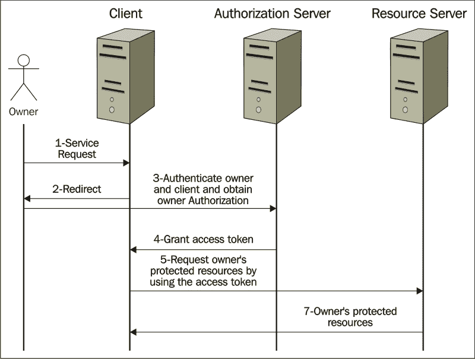

# 第五章保护您的申请

Spring 安全性为保护基于 Java/Spring 的企业应用程序提供了广泛的功能。乍一看，servlet 或 EJB 的安全特性看起来是 Spring 安全性的替代品；但是，这些解决方案缺乏开发企业应用程序的特定要求。服务器的环境依赖性可能是这些解决方案的另一个缺点。

身份验证和授权是应用程序安全的主要领域。身份验证是对用户身份的验证，而授权是对用户权限的验证。

Spring Security 集成了多种身份验证模型，其中大部分由第三方提供商提供。此外，Spring Security 基于主要的安全协议开发了自己的身份验证模型。以下是其中一些协议：

*   基于表单的身份验证
*   HTTP 基本身份验证
*   LDAP
*   JAAS
*   Java 开放单点登录
*   开放式身份验证

由于 Spring 安全模型的列表很多，我们只能在本章中详细介绍其中最流行的模型。

Spring Security 在授权特性上非常强大。我们可以将这些特性分为三组：web、方法和域对象授权。稍后，在*授权*部分，我们将解释这些类别。

为了在 web 应用程序中使用 Spring 安全功能，您需要在项目中包含以下依赖项：

```
<dependency>
   <groupId>org.springframework.security</groupId>
   <artifactId>spring-security-web</artifactId>
   <version>4.0.2.RELEASE</version>
</dependency>
<dependency>
   <groupId>org.springframework.security</groupId>
   <artifactId>spring-security-config</artifactId>
   <version>4.0.2.RELEASE</version>
</dependency>
```

2006 年末引入的**开放授权标准**（**OAuth**概念，旨在允许第三方有限访问微软、谷歌、Facebook、Twitter 或类似账户上的用户资源，而无需共享用户名和密码。

2010 年，OAuth 在 RFC 5849 中被标准化为 OAuth 1.0a 协议。2012 年晚些时候，它在 RFC6749 中发展为 OAuth 2.0 框架。在本章中，我们将解释 Spring 的 OAuth2.0 框架实现。

OAuth 2.0 授权框架使第三方应用程序能够通过协调资源所有者和 HTTP 服务之间的批准交互，或者通过允许第三方应用程序以其自身的名义获得对 HTTP 服务的有限访问（ [http://tools.ietf.org/html/rfc6749](http://tools.ietf.org/html/rfc6749) ）。

Spring 为其 OAuth 2.0 实现提供了一个单独的模块（`spring-security-oauth2`，它依赖于 Spring 的安全特性。在本章中，我们将解释身份验证，以及 Spring 如何通过提供其自身易于使用的特性以及为您提供插入自定义实现的选项来促进该过程。授权是本章中的第二个主题，我们将在其中解释如何在同一个应用程序中配置不同的安全模型。在最后一节中，我们将解释 Spring 的 OAuth2.0 特性。

# 认证

在应用程序的安全域中，首先想到的是身份验证。在身份验证过程中，应用程序将用户的凭据（例如，用户名和密码或令牌）与其可用信息进行比较。如果这两个匹配，则允许流程进入下一步。我们将遵循*授权*部分的下一步。

Spring Security 提供了支持各种安全身份验证协议的功能。在本节中，我们将重点介绍基于身份验证和基于表单的身份验证。

Spring 提供了一个内置表单，用于基于表单的身份验证。此外，它还允许您定义自己的自定义登录表单。

Spring 为您提供了使用内存身份验证的选项，其中用户名和密码将在应用程序中硬编码。

另一个选项是使用定制的身份验证提供程序，让您决定如何通过程序对用户进行身份验证，例如，调用数据层服务来验证用户。它还允许您将 Spring 安全性与现有的安全框架集成。

要配置 Spring 安全性来验证用户，首先需要定义一个名为`springSecurityFilterChain`的 Servlet 过滤器。此筛选器负责在 web 应用程序中应用安全措施（例如，验证用户、根据用户角色登录后导航到不同页面以及保护应用程序 URL）。

`WebSecurityConfigurerAdapter`是配置`springSecurityFilterChain`的一个方便的弹簧模板：

```
@Configuration
@EnableWebSecurity
@ComponentScan(basePackages = "com.springessentialsbook.chapter5")
public class WebSecurityConfigurator extends WebSecurityConfigurerAdapter {
    @Autowired
    private AuthenticationSuccessHandler authenticationSuccessHandler;

    @Autowired
    public void configureGlobalSecurity(AuthenticationManagerBuilder auth) throws Exception {
        auth.inMemoryAuthentication().withUser("operator").password("password").roles("USER");
        auth.inMemoryAuthentication().withUser("admin").password("password").roles("ADMIN");
        auth.inMemoryAuthentication().withUser("accountant").password("password").roles("ACCOUNTANT");

    }
```

`@Configuration`将该类注册为配置类。该方法的名称`configureGlobalSecurity`并不重要，因为它只通过 autowire 配置一个`AuthenticationManagerBuilder`实例。唯一重要的是用`@EnableWebSecurity`注释类，它在应用程序中注册 SpringWeb 安全性。如您所见，为了简单起见，我们使用了内存身份验证，它对用户的用户名、密码和用于用户身份验证的角色进行了硬编码。在真实的企业应用程序中，LDAP、数据库或云提供验证用户凭据的服务。

我们在 config 类中没有编写那么多代码，但它在幕后确实做了很多工作。下面是该类实现的一些特性。除了用户身份验证和角色分配之外，我们将在本章接下来介绍其他功能。

*   通过先请求身份验证来保护所有应用程序 URL
*   创建 Spring 默认登录表单以验证用户
*   使用基于表单的身份验证对用户（操作员/密码、管理员/密码、会计/密码）进行身份验证，并为每个用户（用户、管理员和会计）分配单独的角色
*   允许用户注销
*   CSRF 攻击预防

正如我们所解释的，在现实世界中的企业应用程序中，永远不会在应用程序的代码中硬编码用户凭据。您可能有一个调用服务以验证用户的现有安全框架。在这种情况下，您可以在定制服务中配置 Spring 安全性来验证用户。

身份验证接口实现在 Spring 安全上下文中承载用户凭据。您可以使用`SecurityContextHolder.getContext().getAuthentication()`在应用程序中的任何位置获取身份验证对象。

当用户通过身份验证时，`Authentication`将被填充。如果未指定`AuthenticationProvider`（例如，如果使用内存内身份验证），`Authentication`将自动填充。这里，我们来看看如何定制`AuthenticationProvider`并填充`Authentication`对象。

以下代码显示了 Spring 的`AuthenticationProvider`实现类如何与定制的用户详细信息服务（从数据源返回用户凭据）集成：

```
@Component
public class MyCustomizedAuthenticationProvider implements AuthenticationProvider {
  @Autowired
  UserDetailsService userService;
  public Authentication authenticate(Authentication authentication) throws AuthenticationException {
    User user=null;
    Authentication auth=null;
    String username=authentication.getName();
    String password=authentication.getCredentials().toString();
    user= (User) userService.loadUserByUsername(username);
    if(password ==null ||   ! password.equals(user.getPassword())) throw new UsernameNotFoundException("wrong user/password");
    if(user !=null){
      auth = new UsernamePasswordAuthenticationToken(user.getUsername(), user.getPassword(), user.getAuthorities());
    } else throw new UsernameNotFoundException("wrong user/password");
    return auth;

  }
  public boolean supports(Class<?> aClass) {
    return true;
  }
}
```

您的自定义身份验证提供商应实现`AuthenticationProvider`及其`authenticate`方法。

注意这里的`userService`实例应该实现 Spring`UserDetailsService`接口及其`loadUserByUserName`方法。该方法返回用户的数据模型。请注意，您可以扩展 Spring 的`User`对象并创建自己的自定义用户。我们用数据服务模拟了`UserService`集成部分。在实际应用程序中，可能会有一个服务调用来获取和返回用户数据，而您的`UserServiceImpl`类将只将用户包装在`UserDetails`数据模型中，如下所示：

```
@Service
public class UserServiceImpl implements UserDetailsService {
    public UserDetails loadUserByUsername(String userName) throws UsernameNotFoundException {
        // suppose we fetch user data from DB and populate it into // User object
        // here we just mock the service
        String role=null;
        if(userName.equalsIgnoreCase("admin")){
            role ="ROLE_ADMIN";
        }else if(userName.equalsIgnoreCase("accountant") ){
            role="ROLE_ACCOUNTANT";
        }else if(userName.equalsIgnoreCase("operator")){
            role="ROLE_USER";
        }else{
            throw new UsernameNotFoundException("user not found in DB");
        }
        List<GrantedAuthority> authorities=new ArrayList<GrantedAuthority>();
        authorities.add(new GrantedAuthorityImpl(role));
        return new User(userName, "password", true, true, true, true, authorities);
    }
}
```

在此之后，您可以在 configuration 类中设置自定义提供程序，如以下代码所示。对用户进行身份验证时，应以编程方式填充身份验证对象。在本章后面的*授权*部分，我们将解释这个对象。

```
@EnableWebSecurity
@EnableGlobalMethodSecurity(prePostEnabled=true)
@ComponentScan(basePackages = "com.springessentialsbook.chapter5")
public class MultiWebSecurityConfigurator   {

    @Autowired
    private AuthenticationProvider authenticationProvider;

    @Autowired
    public void configureGlobalSecurity(AuthenticationManagerBuilder auth) throws Exception {
        auth.authenticationProvider(authenticationProvider);
    }
```

我们在第一步中定义了`springSecurityFilterChain`过滤器。要使其正常工作，我们需要在 web 应用程序中注册它，如下所示：

```
import org.springframework.security.web.context.AbstractSecurityWebApplicationInitializer;
public class SecurityWebApplicationInitializer extends AbstractSecurityWebApplicationInitializer { }
```

类不需要任何代码，因为超类（`AbstractSecurityWebApplicationInitializer`注册了 Spring 安全过滤器。这在 Spring 上下文启动时发生。

如果我们不使用 Spring MVC，我们应该将以下内容传递给构造函数：

```
super(WebSecurityConfigurator);
```

类`AnnotatedConfigDispatcherServletInitializer`扩展了 Spring 的 Servlet 初始值设定项`AbstractAnnotationConfigDispatcherServletInitializer`。此类允许 Servlet 3 容器（例如 Tomcat）自动检测 web 应用程序，而无需`web.xml`。这是简化 web 应用程序设置的另一个步骤，它以编程方式注册`DispatcherServlet`和 Servlet 映射。通过在`getRootConfigClasses`中设置`WebSecurityConfigurator`类，可以告诉创建应用程序上下文的父类方法使用带注释的定制 Spring 安全配置类。以下是`AnnotatedConfigDispatcherServletInitializer`类的代码：

```
public class AnnotatedConfigDispatcherServletInitializer extends AbstractAnnotationConfigDispatcherServletInitializer {
   @Override
   protected Class<?>[] getRootConfigClasses() {
      return new Class[] { MultiWebSecurityConfigurator.class };
   }

   @Override
   protected Class<?>[] getServletConfigClasses() {
      return null;
   }

   @Override
   protected String[] getServletMappings() {
      return new String[] { "/" };
   }
}
```

到目前为止，我们在 SpringSecurity 中配置的是检查用户名和密码是否正确。如果我们想要配置其他安全功能，例如定义登录页面和要验证的 web 应用程序 URL 请求，我们需要覆盖`WebSecurityConfigurerAdapter`的`configure(HttpSecurity http)`方法。

在我们定制的安全配置器中，我们定义了一个登录页面（`login.jsp`）和一个授权失败页面（`nonAuthorized.jsp`），如下所示：

```
@Configuration
@EnableWebSecurity
public class WebSecurityConfigurator extends WebSecurityConfigurerAdapter {
@Autowired
private AuthenticationSuccessHandler authenticationSuccessHandler;

   ...
   @Override
   public void configure(HttpSecurity http) throws Exception {
   ...

   .and().formLogin()
   .loginPage("/login").successHandler(authenticationSuccessHandler)
   .failureUrl("/nonAuthorized")
   .usernameParameter("username").passwordParameter("password").loginProcessingUrl("/login")

...
```

此代码告诉 Spring 处理提交的 HTTP 请求表单（使用 POST 方法），预期用户名和密码作为参数，`"/login"`作为操作。这是登录表单：

```
<form role="form" action="/login" method="post">
  <input type="hidden" name="${_csrf.parameterName}" value="${_csrf.token}"/>
  <div>
    <label for="username">Username</label>
    <input type="text" name="username" id="username" required autofocus>
  </div>
  <div>
    <label for="password">Password</label>
    <input type="password" name="password" id="password" required>
  </div>
  <button type="submit">Sign in</button>
</form>
```

### 提示

如果您没有在配置文件中指定用户名、密码和`loginProcessingUrl`参数，Spring Security 希望客户端浏览器提供`j_username`、`j_password`和`j_spring_security_check`。通过覆盖 Spring 的默认值，您可以在客户端浏览器中隐藏 Spring 安全性实现。

发生**跨站点请求伪造**（**CSRF**）攻击，例如，当经过身份验证的 web 客户端单击恶意链接执行不必要的操作时，例如转账、获取联系人电子邮件或更改密码。Spring Security 提供随机生成的 CSRF，以保护客户端免受 CSRF 攻击。

如果在`configure`方法中省略`.loginPage`，Spring 将使用其默认登录页面，这是一个非常简单的 HTML 登录页面。在这种情况下，Spring Security 将预期的`j_username`、`j_password`和`j_spring_security_check`参数用于用户名、密码和操作，您不应该在方法中配置它们。

例如，这里我们要求 Spring 提供自己的默认登录表单：

```
@Override
public void configure(HttpSecurity http) throws Exception {
   ...
         .and().formLogin()
         .successHandler(authenticationSuccessHandler)
         .failureUrl("/nonAuthorized")
         ...

}
```

Spring Security 支持 HTTP 基本身份验证，在这种情况下，当您想要访问与模式匹配的资源时（在本例中为`"/adResources*/**"`），客户端浏览器会打开一个弹出窗口（初始时间）：

```
protected void configure(HttpSecurity http) throws Exception {
    http.antMatcher("/adResources*/**").authorizeRequests().anyRequest().hasRole("ADMIN")
        .and()
        .httpBasic();
}
```

服务器端导航可能是身份验证后的下一步。尽管在现代客户端框架（如 AngularJS）中，路由信息是从客户端提供的，但您可能仍然希望在服务器端保留路由逻辑。成功处理程序是一个 Spring 安全特性，它允许您在 web 应用程序中进行身份验证后定义导航逻辑。

Spring Security 允许您在身份验证后配置定制的服务器端导航。您可以在`configure`方法中配置（使用`successHandler`：

```
@Override
public void configure(HttpSecurity http) throws Exception {
    ...
    .loginPage("/login").successHandler(authenticationSuccessHandler)
      ....
}
```

您自定义的导航处理程序应该实现接口`AuthenticationSuccessHandler`。`OnAuthenticationSuccess`是对用户进行身份验证时将调用的方法。在这个方法中，我们应该定义目标 URL。在这里显示的示例实现类中，用户角色仅用于定义目标 URL：

```
@Component
public class MyCustomizedAuthenticationSuccessHandler implements AuthenticationSuccessHandler {
    private RedirectStrategy redirectStrategy = new DefaultRedirectStrategy();

    public void onAuthenticationSuccess(final HttpServletRequest request, final HttpServletResponse 
    response, final Authentication authentication) throws IOException {
        handle(request, response, authentication);
        final HttpSession session = request.getSession(false);
        if (session != null) {
            session.setMaxInactiveInterval(3600);//1 hour
        }
        clearAttributes(request);
    }

    protected void handle(final HttpServletRequest request, final HttpServletResponse response, final 
    Authentication authentication) throws IOException {
        final String url = getUrl(authentication);
        if (response.isCommitted()) {
           return;
        }
        redirectStrategy.sendRedirect(request, response, url);
    }

    private String getUrl(final Authentication authentication) {
        String url=null;
        final Collection<? extends GrantedAuthority> authorities = authentication.getAuthorities();
        for (final GrantedAuthority grantedAuthority : authorities) {
            if (grantedAuthority.getAuthority().equals("ROLE_USER")) {
                url= "/user" ;
                break;
            } else if (grantedAuthority.getAuthority().equals("ROLE_ADMIN")) {
                url= "/admin" ;
                break;
             } else if (grantedAuthority.getAuthority().equals("ROLE_ACCOUNTANT")) {
                url= "/accountant" ;
                break;
            }else {
                throw new IllegalStateException();
            }
        }
        return url;
    }

    protected void clearAttributes(final HttpServletRequest request) {
        final HttpSession session = request.getSession(false);
        if (session == null) {
            return;
        }
        session.removeAttribute(WebAttributes.AUTHENTICATION_EXCEPTION);
    }

    public void setRedirectStrategy(final RedirectStrategy redirectStrategy) {
        this.redirectStrategy = redirectStrategy;
    }

    protected RedirectStrategy getRedirectStrategy() {
        return redirectStrategy;
    }
}
```

Spring Security 允许您在多个方法中配置您的安全配置，并且在每个方法中，您可以定义不同类别的资源。这里，我们将基于表单和基本身份验证的安全配置分为以下两类：

```
@EnableWebSecurity
@ComponentScan(basePackages = "com.springessentialsbook.chapter5")
public class MultiWebSecurityConfigurator {
   @Autowired
   private AuthenticationProvider authenticationProvider;
   @Autowired
   public void configureGlobalSecurity(AuthenticationManagerBuilder auth) throws Exception {

      auth.authenticationProvider(authenticationProvider);
   }
   @Configuration
   protected static class LoginFormBasedWebSecurityConfigurerAdapter extends WebSecurityConfigurerAdapter {
      @Autowired
      private AuthenticationSuccessHandler authenticationSuccessHandler;
      @Override
      public void configure(HttpSecurity http) throws Exception {
         http.authorizeRequests()
               ...
               .permitAll();
      }
   }
   @Configuration
   @Order(1)
   public static class HttpBasicWebSecurityConfigurationAdapter extends WebSecurityConfigurerAdapter {
      @Override
      protected void configure(HttpSecurity http) throws Exception {
         http.antMatcher("/adResources*/**").authorizeRequests().anyRequest().hasRole("ADMIN")
         .and()
         .httpBasic();
      }

}}
```

例如，在一种方法中，我们将`adResources`路径中的资源配置为管理员角色在基于 HTTP 的身份验证中查看（浏览器打开一个弹出窗口并要求输入用户名和密码）。在第二种方法中，我们应用表单登录授权，并根据用户角色限制对资源的访问。

# 授权

在*身份验证*部分，我们展示了如何将用户提供的凭据（用户名/密码）与应用程序存储的凭据进行比较，如果它们匹配，则对用户进行身份验证。

为了提高安全性，我们可以限制用户对应用程序资源的访问。这就是授权进入画面的问题，谁应该访问哪个应用程序的资源。

Spring Security 提供了非常全面的授权功能。我们可以将这些功能分为以下三个授权组：

*   Web 请求（谁可以访问哪个应用程序 URL？）
*   方法调用（谁可以调用方法？）
*   Domain object access (who can see which data?)

    例如，客户应该能够查看自己的订单和配置文件数据，而管理员应该能够查看所有客户的订单以及任何客户都看不到的数据。

自 SpringSecurity 的 3.0 版以来，Spring 在其授权功能中添加了 SpringEL 表达式。SpringEL 允许您将复杂的授权逻辑转换为简单的表达式。在本节中，我们使用 Spring EL 进行授权。

Spring Security 中的`GrandAuthority`是包含字符串值的对象，该字符串值可交换地称为权限、权限或权限（请参阅*认证*部分，其中解释了`AuthenticationProvider`接口，以了解`GrandAuthority`是如何创建的）。默认情况下，如果此字符串值以前缀`ROLE_`（例如`ROLE_ADMIN`开头），则将其视为用户角色。因此，如果它不以前缀开头，它还可以灵活地用作权限。Spring Security 将此对象用于 web、方法和域对象授权。

对于 web 请求授权，我们可以根据用户在 Spring Security 中的角色限制用户访问，如下所示（我们将在本节后面的部分中看到如何在控制器中执行此操作）：

```
public void configure(HttpSecurity http) throws Exception {
   http.authorizeRequests()
      .antMatchers("*.jsp").denyAll()
      .antMatchers("/", "/login").permitAll()
      .antMatchers("/user*//**").access("hasRole('USER') or hasRole('ADMIN')")
      .antMatchers("/admin*//**").access("hasRole('ADMIN')")
      .antMatchers("/accountant*//**").access("hasRole('ADMIN') or hasRole('ACCOUNTANT')")
      .failureUrl("/nonAuthorized")
      ...
      .permitAll();
}
```

因为我们使用 SpringMVC，所以我们拒绝所有以`.jsp`（`*.jsp`）结尾的 URL，并让 MVC 将 URL 映射到 JSP 页面。我们允许任何人使用（`.antMatchers("/", /login").permitAll()`访问登录页面。

我们将用户对会计资源的访问限制为管理员和会计角色（例如，`antMatchers("/accountant*//**").access("hasRole('ADMIN') or hasRole('ACCOUNTANT')")`）。我们设置了一个错误 URL，如果用户身份验证失败或试图使用`failureUrl("/nonAuthorized")`访问未授权的资源，我们会将用户转发给该 URL。

您需要添加`@EnableGlobalMethodSecurity(prePostEnabled=true)`才能应用方法/域级授权：

```
@EnableWebSecurity
@EnableGlobalMethodSecurity(prePostEnabled=true)
@ComponentScan(basePackages = "com.springessentialsbook.chapter5")
public class MultiWebSecurityConfigurator {
```

我们已经描述了如何使用配置文件限制对 URL 的访问。您也可以在控制器的方法中执行相同的操作：

```
@PreAuthorize("hasRole('ADMIN') or hasRole('ACCOUNTANT')"
@RequestMapping(value = "/accountant", method = RequestMethod.GET)
public String dbaPage(ModelMap model) {
...
}
```

对于方法调用授权，您可以在方法级别配置 Spring 安全性，并定义谁可以在应用程序的服务层中运行特定方法：

```
@PreAuthorize("hasRole('ADMIN') or hasRole('ACCOUNTANT')"
)
public void migrateUsers(id){...};
```

对于域对象访问，您可以应用调用授权的方法，并使用服务方法来微调谁可以看到应用程序中的哪些数据。例如，在服务层，如果 username 参数等于登录的 username，或者用户具有 admin 角色，则可以限制访问（参见代码中的`bussinessServiceImpl`：

```
@PreAuthorize("@businessServiceImpl.isEligibleToSeeUserData(principal, #username)")
@RequestMapping("/userdata/{username}")
public String getUserPage(@PathVariable String username,ModelMap model) {
  {...}
```

## OAuth2 授权框架

OAuth2 授权框架只是让第三方应用程序访问您的受保护资源的一种方式，而无需共享您的用户凭据（用户名/密码）。当 LinkedIn 这样的网站要求你分享你的电子邮件联系人时，你会遇到这种情况，当你同意时，你会被转发到邮件提供商的登录页面（例如 Yahoo！）。

当您登录时，邮件提供商会请求您允许与 LinkedIn 共享您的联系人。然后，LinkedIn 可以获取您的联系人列表，以便向他们发送邀请。

OAuth2 依赖于以下实体：

*   **资源所有者**：这是拥有受保护资源的用户，例如 Yahoo！电子邮件用户
*   **客户端或第三方应用程序**：这是一个外部应用程序，需要访问所有者的受保护资源，例如 LinkedIn
*   **授权服务器**：该服务器在对资源所有者进行身份验证并获得授权后，授予客户端/第三方访问权限
*   **资源服务器**：此服务器承载所有者的受保护资源，例如 Yahoo！服务器

许多领先的提供商（例如谷歌和 Facebook）同时拥有授权和资源服务器。

此图以简单的形式说明了 OAuth2 框架的工作原理：



Spring 通过重用 Spring 安全概念进行身份验证和授权，并包括实现授权和资源服务器的新功能，从而简化了 OAuth2 框架。要在项目中使用 Spring OAuth2，您需要以下依赖项：

```
<dependency>
   <groupId>org.springframework.security.oauth</groupId>
   <artifactId>spring-security-oauth2</artifactId>
   <version>2.0.8.RELEASE</version>
</dependency>
```

我们在*认证*部分中解释的关于验证用户和保护资源的内容在这里保持不变。新功能是授权和资源服务器设置。

OAuth2.0 服务包括授权和资源服务器。Spring Security 允许您拥有单独的应用程序作为授权服务器和资源服务器，其中一个授权服务器可以由一个或多个资源服务器共享，或者在单个应用程序中同时拥有这两种类型的服务器。为了简单起见，我们在同一个应用程序中实现授权和资源服务器。

在`MultiOAuth2ResourceAndAuthorizationConfigurator`类中，我们定义了资源和授权服务器。`@EnableResourceServer`将类`ResourceServerConfiguration`标记为资源服务器，将 URL 为`/public`的资源定义为非保护资源，将 URL 为`/protected/**`的资源定义为需要有效令牌才能访问的安全资源。

`@EnableAuthorizationServer`将`AuthorizationServerConfiguration`标记为授权服务器，向第三方客户端授予令牌。`TokenStore`为弹簧接口；其实现类（`InMemoryTokenStore`、`JdbcTokenStore`和`JwtTokenStore`跟踪令牌。

`JdbcTokenStore`使用数据库存储令牌，并具有 Spring JDBC 依赖性。`JdbcTokenStore`适用于需要令牌历史记录、服务器故障后恢复或多台服务器之间共享令牌的情况。

`JwtTokenStore`将令牌相关数据编码到令牌本身。`JwtTokenStore`不会使令牌持久化，需要`JwtAccessTokenConverter`作为 JWT 编码令牌和 OAuth 身份验证信息之间的转换器。

为了简单起见，我们使用了`InMemoryTokenStore`实现类，但在实际应用中，使用`JdbcTokenStore`/`JwtTokenStore`是一种更好的实践。

我们重用了在*认证*一节中详细介绍的`AuthenticationManager`类。

方法`configure(ClientDetailsServiceConfigurer clients)`是我们配置令牌生成设置的位置，如下所示：

*   `withClient`告诉我们哪些客户端可以访问资源（这与用户身份验证是分开的）
*   `secret`是客户的密码
*   `authorities`告诉我们哪些用户角色有资格访问资源
*   `authorizedGrantType`指定客户端拥有的授权类型（例如刷新和访问令牌）
*   `accessTokenValiditySeconds`设置令牌的生存时间

以下代码中提到了这些设置：

```
@Configuration
public class MultiOAuth2ResourceAndAuthorizationConfigurator {
    @Configuration
    @EnableResourceServer
    protected static class ResourceServerConfiguration extends ResourceServerConfigurerAdapter {
        @Override
        public void configure(HttpSecurity http) throws Exception {
            http
                .headers()
                .frameOptions().disable()
                .authorizeRequests()
                .antMatchers("/public/").permitAll()
                .antMatchers("/protected/**").authenticated();
        }
    }
    @Configuration
    @EnableAuthorizationServer
    protected static class AuthorizationServerConfiguration extends AuthorizationServerConfigurerAdapter implements EnvironmentAware {
        private static final String  CLIENT_ID = "myClientId";
        private static final String  CLIENT_PASSWORD = "myClientPassword";
        private static final int  TOKEN_TIME_TO_LIVE = 1800;
        private static final String  ROLE_USER = "ROLE_USER";
        private static final String  ROLE_ACCOUNTANT = "ROLE_ACCOUNTANT";
        private static final String  READ_ACCESS = "read";
        private static final String  WRITE_ACCESS = "write";
        private static final String  GRANT_TYPE_PASSWORD = "password";
        private static final String  GRANT_TYPE_REFRESH_TOKEN = "refresh_token";
        @Bean
        public TokenStore tokenStore() {
            return new InMemoryTokenStore();
        }
        @Autowired
        private AuthenticationManager authenticationManager;
        @Override
        public void configure(AuthorizationServerEndpointsConfigurer endpoints) throws Exception {
            endpoints
                .tokenStore(tokenStore())
                .authenticationManager(authenticationManager);
        }
        @Override
        public void configure(ClientDetailsServiceConfigurer clients) throws Exception {
            clients
                .inMemory()
                .withClient(CLIENT_ID)
                .secret(CLIENT_PASSWORD)
                .scopes(READ_ACCESS, WRITE_ACCESS)
                .authorities(ROLE_USER, ROLE_ACCOUNTANT)
                .authorizedGrantTypes(GRANT_TYPE_PASSWORD, GRANT_TYPE_REFRESH_TOKEN)
                .accessTokenValiditySeconds( TOKEN_TIME_TO_LIVE);
        }
        @Override
        public void setEnvironment(Environment environment) {
        }
    }
}
```

我们授权使用令牌访问的资源包含在控制器中。在这里，我们定义了一个非常简单的资源：

```
@RequestMapping(value = "/protected", method = RequestMethod.GET)
@ResponseBody
public String getProtectedResources(ModelMap model) {
   return "this is from getProtectedResources";
}
@RequestMapping(value = "/public", method = RequestMethod.GET)
@ResponseBody
public String getPublicResources(ModelMap model) {
   return  "this is from getPublicResources";
}
```

可以使用以下命令运行项目，该命令生成并运行资源和授权服务器：

```
mvn clean package spring-boot:run -Dserver.contextPath=/myapp -Dserver.port=9090

```

如果尝试以下操作，则可以看到资源，因为此 URL 未受保护：

```
curl -i http://localhost:9090/myapp/public

```

但是，如果尝试下一个命令，则会出现“未授权”错误，并且需要有效的令牌才能访问此资源：

```
curl -i http://localhost:9090/myapp/protected

```

您需要首先获得令牌才能访问受保护的资源。Spring MVC 公开了一个端点`TokenEndpoint`，以便在默认情况下获得具有`/oauth/token`URL 的令牌。以下命令为您提供授权令牌：

```
curl -X POST -vu myClientId:myClientPassword  'http://localhost:9090/myapp/oauth/token?username=operator&password=password&grant_type=password'

```

现在，您可以提供令牌并访问安全资源：

```
curl -i -H "Authorization: Bearer [access_token]" http://localhost:9090/myapp/protected

```

请注意，我们为令牌设置了生存时间，如果令牌过期，我们需要刷新令牌。以下命令通过调用`/oauth/token`端点并传递`refresh_token`作为`grant_type`参数来更新令牌：

```
curl  -X POST  -vu  myClientId:myClientPassword  'http://localhost:9090/myapp/oauth/token?grant_type=refresh_token&refresh_token=[refresh_token]'

```

# 总结

在本章中，我们详细介绍了 Spring Security 的一些特性。由于 Spring Security 是一个独立的模块，具有多种功能，为了获得关于整个规范的更多信息，您需要通过[https://docs.spring.io/spring-security/site/docs/current/reference/html/index.html](https://docs.spring.io/spring-security/site/docs/current/reference/html/index.html) 和[http://projects.spring.io/spring-security-oauth/](http://projects.spring.io/spring-security-oauth/) 。