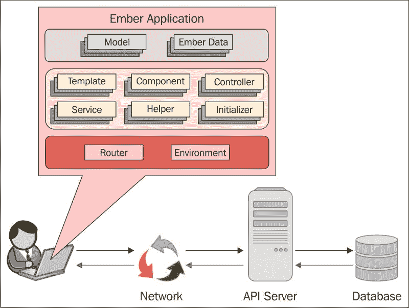
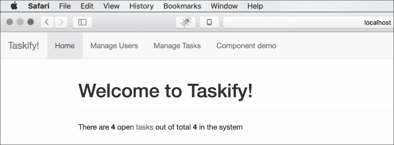
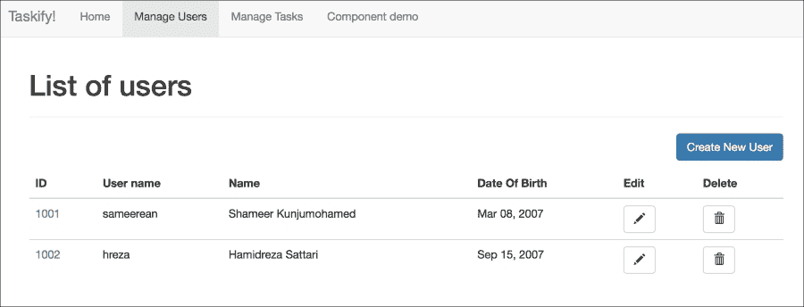

# 六、构建单页 Spring 应用

掌握了 Spring 框架的许多强大功能，同时处理了企业应用的所有主要技术问题，现在是时候将我们在前几章学到的所有技术结合起来，构建一个现代 web 应用了。当前 web 开发的趋势是构建**单页应用**（**SPA**），提供类似本机的用户体验和直观的用户界面。在本章中，让我们构建一个由 Spring 后端支持的响应式 SPA。

我们将使用 Ember.js 来构建 SPA，并引导您的风格和响应行为。对于 Ember 开发，我们将使用名为**Ember CLI**的命令行工具，它运行在 Node.js 上，并结合了一系列支持基于 JavaScript 的现代前端开发的各种关键功能的工具。

# 温泉背后的动机

我们知道 Spring 主要关注服务器端，即集成层、服务层和数据层。Spring 依赖于其他 web 技术来呈现表示层。尽管 SpringMVC 借助 JSP 和 Thymeleaf 等 web 技术促进了表示层，但它们都基于服务器端呈现和响应用户交互的完整页面刷新来工作。在这种传统方法中，web 应用的表示层由一组完全独立的 HTML 文件组成，这些文件由服务器按需提供服务，每个文件代表一个屏幕，一次只向客户端浏览器呈现一个屏幕，每个用户交互都需要往返服务器。与本机桌面应用相比，这提供了非常差的用户体验，本机桌面应用在需要时仅优雅地重新渲染屏幕的特定部分。

尽管可以使用 jQuery 等框架使用一些 AJAX，但为了从服务器获取数据，甚至为了部分呈现 UI（如 JSF），表示层需要大量服务器资源，并且当并发用户数量增加时，服务器处理很容易耗尽。在这种方法中，表示层关注点分布在服务器层和客户端层。在这种情况下，UI 开发人员既需要客户端技能，也需要服务器端技能，这使得 web 开发更加困难。

Web 开发人员一直在寻找一种更智能的方法来构建数据驱动应用的 UI，该应用完全在客户端开发，在 Web 浏览器中运行，它提供了与本机类似的丰富用户体验，而无需对服务器进行完全刷新即可进行页面转换和导航。他们希望有一种方法可以使他们的 UI 完全在客户端动态地使用数据，从而在前端开发期间不需要服务器，并且只有在客户端一切就绪时才能插入服务器。对于所有这些问题和需求，SPA 范式就是答案。

# 水疗中心解释

SPA 是完全由静态 web 资源（如 HTML、JavaScript 和 CSS）组成的 web 应用或网站，在单个页面加载中只加载一次到 web 浏览器中。一旦启动，当用户开始与它交互时，它会智能地自我更新。与为屏幕导航执行整页刷新的传统 web 应用不同，SPA 路由和重画（重新呈现）屏幕，而无需从服务器重新加载整个页面（或下一页）。它在 JavaScript 的帮助下重建 DOM 结构，并在响应用户操作和应用事件时使用 CSS 对自身进行样式化，以便在屏幕上表示它们。

初始引导后，SPA 与服务器协商的唯一时间是动态数据。SPA 通常依赖 AJAX 或 WebSocket 从服务器访问数据。数据传输格式主要是 JSON，有时是 XML。他们在后台通过 ajaxoverhttp 异步地与服务器联系；这提供了流畅的用户体验，而不会阻塞屏幕或让用户等待服务器响应。此外，服务器可以使用 WebSocket API 与客户端同步其数据更改，以提供实时体验。

## 水疗中心的建筑效益

除了巨大的生产力提升和前端开发人员的突出地位外，SPA 还提供了许多架构优势。与传统的服务器呈现的 web 应用相比，它的速度非常快，因为它完全在客户端本地工作。SPA 提供了更加流畅的用户体验，因为它的即时响应，而不需要我们在每次用户交互时重新向服务器提交整个页面。

### 注

JavaScript 密集型 web 应用在主机内存充足的现代 web 浏览器上运行得最好。大多数框架利用许多 HTML5 特性和更新的 JavaScript 功能，如 AJAX。SPA 可以在短时间内杀死较慢 PC 上的旧浏览器。

SPA 将整个应用状态的责任转移给浏览器，释放服务器资源，以无状态 web 服务（通常设计为 REST API）的形式关注核心业务逻辑（服务）和数据。有了 SPA，服务器就变成了 API 服务器；整个用户交互由客户端处理，这大大提高了服务器的可伸缩性。

另一个优势，可能是 SPA 中最重要的一个，是客户机和服务器应用都可以彼此独立地设计和发展。只要端点（API）契约保持不变，就可以替换其中一个而不影响另一个。此外，您还可以让前端开发人员构建 UI，后端开发人员提供数据；两个团队在围绕数据契约工作时都可以专注于自己的领域。

## SPA 框架

考虑到 SPA 范式所处理的责任的大小，用普通 JavaScript 开发 SPA 不是一个明智的想法。如果我们开始在应用中从头开始编写所有路由、数据绑定、屏幕创作和呈现代码，这将是非常累人和容易出错的。幸运的是，SPA 概念中出现了一组令人印象深刻的框架。它们都提供了不同层次的抽象和架构风格；其中一些使用了强大的模板技术。让我们来看看最流行的 SPA 框架：

*   **AngularJS**：AngularJS 由谷歌维护，并得到开发者和公司社区的支持，是最流行、应用最广泛的 SPA 框架。它通过添加双向数据绑定，借助 smart 指令增强了香草 HTML。Angular 支持本地化和可重用组件的构建。
*   **React JS**：由 Facebook、Instagram 和开发者和公司社区支持，React 是撰写本文时发展最快的 SPA 框架。Facebook 和 Instagram 是使用 React 开发的。它的工作基于虚拟 DOM 的概念，虚拟 DOM 是显示的 DOM 的内存表示，可以在客户端或服务器（使用节点）上呈现，并使用单向绑定进行操作。React 屏幕是使用 JSX 编写的，JSX 是 JavaScript 的扩展，允许在 JavaScript 函数中轻松引用 HTML。
*   **Ember.js**：一个非常强大的 JavaScript MVC 框架，由 Yehuda Katz 创建，由强大的活跃开发者社区贡献，Ember 被许多流行的高流量网站和应用使用，如 Groupon、Yahoo！（Ad Manager Plus）、Zendesk、Square、Discussion 和 LivingSocial。Ember 可用于构建移动和桌面应用：Apple Music 是使用 Ember 构建的著名桌面应用。Ember 以一种固执己见的方式解决客户端 web 应用的端到端问题。作为 ES6、web 组件和 promises 等 web 和 JavaScript 标准的早期采用者，Ember 提供了一套功能强大的生产力工具和组件，使其成为一个完整的堆栈前端框架。

在本章中，我们将使用 Ember.js 构建一个 SPA，作为 SpringAPI 服务器的前端。我们将首先研究 Ember.js 及其核心组件和开发工具，然后使用 Ember 开发前端应用，并在后端连接到基于 Spring 的 API 服务器。本章将使您成为一名全面的堆栈开发人员，同时具备现代技术堆栈的服务器端和客户端技能。

# 介绍 Ember.js

Ember 是一个全面的前端框架，用于创建雄心勃勃的 web 应用。前端仿效**模型视图控制器**（**MVC**架构模式。它设计良好的组件，具有明确定义的职责和丰富的功能，允许开发人员用更少的代码开发复杂的 web 应用。在 Ember 应用中，屏幕使用手柄模板组成，当基础数据发生变化时，手柄模板会自动更新。

Ember 是开箱即用的，具有全面的开发堆栈和友好的 API。Ember 开发堆栈包含以下工具：

*   **Ember CLI**：这是一个用于创建项目、搭建脚手架和管理资源的命令行工具。它提供了具有实时重新加载的开发服务器、测试框架、模拟服务器和全面的资产管理支持。
*   **Ember Inspector**：这是一款用于 Ember 应用的调试器兼检查器工具，作为 Firefox 和 Chrome 浏览器的插件提供。它允许您在调试时评估和更改 Ember 对象、元素和变量，并提供运行 Ember 应用的可视化表示。
*   **余烬数据**：余烬的子项目是一个数据持久化库，可以直接映射到远程数据源，比如 RESTAPI。它通过 API 端点等通道将 Ember 模型对象映射到服务器端的数据实体。Ember Data 为标准 REST 和 JSON API 端点提供适配器和序列化程序，并允许您为任何数据源（例如浏览器的本地存储）创建自己的适配器。
*   **Fastboot**：这是一个基于 Node.js 的服务器，用于服务器端呈现余烬资源，无需在加载静态资产后下载 JavaScript 有效负载以提高性能。
*   **液态火**：此为余烬视图提供动画支持。
*   **一个测试框架**：Ember CLI 集成了 QUnit 来测试 Ember 资源。

余烬是一个非常固执己见的框架；这意味着您需要按照自己的约定构建应用，然后由框架负责其余部分。如果您遵循这些指导原则，那么最终将编写很少的、可读性很强的代码。Ember CLI 以框架所期望的方式，使用简单的命令生成 Ember 项目结构和工件。

# 余烬应用的剖析

余烬应用由一组具有明确职责和属性的核心元素组成。它们在 Ember API 的 Ember 和 DS 命名空间下定义。

此图描述了 Ember 应用的高级结构：



## 路由器

路由器管理应用状态。它根据路由器配置中映射的唯一 URL 映射一组逻辑路由。

## 路由或路由处理程序

路由处理程序，也称为路由（在`Ember.Route`中定义），表示单个路由转换的处理程序。管线可以渲染显示屏幕的模板。路由提供可由其模板和控制器使用的模型（数据）。它有一个相应的控制器，可以处理用户操作和维护状态。路由可以自行处理用户操作。

## 模板

模板是 HTML 片段，通常由路由和组件呈现。Ember 应用的用户界面由一组模板组成。模板使用 Handlebar 语法，它看起来像带有一些 Handlebar 表达式的常规 HTML，这些表达式用双大括号（`{{ }}`括起来）。这些 Handlebar 表达式绑定 Ember 资源，例如属性、对象、辅助对象和组件。

## 组件

组件控制用户界面的行为。它们处理用户操作并管理模板使用的许多属性。组件由两部分组成：

*   扩展`Ember.Component`的 JavaScript 对象，其中定义了操作和属性
*   呈现到父视图中的模板，通常是路由器的模板

## 型号

作为余烬数据项目的一部分，模型表示余烬应用中域数据的状态。一个 Ember 应用通常会有一组从`DS.Model`开始扩展的模型。路由通常在模板的帮助下显示模型数据，并从操作处理程序修改数据。模型通常从存储区（`DS.Store`中）加载，而模型实例则从实际的持久存储区（主要是 web 服务器上的 API 端点）获取。模型可以保存到商店；通常，它们会被发送回相应的 API 端点。

## 控制器

控制器在现代余烬应用中的作用有限；在将来的版本中，它们将被弃用。目前，它们的使用仅限于维护路由的状态和处理用户操作。因为路由和组件可以处理动作，所以它们是添加动作处理程序而不是控制器的理想场所。

除了这些核心元素之外，还有一些支持组件可以帮助应用开发变得更简单、更优雅。

## 输入助手

这些是与 Ember 捆绑在一起的现成组件，用于从用户处获取输入。其中大多数是通用表单控件的 Ember 版本。例如，`{{input}}`和`{{textarea}}`输入助手。自定义开发的组件可以类似地用于输入帮助器。

## 海关助理

助手在应用不可用时，向应用添加自定义功能，以便使用内部模板。大多数情况下，它们用于某种格式。例如`{{format-date}}`和`{{format-currency}}`。

## 初始化者

初始化器可以在应用启动时执行某些操作。有两种类型的初始值设定项：应用初始值设定项（在应用启动时执行）和应用实例初始值设定项（在应用实例启动时加载）。

## 服务

服务是可以保存数据和功能的对象，其范围是应用范围。它们通常用于封装跨多条路由的核心业务逻辑。可以将服务注入控制器、路由、组件等，并在其中调用它们的方法。

# 使用 Ember CLI

Ember CLI 是一个针对 Ember 应用的集成、快速开发环境。Ember CLI 基于在 Node.js 上运行的快速且可靠的资产管道 Brocoli，是一个强大的命令行界面，集成了 JavaScript 开发所需的许多生产工具和优化实用程序。

Ember CLI 为 Ember 开发提供了以下功能和工具：

*   它为 Ember 应用创建了一个强大的、基于约定的项目结构
*   它从命令行生成特定于余烬的应用资源，例如路由、模板和组件
*   它支持以 Handlebar、HTMLBars 和 E 徽.js 格式编写模板
*   它支持 ES2015（ES6）模块中的脚本、CoffeeScript 和 EmberScript 语法
*   它支持 CSS、Sass、Compass 和手写笔中的 CSS 创作
*   它将 Node.js 样式的 ES2015 模块转换为 RequireJS 型号的 AMD 模块
*   它集成了 npm 和 Bower 包管理器，用于管理 JS 库的依赖项
*   它将开发服务器与 LiveReload 集成在一起，可自动重建和更新所有连接浏览器的代码更改
*   它执行应用资源的资产管理功能（组合、缩小、丑化、版本控制等）
*   它支持使用附加组件和蓝图共享代码和功能

在本章后面，我们将使用 Ember CLI 作为开发工具来构建 Ember 应用及其各种构件。

## 设置 Ember CLI

Ember CLI 依赖于 Node.js。因此，第一步是安装 Node.js。按照网站[上的说明进行操作 http://nodejs.org](http://nodejs.org) 设置 Node.js。

安装 Node.js 后，您可以使用`npm`使用以下命令安装 Ember CLI：

```java
npm install -g ember-cli

```

现在，使用以下命令安装 Bower：

```
npm install -g bower

```

您可以选择安装 Watchman，以便更好地监视代码更改和 PhantomJS 测试运行环境。

## 开始使用 Ember CLI 命令

安装 Ember CLI 后，您可以开始使用这组命令增量创建 Ember 应用，以生成所需的 Ember 工件：

<colgroup><col> <col></colgroup> 
| 

命令

 | 

意图

 |
| --- | --- |
| `ember` | 打印可用的命令。 |
| `ember new <appname>` | 生成与`<appname>`同名的新项目根文件夹、整个项目结构以及 starter Ember 应用所需的所有工件。 |
| `ember init` | 将当前目录转换为余烬应用，并生成所有必要的工件。 |
| `ember build` | 构建并生成可部署到`dist`目录的。使用环境标志指定环境，默认为`development`。 |
| `ember server (or serve)` | 在端口`4200`启动开发服务器。您可以使用`--port`标志指向另一个端口，例如`ember serve --port 8080`。 |
| `ember generate <generatortype> <name> <options>` | 使用给定的名称和选项生成特定的生成器，例如路由、模板和帮助器。键入`ember help generate`获取可用发电机的完整列表。POD 结构中的发电机使用`--pod`标志（稍后解释）。 |
| `ember destroy <generatortype> <name> <options>` | 移除使用`ember generate`命令创建的工件。如果在生成工件时使用了`--pod`标志，请记住使用它。 |
| `ember test` | 使用 Testem 测试运行程序运行应用中编写的测试。 |
| `ember install <addon-name>` | 将给定的加载项安装到应用中，并将其注册到`package.json`文件中。 |

## 余烬项目结构

当使用`ember new <project-name>` 命令时，Ember CLI 根据约定以特定结构生成和组织文件，然后编译文件，并在构建和运行期间执行一组任务。下表介绍了由 Ember CLI 生成的文件夹布局和重要文件：

<colgroup><col> <col></colgroup> 
| 

文件/文件夹

 | 

描述

 |
| --- | --- |
| `app/` | 这是 Ember 应用根目录。`index.html`文件以及所有 JavaScript 文件和模板都位于该文件中的适当子目录下。除了`index.html`之外的所有内容都是通过 ES6 模块 transpiler 编译的，缩小并连接到`<app-name>.js`，然后在构建时由`index.html`文件加载。 |
| `app/index.html` | 这是从服务器加载的唯一一个 HTML 页面，它从`<app-name>.js`启动 Ember 应用，并使用嵌入其中的`<script/>`标记加载。烬在运行时从浏览器内部的这个基础 HTML 文档中构建整个 DOM 结构。 |
| `app/app.js` | 这是 Ember 应用模块。这是应用的入口点，在这里初始化和注入所有其他模块，以便基于解析器和特定于环境的配置创建整个应用实例。 |
| `app/router.js` | 这是应用的路由器配置模块。 |
| `app/adapters/` | Ember 数据模块的适配器位于此处。第一次执行`ember generate adapter <model-name>`命令时生成此文件夹。 |
| `app/components/` | 除非使用了`--pod`选项，否则所有组件都在此处。 |
| `app/controllers/` | 除非使用了`--pod`选项，否则所有控制器都在这里。 |
| `app/helpers/` | 除非使用了`--pod`选项，否则所有助手都会到这里来。 |
| `app/models/` | 除非使用了`--pod`选项，否则所有型号都在这里。 |
| `app/routes/` | 除非使用了`--pod`选项，否则所有路线都在这里。 |
| `app/services` | 除非使用了`--pod`选项，否则所有服务都在此处。 |
| `app/styles/` | 在此处放置应用的所有样式表，无论是 Sass、LESS、手写笔、指南针还是普通 CSS。默认情况下只支持普通 CSS；您可以通过安装适当的`npm`模块来启用其他类型。对于 Sass，在命令行中键入`ember install ember-cli-sass`。对于 LESS，命令为`ember-cli-less`；对于指南针，`ember-cli-compass-compiler`等。对于默认 CSS 选项，将样式添加到`app.css`。您还可以在不同的 CSS 文件中组织样式，并将它们导入到您的`app.css`文件中。 |
| `app/templates/` | 除非使用了`--pod`选项，否则所有模板都在此处。 |
| `bower.json` | 这是 Bower 配置文件。 |
| `bower_components/` | Bower 管理的依赖项位于此处。 |
| `config/` | 应用配置文件位于此处。 |
| `config/environment.js` | 您的环境特定配置包含在此文件中。 |
| `dist/` | 构建过程生成的可部署文件位于此处。这是发布时需要分发的内容。 |
| `ember-cli-build.js` | 这是西兰花构建文件。包括鲍尔和`npm`管理的所有资源。 |
| `node_modules` | npm 管理的所有节点依赖项都位于此处。 |
| `package.json` | 这是 NPM 依赖项配置文件。 |
| `public/` | 这是未编译资源的目录，例如字体和图像。内容按原样复制。 |
| `server/` | 在这里，您可以为模拟 API 和测试设置开发服务器。 |
| `tests/` | 所有的单元和集成测试都在这里进行。 |
| `tmp/` | 这是用于生成执行的临时文件夹。 |
| `vendor/` | 将不由 npm 或 Bower 管理的外部依赖项放在此处。 |

在构建过程结束时，Ember CLI 在`dist/directory`生成可部署组件。您需要分发此目录的内容，以便在发布时在 web 服务器上托管可部署文件。

## 使用吊舱结构

默认情况下，`ember generate <generator>`命令直接在`app`根目录下的特定资源目录内生成工件。所以，您的所有路线都在`app/routes`下，模板在`app/templates`下，等等。但是，随着应用的增长，这变得有点不可维护。为了解决这个问题，当您使用`ember generate`命令生成工件时，Ember CLI 提供了使用`--pod`标志在功能驱动（POD）结构中组织文件的选项。

为了使 POD 结构工作，您需要首先在`config/environment.js`中配置 POD 目录，如下代码所示：

```
module.exports = function(environment) {
  var ENV = {
    ...
    podModulePrefix: 'my-ember-app/pod-modules',
    ...
    },
    ...
  return ENV;
};
```

前面的代码段指定使用`--pod`标志生成的所有工件将在`<app-root>/pod-modules`目录中生成。

一旦您配置了 POD，就可以开始生成带有`--pod`标志的工件。

例如，如果要在 POD 结构内生成路由，请使用以下命令：

```
ember generate route user --pod

```

这将在`/app/pod-modules/user/route.js`处生成路由文件。

POD 模块将与一个特性相关的所有工件分组在一个地方，从而使其更易于管理。

# 理解余烬对象模型

Ember 提供了一个现成的丰富 API，扩展了普通 JavaScript 类并引入了新的结构，提供了增强的功能，如双向数据绑定、属性观察等。它为大多数常见的 JavaScript 结构（如对象和数组）提供了更智能的替换。

`Ember.Object`是所有余烬对象的主要基类。它提供了一个具有高级特性的类系统，例如 mixin 和构造函数方法。`Ember.Object`提供许多特殊功能，如计算属性、数据绑定和属性值更改观察员。

## 声明类型（类）和实例

您可以在您的对象中继承`Ember.Object`的所有特征；只需以纯粹面向对象的方式对其进行扩展，如下代码所示：

```
var User = Ember.Object.extend({
   ...
});
```

前面的代码片段只是一个`User`类型的声明。现在，您需要实例化该类结构，以便在程序中使用它，如下所示：

```
var User = Ember.Object.create();
```

您可以像前面的代码段那样调用无参数构造函数，也可以将一组带有值的属性作为 JS 对象传递，以便创建已声明类的实例，如下所示：

```
var myUser = User.create({
    firstName: "John", 
    lastName: "Smith", 
    userName: "jsmith",
    password: "secretp@ss", 
    dateOfBirth: new Date(1980, 10, 24);
});
```

## 访问和变异属性

初始化类型后，您可以使用`get`方法访问其属性，如下所示：

```
var name = myUser.get("name");
```

请记住始终使用`get`方法而不是`object.property`，因为 Ember 对象将托管属性存储在不同的哈希中，与普通 JS 对象不同，它提供了一些特殊功能。

确保使用`set`方法启用余烬对象的所有特殊功能，例如计算属性和属性观察：

```
myUser.set('firstName', "Shameer");
```

## 计算属性

计算属性是从其他常规属性派生的虚拟属性，或者是函数返回的值。`Ember.Object`也可以具有计算属性，如下所示：

```
var User = Ember.Object.extend({
   ...

   fullName: Ember.computed('firstName', 'lastName', function() {
      return `${this.get('firstName')} ${this.get('lastName')}`;
   }),
   ...
});
```

实例化后，您可以使用与普通属性相同的方式访问计算属性。每当从属属性发生更改时，它们都会更新自身。您也可以创建可变的可计算属性。以下是此类计算属性的合理实现示例：

```
fullName: Ember.computed('firstName', 'lastName', {
    get(key) {
        return `${this.get('firstName')} ${this.get('lastName')}`;
    },
    set(key, value) {
        var [firstName, lastName] = value.split(/\s+/);
        this.set('firstName', firstName);
        this.set('lastName',  lastName);
        return value;
    }
})
```

由于 computed 属性类似于任何其他函数，因此可以向其添加任何业务逻辑。

## 物业观察员

您可以观察正常或计算属性的任何值变化。为此目的，向`Ember.Observer`登记财产。请参见以下示例：

```
var User = Ember.Object.extend({
   ...

   dateOfBirth: new Date(),
   dobChanged: Ember.observer('dateOfBirth', function() {
      // deal with the change
      console.log(`Date of birth updated. New value is: ${this.get('dateOfBirth')}`);
   })
});
```

在前面的代码片段中，`dobChanged`函数将在`dateOfBirth`属性更新时启动。通过将所有属性作为参数传递到函数定义之前的`Ember.observer`方法，可以使用单个观察者方法绑定多个属性。

### 注

还可以观察到计算属性。但是，在访问 computed 属性之前不会触发 observer 方法，即使相关属性已更新。

# 处理集合

Ember 使用一组核心集合类使数组操作更智能，如下表所示。每种方法都提供了许多方便的方法来抽象复杂的数组操作：

<colgroup><col> <col></colgroup> 
| 

集合类型

 | 

描述

 |
| --- | --- |
| `Ember.Array` | 这是观察者友好型数组行为的抽象实现。具体实现需要有实现方法，如`length()`和`objectAt()`。值得注意的方便方法有`any()`、`every()`、`filter()`、`filterBy()`、`find()`、`findBy()`、`forEach()`、`getEach()`、`map()`、`mapBy()`、`objectAt()`、`replace()`、`reverse()`、`sortBy`、`without()`等。 |
| `Ember.ArrayProxy` | `ArrayProxy`包装实现`Ember.Array`的对象，用于绑定用例和在迭代时交换内容。 |
| `Ember.MutableArray` | 这是对`Array`的扩展，支持有序集数组。 |
| `Ember.Enumerable` | 这是一个用于枚举数组的 mixin。 |
| `Ember.NativeArray` | 这是以上所有内容的最具体实现。在大多数情况下，您都会使用此选项。 |

# 使用手柄构建 UI 模板

Ember.js 中的主要 UI 创作技术是 Handlebar。Handlebar 模板允许 HTML 片段使用放置在双花括号（`{{ }}`）中的 Handlebar 表达式（动态脚本块）嵌入动态内容。Handlebar 表达式使用路由、模型、控制器、组件、服务、UTIL 甚至应用实例的属性执行数据绑定。以下是一个示例把手表达式：

```
<h3>Welcome <strong>{{loggedInUser.fullName}}.</strong></h3>
```

此代码段要求在父上下文层次结构（模板、控制器、路由或应用）的上下文中的某个位置出现一个名为`loggedInUser`的对象（最好是从`Ember.Object`派生的，尽管它也与普通 JS 对象绑定）。然后，与`loggedInUser`对象的`fullName`属性建立单向数据绑定；因此，它只显示绑定属性的值。

## 车把助手

Handlebar 依赖于动态脚本块内的业务逻辑助手。Handlebar 执行放在花括号内的 helpers（如果有）中实现的业务逻辑，或者它只是使用绑定属性执行数据绑定。

Ember 提供了一组内置的帮助程序，并提供了一种很好的开发自定义帮助程序的方法。内置帮助程序可分为以下几类：

*   输入助手
*   控制流助手
*   事件助手
*   发展助手

助手可以是内联的，也可以是整体的。内联帮助程序只是一行程序，类似于空 HTML 和 XML 标记。请参阅`action`帮助程序，它是一个内联帮助程序，接受参数进行处理：

```
{{action 'editUser' user}}
```

可以嵌套内联帮助器，在其中嵌入更多动态值：

```
{{action 'editUser' user (format-date today format='MMM DD, YYYY')}}
```

块帮助程序的开始和结束构造具有相同的名称，类似于 HTML 标记：

```
{{#if isLoggedIn}}
    Welcome <strong>{{loggedInUser.fullName}}</strong>
{{/if}}
```

## 与输入助手的数据绑定

模板可以使用输入助手建立双向数据绑定。输入帮助程序主要是包装在 Ember 组件或视图中的 HTML 表单元素。Ember 提供一些内置的输入帮助程序，如`Ember.TextField`、`Ember.TextArea`和`Ember.Checkbox`。让我们来看一个例子：

```
{{input placeholder="User Name" value=editingUser.userName}}
```

`{{input}}`是一个内置的输入帮助程序，它根据`type`属性的值包装 HTML 输入文本字段和复选框，该属性默认为`text`。它允许在生成的`<input type="text"/>`标记和属性`editingUser.userName`之间进行双向绑定。无论何时更改任何一个值，它都会更新双向绑定的另一个参与者。`{{input}}`助手支持很多有用的属性，比如`readonly`、`required`、`size`、`height`、`name`、`autofocus`、`placeholder`、`tabindex`、`maxlength`。

复选框是使用相同的`{{input}}`帮助器创建的，但将 type 属性设置为`checkbox`。`{{textarea}}`助手表示 HTML`<textarea/>`组件。

您可以创建自己的输入帮助器作为余烬组件，我们将在本章后面学习。

## 在车把中使用控制流辅助装置

与大多数脚本语言一样，Handlebar 支持以下控制流帮助程序：

*   条件：
    *   `{{if}}`
    *   `{{#else}}`
    *   `{{#else if}}`
    *   `{{#unless}}`
*   循环：
    *   `{{#each}}`

以下是`{{if}}`、`{{else}}`和`{{else if}}`助手的示例：

```
<div class="container">
{{#if isIdle}}
    You are idle for {{SessionService.idleMinutes}} minutes.
{{else if isLoggedIn}}
    Welcome <strong>{{loggedInUser.fullName}}</strong>
{{else}}
    <a {{action showLoginPopup}}>Please login</a>
{{/if}}
</div>
```

`{{#each}}`助手用于循环（迭代）一个集合，显示它，并围绕集合中的每个元素提供事件挂钩或操作。典型的`{{#each}}`助手如下所示：

```
{{#each model as |user|}}
<tr>
<td><a {{action 'showUser' user }}>{{user.id}}</a></td>
<td>{{user.userName}}</td>
    ...
</tr>
{{/each}}
```

## 使用事件助手

事件帮助程序响应用户调用的操作。余烬中的两个主要事件帮助器是`{{action}}`和`{{link-to}}`帮助器。

`{{link-to}}`助手帮助导航到另一条路线。请参见以下示例：

```
{{link-to "Login here" "login" class="btn btn-primary"}}
```

通常将`{{action}}`帮助程序添加到普通 HTML 元素中，以便向其附加事件和事件处理程序：

```
<a {{action "editTask" _task}} class="btn btn-success">Edit</a>
```

# 装卸路线

余烬应用在一组路由之间转换其状态；每个都可以呈现一个显示当前状态的模板和一个支持其基于状态的数据的控制器。对于 Ember CLI 项目结构，路由在路由器配置内注册，通常在`router.js`内注册。路由在其自己的 JS 文件中定义。

可以从命令行生成和自动配置路由，如下所示：

```
ember generate route user --pod

```

此命令在`app/<pod-directory>/user/`下生成`route.js`和`template.hbs`。生成后，这两个工件都将有一个基本结构，您需要根据您的特定需求充实它们。典型路线将有一个模型挂钩，用于准备其数据。参见以下代码中给出的典型但最小路线的结构：

```
import Ember from 'ember';

export default Ember.Route.extend({

  model: function(args) {
    return this.store.findAll('task');
  }
});
```

在前面的示例中，`model`钩子从`DS.Store`（余烬数据存储库）获取数据。如果是 Ember CLI 项目，路由将在同一目录中呈现`template.hbs`文件，除非在`renderTemplate`方法中指定了另一个模板。路线模型可供控制器和模板（通过控制器）用于操纵和渲染。

# 使用组件处理 UI 行为

组件是 Ember 中动态 UI 片段或元素的构建块。它们呈现一个模板，可选地由扩展`Ember.Component`的类支持。

创建组件的最简单方法是在`app/components/`目录中创建一个名称以破折号分隔的模板文件。然后您可以通过调用``并传递所需参数将其嵌入到其他模板中。

组件是独立的，与客户端上下文完全隔离；所有必需的数据都必须作为参数传递。但是，如果您在模板内部使用`{{yield}}`，它本质上变成了一个块（或容器）组件，您可以在其中添加任何内容；此内容可以访问任何控制器属性和模型。

可以通过以下命令生成组件：

```
ember generate component <component-name> --pod

```

此命令在`app/<pod-dir>/components/<component-name>/` 目录下生成两个文件`component.js`和`template.hbs`。如果不使用`--pod`标志，则会生成目录`app/components/`下的`<component-name>.js`和`<component-name>.hbs`文件。

组件将内容插入 DOM 结构并在其中调用，并控制插入内容的行为。默认情况下，组件使用其模板在`<div/>`元素中生成的内容呈现`<div/>`元素。通过在`component.js`文件中设置`tagName`属性，可以指定不同的 HTML 元素而不是`<div/>`元素。类似地，您可以使用另一个属性`assNameBindings`动态设置 CSS 类名。

组件提供了一些非常有用的生命周期挂钩，用于操作组件的不同阶段。组件类中可以重写的一些生命周期方法有`didInsertElement()`、`willInsertElement()`和`willDestroyElement()`。

组件支持标准的 HTML 元素事件，具体取决于所使用的`tagName`。它们支持所有标准触摸事件，如`touchStart`、`touchMove`；键盘事件，如`keyDown`、`keyUp`、`keyPressed`；鼠标事件，如`mouseDown`、`mouseOver`、`click`、`doubleClick`；表单事件，如提交和更改；HTML5 拖放事件，如`dragStart`、`dragEnd`。您只需要将事件声明为组件类内的函数；组件将触发事件，当用户与其交互时，关联函数将被调用。

除了事件，组件还可以响应动作处理程序，动作处理程序是在组件类的`actions`散列中定义的命名函数。这些操作可以在组件模板的任何位置触发。操作处理程序可以接受来自客户端代码或模板的参数。

## 逐步搭建切换按钮组件

让我们学习如何使用 Ember CLI 逐步构建 Ember 组件。我们将构建一个切换按钮，在单击时关闭和打开。组件只是根据其状态属性`isActive`更改其标签和样式。本例使用引导样式。

首先，让我们使用 Ember CLI 生成组件类和模板文件（`.hbs`。从项目根目录下的命令行发出以下命令：

```
ember generate component toggle-button --pod

```

参见`app/<pod-dir>/components/toggle-button/`生成的`component.js`和`template.hbs`文件。打开并查看`component.js`文件，如下代码所示：

```
import Ember from 'ember';

export default Ember.Component.extend({
});
```

生成的`template.js`文件中只有`{{yield}}`。现在，您需要将必要的属性和业务逻辑添加到这两个构件中，以便使其成为一个适当的切换按钮组件。这是一个经过修改的`component.js`文件，具有正确的行为：

```
import Ember from 'ember';

export default Ember.Component.extend({
  tagName: "button",
  attributeBindings: ['type'],
  type: "button",
  classNames: ["btn"],
  classNameBindings: ["isActive:btn-primary:btn-default"],
  activeLabel: "On",
  inactiveLabel: "Off",
  isActive: false,

  currentLabel: Ember.computed('isActive', 'activeLabel', 'inactiveLabel', function() {
    return this.get(this.get("isActive") ? "activeLabel" : "inactiveLabel");
  }),

  click: function() {
    var active = this.get("isActive")
    this.set("isActive", !active);
  }
});
```

在前面的代码中，注意您将`tagName`属性指定为`button`；否则，生成的 HTML 将是`<div/>`。另外，请参见 CSS 类名是如何基于`isActive`属性动态绑定的。`currentLabel`属性是一个计算属性，它依赖于一些其他属性。实际上，组件响应一个点击事件并实际切换`isActive`变量。其他一切都将基于此事件工作。

现在，让我们看一看修改后的 ORT T0 文件，看看它是如何利用由 ORYT1 文件处理的属性和事件的：

```
{{currentLabel}}
```

惊喜这是模板中的所有内容。它的构建非常简单。所有其他的繁重工作都是由`component.js`文件本身完成的。现在最有趣的部分是如何从客户端调用组件。让我们来看一看：

```
{{toggle-button}}
```

这就是如何在客户端代码中添加切换按钮组件，它主要是路由的模板。您可以开始反复单击按钮，并查看它是否打开和关闭。

可以通过覆盖其默认属性来自定义此组件。让我们尝试在客户端打开和关闭时更改其标签：

```
{{toggle-button activeLabel="Turn me off now :)" inactiveLabel="Turn me On please.."}}
```

单击按钮并切换时，您可以在屏幕上看到新的活动和非活动标签。切换按钮是灰烬组件的最简单示例，旨在让您体验灰烬组件。典型的 Ember 应用将有许多复杂的组件。将可重用的 UI 模块或部分转换为组件是使应用更加优雅和可维护的最佳方法。

# 用余烬数据持久化数据

余烬数据是余烬的数据访问机制。它提供了一个简单的 API 来处理数据，抽象了数据访问和各种数据源的复杂性和协议。使用 Ember 数据，客户机可以像处理任何其他 Ember 对象一样处理数据模型。

Ember Data 定义了一组基本组件，用于处理数据访问中的各种角色和职责。这些组件在名称空间`DS`下分组。下表描述了`DS`项下定义的最重要的余烬数据组件：

<colgroup><col> <col></colgroup> 
| 

组成部分

 | 

意图

 |
| --- | --- |
| `DS.Model` | 这是数据的基本单位，表示数据采集中的记录。您需要通过扩展此类来定义数据模型。它提供了保存、删除、重新加载和迭代属性、关系、相关类型等的方法。它提供有关状态、属性、字段、关系、错误等的信息。此外，它还提供了生命周期挂钩事件。 |
| `DS.Store` | 此是由余烬数据创建、获取和修改的所有数据的本地存储库。`Store`借助适配器获取数据，并将其转换为合适的`DS.Model`实例。使用序列化程序，`Store`将模型实例序列化为适合服务器的形式。它提供了查询和创建新记录的方法。 |
| `DS.Adapter` | 这是一个抽象实现，它从存储接收各种持久化命令，并将它们转换为实际数据源（如服务器 API 或浏览器本地存储）能够理解的形式。Ember 提供了两个具体实现：`DS.RESTAdapter`和`DS.JSONAPIAdapter`。如果要更改默认行为或属性（例如远程 URL 和标头），请重写适配器。 |
| `DS.Serializer` | 此将`DS.Model`实例规范化为 API（或任何数据源）的有效负载，并将其序列化回模型中。两个默认序列化程序是`RestSerializer`和`JSONAPISerializer`。重写序列化程序以自定义服务器的数据格式。 |

## 余烬数据架构

余烬数据组件基于**承诺**异步通信以进行数据访问操作。**存储**和**适配器**的`query`和`find`方法都是异步的，本质上是立即返回**承诺**对象。解析后，将创建模型实例并将其返回给客户机。下图演示了余烬数据组件如何异步协调`find`方法操作：


Ember 数据组件的客户端通常是路由、组件、控制器、服务等，它们不直接处理适配器和序列化程序。他们与**存储**和模型进行正常的数据访问操作。由于`Route.model`方法（钩子）支持**承诺**对象，因此转换将暂停，直到**承诺**得到解决。我们不处理解析承诺，因此不处理异步性；相反，余烬处理得很巧妙。

## 定义模型

模型表示一个 Ember 应用的域数据。它们需要在适当的结构中定义并在存储中注册，然后才能用于数据访问。Ember CLI 项目希望模型位于`app/models/`目录下，或者在使用 POD 目录结构的情况下位于`app/<pod-dir>/models/`目录下。

让我们看一个示例模型定义。以下是用户模型的定义：

```
import DS from 'ember-data';

export default DS.Model.extend({

  name: DS.attr('string'),
  userName: DS.attr('string'),
  password: DS.attr('string'),
  dateOfBirth: DS.attr('date'),
  profileImage: DS.belongsTo('file')
});
```

模型属性默认可以是字符串、数字、布尔值和日期类型。对于自定义类型，您需要子类化`DS.Transform`。属性也可以有默认值。可以指定默认值，如下行所示：

```
dateOfBirth: DS.attr('date', { defaultValue: new Date() }),
```

## 定义模型关系

模型之间可以进行一对一、一对多、多对多的关系：

*   在两种模型定义中，使用`DS.belongsTo`定义一对一关系
*   在一个模型中使用`DS.belongsTo`，在另一个模型中使用`DS.hasMany`定义一对多关系
*   当两个模型都为彼此定义了`DS.hasMany`时，就会声明多对多关系

# 构建 Taskify 应用

嘿，是时候构建我们的 Taskify 端到端应用了。首先，让我们回到使用 Spring 构建适当的 API 层，然后重新访问 Ember 来构建前端 SPA。我们将使用 Spring 数据连接到 API 服务器并从中访问数据。

为简单起见，我们不会对服务器应用任何安全性；我们将只关注在两个模型上执行 CRUD 操作：`User`和`Task`。`User`和`Task`都是相互关联的：`Task belongsTo User`。我们将在（服务器和客户端）两侧构建模型。让我们来看看这两种技术是如何协同工作的，而不存在彼此之间的直接依赖关系。

# 构建 API 服务器应用

我们在[第 2 章](02.html#aid-QMFO1 "Chapter 2. Building the Web Layer with Spring Web MVC")中探讨了使用 Spring MVC 构建 web 应用，*使用 Spring web MVC 构建 web 层*。在[第 3 章](03.html#aid-19UOO1 "Chapter 3. Accessing Data with Spring")中*使用 Spring*访问数据，我们还学习了如何使用 Spring 数据 JPA 持久化数据。我们将再次应用这两种技术为 Taskify 构建 API 应用。

## 设置和配置项目

因为我们已经学习了使用 Spring 数据 JPA 创建 Spring MVC 应用的基础知识，在这一点上，我们将只详细介绍 API 端点的细节。Spring MVC 配置参见[第 2 章](02.html#aid-QMFO1 "Chapter 2. Building the Web Layer with Spring Web MVC")、*使用 Spring Web MVC 构建 Web 层*和[第 3 章](03.html#aid-19UOO1 "Chapter 3. Accessing Data with Spring")、*使用 Spring*访问数据，了解 Spring 数据 JPA 的详细信息。使用以下步骤设置和配置项目：

1.  创建一个依赖于 Spring 数据 JPA 和您选择的数据库的 Spring MVC 应用。
2.  启用 JPA 存储库，指定基本包。对于 JavaConfig，注释如下：

    ```
    @EnableJpaRepositories(basePackages = "com.taskify.dao")
    ```

3.  根据您选择的风格配置 Spring 数据 JPA 工件，如`DataSource`、`JdbcTemplate`、`TransactionManager`和`EntityManager`。

## 定义模型定义-用户和任务

应用有以下两个模型作为域对象：


现在我们需要将它们实现为 Java 类，注释为 JPA 实体，以便我们可以将它们持久化到数据库中，如下所示：

`User.java`

```
package com.taskify.domain;

import java.util.Date;
...
@Entity
@Table(name = "TBL_USER", uniqueConstraints = @UniqueConstraint(name = "UK_USER_USERNAME", columnNames = {"USER_NAME" }) )
public class User {

  @Id
  @GeneratedValue
  private Long id;

  @Column(name = "NAME", length = 200)
  private String name;

  @Column(name = "USER_NAME", length = 25)
  private String userName;

  @Column(name = "PASSWORD", length = 20)
  private String password;

  @Column(name = "DOB")
  @Temporal(TemporalType.TIMESTAMP)
  private Date dateOfBirth;
  ...
  //Getters and setters go here..

}
```

`Task.java`

```
package com.taskify.domain;

import java.util.Date;
...
@Entity
@Table(name = "tbl_task")
public class Task {
  @Id
  @GeneratedValue
  private Long id;

  @Column(name = "NAME", length = 500)
  private String name;

  @Column(name = "PRIORITY")
  private int priority;

  @Column(name = "STATUS")
  private String status;

  @ManyToOne(optional = true)
  @JoinColumn(name = "CREATED_USER_ID", referencedColumnName = "ID")
  private User createdBy;

  @Column(name = "CREATED_DATE")
  @Temporal(TemporalType.TIMESTAMP)
  private Date createdDate;

  @ManyToOne(optional = true)
  @JoinColumn(name = "ASSIGNEE_USER_ID", referencedColumnName = "ID")
  private User assignee;

  @Column(name = "COMPLETED_DATE")
  @Temporal(TemporalType.TIMESTAMP)
  private Date completedDate;

  @Column(name = "COMMENTS")
  private String comments;
  ...
  //Getters and setters go here..
}
```

一旦 JPA 实体准备就绪，为`User`和`Task`-`UserDAO`和`TaskDAO`-创建 DAO，并用`@Repository`注释。作为最佳方法和适当的应用分层，也要创建相应的`@Service`bean。因为我们在前面的章节中已经介绍了 JPA`@Repository`和`@Service`类，所以这里没有列出这些 bean 的代码。您可以在本书提供的代码包中找到确切的代码。

## 为 Taskify 应用构建 API 端点

API 服务器的目的是公开 API 端点供客户端使用，包括 Taskify Ember 前端应用。让我们在 REST 模型中构建这些 web 服务，并支持 JSON 数据格式。

在本节中，我们将列出两个用`@RestController`注释的类：`UserController`和`TaskController`。处理程序方法支持异步、非阻塞 IO，因此它们更具可扩展性，速度更快。处理程序方法是在 REST 模型中设计的。HTTP 方法`GET`、`POST`、`PUT`和`DELETE`映射到**创建**、**读取**、**更新**和**删除**（CRUD）操作。

### UserController.java

`UserController`为`User`实体上的 CRUD 操作公开端点。您可以在其代码中看到`UserController`接收和生成 JSON 数据的端点，如下所示：

```
package com.taskify.web.controller;

import java.util.List;
...

/**
 * Handles requests for user related pages.
 */
@RestController
@RequestMapping("/api/v1/user")
@CrossOrigin
public class UserController {

  private static final Logger = LoggerFactory.getLogger(UserController.class);
  @Autowired
  private UserService;

  @RequestMapping(method = RequestMethod.GET)
  @ResponseBody
  public Callable<List<User>> listAllUsers() {
    return new Callable<List<User>>() {

      @Override
      public List<User> call() throws Exception {
        return userService.findAllUsers();
      }
    };
  }

  @RequestMapping(method = RequestMethod.POST, consumes = MediaType.APPLICATION_JSON_VALUE, produces = MediaType.APPLICATION_JSON_VALUE)
  @ResponseBody
  public Callable<User> createNewUser( @RequestBody CreateUserRequest request) {
    logger.info(">>>>>>>> Creating User, request - " + request);
    return new Callable<User>() {
      @Override
      public User call() throws Exception {
        return userService.createNewUser(request.getUser());
      }
    };
  }

  @RequestMapping(path = "/{id}", method = RequestMethod.PUT, consumes = MediaType.APPLICATION_JSON_VALUE, produces = MediaType.APPLICATION_JSON_VALUE)
  @ResponseBody
  public Callable<User> updateUser(@PathVariable("id") Long id, @RequestBody UpdateUserRequest request) {
    logger.info(">>>>>>>> updateUser, request - " + request);
    return new Callable<User>() {
      @Override
      public User call() throws Exception {
        User existingUser = userService.findById(id);
        existingUser.setName(request.getUser().getName());
        existingUser.setPassword(request.getUser().getPassword());
        existingUser.setUserName(request.getUser().getUserName());
        userService.updateUser(existingUser);
        return existingUser;
      }
    };
  }

  @RequestMapping(path = "/{id}", method = RequestMethod.GET)
  public Callable<User> getUser(@PathVariable("id") Long id) {
    return new Callable<User>() {
      @Override
      public User call() throws Exception {
        return userService.findById(id);
      }
    };
  }

  @RequestMapping(path = "/{id}", method = RequestMethod.DELETE)
  @ResponseStatus(value = HttpStatus.NO_CONTENT)
  public Callable<Void> deleteUser(@PathVariable("id") Long id) {
    return new Callable<Void>() {
      @Override
      public Void call() throws Exception {
        userService.deleteUser(userService.findById(id));
        return null;
      }
    };
  }
}
```

### TaskController.java

`TaskController`映射`Task`实体周围 CRUD 操作的请求端点。其代码如下：

```
package com.taskify.web.controller;

import java.util.List;
...

@RestController
@RequestMapping("/api/v1/task")
@CrossOrigin
public class TaskController {

  private static final Logger = LoggerFactory.getLogger(TaskController.class);

  @Autowired
  private UserService;

  @Autowired
  private TaskService;

  private static final int[] priorities = new int[] { 1, 2, 3, 4, 5, 6, 7, 8, 9, 10 };

  @RequestMapping(method = RequestMethod.GET)
  @ResponseBody
  public Callable<List<Task>> listAllTask() {
    return new Callable<List<Task>>() {
      @Override
      public List<Task> call() throws Exception {
        return taskService.findAllTasks();
      }
    };
  }

  @RequestMapping(method = RequestMethod.POST, consumes = MediaType.APPLICATION_JSON_VALUE, produces = MediaType.APPLICATION_JSON_VALUE)
  @ResponseBody
  public Callable<Task> createNewTask( @RequestBody CreateTaskRequest request) {
    logger.info(">>>>>>>> Creating Task, request - " + request);
    return new Callable<Task>() {
      @Override
      public Task call() throws Exception {
        return taskService.createTask(request.getTask());
      }
    };
  }

  @RequestMapping(path = "/{id}", method = RequestMethod.PUT, consumes = MediaType.APPLICATION_JSON_VALUE, produces = MediaType.APPLICATION_JSON_VALUE)
  @ResponseBody
  public Callable<Task> updateTask(@PathVariable("id") Long id, @RequestBody UpdateTaskRequest request) {
    logger.info(">>>>>>>> updateTask, request - " + request);
    return new Callable<Task>() {
      @Override
      public Task call() throws Exception {
        Task existingTask = taskService.findTaskById(id);
        existingTask.setName(request.getTask().getName());
        existingTask.setPriority(request.getTask().getPriority());
        existingTask.setStatus(request.getTask().getStatus());
        existingTask.setCreatedBy(userService.findById( request.getTask().getCreatedBy().getId()));

        if(request.getTask().getAssignee() != null &&
           request.getTask().getAssignee().getId() != null) {
             existingTask.setAssignee(userService.findById(
             request.getTask().getAssignee().getId()));
        } else {
          existingTask.setAssignee(null);
        }
        taskService.updateTask(existingTask);
        return existingTask;
      }
    };
  }

  @RequestMapping(path = "/{id}", method = RequestMethod.GET)
  public Callable<Task> getTask(@PathVariable("id") Long id) {
    return new Callable<Task>() {
      @Override
      public Task call() throws Exception {
        return taskService.findTaskById(id);
      }
    };
  }

  @RequestMapping(path = "/{id}", method = RequestMethod.DELETE)
  @ResponseStatus(value = HttpStatus.NO_CONTENT)
  public Callable<Void> deleteTask(@PathVariable("id") Long id) {
    return new Callable<Void>() {
      @Override
      public Void call() throws Exception {
        taskService.deleteTask(id);
        return null;
      }
    };
  }
}
```

我们已经为 API 服务器构建了所有必要的构件。您可以打包并部署应用。您应该能够访问位于`http://<app-context-root>/api/v1/user`的`UserController`处理程序和位于`http://<app-context-root>/api/v1/task/`的`TaskController`处理程序。现在让我们来构建前端。

# 构建 Taskify Ember 应用

让我们回到恩伯发展公司，建设我们的水疗中心。遵循以下步骤。我们偶尔会参考本章前面的章节，并在这里详细介绍细节。

## 将 Taskify 设置为 Ember CLI 项目

让我们生成项目并设置所有工件。遵循以下步骤：

1.  使用命令行中的 Ember CLI 创建新的 Ember 项目：

    ```
    ember new taskify

    ```

2.  安装`broccoli-merge-trees`和`broccoli-static-compiler`以获得更丰富的西兰花配置。从命令行发出以下命令：

    ```
    npm install --save-dev broccoli-merge-trees
    npm install --save-dev broccoli-static-compiler

    ```

3.  从命令行

    ```
    bower install bootstrap

    ```

    安装带 Bower 的引导程序
4.  将西兰花配置为在`ember-cli-build.js`文件

    ```
      var mergeTrees = require('broccoli-merge-trees');
      var pickFiles = require('broccoli-static-compiler');
      var extraAssets = pickFiles('bower_components/bootstrap/dist/fonts',{ srcDir: '/', files: ['**/*'], destDir: '/fonts' });

      app.import('bower_components/bootstrap/dist/css/bootstrap.css');
      app.import('bower_components/bootstrap/dist/js/bootstrap.js');

      return mergeTrees([app.toTree(), extraAssets]);
    ```

    中包含 bootstrap.js、CSS 和字体
5.  在应用中，我们将使用名为`ember-bootstrap-datetimepicker`的第三方 Ember 附加组件。让我们将其安装到项目中：

    ```
    ember install ember-bootstrap-datetimepicker

    ```

6.  构建`npm`和`bower`依赖项：

    ```
    npm install
    bower install

    ```

7.  使用`ember serve`命令启动 Ember 服务器，并确保您的应用可在`http://localhost:4200/`访问。
8.  在`/config/environment.js`：

    ```
      var ENV = {
        modulePrefix: 'ember-webapp-forspring',
        podModulePrefix: 'ember-webapp-forspring/modules',
        ...
      }
    ```

    内设置 POD 目录

现在我们可以开始在这个 POD 目录中生成所需的余烬工件了。

## 设置余烬数据

我们需要两个型号：`User`和`Task`。让我们先用下面的代码生成它们。对于型号，我们不使用 POD：

```
ember generate model user
ember generate model task

```

在`/app/models/`文件夹下找到生成的模型。打开它们并设置属性和关系：

`User.js`

```
import DS from 'ember-data';

export default DS.Model.extend({
  name: DS.attr('string'),
  userName: DS.attr('string'),
  password: DS.attr('string'),
  dateOfBirth: DS.attr('date')
});
```

`Task.js`

```
import DS from 'ember-data';

export default DS.Model.extend({
  name: DS.attr('string'),
  priority: DS.attr('number'),
  status: DS.attr('string'),
  createdBy: DS.belongsTo('user'),
  createdDate: DS.attr('date'),
  assignee: DS.belongsTo('user'),
  completedDate: DS.attr('date'),
  comments: DS.attr('string'),
});
```

让我们生成一个（余烬数据）应用适配器，该适配器具有所有适配器共有的一些全局属性：

```
ember generate adapter application

```

打开生成的`/app/adapters/application.js`文件，添加两个属性`host`和`namespace`，属性值正确，如下代码所示。在此之后，所有型号的适配器将采用这些属性，除非单独重写：

```
import Ember from 'ember';
import DS from 'ember-data';

export default DS.RESTAdapter.extend({
  host: 'http://<apiserver-context-root>',
  namespace: 'api/v1'
});
```

我们需要覆盖默认的序列化程序，因为 Ember Data 需要用于侧加载的依赖对象的 ID，API 服务器在其中发送嵌入其中的嵌套对象。因此，从命令行生成两个序列化程序，然后适当地更新内容：

```
ember generate serializer user
ember generate serializer task

```

用以下内容更新生成的`/app/serializers/user.js`文件：

```
import DS from 'ember-data';

export default DS.RESTSerializer.extend(DS.EmbeddedRecordsMixin, {
    attrs: {
        profileImage: {embedded: 'always'},
    },
});
```

用以下内容更新生成的`/app/serializers/task.js`文件：

```
import DS from 'ember-data';

export default DS.RESTSerializer.extend(DS.EmbeddedRecordsMixin, {
    attrs: {
        createdBy: {embedded: 'always'},
        assignee: {embedded: 'always'},
    },
});
```

## 配置应用路由

路由表示应用状态。它们需要在应用的路由器上注册才能启用导航。我们的应用有三条主要路径：`index`、`user`和`task`。让我们在`pod`目录中生成它们。从命令行执行此操作：

```
ember generate route index --pod
ember generate route user --pod
ember generate route task --pod

```

现在看一看中的`router.js`；您将看到这些新路线在那里注册。此外，POD 目录下为每个目录生成的`route.js`和`template.hbs`文件也将出现。

## 构建主屏幕

现在，让我们设置索引模板，以显示系统中任务总数和打开任务数的计数。打开`/app/modules/index/template.js`文件并用以下内容更新：

```
<div class="container">
  <h1>Welcome to Taskify!</h1>
  <hr />
  <P>There are <strong>{{model.openTasks.length}}</strong> open
    {{#link-to "task"}}tasks{{/link-to}} out of total
    <strong>{{model.tasks.length}}</strong> in the system</P>
</div>
```

前面的模板使用 Handlebar 绑定模型属性，并希望模型加载正确的数据。让我们在`route.js`文件中构建模型：

```
import Ember from 'ember';

export default Ember.Route.extend({
  model: function() {
    var _model = Ember.Object.extend({
      tasks: null,
      openTasks: Ember.computed("tasks", function() {
        var _tasks = this.get("tasks");
        return Ember.isEmpty(_tasks) ? Ember.A([]): _tasks.filterBy("status", "Open");
      }),
    }).create();

    this.store.findAll('task').then(function(_tasks) {
    _model.set("tasks", _tasks);
    return _model;
  });
    return _model;
});
```

在前面的代码中，模型钩子首先使用`DS.Store`（余烬数据）从服务器加载数据，用属性（包括计算的属性）构造模型对象，然后返回。主屏幕将如下图所示（暂时忽略标题）：



## 建立用户界面

现在，让我们构建用户屏幕，列出系统中的所有用户。让我们首先在路线的模型挂钩内构建模型。在`/app/modules/user/route.js`中增加此方法：

```
model: function() {
  return this.store.findAll('user');
},
```

您可以看到 Ember 和 Ember 数据如何完美地协同工作，以简化这样一项复杂的任务，即获取、转换和反序列化数据到模型实例中，并最终使其在不阻塞屏幕的情况下异步供模板和控制器使用。

现在让我们在屏幕上显示这些数据。用以下内容更新`/app/modules/user/template.hbs`文件：

```
<div class="container">
  <h1>List of users</h1><hr />
  <p class="text-right">
    <a {{action 'createNewUser'}} class="btn btn-primary" role="button">Create New User</a></p>

  <table class="table table-hover">
    <thead><tr>
      <th>ID</th>
      <th>User name</th>
      <th>Name</th>
      <th>Date Of Birth</th>
      <th>Edit</th>
      <th>Delete</th>
    </tr></thead>
  <tbody>
  {{#each model as |user|}}
  <tr>
    <td><a {{action 'showUser' user }}>{{user.id}}</a></td>
    <td>{{user.userName}}</td>
    <td>{{user.name}}</td>
    <td>{{format-date user.dateOfBirth format='MMM DD, YYYY'}}</td>
    <td><button type="button" class="btn btn-default" aria-label="Edit user" {{action 'editUser' user}}>
        <span class="glyphicon glyphicon-pencil" aria-hidden="true"></span></button></td>
    <td><button type="button" class="btn btn-default" aria-label="Delete user" {{action 'deleteUser' user}}>
        <span class="glyphicon glyphicon-trash" aria-hidden="true"></span></button></td>
  </tr>
  {{/each}}
  </tbody>
  </table>
</div>
```

现在您可以在`http://localhost:4200/user`看到`user`路线，如下图：



## 构建自定义助手

在文件`template.hbs`中，您可能会注意到一个自定义助手：

```
{{format-date user.dateOfBirth format='MMM DD, YYYY'}}
```

让我们去建造它；您应该已经有一个错误，因为这个助手还没有定义。在命令行中，使用以下命令生成它：

```
ember generate helper format-date

```

使用以下脚本更新生成的`/app/helpers/format-date.js`文件：

```
import Ember from 'ember';

export function formatDate(params, hash) {
  if(!Ember.isEmpty(hash.format)) {
    return moment(new Date(params)).format(hash.format);
  }
  return params;
}

export default Ember.Helper.helper(formatDate);
```

现在看看你的浏览器；用户列表应正确呈现。

## 添加动作处理程序

在`/app/modules/user/template.hbs`文件的中，有四个动作调用：`createNewUser`、`showUser`、`editUser`和`deleteUser`。所有这些方法都接受一个`user`变量作为参数。让我们先在`/app/modules/user/route.js`中添加这些动作：

```
actions: {
  createNewUser: function() {
    this.controller.set("_editingUser", null);
    this.controller.set("editingUser", Ember.Object.create({
      name: null,
      userName: null,
      password: null,
      dateOfBirth: new Date()
    }));

  Ember.$("#userEditModal").modal("show");
  },
  showUser: function(_user) {
    this.controller.set("_editingUser", _user);
    this.controller.set("editingUser", Ember.Object.create(
    _user.getProperties("id", "name", "userName", "password", "dateOfBirth", "profileImage")));
    Ember.$("#userViewModal").modal("show");
  },
  editUser: function(_user) {
    this.actions.closeViewModal.call(this);
    this.controller.set("_editingUser", _user);
    this.controller.set("editingUser", Ember.Object.create(
    _user.getProperties("id", "name", "userName", "password", "dateOfBirth", "profileImage")));
    Ember.$("#userEditModal").modal("show");
  },
  deleteUser: function(_user) {
    if(confirm("Delete User, " + _user.get("name") + " ?")) {
      var _this = this.controller;
      _user.destroyRecord().then(function() {
        _this.set("editingUser", null);
        _this.set("_editingUser", null);
        _this.set("model", _this.store.findAll('user'));
      });
    }
  }
}
```

## 构建自定义组件–模态窗口

在前面的代码清单中，`createNewUser`和`editUser`方法都使用`userViewModal`使用 jQuery。这是一个作为自定义 Ember 组件构建的引导模式窗口。事实上，有四个组件以嵌套方式一起工作：`{{modal-window}}`、`{{modal-header}}`、`{modal-body}}`和`{{modal-footer}}`。

让我们首先从命令行生成工件：

```
ember generate component modal-window --pod
ember generate component modal-header --pod
ember generate component modal-body --pod
ember generate component modal-footer --pod

```

`component.js`和`template.hbs`文件应在`/app/modules/components/<component-name>/` 目录下生成。现在，让我们更新`.js`和`.hbs`文件，使其成为真正的模态窗口：

`modal-window/template.hbs`

```
<div class="modal-dialog" role="document">
<div class="modal-content">{{yield}}</div>
</div>
```

`modal-window/component.js`

```
import Ember from 'ember';

export default Ember.Component.extend({
  classNames: ["modal", "fade"],
  attributeBindings: ['label:aria-label', 'tabindex', 'labelId:aria-labelledby'], ariaRole: "dialog", tabindex: -1, labelId: Ember.computed('id', function() {
    if(Ember.isEmpty(this.get("id"))) {
      this.set("id", this.get("parentView.elementId") + "_Modal");
    }
  return this.get('id') + "Label";
  })
});
```

`modal-header/template.hbs`

```
{{yield}}
```

`modal-header/component.js`

```
import Ember from 'ember';

export default Ember.Component.extend({
  classNames: ["modal-header"],
});
```

`modal-body/template.hbs`

```
{{yield}}
```

`modal-body/component.js`

```
import Ember from 'ember';

export default Ember.Component.extend({
  classNames: ["modal-body"],
});
```

`modal-footer/template.hbs`

```
{{yield}}
```

`modal-footer/component.js`

```
import Ember from 'ember';

export default Ember.Component.extend({
  classNames: ["modal-footer"],
});
```

### 使用{{modal window}构建 userEditModal

建立了四个模态相关组件；是时候将`userEditModal`添加到`user/template.js`文件中了。在`user/template.js`文件中添加以下代码或`userEditModal`：

```
{{#modal-window id="userEditModal"}}

  {{#modal-header}}
  <button type="button" class="close" {{action "closeEditModal"}} aria-label="Close"><span aria-hidden="true">&times;</span></button>
  <h4 class="modal-title" id=labelId>{{modalTitle}}</h4>
  {{/modal-header}}

  {{#modal-body}}
  <form> <div class="form-group">
  <label for="txtName">Full Name:</label>
  {{input class="form-control" id="txtName" placeholder="Full Name" value=editingUser.name}} </div>
  <div class="form-group"> <label for="txtUserName">Username:</label>
  {{input class="form-control" id="txtUserName" placeholder="User Name" value=editingUser.userName}}</div>
  <div class="form-group"> <label for="txtPassword">Password:</label>
  {{input type="password" class="form-control" id="txtPassword" placeholder="Your secret password" value=editingUser.password}}</div>
  <div class="form-group"><label for="calDob">Date of Birth:</label>
  {{bs-datetimepicker id="calDob" date=editingUser.dateOfBirth
       updateDate=(action (mut editingUser.dateOfBirth))
       forceDateOutput=true}} </div> </form>
  {{/modal-body}}

  {{#modal-footer}}
  <a {{action "saveUser"}} class="btn btn-success">Save</a>
  <a {{action "closeEditModal"}} class="btn btn-primary">Cancel</a>
  <a {{action 'deleteUser' _editingUser}} class="btn btn-danger"> Delete </a>
  {{/modal-footer}}
{{/modal-window}}
```

前面的代码清单将用户编辑表单与`{{modal-body}}`集成在一起，表单标题在`{{modal-header}}`中，动作按钮在`{{modal-footer}}`中，所有这些在`{{modal-window}}`中，ID 在`userEditModal`中。只需点击用户行的**编辑**按钮；您将看到这个漂亮的模态窗口在您面前弹出：


`userEditModal`的**保存**按钮调用`saveUser`动作方法；**取消**按钮调用`closeEditModal`动作；**删除**按钮调用`deleteUser`。让我们将它们添加到`user/route.js`的`actions`散列中`deleteUser`旁边：

```
...
closeEditModal: function() {
  Ember.$("#userEditModal").modal("hide");
  this.controller.set("editingUser", null);
  this.controller.set("_editingUser", null);
},
closeViewModal: function() {
  Ember.$("#userViewModal").modal("hide");
  this.controller.set("editingUser", null);
  this.controller.set("_editingUser", null);
},

saveUser: function() {
  if(this.controller.get("_editingUser") === null) {
  this.controller.set("_editingUser",this.store.createRecord("user",
    this.controller.get("editingUser").getProperties("id", "name", "userName", "password", "dateOfBirth")));
  } else {
    this.controller.get("_editingUser").setProperties(
         this.controller.get("editingUser").getProperties("name", "userName", "password", "dateOfBirth"));
  }
  this.controller.get("_editingUser").save();
  this.actions.closeEditModal.call(this);
}
```

类似地，`user/template.js`有`userViewModal`，它只是以只读格式显示用户数据。现在，您可以很容易地从`userEditModal`派生出它；因此，我们不在这里列出它。

## 构建任务屏幕

任务屏幕遵循与用户屏幕相同的模式。本节仅描述逻辑上与用户屏幕不同的部分，并假设您将从用户屏幕开始开发任务屏幕，并合并此处描述的更改。此外，您还可以从本书本章所附的项目文件中看到完整的代码。

除了模型数据（任务列表）之外，任务屏幕还有一些额外的特定于状态的数据。为了在任务屏幕处于活动状态时维护该数据，我们将创建一个控制器：

```
ember generate controller task --pod

```

`Task`和`User`之间的关系是一个任务由一个用户创建并分配给另一个用户。因此，在编辑任务（或创建新任务）屏幕上，应在选择框中显示用户列表，以便从列表中选择一个。为此，我们需要将用户列表从`DS.store`加载到控制器内的一个变量。以下是加载`user`列表的控制器方法：

```
loadUsers: function() {
  this.set("allUsers", this.store.findAll('user'));
}.on("init"),
```

借助于`.on("init")`构造，该方法将在控制器初始化时触发。在 HTML 选择中呈现用户列表的模板代码提取如下：

```
<div class="form-group">
  <label for="calDob">Created By:</label>
  <select onchange={{action "changeCreatedBy" value="target.value"}} class="form-control">
  {{#each allUsers as |user|}}
    <option value={{user.id}} selected={{eq editingTask.createdBy.id user.id}}>{{user.name}}</option>
  {{/each}}
  </select>
</div>
```

动作方式`changeCreatedBy`如下：

```
changeCreatedBy: function(_userId) {
  this.get("editingTask").set("createdBy", this.get("allUsers").findBy("id", _userId));
},
```

类似地，任务优先级也是 1 到 10 之间的整数列表。加载它们的代码如下（这在控制器内部）：

```
taskPriorities: [],
  loadTaskPriorities: function() {
  for(var _idx=1; _idx<11; _idx++) {
    this.taskPriorities.pushObject(_idx);
  }
}.on("init"),
```

优先级选择框的代码如下所示：

```
<div class="form-group">
  <label for="selectPriority">Priority:</label>
  <select onchange={{action (mut editingTask.priority) value="target.value"}} class="form-control">
  {{#each taskPriorities as |priority|}}
   <option value={{priority}} selected={{eq editingTask.priority priority}}>{{priority}}</option>
  {{/each}}
  </select>
</div>
```

作为进一步的步骤，您可以向应用的两端添加安全性。您可以为登录用户个性化任务。Ember 还支持 WebSocket。当其他用户在其他地方将任务分配给登录用户时，可以将任务推送到客户端。为简单起见，本章不介绍这些高级功能。然而，根据您在本章和前几章中获得的知识，您已经处于一个舒适的阶段，可以使用 Taskify 内部的 WebSocket 实现端到端安全性和实时更新。

# 总结

本章介绍了单页应用的概念，并将 Taskify 前端作为 SPA 实现，连接到后端基于 Spring 的 API 服务器。在构建前端时，我们对 Ember.js 及其工具有了相当的了解。Spring 和 Ember 一起简化了这种类型的复杂富 web 应用的构建。余烬的使用只是一个例子，说明了 Spring 如何为现代水疗中心的后端提供动力。Spring 为 SPA 提供了构建在其他框架上的动力，如 Angular、React 和 Backbone，这些框架是由全球团队创建的。

到目前为止，我们已经成功地介绍了 Spring 框架最重要的特性。这个基础使您能够冒险进入 Spring 的更高级的特性，打包为 Spring 组合项目。Spring 集成、Spring AMQP、Spring 云和 Spring Web 服务等项目解决了更复杂的企业计算问题。利用从本书中获得的知识，您现在可以使用 Spring 框架及其子项目设计强大的解决方案。