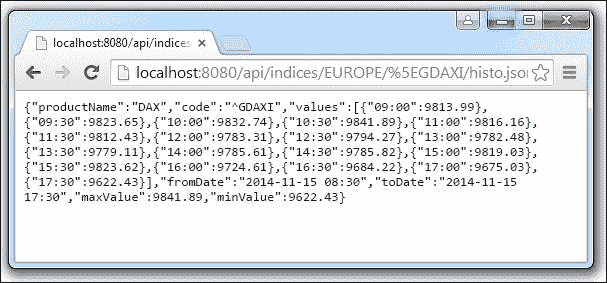
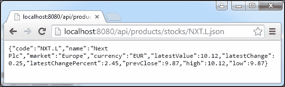
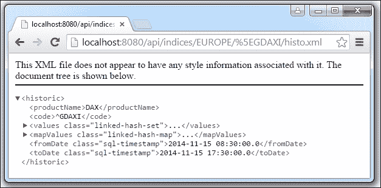

# 第 4 章为无状态架构构建 REST API

本章将介绍以下配方：

*   绑定请求和封送响应
*   配置内容协商（`json`、`xml`等）
*   添加分页、筛选器和排序功能
*   全局处理异常
*   用招摇过市的方式记录和公开 API

# 导言

在本章中，将实施许多更改。事实上，本章确实将我们的应用程序开发置于加速阶段。

在深入研究代码之前，我们需要温习一下有关 REST 的一些概念。

## 休息的定义

REST 是一种建筑风格。其名称是代表性国家转移的缩写。这个术语是由 RoyFielding 发明的，他是 HTTP 规范的主要作者之一。REST 体系结构是围绕几个标记设计的：

*   **可识别资源**：资源定义域。资源必须由 URI 标识。使用资源类别和层次结构，此 URI 必须尽可能自解释。我们的资源将是指数快照、股票快照、历史指数数据、历史股票数据、用户等。
*   **HTTP 作为通信协议**：我们使用有限数量的 HTTP 方法（`GET`、`POST`、`PUT`、`DELETE`、`HEAD`和 `OPTIONS`与资源交互。
*   **资源表示**：资源在特定表示下可视化。表示通常对应于媒体类型（`application/json`、`application/xml`、`text/html`）和/或文件扩展名（`*.json`、`*.xml`、`*.html`）。
*   **无状态对话**：服务器不能保留对话的痕迹。必须禁止使用 HTTP 会话，并通过与资源（超媒体）一起提供的链接进行导航。客户端身份验证会在每个请求上重复。
*   **可扩展性**：无状态设计意味着易于扩展。一个请求可以发送到一个或另一个服务器。这是负载平衡器的角色。
*   **超媒体**：正如我们刚才提到的，资源带来了链接，这些链接推动了对话的转换。

## 宁静的云端街市

从本章开始，所有实现的数据检索现在都通过 REST 使用 AngularJS 进行处理。我们使用 Angular routing 来完成单页应用程序设计（从服务器加载一次）。还有一些新服务支持三个关于股票和指数的新屏幕。

不过，REST 实现仍然是局部的。我们只实现了数据检索（`GET`；我们还没有有效的身份验证，超媒体也将在稍后推出。

# 绑定请求和编组响应

此配方说明了如何为 REST 处理程序配置 Spring MVC，使其尽可能与其业务域集成。我们专注于设计自解释方法处理程序、外部化类型转换和抽象响应编组（序列化为特定格式，如`json`、`xml`、`csv`等）。

## 准备好了吗

我们将审查应用于`cloudstreetmarket-api`webapp 的配置更改，以便从请求参数或 URI 模板变量设置类型转换。

我们将看到如何将自动编组（用于响应）配置到`json`。我们将重点介绍为本章创建的两个非常简单的方法处理程序。

## 怎么做。。。

以下步骤描述了与请求绑定和响应编组配置相关的代码库更改：

1.  从 Eclipse 中的**Git 透视图**中，查看分支`v4.x.x`的最新版本。然后在`cloudstreetmarket-parent`模块上运行`maven clean install`命令。为此，右键单击模块，选择**运行方式…****Maven Clean**，然后再次选择**运行方式…****Maven 安装**。之后，选择**Maven 更新项目**将 Eclipse 与 Maven 配置同步。为此，右键单击模块，然后选择**Maven****更新项目…**。
2.  主要配置更改在`dispatcher-context.xml`文件中（在**cloudstreetmarket api**模块中）。`RequestMappingHandlerAdapter`bean 定义了三个`webBindingInitializer`、`messageConverters`和`customArgumentResolvers`属性：

    ```
    <bean class="org.sfw.web...
      method.annotation.RequestMappingHandlerAdapter">
      <property name="webBindingInitializer">
        <bean class="org.sfw...
         support.ConfigurableWebBindingInitializer">
          <property name="conversionService" ref="conversionService"/>
        </bean>
        </property>
      <property name="messageConverters">
        <list>
            <ref bean="jsonConverter"/>
          </list>
      </property>
      <property name="customArgumentResolvers">
        <list>
          <bean class="net.kaczmarzyk.spring.data.jpa.web.
          SpecificationArgumentResolver"/>
          <bean	class="org.sfw.data.web.PageableHandlerMethodArgumentResolver">
              <property name="pageParameterName" value="pn"/>
              <property name="sizeParameterName" value="ps"/>
              </bean>
        </list>
      </property>
      <property name="requireSession" value="false"/>
    </bean>

    <bean id="jsonConverter" class="org.sfw...
        converter.json.MappingJackson2HttpMessageConverter">
        <property name="supportedMediaTypes" value="application/json"/>
      <property name="objectMapper">
        <bean class="com.fasterxml.jackson. databind.ObjectMapper">
          <property name="dateFormat">
         <bean class="java.text.SimpleDateFormat">
           <constructor-arg type="java.lang.String" value="yyyy-MM-dd HH:mm"/>
           </bean>
          </property>
        </bean>
        </property>
    </bean>
    <bean id="conversionService" class="org.sfw.format.support.FormattingConversionServiceFactoryBean">
      <property name="converters">
        <list>
          <bean class="edu.zc.csm.core. converters.StringToStockProduct"/>
        </list>
      </property>
    </bean>
    ```

3.  以下 Maven 依赖项已添加到父项目（并间接添加到核心和 API 项目）：

    ```
          <dependency>
             <groupId>com.fasterxml.jackson.core</groupId>
                 <artifactId>jackson-annotations</artifactId>
                 <version>2.5.1</version>
           </dependency>
             <dependency>
                 <groupId>com.fasterxml.jackson.core</groupId>
                 <artifactId>jackson-databind</artifactId>
                 <version>2.5.1</version>
             </dependency>
             <dependency>
                 <groupId>commons-collections</groupId>
                 <artifactId>commons-collections</artifactId>
                 <version>3.2</version>
             </dependency>
             <dependency>
                 <groupId>net.kaczmarzyk</groupId>
                 <artifactId>specification-arg-resolver</artifactId>
                 <version>0.4.1</version>
             </dependency>
    ```

4.  在我们的控制器超类`CloudstreetApiWCI`中，`allowDateBinding`方法已创建，并带有`@InitBinder`注释：

    ```
      private DateFormat df = new SimpleDateFormat("yyyy-MM-dd");

      @InitBinder
      public void allowDateBinding ( WebDataBinder binder ){
        binder.registerCustomEditor( Date.class, new CustomDateEditor( df, true ));
      }
    ```

5.  所有这些配置都允许我们定义自解释和无逻辑的方法处理程序，例如`IndexController`：

    ```
      @RequestMapping(value="/{market}/{index}/histo", method=GET)
      public HistoProductDTO getHistoIndex(
        @PathVariable("market") MarketCode market, 
        @PathVariable("index") String indexCode,
        @RequestParam(value="fd",defaultValue="") Date fromDate,
        @RequestParam(value="td",defaultValue="") Date toDate,
        @RequestParam(value="i",defaultValue="MINUTE_30") QuotesInterval interval){
        return marketService.getHistoIndex(indexCode, market, fromDate, toDate, interval);
      }
    ```

    中的`getHistoIndex()`方法
6.  Now deploy the `cloudstreetmarket-api` module and restart the server. To do so, start by right-clicking on the Tomcat server in the **Servers** tab:

    

7.  Then select **Add and Remove…**from the right-click menu. In the Add and Remove… window, make sure you have the following configuration set up, and start the server.

    

8.  尝试调用 URL`http://localhost:8080/api/indices/EUROPE/^GDAXI/histo.json`。
9.  This URL targets the presented `getHistoIndex` method handler and produces the following `json` output:

    

10.  Now let's have a look at `StockProductController`. It hosts the following method handler:

    ```
    @RequestMapping(value="/{code}", method=GET)
    @ResponseStatus(HttpStatus.OK)
    public StockProductOverviewDTO getByCode(
    @PathVariable(value="code") StockProduct stock){
      return StockProductOverviewDTO.build(stock);
    }
    ```

    ### 提示

    这里没有对任何服务层的显式调用。还有，回报。方法处理程序的类型为`StockProductOverviewDTO`，是一个简单的 POJO。响应主体的编组是透明的。

11.  In the **cloudstreetmarket-core** module, the `StringToStockProduct` converter must be presented because it was required to achieve the previous step:

    ```
    @Component
    public class StringToStockProduct implements Converter<String, StockProduct> {

    @Autowired
    private ProductRepository<StockProduct> productRepository;

    @Override
    public StockProduct convert(String code) {
      StockProduct stock = productRepository.findOne(code);
      if(stock == null){
        throw new NoResultException("No result has been found for the value "+ code +" !");
      }
      return stock;
    }
    }
    ```

    ### 提示

    此转换器已在`conversionService`中较早注册（*步骤 2*。

12.  Try to call the URL `http://localhost:8080/api/products/stocks/NXT.L.json`. This should target the presented `getByCode` handler and produce the following `json` response:

    

## 它是如何工作的。。。

为了理解前面的元素是如何协同工作的，我们必须介绍`RequestMappingHandlerAdapter`的关键作用。

### 超级请求映射 HandlerAdapter bean

我们在[第二章](09.html#aid-2G3F81 "Chapter 2. Designing a Microservice Architecture with Spring MVC")中简要介绍了，用 Spring MVC 设计了一个微服务架构。这个 bean 实现了高级`HandlerAdapter`接口，它允许自定义 MVC 核心工作流实现。`RequestMappingHandlerAdapter`是框架附带的本机实现。

我们提到了`RequestMappingHandlerAdapter`和`RequestMappingHandlerMapping` 分别是目前已弃用的`AnnotationMethodHandlerAdapter`和`DefaultAnnotationHandlerMapping`的两个替代类。

事实上，`RequestMappingHandlerAdapter`为所有方法处理程序提供了更好的集中化。此外，还为`HandlerInterceptors`和`HandlerExceptionResolver`提供了一些新功能。

### 提示

实际上，可以在`preHandle`、`postHandle`和`afterCompletion`方法的签名（`WebContentInterceptors`中找到的处理程序参数可以转换为`HandlerMethod`对象。`HandlerMethod`类型提供了有趣的检查方法，如`getReturnType`、`getMethodAnnotation`、`getMethodParameters`。

此外，关于`RequestMappingHandlerAdapter`和`RequestMappingHandlerMapping`，Spring 文档规定：

|   | *“MVC 名称空间和 MVC Java 配置默认启用新的支持类，但如果两者都不使用，则必须显式配置。”* |   |
|   | --*JavaDoc* |

在我们的两个 web 应用程序中，我们都使用 MVC 名称空间，特别是带有`<mvc:annotation-driven/>`元素的名称空间。

该元素通过在几个 web 功能上激活的默认配置功能是令人愉快的。然而，在很多情况下，不同的行为仍然是可以预期的。

在大多数情况下，自定义定义要么在名称空间本身上进行，要么在`RequestMappingHandlerAdapter`上进行。

#### 对@RequestMapping 注释的广泛支持

`RequestMappingHandlerAdapter`的主要作用是为`HandlerMethod`类型的处理程序提供支持和定制。这些处理程序绑定到`@RequestMapping`注释。

|   | *“HandlerMethod 对象封装了由方法和 bean 组成的处理程序方法的信息。提供了对方法参数、方法返回值和方法注释的方便访问。”* |   |
|   | --*JavaDoc* |

`RequestMappingHandlerAdapter`的支撑方式大部分来自历史`DefaultAnnotationHandlerMapping`。让我们仔细看看我们特别感兴趣的方法。

##### 设置消息转换器

`messageConverters`模板可以通过`setMessageConverters`设置器注册为`List<HttpMessageConverter>`。Spring 将为我们将 HTTP 请求的主体解组为 Java 对象，并将 Java 资源编组为 HTTP 响应的主体。

请务必记住，该框架为主要媒体类型提供转换器实现。默认情况下，它们在`RequestMappingHandlerAdapter`和`RestTemplate`中注册（在客户端）。

下表总结了我们可以使用的本机转换器：

<colgroup><col> <col> <col></colgroup> 
| 

提供的实现

 | 

默认情况下支持的媒体类型

 | 

（默认）行为

 |
| --- | --- | --- |
| `StringHttpMessageConverter` | `text/*` | 使用`text/plain`内容类型写入。 |
| `FormHttpMessageConverter` | `application/x-www-form-urlencoded` | 表单数据从`MultiValueMap<String, String>`中读取并写入。 |
| `ByteArrayHttpMessageConverter` | `*/*` | 使用`application/octet-stream`内容类型写入（可以重写）。 |
| `MarshallingHttpMessageConverter` | `text/xml and application/xml` | 需要`org.springframework.oxm`和`Marshaller`/`Unmarshaller`。 |
| `MappingJackson2HttpMessageConverter` | `application/json` | JSON 映射可以使用 Jackson 注释进行自定义。如果需要映射特定类型，则必须注入自定义的`ObjectMapper`属性。 |
| `MappingJackson2XmlHttpMessageConverter` | `application/xml` | XML 映射可以使用 JAXB 或 Jackson 注释进行定制。如果需要映射特定类型，则必须将自定义的`XmlMapper`属性注入`ObjectMapper`属性。 |
| `SourceHttpMessageConverter` | `text/xml and application/xml` | 可以读写`javax.xml.transform`。`Source`来自 HTTP 请求和响应。仅支持`DOMSource`、`SAXSource`和`StreamSource`。 |
| `BufferedImageHttpMessageConverter` |   | 可以从 HTTP 请求和响应中读写`java.awt.image.BufferedImage`。 |

请查看以下地址，以获取有关使用 Spring 的远程处理和 web 服务的信息：[http://docs.spring.io/spring/docs/current/spring-framework-reference/html/remoting.html](http://docs.spring.io/spring/docs/current/spring-framework-reference/html/remoting.html) 。

在我们的应用程序中，我们已经覆盖了两个本机`MappingJackson2HttpMessageConverter`和`MarshallingHttpMessageConverter`类的定义。

##### 设置自定义解析程序

`setCustomArgumentResolvers`setter 为`RequestMappingHandlerAdapter`提供了对自定义参数的支持。如果您还记得在[第 2 章](09.html#aid-2G3F81 "Chapter 2. Designing a Microservice Architecture with Spring MVC")中*使用 Spring MVC 支持响应性设计*的话，第一个方法就是讨论支持的参数注释。当时我们看到了`@PathVariable`、`@MatrixVariable`、`@RequestBody`、`@RequestParam`等等。

所有这些注释都是内置的`ArgumentResolver`。它们被映射到已注册的实现，以从外部预填充来自不同来源的参数。

我们可以定义自己的注释，并按照所需的业务逻辑预填充方法参数。这些解析器必须实现`HandlerMethodArgumentResolver`接口。

我们的应用程序的开发没有特别要求开发`customArgumentResolver`。然而，我们已经登记了其中两个：

*   `net.kaczmarzyk.spring.data.jpa.web.SpecificationArgumentResolver`：这个解析器是一个第三方库，我们将在本章的第三个配方中解释
*   `org.springframework.data.web.PageableHandlerMethodArgumentResolver`：这将允许自动解析分页参数，以便使用本机 Spring 数据分页支持

##### 设置 WebBindingInitializer

`WebBindingInitializer`接口是一个回调接口，用于全局初始化`WebDataBinder`并在 web 请求上下文中执行数据绑定。

在继续之前，我们必须停止并重新回顾配方的第 4 步，该步骤定义了以下方法：

```
  @InitBinder
  public void allowDateBinding(WebDataBinder binder){
    binder.registerCustomEditor(Date.class, new CustomDateEditor( df, true ));
  }
```

我们在控制器中定义此方法，以使用`PropertyEditor`注册抽象的日期转换绑定。

现在让我们关注`WebDataBinder`论点。在本节中，我们将讨论初始化部分。`WebDataBinder`接口提供了两种有趣的方法。这些方法主要与验证相关（`validate`、`setRequiredFields`、`isAllowed`、`getErrors`等）和转换相关（`getTypeConverter`、`registerCustomEditor`、`setBindingErrorProcessor`、`getBindingResult`等）。

`WebDataBinder`参数也可以设置为`ConversionService`对象。我们将使用全局和声明式初始化，而不是在`allowDateBinding`方法（使用`WebDataBinder.setConversion`setter）中进行本地初始化。

我们选择的`WebBindingInitializer`实现是 Spring`ConfigurableWebBindingInitializer`bean。对于 Spring 应用程序上下文中的声明性配置，它确实是一个方便的类。它支持在多个控制器/处理程序上重用预配置的初始值设定项。

在我们的例子中，`WebBindingInitializer`将有助于全局初始化注册类型转换器，如`StringToStockProduct`，但也有助于实现我们所期望的全局异常处理。

#### 转换服务 API

第 11 步定义了一个`StringToStockProduct`转换器，该转换器允许定义一个洁净的`getByCode`方法处理器：

```
@RequestMapping(value="/{code}", method=GET)
@ResponseStatus(HttpStatus.OK)
public StockProductOverviewDTO getByCode(
@PathVariable(value="code") StockProduct stock){
  return StockProductOverviewDTO.build(stock);
}
```

这些转换器可以广泛用于 Spring 应用程序中的任何转换，而不受请求范围的限制。他们使用仿制药可能非常有益。它们被绑定到一个`conversionService`bean，并且没有具体的方法来避免它们各自的声明。

#### 在属性编辑器或转换器之间选择

`PropertyEditors`和`ConversionService`中的转换器可能会在其字符串到类型使用中相互替代。

Spring 大量使用`PropertyEditors`的概念为 bean 设置属性。在 SpringMVC 中，它们用于解析 HTTP 请求。它们在 SpringMVC 中的声明绑定到请求范围。

即使它们可以全局初始化，您也必须将`PropertyEditors`视为最初受限制的范围元素。以这种方式看待他们使他们对`@InitBinder`方法和`WebBinderData`的依恋合法化。它们不像转换器那样通用。

当对枚举使用`PropertyEditors`时，Spring 提供了一种命名约定，可以避免枚举的单独声明。稍后我们将利用这个方便的约定。

## 还有更多。。。

在接下来的食谱中，我们将研究其他`RequestMappingHandlerAdapter`特性。现在，有更多关于`PropertyEditors`的讨论，尤其是内置的。

### 内置属性编辑器实现

以下`PropertyEditors`实现是 Spring 自带的。为了绑定，可以在所有控制器中手动应用它们。您可能会认出已在`CloudstreetApiWCI`中注册的`CustomDateEditor`。

<colgroup><col> <col></colgroup> 
| 

提供的实现

 | 

默认行为

 |
| --- | --- |
| `ByteArrayPropertyEditor` | 这是字节数组的编辑器。字符串将简单地转换为其相应的字节表示形式。默认情况下由`BeanWrapperImpl`注册。 |
| `ClassEditor` | 解析字符串将类表示为实际类，反之亦然。当找不到类时，将抛出一个`IllegalArgumentException`异常。默认情况下由`BeanWrapperImpl`注册。 |
| `CustomBooleanEditor` | 这是一个可自定义的布尔属性编辑器。默认情况下由`BeanWrapperImpl`注册，但可以通过将其自定义实例注册为自定义编辑器来覆盖它。 |
| `CustomCollectionEditor` | 这是集合的属性编辑器，用于将任何源集合转换为给定的目标集合类型。 |
| `CustomDateEditor` | 这是`java.util.Date`的可自定义属性编辑器，支持自定义`DateFormat`。默认情况下，它未注册。用户必须按要求以适当的格式进行注册。 |
| `CustomNumberEditor` | 这是一个可自定义的属性编辑器，可用于任何数字子类，如`Integer`、`Long`、`Float`或`Double`。默认情况下，它由`BeanWrapperImpl`注册，但可以通过将其自定义实例注册为自定义编辑器来覆盖它。 |
| `FileEditor` | 此编辑器能够将字符串解析为`java.io.File`对象。默认情况下由`BeanWrapperImpl`注册。 |
| `InputStreamEditor` | 此是一个单向属性编辑器，能够获取文本字符串并生成`InputStream`（通过中间层`ResourceEditor`和`Resource`）。`InputStream`属性可以直接设置为字符串。默认用法不会关闭`InputStream`属性。默认情况下由`BeanWrapperImpl`注册。 |

### Spring IO 参考文件

在 Spring IO 参考文档中找到更多关于类型转换和`PropertyEditors`的详细信息，请查看：[http://docs.spring.io/spring/docs/3.0.x/spring-framework-reference/html/validation.html](http://docs.spring.io/spring/docs/3.0.x/spring-framework-reference/html/validation.html) 。

# 配置内容协商（JSON、XML 等）

在这个配方中，我们将看到如何配置我们希望系统根据客户期望来决定呈现哪种格式的方式。

## 准备好了吗

在这里，我们将主要回顾 XML 配置。然后，我们将使用不同的请求测试 API，以确保对 XML 格式提供支持。

## 怎么做。。。

1.  `RequestMappingHandlerAdapter`配置已在`dispatcher-context.xml`中更改。添加了一个`contentNegotiationManager`属性，以及一个`xmlConverter`bean:

    ```
    <bean class="org.sfw.web...
      method.annotation.RequestMappingHandlerAdapter">
      <property name="messageConverters">
        <list>
          <ref bean="xmlConverter"/>
          <ref bean="jsonConverter"/>
          </list>
      </property>
      <property name="customArgumentResolvers">
        <list>
          <bean class="net.kaczmarzyk.spring.data.jpa. web.SpecificationArgumentResolver"/>
        <bean class="org.sfw.data.web. PageableHandlerMethodArgumentResolver">
          <property name="pageParameterName" value="pn"/>
          <property name="sizeParameterName" value="ps"/>
          </bean>
        </list>
      </property>
      <property name="requireSession" value="false"/>
      <property name="contentNegotiationManager" ref="contentNegotiationManager"/>
    </bean>

    <bean id="contentNegotiationManager" class="org.sfw.web.accept. ContentNegotiationManagerFactoryBean">
      <property name="favorPathExtension" value="true" />
      <property name="favorParameter" value="false" />
      <property name="ignoreAcceptHeader" value="false"/>
      <property name="parameterName" value="format" />
      <property name="useJaf" value="false"/>
      <property name="defaultContentType" value="application/json" />
      <property name="mediaTypes">
        <map>
          <entry key="json" value="application/json" />
          <entry key="xml" value="application/xml" />
       </map>
      </property>
    </bean>
    <bean id="xmlConverter" class="org.sfw.http...xml.MarshallingHttpMessageConverter">
      <property name="marshaller">
        <ref bean="xStreamMarshaller"/>
      </property>
      <property name="unmarshaller">
        <ref bean="xStreamMarshaller"/>
      </property>
    </bean>
    <bean id="xStreamMarshaller" class="org.springframework.oxm.xstream.XStreamMarshaller">
      <property name="autodetectAnnotations" value="true"/>
    </bean>
    ```

2.  `XStream`中添加了一个 Maven 依赖项，如下所示：

    ```
        <dependency>
          <groupId>com.thoughtworks.xstream</groupId>
           <artifactId>xstream</artifactId>
          <version>1.4.3</version>
        </dependency>
    ```

3.  Calling the URL: `http://localhost:8080/api/indices/EUROPE/^GDAXI/histo.json` should target the `getHistoIndex()` handler the same way as before and you should receive the same `json` response:

    

4.  Also, calling the URL `http://localhost:8080/api/indices/EUROPE/^GDAXI/histo.xml` should now generate the following XML formatted response:

    

## 它是如何工作的。。。

我们使用`MarshallingHttpMessageConverter`bean 增加了对 XML 的支持，定义了默认媒体类型（`application/json`，并定义了全局内容协商策略。

### 支持 XML 编组

正如我们在前面的配方中所说，`MarshallingHttpMessageConverter`附带了框架，但它需要`spring-oxm`依赖项，以及封送器和解封送器的定义。`spring-oxm`是此处参考的 Maven 人工制品：

```
<dependency>
  <groupId>org.springframework</groupId>
  <artifactId>spring-oxm</artifactId>
  <version>${spring.version}</version>
</dependency>
```

#### XStream 编组站

我们选择`XStreamMarshaller`作为 XML 编组操作的提供者：

```
<bean class="org.springframework.oxm.xstream.XStreamMarshaller">
  <property name="autodetectAnnotations" value="true"/>
</bean>
```

`XStream`编组站是`spring-oxm`项目的一部分。即使外部源解析*不推荐*（这不是我们想要做的*和*一样），它也非常好，默认情况下只需要很少的配置（不需要特定的类注册或初始映射策略）。

可以对类型和字段进行注释以自定义默认行为。您可以从他们的文档中找到一些示例：

*   `@XStreamAlias`：用于类型、字段或属性
*   `@XStreamImplicit`：用于集合或数组中
*   `@XStreamAsAttribute`：用于将字段标记为属性
*   `@XStreamConverter`：针对现场的特定转换器

在本例中，我们在 DTO 中应用了最小编组定制。

你可以在他们的官方网站上找到更多关于`XStream`的信息：[http://xstream.codehaus.org](http://xstream.codehaus.org) 。

### 与 ContentNegotiationManager 的谈判策略

在这里，我们讨论的是我们配置系统以选择一种媒体类型而不是另一种媒体类型的方式来进行响应。客户机在其请求中显示期望值，而服务器试图从可用的解决方案中最大限度地满足这些期望值。

客户机可以通过三种方式指定其媒体类型期望值。我们将在以下章节中讨论这些问题。

#### 接受头

客户端请求指定一个 mime 类型或 mime 类型列表（`application/json`、`application/xml`等）作为`Accept`头的值。它是 SpringMVC 的默认选择。

不过，Web 浏览器可以发送各种`Accept`头，完全依赖这些头是有风险的。因此，最好至少支持一种替代方案。

甚至可以使用`ContentNegotiationManager`中的`ignoreAcceptHeader`布尔属性完全忽略这些头。

#### URL 路径中的文件扩展名后缀

允许在 URL 路径中指定文件扩展名后缀是一种选择。这是我们配置中的鉴别器选项。

为此，`ContentNegotiationManager`中的`favorPathExtension`布尔属性已设置为 true，我们的 AngularJS 工厂实际上请求`.json`路径。

#### 请求参数

如果不喜欢路径扩展选项，可以定义具体的查询参数。此参数的默认名称为`format`。可通过`parameterName`属性进行定制，潜在的期望值为注册的格式后缀（`xml`、`html`、`json`、`csv`等）。

此选项可以设置为具有`favorParameter`布尔属性的鉴别器选项。

#### Java 激活框架

将`useJaf`布尔属性设置为 true 将配置为依赖 Java 激活框架，而不是 Spring MVC 本身，来实现后缀到媒体类型的映射（`json`对应于`application/json`、`xml`对应于`application/xml`等等）。

### @RequestMapping 注释作为最终过滤器

最后，带有`@RequestMapping`注释，特别是`produces`属性的控制器应该拥有格式呈现的最终决定权。

## 还有更多。。。

现在我们来看看 JAXB2 作为 XML 解析器的实现和`ContentNegotiationManagerFactoryBean`配置。

### 使用 JAXB2 实现作为 XML 解析器

JAXB2 是当前用于 XML 绑定的 Java 规范。我们的`XStream`示例只是一个示例，当然可以使用另一个 XML 封送器。Spring 支持 JAXB2。它甚至在`spring-oxm`包`org.springframework.oxm.jaxb.Jaxb2Marshaller`中提供了一个默认的 JAXB2 实现。

在 DTO 中使用 JAXB2 注释可能是更好的可移植性选择。有关其配置的更多详细信息，请访问 `Jaxb2Marshaller`JavaDoc:：[http://docs.spring.io/autorepo/docs/spring/4.0.4.RELEASE/javadoc-api/org/springframework/oxm/jaxb/Jaxb2Marshaller.html](http://docs.spring.io/autorepo/docs/spring/4.0.4.RELEASE/javadoc-api/org/springframework/oxm/jaxb/Jaxb2Marshaller.html) 。

### ContentNegotiationManagerFactoryBean JavaDoc

`ContentNegotiationManagerFactoryBean`的完整可能配置可在其 JavaDoc 中再次访问：

[http://docs.spring.io/spring/docs/current/javadoc-api/org/springframework/web/accept/ContentNegotiationManagerFactoryBean.html](http://docs.spring.io/spring/docs/current/javadoc-api/org/springframework/web/accept/ContentNegotiationManagerFactoryBean.html)

# 添加分页、筛选和排序功能

现在我们已经介绍了 Spring MVC REST 配置的基础，我们将通过添加分页、过滤和排序功能来改进我们的 REST 服务。

## 准备好了吗

分页是 Spring 数据项目中开发的一个概念。为了添加分页，我们将为从请求填充的包装器实现引入`Pageable`接口。这些数据由 Spring 数据进一步识别和处理。

Spring 数据可以生成`Page`接口，特别是`PageImpl`实例，以格式化其结果。我们将使用它们，因为它们非常适合 REST 渲染。

最后，我们将详细介绍这里用于从控制器逻辑中抽象筛选和分页的两个数据绑定工具。

## 怎么做。。。

1.  在方法处理程序中，我们添加了希望它们支持的参数。`IndexController`中的以下处理程序现在提供分页和排序：

    ```
    import org.springframework.data.domain.PageRequest;

        @RequestMapping(value="/{market}", method=GET)
        public Page<IndexOverviewDTO> getIndicesPerMarket(
          @PathVariable MarketCode market,
          @PageableDefault(size=10, page=0, sort={"dailyLatestValue"}, direction=Direction.DESC) Pageable pageable){
            return marketService. getLastDayIndicesOverview(market, pageable);
    }
    ```

2.  In the corresponding service layer implementation, the `pageable` instance is passed to the Spring Data JPA abstracted implementation:

    ```
    @Override
    public Page<IndexOverviewDTO> getLastDayIndicesOverview(Pageable pageable) {
        Page<Index> indices = indexProductRepository.findAll(pageable);
        List<IndexOverviewDTO> result = new LinkedList<>();
        for (Index index : indices) {
          result.add(IndexOverviewDTO.build(index));
        }
        return new PageImpl<>(result, pageable,   indices.getTotalElements());
    }
    ```

    这几乎就是分页和排序模式的全部内容！所有样板代码都是透明的。它允许我们神奇地检索包装在页面元素中的资源，该元素携带前端分页可能需要的工具。对于我们的特定方法处理程序，调用 URL：

    `http://localhost:8080/api/indices/US.json?size=2&page=0&sort=dailyLatestValue`、`asc`在以下 JSON 响应中产生：

    

3.  我们也应用了这种模式，通过分页动态检索索引，尽管它几乎是相同的方法处理程序定义。
4.  我们还再次应用相同的模式来检索用户活动（在`CommunityController`中）：

    ```
    @RequestMapping(value="/activity", method=GET)
    @ResponseStatus(HttpStatus.OK)
    public Page<UserActivityDTO> getPublicActivities(
      @PageableDefault(size=10, page=0, sort={"quote.date"},direction=Direction.DESC) Pageable pageable){
      return communityService.getPublicActivity(pageable);
    }
    ```

5.  Now we have adapted the AngularJS layer (detailed in the *See also...* section of this recipe), we have been able to entirely rewire our welcome page to use REST services with also an infinite scrolling for user activities:

    

6.  To fully use the REST service's capabilities, there is now a new screen called *INDICES BY MARKET* accessible from the **Prices and markets** menu:

    

    这里给出的表是完全自治的，因为它具有完全角度化（AngularJS）和异步分页/排序功能。

7.  `StockProductController`对象在其`search()`方法处理程序中实现了分页和排序模式，但还有一个过滤功能，允许用户结合`AND`限制操作`LIKE`SQL 运算符：

    ```
    @RequestMapping(method=GET)
    @ResponseStatus(HttpStatus.OK)
    public Page<ProductOverviewDTO> search(
    @And(value = { @Spec(params = "mkt", path="market.code",spec = EqualEnum.class)},
       and = { @Or({
    @Spec(params="cn", path="code", spec=LikeIgnoreCase.class),
    @Spec(params="cn", path="name", spec=LikeIgnoreCase.class)})}
      ) Specification<StockProduct> spec,
    @RequestParam(value="mkt", required=false) MarketCodeParam market, 
    @RequestParam(value="sw", defaultValue="") String startWith, 
    @RequestParam(value="cn", defaultValue="") String contain, 
    @PageableDefault(size=10, page=0, sort={"dailyLatestValue"}, direction=Direction.DESC) Pageable pageable){
      return productService.getProductsOverview(startWith, spec, pageable);
    }
    ```

8.  `productService`实现在其`getProductsOverview`方法中（如图所示），指的是创建的`nameStartsWith`方法：

    ```
    @Override
    public Page<ProductOverviewDTO> getProductsOverview(String startWith, Specification<T> spec, Pageable pageable) {
      if(StringUtils.isNotBlank(startWith)){
        spec = Specifications.where(spec).and(new ProductSpecifications<T>().nameStartsWith(startWith);
      }
      Page<T> products = productRepository.findAll(spec, pageable);
      List<ProductOverviewDTO> result = new LinkedList<>();
      for (T product : products) {
        result.add(ProductOverviewDTO.build(product));
      }
      return new PageImpl<>(result, pageable, products.getTotalElements());
    }
    ```

9.  `nameStartsWith`方法是位于`ProductSpecifications`类

    ```
    public class ProductSpecifications<T extends Product> {
    public Specification<T> nameStartsWith(final String searchTerm) {
      return new Specification<T>() {
      private String startWithPattern(final String searchTerm) {
        StringBuilder pattern = new StringBuilder();
    	pattern.append(searchTerm.toLowerCase());
        pattern.append("%");
        return pattern.toString();
      }
        @Override
          public Predicate toPredicate(Root<T> root,CriteriaQuery<?> query, CriteriaBuilder cb) {    
          return cb.like(cb.lower(root.<String>get("name")), startWithPattern(searchTerm));
    }
        };
      }
    }
    ```

    内核心模块的规格工厂
10.  Overall, the `search()` REST service is extensively used over three new screens related to stocks retrieval. These screens are accessible through the **Prices and markets** menu. Here is the new **ALL PRICES SEARCH** form:

    

11.  The following screenshot corresponds to the **SEARCH BY MARKET** form:

    

12.  Finally, find the following new **Risers and Fallers** screen:

    

## 它是如何工作的。。。

同样，这个配方主要是关于 Spring 数据，以及如何让 Spring MVC 为我们支持 Spring 数据。

### Spring 数据分页支持（您会喜欢的！）

在上一章中，我们已经看到了 Spring 数据存储库抽象的一些好处。

在本节中，我们将看到 Spring 数据如何在其抽象存储库中支持分页概念。SpringMVC 提供了一个非常有益的扩展，它带有一个特定的参数解析器，以防止任何定制的自适应逻辑。

#### 存储库中的分页和排序

您可以注意到在存储库接口的方法中使用了分页参数。例如，下面是`IndexRepositoryJpa`存储库：

```
public interface IndexRepositoryJpa extends JpaRepository<Index, 
  String>{
  List<Index> findByMarket(Market market);
  Page<Index> findByMarket(Market market, Pageable pageable);
  List<Index> findAll();
  Page<Index> findAll(Pageable pageable);
  Index findByCode(MarketCode code);
}
```

Spring 数据将`org.springframework.data.domain.Pageable`类型识别为方法参数。当不需要完整的`Pageable`实例时，它还可以识别`org.springframework.data.domain.Sort`类型。它将分页和排序动态应用于我们的查询。

您可以在这里看到更多示例（摘自 Spring 参考文档）：

```
Page<User> findByLastname(String lastname, Pageable pageable);
Slice<User> findByLastname(String lastname, Pageable pageable);
List<User> findByLastname(String lastname, Sort sort);
List<User> findByLastname(String lastname, Pageable pageable);
```

### 提示

请记住，分拣选项也通过`Pageable`处理。顺便说一句，这是我们在应用程序中排序的方式。

从这些额外的示例中，您可以看到 Spring 数据可以返回一个`Page``(org.springframework.data.domain.Page)`、一个`Slice``(org.springframework.data.domain.Slice)`或简单地返回一个`List`。

但这里有一个惊人的部分：`Page`对象包含我们在前端构建强大分页工具所需的一切！早些时候，我们看到`json`响应提供了一个`Page`元素。

通过以下请求：`http://localhost:8080/api/indices/US.json?size=2&page=0&sort=dailyLatestValue,asc`，我们请求了第一页，并收到一个`Page`对象，告诉我们该页是第一页还是最后一页（`firstPage: true/false`、`lastPage: true/false`），页面内的元素数量（`numberOfElements: 2`），页面总数，以及元素总数（`totalPages: 2`、`totalElements: 3`）。

### 提示

这意味着 Spring 数据首先执行我们希望它执行的查询，然后在没有分页过滤器的情况下透明地执行计数查询。

`Slice`对象是`Page`的超级接口，不携带`numberOfElements`和`totalElements`的计数。

#### 分页和排序存储库<T，ID>

如果存储库还没有扩展`JpaRepository<T,ID>`，我们可以让它扩展`PagingAndSortingRepository<T,ID>`，这是`CrudRepository<T,ID>`的扩展。它将提供额外的方法来使用分页和排序抽象检索实体。这些方法是：

```
Iterable<T> findAll(Sort sort);
  Page<T> findAll(Pageable pageable);
```

#### web 部件–PageableHandlerMethodArgumentResolver

正如前面介绍的，我们已经将`org.springframework.data.web.PageableHandlerMethodArgumentResolver`bean 作为`customArgumentResolver`添加到我们的`RequestMappingHandlerAdapter`中。这样做使我们能够依赖 Spring 数据绑定来透明地预填充作为方法处理程序参数可用的`Pageable`实例（在本配方的第一步中以粗体突出显示）。

以下是有关可用于绑定的请求参数的更多信息：

<colgroup><col> <col> <col></colgroup> 
| 

参数名

 | 

目的/用途

 | 

默认值

 |
| --- | --- | --- |
| `page` | 我们要检索的页面。 | 0 |
| `size` | 我们要检索的页面的大小。 | 10 |
| `sort` | 应按`property,property(,ASC&#124;DESC)`格式排序的属性。如果我们想要切换方向，我们应该使用多个`sort`参数，例如：`?sort=firstname&sort=lastname,asc`。 | 默认的排序方向是升序。 |

正如我们在第一步中实现的，在缺少特定参数的情况下，可以自定义默认值。这是通过`@PageableDefault`注释实现的：

```
@PageableDefault(
size=10, page=0, sort={"dailyLatestValue"}, direction=Direction.DESC
)
```

### 提示

页面、大小和排序参数名称可以通过在 Spring 配置中设置适当的`PageableHandlerMethodArgumentResolver`属性来覆盖。

如果出于某种原因我们不使用`PageableHandlerMethodArgumentResolver`，我们仍然可以捕获我们自己的请求参数（用于分页）并从中构建`PageRequest`实例（例如，`org.springframework.data.domain.PageRequest`是`Pageable`实现）。

### 一个有用的规范参数解析器

在介绍这个有用的规范参数解析器之前，我们必须先介绍规范的概念。

#### JPA2 标准 API 和 Spring 数据 JPA 规范

Spring 数据参考文档告诉我们 JPA2 引入了一个 CriteriaAPI，可用于以编程方式构建查询。在编写`criteria`时，我们实际上为一个域类定义了查询的 where 子句。

Spring Data JPA 采用 Eric Evans 的书*领域驱动设计*中的规范概念，遵循相同的语义，并提供了一个 API 来使用 JPA 标准 API 定义此类规范。

为了支持规范，我们可以使用`JpaSpecificationExecutor`接口扩展我们的存储库接口，就像我们在`ProductRepository`接口中所做的那样：

```
@Repository
public interface ProductRepository<T extends Product> extends JpaRepository<T, String>, JpaSpecificationExecutor<T> {
  Page<T> findByMarket(Market marketEntity, Pageable pageable);
  Page<T> findByNameStartingWith(String param, Pageable pageable);
  Page<T> findByNameStartingWith(String param, Specification<T> spec, Pageable pageable);
}
```

在我们的示例中，`findByNameStartingWith`方法检索名称以`param`参数开头且与`spec`规范匹配的特定类型（`StockProduct`的所有产品。

#### 规格参数分解器

正如我们前面提到的，这个`CustomArgumentResolver`并不一定是一个正式的 Spring 项目（目前）。它的使用可以适合一些用例，例如本地搜索引擎，以补充 Spring 数据动态查询、分页和排序功能。

与我们从特定参数构建`Pageable`实例的方式相同，此参数解析器还允许我们从特定参数透明地构建`Specification`实例。

它使用`@Spec`注释来定义`like`、`equal`、`likeIgnoreCase`、`in`等`where`子句。这些`@Spec`注释可以在`@And`和`@Or`注释的帮助下相互组合，形成`AND`和`OR`子句组。一个完美的用例是开发搜索功能，作为分页和排序功能的补充。

你应该阅读下面这篇文章，它是对该项目的介绍。本文标题为*“使用 Spring MVC 过滤数据的替代 API&Spring 数据 JPA”*：

[http://blog.kaczmarzyk.net/2014/03/23/alternative-api-for-filtering-data-with-spring-mvc-and-spring-data](http://blog.kaczmarzyk.net/2014/03/23/alternative-api-for-filtering-data-with-spring-mvc-and-spring-data)

此外，请使用以下地址查找项目的存储库及其文档：

[https://github.com/tkaczmarzyk/specification-arg-resolver](https://github.com/tkaczmarzyk/specification-arg-resolver)

### 提示

尽管它很有用，但请记住，该库的用户数量仍然远远低于 Spring 社区。

## 还有更多。。。

到目前为止，我们一直在关注 SpringMVC。然而，随着新屏幕的出现，前端（AngularJS）也发生了变化。

### 弹簧数据

要了解更多关于 Spring 数据功能的，请查看官方参考文档：

[http://docs.spring.io/spring-data/jpa/docs/1.8.0.M1/reference/html](http://docs.spring.io/spring-data/jpa/docs/1.8.0.M1/reference/html)

### 转角路线

如果您在**主页**和**价格和市场**菜单之间导航，您将看到整个页面从未完全刷新。所有内容都是异步加载的。

为了实现这一点，我们使用了 AngularJS 路由。已为此目的创建了`global_routes.js`文件：

```
cloudStreetMarketApp.config(function($locationProvider, $routeProvider) {
  $locationProvider.html5Mode(true);
  $routeProvider
    .when('/portal/index', {
      templateUrl: '/portal/html/home.html', 
      controller: 'homeMainController'
    })
  .when('/portal/indices-:name', {
    templateUrl: '/portal/html/indices-by-market.html', 
    controller: 'indicesByMarketTableController' 
  })
    .when('/portal/stock-search', {
      templateUrl: '/portal/html/stock-search.html', 
      controller:  'stockSearchMainController'
    })
    .when('/portal/stock-search-by-market', {
      templateUrl: '/portal/html/stock-search-by-market.html', 
      controller:  'stockSearchByMarketMainController'
    })
    .when('/portal/stocks-risers-fallers', {
      templateUrl: '/portal/html/stocks-risers-fallers.html', 
      controller:  'stocksRisersFallersMainController'
    })
    .otherwise({ redirectTo: '/' });
});
```

在这里，我们定义了路由（应用程序查询的 URL 路径，作为通过`href`标记导航的一部分）和 HTML 模板（在服务器上作为公共静态资源提供）之间的映射表。我们已经为这些模板创建了一个`html`目录。

然后，每当我们请求特定的 URL 路径时，AngularJS 异步加载一个模板。AngularJS 通常会对此进行转换（它基本上会删除并替换整个 DOM 部分）。由于模板只是模板，它们需要绑定到控制器，控制器通过我们的工厂操作其他 AJAX 请求，从 RESTAPI 中提取数据，并呈现预期的内容。

在前面的示例中：

*   `/portal/index`是一条路由，即请求的路径
*   `/portal/html/home.html`是映射的模板
*   `homeMainController`是目标控制器

## 另见

有关 AngularJS 路由的更多信息，请访问：

[https://docs.angularjs.org/tutorial/step_07](https://docs.angularjs.org/tutorial/step_07)

### 带角度 UI 的引导分页

我们已经使用了 UI 引导项目（[的分页组件 http://angular-ui.github.io/bootstrap AngularUI 团队的](http://angular-ui.github.io/bootstrap)（[http://angular-ui.github.io](http://angular-ui.github.io) ）。本项目提供一个`Boostrap`组件，该组件与 AngularJS 一起运行，并用于 AngularJS。

在分页的情况下，我们获得一个由特定 AngularJS 指令驱动的`Bootstrap`组件（与引导样式表完美集成）。

我们的分页组件之一可以在`stock-search.html`模板中找到：

```
<pagination page="paginationCurrentPage" 
  ng-model="paginationCurrentPage" 
  items-per-page="pageSize" 
  total-items="paginationTotalItems"
  ng-change="setPage(paginationCurrentPage)">   
</pagination>
```

`page`、`ng-model`、`items-per-page`、`total-items`和`ng-change`指令使用变量（`paginationCurrentPage`、`pageSize`和`paginationTotalItems`），这些变量附属于`stockSearchController`范围。

### 提示

欲了解有关本项目的更多信息，请访问其文档：

[http://angular-ui.github.io/bootstrap](http://angular-ui.github.io/bootstrap)

# 全局处理异常

此配方提供了一种在 web 应用程序中全局处理异常的技术。

## 准备好了吗

在 SpringMVC 中有不同的方法来处理异常。我们可以选择定义特定于控制器的`@ExceptionHandler`或选择在`@ControllerAdvice`类中全局注册`@ExceptionHandler`。

我们在 RESTAPI 中开发了第二个选项，即使我们的`CloudstreetApiWCI`超类可以在其控制器之间共享`@ExceptionHandler`。

现在，我们将了解如何将自定义和通用异常类型自动映射到 HTTP 状态代码，以及如何将正确的错误消息包装到任何客户端都可以使用的通用响应对象中。

## 怎么做。。。

1.  我们需要在发生错误时将包装器对象发送回客户端：

    ```
    public class ErrorInfo {
        public final String error;
        public int status;
        public final String date;

        private static final DateFormat dateFormat = new SimpleDateFormat("yyyy-MM-dd HH:mm:ss.SSS");
        public ErrorInfo(Throwable throwable, HttpStatus status){
          this.error = ExceptionUtil.getRootMessage(throwable);
          this.date = dateFormat.format(new Date());
          this.status = status.value();
       }
       public ErrorInfo(String message, HttpStatus status) {
          this.error = message;
          this.date = dateFormat.format(new Date());
          this.status = status.value();
       }
      @Override
      public String toString() {
        return "ErrorInfo [status="+status+", error="+error+ ", date=" + date + "]";
      }
    }
    ```

2.  We create a `RestExceptionHandler` class annotated with `@ControllerAdvice`. This `RestExceptionHandler` class also inherits the `ResponseEntityExceptionHandler` support class, which gives us access to a default mapping exception/response status ready to be overridden:

    ```
    @ControllerAdvice
    public class RestExceptionHandler extends ResponseEntityExceptionHandler {

       @Override
    protected ResponseEntity<Object> handleExceptionInternal(Exception ex, Object body, HttpHeaders headers, HttpStatus status, WebRequest request) {
    if(body instanceof String){
    return new ResponseEntity<Object>(new ErrorInfo((String) body, status), headers, status);
       }
      return new ResponseEntity<Object>(new ErrorInfo(ex, status), headers, status);
    }

        // 400
        @Override
    protected ResponseEntity<Object> handleHttpMessageNotReadable(final HttpMessageNotReadableException ex, final HttpHeaders headers, final HttpStatus status, final WebRequest request) {
    return handleExceptionInternal(ex, "The provided request body is not readable!", headers, HttpStatus.BAD_REQUEST, request);
    }

    @Override
    protected ResponseEntity<Object> handleTypeMismatch(TypeMismatchException ex, HttpHeaders headers, HttpStatus status, WebRequest request) {
      return handleExceptionInternal(ex, "The request parameters were not valid!", headers, HttpStatus.BAD_REQUEST, request);
      }
    (...)

    @ExceptionHandler({ InvalidDataAccessApiUsageException.class, DataAccessException.class , IllegalArgumentException.class })
    protected ResponseEntity<Object> handleConflict(final RuntimeException ex, final WebRequest request) {
        return handleExceptionInternal(ex, "The request parameters were not valid!", new HttpHeaders(), HttpStatus.BAD_REQUEST, request);
    }
    (...)

    // 500
    @ExceptionHandler({ NullPointerException.class, IllegalStateException.class })
    public ResponseEntity<Object> handleInternal(final RuntimeException ex, final WebRequest request) {
    return handleExceptionInternal(ex,  "An internal 	error happened during the request! Please try 	again or contact an administrator.", new HttpHeaders(), HttpStatus.INTERNAL_SERVER_ERROR, request);
    }
    }
    ```

    ### 提示

    `ErrorInfo`包装器和此`RestExceptionHandler`都将支持国际化。将在[第 7 章](12.html#aid-3BOFI1 "Chapter 7. Developing CRUD Operations and Validations")、*开发积垢操作和验证*中演示。

3.  We have created the two following property editors for the MarketCode and QuotesInterval Enums:

    ```
    public class MarketCodeEditor extends PropertyEditorSupport{
    public void setAsText(String text) {
        try{
          setValue(MarketCode.valueOf(text));
        } catch (IllegalArgumentException e) {
          throw new IllegalArgumentException("The provided value for the market code variable is invalid!");
        }
        }
    }
    public class QuotesIntervalEditor extends PropertyEditorSupport {
        public void setAsText(String text) {
        try{
           setValue(QuotesInterval.valueOf(text));
        } catch (IllegalArgumentException e) {
          throw new IllegalArgumentException("The provided value for the quote-interval variable is invalid!");
        }
      }
    }
    ```

    ### 提示

    这两个属性编辑器是自动注册的，因为它们满足命名和位置约定。由于`MarketCode`和`QuotesInterval`是枚举值，Spring 在枚举包中查找`MarketCodeEditor`（编辑器后缀）和`QuotesIntervalEditor`。

4.  就这样！您可以通过在 AngularJS 工厂的`getHistoIndex`方法中（在`home_financial_graph.js`文件中）提供错误的市场代码进行测试。将呼叫从`$http.get("/api/indices/"+market+"wrong/"+index+"/histo.json")`更改为`$http.get("/api/indices/"+market+"/"+index+"/histo.json")`。
5.  After restarting the whole application (**cloudstreetmarket-webapp** and **cloudstreetmarket-api**), the call to `http://localhost:8080/portal/index` will induce the **Ajax GET** request for the index loading to result in a **400** status code:

    

6.  More details about this failed request will show up in the `json` response:

    

    收到的错误消息-**为市场变量提供的值无效！**目前可以接受。

7.  您可以在得到此结果后重置`home_financial_graph.js`文件。

## 它是如何工作的。。。

这里，我们将重点介绍在 REST 环境中处理异常的方式。预期与纯 web 应用程序略有不同，因为直接用户不一定是人。因此，RESTAPI 必须保持标准的、一致的和自解释的通信，即使某个进程已生成错误或失败。

通过始终从服务器向客户端返回有关请求处理的适当 HTTP 状态代码反馈，并始终以客户端期望的格式（与**接受**中列出的 mime 类型之一相匹配的格式）返回响应正文，可实现的一致性 HTTP 请求的标头）。

### 使用@ControllerAdvice 进行全局异常处理

Spring3.2 带来了一种比以前的异常处理机制更适合 REST 环境的解决方案。使用此解决方案，可以在 API 的不同位置注册带有`@ControllerAdvice`注释的类。通过类路径扫描查找这些注释，并在公共存储库中自动注册以支持所有控制器（默认情况下）或控制器子集（使用注释选项）。

在我们的例子中，我们定义了一个`@ControllerAdvice`来监控整个 API。其想法是在`@ControllerAdvice`注释的`class(es)`中定义相关方法，这些方法可以将特定异常类型与特定响应匹配。ResponseEntity 带有主体和响应状态代码。

这些要定义的方法用`@ExceptionHandler`注释。此批注的选项允许您针对特定的异常类型。定义`@ControllerAdvice`时的一个常见模式是使其扩展支持类`ResponseEntityExceptionHandler`。

#### 支持响应 EntityExceptionHandler 类

支持`ResponseEntityExceptionHandler`类提供了本机异常（如`NoSuchRequestHandlingMethodException`、`ConversionNotSupportedException`、`TypeMismatchException`等）与 HTTP 状态码之间的预定义映射。

`ResponseEntityExceptionHandler`实现了响应呈现的通用模式。它调用声明为受保护的特定于案例的呈现方法，如以下`handleNoSuchRequestHandlingMethod`。

```
protected ResponseEntity<Object> handleNoSuchRequestHandlingMethod(NoSuchRequestHandlingMethod Exception ex, HttpHeaders headers, HttpStatus status, WebRequest request) {
    pageNotFoundLogger.warn(ex.getMessage());
  return handleExceptionInternal(ex, null, headers, status, request);
}
```

这些方法显然在`@ControllerAdvice`注释类中是完全可重写的。重要的是返回`handleExceptionInternal`方法。

此`handleExceptionInternal`方法也定义为受保护，然后可重写。这就是我们所做的，返回了一个统一的`ErrorInfo`实例：

```
@Override
protected ResponseEntity<Object> handleExceptionInternal(Exception ex, Object body, HttpHeaders headers, HttpStatus status, WebRequest request) {
  return new ResponseEntity<Object>(new ErrorInfo(ex, (body!=null)? body.toString() : null, status), headers, status);
}
```

#### 一个统一的错误响应对象

对于统一错误响应对象应该公开的字段，没有具体的标准实践。我们决定为`ErrorInfo`对象提供以下结构：

```
{
  error: "Global categorization error message",
  message: "Specific and explicit error message",
  status: 400,
  date: "yyyy-MM-dd HH:mm:ss.SSS"
}
```

使用两种不同级别的消息（来自异常类型的全局错误消息和特定于案例的消息）允许客户端为每种情况选择更合适的消息（甚至两者！）在应用程序中呈现。

正如我们已经说过的，这个`ErrorInfo`对象还不支持国际化。我们将在[第 7 章](12.html#aid-3BOFI1 "Chapter 7. Developing CRUD Operations and Validations")*开发 CRUD 操作和验证*中对其进行改进。

## 还有更多。。。

我们在这里提供了一组与 web 环境中的异常处理相关的资源：

### HTTP 状态码

**世界****万维网联盟**明确了 HTTP/1.1 的响应状态码。比错误消息本身更重要的是，RESTAPI 实现它们是至关重要的。您可以通过以下网址了解更多信息：

[http://www.w3.org/Protocols/rfc2616/rfc2616-sec010.html](http://www.w3.org/Protocols/rfc2616/rfc2616-sec010.html)

### 关于 Spring MVC 异常处理的官方文章

spring.io 博客中的一篇文章是一个非常有趣的资源。它不限于 REST 用例。可从以下地址访问：[http://spring.io/blog/2013/11/01/exception-handling-in-spring-mvc](http://spring.io/blog/2013/11/01/exception-handling-in-spring-mvc) 。

### JavaDocs

这里我们提供了两个 JavaDoc 资源的 URL，用于配置或简单使用：

异常句柄异常解析器：

[http://docs.spring.io/spring/docs/current/javadoc-api/org/springframework/web/servlet/mvc/method/annotation/ExceptionHandlerExceptionResolver.html](http://docs.spring.io/spring/docs/current/javadoc-api/org/springframework/web/servlet/mvc/method/annotation/ExceptionHandlerExceptionResolver.html)

ResponseEntityExceptionHandler：

[http://docs.spring.io/spring/docs/current/javadoc-api/org/springframework/web/servlet/mvc/method/annotation/ResponseEntityExceptionHandler.html](http://docs.spring.io/spring/docs/current/javadoc-api/org/springframework/web/servlet/mvc/method/annotation/ResponseEntityExceptionHandler.html)

## 另见

*   查看官方演示网站，该网站公开了不同类型的 SpringMVC 异常是如何呈现的：[http://mvc-exceptions-v2.cfapps.io](http://mvc-exceptions-v2.cfapps.io)

# 大摇大摆地记录并公开 API

本部分详细介绍了如何使用 Swagger 提供和公开 RESTAPI 的元数据。

## 准备好了吗

我们经常被要求为用户和客户记录 API。在记录 API 时，根据我们使用的工具，我们通常会获得一些额外的功能，例如从 API 元数据生成客户机代码的能力，甚至生成 API 的集成测试工具。

对于 API 元数据的格式，目前还没有公认的通用标准。由于缺乏标准，市场上的 REST 文档有很多不同的解决方案。

我们在这里选择了昂首阔步，因为它拥有最大、最活跃的社区。它自 2011 年就存在了，默认情况下提供了非常好的 UI/测试工具和良好的配置。

## 怎么做。。。

本节详细介绍了可以做什么，以及我们在签出的 v4.x.x 分支的代码库中做了什么。

1.  我们已经在**cloudstreetmarket 核心**和**cloudstreetmarket 母公司**

    ```
    <dependency>
      <groupId>com.mangofactory</groupId>
      <artifactId>swagger-springmvc</artifactId>
      <version>${swagger-springmvc.version}</version>
    </dependency> 
    ```

    中添加了`swagger-springmvc`项目（版本 0.9.5）的 Maven 依赖项
2.  已创建以下招摇`configuration`类：

    ```
    @Configuration
    @EnableSwagger //Loads the beans required by the framework
    public class SwaggerConfig {

      private SpringSwaggerConfig springSwaggerConfig;
      @Autowired
        public void setSpringSwaggerConfig(SpringSwaggerConfig springSwaggerConfig) {
        this.springSwaggerConfig = springSwaggerConfig;
        }
      @Bean
      public SwaggerSpringMvcPlugin customImplementation(){
          return new SwaggerSpringMvcPlugin( this.springSwaggerConfig)
              .includePatterns(".*")
              .apiInfo(new ApiInfo(
              "Cloudstreet Market / Swagger UI",
              "The Rest API developed with Spring MVC Cookbook [PACKT]",
              "",
              "alex.bretet@gmail.com",
              "LGPL",
              "http://www.gnu.org/licenses/gpl-3.0.en.html"
          ));
      }
    }
    ```

3.  `dispatch-context.xml`中增加了以下配置：

    ```
    <bean class="com.mangofactory.swagger.configuration.SpringSwaggerConfig"/>

    <bean class="edu.zc.csm.api.swagger.SwaggerConfig"/>
    <context:property-placeholder location="classpath*:/META-INF/properties/swagger.properties" />
    ```

4.  按照前面的配置，在路径`src/main/resources/META-INF/properties`处添加了一个 swagger.properties 文件，内容为：

    ```
      documentation.services.version=1.0
      documentation.services.basePath=http://localhost:8080/api
    ```

5.  我们的三个控制器已添加基本文档。参见`IndexController`中添加的以下文档注释：

    ```
    @Api(value = "indices", description = "Financial indices") 
    @RestController
    @RequestMapping(value="/indices", produces={"application/xml", "application/json"})
    public class IndexController extends CloudstreetApiWCI {

    @RequestMapping(method=GET)
    @ApiOperation(value = "Get overviews of indices", notes = "Return a page of index-overviews")
    public Page<IndexOverviewDTO> getIndices(
    @ApiIgnore @PageableDefault(size=10, page=0, sort={"dailyLatestValue"}, direction=Direction.DESC) Pageable pageable){
        return 
        marketService.getLastDayIndicesOverview(pageable);
    }

    @RequestMapping(value="/{market}", method=GET)
    @ApiOperation(value = "Get overviews of indices filtered by market", notes = "Return a page of index-overviews")
    public Page<IndexOverviewDTO> getIndicesPerMarket(
      @PathVariable MarketCode market,
      @ApiIgnore 
    @PageableDefault(size=10, page=0, sort={"dailyLatestValue"}, direction=Direction.DESC) Pageable pageable){
        return 
        marketService.getLastDayIndicesOverview(market, pageable);
    }

    @RequestMapping(value="/{market}/{index}/histo", method=GET)
    @ApiOperation(value = "Get historical-data for one index", notes = "Return a set of historical-data from one index")
    public HistoProductDTO getHistoIndex(
      @PathVariable("market") MarketCode market, 
      @ApiParam(value="Index code: ^OEX") 
      @PathVariable("index") String 
      indexCode,@ApiParam(value="Start date: 2014-01-01") @RequestParam(value="fd",defaultValue="") Date fromDate,
      @ApiParam(value="End date: 2020-12-12") 
      @RequestParam(value="td",defaultValue="") Date toDate,
      @ApiParam(value="Period between snapshots") @RequestParam(value="i",defaultValue="MINUTE_30") QuotesInterval interval){
        return marketService.getHistoIndex(indexCode, market, fromDate, toDate, interval);
      }
    }
    ```

6.  我们已经从[下载了大摇大摆 UI 项目 https://github.com/swagger-api/swagger-ui](https://github.com/swagger-api/swagger-ui) 。这是静态文件（JS、CSS、HTML 和图片）的集合。已粘贴在我们**cloudstreetmarket api**项目的 webapp 目录中。
7.  最后，为了让 Spring mvc 打开对项目中静态文件的访问，`dispatch-context.xml`中再次添加了以下 mvc 名称空间配置：

    ```
    <!-- Serve static content-->
    <mvc:default-servlet-handler/>
    ```

8.  When we have this configuration, accessing the following URL on the server `http://localhost:8080/api/index.html` brings up the Swagger UI documentation portal:

    

    不仅仅是一个 REST 文档库，它还是一个方便的测试工具：

    

## 它是如何工作的。。。

Swagger 有自己的控制器，用于发布 API 的元数据。Swagger UI 以该元数据为目标，对其进行解析，并将其表示为一个可用的接口。

### 公开的元数据

在服务器端，将`com.mangofactory/swagger-springmvc`依赖项添加到`swagger-springmvc`项目中，并使用提供的`SwaggerConfig`类，库在根路径`/api-docs`上创建一个控制器，并在那里为 REST API 发布整个元数据。

如果您访问`http://localhost:8080/api/api-docs`，您将访问我们的 REST API 文档的根目录：


此内容是实现 Swagger 规范的公开元数据。元数据是一种可导航的结构。指向元数据其他部分的链接可以在 XML 内容的`<path>`节点中找到。

### 大摇大摆的用户界面

Swagger UI 仅由静态文件（CSS、HTML、JavaScript 等）构成。JavaScript 逻辑实现了 Swagger 规范，并递归地解析整个公开的元数据。然后，它动态构建 API 文档网站和我们介绍的测试工具，挖掘每个端点及其元数据。

## 还有更多。。。

在本节中，我们建议您进一步了解 Swagger 及其 SpringMVC 项目实现。

### 大摇大摆的人

访问框架网站及其规范：[http://swagger.io](http://swagger.io) 。

### 大摇大摆的 springmvc 文档

swagger springmvc 项目正在发生变化，因为它正在成为名为 SpringFox 的更大项目的一部分。SpringFox 现在还支持第二版本的 Swagger 规范。我们建议您访问他们当前的参考文件：

[http://springfox.github.io/springfox/docs/current](http://springfox.github.io/springfox/docs/current)

它们还提供了从 swagger 规范 1.2（我们在这里实现）到 swagger 规范 2.0 的迁移指南：

[https://github.com/springfox/springfox/blob/master/docs/transitioning-to-v2.md](https://github.com/springfox/springfox/blob/master/docs/transitioning-to-v2.md)

## 另见

本节将引导您了解其他工具和规范，以便招摇过市：

### 不同的工具，不同的标准

我们已经提到，目前还没有一个通用的标准可以明确地将一种工具合法化。因此，除了招摇过市之外，认可其他工具可能是一件好事，因为在这个领域，事情进展得相当快。在这里，您可以找到两篇很好的比较文章：

*   [http://www.mikestowe.com/2014/07/raml-vs-swagger-vs-api-blueprint.php](http://www.mikestowe.com/2014/07/raml-vs-swagger-vs-api-blueprint.php)
*   [http://apiux.com/2013/04/09/rest-metadata-formats](http://apiux.com/2013/04/09/rest-metadata-formats)