# 第五章，Spring MVC 认证

本章涵盖以下配方：

*   配置 Apache HTTP 以代理您的 Tomcat
*   调整用户和角色以适应 Spring 安全性
*   基于基本方案的身份验证
*   在 REST 环境中存储凭据
*   使用第三方 OAuth2 方案进行身份验证
*   对服务和控制器进行授权

# 导言

在本章中，在开发`CloudStreetMarket`应用程序时，我们将介绍在 Spring 环境中进行身份验证的两种方法。

我们认为，仅提供安全注释来限制控制器和服务不足以全面描述 Spring 身份验证。如果没有几个关键概念，例如`Authentication`对象的角色、Spring 安全过滤器链、`SecurityInterceptor`工作流等，显然不可能对可以与 Spring MVC 一起使用的安全工具有信心。由于配置 OAuth 是必要的，我们还将向您展示如何在您的计算机上设置 Apache HTTP 代理和主机别名，以便在本地模拟`cloudstreetmarket.com`域。

# 配置 Apache HTTP 代理您的 Tomcat

我们将使用本地别名`cloudstreetmarket.com`（在端口`80`上）而不是前一个`localhost:8080`来访问应用程序。在开发第三方集成时，实现该配置有时是一个强制性步骤。在我们的情况下，第三方将是雅虎！以及它的 OAuth2 身份验证服务器。

## 准备好了吗

主要是关于配置。我们将安装 ApacheHTTP 服务器，并坚持使用 ApacheTomcat How-to。这将促使我们更新 Tomcat 连接器，并在 Apache 配置文件中创建虚拟主机。

您将发现，此配置如何实现极大的灵活性，并通过高级和可扩展的体系结构为客户提供简单的 web 内容。

## 怎么做。。。

1.  On MS Windows, download and install Apache HTTP Server.
    *   最简单的方法可能是直接从官方发行商下载二进制文件。从以下 URL 之一选择并下载相应的最新 Zip 存档：
    *   创建目录`C:\apache24`并将下载的存档解压缩到此位置。

    [http://www.apachelounge.com/download](http://www.apachelounge.com/download)

    [http://www.apachehaus.com/cgi-bin/download.plx](http://www.apachehaus.com/cgi-bin/download.plx)

    ### 注

    您应该能够通过以下表单到达 bin 目录：`C:\apache24\bin`。

2.  在 Linux/Mac OS 上，下载并安装 Apache HTTP 服务器。
    1.  Download the latest sources (compressed in a `tar.gz` archive) from the apache website:

        [http://httpd.apache.org/download.cgi#apache24](http://httpd.apache.org/download.cgi#apache24)

    2.  From the downloaded archive, extract the sources:

        ```
        $ tar –xvzf httpd-NN.tar.gz
        $ cd httpd-NN

        ```

        ### 注

        `NN`命令是 Apache HTTP 的当前版本。

    3.  自动配置树冠：

        ```
        $ ./configure

        ```

    4.  编译包：

        ```
        $ make

        ```

    5.  安装树篱：

        ```
        $ make install

        ```

3.  在 MS Windows 上，在主机文件中添加新别名。
    1.  Edit with Notepad the file that can be found at the following path:

        ```
        %SystemRoot%\system32\drivers\etc\hosts
        ```

        ### 注

        此文件没有扩展名，当您要保存文件时，“记事本”不会对此抱怨。

    2.  在文件末尾添加以下条目：

        ```
        127.0.0.1 cloudstreetmarket.com
        ```

    3.  保存修改。
4.  在 Linux/Mac OS 上，在主机文件中添加新别名。
    1.  编辑可在以下路径找到的文件：`/etc/hosts`
    2.  在文件末尾添加以下条目：

        ```
        127.0.0.1 cloudstreetmarket.com
        ```

    3.  保存修改。
5.  For all Operation Systems, edit the `httpd.conf` Apache configuration file.
    1.  此文件可以在`C:\apache24\conf`（在 Windows 上）或`/usr/local/apache2/conf`（在 Linux 或 Mac 上）找到。
    2.  取消注释以下两行：

        ```
        LoadModule proxy_module modules/mod_proxy.so
        LoadModule proxy_http_module modules/mod_proxy_http.so

        ```

    3.  在文件的最底部添加以下块：

        ```
        <VirtualHost cloudstreetmarket.com:80>
          ProxyPass        /portal http://localhost:8080/portal
          ProxyPassReverse /portal http://localhost:8080/portal
          ProxyPass        /api  http://localhost:8080/api
          ProxyPassReverse /api  http://localhost:8080/api
          RedirectMatch ^/$ /portal/index
        </VirtualHost>
        ```

    ### 注

    在`chapter_5/source_code/app/apache`目录中可以找到修改后的`httpd.conf`文件（适用于 Apache HTTP 2.4.18）的示例。

6.  Edit the `server.xml` Tomcat configuration file.
    1.  此文件可以在`C:\tomcat8\conf`（在 Windows 上）或`/home/usr/{system.username}/tomcat8/conf`（在 Linux 或 Mac 上）找到。
    2.  找到`<Connector port"="8080"" protocol"="HTTP/1.1""... >`定义并按如下方式编辑：

        ```
            <Connector port"="8080"" protocol"="HTTP/1.1""
            connectionTimeout"="20000" redirectPort"="8443"" 
            proxyName"="cloudstreetmarket.com"" proxyPort"="80""/>
        ```

    ### 注

    在`chapter_5/source_code/app/tomcat`目录中可以找到修改后的`server.xml`文件（适用于 Apache Tomcat 8.0.30）的示例。

7.  在 MSWindows 上，启动 Apache HTTP 服务器。
    1.  打开命令提示窗口。
        *   输入以下命令：

            ```
            $ cd C:/apache24/bin
            ```

    2.  安装 Apache 服务：

        ```
        $ httpd.exe –k install

        ```

        *   启动服务器：

            ```
            $ httpd.exe –k start
            ```

8.  On Linux/Mac OS, start the Apache HTTP server:
    *   启动服务器：

        ```
        $ sudo apachectl start
        ```

    现在启动 Tomcat 服务器并打开您最喜欢的 web 浏览器。进入`http://cloudstreetmarket.com`，您将获得以下登录页面：

    

## 它是如何工作的。。。

我们在这里进行的 apachehttp 配置在某种程度上是当今的标准配置。它在网络上提供无限级别的定制。它还允许我们启动可伸缩性。

### DNS 配置或主机别名

让我们再来看看网页浏览器是如何工作的。当我们在 web 浏览器中定位一个 URL 时，最终服务器将从其 IP 访问，以在特定端口上建立 TCP 连接。浏览器需要为指定的名称解析此 IP。

为此，它查询了一个域名服务器链（在互联网上，该链通常从用户的**互联网****服务提供商**（**ISP**）开始）。每个 DNS 基本上是这样工作的：

*   它试图自行解析 IP，在其数据库或缓存中查找
*   如果不成功，它会请求另一个 DNS 并等待响应缓存结果并将其发送回调用方

管理一个特定域的 DNS 称为**起始权限**（**SOA**。此类 DNS 通常由注册商提供，我们通常使用他们的服务为域区域配置记录（以及我们的服务器 IP）。

在 web 上，每个 DNS 都试图解析最终的 SOA。DNS 服务器的顶级层次结构称为**根名称****服务器**。有数百个绑定到一个特定的**顶级域**（**TLD**如.com、`.net`、`.org`…）。

当浏览器获取 IP 时，会尝试在指定端口上建立 TCP 连接（默认为 80）。远程服务器接受连接，并通过网络发送 HTTP 请求。

### 生产中–编辑 DNS 记录

一旦我们进入生产阶段，我们需要与域名提供商在线为 DNS 记录配置真实域名。有不同类型的记录要编辑。每一个都有特定的用途或资源类型：主机、规范名称、邮件交换器、名称服务器等。具体指南通常可以在域名提供商网站上找到。

### 主机的别名

在联系任何类型的 DNS 之前，操作系统可能能够自行解析 IP。为此，主机文件是纯文本`registry`。将别名添加到此注册表将定义最终服务器的代理。这样做是开发环境的一种常见技术，但并不限于此。

每行代表一个 IP 地址，后跟一个或多个主机名。每个字段由空格或制表符分隔。注释可以在带有`#`字符的行首指定。忽略空行，可以在*IPv4*或*IPv6*中定义 IP。

此文件仅用于主机别名，我们在此阶段不处理端口！

#### OAuth 开发的别名定义

在这一章中，我们将使用 OAuth2 协议进行身份验证。在 OAuth 中，有一个**认证****服务器（AS】**和一个**服务提供商**（**SP**）。在我们的例子中，身份验证服务器将是第三方系统（Yahoo！），服务提供商将是我们的应用程序（`cloudstreetmarket.com`。

OAuth2 身份验证和授权发生在第三方。一旦这些步骤完成，身份验证服务器就会使用作为参数传递或存储为变量的回调 URL 将 HTTP 请求重定向到服务提供商。

第三方有时会阻止指向`localhost:8080`的回调 URL。在本地测试和开发 OAuth2 对话仍然是必要的。

为主机名（在主机文件中）和 HTTP 服务器中的虚拟主机配置代理以管理端口、URL 重写和重定向对于本地环境以及生产基础架构来说都是一个很好的解决方案。

### Apache HTTP 配置

Apache HTTP 服务器使用 TCP/IP 协议并提供 HTTP 的实现。TCP/IP 允许计算机通过网络相互通信。

在网络（局域网或广域网）上使用 TCP/IP 的每台计算机都有一个 IP 地址。当请求到达接口（例如以太网连接）时，将尝试使用目标端口号将其映射到计算机上的服务（DNS、SMTP、HTTP 等）。Apache 通常使用端口 80 来侦听。当 apachehttp 处理一个站点时，就会出现这种情况。

#### 虚拟主机

此功能允许我们从一个 Apache 实例运行和维护多个网站。我们通常将专用站点的一组 Apache 指令分组在`<VirtualHost...>` 部分。每组由一个**站点 ID**标识。

不同的站点可定义如下：

1.  姓名：

    ```
    NameVirtualHost 192.168.0.1
    <VirtualHost portal.cloudstreetmarket.com>…</VirtualHost>
    <VirtualHost api.cloudstreetmarket.com>…</VirtualHost>
    ```

2.  通过 IP（您仍然需要在块内定义一个`ServerName`：

    ```
    <VirtualHost 192.168.0.1>…</VirtualHost>
    <VirtualHost 192.168.0.2>…</VirtualHost>
    ```

3.  按港口：

    ```
    Listen 80
    Listen 8080
    <VirtualHost 192.168.0.1:80>…</VirtualHost>
    <VirtualHost 192.168.0.2:8080>…</VirtualHost>
    ```

我们目前使用一台机器和一台 Tomcat 服务器的配置并不是展示虚拟主机所有好处的理想方案。但是，我们用一个站点的配置来分隔它。这是实现可伸缩性和负载平衡的第一步。

#### mod_ 代理模块

此 Apache 模块为 Apache HTTP 服务器提供代理/网关功能。这是一个核心功能，因为它可以将 Apache 实例转变为一个独特的接口，能够管理一组复杂的应用程序，这些应用程序在网络上的多台机器之间实现平衡。

它超越了 Apache 最初的目的：通过 HTTP 公开文件系统上的目录。具体取决于五个子模块：`mod_proxy_http`、`mod_proxy_ftp`、`mod_proxy_ajp`、`mod_proxy_balancer`和`mod_proxy_connect`。当需要时，它们中的每一个都需要主`mod_proxy`依赖项。代理可以定义为正向（`ProxyPass`）和/或反向（`ProxyPassReverse`）。它们通常用于为防火墙后面的服务器提供 internet 访问。

`ProxyPass`可替换为`ProxyPassMatch`提供正则表达式匹配功能。

#### ProxyPassReverse

反向代理处理响应和重定向，就像它们自己是 Web 服务器一样。要激活，它们通常绑定到一个`ProxyPass`定义，如我们这里的用例中所示：

```
ProxyPass         /api  http://localhost:8080/api
ProxyPassReverse  /api  http://localhost:8080/api
```

##### 工人

代理管理底层服务器的配置，以及它们之间的通信参数，对象称为**工作者**（将其视为一组参数）。当用于反向代理时，这些工作线程使用`ProxyPass`或`ProxyPassMatch`进行配置：

```
ProxyPass /api http://localhost:8080/api connectiontimeout=5 timeout=30
```

工作参数的一些示例有：`connectiontimeout`（秒）、`keepalive`（开/关）、`loadfactor`（从 1 到 100）、`route`（在负载平衡器中使用时绑定到`sessionid`）、`ping`（它向 ajp13 连接发送 CPING 请求以确保 Tomcat 不忙）、`min/max`（到底层服务器的连接池条目数）、`ttl`（与基础服务器的连接的过期时间）。

#### mod_ 别名模块

此模块提供 URL 别名和客户端请求重定向。我们使用此模块将请求重定向（默认情况下）到`cloudstreetmarket.com`到门户 web 应用程序的索引页（`cloudstreetmarket.com/portal/index`。

注意，同样地，`ProxyPassMatch`提高了`ProxyPass`，`RedirectMatch`提高了`Redirect`的正则表达式匹配能力。

### Tomcat 连接器

**连接器**表示一个处理单元：监听特定端口接收请求，将这些请求转发给特定引擎，接收引擎生成的动态内容，最后将生成的内容发回端口。一个`Service`组件中可以定义多个连接器，共用一个*发动机*。可以为一个 Tomcat 实例（`Server`定义一个或多个*服务*。Tomcat 中有两种类型的连接器。

#### HTTP 连接器

该连接器在 8080 端口的 Tomcat 中默认设置为。它支持 HTTP1/1 协议，并允许 Catalina 作为独立的 web 服务器工作。HTTP 连接器可以在代理后面使用。Tomcat 支持`mod_proxy`作为负载平衡器。这是我们预期的配置。当在代理后面实现时，可以设置属性`proxyName`和`proxyPort`，以便 servlet 将指定的值绑定到请求属性 `request.getServerPort()`和`request.getServerName()`。

*“此连接器具有最低的延迟和最佳的整体性能。”*

Tomcat 文档还说明了以下关于 HTTP 代理的内容：

*“需要注意的是，HTTP 代理的性能通常低于 AJP 的性能。”*

然而，配置 AJP 集群在体系结构上增加了一个额外的层。对于无状态体系结构来说，这个额外层的必要性是有争议的。

#### AJP 连接器

AJP 连接器除了支持 AJP 协议而不是 HTTP 之外，其行为与 HTTP 连接器相同。**Apache JServ 协议**（**AJP**是 HTTP 连接器的优化二进制版本。

它允许 ApacheHTTP 在不同的 Tomcat 之间有效地平衡请求。它还允许 ApacheHTTP 服务于 web 应用程序的静态内容，而 Tomcat 则专注于动态内容。

在 Apache HTTP 端，此连接器需要`mod_proxy_ajp`。我们的配置可能是：

```
ProxyPass / ajp://localhost:8009/api
ProxyPassReverse / http://cloudstreetmarket.com/api/
```

## 还有更多…

在本节中，我们将提供几个链接，以加深对主题的理解：

*   DNS and the distributed system:

    [http://computer.howstuffworks.com/dns.htm](http://computer.howstuffworks.com/dns.htm)

    [https://en.wikipedia.org/wiki/Root_name_server](https://en.wikipedia.org/wiki/Root_name_server)

*   How the domain name system works:

    [http://wiki.bravenet.com/How_the_domain_name_system_works](http://wiki.bravenet.com/How_the_domain_name_system_works)

*   Apache HTTP:

    [http://httpd.apache.org/docs/trunk/getting-started.html](http://httpd.apache.org/docs/trunk/getting-started.html)

*   The modules we have used:

    [http://httpd.apache.org/docs/2.2/mod/mod_alias.html](http://httpd.apache.org/docs/2.2/mod/mod_alias.html)

    [http://httpd.apache.org/docs/2.2/en/mod/mod_proxy.html](http://httpd.apache.org/docs/2.2/en/mod/mod_proxy.html)

*   Tomcat connectors:

    [http://tomcat.apache.org/tomcat-8.0-doc/connectors.html](http://tomcat.apache.org/tomcat-8.0-doc/connectors.html)

    [http://wiki.apache.org/tomcat/FAQ/Connectors](http://wiki.apache.org/tomcat/FAQ/Connectors)

    [https://www.mulesoft.com/tcat/tomcat-connectors](https://www.mulesoft.com/tcat/tomcat-connectors)

*   In proxy mode:

    [http://tomcat.apache.org/tomcat-8.0-doc/proxy-howto.html#Apache_2.0_Proxy_Support](http://tomcat.apache.org/tomcat-8.0-doc/proxy-howto.html#Apache_2.0_Proxy_Support)

## 另见

*   When using an AJP connector, the ProxyPassReverse definition is slightly different from an HTTP connector:

    [http://www.apachetutor.org/admin/reverseproxies](http://www.apachetutor.org/admin/reverseproxies)

    [http://www.humboldt.co.uk/the-mystery-of-proxypassreverse](http://www.humboldt.co.uk/the-mystery-of-proxypassreverse)

*   If you wish to implement an AJP Cluster, go through the following URL:

    [http://www.richardnichols.net/2010/08/5-minute-guide-clustering-apache-tomcat/](http://www.richardnichols.net/2010/08/5-minute-guide-clustering-apache-tomcat/)

### Apache HTTP 的替代方案

ApacheHTTP 的使用在流量非常大的情况下可能会引起争议，特别是因为默认配置会导致程序为每个连接创建一个新进程。

如果我们只寻找代理和负载均衡器，我们也应该考虑 HAProxy。HAProxy 是一种高可用性负载平衡器和代理服务器。它是一款免费的开源（GPL v2）产品，用于 GitHub、StackOverflow、Reddit、Twitter 等参考文献（[）http://haproxy.org](http://haproxy.org) 。

Nginx 可能（目前）是 apachehttp 最常用的替代方案。由于专注于高并发性和低内存使用率，其许可证是 2 条款 BSD 许可证（[http://nginx.org](http://nginx.org) 。

# 使用户和角色适应 Spring Security

我们认为将这一部分分开很有意思，因为用户和角色通常处于应用程序和 Spring 安全性之间。

## 准备好了吗

在此配方中，我们将安装 Spring 安全依赖项并更新`User`实体。我们还将创建一个基于我们创建的自定义`Role`枚举的`Authority`实体。最后，我们更新`init.sql`脚本以添加一组现有用户。

## 怎么做。。。

1.  From the **Git Perspective** in Eclipse, checkout the latest version of the branch `v5.x.x`. Then, run a `maven clean install` command on the `cloudstreetmarket-parent` module (right-click on the module, go to **Run as…** | **Maven Clean**, and then navigate to **Run as…** | **Maven Install**). Execute a `Maven Update Project` to synchronize Eclipse with the maven configuration (right-click on the module and then navigate to **Maven** | **Update Project…)**.

    ### 注

    您将注意到代码的前端和后端都有一些变化。

2.  Spring Security 在`cloudstreetmarket-parent`、`cloudstreetmarket-core`和`cloudstreetmarket-api`中添加了以下依赖项：

    ```
    <!-- Spring Security -->
    <dependency>
      <groupId>org.springframework.security</groupId>
      <artifactId>spring-security-web</artifactId>
      <version>4.0.0.RELEASE</version>
    </dependency>
    <dependency>
      <groupId>org.springframework.security</groupId>
      <artifactId>spring-security-config</artifactId>
      <version>4.0.0.RELEASE</version>
    </dependency>
    ```

3.  The `User` entity has been updated. It now reflects the `users` table (instead of the previous `user` table). It also implements the `UserDetails` interface:

    ```
    @Entity
    @Table(name="users")
    public class User implements UserDetails{
    private static final long serialVersionUID = 1990856213905768044L;

    @Id
    @Column(name = "user_name", nullable = false)
    private String username;

    @Column(name = "full_name")
    private String fullName;

    private String email;
    private String password;
    private boolean enabled = true;
    private String profileImg;

    @Column(name="not_expired")
    private boolean accountNonExpired;

    @Column(name="not_locked")
    private boolean accountNonLocked;

    @Enumerated(EnumType.STRING)
    private SupportedCurrency currency;

    @OneToMany(mappedBy= "user", cascade = CascadeType.ALL, fetch = FetchType.LAZY)
    @OrderBy("id desc")
    private Set<Action> actions = new LinkedHashSet<Action>();

    @OneToMany(mappedBy="user", cascade = CascadeType.ALL, fetch = FetchType.EAGER)
    private Set<Authority> authorities = new LinkedHashSet<Authority>();

    @OneToMany(cascade=CascadeType.ALL, fetch = FetchType.LAZY)
    private Set<SocialUser> socialUsers = new LinkedHashSet<SocialUser>();

    //getters and setters as per the UserDetails interface
    ...
    }
    ```

    该`User`实体与`SocialUser`有关系。`SocialUser`将与 OAuth2 身份验证一起使用，稍后我们将开发此部分。

4.  已创建权限实体，映射`authorities`表。该实体还实现了`GrantedAuthority`接口。课程如下：

    ```
    @Entity
    @Table(name"="authorities"", uniqueConstraints={@UniqueConstraint(columnNames = "{"username""","authority""})})
    public class Authority implements GrantedAuthority{
      private static final long serialVersionUID = 1990856213905768044L;
      public Authority() {}
      public Authority(User user, Role authority) {
        this.user = user;
        this.authority = authority;
      }
      @Id
      @GeneratedValue
      private Long  id;
      @OneToOne(fetch = FetchType.LAZY)
      @JoinColumn(name = ""username"", nullable=false)
      private User user;
      @Column(nullable = false)
      @Enumerated(EnumType.STRING)
      private Role authority;
      //getters and setters as per the GrantedAuthority 
      //interface
      ...
    }
    ```

5.  为了让代码更具可读性，我们在`cloudstreetmarket-core` 模块中为不同的角色创建了`Role`枚举：

    ```
    public enum Role {
      ROLE_ANONYMOUS,
      ROLE_BASIC,
      ROLE_OAUTH2,
      ROLE_ADMIN,
      ROLE_SYSTEM,
      IS_AUTHENTICATED_REMEMBERED; //Transitory role
    }
    ```

6.  此外，我们在`init.sql`文件中做了一些更改。与用户相关的现有预初始化脚本已经过调整，以适应新模式：

    ```
    insert into users(username, fullname, email, password, profileImg, enabled, not_expired, not_locked) values ('userC', '', 'fake12@fake.com', '123456', '', true, true, true);
    insert into authorities(username, authority) values ('userC', 'ROLE_'BASIC');
    ```

7.  启动应用程序。（不应遵守任何例外情况。
8.  Click on the **login** button (on the right-hand side of the main menu). You will see the following popup that allows entering a username and a password to log in:

    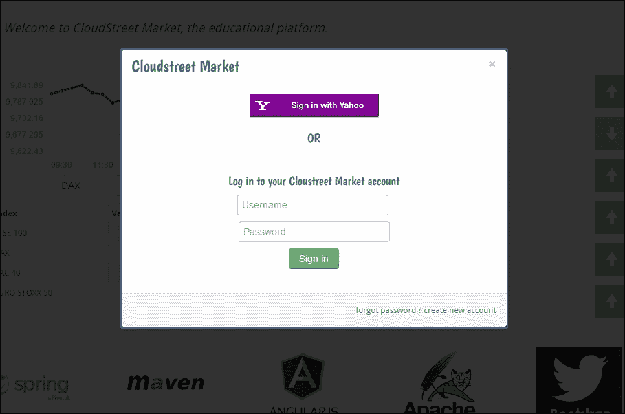

9.  You also have the option to create a new user. In the previous popup, click on the **Create new account** link that can be found at the bottom right. This will load the following pop-up content:

    

10.  Let's create a new user with the following values:

    ```
    username: <marcus>
    email: <marcus@chapter5.com>
    password: <123456>
    preferred currency: <USD>
    ```

    ### 注

    对于配置文件图片，您必须在文件系统上创建与`cloudstreetmarket-api/src/main/resources/application.properties`中的属性`pictures.user.path`对应的目录结构。

    然后，单击用户图标以上载个人资料图片。

    

    最后，点击**注册**按钮，弹出窗口应消失。

11.  Now, call the following URI: `http://cloudstreetmarket.com/api/users/marcus`. The application should fetch the following persisted data for the Marcus user:

    

## 它是如何工作的。。。

这个阶段的配方预先配置了我们的实体，使它们符合 Spring Security。本部分中提到了两个关于 Spring 安全性的概念，并在以下章节中进行了阐述。

### 春季安全简介

Spring Security 围绕三个核心组件构建：`SecurityContextHolder`对象、`SecurityContext`对象和`Authentication`对象。

`SecurityContextHolder`对象允许我们为一个 JVM 定义并携带`SecurityContextHolderStrategy`实现（重点是存储和检索`SecurityContext`。

### 注

`SecurityContextHolder`有以下`static`字段：

```
private static SecurityContextHolderStrategy strategy;
```

默认情况下，在大多数设计中，所选策略使用`Threadlocals`（`ThreadLocalSecurityContextHolderStrategy`。

### 本地上下文持有者

一个 Tomcat 实例管理一个 SpringMVCServlet（与任何其他 servlet 一样），当多个 HTTP 请求传入时，该 servlet 具有多个线程。代码如下：

```
final class ThreadLocalSecurityContextHolderStrategy implements
    SecurityContextHolderStrategy {
  private static final ThreadLocal<SecurityContext> contextHolder = new ThreadLocal<SecurityContext>();
  ...
}
```

在 SpringMVC 上分配给一个请求的每个线程都可以访问一个用户（或一个其他可识别的对象）携带一个`Authentication`对象的`SecurityContext`副本。

一旦`SecurityContext`的副本不再被引用，它就会被垃圾收集。

### 值得注意的 Spring 安全接口

Spring Security 中有许多值得注意的接口。我们将特别参观`Authentication`、`UserDetails`、`UserDetailsManager`和`GrantedAuthority`。

### 认证接口

弹簧`Authentication` 对象可以从`SecurityContext`中取回。该对象通常由 Spring Security 管理，但应用程序仍然经常需要访问它以进行业务。

以下是`Authentication` 对象的接口：

```
public interface Authentication extends Principal, Serializable {
  Collection<? extends GrantedAuthority> getAuthorities();
  Object getCredentials();
  Object getDetails();
  Object getPrincipal();
  boolean isAuthenticated();
  void setAuthenticated(boolean isAuthenticated) throws IllegalArgumentException;
}
```

它提供对`Principal`（代表已识别的用户、实体、公司或客户）、其凭证、权限以及可能需要的一些额外细节的访问。现在让我们看看如何从`SecurityContextHolder`中检索用户：

```
Object principal = SecurityContextHolder.getContext()
  .getAuthentication()
  .getPrincipal();
if (principal instanceof UserDetails) {
    String username = ((UserDetails) principal).getUsername();
} else {
  String username = principal.toString();
}
```

`Principal`类可以铸入 Spring`UserDetails`类，由核心框架暴露。该接口在多个扩展模块（*Spring Social*、*Connect*、*Spring Security SAML*、*Spring Security LDAP*等）中用作标准桥接器。

### 用户详细信息界面

`UserDetails`实现以可扩展且特定于应用程序的方式表示主体。

您必须知道核心框架内提供账户检索关键方法 `loadUserByUsername`的方法`UserDetailsService`接口：

```
public interface UserDetailsService {
  UserDetails loadUserByUsername(String username) throws UsernameNotFoundException;
}
```

Spring Security 为此接口提供了两种实现：`CachingUserDetailsService`和`JdbcDaoImpl`，无论我们是想从内存`UserDetailsService`还是基于 JDBC 的`UserDetailsService` 实现中获益。更全面地说，通常重要的是在何处以及如何持久化用户和角色，以便 Spring Security 能够访问自身的数据并处理身份验证。

#### 认证提供者

Spring Security 访问用户和角色数据的方式是通过在具有安全命名空间的 Spring Security 配置文件中选择或引用身份验证提供者来配置的。

以下是使用本机`UserDetailsService` 实现时的两个配置示例：

```
<security:authentication-manager alias="authenticationManager">
  <security:authentication-provider>
    <security:jdbc-user-service data-source-ref="dataSource" />
  </security:authentication-provider>
</security:authentication-manager>
```

第一个示例指定了基于 JDBC 的`UserDetailsService`。下一个示例指定内存中的`UserDetailsService.`

```
<security:authentication-manager alias="authenticationManager">
  <security:authentication-provider>
    <security:user-service id="inMemoryUserDetailService"/>
  </security:authentication-provider>
</security:authentication-manager>
```

在我们的案例中，我们已经注册了我们自己的`UserDetailsService`实现（`communityServiceImpl)`如下：

```
<security:authentication-manager alias="authenticationManager">
  <security:authentication-provider user-service-ref='communityServiceImpl'>
    <security:password-encoder ref="passwordEncoder"/>
  </security:authentication-provider>
</security:authentication-manager>
```

我们认为通过 JPA 抽象继续访问数据库层更合适。

##### UserDetailsManager 接口

Spring 安全提供`UserDetails`实现`org.sfw.security.core.userdetails.User`，可以直接使用，也可以扩展。用户类的定义如下：

```
public class User implements UserDetails, CredentialsContainer {
  private String password;
  private final String username;
  private final Set<GrantedAuthority> authorities;
  private final boolean accountNonExpired;
  private final boolean accountNonLocked;
  private final boolean credentialsNonExpired;
  private final boolean enabled;
  ...
}
```

### 注

管理用户（创建、更新等）可以是 Spring 安全性的共同责任。但它通常主要由应用程序执行。

Spring Security 还提供了一个管理用户的`UserDetailsManager`界面，引导我们走向`UserDetails`结构：

```
public interface UserDetailsManager extends UserDetailsService {
  void createUser(UserDetails user);
  void updateUser(UserDetails user);
  void deleteUser(String username);
  void changePassword(String oldPassword, String newPassword);
  boolean userExists(String username);
}
```

Spring Security 有两个用于非持久性（`InMemoryUserDetailsManager`和基于 JDBC（`JdbcUserDetailsManager`的）用户管理的本机实现。

当决定不使用内置的身份验证提供程序时，实现所提供的接口是一个很好的实践，特别是对于保证 Spring Security 即将推出的版本的向后兼容性。

#### 授权接口

在 Spring 安全性中，`GrantedAuthorities`反映了授予`Principal`的应用程序范围的权限。Spring 安全性引导我们实现基于角色的身份验证。这种身份验证强制创建能够执行操作的用户组。

### 注

除非某个功能有很强的商业意义，否则请选择`ROLE_ADMIN`或`ROLE_GUEST`而不是`ROLE_DASHBOARD`或`ROLE_PAYMENT`…

角色可以作为一个`GrantedAuthority`实现的数组从`getAuthorities()`中拉出`Authentication`对象。

`GrantedAuthority`界面非常简单：

```
public interface GrantedAuthority extends Serializable {
  String getAuthority();
}
```

`GrantedAuthority`实现是包装器，其中包含角色的文本表示。这些文本表示可能与安全对象的配置属性相匹配（我们将在*服务和控制器授权*配方中详细介绍此概念）。

嵌入在`GrantedAuthority`中的`Role`是从`getAuthority()`getter 访问的，它对 Spring 安全性比包装本身更重要。

我们已经创建了自己的实现：`Authority`与`User`有关联的实体。该框架还提供了`SimpleGrantedAuthority`实现。

在最后一个配方中，我们将讨论 Spring 安全授权过程。我们将看到 Spring Security 提供了一个`AccessDecisionManager`接口和几个`AccessDecisionManager`实现。这些实现基于投票并使用`AccessDecisionVoter`实现。这些实现中最常用的是`RoleVoter`类。

### 注

当配置属性（权限的文本表示形式）以预定义前缀开始时，`RoleVoter`实现对用户授权投赞成票。默认情况下，此前缀设置为`ROLE_`。

## 还有更多…

Spring 安全性身份验证和授权过程将在服务和控制器授权配方中详细介绍。本节介绍 Spring 安全参考文档中的更多详细信息。

### 弹簧安全参考

Spring Security 安全参考资料是理论和实践信息的惊人来源。

#### 技术概述

技术概述是对 Spring 安全框架的一个很好的介绍：

[http://docs.spring.io/spring-security/site/docs/3.0.x/reference/technical-overview.html](http://docs.spring.io/spring-security/site/docs/3.0.x/reference/technical-overview.html)

#### 申请样本

Spring Security 参考提供了许多不同身份验证类型的 Spring Security 示例（*LDAP*、*OPENID*、*JAAS*等等）。其他基于角色的示例也可以在以下位置找到：

[http://docs.spring.io/spring-security/site/docs/3.1.5.RELEASE/reference/sample-apps.html](http://docs.spring.io/spring-security/site/docs/3.1.5.RELEASE/reference/sample-apps.html)

#### 核心服务

有关内置`UserDetailsService`实现（内存或 JDBC）的更多信息，请访问：

[http://docs.spring.io/spring-security/site/docs/3.1.5.RELEASE/reference/core-services.html](http://docs.spring.io/spring-security/site/docs/3.1.5.RELEASE/reference/core-services.html)

# 对基本方案进行认证

对于像我们这样的无状态应用程序，通过基本方案进行身份验证是一种流行的解决方案。凭据随 HTTP 请求一起发送。

## 准备好了吗

在此配方中，我们完成了 Spring 安全配置。我们使其支持应用程序所需的基本身份验证方案。

我们稍微自定义生成的响应头，因此它们不会触发浏览器显示本机基本身份验证表单（这对我们的用户来说不是最佳体验）。

## 怎么做。。。

1.  为了使用 Spring 安全名称空间，我们在`cloudstreetmarket-api web.xml`中添加了以下过滤器：

    ```
    <filter>
      <filter-name>springSecurityFilterChain</filter-name>
      <filter-class> org.sfw.web.filter.DelegatingFilterProxy
      </filter-	class>
    </filter>
    <filter-mapping>
      <filter-name>springSecurityFilterChain</filter-name>
      <url-pattern>/*</url-pattern>
    </filter-mapping>
    ```

2.  已在`cloudstreetmarket-api`模块中创建专门用于 Spring 安全性的 Spring 配置文件。此文件承载以下 bean 定义：

    ```
    <bean id="authenticationEntryPoint" class="edu.zc.csm.api.authentication.CustomBasicAuthenticationEntryPoint">
      <property name="realmName" value="cloudstreetmarket.com" />
    </bean> 
    <security:http create-session="stateless" authentication-manager-ref="authenticationManager" entry-point-ref="authenticationEntryPoint">
        <security:custom-filter ref="basicAuthenticationFilter" after="BASIC_AUTH_FILTER" />
       <security:csrf disabled="true"/>
    </security:http>

    <bean id="basicAuthenticationFilter" class="org.sfw.security.web.authentication.www.BasicAuthenticationFilter">
      <constructor-arg name="authenticationManager" ref="authenticationManager" />
      <constructor-arg name="authenticationEntryPoint" ref="authenticationEntryPoint" />
    </bean>
    <security:authentication-manager alias="authenticationManager">
        <security:authentication-provider user-service-ref='communityServiceImpl'>
          <security:password-encoder ref="passwordEncoder"/>
      </security:authentication-provider>
    </security:authentication-manager>

    <security:global-method-security secured-annotations="enabled" pre-post-annotations="enabled" authentication-manager-ref="authenticationManager"/>
    ```

3.  这个新的配置引用了`CustomBasicAuthenticationEntryPoint`类。该类有以下内容：

    ```
    public class CustomBasicAuthenticationEntryPoint extends BasicAuthenticationEntryPoint {
      @Override
      public void commence(HttpServletRequest request, HttpServletResponse response, AuthenticationException authException) throws IOException, ServletException {
        response.setHeader("WWW-Authenticate", "CSM_Basic realm=\ + getRealmName() + \");
        response.sendError(HttpServletResponse.SC_UNAUTHORIZED, authException.getMessage()
        );
      }
    }
    ```

4.  A new `@ExceptionHandler` has been added to catch authentication Exceptions:

    ```
    @ExceptionHandler({BadCredentialsException.class, AuthenticationException.class, AccessDeniedException.class})
    protected ResponseEntity<Object> handleBadCredentials(final RuntimeException ex, final WebRequest request) {
      return handleExceptionInternal(ex, "The attempted  operation has been denied!", new HttpHeaders(),   FORBIDDEN, request);
    }
    ...
    ```

    ### 注

    差不多就是这样！我们已使后端支持基本身份验证。但是，我们还没有限制我们的服务（作为安全对象）。我们现在就做。

5.  出于示例目的，请更新`cloudstreetmarket-core`中的`IMarketService` 接口。将`@Secured("ROLE_BASIC")`注释添加到`Type`中，如下所示：

    ```
    @Secured ("ROLE_BASIC")
    public interface IMarketService {
      Page<IndexOverviewDTO> getLastDayIndicesOverview( MarketCode market, Pageable pageable);
      Page<IndexOverviewDTO> getLastDayIndicesOverview( Pageable pageable);
      HistoProductDTO getHistoIndex(String code, MarketCode market, Date fromDate, Date toDate, QuotesInterval interval);
    }
    ```

6.  现在重新启动 Tomcat 服务器（这样做将删除以前的用户创建）。
7.  In your favorite web browser, open the developer-tab and observe the AJAX queries when you refresh the home page. You should notice that two AJAX queries have returned a `403` status code (`FORBIDDEN`).

    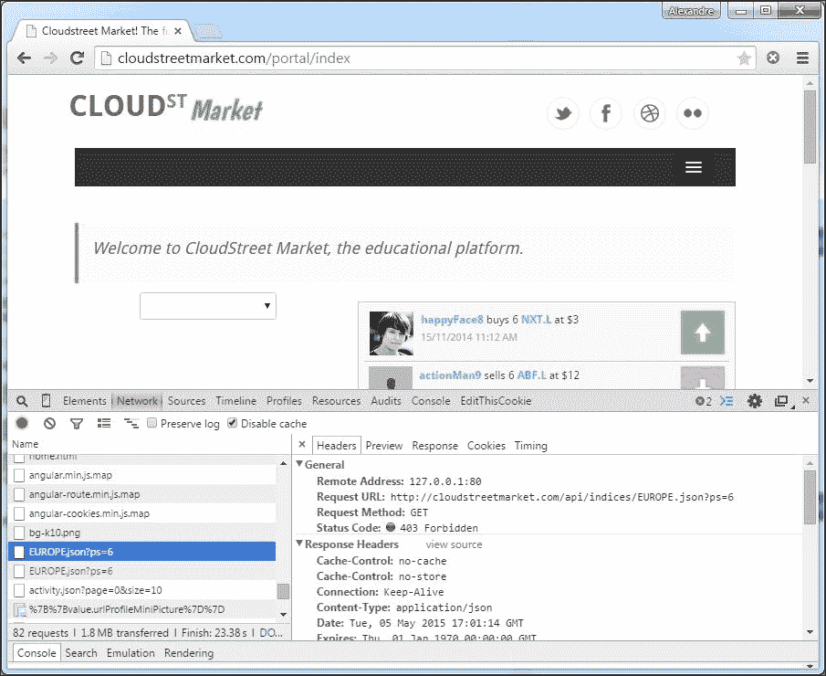

    这些查询还返回了 JSON 响应：

    ```
    {"error":"Access is denied","message":"The attempted operation has been denied!","status":403","date":"2015-05-05 18:01:14.917"}
    ```

8.  现在，使用登录功能/弹出窗口，与之前创建的具有`BASIC`角色的用户之一进行登录：

    ```
    Username: <userC> 
    Password: <123456>
    ```

9.  Refresh the page and observe the same two AJAX queries. Amongst the request headers, you can see that our frontend has sent a special **Authorization** header:

    

10.  此授权标头带有值：`Basic dXNlckM6MTIzNDU2`。编码的`dXNlckM6MTIzNDU2`是`userC:123456`的 base64 编码值。
11.  Let's have a look at the response to these queries:

    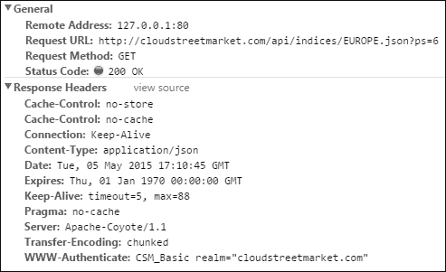

    现在状态为`200 (OK)`，您也应该收到正确的 JSON 结果：

    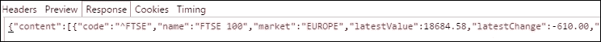

12.  服务器在对值的响应中返回了一个`WWW-Authenticate`头：**CSM_Basic realm】=“cloudstreetmarket.com”**
13.  最后，请还原您在`IMarketService`中所做的更改（在第 5 步中）。

## 它是如何工作的。。。

我们将探讨 Spring Security 的基本身份验证背后的概念：

### Spring 安全名称空间

与往常一样，Spring 配置名称空间带来了适合模块需要和使用的特定语法。它以更好的可读性减轻了整个 Spring 配置。名称空间通常附带默认配置或自动配置工具。

Spring 安全命名空间附带 Spring 安全配置依赖项，可以在 Spring 配置文件中定义如下：

```
<beans  xmlns:security="http://www.springframework.org/schema/security" xmlns:xsi=http://www.w3.org/2001/XMLSchema-instance xsi:schemaLocation"="http://www.springframework.org/schema/beans http://www.springframework.org/schema/beans/spring-beans.xsd http://www.springframework.org/schema/security http://www.springframework.org/schema/security/spring-security-4.0.0.xsd">
    ...
</beans>
```

名称空间包含三个顶级组件：`<http>`（关于 web 和 HTTP 安全）、`<authentication-manager>,`和`<global-method-security>`（服务或控制器限制）。

然后，这些顶级组件引用其他概念作为属性或子元素：`<authentication-provider>`、`<access-decision-manager>`（为 web 和安全方法提供访问决策）和`<user-service>`（作为`UserDetailsService`实现）。

#### 该<http>组件

名称空间的`<http>`组件提供了一个`auto-config`属性，我们在这里没有使用这个属性。`<http auto-config"="true">`定义是以下定义的捷径：

```
  <http>
    <form-login />
    <http-basic />
    <logout />
  </http>
```

对于我们的 RESTAPI 来说，这是不值得的，因为我们不打算为表单登录实现服务器端生成的视图。此外，`<logout>`组件对我们来说也没用，因为我们的 API 不管理会话。

最后，`<http-basic>`元素创建配置的基础`BasicAuthenticationFilter`和`BasicAuthenticationEntryPoint`。

我们已经使用了我们自己的`BasicAuthenticationFilter`来定制`WWW-Authenticate`响应的头值，从`Basic base64token`到`CSM_Basic base64token`。这是因为 AJAX HTTP 响应（来自我们的 API）包含一个以**Basic**关键字开头的值的`WWW-Authenticate`头，它会自动触发 web 浏览器打开一个本机基本表单弹出窗口。这不是我们想要建立的用户体验类型。

#### 弹簧安全过滤链

在配方的第一步中，我们在`web.xml`中声明了一个名为`springSecurityFilterChain`的过滤器：

```
  <filter>
    <filter-name>springSecurityFilterChain</filter-name>
  <filter-class>org.sfw.web.filter.DelegatingFilterProxy</filter-class>
</filter>
<filter-mapping>
  <filter-name>springSecurityFilterChain</filter-name>
  <url-pattern>/*</url-pattern>
</filter-mapping>
```

这里，`springSecurityFilterChain`也是一个 Springbean，由 SpringSecurity 名称空间（特别是`http`组件）在内部创建。`DelegatingFilterProxy`是一个 Spring 基础设施，它在应用程序上下文中查找并调用特定的 bean。目标 bean 必须实现`Filter`接口。

整个春天的安全机制最终通过一根豆子连接起来。

`<http>`元件的配置在确定过滤器链的组成方面起着核心作用。它定义的元素直接创建了相关的过滤器。

|   | *“一些核心过滤器始终在过滤器链中创建，其他过滤器将根据存在的属性和子元素添加到堆栈中。”* |   |
|   | --*弹簧安全* |

区分依赖配置的过滤器和无法移除的核心过滤器非常重要。作为核心过滤器，我们可以计算`SecurityContextPersistenceFilter`、`ExceptionTranslationFilter,`和`FilterSecurityInterceptor`。这三个过滤器本机绑定到`<http>`元素，可在下表中找到。

此表来自 Spring 安全参考文档，它包含所有可使用特定元素或属性激活的核心过滤器（随框架提供）。它们按其在链中的位置顺序列在这里。

<colgroup><col> <col> <col></colgroup> 
| 

别名

 | 

过滤类

 | 

名称空间元素或属性

 |
| --- | --- | --- |
| `CHANNEL_FILTER` | 信道处理滤波器 | http/拦截-url@requires-渠道 |
| `SECURITY_CONTEXT_FILTER` | SecurityContextPersistenceFilter | http |
| `CONCURRENT_SESSION_FILTER` | ConcurrentSessionFilter | 会话管理/并发控制 |
| `HEADERS_FILTER` | 头部过滤器 | http/头 |
| `CSRF_FILTER` | CsrfFilter | http/csrf |
| `LOGOUT_FILTER` | 注销过滤器 | http/注销 |
| `X509_FILTER` | X509AuthenticationFilter | http/x509 |
| `PRE_AUTH_FILTER` | AbstractPreAuthenticatedProcessingFilter 子类 | 不适用 |
| `CAS_FILTER` | CasAuthenticationFilter | 不适用 |
| `FORM_LOGIN_FILTER` | UsernamePasswordAuthenticationFilter | http/表单登录 |
| `BASIC_AUTH_FILTER` | 基本认证过滤器 | http/http 基本 |
| `SERVLET_API_SUPPORT_FILTER` | SecurityContextHolderAwareRequestFilter | http/@servlet api 规定 |
| `JAAS_API_SUPPORT_FILTER` | JAASAPI 集成滤波器 | http/@jaas api 规定 |
| `REMEMBER_ME_FILTER` | RememberMeAuthenticationFilter | http/记得我吗 |
| `ANONYMOUS_FILTER` | 匿名身份验证过滤器 | http/匿名 |
| `SESSION_MANAGEMENT_FILTER` | 会话管理筛选器 | 会话管理 |
| `EXCEPTION_TRANSLATION_FILTER` | 例外 TranslationFilter | http |
| `FILTER_SECURITY_INTERCEPTOR` | 过滤器安全接收器 | http |
| `SWITCH_USER_FILTER` | SwitchUserFilter | 不适用 |

请记住，定制过滤器可以相对定位，也可以使用`custom-filter`元件替换这些过滤器中的任何一个：

```
<security:custom-filter ref="myFilter" after="BASIC_AUTH_FILTER"/>
```

##### 我们的<http>配置

我们已经为`<http>`命名空间的组件定义了以下配置：

```
<security:http create-session="stateless" entry-point-ref="authenticationEntryPoint" authentication-manager- ref="authenticationManager">
  <security:custom-filter ref="basicAuthenticationFilter" after="BASIC_AUTH_FILTER" />
  <security:csrf disabled="true"/>
</security:http>
<bean id="basicAuthenticationFilter" class="org.sfw.security.web.authentication.www.BasicAuthenticationFilter">
  <constructor-arg name="authenticationManager" ref="authenticationManager" />
  <constructor-arg name="authenticationEntryPoint" ref="authenticationEntryPoint" />
</bean>
<bean id="authenticationEntryPoint" class="edu.zc.csm.api. authentication.CustomBasicAuthenticationEntryPoint">
  <property name="realmName" value="${realm.name}" />
</bean>
```

这里，我们告诉 Spring 不要创建会话，并使用`create-session=="stateless"`忽略传入会话。我们这样做是为了追求无状态和可伸缩的微服务设计。

出于同样的原因，我们现在也已经禁用了**跨站点请求伪造**（**csrf**支持。从 3.2 版开始，框架默认启用了此功能。

有必要定义一个`entry-point-ref`，因为我们没有实现名称空间（`http-basic`或`login-form`预先配置的任何身份验证策略。

我们已经定义了一个自定义过滤器`BasicAuthenticationFilter`，在核心`BASIC_AUTH_FILTER`的理论位置之后执行。

我们现在将看到哪些角色扮演了提到的三个角色：`authenticationEntryPoint`、`authenticationManager`和`basicAuthenticationFilter`。

### AuthenticationManager 接口

首先，是一个单一的方法接口：

```
public interface AuthenticationManager {
  Authentication authenticate(Authentication authentication) throws AuthenticationException;
}
```

Spring Security 提供了一个实现：`ProviderManager`。这个实现允许我们插入几个`AuthenticationProviders`。`ProviderManager`按顺序尝试所有`AuthenticationProviders`，调用其`authenticate`方法。代码如下：

```
public interface AuthenticationProvider {
  Authentication authenticate(Authentication authentication)
    throws AuthenticationException;
  boolean supports(Class<?> authentication);
}
```

`ProviderManager`在发现非空`Authentication`对象时停止迭代。或者，当抛出一个`AuthenticationException`时，它会使`Authentication`失败。

使用名称空间，可以使用`ref`元素将特定`AuthenticationProviders`作为目标，如下所示：

```
<security:authentication-manager >
  <security:authentication-provider ref='myAuthenticationProvider'/>
</security:authentication-manager>
```

现在，我们的配置如下：

```
<security:authentication-manager alias"="authenticationManager"">
  <security:authentication-provider user-service-ref='communityServiceImpl'>
    <security:password-encoder ref="passwordEncoder"/>
  </security:authentication-provider>
</security:authentication-manager>
```

我们的配置中没有`ref`元素。默认情况下，名称空间将实例化一个`DaoAuthenticationProvider`。它还将注入我们的`UserDetailsService`实现：`communityServiceImpl`，因为我们已经用`user-service-ref`指定了它。

当`UsernamePasswordAuthenticationToken`中提交的密码与`UserDetailsService`加载的密码不匹配时（使用`loadUserByUsername`方法），此`DaoAuthenticationProvider`抛出`AuthenticationException`。

它存在一些可用于我们项目的其他`AuthenticationProviders`，例如，`RememberMeAuthenticationProvider`、`LdapAuthenticationProvider`、`CasAuthenticationProvider`或`JaasAuthenticationProvider`。

### 基本认证

正如我们所说的，对于 REST 应用程序来说，使用基本方案是一种很好的技术。但是，在使用它时，使用加密通信协议（HTTPS）是至关重要的，因为密码是以明文形式发送的。

正如*如何操作*一节所示，原理非常简单。HTTP 请求与平常一样，有一个额外的头`Authentication`。此标头的值由关键字`Basic`构成，后跟空格，后跟以 base 64 编码的字符串。

我们可以在网上找到一系列免费服务，可以快速编码/解码以 64 为基数的字符串。要在 base 64 中编码的字符串必须采用以下形式：`<username>:<password>`。

#### 基础认证过滤器

为了实现我们的基本身份验证，我们在过滤链中添加了`BasicAuthenticationFilter`。该`BasicAuthenticationFilter`（`org.sfw.security.web.authentication.www.BasicAuthenticationFilter`需要`authenticationManager`和可选的`authenticationEntryPoint`。

`authenticationEntryPoint`的可选配置驱动过滤器实现下面介绍的两种不同行为。

两者的启动方式相同：过滤器从其在链中的位置触发。它在请求中查找身份验证头并委托给`authenticationManager`，然后依赖`UserDetailsService`实现将其与数据库中的用户凭据进行比较。

##### 带有 authenticationEntryPoint

这是我们的配置，其行为方式如下：

*   认证成功后，过滤链停止，返回`Authentication`对象。
*   当身份验证失败时，在过滤器链中断时调用`authenticationEntryPoint`方法。我们的认证入口点设置了一个自定义的`WWW-Authenticate`响应头和`401`状态码（`FORBIDDEN`。

这种类型的配置提供了一个预验证，其中检查 HTTP 请求中的`Authentication Header`以查看业务服务是否需要授权（安全对象）。

此配置允许通过 web 浏览器提示的潜在本机基本表单进行快速反馈。我们已经在应用程序中选择了此配置。

##### 没有 authenticationEntryPoint

如果没有 authenticationEntryPoint，筛选器的行为如下：

*   认证成功后，过滤链停止，返回`Authentication`对象。
*   当身份验证失败时，过滤器链将继续。之后，如果链中的另一个身份验证成功，则相应地对用户进行身份验证。但是，如果链中没有其他身份验证成功，则使用匿名角色对用户进行身份验证，这可能适合也可能不适合服务访问级别。

## 还有更多…

### 在弹簧安全参考中

此部分主要受 Spring r 安全参考的启发，这也是一个很好的资源：

[http://docs.spring.io/spring-security/site/docs/current/reference/htmlsingle](http://docs.spring.io/spring-security/site/docs/current/reference/htmlsingle)

附录为 Spring 安全名称空间提供了非常完整的指南：

[http://docs.spring.io/spring-security/site/docs/current/reference/html/appendix-namespace.html](http://docs.spring.io/spring-security/site/docs/current/reference/html/appendix-namespace.html)

### 记得我的饼干/功能

我们在`RememberMeAuthenticationFilter`上传递了，这为服务器在会话之间记住主体身份提供了不同的方法。Spring 安全参考资料提供了有关此主题的广泛信息。

# 使用第三方 OAuth2 方案进行身份验证

这个配方使用 Spring 社交项目，以便从客户端角度使用 OAuth2 协议。

## 准备好了吗

我们在这里不创建 OAuth2**认证服务器**（**作为**）。我们将建立到第三方身份验证服务器（Yahoo！）的连接，以便在我们的应用程序上进行身份验证。我们的应用程序将充当**服务提供商**（**SP**）。

我们将使用 SpringSocial，它的第一个角色是透明地管理社交连接，并提供一个门面来使用 Java 对象调用提供者 API（Yahoo！Finance）。

## 怎么做。。。

1.  为 Spring social 添加了两个 Maven 依赖项：

    ```
        <!– Spring Social Core –>
        <dependency>
          <groupId>org.springframework.social</groupId>
          <artifactId>spring-social-core</artifactId>
          <version>1.1.0.RELEASE</version>
        </dependency>
        <!– Spring Social Web (login/signup controllers) –>
        <dependency>
          <groupId>org.springframework.social</groupId>
          <artifactId>spring-social-web</artifactId>
          <version>1.1.0.RELEASE</version>
        </dependency>
    ```

2.  如果我们想处理到 Twitter 或 Facebook 的 OAuth2 连接，我们还必须添加以下依赖项：

    ```
      <!– Spring Social Twitter –>
        <dependency>
          <groupId>org.springframework.social</groupId>
          <artifactId>spring-social-twitter</artifactId>
          <version>1.1.0.RELEASE</version>
        </dependency>
        <!– Spring Social Facebook –>
          <dependency>
          <groupId>org.springframework.social</groupId>
          <artifactId>spring-social-facebook</artifactId>
          <version>1.1.0.RELEASE</version>
        </dependency>
    ```

3.  After the BASIC authentication section, the Spring Security configuration file hasn't changed much. A few interceptors can be noticed in the `http` bean:

    ```
    <security:http create-session="stateless" entry-point-ref="authenticationEntryPoint" authentication-manager-ref="authenticationManager">
      <security:custom-filter ref="basicAuthenticationFilter" after="BASIC_AUTH_FILTER" />
      <security:csrf disabled="true"/>
      <security:intercept-url pattern="/signup" access="permitAll"/>
      ...
      <security:intercept-url pattern="/**" access="permitAll"/>
    </security:http>
    ```

    在之后的`SocialUserConnectionRepositoryImpl`中，我们创建了自己的`org.sfw.social.connect.ConnectionRepository`实现，这是一个`Spring Social` c`ore`接口，具有管理社交用户连接的方法。代码如下：

    ```
    @Transactional(propagation = Propagation.REQUIRED)
    @SuppressWarnings("unchecked")
    public class SocialUserConnectionRepositoryImpl implements ConnectionRepository {
    @Autowired
    private SocialUserRepository socialUserRepository;
    private final String userId;
    private final ConnectionFactoryLocator connectionFactoryLocator;
    private final TextEncryptor textEncryptor;
    public SocialUserConnectionRepositoryImpl(String userId, SocialUserRepository socialUserRepository, ConnectionFactoryLocator connectionFactoryLocator, TextEncryptor textEncryptor){
        this.socialUserRepository = socialUserRepository;
        this.userId = userId;
        this.connectionFactoryLocator = connectionFactoryLocator;
        this.textEncryptor = textEncryptor;
    }
     ...
    public void addConnection(Connection<?> connection) {
    try {
       ConnectionData data = connection.createData();
      int rank = socialUserRepository.getRank(userId, data.getProviderId()) ;
      socialUserRepository.create(userId, data.getProviderId(), data.getProviderUserId(), rank, data.getDisplayName(), data.getProfileUrl(), data.getImageUrl(), encrypt(data.getAccessToken()), encrypt(data.getSecret()), encrypt(data.getRefreshToken()), data.getExpireTime()    );
        } catch (DuplicateKeyException e) {
      throw new   DuplicateConnectionException(connection.getKey());
    }
    }
    ...
    public void removeConnections(String providerId) {
      socialUserRepository.delete(userId,providerId);
    }
      ...
    }
    ```

    ### 注

    实际上，此自定义实现扩展并调整了从[开始的工作 https://github.com/mschipperheyn/spring-social-jpa](https://github.com/mschipperheyn/spring-social-jpa) 根据 GNU GPL 许可证发布。

4.  正如您所看到的，`SocialUserConnectionRepositoryImpl`使用了一个定制的 Spring 数据 JPA`SocialUserRepository`接口，其定义如下：

    ```
    public interface SocialUserRepository {
      List<SocialUser> findUsersConnectedTo(String providerId);
      ...
      List<String> findUserIdsByProviderIdAndProviderUserIds( String providerId, Set<String> providerUserIds);
    ...
      List<SocialUser> getPrimary(String userId, String providerId);
      ...
      SocialUser findFirstByUserIdAndProviderId(String userId, String providerId);
    }
    ```

5.  这个 Spring 数据 JPA 存储库支持我们创建的`SocialUser`实体（社会关系）。这个实体是`UserConnection`SQL 表的直接模型，`JdbcUsersConnectionRepository`希望在我们使用这个实现而不是我们的实现时找到它。`SocialUser`定义为以下代码：

    ```
    @Entity
    @Table(name="userconnection", uniqueConstraints = {@UniqueConstraint(columnNames = { ""userId", "providerId", "providerUserId" }), 
    @UniqueConstraint(columnNames = { "userId", "providerId", "rank" })})
    public class SocialUser {
      @Id
      @GeneratedValue
      private Integer id;

      @Column(name = "userId")
      private String userId;

      @Column(nullable = false)
      private String providerId;
      private String providerUserId;

      @Column(nullable = false)
      private int rank;
      private String displayName;
      private String profileUrl;
      private String imageUrl;

      @Lob
      @Column(nullable = false)
      private String accessToken;
      private String secret;
      private String refreshToken;
      private Long expireTime;
      private Date createDate = new Date();
      //+ getters / setters
      ...
    } 
    ```

6.  `SocialUserConnectionRepositoryImpl`在更高层的服务层`SocialUserServiceImpl`实例化，是 Spring`UsersConnectionRepository`接口的实现。此实现创建如下：

    ```
    @Transactional(readOnly = true)
    public class SocialUserServiceImpl implements SocialUserService {
       @Autowired
       private SocialUserRepository socialUserRepository;
      @Autowired
       private ConnectionFactoryLocator connectionFactoryLocator;
      @Autowired
      private UserRepository userRepository;
      private TextEncryptor textEncryptor = Encryptors.noOpText();
    public List<String> findUserIdsWithConnection(Connection<?> connection) {
       ConnectionKey key = connection.getKey();
      return socialUserRepository. findUserIdsByProviderIdAndProviderUserId(key.getProviderId(), key.getProviderUserId());
    }
    public Set<String> findUserIdsConnectedTo(String providerId, Set<String> providerUserIds) {
        return Sets.newHashSet(socialUserRepository.findUserIdsByProviderIdAndProviderUserIds(providerId, providerUserIds));
    }
    public ConnectionRepository createConnectionRepository(String userId) {
      if (userId == null) {
        throw new IllegalArgumentException"("userId cannot be null"");
      }
      return new SocialUserConnectionRepositoryImpl(
          userId,
          socialUserRepository,
          connectionFactoryLocator,
          textEncryptor);
    }
     	...
    }
    ```

7.  此更高级别`SocialUserServiceImpl`在`cloudstreetmarket-api`Spring 配置文件（`dispatcher-context.xml`中注册为 factory bean，具有在请求范围下（针对特定社交用户配置文件）生成`SocialUserConnectionRepositoryImpl`的能力。代码如下：

    ```
    <bean id="usersConnectionRepository" class="edu.zc.csm.core.services.SocialUserServiceImpl"/>
    <bean id="connectionRepository" factory-method="createConnectionRepository" factory-bean="usersConnectionRepository" scope"="request">
      <constructor-arg value="#{request.userPrincipal.name}"/>
      <aop:scoped-proxy proxy-target-class"="false"" />
    </bean>
    ```

8.  在这个`dispatcher-context.xml`文件中定义了另外三个 bean：

    ```
    <bean id="signInAdapter" class="edu.zc.csm.api.signin.SignInAdapterImpl"/>
    <bean id="connectionFactoryLocator" 
      class="org.sfw.social.connect.support. ConnectionFactoryRegistry">
      <property name="connectionFactories">
        <list>
        <bean class"="org.sfw.social.yahoo.connect.YahooOAuth2ConnectionFactory"">
          <constructor-arg value="${yahoo.client.token}"/>
          <constructor-arg value="${yahoo.client.secret}" />
          <constructor-arg value="${yahoo.signin.url}" />
        </bean>
        </list>
      </property>
    </bean>
    <bean class="org.sfw.social.connect.web.ProviderSignInController">
      <constructor-arg ref="connectionFactoryLocator"/>
      <constructor-arg ref="usersConnectionRepository"/>
      <constructor-arg ref="signInAdapter"/>
      <property name="signUpUrl" value="/signup"/>
      <property name="postSignInUrl" value="${frontend.home.page.url}"/>
    </bean>
    ```

9.  在 OAuth2 身份验证之后，`SignInAdapterImpl`在我们的应用程序中登录用户。从应用程序业务的角度来看，它执行我们希望它在此步骤中执行的操作。代码如下：

    ```
    @Transactional(propagation = Propagation.REQUIRED)
    @PropertySource("classpath:application.properties")
    public class SignInAdapterImpl implements SignInAdapter{
      @Autowired
      private UserRepository userRepository;
      @Autowired
      private CommunityService communityService;
      @Autowired
      private SocialUserRepository socialUserRepository;
      @Value("${oauth.success.view}")
      private String successView;
      public String signIn(String userId, Connection<?> connection, NativeWebRequest request) {
          User user = userRepository.findOne(userId);
          String view = null;
          if(user == null){
            //temporary user for Spring Security
            //won't be persisted
            user = new User(userId, communityService.generatePassword(), null, true, true, true, true, communityService.createAuthorities(newRole[]{Role.ROLE_BASIC, Role.ROLE_OAUTH2}));
        }
        else{
            //We have a successful previous oAuth 	//authentication
            //The user is already registered
            //Only the guid is sent back
            List<SocialUser> socialUsers = 
            socialUserRepository. findByProviderUserIdOrUserId(userId, userId);
            if(CollectionUtils.isNotEmpty(socialUsers)){
              //For now we only deal with Yahoo!
              view = successView.concat(
                "?spi=" + socialUsers.get(0) .getProviderUserId());
        }
        }
        communityService.signInUser(user);
        return view;
      }
    }
    ```

10.  The `connectionFactoryLocator` can also refer to more than one connection factories. In our case, we have only one: `YahooOAuth2ConnectionFactory`. These classes are the entry points of social providers APIs (written for Java). We can normally find them on the web (from official sources or not) for the OAuth protocol we target (OAuth1, OAuth1.0a, and OAuth2).

    ### 注

    雅虎目前几乎没有现成的 OAuth2 适配器！我们必须自己做。这就是为什么这些类可以作为源而不是 jar 依赖项（在 Zipcloud 项目中）使用。

11.  当涉及到控制器的声明时，`dispatcher-context.xml`配置了一个`ProviderSignInController`，完全抽象在`Spring Social Core`中。但是，为了在我们的应用程序中注册 OAuth2 用户（用户第一次访问站点），我们创建了一个自定义的`SignUpController`：

    ```
    @Controller
    @RequestMapping"("/signup"")
    @PropertySource"("classpath:application.properties"")
    public class SignUpController extends CloudstreetApiWCI{
      @Autowired
      private CommunityService communityService;
      @Autowired
      private SignInAdapter signInAdapter;
      @Autowired
      private ConnectionRepository connectionRepository;
      @Value("${oauth.signup.success.view}")
      private String successView;
      @RequestMapping(method = RequestMethod.GET)
      public String getForm(NativeWebRequest request, @ModelAttribute User user) {
        String view = successView;
        // check if this is a new user signing in via //Spring Social
        Connection<?> connection = ProviderSignInUtils.getConnection(request);
          if (connection != null) {
            // populate new User from social connection //user profile
            UserProfile userProfile = connection.fetchUserProfile();
            user.setUsername(userProfile.getUsername());
            // finish social signup/login
            ProviderSignInUtils. handlePostSignUp(user.getUsername(), request);
            // sign the user in and send them to the user //home page
            signInAdapter.signIn(user.getUsername(), connection, request);
          view += ?spi=+ user.getUsername();
        }
        return view;
      }
    }
    ```

12.  现在该试试了。要继续，我们建议您创建一个雅虎！账户我们实际上不是由雅虎赞助的！这只是我们伟大的 Zipcloud 公司面向金融服务的战略。这不仅仅是为了 Marissa Mayer 的蓝眼睛！（[https://login.yahoo.com](https://login.yahoo.com) ）。
13.  启动您的 Tomcat 服务器并单击登录按钮（在主菜单的最右侧）。然后点击**登录雅虎！**按钮
14.  You should be redirected to the Yahoo! servers in order for you to authenticate on their side (if you are not logged-in already):

    

15.  Once logged-in, agree that Cloudstreet Market will be able to access your profile and your contacts. We won't make use of contacts; however, we have the Java adaptors to access them. If it's too scary, just create an empty new Yahoo! account:

    

16.  点击**同意**按钮上的。
17.  雅虎！现在应该重定向到本地`cloudstreetmarket.com`服务器，特别是以授权码作为 URL 参数的`/api/signin/yahoo`处理程序。
18.  The application detects when in the `Cloudstreet Market` database there isn't any `User` registered for the `SocialUser`. This triggers the following popup and it should come back to the user until the account actually gets created:

    

19.  Fill the form with the following data:

    ```
    username: <marcus>
    email: <marcus@chapter5.com>
    password: <123456>
    preferred currency: <USD>
    ```

    此外，单击用户图标以上载个人资料图片（如果您愿意）。执行此操作时，请确保`cloudstreetmarket-api/src/main/resources/application.properties`中的属性`pictures.user.path`指向文件系统上创建的路径。

20.  一旦完成此步骤，新的公共活动**Marcus 注册新账户**将出现在欢迎页面上。
21.  Also, bound to each REST response from the API, the extra-headers **Authenticated** and **WWW-Authenticate** must be present. This is proof that we are authenticated with OAuth2 capability in the application.

    

## 它是如何工作的。。。

在此配方中，我们在应用程序中执行社会整合。OAuth2 身份验证涉及服务提供商（cloudstreetmarket.com）和身份提供商（Yahoo！）。

只有当用户拥有（或准备拥有）双方的帐户时，才会发生这种情况。它是当今非常流行的身份验证协议。由于大多数互联网用户在一家主要的社交 SaaS 提供商（Facebook、Twitter、LinkedIn、Yahoo！等）中至少拥有一个帐户，因此这项技术大大减少了 web 服务提供商的注册时间和登录时间。

### 从应用角度来看

当登录雅虎！用户点击按钮，向我们的一个 API 处理程序`/api/signin/yahoo`发出 HTTP POST 请求。此处理程序对应于`ProviderSignInController`，由`Spring Social`抽象。

*   此处理程序将用户重定向到 Yahoo！在服务器上，他可以进行身份验证，并授予应用程序使用其社交身份和访问其 Yahoo！数据
*   雅虎！将授权代码作为重定向到其执行的回调 URL 的参数发送到应用程序。
*   应用程序以授权代码作为参数处理回调。此回调以抽象的`ProviderSignInController`中的不同方法处理程序为目标。此处理程序完成连接！为了与**刷新令牌**和**访问令牌**交换授权码。此操作在`Spring Social`后台透明完成。
*   同一处理程序在数据库中查找该用户的现有持久社交连接：
    *   如果发现一个连接，用户将在`Spring Security`中通过该连接进行身份验证，并通过 Yahoo！用户 ID 作为请求参数（参数名为`spi`。
    *   如果没有找到连接，用户将被重定向到`SignupController`，在那里创建并保持他的连接。然后，他在 SpringSecurity 中通过身份验证，并被重定向到雅虎门户网站的主页！用户 ID 作为请求参数（名为`spi`）。
*   加载门户主页时，Yahoo！检测到用户 ID 请求参数，该标识符存储在 HTML5`sessionStorage`中（我们已经完成了所有这一切）。
*   从现在起，在用户向 API 发出的每一个 AJAX 请求中，`spi`标识符将作为请求头传递，直到用户实际注销或关闭浏览器为止。

### 来自雅虎！观点

雅虎！API 提供了两种使用 OAuth2 进行身份验证的方法。这导致了两种不同的流：适合服务器端（web）应用程序的显式 OAuth2 流和特别有利于前端 web 客户端的隐式 OAuth2 流。这里我们将重点讨论实现的显式流。

#### OAuth2 显式授权流

下面是我们的应用程序和 Yahoo！之间通信协议的摘要图片！。这或多或少是一个标准的 OAuth2 对话：


标有`*`符号的参数在通信中是可选的。OAuth2Yahoo！上也详细介绍了此流程！指南：

[https://developer.yahoo.com/oauth2/guide/flows_authcode](https://developer.yahoo.com/oauth2/guide/flows_authcode)

#### 刷新令牌和访问令牌

必须理解这两个标记之间的差异。访问令牌用于在 Yahoo！上执行操作时标识用户（Yahoo！用户）！应用程序编程接口。例如，下面是一个 GET 请求，可以执行该请求来检索 Yahoo！由 Yahoo！ID abcdef123：

```
GET https://social.yahooapis.com/v1/user/abcdef123/profile
Authorization: Bearer aXJUKynsTUXLVY 
```

为了提供此调用的标识，**访问令牌**必须作为`Authorization`请求头的值和`Bearer`关键字一起传入。一般来说，访问令牌的使用寿命非常有限（对于 Yahoo！来说是一个小时）。

刷新令牌用于请求新的访问令牌。刷新令牌的寿命更长（对于 Yahoo！来说，它们实际上从未过期，但可以被撤销）。

### Spring 社交-角色和关键特征

Spring social 的角色是与**软件即服务**（**SaaS**）提供商建立联系，如 Facebook、Twitter 或 Yahoo！SpringSocial 还负责代表用户在应用程序（CloudStreetMarket）服务器端调用 API。

这两项职责分别使用 Connect 框架和 OAuth 客户端支持在 SpringSocialCore 依赖项中提供。

简言之，Spring social 是：

*   A`Connect Framework`处理与服务提供商的核心授权和连接流
*   在 web 应用程序环境中处理服务提供者、使用者和用户之间的 OAuth 交换的`Connect Controller`
*   `Sign-in Controller`允许用户在我们的应用程序中进行身份验证，并使用其 Saas 提供商帐户登录

### 社会关系持续性

Spring social core 提供了能够使用 JDBC（特别是使用`JdbcUsersConnectionRepository`）在数据库中持久化社会关系的类。该模块甚至为模式定义嵌入了 SQL 脚本：

```
create table UserConnection (userId varchar(255) not null,
    providerId varchar(255) not null,
    providerUserId varchar(255),
    rank int not null,
    displayName varchar(255),
    profileUrl varchar(512),
    imageUrl varchar(512),
    accessToken varchar(255) not null,
    secret varchar(255),
    refreshToken varchar(255),
    expireTime bigint,
    primary key (userId, providerId, providerUserId));
create unique index UserConnectionRank on UserConnection(userId, providerId, rank);
```

当应用程序（如我们的）使用 JPA 时，可以创建一个实体来在持久性上下文中表示该表。我们在配方的*第六步*中为此目的创建了`SocialUser`实体。

在此表格实体中，您可以看到以下字段：

*   `userId`：此字段匹配用户注册时`User`的`@Id`（用户名）。如果用户尚未注册，`userId`是 GUID（Yahoo！用户 ID，在 web 端也称为`spi`）
*   `providerId`：此字段是提供商的小写名称：Yahoo、Facebook 或 Twitter。
*   `providerUserId`：此字段是 GUID，提供商系统中的唯一标识符（Yahoo！用户 ID 或**spi**）。
*   `accessToken, secret, refreshToken, and expireTime`：这些是用于连接的 OAuth2 令牌（凭证）及其相关信息。

框架附带两个接口：

*   `ConnectionRepository`：管理一个用户连接的持久性。实现是针对已识别用户的请求范围。
*   `UsersConnectionRepository`：提供对所有用户连接的全局存储的访问。

如果您还记得，我们创建了自己的`UsersConnectionRepository`实现（`SocialUserServiceImpl`。此实现在`dispatcher-servlet.xml`文件中注册，作为工厂生产请求范围`connectionRepository`实现（`SocialUserConnectionRepositoryImpl`）：

```
<bean id="connectionRepository" factory-method="createConnectionRepository" factory-bean="usersConnectionRepository" scop="request">
  <constructor-arg value="#{request.userPrincipal.name}" />
  <aop:scoped-proxy proxy-target-class="false" />
</bean>
<bean id="usersConnectionRepository" class="edu.zc.csm.core.services.SocialUserServiceImpl"/>
```

这两个自定义实现都使用我们为查找、更新、持久化和删除连接而创建的 Spring 数据 JPA`SocialUserRepository`。

在`UsersConnectionRepository` 接口的`SocialUserServiceImpl`实现中，一个`ConnectionFactoryLocator`属性是`autowired`，一个`TextEncryptor`属性是用默认`NoOpTextEncryptor`实例初始化的。

### 注

默认的`TextEncryptor`实例可以替换为数据库中维护的 SocialUser 数据的正确加密。看看 spring 安全加密模块：

[http://docs.spring.io/spring-security/site/docs/3.1.x/reference/crypto.html](http://docs.spring.io/spring-security/site/docs/3.1.x/reference/crypto.html)

### 特定于提供商的配置

特定于提供商的配置（Facebook、Twitter、Yahoo！）从`connectionFactoryLocator`bean 的定义开始。

#### 一个入口点–connectionFactoryLocator

我们在`dispatcher-servlet.xml`中定义的`connectionFactoryLocator`bean 在春季社交活动中起着核心作用。其注册情况如下：

```
<bean id="connectionFactoryLocator" class="org.sfw.social.connect.support.ConnectionFactoryRegistry">
  <property name="connectionFactories">
    <list>
    <bean class"="org.sfw.social.yahoo.connect. YahooOAuth2ConnectionFactory"">
        <constructor-arg value="${yahoo.client.token}" />
        <constructor-arg value="${yahoo.client.secret}" />
        <constructor-arg value="${yahoo.signin.url}" />
      </bean>
    </list>
  </property>
</bean>
```

通过这个 bean，SpringSocial 实现了一个`ServiceLocator`模式，允许我们轻松地插入/插入新的社交连接器。最重要的是，它允许系统在运行时解析特定于提供程序的连接器（一个`connectionFactory`）。

我们的`connectionFactoryLocator`指定的类型为`ConnectionFactoryRegistry`，是`ConnectionFactoryLocator`接口提供的实现：

```
public interface ConnectionFactoryLocator {
    ConnectionFactory<?> getConnectionFactory(String providerId);
    <A> ConnectionFactory<A> getConnectionFactory(Class<A> apiType);
    Set<String> registeredProviderIds();
}
```

我们有一个`ProviderSignInController.signin`方法中的`connectionFactory`查找示例：

```
ConnectionFactory<?> connectionFactory = connectionFactoryLocator.getConnectionFactory(providerId);
```

这里，`providerId`参数是一个简单的字符串（在我们的例子中是 yahoo）。

#### 供应商特定的连接工厂

`ConnectionFactory`等`YahooOAuth2ConnectionFactory`使用 OAuth2 使用者密钥和使用者机密在`ConnectionFactoryRegistry`中注册，用于识别（授权）提供商方的应用程序。

我们已经开发了`YahooOAuth2ConnectionFactory`类，但是您应该能够从正式的`Spring Social`子项目（`spring-social-facebook`、`spring-social-twitter`等等）或开源项目中找到您的`ProviderSpecificConnectionFactory` 。

#### 使用提供商帐户登录

为了执行 OAuth2 身份验证步骤，Spring social 提供了一个抽象的 Spring MVC 控制器：`ProviderSignInController`。

此控制器执行 OAuth 流并与提供程序建立连接。它尝试查找以前建立的连接，并使用连接的帐户对应用程序中的用户进行身份验证。

如果之前没有匹配的连接，则将流发送到与特定请求映射`/signup`匹配的创建的`SignUpController`。此时用户不会自动注册为 CloudStreetMarket`User`。当 API 调用出现时，我们强制用户通过`Must-Register`响应头手动创建他的帐户，OAuth2 未经绑定本地用户验证。此`Must-Register`响应头触发客户端的**立即创建账户**弹出窗口（参见`home_community_activity.js`中的`loadMore`功能）。

正是在这个注册过程中，`SocialUser`实体与创建的`User`实体同步（参见`CommunityController.createUser`方法）。

`ProviderSignInController`与`SignInAdapter`实现（我们也必须构建）密切合作，该实现使用 Spring Security 将用户认证到 CloudStreetMarket。通过调用`communityService.signInUser(user)`触发认证。

下面是创建`Authentication`对象并将其存储到`SecurityContext`中的方法的详细信息：

```
@Override
public Authentication signInUser(User user) {
  Authentication authentication = new UsernamePasswordAuthenticationToken(user, user.getPassword(), user.getAuthorities());
  SecurityContextHolder.getContext().setAuthentication(authentication);
  return authentication;
}
```

我们使用以下配置注册并初始化`ProviderSigninController`的 Springbean：

```
<bean class"="org.sfw.social.connect.web.ProviderSignInController"">
  <constructor-arg ref="connectionFactoryLocator"/>
  <constructor-arg ref="usersConnectionRepository"/>
  <constructor-arg ref="signInAdapter"/>
  <property name="signUpUrl"" value"="/signup"/>
  <property name="postSignInUrl" value="${frontend.home.page.url}"/>
</bean>
```

如您所见，我们已经指定了`signUpUrl`请求映射，以便在数据库中找不到以前的连接时重定向到我们的自定义`SignupController`。

或者，当`ProviderSignInController`解析现有连接以重用时，指定的`postSignInUrl`允许用户重定向到门户的主页。

## 还有更多…

让我们看看 Spring social 的其他特性。

### 执行经过身份验证的 API 调用

在这个配方中，我们重点介绍了 OAuth2 客户机身份验证过程。在下一章中，我们将看到如何使用 SpringSocial 执行对 Yahoo！的请求！代表用户的 API。我们将看到如何将现有库用于此目的，以及它们如何工作。在我们的例子中，我们必须开发与雅虎的 API 连接器！金融 API。

### 弹簧控制器

Springsocial web 提供了另一个抽象的控制器，允许社交用户直接与他们的社交连接进行交互，以连接、断开连接并获得他们的连接状态。`ConnectController`还可用于构建交互式监控屏幕，用于管理与站点可能处理的所有提供商的连接。查看春季社交参考了解更多详情：

[http://docs.spring.io/spring-social/docs/current/reference/htmlsingle/#connecting](http://docs.spring.io/spring-social/docs/current/reference/htmlsingle/#connecting)

## 另见

### 社会认证过滤器

这是一个过滤器，将添加到 Spring Security 中，以便可以从 Spring Security 过滤器链执行社会身份验证（而不是像我们那样从外部执行）。

[http://docs.spring.io/spring-social/docs/current/reference/htmlsingle/#enabling-提供商使用代码 socialauthenticationfilter 代码](http://docs.spring.io/spring-social/docs/current/reference/htmlsingle/#enabling-provider-sign-in-with-code-socialauthenticationfilter-code)登录

### Spring 社交连接器列表

您将从项目主页[中找到已实现的 Saas 提供商连接器列表 http://projects.spring.io/spring-social](http://projects.spring.io/spring-social)

### 实现 OAuth2 认证服务器

您可以使用 Spring Security OAuth 项目：

[http://projects.spring.io/spring-security-oauth](http://projects.spring.io/spring-security-oauth)

### 和谐发展博客

关于 Spring social 的文章启发了这个配方。欢迎访问此博客：

[http://harmonicdevelopment.tumblr.com/post/13613051804/adding-spring-social-to-a-spring-mvc-and-spring](http://harmonicdevelopment.tumblr.com/post/13613051804/adding-spring-social-to-a-spring-mvc-and-spring)

# 在 REST 环境中存储凭证

此配方提供了在 RESTful 应用程序中存储凭据的解决方案。

## 准备好了吗

解决方案是临时客户端存储和永久服务器端存储之间的折衷方案。

在客户端，我们使用 HTML5 会话存储来临时存储在 Base64 中编码的用户名和密码。在服务器端，仅存储密码的哈希值。这些散列是用`passwordEncoder`创建的。此`passwordEncoder`在 Spring Security 中注册，自动连接，并用于`UserDetailsService` 实现。

## 怎么做。。。

### 客户端（AngularJS）

1.  我们已经使用了 HTML5`sessionStorage`属性。主要的变化是创建了一个`httpAuth`工厂。在`http_authorized.js`文件中，这个工厂是`$http`的包装器，用于透明地处理客户端存储和身份验证头。该工厂代码如下：

    ```
    cloudStreetMarketApp.factory("httpAuth", function ($http) {
      return {
        clearSession: function () {
          var authBasicItem = sessionStorage.getItem('basicHeaderCSM');
          var oAuthSpiItem = sessionStorage.getItem('oAuthSpiCSM');
        if(authBasicItem || oAuthSpiItem){
          sessionStorage.removeItem('basicHeaderCSM');
          sessionStorage.removeItem('oAuthSpiCSM');
          sessionStorage.removeItem('authenticatedCSM');
          $http.defaults.headers.common.Authorization = undefined;
          $http.defaults.headers.common.Spi = undefined;
          $http.defaults.headers.common.OAuthProvider = undefined;
      }
      },
      refresh: function(){
        var authBasicItem = sessionStorage.getItem('basicHeaderCSM');
        var oAuthSpiItem = sessionStorage.getItem('oAuthSpiCSM');
        if(authBasicItem){
          $http.defaults.headers.common.Authorization = 
          $.parseJSON(authBasicItem).Authorization;
          }
          if(oAuthSpiItem){
            $http.defaults.headers.common.Spi = oAuthSpiItem;
            $http.defaults.headers.common.OAuthProvider = "yahoo";
        }
        },
        setCredentials: function (login, password) {
        //Encodes in base 64
        var encodedData = window.btoa(login+":"+password);
        var basicAuthToken = 'Basic '+encodedData;
        var header = {Authorization: basicAuthToken};
        sessionStorage.setItem('basicHeaderCSM', JSON.stringify(header));
        $http.defaults.headers.common.Authorization = basicAuthToken;
      },
      setSession: function(attributeName, attributeValue) {
        sessionStorage.setItem(attributeName, attributeValue);
      },
      getSession: function (attributeName) {
        return sessionStorage.getItem(attributeName);
      },
      post: function (url, body) {
        this.refresh();
      return $http.post(url, body);
      },
      post: function (url, body, headers, data) {
        this.refresh();
        return $http.post(url, body, headers, data);
      },
      get: function (url) {
        this.refresh();
        return $http.get(url);
      },
      isUserAuthenticated: function () {
        var authBasicItem = sessionStorage.getItem('authenticatedCSM');
      if(authBasicItem){
        return true;
        }
      return false;
      }
    }});
    ```

2.  该工厂在`$http`的前面位置被调用，以透明地传递和处理 AJAX 请求所需的凭证或标识头。
3.  我们已避免直接处理来自不同控制器的`sessionStorage`属性，以防止与此存储解决方案紧密耦合。
4.  `account_management.js`文件重新组合了不同的控制器（`LoginByUsernameAndPasswordController`、`createNewAccountController`和`OAuth2Controller`，这些控制器在`sessionStorage`到`httpAuth`中存储凭证和提供者 ID。
5.  一些工厂也被修改为通过`httpAuth`工厂拉送数据。例如，`indiceTableFactory`（来自`home_financial_table.js`）请求凭证处理透明的市场指数：

    ```
    cloudStreetMarketApp.factory("indicesTableFactory", function (httpAuth) {
        return {
            get: function (market) {
            return httpAuth.get("/api/indices/" + market + ".json?ps=6");
            }
        }
    });
    ```

### 服务器端

1.  我们已经在`security-config.xml``cloudstreetmarket-core`模块中声明了一个`passwordEncoder`bean:

    ```
    <bean id="passwordEncoder" 
      class="org.sfw.security.crypto.bcrypt.BCryptPasswordEnco  der"/>
    ```

2.  在`security-config.xml`中，我们的`authenticationProvider`至中引用了密码编码器，如下所示。

    ```
    <security:authentication-manager alias"="authenticationManager">
      <security:authentication-provider user-service-ref='communityServiceImpl'>
        <security:password-encoder ref="passwordEncoder"/>
      </security:authentication-provider>
    </security:authentication-manager>
    ```

3.  `passwordEncoder`bean 自动连接到`CommunityServiceImpl`（我们的`UserDetailsService`实现）。注册帐户时，密码在此处用`passwordEncoder`散列。然后，当用户尝试登录时，将存储的哈希与用户提交的密码进行比较。`CommunityServiceImpl`代码如下：

    ```
    @Service(value="communityServiceImpl")
    @Transactional(propagation = Propagation.REQUIRED)
    public class CommunityServiceImpl implements CommunityService {
      @Autowired
      private ActionRepository actionRepository;	
      ...
      @Autowired
      private PasswordEncoder passwordEncoder;
      ...
      @Override
      public User createUser(User user, Role role) {
        if(findByUserName(user.getUsername()) != null){
          throw new ConstraintViolationException("The provided user name already exists!", null, null);
         }
        user.addAuthority(new Authority(user, role));
        user.addAction(new AccountActivity(user, UserActivityType.REGISTER, new Date()));
        user.setPassword(passwordEncoder. encode(user.getPassword()));
        return userRepository.save(user);
      }
      @Override
      public User identifyUser(User user) {
        Preconditions.checkArgument(user.getPassword() != null, "The provided password cannot be null!");
       Preconditions.checkArgument( StringUtils.isNotBlank(user.getPassword()), "The provided password cannot be empty!");
        User retreivedUser = userRepository.findByUsername(user.getUsername());
        if(!passwordEncoder.matches(user.getPassword(), retreivedUser.getPassword())){
          throw new BadCredentialsException"("No match has been found with the provided credentials!");
        }
      return retreivedUser;
      }
      ...
    }
    ```

4.  我们的`ConnectionFactory`实现`SocialUserConnectionRepositoryImpl`是在`SocialUserServiceImpl`中实例化的，有一个 Spring`TextEncryptor`的实例。这样就可以为 OAuth2 加密存储的连接数据（最重要的是，访问令牌和刷新令牌）。目前，这些数据在我们的代码中没有加密。

## 它是如何工作的。。。

在本章中，我们将讨论如何维护 RESTful API 的无状态性，以获得它提供的好处（可伸缩性、易于部署、容错等）。

### 微服务认证

保持无状态符合微服务的一个关键概念：模块的自给自足。我们不会使用粘性会话来实现可伸缩性。当一个状态被维护时，它仅由客户端维护，并在有限的时间内保留用户的标识符和/或其凭据。

微服务的另一个关键概念是有限和确定的责任（横向可伸缩性）的概念。即使应用程序的大小不需要域分割，我们的设计也支持这一原则。我们完全可以想象按域（社区、指数和股票、监控等）划分 API。位于核心模块中的 Spring Security 将毫无问题地嵌入到每一场 API 战争中。

让我们关注如何在客户端维护状态。我们为用户提供两种登录方式：使用基本方案或使用 OAuth2。

*   用户可以注册他的帐户进行基本身份验证，然后决定使用 OAuth2 登录（为此，他必须将他的社交帐户绑定到现有帐户）。
*   或者，用户可以使用 OAuth2 注册他的帐户，然后使用基本表单登录。他的 OAuth2 凭据自然会绑定到他的身份验证。

### 使用基本认证

当用户注册一个帐户时，他定义了一个用户名和密码。这些凭证使用`httpAuth`工厂和`setCredentials`方法存储。

在`account_management.js`文件中，尤其是`createNewAccountController`（通过`create_account_modal.html`模式调用），可以在`createAccount`方法的成功处理程序中找到`setCredentials`调用：

```
httpAuth.setCredentials($scope.form.username, $scope.form.password);
```

目前，该方法使用 HTML5`sessionStorage`作为存储设备：

```
setCredentials: function (login, password) {
  var encodedData = window.btoa(login"+":"+password);
  var basicAuthToken = 'Basic '+encodedData;
  var header = {Authorization: basicAuthToken};
  sessionStorage.setItem('basicHeaderCSM', JSON.stringify(header));
  $http.defaults.headers.common.Authorization = basicAuthToken;
}
```

`window.btoa(...)`函数在 base 64 中对提供的字符串进行编码。`$httpProvider.defaults.headers`配置对象还添加了一个新的头，该头可能会被下一个 AJAX 请求使用。

当用户使用基本表单登录时（另请参见`account_management.js`，尤其是从`auth_modal.html`模式调用的`LoginByUsernameAndPasswordController`，用户名和密码的存储方法相同：

```
httpAuth.setCredentials($scope.form.username, $scope.form.password);
```

现在有了`httpAuth`抽象层 angular`$http`服务，我们确保在使用`$http`对 API 的每次调用中都设置了**授权**头。

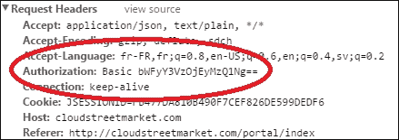

#### 使用 OAuth2

从`auth_modal.html`启动，使用 OAuth2 登录会创建对 API 处理程序`/api/signin/yahoo`的 POST HTTP 请求（该处理程序位于抽象的`ProviderSignInController`中）。

登录请求被重定向到 Yahoo！验证屏幕。整个页面转到雅虎！直到完成。当 API 最终将请求重定向到门户主页时，会添加一个`spi`请求参数：`http://cloudstreetmarket.com/portal/index?spi=F2YY6VNSXIU7CTAUB2A6U6KD7E`

这个`spi`参数就是 Yahoo！用户 ID（GUID）。被`DefaultController`（`cloudstreetmarket-webapp`捕捉并注入模型：

```
@RequestMapping(value="/*", method={RequestMethod.GET,RequestMethod.HEAD})
public String fallback(Model model, @RequestParam(value="spi", required=false) String spi) {
  if(StringUtils.isNotBlank(spi)){
    model.addAttribute("spi", spi);
  }
  return "index";
}
```

`index.jsp`文件直接在顶部菜单的 DOM 中呈现值：

```
<div id="spi" class="hide">${spi}</div>
```

当`menuController`（绑定到顶部菜单）自身初始化时，该值被读取并存储在`sessionStorage`中：

```
$scope.init = function () {
  if($('#spi').text()){
    httpAuth.setSession('oAuthSpiCSM', $('#spi').text());
  }
}
```

在我们的`httpAuth`工厂（`http_authorized.js`）中，在每次调用 API 之前调用的`refresh()`方法会检查此值是否存在，并添加两个额外的头：`Spi`带有 GUID 值和**OAuthProvider**（在我们的例子中为 yahoo）。代码如下：

```
refresh: function(){
  var authBasicItem = sessionStorage.getItem('basicHeaderCSM');
  var oAuthSpiItem = sessionStorage.getItem('oAuthSpiCSM');
  if(authBasicItem){
    $http.defaults.headers.common.Authorization = $.parseJSON(authBasicItem).Authorization;
  }
  if(oAuthSpiItem){
    $http.defaults.headers.common.Spi = oAuthSpiItem;
    $http.defaults.headers.common.OAuthProvider = "yahoo";
  }
}
```

此处的屏幕截图显示了一个 AJAX 请求的两个标题：

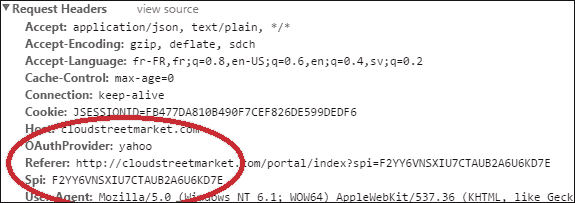

### HTML5 会话存储

我们在客户端将 SessionStorage 用作用户凭据和社交标识符（GUID）的存储解决方案。

在 HTML5 中，网页能够使用 web 存储技术在浏览器中本地存储数据。存储在 Web 存储中的数据可以从页面脚本访问，并且值可以相对较大（高达 5MB），对客户端性能没有影响。

Web 存储是按源（协议、主机名和端口号的组合）进行的。来自同一来源的所有页面都可以存储和访问相同的数据。有两种类型的对象可用于本地存储数据：

*   `window.localStorage`：存储无到期日的数据。
*   `window.sessionStorage`：存储一个会话的数据（关闭选项卡时数据丢失）。

这两个对象可以直接从窗口对象访问，它们都具有自解释的方法：

```
setItem(key,value);
getItem(key);
removeItem(key);
clear();
```

如[所示 http://www.w3schools.com/](http://www.w3schools.com/) 目前，几乎所有浏览器都支持本地存储（94%到 98%之间，取决于您所在的市场）。下表显示了完全支持它的第一个版本：

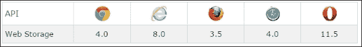

我们应该为不兼容的 web 浏览器实现一个带有 cookie 的回退选项，或者至少在浏览器看起来过时时发出一条警告消息。

### SSL/TLS

使用基本身份验证时，必须设置加密通信协议。我们已经看到凭据用户名：密码和雅虎！GUID 作为请求头发送。即使这些凭证是在 Base64 中编码的，但这并不表示有足够的保护。

### BCryptPasswordEncoder

在服务器端，我们不以明文形式存储`User`密码。我们只存储它们的编码描述（散列）。因此，散列函数被认为是不可逆的。

|   | *“散列函数是可用于将任意大小的数字数据映射到固定大小的数字数据的任何函数”。* |   |
|   | --*维基百科* |

让我们看一下以下映射：


此图显示了将`names``to``integers`从 0 映射到 15 的哈希函数。

我们在保存和更新`Users`时使用了手动调用的`PasswordEncoder`实现。`PasswordEncoder`也是 Spring 安全内核的接口：

```
public interface PasswordEncoder {
  String encode(CharSequence rawPassword);
  boolean matches(CharSequence rawPassword, String encodedPassword);
}
```

Spring Security 提供了三种实现：`StandardPasswordEncoder`、`NoOpPasswordEncoder`和`BCryptPasswordEncoder`。

我们使用`BCryptPasswordEncoder`作为新项目的推荐。与实现 MD5 或 SHA 散列算法不同，`BCryptPasswordEncoder`使用更强的散列算法，随机生成`salt`。

这允许为同一密码存储不同的哈希值。下面是一个针对`123456`值的不同`BCrypt`散列的示例：

```
$2a$10$Qz5slUkuV7RXfaH/otDY9udROisOwf6XXAOLt4PHWnYgOhG59teC6
$2a$10$GYCkBzp2NlpGS/qjp5f6NOWHeF56ENAlHNuSssSJpE1MMYJevHBWO
$2a$10$5uKS72xK2ArGDgb2CwjYnOzQcOmB7CPxK6fz2MGcDBM9vJ4rUql36
```

## 还有更多…

### 使用 AngularJS 设置 HTTP 头

由于我们已经设置了标题，请查看以下页面，了解有关 AngularJS 标题管理的更多信息：

[https://docs.angularjs.org/api/ng/service/$http](https://docs.angularjs.org/api/ng/service/%24http)

### 本地存储的浏览器支持

根据 b 浏览器版本获取关于整体支持的见解：

[http://caniuse.com/#search=localstorage](http://caniuse.com/#search=localstorage)

### 关于 SSL 和 TLS

我们已经在生产服务器上安装了 SSL 证书。为了购买并获得 SSL 证书，我们必须提供我们的 web 服务器类型（Apache 2）和由 keytool 程序（嵌入 JDK 中）生成的**证书签名请求**（**CSR**）。

*   [http://arstechnica.com/information-technology/2012/11/securing-your-web-server-with-ssltls/](http://arstechnica.com/information-technology/2012/11/securing-your-web-server-with-ssltls/)
*   [http://en.wikipedia.org/wiki/Certificate_signing_request](http://en.wikipedia.org/wiki/Certificate_signing_request)
*   [https://www.namecheap.com/support/knowledgebase/article.aspx/9422/0/tomcat-using-keytool](https://www.namecheap.com/support/knowledgebase/article.aspx/9422/0/tomcat-using-keytool)

# 授权服务和控制器

在此配方中，我们根据授予用户的权限限制对服务和控制器的访问。

## 准备好了吗

我们将在特定的 URL 路径和方法调用上安装拦截器，这将触发预定义的授权工作流：`AbstractSecurityInterceptor`工作流。

为了测试这些服务的限制，我们还稍微定制了 Swagger UI，以便在基本身份验证上使用它。

## 怎么做。。。

1.  我们为这个新版本更新了我们的`CustomBasicAuthenticationEntryPoint`类，它允许在从 Swagger UI 进行调用时提示浏览器本机基本表单：

    ```
    public class CustomBasicAuthenticationEntryPoint extends BasicAuthenticationEntryPoint {
      @Override
      public void commence(HttpServletRequest request, HttpServletResponse response, AuthenticationException authException) throws IOException, ServletException {
        String referer = (String) request.getHeader("referer");
        if(referer != null && referer.contains(SWAGGER_UI_PATH)){
          super.commence(request, response, authException);
          return;
        }
        response.setHeader("WWW-Authenticate", "CSM_Basic realm=\" + getRealmName() + \");
        response.sendError( HttpServletResponse.SC_UNAUTHORIZED, authException.getMessage());
      }
    }
    ```

2.  我们创建了一个`MonitoringController`（一个`RestController`）为管理用户提供了可能性。
3.  `GET`方法直接返回`User`对象（而不是`UserDTO`，它提供了用户的所有数据。同时，一个`delete`方法出现在这个位置。`MonitoringController`代码如下：

    ```
    @RestController
    @RequestMapping(value="/monitoring", 	produces={"application/xml", "application/json"})
    @PreAuthorize("hasRole('ADMIN')")
    public class MonitoringController extends CloudstreetApiWCI{
      @Autowired
      private CommunityService communityService;
      @Autowired
      private SocialUserService socialUserService;
      @RequestMapping(value="/users/{username}", method=GET)
      @ResponseStatus(HttpStatus.OK)
      @ApiOperation(value = "Details one account", notes = )
      public User getUserDetails(@PathVariable String username){
        return communityService.findOne(username);
      }
      @RequestMapping(value="/users/{username}", method=DELETE)
      @ResponseStatus(HttpStatus.OK)
      @ApiOperation(value = "Delete user account", notes =)
      public void deleteUser(@PathVariable String username){
        communityService.delete(username);
      }
      @RequestMapping(value="/users", method=GET)
      @ResponseStatus(HttpStatus.OK)
      @ApiOperation(value = "List user accounts", notes =)
      public Page<User> getUsers(@ApiIgnore @PageableDefault(size=10, page=0) Pageable pageable){
        return communityService.findAll(pageable);
      }
    }
    ```

4.  在`communityService`实现中，两个使用的方法（`findAll`、`delete`）已经得到了保障：

    ```
      @Override
      @Secured({"ROLE_ADMIN", "ROLE_SYSTEM"})
      public void delete(String userName) {
        userRepository.delete(userName);
      }
      @Override
      @Secured("ROLE_ADMIN")
      public Page<User> findAll(Pageable pageable) {
        return userRepository.findAll(pageable);
      }
    ```

5.  作为提醒，我们在`security-config.xml`：

    ```
    <security:global-method-security secured-annotations"="enabled"" pre-post-annotations"="enabled"" authentication-manager-ref"="authenticationManager""/>
    ```

    中设置了全局方法安全性
6.  Let's try it now. Restart your Tomcat and open a new window in your favorite browser. Open **Swagger UI** (`http://cloudstreetmarket.com/api/index.html`) as shown here:

    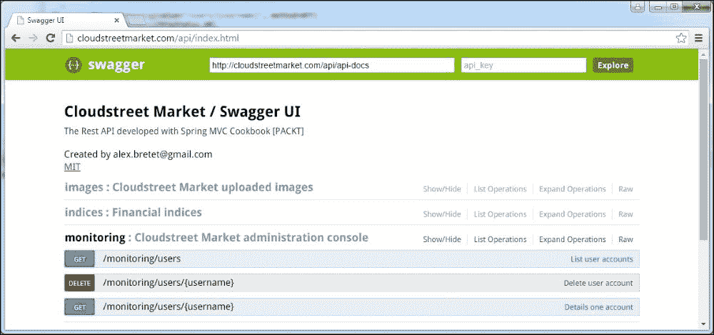

7.  打开**监控**页签。尝试调用**获取/监控/用户**方法列出用户账号。
8.  Your web browser should prompt a BASIC authentication form as follows:

    

9.  如果您取消此表单，您将收到一个**401（未经授权）**响应代码。
10.  出于测试目的，`communityController`中有一个`delete`方法没有任何注释。另外，请记住，没有为`communityController`路径

    ```
    @RequestMapping(value"="/{username"}", method=DELETE)
    @ResponseStatus(HttpStatus.OK
    @ApiOperation(value = "Delete a user account", notes =)
    public void deleteUser(@PathVariable String username){
      communityService.delete(username);
    }
    ```

    定义特定的 URL 拦截器
11.  Without sign in, try to call this handler from Swagger UI. As shown in the following screenshot, try to delete the user named **other10**.

    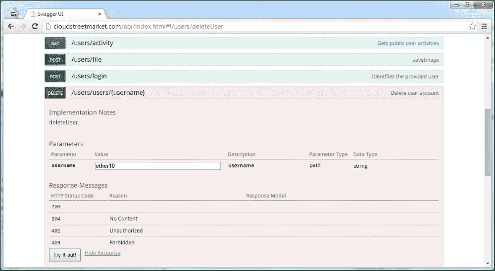

12.  您应该会收到一个**403（禁止）**响应状态，因为底层服务方法是安全的！
13.  You will see that you haven't been prompted a BASIC login form. Also, take a look at the response headers. You shouldn't see any **WWW-Authenticate** header, which could have triggered this popup.

    ### 提示

    如果用户未通过身份验证，并且请求的 HTTP 资源似乎是安全的，则调用`AuthenticationEntryPoint`。仅仅确保服务不足以保证 Spring 安全性考虑控制器方法处理程序是否安全。

14.  Try to `GET` the users again in the **monitoring** tab. You should see again the BASIC authentication form. Fill it with the following details:

    ```
    <User Name> admin
    <Password> admin 
    ```

    您现在应该会收到以下带有**200 状态代码**的响应：

    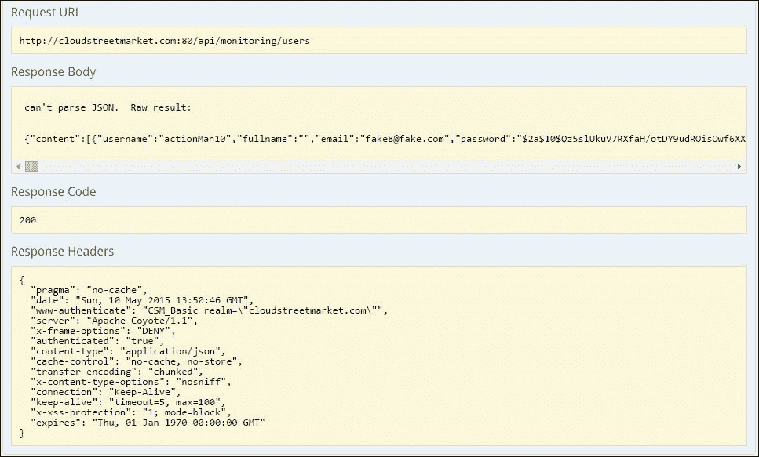

15.  当我们请求 JSON 响应时，Swagger UI 无法美化身体，但一切都在那里。

### 注

请注意响应代码：**WWW Authenticate:CSM_Basic realm“=“cloudstreetmarket.com”**。

## 它是如何工作的。。。

我们将看到 Spring 安全授权过程如何工作以及如何配置它。

### 春季安全管理局

`AuthenticationManager`实现将`GrantedAuthorities`存储到`SecurityContext`中的`Authentication`对象中。这些`GrantedAuthorities`由`AccessDecisionManager`读取，以尝试将其与访问的要求相匹配。

`AccessDecisionManager`实现可以是本机的，也可以是外部的，这解释了为什么基础设施强制将权限呈现为字符串。

如果`getAuthority()`方法不能将`GrantedAuthority`表示为字符串，则返回`null`，向`AuthenticationManager`表示必须支持该类型的`Authority`。

这种机制将不同的`getAuthority()`实现限制为有限的责任。

### 配置属性

我们在介绍`GrantedAuthority`对象时提到了配置属性（*通过基本方案*配方进行身份验证）。

配置属性在`SecurityInterceptor`和`AccessDecisionManager`实现中起着关键作用，因为`SecurityInterceptor` 委托给`AccessDecisionManager`。配置属性实现一种方法`ConfigAttribute`接口：

```
public interface ConfigAttribute extends Serializable {
  String getAttribute();
}
```

### 注

配置属性指定为安全方法上的注释或安全 URL（拦截 URL）上的访问属性。

我们在`security-config.xml`文件中定义了以下指令，以告知 Spring Security 在匹配`/basic.html`模式的 web 请求上期望配置属性`ROLE_BASIC`：

```
<security:intercept-url pattern="/basic.html" access="hasRole('BASIC')"/>
```

在默认的`AccessDecisionManager`实现中，任何具有匹配`GrantedAuthority`的用户都将被授予访问权限。

对于基于投票者的`AccessDecisionManager`实现，以`ROLE_`前缀开头的配置属性将被视为角色，并应由`RoleVoter`检查。我们将在接下来的章节中看到更多关于`AccessDecisionManager`的内容。

SecurityInterceptor 保护安全的对象是需要进行安全检查的对象或操作。框架处理两种类型的安全对象：

*   由**过滤器安全 Interceptor**检查的网络资源，如`ServletRequest`或`ServletResponse.`：几乎位于过滤器链末端的核心过滤器。
*   方法调用，是`org.aopalliance.intercept.MethodInvocation`的实现。由**MethodSecurityInterceptor**检查。

安全侦听器（方法或 HTTP 请求）在每个安全对象调用实际到达资源之前异步（基于事件）侦听它们。在处理这些调用时，Spring Security 始终应用一个简单的模式。这个模式来自`AbstractSecurityInterceptor`子类的使用。

`AbstractSecurityInterceptor`检查采用一致的工作流程来保护对象：

*   查找与.secure 对象关联的**配置属性**。
*   将安全对象、当前身份验证对象和配置属性提交到`AccessDecisionManager`接口进行授权决策。
*   可选地更改进行调用的`Authentication`对象。
*   允许安全对象调用继续（假定已授予访问权限）。
*   一旦调用返回，调用`AfterInvocationManager`接口（如果已配置）。如果调用引发异常，`AfterInvocationManager`将不会被调用。

此工作流可以用下图进行总结：


此图片的原始图形来自 Spring Security 参考。这很有趣，因为它突出了`SecurityInterceptor`在检查安全对象时可以使用的不同元素。

### 注

主要思想是使用从`SecurityMetadaSource`提取的属性以及最终的`AuthenticationManager`身份验证功能，将委托给`AccessDecisionManager`接口，然后可选地委托给`AfterInvocationManager`接口。

在少数情况下，可能需要更改`SecurityContext Authentication` 对象时，`RunAsManager`依赖项可以选择性地添加到`SecurityInterceptor`（*工作流的步骤 3*。接口定义如下：

```
public interface RunAsManager {
  Authentication buildRunAs(Authentication authentication, Object object, Collection<ConfigAttribute> attributes);
  boolean supports(ConfigAttribute attribute);
  boolean supports(Class<?> clazz);
}
```

如果`RunAsManager`没有设置依赖项，`SecurityInterceptor`将运行`NullRunAsManager`实现。可以选择配置一个`AfterInvocationManager`接口，用于改变调用返回的`statusToken`对象（工作流的*步骤 5*。

### 调用前处理

`AccessDecisionManager`决定是否必须允许访问。

#### 访问决策经理

`AccessDecisionManager`接口由`SecurityInterceptor`（在其工作流*步骤 2*中）调用，负责做出最终的访问控制决策。

该接口由以下三种方法组成：

```
public interface AccessDecisionManager {
  void decide(Authentication authentication, Object object, 				Collection<ConfigAttribute> configAttributes) throws AccessDeniedException, InsufficientAuthenticationException;
  boolean supports(ConfigAttribute attribute);
  boolean supports(Class<?> clazz);
}
```

如您所见，方法名称非常明确：

*   `decide`方法为提供的参数解析访问控制决策。`Authentication`对象表示调用该方法的调用方，该对象是要检查的安全对象，`configAttributes`是与安全对象关联的配置属性。此外，当访问被拒绝时，它会抛出一个`AccessDeniedException`。
*   在检查的早期阶段调用`supports(ConfigAttribute attribute)`方法，以确定`AccessDecisionManager`是否可以处理特定的`ConfigAttribute`。
*   在调用之前调用`supports(Class<?> clazz)`方法，以确保配置的`AccessDecisionManager`支持将显示的安全对象类型。

### 提示

使用名称空间配置时，Spring Security 会根据 intercept url 和 protect pointcut 声明中指定的访问属性（如果使用注释保护方法，则在注释中指定）自动注册用于评估方法调用和 web 访问的默认实例`AccessDecisionManager`。

在以下情况下，可以指定特定或自定义`AccessDecisionManager`：

*   处理 web 资源时在**http**命名空间上：

    ```
      <security:http ... access-decision-manager-ref"="xxx"">
      </security:http>
    ```

*   处理方法调用时在**全局方法安全**命名空间上：

    ```
      <security:global-method-security access-decision-manager-ref""=""... />
    ```

Spring Security 包括三个基于投票的`AccessDecisionManager`实现（`AffirmativeBased`、`ConsensusBased`和`UnanimousBased`。选民符合`AccessDecisionVoter`实施条件。接口定义如下：

```
public interface AccessDecisionVoter<S> {
  boolean supports(ConfigAttribute attribute);
  boolean supports(Class<?> clazz);
  int vote(Authentication authentication, S object,
  Collection<ConfigAttribute> attributes);
}
```

框架附带了一些`AccessDecisionVoter`实现（`AuthenticatedVoter`、`Jsr250Voter`、`PreInvocationAuthorizationAdviceVoter`、`WebExpressionVoter`、`RoleVoter`等等）。考试期间，对符合条件的`AccessDecisionVoters`进行授权决定投票。选民资格取决于选民在`AccessDecisionManager.decisionVoters`财产中的登记。这还取决于选民的支持方式。

`AccessDecisionManager`根据对选票的评估，决定是否向其投掷`AccessDeniedException`。每个`AccessDecisionVoter`根据不同的标准评估安全对象。

|   | *“Spring Security 提供的最常用的 AccessDecisionVoter 是 simple RoleVoter，它将配置属性视为简单的角色名称，并在用户被分配该角色时投票授予访问权限”。* |   |
|   | --*弹簧安全参考* |

### 调用处理后

Spring Security 中只有一个`AfterInvocationManager`实现：`AfterInvocationProviderManager`。该类将所有符合条件的`AfterInvocationProvider`实现对齐，以使它们有机会更改`SecurityInterceptor`结果。

与`AccessDecisionManager`接口类似，`AfterInvocationProvider`接口如下：

```
public interface AfterInvocationProvider {
  Object decide(Authentication authentication, Object object, Collection<ConfigAttribute> attributes, Object returnedObject) throws AccessDeniedException;
  boolean supports(ConfigAttribute attribute);
  boolean supports(Class<?> clazz);
}
```

### 基于表达式的访问控制

从 SpringSecurity 3 开始，现在可以使用 Spring**表达式语言**（**EL**来定义 Web 安全和方法安全。

|   | *“表达式使用根对象作为评估上下文的一部分进行评估。Spring Security 使用 web 和方法安全的特定类作为根对象，以提供内置表达式和对当前主体等值的访问。”* |   |
|   | --*弹簧安全参考* |

表达式根对象的基类为`SecurityExpressionRoot`。此抽象类提供对以下方法和属性的访问，这些方法和属性表示常见的内置表达式：

<colgroup><col> <col></colgroup> 
| 

表示

 | 

描述

 |
| --- | --- |
| `hasRole([role])` | 如果当前主体具有指定角色，则返回`true`。默认情况下，如果提供的角色不是以`ROLE_`开头，则会添加该角色。可通过修改`defaultRolePrefix onDefaultWebSecurityExpressionHandler`进行定制。 |
| `hasAnyRole([role1,role2])` | 如果当前主体具有任何提供的角色（以逗号分隔的字符串列表形式给出），则返回`true`。默认情况下，如果提供的角色不是以`ROLE_`开头，则会添加该角色。这可以通过修改`DefaultWebSecurityExpressionHandler`上的`defaultRolePrefix`来定制。 |
| `hasAuthority([authority])` | 如果当前主体具有指定权限，则返回`true`。 |
| `hasAnyAuthority([authority1,authority2])` | 如果当前主体具有任何提供的角色（以逗号分隔的字符串列表形式给出），则返回`true`。 |
| `principal` | 允许直接访问表示当前用户的主体对象。 |
| `authentication` | 允许直接访问从`SecurityContext`获取的当前`Authentication`对象。 |
| `permitAll` | 始终评估为`true.` |
| `denyAll` | 始终评估为`false.` |
| `isAnonymous()` | 如果当前主体是匿名用户，则返回`true`。 |
| `isRememberMe()` | 如果当前主体是 RememberMe 用户，则返回`true`。 |
| `isAuthenticated()` | 如果用户不是匿名的，则返回`true`。 |
| `isFullyAuthenticated()` | 如果用户不是匿名用户或记住我的用户，则返回`true`。 |
| `hasPermission(Object target, Object permission)` | 返回`true`如果用户在给定权限下有权访问提供的目标。例如，`hasPermission(domainObject, 'read').` |
| `hasPermission(Object targetId, String targetType, Object permission)` | 返回`true`如果用户在给定权限下有权访问提供的目标。例如，`hasPermission(1,'com.example.domain.Message', 'read')`。 |

#### 网络安全表达式

使用 Spring 安全命名空间，`<http>`块有一个默认为 true 的`use-expression`属性。此属性使`intercept-url`元素中的访问属性期望表达式作为值。

对于 Web 安全，表达式根对象的基类是`WebSecurityExpressionRoot`，它继承了 `SecurityExpressionRoot` 的方法，并提供了一个额外的方法：`hasIpAddress(…)`。

此外，`WebSecurityExpressionRoot`在评估上下文中公开了可在名称`request`下访问的`HttpServletRequest`对象。

如果使用的是表达式，则`AccessDecisionManager`中将添加一个`WebExpressionVoter`。

#### 方法安全表达式

Spring security 3.0 引入了方法安全性的表达式。四个安全注释支持表达式的使用：`@PreAuthorize`、`@PostAuthorize`、`@PreFilter`和`@PostFilter`。

##### 使用@PreAuthorize 和@PostAuthorize 进行访问控制

这些注释的使用必须在全局安全 bean 中激活：

```
<security:global-method-security pre-post-annotations"="enabled"">
```

`@PreAuthorize` 通常用于允许或禁止方法的调用。

我们已经在`MonitoringController`类上实现了这个注释：

```
@PreAuthorize("hasRole('ADMIN')")
public class MonitoringController extends CloudstreetApiWCI{
  ...
}
```

指定的表达式`hasRole('ADMIN')`表示只允许角色`ROLE_ADMIN`内的用户访问控制器。

### 提示

您可以注意到，`ROLE`的自动前缀避免了单词重复。这个不错的特性可以在表达式中使用，既可以在 web 安全性（拦截 url:access 属性）中使用，也可以在方法安全性中使用。

让我们从 Spring Security 参考文档中考虑这个例子：

```
@PreAuthorize("hasPermission(#contact, 'admin')")
public void deletePermission(Contact contact, Sid recipient, Permission permission);
```

这里，将方法参数传递到表达式中，以确定当前用户是否具有给定联系人的`admin`权限。

`@PostAuthorize`不太常用，但可以在调用该方法后执行访问控制检查。要访问表达式中的`AccessDecisionManager`返回值，请使用内置名称`returnObject`。

##### 使用@PreFilter 和@PostFilter 过滤集合

现在可以依靠 Spring 安全性过滤方法调用返回的集合（使用表达式）。

从参考文献中考虑这个例子：

```
@PreAuthorize("hasRole('USER')")
@PostFilter("hasPermission(filterObject, 'read') or hasPermission(filterObject, 'admin')")
public List<Contact> getAll();
```

Spring Security 迭代返回的集合，并删除所提供表达式为 false 的所有元素。名称筛选器对象引用集合中的当前对象。您也可以在方法调用之前使用`@PreFilter`进行过滤，尽管这是一个不太常见的要求。

实际上，为了在表达式中使用`hasPermission()`，需要在应用上下文中显式配置`PermissionEvaluator`。以下代码是一个示例：

```
<security:global-method-security...>
  <security:expression-handler ref="expressionHandler"/>
</security:global-method-security>
<bean id="expressionHandler" class="org.sfw.security.access.expression.method.DefaultMethod SecurityExpressionHandler">
  <property name="permissionEvaluator" ref="myPermissionEvaluator"/>
</bean>
```

`myPermissionEvaluator`为`PermissionEvaluator`实现：

```
public interface PermissionEvaluator extends AopInfrastructureBean {
  boolean hasPermission(Authentication authentication, Object targetDomainObject, Object permission);
  boolean hasPermission(Authentication authentication, Serializable targetId, String targetType, Object permission);
}
```

### JSR-250 与遗留方法安全

JSR-250 是 2006 年发布的 Java 规范请求。它指定了一组注释来处理常见的语义模式。在这些注释中，有些注释与安全性有关：

<colgroup><col> <col></colgroup> 
| 

注释名称

 | 

描述

 |
| --- | --- |
| `RolesAllowed` | 指定允许访问应用程序中方法的安全角色 |
| `PermitAll` | 指定允许所有安全角色访问带注释的方法或带注释类中的所有方法 |
| `DenyAll` | 指定不允许任何安全角色调用指定的方法 |
| `DeclareRoles` | 用于指定应用程序的安全角色 |

Spring Security 支持这些注释，但必须激活此支持：

```
<security:global-method-security jsr250-annotations"="enabled""…/>
```

Spring Security 还支持其遗留`@Secured`注释，如果启用：

```
<security:global-method-security secured-annotations"="enabled""…/>
```

## 还有更多…

### 域对象安全（ACLs）

一些更复杂的应用程序可能需要做出授权决策，这取决于受方法调用影响的实际域对象：

[http://docs.spring.io/spring-security/site/docs/current/reference/htmlsingle/#domain-acls](http://docs.spring.io/spring-security/site/docs/current/reference/htmlsingle/#domain-acls)

### 弹簧 EL

您可能需要查找有关 Spring EL 的更多信息：

[http://docs.spring.io/spring/docs/current/spring-framework-reference/html/expressions.html](http://docs.spring.io/spring/docs/current/spring-framework-reference/html/expressions.html)

### 弹簧安全参考

Spring 和安全性参考以及 SpringJavadoc 是该配方的主要信息来源。我们希望您喜欢我们的信息选择、分析和观点。

[http://docs.spring.io/spring-security/site/docs/current/apidocs/](http://docs.spring.io/spring-security/site/docs/current/apidocs/)

[http://docs.spring.io/spring-security/site/docs/current/reference/htmlsingle](http://docs.spring.io/spring-security/site/docs/current/reference/htmlsingle)

## 另见

*   Hierarchical Roles and role nesting appear to be recurring requirements:

    [http://docs.spring.io/spring-security/site/docs/current/reference/htmlsingle/#authz-层级角色](http://docs.spring.io/spring-security/site/docs/current/reference/htmlsingle/#authz-hierarchical-roles)

# 第 6 章实施 HATEOAS

本章包含以下配方：

*   将 DTO 转化为 Spring HATEOAS 资源
*   为超媒体驱动的 API 构建链接
*   选择公开 JPA 实体的策略
*   使用 OAuth 从第三方 API 检索数据

# 导言

什么是 HATEOAS？如果你以前从未见过这个词，它可能看起来很难发音。有人说它讨厌伊奥斯；还有人说讨厌 O-A-S。重要的一点是记住，这个缩写代表**超媒体作为应用状态**（**HATEOAS**的引擎。至少，你应该记住超媒体。超媒体作为资源嵌入以外部资源为目标的节点的能力。由于超媒体资源与其他资源相连，因此它也被限制在其域内，因为它在技术上无法开发（作为自身的一部分）其他资源的域。

把它想象成**维基百科**。如果我们创建了一个页面，其部分在页面标题（域）中不是自包含的，并且其中一个部分已经包含在外部页面中，那么管理员很少会提出这种情况。

HATEOAS 是一个适用于 REST 体系结构的约束。它在其资源上强加了一个域一致性，同时，它强加了一个明确的自我文档，所有者为了整个内聚必须维护这个文档。

## 理查森成熟度模型

Richardson 成熟度模型（由 Leonard Richardson 编写）提供了一种根据 REST 约束级别对 REST API 进行分级和限定的方法：


API 越符合 REST，其级别就越高。

该模型的初始状态为**0 级**：**水痘沼泽**。这里，协议（通常是 HTTP）仅用于其传输能力（而不是其状态描述功能）。此外，这里没有特定于资源的 URI，只有一个端点用于一个方法（通常是 HTTP 中的`POST`）。

**级别 1：资源**的特点是实现特定于资源的 URI。可以在 URI 中找到资源标识符。然而，仍然只使用了协议的一种方法（再次发布 HTTP）。

**级别 2:HTTP 谓词**反映了协议属性使用的改进。对于 HTTP，这实际上意味着 API 正在利用 HTTP 方法来实现其目的（`GET`读取、`POST`创建、`PUT`编辑、`DELETE`删除等等）。此外，API 还提供响应代码，可靠地向用户通知操作状态。

**三级：超媒体控件**为本机型最高级别。它表示使用 HATEOAS，它为客户端提供 API 发现功能。

你可以在 Martin Fowler 的博客上阅读更多关于 Richardson 成熟度模型的内容，网址为：

[http://martinfowler.com/articles/richardsonMaturityModel.html](http://martinfowler.com/articles/richardsonMaturityModel.html)

# 将 DTO 转化为春季 HATEOAS 资源

此配方介绍了如何创建春季 HATEOAS 资源。即使这里强调的是一个特定的资源——`IndexResource`（代替前`IndexOverviewDTO`），也可以随意浏览**cloudstreetmarket api**和**cloudstreetmarket 核心**，发现更多变化。

HATEOAS 原则在现阶段已应用于构成我们业务核心的所有资源，这强烈反映了雅虎的财务数据结构！（索引、报价、产品、历史数据、图表等）。

## 怎么做…

1.  From the **Git Perspective** in Eclipse, checkout the latest version of the `v6.x.x` branch. Then, run a `maven clean install` command on the **cloudstreetmarket-parent** module (right-click on the **Maven Clean** menu under **Run as…** and then again on **Maven Install** under **Run as…**) followed by a click on **Maven Update Project** menu to synchronize Eclipse with the Maven configuration (right-click on the module and then navigate to **Maven** | **Update Project…**.)

    ### 注

    该分支包括 SQL 脚本，这些脚本使用来自 Yahoo！的真实财务数据预填充数据库！。

2.  在拉取的更改中，一个新的`/app`配置目录显示在与`cloudstreetmarket-parent`和`zipcloud-parent`相同的级别。此`/app`目录必须复制到您系统的主目录：
    *   如果您在 Windows 上，请将其复制到`C:\Users\{system.username}\app`
    *   如果您在 Linux 上，请将其复制到 `/home/usr/{system.username}/app`
    *   如果您使用 Mac OS X，请在 `/Users/{system.username}/app`处复制
3.  SpringHateOAS 附带以下依赖项。此依赖项已添加到**云街市父级**、**云街市核心**、`and` **云街市 api**`:`

    ```
    <dependency>
      <groupId>org.springframework.hateoas</groupId>
      <artifactId>spring-hateoas</artifactId>
      <version>0.17.0.RELEASE</version>
    </dependency>
    ```

    中
4.  正如菜谱标题所示，我们的目标是摆脱使用 RESTAPI 公开的现有 DTO。目前，我们已经删除了 IndexOverviewDTO、MarketOverviewDTO、ProductOverviewDTO 和 StockProductOverviewDTO。
5.  这些 DTO 已被以下类别所取代：IndexResource、StockProductResource、ChartResource、ExchangeResource、IndustryResource 和 MarketResource。
6.  如 IndexResource 所示，如下所示，所有这些新类都继承了 Spring HATEOAS 资源类：

    ```
    @XStreamAlias("resource")
    public class IndexResource extends Resource<Index> {
      public static final String INDEX = "index";
      public static final String INDICES = "indices";
      public static final String INDICES_PATH = "/indices";

      public IndexResource(Index content, Link... links) {
        super(content, links);
      }
    }
    ```

7.  如您所见，使用 IndexResource，资源是从 JPA 实体（这里是 Index.java）创建的。这些实体存储在内容属性名称下的资源超类型中。
8.  我们已经转换了 JPA 实体，在可识别接口

    ```
    @Entity
    @Table(name="index_value")
    @XStreamAlias("index")
    public class Index extends ProvidedId<String> {

      private String name;

      @Column(name="daily_latest_value")
      private BigDecimal dailyLatestValue;

      @Column(name="daily_latest_change")
      private BigDecimal dailyLatestChange;

      @Column(name="daily_latest_change_pc")
      private BigDecimal dailyLatestChangePercent;

      @Column(name = "previous_close")
      private BigDecimal previousClose;

      private BigDecimal open;

      private BigDecimal high;

      private BigDecimal low;

      @ManyToOne(fetch = FetchType.EAGER)
      @JsonSerialize(using=IdentifiableSerializer.class)
      @JsonProperty("exchangeId")
      @XStreamConverter(value=IdentifiableToIdConverter.class, strings={"id"})
      @XStreamAlias("exchangeId")
       private Exchange exchange;

      @JsonIgnore
      @XStreamOmitField
      @ManyToMany(fetch = FetchType.LAZY)
      @JoinTable(name = "stock_indices", joinColumns = 
      {@JoinColumn(name = "index_code") },
      inverseJoinColumns = {@JoinColumn(name = "stock_code")})
      private Set<StockProduct> components = new LinkedHashSet<>();

      @Column(name="last_update", insertable=false, columnDefinition="TIMESTAMP DEFAULT CURRENT_TIMESTAMP")

      @Temporal(TemporalType.TIMESTAMP)
      private Date lastUpdate;

      public Index(){}

      public Index(String indexId) {
        setId(indexId);
      }

      //getters & setters

        @Override
        public String toString() {
        return "Index [name=" + name + ", dailyLatestValue=" + dailyLatestValue + ", dailyLatestChange=" + dailyLatestChange + ", dailyLatestChangePercent=" + dailyLatestChangePercent + ", previousClose=" + previousClose + ", open=" + open + ", high=" + high + ", low=" + low + ", exchange=" + exchange + ", lastUpdate=" + lastUpdate + ", id=" + id + "]";
        }
      }
    ```

    的实现中抽象出它们的@Id
9.  这里是提供的 ID 类的详细信息，它是我们可识别的实现之一：

    ```
    @MappedSuperclass
    public class ProvidedId<ID extends Serializable> implements Identifiable<ID> {
      @Id 
      protected ID id;
      @Override
      public ID getId() {
        return id;
      }
      public void setId(ID id) {
        this.id = id;
      }
      @Override
      public String toString() {
        return id;
      }
      @Override
      public int hashCode() {
        return Objects.hash(id);
      }
      @Override
      public boolean equals(Object obj) {
        if (this == obj)
          return true;
        if (obj == null)
          return false;
        if (getClass() != obj.getClass())
          return false;
        ProvidedId <?> other = (ProvidedId <?>) obj;
        return Objects.equals(this.id, other.id);
      }
    }
    ```

## 它是如何工作的。。。

一个新的 Spring 依赖项，几个新的资源对象（资源子类），最后对我们的实体进行一些修改，以便它们实现`Identifiable`接口。让我们详细汇报一下这一切。

### 春夏资源

正如本章开头所介绍的，HATEOAS 是关于链接的。公平地说，作为框架的一部分，我们可以期待一种支持和标准化链接表示的现有类型。

这是`ResourceSupport`类（Spring HATEOAS 的一部分）的角色：支持收集和管理附加到资源的链接。

或者，REST 资源也是内容。该框架还提供了一个已经继承了`ResourceSupport`的`Resource`类。

总之，使用 Spring HATEOAS，我们可以决定以两种不同的方式对资源对象（`IndexResource`、`StockProductResource`等）建模：

*   我们可以通过使它们直接继承`ResourceSupport`来对它们进行建模。通过这样做，我们必须自己管理作为包装器对象一部分的资源内容。这里的内容超出了框架的控制范围。
*   我们还可以通过使它们继承泛型的`Resource<T>`类来对它们进行建模，该类的类型`T`对应于资源的`POJO`内容的类型。这是我们选择的战略。该框架为我们的资源对象（`Inde3xResource`）提供了内容绑定、链接创建甚至控制器级别的好处。我们很快就会看到这一切。

#### 资源支持类

`ResourceSupport`类是实现`Identifiable<Link>`的对象：

```
public class ResourceSupport extends Object implements Identifiable<Link>
```

以下是来自`ResourceSupport`JavaDoc 的一个示例，它将为您提供有关其构造函数和方法的见解：

<colgroup><col> <col></colgroup> 
| 

建设者

 | 

描述

 |
| --- | --- |
| `ResourceSupport()` | 这将创建一个新的`ResourceSupport`类 |

<colgroup><col> <col></colgroup> 
| 

方法

 | 

描述

 |
| --- | --- |
| `Void add(Iterable<Link> links)` | 这会将所有给定链接添加到资源 |
| `Void add(Link... links)` | 这会将所有给定链接添加到资源 |
| `Void add(Link link)` | 这会将给定链接添加到资源 |
| `Link getId()` | 返回与`Link.REL_SELF`中`rel`的链接 |
| `Link getLink(String rel)` | 这将返回具有给定`rel`的链接 |
| `List<Link> getLinks()` | 这将返回此资源中包含的所有链接 |
| `boolean hasLink(String rel)` | 返回资源是否包含与给定`rel`的链接 |
| `boolean hasLinks()` | 这将返回资源是否包含链接 |
| `boolean removeLinks()` | 这将删除迄今为止添加到资源的所有链接 |
| `Boolean equals(Object obj)` |   |
| `int hashCode()` |   |
| `String toString()` |   |

正如前面介绍的一样，本课程都是关于链接的！我们将看到，Spring HATEOAS 在链环周围提供了一个小型机械。

#### 资源类

`Resource`类是`POJO`的包装器。`POJO`存储在此类的`content`属性中。`Resource`类本机扩展`ResourceSupport`：

```
public class Resource<T> extends ResourceSupport
```

下面是一个来自`Resource`JavaDoc 的示例，它提供了对其构造函数和方法的深入了解：

<colgroup><col> <col></colgroup> 
| 

建设者

 | 

描述

 |
| --- | --- |
| `Resource(T content, Iterable<Link> links)` | 这将创建具有给定内容和链接的新资源 |
| `Resource(T content, Link... links)` | 此创建具有给定内容和链接的新资源（可选） |

<colgroup><col> <col></colgroup> 
| 

方法

 | 

描述

 |
| --- | --- |
| `TgetContent()` | 这将返回基础实体 |
| `void add(Iterable<Link> links)` | 这会将所有给定链接添加到资源 |
| `void add(Link... links)` | 这会将所有给定链接添加到资源 |
| `void add(Link link)` | 这会将给定链接添加到资源 |
| `Link getId()` | 这将返回带有`Link.REL_SELF`的`rel`链接 |
| `Link getLink(String rel)` | 这将返回具有给定`rel`的链接 |
| `List<Link> getLinks()` | 这将返回此资源中包含的所有链接 |
| `boolean hasLink(String rel)` | 返回资源是否包含与给定`rel`的链接 |
| `boolean hasLinks()` | 这将返回资源是否包含链接 |
| `boolean removeLinks()` | 这将删除迄今为止添加到资源的所有链接 |
| `Boolean equals(Object obj)` |   |
| `int hashCode()` |   |
| `String toString()` |   |

两个方便的构造函数、一个内容获取器和所有链接相关的帮助器，这就是资源类的组成部分。

### 可识别接口

`Identifiable`接口在 Spring HATEOAS 中起着核心作用，因为我们稍后将介绍的关键类`Resource`、`ResourceSupport`、`Resources`和`PagedResources`都是`Identifiable`实现。稍后我们将介绍所有这些关键类。

`Identifiable`接口是一个 Spring HATEOAS 方法接口（通用接口），用于在对象中定义`Id`：

```
public interface Identifiable<ID extends Serializable> {
  ID getId();
}
```

因此，框架使用此方法检索 ID，对传入对象的性质要求很少。由于一个类能够实现多个接口，因此向一个对象添加这样的限定符是无成本的。此外，该接口的契约是最小的。

框架使用此接口（和方法）的最重要用途是从`Resource`对象构建链接。请看一下`LinkBuilderSupport`的`slash`方法。您会注意到，如果`ID`不是`Identifiable`的实例（这是它通常的结尾），则`Link`会附加`ID`类型的`toString()`表示。

### 提示

如果您正在考虑实现自定义 ID 类型，请记住此行为。

### 抽象实体的@Id

如果您计划坚持使用 SpringHateOAS，而不将其扩展到 SpringDataREST，那么将基本实体与其`@Id`解耦可能不是绝对必要的。至少不是我们那样做的。

这里，这个实践来自奥利弗·吉尔克（Oliver Gierke）在他的`Spring RestBucks`应用程序中。Spring RestBucks 是几个现代弹簧休息功能的展示应用程序。

### 注

Oliver Gierke 是 Pivotal Software，Inc.的 Spring 数据首席开发人员。。他还参与了《春天的仇恨》。Spring 数据是一个了不起的项目和产品。我们可以相信奥利弗·吉尔克的远见和决定。

在他的`AsbtractId`实现中，O.Gierke 将`Id`属性定义为 private，并将其注释为`@JsonIgnore`。他驱使我们将`Id`属性作为资源内容的一部分不公开。在 REST 中，资源的 ID 应该是它的 URI。

如果您有机会了解一下 SpringDataREST，那么这种方法作为框架的一部分是完全有意义的，框架将 REST 资源与 Spring 数据存储库紧密关联。

我们选择不在本书中介绍 Spring 数据 REST。但是，不公开实体 ID 对于我们的应用程序来说并不重要。出于这些原因，也因为我们希望在[第 7 章](#aid-3BOFI1 "Chapter 7. Developing CRUD Operations and Validations")、*开发 CRUD 操作和验证**ons*这一点上保持惯例，ID 将作为资源属性公开。

## 还有更多…

如果我们的 HATEOAS 介绍不够清晰，无法让您了解其原理，请务必阅读 Pivotal（[Spring.io](http://Spring.io)上的演示文稿：

[https://spring.io/understanding/HATEOAS](https://spring.io/understanding/HATEOAS)

## 另见

*   我们建议您访问 O.Gierke 的 Spring REST showcase 应用程序，该应用程序在[中展示了实际上与 Spring Data REST 耦合或不耦合的 Spring HateOAhttps://github.com/olivergierke/spring-restbucks](https://github.com/olivergierke/spring-restbucks) 。
*   你可以在[找到关于身份暴露的一些讨论 https://github.com/spring-projects/spring-hateoas/issues/66](https://github.com/spring-projects/spring-hateoas/issues/66) 。
*   我们建议您阅读更多关于 SpringDataREST 的内容，因为我们只介绍了一点点。SpringDataREST 在 Spring 数据存储库之上构建 REST 资源，并自动发布其 CRUD 服务。您可以在[了解更多信息 http://docs.spring.io/spring-data/rest/docs/current/reference/html](http://docs.spring.io/spring-data/rest/docs/current/reference/html) 。

# 为超媒体驱动的 API 构建链接

在本食谱中，我们将重点介绍如何创建与 SpringHateOAS 的链接，以及如何将它们绑定到资源。

我们将详细介绍资源汇编器，它们是可重用的转换组件，用于从实体（如`Index`）传递到它们的资源（`IndexResource`）。这些组件还支持链接创建。

## 怎么做…

1.  The created resources (IndexResource, ChartResource, ExchangeResource, IndustryResource, MarketResource, and so on) are created from their associated Entity (Index, ChartIndex, ChartStock, Exchange, Industry, Market, and so on) using resource assemblers registered as `@Component`:

    ```
    import static org.sfw.hateoas.mvc.ControllerLinkBuilder.linkTo;
    import static org.sfw.hateoas.mvc.ControllerLinkBuilder.methodOn;
    import org.sfw.hateoas.mvc.ResourceAssemblerSupport;
    import org.sfw.hateoas.EntityLinks;
    import static edu.zc.csm.api.resources.ChartResource.CHART;
    import static edu.zc.csm.api.resources.ExchangeResource.EXCHANGE;
    import static edu.zc.csm.api.resources.StockProductResource.COMPONENTS;

    @Component
    public class IndexResourceAssembler extends ResourceAssemblerSupport<Index, IndexResource> {
      @Autowired
      private EntityLinks entityLinks;
      public IndexResourceAssembler() {
        super(IndexController.class, IndexResource.class);
      }
      @Override
      public IndexResource toResource(Index index) {
        IndexResource resource = createResourceWithId(index.getId(), index);
        resource.add(
          entityLinks.linkToSingleResource(index.getExchange ()).withRel(EXCHANGE)
    );
      resource.add(
      linkTo(methodOn(ChartIndexController.class).get(in dex.getId(), ".png", null, null, null, null, null, 	null, null)).withRel(CHART)
    );
      resource.add(
        linkTo(methodOn(StockProductController.class).getS everal(null, null, index.getId(), null, null, 	null, null)).withRel(COMPONENTS)
    );
    return resource;
      }
      @Override
      protected IndexResource instantiateResource(Index entity) {
        return new IndexResource(entity);
      }
    }
    ```

    ### 提示

    我们使用了这些汇编程序来生成资源附带的链接。他们使用来自`ControllerLinkBuilder`（`linkTo`和`methodOn`的静态方法，以及资源本身中定义为常量的显式标签（`EXCHANGE`、`CHART`和`COMPONENTS`。

2.  我们已经修改了以前的 SwaggerConfig 类，以便该类可以用于其他 Swagger 域中基于注释的配置。此类已重命名为 AnnotationConfig。
3.  We have also added to this AnnotationConfig class the following two annotations:

    ```
    @EnableHypermediaSupport(type = { HypermediaType.HAL })

    @EnableEntityLinks 
    ```

    （`Because these two annotations don't have an XML equivalent yet`）。

4.  这些转换器中的所有目标控制器都已使用@ExposesResourceFor 注释进行注释（在类级别上）。
5.  这些控制器现在还返回创建的资源或资源页面：

    ```
    @RestController
    @ExposesResourceFor(Index.class)
    @RequestMapping(value=INDICES_PATH, produces={"application/xml", "application/json"})
    public class IndexController extends CloudstreetApiWCI<Index> {
      @Autowired
      private IndexService indexService;
      @Autowired
      private IndexResourceAssembler assembler;
      @RequestMapping(method=GET)
      public PagedResources<IndexResource> getSeveral(
        @RequestParam(value="exchange", required=false) String exchangeId,@RequestParam(value="market", required=false) MarketId marketId, @PageableDefault(size=10, page=0, sort={"previousClose"}, direction=Direction.DESC) Pageable pageable){
          return pagedAssembler.toResource( indexService.gather(exchangeId,marketId, pageable), assembler);
      }
      @RequestMapping(value="/{index:[a-zA-Z0-9^.-]+}{extension:\\.[a-z]+}", method=GET)
      public IndexResource get(
        @PathVariable(value="index") String indexId, @PathVariable(value="extension") String extension){
        return assembler.toResource( indexService.gather(indexId));
    }
    }
    ```

6.  Here, we have made CloudstreetApiWCI generic. In this way, CloudstreetApiWCI can have a generic PagedResourcesAssembler @Autowired:

    ```
    @Component
    @PropertySource("classpath:application.properties")
    public class CloudstreetApiWCI<T extends Identifiable<?>> 
      extends WebContentInterceptor {
    ...
        @Autowired
        protected PagedResourcesAssembler<T> pagedAssembler;
    ...
    }
    ```

    ### 提示

    由于`WebCommonInterceptor`类不是用作超级控制器共享属性和实用程序方法的遗留用途，因此我们将在控制器和`WebCommonInterceptor`之间创建一个中间组件。

7.  为了自动连接 PagedResourcesAssembler，我们已经在 dispatcher-servlet.xml:

    ```
      <bean class="org.sfw.data.web.PagedResourcesAssembler">
        <constructor-arg><null/></constructor-arg>
        <constructor-arg><null/></constructor-arg>
      </bean>
    ```

    中注册了一个 PagedResourcesAssembler bean
8.  As a result, now calling the API for a ^GDAXI index code (http://cloudstreetmarket.com/api/indices/%5EGDAXI.xml) produces the following output:

    

### 提示

作为链接，我们表示了端点和 URI 路径。从这些链接中，我们可以检索与索引相关的其他实体（如果我们想公开它们的话）。

## 它是如何工作的。。。

本节详细介绍了链接的创建。

### 资源汇编程序

这种专用转换器（资源汇编程序）被认为是可重用的。其主要功能如下：

*   实例化资源并使用内容使其水合
*   从实体状态或静态全局设计创建资源的链接

该框架提供了一个`ResourceAssemblerSupport`超类，其作用是减少汇编程序职责中的样板代码。

`ResourceAssemblerSupport`类是一个抽象泛型类。它通过提供两个额外的方法来丰富汇编程序。`T`为控制器的类或超级类。类型，其签名如下：

```
public abstract class ResourceAssemblerSupport<T, D extends ResourceSupport> implements ResourceAssembler<T, D>
```

这里的表格提供了`ResourceAssemblerSupport`JavaDoc 的一瞥：

<colgroup><col> <col></colgroup> 
| 

方法

 | 

描述

 |
| --- | --- |
| `List<D> toResources(Iterable<? extends T> entities)` | 这会将所有给定的实体转换为资源 |
| `protected D createResourceWithId(Object id, T entity)` | 这将创建一个具有给定 ID 的自链接的新资源 |
| `D createResourceWithId(Object id, T entity, Object... parameters)` | - |
| `protected D instantiateResource(T entity)` | 这将实例化资源对象。默认实现将采用`no-arg`构造函数并使用反射。但是，可以将其覆盖为最初手动设置对象实例（例如，在出现问题时提高性能） |

`ResourceAssemblerSupport`类还实现了`ResourceAssembler`，这是此处提供的一个方法接口，它迫使汇编程序提供`toResource(T entity)`方法：

```
public interface ResourceAssembler<T, D extends ResourceSupport> {
  D toResource(T entity);
} 
```

可以注意到在我们的汇编程序中重写了`instantiateResource`方法。正如 JavaDoc 中指定的，不重写它会导致框架通过反射实例化资源，在资源中寻找`no-arg`构造函数。

在这里，我们倾向于在我们的资源中避免此类构造函数，因为它们可能会有点开销。

### PagedResourcesAssembler

这个惊人的通用超级汇编程序用于为客户端构建基于链接的资源页面。SpringHateoas 只需极少量的配置，就可以为我们构建一个完整的、开箱即用、完全填充的键入资源页面。

根据我们提供的配置，您可以尝试调用以下 URL：

[http://cloudstreetmarket.com/api/indices.xml](http://cloudstreetmarket.com/api/indices.xml)

执行此操作时，应获得以下输出：


您能看到**next rel**链接吗？它是如何通过我们的方法处理程序注释及其默认值和使用值的反射构建的？尝试按照**下一个**链接查看导航是如何顺利更新和增加的。

在`IndexController.getSeveral()`方法处理程序（如下代码片段所示）中，我们通过使用我们的自定义`IndexResourceAssembler`创建`PagedResourcesAssembler`来确保每个资源都正确构建（内容和链接）：

```
@RequestMapping(method=GET)
public PagedResources<IndexResource> getSeveral(
@RequestParam(value="exchange", required=false) String exchangeId,
@RequestParam(value="market", required=false) MarketId marketId,
@PageableDefault(size=10, page=0, sort={"previousClose"}, direction=Direction.DESC) Pageable pageable){
  return pagedAssembler.toResource(
  indexService.gather(exchangeId, marketId, pageable), 
  assembler);
}
```

### 建立链接

让我们来看看我们在汇编程序中构建资源链接的方式。`IndexResourceAssembler`中提出的`toResource()`方法使用了两种不同的技术。

通过**实体链接**的第一种技术使用 JPA 实体；第二种是通过`ControllerLinkBuilder`静态方法，直接使用`Controllers`。

#### 实体链接

通过在配置类中声明`@EnableEntityLinks`注释，`EntityLinks`实现得到注册：`ControllerEntityLinks`。将查找**ApplicationContext**的所有 Spring MVC 控制器，以搜索带有`@ExposesResourceFor(xxx.class)`注释的控制器。

Spring MVC 控制器上的`@ExposesResourceFor`注释公开了控制器管理的模型类型。此注册启用控制器和 JPA 实体之间所需的映射。

还必须注意的是，注册的`ControllerEntityLinks`实现假定控制器上有某种`@RequestMapping`配置。`@RequestMapping`配置如下：

*   对于资源集合，需要类级别的`@RequestMapping`注释。然后，控制器必须公开映射到空路径的方法处理程序，例如，`@RequestMapping(method = RequestMethod.GET)`。
*   对于单个资源，这些资源通过托管 JPA 实体的`id`公开，例如`@RequestMapping("/{id}")`。

认识到这些点，`EntityLinks`实现（`ControllerEntityLinks`从`@Autowiring`开始使用它提供的方法集合生成`Links`：

```
public interface EntityLinks extends Plugin<Class<?>>{ 
  LinkBuilder linkFor(Class<?> type);
  LinkBuilder linkFor(Class<?> type, Object... parameters);
  LinkBuilder linkForSingleResource(Class<?> type, Object id);
  LinkBuilder linkForSingleResource(Identifiable<?> entity);
  Link linkToCollectionResource(Class<?> type);
  Link linkToSingleResource(Class<?> type, Object id);
  Link linkToSingleResource(Identifiable<?> entity);
}
```

#### 控制器链接生成器

正如所介绍的，Spring HATEOAS 提供了`ControllerLinkBuilder`实用程序，它允许通过指向控制器类来创建链接：

```
resource.add(
  linkTo(
  methodOn(StockProductController.class)
  .getSeveral(null, null, index.getId(), null, null, null, null)
  )
  .withRel(COMPONENTS)
);
```

如 Spring HATEOAS 参考中所述，`ControllerLinkBuilder`使用引擎盖下的 Spring`ServletUriComponentsBuilder`从当前请求中获取基本 URI 信息。

如果我们的应用程序在`http://cloudstreetmarket/api`上运行，那么框架将在这个根 URI 的基础上构建`Links`，将根控制器映射（`/indices`添加到它，然后添加到后续的方法处理程序特定路径。

## 还有更多…

### 正则表达式在@RequestMapping 中的使用

在`IndexController`、`StockProductController`、`ChartStockController`和`ChartIndexController`中，检索单个资源的`GET`方法处理程序有一个特殊的`@RequestMapping`定义。

以下是 IndexController 的`get()`方法：

```
@RequestMapping(value="/{index:[a-zA-Z0-9^.-]+}{extension:\\.[a-z]+}", method=GET)
public IndexResource get(
  @PathVariable(value="index") String indexId, 
  @PathVariable(value="extension") String extension){
  return assembler.toResource(indexService.gather(indexId));
}
```

我们最终选择了这个选项，因为雅虎！索引代码似乎比简单字符串更复杂。特别是考虑到这些代码可以携带一个或多个点。

这种情况导致 Spring MVC 无法正确区分`@PathVariable`索引和`extension`（中途将其剥离）。

幸运的是，SpringMVC 允许我们用正则表达式定义 URI 模板模式。语法为`{varName:regex}`，其中第一部分定义变量名，第二部分定义正则表达式。

您将注意到我们为索引定义的正则表达式：

`[a-zA-Z0-9^.-]+`表达式专门允许使用`^`和`.`字符，Yahoo 常用于索引代码中！

## 另见

*   欲了解更多关于 Spring HATEOAS 的信息，请参考[http://docs.spring.io/spring-hateoas/docs/current/reference/html/](http://docs.spring.io/spring-hateoas/docs/current/reference/html/) 。
*   引入的 HATEOAS 表示实现了**超文本应用语言**（**HAL**。Spring HATEOAS 支持 HAL 作为默认渲染。在[了解更多关于 HAL 规范的信息 https://tools.ietf.org/html/draft-kelly-json-hal-06](https://tools.ietf.org/html/draft-kelly-js) 和[http://stateless.co/hal_specification.html](http://stateless.co/hal_specification.html) 。

# 选择策略公开 JPA 实体

资源中公开的`content`对象是 JPA 实体。将 JPA 实体包装到资源中的有趣之处在于实体本身的低级别特性，它被认为代表一个受限的可识别域区域。理想情况下，应该将此定义完全转换为公开的 REST 资源。

那么，我们如何在 REST HATEOAS 中表示一个实体呢？我们如何安全、统一地代表 JPA 协会？

这个食谱提供了一个简单而保守的方法来回答这些问题。

## 怎么做…

1.  我们提供了一个用作资源的实体（`Index.java`。这里使用的是另一个实体：`Exchange.java`。该实体提出了一个类似的策略来公开其 JPA 关联：

    ```
    import edu.zc.csm.core.converters.IdentifiableSerializer;
    import edu.zc.csm.core.converters.IdentifiableToIdConverter;

    @Entity
    public class Exchange extends ProvidedId<String> {
      private String name;

      @ManyToOne(fetch = FetchType.EAGER)
      @JoinColumn(name = "market_id", nullable=true)
      @JsonSerialize(using=IdentifiableSerializer.class)
      @JsonProperty("marketId")
      @XStreamConverter(value=IdentifiableToIdConverter.class, strings={"id"})
      @XStreamAlias("marketId")
      private Market market;

      @OneToMany(mappedBy = "exchange", cascade = CascadeType.ALL, fetch=FetchType.LAZY)
      @JsonIgnore
      @XStreamOmitField
      private Set<Index> indices = new LinkedHashSet<>();

      @OneToMany(mappedBy = "exchange", cascade = CascadeType.ALL, fetch=FetchType.LAZY)
      @JsonIgnore
      @XStreamOmitField
      private Set<StockProduct> stocks = new LinkedHashSet<>();

      public Exchange(){}
      public Exchange(String exchange) {
        setId(exchange);
      }

      //getters & setters

      @Override
          public String toString() {
            return "Exchange [name=" + name + ", market=" + market + ", id=" + id+ "]";
          }
    } 
    ```

2.  `Exchange.java`实体引用两个自定义实用程序类，用于转换作为主实体呈现（JSON 或 XML）的一部分获取外部实体的方式。这些公用设施类别为以下`IdentifiableSerializer`和`IdentifiableToIdConverter`：
    *   `IdentifiableSerializer`类用于 JSON 编组：

        ```
        import org.springframework.hateoas.Identifiable;
        import com.fasterxml.jackson.core.JsonGenerator;
        import com.fasterxml.jackson.core.JsonProcessingException;
        import com.fasterxml.jackson.databind.JsonSerializer;
        import com.fasterxml.jackson.databind.SerializerProvider;
        public class IdentifiableSerializer extends JsonSerializer<Identifiable<?>> {
           @Override
           public void serialize(Identifiable<?> value, JsonGenerator jgen, SerializerProvider provider) throws IOException, JsonProcessingException {
            provider.defaultSerializeValue(value.getId(), jgen);
           }
        }
        ```

    *   `IdentifiableToIdConverter`类用于 XML 缓存，并使用 XStream 依赖项构建：

        ```
        import com.thoughtworks.xstream.converters.Converter;
        public class IdentifiableToIdConverter implements Converter {
            private final Class <Identifiable<?>> type;
            public IdentifiableToIdConverter(final Class <Identifiable<?>> type, final Mapper mapper, final ReflectionProvider reflectionProvider, final ConverterLookup lookup, final String valueFieldName) {
                this(type, mapper, reflectionProvider, lookup, valueFieldName, null);
            }
          public IdentifiableToIdConverter(final Class<Identifiable<?>> type, final Mapper mapper, final ReflectionProvider reflectionProvider, final ConverterLookup lookup, final String valueFieldName, Class valueDefinedIn) {
                this.type = type;
                Field field = null;
                try {
          field = (valueDefinedIn != null? valueDefinedIn : type.getSuperclass()).getDeclaredField("id");
          if (!field.isAccessible()) {
            field.setAccessible(true);
            }
              } catch (NoSuchFieldException e) {
                throw new IllegalArgumentException( 	e.getMessage()+": "+valueFieldName);
                  }
              }
              public boolean canConvert(final Class type) {
                return type.isAssignableFrom(this.type);
            }
            public void marshal(final Object source, final HierarchicalStreamWriter writer,final 	MarshallingContext context) {
                  if(source instanceof Identifiable){
                    writer.setValue( ((Identifiable<?>)source).getId() .toString()
                  );
                }
              }
            public Object unmarshal(final HierarchicalStreamReader reader, final UnmarshallingContext context) {
              return null;
            }
        }
        ```

## 它是如何工作的。。。

让我们了解这个策略是如何运作的。

### 剩余积垢原理

REST 架构的一个约束是提供统一的接口。统一接口是通过公开来自端点的资源来实现的，这些端点都可以通过不同的 HTTP 方法（如果适用）作为目标。

资源也可以在几种表示形式下公开（`json`、`xml`等），并且信息或错误消息必须是自描述性的。HATEOAS 的实现为 API 的自解释特性提供了极大的好处。

在 REST 中，越是直观和可推断的事情越好。从这个角度来看，作为一名 web/UI 开发人员，我应该能够假设：

*   我从端点的`GET`调用中收到的对象的结构将是我必须通过`PUT`调用发回的预期结构（对象的版本）
*   同样，创建新对象时也应使用相同的结构（方法`POST`）

不同 HTTP 方法之间有效负载结构的一致性是一个可靠且保守的论据，在保护 API 利益时使用。*现在几乎总是捍卫 API 利益的时候*。

### 暴露最小值

在本章的重构过程中，公开最少的信息量一直是核心思想。这通常是确保一个端点不会被用于公开初始控制器外部的信息数据的好方法。

JPA 实体可以与其他实体有关联（`@OneToOne`、`@OneToMany`、`@ManyToOne`或`@ManyToMany`）。

其中一些关联已用`@JsonIgnore`（和`@XStreamOmitField`注释，而其他一些关联已用`@JsonSerialize`和`@JsonProperty`（和`@XStreamConverter`和`@XStreamAlias`注释）。

#### 如果该实体不拥有该关系

在这种情况下，实体的数据库表没有目标第二个实体表的外键。

这里的策略是完全忽略 REST 中的关系以反映数据库状态。

`ignore`指令取决于支持的表示和选择的实现。

对于`json`，我们使用`Jackson`，解决方案为：`@JsonIgnore`。

对于`xml`，我们使用`XStream`，解决方案为：`@XstreamOmitField`。

#### 如果该实体拥有该关系

这里，该实体的数据库表具有外键，该外键位于目标第二实体的表中。

如果我们计划更新这个表的一个实体，它依赖于另一个表的一个实体，那么我们必须为该实体提供这个外键。

然后，我们的想法是将这个外键作为一个专用字段公开，就像数据库表的所有其他列一样。同样，实现这一点的解决方案取决于支持的表示和配置的封送拆收器。

对于`json`和`Jackson`，我们已经使用以下代码片段完成了这项工作：

```
@JsonSerialize(using=IdentifiableSerializer.class)
@JsonProperty("marketId")
```

如您所见，我们重命名该属性以表明我们正在呈现（并期望）一个 ID。我们创建了`IdentifiableSerializer`类，该类从实体（从`Identifiable`接口）提取`ID`，并仅将该`ID`放入该属性的值中。

对于`xml`和`XStream`而言，它是：

```
@XStreamConverter(value=IdentifiableToIdConverter.class, strings={"id"})
@XStreamAlias("marketId")
```

以同样的方式，我们重命名该属性以表明我们正在呈现一个`ID`，并且我们针对自定义转换器`IdentifiableToIdConverter`，该转换器也只选择实体的**ID**作为该属性的值。

以下是`^AMBAPT`索引的`xml`表示示例：


### 资源分离

此策略促进了资源之间的明确分离。显示的每个资源的字段与数据库架构完全匹配。这是 web 开发中的一个标准实践，用于保持不同 HTTP 方法的 HTTP 请求负载不变。

当采用 HATEOAS 时，我们应该充分鼓励使用链接来访问相关实体，而不是嵌套视图。

前面的配方*为超媒体驱动的 API*构建链接，其特点是通过示例访问（使用链接）与`@...ToOne`和`@...ToMany`关联的实体。以下是公开实体中这些链接的示例，如前一个配方中所实现的：


## 还有更多…

我们在这里详细介绍了已实施封送员的官方信息来源。

### Jackson 自定义序列化程序

您可以在以下位置找到这些序列化程序的官方 wiki 页面指南：

[http://wiki.fasterxml.com/JacksonHowToCustomSerializers](http://wiki.fasterxml.com/JacksonHowToCustomSerializers)

### XStream 转换器

XStream 已经从[codehaus.org](http://codehaus.org)迁移到**Github**。要阅读有关 XStream 转换器的官方教程，请转到：

[http://x-stream.github.io/converter-tutorial.html](http://x-stream.github.io/converter-tutorial.html)

# 使用 OAuth 从第三方 API 检索数据

在使用 OAuth2 对用户进行身份验证后，了解如何使用用户的 OAuth2 帐户调用远程第三方 API 是非常有用的。

## 怎么做…

1.  您可能已经注意到，`IndexController`、`StockProductController`、`ChartIndexController`和`ChartStockController`调用了名为`gather(…)`的底层服务方法。这个概念意味着对第三方提供商（Yahoo！）的查询将继续进行。
2.  例如，在`IndexServiceImpl`中，您可以找到`gather(String indexId)`方法：

    ```
    @Override
    public Index gather(String indexId) {
        Index index = indexRepository.findOne(indexId);
        if(AuthenticationUtil.userHasRole(Role.ROLE_OAUTH2)){
          updateIndexAndQuotesFromYahoo(index != null ? Sets.newHashSet(index) : Sets.newHashSet(new Index(indexId)));
          return indexRepository.findOne(indexId);
        }
      return index;
    }
    ```

3.  实际上是将服务层连接到第三方 API 的`updateIndexAndQuotesFromYahoo(…)`方法：

    ```
      @Autowired
      private SocialUserService usersConnectionRepository;

      @Autowired
      private ConnectionRepository connectionRepository;

      private void updateIndexAndQuotesFromYahoo(Set<Index> askedContent) {
          Set<Index> recentlyUpdated = askedContent.stream()
          .filter(t -> t.getLastUpdate() != null && DateUtil.isRecent(t.getLastUpdate(), 1))
            .collect(Collectors.toSet());

        if(askedContent.size() != recentlyUpdated.size()){
          String guid = AuthenticationUtil.getPrincipal().getUsername();
        String token = usersConnectionRepository .getRegisteredSocialUser(guid) .getAccessToken();
        Connection<Yahoo2> connection = connectionRepository .getPrimaryConnection(Yahoo2.class);
        if (connection != null) {
          askedContent.removeAll(recentlyUpdated);
            List<String> updatableTickers = askedContent.stream()
             .map(Index::getId)
             .collect(Collectors.toList());
         List<YahooQuote> yahooQuotes = connection.getApi() .financialOperations().getYahooQuotes(updatableTickers, token);

         Set<Index> upToDateIndex = yahooQuotes.stream()
           .map(t -> yahooIndexConverter.convert(t))
           .collect(Collectors.toSet());

          final Map<String, Index> persistedStocks = indexRepository.save(upToDateIndex) 	.stream()
            .collect(Collectors.toMap(Index::getId, Function.identity()));

         yahooQuotes.stream()
          .map(sq -> new IndexQuote(sq, persistedStocks.get(sq.getId())))
            .collect(Collectors.toSet());
          indexQuoteRepository.save(updatableQuotes);
        }
      }
    } 
    ```

4.  在 Facebook、Twitter 或 LinkedIn 的案例中，您应该能够找到一个完整的 API 适配器来执行对其 API 的调用，而无需对其进行修改。在我们的例子中，我们必须开发所需的适配器，以便可以从雅虎检索和利用财务数据！
5.  我们在`FinancialOperations`接口中添加了两个方法，如下面的代码片段所示：

    ```
    public interface FinancialOperations {
      List<YahooQuote> getYahooQuotes(List<String> tickers, String accessToken) ;
      byte[] getYahooChart(String indexId, ChartType type, ChartHistoSize histoSize, ChartHistoMovingAverage histoAverage, ChartHistoTimeSpan histoPeriod, Integer intradayWidth, Integer intradayHeight, String token);
    }
    ```

6.  此接口有如下`FinancialTemplate`实现：

    ```
    public class FinancialTemplate extends AbstractYahooOperations implements FinancialOperations {
        private RestTemplate restTemplate;
      public FinancialTemplate(RestTemplate restTemplate, boolean isAuthorized, String guid) {
        super(isAuthorized, guid);
        this.restTemplate = restTemplate;
        this.restTemplate.getMessageConverters() add( new YahooQuoteMessageConverter( MediaType.APPLICATION_OCTET_STREAM));
        }
      @Override
      public List<YahooQuote> getYahooQuotes(List<String> tickers, String token)  {
          requiresAuthorization();
          final StringBuilder sbTickers = new StringBuilder();
          String url = "quotes.csv?s=";
          String strTickers = "";
          if(tickers.size() > 0){
            tickers.forEach(t -> strTickers = sbTickers.toString();
              strTickers = strTickers.substring(0, strTickers.length()-1);
          }
           HttpHeaders headers = new HttpHeaders();
           headers.set("Authorization", "Bearer "+token);
           HttpEntity<?> entity = new HttpEntity<>(headers);
           return restTemplate.exchange(buildUri(FINANCIAL, url.concat(strTickers).concat("&f=snopl1c1p2hgbavx	c4")), HttpMethod.GET, entity , QuoteWrapper.class).getBody();
      } 
      ...
    }
    ```

7.  `FinancialTemplate`类被初始化为全局`Yahoo2Template`的一部分，全局`Yahoo2Template`由`IndexServiceImpl`的`connection.getApi()`调用返回。
8.  Using this technique to pull (as needed) not only indices and stock quotes from Yahoo! but also graphs, we are now able to display real-time data from more than 25,000 stocks and 30,000 indices.

    

9.  The client side is capable of using the provided HATEOAS links that come along with each result element. It uses these links to render detail views such as **Index detail** or **Stock detail** (new screens).

    

## 它是如何工作的。。。

让我们了解这个配方背后的理论。

### 雅虎财务数据介绍！

在我们应用程序的上下文中，仍有一个重构需要解释。它是关于历史数据和图表的。

雅虎！financial API 提供历史数据。这些数据可以用来构建图表，最初计划这样做。现在，雅虎！还可以生成图形（历史数据和日内数据），这些图形是可定制的（时间段、平均线、图表或股票的显示选项等）。

我们决定删除历史部分，这在技术上与报价检索（数据快照）非常相似，只使用雅虎生成的图形！

#### 图形生成/显示

我们的实现提供了一个在 REST 中提供图像服务的有趣示例。查看`ChartIndexController`（或`ChartStockController`）并了解图像如何作为字节数组返回。

还可以看看`home_financial_graph.js`文件，它是如何将接收到的内容设置为 HTML``标记的。

### 财务数据是如何拉取/刷新的？

这里的想法是依靠 OAuth 认证用户。雅虎！为经过身份验证和未经身份验证的用户提供不同的速率和限制。未经验证的呼叫在 Yahoo！在主叫 IP 旁边，在我们的例子中，主叫 IP 将（或多或少）是整个`CloudstreetMarket`应用程序 IP。如果雅虎！考虑到来自我们 IP 的呼叫太多，这将是一个问题。然而，如果有太多的电话来自一个特定的用户，雅虎！将在不影响应用程序其余部分的情况下限制该用户（应用程序可以进一步恢复这种情况）。

如您所见，可能处理雅虎财务数据的方法处理程序！通过名为`gather()`的方法调用相应的底层服务。

在这些`gather()`方法中，Yahoo！第三方 API 干扰我们的数据库和控制器。

如果用户使用 OAuth2 进行身份验证，则基础服务将检查数据库中是否存在数据，以及数据是否最近更新到足以匹配数据类型的预定义缓冲期（对于`indices`和`stocks`为一分钟）：

*   如果回答是“是”，则将此数据返回给客户端
*   如果回答为否，则从 Yahoo！请求预期的数据！，转换、存储在数据库中并返回到客户端

目前还没有为未通过 OAuth 认证的用户制定任何计划，但我们可以想象，使用普通的 Yahoo！OAuth 帐户。

### 呼叫第三方服务

对于提出的配方，该部分采用`updateIndexAndQuotesFromYahoo`方法完成。我们的 Spring 配置为每个用户定义了一个具有`request`作用域的`connectionRepository`bean。`connectionRepository`实例是根据我们`SocialUserServiceImpl`的`createConnectionRepository`工厂方法创建的。

基于此，我们`@Autowire`在我们的服务层中有两个 bean：

```
@Autowired
private SocialUserService usersConnectionRepository;
@Autowired
private ConnectionRepository connectionRepository;
```

然后`updateIndexAndQuotesFromYahoo`方法从 Spring Security 获取登录的`userId`（`guid`）：

```
String guid = AuthenticationUtil.getPrincipal().getUsername();
```

访问令牌从`SocialUser`实体中提取（来自数据库）：

```
String token = usersConnectionRepository .getRegisteredSocialUser(guid).getAccessToken();
```

雅虎！从数据库中检索连接：

```
Connection<Yahoo2> connection = connectionRepository.getPrimaryConnection(Yahoo2.class);
```

如果连接不为 null，则从连接对象调用第三方 API：

```
List<YahooQuote> yahooQuotes = connection.getApi() .financialOperations().getYahooQuotes(updatableTickers, token);
```

再一次，我们必须开发实际的`FinancialTemplate`（Yahoo！financial API 的 Java 表示），但是您应该能够为您的第三方提供商找到这样的现有实现。

## 还有更多…

本节提供了许多现有的开源 Spring 社交适配器的列表，我们可以在项目中使用这些适配器

### Spring Social-现有 API 提供商

以下地址提供了 Spring social extensions 的最新聚合，用于连接支持和许多流行服务提供商的 API 绑定：

[https://github.com/spring-projects/spring-social/wiki/Api-Providers](https://github.com/spring-projects/spring-social/wiki/Api-Providers)

## 另见

*   **雅虎！金融股票行情**：我们已经在数据库中预先填入了一组雅虎的金融参考资料！（股票参考和指数参考），这使我们能够点和搜索资源，可以第二次通过 Yahoo！API。这组参考资料来自**萨米尔·汗**在其博客[上发表的伟大作品 http://investexcel.net/all-yahoo-finance-stock-tickers](http://investexcel.net/all-yahoo-finance-stock-tickers) 。然后，我们使用基本的文本编辑器和宏将这个 XLS 数据转换成 SQL。

# 第 7 章：开发 CRUD 操作和验证

到目前为止，我们已经了解了如何构建 API 的只读 HTTP 方法。SpringMVC 控制器中的这些方法要求您掌握或至少理解一些技术的表示。开发非只读 HTTP 方法会引发一组新的基础主题。这些主题中的每一个都对客户体验有直接影响，因此每个主题都很重要。我们将介绍以下四种食谱作为涵盖主题的框架：

*   将 REST 处理程序扩展到所有 HTTP 方法
*   使用 bean 验证支持验证资源
*   为 REST 国际化消息和内容
*   使用 HTML5 和 AngularJS 验证客户端表单

# 导言

在这个阶段开发 CRUD 操作和验证被证明是最广泛的主题之一。

我们的应用程序将以多种方式进行转换，从事务管理标准化到错误（和内容）国际化，并通过 REST 处理程序、HTTP 遵从性进行转换。

与前几章和本书的全球战略一致，我们将重点关注 Spring MVC 如何在可伸缩性和微服务通信方面在当今和未来的最佳实践中发挥关键作用。决定跳过比特是一个艰难的选择，但是框架会不断地适应新的设计和挑战。本书试图在现代、可持续和可扩展的应用程序中呈现 SpringMVC 的一致集成。

这里介绍了四种食谱。第一种方法转换两个控制器，以支持各自资源的 CRUD 操作。这样做需要检查数据库事务和 HTTP 规范。

本章介绍了 SpringMVC 支持的两种验证策略。由于验证错误通常要用多种语言呈现，因此我们确保我们的应用程序支持国际化。我们简要介绍了如何在此透视图中使用 AngularJS，以及如何使用它来处理前端验证，这些验证对于将客户体验约束到特定于业务的数据管理的现实中始终是必要的。

# 将 REST 处理程序扩展到所有 HTTP 方法

这是本章的核心配方。我们将详细介绍如何将 SpringMVC 方法处理程序用于我们尚未介绍的 HTTP 方法：非只读方法。

## 准备好了吗

我们将看到返回的状态代码和驱动使用`PUT`、`POST`和`DELETE`方法的 HTTP 标准。这将使我们能够配置符合 HTTP 的 SpringMVC 控制器。

我们还将回顾`@RequestBody`等请求负载映射注释如何在引擎盖下工作，以及如何有效地使用它们。

最后，我们打开了一个关于 Spring 事务的窗口，因为它本身就是一个广泛而重要的主题。

## 怎么做…

以下步骤将介绍应用于两个控制器（一个服务和一个存储库）的更改：

1.  从 Eclipse 中的**Git 透视图**中，签出分支`v7.x.x`的最新版本。然后，在`cloudstreetmarket-parent`模块上运行`maven clean install`（右键单击该模块并转到**运行方式…****Maven Clean**，然后再次转到**运行方式…****Maven 安装**，然后是一个`Maven Update`项目，以将 Eclipse 与 Maven 配置同步（右键单击模块，然后转到**Maven****更新项目…**。
2.  在`zipcloud-parent`上运行`Maven clean`和`Maven install`命令，然后在`cloudstreetmarket-parent`上运行。然后，进入**Maven****更新项目**。
3.  In this chapter, we are focused on two REST controllers: the `UsersController` and a newly created `TransactionController`.

    ### 注

    `TransactionController`允许用户处理金融交易（从而买卖产品）。

4.  此处给出了`UserController`的简化版本：

    ```
    @RestController
    @RequestMapping(value=USERS_PATH, produces={"application/xml", "application/json"})
    public class UsersController extends CloudstreetApiWCI{
      @RequestMapping(method=POST)
      @ResponseStatus(HttpStatus.CREATED)
      public void create(@RequestBody User user, 
      @RequestHeader(value="Spi", required=false) String 	guid, @RequestHeader(value="OAuthProvider", required=false) String provider,
      HttpServletResponse response) throws IllegalAccessException{
      ...
      response.setHeader(LOCATION_HEADER, USERS_PATH + user.getId());
      }
      @RequestMapping(method=PUT)
      @ResponseStatus(HttpStatus.OK)
      public void update(@RequestBody User user, 
        BindingResult result){
        ...
      }
      @RequestMapping(method=GET)
      @ResponseStatus(HttpStatus.OK)
      public Page<UserDTO> getAll(@PageableDefault(size=10, page=0) Pageable pageable){
      return communityService.getAll(pageable);
      }
      @RequestMapping(value="/{username}", method=GET)
      @ResponseStatus(HttpStatus.OK)
      public UserDTO get(@PathVariable String username){
        return communityService.getUser(username);
      }
      @RequestMapping(value="/{username}", method=DELETE)
      @ResponseStatus(HttpStatus.NO_CONTENT)
      public void delete(@PathVariable String username){
        communityService.delete(username);
      }
    }
    ```

5.  The **TransactionController** is represented here in a simplified version:

    ```
    @RestController
    @ExposesResourceFor(Transaction.class)
    @RequestMapping(value=ACTIONS_PATH + TRANSACTIONS_PATH, produces={"application/xml", "application/json"})
    public class TransactionController extends CloudstreetApiWCI<Transaction> {
    ```

    （这里给出的`GET`方法处理程序来自以前的配方。）

    ```
      @RequestMapping(method=GET)
      @ResponseStatus(HttpStatus.OK)
      public PagedResources<TransactionResource> search(
        @RequestParam(value="user", required=false) String userName,
        @RequestParam(value="quote:[\\d]+", required=false) Long quoteId,
        @RequestParam(value="ticker:[a-zA-Z0-9-:]+", required=false) String ticker,
        @PageableDefault(size=10, page=0, sort={"lastUpdate"}, direction=Direction.DESC) Pageable pageable){
        Page<Transaction> page = transactionService.findBy(pageable, userName, quoteId, ticker);
          return pagedAssembler.toResource(page, assembler);
      }
      @RequestMapping(value="/{id}", method=GET)
      @ResponseStatus(HttpStatus.OK)
    public TransactionResource get(@PathVariable(value="id") Long transactionId){
      return assembler.toResource(
        transactionService.get(transactionId));
      }
    ```

    （这里介绍的`PUT`和`DELETE`方法处理程序是非只读方法。）

    ```
      @RequestMapping(method=POST)
      @ResponseStatus(HttpStatus.CREATED)
    public TransactionResource post(@RequestBody Transaction transaction) {
        transactionService.hydrate(transaction);
        ...
      TransactionResource resource = assembler.toResource(transaction);
      response.setHeader(LOCATION_HEADER, resource.getLink("self").getHref());
        return resource;
      }
      @PreAuthorize("hasRole('ADMIN')")
      @RequestMapping(value="/{id}", method=DELETE)
      @ResponseStatus(HttpStatus.NO_CONTENT)
    public void delete(@PathVariable(value="id") Long transactionId){
        transactionService.delete(transactionId);
      }
    }
    ```

6.  The call to the `hydrate` method in the `post` method prepares the Entity for underlying service uses. It populates its relationships from IDs received in the request payload.

    ### 注

    此技术将应用于用于 CRUD 的所有 REST 资源。

7.  Here are the details of the `hydrate` method in `transactionServiceImpl`:

    ```
    @Override
    public Transaction hydrate(final Transaction transaction) {

      if(transaction.getQuote().getId() != null){
        transaction.setQuote(
          stockQuoteRepository.findOne(
            transaction.getQuote().getId()));
      }
      if(transaction.getUser().getId() != null){
       transaction.setUser(userRepository.findOne(transaction.getUser().getId()));
      }
      if(transaction.getDate() == null){
        transaction.setDate(new Date());
      }
      return transaction;
    }
    ```

    ### 注

    这里没什么了不起的；它主要是建立我们的实体以满足我们的需求。可以创建一个接口来标准化实践。

8.  所有服务层都经过了审查，以推动统一的数据库事务。
9.  服务实现现在默认注释为`@Transactional(readOnly = true)`。检查以下`TransactionServiceImpl`示例：

    ```
    @Service
    @Transactional(readOnly = true)
    public class TransactionServiceImpl implements TransactionService{
      ...
    }
    ```

10.  这些服务实现的非只读方法使用`@Transactional`注释

    ```
      @Override
      @Transactional
      public Transaction create(Transaction transaction) {
      if(!transactionRepository.findByUserAndQuote(transaction.getUser(), transaction.getQuote()).isEmpty()){
          throw new DataIntegrityViolationException("A transaction for the quote and the user already exists!");
        }
        return transactionRepository.save(transaction);
      }
    ```

    覆盖类定义
11.  这一原则也适用于自定义存储库实现（如`IndexRepositoryImpl`：

    ```
    @Repository
    @Transactional(readOnly = true)
    public class IndexRepositoryImpl implements IndexRepository{
      @PersistenceContext 
      private EntityManager em;

      @Autowired
      private IndexRepositoryJpa repo;
      ...
      @Override
      @Transactional
      public Index save(Index index) {
        return repo.save(index);
      }
      ...
    }
    ```

## 它是如何工作的。。。

首先，让我们快速回顾一下此配方控制器中提供的不同 CRUD 服务。下表总结了它们：

<colgroup><col> <col> <col> <col></colgroup> 
| 

URI

 | 

方法

 | 

意图

 | 

正常响应码

 |
| --- | --- | --- | --- |
| `/actions/transactions` | 收到 | 搜索交易 | 200 行 |
| `/actions/transactions/{id}` | 收到 | 获得交易 | 200 行 |
| `/actions/transactions` | 邮递 | 创建事务 | 201 创建 |
| `/actions/transactions/{id}` | 删去 | 删除交易 | 204 无内容 |
| `/users/login` | 邮递 | 登录用户 | 200 行 |
| `/users` | 收到 | 全部 | 200 行 |
| `/users/{username}` | 收到 | 获取用户 | 200 行 |
| `/users` | 邮递 | 创建用户 | 201 创建 |
| `/users/{username}` | 放 | 更新用户 | 200 行 |
| `/users/{username}` | 删去 | 删除用户 | 204 无内容 |

### HTTP/1.1 规范–RFC 7231 语义和内容

为了理解在这个配方中已经做出的几个决定（并使它们合法化），我们必须对 HTTP 规范的几个要点进行一些说明。

开始之前，请访问互联网标准跟踪文件（RFC 7231），了解与语义和内容相关的**HTTP 1/1**：

[https://tools.ietf.org/html/rfc7231](https://tools.ietf.org/html/rfc7231)

#### 基本要求

在 HTTP 规范文档中，请求方法概述（第 4.1 节）指出服务器需要支持`GET`和`HEAD`方法。所有其他请求方法都是可选的。

同一节还规定，使用可识别的方法名称（`GET`、`POST`、`PUT`、`DELETE`等）但与任何方法处理程序都不匹配的请求应使用`405 Not supported`状态代码进行响应。类似地，使用无法识别的方法名称（非标准）发出的请求应使用`501 Not implemented`状态代码进行响应。这两条语句由 SpringMVC 本机支持并自动配置。

#### 安全幂等方法

该文档介绍了可用于描述请求方法的安全和幂等限定符。安全方法基本上是只读方法。使用这种方法的客户端不会显式地请求状态更改，也不能期望由于请求而导致状态更改。

顾名思义，这样的方法是可信的，不会对系统造成任何伤害。

一个重要的因素是，我们正在考虑客户的观点。安全方法的概念并不禁止系统执行非有效只读的“潜在”有害操作或过程。无论发生什么，客户都不能对此负责。在所有 HTTP 方法中，只有`GET`、`HEAD`、`OPTIONS`和`TRACE`方法被定义为安全的。

该规范使用幂等限定符来标识 HTTP 请求，这些请求在重复时总是产生与第一个请求相同的结果。这里必须考虑客户的观点。

幂等 HTTP 方法有`GET`、`HEAD`、`OPTIONS`、`TRACE`（安全方法）以及`PUT`和`DELETE`。

例如，方法的幂等性保证客户端可以重复发送**PUT**请求，即使在接收任何响应之前发生连接问题。

### 注

客户机知道重复请求将具有相同的预期效果，即使原始请求成功，尽管响应可能不同。

#### 其他特定于方法的约束条件

`POST`方法通常与在服务器上创建资源相关联。因此，此方法应返回`201 (Created)`状态代码，其中包含一个位置头，该位置头为创建的资源提供标识符。

但是，如果没有创建资源，`POST`方法（实际上）可能会返回除`206 (Partial Content)`、`304 (Not Modified)`和`416 (Range Not Satisfiable)`之外的所有类型的状态代码。

`POST`的结果有时可能是现有资源的表示。例如，在这种情况下，可以使用`303`状态代码和`Location`头字段将客户端重定向到该资源。作为`POST`方法的替代，通常选择`PUT`方法来更新或改变现有资源的状态，向客户端发送`200 (OK)`或`204 (No Content)`。

匹配不一致的边缘情况会导致错误出现在`409 (Conflict)`或`415 (Unsupported Media Type)`中。

未找到与更新匹配的边缘情况应导致创建具有`201 (Created)`状态代码的资源。

另一组约束适用于成功接收的`DELETE`请求。如果已处理删除，则应返回`204 (No Content)`状态代码或`200 (OK)`。否则，状态代码应为`202 (Accepted)`。

### 将请求有效负载映射到@RequestBody

在[第 4 章](11.html#aid-2QJ5E1 "Chapter 4. Building a REST API for a Stateless Architecture")*为无状态架构*构建 REST API 中，我们介绍了`RequestMappingHandlerAdapter`。我们已经看到 SpringMVC 委托给这个 bean 来提供对`@RequestMapping`注释的扩展支持。

在此透视图中，`RequestMappingHandlerAdapter`是通过`getMessageConverters()`和`setMessageConverters(List<HttpMessageConverter<?>> messageConverters)`访问和覆盖`HttpMessageConverters`的中心部件。

`@RequestBody`注释的作用与`HttpMessageConverters`紧密耦合。现在我们来介绍一下`HttpMessageConverters`。

### HttpMessageConverters

`HttpMessageConverters`、自定义或本机绑定到特定的 mime 类型。它们用于以下情况：

*   将 Java 对象转换为 HTTP 响应有效负载。从`Accept`请求头 mime 类型中选择，它们服务于`@ResponseBody`注释的目的（以及间接抽象`@ResponseBody`注释的`@RestController`注释）。
*   将 HTTP 请求有效负载转换为 Java 对象。从`Content-Type`请求头 mime 类型中选择，当方法处理程序参数上存在`@RequestBody`注释时，将调用这些转换器。

更多一般情况下`HttpMessageConverters`匹配以下`HttpMessageConverter`接口：

```
public interface HttpMessageConverter<T> {
  boolean canRead(Class<?> clazz, MediaType mediaType);
  boolean canWrite(Class<?> clazz, MediaType mediaType);
  List<MediaType> getSupportedMediaTypes();
  T read(Class<? extends T> clazz, HttpInputMessage inputMessage) throws IOException, HttpMessageNotReadableException;
  void write(T t, MediaType contentType, HttpOutputMessage outputMessage) throws IOException, HttpMessageNotWritableException;
}
```

`getSupportedMediaTypes()`方法返回特定转换器支持的`mediaTypes`（mime 类型）列表。此方法主要用于报告目的以及`canRead`和`canWrite`实施。框架使用这些`canRead`和`canWrite`合格性方法在运行时获取第一个`HttpMessageConverter`，即：

*   匹配客户端为`@RequestBody`所针对的给定 Java 类提供的`Content-Type`请求头
*   匹配客户端为 Java 类提供的`Accept`请求头，HTTP 响应负载将对应于`(`由`@ResponseBody`目标的类型）

#### 提供的 HttpMessageConverters

在最新版本的 SpringMVC（4+）中，一些额外的`HttpMessageConverters`与框架一起诞生。我们认为，总结它们会有所帮助。下表显示了所有本机`HttpMessageConverters`、mime 类型以及它们可以关联的 Java 类型。简短的描述（主要来自 JavaDoc）提供了关于每一个方面的更多信息。

<colgroup><col> <col> <col></colgroup> 
| 

URI

 | 

支持的媒体类型（默认情况下）

 | 

转换成/从

 |
| --- | --- | --- |
| `FormHttpMessage Converter` | 可以读/写应用程序/x-www-form-urlencoded，可以读取多部分/表单数据。 | `MultiValueMap<String, ?>` |
| 对于零件转换，它还嵌入（默认情况下）`ByteArrayHttpMessageConverter`、`StringHttpMessageConverter`和`ResourceHttpMessageConverter`。 |
| `AllEncompassing FormHttpMessage Converter` | 可以读/写应用程序/x-www-form-urlencoded，可以读取多部分/表单数据。 | `MultiValueMap<String, ?>` |
| 如果在基于 XML/JSON 的部件的类路径中找到额外的`HttpMessageConverters`JAXB 或 Jackson，则此转换器扩展了`FormHttpMessageConverter`嵌入。 |
| `XmlAwareFormHttp MessageConverter` | Can 读/写应用程序/x-www-form-urlencoded，可以读取多部分/表单数据。 | `MultiValueMap<String, ?>` |
| 此转换器扩展了`FormHttpMessageConverter`，通过`SourceHttpMessageConverter`添加了对基于 XML 的部件的支持。 |
| `BufferedImageHttp MessageConverter` | 可以读取注册的图像读取器支持的所有媒体类型。可以写入第一个可用的注册图像写入程序的媒体类型。 | `java.awt.image.BufferedImage` |
| `ByteArrayHttp MessageConverter` | 可以读取*/*，使用应用程序/八位字节流写入。 | `byte[]` |
| `GsonHttpMessage Converter` | 可以读/写 application/json，application/*+json。 | `java.lang.Object` |
| 使用 Google Gson 库的`Gson`类。此转换器可用于绑定类型化 bean 或非类型化哈希映射。 |
| `Jaxb2Collection HttpMessage Converter` | 可以读取 XML 集合。 | `T extends java.util.Collection` |
| 此转换器可以读取包含用`XmlRootElement`和`XmlType`注释的类的集合。请注意，此转换器不支持写入。（类路径上必须存在 JAXB2。） |
| `Jaxb2RootElement HttpMessage Converter` | 可以读/写 XML | `java.lang.Object` |
| 该转换器可以读取带有`XmlRootElement`和`XmlType`注释的类，也可以写入带有`XmlRootElement`注释的类或其子类。（类路径上必须存在 JAXB2。） |
| `MappingJackson2 HttpMessage Converter` | 可以读/写 application/json，application/*+json。 | `java.lang.Object` |
| 使用 Jackson 2.x ObjectMapper。此转换器可用于绑定类型化 bean 或非类型化 HashMap 实例。（Jackson 2 必须出现在类路径上。） |
| `MappingJackson2 XmlHttpMessage Converter` | 可以读/写 application/xml、text/xml、application/*+xml。 | `java.lang.Object` |
| 它使用 Jackson 2.x 扩展组件来读取和写入 XML 编码的数据（[https://github.com/FasterXML/jackson-dataformat-xml](https://github.com/FasterXML/jackson-dataformat-xml) 。（Jackson 2 必须出现在类路径上。） |
| `MarshallingHttp MessageConverter` | 可以读/写 text/xml 应用程序/xml。 | `java.lang.Object` |
| 这使用了 Spring 的 Marshaller 和 Unmarshaller 抽象（OXM）。 |
| `ObjectToStringHttp MessageConverter` | 可以读/写文本/纯文本。 | `java.lang.Object` |
| 它使用`StringHttpMessageConverter`读取和写入内容，并使用`ConversionService`将字符串内容与目标对象类型进行转换。（必须对其进行配置）。 |
| `ProtobufHttp MessageConverter` | 可以读取 application/json、application/xml、text/plain 和 application/x-protobuf。可以编写 application/json、application/xml、text/plain 和 application/x-protobuf、text/html。 | `javax.mail.Message` |
| 这使用了谷歌协议缓冲区（[https://developers.google.com/protocol-buffers](https://developers.google.com/protocol-buffers) 要生成消息 Java 类，需要安装`protoc`二进制文件。 |
| `ResourceHttp MessageConverter` | 可以读/写*/*。 | `org.springframework.core.io.Resource` |
| **Java 激活框架**（**JAF**）如果可用，用于确定写入资源的内容类型。如果 JAF 不可用，则使用应用程序/八位字节流。 |
| `RssChannelHttp MessageConverter` | 可以读/写应用程序/rss+xml。 | `com.rometools.rome.feed.rss.Channel` |
| 此转换器可以处理来自罗马项目（[的通道对象 https://github.com/rometools](https://github.com/rometools) 。（ROME 必须出现在类路径上。） |
| `AtomFeedHttp MessageConverter` | 可以读/写应用程序/atom+xml。 | `com.rometools.rome.feed.atom.Feed` |
| 这个可以处理来自罗马项目（[的 Atom 提要 https://github.com/rometools](https://github.com/rometools) 。（ROME 必须出现在类路径上。） |
| SourceHttpMessageConverter | 可以读/写 text/xml、application/xml、application/*-xml。 | `javax.xml.transform.Source` |
| `StringHttpMessageConverter` | 可以读/写*/*。 | `java.lang.String` |

#### 使用 MappingJackson2HttpMessageConverter

在这个配方中，`MappingJackson2HttpMessageConverter`被广泛使用。我们将此转换器用于金融事务创建/更新端和用户首选项更新端。

或者，我们使用 AngularJS 将 HTML 表单映射到属性与实体匹配的内置 json 对象。按照这种方式，我们将`POST`/`PUT`对象作为`application/json`mime 类型。

与发布`application/x-www-form-urlencoded`表单内容相比，这种方法更受欢迎，因为我们实际上可以将对象映射到实体。在我们的例子中，表单与后端资源完全匹配。这是 REST 设计的有益结果（和约束）。

### 使用@RequestPart 上传图片

`@RequestPart`注释可用于将`multipart/form-data`请求的一部分与方法参数相关联。它可以与参数类型一起使用，例如`org.springframework.web.multipart.MultipartFile`和`javax.servlet.http.Part`。

对于任何其他参数类型，该部分的内容通过一个与`@RequestBody`类似的`HttpMessageConverter`传递。

已经实现了`@RequestBody`注释来处理用户配置文件图片。以下是我们从`UserImageController`中获得的示例实现：

```
    @RequestMapping(method=POST, produces={"application/json"})
    @ResponseStatus(HttpStatus.CREATED)
    public String save( @RequestPart("file") MultipartFile file, HttpServletResponse response){
    String extension = ImageUtil.getExtension(file.getOriginalFilename());
    String name = UUID.randomUUID().toString().concat(".").concat(extension);
    if (!file.isEmpty()) {
       try {
                byte[] bytes = file.getBytes();
                Path newPath = Paths.get(pathToUserPictures);
                Files.write(newPath, bytes, 	StandardOpenOption.CREATE);
       ...
  ...
  response.addHeader(LOCATION_HEADER, env.getProperty("pictures.user.endpoint").concat(name));
  return "Success";
  ...
  }
```

请求的文件部分作为参数注入。将根据请求文件的内容在服务器文件系统上创建一个新文件。一个新的`Location`头被添加到响应中，并带有一个指向所创建图像的链接。

在客户端，此头作为我们 div 的`background-image`CSS 属性被读取和注入（请参见`user-account.html`。

### 交易管理

配方强调了我们应用于处理 REST 体系结构不同层次事务的基本原则。事务管理本身就是一个完整的章节，我们在这里仅作一个概述。

#### 简单化的方法

为了构建我们的事务管理，我们记住 Spring MVC 控制器不是事务性的。在这种情况下，我们不能期望在控制器的同一方法处理程序中对两个不同的服务调用进行事务管理。每个服务调用都会启动一个新事务，当返回结果时，该事务将终止。

我们在类型级别将服务定义为`@Transactional(readonly="true")`，然后需要写访问的方法在方法级别用额外的`@Transactional`注释覆盖该定义。我们配方的*第十步*展示了`TransactionServiceImpl`服务**上的事务性更改。**通过默认传播，事务在事务服务、存储库或方法之间得到维护和重用。

默认情况下，抽象的 Spring 数据 JPA 存储库是事务性的。我们只需要为自定义存储库指定事务行为，就像我们为服务所做的那样。

我们配方的*第十一步*显示了在自定义存储库`IndexRepositoryImpl`上进行的事务性更改。

## 还有更多…

如前所述，我们在应用程序的不同层上配置了一致的事务管理。

### 交易管理

我们的覆盖范围有限，如果您不熟悉以下主题，我们建议您查找有关这些主题的外部信息。

#### 酸性质

四个属性/概念通常用于评估交易的可靠性。因此，在设计事务时，记住它们是非常有用和重要的。这些特性是原子性、一致性、隔离性和耐久性。在 Wikipedia 页面上阅读有关 ACID 事务的更多信息：

[https://en.wikipedia.org/wiki/ACID](https://en.wikipedia.org/wiki/ACID)

#### 全球与本地交易

我们在应用程序中只定义了本地事务。本地事务在应用程序级别进行管理，不能跨多个 Tomcat 服务器传播。此外，当涉及多个事务资源类型时，本地事务无法确保一致性。例如，在与消息传递相关联的数据库操作的用例中，当我们回滚无法传递的消息时，我们可能还需要回滚之前发生的相关数据库操作。只有实现两步提交的全局事务才能承担这种责任。全局事务由 JTA 事务管理器实现处理。

阅读更多有关本 Spring 参考文档中差异的信息：

[http://docs.spring.io/spring/docs/2.0.8/reference/transaction.html](http://docs.spring.io/spring/docs/2.0.8/reference/transaction.html)

历史上，JTA 事务管理器是由 J2EE/JEE 容器独家提供的。在应用程序级 JTA 事务管理器实现中，我们现在有了其他替代方案，如 Atomikos（[http://www.atomikos.com](http://www.atomikos.com) 、Bitronix（[https://github.com/bitronix/btm](https://github.com/bitronix/btm) 或 JOTM（[http://jotm.ow2.org/xwiki/bin/view/Main/WebHome](http://jotm.ow2.org/xwiki/bin/view/Main/WebHome) 确保 J2SE 环境中的全局事务。

Tomcat（7+）还可以与配合使用`TransactionSynchronizationRegistry`和 JNDI 数据源的应用级 JTA 事务管理器实现，以反映容器中的事务管理。

[https://codepitbull.wordpress.com/2011/07/08/tomcat-7-with-full-jta](https://codepitbull.wordpress.com/2011/07/08/tomcat-7-with-full-jta)

## 另见

性能和有用的元数据好处可以从这三个标题中获得，这三个标题在配方中没有详细说明。

*   **缓存控制、ETag 和上次修改的**：Spring MVC 支持这些头文件，作为入口点，我们建议您查看 Spring 参考：[http://docs.spring.io/spring-framework/docs/current/spring-framework-reference/html/mvc.html#mvc-缓存 etag lastmodified](http://docs.spring.io/spring-framework/docs/current/spring-framework-reference/html/mvc.html#mvc-caching-etag-lastmodified)

# 使用 bean 验证支持验证资源

在介绍了请求有效负载数据绑定过程之后，我们必须讨论验证。

## 准备好了吗

这个方法的目标是展示如何让 SpringMVC 拒绝不满足 bean 验证（JSR-303）或不满足定义的 SpringValidator 实现约束的请求体有效负载。

在 Maven 和 Spring 配置之后，我们将看到如何将验证器绑定到传入请求，如何定义验证器以执行自定义规则，如何设置 JSR-303 验证，以及如何处理验证结果。

## 怎么做…

1.  我们向 hibernate 验证器添加了一个 Maven 依赖项：

    ```
    <dependency>
      <groupId>org.hibernate</groupId>
      <artifactId>hibernate-validator</artifactId>
      <version>4.3.1.Final</version>
    </dependency>
    ```

2.  A`LocalValidatorFactoryBean`已在我们的`dispatcher-servlet.xml`（`cloudstreetmarket-api`：

    ```
    <bean id="validator" class="org.sfw.validation.beanvalidation.LocalValidatorFactoryBean"/>
    ```

    注册
3.  The `UsersController` and `TransactionController` have seen their `POST` and `PUT` method signature altered with the addition of a `@Valid` annotation on the `@RequestBody` arguments:

    ```
      @RequestMapping(method=PUT)
      @ResponseStatus(HttpStatus.OK)
      public void update(@Valid @RequestBody User user, 
      BindingResult result){
        ValidatorUtil.raiseFirstError(result);
        user = communityService.updateUser(user);
      }
    ```

    ### 注

    注意这里的`BindingResult`对象作为方法参数被注入。另外，我们将在一分钟后介绍`ValidatorUtil`课程。

4.  我们的两个 CRUD 控制器现在有一个新的`@InitBinder`注释方法：

    ```
      @InitBinder
        protected void initBinder(WebDataBinder binder) {
            binder.setValidator(new UserValidator());
        }
    ```

5.  此方法将创建的验证器实现的实例绑定到请求。查看创建的`UserValidator`是`Validator`实现：

    ```
    package edu.zipcloud.cloudstreetmarket.core.validators;
    import java.util.Map;
    import javax.validation.groups.Default;
    import org.springframework.validation.Errors;
    import org.springframework.validation.Validator;
    import edu.zc.csm.core.entities.User;
    import edu.zc.csm.core.util.ValidatorUtil;
    public class UserValidator implements Validator {
      @Override
      public boolean supports(Class<?> clazz) {
        return User.class.isAssignableFrom(clazz);
      }
      @Override
      public void validate(Object target, Errors err) {
        Map<String, String> fieldValidation = ValidatorUtil.validate((User)target, Default.class);
        fieldValidation.forEach(
          (k, v) -> err.rejectValue(k, v)
        );
      }
    }
    ```

6.  在`User`实体中，增加了对特殊注释：

    ```
    @Entity
    @Table(name="users")
    public class User extends ProvidedId<String> implements UserDetails{
      ...
      private String fullName;
      @NotNull
      @Size(min=4, max=30)
      private String email;
      @NotNull
      private String password;
      private boolean enabled = true;
      @NotNull
      @Enumerated(EnumType.STRING)
      private SupportedLanguage language;
      private String profileImg;

      @Column(name="not_expired")
      private boolean accountNonExpired;
      @Column(name="not_locked")
      private boolean accountNonLocked;

      @NotNull
      @Enumerated(EnumType.STRING)
      private SupportedCurrency currency;

      private BigDecimal balance;
      ...
    }
    ```

7.  We have created the `ValidatorUtil` class to make those validations easier and to reduce the amount of boilerplate code:

    ```
    package edu.zipcloud.cloudstreetmarket.core.util;
    import java.util.Arrays;
    import java.util.HashMap;
    import java.util.Map;
    import java.util.Set;
    import javax.validation.ConstraintViolation;
    import javax.validation.Validation;
    import javax.validation.Validator;
    import javax.validation.ValidatorFactory;
    import javax.validation.groups.Default;
    import org.springframework.validation.BindingResult;

    public class ValidatorUtil {
        private static Validator validator;
        static {
          ValidatorFactory factory = Validation.buildDefaultValidatorFactory();
          validator = factory.getValidator();
        }
    ```

    以下`validate`方法允许我们从可能需要的任何位置调用 JSR 验证：

    ```
    public static <T> Map<String, String> validate(T object, Class<?>... groups) {
      Class<?>[] args = Arrays.copyOf(groups, groups.length + 1);
      args[groups.length] = Default.class;
      return extractViolations(validator.validate(object, args));
    }
    private static <T> Map<String, String> extractViolations(Set<ConstraintViolation<T>> violations) {
      Map<String, String> errors = new HashMap<>();
      for (ConstraintViolation<T> v: violations) {
        errors.put(v.getPropertyPath().toString(), "["+v.getPropertyPath().toString()+"] " + StringUtils.capitalize(v.getMessage()));
      }
      return errors;
      }
    ```

    下面的`raiseFirstError`方法不是特定的标准，它是我们向客户端呈现服务器端错误的方式：

    ```
      public static void raiseFirstError(BindingResult result) {
        if (result.hasErrors()) {
          throw new IllegalArgumentException(result.getAllErrors().get(0).getCode());
        }
    else if (result.hasGlobalErrors()) {
    throw new IllegalArgumentException(result.getGlobalError().getDefaultMessage());
           }
    }
    }
    ```

8.  根据[第 4 章](11.html#aid-2QJ5E1 "Chapter 4. Building a REST API for a Stateless Architecture")、*为无状态架构*构建 REST API，cloudstreetmarket API 的`RestExceptionHandler`仍配置为处理`IllegalArgumentExceptions`，呈现`ErrorInfo`格式的响应：

    ```
    @ControllerAdvice
    public class RestExceptionHandler extends ResponseEntityExceptionHandler {
      @Autowired
      private ResourceBundleService bundle;
       @Override
      protected ResponseEntity<Object> handleExceptionInternal(Exception ex, Object body,
        HttpHeaders headers, HttpStatus status, WebRequest request) {
        ErrorInfo errorInfo = null;
        if(body!=null && bundle.containsKey(body.toString())){
            String key = body.toString();
            String localizedMessage = bundle.get(key);
            errorInfo = new ErrorInfo(ex, localizedMessage, key, status);
        }
        else{
          errorInfo = new ErrorInfo(ex, (body!=null)? body.toString() : null, null, status);
        }
    return new ResponseEntity<Object>(errorInfo, headers, status);
    }
      @ExceptionHandler({ InvalidDataAccessApiUsageException.class, DataAccessException.class, IllegalArgumentException.class })
      protected ResponseEntity<Object> handleConflict(final RuntimeException ex, final WebRequest request) {
          return handleExceptionInternal(ex, I18N_API_GENERIC_REQUEST_PARAMS_NOT_VALID, new HttpHeaders(), BAD_REQUEST, request);
        }
    }
    ```

9.  Navigating through the UI improvements, you will notice a new form for updating the user's **Preferences**. This form is accessible via the **Login** menu, as shown in the following screenshots:

    

    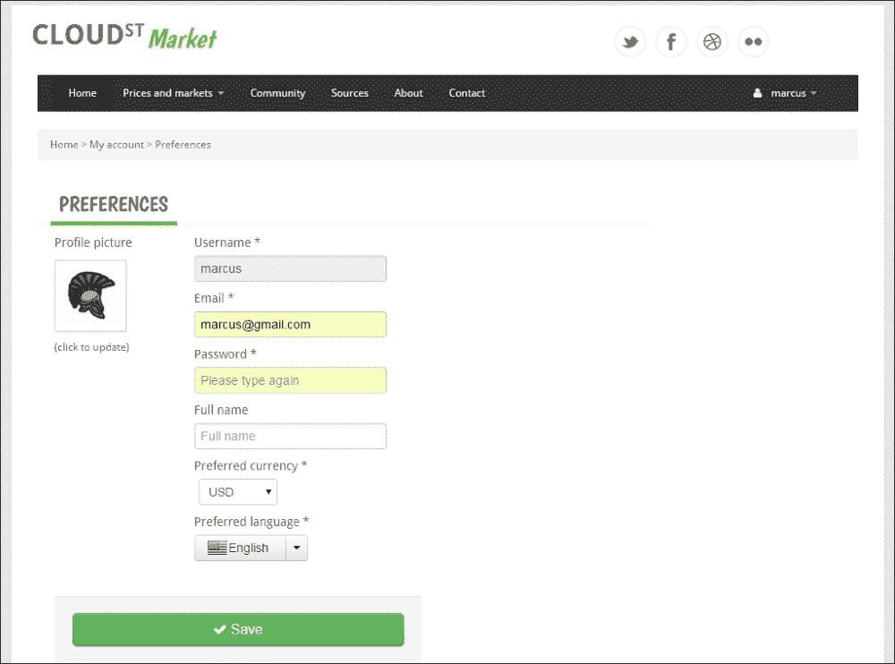

10.  在此用户**首选项**表单中，当前端验证被停用（前端验证将在本章最后一个配方中开发）时，不填写电子邮件字段将导致 HTTP 响应中出现以下（可定制的）`ErrorInfo`对象：

    ```
    {"error":"[email] Size must be between 4 and 30",
    "message":"The request parameters were not valid!",
    "i18nKey":"error.api.generic.provided.request.parameters.not.valid",
    "status":400,
    "date":"2016-01-05 05:59:26.584"}
    ```

11.  在前端，为了处理此错误，`account_management.js`中的`accountController`被实例化为依赖于自定义`errorHandler`工厂。代码如下：

    ```
    cloudStreetMarketApp.controller('accountController', function ($scope, $translate, $location, errorHandler, accountManagementFactory, httpAuth, genericAPIFactory){
          $scope.form = {
          id: "",
        email: "",
        fullName: "",
        password: "",
        language: "EN",
        currency: "",
        profileImg: "img/anon.png"
          };
      ...
    }
    ```

12.  `accountController`有一个`update`方法调用`errorHandler.renderOnForm`方法：

    ```
      $scope.update = function () {
        $scope.formSubmitted = true;

        if(!$scope.updateAccount.$valid) {
            return;
        }
          httpAuth.put('/api/users', JSON.stringify($scope.form)).success(
          function(data, status, headers, config) {
            httpAuth.setCredentials($scope.form.id, $scope.form.password);
          $scope.updateSuccess = true;
          }
        ).error(function(data, status, headers, config) {
            $scope.updateFail = true;
            $scope.updateSuccess = false;
            $scope.serverErrorMessage = errorHandler.renderOnForms(data);
          }
        );
      };
    ```

13.  The `errorHandler` is defined as follows in `main_menu.js`. It has the capability to pull translations messages from `i18n` codes:

    ```
    cloudStreetMarketApp.factory("errorHandler", ['$translate', function ($translate) {
        return {
            render: function (data) {
            if(data.message && data.message.length > 0){
              return data.message;
            }
            else if(!data.message && data.i18nKey && data.i18nKey.length > 0){
              return $translate(data.i18nKey);
              }
            return $translate("error.api.generic.internal");
            },
            renderOnForms: function (data) {
            if(data.error && data.error.length > 0){
              return data.error;
            }
            else if(data.message && data.message.length > 0){
              return data.message;
            }
            else if(!data.message && data.i18nKey && data.i18nKey.length > 0){
              return $translate(data.i18nKey);
            }
            return $translate("error.api.generic.internal");
            }
        }
    }]);
    ```

    **首选项**表单如下所示：

    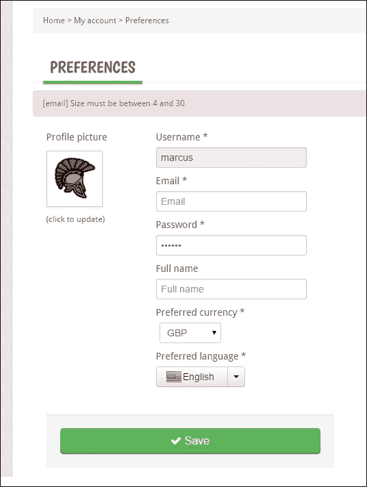

    ### 提示

    正如我们所说的，为了模拟这个错误，需要停用前端验证。这可以通过在`user-account.html`中的`<form name="updateAccount" … novalidate>`标记中添加`novalidate`属性来完成。

14.  回到服务器端，我们还为金融交易实体创建了一个自定义验证器。此验证器使用弹簧`ValidationUtils`：

    ```
    @Component
    public class TransactionValidator implements Validator {
      @Override
      public boolean supports(Class<?> clazz) {
        return Transaction.class.isAssignableFrom(clazz);
      }
      @Override
      public void validate(Object target, Errors errors) {
        ValidationUtils.rejectIfEmpty(errors, "quote", " transaction.quote.empty");
        ValidationUtils.rejectIfEmpty(errors, "user", " transaction.user.empty");
        ValidationUtils.rejectIfEmpty(errors, "type", " transaction.type.empty");
      }
    }
    ```

## 它是如何工作的。。。

### 使用弹簧验证器

Spring 提供了一个`Validator`接口（`org.sfw.validation.Validator`，用于创建要在所需的层中注入或实例化的组件。因此，Spring 验证组件可以在 Spring MVC 控制器中使用。`Validator`界面如下：

```
public interface Validator {
  boolean supports(Class<?> clazz);
  void validate(Object target, Errors errors);
}
```

`supports(Class<?> clazz)`方法用于评估`Validator`实现的域，并将其使用限制为特定类型或超级类型。

`validate(Object target, Errors errors)`方法强制使用其标准，因此验证器的验证逻辑就存在于此。对通过的`target`对象进行评估，验证结果存储在`org.springframework.validation.Errors`接口实例中。`Errors`界面部分预览如下：

```
public interface Errors {
  ...
  void reject(String errorCode);
  void reject(String errorCode, String defaultMessage);
void reject(String errorCode, Object[] errorArgs, String defaultMessage);
void rejectValue(String field, String errorCode); void rejectValue(String field, String errorCode, String defaultMessage);
void rejectValue(String field, String errorCode, Object[] errorArgs, String defaultMessage);
  void addAllErrors(Errors errors);
  boolean hasErrors();
  int getErrorCount();
  List<ObjectError> getAllErrors();
  ...
}
```

使用 Spring MVC，我们可以绑定并触发`Validator`到特定方法处理程序。框架寻找绑定到传入请求的验证器实例。我们已经在*第四步*的配方中配置了这样的绑定：

```
  @InitBinder
    protected void initBinder(WebDataBinder binder) {
        binder.setValidator(new UserValidator());
    }
```

### 提示

我们已经使用了`@InitBinder`注释将其他对象（格式化程序）附加到传入请求（参见第 4 章*为无状态架构构建 REST API*中的*绑定请求、编组响应*配方）。

`Binders`（`org.springframework.validation.DataBinder`允许在目标对象上设置属性值。绑定器还支持验证和绑定结果分析。

在每个绑定步骤后调用`DataBinder.validate()`方法，此方法调用连接到`DataBinder`的主验证器的`validate`。

绑定过程填充一个结果对象，该对象是`org.springframework.validation.BindingResult` 接口的实例。可以使用`DataBinder.getBindingResult()`方法检索此结果对象。

实际上，`BindingResult`实现也是`Errors`实现（如图所示）。我们前面已经介绍了`Errors`接口。请查看以下代码：

```
public interface BindingResult extends Errors {
  Object getTarget();
  Map<String, Object> getModel();
  Object getRawFieldValue(String field);
  PropertyEditor findEditor(String field, Class<?> valueType);
  PropertyEditorRegistry getPropertyEditorRegistry();
  void addError(ObjectError error);
  String[] resolveMessageCodes(String errorCode);
  String[] resolveMessageCodes(String errorCode, String field);
  void recordSuppressedField(String field);
  String[] getSuppressedFields();
}
```

整个设计可概括如下：

我们创建了一个验证器实现。当特定控制器方法处理程序收到传入的请求时，请求负载将转换为`@RequestBody`注释所针对的类（在本例中为`Entity`。我们的验证器实现的一个实例绑定到注入的`@RequestBody`对象。如果注入的`@RequestBody`对象定义了`@Valid`注释，框架会要求`DataBinder`在每个绑定步骤上验证该对象，并将错误存储在`DataBinder`的`BindingResultobject`中。

最后，这个`BindingResult`对象作为方法处理程序的参数被注入，所以我们可以决定如何处理它的错误（如果有）。在绑定过程中，丢失的字段和属性访问异常被转换为`FieldErrors`。这些`FieldErrors`也存储在 Errors 实例中。以下错误代码用于`FieldErrors`：

```
Missing field error: "required"
Type mismatch error: "typeMismatch"
Method invocation error: "methodInvocation"
```

当需要为用户返回更好的错误消息时，`MessageSource`帮助我们处理查找，并使用以下方法从`MessageSourceResolvable`实现中检索正确的本地化消息：

```
MessageSource.getMessage(org.sfw.context.MessageSourceResolvable, java.util.Locale). 
```

### 提示

`FieldError`扩展了`ObjectError`和`ObjectError`扩展了`DefaultMessageSourceResolvable`，这是一个 `MessageSourceResolvable`实现。

#### 验证 UTILS

`ValodationUtils`实用程序类（`org.sfw.validation.ValidationUtils`提供了一对方便的静态方法，用于调用验证器和拒绝空字段。这些实用程序方法允许同时处理`Errors`对象的填充的单行断言。在此配方中，第 14 步详述了我们使用`ValidationUtils`的`TransactionValidator`。

#### I18n 验证错误

下一个食谱将关注错误和内容的国际化。但是，让我们看看如何从控制器捕获错误，以及如何显示错误。`UserController`的`update`方法的第一行有此自定义方法调用：

```
ValidatorUtil.raiseFirstError(result);
```

我们为我们的需要创建了`ValidatorUtil`支持课程；我们的想法是对我们的验证器可以检测到的任何类型的错误抛出一个`IllegalArgumentException`。`ValidatorUtil.raiseFirstError(result)`方法调用也可以在`TransactionController.update(…)`方法处理程序中找到。此方法处理程序依赖于*第 14 步中提供的`TransactionValidator`。*

如果您还记得此`TransactionValidator`，当金融交易对象中不存在报价对象时，它会创建一个带有`transaction.quote.empty`消息代码的错误。然后抛出带有`transaction.quote.empty`消息详细信息的`IllegalArgumentException`。

在下一个配方中，我们将重新讨论如何构建适当的国际化 JSON 响应，并将其从`IllegalArgumentException`发送回客户端。

### 使用 JSR-303/JSR-349 Bean 验证

SpringFramework 版本 4 及更高版本支持 BeanValidation1.0（JSR-303）和 BeanValidation1.1（JSR-349）。它还调整了这个 bean 验证，以与`Validator`接口一起工作，并允许使用注释创建类级验证程序。

JSR-303 和 JSR-349 这两个规范定义了一组适用于 bean 的约束，作为来自`javax.validation.constraints`包的注释。

通常，使用规范中的代码而不是实现中的代码的一大优势是，我们不必知道使用了哪个实现。此外，该实现始终可能被另一个替代。

Bean 验证最初是为持久 Bean 设计的。即使规范与 JPA 的耦合程度相对较低，参考实现仍然保持 Hibernate validator。拥有支持这些验证规范的持久性提供程序无疑是一个优势。现在有了 JPA2，持久化提供者会在持久化之前自动调用 JSR-303 验证。确保从两个不同的层（控制器和模型）进行验证提高了我们的信心水平。

#### 关于字段约束注释

我们在呈现的`User`实体上定义了`@NotNull`和`@Size`JSR-303 注释。显然，规范中有两个以上的注释。

以下表格总结了 JEE7 中的注释包（`javax.validation.constraints`）：

<colgroup><col> <col></colgroup> 
| 

注释类型

 | 

描述

 |
| --- | --- |
| `AssertFalse` | 注释的元素必须为 false。 |
| `AssertFalse.List` | 在同一元素上定义多个`AssertFalse`注释。 |
| `AssertTrue` | 注释的元素必须为 true。 |
| `AssertTrue.List` | 在同一元素上定义多个`AssertTrue`注释。 |
| `DecimalMax` | 注释的元素必须是一个数值，其值必须小于或等于指定的最大值。 |
| `DecimalMax.List` | 在同一元素上定义多个`DecimalMax`注释。 |
| `DecimalMin` | 注释的元素必须是一个数值，其值必须大于或等于指定的最小值。 |
| `DecimalMin.List` | 在同一元素上定义多个`DecimalMin`注释。 |
| `Digits` | 注释的元素必须是可接受范围内的数字。支持的类型有：`BigDecimal`、`BigInteger`、`CharSequence`、`byte`、`short`、`int`、`long`及其各自的包装类型。但是，空元素被认为是有效的。 |
| `Digits.List` | 在同一元素上定义多个`Digits`注释。 |
| `Future` | 注释的元素必须是将来的日期。 |
| `Future.List` | 在同一元素上定义多个`Future`注释。 |
| `Max` | 注释的元素必须是一个数值，其值必须小于或等于指定的最大值。 |
| `Max.List` | 在同一元素上定义多个`Max`注释。 |
| `Min` | 注释的元素必须是一个数值，其值必须大于或等于指定的最小值。 |
| `Min.List` | 在同一元素上定义多个`Min`注释。 |
| `NotNull` | 注释的元素不能是`null`。 |
| `NotNull.List` | 在同一元素上定义多个`NotNull`注释。 |
| `Past` | 注释的元素必须是过去的日期。 |
| `Past.List` | 在同一元素上定义多个`Past`注释。 |
| `Pattern` | 带注释的`CharSequence`必须与指定的正则表达式匹配。 |
| `Pattern.List` | 在同一元素上定义多个`Pattern`注释。 |
| `Size` | 注释的元素大小必须在指定的边界（包括）之间。 |
| `Size.List` | 在同一元素上定义多个`Size`注释。 |

##### 特定于实施的约束条件

Bean 验证实现也可以超越规范，提供一组额外的验证注释。Hibernate 验证器有几个有趣的验证器，如`@NotBlank`、`@SafeHtml`、`@ScriptAssert`、`@CreditCardNumber`、`@Email`等等。这些都列在 hibernate 文档中，可通过以下 URL 访问

[http://docs.jboss.org/hibernate/validator/4.3/reference/en-US/html_single/#table-自定义约束](http://docs.jboss.org/hibernate/validator/4.3/reference/en-US/html_single/#table-custom-constraints)

#### 本地验证程序（可重复使用）

我们已经在 Spring 上下文中定义了以下验证器 bean：

```
<bean id="validator" class="org.sfw.validation.beanvalidation.LocalValidatorFactoryBean"/>
```

这个 bean 生成实现 JSR-303 和 JSR-349 的验证器实例。您可以在此处配置特定的提供程序类。默认情况下，Spring 在类路径中查找 Hibernate 验证程序 JAR。一旦定义了这个 bean，就可以在任何需要的地方注入它。

我们已经在我们的`UserValidator`中注入了这样的验证器实例，这使得它符合 JSR-303 和 JSR-349。

对于国际化，验证程序生成其默认消息代码集。这些默认消息代码和值如下所示：

```
javax.validation.constraints.Max.message=must be less than or equal to {value}
javax.validation.constraints.Min.message=must be greater than or equal to {value}
javax.validation.constraints.Pattern.message=must match "{regexp}"
javax.validation.constraints.Size.message=size must be between {min} and {max}
```

请随意在您自己的资源文件中覆盖它们！

## 还有更多…

在本节中，我们将重点介绍一些我们没有解释的验证概念和组件。

### 验证 UTILS

`ValidationUtils`Spring 实用程序类提供了方便的静态方法来调用`Validator`并拒绝在一行中填充错误对象的空字段：

[http://docs.spring.io/spring/docs/3.1.x/javadoc-api/org/springframework/validation/ValidationUtils.html](http://docs.spring.io/spring/docs/3.1.x/javadoc-api/org/springframework/validation/ValidationUtils.html)

### 分组约束

我们可以跨多个字段耦合约束，以定义一组更高级的约束：

[http://beanvalidation.org/1.1/spec/#constraintdeclarationvalidationpr 过程组序列](http://beanvalidation.org/1.1/spec/#constraintdeclarationvalidationpr%20ocess-groupsequence)

[http://docs.jboss.org/hibernate/stable/validator/reference/en-US/ html_single/#章节组](http://docs.jboss.org/hibernate/stable/validator/reference/en-US/%20html_single/#chapter-groups)

### 创建自定义验证器

有时创建一个具有自己注释的特定验证器可能很有用。检查链接，它应该让我们：

[http://howtodoinjava.com/2015/02/12/spring-mvc-custom-validator-example/](http://howtodoinjava.com/2015/02/12/spring-mvc-custom-validator-example/)

### 验证时的弹簧参考

最好的信息来源仍然是`Validation`上的 Spring 参考。检查链接，它应该让我们：

[http://docs.spring.io/spring/docs/current/spring-framework-reference/html/validation.html](http://docs.spring.io/spring/docs/current/spring-framework-reference/html/validation.html)

## 另见

*   整个 bean 验证规范（JSR-303 和 JSR-349）有自己的网站：[http://beanvalidation.org/1.1/spec](http://beanvalidation.org/1.1/spec) 。

# REST 的消息和内容国际化

在讨论国际化内容和消息之前，有必要先讨论验证。对于全球和基于云的服务，仅支持一种语言的内容通常是不够的。

在这个配方中，我们提供了一个适合我们设计的实现，因此继续满足我们不依赖 HTTP 会话的可伸缩性标准。

我们将看到如何定义`MessageSource`bean，负责获取给定位置最合适的消息。我们将看到如何序列化资源属性以使其可供前端使用。我们将使用 AngularJS 和 AngularTranslate 在此前端实现内容的动态翻译。

## 怎么做…

在这个配方中既有后端工作也有前端工作。

### 后端

1.  以下的 bean 已经在核心上下文（`csm-core-config.xml`）中注册：

    ```
    <bean id="messageBundle" class="edu.zc.csm.core.i18n.SerializableResourceBundleMessageSource">
    <property name="basenames" value="classpath:/META-INF/i18n/messages,classpath:/META-INF/i18n/errors"/>
      <property name="fileEncodings" value="UTF-8" />
      <property name="defaultEncoding" value="UTF-8" />
    </bean>
    ```

2.  这个 bean 引用一个创建的`SerializableResourceBundleMessageSource`，它收集资源文件并提取属性：

    ```
    /**
     * @author rvillars
     * {@link https://github.com/rvillars/bookapp-rest} 
     */
    public class SerializableResourceBundleMessageSource extends ReloadableResourceBundleMessageSource {
       public Properties getAllProperties(Locale locale) {
          clearCacheIncludingAncestors();
          PropertiesHolder propertiesHolder = getMergedProperties(locale);
          Properties properties = propertiesHolder.getProperties();
        return properties;
      }
    }
    ```

3.  This bean bundle is accessed from two places:

    新创建的`PropertiesController`公开（序列化）特定位置的所有消息和错误（此处，仅为一种语言）：

    ```
    @RestController
    @ExposesResourceFor(Transaction.class)
    @RequestMapping(value="/properties")
    public class PropertiesController{
      @Autowired
      protected SerializableResourceBundleMessageSource messageBundle;
      @RequestMapping(method = RequestMethod.GET, produces={"application/json; charset=UTF-8"})
      @ResponseBody
      public Properties list(@RequestParam String lang) {
        return messageBundle.getAllProperties(new Locale(lang));
      }
    }
    ```

    已构建特定的服务层，以便跨控制器和服务轻松地为消息和错误提供服务：

    ```
    @Service
    @Transactional(readOnly = true)
    public class ResourceBundleServiceImpl implements ResourceBundleService {
      @Autowired
    protected SerializableResourceBundleMessageSource messageBundle;
      private static final Map<Locale, Properties> localizedMap = new HashMap<>();
      @Override
      public Properties getAll() {
        return getBundleForUser();
      }
      @Override
      public String get(String key) {
        return getBundleForUser().getProperty(key);
      }
      @Override
      public String getFormatted(String key, String... arguments) {
        return MessageFormat.format( getBundleForUser().getProperty(key), arguments
        );
      }
      @Override
      public boolean containsKey(String key) {
        return getAll().containsKey(key);
      }
      private Properties getBundleForUser(){
        Locale locale = AuthenticationUtil.getUserPrincipal().getLocale();
        if(!localizedMap.containsKey(locale)){
          localizedMap.put(locale, messageBundle.getAllProperties(locale));
        }
        return localizedMap.get(locale);
    }
    }
    ```

    ### 注

    `ResourceBundleServiceImpl`目前使用相同的`SerializableResourceBundleMessageSource`。它还从登录用户（Spring Security）中提取区域设置，并返回到英语。

4.  本`ResourceBundleServiceImpl`服务注入我们的`WebContentInterceptor``CloudstreetApiWCI:`

    ```
      @Autowired
      protected ResourceBundleService bundle;
    ```

    中
5.  例如，在`TransactionController`中，捆绑包的目标是提取错误消息：

    ```
    if(!transaction.getUser().getUsername()
        .equals(getPrincipal().getUsername())){
      throw new AccessDeniedException( bundle.get(I18nKeys.I18N_TRANSACTIONS_USER_FORBIDDEN)
    );
    }
    ```

6.  `I18nKeys`是只是一个以常量形式承载资源密钥的类：

    ```
    public class I18nKeys {
      //Messages
    public static final String I18N_ACTION_REGISTERS = "webapp.action.feeds.action.registers";
    public static final String I18N_ACTION_BUYS = "webapp.action.feeds.action.buys";
    public static final String I18N_ACTION_SELLS = "webapp.action.feeds.action.sells";
     ...
    }
    ```

7.  The resource files are located in the core module:

    

### 前端

1.  `index.jsp`：

    ```
    <script src="js/angular/angular-translate.min.js"></script>
    <script src="js/angular/angular-translate-loader-url.min.js"></script>
    ```

    中增加了两个角度平移的依赖项
2.  The translate module is configured as follows in the `index.jsp`:

    ```
    cloudStreetMarketApp.config(function ($translateProvider) {
       	$translateProvider.useUrlLoader('/api/properties.json');
      $translateProvider.useStorage('UrlLanguageStorage');
      $translateProvider.preferredLanguage('en');
      $translateProvider.fallbackLanguage('en');
    });
    ```

    ### 注

    您可以看到，它针对的是只服务于消息和错误的 API 端点。

3.  从主菜单（`main_menu.js`中设置用户语言。加载用户并从用户对象中提取语言（默认为 EN）：

    ```
    cloudStreetMarketApp.controller('menuController',  function ($scope, $translate, $location, modalService, httpAuth, genericAPIFactory) {
        $scope.init = function () {
        ...
      genericAPIFactory.get("/api/users/"+httpAuth.getLoggedInUser()+".json")
      .success(function(data, status, headers, config) {
          $translate.use(data.language);
          $location.search('lang', data.language);
      });
      }
      ...
      }
    ```

4.  In the DOM, the i18n content is directly referenced to be translated through a translate directive. Check out in the `stock-detail.html` file for example:

    ```
    <span translate="screen.stock.detail.will.remain">Will remain</span>
    ```

    `index-detail.html`文件中的另一个示例如下：

    ```
    <td translate>screen.index.detail.table.prev.close</td>
    ```

    在`home.html`中，您可以找到范围变量，其值转换如下：

    ```
    {{value.userAction.presentTense | translate}}
    ```

5.  In the application, update your personal preferences and set your language to **French** for example. Try to access, for example, a **stock-detail** page that can be reached from the **stock-search** results:

    

6.  From a **stock-detail** page, you can process a transaction (in French!):

    

## 它是如何工作的。。。

让我们看看后端的变化。您首先需要了解的是 autowired`SerializableResourceBundleMessageSource`bean，使用消息键从中提取国际化消息。

这个 bean 扩展了一个特定的`MessageSource`实现。`MessageSource`有几种类型，了解它们之间的差异很重要。我们将重新探讨从用户中提取语言环境的方法，我们将看到如何根据不同的可读性路径（会话、cookie、Accept 标头等）使用`LocaleResolver`读取或猜测用户语言。

### 消息源 bean

首先，a`MessageSource`是一个 Spring 接口（`org.sfw.context.MessageSource`。`MessageSource`对象负责解析来自不同参数的消息。

最有趣的论点是我们想要传达的信息的关键，以及推动正确语言选择的`Locale`（语言/国家组合）。如果没有提供`Locale`，或者`MessageSource`无法解析匹配的语言/国家/地区文件或消息条目，它将返回到更通用的文件并重试，直到成功解析为止。

如图所示，`MessageSource`实现只公开`getMessage(…)`方法：

```
public interface MessageSource {
  String getMessage(String code, Object[] args, String defaultMessage, Locale locale);
  String getMessage(String code, Object[] args, Locale locale) throws NoSuchMessageException;
  String getMessage(MessageSourceResolvable resolvable, Locale locale) throws NoSuchMessageException;
}
```

这个轻量级接口由 Spring 中的几个对象实现（特别是在上下文组件中）。然而，我们正在专门寻找`MessageSource`实现，其中三个在 Spring4+中特别值得一提。

#### ResourceBundleMessageSource

此`MessageSource`实现使用指定的基名访问资源束。它依赖于底层 JDK 的`ResourceBundle`实现，结合`MessageFormat`（`java.text.MessageFormat`提供的 JDK 标准消息解析。

每个消息都缓存访问的`ResourceBundle`实例和生成的`MessageFormat`实例。`ResourceBundleMessageSource`提供的缓存速度明显高于`java.util.ResourceBundle` 类的内置缓存速度。

使用`java.util.ResourceBundle`，JVM 运行时无法重新加载捆绑包。因为`ResourceBundleMessageSource`依赖于`ResourceBundle`，所以它面临同样的限制。

#### 可重新加载的 ResourceBundleMessageSource

与`ResourceBundleMessageSource`相反，此类使用`Properties`实例作为消息的自定义数据结构。它使用 Spring 资源对象通过`PropertiesPersister`策略加载它们。

此策略不仅能够基于时间戳更改重新加载文件，还能够加载具有特定字符编码的属性文件。

`ReloadableResourceBundleMessageSource`支持使用`cacheSeconds`设置重新加载属性文件，还支持以编程方式清除属性缓存。

用于标识资源文件的基本名称由`basenames`属性定义（在 ReloadableResourceBundleMessageSource 配置中）。定义的基名称遵循基本的`ResourceBundle`约定，即不指定文件扩展名或语言代码。我们可以参考任何 Spring 资源位置。使用`classpath`：前缀，仍然可以从类路径加载资源，但是`-1`（永久缓存）以外的`cacheSeconds`值在这种情况下不起作用。

#### 静态消息源

`StaticMessageSource`是一个简单的实现，允许以编程方式注册消息。它用于测试，而不是用于生产。

### 我们的消息源 bean 定义

我们已经实现了一个特定的控制器，它序列化并公开作为查询参数传入的给定语言的资源包属性文件（错误和消息）的整个聚合。

为了实现这一点，我们创建了一个从 Roger Villars 那里借来的定制`SerializableResourceBundleMessageSource`对象及其*bookapp rest*应用程序（[https://github.com/rvillars/bookapp-rest](https://github.com/rvillars/bookapp-rest) ）。

此自定义`MessageSource`对象扩展了`ReloadableResourceBundleMessageSource`。我们制作了一个具有以下定义的 Springbean：

```
<bean id="messageBundle" class="edu.zc.csm.core.i18n.SerializableResourceBundleMessageSource">
<property name="basenames" value="classpath:/META-INF/i18n/messages,classpath:/META-INF/i18n/errors"/>
  <property name="fileEncodings" value="UTF-8" />
  <property name="defaultEncoding" value="UTF-8" />
</bean>
```

我们已经在类路径中明确指定了我们的资源文件的路径。在我们的上下文中，使用全局资源 bean 可以避免这种情况：

```
<resources location="/, classpath:/META-INF/i18n" mapping="/resources/**"/>
```

请注意，SpringMVC 默认情况下希望 i18n 资源文件位于`/WEB-INF/i18n`文件夹中。

### 使用 LocalResolver

在我们的应用程序中，为了将切换到另一种语言/国家，我们通过用户偏好屏幕。这意味着我们以某种方式将这些信息保存在数据库中。这使得在客户端实际操作的`LocaleResolution`变得容易，读取用户数据并异步调用语言首选项的国际化消息。

但是，其他一些应用程序可能希望在服务器端操作`LocaleResolution`。为此，必须注册一个`LocaleResolver`bean。

`LocaleResolver`是一个 Spring 接口（`org.springframework.web.servlet. LocaleResolver`：

```
public interface LocaleResolver {
  Locale resolveLocale(HttpServletRequest request);
  void setLocale(HttpServletRequest request, HttpServletResponse response, Locale locale);
}
```

Spring MVC（版本四及以上）中有四个具体实现：

#### 接受器头定位器

AcceptHeaderLocalerResolver 使用 HTTP 请求的`Accept-Language`头。它提取值包含的第一个区域设置。此值通常由从操作系统配置读取的客户端 web 浏览器设置。

#### 固定的局部解算器

这个解析器总是返回一个固定的默认语言环境，可以选择时区。默认区域设置是当前 JVM 的默认区域设置。

#### 会话本地解决方案

当应用程序实际使用用户会话时，此解析器最合适。它读取并设置一个会话属性，该属性的名称仅供内部使用：

```
public static final String LOCALE_SESSION_ATTRIBUTE_NAME = SessionLocaleResolver.class.getName() + ".LOCALE";
```

默认情况下，它从默认的`Locale`或`Accept-Language`头设置值。会话还可以选择性地包含关联的时区属性。或者，我们可以指定默认时区。

这些情况下的实践是创建一个额外的特定 web 过滤器。

#### CookieLocaleResolver

`CookieLocaleResolver`是一款非常适合于等无状态应用程序的解析器。cookie 名称可以使用`cookieName`属性进行自定义。如果在内部定义的请求参数中找不到`Locale`，它将尝试读取 cookie 值并返回到`Accept-Language`头。

cookie 还可以选择性地包含关联的时区值。我们仍然可以指定默认时区。

## 还有更多…

### 使用 angular-translate.js 翻译客户端

我们使用`angular-translate.js`处理翻译，并从客户端切换用户区域设置。`angular-translate.js`图书馆非常完整，文献资料齐全。作为一个依赖项，它非常有用。

本产品的要点是提供：

*   翻译内容的组件（过滤器/指令）
*   i18n 数据的异步加载
*   使用`MessageFormat.js`支持多元化
*   通过易于使用的接口进行扩展

**角度平移**的快速概览如下图所示：


国际资源要么从 API 端点（正如我们所做的那样）动态下拉，要么从 web 应用程序路径上发布的静态资源文件下拉。这些特定地区的资源使用`LocalStorage`或`cookies`存储在客户端。

存储的数据对应于一个变量（本例中为`UrlLanguageStorage`，该变量可在任何可能需要翻译功能的模块中访问和注入。

如以下示例所示，`translate`指令可用于实际呈现翻译后的消息：

```
  <span translate>i18n.key.message</span> or  
  <span translate=" i18n.key.message" >fallBack translation in English (better for Google indexes) </span>
```

或者，我们可以使用预定义的翻译过滤器在 DOM 中翻译我们的翻译密钥，而不让任何控制器或服务知道它们：

```
{{data.type.type == 'BUY' ? 'screen.stock.detail.transaction.bought' : 'screen.stock.detail.transaction.sold' | translate}}
```

您可以在他们非常完善的文档中阅读更多关于角度翻译的内容：

[https://angular-translate.github.io](https://angular-translate.github.io)

# 使用 HTML5 AngularJS 验证客户端表单

在前端和后端都验证提交的数据是一个很好的做法。说到验证，将用户体验与数据完整性保护和数据完整性保护区分开来也是很好的。两者都是两种不同的职责，可能针对不同的团队。

我们相信*前端*验证已经取代了之前由*后端*管理的表单验证。在 API 与 web 内容分离的可扩展环境中，验证体验现在由客户端接口负责，客户端接口可以是多个（甚至由第三方实现），例如网站、移动网站、移动应用程序等。

在这个配方中，我们将重点关注表单验证，更具体地说是 AngularJS 表单验证。

## 怎么做…

1.  让我们再考虑一下用户偏好。以下是 HTML 定义（`user-account.html`：

    ```
    <form name="updateAccount" action="#" ng-class="formSubmitted ? 'submitted':''">
      <fieldset>
        <div class="clearfix span">
          <label for="id" translate> screen.preference.field.username</label>
            <div class="input">
    <input type="text" name="id" placeholder="Username" ng-model="form.id" ng-minlength="4" ng-maxlength="15" readonly required/>
    <span class="text-error" ng-show="formSubmitted && updateAccount.id.$error.required" translate>   error.webapp.user.account.username.required</span>
            </div>
    <label for="email" translate> screen.preference.field.email</label>
          <div class="input">
    <input type="email" name="email" placeholder="Email" ng-model="form.email"/>
    <span class="text-error" ng-show="formSubmitted && 
      updateAccount.email.$error" translate>error.webapp.user.account.email</span>
          </div>
    <label for="password" translate> screen.preference.field.password</label>
          <div class="input">
    <input type="password" name="password" ng-minlength="5" placeholder="Please type again" ng-model="form.password" required/>
    <span class="text-error" ng-show="formSubmitted && updateAccount.password.$error.required" translate>   error.webapp.user.account.password.type.again</span>
    <span class="text-error" ng-show="formSubmitted && updateAccount.password.$error.minlength" translate>   error.webapp.user.account.password.too.short</span>
    </div>   
    <label for="fullname" translate>   screen.preference.field.full.name</label>
            <div class="input" >
    <input type="text" name="fullname" placeholder="Full name" ng-model="form.fullname"/>
            </div>
    <label for="currencySelector" translate>   screen.preference.field.preferred.currency</label>
            <div class="input">
    <select class="input-small"  id="currencySelector" ng-model="form.currency" ng-init="form.currency='USD'" ng-selected="USD" ng-change="updateCredit()">
            <option>USD</option><option>GBP</option>
            <option>EUR</option><option>INR</option>
            <option>SGD</option><option>CNY</option>
            </select>
            </div>
    <label for="currencySelector" translate>   screen.preference.field.preferred.language</label>
            <div class="input">
          <div class="btn-group">
    <button onclick="return false;" class="btn" tabindex="-1"><span class="lang-sm lang-lbl" lang="{{form.language | lowercase}}"></button>
    <button class="btn dropdown-toggle" data-toggle="dropdown" tabindex="-1">
            <span class="caret"></span>
            </button>
           <ul class="dropdown-menu">
    <li><a href="#" ng-click="setLanguage('EN')"><span class="lang-sm lang-lbl-full" lang="en"></span></a></li>
    <li><a href="#" ng-click="setLanguage('FR')">  <span class="lang-sm lang-lbl-full" lang="fr"></span></a></li>
            </ul>
            </div>
            </div>
         </div>
      </fieldset>
    </form>
    ```

2.  The JavaScript side of things in the controller of `account_management.js` includes two referenced functions and four variables to control form validation and its style:

    ```
      $scope.update = function () {
          	$scope.formSubmitted = true;
          if(!$scope.updateAccount.$valid) {
           return;
      }
    httpAuth.put('/api/users', JSON.stringify($scope.form)).success(
        function(data, status, headers, config) {
          httpAuth.setCredentials(
            $scope.form.id, $scope.form.password);
            $scope.updateSuccess = true;
            }).error(function(data,status,headers,config) {
              $scope.updateFail = true;
              $scope.updateSuccess = false;
    $scope.serverErrorMessage = errorHandler.renderOnForms(data);
        });
     };
        $scope.setLanguage = function(language) {
        $translate.use(language);
        $scope.form.language = language;
       }

       //Variables initialization
       $scope.formSubmitted = false;
       $scope.serverErrorMessage ="";
       $scope.updateSuccess = false;
       $scope.updateFail = false;
    ```

    创建了两个 CSS 类以正确呈现字段上的错误：

    ```
    .submitted  input.ng-invalid{
      border: 2px solid #b94a48;
      background-color: #EBD3D5;!important;
    } 
    .submitted .input .text-error {
      font-weight:bold;
      padding-left:10px;
    }
    ```

3.  If you try to enter a wrong e-mail or if you try to submit the form without entering your password, you should observe the following validation control:

    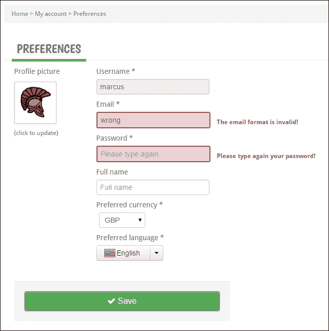

## 它是如何工作的。。。

AngularJS 提供了设置客户端表单验证的工具。与 AngularJS 一样，这些工具与现代 HTML5 技术和标准很好地集成。

HTML5 表单提供本机验证，可以使用不同表单元素（输入、选择…）上的标记和属性来定义，以设置基本字段验证（最大长度、必需…）

AngularJS 流畅地完成并扩展了这些标准定义，使它们从一开始就具有交互性和响应性，并且没有任何开销。

### 验证约束

让我们更仔细地看一下可以放置在表单控件上的可用验证选项。

#### 需要

`input`字段可以标记为`required`（HTML5 标记）：

```
<input type="text" required /> 
```

#### 最小/最大长度

`ng-minlength`指令可用于断言输入的字符数与给定阈值匹配：

```
<input type="text" ng-minlength="3" /> 
```

类似地，`ng-maxlength`将输入的字符数大幅限制到最大值：

```
<input type="text" ng-maxlength="15" /> 
```

#### 正则表达式模式

`ng-pattern`指令通常用于确保输入的数据与预定义的形状匹配：

```
<input type="text" ng-pattern="[a-zA-Z]" />
```

#### 编号/电子邮件/URL

这些 HTML5 输入类型由 AngularJS 处理，以限制在它们所表示的格式内：

```
<input type="number" name="quantity" ng-model="form.quantity" />
<input type="email" name="email" ng-model=" form.email" />
<input type="url" name="destination" ng-model=" form.url" />
```

### 表格中的控制变量

AngularJS 在包含的`$scope`上发布属性，以匹配 DOM 中的表单状态。这使得 JavaScript 表单验证非常容易控制错误和呈现状态。

可以从以下结构访问这些属性：

```
  formName.inputFieldName.property
```

#### 修改/未修改状态

此状态可使用以下属性进行评估：

```
formName.inputFieldName.$pristine;
formName.inputFieldName.$dirty;
```

#### 有效/无效状态

表单的这种有效状态可以根据为字段或全局定义的验证进行评估：

```
formName.inputFieldName.$valid;
formName.inputFieldName.$invalid;
formName.$valid;
formName.$invalid;
```

#### 错误

在我们之前定义的有效性评估之后，可以从`$error`属性中提取更多关于出错原因的信息：

```
myForm.username.$error.pattern
myForm.username.$error.required
myForm.username.$error.minlength
```

`$error`对象包含特定表单的所有验证，并反映这些验证是否令人满意。

### 形态转换与风格

与 AngularJS 一样，通常会进行转换以将 DOM 状态与作用域绑定。因此，表单状态和控件状态通过 CSS 类实时反映。显然，可以定义/覆盖这些 CSS 类，以便定义全局验证样式：

```
input.ng-invalid {
  border: 1px solid red;
}
input.ng-valid {
  border: 1px solid green;
}
```

## 另见

*   **表单上的 AngularJS 文档**：阅读更多关于表单上的 AngularJS 验证功能（我们仅在此处介绍）：[https://docs.angularjs.org/guide/forms](https://docs.angularjs.org/guide/forms)

# 第八章通过网袋和跺脚进行沟通

本章介绍了四种配方。他们都完全支持我们的 CloudStreet 市场应用程序。通过改进，他们使其更具反应性、互动性。

这些食谱的标题如下：

*   通过 STOMP over SockJS 流媒体社交活动
*   使用 RabbitMQ 作为多协议消息代理
*   使用 AMQP 在 RabbitMQ 中堆叠和使用任务
*   使用 Spring 会话和 Redis 保护消息

# 导言

让我们快速回顾一下我们希望您在前几章学到的内容。一章一章，你一定已经发现了：

*   如何启动项目，以及如何依靠标准来保持代码库的可伸缩性和自适应性。这些标准来自一系列工具，如 Maven 或 Java 持久性 API。所介绍的标准还附带了一些常见实践，例如在客户端，AngularJS MVC 模式或引导框架 UI。
*   如何在面对现代挑战的同时充分利用 Spring MVC。SpringMVC 已经被证明是一个 WebMVC 框架（包括其请求流、内容协商、视图解析、模型绑定、异常处理等），但也被证明是 Spring 环境中的一个集成 Spring 组件。一个能够中继 Spring 安全认证或 Spring 社会抽象的集成框架。它还能够服务于 Spring 数据分页工具以及非常有竞争力的 HTTP 规范实现。
*   如何设计实现高级无状态和超媒体 API 以促进职责分离的微服务体系结构。前端和后端之间的职责分离，以及将组件功能划分（横向可扩展性）中的职责分离为独立的 web 存档（`.war`。

本章重点介绍新兴的 WebSocket 技术，并为我们的应用构建一个**面向消息传递的中间件**（**MOM**。这是一个罕见的在春季实现如此多关于 WebSocket 的展示。从使用默认的嵌入式 WebSocket 消息代理到功能齐全的 RabbitMQ 代理（使用 STOMP 和 AMQP 协议）。我们将了解如何向多个客户机广播消息，并推迟耗时任务的执行，从而提供显著的可伸缩性优势。

有了一个新的 Java 项目，专门用于需要访问公共数据库服务器的 WebSocket，并且从类似于生产环境的角度来看，我们将用 MySQL 服务器取代 HSQLDB。

我们将了解如何动态创建私有队列，以及如何让经过身份验证的客户端从这些私有队列发布和接收消息。我们将完成所有这些，以在应用程序中实现真正的应用程序功能。

为了实现 WebSocket 身份验证和消息身份验证，我们将使 API 有状态。通过 stateful，这意味着 API 将使用 HTTP 会话来保持用户在请求之间的身份验证。在 Spring 会话的支持和高度集群化的 Redis 服务器的使用下，会话将在多个 Web 应用程序之间共享。

# 在 SockJS 上用跺脚的方式播放社交活动

在这个配方中，我们通过 STOMP over SockJS 广播用户活动（事件）。SockJS 提供了 WebSocket 的自定义实现。

## 准备好了吗

有一些配置工作需要事先完成，特别是在 ApacheHTTP 代理上。之后，我们将看到如何在客户端使用 SockJS 和 AngularJS 启动 WebSocket。

我们的 WebSocket 将订阅`cloudstreetmarket-api`模块通过 Spring 发布的一个主题（用于广播）。

## 怎么做…

1.  从 Eclipse 中的**Git 透视图**中，签出分支`v8.1.x`的最新版本。
2.  在`zipcloud-parent`项目上运行`Maven clean`和`Maven install`命令（右键点击项目，选择**运行方式…****Maven Clean**，然后选择**运行方式…****Maven 安装】**。之后，操作一个**Maven【更新****项目**将 Eclipse 与 Maven 配置同步（右键点击该项目，然后点击**Maven****更新项目……**。
3.  同样，在`cloudstreetmarket-parent`上运行**Maven clean**和**Maven install**命令，然后运行**Maven****更新项目……**（以更新所有`cloudstreetmarket-parent`模块）。

### Apache HTTP 代理配置

1.  在 Apache`httpd.conf` 文件中，将`VirtualHost`定义更改为：

    ```
    <VirtualHost cloudstreetmarket.com:80>
      ProxyPass        /portal http://localhost:8080/portal
      ProxyPassReverse /portal http://localhost:8080/portal
      ProxyPass        /api  	http://localhost:8080/api
      ProxyPassReverse /api  	http://localhost:8080/api
      RewriteEngine on
      RewriteCond %{HTTP:UPGRADE} ^WebSocket$ [NC]
      RewriteCond %{HTTP:CONNECTION} ^Upgrade$ [NC]
      RewriteRule .* ws://localhost:8080%{REQUEST_URI} [P]
      RedirectMatch ^/$ /portal/index
    </VirtualHost>
    ```

2.  仍在`httpd.conf`中，取消注释行：

    ```
    LoadModule proxy_wstunnel_module modules/mod_proxy_wstunnel.so
    ```

### 前端

1.  In the `index.jsp` file (in the `cloudstreetmarket-webapp` module), two extra JavaScript files are imported:

    ```
    <script src="js/util/sockjs-1.0.2.min.js"></script>
    <script src="js/util/stomp-2.3.3.js"></script> 
    ```

    ### 注

    这两个文件已在本地复制，但最初都是在以下位置在线找到的：

    [https://cdnjs.cloudflare.com/ajax/libs/sockjs-client/1.0.2/sockjs.min.js](https://cdnjs.cloudflare.com/ajax/libs/sockjs-client/1.0.2/sockjs.min.js)

    [https://cdnjs.cloudflare.com/ajax/libs/stomp.js/2.3.3/stomp.js](https://cdnjs.cloudflare.com/ajax/libs/stomp.js/2.3.3/stomp.js)

2.  对于这个配方，客户端的所有更改都与文件`src/main/webapp/js/home/home_community_activity.js`相关（该文件驱动登录页上**用户活动**的提要）。此文件与模板`/src/main/webapp/html/home.html`关联。
3.  作为`homeCommunityActivityController`的`init()`功能的一部分，增加了以下部分：

    ```
    cloudStreetMarketApp.controller('homeCommunityActivityController', function ($scope, $rootScope, httpAuth, modalService, communityFactory, genericAPIFactory, $filter){
      var $this = this,
      socket = new SockJS('/api/users/feed/add'),
      stompClient = Stomp.over(socket);
      pageNumber = 0;
      $scope.communityActivities = {};
      $scope.pageSize=10;
      $scope.init = function () {
        $scope.loadMore();
        socket.onclose = function() {
          stompClient.disconnect();
        };
        stompClient.connect({}, function(frame) {
        stompClient.subscribe('/topic/actions', 	function(message){
         var newActivity = $this.prepareActivity( JSON.parse(message.body)
           );
            $this.addAsyncActivityToFeed(newActivity);
            $scope.$apply();
        });
        });
      ...
      }
    ...
    ```

4.  当到达滚动条的底部时，`loadMore()`函数仍会被调用以拉动新活动。但是现在，由于可以异步插入新活动，`communityActivities`变量不再是数组，而是一个用作映射的对象，活动 ID 作为键。这样做允许我们将同步结果与异步结果合并：

    ```
      $scope.loadMore = function () {
        communityFactory.getUsersActivity(pageNumber, $scope.pageSize).then(function(response) {
          var usersData = response.data,
          status = response.status,
          headers  = response.headers,
          config = response.config;
          $this.handleHeaders(headers);
          if(usersData.content){
            if(usersData.content.length > 0){
              pageNumber++;
            }
            $this.addActivitiesToFeed(usersData.content);
          }
        });
      };
    ```

5.  As before (since the [Chapter4](04.html#aid-1IHDQ2 "Chapter 4. Understanding WebSocket"), *Building a REST API for a Stateless Architecture*), we loop over the community activities to build the activity feed. Now each activity carries a number of **likes** and **comments**. Currently, if a user is authenticated, he has the capability to see the number of **likes**:

    

6.  绑定到拇指向上图像的角化 HTML 如下：

    ```
        <span ng-if="userAuthenticated() && value.amountOfLikes == 0">
        
      </span>
    ```

7.  在控制器中，`like()`作用域函数支持此 DOM 元素创建一个新的`like`活动，该活动以原始活动为目标：

    ```
      $scope.like = function (targetActionId){
        var likeAction = {
          id: null,
          type: 'LIKE',
          date: null,
          targetActionId: targetActionId,
          userId: httpAuth.getLoggedInUser()
        };
        genericAPIFactory.post("/api/actions/likes", likeAction);
      }
    ```

8.  相反的逻辑也可以发现**不同于**活动。

### 后端

1.  以下 Maven 依赖项已添加到`cloudstreetmarket-api`：

    ```
        <dependency>
          <groupId>org.springframework</groupId>
          <artifactId>spring-websocket</artifactId>
          <version>${spring.version}</version>
       </dependency>
       <dependency>
          <groupId>org.springframework</groupId>
          <artifactId>spring-messaging</artifactId>
          <version>${spring.version}</version>
       </dependency>
    ```

2.  在`web.xml`文件（来自`cloudstreetmarket-api`的文件）中，必须将以下属性添加到我们的 servlet 及其每个过滤器中：

    ```
    <async-supported>true</async-supported>
    ```

3.  The following dedicated configuration bean has been created:

    ```
    @Configuration
    @ComponentScan("edu.zipcloud.cloudstreetmarket.api")
    @EnableWebSocketMessageBroker
    public class WebSocketConfig extends AbstractWebSocketMessageBrokerConfigurer {

       @Override
       public void registerStompEndpoints(final StompEndpointRegistry registry) {
             registry.addEndpoint("/users/feed/add")
                .withSockJS();
        }
       @Override
       public void configureMessageBroker(final MessageBrokerRegistry registry) {
          registry.setApplicationDestinationPrefixes("/app");
           registry.enableSimpleBroker("/topic");
        }
    }
    ```

    新增控制器`ActivityFeedWSController`如下：

    ```
    @RestController
    public class ActivityFeedWSController extends CloudstreetApiWCI{
        @MessageMapping("/users/feed/add")
        @SendTo("/topic/actions")
        public UserActivityDTO handle(UserActivityDTO message) throws Exception{
            return message;
        }
        @RequestMapping(value="/users/feed/info", method=GET)
        public String infoWS(){
            return "v0";
        }
    }
    ```

4.  As Spring configuration, we have added the following bean to the `dispatcher-servlet.xml`:

    ```
    <bean
      class="org.sfw.web.socket.server.support.OriginHandshakeInterceptor">
        <property name="allowedOrigins">
          <list>
          <value>http://cloudstreetmarket.com</value>
          </list>
        property>
    </bean>
    ```

    在`security-config.xml`中，http Spring 安全命名空间添加了以下配置：

    ```
        <security:http create-session="stateless" 
            entry-point-ref="authenticationEntryPoint" authentication-manager-ref="authenticationManager">
        ...
        <security:headers>
          <security:frame-options policy="SAMEORIGIN"/>
        </security:headers>
        ...
        </security:http>
    ```

现在让我们看看事件是如何生成的。

1.  When a new financial transaction is created, a message is sent to the topic `/topic/actions`. This is done in the `TransactionController`:

    ```
    @RestController
    @ExposesResourceFor(Transaction.class)
    @RequestMapping(value=ACTIONS_PATH + TRANSACTIONS_PATH, produces={"application/xml", "application/json"})
    public class TransactionController extends CloudstreetApiWCI<Transaction> {
      @Autowired
      private SimpMessagingTemplate messagingTemplate;
      @RequestMapping(method=POST)
      @ResponseStatus(HttpStatus.CREATED)
      public TransactionResource post(@Valid @RequestBody Transaction transaction, HttpServletResponse response, BindingResult result) {
        ...
       messagingTemplate.convertAndSend("/topic/actions", new UserActivityDTO(transaction));
        ...
      }
    }
    ```

    同样，当创建`like`活动时，也会向`LikeActionController`中的`/topic/actions`主题发送一条消息：

    ```
     @RequestMapping(method=POST)
    @ResponseStatus(HttpStatus.CREATED)
    public LikeActionResource post(@RequestBody LikeAction likeAction, HttpServletResponse response) {
       ...
        likeAction = likeActionService.create(likeAction);
       messagingTemplate.convertAndSend("/topic/actions", new UserActivityDTO(likeAction));
       ...
    }
    ```

2.  现在启动 Tomcat 服务器。使用 Yahoo！登录应用程序！Oauth2 和你的个人雅虎！帐户（如果您还没有帐户，请创建一个）。为`Cloudstreet Market`应用程序注册新用户。
3.  在 web 浏览器中，使用登录用户打开应用程序中的两个不同选项卡。在登录页上保留其中一个选项卡。
4.  使用另一个选项卡，导航到**价格和市场****所有价格搜索**菜单。搜索一个股票代码，比如说 Facebook，然后买三只股票。
5.  Wait to receive the information message:

    

    然后检查浏览器的第一个选项卡（未使用的选项卡）。

    

    您会注意到活动提要在顶部收到了一个新元素！

6.  Also, in the console you should have the following log trace:

    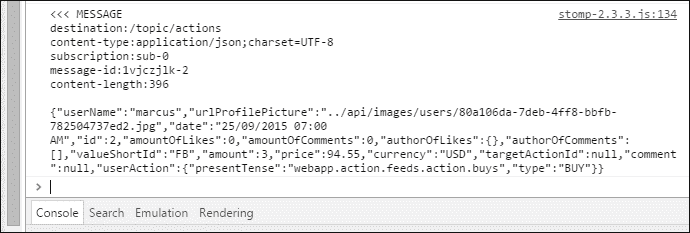

7.  Similarly, **like** events are refreshed in real time:

    

## 它是如何工作的。。。

在这里，在介绍 Spring WebSocket 支持工具之前，我们先来看看关于 WebSocket、STOMP 和 SockJS 的一些一般概念。

### WebSocket 简介

WebSocket 是一种基于 TCP 的全双工通信协议。全双工通信系统允许双方通过双向信道同时进行*通话*和*通话*。电话通话可能是全双工系统的最好例子。

这项技术对于需要利用新 HTTP 连接带来的开销的应用程序特别有用。自 2011 年以来，WebSocket 协议已成为互联网标准（[https://tools.ietf.org/html/rfc6455](https://tools.ietf.org/html/rfc6455) 。

#### WebSocket 生命周期

在建立 WebSocket 连接之前，客户机发起握手 HTTP，服务器对此做出响应。握手请求还表示协议升级请求（从 HTTP 到 WebSocket），形式化为一个`Upgrade`头。服务器在其响应中使用相同的`Upgrade`头（和值）确认此协议升级。除了`Upgrade`头之外，从防止缓存代理攻击的角度来看，客户端还发送一个 base-64 编码的随机密钥。为此，服务器在`Sec-WebSocket-Accept` 头中发回该密钥的散列。

下面是在我们的应用程序中发生的握手示例：


协议生命周期可通过以下序列图进行总结：


#### 两个专用 URI 方案

协议为`WebSockets ws://` 和`wss://`定义了两个 URI 方案（其中`wss`允许加密连接）。

### 跺脚协议

**STOMP**代表**简单的面向文本的消息传递协议**。该协议提供了一种基于帧的互操作格式，允许 STOMP 客户端与 STOMP 消息代理进行通信。

它是一种消息传递协议，需要并信任更高级别的现有双向流媒体网络协议。WebSocket 提供了基于帧的数据传输，WebSocket 帧确实可以是 STOMP 格式的帧。

以下是跺脚框架的示例：

```
CONNECTED
session:session-4F_y4UhJTEjabe0LfFH2kg
heart-beat:10000,10000
server:RabbitMQ/3.2.4
version:1.1
user-name:marcus
```

框架具有以下结构：

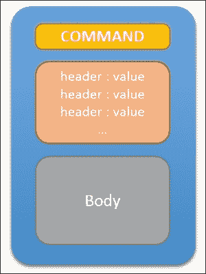

STOMP 协议规范定义了一组客户端命令（`SEND`、`SUBSCRIBE`、`UNSUBSCRIBE`、`BEGIN`、`COMMIT`、`ABORT`、`ACK`、`NACK`、`DISCONNECT`、`CONNECT`、`STOMP`以及服务器命令（`CONNECTED`、`MESSAGE`、`RECEIPT`、`ERROR`）。

只有`SEND`、`MESSAGE`和`ERROR`帧可以有一个主体。协议规范可在以下网址找到：[http://stomp.github.io/stomp-specification-1.2.html](http://stomp.github.io/stomp-specification-1.2.html) 。

在客户端，我们使用了 JavaScript 库**STOMP Over WebSocket**，该库由文件`stomp.js`标识。此库将 STOMP 格式的帧映射到 WebSocket 帧。默认情况下，它会查找 web 浏览器`WebSocket`类，使 STOMP 客户端创建 WebSocket。

该库还可以通过自定义`WebSocket`实现创建 STOMP 客户端。从 SockJS WebSockets 中，我们创建了 STOMP 客户端，如下所示：

```
    var socket = new SockJS('/app/users/feed/add');
    var stompClient = Stomp.over(socket);
        stompClient.connect({}, function(frame) {
  ...
    });
    socket.onclose = function() {
    stompClient.disconnect();
  };
```

### 袜子

如今，几乎所有浏览器都支持 WebSocket。不过，我们无法控制客户正在使用的版本。在许多情况下，向 7%到 15%的受众隐藏这样的技术根本不是一个选择。

在客户端，SockJS 提供了一个定制实现，可以看作是浏览器原生`WebSocket`实现的装饰器。SockJS 有一个简单方便的库，确保了跨浏览器的兼容性。通过一系列回退传输选项（`xhr-streaming`、`xdr-streaming`、`iframe-eventsource`、`iframe-htmlfile`、`xhr-polling`等等），它尽可能地模拟 WebSocket。

对于服务器实现，为了匹配客户端的回退行为，SockJS 还定义了自己的协议：

[http://sockjs.github.io/sockjs-protocol/sockjs-protocol-0.3.3.html](http://sockjs.github.io/sockjs-protocol/sockjs-protocol-0.3.3.html)

### 弹簧腹板承座

根据 JavaWebSocket API 规范（JSR-356），Spring 4+提供了一个打包在模块`spring-websocket`和`spring-messaging`中的解决方案。但是 Spring 提供的不仅仅是 JSR-356 的实现。例如，根据以下事实：

*   没有使用消息协议的 WebSocket 级别太低，无法直接用于没有定制处理框架的应用程序：Spring 团队选择提供并支持消息协议实现（STOMP）。
*   并非所有浏览器都支持 WebSocket：Spring 还通过其 SockJS 协议的实现提供 WebSocket 回退支持。

#### 一体式配置

我们已经启用了 WebSocket 引擎，并仅从一个配置 bean`WebSocketConfig`为 SockJS 和 STOMP 配置了它：

```
@Configuration
@ComponentScan("edu.zipcloud.cloudstreetmarket.api")
@EnableWebSocketMessageBroker
public class WebSocketConfig extends   AbstractWebSocketMessageBrokerConfigurer {

  @Override
  public void registerStompEndpoints(final StompEndpointRegistry registry) {
        registry.addEndpoint("/users/feed/add")
        .withSockJS();
  }

  @Override
  public void configureMessageBroker(final MessageBrokerRegistry registry) {
        registry.setApplicationDestinationPrefixes("/app");
        registry.enableSimpleBroker("/topic");
  }
}
```

为上下文路径`/users/feed/add`定义了 WebSocket 端点。它在客户端与定义的 SockJS 客户端构造函数参数匹配：

```
var socket = new SockJS('/api/users/feed/add');
```

从端点（`clientInboundChannel`）开始，WebSocket 引擎需要选择将消息路由到何处，这里有两个选项。根据情况和我们想要实现的目标，我们可以针对应用内消费者（消息处理程序）或直接针对消息代理，以便将消息发送到订阅的客户端。

通过定义两个不同的目标前缀来配置此拆分。在我们的例子中，我们决定使用`/app`前缀将消息路由到相应的消息处理程序，并使用`/topic`前缀标识准备发送到客户端的消息。

现在让我们看看如何定义消息处理程序以及如何使用它们。

#### 通过@MessageMapping 定义消息处理程序

Spring MVC 控制器方法中使用了`@MessageMapping`注释，以将其标记为消息处理程序方法。

从要路由到消息处理程序的`clientInboundChannel`中的消息，WebSocket 引擎根据其配置值缩小右侧`@MessageMapping`方法的范围。

与 SpringMVC 中的通常情况一样，该值可以在 Ant 样式中定义（例如`/targets/**`）。但是，与`@RequestParam`和`@PathVariable` 注释相同，模板变量也可以使用方法参数上的`@DestinationVariable`注释进行传递（目标模板的定义如下：`/targets/{target}`。

### 向调度室发送消息

必须配置消息代理。在这个配方中，我们使用的是从`MessageBrokerRegistry`启用的`simple`消息代理（`simpMessageBroker`。当不需要外部代理（RabbitMQ、ActiveMQ 等）时，这种类型的内存代理适合于堆叠 STOMP 消息。当可以向 WebSocket 客户端发送消息时，这些消息将发送到`clientOutboundChannel`。

我们已经看到，当消息目的地以`/topic`作为前缀时（就像在我们的例子中），消息直接发送到 MessageBroker。但是，当我们在一个消息处理程序方法中或在后端代码的其他地方时，如何发送消息以进行分派呢？我们可以使用下一节中描述的`SimpMessagingTemplate`。

#### SimpMessageTemplate

我们在 CSMReceiver 类中自动连接了一个`SimpMessagingTemplate`，稍后我们将使用它将 AMQP 消息的有效负载转发给 WebSocket 客户端。

`SimpMessagingTemplate`与 Spring`JmsTemplate`的用途相同（如果您熟悉的话），但它适合简单的消息传递协议（如 STOMP）。

`convertAndSend`方法是一种简便而著名的继承方法，它试图识别并使用`MessageConverter`序列化对象，并将其放入新消息中，然后再将此消息发送到指定的目标：

```
simpMessagingTemplate.convertAndSend(String destination, Object message);
```

这样做的目的是为消息代理指定一个已识别的目的地（在我们的例子中带有 `/topic`前缀）。

#### @SendTo 注释

此注释使我们不必显式使用`SimpMessagingTemplate`。将目标指定为注释值。此方法还将处理从有效负载到消息的转换：

```
@RestController
public class ActivityFeedWSController extends CloudstreetApiWCI{

  @MessageMapping("/users/feed/add")
  @SendTo("/topic/actions")
  public UserActivityDTO handle(UserActivityDTO payload) throws Exception{
        return payload;
 }
}
```

## 还有更多…

在本节中，我们提供了与 SockJS 回退选项相关的额外信息源。

正如前面介绍的一样，Spring 提供了一个 SockJS 协议实现。在`StompEndPoint`注册期间，使用`withSockJS()`功能方法在 Spring 中轻松配置 SockJS。仅此一小段配置就告诉 Spring 在端点上激活 SockJS 回退选项。

SockJS 客户端对服务器的第一次调用是对端点路径的 HTTP 请求，该端点路径与`/info`连接，以评估服务器配置。如果此 HTTP 请求未成功，则不会尝试其他传输（甚至 WebSocket）。

如果您想了解 SockJS 客户端如何向服务器查询合适的回退选项，可以阅读 Spring 参考指南中的更多内容：

[http://docs.spring.io/spring/docs/current/spring-framework-reference/html/websocket.html#websocket-服务器握手](http://docs.spring.io/spring/docs/current/spring-framework-reference/html/websocket.html#websocket-server-handshake)

## 另见

*   **JSR-356**：您可以在线找到规范文档，了解 spring WebSocket 遵守的 JavaAPI for WebSocket 规范：[https://jcp.org/en/jsr/detail?id=356](https://jcp.org/en/jsr/detail?id=356)

# 使用 RabbitMQ 作为多协议消息代理

安装并使用外部 RabbitMQ 作为功能齐全的消息代理，可以提供新的技术机会，并设计类似于生产的基础设施。

## 准备好了吗

在此配方中，我们将 RabbitMQ 安装为独立服务器，并将其配置为支持 STOMP 消息。

我们还将更新 WebSocket Spring 配置，使其依赖于此功能齐全的消息代理，而不是内部简单的消息代理。

## 怎么做…

1.  从 Eclipse 中的**Git 透视图**中，检查这次的`v8.2.x`分支。
2.  添加了两个新的 Java 项目，必须导入它们。从 Eclipse 中选择**文件**|**导入…**菜单。
3.  此时会打开**导入**向导，您可以选择层次结构中的项目类型。打开**Maven**类别，选择**已有 Maven 项目**选项，点击**下一步**。
4.  此时会打开**导入 Maven 项目**向导。作为根目录，选择（或键入）工作区位置（应为`<home-directory>/workspace`。
5.  As shown in the following screenshot, select the following two **pom.xml** files: **cloudstreetmarket-shared/pom.xml** and **cloudstreetmarket-websocket/pom.xml**.

    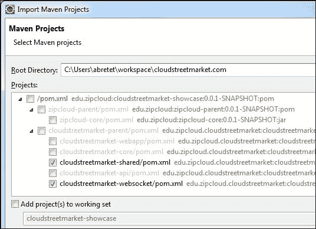

6.  两个项目`cloudstreetmarket-shared`和`cloudstreetmarket-websocket`必须显示在项目层次结构中。
7.  按照以下说明在 web 模块上定位运行时环境：在 Eclipse 中，右键单击**cloudmarket websocket**项目，选择**属性**菜单，在导航面板中选择**目标运行时**。在中央窗口中，检查服务器**Apache Tomcat v8.0**的勾号。
8.  在`/app`目录中，`cloudstreetmarket.properties`文件已经更新。反映您位于`<home-directory>/app/cloudstreetmarket.properties`的文件中的更改。
9.  在`zipcloud-parent`上运行`Maven clean`和`Maven install`命令，然后在`cloudstreetmarket-parent`上运行，然后在所有模块上运行**Maven****更新项目**。
10.  以我们想要的方式运行 RabbitMQ，需要我们作为独立产品下载并安装该产品。
11.  Depending upon the configuration of the local machine, different ways of proceeding apply. You will find the appropriate links and installation guides on the RabbitMQ website: [https://www.rabbitmq.com/download.html](https://www.rabbitmq.com/download.html)

    ### 提示

    如果您使用的是 Windows 操作系统，请注意这是下载并安装 Erlang（[的先决条件 http://www.erlang.org/download.html](http://www.erlang.org/download.html) 。

12.  Once RabbitMQ is installed and once its service is running, open your favourite web browser in order to check that RabbitMQ is running as a web console at the URL: `http://localhost:15672` (like in the following screenshot).

    

    ### 注

    稍后我们将回到这里来设置 RabbitMQ 配置。现在，请记住，此控制台可用于监视消息和管理连接、队列、主题和交换。

13.  需要激活 RabbitMQ STOMP 插件。这是从`rabbitmq_server-x.x.x\sbin`目录通过执行命令行

    ```
    rabbitmq-plugins enable rabbitmq_stomp
    ```

    完成的
14.  已添加以下 Maven 依赖项：

    ```
    <dependency>
      <groupId>org.springframework.amqp</groupId>
      <artifactId>spring-rabbit</artifactId>
      <version>1.4.0.RELEASE</version>
    </dependency>
    <dependency>
      <groupId>io.projectreactor</groupId>
      <artifactId>reactor-core</artifactId>
      <version>2.0.5.RELEASE</version>
    </dependency>
    <dependency>
      <groupId>io.projectreactor</groupId>
      <artifactId>reactor-net</artifactId>
      <version>2.0.5.RELEASE</version>
    </dependency>
    <dependency>
      <groupId>io.projectreactor.spring</groupId>
      <artifactId>reactor-spring-context</artifactId>
      <version>2.0.5.RELEASE</version>
    </dependency>
    <dependency>
      <groupId>io.netty</groupId>
      <artifactId>netty-all</artifactId>
      <version>4.0.31.Final</version>
    </dependency>
    ```

15.  在`cloudstreetmarket-api`模块的`dispatcher-servlet.xml`中，使用`rabbit`名称空间添加了以下 bean：

    ```
    <beans 
       xmlns:xsi="http://www.w3.org/2001/XMLSchema-instance"
       ...
       xmlns:rabbit="http://www.sfw.org/schema/rabbit"
       xsi:schemaLocation="http://www.sfw.org/schema/beans
       ...
       http://www.sfw.org/schema/rabbit
      http://www.sfw.org/schema/rabbit/spring-rabbit-1.5.xsd">
        ...
      <rabbit:connection-factory id="connectionFactory" host="localhost" username="guest" password="guest" />
      <rabbit:admin connection-factory="connectionFactory" />
      <rabbit:template id="messagingTemplate" connection-factory="connectionFactory"/>
    </beans>
    ```

16.  在`csmcore-config.xml` 文件（在`cloudstreetmarket-core`中）中，以下 bean 被添加了`task` 名称空间：

    ```
    <beans 
        xmlns:xsi="http://www.w3.org/2001/XMLSchema-instance"
        ...
        xmlns:task=http://www.sfw.org/schema/task
        http://www.sfw.org/schema/task/spring-task-4.0.xsd">
        ...
        <task:annotation-driven scheduler="wsScheduler"/>
        <task:scheduler id="wsScheduler" pool-size="1000"/>
        <task:executor id="taskExecutor"/>
    </beans>
    ```

17.  仍然是在事物的 Spring 配置端，我们的`AnnotationConfig`bean（主要的`cloudstreetmarket-api`配置 bean）添加了两个注释：

    ```
    @EnableRabbit
    @EnableAsync
    public class AnnotationConfig {
    	...
    }
    ```

18.  最后，`WebSocketConfig`bean 也被更新了；特别是经纪人注册。我们现在使用`StompBrokerRelay`而不是 simples 代理：

    ```
    @Configuration
    @ComponentScan("edu.zipcloud.cloudstreetmarket.api")
    @EnableWebSocketMessageBroker
    @EnableScheduling
    @EnableAsync
    public class WebSocketConfig extends AbstractWebSocketMessageBrokerConfigurer {
    ...
        @Override
        public void configureMessageBroker(final MessageBrokerRegistry registry) {
         registry.setApplicationDestinationPrefixes( WEBAPP_PREFIX_PATH);
         registry.enableStompBrokerRelay(TOPIC_ROOT_PATH);
        }
    }
    ```

### 提示

就这样！一切都设置为使用 RabbitMQ 作为系统的外部代理。但是，请注意，如果您现在尝试启动服务器，代码将期望安装 MySQL 和 Redis 服务器。这两个第三方系统将在接下来的两个配方中详细介绍。

## 它是如何工作的。。。

### 使用功能齐全的消息代理

与简单的消息代理相比，使用功能齐全的消息代理（如 RabbitMQ）提供了有趣的好处，我们现在将讨论这一点。

#### 集群能力–RabbitMQ

RabbitMQ 代理由一个或多个 Erlang 节点组成。这些节点中的每一个本身都代表 RabbitMQ 的一个实例，并且可以独立启动。节点可以使用命令行工具`rabbitmqctl`相互链接。例如，`rabbitmqctl join_cluster rabbit@rabbit.cloudstreetmarket.com`实际上将一个节点连接到现有的集群网络。RabbitMQ 节点使用 cookie 彼此通信。要连接到同一集群上，两个节点必须具有相同的 cookie。

#### 更多 STOMP 消息类型

功能齐全的消息代理（与简单的消息代理相比）支持额外的 STOMP 帧命令。例如，`ACK`和`RECEIPT`不受简单消息代理的支持。

### StompMessageBrokerRelay

在前面的配方中，我们讨论了消息在 Spring WebSocket 引擎中传递的流程。如下图所示，当切换到外部 MessageBroker 中继时，此流完全不受影响。


只有 RabbitMQ 外部消息代理显示为额外的一部分。`BrokerMessageHandler`（`StompBrokerRelayMessageHandler`仅作为代理，在幕后以 RabbitMQ 节点为目标。`StompBrokerRelay`与其 message broker 之间仅保持一个 TCP 连接。`StompBrokerRelay`通过发送心跳消息来维持连接。

## 另见

*   **RabbitMQ guide and documentation**: This recipe is just an overview, however the RabbitMQ documentation is well done and very complete. It is a great source of information, and you can find it at:

    [http://www.rabbitmq.com/documentation.html](http://www.rabbitmq.com/documentation.html)

    [http://www.rabbitmq.com/stomp.html](http://www.rabbitmq.com/stomp.html)

# 使用 RabbitMQ 和 AMQP 堆叠和消耗任务

此配方将演示如何实现**面向消息的中间件**（**MoM**。此是基于组件间异步通信的可伸缩性中非常流行的技术。

## 准备好了吗

我们已经引入了新的`cloudstreetmarket-shared`和`cloudstreetmarket-websocket`Java 项目。WebSocket 现在已从`cloudstreetmarket-api`中分离出来，但`cloudstreetmarket-websocket`和`cloudstreetmarket-api`仍将使用消息传递相互通信。

为了将次要任务与请求线程分离（次要任务，如事件生成），您需要学习如何配置和使用带有 RabbitMQ 的 AMQP 消息模板和侦听器。

## 怎么做…

1.  Access the RabbitMQ web console at `http://localhost:15672`.

    ### 注

    如果由于某种原因无法访问 web 控制台，请返回上一个配方，在那里可以找到下载和安装指南。

2.  In the **Queue** tab of the web console, create a new queue named `AMQP_USER_ACTIVITY`. Create it with the parameters **Durable** and **Auto-delete: "No"**:

    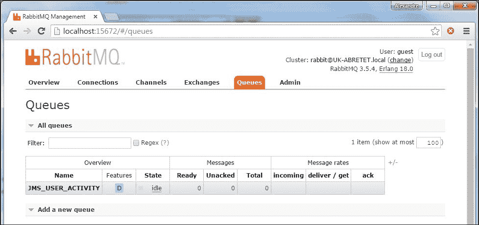

### 发送方

当 API 被请求执行**创建事务**或**创建类似活动**等操作时，我们生成事件。

### 提示

通过很少的调整更改，我们现在使用`RabbitTemplate`而不是前一个`SimpMessagingTemplate`，我们的目标是一个中间 AMQP 队列，而不是最终的 STOMP 客户端。

在`TransactionController`中，POST 处理程序更新如下：

```
import org.springframework.amqp.rabbit.core.RabbitTemplate;
@RestController
public class TransactionController extends CloudstreetApiWCI<Transaction> {
  @Autowired
  private RabbitTemplate messagingTemplate;

  @RequestMapping(method=POST)
  @ResponseStatus(HttpStatus.CREATED)
  public TransactionResource post(@Valid @RequestBody Transaction transaction, HttpServletResponse response, BindingResult result) {
   ...
   messagingTemplate.convertAndSend("AMQP_USER_ACTIVITY", new UserActivityDTO(transaction));
   ...
   return resource;
  }
}
```

在`LikeActionController`中，POST 处理程序更新如下：

```
import org.springframework.amqp.rabbit.core.RabbitTemplate;

@RestController
public class LikeActionController extends CloudstreetApiWCI<LikeAction> {
  @Autowired
  private RabbitTemplate messagingTemplate;
  @RequestMapping(method=POST)
  @ResponseStatus(HttpStatus.CREATED)
  public LikeActionResource post(@RequestBody LikeAction likeAction, HttpServletResponse response) {
  ...
   messagingTemplate.convertAndSend("AMQP_USER_ACTIVITY", new UserActivityDTO(likeAction));
   ...
   return resource;
  }
}
```

### 消费者方

如前所述，模块现在监听`AMQP_USER_ACTIVITY`队列。

1.  必要的配置在`displatcher-servlet.xml`（`cloudstreetmarket-websocket`中设置。在这里，我们创建了一个`rabbitConnectionFactory`和一个`rabbitListenerContainerFactory`bean:

    ```
    <rabbit:connection-factory id="rabbitConnectionFactory" username="guest" host="localhost" password="guest"/>
    <bean id="rabbitListenerContainerFactory" class="org.sfw.amqp.rabbit.config.SimpleRabbitListenerContainerFactory">
        <property name="connectionFactory" ref="rabbitConnectionFactory"/>
        <property name="concurrentConsumers" value="3"/>
        <property name="maxConcurrentConsumers" value="10"/>
        <property name="prefetchCount" value="12"/>
    </bean>
    ```

2.  Finally, the listener bean is created as follows with a `CSMReceiver` class:

    ```
    @Component
    public class CSMReceiver {
      @Autowired
      private SimpMessagingTemplate simpMessagingTemplate;

      @RabbitListener(queues = "AMQP_USER_ACTIVITY_QUEUE")
      public void handleMessage(UserActivityDTO payload) {
      simpMessagingTemplate.convertAndSend("/topic/actions", payload);
      }
    } 
    ```

    ### 提示

    您可以识别此处用于将传入消息有效负载转发到最终 STOMP 客户端的`SimpMessagingTemplate`。

3.  在`cloudstreetmarket-websocket`中创建了一个新的`WebSocketConfig`bean。这个与我们在`cloudstreetmarket-api`中看到的非常相似。

### 客户端

在客户端（`cloudstreetmarket-webapp`上，我们没有改变很多东西，因为此时我们仍然专注于登录页（`home_community_activity.js`。

主要区别在于 STOMP 端点现在以`/ws` 上下文路径为目标。WebSocket 在 5 秒延迟后从`init()` 功能启动。此外，`SockJS`套接字和 STOMP 客户端现在集中在全局变量中（使用`Window`对象），以简化用户导航期间的 WebSocket 生命周期：

```
var timer = $timeout( function(){ 
  window.socket = new SockJS('/ws/channels/users/broadcast');
  window.stompClient = Stomp.over(window.socket);
    window.socket.onclose = function() {
        window.stompClient.disconnect();
      };
  window.stompClient.connect({}, function(frame) {
    window.stompClient.subscribe('/topic/actions', function(message){
        var newActivity = $this.prepareActivity(JSON.parse(message.body));
        $this.addAsyncActivityToFeed(newActivity);
        $scope.$apply();
      });
    });
     $scope.$on(
      "$destroy",
        function( event ) {
          $timeout.cancel( timer );
          window.stompClient.disconnect();
          }
      );
                }, 5000);
```

## 它是如何工作的。。。

这种类型的基础设施以一种松散但可靠的方式将应用程序组件耦合在一起。

### 消息传递体系结构概述

在这个配方中，我们给了我们的应用程序一个妈妈。其主要思想是尽可能地将流程与客户机请求生命周期分离。

为了让我们的 REST API 专注于资源处理，一些业务逻辑显然是次要的，例如：

*   通知社区新用户已注册帐户
*   通知社区用户已执行特定事务
*   通知社区某个用户喜欢另一个用户的操作

我们决定创建一个新的 webapp，专门处理 WebSocket。我们的 API 现在通过向`ws`web 应用程序发送消息与之通信。

消息有效负载是社区`Action`对象（来自`Action.java`超类）。从`cloudstreetmarket-api` web app 到`cloudstreetmarket-websocket`web app，这些动作对象被序列化并包装在 AMQP 消息中。一旦发送，它们将堆叠在一个 RabbitMQ 队列中（`AMQP_USER_ACTIVITY`。

发送方和接收方都是 AMQP 实现（`RabbitTemplate`和`RabbitListener`）。这种逻辑现在将以`websocket`web 应用程序能够承受的速度处理，而不会对用户体验产生影响。当收到（在`cloudstreetmarket-websocket`端）消息时，消息有效负载将作为 STOMP 消息实时发送到 WebSocket 客户端。

这里直接性能的好处是有争议的（在本例中）。毕竟，我们基本上推迟了附带额外消息层的次要事件的发布。然而，设计清晰和业务组件分离的好处是无价的。

#### 可伸缩模型

我们已经谈论了很多关于保持 web 应用程序无状态的好处。到目前为止，我们已经尝试使用 API 来实现这一点，我们为此感到自豪！

如果没有 HTTP 会话，我们很容易对`api`web 应用程序或`portal`web 应用程序上的流量激增做出反应。没有太多麻烦，我们就可以在 Apache HTTP 代理上为 HTTP 连接设置一个负载平衡器。

您可以在 ApacheHTTP 文档中阅读更多关于此的信息：[http://httpd.apache.org/docs/2.2/mod/mod_proxy_balancer.html](http://httpd.apache.org/docs/2.2/mod/mod_proxy_balancer.html)

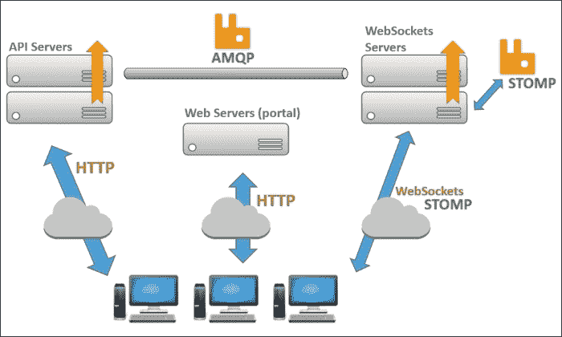

对于 WebSocket web 应用程序，它在无状态下的工作原理基本相同。在 Apache HTTP 配置中，配置的`mod_proxy_wstunnel`应该处理 WebSocket 上的负载平衡，并提供应用程序故障切换。

### AMQP 还是 JMS？

**高级****消息队列协议**（**AMQP**）定义了**线级**协议，保证发送方和用户之间的互操作性。遵守此协议的任何一方都可以创建和解释消息，从而与任何其他兼容组件进行互操作，而不考虑底层技术。

相比之下，JMS 是 Java 平台**企业版（EE）**的一部分。随着 JSR-914 的推出，JMS 是 API 的标准，它定义了 API 应该如何创建、发送、接收和读取消息。JMS 不提供有线级别的指导，也不保证各方之间的互操作性。

AMQP 控制消息的格式和这些消息经过的流程，而 JMS 控制边界（操作员）的技术实现。当我们在潜在的复杂环境中寻找通信一致性时，AMQP 似乎是 MoM 协议的一个好选择。

## 还有更多…

本节提供外部资源，以扩展您对 AMQP 和事件发布方法的了解。

### pivotal 对 AMQP 的精彩介绍

如果您想更好地了解 AMQP 及其与 JMS 的区别，请访问[spring.io](http://spring.io)网站上的以下文章：

[https://spring.io/understanding/AMQP](https://spring.io/understanding/AMQP)

### 发布应用程序事件的更好方式

对现在，我们没有实现适当的模式来发布事件。可从以下链接访问的文章来自[spring.io](http://spring.io)博客。它介绍了 Spring 4.2+发布事件的最佳实践：

[https://spring.io/blog/2015/02/11/better-application-events-in-spring-framework-4-2](https://spring.io/blog/2015/02/11/better-application-events-in-spring-framework-4-2)

## 另见

*   **Load balancing WebSockets**: Read more about this topic in the following article by Arun Gupta (at Red Hat at the time):

    [http://blog.arungupta.me/load-balance-websockets-apache-httpd-techtip48](http://blog.arungupta.me/load-balance-websockets-apache-httpd-techtip48)

# 使用 Spring 会话和 Redis 保护消息

总结，到目前为止，我们已经了解了如何向 StockJS 客户端广播 STOMP 消息，如何在外部多协议代理中堆叠消息，以及如何在 Spring 生态系统中与该代理（RabbitMQ）交互。

## 准备好了吗

这个方法是关于实现专用队列，而不是主题（广播），这样用户就可以接收与他们正在查看的特定内容相关的实时更新。它还演示了 SockJS 客户端如何将数据发送到其专用队列。

对于私有队列，我们必须保护消息和队列访问。我们已经打破了 API 使用 Spring 会话的无状态经验法则。这扩展了`cloudstreetmarket-api`执行的身份验证，并重用`cloudstreetmarket-websocket`中的 Spring 安全上下文。

## 怎么做…

### Apache HTTP 代理配置

由于`v8.2.x`分支引入了新的`cloudstreetmarket-websocket`web 应用程序，因此需要更新 ApacheHTTP 代理配置，以完全支持我们的 WebSocket 实现。我们的`VirtualHost`定义是：

```
<VirtualHost cloudstreetmarket.com:80>
  ProxyPass        /portal http://localhost:8080/portal
  ProxyPassReverse /portal http://localhost:8080/portal
  ProxyPass        /api  	http://localhost:8080/api
  ProxyPassReverse /api  	http://localhost:8080/api
  ProxyPass        /ws  	http://localhost:8080/ws
  ProxyPassReverse /ws  	http://localhost:8080/ws
  RewriteEngine on
  RewriteCond %{HTTP:UPGRADE} ^WebSocket$ [NC]
  RewriteCond %{HTTP:CONNECTION} ^Upgrade$ [NC]
  RewriteRule .* ws://localhost:8080%{REQUEST_URI} [P]
  RedirectMatch ^/$ /portal/index
</VirtualHost>
```

### Redis 服务器安装

1.  If you are on a Linux-based machine, download the latest stable version (3+) at [http://redis.io/download](http://redis.io/download). The format of the archive to download is `tar.gz`. Follow the instructions on the page to install it (unpackage it, uncompress it, and build it with the make command).

    安装后，为了快速启动，请使用以下工具运行 Redis：

    ```
    $ src/redis-server
    ```

2.  If you are on a Windows-based machine, we recommend this repository: [https://github.com/ServiceStack/redis-windows](https://github.com/ServiceStack/redis-windows). Follow the instructions on the `README.md` page. Running Microsoft's native port of Redis allows you to run Redis without any other third-party installations.

    要快速启动 Redis server，请运行以下命令：

    ```
    $ redis-server.exe redis.windows.conf
    ```

3.  When Redis is running, you should be able to see the following welcome screen:

    

4.  Update your Tomcat configuration in Eclipse to use the local Tomcat installation. To do so, double-click on your current server (the **Servers** tab):

    

5.  This should open the configuration panel as follows:

    

    确保选中了**使用 Tomcat 安装**单选按钮。

    ### 提示

    如果面板变灰，再次右键点击当前服务器，然后点击**添加**、**删除**。。。从服务器上删除三个已部署的 web 应用，再次右键单击服务器，然后单击**发布**。

6.  Now, download the following jars:
    *   **jedis-2.5.2.jar**：一个小型 Redis Java 客户端库
    *   **commons-pool2-2.2.jar**：Apache 公共对象池库

    您可以分别从[下载 http://central.maven.org/maven2/redis/clients/jedis/2.5.2/jedis-2.5.2.jar](http://%20http://central.maven.org/maven2/redis/clients/jedis/2.5.2/jedis-2.5.2.jar) 和[http://central.maven.org/maven2/org/apache/commons/commons-pool2/2.2/commons-pool2-2.2.jar](http://central.maven.org/maven2/org/apache/commons/commons-pool2/2.2/commons-pool2-2.2.jar)

    您也可以在`chapter_8/libs`目录中找到这些 JAR。

7.  在`chapter_8/libs`目录中，您还可以找到**tomcat-redis-session-manager-2.0-tomcat-8.jar**归档文件。将三个 JAR`tomcat-redis-session-manager-2.0-tomcat-8.jar`、`commons-pool2-2.2.jar`和`jedis-2.5.2.jar`复制到 Eclipse 所指的本地 Tomcat 安装的`lib`目录中。如果在[第 1 章](08.html#aid-2BASE1 "Chapter 1. Setup Routine for an Enterprise Spring Application")*企业级 Spring 应用程序*的设置例程中遵循了我们的说明，则这应该是`C:\tomcat8\lib or /home/usr/{system.username}/tomcat8/lib`。
8.  Now in your workspace, open the **context.xml** file of your **Server** project.

    

9.  添加以下`Valve`配置：

    ```
    <Valve asyncSupported="true" className="edu.zipcloud.catalina.session.RedisSessionHandlerValve"/>
    <Manager className="edu.zipcloud.catalina.session.RedisSessionManager"
          host="localhost" 
          port="6379" 
          database="0" 
          maxInactiveInterval="60"/>
    ```

### MySQL 服务器安装

在创建新的`cloudstreetmarket-websocket`web 应用的同时，我们也将数据库引擎从 HSQLDB 改为 MySQL。这样我们就可以在`api`和`websocket`模块之间共享数据库。

1.  本节的第一步是从[下载并安装 MySQL 社区服务器 http://dev.mysql.com/downloads/mysql](http://dev.mysql.com/downloads/mysql) 。。下载适合您的系统的通用版本。如果您使用的是 MS Windows，建议您安装安装程序。
2.  You can follow the installation instructions provided by the MySQL team at [http://dev.mysql.com/doc/refman/5.7/en/installing.html](http://dev.mysql.com/doc/refman/5.7/en/installing.html).

    我们现在将为模式用户和数据库名称定义一个公共配置。

3.  使用您选择的密码创建根用户。
4.  Create a technical user (with the administrator role) that the application will use. This user needs to be called `csm_tech` and needs to have the password `csmDB1$55`:

    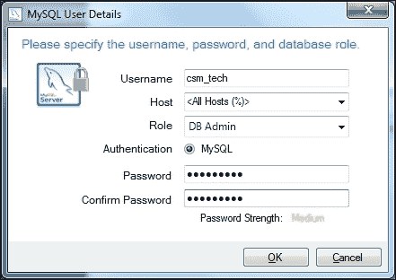

5.  Start the MySQL Client (the command line tool), as follows:
    *   在 MS Windows 上，启动 MySQL 服务器安装目录中的程序`mysql.exe`：`\MySQL Server 5.6\bin\mysql.exe`
    *   在 Linux 或 Mac OS 上，从终端调用`mysql`命令

    在这两种平台上，第一步是提供先前选择的根密码。

6.  使用 MySQL 工作台或 MySQL 客户端创建`csm`数据库：

    ```
    mysql> CREATE DATABASE csm; 

    ```

7.  选择`csm`数据库作为当前数据库：

    ```
    mysql> USE csm;

    ```

8.  从 Eclipse 启动本地 Tomcat 服务器。一旦启动，您可以再次关闭它；这一步只是让 Hibernate 生成模式。
9.  然后我们需要手动插入数据。为此，请依次执行以下导入命令：

    ```
    mysql> csm < <home-directory>\cloudstreetmarket-parent\cloudstreetmarket-core\src\main\resources\META-INF\db\currency_exchange.sql;
    mysql> csm < <home-directory>\cloudstreetmarket-parent\cloudstreetmarket-core\src\main\resources\META-INF\db\init.sql;
    mysql> csm < <home-directory>\cloudstreetmarket-parent\cloudstreetmarket-core\src\main\resources\META-INF\db\stocks.sql;
    mysql> csm < <home-directory>\cloudstreetmarket-parent\cloudstreetmarket-core\src\main\resources\META-INF\db\indices.sql;

    ```

### 应用程序级别更改

1.  在`cloudstreetmarket-api`和`cloudstreetmarket-websocket`中，以下过滤器已添加到`web.xml`文件中。此过滤器必须位于弹簧安全链定义之前：

    ```
    <filter>
      <filter-name>springSessionRepositoryFilter</filter-name>
      <filter-class>
      org.springframework.web.filter.DelegatingFilterProxy
      </filter-class>
      <async-supported>true</async-supported>
    </filter>
    <filter-mapping>
      <filter-name>springSessionRepositoryFilter</filter-name>
      <url-pattern>/*</url-pattern>
    </filter-mapping>
    ```

2.  `cloudstreetmarket-api`：

    ```
    <!-- Spring Session -->
    <dependency>
      <groupId>org.springframework.session</groupId>
      <artifactId>spring-session</artifactId>
      <version>1.0.2.RELEASE</version>
    </dependency>
    <dependency>
      <groupId>org.apache.commons</groupId>
      <artifactId>commons-pool2</artifactId>
      <version>2.2</version>
    </dependency>
    <dependency>
      <groupId>org.springframework.session</groupId>
      <artifactId>spring-session-data-redis</artifactId>
      <version>1.0.2.RELEASE</version>
    </dependency>
    <!-- Spring Security -->
    <dependency>
      <groupId>org.springframework.security</groupId>
      <artifactId>spring-security-messaging</artifactId>
      <version>4.0.2.RELEASE</version>
    </dependency>
      <dependency>
        <groupId>commons-io</groupId>
        <artifactId>commons-io</artifactId>
        <version>2.4</version>
      </dependency>
    ```

    中还添加了几个 Maven 依赖项
3.  在`cloudstreetmarket-api`中，再次更新了`security-config.xml`，以反映弹簧安全过滤器链中的以下变化：

    ```
    <security:http create-session="ifRequired" 
      authentication-manager-ref="authenticationManager" entry-point-ref="authenticationEntryPoint">
     <security:custom-filter ref="basicAuthenticationFilter" after="BASIC_AUTH_FILTER" />
       <security:csrf disabled="true"/>
     <security:intercept-url pattern="/oauth2/**" access="permitAll"/>
     <security:intercept-url pattern="/basic.html" access="hasRole('ROLE_BASIC')"/>
       <security:intercept-url pattern="/**" access="permitAll"/>
     <security:session-management session-authentication-strategy-ref="sas"/>
    </security:http>
    <bean id="sas" class="org.springframework.security.web.authentication.session.SessionFixationProtectionStrategy" />
    ```

4.  同样，这个`security-config.xml`文件以及`cloudstreetmarket-websocket`中的`security-config.xml`文件现在定义了三个额外的 bean：

    ```
    <bean class="org.springframework.data.redis.connection.jedis.JedisConnectionFactory" p:port="6379"/>
    <bean class="org.springframework.session.data.redis.config.annotation.web.http.RedisHttpSessionConfiguration"/>
    <bean class="edu.zipcloud.cloudstreetmarket.core.util.RootPath CookieHttpSessionStrategy"/>
    ```

5.  注意不创建会话。我们希望只在`cloudstreetmarket-api`中创建会话。我们通过在`cloudstreetmarket-webapp`中的`web.xml`文件中添加以下配置来实现这一点：

    ```
    <session-config>
        <session-timeout>1</session-timeout>
        <cookie-config>
            <max-age>0</max-age>
        </cookie-config>
    </session-config>
    ```

6.  关于 Spring Security，`cloudstreetmarket-websocket`有如下配置：

    ```
    <bean id="securityContextPersistenceFilter" class="org.springframework.security.web.context.SecurityContextPersistenceFilter"/>
    <security:http create-session="never" 
    authentication-manager-ref="authenticationManager" entry-point-ref="authenticationEntryPoint">
      <security:custom-filter ref="securityContextPersistenceFilter" before="FORM_LOGIN_FILTER" />
      <security:csrf disabled="true"/>
      <security:intercept-url pattern="/channels/private/**" access="hasRole('OAUTH2')"/>
      <security:headers>
          <security:frame-options policy="SAMEORIGIN" />
      </security:headers>
    </security:http>
    <security:global-method-security secured-annotations="enabled" pre-post-annotations="enabled" authentication-manager-ref="authenticationManager"/>
    ```

7.  Two configuration-beans in `cloudstreetmarket-websocket` complete the XML configuration:

    edu.zipcloud.cloudstreetmarket.ws.config 中的 WebSocketConfig bean 定义如下：

    ```
    @EnableScheduling
    @EnableAsync
    @EnableRabbit
    @Configuration
    @EnableWebSocketMessageBroker
    public class WebSocketConfig extends   AbstractSessionWebSocketMessageBrokerConfigurer<Expiring Session> {
      @Override
      protected void configureStompEndpoints(StompEndpointRegistry registry) {
              registry.addEndpoint("/channels/users/broadcast")
              .setAllowedOrigins(protocol.concat(realmName))
              .withSockJS()
              .setClientLibraryUrl( Constants.SOCKJS_CLIENT_LIB);

            registry.addEndpoint("/channels/private")
              .setAllowedOrigins(protocol.concat(realmName))
              .withSockJS()
              .setClientLibraryUrl( Constants.SOCKJS_CLIENT_LIB);
      }

      @Override
      public void configureMessageBroker(final MessageBrokerRegistry registry) {
            registry.enableStompBrokerRelay("/topic", "/queue");
            registry.setApplicationDestinationPrefixes("/app");
      }

      @Override
      public void configureClientInboundChannel(ChannelRegistration registration) {
            registration.taskExecutor() corePoolSize(Runtime.getRuntime().availableProcessors() *4);
      }

      @Override
      //Increase number of threads for slow clients
      public void configureClientOutboundChannel( 
         ChannelRegistration registration) {
            registration.taskExecutor().corePoolSize( Runtime.getRuntime().availableProcessors() *4);
      }
      @Override
      public void configureWebSocketTransport(  
        WebSocketTransportRegistration registration) {
            registration.setSendTimeLimit(15*1000) 
              .setSendBufferSizeLimit(512*1024); 
      }
    }
    ```

    `edu.zipcloud.cloudstreetmarket.ws.config` 中的`WebSocketSecurityConfig`bean 定义如下：

    ```
    @Configuration
    public class WebSocketSecurityConfig extends AbstractSecurityWebSocketMessageBrokerConfigurer {
        @Override
        protected void configureInbound( MessageSecurityMetadataSourceRegistry messages) {
        messages.simpMessageDestMatchers("/topic/actions", "/queue/*", "/app/queue/*").permitAll();
        }
        @Override
        protected boolean sameOriginDisabled() {
        return true;
        }
    }
    ```

8.  `ActivityFeedWSController`类已复制到`cloudstreetmarket-websocket`播放用户活动。它仍然不需要任何特定的角色或身份验证：

    ```
    @RestController
    public class ActivityFeedWSController extends CloudstreetWebSocketWCI{

        @MessageMapping("/channels/users/broadcast")
        @SendTo("/topic/actions")
        public UserActivityDTO handle(UserActivityDTO message) throws Exception {
            return message;
        }

        @RequestMapping(value="/channels/users/broadcast/info", produces={"application/json"})
        @ResponseBody
        public String info(HttpServletRequest request) {
          return "v0";
        }
    }
    ```

9.  一个额外控制器将消息（最新股票值）发送到专用队列：

    ```
    @RestController
    public class StockProductWSController extends CloudstreetWebSocketWCI<StockProduct>{

      @Autowired
      private StockProductServiceOffline stockProductService;

      @MessageMapping("/queue/CSM_QUEUE_{queueId}")
      @SendTo("/queue/CSM_QUEUE_{queueId}")
      @PreAuthorize("hasRole('OAUTH2')")
      public List<StockProduct> sendContent(@Payload List<String> tickers, @DestinationVariable("queueId") String queueId) throws Exception {
          String username = extractUserFromQueueId(queueId);
          if(!getPrincipal().getUsername().equals(username)){
            throw new IllegalAccessError("/queue/CSM_QUEUE_"+queueId);
          }
          return stockProductService.gather(username,      tickers.toArray(new String[tickers.size()]));
      }

      @RequestMapping(value=PRIVATE_STOCKS_ENDPOINT+"/info", produces={"application/xml", "application/json"})
      @ResponseBody
      @PreAuthorize("hasRole('OAUTH2')")
      public String info(HttpServletRequest request) {
          return "v0";
      }

      private static String extractUserFromQueueId(String token){
            Pattern p = Pattern.compile("_[0-9]+$");
            Matcher m = p.matcher(token);
            String sessionNumber = m.find() ? m.group() : "";
            return token.replaceAll(sessionNumber, "");
    	}
    }
    ```

10.  在客户端，从股票搜索屏幕（股票结果列表）启动新的 WebSocket。特别是在`stock_search.js`和`stock_search_by_market.js`中，为了定期请求对显示给认证用户的结果集进行数据更新，增加了以下块：

    ```
    if(httpAuth.isUserAuthenticated()){
      window.socket = new SockJS('/ws/channels/private');
      window.stompClient = Stomp.over($scope.socket);
      var queueId = httpAuth.generatedQueueId();

      window.socket.onclose = function() {
        window.stompClient.disconnect();
      };
      window.stompClient.connect({}, function(frame) {
        var intervalPromise = $interval(function() {
          window.stompClient.send( '/app/queue/CSM_QUEUE_'+queueId, {}, JSON.stringify($scope.tickers)); 
        }, 5000);

        $scope.$on(
            "$destroy",
            function( event ) {
              $interval.cancel(intervalPromise);
              window.stompClient.disconnect();
            }
        );

      window.stompClient.subscribe('/queue/CSM_QUEUE_'+queueId, function(message){
        var freshStocks = JSON.parse(message.body);
        $scope.stocks.forEach(function(existingStock) {
          //Here we update the currently displayed stocks
        });

        $scope.$apply();
        dynStockSearchService.fadeOutAnim(); //CSS animation   
          //(green/red backgrounds…)
         });
        });
    };
    ```

`httpAuth.generatedQueueId()`函数根据经过身份验证的用户名生成一个随机队列名称（详见`http_authorized.js`。

### RabbitMQ 配置

1.  打开 RabbitMQ 网络控制台，选择**管理员**选项卡，然后选择**策略**菜单（也可从`http://localhost:15672/#/policies` URL 访问）。
2.  Add the following policy:

    

此策略（名为`PRIVATE`）适用于所有与模式`CSM_QUEUE_*`匹配的自动生成队列，自动过期时间为 24 小时。

### 结果如何

1.  我们来看看。。。在启动 Tomcat 服务器之前，请确保：
    *   MySQL 正在使用加载的数据运行
    *   Redis 服务器正在运行
    *   RabbitMQ 正在运行
    *   Apache HTTP 已重新启动/重新加载
2.  当所有这些信号都为绿色时，启动 Tomcat 服务器。
3.  Log in to the application with your Yahoo! account, register a new user, and navigate to the screen: **Prices and markets** | **Search by markets**. If you target a market that is potentially open at your time, you should be able to notice real-time updates on the result list:

    

## 它是如何工作的。。。

### Redis 服务器

Redis 是一个开源的内存数据结构存储。日复一日，它作为 NoSQL 数据库和键值存储变得越来越流行。

它能够存储具有可选过期时间和非常高的可用性（在其卓越的集群上）的密钥，这使它成为会话管理器实现的非常可靠的底层技术。这正是我们在春季课程中使用它的方式。

### 春季会议

Spring Session 是一个相对较新的 Spring 项目，但它意味着在 Spring 生态系统中成长并占据相当大的空间，特别是在最近的微服务和物联网趋势下。该项目由 Pivotal inc.的 Rob Winch 管理。如前所述，Spring Session 提供了一个 API 来管理来自不同 Spring 组件的用户会话。

Spring 会话最有趣、最显著的特性是它能够与容器（ApacheTomcat）集成，以提供`HttpSession`的自定义实现。

#### 会话存储过滤器

为了使用自定义的`HttpSession`实现，Spring 会话将`HttpServletRequest`完全替换为自定义包装器（`SessionRepositoryRequestWrapper`。此操作在`SessionRepositoryFilter`内部执行，这是需要在`web.xml`中配置的 servlet 过滤器，以拦截请求流（在 Spring MVC 之前）。

为了完成它的工作，`SessionRepositoryFilter`必须有`HttpSession`实现。在某个时刻，我们注册了`RedisHttpSessionConfiguration`bean。这个 bean 定义了一对其他 bean，其中有一个`sessionRepository`，它是一个`RedisOperationsSessionRepository`。

了解`SessionRepositoryFilter`对于跨应用程序桥接所有执行的会话操作到将执行这些操作的实际引擎实现的重要性。

##### 再连接工厂

为了与 Redis 建立适当的连接，需要`RedisConnectionFactory`实现。选择一个`RedisConnectionFactory`实现，我们一直遵循 Spring 团队的选择，似乎是`JedisConnectionFactory`。这个`RedisConnectionFactory`依赖于 Jedis（一个轻量级 Redis Java 客户端）。[https://github.com/xetorthio/jedis](https://github.com/xetorthio/jedis) 。

#### CookieHttpSession 战略

我们已经注册了一个`HttpSessionStrategy`实现：`RootPathCookieHttpSessionStrategy`。这个类是 Spring`CookieHttpSessionStrategy`的定制版本（在我们的代码库中）。

因为我们想要将 cookie 从`cloudstreetmarket-api`传递到`cloudstreetmarket-websocket`，所以 cookie 路径（cookie 的属性）需要设置为根路径（而不是 servlet 上下文路径）。SpringSession1.1+应该提供一个可配置的路径特性。

[https://github.com/spring-projects/spring-session/issues/155](https://github.com/spring-projects/spring-session/issues/155)

目前，我们的`RootPathCookieHttpSessionStrategy`（基本上是`CookieHttpSessionStrategy`）生产并期望 cookies 具有**会话**名称：


目前，只有`cloudstreetmarket-api`生成此类 cookie（另外两个 web 应用程序的 cookie 生成功能受到限制，因此它们不会扰乱我们的会话）。

#### Spring 数据 Redis 和 Spring 会话数据 Redis

你还记得我们的好朋友 Spring Data JPA 吗？现在，Spring Data Redis 也有类似的用途，但对于 Redis NoSQL 键值存储：

|   | *“通过 Spring 出色的基础设施支持，通过 Spring 数据 Redis（框架）消除了与存储交互所需的冗余任务和锅炉板代码，可以轻松编写使用 Redis 键值存储的 Spring 应用程序。”* |   |
|   | --*弹簧数据 Redis 参考* |

Spring 会话数据 Redis 是专门实现 Spring 数据 Redis 的 Spring 模块，用于 Spring 会话管理。

### Tomcat 的 Redis 会话管理器

ApacheTomcat 本机提供集群和会话复制功能。但是，这些功能依赖于负载平衡器。粘性会话在可伸缩性方面有优缺点。作为缺点，我们可以记住，当服务器停机时，会话可能会丢失。此外，会话的粘性会导致加载时间变慢，而实际上我们需要对流量激增做出响应。

我们还使用了 James Coleman 的开源项目，该项目允许 Tomcat 服务器在会话创建时立即在 Redis 中存储非粘性会话，以供其他 Tomcat 实例使用。可通过以下地址访问此开源项目：

[https://github.com/jcoleman/tomcat-redis-session-manager](https://github.com/jcoleman/tomcat-redis-session-manager)

然而，这个项目并不正式支持 Tomcat8。因此，另一个 fork 在 Tomcat 发布过程中走得更远，更接近 Tomcat 8 的要求：

[https://github.com/rmohr/tomcat-redis-session-manager](https://github.com/rmohr/tomcat-redis-session-manager)

我们分叉了这个存储库，并在中为 Tomcat8 提供了一个改编 https://github.com/alex-bretet/tomcat-redis-session-manager.

复制到`tomcat/lib`的`tomcat-redis-session-manager-2.0-tomcat-8.jar`来自此存储库。

### 注

Tomcat8 仍然是最新版本，外围工具需要时间才能跟上发布。我们不提供`tomcat-redis-session-manager-2.0-tomcat-8.jar` 供生产使用。

### 在 Redis 中查看/刷新会话

在 Redis 的主安装目录中，可以找到命令行工具（`Cli`的可执行文件。可通过以下命令启动此可执行文件：

```
$ src/redis-cli

```

或：

```
$ redis-cli.exe

```

此可执行文件允许访问 Redis 控制台。例如，`KEY *`命令从此处列出所有活动会话：

```
127.0.0.1:6379> keys *
1) "spring:session:sessions:4fc39ce3-63b3-4e17-b1c4-5e1ed96fb021"
2) "spring:session:expirations:1418772300000"
```

`FLUSHALL`命令清除所有活动会话：

```
redis 127.0.0.1:6379> FLUSHALL
OK
```

### 提示

通过[上的在线教程，了解 Redis 客户端语言 http://try.redis.io](http://try.redis.io) 。

### securityContextPersistenceFilter

我们在`cloudstreetmarket-websocket`弹簧安全过滤器链中使用该过滤器。其作用包括将外部 Spring 安全上下文从配置的`SecurityContextRepository`注入`SecurityContextHolder`：

```
<bean id="securityContextPersistenceFilter" class="org.sfw.security.web.context.SecurityContextPersistence Filter">
    <constructor-arg name="repo" ref="httpSessionSecurityContextRepo" />
</bean>

<bean id="httpSessionSecurityContextRepo" class='org.sfw.security.web.context.HttpSessionSecurityContext Repository'>operty name='allowSessionCreation' value='false' />
</bean> 
```

一旦过滤器链完成，此过滤器与`SecurityContextRepository`交互以保持上下文。结合 Spring 会话，当您需要重用在另一个组件（本例中是另一个 web 应用程序）中执行的身份验证时，此过滤器非常有用。

在这一点之后，我们还能够声明一个`global-method-security`元素（Spring 安全名称空间），它允许我们在`@MessageMapping`注释方法（我们的消息处理方法）中使用`@PreAuthorize`注释：

```
<global-method-security secured-annotations="enabled" pre-post-annotations="enabled" />
```

### AbstractSessionWebSocketMessageBrokerConfiguration

这是一个很长的标题。我们已经使用这个抽象类来赋予我们的`WebSocketConfig`以下能力：

*   确保会话在传入的 web 套接字消息上保持活动状态
*   确保在会话终止时销毁 WebSocket 会话

### AbstractSecurityWebSocketMessageBrokerConfiguration

类似地，这个抽象类为我们的`WebSocketSecurityConfig`bean 提供授权功能。多亏了它，`WebSocketSecurityConfig` bean 现在控制了允许传入消息的目的地。

## 还有更多…

### 春季会议

再一次我们推荐 Spring Session 上的 Spring 参考文档，它做得非常好。请查看：

[http://docs.spring.io/spring-session/docs/current/reference/html5](http://docs.spring.io/spring-session/docs/current/reference/html5)

### Apache HTTP 代理额外配置

`httpd.conf`中添加的几行用于在 WebSocket 握手期间将 WebSocket 方案重写为`ws`。不这样做会导致 SockJS 退回到其**XHR**选项（一个 WebSocket 仿真）。

### 弹簧数据 Redis

此外，我们建议您阅读更多关于 Spring Data Redis 项目的信息（在其参考文档中）：

[http://docs.spring.io/spring-data/data-redis/docs/current/reference/html](http://docs.spring.io/spring-data/data-redis/docs/current/reference/html)

## 另见

*   **Deep-dive into Spring WebSockets** by Sergi Almar: This is the presentation that occurred at SpringOne2GX 2014:

    [http://www.slideshare.net/sergialmar/websockets-with-spring-4](http://www.slideshare.net/sergialmar/websockets-with-spring-4)

*   **Spring-websocket-portfolio, showcase application**: We must also highlight the Spring WebSocket showcase application from Rossen Stoyanchev:

    [https://github.com/rstoyanchev/spring-websocket-portfolio](https://github.com/rstoyanchev/spring-websocket-portfolio)

# 第 9 章测试与故障排除

通过以下列出的方法，本章介绍了一组维护、调试和改进应用程序状态的常用做法：

*   使用 Flyway 自动化数据库迁移
*   使用 Mockito 和 Maven Surefire 进行单元测试
*   与 Cargo、Rest assured 和 Maven Failsafe 的集成测试
*   集成测试中的 springbean 注入
*   使用 Log4j2 的现代应用程序日志记录

# 导言

现在，我们的旅程即将结束，我们必须看到如何巩固这项工作。在现实世界中，测试必须在开发特性之前编写（或者至少同时编写）。在软件开发中编写自动化测试传递了对应用程序状态的巨大信心。这是确保没有任何东西被遗忘的最佳方式。拥有一个能够在现代持续集成工具的帮助下进行自我测试的系统，可以确保功能在任何时候都不会受到损坏。

不能相信通过 UI 进行的手动测试能够涵盖开发人员必须考虑的每一个边缘情况。开发人员有责任确保所有漏洞的安全，并覆盖所有可能的路径，这是一项重大责任。

我们的开发人员工作是一项了不起的工作。永久性的技术提升为我们每个人在竞争中保持领先地位、响应市场、有时甚至引领市场设定了无与伦比的步伐。

我们的工作是长时间的集中精力，搜索信息，设计，重新设计，等等。编写测试会在循环中带来健康的稳定性。它可以让我们利用开发的功能，甚至在数周或数月后，更快乐地结束一天。

# 使用 FlyWay 自动化数据库迁移

在交付生命周期中，跨版本和多个环境维护数据库可能是一件非常头疼的事情。Flyway 是一种针对模式更改可能导致的熵的有力保护。管理和自动化迁移，Flyway 是软件制造商非常宝贵的资产。

## 准备好了吗

在此配方中，我们将回顾 Flyway 配置。我们特别回顾了它在 Maven 中的集成。这将使每个构建升级（如有必要）相应的数据库，使其符合预期级别。

## 怎么做…

1.  从 Eclipse 中的**Git 透视图**中，签出分支`v9.x.x.`的最新版本
2.  在您工作区的`/app`目录中，`cloudstreetmarket.properties`文件已更新。另外，一个额外的`db/migration`目录显示，其中包含一个`Migration-1_0__init.sql`文件，以及一个新的`/logs`目录。
3.  请将所有这些更改反映到您的操作系统用户`home``directory``<home-directory>/app`中的应用程序目录中。
4.  还要确保您的**MySQL 服务器**正在运行。
5.  在`zipcloud-parent`项目上运行**Maven clean**和**Maven install**命令（右键单击项目**以……****Maven clean**运行，然后**以……****Maven install**运行）。
6.  现在，在`cloudstreetmarket-parent`项目上运行**Maven clean**和**Maven install**命令。
7.  At the top of the stack trace (at the package Maven phase), you should see the following logs:

    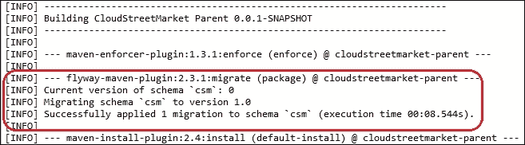

8.  在此阶段，应重置数据库以匹配结构和数据的标准状态。
9.  If you rerun the build again, you should now see the following logs:

    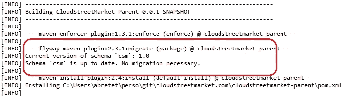

10.  在父级`pom.xml`（在`cloudstreetmarket-parent`中）可以看到一个新的插件定义：

    ```
    <plugin>
      <groupId>com.googlecode.flyway</groupId>
      <artifactId>flyway-maven-plugin</artifactId>
      <version>2.3.1</version>
      <inherited>false</inherited>
      <executions>
          <execution>
          <id>package</id>
          <goals>
          <goal>migrate</goal>
          </goals>
          </execution>
      </executions>
      <configuration>
        <driver>${database.driver}</driver>
        <url>${database.url}</url>
        <serverId>${database.serverId}</serverId>
        <schemas>
          <schema>${database.name}</schema>
          </schemas>
        <locations>
          <location>
            filesystem:${user.home}/app/db/migration
            </location>
          </locations>
          <initOnMigrate>true</initOnMigrate>
            <sqlMigrationPrefix>Migration-</sqlMigrationPrefix>
            <placeholderPrefix>#[</placeholderPrefix>
            <placeholderSuffix>]</placeholderSuffix>
            placeholderReplacement>true</placeholderReplacement>
            <placeholders>
            <db.name>${database.name}</db.name>
            </placeholders>
      </configuration>
      <dependencies>
            <dependency>
            <groupId>mysql</groupId>
            <artifactId>mysql-connector-java</artifactId>
            <version>5.1.6</version>
            </dependency>
      </dependencies>
      </plugin>
    ```

11.  本定义中使用的少数变量（如**、**`${database.driver})`对应默认属性，设置在`pom.xml`：

    ```
      <database.name>csm</database.name>
      <database.driver>com.mysql.jdbc.Driver</database.driver>
      <database.url>jdbc:mysql://localhost</database.url>
      <database.serverId>csm_db</database.serverId>
    ```

    的顶层
12.  `database.serverId`必须匹配 Maven`settings.xml`文件中的新`Server`条目（在下一点中描述）。
13.  编辑位于`<home-directory>/.m2/settings.xml`的 Maven`settings.xml`文件（您必须在[第 1 章](08.html#aid-2BASE1 "Chapter 1. Setup Routine for an Enterprise Spring Application")中为企业级 Spring 应用程序创建的*设置例程中创建）。在根节点的某处添加以下块：

    ```
      <servers>
          <server>  
          <id>csm_db</id>
          <username>csm_tech</username>
          <password>csmDB1$55</password>
          </server>
      </servers>
    ```* 
14.  在父项`pom.xml`（在`cloudstreetmarket-parent`中）添加了新的`Profile`以选择性地覆盖（此`pom.xml`的）默认属性：

    ```
    <profiles>
      <profile>
      <id>flyway-integration</id>
      <properties>
      <database.name>csm_integration</database.name>
      <database.driver>com.mysql.jdbc.Driver</database.driver>
      <database.url>jdbc:mysql://localhost</database.url>
      <database.serverId>csm_db</database.serverId>
      </properties>
      </profile>
    </profiles>
    ```

### 提示

使用`csm_integration`配置文件（`mvn clean install –Pcsm_integration`运行`Maven Clean Install`将在这种情况下升级`csm_integration`数据库（如有必要）。

## 它是如何工作的。。。

Flyway 是一个获得 Apache v2（自由软件）许可的数据库版本控制和迁移工具。它是 Boxfuse GmbH 公司的注册商标。

Flyway 不是这一类别中的唯一产品，但由于其简单和易于配置，在行业中广泛存在。迁移脚本可以用普通的旧 SQL 编写，并且支持许多提供程序。从经典的 RDBMS（Oracle、MySQL、SQL Server 等）到内存数据库（HSQLDB、solidDB 等），甚至是基于云的解决方案（AWS Redshift、SQL Azure 等）。

### 数量有限的命令

Flyway 提供以下六个命令用于报告和操作目的。

#### 迁移

`Migrate`命令是我们集成到 Maven 软件包阶段的目标。它在类路径或文件系统中查找要执行的潜在迁移。可以配置多个`locations`（脚本存储库）。在 Flyway Maven 插件中，这些`locations`在根`configuration`节点中定义。模式设置为保留特定的文件名。

#### 干净

`Clean`命令可恢复原始数据库模式。所有的对象（表、视图、函数等）都会使用此命令删除。

#### 信息

`Info`命令提供给定模式的当前状态和迁移历史的反馈。如果您查看一下本地 MySQL 服务器，在`csm`模式中，您会注意到已经创建了一个名为`schema_version`的元数据表。Flyway 使用下表比较脚本存储库状态与数据库状态，并填补空白。

<colgroup><col> <col> <col> <col> <col></colgroup> 
| 

版本

 | 

描述

 | 

剧本

 | 

安装在

 | 

成功

 |
| --- | --- | --- | --- | --- |
| `0` | `<< Flyway Schema Creation >>` | `'csm'` | `12/11/2015 18:11` | `1` |
| `1` | `drop and create` | `/Migration-1_0__drop_and_create.sql` | `12/11/2015 18:11` | `1` |

`Info`命令基本上将此表打印为报告。

#### 验证

`Validate`命令可用于确保在数据库上执行的迁移实际对应于存储库中当前存在的脚本。

#### 基线

当我们有一个尚未通过 Flyway 管理的现有数据库时，可以使用`Baseline`命令。将创建一个基线版本来标记此数据库的状态，并使其准备好与即将发布的版本一起使用。在此基线之前的版本将被忽略。

#### 修理

`Repair`命令可以清除元数据表的损坏状态。为此，Flyway 将删除失败的迁移条目，并重置存储的校验和以匹配脚本校验和。

### 关于 Flyway Maven 插件

FlywayMaven 插件为 Maven 提供了控制 Flyway 程序的接口。我们对插件的配置如下：

```
<plugin>
    <groupId>com.googlecode.flyway</groupId>
    <artifactId>flyway-maven-plugin</artifactId>
    <version>2.3.1</version>
    <inherited>false</inherited>
    <executions>
      <execution>
        <id>package</id>
        <goals>
          <goal>migrate</goal>
        </goals>
      </execution>
    </executions>
    <configuration>
      <driver>${database.driver}</driver>
    <url>${database.url}</url>
    <serverId>${database.serverId}</serverId>
    <schemas>
       <schema>${database.name}</schema>
    </schemas>
    <locations>
      <location>
          filesystem:${user.home}/app/db/migration
        </location>
        </locations>
    <initOnMigrate>true</initOnMigrate>
      <sqlMigrationPrefix>Migration-</sqlMigrationPrefix>
      <placeholderPrefix>#[</placeholderPrefix>
      <placeholderSuffix>]</placeholderSuffix>
      <placeholderReplacement>true</placeholderReplacement>
      <placeholders>
      <db.name>${database.name}</db.name>
     </placeholders>
  </configuration>
</plugin>
```

与 Maven 插件一样，执行部分允许将 Maven 阶段绑定到插件的一个或多个目标。对于 Flyway Maven 插件，目标是前面介绍的 Flyway 命令。我们告诉 Maven 什么时候考虑插件和插件中调用什么。

我们的`configuration`部分介绍了迁移期间检查的一些参数。例如，`locations`指定递归扫描迁移存储库（它们可以以`classpath`或`filesystem:`开头）。`schemas`定义了 Flyway 为整个迁移集管理的模式列表。第一个模式将是跨迁移的默认模式。

一个有趣的特性是能够在迁移脚本中使用变量，以便这些脚本可以用作多个环境的模板。变量名由`placeholders`定义，脚本中变量的标识方式可由`placeholderPrefix`和`placeholderSuffix`配置。

整个配置参数列表可在以下位置找到：

[http://flywaydb.org/documentation/maven/migrate.html](http://flywaydb.org/documentation/maven/migrate.html) 。

## 还有更多…

### 官方文件

Flyway 有着良好的记录，并得到了社区的积极支持。在[在线阅读更多关于该产品的信息 http://flywaydb.org](http://flywaydb.org) 。

您还可以通过位于[的 GitHub 存储库关注或贡献项目 https://github.com/flyway/flyway](https://github.com/flyway/flyway) 。

## 另见

*   **Liquibase**: The main Flyway competitor is probably Liquibase. Liquibase doesn't use plain SQL for its scripts; it has instead its own multirepresentation DSL. For more information, visit:

    [http://www.liquibase.org](http://www.liquibase.org) 。

# 使用 Mockito 和 Maven Surefire 进行单元测试

单元测试有助于关注组件的实现。Spring 的传统理念促进了可重用组件的应用范围。这些组件的核心实现可能改变状态（临时对象的状态）或触发与其他组件的交互。

在单元测试中使用模拟专门评估组件方法相对于其他组件的**行为**。当开发人员习惯于模拟时，看到设计对不同层和逻辑外部化的使用产生了多大的影响是令人惊讶的。同样，对象名和方法名也被赋予了更重要的地位。因为它们总结了其他地方正在发生的事情，mock 节省了下一个开发人员的精力，而下一个开发人员将不得不在代码领域进行操作。

根据定义，开发单元测试是一项企业策略。由于测试覆盖的代码百分比可以很容易地反映产品的成熟度，因此该代码覆盖率也正在成为评估公司产品的标准参考。还必须注意的是，将代码审查作为开发过程进行实践的公司从 Pull 请求中发现了有价值的见解。当拉动请求通过测试突出显示行为变化时，潜在变化的影响会更快地显现出来。

## 怎么做…

1.  Rerun a `Maven Install` on the `cloudstreetmarket-parent` project as in the previous recipe. When the build process comes to build the core module, you should see the following logs that suggest the execution of unit tests during the **test** phase (between **compile** and **package**):

    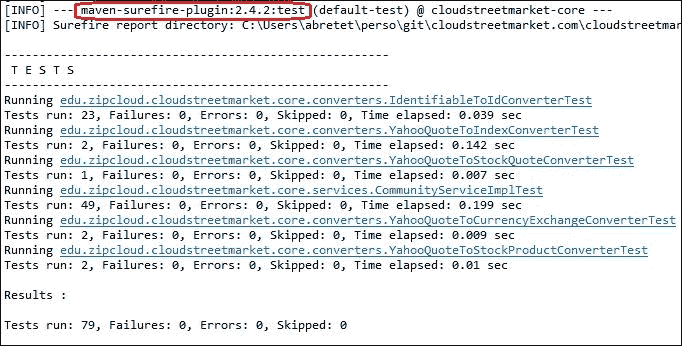

2.  Those tests can be found in the `cloudstreetmarket-core` module, specifically in the `src/test/java` source folder:

    

    单元测试和集成测试都使用 JUnit：

    ```
        <dependency>
             <groupId>junit</groupId>
             <artifactId>junit</artifactId>
             <version>4.9</version>
        </dependency>
    ```

3.  JUnit is natively supported by Eclipse IDE, and this last one offers handles to **Run** and **Debug** tests from a class or a method outside Maven:

    

4.  一个非常简单的 JUnit 测试类是`IdentifiableToIdConverterTest` （参见下面的代码）。这个类声明所有注册的实体都可以被`IdentifiableToIdConverter`转换为`Identifiable`实现（记住 HATEOAS:）：

    ```
    import static org.junit.Assert.*;
    import org.junit.Test;
    import edu.zipcloud.cloudstreetmarket.core.entities.*;

    public class IdentifiableToIdConverterTest {

      private IdentifiableToIdConverter converter;

      @Test
      public void canConvertChartStock(){
        converter = new IdentifiableToIdConverter(ChartStock.class);
        assertTrue(converter.canConvert(ChartStock.class));
        }

      @Test
      public void canConvertAction(){
        converter = new IdentifiableToIdConverter(Action.class);
        assertTrue(converter.canConvert(Action.class));
      }
    }
    ```

5.  More advanced unit tests use the Mockito library. For instance, in the following `YahooQuoteToCurrencyExchangeConverterTest`:

    ```
    @RunWith(MockitoJUnitRunner.class)
    public class YahooQuoteToCurrencyExchangeConverterTest {
      @InjectMocks
      private YahooQuoteToCurrencyExchangeConverter converter;
      @Mock
      private CurrencyExchangeRepository currencyExchangeRepository;
      @Test
      public void transferCriticalData(){
          when(currencyExchangeRepository.findOne(
          any(String.class))
          )
          .thenReturn(new CurrencyExchange("WHATEVER_ID""));
        CurrencyExchange currencyExchange = converter.convert(buildYahooQuoteInstance());
        assertEquals("WHATEVER_ID"",currencyExchange.getId());
        assertEquals("USDGBP=X"", currencyExchange.getName());
        assertEquals(BigDecimal.valueOf(10), 
          currencyExchange.getBid());
        ...
        assertEquals(BigDecimal.valueOf(17), 
        currencyExchange.getOpen());	
        verify(currencyExchangeRepository, times(1))
          .findOne(any(String.class));
      }
      ...
    }
    ```

    在这里，突出显示的`transferCriticalData()`测试获取一个`YahooQuoteToCurrencyExchangeConverter`实例，该实例没有用实`@Autowired CurrencyExchangeRepository`初始化，而是用**模拟**初始化。转换器通过`YahooQuote` 实例调用其`convert()`方法。

    ### 注

    在`convert()`中调用 Mock 的`findOne`（`String s`方法时，Mock 被告知返回一个特定的`CurrencyExchange`实例。然后，对返回的`currencyExchange`对象逐个字段进行评估，以确保它们符合各自的期望。

6.  不同模块之间增加了对 Mockito 的以下 Maven 依赖性：

    ```
        <dependency>
          <groupId>org.mockito</groupId>
          <artifactId>mockito-all</artifactId>
          <version>1.9.5<version>
        </dependency>
    ```

7.  在`CommunityServiceImplTest.`中可以找到 Mockito 在单元测试中更广泛的使用。例如，在下面的示例中，`registerUser_generatePasswordAndEncodeIt` 测试使用了`ArgumentCaptor`：

    ```
    @Test
    public void registerUser_generatesPasswordAndEncodesIt() {
      when(communityServiceHelper.generatePassword())
        .thenReturn("newPassword");
      when(passwordEncoder.encode("newPassword"))
        .thenReturn("newPasswordEncoded");
      ArgumentCaptor<User>userArgumentCaptor = 
        ArgumentCaptor.forClass(User.class);
      userA.setPassword(null);
      communityServiceImpl.registerUser(userA);
      verify(userRepository, times(1))
        .save(userArgumentCaptor.capture());
      verify(passwordEncoder, times(1))
        .encode("newPassword");
      String capturedGeneratedPassword = 
        userArgumentCaptor.getValue().getPassword();
      assertEquals("newPasswordEncoded", capturedGeneratedPassword);
    }
    ```

## 它是如何工作的。。。

### @测试注释

`@Test` 注释必须放在公共 void 方法上，以便 JUnit 将它们视为测试用例。在这些方法之一中引发的异常将被视为测试失败。因此，无异常抛出的执行表示成功。

`@Test`注释可以自定义，传递以下两个可选参数。

#### 预期参数和超时参数

`@Test`注释上的**预期**参数指定测试预期抛出特定 t 类型的异常才能成功。当抛出不同类型的异常或根本没有抛出异常时，JUnit 必须将执行视为失败。当测试用例在其`@Test`注释中提供**超时**参数时，当执行持续时间超过指定时间时，该测试将失败。

### 带注释的@RunWith

正如配方中引入的一样，`@RunWith`注释允许使用外部测试运行程序（而不是 JUnit 附带的默认`BlockJUnit4ClassRunner`。顺便说一句，指定默认 JUnit runner 的声明性技术可以是获得`@RunWith`目标`JUnit4.class`，比如：`@RunWith(JUnit4.class)`。

|   | *跑步者运行测试并通知`RunNotifier`重要事件* |   |
|   | --*JUnit.org Javadoc* |

自定义`Runner`必须实现`org.junit.runner.Runner` 中的抽象方法，如`run(RunNotifier notifier)`和`getDescription()`。它还必须跟进核心 JUnit 函数，例如驱动测试执行流。JUnit 有一组注释，例如`@BeforeClass`、`@Before`、`@After`和`@AfterClass`由`org.junit.runner.ParentRunner`本地处理。接下来我们将访问这些注释。

### @注释前和注释后

在包含多个测试用例的测试类中，最好尝试使测试逻辑尽可能清晰。从这个角度来看，变量初始化和上下文重新初始化是人们为了可重用性而经常尝试外部化的操作。可以在`public void`方法上定义`@Before`注释，让跑步者在**每次测试**之前执行注释。类似地，`@After`注释在**每个测试**之后再次标记要执行的`public void`方法（通常用于清理资源或破坏上下文）。

作为信息，在继承方面，父类的`@Before`方法将在当前类的方法之前运行。类似地，超类中声明的`@After`方法将在当前类的方法之后运行。

Javadoc 中另一个有趣的点是，即使一个`@Before`或`@Test`注释的方法抛出异常，也可以保证**所有**`@After`方法都能运行。

### @BeforeClass 和@AfterClass 注释

`@BeforeClass`和`@AfterClass`注释可应用于**公共静态无效**方法。`@BeforeClass`导致方法在测试生命周期内运行**一次。该方法将在任何其他`@Test`或`@Before` 注释的方法之前运行。**

注释为`@AfterClass`的方法保证在所有测试之后**运行一次**，并且在所有注释为`@BeforeClass`、`@Before,`或`@After`的方法之后，即使其中一个抛出异常，也会运行一次**。**

`@BeforeClass`和`@AfterClass`是处理与准备测试上下文（数据库连接管理和业务前/后处理）相关的性能消耗操作的有价值的工具。

作为信息，在继承方面，超类中的`@BeforeClass` 注释方法将在当前类的方法之前**执行，超类中的`@AfterClass`注释方法将在当前类的**方法之后**执行。**

### 使用 Mockito

Mockito 是一个开源测试框架，支持测试驱动开发和行为驱动开发。它允许创建双对象（模拟对象），并有助于隔离测试中的系统。

#### MockitoJUnitRunner

我们一直在谈论定制跑步者。`MockitoJUnitRunner`有点特别，它围绕默认`JUnitRunner`实现了一个装饰模式。

这样的设计使得可以选择使用这个运行程序（所有提供的服务也可以用 Mockito 声明性地实现）。

`MockitoJUnitRunner`自动初始化`@Mock`注释的依赖项（这为我们节省了对`MockitoAnnotations.initMocks(this)`的调用，例如在`@Before`注释的方法中）。

`initMocks(java.lang.Object testClass)`

|   | *初始化使用 Mockito 注释为给定 testClass 注释的对象：`@Mock`* |   |
|   | --*Javadoc* |

`MockitoJUnitRunner`还通过调用`Mockito.validateMockitoUsage()`在每个测试方法之后验证了我们实现框架的方式。这种验证使我们能够在显式错误输出的帮助下充分利用库。

#### transferCriticalData 示例

被测的系统为`YahooQuoteToCurrencyExchangeConverter`。`@InjectMocks`注释告诉 Mockito 在每次测试之前使用初始化的 Mock 在目标转换器上执行依赖项注入（构造函数注入、属性设置器或字段注入）。

`Mockito.when(T methodCall)` 方法与`thenReturn(T value)` 相结合，允许在`converter.convert(...)` 测试方法内部实际调用`currencyExchangeRepository.findOne`时定义假`CurrencyExchange`返回对象。

带有`verify(currencyExchangeRepository, times(1)).findOne(any(String.class))` 的`Mockito verify` 方法告诉 Mockito 验证测试的`convert`方法是如何与 Mock 交互的。在下面的示例中，我们希望`convert`方法只调用存储库一次。

#### 注册器示例

更具体地说，在`registerUser_generatesPasswordAndEncodesIt`测试中，我们使用`MockitoArgumentCaptor` 手动对调用模拟方法的对象执行更深入的分析。

当我们没有中间层并且结果被重用以调用其他方法时，`MockitoArgumentCaptor`非常有用。

可能需要比表面的（但仍然非常有用的）类型检查更多的内省工具（例如，`any(String.class)`。在测试方法中，`ArgumentCaptor`作为解决方案与额外的局部变量一起使用。

### 提示

记住，实现方法中的局部变量和临时状态总是会增加相关测试的复杂性。更短、明确和内聚的方法总是更好的选择。

## 还有更多…

### 关于莫基托

我们建议 Mockito 的 Javadoc 做得很好，并且有很多实际的例子

[http://docs.mockito.googlecode.com/hg/org/mockito/Mockito.html](http://docs.mockito.googlecode.com/hg/org/mockito/Mockito.html)

### JUnit 规则

到目前为止，我们还没有涉及 JUnit 规则。JUnit 提供了`@Rule`注释，可应用于测试类字段，以抽象特定于业务的周期性准备。它通常用于准备测试上下文对象（夹具）。

[http://www.codeaffine.com/2012/09/24/junit-rules](http://www.codeaffine.com/2012/09/24/junit-rules)

[http://junit.org/javadoc/latest/org/junit/Rule.html](http://junit.org/javadoc/latest/org/junit/Rule.html)

## 另见

*   **代码覆盖率，JaCoCo**：JaCoCo 是一个库，用于帮助维护和增加应用程序中测试覆盖的代码的百分比；可在以下地点获得：[http://eclemma.org/jacoco](http://eclemma.org/jacoco) 。
*   Read more about JaCoCo Maven plugin at:

    [http://eclemma.org/jacoco/trunk/doc/maven.html](http://eclemma.org/jacoco/trunk/doc/maven.html)

# 与 Cargo、Rest assured 和 Maven failsafe 的集成测试

集成测试与单元测试一样重要。它们从更高的层次验证特征，同时涉及更多的组件或层。当环境需要快速发展时，集成测试（IT 测试）就变得更加重要。设计过程通常需要迭代，单元测试有时会严重影响我们的重构能力，而较高级别的测试受影响相对较小。

## 准备好了吗

这个方法展示了如何开发专注于 SpringMVCWeb 服务的自动化 IT 测试。这样的 IT 测试不是行为测试，因为它们根本不评估用户界面。为了测试行为，需要更高的测试级别，模拟用户通过应用程序界面的过程。

作为预集成测试 Maven 阶段的一部分，我们将配置 Cargo Maven 插件以支持测试环境。在集成测试阶段，我们将使用 Maven failsafe 插件来执行 IT 测试。这些 IT 测试将利用 REST assured 库针对测试环境运行 HTTP 请求并断言 HTTP 响应。

## 怎么做…

1.  We have designed Integration tests in the `cloudstreetmarket-api` module. These tests are intended to test the API controller methods.

    

2.  伟大的放心库附带以下 Maven 依赖项：

    ```
      <dependency>
        <groupId>com.jayway.restassured</groupId>
        <artifactId>rest-assured</artifactId>
        <version>2.7.0</version>
      </dependency>
    ```

3.  使用 REST assured 的 IT 测试的典型示例如下`UserControllerIT.createUserBasicAuth()`：

    ```
    public class UserControllerIT extends AbstractCommonTestUser{
      private static User userA;
      @Before
      public void before(){
        userA = new User.Builder()
          .withId(generateUserName())
          .withEmail(generateEmail())
          .withCurrency(SupportedCurrency.USD)
          .withPassword(generatePassword())
          .withLanguage(SupportedLanguage.EN)
          .withProfileImg(DEFAULT_IMG_PATH)
          .build();
      }
      @Test
      public void createUserBasicAuth(){
        Response responseCreateUser = given()
          .contentType("application/json;charset=UTF-8")
          .accept("application/json"")
          .body(userA)
          .expect
          .when()
          .post(getHost() + CONTEXT_PATH + "/users");
      String location = 
          responseCreateUser.getHeader("Location");
      assertNotNull(location);
      Response responseGetUser = given()
          .expect().log().ifError()
          .statusCode(HttpStatus.SC_OK)
          .when()
          .get(getHost() + CONTEXT_PATH + location + 
          		JSON_SUFFIX);
        UserDTO userADTO = 
          deserialize(responseGetUser.getBody().asString());
        assertEquals(userA.getId(), userADTO.getId());
        assertEquals(userA.getLanguage().name(), 
        userADTO.getLanguage());
        assertEquals(HIDDEN_FIELD, userADTO.getEmail());
        assertEquals(HIDDEN_FIELD, userADTO.getPassword());
        assertNull(userA.getBalance());
      }
    }
    ```

4.  Because they take longer to execute, we wanted to decouple the IT Tests execution from the main Maven life cycle. We have associated those IT Tests to a Maven profile named `integration`.

    ### 注

    Maven 概要文件提供了使用额外的生命周期绑定选择性地丰富 Maven 构建的可能性。例如，在通常的命令中，我们的集成概要文件被激活，并将此概要文件 id 作为`Profile`参数传递：

    `$ mvn clean install -P integration`

5.  对于我们的 API IT 测试，我们已经在`cloudstreetmarket-api pom.xml`文件

    ```
    <profiles>
      <profile>
      <id>integration</id>
      <build>
      <plugins>
        <plugin>
          <groupId>org.apache.maven.plugins</groupId>
          <artifactId>maven-failsafe-plugin</artifactId>
          <version>2.12.4</version>
          <configuration>
          <includes>
            <include>**/*IT.java</include>
          </includes>
          <excludes>
            <exclude>**/*Test.java</exclude>
          </excludes>
       </configuration>
       <executions>
          <execution>
            <id>integration-test</id>
            <goals>
              <goal>integration-test</goal>
            </goals>
          </execution>
          <execution>
            <id>verify</id>
            <goals><goal>verify</goal></goals>
          </execution>
       </executions>
     </plugin>
     <plugin>
      <groupId>org.codehaus.cargo</groupId>
      <artifactId>cargo-maven2-plugin</artifactId>
      <version>1.4.16</version>
          <configuration>
          <wait>false</wait>
          <container>
          <containerId>tomcat8x</containerId>
                <home>${CATALINA_HOME}</home>
          <logLevel>warn</logLevel>
          </container>
          <deployer/>
          <type>existing</type>
          <deployables>
          <deployable>
          <groupId>edu.zc.csm</groupId>
          <artifactId>cloudstreetmarket-api</artifactId>
          <type>war</type>
            <properties>
              <context>api</context>
            </properties>
          </deployable>
          </deployables>
        </configuration>
        <executions>
          <execution>
            <id>start-container</id>
            <phase>pre-integration-test</phase>
            <goals>
             <goal>start</goal>
             <goal>deploy</goal>
          </goals>
        </execution>
        <execution>
          <id>stop-container</id>
          <phase>post-integration-test</phase>
          <goals>
             <goal>undeploy</goal>
             <goal>stop</goal>
          </goals>
             </execution>
          </executions>
        </plugin>
      </plugins>
      </build>
      </profile>
    </profiles>
    ```

    中找到了配置文件的特定配置
6.  在尝试在您的机器上运行它们之前，请检查您是否有一个指向 Tomcat 目录的**CATALINA_HOME**环境变量。如果没有，您必须创建它。要设置的变量应如下所示（如果您已遵循[第 1 章](08.html#aid-2BASE1 "Chapter 1. Setup Routine for an Enterprise Spring Application")、*Enterprise Spring 应用程序的设置例程*：
    *   `C:\tomcat8`：在 MS Windows 上
    *   `/home/usr/{system.username}/tomcat8`：在 Linux 上
    *   `/Users/{system.username}/tomcat8`：在 Mac OS X 上
7.  另外，确保 ApacheHTTP、Redis 和 MySQL 已在本地计算机上启动并运行（如果跳过了，请参阅上一章）。
8.  When ready:
    *   在终端中执行以下 Maven 命令（如果路径中有 Maven 目录）：

        ```
         mvn clean verify -P integration

        ```

    *   或者从**运行****运行配置…**菜单为 Eclipse IDE 中的此自定义构建创建快捷方式。要创建的生成配置如下所示：

    

9.  Running this command (or shortcut) should:
    1.  将 api.war 部署到本地 Tomcat 服务器
    2.  启动本地 Tomcat
    3.  执行与**/*IT.java 模式匹配的测试类

    如果所有测试都通过，您应该会看到`[INFO] BUILD SUCCESS` 消息。

10.  In between, when the build comes to the API, you should see the following bit of stack trace suggesting the successful execution of our IT tests:

    

## 它是如何工作的。。。

在本节中，我们将解释我们为什么引入 Maven 故障保护插件，Cargo 插件配置如何满足我们的需求，我们如何使用 REST assured，以及这个 REST assured 库有多有用。

### Maven 故障保护与 Maven Surefire

我们正在使用 Maven failsafe 运行集成测试，使用 Maven Surefire 运行单元测试。这是使用这些插件的标准方式。下表反映了这一点，以及插件对测试类的默认命名模式：

<colgroup><col> <col> <col></colgroup> 
|   | 

马文·苏尔菲尔

 | 

Maven 故障保护

 |
| --- | --- | --- |
| **默认测试包含模式** | 

```
**/Test*.java
**/*Test.java
**/*TestCase.java

```

 | 

```
**/IT*.java
**/*IT.java
**/*ITCase.java

```

 |
| **默认输出目录** | 

```
${basedir}/target/surefire-reports

```

 | 

```
${basedir}/target/failsafe-reports

```

 |
| **绑定到构建阶段** | 

```
test

```

 | 

```
pre-integration-test
integration-test
post-integration-test
verify

```

 |

对于 Maven Failsafe，您可以看到我们覆盖的模式包含/排除是可选的。关于与 Maven 构建阶段的绑定，我们选择在`integration-test`和`verify`阶段触发集成测试的执行。

### 货物编码

Cargo 是一个轻量级库，它为操作多个受支持的容器（Servlet 和 JEE 容器）提供了标准 API。涵盖的 API 操作的示例包括工件的部署、远程部署和容器启动/停止。当通过 Maven、Ant 或 Gradle 使用时，它主要用于支持集成测试，但也可以服务于其他范围。

#### Cargo Maven 插件

我们已经通过 Maven 插件`org.codehaus.cargo:cargo-maven2-plugin` 使用 Cargo 来自动准备一个可以运行集成测试的集成环境。在集成测试之后，我们希望该环境关闭。

##### 与 Maven 相结合

以下执行已声明为`cargo-maven2-plugin` 配置的一部分：

```
<executions>
  <execution>
    <id>start-container</id>
    <phase>pre-integration-test</phase>
    <goals>
      <goal>start</goal>
    <goal>deploy</goal>
      </goals>
  </execution>
  <execution>
        <id>stop-container</id>
    <phase>post-integration-test</phase>
      <goals>
      <goal>undeploy</goal>
      <goal>stop</goal>
        </goals>
  </execution>
</executions>
```

让我们看看执行`mvn install`命令时会发生什么。

`install`是默认 Maven 生命周期的一个阶段。如[第 1 章](08.html#aid-2BASE1 "Chapter 1. Setup Routine for an Enterprise Spring Application")*企业级 Spring 应用程序**的设置例程所述，*默认生命周期从`validate`到`deploy`有 23 个构建阶段。`install`阶段是第 22 个阶段，因此需要检查 22 个阶段，以查看是否有可以附加到它们的插件目标。

在这里，`pre-integration-test`阶段（出现在`validate`和`install`之间的默认生命周期中）将触发位于我们的 maven Cargo 插件的`start`和`deploy`目标下的流程。这与`post-integration-test`触发`undeploy`和`stop`目标的逻辑相同。

在 IT 测试执行之前，我们启动并部署 Tomcat 服务器。这些 IT 测试在`integration-test`阶段由 Maven failsafe 处理。最后，Tomcat 服务器被取消部署并停止。

IT 测试也可以在`verify`阶段执行（如果服务器在默认 Maven 生命周期之外启动）。

##### 使用现有 Tomcat 实例

在 CargoMaven 插件配置中，我们针对的是 Tomcat 的一个现有实例。我们的应用程序目前依赖于 MySQL、Redis、Apache HTTP 和自定义会话管理。我们已经决定，IT 测试的执行需要在适当的集成环境中运行。

如果没有所有这些依赖项，我们就可以下载 Tomcat8 实例。

### 放心

放心吧是一个开放源码库，获得了 ApacheV2 许可，并得到了 Jayway 公司的支持。它是用 Groovy 编写的，允许通过其独特的功能 DSL 发出 HTTP 请求和验证 JSON 或 XML 响应，从而大大简化 REST 服务的测试。

#### 静态进口

为了有效使用放心，文档建议添加以下包的静态导入：

*   `com.jayway.restassured.RestAssured.*`
*   `com.jayway.restassured.matcher.RestAssuredMatchers.*`
*   `org.hamcrest.Matchers.*`

#### 给定的时间，然后接近

为了理解其余的 DSL 的基本知识，让我们考虑一个我们的测试（在 Type T0T 中），它提供了一个关于放心使用的简短概述：

```
  @Test
  public void createUserBasicAuthAjax(){
    Response response = given()
    .header("X-Requested-With", "XMLHttpRequest")
    .contentType("application/json;charset=UTF-8")
    .accept("application/json\")
    .body(userA)
    .when()
    .post(getHost() + CONTEXT_PATH + "/users");
    assertNotNull(response.getHeader("Location"));
  }
```

语句的`given`部分是 HTTP 请求规范。请放心，一些请求头，如`Content-Type`或`Accept`可以通过`contentType(…)`和`accept(…)`以直观的方式定义。其他**标题**可通过通用`.header(…)`访问。请求参数和身份验证也可以以相同的方式定义。

对于`POST`和`PUT`请求，需要向请求传递一个主体。这个`body`可以是普通的 JSON 或 XML，也可以直接是 Java 对象（正如我们在这里所做的）。此`body`作为 Java 对象，将由库根据规范中定义的`content-type`（JSON 或 XML）进行转换。

在 HTTP 请求规范之后，`when()`语句提供了关于实际 HTTP 方法和目的地的信息。

在这个阶段，返回的对象允许我们从`then()`块定义期望，或者像我们在这里所做的那样，从可以单独定义约束的地方检索`Response`对象。在我们的测试用例中，`Response`的`Location`头应该被填充。

## 还有更多…

更多信息可在以下货物和相关文件中找到：

### 关于货物

有关产品及其与第三方系统集成的更多信息，请参考[https://codehaus-cargo.github.io/cargo/Home.html](https://codehaus-cargo.github.io/cargo/Home.html) 。

### 更多放心的例子

更多示例，放心在线维基提供大量：

[https://github.com/jayway/rest-assured/wiki/Usage](https://github.com/jayway/rest-assured/wiki/Usage)

# 将弹簧豆注入集成测试

这个配方是如何将 Spring 管理的 bean 注入集成测试类的一个示例。即使对于 IT 测试（其第一个目标是将后端作为黑盒进行评估），有时也需要从中间层接触技术对象。

## 准备好了吗

我们将看到如何重用要注入测试类中的 Spring 托管的`datasource`实例。这个`datasource`将帮助我们构建`jdbcTemplate`的一个实例。从这个`jdbcTemplate`，我们将查询数据库并模拟/验证无法通过其他方式测试的流程。

## 怎么做…

1.  We have `@Autowired` a `dataSource` SpringBean in our `UserControllerIT` test. This bean is defined in the test-specific Spring configuration file (`spring-context-api-test.xml`) `resources` directory (`cloudstreetmarket-api`):

    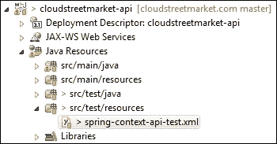

    ```
    <context:property-placeholderlocation="
      file:${user.home}/app/cloudstreetmarket.properties""/>
    <bean id="dataSource" 		
      class="org.apache.commons.dbcp2.BasicDataSource" 	
      destroy-method="close"">
      <property name="driverClassName"">
         <value>com.mysql.jdbc.Driver</value>
      </property>
      <property name="url"">
        <value>${db.connection.url}</value>
      </property>
    <property name="username"">
      <value>${db.user.name}</value>
    </property>
    <property name="password"">
      <value>${db.user.passsword}</value>
    </property>
    <property name="defaultReadOnly">
      <value>false</value>
    </property>
    </bean>
    ```

    从`@Autowired dataSource`bean 在`UserControllerIT`类中创建`jdbcTemplate`实例：

    ```
        @Autowired
        private JdbcTemplate jdbcTemplate;
        @Autowired
        public void setDataSource(DataSource dataSource) {
        	this.jdbcTemplate = new JdbcTemplate(dataSource);
        }
    ```

2.  We use `jdbcTemplate` to insert and delete `Social Connections` directly in the database (see [Chapter 5](#aid-30A8Q1 "Chapter 5. Authenticating with Spring MVC"), *Authenticati**ng with Spring MVCA*). This allows us to bypass and simulate a successful user OAuth2 authentication flow (that normally happens through the web browser).

    为了删除社交连接，我们创建了以下私有方法，该方法根据测试需要调用：

    ```
        private void deleteConnection(String spi, String id) {
        	this.jdbcTemplate.update("delete from userconnection where providerUserId = ? and userId = "?", new Object[] {spi, id});
       }
    ```

3.  在`UserControllerIT` 类的最顶端，可以注意到以下两个注释：
    *   `@RunWith(SpringJUnit4ClassRunner.class)`告诉 JUnit 使用支持 Spring`TestContext`框架的 JUnit（`SpringJUnit4ClassRunner`的自定义扩展运行。
    *   `@ContextConfiguration("classpath:spring-context-api-test.xml")`指定加载和配置 Spring 应用程序上下文的位置和方式：

        ```
            @RunWith(SpringJUnit4ClassRunner.class)
            @ContextConfiguration("classpath:spring-context-api-test.xml"")
            public class UserControllerIT extends AbstractCommonTestUser{
            private static User userA;
            private static User userB;
            ...
            }
        ```

## 它是如何工作的。。。

### SpringJunitClassRunner

在其设计中，`SpringJUnit4ClassRunner`是 JUnit 的`BlockJUnit4ClassRunner`的一个直接子类。加载`TestContextManager`时初始化的`SpringJUnit4ClassRunner`。`TestContextManager` 管理`TestContext` 的生命周期，还可以将测试事件反映到注册的`TestExecutionListeners` （来自`@BeforeClass`、`@AfterClass`、`@Before`和`@After`注释）。

通过加载 Spring 上下文，`SpringJUnit4ClassRunner`Spring 上下文，`SpringJUnit4ClassRunner`允许在测试类中使用 Spring 管理的 bean。`SpringJUnit4ClassRunner`还支持一组可在测试类中使用的注释（来自 JUnit 或 Spring 测试）。可以信任这些注释的使用，以便随后为上下文定义的对象提供适当的生命周期管理。

这些注释是`@Test` （带有`expected`和`timeout`注释参数）、`@Timed`、`@Repeat`、`@Ignore`、`@ProfileValueSourceConfiguration`和`@IfProfileValue`。

### @ContextConfiguration 注释

此类级注释是针对弹簧测试的。它定义了如何以及在何处为测试类加载 Spring 上下文。

我们在配方中的定义针对一个特定的 SpringXML 配置文件`@ContextConfiguration("classpath:spring-context-api-test.xml").`

但是，由于 Spring 3.1 可以通过编程方式定义上下文，`@ContextConfiguration`还可以将配置类作为目标，如下所示：

`@ContextConfiguration(classes={AnnotationConfig.class,` `WebSocketConfig.class})`

如以下代码段中所示，两种声明类型可以组合在同一个注释中：

`@ContextConfiguration(classes={AnnotationConfig.class,` `WebSocketConfig.class}, locations={``classpath:spring-context-api-test.xml``})`

## 还有更多…

我们将在部分看到更多关于 Spring JdbcTemplate 的内容，该模板已用于测试目的。

### jdbc 模板

在*第 1 章，企业级 Spring 应用程序*的设置例程中，我们介绍了使成为今天的 Spring 框架的不同模块。一组模块为**数据访问与集成**。该组包含 JDBC、ORM、OXM、JMS 和事务模块。

`JdbcTemplate`是 SpringJDBC 核心包的关键类部分。它可靠地允许使用简单实用的方法执行数据库操作，还提供了对大块样板代码的抽象。再一次，这个工具为我们节省了时间，并提供了设计高质量产品的模式。

### 样板逻辑的抽象

让我们考虑一个例子：在我们的测试对象 T1 T.类中删除连接的方法：

```
jdbcTemplate.update("delete from userconnection where 
  providerUserId = ? and userId = "?", new Object[] {spi, id});
```

使用`jdbcTemplate`，删除数据库元素是一条单行指令。它在引擎盖下创建一个`PreparedStatement`，根据我们实际作为值传递的参数选择正确的类型，并为我们管理数据库连接，确保无论发生什么情况都关闭此连接。

`jdbcTemplate.update`方法被设计为发出单个 SQL 更新操作。它可以用于插入、更新和删除。

与春季一样，`jdbcTemplate`还将生成的已检查异常（如果有）转换为未检查的异常。这里，电势`SQLExceptions`将被包裹在`RuntimeException`中。

#### 自动生成 ID 的提取

`jdbcTemplate.update` 方法还提供了其他参数类型：

```
jdbcTemplate.update(final PreparedStatementCreator psc, final
  KeyHolder generatedKeyHolder);
```

对于 insert，当需要读取并可能重用生成的 ID（在查询执行之前未知）时，可以调用此方法。

在我们的示例中，如果我们希望在插入新连接时重用生成的连接 ID，我们将按如下方式执行：

```
KeyHolder keyHolder = new GeneratedKeyHolder();
jdbcTemplate.update(
  new PreparedStatementCreator() {
    public PreparedStatement createPreparedStatement(Connection 
    connection) throws SQLException {
    PreparedStatement ps = connection.prepareStatement("insert into userconnection (accessToken, ... , secret, userId ) values (?, ?, ... , ?, ?)", new String[] {"id""});
    ps.setString(1, generateGuid());
    ps.setDate(2, new Date(System.currentTimeMillis()));
    ...
    return ps;
    }
  }, keyHolder);
  Long Id = keyHolder.getKey().longValue();
```

但是我们并没有特别要求这样的用例。

# 使用 Log4j2 记录现代应用程序

在 Java 生态系统 20 年的发展之后，记录方式出现了不同的策略、趋势和架构。现在，在使用的第三方依赖项中可以找到几种日志框架。我们必须支持它们来调试应用程序或跟踪运行时事件。

## 准备好了吗

此配方为`CloudStreet Market`应用程序提供了一个未来验证的`Log4j2`实现。它需要将几个 Maven 依赖项添加到我们的模块中。作为一种解决方案，它可能看起来相当复杂，但实际上要支持的日志框架数量是有限的，而且`Log4j2`迁移背后的逻辑相当简单。

## 怎么做…

1.  The following Maven dependencies have been added to the dependency-management section of the parent-module (`cloudstreetmarket-parent`):

    ```
        <!-- Logging dependencies -->
        <dependency>
          <groupId>org.apache.logging.log4j</groupId>
          <artifactId>log4j-api</artifactId>
          <version>2.4.1</version>
        </dependency>
        <dependency>
          <groupId>org.apache.logging.log4j</groupId>
          <artifactId>log4j-core</artifactId>
          <version>2.4.1</version>
        </dependency>
        <dependency>
          <groupId>org.apache.logging.log4j</groupId>
          <artifactId>log4j-slf4j-impl</artifactId>
          <version>2.4.1</version>
        </dependency>
        <dependency>
          <groupId>org.apache.logging.log4j</groupId>
          <artifactId>log4j-1.2-api</artifactId>
          <version>2.4.1</version>
        </dependency>
        <dependency>
          <groupId>org.apache.logging.log4j</groupId>
          <artifactId>log4j-jcl</artifactId>
          <version>2.4.1</version>
          </dependency>
        <dependency>
          <groupId>org.apache.logging.log4j</groupId>
          <artifactId>log4j-web</artifactId>
            <scope>runtime</scope>
          <version>2.4.1</version>
        </dependency>
        <dependency>
          <groupId>org.slf4j</groupId>
          artifactId>slf4j-api</artifactId>
          <version>${slf4j.version}</version>
        </dependency>
    ```

    ### 提示

    最后一个依赖关系管理`org.slf4j`允许我们确保`slf4j`的一个单一版本将在任何地方使用。

2.  在的`api`、`ws`和`core`模块中，随后添加了以下依赖项：`log4j-api`、`log4j-core`、`log4j-slf4j-impl`、`log4j-1.2-api`、和 `log4j-jcl`。
3.  在 web 模块（`api`、`ws`、`webapp`中增加了`log4j-web` 。
4.  请注意，`slf4j-api`仅为依赖关系管理而添加。
5.  Start the Tomcat Server with **the extra JVM argument**:

    ```
    -Dlog4j.configurationFile=<home-directory>\app\log4j2.xml.
    ```

    ### 提示

    将`<home-directory>`替换为您在机器上实际使用的路径。

6.  用户主页中的应用目录包含`log4j2`配置文件：

    ```
    <?xml version="1.0" encoding="UTF-8"?>
    <Configuration status="OFF" monitorInterval="30">
    <Appenders
      <Console name="Console" target="SYSTEM_OUT">
        <PatternLayout pattern"="%d{HH:mm:ss.SSS} %-5level %logger{36} - %msg%n""/>
      </Console>
      <RollingFile name="FileAppender" fileName="${sys:user.home}/app/logs/cloudstreetmarket.log"
            filePattern="${sys:user.home}/app/logs/${date:yyyy-MM}/cloudstreetmarket-%d{MM-dd-yyyy}-%i.log.gz">
          <PatternLayout>
            <Pattern>%d %p %C{1} %m%n</Pattern>
          </PatternLayout>
          <Policies>
            <TimeBasedTriggeringPolicy />
            <SizeBasedTriggeringPolicy size="250 MB"/>
          </Policies>
      </RollingFile>
    </Appenders>
    <Loggers>
      <Logger name="edu.zipcloud" level="INFO"/>
      <Logger name="org.apache.catalina" level="ERROR"/>
      <Logger name="org.springframework.amqp" level="ERROR"/>
      <Logger name="org.springframework.security" level="ERROR"/>

      <Root level="WARN">
        <AppenderRef ref="Console"/>
      <AppenderRef ref="FileAppender"/>
      </Root>
    </Loggers>
    </Configuration>
    ```

7.  作为一个回退选项，`log4j2.xml`文件也存在于每个模块的类路径（`src/main/resources`中。
8.  A couple of log instructions have been placed in different classes to trace the user journey.

    在`SignInAdapterImpl`中记录说明：

    ```
        import org.apache.logging.log4j.LogManager;
    import org.apache.logging.log4j.Logger;

    @Transactional
    public class SignInAdapterImpl implements SignInAdapter{
      private static final Logger logger = 
        LogManager.getLogger(SignInAdapterImpl.class);
      ...
      public String signIn(String userId, Connection<?>connection, NativeWebRequest request) {
      ...
      communityService.signInUser(user);
      logger.info("User {} logs-in with OAUth2 account", user.getId());
      return view;
      }
    }
    ```

    在`UsersController`中记录说明：

    ```
    @RestController
    @RequestMapping(value=USERS_PATH, produces={"application/xml", "application/json"})
    public class UsersController extends CloudstreetApiWCI{
      private static final Logger logger = LogManager.getLogger(UsersController.class);
      ...
      @RequestMapping(method=POST)
      @ResponseStatus(HttpStatus.CREATED)
      public void create(@Valid @RequestBody User user, 
        @RequestHeader(value="Spi", required=false) String guid, 
      @RequestHeader(value="OAuthProvider", required=false) String provider, HttpServletResponse response) throws IllegalAccessException{
          if(isNotBlank(guid)){
          ...
          communityService.save(user);
          logger.info("User {} registers an OAuth2 account: "{}", user.getId(), guid);
          }
          else{
        user = communityService.createUser(user, ROLE_BASIC);
        ...
        logger.info("User registers a BASIC account"", user.getId());
          }
        ...
      }
      ...
    }
    ```

9.  Start your local Tomcat Server and navigate briefly through the application. As with the following example, you should be able to observe a trace of the customer activity in the aggregated file: `<home-directory>/apps/logs/cloudstreetmarket.log`:

    

### 提示

通过我们所做的`log4j2.xml`配置，`cloudstreetmarket.log`文件将自动压缩并分类到目录中，因为它们达到 250 MB。

## 它是如何工作的。。。

在本节中，我们将主要回顾如何设置 Log4j2 以与其他日志框架一起工作。配置的其他部分（此处未涉及）被认为更直观。

### Apache Log4j2 和其他日志框架

Log4j1+作为一个项目正在消亡，因为它不再与 Java5+兼容。

log4j2 是作为 Log4j 代码库的一个分支构建的。从这个角度来看，它与 Logback 项目竞争。Logback 最初是 Log4j 的合法延续。

log4j2 实际上实现了 Logback 的许多改进，但也修复了 Logback 架构固有的问题。

Logback 提供了极大的性能改进，特别是在多线程方面。相比之下，log4j2 提供了类似的性能。

#### SLF4j 案例

SLF4j 本身不是一个日志框架；它是一个抽象层，允许用户在部署时插入任何日志系统。

SLF4j 需要类路径中的 SLF4j 绑定。绑定的示例如下：

*   `slf4j-log4j12-xxx.jar`：（log4j 版本 1.2），
*   `slf4j-jdk14-xxx.jar`：（`java.util.logging`来自 jdk 1.4），
*   `slf4j-jcl-xxx.jar`：（雅加达公共记录）
*   `logback-classic-xxx.jar`。

它还常常需要目标日志框架的核心库。

### 迁移到 log4j 2

Log4j2 不为 Log4j1+提供向后兼容性。这听起来可能是个问题，因为应用程序（如`CloudStreetMarket`）经常使用嵌入自己日志框架的第三方库。例如，SpringCore 对 Jakarta Commons 日志具有可传递的依赖性。

为了解决这种情况，log4j2 提供了保证内部日志不会丢失的适配器，并将桥接以加入 log4j2 日志流。几乎所有可能生成日志的系统都有适配器。

#### Log4j 2 API 和核心

log4j2 附带了一个 API 和一个实现。两者都是必需的，并且具有以下依赖关系：

```
<dependency>
  <groupId>org.apache.logging.log4j</groupId>
  <artifactId>log4j-api</artifactId>
  <version>2.4.1</version>
</dependency>
<dependency>
  <groupId>org.apache.logging.log4j</groupId>
  <artifactId>log4j-core</artifactId>
  <version>2.4.1</version>
</dependency>
```

#### Log4j 2 适配器

如前所述，我们提供了一套的**适配器**和**桥接器**，为我们的应用程序提供向后兼容性。

##### Log4j 1.x API 桥

当在特定模块中注意到到 Log4j 1+的可传递依赖关系时，应添加以下桥接：

```
<dependency>
  <groupId>org.apache.logging.log4j</groupId>
  <artifactId>log4j-1.2-api</artifactId>
  <version>2.4.1</version>
</dependency>
```

##### Apache Commons 日志桥

当在特定模块中注意到 Apache（Jakarta）Commons 日志记录的可传递依赖项时，应添加以下桥接：

```
<dependency>
  <groupId>org.apache.logging.log4j</groupId>
  <artifactId>log4j-jcl</artifactId>
  <version>2.4.1</version>
</dependency>
```

##### SLF4J 桥

同样的逻辑适用于 slf4j 用途；应增加以下桥：

```
<dependency>
  <groupId>org.apache.logging.log4j</groupId>
  <artifactId>log4j-slf4j-impl</artifactId>
  <version>2.4.1</version>
</dependency>
```

##### Java Util 日志适配器

在我们的应用程序中没有注意到对`java.util.logging` 的可传递依赖关系，但如果是这样，我们将使用以下桥接：

```
<dependency>
  <groupId>org.apache.logging.log4j</groupId>
  <artifactId>log4j-jul</artifactId>
  <version>2.4.1</version>
</dependency>
```

##### Web Servlet 支持

ApacheTomcat 容器有自己的一组库，这些库也会生成日志。在 web 模块上添加以下依赖项是确保将容器日志路由到主 Log4j2 管道的一种方法。

```
<dependency>
  <groupId>org.apache.logging.log4j</groupId>
  <artifactId>log4j-web</artifactId>
  <version>2.4.1</version>
  <scope>runtime</scope>
</dependency>
```

### 配置文件

此配方的第六步详细说明了我们的 log4j2 配置。由不同的、可配置的`Appenders`（基本上是输出通道）组成。我们使用的是控制台和基于文件的`Appender`，但 Log4j 2 有一个基于插件的体系结构，即`Appenders`，允许在需要时使用外部输出通道（SMTP、打印机、数据库等）。

## 还有更多…

作为外部信息源，我们指出了有趣的 Log4j2 自动配置，它由配置文件、官方文档和直接登录 Redis 的`Appender`的级联查找组成。

### 自动配置

Log4j2 实现级联查找，以定位 Log4j2 配置文件。从查找提供的`log4j.configurationFile` 系统属性开始，到类路径中的`log4j2-test.xml`和`log4j2.xml`文件，官方文档详细说明了所有后续瀑布式步骤。本文件可从以下网址获取：

[https://logging.apache.org/log4j/2.x/manual/configuration.html](https://logging.apache.org/log4j/2.x/manual/configuration.html)

### 官方文件

官方的文件制作得很好，也很完整，可从以下网址获得：

[https://logging.apache.org/log4j/2.x.](https://logging.apache.org/log4j/2.x.)

### 有趣的 Redis Appender 实现

以下地址介绍了一个 Apache 许可项目，该项目提供一个 Log4j2**Appender**直接登录 Redis：

[https://github.com/pavlobaron/log4j2redis](https://github.com/pavlobaron/log4j2redis)