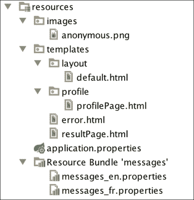

# 十五、文件上传及错误处理

在本章中，我们将使用户能够上传个人资料图片。我们还将看到如何在 SpringMVC 中处理错误。

# 上传文件

我们现在将让我们的用户可以上传个人资料图片。此将在稍后的配置文件页面中提供，但现在，我们将简化工作并在`profile/uploadPage.html`下的模板目录中创建一个新页面：

```java
<!DOCTYPE html>
<html xmlns:th="http://www.thymeleaf.org"
      xmlns:layout="http://www.ultraq.net.nz/thymeleaf/layout"
      layout:decorator="layout/default">
<head lang="en">
    <title>Profile Picture Upload</title>
</head>
<body>
<div class="row" layout:fragment="content">

    <h2 class="indigo-text center">Upload</h2>

    <form th:action="@{/upload}" method="post" enctype="multipart/form-data" class="col m8 s12 offset-m2">

        <div class="input-field col s6">
            <input type="file" id="file" name="file"/>
        </div>

        <div class="col s6 center">
            <button class="btn indigo waves-effect waves-light" type="submit" name="save" th:text="#{submit}">Submit
                <i class="mdi-content-send right"></i>
            </button>
        </div>
    </form>
</div>
</body>
</html>
```

除了表单上的`enctype`属性之外，没什么可看的。文件将通过`POST`方法发送到`upload`URL。我们现在将在`profile`包中`ProfileController`旁边创建相应的控制器：

```java
package masterSpringMvc.profile;

import org.apache.tomcat.util.http.fileupload.IOUtils;
import org.springframework.core.io.FileSystemResource;
import org.springframework.core.io.Resource;
import org.springframework.stereotype.Controller;
import org.springframework.web.bind.annotation.RequestMapping;
import org.springframework.web.bind.annotation.RequestMethod;
import org.springframework.web.multipart.MultipartFile;

import java.io.*;
import java.nio.file.Files;
import java.nio.file.Path;
import java.nio.file.Paths;

@Controller
public class PictureUploadController {
    public static final Resource PICTURES_DIR = new FileSystemResource("./pictures");

    @RequestMapping("upload")
    public String uploadPage() {
        return "profile/uploadPage";
    }

    @RequestMapping(value = "/upload", method = RequestMethod.POST)
    public String onUpload(MultipartFile file) throws IOException {
        String filename = file.getOriginalFilename();
        File tempFile = File.createTempFile("pic", getFileExtension(filename), PICTURES_DIR.getFile());

        try (InputStream in = file.getInputStream();
             OutputStream out = new FileOutputStream(tempFile)) {
            IOUtils.copy(in, out);
        }

        return "profile/uploadPage";
    }

    private static String getFileExtension(String name) {
        return name.substring(name.lastIndexOf("."));
    }
}
```

这段代码要做的第一件事是在`pictures`目录中创建一个临时文件，该文件可以在项目的根文件夹中找到；因此，请确保它存在。在 Java 中，临时文件只是在文件系统上获取唯一文件标识符的商品。由用户选择删除它。

在项目的根目录下创建一个 pictures 目录，并添加一个名为`.gitkeep`的空文件，以确保您可以在 Git 中提交它。

### 提示

**Git**中的空目录

Git 基于文件，无法提交空目录。常见的解决方法是在目录中提交一个空文件，如`.gitkeep`，以强制 Git 将其置于版本控制之下。

用户上传的文件将作为`MultipartFile`接口注入我们的控制器。此接口提供了几种方法来获取文件名、大小和内容。

我们在这里特别感兴趣的方法是`getInputStream()`。多亏了`IOUtils.copy`方法，我们将把这个流复制到`fileOutputStream`方法。将输入流写入输出流的代码非常枯燥，因此在类路径中包含 ApacheUTIL 非常方便（它是`tomcat-embedded-core.jar`文件的一部分）。

我们大量使用了非常酷的 Spring 和 Java 7 NIO 功能：

*   string 的 resource 类是一个实用程序类，它表示可以以不同方式找到的资源的抽象
*   即使出现异常，`try…with`块也会自动关闭我们的流，从而删除编写`finally`块的样板

使用上述代码，用户上传的任何文件都会复制到`pictures`目录中。

SpringBoot 中有一些属性可用于自定义文件上载。看一看`MultipartProperties`课。

最有趣的是：

*   `multipart.maxFileSize`：定义上传文件允许的最大文件大小。试图上传一个更大的会导致一个`MultipartException`类。默认值为`1Mb`。
*   `multipart.maxRequestSize`：定义多部分请求的最大大小。默认值为`10Mb`。

默认值对于我们的应用来说已经足够好了。上传几次后，我们的图片目录如下所示：


等待有人上传了一个 ZIP 文件！我简直不敢相信。我们最好在控制器中添加一些检查，以确保上传的文件是真实的图像：

```java
package masterSpringMvc.profile;

import org.apache.tomcat.util.http.fileupload.IOUtils;
import org.springframework.core.io.FileSystemResource;
import org.springframework.core.io.Resource;
import org.springframework.stereotype.Controller;
import org.springframework.web.bind.annotation.RequestMapping;
import org.springframework.web.bind.annotation.RequestMethod;
import org.springframework.web.multipart.MultipartFile;
import org.springframework.web.servlet.mvc.support.RedirectAttributes;

import java.io.*;

@Controller
public class PictureUploadController {
    public static final Resource PICTURES_DIR = new FileSystemResource("./pictures");

    @RequestMapping("upload")
    public String uploadPage() {
        return "profile/uploadPage";
    }

    @RequestMapping(value = "/upload", method = RequestMethod.POST)
    public String onUpload(MultipartFile file, RedirectAttributes redirectAttrs) throws IOException {

 if (file.isEmpty() || !isImage(file)) {
 redirectAttrs.addFlashAttribute("error", "Incorrect file. Please upload a picture.");
 return "redirect:/upload";
 }

        copyFileToPictures(file);

        return "profile/uploadPage";
    }

    private Resource copyFileToPictures(MultipartFile file) throws IOException {
        String fileExtension = getFileExtension(file.getOriginalFilename());
        File tempFile = File.createTempFile("pic", fileExtension, PICTURES_DIR.getFile());
        try (InputStream in = file.getInputStream();
             OutputStream out = new FileOutputStream(tempFile)) {

            IOUtils.copy(in, out);
        }
        return new FileSystemResource(tempFile);
    }

    private boolean isImage(MultipartFile file) {
 return file.getContentType().startsWith("image");
 }

    private static String getFileExtension(String name) {
        return name.substring(name.lastIndexOf("."));
    }
}
```

很简单！`getContentType()`方法返回文件的**多用途 Internet 邮件扩展名**（**MIME**类型）。它将是`image/png`、`image/jpg`等等。所以我们只需要检查 MIME 类型是否以“image”开头。

我们在表单中添加了一条错误消息，因此我们应该在网页中添加一些内容来显示它。将以下代码放在`uploadPage`标题下方：

```java
<div class="col s12 center red-text" th:text="${error}" th:if="${error}">
    Error during upload
</div>
```

下一次您尝试上载 ZIP 文件时，将出现错误！这显示在以下屏幕截图中：


## 向响应写入图像

上载的图像不是从静态目录提供的。我们需要采取特殊的措施将它们显示在我们的网页上。

让我们在表单上方的上传页面中添加以下行：

```java
<div class="col m8 s12 offset-m2">
    
</div>
```

这将尝试从控制器获取图像。让我们在`PictureUploadController`类中添加相应的方法：

```java
@RequestMapping(value = "/uploadedPicture")
public void getUploadedPicture(HttpServletResponse response) throws IOException {
    ClassPathResource classPathResource = new ClassPathResourceimg/anonymous.png");
    response.setHeader("Content-Type", URLConnection.guessContentTypeFromName(classPathResource.getFilename()));
    IOUtils.copy(classPathResource.getInputStream(), response.getOutputStream());
}
```

此代码将在`src/main/resourcimg/anonymous.png`目录中找到的图像直接写入响应！多么令人兴奋！

如果我们再次进入页面，将看到下图：


### 提示

我在 iconmonstr（[上找到了匿名用户图像 http://iconmonstr.com/user-icon](http://iconmonstr.com/user-icon) ），并将其下载为 128 x 128 PNG 文件。

## 管理上传属性

此时需要做的一件好事是允许通过`application.properties`文件配置上传目录和匿名用户映像的路径。

让我们在新创建的`config`包中创建一个`PicturesUploadProperties`类：

```java
package masterSpringMvc.config;

import org.springframework.boot.context.properties.ConfigurationProperties;
import org.springframework.core.io.DefaultResourceLoader;
import org.springframework.core.io.Resource;

import java.io.IOException;
@ConfigurationProperties(prefix = "upload.pictures")
public class PicturesUploadProperties {
    private Resource uploadPath;
    private Resource anonymousPicture;

    public Resource getAnonymousPicture() {
        return anonymousPicture;
    }

    public void setAnonymousPicture(String anonymousPicture) {
        this.anonymousPicture = new DefaultResourceLoader().getResource(anonymousPicture);
    }

    public Resource getUploadPath() {
        return uploadPath;
    }

    public void setUploadPath(String uploadPath) {
        this.uploadPath = new DefaultResourceLoader().getResource(uploadPath);
    }
}
```

在本课程中，我们使用弹簧靴`ConfigurationProperties`。这将告诉 Spring Boot 以类型安全的方式自动映射在类路径（默认情况下，`application.properties`文件）中找到的属性。

请注意，我们定义的 setter 使用'String'作为参数，但允许 getter 返回任何类型是最有用的。

我们现在需要将`PicturesUploadProperties`类添加到我们的配置中：

```java
@SpringBootApplication
@EnableConfigurationProperties({PictureUploadProperties.class})
public class MasterSpringMvc4Application extends WebMvcConfigurerAdapter {
  // code omitted
}
```

我们现在可以在`application.properties`文件中添加属性值：

```java
upload.pictures.uploadPath=file:./pictures
upload.pictures.anonymousPicture=classpatimg/anonymous.png
```

因为我们使用 Spring 的`DefaultResourceLoader`类，所以我们可以使用`file:`或`classpath:`等前缀来指定在哪里可以找到我们的资源。

这相当于创建一个`FileSystemResource`类或`ClassPathResource`类。

这种方法还有记录代码的优点。我们可以很容易地看到，图片目录将在应用根目录中找到，而匿名图片将在类路径中找到。

就这样。我们现在可以在控制器中使用我们的属性。以下是`PictureUploadController`类的相关部分：

```java
package masterSpringMvc.profile;

import masterSpringMvc.config.PictureUploadProperties;
import org.apache.tomcat.util.http.fileupload.IOUtils;
import org.springframework.beans.factory.annotation.Autowired;
import org.springframework.core.io.Resource;
import org.springframework.stereotype.Controller;
import org.springframework.web.bind.annotation.RequestMapping;
import org.springframework.web.bind.annotation.RequestMethod;
import org.springframework.web.multipart.MultipartFile;
import org.springframework.web.servlet.mvc.support.RedirectAttributes;

import javax.servlet.http.HttpServletResponse;
import java.io.*;
import java.net.URLConnection;

@Controller
public class PictureUploadController {
    private final Resource picturesDir;
 private final Resource anonymousPicture;

 @Autowired
 public PictureUploadController(PictureUploadProperties uploadProperties) {
 picturesDir = uploadProperties.getUploadPath();
 anonymousPicture = uploadProperties.getAnonymousPicture();
 }

    @RequestMapping(value = "/uploadedPicture")
    public void getUploadedPicture(HttpServletResponse response) throws IOException {
        response.setHeader("Content-Type", URLConnection.guessContentTypeFromName(anonymousPicture.getFilename()));
 IOUtils.copy(anonymousPicture.getInputStream(), response.getOutputStream());
    }

  private Resource copyFileToPictures(MultipartFile file) throws IOException {
       String fileExtension = getFileExtension(file.getOriginalFilename());
       File tempFile = File.createTempFile("pic", fileExtension, picturesDir.getFile());
       try (InputStream in = file.getInputStream();
            OutputStream out = new FileOutputStream(tempFile)) {

           IOUtils.copy(in, out);
       }
       return new FileSystemResource(tempFile);
   }    
// The rest of the code remains the same
}
```

此时，如果您再次启动应用，您将看到结果没有改变。匿名图片仍会显示，用户上传的图片仍会显示在项目根目录的`pictures`目录中。

## 显示上传的图片

现在显示用户的图片会很好，不是吗？为此，我们将向`PictureUploadController`类添加一个模型属性：

```java
@ModelAttribute("picturePath")
public Resource picturePath() {
  return anonymousPicture;
}
```

我们现在可以在为上传的图片提供服务时将其注入以检索其值：

```java
@RequestMapping(value = "/uploadedPicture")
public void getUploadedPicture(HttpServletResponse response, @ModelAttribute("picturePath") Path picturePath) throws IOException {
    response.setHeader("Content-Type", URLConnection.guessContentTypeFromName(picturePath.toString()));
    Files.copy(picturePath, response.getOutputStream());
}
```

`@ModelAttribute`注释是使用注释方法创建模型属性的便捷方法。然后可以将相同的注释注入控制器方法。有了这段代码，`picturePath`参数将在模型中可用，只要我们没有重定向到另一个页面。它的默认值是我们在属性中定义的匿名图片。

上传文件时需要更新此值。更新`onUpload`方法：

```java
@RequestMapping(value = "/upload", method = RequestMethod.POST)
public String onUpload(MultipartFile file, RedirectAttributes redirectAttrs, Model model) throws IOException {

    if (file.isEmpty() || !isImage(file)) {
        redirectAttrs.addFlashAttribute("error", "Incorrect file. Please upload a picture.");
        return "redirect:/upload";
    }

    Resource picturePath = copyFileToPictures(file);
 model.addAttribute("picturePath", picturePath);

    return "profile/uploadPage";
}
```

通过注入模型，我们可以在上传完成后更新`picturePath`参数。

现在，问题是我们的两种方法，`onUpload`和`getUploadedPicture`将在不同的请求中出现。不幸的是，模型属性将在每个属性之间重置。

这就是我们将`picturePath`参数定义为会话属性的原因。我们可以通过向控制器类添加另一个注释来实现这一点：

```java
@Controller
@SessionAttributes("picturePath")
public class PictureUploadController {
}
```

呸！仅仅为了处理一个简单的会话属性，就需要大量的注释。您将获得以下输出：


这种方法使代码组合变得非常简单。另外，我们没有直接使用`HttpServletRequest`或`HttpSession`。此外，我们的对象可以很容易地键入。

## 处理文件上传错误

我细心的读者肯定已经想到，我们的代码容易抛出两种异常：

*   `IOException`：如果将文件写入磁盘时发生错误，则会引发此错误。
*   `MultipartException`：如果上传文件时出错，则抛出此错误。例如，当超过最大文件大小时。

这将为我们提供一个很好的机会，让我们了解在 Spring 中处理异常的两种方法：

*   在控制器方法中本地使用`@ExceptionHandler`注释
*   使用在 Servlet 容器级别定义的全局异常处理程序

让我们在`PictureUploadController`类中添加`@ExceptionHandler`注释来处理`IOException`，方法如下：

```java
@ExceptionHandler(IOException.class)
public ModelAndView handleIOException(IOException exception) {
    ModelAndView modelAndView = new ModelAndView("profile/uploadPage");
    modelAndView.addObject("error", exception.getMessage());
    return modelAndView;
}
```

这是一个简单而强大的方法。每次控制器中抛出一个`IOException`时，都会调用此方法。

为了测试异常处理程序，因为让 Java IO 代码抛出异常可能很棘手，所以只需在测试期间替换`onUpload`方法体：

```java
@RequestMapping(value = "/upload", method = RequestMethod.POST)
public String onUpload(MultipartFile file, RedirectAttributes redirectAttrs, Model model) throws IOException {
    throw new IOException("Some message");
}
```

在更改之后，如果我们尝试上传图片，我们将在上传页面上看到此异常的错误消息：


现在我们来处理`MultipartException`。这需要在 Servlet 容器级别（即 Tomcat 级别）发生，因为该异常不是由控制器直接引发的。

我们需要在配置中添加一个新的`EmbeddedServletContainerCustomizer`bean。将此方法添加到`WebConfiguration`类：

```java
@Bean
public EmbeddedServletContainerCustomizer containerCustomizer() {
    EmbeddedServletContainerCustomizer 
embeddedServletContainerCustomizer = new EmbeddedServletContainerCustomizer() {
        @Override
        public void customize(ConfigurableEmbeddedServletContainer container) {
            container.addErrorPages(new ErrorPage(MultipartException.class, "/uploadError"));
        }
    };
    return embeddedServletContainerCustomizer;
}
```

这有点冗长。注意，`EmbeddedServletContainerCustomizer`是一个包含单个方法的接口；因此，可以用 lambda 表达式替换：

```java
@Bean
public EmbeddedServletContainerCustomizer containerCustomizer() {
    EmbeddedServletContainerCustomizer embeddedServletContainerCustomizer
            = container -> container.addErrorPages(new ErrorPage(MultipartException.class, "/uploadError"));
    return embeddedServletContainerCustomizer;
}
```

那么，让我们写以下内容：

```java
@Bean
public EmbeddedServletContainerCustomizer containerCustomizer() {
    return container -> container.addErrorPages(new ErrorPage(MultipartException.class, "/uploadError"));
}
```

这段代码创建了一个新的错误页面，当`MultipartException`发生时将调用该页面。它还可以映射到 HTTP 状态。`EmbeddedServletContainerCustomizer`接口具有许多其他特性，允许定制运行应用的 Servlet 容器。访问[http://docs.spring.io/spring-boot/docs/current/reference/html/boot-features-developing-web-applications.html#boot-功能定制嵌入式容器](http://docs.spring.io/spring-boot/docs/current/reference/html/boot-features-developing-web-applications.html#boot-features-customizing-embedded-containers)了解更多信息。

我们现在需要在`PictureUploadController`类中处理这个`uploadError`URL：

```java
@RequestMapping("uploadError")
public ModelAndView onUploadError(HttpServletRequest request) {
    ModelAndView modelAndView = new ModelAndView("uploadPage");
    modelAndView.addObject("error", request.getAttribute(WebUtils.ERROR_MESSAGE_ATTRIBUTE));
    return modelAndView;
}
```

Servlet 环境中定义的错误页面包含许多有助于调试错误的有趣属性：

<colgroup><col> <col></colgroup> 
| 

属性

 | 

描述

 |
| --- | --- |
| `javax.servlet.error.status_code` | 这是错误的 HTTP 状态代码。 |
| `javax.servlet.error.exception_type` | 这是异常类。 |
| `javax.servlet.error.message` | 这是引发异常的消息。 |
| `javax.servlet.error.request_uri` | 这是发生异常的 URI。 |
| `javax.servlet.error.exception` | 这是实际的例外。 |
| `javax.servlet.error.servlet_name` | 这是捕获异常的 Servlet 的名称。 |

所有这些属性都可以在 SpringWeb 的`WebUtils`类上方便地访问。

如果有人试图上传太大的文件，他们会得到一条非常清晰的错误信息。

您现在可以通过上传一个非常大的文件（>1Mb）或将`multipart.maxFileSize`属性设置为较低的值（例如 1kb）来测试错误是否得到正确处理：


# 翻译错误信息

对于开发人员来说，看到应用抛出的异常是非常好的。然而，对于我们的用户来说，它们没有什么价值。因此，我们将翻译它们。为此，我们必须将应用的`MessageSource`类注入控制器的构造函数中：

```java
private final MessageSource messageSource;

@Autowired
public PictureUploadController(PictureUploadProperties uploadProperties, MessageSource messageSource) {
    picturesDir = uploadProperties.getUploadPath();
    anonymousPicture = uploadProperties.getAnonymousPicture();
    this.messageSource = messageSource;
}
```

现在，我们可以从消息包中检索消息：

```java
@ExceptionHandler(IOException.class)
public ModelAndView handleIOException(Locale locale) {
    ModelAndView modelAndView = new ModelAndView("profile/uploadPage");
    modelAndView.addObject("error", messageSource.getMessage("upload.io.exception", null, locale));
    return modelAndView;
}

@RequestMapping("uploadError")
public ModelAndView onUploadError(Locale locale) {
    ModelAndView modelAndView = new ModelAndView("profile/uploadPage");
    modelAndView.addObject("error", messageSource.getMessage("upload.file.too.big", null, locale));
    return modelAndView;
}
```

以下是英文留言：

```java
upload.io.exception=An error occurred while uploading the file. Please try again.
upload.file.too.big=Your file is too big.
```

现在，法国的：

```java
upload.io.exception=Une erreur est survenue lors de l'envoi du fichier. Veuillez réessayer.
upload.file.too.big=Votre fichier est trop gros.
```

# 在会话中放置配置文件

我们想要的下一件事是将配置文件存储在会话中，这样它就不会在每次进入配置文件页面时被重置。这显然会让一些用户感到厌烦，我们必须解决这个问题。

### 提示

**HTTP 会话**是在请求之间存储信息的一种方式。HTTP 是一种无状态协议，这意味着无法将来自同一用户的两个请求关联起来。大多数 Servlet 容器所做的是将一个名为`JSESSIONID`的 cookie 关联到每个用户。此 cookie 将在请求头中传输，并允许您在映射中存储任意对象，这是一种称为`HttpSession`的抽象。这种会话通常在用户关闭或切换 web 浏览器时或在预定义的不活动期后结束。

我们刚刚看到了一个使用`@SessionAttributes`注释将对象放入会话的方法。这在一个控制器内运行良好，但当数据分布在多个控制器上时，很难共享。我们必须依靠一个字符串来解析属性的名称，这是很难重构的。出于同样的原因，我们不想直接操纵`HttpSession`。另一个不鼓励直接使用会话的论点是，对依赖会话的控制器进行单元测试有多困难。

在使用 Spring 的会话中保存内容时，还有另一种流行的方法：用`@Scope("session")`注释 bean。

然后，您将能够将会话 bean 注入控制器和其他 Spring 组件中，以设置或从中检索值。

让我们在`profile`包中创建一个`UserProfileSession`类：

```java
package masterSpringMvc.profile;

import org.springframework.context.annotation.Scope;
import org.springframework.context.annotation.ScopedProxyMode;
import org.springframework.stereotype.Component;
import java.io.Serializable;
import java.time.LocalDate;
import java.util.ArrayList;
import java.util.List;

@Component
@Scope(value = "session", proxyMode = ScopedProxyMode.TARGET_CLASS)
public class UserProfileSession implements Serializable {
    private String twitterHandle;
    private String email;
    private LocalDate birthDate;
    private List<String> tastes = new ArrayList<>();

    public void saveForm(ProfileForm profileForm) {
        this.twitterHandle = profileForm.getTwitterHandle();
        this.email = profileForm.getEmail();
        this.birthDate = profileForm.getBirthDate();
        this.tastes = profileForm.getTastes();
    }

    public ProfileForm toForm() {
        ProfileForm profileForm = new ProfileForm();
        profileForm.setTwitterHandle(twitterHandle);
        profileForm.setEmail(email);
        profileForm.setBirthDate(birthDate);
        profileForm.setTastes(tastes);
        return profileForm;
    }
}
```

我们方便地提供了一种从`ProfileForm`对象转换为`ProfileForm`对象的方法。这将帮助我们从`ProfileController`构造函数中存储和检索表单数据。我们需要将`UserProfileSession`变量注入控制器的构造函数中，并将其存储为字段。我们还需要将`ProfileForm`作为一个模型属性公开，这将删除在`displayProfile`方法中注入它的需要。最后，我们可以在验证后保存配置文件：

```java
@Controller
public class ProfileController {

    private UserProfileSession userProfileSession;
    @Autowired
    public ProfileController(UserProfileSession userProfileSession) {
        this.userProfileSession = userProfileSession;
    }

    @ModelAttribute
    public ProfileForm getProfileForm() {
        return userProfileSession.toForm();
    }

    @RequestMapping(value = "/profile", params = {"save"}, method = RequestMethod.POST)
    public String saveProfile(@Valid ProfileForm profileForm, BindingResult bindingResult) {
        if (bindingResult.hasErrors()) {
            return "profile/profilePage";
        }
        userProfileSession.saveForm(profileForm);
        return "redirect:/profile";
    }

    // the rest of the code is unchanged
}
```

这就是使用 SpringMVC 在会话中保存数据所需的全部功能。

现在，如果您完成配置文件表单并刷新页面，数据将在请求之间保持。

在进入下一章之前，我想详细介绍一下我们刚才使用的几个概念。

第一个是构造函数的注入。`ProfileController`构造函数用`@Autowired`注释，这意味着 Spring 将在实例化 bean 之前从应用上下文解析构造函数参数。另一种选择是使用现场注入，它的详细程度稍低一些：

```java
@Controller
public class ProfileController {

    @Autowired
    private UserProfileSession userProfileSession;
}
```

构造函数注入可以说更好，因为如果我们离开`spring-test`框架，它会使控制器的单元测试变得更容易，并且它会使 bean 的依赖关系更加明确。

有关字段注入和构造函数注入的详细讨论，请参阅 Oliver Gierke 在[上发表的优秀博客文章 http://olivergierke.de/2013/11/why-field-injection-is-evil/](http://olivergierke.de/2013/11/why-field-injection-is-evil/) 。

另一件可能需要澄清的事情是`Scope`注释上的`proxyMode`参数：

```java
@Scope(value = "session", proxyMode = ScopedProxyMode.TARGET_CLASS)
```

如果我们不计算默认参数，Spring 有三个可用的`proxyMode`参数：

*   `TARGET_CLASS`：使用 CGI 代理
*   `INTERFACES`：这将创建一个 JDK 代理
*   `NO`：这不会创建任何代理

代理的优势通常在向长寿命组件（如单例组件）中注入某些内容时发挥作用。因为注入只发生一次，所以在创建 bean 时，对注入 bean 的后续调用可能不会反映其实际状态。

在我们的例子中，会话 bean 的实际状态存储在会话中，而不是直接存储在 bean 上。这就解释了为什么 Spring 必须创建一个代理：它需要拦截对我们 bean 方法的调用，并监听它的突变。通过这种方式，bean 的状态可以透明地存储并从底层 HTTP 会话中检索。

对于会话 bean，我们被迫使用代理模式。CGI 代理将检测您的字节码并处理任何类，而 JDK 方法可能更轻量级，但需要您实现一个接口。

最后，我们让`UserProfileSession`bean 实现`Serializable`接口。这并不是严格要求的，因为 HTTP 会话可以在内存中存储任意对象，但使会话中的对象可序列化确实是一个很好的做法。

事实上，我们可能会改变会话的持久化方式。事实上，我们将会话存储在[第 7 章](19.html#aid-5IAP61 "Chapter 7. Optimizing Your Requests")*优化您的请求*中的 Redis 数据库中，其中 Redis 必须处理`Serializable`对象。最好考虑通用数据存储的会话。我们必须提供一种从该存储系统写入和读取对象的方法。

为了使序列化在 bean 上正常工作，我们还需要它的每个字段都是可序列化的。在我们的例子中，字符串和日期是可序列化的，所以我们可以开始了。

# 自定义错误页面

Spring Boot 允许您定义自己的错误视图，而不是我们前面看到的白标签错误页面。它必须具有名称`error`，其目的是处理所有异常。默认的`BasicErrorController`类将公开许多有用的模型属性，您可以在此页面上显示这些属性。

让我们在`src/main/resources/templates`中创建一个自定义错误页面。我们称之为`error.html`：

```java
<!DOCTYPE html>
<html xmlns:th="http://www.thymeleaf.org">
<head lang="en">
    <meta charset="UTF-8"/>
    <title th:text="${status}">404</title>

    <link href="/webjars/materializecss/0.96.0/css/materialize.css" type="text/css" rel="stylesheet"
          media="screen,projection"/>
</head>
<body>
<div class="row">
    <h1 class="indigo-text center" th:text="${error}">Not found</h1>

    <p class="col s12 center" th:text="${message}">
        This page is not available
    </p>
</div>
</body>
</html>
```

现在，如果我们导航到应用未处理的 URL，我们将看到自定义错误页面：


处理错误的更高级的选项是定义您自己的`ErrorController`类实现，该类是负责在全局级别处理所有异常的控制器。看看`ErrorMvcAutoConfiguration`类和`BasicErrorController`类，这是默认的实现。

# 带有矩阵变量的 URL 映射

我们现在知道用户感兴趣的是什么。这将是一个好主意，以改善我们的 Tweet 控制器，使其能够从关键字列表中搜索。

在 URL 中传递键值对的一种有趣的方法是使用矩阵变量。它与请求参数非常相似。考虑下面的代码：

```java
someUrl/param?var1=value1&var2=value2
```

矩阵变量理解以下内容，而不是前面的参数：

```java
someUrl/param;var1=value1;var2=value2
```

它们还允许每个参数成为一个列表：

```java
someUrl/param;var1=value1,value2;var2=value3,value4
```

矩阵变量可以映射到控制器内的不同对象类型：

*   `Map<String, List<?>>`：处理多个变量和多个值
*   `Map<String, ?>`：处理每个变量只有一个值的情况
*   `List<?>`：如果我们对名称可配置的单个变量感兴趣，则使用此选项

在我们的案例中，我们希望处理如下事项：

```java
http://localhost:8080/search/popular;keywords=scala,java
```

第一个参数`popular`是 Twitter 搜索 API 已知的结果类型。它可以采用以下值：`mixed`、`recent`或`popular`。

我们 URL 的其余部分是一个关键字列表。因此，我们将把它们映射到一个简单的`List<String>`对象。

默认情况下，SpringMVC 删除 URL 中分号后面的每个字符。要在应用中启用矩阵变量，我们需要做的第一件事就是关闭此行为。

让我们在`WebConfiguration`类中添加以下代码：

```java
@Override
public void configurePathMatch(PathMatchConfigurer configurer) {
    UrlPathHelper urlPathHelper = new UrlPathHelper();
    urlPathHelper.setRemoveSemicolonContent(false);
    configurer.setUrlPathHelper(urlPathHelper);
}
```

让我们在`search`包中创建一个新的控制器，我们称之为`SearchController`。其作用是处理以下请求：

```java
package masterSpringMvc.search;

import org.springframework.beans.factory.annotation.Autowired;
import org.springframework.social.twitter.api.Tweet;
import org.springframework.stereotype.Controller;
import org.springframework.web.bind.annotation.MatrixVariable;
import org.springframework.web.bind.annotation.PathVariable;
import org.springframework.web.bind.annotation.RequestMapping;
import org.springframework.web.servlet.ModelAndView;

import java.util.List;

@Controller
public class SearchController {
    private SearchService searchService;
    @Autowired
    public SearchController(SearchService searchService) {
        this.searchService = searchService;
    }

    @RequestMapping("/search/{searchType}")
    public ModelAndView search(@PathVariable String searchType, @MatrixVariable List<String> keywords) {
        List<Tweet> tweets = searchService.search(searchType, keywords);
        ModelAndView modelAndView = new ModelAndView("resultPage");
        modelAndView.addObject("tweets", tweets);
        modelAndView.addObject("search", String.join(",", keywords));
        return modelAndView;
    }
}
```

如您所见，我们可以重用现有的结果页面来显示推文。我们还希望将搜索委托给另一个名为`SearchService`的类。我们将在与`SearchController`相同的包中创建此服务：

```java
package masterSpringMvc.search;

import org.springframework.beans.factory.annotation.Autowired;
import org.springframework.social.twitter.api.Tweet;
import org.springframework.social.twitter.api.Twitter;
import org.springframework.stereotype.Service;
import java.util.List;

@Service
public class SearchService {
    private Twitter twitter;

    @Autowired
    public SearchService(Twitter twitter) {
        this.twitter = twitter;
    }

    public List<Tweet> search(String searchType, List<String> keywords) {
        return null;
    }
}
```

现在，我们需要实现`search()`方法。

`twitter.searchOperations().search(params)`上可访问的搜索操作将`searchParameters`作为高级搜索的参数。这个对象允许我们对十几个标准进行搜索。我们对`query`、`resultType`和`count`属性感兴趣。

首先，我们需要使用`searchType`路径变量创建一个`ResultType`构造函数。`ResultType`是一个枚举，因此我们可以迭代它的不同值，找到一个与输入匹配的值，忽略大小写：

```java
private SearchParameters.ResultType getResultType(String searchType) {
    for (SearchParameters.ResultType knownType : SearchParameters.ResultType.values()) {
        if (knownType.name().equalsIgnoreCase(searchType)) {
            return knownType;
        }
    }
    return SearchParameters.ResultType.RECENT;
}
```

我们现在可以使用以下方法创建一个`SearchParameters`构造函数：

```java
private SearchParameters createSearchParam(String searchType, String taste) {

    SearchParameters.ResultType resultType = getResultType(searchType);
    SearchParameters searchParameters = new SearchParameters(taste);
    searchParameters.resultType(resultType);
    searchParameters.count(3);
    return searchParameters;
}
```

现在，创建一个`SearchParameters`构造函数列表就像执行一个映射操作一样简单（获取一个关键字列表并为每个关键字返回一个`SearchParameters`构造函数）：

```java
List<SearchParameters> searches = keywords.stream()
        .map(taste -> createSearchParam(searchType, taste))
        .collect(Collectors.toList());
```

现在，我们要获取每个`SearchParameters`构造函数的 tweet。你可能会想到这样的事情：

```java
List<Tweet> tweets = searches.stream()
        .map(params -> twitter.searchOperations().search(params))
        .map(searchResults -> searchResults.getTweets())
        .collect(Collectors.toList());
```

然而，如果你仔细想想，这将返回一个 tweet 列表。我们想要的是将所有的推文平铺成一个简单的列表。事实证明，调用`map`然后将结果展平是一个称为`flatMap`的操作。所以我们可以写：

```java
List<Tweet> tweets = searches.stream()
        .map(params -> twitter.searchOperations().search(params))
        .flatMap(searchResults -> searchResults.getTweets().stream())
        .collect(Collectors.toList());
```

以流为参数的`flatMap`函数的语法起初有点难以理解。让我向您展示`SearchService`类的全部代码，这样我们可以后退一步：

```java
package masterSpringMvc.search;

import org.springframework.beans.factory.annotation.Autowired;
import org.springframework.social.twitter.api.SearchParameters;
import org.springframework.social.twitter.api.Tweet;
import org.springframework.social.twitter.api.Twitter;
import org.springframework.stereotype.Service;

import java.util.List;
import java.util.stream.Collectors;

@Service
public class SearchService {
    private Twitter twitter;

    @Autowired
    public SearchService(Twitter twitter) {
        this.twitter = twitter;
    }

    public List<Tweet> search(String searchType, List<String> keywords) {
        List<SearchParameters> searches = keywords.stream()
                .map(taste -> createSearchParam(searchType, taste))
                .collect(Collectors.toList());

        List<Tweet> results = searches.stream()
                .map(params -> twitter.searchOperations().search(params))
                .flatMap(searchResults -> searchResults.getTweets().stream())
                .collect(Collectors.toList());

        return results;
    }

    private SearchParameters.ResultType getResultType(String searchType) {
        for (SearchParameters.ResultType knownType : SearchParameters.ResultType.values()) {
            if (knownType.name().equalsIgnoreCase(searchType)) {
                return knownType;
            }
        }
        return SearchParameters.ResultType.RECENT;
    }

    private SearchParameters createSearchParam(String searchType, String taste) {
        SearchParameters.ResultType resultType = getResultType(searchType);
        SearchParameters searchParameters = new SearchParameters(taste);
        searchParameters.resultType(resultType);
        searchParameters.count(3);
        return searchParameters;
    }
}
```

现在，如果我们导航到`http://localhost:8080/search/mixed;keywords=scala,java`，我们会得到预期的结果。搜索 Scala 关键字，然后搜索 Java：


# 拼凑

现在所有的东西都是分开工作的，是时候把它们组装起来了。我们将分三步进行：

1.  将上传表单移动到个人资料页面，移除旧的上传页面。
2.  更改配置文件页面上的提交按钮以直接触发味觉搜索。
3.  更改应用的主页。它应该立即显示符合用户口味的搜索结果。如果它们不可用，请转到配置文件页面。

我鼓励你试着自己做这件事。在这过程中，你会遇到非常容易处理的问题，但你应该有足够的知识自己解决它们。我相信你。

好吧，既然你已经完成了工作（你有，不是吗？），让我们看看我的解决方案。

第一步是删除旧的`uploadPage`标题。不要回头看，只管去做。

下一步，在`profilePage`标题下方放置以下几行：

```java
<div class="row">

    <div class="col m8 s12 offset-m2">
        
    </div>

    <div class="col s12 center red-text" th:text="${error}" th:if="${error}">
        Error during upload
    </div>

    <form th:action="@{/profile}" method="post" enctype="multipart/form-data" class="col m8 s12 offset-m2">

        <div class="input-field col s6">
            <input type="file" id="file" name="file"/>
        </div>

        <div class="col s6 center">
            <button class="btn indigo waves-effect waves-light" type="submit" name="upload" th:text="#{upload}">Upload
                <i class="mdi-content-send right"></i>
            </button>
        </div>
    </form>
</div>
```

与后期`uploadPage`的内容非常相似。我们刚刚删除了标题并更改了提交按钮的标签。将相应的翻译添加到 bundle 中。

英文：

```java
upload=Upload
```

法语：

```java
Upload=Envoyer
```

我们还将提交按钮的名称更改为`upload`。这将帮助我们在控制器端识别此操作。

现在，如果我们尝试上传图片，它会将我们重定向到旧的上传页面。我们需要在`PictureUploadController`类的`onUpload`方法中解决这个问题：

```java
@RequestMapping(value = "/profile", params = {"upload"}, method = RequestMethod.POST)
public String onUpload(@RequestParam MultipartFile file, RedirectAttributes redirectAttrs) throws IOException {

    if (file.isEmpty() || !isImage(file)) {
        redirectAttrs.addFlashAttribute("error", "Incorrect file. Please upload a picture.");
        return "redirect:/profile";
    }

    Resource picturePath = copyFileToPictures(file);
    userProfileSession.setPicturePath(picturePath);

    return "redirect:profile";
}
```

注意，我们更改了处理帖子的 URL。现在是`/profile`而不是`/upload`。当`GET`和`POST`请求具有相同的 URL 时，表单处理会简单得多，并且会为我们节省很多麻烦，尤其是在处理异常时。这样，我们就不必在发生错误后重定向用户。

我们还删除了模型属性`picturePath`。因为我们现在有一个 bean 代表会话中的用户，`UserProfileSession`，所以我们决定将它添加到那里。我们为`UserProfileSession`类以及相关的 getter 和 setter 添加了`picturePath`属性。

别忘了注入`UserProfileSession`类，并将其作为`PictureUploadController`类中的字段提供。

记住，与资源不同，会话 bean 的所有属性都必须是可序列化的。因此，我们需要以不同的方式存储它。URL 类似乎非常适合。它是可序列化的，并且很容易从具有`UrlResource`类的 URL 创建资源：

```java
@Component
@Scope(value = "session", proxyMode = ScopedProxyMode.TARGET_CLASS)
public class UserProfileSession implements Serializable {
    private URL picturePath;

    public void setPicturePath(Resource picturePath) throws IOException {
        this.picturePath = picturePath.getURL();
    }

    public Resource getPicturePath() {
        return picturePath == null ? null : new UrlResource(picturePath);
    }
}
```

我必须做的最后一件事是在出错后将`profileForm`作为模型属性提供。这是因为`profilePage`在渲染时需要它。

综上所述，以下是`PictureUploadController`类的最终版本：

```java
package masterSpringMvc.profile;

import masterSpringMvc.config.PictureUploadProperties;
import org.apache.tomcat.util.http.fileupload.IOUtils;
import org.springframework.beans.factory.annotation.Autowired;
import org.springframework.context.MessageSource;
import org.springframework.core.io.FileSystemResource;
import org.springframework.core.io.Resource;
import org.springframework.stereotype.Controller;
import org.springframework.ui.Model;
import org.springframework.web.bind.annotation.*;
import org.springframework.web.multipart.MultipartFile;
import org.springframework.web.servlet.ModelAndView;
import org.springframework.web.servlet.mvc.support.RedirectAttributes;

import javax.servlet.http.HttpServletResponse;
import java.io.*;
import java.net.URLConnection;
import java.util.Locale;

@Controller
public class PictureUploadController {
    private final Resource picturesDir;
    private final Resource anonymousPicture;
    private final MessageSource messageSource;
    private final UserProfileSession userProfileSession;

    @Autowired
    public PictureUploadController(PictureUploadProperties uploadProperties,
                                   MessageSource messageSource,
                                   UserProfileSession userProfileSession) {
        picturesDir = uploadProperties.getUploadPath();
        anonymousPicture = uploadProperties.getAnonymousPicture();
        this.messageSource = messageSource;
        this.userProfileSession = userProfileSession;
    }

    @RequestMapping(value = "/uploadedPicture")
    public void getUploadedPicture(HttpServletResponse response) throws IOException {
        Resource picturePath = userProfileSession.getPicturePath();
        if (picturePath == null) {
            picturePath = anonymousPicture;
        }
        response.setHeader("Content-Type", URLConnection.guessContentTypeFromName(picturePath.getFilename()));
        IOUtils.copy(picturePath.getInputStream(), response.getOutputStream());
    }

    @RequestMapping(value = "/profile", params = {"upload"}, method = RequestMethod.POST)
    public String onUpload(@RequestParam MultipartFile file, RedirectAttributes redirectAttrs) throws IOException {

        if (file.isEmpty() || !isImage(file)) {
            redirectAttrs.addFlashAttribute("error", "Incorrect file. Please upload a picture.");
            return "redirect:/profile";
        }

        Resource picturePath = copyFileToPictures(file);
        userProfileSession.setPicturePath(picturePath);

        return "redirect:profile";
    }

    private Resource copyFileToPictures(MultipartFile file) throws IOException {
        String fileExtension = getFileExtension(file.getOriginalFilename());
        File tempFile = File.createTempFile("pic", fileExtension, picturesDir.getFile());
        try (InputStream in = file.getInputStream();
             OutputStream out = new FileOutputStream(tempFile)) {

            IOUtils.copy(in, out);
        }
        return new FileSystemResource(tempFile);
    }

    @ExceptionHandler(IOException.class)
    public ModelAndView handleIOException(Locale locale) {
        ModelAndView modelAndView = new ModelAndView("profile/profilePage");
        modelAndView.addObject("error", messageSource.getMessage("upload.io.exception", null, locale));
        modelAndView.addObject("profileForm", userProfileSession.toForm());
        return modelAndView;
    }

    @RequestMapping("uploadError")
    public ModelAndView onUploadError(Locale locale) {
        ModelAndView modelAndView = new ModelAndView("profile/profilePage");
        modelAndView.addObject("error", messageSource.getMessage("upload.file.too.big", null, locale));
        modelAndView.addObject("profileForm", userProfileSession.toForm());
        return modelAndView;
    }

    private boolean isImage(MultipartFile file) {
        return file.getContentType().startsWith("image");
    }

    private static String getFileExtension(String name) {
        return name.substring(name.lastIndexOf("."));
    }
}
```

所以，现在我们可以进入个人资料页面，上传我们的图片并提供个人信息，如下图所示：


现在，让我们在配置文件完成后将用户重定向到其搜索。为此，我们需要修改`ProfileController`类中的`saveProfile`方法：

```java
@RequestMapping(value = "/profile", params = {"save"}, method = RequestMethod.POST)
public String saveProfile(@Valid ProfileForm profileForm, BindingResult bindingResult) {
    if (bindingResult.hasErrors()) {
        return "profile/profilePage";
    }
    userProfileSession.saveForm(profileForm);
    return "redirect:/search/mixed;keywords=" + String.join(",", profileForm.getTastes());
}
```

现在我们可以从我们的个人资料中搜索推文，我们不需要以前制作的`searchPage`或`TweetController`。只需删除`searchPage.html`页面和`TweetController`。

最后，我们可以修改我们的主页，这样如果我们已经完成了我们的个人资料，它就会将我们重定向到符合我们口味的搜索。

让我们在控制器包中创建一个新控制器。它负责将到达我们网站根目录的用户重定向到他们的个人资料（如果不完整）或`resultPage`，如果他们的口味可用：

```java
package masterSpringMvc.controller;

import masterSpringMvc.profile.UserProfileSession;
import org.springframework.beans.factory.annotation.Autowired;
import org.springframework.stereotype.Controller;
import org.springframework.web.bind.annotation.RequestMapping;

import java.util.List;

@Controller
public class HomeController {
    private UserProfileSession userProfileSession;

    @Autowired
    public HomeController(UserProfileSession userProfileSession) {
        this.userProfileSession = userProfileSession;
    }

    @RequestMapping("/")
    public String home() {
        List<String> tastes = userProfileSession.getTastes();
        if (tastes.isEmpty()) {
            return "redirect:/profile";
        }
        return "redirect:/search/mixed;keywords=" + String.join(",", tastes);
    }
}
```

# 检查点

在本章中，我们添加了两个控制器，`PictureUploadController`负责将上传的文件写入磁盘并处理上传错误，以及`SearchController`可以从带有矩阵参数的关键字列表中搜索推文。

然后，该控制器将搜索委托给一个新服务`SearchService`。

我们删除了旧的`TweetController`。

我们创建了一个会话 bean，`UserProfileSession`，用于存储有关用户的信息。

最后，我们向`WebConfiguration`添加了两个内容。我们为 Servlet 容器添加了错误页面，并支持矩阵变量。


在参考资料方面，我们添加了一张表示匿名用户的图片和一个静态页面来处理错误。我们将文件上传添加到`profilePage`中，并删除了旧的`searchPage`。



# 总结

在本章中，我们讨论了文件上载和错误处理。上传文件并不复杂。然而，一个重大的设计决策是如何处理上传的文件。我们本可以将图片存储在数据库中，但我们选择将其写入磁盘，并在会话中保存每个用户图片的位置。

我们看到了在控制器级别和 servlet 容器级别处理异常的典型方法。有关 Spring MVC 错误处理的其他资源，请参阅位于[的博客文章 https://spring.io/blog/2013/11/01/exception-handling-in-spring-mvc](https://spring.io/blog/2013/11/01/exception-handling-in-spring-mvc) 。

我们的应用看起来已经相当不错了，但是我们必须编写的代码量非常合理。

请继续关注下一章，我们将看到 SpringMVC 也是构建 REST 应用的强大框架。