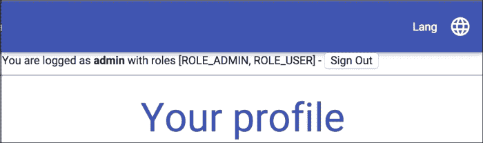
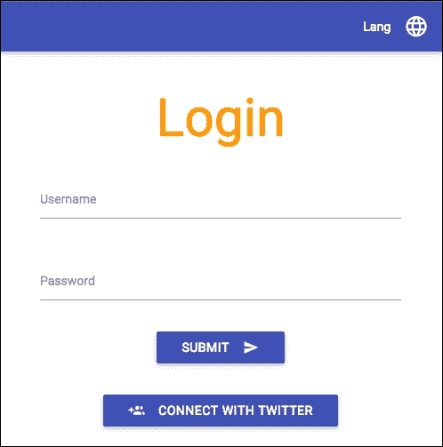
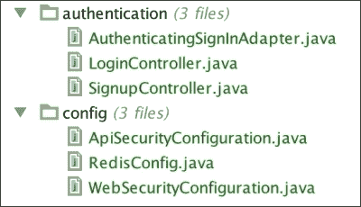

# 十七、保护您的应用

在本章中，我们将学习如何保护我们的 web 应用，以及如何应对现代分布式 web 应用的安全挑战。

本章将分为五个部分：

*   首先，我们将在几分钟内设置基本的 HTTP 身份验证
*   然后，我们将为网页设计基于表单的身份验证，保留 RESTful API 的基本身份验证
*   我们将允许用户通过 Twitter OAuth API 注册
*   然后，我们将利用 Spring 会话来确保我们的应用可以使用分布式会话机制进行扩展
*   最后，我们将配置 Tomcat 通过 SSL 使用安全连接

# 基本认证

最简单的可能的身份验证机制是基本身份验证（[http://en.wikipedia.org/wiki/Basic_access_authentication](http://en.wikipedia.org/wiki/Basic_access_authentication) 。简而言之，如果没有用户名和密码，我们的页面将无法使用。

我们的服务器将通过发送`401 Not Authorized`HTTP 状态码并生成`WWW-Authenticate`头来指示我们的资源是安全的。

要成功通过安全检查，客户端必须发送一个包含`Basic`值的`Authorization`头，后跟`user:password`字符串的 64 进制编码。浏览器窗口将提示用户输入用户名和密码，如果身份验证成功，将授予用户访问安全页面的权限。

让我们将 Spring 安全性添加到我们的依赖项中：

```java
compile 'org.springframework.boot:spring-boot-starter-security'
```

重新启动应用并导航到应用中的任何 URL。系统将提示您输入用户名和密码：


如果您未能进行身份验证，您将看到抛出一个`401`错误。默认用户名为`user`。每次启动应用时，将随机生成正确的身份验证密码，并显示在服务器日志中：

```
Using default security password: 13212bb6-8583-4080-b790-103408c93115

```

默认情况下，Spring Security 保护除少数经典路由（如`/css/`、`/js/`img/`和`**/favicon.ico`之外的所有资源。

如果要配置默认凭据，可以将以下属性添加到`application.properties`文件中：

```
security.user.name=admin
security.user.password=secret
```

## 授权用户

在我们的应用中只有一个用户不允许细粒度安全性。如果我们想要更多地控制用户凭证，我们可以在`config`包中添加以下`SecurityConfiguration`类：

```
package masterSpringMvc.config;

import org.springframework.beans.factory.annotation.Autowired;
import org.springframework.context.annotation.Configuration;
import org.springframework.security.config.annotation.authentication.builders.AuthenticationManagerBuilder;
import org.springframework.security.config.annotation.method.configuration.EnableGlobalMethodSecurity;
import org.springframework.security.config.annotation.web.configuration.WebSecurityConfigurerAdapter;

@Configuration
@EnableGlobalMethodSecurity(securedEnabled = true)
public class SecurityConfiguration extends WebSecurityConfigurerAdapter {

    @Autowired
    public void configureAuth(AuthenticationManagerBuilder auth)
            throws Exception {
        auth.inMemoryAuthentication()
                .withUser("user").password("user").roles("USER").and()
                .withUser("admin").password("admin").roles("USER", "ADMIN");
    }
}
```

这个片段将建立一个内存系统，其中包含我们应用的用户及其角色。它将覆盖先前在应用属性中定义的安全名称和密码。

`@EnableGlobalMethodSecurity`注释允许我们对应用的方法和类进行注释，以定义它们的安全级别。

例如，假设只有应用的管理员才能访问用户 API。在这种情况下，我们只需将`@Secured`注释添加到我们的资源中，以便只允许访问管理员角色：

```
@RestController
@RequestMapping("/api")
@Secured("ROLE_ADMIN")
public class UserApiController {
  // ... code omitted
}
```

通过使用`-a`开关使用基本身份验证和`-p=h`开关，我们可以很容易地用 httpie 测试这一点，该开关将只显示响应头。

让我们对一个没有管理员配置文件的用户尝试此操作：

```
> http GET 'http://localhost:8080/api/users' -a user:user -p=h
HTTP/1.1 403 Forbidden
Cache-Control: no-cache, no-store, max-age=0, must-revalidate
Content-Type: application/json;charset=UTF-8
Date: Sat, 23 May 2015 17:40:09 GMT
Expires: 0
Pragma: no-cache
Server: Apache-Coyote/1.1
Set-Cookie: JSESSIONID=2D4761C092EDE9A4DB91FA1CAA16C59B; Path=/; HttpOnly
Transfer-Encoding: chunked
X-Content-Type-Options: nosniff
X-Frame-Options: DENY
X-XSS-Protection: 1; mode=block

```

现在，与管理员：

```
> http GET 'http://localhost:8080/api/users' -a admin:admin -p=h
HTTP/1.1 200 OK
Cache-Control: no-cache, no-store, max-age=0, must-revalidate
Content-Type: application/json;charset=UTF-8
Date: Sat, 23 May 2015 17:42:58 GMT
Expires: 0
Pragma: no-cache
Server: Apache-Coyote/1.1
Set-Cookie: JSESSIONID=CE7A9BF903A25A7A8BAD7D4C30E59360; Path=/; HttpOnly
Transfer-Encoding: chunked
X-Content-Type-Options: nosniff
X-Frame-Options: DENY
X-XSS-Protection: 1; mode=block

```

您还将注意到 Spring Security 自动添加了一些通用安全头：

*   `Cache Control`：这会阻止用户缓存安全资源
*   `X-XSS-Protection`：这告诉浏览器阻止看起来像 CSS 的内容
*   `X-Frame-Options`：这不允许我们的网站嵌入 IFrame
*   `X-Content-Type-Options`：这可以防止浏览器猜测用于伪造 XSS 攻击的恶意资源的 MIME 类型

### 注

有关这些标题的综合列表，请访问[http://docs.spring.io/spring-security/site/docs/current/reference/htmlsingle/#headers](http://docs.spring.io/spring-security/site/docs/current/reference/htmlsingle/#headers) 。

## 授权 URL

注释我们的控制器非常简单，但并不总是最可行的选择。有时候，我们只是想完全控制我们的授权。

删除`@Secured`注释；我们会想出更好的办法。

让我们看看 Spring Security 将允许我们通过修改`SecurityConfiguration`类来做什么：

```
@Configuration
@EnableGlobalMethodSecurity(securedEnabled = true)
public class SecurityConfiguration extends WebSecurityConfigurerAdapter {

    @Autowired
    public void configureAuth(AuthenticationManagerBuilder auth)
        throws Exception {
        auth.inMemoryAuthentication()
            .withUser("user").password("user").roles("USER").and()
            .withUser("admin").password("admin").roles("USER", "ADMIN");
    }

    @Override
    protected void configure(HttpSecurity http) throws Exception {
        http
            .httpBasic()
            .and()
            .csrf().disable()
            .authorizeRequests()
            .antMatchers("/login", "/logout").permitAll()
            .antMatchers(HttpMethod.GET, "/api/**").hasRole("USER")
            .antMatchers(HttpMethod.POST, "/api/**").hasRole("ADMIN")
            .antMatchers(HttpMethod.PUT, "/api/**").hasRole("ADMIN")
            .antMatchers(HttpMethod.DELETE, "/api/**").hasRole("ADMIN")
            .anyRequest().authenticated();
    }
}
```

在前面的代码示例中，我们使用 Spring security 的 fluent API 配置了应用的安全策略。

这个 API 允许我们通过调用与不同安全问题相关联的方法并与`and()`方法链接，来全局配置 Spring 安全性。

我们刚才定义的是基本身份验证，没有 CSRF 保护。所有用户都可以在`/login`和`/logout`上请求。只有具有`USER`角色的用户才能访问 API 上的`GET`请求，而具有管理员角色的用户才能访问 API 上的`POST`、`PUT`和`DELETE`请求。最后，每个其他请求都需要使用任何角色进行身份验证。

CSRF 代表**跨站点请求伪造**，指恶意网站在其网站上显示表单并将表单数据发布到您的网站上的攻击。如果您站点的用户未注销，`POST`请求将保留用户 cookie，因此将获得授权。

CSRF 保护将生成短期令牌，这些令牌将与表单数据一起发布。我们将在下一节中看到如何正确启用它；现在，让我们禁用它。参见[http://docs.spring.io/spring-security/site/docs/current/reference/htmlsingle/#csrf](http://docs.spring.io/spring-security/site/docs/current/reference/htmlsingle/#csrf) 了解更多详情。

### 注

要了解有关授权请求 API 的更多信息，请查看[http://docs.spring.io/spring-security/site/docs/current/reference/htmlsingle/#authorize-请求](http://docs.spring.io/spring-security/site/docs/current/reference/htmlsingle/#authorize-requests)。

## 百里香安全标签

有时，您需要显示来自认证层的数据，例如用户名和角色，或者根据用户权限隐藏和显示部分网页。`thymeleaf-extras-springsecurity`模块将允许我们这样做。

将以下依赖项添加到您的`build.gradle`文件中：

```
compile 'org.thymeleaf.extras:thymeleaf-extras-springsecurity3'
```

有了这个库，我们可以在`layout/default.html`中的导航栏下添加一个小块来显示登录的用户：

```
<!DOCTYPE html>
<html xmlns:layout="http://www.ultraq.net.nz/thymeleaf/layout"
      xmlns:th="http://www.thymeleaf.org"
      xmlns:sec="http://www.thymeleaf.org/thymeleaf-extras-springsecurity3">
<head>
  <!-- content trimmed -->
</head>
<body>

<!-- content trimmed -->
<nav>
    <div class="nav-wrapper indigo">
        <ul class="right">
        <!-- content trimmed -->
        </ul>
    </div>
</nav>
<div>
 You are logged as <b sec:authentication="name" /> with roles <span sec:authentication="authorities" />
 -
 <form th:action="@{/logout}" method="post" style="display: inline-block">
 <input type="submit" value="Sign Out" />
 </form>
 <hr/>
</div>

<section layout:fragment="content">
    <p>Page content goes here</p>
</section>

<!-- content trimmed -->
</body>
</html>
```

注意 HTML 声明中的新名称空间和`sec:authentication`属性。它允许访问`org.springframework.security.core.Authentication`对象的属性，该对象表示当前登录的用户，如以下屏幕截图所示：



暂时不要单击注销链接，因为它不适用于基本身份验证。我们将在下一部分让它工作。

`lib`标签也有一些其他标签，例如用于检查用户授权的标签：

```
<div sec:authorize="hasRole('ROLE_ADMIN')">
    You are an administrator
</div>
```

### 注

请参考在[上提供的文件 https://github.com/thymeleaf/thymeleaf-extras-springsecurity](https://github.com/thymeleaf/thymeleaf-extras-springsecurity) 了解更多关于图书馆的信息。

# 登录表单

基本身份验证对于我们的 RESTful API 来说是很好的，但是我们更希望有一个由我们的团队精心设计的登录页面来改善 web 体验。

SpringSecurity 允许我们根据需要定义尽可能多的`WebSecurityConfigurerAdapter`类。我们将`SecurityConfiguration`课程分为两部分：

*   `ApiSecurityConfiguration`：首先进行配置。这将使用基本身份验证保护 RESTful 端点。
*   `WebSecurityConfiguration`：这将为应用的其余部分配置登录表单。

您可以删除或重命名`SecurityConfiguration`并创建`ApiSecurityConfiguration`：

```
@Configuration
@Order(1)
public class ApiSecurityConfiguration extends WebSecurityConfigurerAdapter {

    @Autowired
    public void configureAuth(AuthenticationManagerBuilder auth)
        throws Exception {
        auth.inMemoryAuthentication()
            .withUser("user").password("user").roles("USER").and()
            .withUser("admin").password("admin").roles("USER", "ADMIN");
    }

    @Override
    protected void configure(HttpSecurity http) throws Exception {
        http
            .antMatcher("/api/**")
            .httpBasic().and()
            .csrf().disable()
            .authorizeRequests()
            .antMatchers(HttpMethod.GET).hasRole("USER")
            .antMatchers(HttpMethod.POST).hasRole("ADMIN")
            .antMatchers(HttpMethod.PUT).hasRole("ADMIN")
            .antMatchers(HttpMethod.DELETE).hasRole("ADMIN")
            .anyRequest().authenticated();
    }
}
```

注意`@Order(1)`注释，它将确保在之前执行此配置。然后，为 web 创建第二个配置，称为`WebSecurityConfiguration`：

```
package masterSpringMvc.config;

import org.springframework.context.annotation.Configuration;
import org.springframework.security.config.annotation.web.builders.HttpSecurity;
import org.springframework.security.config.annotation.web.configuration.WebSecurityConfigurerAdapter;

@Configuration
public class WebSecurityConfiguration extends WebSecurityConfigurerAdapter {

    @Override
    protected void configure(HttpSecurity http) throws Exception {
        http
                .formLogin()
                .defaultSuccessUrl("/profile")
                .and()
                .logout().logoutSuccessUrl("/login")
                .and()
                .authorizeRequests()
                .antMatchers("/webjars/**", "/login").permitAll()
                .anyRequest().authenticated();
    }
}
```

此代码的结果是，任何匹配`/api/**`的内容都将使用基本身份验证进行安全保护，而无需 CSRF 保护。然后，将加载第二个配置。它将确保其他任何东西的安全。应用这一部分中的所有内容都需要对客户端进行身份验证，Webjar 和登录页面上的请求除外（这将避免重定向循环）。

如果未经身份验证的用户试图访问受保护的资源，他们将自动重定向到登录页面。

默认情况下，登录 URL 为`GET /login`。默认登录将通过包含三个值的`POST /login`请求发布：用户名（`username`、密码（`password`）和 CSRF 令牌（`_csrf`）。如果登录失败，用户将被重定向到`/login?error`。默认注销页面是带有 CSRF 令牌的`POST /logout`请求。

现在，如果您尝试在应用上导航，此表单将自动生成！

如果您已通过上次尝试登录，请关闭浏览器；这将使会议结束。


我们现在可以登录和退出我们的应用了！

这很可爱，但我们可以用很少的努力做得更好。首先，我们将在`WebSecurityConfiguration`类的`/login`上定义一个登录页面：

```
@Override
protected void configure(HttpSecurity http) throws Exception {
    http
        .formLogin()
        .loginPage("/login") // <= custom login page
        .defaultSuccessUrl("/profile")
        // the rest of the configuration stays the same
}
```

这将让我们创建自己的登录页面。为此，我们需要一个非常简单的控制器来处理`GET login`请求。您可以在`authentication`包中创建一个：

```
package masterSpringMvc.authentication;

import org.springframework.stereotype.Controller;
import org.springframework.web.bind.annotation.RequestMapping;

@Controller
public class LoginController {

    @RequestMapping("/login")
    public String authenticate() {
        return "login";
    }
}
```

这将触发显示模板目录中的`login.html`页面。让我们创建它：

```
<!DOCTYPE HTML>
<html xmlns:th="http://www.thymeleaf.org"
      xmlns:layout="http://www.ultraq.net.nz/thymeleaf/layout"
      layout:decorator="layout/default">
<head>
    <title>Login</title>
</head>
<body>
<div class="section no-pad-bot" layout:fragment="content">
    <div class="container">

        <h2 class="header center orange-text">Login</h2>

        <div class="row">
            <div id="errorMessage" class="card-panel red lighten-2" th:if="${param.error}">
                <span class="card-title">Invalid user name or password</span>
            </div>

            <form class="col s12" action="/login" method="post">
                <div class="row">
                    <div class="input-field col s12">
                        <input id="username" name="username" type="text" class="validate"/>
                        <label for="username">Username</label>
                    </div>
                </div>
                <div class="row">
                    <div class="input-field col s12">
                        <input id="password" name="password" type="password" class="validate"/>
                        <label for="password">Password</label>
                    </div>
                </div>
                <div class="row center">
                    <button class="btn waves-effect waves-light" type="submit" name="action">Submit
                        <i class="mdi-content-send right"></i>
                    </button>
                </div>
                <input type="hidden" th:name="${_csrf.parameterName}" th:value="${_csrf.token}"/>
            </form>
        </div>
    </div>
</div>
</body>
</html>
```

请注意，我们处理错误消息，并发布 CSRF 令牌。我们还使用默认的用户名和密码输入名称，但如果需要，这些名称是可配置的。结果看起来已经好多了！


您可以立即看到，Spring Security 默认为所有未经身份验证的用户分配匿名凭据。

我们不应该向匿名用户显示“注销”按钮，因此我们可以将相应的 HTML 部分包装在`sec:authorize="isAuthenticated()"`中，以便仅向经过身份验证的用户显示，如下所示：

```
<div sec:authorize="isAuthenticated()">
    You are logged as <b sec:authentication="name"/> with roles <span sec:authentication="authorities"/>
    -
    <form th:action="@{/logout}" method="post" style="display: inline-block">
        <input type="submit" value="Sign Out"/>
    </form>
    <hr/>
</div>
```

# 推特认证

我们的应用与 Twitter 紧密集成，因此我们允许通过 Twitter 进行身份验证似乎是合乎逻辑的。

在继续之前，请确保您已在 Twitter 上的应用（[上）上启用 Twitter 登录 https://apps.twitter.com](https://apps.twitter.com) ：


## 建立社会认证

SpringSocial 通过 OAuth 提供商（如 Twitter）通过登录/注册场景启用身份验证。它将拦截`/signin/twitter`上的`POST`请求。如果`UsersConnectionRepository`接口不知道用户，则调用`signup`端点。它将允许我们采取必要措施在我们的系统上注册用户，并可能要求他们提供更多详细信息。

让我们开始工作吧。我们需要做的第一件事是添加`signin/**`和`/signup`URL 作为公共可用资源。让我们修改我们的`WebSecurityConfiguration`类，更改`permitAll`行：

```
.antMatchers("/webjars/**", "/login", "/signin/**", "/signup").permitAll()
```

为了启用登录/注册场景，我们还需要一个`SignInAdapter`界面，一个简单的监听器，当已知用户再次登录时将调用该监听器。

我们可以在我们的`LoginController`旁边创建一个`AuthenticatingSignInAdapter`类：

```
package masterSpringMvc.authentication;

import org.springframework.security.authentication.UsernamePasswordAuthenticationToken;
import org.springframework.security.core.context.SecurityContextHolder;
import org.springframework.social.connect.Connection;
import org.springframework.social.connect.UserProfile;
import org.springframework.social.connect.web.SignInAdapter;
import org.springframework.stereotype.Component;
import org.springframework.web.context.request.NativeWebRequest;

@Component
public class AuthenticatingSignInAdapter implements SignInAdapter {

    public static void authenticate(Connection<?> connection) {
        UserProfile userProfile = connection.fetchUserProfile();
        String username = userProfile.getUsername();
        UsernamePasswordAuthenticationToken authentication = new UsernamePasswordAuthenticationToken(username, null, null);
        SecurityContextHolder.getContext().setAuthentication(authentication);
        System.out.println(String.format("User %s %s connected.", userProfile.getFirstName(), userProfile.getLastName()));
    }

    @Override
    public String signIn(String userId, Connection<?> connection, NativeWebRequest request) {
        authenticate(connection);
        return null;
    }
}
```

正如您所看到的所示，这个处理程序在最合适的时候被调用，以允许使用 Spring Security 进行用户身份验证。我们一会儿再谈这个问题。现在，我们需要在同一个包中定义我们的`SignupController`类，负责首次访问用户的类：

```
package masterSpringMvc.authentication;

import org.springframework.beans.factory.annotation.Autowired;
import org.springframework.social.connect.Connection;
import org.springframework.social.connect.ConnectionFactoryLocator;
import org.springframework.social.connect.UsersConnectionRepository;
import org.springframework.social.connect.web.ProviderSignInUtils;
import org.springframework.stereotype.Controller;
import org.springframework.web.bind.annotation.RequestMapping;
import org.springframework.web.context.request.WebRequest;

@Controller
public class SignupController {
    private final ProviderSignInUtils signInUtils;

    @Autowired
    public SignupController(ConnectionFactoryLocator connectionFactoryLocator, UsersConnectionRepository connectionRepository) {
        signInUtils = new ProviderSignInUtils(connectionFactoryLocator, connectionRepository);
    }

    @RequestMapping(value = "/signup")
    public String signup(WebRequest request) {
        Connection<?> connection = signInUtils.getConnectionFromSession(request);
        if (connection != null) {
            AuthenticatingSignInAdapter.authenticate(connection);
            signInUtils.doPostSignUp(connection.getDisplayName(), request);
        }
        return "redirect:/profile";
    }
}
```

首先，这个控制器从会话中检索当前连接。然后，它通过与前面相同的方法对用户进行身份验证。最后，它将触发`doPostSignUp`事件，这将允许 Spring Social 在前面提到的`UsersConnectionRepository`界面中存储与我们的用户相关的信息。

我们需要做的最后一件事是在我们的登录页面上添加一个得意洋洋的“使用 twitter 登录”按钮，就在上一个表单的正下方：

```
<form th:action="@{/signin/twitter}" method="POST" class="center">
    <div class="row">
        <button class="btn indigo" name="twitterSignin" type="submit">Connect with Twitter
            <i class="mdi-social-group-add left"></i>
        </button>
    </div>
</form>
```



当用户点击**连接 TWITTER**按钮时，他们将被重定向到 TWITTER 登录页面：


## 说明

代码不多，但理解所有部分有点棘手。了解的第一步是看一看`SocialWebAutoConfiguration`级的弹簧靴。

此类中声明的`SocialAutoConfigurationAdapter`类包含以下 bean：

```
@Bean
@ConditionalOnBean(SignInAdapter.class)
@ConditionalOnMissingBean(ProviderSignInController.class)
public ProviderSignInController signInController(
        ConnectionFactoryLocator factoryLocator,
        UsersConnectionRepository usersRepository, SignInAdapter signInAdapter) {
    ProviderSignInController controller = new ProviderSignInController(
            factoryLocator, usersRepository, signInAdapter);
    if (!CollectionUtils.isEmpty(this.signInInterceptors)) {
 controller.setSignInInterceptors(this.signInInterceptors);
    }
    return controller;
}
```

如果在我们的配置中检测到一个`ProviderSignInController`类，将自动设置`ProviderSignInController`类。该控制器是登录过程的基石。看看它的作用（我将只总结重要部分）：

*   它将通过我们的连接按钮处理`POST /signin/{providerId}`
*   它会将用户重定向到我们的身份验证提供商的相应登录 URL
*   它将通过来自身份提供者的`GET /signin/{providerId}`通知 OAuth 令牌
*   然后它将处理登录
*   如果在`UsersConnectionRepository`界面中找不到用户，将使用`SessionStrategy`界面存储待处理的登录请求，然后重定向到`signupUrl`页面
*   如果找到用户，则调用`SignInAdapter`界面，并将用户重定向到`postSignupUrl`页面

此标识的两个重要组件是负责从某种存储器中存储和检索用户的`UsersConnectionRepository`接口和临时存储用户连接以便从`SignupController`类中检索的`SessionStrategy`接口。

默认情况下，Spring Boot 为每个身份验证提供程序创建一个`InMemoryUsersConnectionRepository`接口，这意味着我们的用户连接数据将存储在内存中。如果我们重新启动服务器，用户将变得未知，并将再次完成注册过程。

`ProviderSignInController`类默认为`HttpSessionSessionStrategy`，将连接存储在 HTTP 会话中。我们在`SignupController`类中使用的`ProviderSignInUtils`类默认也使用此策略。如果我们在多台服务器上分发应用，这将是一个问题，因为会话可能不会在每台服务器上都可用。

通过向`ProviderSignInController`和`ProviderSignInUtils`类提供一个自定义`SessionStrategy`接口，将数据存储在 HTTP 会话以外的其他位置，可以很容易地覆盖这些默认设置。

同样，我们可以通过提供另一种`UsersConnectionRepository`接口实现，为我们的用户连接数据使用另一种存储。

Spring Social 提供了一个`JdbcUsersConnectionRepository`接口，可以自动将经过身份验证的用户保存在数据库的`UserConnection`表中。本书不会详细介绍这一点，但您应该能够通过向配置中添加以下 bean 来轻松配置它：

```
@Bean
@Primary
public UsersConnectionRepository getUsersConnectionRepository(
  DataSource dataSource, ConnectionFactoryLocator connectionFactoryLocator) {
    return new JdbcUsersConnectionRepository(
      dataSource, connectionFactoryLocator, Encryptors.noOpText());
}
```

### 注

查看这篇文章[http://geowarin.github.io/spring/2015/08/02/social-login-with-spring.html](http://geowarin.github.io/spring/2015/08/02/social-login-with-spring.html) 在我的博客上了解更多细节。

# 分布式会话

正如我们在上一节中所看到的，Spring Social 在 HTTP 会话中存储内容时有几个时刻。我们的用户配置文件也存储在会话中。这是一种经典的方法，只要用户在浏览站点，就可以将内容保存在内存中。

但是，如果我们想扩展应用并将负载分配到多个后端服务器，这可能会很麻烦。我们现在已经进入了云时代，[第 7 章](19.html#aid-5IAP61 "Chapter 7. Optimizing Your Requests")*优化您的请求*将把我们的应用部署到云上。

为了使我们的会话在分布式环境中工作，我们有几个选项：

*   我们可以使用粘性会话。这将确保特定用户始终被重定向到同一服务器并保持其会话。它需要额外的部署配置，并且不是一种特别优雅的方法。
*   重构代码，将数据放入数据库而不是会话中。然后，如果我们将用户数据与客户机在每个请求中发送的 cookie 或令牌相关联，则可以从数据库中加载该数据。
*   使用 Spring 会话项目透明地使用分布式数据库（如 Redis）作为底层会话提供程序。

在本章中，我们将了解如何设置第三种方法。它非常容易设置，并且提供了一个惊人的好处，即可以在不影响应用功能的情况下关闭它。

我们需要做的第一件事是安装 Redis。要在 Mac 上安装，请使用`brew`命令：

```
brew install redis

```

对于其他平台，请按照[中的说明进行操作 http://redis.io/download](http://redis.io/download) 。

然后，可以使用以下命令启动服务器：

```
redis-server

```

将以下依赖项添加到您的`build.gradle`文件中：

```
compile 'org.springframework.boot:spring-boot-starter-redis'
compile 'org.springframework.session:spring-session:1.0.1.RELEASE'
```

在`application.properties`旁边新建一个名为`application-redis.properties`的配置文件：

```
spring.redis.host=localhost
spring.redis.port=6379
```

SpringBoot 提供了一种将配置文件与概要文件关联的方便方法。在这种情况下，只有在 Redis 配置文件处于活动状态时才会加载`application-redis.properties`文件。

然后，在`config`包中创建一个`RedisConfig`类：

```
package masterSpringMvc.config;

import org.springframework.context.annotation.Configuration;
import org.springframework.context.annotation.Profile;
import org.springframework.session.data.redis.config.annotation.web.http.EnableRedisHttpSession;

@Configuration
@Profile("redis")
@EnableRedisHttpSession
public class RedisConfig {
}
```

如您所见，只有当`redis`配置文件打开时，此配置才会激活。

我们完了！我们现在可以使用以下标志启动我们的应用：

```
-Dspring.profiles.active=redis

```

您还可以使用`gradlew build`生成 JAR，并使用以下命令启动它：

```
java -Dserver.port=$PORT -Dspring.profiles.active=redis -jar app.jar

```

或者，您可以在 Bash 中使用 Gradle 启动它，如下所示：

```
SPRING_PROFILES_ACTIVE=redis ./gradlew bootRun

```

您还可以在 IDE 的运行配置中将其设置为 JVM 选项。

就这样！现在，您有了一个存储登录用户详细信息的服务器。这意味着我们可以为我们的 web 资源扩展并拥有多个服务器，而我们的用户不会注意到。我们不需要在我们这边写任何代码。

这也意味着您将保留会话，即使您重新启动服务器。

要查看它是否工作，请使用`redis-cli`命令连接到 Redis。开始时，它将不包含任何键：

```
> redis-cli
127.0.0.1:6379> KEYS *
(empty list or set)

```

导航到您的应用并开始将内容放入会话：

```
127.0.0.1:6379> KEYS *
1) "spring:session:expirations:1432487760000"
2) "spring:session:sessions:1768a55b-081a-4673-8535-7449e5729af5"
127.0.0.1:6379> HKEYS spring:session:sessions:1768a55b-081a-4673-8535-7449e5729af5
1) "sessionAttr:SPRING_SECURITY_CONTEXT"
2) "sessionAttr:org.springframework.security.web.csrf.HttpSessionCsrfTokenRepository.CSRF_TOKEN"
3) "lastAccessedTime"
4) "maxInactiveInterval"
5) "creationTime"

```

### 注

您可以在[查阅可用命令列表 http://redis.io/commands](http://redis.io/commands) 。

# SSL

**安全套接字层**（**SSL**）是一种安全协议，其中数据被加密并通过证书发送给受信任方。在这一部分中，我将向您展示使用 Spring Boot 创建安全连接的不同方法。完成这些步骤不是开始下一章的强制性要求。包含它们是为了完整性，因此如果您急于将应用部署到云中，可以跳过它们。

在[第 8 章](20.html#aid-5QTE81 "Chapter 8. Deploying Your Web Application to the Cloud")中*将您的 Web 应用部署到云*中，我们将看到大多数云平台已经处理了 SSL，因此我们不必在终端配置它。

## 生成自签名证书

通常，X.509 证书由证书颁发机构交付。他们通常为服务向您收费，因此出于测试目的，我们可以创建自己的自签名密钥库文件。

JDK 附带了一个名为 keytool 的二进制文件，用于管理证书。使用它，您可以创建密钥库并将证书导入现有密钥库。您可以在项目根目录中发出以下命令来创建一个：

```
$ keytool -genkey -alias masterspringmvc -keyalg RSA -keystore src/main/resources/tomcat.keystore
Enter keystore password: password
Re-enter new password: password
What is your first and last name?
 [Unknown]:  Master Spring MVC
What is the name of your organizational unit?
 [Unknown]:  Packt
What is the name of your organization?
 [Unknown]:  Packt
What is the name of your City or Locality?
 [Unknown]:  Paris
What is the name of your State or Province?
 [Unknown]:  France
What is the two-letter country code for this unit?
 [Unknown]:  FR
Is CN=Master Spring MVC, OU=Packt, O=Packt, L=Paris, ST=France, C=FR correct?
 [no]:  yes

Enter key password for <masterspringmvc>
 (RETURN if same as keystore password): password2
Re-enter new password: password2

```

这将使用 RSA 算法生成名为`masterspringmvc`的密钥库，并将其存储在`src/main/resources`中的密钥库中。

### 提示

不要将密钥库推送到存储库中。这可能是野蛮的强迫，这将使您的网站的安全无效。您还应该使用随机生成的强密码生成密钥库。

## 捷径

如果您所关心的只是有一个安全的 https 通道，而没有 http 通道，那么就很容易做到：

```
server.port = 8443
server.ssl.key-store = classpath:tomcat.keystore

server.ssl.key-store-password = password
server.ssl.key-password = password2

```

### 提示

不要将您的密码推送到存储库中。使用`${}`符号导入环境变量。

## 双向

如果您希望在应用中同时使用 http 和 https 通道，则应在应用中添加此类配置：

```
@Configuration
public class SslConfig {

    @Bean
    public EmbeddedServletContainerFactory servletContainer() throws IOException {
        TomcatEmbeddedServletContainerFactory tomcat = new TomcatEmbeddedServletContainerFactory();
        tomcat.addAdditionalTomcatConnectors(createSslConnector());
        return tomcat;
    }

    private Connector createSslConnector() throws IOException {
        Connector connector = new Connector(Http11NioProtocol.class.getName());
        Http11NioProtocol protocol =
                (Http11NioProtocol) connector.getProtocolHandler();
        connector.setPort(8443);
        connector.setSecure(true);
        connector.setScheme("https");
        protocol.setSSLEnabled(true);
        protocol.setKeyAlias("masterspringmvc");
        protocol.setKeystorePass("password");
        protocol.setKeyPass("password2");
        protocol.setKeystoreFile(new ClassPathResource("tomcat.keystore").getFile().getAbsolutePath());
        protocol.setSslProtocol("TLS");
        return connector;
    }
}
```

这将加载先前生成的密钥库，以便在端口 8080 之外的端口 8443 上创建额外的通道。

您可以使用 Spring Security 通过以下配置自动将连接从`http`重定向到`https`：

```
@Configuration
public class WebSecurityConfiguration extends WebSecurityConfigurerAdapter {

    @Override
    protected void configure(HttpSecurity http) throws Exception {
        http
            .requiresChannel().anyRequest().requiresSecure()
            .and()
            /* rest of the configuration */;
    }
}
```

## 在安全服务器后面

使用 SSL 保护应用最方便的方法通常是将其置于启用 SSL 的 web 服务器（如 Apache 或 CloudFlare）后面。这些通常会使用事实上的头来表示连接以前是用 SSL 启动的。

如果您告诉 Spring Boot 您的`application.properties`文件中有哪些正确的头文件，则 Spring Boot 可以理解此协议：

```
server.tomcat.remote_ip_header=x-forwarded-for
server.tomcat.protocol_header=x-forwarded-proto

```

### 注

更多详细信息，请参见此处的文档[http://docs.spring.io/spring-boot/docs/current/reference/html/howto-embedded-servlet-containers.html#howto-使用-tomcat-behind-a-proxy-server](http://docs.spring.io/spring-boot/docs/current/reference/html/howto-embedded-servlet-containers.html#howto-use-tomcat-behind-a-proxy-server)。

# 检查点

在本章中，我们添加了三个配置：`ApiSecurityConfiguration`，它将我们的 REST API 配置为使用基本 HTTP 身份验证；`WebSecurityConfiguration`，它为我们的网络用户设置了一个登录表单，用户可以使用帐户或 Twitter 登录；和`RedisConfig`，它允许我们的会话从 Redis 服务器存储和检索。

在身份验证包中，我们添加了一个重定向到登录页面的`LoginController`类，一个用户第一次注册 Twitter 时调用的`SignupController`类，以及一个在每次登录 Twitter 时调用的`AuthenticatingSignInAdapater`类：



# 总结

使用 Spring 保护我们的 web 应用非常简单。可能性是无穷的，高级配置（如社交登录）就在您的指尖。分发会话和扩展也需要几分钟的时间。

在下一章中，我们将看到如何测试我们的应用，并确保它不会倒退。