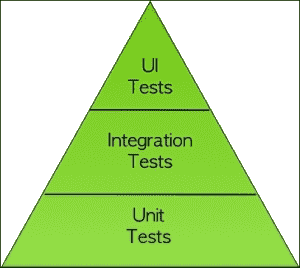
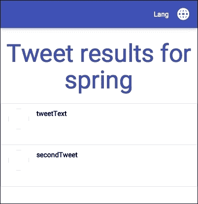
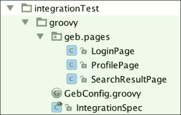

# 第 6 章：不碰运气——单元测试和验收测试

在本章中，我们将了解为什么以及如何测试我们的应用程序。我们将看到单元测试和验收测试之间的区别，并学习如何两者兼而有之。

本章分为两部分。在第一部分中，我们将用 Java 编写测试，同时研究不同的测试方法。在较短的第二部分中，我们将使用 Groovy 编写完全相同的测试，并了解如何使用这种很棒的语言提高代码的可读性。

如果您完成了本章中的所有工作，那么您将有两个测试，因此请随意只保留对您来说最可读的测试。

# 我为什么要测试我的代码？

在 Java 世界中工作使许多开发人员意识到测试的重要性。一系列好的测试可以及早发现回归，让我们在发货时更加自信。

现在很多人都熟悉持续集成的概念（[http://www.thoughtworks.com/continuous-integration](http://www.thoughtworks.com/continuous-integration) ）。这是一种实践，每次对源代码管理系统进行更改时，服务器负责构建应用程序。

构建应该尽可能快，并且能够自我测试。这种做法的主要思想是获得一个快速反馈回路；一旦系统中出现故障，您就应该了解出了什么问题的详细信息。

你为什么要在乎？毕竟，测试应用程序是一项额外的成本；设计和维护测试所花费的时间必然会消耗一些开发时间。

事实上，一个 bug 发现得越晚，代价就越高。如果您仔细想想，即使是 QA 团队发现的一个 bug 也会比您自己发现的 bug 花费更多。它迫使您切换回编写代码时所处的上下文：我为什么要写这行？该职能的基本业务规则是什么？

如果您在早期编写测试，并且能够在几秒钟内启动它们，那么解决代码中潜在的 bug 肯定会花费更少的时间。

测试的另一个好处是，它们可以作为代码的活文档。尽管编写大量的文档，甚至代码注释，可能会被证明是无效的，因为它们很容易过时，形成为极限情况或意外行为编写良好测试的习惯将成为未来的安全网。

这行代码是干什么的？你曾经问过这样的问题吗？好吧，如果你有一套好的单元测试，你可以删除它，看看有什么中断！测试让我们对代码和重构代码的能力有了前所未有的信心。软件非常脆弱。如果你停止关心，它会慢慢腐烂和死亡。

负责任，不要让你的代码死掉！

# 我应该如何测试我的代码？

我们可以在一个软件上执行不同类型的测试，例如安全测试、性能测试等等。作为开发人员，我们将专注于能够自动化和的测试，这将有助于改进我们的代码。

测试分为两类：单元测试和验收测试。测试金字塔（[http://martinfowler.com/bliki/TestPyramid.html](http://martinfowler.com/bliki/TestPyramid.html) 显示了这些测试应以何种比例编写：



在金字塔的底部，有单元测试（启动速度快，相对容易维护），在顶部有 UI 测试（成本更高，执行速度更慢）。集成测试位于中间：它们可以被视为具有单元间复杂交互的大型单元测试。

金字塔的概念是提醒你把注意力放在你最有影响力的地方，并得到最好的反馈循环。

# 测试驱动开发

许多开发人员养成了**测试驱动开发**（**TTD**的健康习惯。这种做法继承了极限编程（XP）中的，是将每个开发阶段分成几个小步骤，然后为每个步骤编写一个失败测试的过程。进行必要的修改，使测试再次通过（测试为绿色）。然后，只要测试保持绿色，就可以重构代码。下图说明了 TDD 循环：


您可以迭代，直到使用非常短的反馈循环完成该功能，保证没有回归，并保证您编写的所有代码都将从一开始就进行测试。

TDD 也受到了批评。最有趣的是：

*   编写测试要比实际实现花费更多的时间
*   它可能导致设计糟糕的应用程序

事实上，成为一名优秀的 TDD 实践者需要时间。一旦你感觉到什么应该被测试，并且对你的工具足够了解，你就不会浪费太多时间。

它还需要有经验的开发人员使用 TDD（或任何其他方法）用适当的设计来设计应用程序。如果你被困在婴儿步咒语中，忘记看大局，糟糕的设计可能是 TDD 的副作用。的确，TDD 不会神奇地带来伟大的应用程序设计，所以要小心，并记住在完成每个功能后后退一步。

从本书开始，我们的代码中只有一个自动生成的单元测试。这太糟糕了！我们没有遵循良好的做法。本章旨在解决这个问题。

# 单元测试

我们可以编写的低级测试称为单元测试。他们应该测试代码的一小部分，因此单元的概念。你如何定义一个单位取决于你；它可以是一个类，也可以是一组密切相关的类。定义这个概念将决定什么将被模拟（替换为虚拟对象）。您打算用轻量级替代方案替换数据库吗？您是否打算用外部服务替换交互？您是否要模拟密切相关的对象，其行为与测试内容的上下文无关？

我的建议是保持平衡。保持你的测试干净快速，其他一切都会随之而来。

我很少完全模仿数据层。我倾向于使用嵌入式数据库进行测试。它们提供了一种在测试时加载数据的简单方法。

通常，出于以下两个原因，我总是嘲笑与外部服务的协作：

*   测试的速度以及在不连接网络的情况下运行测试的可能性
*   能够在与这些服务通信时测试错误情况

此外，模拟和存根之间还有细微的区别。我们将尝试使用这两种方法来了解它们之间的关系。

## 适合工作的工具

测试新手的第一个障碍是缺乏编写相关和可维护测试的良好工具和库的知识。

我要在这里列出一些。此列表并非详尽无遗，但它包含了我们将要使用的工具，这些工具很容易与 Spring 兼容：

<colgroup><col> <col></colgroup> 
| 朱尼特 | 最普遍采用的 Java 测试运行程序。默认情况下由所有生成工具启动。 |
| 资产 | 流畅的断言库。它比 Hamcrest 更容易使用。 |
| 莫基托 | 一个简单的模拟框架。 |
| 数据库单元 | 用于使用 XML 数据集模拟和断言数据库内容。 |
| 斯波克 | 一种优雅的 Groovy DSL，用于编写具有行为驱动开发（BDD）风格的测试（给定/何时/然后）。 |

Groovy 在我的测试工具集中有一个可供选择的位置。即使您还没有准备好将一些 Groovy 代码投入生产，您也可以轻松地在测试中使用该语言的便利性。对于 Gradle，这很容易做到，但我们将在几分钟后看到这一点。

# 验收测试

在 web 应用程序的上下文中，“验收测试”通常指浏览器中的端到端测试。在 Java 世界中，Selenium 显然是最可靠、最成熟的库之一。

在 JavaScript 世界中，我们可以找到其他替代方案，如 PhantomJS 或量角器。PhantomJS 与我们的案例非常相关，因为在这个无头浏览器中有一个 web 驱动程序可用于运行 Selenium 测试，这将缩短启动时间，并且不需要模拟 X 服务器或启动单独的 Selenium 服务器：

<colgroup><col> <col></colgroup> 
| 硒 2 | 这提供了 web 驱动程序来引导浏览器进行自动化测试。 |
| 幻影 | 无头浏览器（无 GUI）。可能是最快的浏览器。 |
| 氟硒 | 用于试验硒测试的 fluent 库。 |
| Geb | 用于试验硒测试的 Groovy 库。 |

# 我们的第一个单元测试

现在是编写我们的第一个单元测试的时候了。

我们将专注于在控制器级别编写测试，因为我们几乎没有业务代码或服务。为 SpringMVC 编写测试的关键是类路径中的`org.springframework.boot:spring-boot-starter-test`依赖关系。它将添加一些非常有用的库，例如：

*   `hamcrest`：这是 JUnit 的断言库
*   `mockito`：这是一个模拟库
*   `spring-test`：这是 Spring 测试库

我们将测试重定向到用户尚未创建其配置文件时创建的配置文件页面。

我们已经有了一个名为`MasterSpringMvc4ApplicationTests`的自动生成测试。这是使用 Spring 测试框架可以编写的最基本的测试类型：如果无法加载上下文，它只会爆炸：

```java
@RunWith(SpringJUnit4ClassRunner.class)
@SpringApplicationConfiguration(classes = MasterSpringMvc4Application.class)
@WebAppConfiguration
public class MasterSpringMvc4ApplicationTests {

    @Test
    public void contextLoads() {
    }
}
```

我们可以删除此测试并创建一个测试，以确保默认情况下，没有配置文件的用户将重定向到配置文件页面。它实际上会测试`HomeController`类的代码，所以我们将其称为`HomeControllerTest`类，并将其放在`src/test/java`中`HomeController`的同一个包中。所有 IDE 都有从类创建 JUnit 测试用例的快捷方式。现在就来看看如何使用你的手机吧！

以下是测试：

```
package masterSpringMvc.controller;

import masterSpringMvc.MasterSpringMvcApplication;
import org.junit.Before;
import org.junit.Test;
import org.junit.runner.RunWith;
import org.springframework.beans.factory.annotation.Autowired;
import org.springframework.boot.test.SpringApplicationConfiguration;
import org.springframework.test.context.junit4.SpringJUnit4ClassRunner;
import org.springframework.test.context.web.WebAppConfiguration;
import org.springframework.test.web.servlet.MockMvc;
import org.springframework.test.web.servlet.setup.MockMvcBuilders;
import org.springframework.web.context.WebApplicationContext;

import static org.springframework.test.web.servlet.request.MockMvcRequestBuilders.*;
import static org.springframework.test.web.servlet.result.MockMvcResultHandlers.print;
import static org.springframework.test.web.servlet.result.MockMvcResultMatchers.*;

@RunWith(SpringJUnit4ClassRunner.class)
@SpringApplicationConfiguration(classes = MasterSpringMvcApplication.class)
@WebAppConfiguration
public class HomeControllerTest {
    @Autowired
    private WebApplicationContext wac;

    private MockMvc mockMvc;

    @Before
    public void setup() {
        this.mockMvc = MockMvcBuilders.webAppContextSetup(this.wac).build();
    }

    @Test
    public void should_redirect_to_profile() throws Exception {
        this.mockMvc.perform(get("/"))
                .andDo(print())
                .andExpect(status().isFound())
                .andExpect(redirectedUrl("/profile"));
    }
}
```

我们使用`MockMvc`模拟与 Spring 控制器的交互，而不需要 Servlet 容器的实际开销。

我们还使用 Spring 提供的两个匹配器来断言我们的结果。他们实际上实现了 Hamcrest 匹配器。

`.andDo(print())`语句将为测试场景的请求和响应生成整洁的调试输出。如果你觉得它太冗长，你可以评论它。

就这些！语法在开始时有点棘手，但是一个具有良好完整性的 IDE 将能够帮助您。

现在我们想测试，如果用户已经填写了他们个人资料的测试部分，我们是否可以将他们重定向到正确的搜索。为此，我们需要使用`MockHttpSession`类来存根会话：

```
import org.springframework.mock.web.MockHttpSession;
import masterSpringMvc.profile.UserProfileSession;

// put this test below the other one
@Test
public void should_redirect_to_tastes() throws Exception {
    MockHttpSession session = new MockHttpSession();
    UserProfileSession sessionBean = new UserProfileSession();
    sessionBean.setTastes(Arrays.asList("spring", "groovy"));
    session.setAttribute("scopedTarget.userProfileSession", sessionBean);

    this.mockMvc.perform(get("/").session(session))
        .andExpect(status().isFound())
        .andExpect(redirectedUrl("/search/mixed;keywords=spring,groovy"));
}
```

您必须将`setTastes()`setter 添加到`UserProfileSession`bean 中，测试才能工作。

`org.springframework.mock.web`包中有许多用于 Servlet 环境的模拟实用程序。

请注意，表示会话中 bean 的属性的前缀是`scopedTarget`。这是因为会话 bean 由 Spring 代理。因此，在 Spring 上下文中实际上有两个对象，我们定义的实际 bean 和它将在会话中结束的代理。

模拟会话是一个整洁的类，但我们可以使用构建器重构测试，该构建器将隐藏实现细节，并可在以后重用：

```
@Test
public void should_redirect_to_tastes() throws Exception {

    MockHttpSession session = new SessionBuilder().userTastes("spring", "groovy").build();
    this.mockMvc.perform(get("/")
        .session(session))
        .andExpect(status().isFound())
        .andExpect(redirectedUrl("/search/mixed;keywords=spring,groovy"));
}
```

建造商的代码如下所示：

```
public class SessionBuilder {
    private final MockHttpSession session;
    UserProfileSession sessionBean;

    public SessionBuilder() {
        session = new MockHttpSession();
        sessionBean = new UserProfileSession();
        session.setAttribute("scopedTarget.userProfileSession", sessionBean);
    }

    public SessionBuilder userTastes(String... tastes) {
        sessionBean.setTastes(Arrays.asList(tastes));
        return this;
    }

    public MockHttpSession build() {
        return session;
    }
}
```

在重构之后，当然，您的测试应该始终通过。

# 模拟和存根

如果我们想测试`SearchController`类处理的搜索请求，我们当然想模拟`SearchService`。

有两种方法可以做到这一点：使用 mock 或存根。

## 用 Mockito 嘲弄

首先，我们可以用 Mockito 创建一个 mock 对象：

```
package masterSpringMvc.search;

import masterSpringMvc.MasterSpringMvcApplication;
import org.junit.Before;
import org.junit.Test;
import org.junit.runner.RunWith;
import org.mockito.InjectMocks;
import org.mockito.Mock;
import org.mockito.MockitoAnnotations;
import org.springframework.boot.test.SpringApplicationConfiguration;
import org.springframework.test.context.junit4.SpringJUnit4ClassRunner;
import org.springframework.test.context.web.WebAppConfiguration;
import org.springframework.test.web.servlet.MockMvc;
import org.springframework.test.web.servlet.setup.MockMvcBuilders;

import java.util.Arrays;

import static org.hamcrest.Matchers.*;
import static org.mockito.Matchers.*;
import static org.mockito.Mockito.*;
import static org.springframework.test.web.servlet.request.MockMvcRequestBuilders.get;
import static org.springframework.test.web.servlet.result.MockMvcResultMatchers.*;

@RunWith(SpringJUnit4ClassRunner.class)
@SpringApplicationConfiguration(classes = MasterSpringMvcApplication.class)
@WebAppConfiguration
public class SearchControllerMockTest {
    @Mock
    private SearchService searchService;

    @InjectMocks
    private SearchController searchController;

    private MockMvc mockMvc;

    @Before
    public void setup() {
        MockitoAnnotations.initMocks(this);
        this.mockMvc = MockMvcBuilders
                .standaloneSetup(searchController)
                .setRemoveSemicolonContent(false)
                .build();
    }

    @Test
    public void should_search() throws Exception {

        when(searchService.search(anyString(), anyListOf(String.class)))
                .thenReturn(Arrays.asList(
                        new LightTweet("tweetText")
                ));

        this.mockMvc.perform(get("/search/mixed;keywords=spring"))
                .andExpect(status().isOk())
                .andExpect(view().name("resultPage"))
                .andExpect(model().attribute("tweets", everyItem(
                        hasProperty("text", is("tweetText"))
                )));

        verify(searchService, times(1)).search(anyString(), anyListOf(String.class));
    }
}
```

您可以看到，我们没有使用 web 应用程序上下文设置`MockMvc`，而是创建了一个独立的上下文。此上下文将仅包含我们的控制器。这意味着我们可以完全控制控制器及其依赖项的实例化和初始化。它将允许我们轻松地在控制器内部注入模拟。

缺点是我们必须重新声明配置的各个部分，比如说我们不想删除分号后面的 URL 字符。

我们使用两个 Hamcrest 匹配器来断言最终将出现在视图模型中的属性。

模拟方法有它的优点，例如能够验证与模拟的交互，并在运行时创建预期。

这还将把测试与对象的实际实现结合起来。例如，如果您更改了在控制器中获取 tweet 的方式，您可能会中断与此控制器相关的测试，因为它们仍然试图模拟我们不再依赖的服务。

## 在测试过程中打断我们的豆子

另一种方法是在测试中用另一个类替换`SearchService`类的实现。

我们早期有点懒惰，没有为`SearchService`定义接口。*始终编程到接口，而不是实现*。在这一众所周知的智慧背后，隐藏着来自*四人帮*的最重要的教训。

控制反转的好处之一是允许在测试或实际系统中轻松替换我们的实现。为了实现这一点，我们必须使用新接口修改所有用法`SearchService`。有了一个好的 IDE，有一个叫做`extract interface`的重构就可以做到这一点。这将创建一个包含我们的`SearchService`类的公共方法`search()`的接口：

```
public interface TwitterSearch {
    List<LightTweet> search(String searchType, List<String> keywords);
}
```

当然，我们的两个控制器，`SearchController`和`SearchApiController`现在必须使用接口，而不是实现。

我们现在能够为`TwitterSearch`类专门为我们的测试用例创建一个双重测试。为了让它工作，我们需要声明一个名为`StubTwitterSearchConfig`的新 Spring 配置，它将包含`TwitterSearch`的另一个实现。我把它放在搜索包中，在`SearchControllerMockTest`旁边：

```
package masterSpringMvc.search;

import org.springframework.context.annotation.Bean;
import org.springframework.context.annotation.Configuration;
import org.springframework.context.annotation.Primary;

import java.util.Arrays;

@Configuration
public class StubTwitterSearchConfig {
    @Primary @Bean
    public TwitterSearch twitterSearch() {
        return (searchType, keywords) -> Arrays.asList(
                new LightTweet("tweetText"),
                new LightTweet("secondTweet")
        );
    }
}
```

在这个配置类中，我们用`@Primary`注释重新声明了`TwitterSearch`bean，如果在类路径中找到其他实现，这将告诉 Spring 优先使用这个实现。

由于`TwitterSearch`接口只包含一个方法，我们可以用 lambda 表达式实现它。

下面是使用我们的`StubConfiguration`类以及带有`SpringApplicationConfiguration`注释的主配置的完整测试：

```
package masterSpringMvc.search;

import masterSpringMvc.MasterSpringMvcApplication;
import org.junit.Before;
import org.junit.Test;
import org.junit.runner.RunWith;
import org.springframework.beans.factory.annotation.Autowired;
import org.springframework.boot.test.SpringApplicationConfiguration;
import org.springframework.test.context.junit4.SpringJUnit4ClassRunner;
import org.springframework.test.context.web.WebAppConfiguration;
import org.springframework.test.web.servlet.MockMvc;
import org.springframework.test.web.servlet.setup.MockMvcBuilders;
import org.springframework.web.context.WebApplicationContext;

import static org.hamcrest.Matchers.*;
import static org.springframework.test.web.servlet.request.MockMvcRequestBuilders.get;
import static org.springframework.test.web.servlet.result.MockMvcResultMatchers.*;

@RunWith(SpringJUnit4ClassRunner.class)
@SpringApplicationConfiguration(classes = {
        MasterSpringMvcApplication.class,
        StubTwitterSearchConfig.class
})
@WebAppConfiguration
public class SearchControllerTest {
    @Autowired
    private WebApplicationContext wac;

    private MockMvc mockMvc;

    @Before
    public void setup() {
        this.mockMvc = MockMvcBuilders.webAppContextSetup(this.wac).build();
    }

    @Test
    public void should_search() throws Exception {

        this.mockMvc.perform(get("/search/mixed;keywords=spring"))
                .andExpect(status().isOk())
                .andExpect(view().name("resultPage"))
                .andExpect(model().attribute("tweets", hasSize(2)))
                .andExpect(model().attribute("tweets",
                                hasItems(
                                        hasProperty("text", is("tweetText")),
                                        hasProperty("text", is("secondTweet"))
                                ))
                );
    }
}
```

## 我应该使用模拟还是存根？

两种方法都有各自的优点。有关详细的解释，请查看马丁·福勒的这篇伟大的文章：[http://martinfowler.com/articles/mocksArentStubs.html](http://martinfowler.com/articles/mocksArentStubs.html) 。

我的测试程序更多地是关于编写存根，因为我更喜欢测试对象的输出，而不是它们的内部工作。但这取决于你。Spring 作为一个依赖注入框架的核心，意味着您可以轻松地选择您最喜欢的方法。

# 单元测试 REST 控制器

我们刚刚测试了一个重定向到视图的传统控制器。测试 REST 控制器在原则上非常相似，但有一些微妙之处。

因为我们要测试控制器的 JSON 输出，所以我们需要一个 JSON 断言库。将以下依赖项添加到您的`build.gradle`文件中：

```
testCompile 'com.jayway.jsonpath:json-path'
```

让我们为`SearchApiController`类编写一个测试，该类控制器允许搜索 tweet 并以 JSON 或 XML 形式返回结果：

```
package masterSpringMvc.search.api;

import masterSpringMvc.MasterSpringMvcApplication;
import masterSpringMvc.search.StubTwitterSearchConfig;
import org.junit.Before;
import org.junit.Test;
import org.junit.runner.RunWith;
import org.springframework.beans.factory.annotation.Autowired;
import org.springframework.boot.test.SpringApplicationConfiguration;
import org.springframework.http.MediaType;
import org.springframework.test.context.junit4.SpringJUnit4ClassRunner;
import org.springframework.test.context.web.WebAppConfiguration;
import org.springframework.test.web.servlet.MockMvc;
import org.springframework.test.web.servlet.setup.MockMvcBuilders;
import org.springframework.web.context.WebApplicationContext;

import static org.hamcrest.Matchers.*;
import static org.springframework.test.web.servlet.request.MockMvcRequestBuilders.get;
import static org.springframework.test.web.servlet.result.MockMvcResultHandlers.print;
import static org.springframework.test.web.servlet.result.MockMvcResultMatchers.*;

@RunWith(SpringJUnit4ClassRunner.class)
@SpringApplicationConfiguration(classes = {
        MasterSpringMvcApplication.class,
        StubTwitterSearchConfig.class
})
@WebAppConfiguration
public class SearchApiControllerTest {
    @Autowired
    private WebApplicationContext wac;

    private MockMvc mockMvc;

    @Before
    public void setup() {
        this.mockMvc = MockMvcBuilders.webAppContextSetup(this.wac).build();
    }

    @Test
    public void should_search() throws Exception {

        this.mockMvc.perform(
                get("/api/search/mixed;keywords=spring")
                        .accept(MediaType.APPLICATION_JSON))
                .andDo(print())
                .andExpect(status().isOk())
                .andExpect(content().contentTypeCompatibleWith(MediaType.APPLICATION_JSON))
                .andExpect(jsonPath("$", hasSize(2)))
                .andExpect(jsonPath("$[0].text", is("tweetText")))
                .andExpect(jsonPath("$[1].text", is("secondTweet")));
    }
}
```

注意 JSON 输出上的简单而优雅的断言。测试我们的用户控制器需要做更多的工作。

首先，我们将`assertj`添加到类路径中；它将帮助我们编写更清晰的测试：

```
testCompile 'org.assertj:assertj-core:3.0.0'
```

然后，为了简化测试，在我们的`UserRepository`类中添加一个`reset()`方法来帮助我们进行测试：

```
void reset(User... users) {
        userMap.clear();
        for (User user : users) {
                save(user);
        }
}
```

在现实生活中，我们可能应该提取一个接口并创建一个存根进行测试。我将把它作为练习留给你。

以下是获取用户列表的第一个测试：

```
package masterSpringMvc.user.api;

import masterSpringMvc.MasterSpringMvcApplication;
import masterSpringMvc.user.User;
import masterSpringMvc.user.UserRepository;
import org.junit.Before;
import org.junit.Test;
import org.junit.runner.RunWith;
import org.springframework.beans.factory.annotation.Autowired;
import org.springframework.boot.test.SpringApplicationConfiguration;
import org.springframework.http.MediaType;
import org.springframework.test.context.junit4.SpringJUnit4ClassRunner;
import org.springframework.test.context.web.WebAppConfiguration;
import org.springframework.test.web.servlet.MockMvc;
import org.springframework.test.web.servlet.setup.MockMvcBuilders;
import org.springframework.web.context.WebApplicationContext;

import static org.hamcrest.Matchers.*;
   import static org.springframework.test.web.servlet.request.MockMvcRequestBuilders.*;
import static org.springframework.test.web.servlet.result.MockMvcResultMatchers.*;

@RunWith(SpringJUnit4ClassRunner.class)
@SpringApplicationConfiguration(classes = MasterSpringMvcApplication.class)
@WebAppConfiguration
public class UserApiControllerTest {

    @Autowired
    private WebApplicationContext wac;

    @Autowired
    private UserRepository userRepository;

    private MockMvc mockMvc;

    @Before
    public void setup() {
        this.mockMvc = MockMvcBuilders.webAppContextSetup(this.wac).build();
        userRepository.reset(new User("bob@spring.io"));
    }

    @Test
    public void should_list_users() throws Exception {
        this.mockMvc.perform(
                get("/api/users")
                        .accept(MediaType.APPLICATION_JSON)
        )
                .andExpect(status().isOk())
                .andExpect(content().contentTypeCompatibleWith(MediaType.APPLICATION_JSON))
                .andExpect(jsonPath("$", hasSize(1)))
                .andExpect(jsonPath("$[0].email", is("bob@spring.io")));
    }
}
```

对于工作，向`User`类添加一个构造函数，将 e-mail 属性作为参数。小心：您还需要为 Jackson 设置默认构造函数。

该测试与之前的测试非常相似，额外设置了`UserRepository`。

现在让我们测试一下创建用户的`POST`方法：

```
import static org.assertj.core.api.Assertions.assertThat;

// Insert this test below the previous one
@Test
public void should_create_new_user() throws Exception {
        User user = new User("john@spring.io");
        this.mockMvc.perform(
                post("/api/users")
                        .contentType(MediaType.APPLICATION_JSON)
                        .content(JsonUtil.toJson(user))
        )
                .andExpect(status().isCreated());

        assertThat(userRepository.findAll())
                .extracting(User::getEmail)
                .containsOnly("bob@spring.io", "john@spring.io");
}
```

有两件事需要注意。第一个是在测试后使用 AssertJ 来断言存储库的内容。要使其正常工作，您将需要以下静态导入：

```
import static org.assertj.core.api.Assertions.assertThat;
```

第二个是，在将对象发送到控制器之前，我们使用实用程序方法将其转换为 JSON。为此，我在`utils`包中创建了一个简单的实用程序类，如下所示：

```
package masterSpringMvc.utils;

import com.fasterxml.jackson.annotation.JsonInclude;
import com.fasterxml.jackson.databind.ObjectMapper;

import java.io.IOException;

public class JsonUtil {
    public static byte[] toJson(Object object) throws IOException {
        ObjectMapper mapper = new ObjectMapper();
        mapper.setSerializationInclusion(JsonInclude.Include.NON_NULL);
        return mapper.writeValueAsBytes(object);
    }
}
```

`DELETE`方法的试验如下：

```
@Test
public void should_delete_user() throws Exception {
        this.mockMvc.perform(
                delete("/api/user/bob@spring.io")
                        .accept(MediaType.APPLICATION_JSON)
        )
                .andExpect(status().isOk());

        assertThat(userRepository.findAll()).hasSize(0);
}

@Test
public void should_return_not_found_when_deleting_unknown_user() throws Exception {
        this.mockMvc.perform(
                delete("/api/user/non-existing@mail.com")
                        .accept(MediaType.APPLICATION_JSON)
        )
                .andExpect(status().isNotFound());
}
```

最后，这里是对更新用户的`PUT`方法的测试：

```
@Test
public void put_should_update_existing_user() throws Exception {
        User user = new User("ignored@spring.io");
        this.mockMvc.perform(
                put("/api/user/bob@spring.io")
                        .content(JsonUtil.toJson(user))
                        .contentType(MediaType.APPLICATION_JSON)
        )
                .andExpect(status().isOk());

        assertThat(userRepository.findAll())
                .extracting(User::getEmail)
                .containsOnly("bob@spring.io");
}
```

哎呀！最后一次考试不及格！通过检查`UserApiController`的执行情况，我们很容易看出原因：

```
   @RequestMapping(value = "/user/{email}", method = RequestMethod.PUT)
    public ResponseEntity<User> updateUser(@PathVariable String email, @RequestBody User user) throws EntityNotFoundException {
        User saved = userRepository.update(email, user);
        return new ResponseEntity<>(saved, HttpStatus.CREATED);
    }
```

我们在控制器中返回了错误的状态！将改为`HttpStatus.OK`，测试应再次为绿色。

使用 Spring，可以使用应用程序的相同配置轻松编写控制器测试，但我们可以同样有效地覆盖或更改测试设置中的某些元素。

运行所有测试时您会注意到的另一件有趣的事情是，应用程序上下文只加载一次，这意味着开销实际上非常小。

我们的应用程序也很小，所以我们没有做任何努力将配置分割成可重用的块。不在每个测试中加载完整的应用程序上下文是一个非常好的实践。实际上，您可以使用`@ComponentScan`注释将扫描的组件拆分为不同的单元。

此注释具有多个属性，允许您使用`includeFilter`和`excludeFilter`（例如仅加载控制器）定义过滤器，并使用`basePackageClasses`和`basePackages`注释扫描特定的包。

您还可以将配置拆分为多个`@Configuration`类。一个很好的例子是将应用程序中用户和 tweet 部分的代码分成两个独立的部分。

我们现在来看看验收测试，这是一种非常不同的测试。

# 验证测试

如果您希望在 MockMvc 测试中设置 Spring 安全性，您可以在前面的测试旁边编写此测试：

```
package masterSpringMvc.user.api;

import masterSpringMvc.MasterSpringMvcApplication;
import masterSpringMvc.user.User;
import masterSpringMvc.user.UserRepository;
import org.junit.Before;
import org.junit.Test;
import org.junit.runner.RunWith;
import org.springframework.beans.factory.annotation.Autowired;
import org.springframework.boot.test.SpringApplicationConfiguration;
import org.springframework.http.MediaType;
import org.springframework.security.web.FilterChainProxy;
import org.springframework.test.context.junit4.SpringJUnit4ClassRunner;
import org.springframework.test.context.web.WebAppConfiguration;
import org.springframework.test.web.servlet.MockMvc;
import org.springframework.test.web.servlet.setup.MockMvcBuilders;
import org.springframework.web.context.WebApplicationContext;

import java.util.Base64;

import static org.springframework.test.web.servlet.request.MockMvcRequestBuilders.get;
import static org.springframework.test.web.servlet.result.MockMvcResultMatchers.status;

@RunWith(SpringJUnit4ClassRunner.class)
@SpringApplicationConfiguration(classes = MasterSpringMvcApplication.class)
@WebAppConfiguration
public class UserApiControllerAuthTest {

    @Autowired
    private FilterChainProxy springSecurityFilter;

    @Autowired
    private WebApplicationContext wac;

    @Autowired
    private UserRepository userRepository;

    private MockMvc mockMvc;

    @Before
    public void setup() {
        this.mockMvc = MockMvcBuilders.webAppContextSetup(this.wac).addFilter(springSecurityFilter).build();
        userRepository.reset(new User("bob@spring.io"));
    }

    @Test
    public void unauthenticated_cannot_list_users() throws Exception {
        this.mockMvc.perform(
                get("/api/users")
                        .accept(MediaType.APPLICATION_JSON)
        )
                .andExpect(status().isUnauthorized());
    }

    @Test
    public void admin_can_list_users() throws Exception {
        this.mockMvc.perform(
                get("/api/users")
                        .accept(MediaType.APPLICATION_JSON)
                        .header("Authorization", basicAuth("admin", "admin"))
        )
                .andExpect(status().isOk());
    }

    private String basicAuth(String login, String password) {
        byte[] auth = (login + ":" + password).getBytes();
        return "Basic " + Base64.getEncoder().encodeToString(auth);
    }
}
```

在前面的示例中，我们在配置中添加了`SpringSecurityFilter`。这将激活 Spring 安全检查。为了测试身份验证是否有效，我们只需发送正确的头以及我们想要执行的请求。

基本身份验证的优点是，模拟起来非常简单。对于更复杂的设置，您必须在身份验证端点上执行模拟请求。

在撰写本文时，SpringBoot 的版本是 1.2.3，取决于 SpringSecurity3。

几周后，SpringBoot1.3.0 将面世，它将更新 SpringSecurity 并使用版本 4。

这是一个好消息，因为 SpringSecurity4 包含了一个非常简单的认证用户设置和简单的注释。参见[http://docs.spring.io/spring-security/site/docs/4.0.x/reference/htmlsingle/#test](http://docs.spring.io/spring-security/site/docs/4.0.x/reference/htmlsingle/#test) 了解更多详情。

# 书面验收测试

单元测试只能覆盖应用程序组件之间不同交互的子集。进一步说，我们需要设置验收测试，这些测试将实际启动整个应用程序，并允许我们与其接口交互。

## 梯度配置

当我们将集成测试添加到项目中时，我们要做的第一件事是将它们放在与单元测试不同的位置。

这主要是因为验收测试比单元测试慢。它们可以是不同集成工作的一部分，例如夜间构建，我们希望开发人员能够从他们的 IDE 轻松启动不同类型的测试。要对 Gradle 执行此操作，我们必须添加一个名为`integrationTest`的新配置。对于 Gradle 来说，配置是一组工件及其依赖项。我们的项目中已经有几种配置：`compile`、`testCompile`等等。

通过在项目的根目录中键入`./gradlew properties`，您可以查看项目的配置，以及更多内容。

在`build.gradle`文件末尾添加新配置：

```
configurations {
    integrationTestCompile.extendsFrom testCompile
    integrationTestRuntime.extendsFrom testRuntime
}
```

这将允许您声明`integrationTestCompile`和`integrationTestRuntime`的依赖项。更重要的是，通过继承测试配置，我们可以访问它们的依赖关系。

### 提示

我不建议将集成测试依赖项声明为`integrationTestCompile`。就 Gradle 而言，它可以工作，但 IDE 内部的支持是不存在的。我通常做的是将我的集成测试依赖项声明为`testCompile`依赖项。这只是一个小小的不便。

既然有了新的配置，我们必须创建一个与之关联的`sourceSet`类。`sourceSet`类表示 Java 源代码和资源的逻辑组。当然，它们也必须从测试类和主类继承；请参阅以下代码：

```
sourceSets {
    integrationTest {
        compileClasspath += main.output + test.output
        runtimeClasspath += main.output + test.output
    }
}
```

最后，我们需要添加一个任务以从构建中运行它们，如下所示：

```
task integrationTest(type: Test) {
    testClassesDir = sourceSets.integrationTest.output.classesDir
    classpath = sourceSets.integrationTest.runtimeClasspath
    reports.html.destination = file("${reporting.baseDir}/integrationTests")
}
```

要运行测试，我们可以键入`./gradlew integrationTest`。除了配置类路径和在何处查找测试类之外，我们还定义了一个生成测试报告的目录。

这种配置允许我们在`src/integrationTest/java`或`src/integrationTest/groovy`中编写测试，这将使我们更容易识别它们并将它们与单元测试分开运行。

默认在`build/reports/tests`中生成。如果我们不覆盖它们，如果我们使用`gradle clean test integrationTest`启动测试和集成测试，它们将相互覆盖。

还值得一提的是，Gradle 生态系统中的一个年轻插件旨在简化新测试配置的声明，请访问[https://plugins.gradle.org/plugin/org.unbroken-dome.test-sets](https://plugins.gradle.org/plugin/org.unbroken-dome.test-sets) 获取详细信息。

## 我们的第一次氟虫试验

FluentLenium 是一个用于硒试验的令人惊奇的库。让我们在构建脚本中添加几个依赖项：

```
testCompile 'org.fluentlenium:fluentlenium-assertj:0.10.3'
testCompile 'com.codeborne:phantomjsdriver:1.2.1'
testCompile 'org.seleniumhq.selenium:selenium-java:2.45.0'
```

默认情况下，`fluentlenium`带有`selenium-java`。我们重新声明它只是为了明确要求提供最新版本。我们还向`PhantomJS`驱动程序添加了一个依赖项，Selenium 并不正式支持该驱动程序。`selenium-java`库的问题在于它与所有支持的 web 驱动程序捆绑在一起。

您可以通过键入`gradle dependencies`来查看我们项目的依赖关系树。在底部，您将看到如下内容：

```
+--- org.fluentlenium:fluentlenium-assertj:0.10.3
|    +--- org.fluentlenium:fluentlenium-core:0.10.3
|    |    \--- org.seleniumhq.selenium:selenium-java:2.44.0 -> 2.45.0
|    |         +--- org.seleniumhq.selenium:selenium-chrome-driver:2.45.0

|    |         +--- org.seleniumhq.selenium:selenium-htmlunit-driver:2.45.0

|    |         +--- org.seleniumhq.selenium:selenium-firefox-driver:2.45.0

|    |         +--- org.seleniumhq.selenium:selenium-ie-driver:2.45.0

|    |         +--- org.seleniumhq.selenium:selenium-safari-driver:2.45.0

|    |         +--- org.webbitserver:webbit:0.4.14 (*)
|    |         \--- org.seleniumhq.selenium:selenium-leg-rc:2.45.0
|    |              \--- org.seleniumhq.selenium:selenium-remote-driver:2.45.0 (*)
|    \--- org.assertj:assertj-core:1.6.1 -> 3.0.0
```

在类路径中包含所有这些依赖项是非常不必要的，因为我们将只使用`PhantomJS`驱动程序。为了排除不需要的依赖项，我们可以在依赖项声明之前将以下部分添加到构建脚本中：

```
configurations {
    testCompile {
        exclude module: 'selenium-safari-driver'
        exclude module: 'selenium-ie-driver'
        //exclude module: 'selenium-firefox-driver'
        exclude module: 'selenium-htmlunit-driver'
        exclude module: 'selenium-chrome-driver'
    }
}
```

我们只是把司机留在手边。`PhantomJS`驱动程序是一个无头浏览器，因此理解没有 GUI 的情况下会发生什么是很困难的。切换到 Firefox 来调试一个复杂的测试是件好事。

正确配置类路径后，我们现在可以编写第一个集成测试了。Spring Boot 有一个非常方便的注释来支持此测试：

```
import masterSpringMvc.MasterSpringMvcApplication;
import masterSpringMvc.search.StubTwitterSearchConfig;
import org.fluentlenium.adapter.FluentTest;
import org.junit.Test;
import org.junit.runner.RunWith;
import org.openqa.selenium.WebDriver;
import org.openqa.selenium.phantomjs.PhantomJSDriver;
import org.springframework.beans.factory.annotation.Value;
import org.springframework.boot.test.SpringApplicationConfiguration;
import org.springframework.boot.test.WebIntegrationTest;
import org.springframework.test.context.junit4.SpringJUnit4ClassRunner;

import static org.assertj.core.api.Assertions.assertThat;

@RunWith(SpringJUnit4ClassRunner.class)
@SpringApplicationConfiguration(classes = {
        MasterSpringMvcApplication.class,
        StubTwitterSearchConfig.class
})
@WebIntegrationTest(randomPort = true)
public class FluentIntegrationTest extends FluentTest {

    @Value("${local.server.port}")
    private int serverPort;

    @Override
    public WebDriver getDefaultDriver() {
        return new PhantomJSDriver();
    }

    public String getDefaultBaseUrl() {
        return "http://localhost:" + serverPort;
    }

    @Test
    public void hasPageTitle() {
        goTo("/");
        assertThat(findFirst("h2").getText()).isEqualTo("Login");
    }
}
```

注意 FluentLenium 有一个整洁的 API 用于请求 DOM 元素。使用 AssertJ，我们可以在页面内容上编写易于阅读的断言。

### 注

查看[处的文档 https://github.com/FluentLenium/FluentLenium](https://github.com/FluentLenium/FluentLenium) 了解更多信息。

通过`@WebIntegrationTest`注释，Spring 将实际创建嵌入式 Servlet 容器（Tomcat），并在随机端口上启动我们的 web 应用程序！我们需要在运行时检索此端口号。这将允许我们为测试提供一个基本 URL，该 URL 将作为我们在测试中进行的所有导航的前缀。

如果在此阶段尝试运行测试，将看到以下错误消息：

```
java.lang.IllegalStateException: The path to the driver executable must be set by the phantomjs.binary.path capability/system property/PATH variable; for more information, see https://github.com/ariya/phantomjs/wiki. The latest version can be downloaded from http://phantomjs.org/download.html

```

事实上，PhantomJS 需要安装在您的机器上才能正常工作。在 Mac 上，只需使用`brew install phantomjs`。其他平台见[文档 http://phantomjs.org/download.html](http://phantomjs.org/download.html) 。

如果您不想在计算机上安装新的二进制文件，请将`new PhantomJSDriver()`替换为`new FirefoxDriver()`。您的测试将稍微慢一点，但您将有一个 GUI。

我们的第一个测试是登陆个人资料页面，对吗？我们现在需要找到登录的方法。

用存根假装登录怎么样？

将该类放入测试源（`src/test/java`中）：

```
package masterSpringMvc.auth;

import org.springframework.beans.factory.annotation.Autowired;
import org.springframework.context.annotation.Bean;
import org.springframework.context.annotation.Configuration;
import org.springframework.context.annotation.Primary;
import org.springframework.security.authentication.UsernamePasswordAuthenticationToken;
import org.springframework.security.core.context.SecurityContextHolder;
import org.springframework.social.connect.ConnectionFactoryLocator;
import org.springframework.social.connect.UsersConnectionRepository;
import org.springframework.social.connect.web.ProviderSignInController;
import org.springframework.social.connect.web.SignInAdapter;
import org.springframework.web.context.request.NativeWebRequest;
import org.springframework.web.servlet.view.RedirectView;

@Configuration
public class StubSocialSigninConfig {

    @Bean
    @Primary
    @Autowired
    public ProviderSignInController signInController(ConnectionFactoryLocator factoryLocator,
                                                     UsersConnectionRepository usersRepository,
                                                     SignInAdapter signInAdapter) {
        return new FakeSigninController(factoryLocator, usersRepository, signInAdapter);
    }

    public class FakeSigninController extends ProviderSignInController {
        public FakeSigninController(ConnectionFactoryLocator connectionFactoryLocator,
                                    UsersConnectionRepository usersConnectionRepository,
                                    SignInAdapter signInAdapter) {
            super(connectionFactoryLocator, usersConnectionRepository, signInAdapter);
        }

        @Override
        public RedirectView signIn(String providerId, NativeWebRequest request) {
            UsernamePasswordAuthenticationToken authentication =
                    new UsernamePasswordAuthenticationToken("geowarin", null, null);
            SecurityContextHolder.getContext().setAuthentication(authentication);
            return new RedirectView("/");
        }
    }
}
```

这将验证任何点击 Twitter 登录按钮的用户是否为 geowarin。

我们将编写第二个测试，该测试将填充配置文件表单，并断言将显示搜索结果：

```
import masterSpringMvc.MasterSpringMvcApplication;
import masterSpringMvc.auth.StubSocialSigninConfig;
import masterSpringMvc.search.StubTwitterSearchConfig;
import org.fluentlenium.adapter.FluentTest;
import org.junit.Test;
import org.junit.runner.RunWith;
import org.openqa.selenium.WebDriver;
import org.openqa.selenium.phantomjs.PhantomJSDriver;
import org.springframework.beans.factory.annotation.Value;
import org.springframework.boot.test.SpringApplicationConfiguration;
import org.springframework.boot.test.WebIntegrationTest;
import org.springframework.test.context.junit4.SpringJUnit4ClassRunner;

import static org.assertj.core.api.Assertions.assertThat;
import static org.fluentlenium.core.filter.FilterConstructor.withName;

@RunWith(SpringJUnit4ClassRunner.class)
@SpringApplicationConfiguration(classes = {
        MasterSpringMvcApplication.class,
        StubTwitterSearchConfig.class,
        StubSocialSigninConfig.class
})
@WebIntegrationTest(randomPort = true)
public class FluentIntegrationTest extends FluentTest {

    @Value("${local.server.port}")
    private int serverPort;

    @Override
    public WebDriver getDefaultDriver() {
        return new PhantomJSDriver();
    }

    public String getDefaultBaseUrl() {
        return "http://localhost:" + serverPort;
    }

    @Test
    public void hasPageTitle() {
        goTo("/");
        assertThat(findFirst("h2").getText()).isEqualTo("Login");
    }

    @Test
    public void should_be_redirected_after_filling_form() {
        goTo("/");
        assertThat(findFirst("h2").getText()).isEqualTo("Login");

        find("button", withName("twitterSignin")).click();
 assertThat(findFirst("h2").getText()).isEqualTo("Your profile");

        fill("#twitterHandle").with("geowarin");
        fill("#email").with("geowarin@mymail.com");
        fill("#birthDate").with("03/19/1987");

        find("button", withName("addTaste")).click();
        fill("#tastes0").with("spring");

        find("button", withName("save")).click();

        takeScreenShot();
        assertThat(findFirst("h2").getText()).isEqualTo("Tweet results for spring");
        assertThat(findFirst("ul.collection").find("li")).hasSize(2);
    }
}
```

请注意，我们可以很容易地要求我们的 web 驱动程序拍摄用于测试的当前浏览器的屏幕截图。这将产生以下输出：



## 使用 FluentLenium 的页面对象

之前的测试有点混乱。我们已经对测试中的所有选择器进行了硬编码。当我们使用相同的元素编写大量测试时，这可能会变得非常危险，因为每当我们更改页面布局时，所有测试都会中断。而且，考试有点难读。

为了解决这个问题，一个常见的做法是使用一个页面对象，它将在我们的应用程序中表示一个特定的网页。对于 FluentLenium，页面对象必须继承`FluentPage`类。

我们将创建三个页面，GUI 的每个元素对应一个页面。第一个是带有点击`twitterSignin`按钮选项的登录页面，第二个是带有填写个人资料表格方便方法的个人资料页面，最后一个是我们可以断言显示结果的结果页面。

让我们立即创建登录页面。我把所有三页都放在一个`pages`包中：

```
package pages;

import org.fluentlenium.core.FluentPage;
import org.fluentlenium.core.domain.FluentWebElement;
import org.openqa.selenium.support.FindBy;

import static org.assertj.core.api.Assertions.assertThat;

public class LoginPage extends FluentPage {
    @FindBy(name = "twitterSignin")
    FluentWebElement signinButton;

    public String getUrl() {
        return "/login";
    }

    public void isAt() {
        assertThat(findFirst("h2").getText()).isEqualTo("Login");
    }

    public void login() {
        signinButton.click();
    }
}
```

让我们为个人资料页面创建一个页面：

```
package pages;

import org.fluentlenium.core.FluentPage;
import org.fluentlenium.core.domain.FluentWebElement;
import org.openqa.selenium.support.FindBy;

import static org.assertj.core.api.Assertions.assertThat;

public class ProfilePage extends FluentPage {
    @FindBy(name = "addTaste")
    FluentWebElement addTasteButton;
    @FindBy(name = "save")
    FluentWebElement saveButton;

    public String getUrl() {
        return "/profile";
    }

    public void isAt() {
        assertThat(findFirst("h2").getText()).isEqualTo("Your profile");
    }

    public void fillInfos(String twitterHandle, String email, String birthDate) {
        fill("#twitterHandle").with(twitterHandle);
        fill("#email").with(email);
        fill("#birthDate").with(birthDate);
    }

    public void addTaste(String taste) {
        addTasteButton.click();
        fill("#tastes0").with(taste);
    }

    public void saveProfile() {
        saveButton.click();
    }
}
```

我们再为搜索结果页面创建一个：

```
package pages;

import com.google.common.base.Joiner;
import org.fluentlenium.core.FluentPage;
import org.fluentlenium.core.domain.FluentWebElement;
import org.openqa.selenium.support.FindBy;

import static org.assertj.core.api.Assertions.assertThat;

public class SearchResultPage extends FluentPage {
    @FindBy(css = "ul.collection")
    FluentWebElement resultList;

    public void isAt(String... keywords) {
        assertThat(findFirst("h2").getText())
                .isEqualTo("Tweet results for " + Joiner.on(",").join(keywords));
    }

    public int getNumberOfResults() {
        return resultList.find("li").size();
    }
}
```

现在，我们可以使用这些页面对象重构测试：

```
@Page
private LoginPage loginPage;
@Page
private ProfilePage profilePage;
@Page
private SearchResultPage searchResultPage;

@Test
public void should_be_redirected_after_filling_form() {
    goTo("/");
    loginPage.isAt();

    loginPage.login();
    profilePage.isAt();

    profilePage.fillInfos("geowarin", "geowarin@mymail.com", "03/19/1987");
    profilePage.addTaste("spring");

    profilePage.saveProfile();

    takeScreenShot();
    searchResultPage.isAt();
    assertThat(searchResultPage.getNumberOfResults()).isEqualTo(2);
}
```

更具可读性，不是吗？

## 让我们的测试更常规

如果你不了解 Groovy，就认为它就像 java 的近亲，没有冗长。Groovy 是一种具有可选类型的动态语言。这意味着在重要的时候，你可以得到类型系统的保证，在你知道自己在做什么的时候，你可以得到 duck 类型的多功能性。

使用这种语言，您可以编写 POJO，而不需要 getter、setter、`equals`和`hashcode`方法。一切都由你来处理。

编写`==`实际上会调用`equals`方法。操作符可以重载，这允许使用带有小箭头的简洁语法，例如`<<`，将文本写入文件。这也意味着您可以将整数添加到`BigIntegers`并得到正确的结果。

**Groovy 开发工具包**（**GDK**）还为经典 Java 对象添加了几个非常有趣的方法。它还将正则表达式和闭包视为一等公民。

### 注

如果你想对 Groovy 有一个坚实的介绍，请查看[上的 Groovy 风格指南 http://www.groovy-lang.org/style-guide.html](http://www.groovy-lang.org/style-guide.html) 。

你也可以在[上观看彼得·莱德布鲁克（Peter Ledbrook）的精彩演讲 http://www.infoq.com/presentations/groovy-for-java](http://www.infoq.com/presentations/groovy-for-java) 。

就我而言，我总是试图将 Groovy 推向我所处理的应用程序的测试端。它确实提高了代码的可读性和开发人员的生产力。

## 使用 Spock 进行单元测试

为了能够在我们的项目中编写 Groovy 测试，我们需要使用 Groovy 插件而不是 Java 插件。

以下是构建脚本中的内容：

```
apply plugin: 'java'
```

将其更改为以下内容：

```
apply plugin: 'groovy'
```

这种修改是完全无害的。Groovy 插件扩展了 Java 插件，因此它唯一的区别在于它提供了在`src/main/groovy`、`src/test/groovy`和`src/integrationTest/groovy`中添加 Groovy 源代码的能力。

显然，我们还需要将 Groovy 添加到类路径中。我们还将通过`spock-spring`依赖项添加 Spock，这是最流行的 Groovy 测试库，它将支持与 Spring 的兼容性：

```
testCompile 'org.codehaus.groovy:groovy-all:2.4.4:indy'
testCompile 'org.spockframework:spock-spring'
```

我们现在可以用不同的方法重写`HomeControllerTest`。让我们在`src/test/groovy`中创建一个`HomeControllerSpec`类。我将其添加到`masterSpringMvc.controller`包中，就像我们的第一个`HomeControllerTest`实例一样：

```
package masterSpringMvc.controller

import masterSpringMvc.MasterSpringMvcApplication
import masterSpringMvc.search.StubTwitterSearchConfig
import org.springframework.beans.factory.annotation.Autowired
import org.springframework.boot.test.SpringApplicationContextLoader
import org.springframework.test.context.ContextConfiguration
import org.springframework.test.context.web.WebAppConfiguration
import org.springframework.test.web.servlet.MockMvc
import org.springframework.test.web.servlet.setup.MockMvcBuilders
import org.springframework.web.context.WebApplicationContext
import spock.lang.Specification

import static org.springframework.test.web.servlet.request.MockMvcRequestBuilders.*;
import static org.springframework.test.web.servlet.result.MockMvcResultMatchers.*;

@ContextConfiguration(loader = SpringApplicationContextLoader,
        classes = [MasterSpringMvcApplication, StubTwitterSearchConfig])
@WebAppConfiguration
class HomeControllerSpec extends Specification {
    @Autowired
    WebApplicationContext wac;

    MockMvc mockMvc;

    def setup() {
        mockMvc = MockMvcBuilders.webAppContextSetup(this.wac).build();
    }

    def "User is redirected to its profile on his first visit"() {
        when: "I navigate to the home page"
        def response = this.mockMvc.perform(get("/"))

        then: "I am redirected to the profile page"
        response
                .andExpect(status().isFound())
                .andExpect(redirectedUrl("/profile"))
    }
}
```

通过使用字符串作为方法名和 Spock 提供的小 BDDSL（域特定语言），我们的测试瞬间变得更具可读性。这在这里不是直接可见的，但是`then`块中的每个语句都将隐式地成为断言。

在撰写时，由于斯波克不阅读元注释，`@SpringApplicationConfiguration`注释无法使用，所以我们只是将其替换为`@ContextConfiguration(loader = SpringApplicationContextLoader)`，本质上是一样的。

我们现在有两个相同测试的版本，一个在 Java 中，另一个在 Groovy 中。这取决于您选择一个最适合您的编码风格，并删除另一个。如果您决定坚持使用 Groovy，那么必须在 Groovy 中重写`should_redirect_to_tastes()`测试。这应该很容易。

Spock 还对 mock 提供了强大的支持。我们可以用不同的方式重写前面的`SearchControllerMockTest`类：

```
package masterSpringMvc.search

import masterSpringMvc.MasterSpringMvcApplication
import org.springframework.boot.test.SpringApplicationContextLoader
import org.springframework.test.context.ContextConfiguration
import org.springframework.test.context.web.WebAppConfiguration
import org.springframework.test.web.servlet.setup.MockMvcBuilders
import spock.lang.Specification

import static org.hamcrest.Matchers.*;
import static org.springframework.test.web.servlet.request.MockMvcRequestBuilders.*;
import static org.springframework.test.web.servlet.result.MockMvcResultMatchers.*;

@ContextConfiguration(loader = SpringApplicationContextLoader,
        classes = [MasterSpringMvcApplication])
@WebAppConfiguration
class SearchControllerMockSpec extends Specification {
    def twitterSearch = Mock(TwitterSearch)
    def searchController = new SearchController(twitterSearch)

    def mockMvc = MockMvcBuilders.standaloneSetup(searchController)
            .setRemoveSemicolonContent(false)
            .build()

    def "searching for the spring keyword should display the search page"() {
        when: "I search for spring"
        def response = mockMvc.perform(get("/search/mixed;keywords=spring"))

        then: "The search service is called once"
        1 * twitterSearch.search(_, _) >> [new LightTweet('tweetText')]

        and: "The result page is shown"
        response
                .andExpect(status().isOk())
                .andExpect(view().name("resultPage"))

        and: "The model contains the result tweets"
        response
                .andExpect(model().attribute("tweets", everyItem(
                hasProperty("text", is("tweetText"))
        )))
    }
}
```

莫基托所有的长篇大论现在都消失了。`then`块实际上断言使用任何参数（`_, _`调用`twitterSearch`方法一次（`1 *`）。就像 mockito 一样，我们本可以预期特定的参数。

双箭头`>>`语法用于从模拟方法返回对象。在我们的例子中，它是一个只包含一个元素的列表。

由于类路径中只有一点依赖性，我们已经编写了更具可读性的测试，但我们还没有完成。我们还将重构验收测试以使用 Geb，这是一个引导 Selenium 测试的 Groovy 库。

## 与 Geb 的集成测试

Geb 是在 Grails 框架中编写测试的事实库。虽然它的版本是 0.12.0，但它非常稳定，并且与一起工作非常舒适。

它提供了一个选择器 APIála jQuery，使测试易于编写，即使对于前端开发人员也是如此。Groovy 也是一种具有 JavaScript 影响的语言，对他们也有吸引力。

让我们将支持 Spock 规范的 Geb 添加到我们的类路径中：

```
testCompile 'org.gebish:geb-spock:0.12.0'
```

Geb 可以通过直接在`src/integrationTest/groovy`根目录下找到的名为`GebConfig.groovy`的 Groovy 脚本进行配置：

```
import org.openqa.selenium.Dimension
import org.openqa.selenium.firefox.FirefoxDriver
import org.openqa.selenium.phantomjs.PhantomJSDriver

reportsDir = new File('./build/geb-reports')
driver = {
        def driver = new FirefoxDriver()
    // def driver = new PhantomJSDriver()
    driver.manage().window().setSize(new Dimension(1024, 768))
    return driver
}
```

在此配置中，我们指示 Geb 将在何处生成报告以及使用哪个驱动程序。Geb 中的报告是屏幕截图的增强版，其中还包含 HTML 格式的当前页面。通过在 Geb 测试中调用`report`函数，可以随时触发它们的生成。

让我们用 Geb 重写第一个集成测试：

```
import geb.Configuration
import geb.spock.GebSpec
import masterSpringMvc.MasterSpringMvcApplication
import masterSpringMvc.search.StubTwitterSearchConfig
import org.springframework.beans.factory.annotation.Value
import org.springframework.boot.test.SpringApplicationContextLoader
import org.springframework.boot.test.WebIntegrationTest
import org.springframework.test.context.ContextConfiguration

@ContextConfiguration(loader = SpringApplicationContextLoader,
        classes = [MasterSpringMvcApplication, StubTwitterSearchConfig])
@WebIntegrationTest(randomPort = true)
class IntegrationSpec extends GebSpec {

    @Value('${local.server.port}')
    int port

    Configuration createConf() {
        def configuration = super.createConf()
        configuration.baseUrl = "http://localhost:$port"
        configuration
    }

    def "User is redirected to the login page when not logged"() {
        when: "I navigate to the home page"
        go '/'
//        report 'navigation-redirection'

        then: "I am redirected to the profile page"
        $('h2', 0).text() == 'Login'
    }
}
```

就而言，它与 FluentLenium 非常相似。我们已经可以看到`$`函数，它允许我们通过选择器获取 DOM 元素。在这里，我们还通过给出`0`索引来声明我们想要页面中的第一个`h2`。

## 带有 Geb 的页面对象

使用 Geb 的页面对象是一种真正的乐趣。我们将创建与之前相同的页面对象，以便您能够理解其中的差异。

使用 Geb，页面对象必须从`geb.Page`类继承。首先，让我们创建`LoginPage`。我建议避免把它放在与前一个相同的包中。我创建了一个名为`geb.pages`的包：

```
package geb.pages

import geb.Page

class LoginPage extends Page {

    static url = '/login'
    static at = { $('h2', 0).text() == 'Login' }
    static content = {
        twitterSignin { $('button', name: 'twitterSignin') }
    }

    void loginWithTwitter() {
        twitterSignin.click()
    }
}
```

然后我们可以创建`ProfilePage`：

```
package geb.pages

import geb.Page

class ProfilePage extends Page {

    static url = '/profile'
    static at = { $('h2', 0).text() == 'Your profile' }
    static content = {
        addTasteButton { $('button', name: 'addTaste') }
        saveButton { $('button', name: 'save') }
    }

    void fillInfos(String twitterHandle, String email, String birthDate) {
        $("#twitterHandle") << twitterHandle
        $("#email") << email
        $("#birthDate") << birthDate
    }

    void addTaste(String taste) {
        addTasteButton.click()
        $("#tastes0") << taste
    }

    void saveProfile() {
        saveButton.click();
    }
}
```

这与以前的页面基本相同。注意为输入元素赋值的小`<<`。你也可以给他们打电话`setText`。

`at`方法完全是框架的一部分，当您导航到相应页面时，Geb 将自动断言这些方法。

让我们创建`SearchResultPage`：

```
package geb.pages

import geb.Page

class SearchResultPage extends Page {
    static url = '/search'
    static at = { $('h2', 0).text().startsWith('Tweet results for') }
    static content = {
        resultList { $('ul.collection') }
        results { resultList.find('li') }
    }
}
```

它稍微短了一点，这要感谢为结果重用先前定义的内容的能力。

在没有页面对象设置的情况下，我们可以编写如下测试：

```
import geb.Configuration
import geb.pages.LoginPage
import geb.pages.ProfilePage
import geb.pages.SearchResultPage
import geb.spock.GebSpec
import masterSpringMvc.MasterSpringMvcApplication
import masterSpringMvc.auth.StubSocialSigninConfig
import masterSpringMvc.search.StubTwitterSearchConfig
import org.springframework.beans.factory.annotation.Value
import org.springframework.boot.test.SpringApplicationContextLoader
import org.springframework.boot.test.WebIntegrationTest
import org.springframework.test.context.ContextConfiguration

@ContextConfiguration(loader = SpringApplicationContextLoader,
        classes = [MasterSpringMvcApplication, StubTwitterSearchConfig, StubSocialSigninConfig])
@WebIntegrationTest(randomPort = true)
class IntegrationSpec extends GebSpec {

    @Value('${local.server.port}')
    int port

    Configuration createConf() {
        def configuration = super.createConf()
        configuration.baseUrl = "http://localhost:$port"
        configuration
    }

    def "User is redirected to the login page when not logged"() {
        when: "I navigate to the home page"
        go '/'

        then: "I am redirected to the login page"
        $('h2').text() == 'Login'
    }

    def "User is redirected to its profile on his first visit"() {
        when: 'I am connected'
        to LoginPage
        loginWithTwitter()

        and: "I navigate to the home page"
        go '/'

        then: "I am redirected to the profile page"
        $('h2').text() == 'Your profile'
    }

    def "After filling his profile, the user is taken to result matching his tastes"() {
        given: 'I am connected'
        to LoginPage
        loginWithTwitter()

        and: 'I am on my profile'
        to ProfilePage

        when: 'I fill my profile'
        fillInfos("geowarin", "geowarin@mymail.com", "03/19/1987");
        addTaste("spring")

        and: 'I save it'
        saveProfile()

        then: 'I am taken to the search result page'
        at SearchResultPage
        page.results.size() == 2
    }
}
```

天哪，多美啊！您当然可以直接使用 Geb 编写您的用户故事！

通过简单的测试，我们只触及了 Geb 的表面。还有更多可用的功能，我鼓励您阅读 Geb 的*一书，这是一篇非常好的文档，可在[上找到 http://www.gebish.org/manual/current/](http://www.gebish.org/manual/current/) 。*

# 检查点

在本章中，我们在`src/test/java`中添加了一系列测试。我选择使用 Groovy，因此删除了重复的测试：


在`src/test/groovy`目录中，我重构了两个测试，如下所示：


在`src/integrationTest/groovy`中，我们与 Geb 编写了一个集成测试：



最后，我们在 Gradle 构建中添加了一个`integrationTest`任务。运行`gradle clean test`和`gradle clean integrationTest`以确保所有测试都通过。

如果构建成功，我们就为下一章做好了准备。

# 总结

在本章中，我们研究了单元测试和集成测试之间的差异。

我们看到了测试是如何成为一种健康的习惯，它会让我们对自己构建的东西和发布的东西充满信心。从长远来看，这将节省我们的钱，并避免一些令人头痛的问题。

Spring 可以很好地处理用 Java 编写的经典 JUnit 测试，并且它对集成测试具有一流的支持。但我们也可以轻松地使用其他语言，如 Groovy，使测试更可读、更易于编写。

不可否认，测试是 Spring 框架的最强点之一，也是首先使用依赖注入的主要原因之一。

请继续关注下一章，我们将优化我们的应用程序，以便它可以部署到云中！