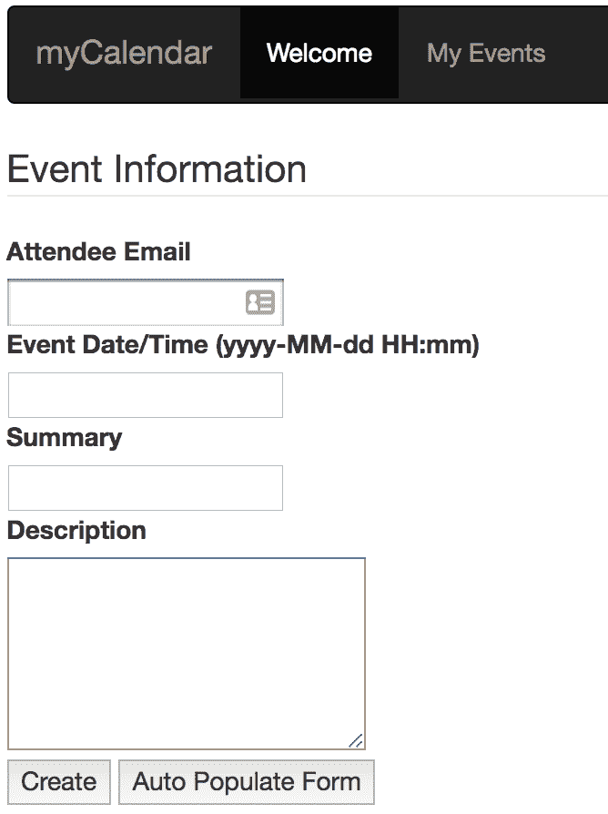
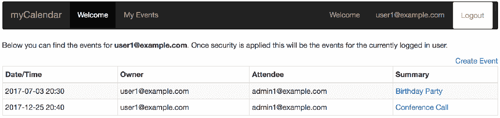
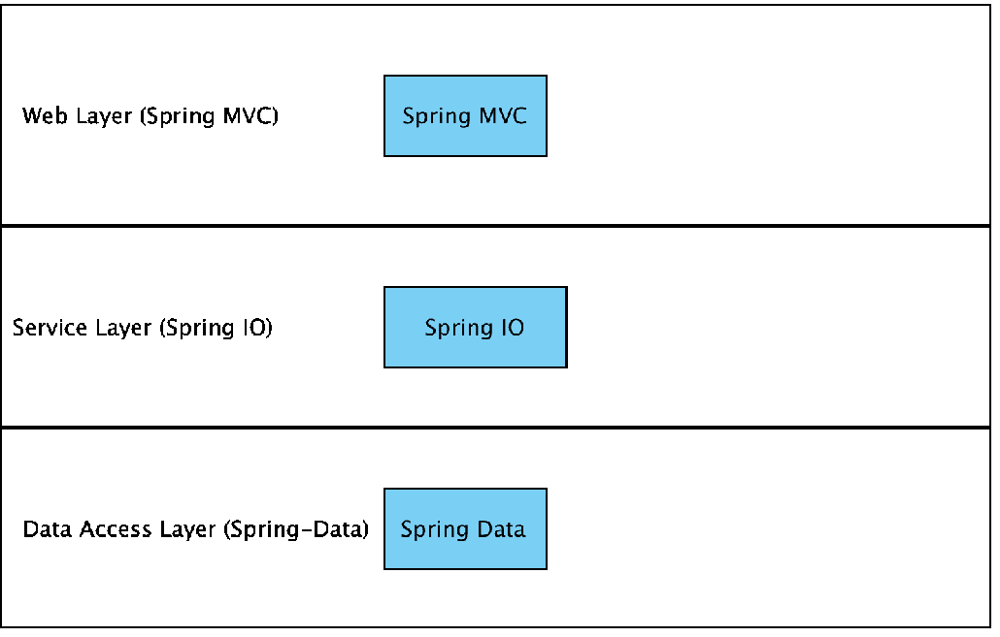
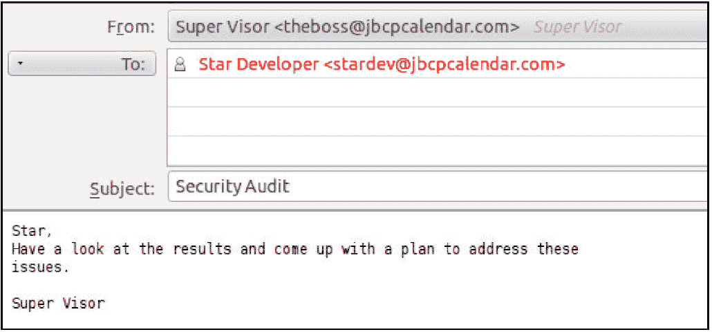
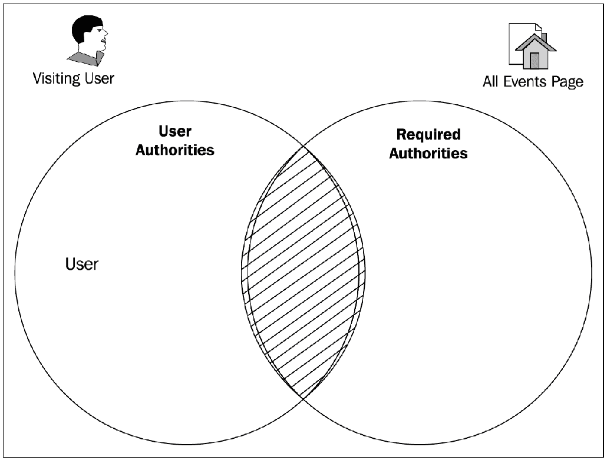

# 一、剖析不安全的应用

安全性可以说是 21 世纪编写的任何基于 web 的应用中最关键的体系结构组件之一。在一个恶意软件、犯罪分子和流氓员工经常出现并积极测试软件漏洞的时代，智能和全面地使用安全性是任何您将负责的项目的关键要素。

这本书的编写遵循了一种发展模式，我们认为，它提供了一个有用的前提来处理复杂的主题，以一个基于 Spring 4.2 基金会的基于 Web 的应用，并理解用 Spring Security 4.2 保护它的核心概念和策略。我们通过以完整的 web 应用的形式为每一章提供示例代码来补充这种方法。

无论您是已经在使用 Spring Security，还是对将软件的基本使用提升到更高的复杂性感兴趣，您都会在本书中找到一些帮助。在本章中，我们将介绍以下主题：

*   虚构的安全审计的结果
*   基于 web 的应用的一些常见安全问题
*   几个核心软件安全术语和概念

如果您已经熟悉基本的安全术语，您可以跳到[第 2 章](02.html)、*Spring security 入门*，在这里我们开始使用框架的基本功能。

# 安全审计

作为**Jim Bob Circle Pants Online Calendar**（JBCPCalendar.com）的软件开发人员，您的工作时间是清晨，当您第一杯咖啡喝到一半时，您收到主管的以下电子邮件：

什么你在设计应用时没有考虑安全性？事实上，在这一点上，您甚至不确定什么是安全审计。听起来你会从安全审计员那里学到很多东西！在本章后面，我们将回顾什么是审计，以及审计结果。首先，让我们花一点时间检查正在审查的应用。

# 关于示例应用

尽管我们在阅读本书的过程中会经历一个人为的场景，但应用的设计和我们将对其进行的更改都是从基于 Spring 的应用的实际使用中得出的。日历应用允许用户创建和查看事件：

输入新事件的详细信息后，您将看到以下屏幕截图：

该应用设计得过于简单，使我们能够专注于安全性的重要方面，而不会被**对象关系映射**（**ORM**和复杂 UI 技术的细节所束缚。我们希望您参考附录*附加参考资料*（本书*补充资料*部分）中的其他补充资料，以涵盖作为示例代码一部分提供的一些基线功能。

代码是在 Spring 和 SpringSecurity4.2 中编写的，但是将许多示例改编为 SpringSecurity 的其他版本相对容易。请参阅[第 16 章](16.html)*迁移到 Spring Security 4.2*中关于 Spring Security 3 和 4.2 之间的详细更改的讨论，以帮助将示例转换为 Spring Security 4 语法。

请不要将此应用用作构建真正在线日历应用的基线。它的结构非常简单，重点放在我们在本书中阐述的概念和配置上。

# JBCP 日历应用体系结构

web 应用遵循由 web、服务和数据访问层组成的标准三层体系结构，如下图所示：

您可以在附录的*补充资料*部分*补充参考资料*中找到关于 MVC 架构的补充资料。

web 层封装了 MVC 代码和功能。在这个示例应用中，我们将使用 SpringMVC 框架，但我们可以同样轻松地使用**SpringWebFlow**（**SWF**）、**ApacheSuts**、甚至是一个 Spring 友好的 Web 堆栈，例如**ApacheWicket**。

在一个典型的 web 应用中，利用 SpringSecurity，web 层是进行大部分代码配置和扩充的地方。例如，`EventsController`类用于将 HTTP 请求转换为将事件持久化到数据库中。如果您对 web 应用和 SpringMVC 没有太多的经验，那么在我们继续讨论更复杂的主题之前，仔细检查基线代码并确保您理解它是明智的。同样，我们试图使网站尽可能简单，日历应用的构造只是为了给网站提供一个合理的标题和轻巧的结构。

您可以在*附录*、*附加参考资料*中找到关于设置样本应用的详细说明。

服务层封装了应用的业务逻辑。在我们的示例应用中，我们使用`DefaultCalendarService`作为数据访问层上的一个非常轻的外观，以说明有关保护应用服务方法的特定要点。服务层还用于在单个方法调用中对 SpringSecurity API 和日历 API 进行操作。我们将在[第 3 章](03.html)、*海关认证*中对此进行更详细的讨论。

在一个典型的 web 应用中，该层将包含业务规则验证、业务对象的组合和分解，以及交叉关注点（如审计）。

数据访问层封装了负责操作数据库表内容的代码。在许多 Spring 应用中，这是使用 ORM 的地方，例如 Hibernate 或 JPA。它向服务层公开了一个基于对象的 API。在我们的示例应用中，我们使用基本的 JDBC 功能实现对内存中 H2 数据库的持久性。例如，`JdbcEventDao`用于将事件对象保存到数据库中。

在典型的 web 应用中，将使用更全面的数据访问解决方案。由于 ORM，以及更一般的数据访问，往往会让一些开发人员感到困惑，为了清晰起见，我们选择了尽可能简化这个领域。

# 应用技术

我们致力于通过关注几乎每个 Spring 开发人员在其开发机器上拥有的一些基本工具和技术，使应用尽可能易于运行。尽管如此，我们还是在附录*JBCP 日历示例代码*中提供了*入门*部分作为补充信息。

与示例代码集成的主要方法是提供与 Gradle 兼容的项目。由于许多 IDE 都与 Gradle 进行了丰富的集成，因此用户应该能够将代码导入到任何支持 Gradle 的 IDE 中。当许多开发人员使用 Gradle 时，我们觉得这是打包示例的最直接的方法。无论您熟悉什么样的开发环境，希望您能找到一种方法来完成本书中的示例。

许多 IDE 提供了 Gradle 工具，可以为您自动下载 Spring 和 SpringSecurity4.2Javadoc 以及源代码。然而，有时这是不可能的。在这种情况下，您需要下载 Spring4.2 和 SpringSecurity4.2 的完整版本。Javadoc 和源代码都是一流的。如果您感到困惑或需要更多信息，这些示例可以为您的学习提供额外的支持或保证。访问附录*附加参考资料*中的*补充资料*部分，以查找有关 Gradle 的附加信息，包括运行示例、获取源代码和 Javadoc，以及在没有 Gradle 的情况下构建项目的备选方案。

# 审查审计结果

让我们回到我们的电子邮件，看看审计进展如何。哦，结果看起来不太好：

**申请审核结果**

此应用表现出以下不安全行为：

*   由于缺少 URL 保护和常规认证而导致权限意外升级
*   不适当或不存在的授权使用
*   缺少数据库凭据安全性
*   个人识别或敏感信息易于访问或不加密
*   由于缺少 SSL 加密，传输级别保护不安全
*   风险水平高

我们建议将此应用脱机，直到这些问题得到解决。

哎哟这个结果对我们公司来说很糟糕。我们最好尽快解决这些问题。

公司（或其合作伙伴或客户）通常会聘请第三方安全专家，通过白帽黑客攻击、源代码审查以及与应用开发人员和架构师的正式或非正式对话来审核其软件安全的有效性。

**白帽黑客**或**道德黑客**是由专业人士进行的，他们被雇佣来指导公司如何更好地保护自己，而不是出于恶意。

通常，安全审计的目标是向管理层或客户提供已遵循基本安全开发实践的保证，以确保客户数据和系统功能的完整性和安全性。根据软件所针对的行业，审核员还可以使用特定于行业的标准或合规性指标对其进行测试。

在职业生涯的某个阶段，您可能会遇到两个特定的安全标准，即**支付卡行业数据安全标准**（**PCI****DSS**）和**健康保险隐私和责任法案**（**HIPAA**）隐私规则。这两个标准旨在通过过程和软件控制相结合，确保特定敏感信息（如信用卡和医疗信息）的安全。许多其他行业和国家对敏感或**个人识别信息**（**PII**有类似的规定。不遵守这些标准不仅是不好的做法，而且可能会使您或您的公司在出现安全漏洞时承担重大责任（更不用说负面新闻）。

接收安全审计的结果可能是一次令人大开眼界的经历。遵循所需的软件改进可以是自我教育和软件改进的完美机会，并且可以让您实施实现安全软件的实践和策略。

让我们回顾一下审核员的调查结果，并提出一个详细解决这些问题的计划。

# 认证

认证是开发安全应用时必须内化的两个关键安全概念之一（另一个是授权）。**认证**标识试图请求资源的用户。您可能对日常在线和离线生活中的认证非常熟悉，具体情况如下：

*   **基于凭证的认证**：当您登录到基于 web 的电子邮件帐户时，您最有可能提供您的用户名和密码。电子邮件提供商将您的用户名与其数据库中的已知用户匹配，并验证您的密码是否与他们记录的密码匹配。这些凭据是电子邮件系统用来验证您是否是系统的有效用户的凭据。首先，我们将使用这种类型的认证来保护 JBCP 日历应用的敏感区域。从技术上讲，电子邮件系统不仅可以在数据库中检查凭据，还可以在任何地方检查凭据，例如，公司目录服务器，如**Microsoft Active directory**。本书涵盖了许多此类集成。
*   **双因素认证**：当您从银行自动柜员机取款时，您需要刷卡并输入您的个人身份号码，然后才能取款或进行其他交易。这种类型的认证与用户名和密码认证类似，只是用户名编码在卡的磁条上。物理卡和用户输入的 PIN 的组合允许银行确保您可以访问该帐户。密码和物理设备（塑料 ATM 卡）的结合是一种普遍存在的双重认证形式。在一个有安全意识的专业环境中，经常会看到这些类型的设备用于访问高度安全的系统，特别是处理金融或个人身份信息。硬件设备，如**RSA SecurID**将基于时间的硬件设备与基于服务器的认证软件结合在一起，使得环境极难被破坏。
*   **硬件认证**：早上启动汽车时，将金属钥匙插入点火开关，转动钥匙即可启动汽车。尽管感觉可能与其他两个示例不同，但钥匙上的凸起与点火开关中的制栓的正确匹配可作为硬件验证的一种形式。

可以应用于软件和硬件安全问题的认证形式有几十种，每种形式都有各自的优缺点。在本书的前半部分中，我们将回顾其中一些方法在 SpringSecurity中的应用。我们的应用缺少任何类型的认证，这就是为什么审核会包含意外权限提升的风险。

通常，软件系统将分为两个高级领域，如未经验证（或匿名）和已验证，如以下屏幕截图所示：

匿名领域中的应用功能是独立于用户身份的功能（想想在线应用的欢迎页面）。

匿名区域不执行以下操作：

*   要求用户登录到系统或以其他方式标识自己是否可用
*   显示敏感信息，如姓名、地址、信用卡和订单
*   提供操作系统或其数据的整体状态的功能

未经认证的系统区域供所有人使用，即使是我们尚未明确识别的用户。然而，可能是这些区域中的用户（例如，无处不在的`Welcome {First Name}`文本）似乎具有额外的功能。通过使用 Spring Security tag library 完全支持向经过认证的用户选择性显示内容，[第 11 章](11.html)、*细粒度访问控制*对此进行了介绍。

我们将在[第 2 章](02.html)、*Spring Security 入门*中解决此发现，并使用 Spring Security 的自动配置功能实现基于表单的认证。之后，我们将探讨执行认证的各种其他方法（通常围绕与企业或其他外部认证存储的系统集成）。

# 批准

不适当或不存在的授权使用

授权是两个核心安全概念中的第二个，这两个概念对于实现和理解应用安全性至关重要。**授权**使用在认证过程中验证的信息来确定是否应向特定资源授予访问权限。围绕应用的授权模型构建，授权对应用功能和数据进行分区，以便通过将权限、功能和数据的组合与用户匹配来控制这些项目的可用性。我们的应用在审计的这一点上的失败表明应用的功能不受用户角色的限制。想象一下，如果您正在运行一个电子商务站点，并且该站点的任何用户都可以查看、取消或修改订单和客户信息！

授权通常涉及以下两个单独的方面，结合起来描述安全系统的可访问性：

*   第一种是将经过认证的主体映射到一个或多个权限（通常称为**角色**。例如，网站的临时用户可能会被视为具有访问者权限，而网站管理员可能会被分配管理权限。
*   第二个是将权限检查分配给系统的安全资源。这通常在开发系统时完成，可以通过代码中的显式声明，也可以通过配置参数。例如，允许查看其他用户事件的屏幕应仅对具有管理权限的用户可用。

安全资源可以是系统的任何方面，这些方面应基于用户的权限有条件地可用。

基于 web 的应用的安全资源可以是单个 web 页面、网站的整个部分或单个页面的部分。相反，安全的业务资源可能是对类或单个业务对象的方法调用。

您可以想象一个权限检查，它将检查主体，查找其用户帐户，并确定主体实际上是否是管理员。如果此权限检查确定尝试访问安全区域的主体实际上是管理员，则请求将成功。但是，如果委托人没有足够的权限，则应拒绝该请求。

让我们仔细看看一个特定的安全资源的例子，所有事件页面。“所有事件”页面需要管理访问权限（毕竟，我们不希望普通用户查看其他用户的事件），因此，在访问它的主体中查找一定级别的权限。

如果我们考虑当站点管理员试图访问受保护的资源时，如何做出决策，我们可以想象实际权限与所需权限之间的对比可以用集合论简洁地表达出来。然后，我们可以选择将此决定表示为管理用户的**Venn**图：

页面的**用户权限**（用户和管理员）与**所需权限**（管理员）之间存在交叉点，因此为用户提供了访问权限。

将其与未经授权的用户进行对比，如下所示：

这两套权威是脱节的，没有共同的要素。因此，用户被拒绝访问该页面。因此，我们展示了授权获取资源的基本原则。

实际上，有真正的代码做出这个决定，结果是用户被授予或拒绝访问请求的受保护资源。我们将在[第 2 章](02.html)、*Spring Security 入门*中解决 Spring Security 授权基础设施的基本授权问题，然后在[第 12 章](12.html)、*访问控制列表*和[第 13 章](13.html)中解决更高级的授权问题，*海关授权*。

# 数据库凭据安全

数据库凭据不安全或不易访问。通过检查应用源代码和配置文件，审计员注意到，用户密码以明文形式存储在配置文件中，使得访问服务器的恶意用户很容易访问应用。

由于该应用包含个人和财务数据，能够访问任何数据的恶意用户可能会使公司面临身份盗窃或篡改。保护对用于访问应用的凭据的访问应该是我们的首要任务，重要的第一步是确保一个安全故障点不会危及整个系统。

我们将在[第 4 章](04.html)、*基于 JDBC 的认证*中检查 Spring Security for credential storage（需要 JDBC 连接）中数据库访问层的配置。在同一章中，我们还将介绍用于提高数据库中存储的密码安全性的内置技术。

# 敏感信息

个人识别或敏感信息易于访问或未加密。审计员注意到，一些重要和敏感的数据在系统的任何地方都完全未加密或被掩盖。幸运的是，有一些简单的设计模式和工具允许我们通过 SpringSecurity 中基于注释的 AOP 支持安全地保护这些信息。

# 传输级保护

由于缺少 SSL 加密，存在不安全的传输级别保护。

然而，在现实世界中，包含私有信息的在线应用在没有 SSL 保护的情况下运行是不可想象的，不幸的是，JBCP 日历正处于这种情况。SSL 保护可确保浏览器客户端和 web 应用服务器之间的通信安全，防止多种篡改和窥探。

在 Tomcat 部分的*HTTPS 设置中，在附录*附加参考资料*中，我们将回顾使用传输级安全性作为应用安全结构定义一部分的基本选项。*

# 使用 SpringSecurity4.2 解决安全问题

SpringSecurity4.2 提供了丰富的资源，允许以简单的方式声明或配置许多常见的安全实践。在接下来的章节中，我们将结合应用源代码和应用配置更改，以解决安全审计员（以及更多人）提出的所有问题，从而使我们自己确信日历应用是安全的。

使用 Spring Security 4.2，我们将能够进行以下更改以提高应用的安全性：

*   将系统的用户划分为用户类
*   为用户角色分配授权级别
*   将用户角色分配给用户类
*   跨应用资源全局应用认证规则
*   在应用体系结构的所有级别应用授权规则
*   防止旨在操纵或窃取用户会话的常见类型的攻击

# 为什么是春季安全？

SpringSecurity的存在填补了 Java 第三方库领域的空白，就像 Spring 框架最初引入时所做的那样。**Java 认证和授权服务**（**JAAS**或**Java EE 安全**等标准确实提供了一些执行某些相同认证和授权功能的方法，但 SpringSecurity是一个赢家，因为它包含了以简洁而合理的方式实现自上而下的应用安全解决方案所需的一切。

此外，Spring Security 吸引了许多人，因为它提供了与许多常见企业认证系统的开箱即用集成；因此，开发人员只需花费很少的精力（除了配置），就可以适应大多数情况。

它被广泛使用是因为没有其他主流框架像它一样！

# 总结

在本章中，我们回顾了不安全 web 应用中的常见风险点以及示例应用的基本体系结构。我们还讨论了保护应用的策略。

在下一章中，我们将探讨如何快速设置 SpringSecurity，并对其工作原理有一个基本的了解。