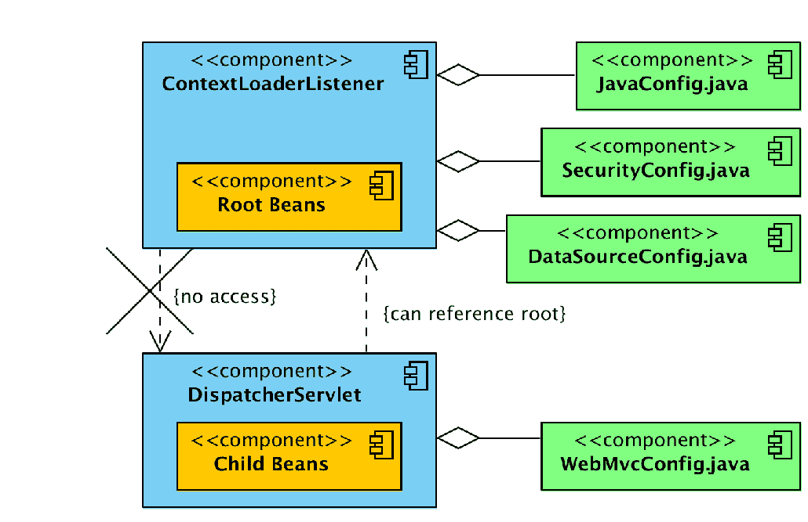
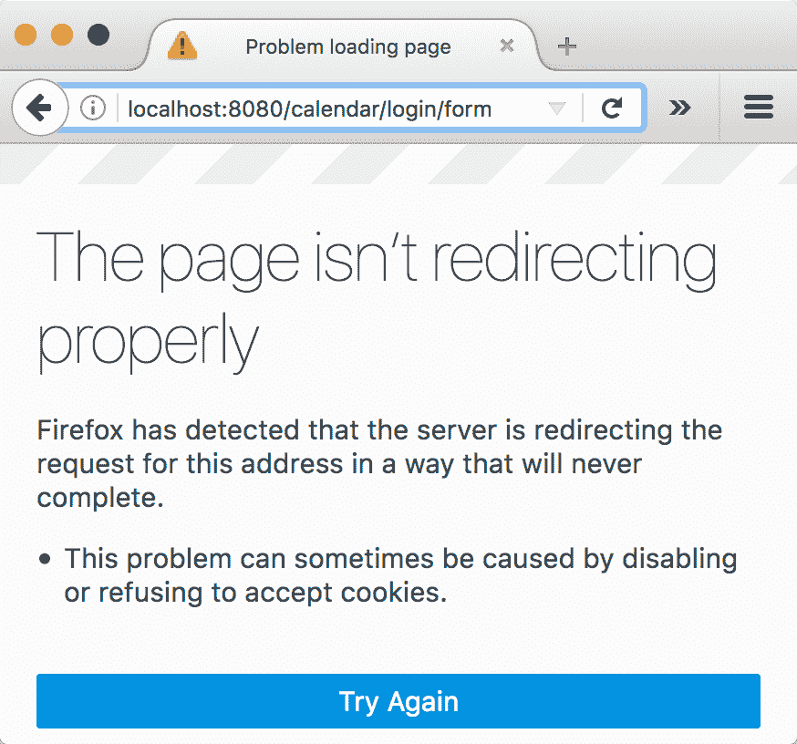
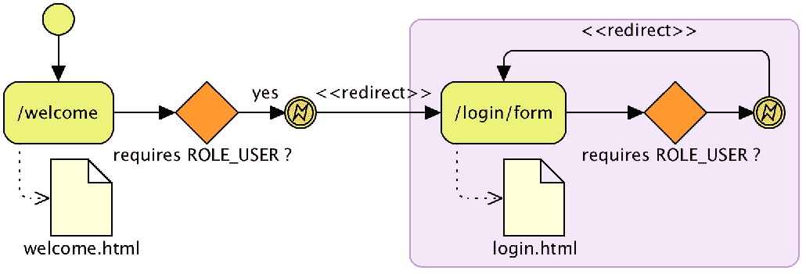

# 二、开始使用 Spring Security

在本章中，我们将应用一个最小的 SpringSecurity 配置来开始解决我们第一次发现的由于缺少 URL 保护而导致的意外权限升级问题，以及在[第 1 章](01.html)、*剖析不安全应用*中讨论的安全审计的一般认证问题。然后，我们将在基本配置的基础上为用户提供定制体验。本章旨在让您运行和运行 Spring Security，并为您需要执行的任何其他与安全相关的任务提供基础。

在本章中，我们将介绍以下主题：

*   使用 Spring security 中的自动配置选项在 JBCP 日历应用上实现基本级别的安全性
*   学习如何定制登录和注销体验
*   根据 URL 配置 Spring Security 以不同方式限制访问
*   利用 Spring Security 基于表达式的访问控制
*   在 SpringSecurity 中使用 JSP 库有条件地显示有关登录用户的基本信息
*   根据用户的角色确定用户登录后的默认位置

# 你好，春季安全

尽管 Spring Security 的配置非常困难，但该产品的创造者们考虑周到，并为我们提供了一个非常简单的机制，使软件的大部分功能具有强大的基线。根据这一基线，额外的配置将允许对应用的安全行为进行精细的详细控制。

我们将从[第 1 章](01.html)*剖析不安全的应用*开始，并将其转化为一个使用基本用户名和密码验证的安全站点。此认证仅用于说明为 web 应用启用 SpringSecurity 所涉及的步骤；您将看到，这种方法中存在一些明显的缺陷，这将导致我们进一步优化配置。

# 导入示例应用

我们鼓励您将`chapter02.00-calendar`项目导入您的 IDE，然后从本章获取源代码，如附录*附加参考资料*中的*JBCP 日历示例代码*部分所述。

对于每一章，您将在书中找到表示检查点的代码的多个修订版。这使得你很容易将你的工作与正确答案进行比较。在每章的开头，我们将导入该章的第一次修订作为起点。例如，在本章中，我们从`chapter02.00-calendar`开始，第一个检查点将是`chapter02.01-calendar`。在附录中，*附加参考资料*，因此请务必参考其了解详细信息。

# 更新您的依赖项

第一步是更新项目的依赖项，以包含必要的 SpringSecurityJAR 文件。更新 Gradle`build.gradle`文件（来自您之前导入的示例应用），以包含我们将在以下几节中使用的 Spring Security JAR 文件。

在本书中，我们将演示如何使用 Gradle 提供所需的依赖项。`build.gradle`文件位于项目的根目录中，表示构建项目所需的所有内容（包括项目的依赖项）。请记住，Gradle 将为每个列出的依赖项下载可传递的依赖项。因此，如果您使用另一种机制来管理依赖关系，请确保还包括可传递的依赖关系。当手动管理依赖项时，了解 SpringSecurity 引用包含其可传递依赖项的列表是非常有用的。可在附录*补充资料*部分的*补充资料*部分*补充资料*中找到弹簧安全参考的链接。

让我们看看下面的代码片段：

```java
    build.gradle:
    dependencies {
        compile "org.springframework.security:spring-security-  
        config:${springSecurityVersion}"
        compile "org.springframework.security:spring-security- 
        core:${springSecurityVersion}"
        compile "org.springframework.security:spring-security- 
        web:${springSecurityVersion}"
        ...
    }
```

# 使用 Spring 4.3 和 Spring Security 4.2

始终使用弹簧 4.2。我们的示例应用提供了前一个选项的示例，这意味着您不需要额外的工作。

在下面的代码中，我们提供了一个添加到 Gradle`build.gradle`文件的示例片段，以利用 Gradle 的依赖关系管理功能；这确保了在整个应用中使用正确的 Spring 版本。我们将利用 Spring IO**物料清单**（**BOM**）依赖关系，这将确保 BOM 导入的所有依赖关系版本能够正确地协同工作：

```
    build.gradle
    // Spring Security IO with ensures correct Springframework versions
    dependencyManagement {
         imports {
            mavenBom 'io.spring.platform:platform-bom:Brussels-${springIoVersion}'
        }
    }
    dependencies {
        ...
    }
```

如果您使用的是 Spring 工具套件，则无论何时更新`build.gradle`文件，请确保右键单击该项目并导航到 Gradle | Refresh Gradle project？，然后选择 OK 以更新所有依赖项。

有关 Gradle 如何处理可传递依赖项以及 BOM 的更多信息，请参阅附录*附加参考资料*中*补充资料*部分列出的 Gradle 文档。

# 实现 SpringSecurity XML 配置文件

配置过程中的下一步是创建一个 Java 配置文件，该文件表示覆盖标准 web 请求所需的所有 SpringSecurity 组件。

在`src/main/java/com/packtpub/springsecurity/configuration/`目录中创建一个名为`SecurityConfig.java`的新 Java 文件，并包含以下内容。除此之外，以下文件演示了应用中每个页面的用户登录要求，提供了一个登录页面，对用户进行认证，并要求登录用户与每个 URL 元素的名为`USER`的角色相关联：

```
    //src/main/java/com/packtpub/springsecurity/configuration/
    SecurityConfig.java

    @Configuration
    @EnableWebSecurity
    public class SecurityConfig extends WebSecurityConfigurerAdapter {
        @Override
        public void configure(final AuthenticationManagerBuilder auth) throws Exception     
        {
            auth.inMemoryAuthentication().withUser("user1@example.com")
            .password("user1").roles("USER");
        }
        @Override
        protected void configure(final HttpSecurity http) throws Exception {
            http.authorizeRequests()
                    .antMatchers("/**").access("hasRole('USER')")
                    // equivalent to <http auto-config="true">
                    .and().formLogin()
                    .and().httpBasic()
                    .and().logout()
                    // CSRF is enabled by default (will discuss later)
                    .and().csrf().disable();
        }
    }
```

如果您使用的是 Spring 工具套件，您可以通过使用*F3*轻松查看`WebSecurityConfigurerAdapter`。请记住，下一个检查点（`chapter02.01-calendar`有一个工作解决方案，因此文件也可以从那里复制。

这是唯一需要的 SpringSecurity 配置，可以用最小的标准配置保护我们的 web 应用。这种使用 SpringSecurity 特定 Java 配置的配置风格称为**Java 配置**。

让我们花一分钟的时间来分解这个配置，这样我们就可以对发生的事情有一个高层次的认识。在`configure(HttpSecurity)`方法中，`HttpSecurity`对象创建一个 Servlet 过滤器，确保当前登录的用户与适当的角色相关联。在这种情况下，过滤器将确保用户与`ROLE_USER`关联。重要的是要理解角色的名称是任意的。稍后，我们将使用`ROLE_ADMIN`创建一个用户，并允许该用户访问当前用户无权访问的其他 URL。

在`configure(AuthenticationManagerBuilder)`方法中，`AuthenticationManagerBuilder`对象是 Spring Security 对用户进行认证的方式。在本例中，我们利用内存中的数据存储来比较用户名和密码。

我们的例子和对正在发生的事情的解释有点做作。内存中的认证存储在生产环境中不起作用。然而，它允许我们快速启动和运行。在本书中，我们将不断更新应用以使用生产质量安全性，从而提高对 SpringSecurity 的理解。

Spring 3.1 在 Spring 框架中增加了对**Java 配置**的一般支持。自 SpringSecurity3.2 发布以来，已经有了 SpringSecurityJava 配置支持，使用户可以轻松地配置 SpringSecurity，而无需使用任何 XML。如果您熟悉[第 6 章](06.html)、*LDAP 目录服务*以及 SpringSecurity 文档，那么您应该会发现它与**安全 Java 配置**支持有很多相似之处。

# 更新 web.xml 文件

接下来的步骤包括对`web.xml`文件的一系列更新。其中一些步骤已经执行，因为应用已经在使用 SpringMVC。但是，如果您在未启用 Spring 的应用中使用 SpringSecurity，我们将检查这些需求，以确保了解更基本的 Spring 需求。

# ContextLoaderListener 类

更新`web.xml`文件的第一步是将其删除并替换为`javax.servlet.ServletContainerInitializer`，这是 Servlet 3.0+初始化的首选方法。SpringMVC 提供了`o.s.w.WebApplicationInitializer`接口，它利用了这种机制。在 Spring MVC 中，首选的方法是扩展`o.s.w.servlet.support.AbstractAnnotationConfigDispatcherServletInitializer`。`WebApplicationInitializer`类是多态的`o.s.w.context.AbstractContextLoaderInitializer`，使用抽象`createRootApplicationContext()`方法创建根`ApplicationContext`，然后将其委托给`ContextLoaderListener`，该根`ContextLoaderListener`注册在`ServletContext`实例中，如下代码片段所示：

```
    //src/main/java/c/p/s/web/configuration/WebAppInitializer

    public class WebAppInitializer extends   
    AbstractAnnotationConfigDispatcherServletInitializer {
        @Override
        protected Class<?>[] getRootConfigClasses() {
            return new Class[] { JavaConfig.class, SecurityConfig.class,    
            DataSourceConfig.class };
        }
        ...
    }
```

更新后的配置现在将从 WAR 文件的类路径加载`SecurityConfig.class`。

# ContextLoaderListener 与 DispatcherServlet

`o.s.web.servlet.DispatcherServlet`接口指定使用`getServletConfigClasses()`方法自行加载的配置类：

```
    //src/main/java/c/p/s/web/configuration/WebAppInitializer

    public class WebAppInitializer extends     
    AbstractAnnotationConfigDispatcherServletInitializer {
        ...
        @Override
        protected Class<?>[] getServletConfigClasses() {
            return new Class[] { WebMvcConfig.class };
        }
        ...
        @Override
        public void onStartup(final ServletContext servletContext) throws  
        ServletException {
            // Registers DispatcherServlet
            super.onStartup(servletContext);
        }
    }
```

`DispatcherServlet`类创建`o.s.context.ApplicationContext`，它是根`ApplicationContext`接口的子级。通常，Spring MVC 特定组件在`DispatcherServlet`的`ApplicationContext`接口中初始化，其余组件由`ContextLoaderListener`加载。重要的是要知道子`ApplicationContext`中的 bean（如`DispatcherServlet`创建的 bean）可以引用父`ApplicationContext`（如`ContextLoaderListener`创建的 bean）。但是父`ApplicationContext`接口不能引用子`ApplicationContext`的 bean。

如下图所示，**子豆**可指**根豆**，但**根豆**不能指**子豆**：



与大多数 SpringSecurity 用例一样，我们不需要 SpringSecurity 来引用任何 MVC 声明的 bean。因此，我们决定让`ContextLoaderListener`初始化 Spring Security 的所有配置。

# springSecurityFilterChain 过滤器

下一步是配置`springSecurityFilterChain`通过创建`AbstractSecurityWebApplicationInitializer`的实现来拦截所有请求。首先声明`springSecurityFilterChain`是至关重要的，以确保在调用任何其他逻辑之前请求是安全的。为了确保先加载`springSecurityFilterChain`，我们可以使用`@Order(1)`，如下配置所示：

```
    //src/main/java/c/p/s/web/configuration/SecurityWebAppInitializer

    @Order(1)
    public class SecurityWebAppInitializer extends     
 AbstractSecurityWebApplicationInitializer {
        public SecurityWebAppInitializer() {
            super();
        }
    }
```

`SecurityWebAppInitializer`类将自动为应用中的每个 URL 注册`springSecurityFilterChain`过滤器，并添加`ContextLoaderListener`，加载`SecurityConfig`。

# DelegatingFilterProxy 类

`o.s.web.filter.DelegatingFilterProxy`类是 SpringWeb 提供的 Servlet 过滤器，它将所有工作从`ApplicationContext`根委托给 Springbean，后者必须实现`javax.servlet.Filter`。由于默认情况下 bean 是按名称查找的，因此使用`<filter-name>`值，我们必须确保使用`springSecurityFilterChain`作为`<filter-name>`的值。关于`o.s.web.filter.DelegatingFilterProxy`如何为我们的`web.xml`文件工作的伪代码可以在以下代码片段中找到：

```
    public class DelegatingFilterProxy implements Filter {
      void doFilter(request, response, filterChain) {
        Filter delegate = applicationContet.getBean("springSecurityFilterChain")
        delegate.doFilter(request,response,filterChain);
      }
    }
```

# FilterChainProxy 类

当与 Spring Security 一起工作时，`o.s.web.filter.DelegatingFilterProxy`将委托给 Spring Security 的`o.s.s.web.FilterChainProxy`接口，该接口是在我们最小的`security.xml`文件中创建的。`FilterChainProxy`类允许 SpringSecurity 有条件地将任意数量的 Servlet 过滤器应用于 Servlet 请求。在本书的其余部分中，我们将进一步了解每个 SpringSecurity 过滤器，以及它们在确保我们的应用得到适当保护方面的作用。`FilterChainProxy`工作原理的伪代码如下：

```
    public class FilterChainProxy implements Filter {
  void doFilter(request, response, filterChain) {
    // lookup all the Filters for this request
    List<Filter> delegates =       lookupDelegates(request,response)
    // invoke each filter unless the delegate decided to stop
    for delegate in delegates {
      if continue processing
        delegate.doFilter(request,response,filterChain)
    }
    // if all the filters decide it is ok allow the 
    // rest of the application to run
    if continue processing
      filterChain.doFilter(request,response)  }
    }

```

由于`DelegatingFilterProxy`和`FilterChainProxy`都是 Spring Security 的前门，当在 web 应用中使用时，您将在尝试了解发生了什么时添加调试点。

# 运行安全应用

如果您还没有这样做，请重新启动应用并访问`http://localhost:8080/`。您将看到以下屏幕：


干得好！我们已经使用 Spring security 在应用中实现了一个基本的安全层。此时，您应该能够使用`user1@example.com`作为用户和`user1`作为密码登录。您将看到 calendar welcome 页面，该页面从较高的层次描述了应用在安全性方面的期望。

您的代码现在应该看起来像`chapter02.01-calendar`。

# 常见问题

许多用户在应用中最初实现 SpringSecurity 时遇到困难。下面列出一些常见问题和建议。我们希望确保您可以运行该示例应用并继续！

*   在实施 SpringSecurity 之前，确保您可以构建和部署应用。
*   如果需要，请查看 servlet 容器上的一些介绍性示例和文档。
*   使用 IDE（如 Eclipse）来运行 servlet 容器通常是最简单的。不仅部署通常是无缝的，而且控制台日志也可以随时查看错误。您还可以在战略位置设置断点，由异常触发，以便更好地诊断错误。
*   确保您使用的 Spring 和 Spring Security 的版本匹配，并且没有任何意外的 Spring jar 作为应用的一部分。如前所述，在使用 Gradle 时，最好在依赖项管理部分声明 Spring 依赖项。

# 稍加润色

在这一点上停下来，想想我们刚刚建立了什么。您可能已经注意到一些明显的问题，在我们的应用准备好生产之前，这些问题需要对 Spring Security 产品进行一些额外的工作和了解。尝试列出您认为在这个安全实现准备在面向公众的网站上推出之前需要进行的更改。

应用 Hello World SpringSecurity 实现的速度快得惊人，它为我们提供了一个登录页面、用户名和基于密码的认证，并在我们的日历应用中自动拦截 URL。但是，自动配置设置提供的内容与我们的最终目标之间存在差距，如下所示：

*   虽然登录页面很有帮助，但它是完全通用的，看起来不像 JBCP 日历应用的其余部分。我们应该添加一个与应用外观集成的登录表单。
*   用户没有明显的方式注销。我们已经锁定了应用中的所有页面，包括欢迎页面，潜在用户可能希望匿名浏览该页面。我们需要重新定义所需的角色，以适应匿名、认证和管理用户。
*   我们不会显示任何上下文信息来向用户表明他们已通过认证。如果能展示一个类似欢迎`user1@example.com`的问候语就好了。
*   我们必须在`SecurityConfig`配置文件中硬编码用户的用户名、密码和角色信息。回想一下我们添加的`configure(AuthenticationManagerBuilder)`方法的这一部分：

```
        auth.inMemoryAuthentication().withUser("user1@example.com")
        .password("user1").roles("USER");
```

*   您可以看到用户名和密码就在文件中。我们不太可能希望为系统的每个用户向文件中添加新声明！为了解决这个问题，我们需要使用另一种类型的认证更新配置。

在本书的前半部分，我们将探讨不同的认证选项。

# 配置注销

Spring Security 的`HttpSecurity`配置自动增加了对用户注销的支持。所需要的只是创建一个指向`/j_spring_security_logout`的链接。但是，我们将演示如何通过执行以下步骤自定义用于注销用户的 URL：

1.  更新 SpringSecurity 配置，如下所示：

```
        //src/main/java/com/packtpub/springsecurity/configuration/
        SecurityConfig.java

        http.authorizeRequests()
        ...
       .logout()
       .logoutUrl("/logout")
       .logoutSuccessUrl("/login?logout");
```

2.  您必须为用户提供一个链接，供其单击以注销。我们将更新`header.html`文件，使`Logout`链接出现在每个页面上：

```
        //src/main/webapp/WEB-INF/templates/fragments/header.html

        <div id="navbar" ...>
         ...
           <ul class="nav navbar-nav pull-right">
             <li><a id="navLogoutLink" th:href="@{/logout}">
               Logout</a></li>
           </ul>
            ...
        </div>
```

3.  最后一步是更新`login.html`文件，当`logout`参数存在时，显示一条指示注销成功的消息：

```
        //src/main/webapp/WEB-INF/templates/login.html

        <div th:if="${param.logout != null}" class="alert 
        alert-success"> You have been logged out.</div>
          <label for="username">Username</label>
          ...
```

您的代码现在应该看起来像`chapter02.02-calendar`。

# 页面未正确重定向

如果尚未启动，请重新启动应用并访问 Firefox 中的`http://localhost:8080`；您将看到一个错误，如以下屏幕截图所示：



出了什么问题？问题是，由于 Spring Security 不再呈现登录页面，我们必须允许每个人（不仅仅是`USER`角色）访问登录页面。在不授予登录页面访问权限的情况下，会发生以下情况：

1.  我们请求浏览器中的欢迎页面。
2.  Spring Security 发现欢迎页面需要`USER`角色，并且我们没有经过认证，因此它将浏览器重定向到登录页面。

3.  浏览器请求登录页面。
4.  Spring Security 发现登录页面需要`USER`角色，并且我们仍然没有经过认证，因此它再次将浏览器重定向到登录页面。
5.  浏览器再次请求登录页面。
6.  Spring Security 看到登录页面需要`USER`角色，如下图所示：



这个过程可能会无限期地重复。幸运的是，Firefox 意识到有太多的重定向发生，停止执行重定向，并显示一条信息非常丰富的错误消息。在下一节中，我们将学习如何通过不同的 URL 配置来修复此错误，具体取决于 URL 所需的访问权限。

# 基于表达式的授权

您可能已经注意到，授予每个人访问权限并不像我们希望的那样简洁。幸运的是，Spring Security 可以利用**Spring 表达式语言**（**SpEL**）来确定用户是否拥有授权。在以下代码段中，您可以看到在使用带 Spring Security 的 SpEL 时的更新：

```
    //src/main/java/com/packtpub/springsecurity/configuration/
    SecurityConfig.java

    http.authorizeRequests()
        .antMatchers("/").access("hasAnyRole('ANONYMOUS', 'USER')")
        .antMatchers("/login/*").access("hasAnyRole('ANONYMOUS', 'USER')")
        .antMatchers("/logout/*").access("hasAnyRole('ANONYMOUS', 'USER')")
        .antMatchers("/admin/*").access("hasRole('ADMIN')")
        .antMatchers("/events/").access("hasRole('ADMIN')")
        .antMatchers("/**").access("hasRole('USER')")
```

您可能会注意到`/events/`安全约束是脆弱的。例如，`/events`URL 不受 SpringSecurity 的保护以限制`ADMIN`角色。这表明需要确保我们提供多层安全性。我们将在[第 11 章](11.html)、*细粒度访问控制*中利用这种弱点。

将`access`属性从`hasAnyRole('ANONYMOUS', 'USER')`更改为`permitAll()`似乎不太可能，但这仅仅触及了 Spring Security 表达能力的表面。在本书的后半部分，我们将更详细地介绍访问控制和 Spring 表达式。继续并通过运行应用验证更新是否有效。

您的代码现在应该看起来像`chapter02.04-calendar`。

# 有条件地显示认证信息

目前，我们的应用没有关于我们是否登录的指示。事实上，`Logout`链接始终显示，我们似乎总是在登录。在本节中，我们将演示如何使用 Thymeleaf 的 SpringSecurity 标记库显示经过认证的用户的用户名和有条件地显示页面的部分内容。我们通过执行以下步骤来实现：

1.  更新依赖项以包含`thymeleaf-extras-springsecurity4`JAR 文件。由于我们使用的是 Gradle，我们将在`build.gradle`文件中添加一个新的依赖项声明，如下所示：

```
        //build.gradle

           dependency{
              ...
              compile 'org.thymeleaf.extras:thymeleaf-
              extras-springsecurity4'
         }
```

2.  接下来，我们需要将`SpringSecurityDialect`添加到 Thymeleaf 引擎中，如下所示：

```
        //src/com/packtpub/springsecurity/web/configuration/
        ThymeleafConfig.java

            @Bean
            public SpringTemplateEngine templateEngine(
             final ServletContextTemplateResolver resolver)   
            {
                SpringTemplateEngine engine = new SpringTemplateEngine();
               engine.setTemplateResolver(resolver);
 engine.setAdditionalDialects(new HashSet<IDialect>() {{ add(new LayoutDialect()); add(new SpringSecurityDialect()); }});                return engine;
            }
```

3.  更新`header.html`文件以利用 SpringSecurity 标记库。您可以找到如下更新：

```
        //src/main/webapp/WEB-INF/templates/fragments/header.html

            <html xmlns:th="http://www.thymeleaf.org" 
 xmlns:sec="http://www.thymeleaf.org/thymeleaf- 
            extras-springsecurity4">
            ...
        <div id="navbar" class="collapse navbar-collapse">
            ...
            <ul class="nav navbar-nav pull-right" 
 sec:authorize="isAuthenticated()">
                <li>
                    <p class="navbar-text">Welcome <div class="navbar-text"  
                    th:text="${#authentication.name}">User</div></p>
                </li>
                <li>
                    <a id="navLogoutLink" class="btn btn-default" 
                    role="button" th:href="@{/logout}">Logout</a>
                </li>
                <li>&nbsp;|&nbsp;</li>
            </ul>
            <ul class="nav navbar-nav pull-right" 
 sec:authorize=" ! isAuthenticated()">
                <li><a id="navLoginLink" class="btn btn-default" 
                role="button"  
                th:href="@{/login/form}">Login</a></li>
                <li>&nbsp;|&nbsp;</li>
            </ul>
            ...
```

`sec:authorize`属性确定用户是否通过`isAuthenticated()`值进行认证，如果用户通过认证，则显示 HTML 节点，如果用户未通过认证，则隐藏该节点。`access`属性应该与`antMatcher().access()`元素相当熟悉。事实上，这两个组件都利用相同的 SpEL 支持。ThymileAF 标记库中有一些属性不使用表达式。然而，使用 SpEL 通常是首选方法，因为它更强大。

`sec:authentication`属性将查找当前`o.s.s.core.Authentication`对象。`property`属性将找到`o.s.s.core.Authentication`对象的主属性，在本例中为`o.s.s.core.userdetails.UserDetails`。然后获取`UserDetails`用户名属性并将其呈现到页面。如果这些细节令人困惑，不要担心。我们将在[第 3 章](03.html)、*海关认证*中详细介绍这一点。

如果您还没有这样做，请重新启动应用以查看我们所做的更新。此时，您可能会意识到我们仍在显示无法访问的链接。例如，`user1@example.com`不应看到指向“所有事件”页面的链接。请放心，我们将在[第 11 章](11.html)、*细粒度访问控制*中更详细地介绍标记时解决此问题。

您的代码现在应该如下所示：`chapter02.05-calendar`。

# 自定义登录后的行为

我们已经讨论了如何在登录期间自定义用户体验，但有时有必要在登录后自定义行为。在本节中，我们将讨论 SpringSecurity 在登录后的行为，并提供一个简单的机制来定制这种行为。

在默认配置中，成功认证后，Spring Security 有两个不同的流。如果用户从不访问需要认证的资源，则会出现第一种情况。在本例中，成功登录尝试后，用户将被发送到链接到`formLogin()`方法的`defaultSuccessUrl()`方法。如果未定义，`defaultSuccessUrl()`将是应用的上下文根。

如果用户在进行认证之前请求受保护的页面，Spring Security 将使用`o.s.s.web.savedrequest.RequestCache`记住在进行认证之前访问的最后一个受保护页面。成功进行认证后，Spring Security 将用户发送到认证之前访问的最后一个受保护页面。例如，如果未经验证的用户请求“我的事件”页面，它们将被发送到登录页面。

成功验证后，它们将被发送到先前请求的“我的事件”页面。

一个常见的需求是定制 SpringSecurity，根据用户的角色将用户发送到不同的`defaultSuccessUrl()`方法。让我们来看看如何通过以下步骤来实现：

1.  第一步是配置链接在`formLogin()`方法之后的`defaultSuccessUrl()`方法。继续并更新`security.xml`文件以使用`/default`而不是上下文根目录：

```
        //src/main/java/com/packtpub/springsecurity/configuration/
        SecurityConfig.java

          .formLogin()
                      .loginPage("/login/form")
                      .loginProcessingUrl("/login")
                      .failureUrl("/login/form?error")
                      .usernameParameter("username")
                      .passwordParameter("password")
 .defaultSuccessUrl("/default")                      .permitAll()
```

2.  下一步是创建一个处理`/default`的控制器。在下面的代码中，您将看到一个示例 Spring MVC 控制器`DefaultController`，它演示了如何将管理员重定向到“所有事件”页面，并将其他用户重定向到“欢迎”页面。在以下位置创建新文件：

```
        //src/main/java/com/packtpub/springsecurity/web/controllers/
        DefaultController.java

            // imports omitted
            @Controller 
            public class DefaultController {
           @RequestMapping("/default") 
             public String defaultAfterLogin(HttpServletRequest request) { 
                 if (request.isUserInRole("ADMIN")) { 
                     return "redirect:/events/"; 
                 } 
                 return "redirect:/"; 
             }
        }
```

在 Spring 工具套件中，您可以使用*Shift*+*Ctrl*+*O*自动添加缺少的导入。

关于`DefaultController`及其工作原理，有几点需要指出。首先，Spring Security 使`HttpServletRequest`参数知道当前登录的用户。在本例中，我们可以检查用户属于哪个角色，而不依赖于 SpringSecurity 的任何 API。这很好，因为如果 SpringSecurity 的 API 发生变化，或者我们决定切换安全实现，那么需要更新的代码就会减少。还应该注意的是，当我们使用 SpringMVC 控制器实现此控制器时，如果需要，我们的`defaultSuccessUrl()`方法可以由任何控制器实现（例如 Struts、标准 servlet 等）处理。

3.  如果您希望始终使用`defaultSuccessUrl()`方法，可以利用`defaultSuccessUrl()`方法的第二个参数，这是一个始终使用的`Boolean`。我们不会在配置中执行此操作，但您可以看到如下示例：

```
        .defaultSuccessUrl("/default", true)
```

4.  您现在可以尝试一下了。重新启动应用，直接进入“我的事件”页面，然后登录；您将看到您位于“我的活动”页面上。
5.  接下来，注销并尝试以`user1@example.com`身份登录。
6.  你应该在欢迎页面上。退出并以`admin1@example.com`身份登录，系统将
    发送到所有事件页面。

您的代码现在应该看起来像`chapter02.06-calendar`。

# 总结

在本章中，我们应用了一个非常基本的 SpringSecurity 配置，解释了如何定制用户的登录和注销体验，并演示了如何在 web 应用中显示基本信息，如用户名。

在下一章中，我们将讨论 SpringSecurity 中的认证是如何工作的，以及如何根据需要定制认证。