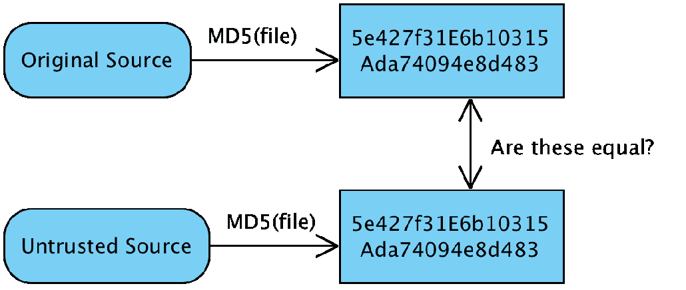
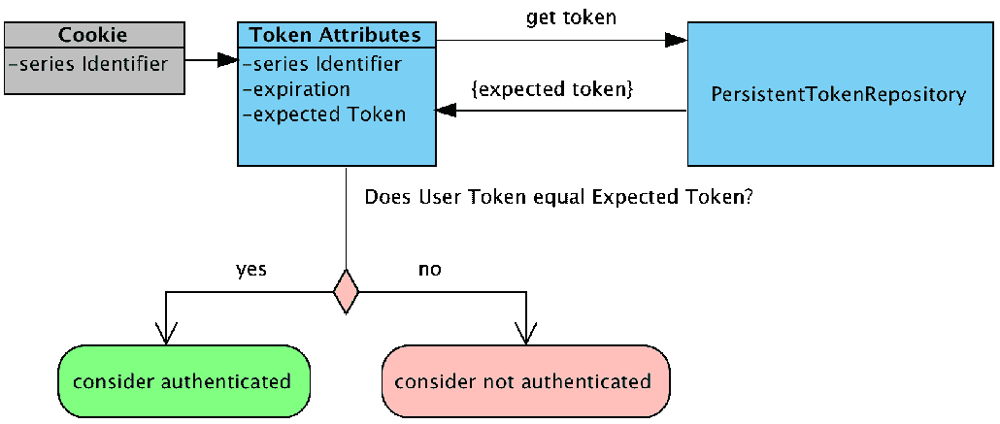
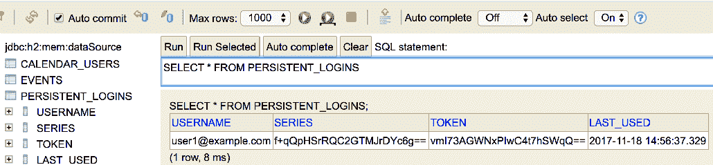

# 七、记得我吗

在本章中，我们将为应用添加记住用户的功能，即使他们的会话已过期且浏览器已关闭。本章将介绍以下主题：

*   讨论“记住我”是什么
*   学习如何使用基于**令牌的记住我**功能
*   讨论“记住我”有多安全，以及让它更安全的各种方法
*   启用基于持久性的“记住我”功能，以及如何处理使用该功能的其他注意事项
*   展示“记住我”的总体架构
*   学习如何创建仅限于用户 IP 地址的自定义 MemberMe 实现

# 你还记得我吗？

为经常使用网站的用户提供的一个方便功能是“记住我”功能。此功能允许用户选择即使在浏览器关闭后仍被记住。在 SpringSecurity 中，这是通过使用存储在用户浏览器中的 RememberMecookie 实现的。如果 Spring Security 识别出用户正在提供“记住我”cookie，则该用户将自动登录到应用中，并且不需要输入用户名或密码。

什么是饼干？
cookie 是客户端（即 web 浏览器）保持状态的一种方式。有关 Cookie 的更多信息，请参阅其他在线资源，如 Wikipedia（[http://en.wikipedia.org/wiki/HTTP_cookie](http://en.wikipedia.org/wiki/HTTP_cookie) 。

Spring Security 提供了以下两种不同的策略，我们将在本章中讨论：

*   第一个是基于令牌的记忆犹新功能，它依赖于加密签名
*   第二种方法是基于**持久性的记住我**功能，它需要一个数据存储（数据库）

如前所述，我们将在本章中更详细地讨论这些策略。必须明确配置“记住我”功能才能启用它。让我们从尝试基于令牌的“记住我”功能开始，看看它如何影响登录体验的流程。

# 依赖关系

除了[第 2 章](02.html)、*Spring Security 入门*中的基本设置之外，基于令牌的记忆我部分不需要任何其他依赖项。但是，如果您正在利用基于持久性的记住我功能，那么您需要确保在`pom.xml`文件中包含以下附加依赖项。我们已经在本章的示例中包含了这些依赖项，因此无需更新示例应用：

```java
    //build.gradle

    dependencies {
    // JPA / ORM / Hibernate:
 compile('org.springframework.boot:spring-boot-starter-data-jpa')    // H2 RDBMS
 runtime('com.h2database:h2')       ...
    }
```

# 基于令牌的“记住我”功能

SpringSecurity 提供了两种不同的“记住我”功能的实现。我们将从探索如何建立基于令牌的记忆我服务开始。

# 配置基于令牌的记忆功能

完成此练习将允许我们提供一种简单而安全的方法，让用户长时间登录。要开始，请执行以下步骤：

1.  修改`SecurityConfig.java`配置文件，增加`rememberMe`方式。

请看以下代码段：

```
        //src/main/java/com/packtpub/springsecurity/configuration/
        SecurityConfig.java

        @Override
        protected void configure(HttpSecurity http) throws Exception {
           ...
           http.rememberMe().key("jbcpCalendar")
           ...
        }
```

你应该从`chapter07.00-calendar`开始。

2.  如果我们现在尝试运行应用，我们将看到流程中没有什么不同。这是因为我们还需要在登录表单中添加一个字段，允许用户选择此功能。编辑`login.html`文件并添加复选框，如下代码段所示：

```
        //src/main/resources/templates/login.html

        <input type="password" id="password" name="password"/>
 <label for="remember-me">Remember Me?</label> <input type="checkbox" id="remember-me" name="remember_me" value="true"/>
        <div class="form-actions">
           <input id="submit" class="btn" name="submit" type="submit" 
           value="Login"/>
        </div>
```

您的代码应该类似于`chapter07.01-calendar`。

3.  下次登录时，如果选中“记住我”框，则会在用户浏览器中设置“记住我”cookie。

Spring Security 理解它应该通过检查 HTTP 参数`remember_me`来记住用户。

在 SpringSecurity3.1 和更早版本中，记住我表单字段的默认参数是`spring_security_remember_me`。现在，在 SpringSecurity4.x 中，默认的记住我表单字段是`remember-me`。这可以用`rememberMeParameter`方法覆盖。

4.  如果用户随后关闭浏览器并将其重新打开到 JBCP 日历网站上经过认证的页面，则他/她将不会再次看到登录页面。现在您可以自己尝试登录并选择“记住我”选项，为主页添加书签，然后重新启动浏览器并访问主页。您将看到，您立即成功登录，无需再次提供登录凭据。如果您出现这种情况，则表示您的浏览器或浏览器插件正在恢复会话。

尝试先关闭选项卡，然后关闭浏览器。

一个更有效的解决方案是使用浏览器插件，例如**Firebug**（[https://addons.mozilla.org/en-US/firefox/addon/firebug/](https://addons.mozilla.org/en-US/firefox/addon/firebug/) ），移除`JSESSIONID`饼干。在您的站点上开发和验证此类功能时，这通常可以节省时间和麻烦。

登录并选择记住我后，您会看到已经设置了两个 cookie，`JSESSIONID`和`remember-me`，如下图所示：


# 基于令牌的“记住我”功能的工作原理

“记住我”功能在用户浏览器中设置一个 cookie，其中包含一个 Base64 编码的字符串，其中包含以下片段：

*   用户名
*   到期日期/时间
*   `expiration`日期/时间、`username`、`password`和`rememberMe`方法的`key`属性的 MD5 哈希值

这些值组合成一个 cookie 值，存储在浏览器中供以后使用。

# MD5

MD5 是几种著名的加密哈希算法之一。加密散列算法计算具有任意长度的输入数据的紧凑且唯一的文本表示，称为**摘要**。此摘要可用于通过将不受信任输入的摘要与预期输入的已知有效摘要进行比较来确定是否应信任不受信任的输入。

下图说明了其工作原理：



例如，许多开源软件站点允许镜像分发其软件，以帮助提高下载速度。但是，作为该软件的用户，我们希望确保该软件是真实的，并且不包含任何病毒。软件分销商将计算预期的 MD5 校验和，并在其网站上发布其已知的良好版本的软件。然后，我们可以从任何位置下载该文件。在安装软件之前，我们计算下载文件上不受信任的 MD5 校验和。然后，我们将不受信任的 MD5 校验和与预期的 MD5 校验和进行比较。如果这两个值匹配，我们知道可以安全地安装下载的文件。如果两个值不匹配，我们不应该信任下载的文件并将其删除。

虽然无法从散列值获取原始数据，但 MD5 容易受到几种类型的攻击，包括利用算法本身的弱点和彩虹表攻击。Rainbow 表通常包含数百万个输入值的预先计算的哈希值。这使得攻击者能够在 rainbow 表中查找哈希值并确定实际（未清除的）值。SpringSecurity 通过在散列值中包含过期日期、用户密码和 RememberMe 密钥来解决这个问题。

# 记住我的签名

我们可以看到 MD5 如何确保下载了正确的文件，但这如何应用于 Spring Security 的记住我服务？很像我们下载的文件，cookie 是不可信的，但是如果我们能够验证来自应用的签名，我们就可以信任它。当一个请求与“记住我”cookie 一起进入时，将提取其内容，并将预期的签名与 cookie 中找到的签名进行比较。下图说明了计算预期签名的步骤：


记住我的 cookie 包含**用户名**、**到期日**和**签名**。Spring Security 将从 cookie 中提取**用户名**和**过期日期**。然后，它将利用 cookie 中的`username`使用`UserDetailsService`查找**密码**。**键**已经为人所知，因为它是使用`rememberMe`方法提供的。现在所有参数都已知了，Spring Security 可以使用**用户名**、**过期日期**、**密码**和**密钥**计算预期签名。然后，它将**预期签名**与 cookie 的**签名**进行比较。

如果两个签名匹配，我们可以相信**用户名**和**到期日期**是有效的。如果不知道 RememberMe 密钥（只有应用知道）和用户密码（只有该用户知道），伪造**签名**几乎是不可能的。这意味着如果签名匹配并且令牌未过期，则用户可以登录。

您已经预料到，如果用户更改其用户名或密码，任何记住我的令牌集将不再有效。如果您允许用户更改其帐户的这些内容，请确保向用户提供适当的消息。在本章后面，我们将研究一种仅依赖用户名而不依赖密码的“记住我”实现。

请注意，仍然可以区分使用“记住我”cookie 进行认证的用户和提供用户名和密码（或等效）凭据的用户。我们将在不久的将来研究“记住我”功能的安全性时对此进行试验。

# 基于令牌的 memberme 配置指令

以下两个配置更改通常用于更改“记住我”功能的默认行为：

| **属性** | **说明** |
| `key` | 定义生成“记住我”cookie 签名时使用的唯一密钥。 |
| `tokenValiditySeconds` | 定义时间长度（以秒为单位）。“记住我”cookie 将被视为对认证有效。它还用于设置 cookie 过期时间戳。 |

从 cookie 内容如何散列的讨论中可以推断，`key`属性对于 MemberMe 功能的安全性至关重要。确保您选择的密钥对于您的应用来说可能是唯一的，并且足够长，因此不容易猜到。

记住这本书的目的，我们将键值保持相对简单，但是如果您在自己的应用中使用“记住我”，建议您的键包含应用的唯一名称，并且至少有 36 个随机字符长。密码生成器工具（在谷歌上搜索“在线密码生成器”）是一种很好的方法，可以获得字母数字和特殊字符的伪随机组合，从而组成您的记忆钥匙。对于存在于多个环境（如开发、测试和生产）中的应用，“记住我”cookie 值也应包括这一事实。这将防止在测试期间在错误的环境中无意中使用 MemberMe Cookie！

生产应用中的示例键值可能类似于以下内容：

```
    prodJbcpCalendar-rmkey-paLLwApsifs24THosE62scabWow78PEaCh99Jus
```

`tokenValiditySeconds`方法用于设置秒数，在此秒数之后，自动登录功能将不接受 RememberMe 令牌，即使该令牌是有效的令牌。该属性还用于设置用户浏览器上“记住我”cookie 的最长生存期。

记忆我会话 cookie 的配置
如果`tokenValiditySeconds`设置为`-1`，则登录 cookie 将设置为会话 cookie，在用户关闭浏览器后不会持续。令牌的有效期（假设用户未关闭浏览器）为不可配置的两周。不要将它与存储用户会话 ID 的 cookie 混淆，它们是两个名称相似的不同事物！

您可能已经注意到，我们列出的属性很少。别担心，在本章中，我们将花时间介绍一些其他配置属性。

# 记得我安全吗？

为方便用户而添加的任何与安全相关的功能都有可能使我们精心保护的网站面临安全风险。默认形式的“记住我”功能有被恶意用户拦截和重用的风险。下图说明了可能发生的情况：


使用 SSL（见附录*附加参考资料*）和其他网络安全技术可以缓解此类攻击，但请注意，还有其他技术，如**跨站点脚本**（**XSS**）可能窃取或破坏已记住的用户会话。虽然对用户来说很方便，但如果记忆的会话被误用，我们不想冒财务或其他个人信息被无意更改或可能被盗的风险。

尽管在本书中我们没有详细介绍恶意用户行为，但在实施任何安全系统时，了解可能试图攻击您的客户或员工的用户所使用的技术是很重要的。XSS 就是这样一种技术，但还有许多其他技术。强烈建议您阅读*OWASP 前十篇文章*（[http://www.owasp.org/index.php/Category:OWASP_Top_Ten_Project](http://www.owasp.org/index.php/Category:OWASP_Top_Ten_Project) ）获得了一个很好的列表，并选择了一本 web 应用安全参考书，其中演示了许多适用于任何技术的技术。

保持便利性和安全性之间平衡的一种常见方法是确定网站上可能存在个人或敏感信息的功能位置。然后，您可以使用`fullyAuthenticated`表达式来确保这些位置受到保护，使用的授权不仅检查用户的角色，还检查它们是否已通过完整用户名和密码的认证。我们将在下一节更详细地探讨此功能。

# “记住我”的授权规则

稍后我们将在[第 11 章](11.html)、*细粒度访问控制*中全面探讨高级授权技术，但是，重要的是要认识到，可以根据是否记住经过认证的会话来区分访问规则。

假设我们想将试图访问 H2`admin`控制台的用户限制为使用用户名和密码进行认证的管理员。这类似于其他主要的以消费者为中心的商业网站的行为，这些网站在输入密码之前限制对网站提升部分的访问。请记住，每个站点都是不同的，所以不要盲目地将这些规则应用于您的安全站点。对于我们的示例应用，我们将集中于保护 H2 数据库控制台。更新`SecurityConfig.java`文件，使用关键字`fullyAuthenticated`，确保试图访问 H2 数据库的记忆用户被拒绝访问。这显示在以下代码段中：

```
    //src/main/java/com/packtpub/springsecurity/configuration/SecurityConfig.java

    @Override
    protected void configure(HttpSecurity http) throws Exception {
       ...
       http.authorizeRequests()
 .antMatchers("/admin/*") .access("hasRole(ADMIN) and isFullyAuthenticated()")       ...
       http.rememberMe().key("jbcpCalendar")
    }
```

现行规则保持不变。我们增加了一条规则，要求账户信息请求具有适当的`ROLE_ADMIN`的`GrantedAuthority`，并且用户经过完全认证；也就是说，在这个经过认证的会话期间，他们实际上提供了用户名和密码或其他合适的凭据。请注意此处 SpEL 逻辑运算符的语法-`AND`、`OR`和`NOT`用于 SpEL 中的逻辑运算符。SpEL 设计人员考虑到了这一点，因为`&&`操作符在 XML 中表示会很困难，即使前面的示例使用的是基于 Java 的配置！

您的代码应该类似于`chapter07.02-calendar`。

继续使用用户名`admin1@example.com`和密码`admin1`登录，确保您选择了“记住我”功能。访问 H2 数据库控制台，您将看到已授予访问权限。现在，删除`JSESSIONID`cookie（或关闭选项卡，然后关闭所有浏览器实例），并确保仍然授予对“所有事件”页面的访问权限。现在，导航到 H2 控制台并观察访问是否被拒绝。

这种方法将“记住我”功能的可用性增强与额外的安全级别结合起来，要求用户提供一整套凭据以访问敏感信息。在本章的其余部分中，我们将探讨使“记住我”功能更加安全的其他方法。

# 记得我吗

Spring Security 提供了通过利用`RememberMeServices`接口的不同实现来改变验证 remember me cookie 的方法的能力。在本节中，我们将讨论如何使用数据库使用持久性 memberme 令牌，以及如何提高应用的安全性。

# 使用基于持久性的“记住我”功能

在这一点上修改我们的 memberme 配置以持久化到数据库是非常简单的。SpringSecurity配置解析器将在`rememberMe`方法上识别新的`tokenRepository`方法，并简单地切换`RememberMeServices`的实现类。现在让我们回顾一下完成此任务所需的步骤。

# 添加 SQL 以创建“记住我”模式

我们已将包含预期模式的 SQL 文件放置在我们的`resources`文件夹中，与[第 3 章](03.html)*自定义认证*中的位置相同。您可以在以下代码段中查看架构定义：

```
    //src/main/resources/schema.sql

    ...
    create table persistent_logins (
       username varchar_ignorecase(100) not null,
       series varchar(64) primary key,
       token varchar(64) not null,
       last_used timestamp not null
    );
    ...
```

# 使用“记住我”模式初始化数据源

SpringData将使用`schema.sql`自动初始化嵌入式数据库，如前一节所述。但是，请注意，对于 JPA，为了创建模式和用于为数据库种子的`data.sql`文件，我们必须确保将`ddl-auto`设置为无，如下代码所示：

```
    //src/main/resources/application.yml

    spring:
    jpa:
       database-platform: org.hibernate.dialect.H2Dialect
       hibernate:
 ddl-auto: none
```

# 配置基于持久性的“记住我”功能

最后，我们需要对`rememberMe`声明进行一些简短的配置更改，以将其指向我们正在使用的数据源，如以下代码段所示：

```
   //src/main/java/com/packtpub/springsecurity/configuration/SecurityConfig.java

   @Autowired
   @SuppressWarnings("SpringJavaAutowiringInspection")
 private DataSource dataSource;    @Autowired
 private PersistentTokenRepository persistentTokenRepository;    @Override
    protected void configure(HttpSecurity http) throws Exception {
       ...
       http.rememberMe()
           .key("jbcpCalendar")
 .tokenRepository(persistentTokenRepository)       ...
    }
 @Bean public PersistentTokenRepository persistentTokenRepository() { JdbcTokenRepositoryImpl db = new JdbcTokenRepositoryImpl(); db.setDataSource(dataSource); return db; }
```

这就是切换到使用基于持久性的 MemberMe 认证所需要做的全部工作。继续，启动应用并尝试一下。从用户的角度来看，我们没有注意到任何差异，但我们知道支持此功能的实现已经改变。

您的代码应该类似于`chapter07.03-calendar`。

# 基于持久性的“记住我”功能是如何工作的？

基于持久性的 RememberMe 服务不验证 cookie 中的签名，而是验证数据库中是否存在令牌。每个持久的“记住我”cookie 由以下内容组成：

*   **系列标识符**：标识用户的初始登录，并在用户每次自动登录到原始会话时保持一致
*   **令牌值**：每次使用“记住我”功能对用户进行认证时都会更改的唯一值

请看下图：



提交 MemberMe cookie 时，Spring Security 将使用一个`o.s.s.web.authentication.rememberme.PersistentTokenRepository`实现来查找预期的令牌值和使用提交的序列标识符的到期时间。然后将 cookie 中的令牌值与预期的令牌值进行比较。如果令牌未过期且两个令牌匹配，则认为用户已通过认证。将生成具有相同序列标识符、新令牌值和更新过期日期的新 MemberMe cookie。

如果在数据库中找到提交的序列令牌，但令牌不匹配，则可以假定有人偷了“记住我”cookie。在这种情况下，Spring Security 将终止这些系列的 Memory me 令牌，并警告用户他们的登录已被破坏。

可以在数据库中找到持久化令牌，并使用 H2 控制台查看，如以下屏幕截图所示：



# 基于 JPA 的 PersistentTokenRepository

正如我们在前面几章中所看到的，使用 SpringData项目进行数据库映射可以大大简化我们的工作。因此，为了保持一致性，我们将把使用`JdbcTokenRepositoryImpl`的基于 JDBC 的`PersistentTokenRepository`接口重构为基于 JPA 的接口。我们将通过执行以下步骤来实现：

1.  首先，让我们创建一个域对象来保存持久登录，如以下代码段所示：

```
        //src/main/java/com/packtpub/springsecurity/domain/
        PersistentLogin.java 

        import org.springframework.security.web.authentication.rememberme.
        PersistentRememberMeToken;
        import javax.persistence.*;
        import java.io.Serializable;
        import java.util.Date;
        @Entity
        @Table(name = "persistent_logins")
        public class PersistentLogin implements Serializable {
           @Id
           private String series;
           private String username;
           private String token;
           private Date lastUsed;
           public PersistentLogin(){}
           public PersistentLogin(PersistentRememberMeToken token){
               this.series = token.getSeries();
               this.username = token.getUsername();
               this.token = token.getTokenValue();
               this.lastUsed = token.getDate();
           }
          ...
```

2.  接下来，我们需要创建一个`o.s.d.jpa.repository.JpaRepository`存储库实例，如下面的代码片段所示：

```
        //src/main/java/com/packtpub/springsecurity/repository/
        RememberMeTokenRepository.java

        import com.packtpub.springsecurity.domain.PersistentLogin;
        import org.springframework.data.jpa.repository.JpaRepository;
        import java.util.List;
        public interface RememberMeTokenRepository extends  
        JpaRepository<PersistentLogin, String> {
            PersistentLogin findBySeries(String series);
            List<PersistentLogin> findByUsername(String username);
        }
```

3.  现在，我们需要创建一个定制的`PersistentTokenRepository`接口来替换`Jdbc`实现。我们有四种必须重写的方法，但代码看起来应该相当熟悉，因为我们将在所有操作中使用 JPA：

```
         //src/main/java/com/packtpub/springsecurity/web/authentication/
         rememberme/JpaPersistentTokenRepository.java:

         ...
         public class JpaPersistentTokenRepository implements 
         PersistentTokenRepository {
               private RememberMeTokenRepository rememberMeTokenRepository;
               public JpaPersistentTokenRepository
               (RememberMeTokenRepository rmtr) {
                  this.rememberMeTokenRepository = rmtr;
           }
           @Override
           public void createNewToken(PersistentRememberMeToken token) {
               PersistentLogin newToken = new PersistentLogin(token);
               this.rememberMeTokenRepository.save(newToken);
           }
          @Override
          public void updateToken(String series, String tokenValue, 
          Date lastUsed) {
               PersistentLogin token = this.rememberMeTokenRepository
               .findBySeries(series);
               if (token != null) {
                   token.setToken(tokenValue);
                   token.setLastUsed(lastUsed);
                   this.rememberMeTokenRepository.save(token);
               }
           }
        @Override
           public PersistentRememberMeToken 
           getTokenForSeries(String seriesId) {
               PersistentLogin token = this.rememberMeTokenRepository
               .findBySeries(seriesId);
               return new PersistentRememberMeToken(token.getUsername(),
               token.getSeries(), token.getToken(), token.getLastUsed());
           }
           @Override
         public void removeUserTokens(String username) {
             List<PersistentLogin> tokens = this.rememberMeTokenRepository
             .findByUsername(username);
              this.rememberMeTokenRepository.delete(tokens);
           }
        }
```

4.  现在，我们需要在`SecurityConfig.java`文件中做一些更改来声明新的`PersistentTokenTokenRepository`接口，但上一节的其余配置没有更改，如下面的代码段所示：

```
            //src/main/java/com/packtpub/springsecurity/configuration/
            SecurityConfig.java

            //@Autowired
            //@SuppressWarnings("SpringJavaAutowiringInspection")
            //private DataSource dataSource;
            @Autowired
 private PersistentTokenRepository persistentTokenRepository;            ...
 @Bean public PersistentTokenRepository persistentTokenRepository( RememberMeTokenRepository rmtr) { return new JpaPersistentTokenRepository(rmtr); }
```

5.  这就是将 JDBC 切换到基于 JPA 持久性的 MemberMe 认证所需要做的全部工作。继续，启动应用并尝试一下。从用户的角度来看，我们没有注意到任何差异，但我们知道支持此功能的实现已经改变。

您的代码应该类似于`chapter07.04-calendar`。

# 自定义记忆服务

到目前为止，我们使用了一个相当简单的`PersistentTokenRepository`实现。我们使用了 JDBC 支持和 JPA 支持的实现。这提供了对 cookie 持久性的有限控制；如果我们想要更多的控制，我们可以将我们的`PersistentTokenRepository`接口包装在`RememberMeServices`中。Barry Jaspan 有一篇关于*改进的持久登录 Cookie 最佳实践*（[的精彩文章 http://jaspan.com/improved_persistent_login_cookie_best_practice](http://jaspan.com/improved_persistent_login_cookie_best_practice) 。Spring Security 有一个稍加修改的版本，如前所述，称为`PersistentTokenBasedRememberMeServices`，我们可以将自定义`PersistentTokenRepository`接口封装在其中，并在我们的 Memory me 服务中使用。

在下一节中，我们将使用`PersistentTokenBasedRememberMeServices`包装我们现有的`PersistentTokenRepository`接口，并使用`rememberMeServices`方法将其连接到我们的 RememberMe 声明中：

```
    //src/main/java/com/packtpub/springsecurity/configuration/SecurityConfig.java

    //@Autowired
    //private PersistentTokenRepository persistentTokenRepository;
    @Autowired
    private RememberMeServices rememberMeServices;
    @Override
    protected void configure(HttpSecurity http) throws Exception {
       ...
       http.rememberMe()
           .key("jbcpCalendar")
 .rememberMeServices(rememberMeServices)       ...
    }
 @Bean public RememberMeServices rememberMeServices
    (PersistentTokenRepository ptr){ PersistentTokenBasedRememberMeServices rememberMeServices = new 
       PersistentTokenBasedRememberMeServices("jbcpCalendar", 
userDetailsService, ptr);
 rememberMeServices.setAlwaysRemember(true); return rememberMeServices; }
```

您的代码应该类似于`chapter07.05-calendar`。

数据库支持的持久令牌是否更安全？

就像`TokenBasedRememberMeServices`一样，持久代币可能会受到 cookie 盗窃或其他中间人技术的影响。如附录*附加参考资料*所述，SSL 的使用可以绕过中间人技术。如果您使用的是 Servlet 3.0 环境（即 Tomcat 7+），Spring Security 会将 cookie 标记为`HttpOnly`，这将有助于在应用中出现 XSS 漏洞时防止 cookie 被盗。要了解有关`HttpOnly`属性的更多信息，请参阅本章前面提供的有关 cookies 的外部资源。

使用基于持久性的 memberme 功能的一个优点是，我们可以检测 cookie 是否受损。如果提供了正确的 series token 和错误的 token，我们知道使用该 series token 的任何 RememberMe 功能都应被视为已被破坏，我们应该终止与之相关的任何会话。由于验证是有状态的，我们还可以终止特定的“记住我”功能，而无需更改用户密码。

# 清理过期的“记住我”会话

使用基于持久性的 memberme 特性的缺点是没有内置的清除过期会话的支持。为了做到这一点，我们需要实现一个后台进程来清理过期的会话。我们在本章的示例代码中包含了执行清理的代码。

为了简洁起见，我们在下面的代码段中显示了一个不进行验证或错误处理的版本。您可以在本章的示例代码中查看完整版本：

```
    //src/main/java/com/packtpub/springsecurity/web/authentication/rememberme/
    JpaTokenRepositoryCleaner.java

    public class JpaTokenRepositoryImplCleaner
    implements Runnable {
       private final RememberMeTokenRepository repository;
       private final long tokenValidityInMs;
       public JpaTokenRepositoryImplCleaner(RememberMeTokenRepository 
       repository, long tokenValidityInMs) {
           if (rememberMeTokenRepository == null) {
               throw new IllegalArgumentException("jdbcOperations cannot 
               be null");
           }
           if (tokenValidityInMs < 1) {
               throw new IllegalArgumentException("tokenValidityInMs 
               must be greater than 0\. Got " + tokenValidityInMs);
           }
           this. repository = repository;
           this.tokenValidityInMs = tokenValidityInMs;
       }
           public void run() {
           long expiredInMs = System.currentTimeMillis() 
           - tokenValidityInMs;             
              try {
               Iterable<PersistentLogin> expired = 
               rememberMeTokenRepository
               .findByLastUsedAfter(new Date(expiredInMs));
               for(PersistentLogin pl: expired){
                   rememberMeTokenRepository.delete(pl);
               }
           } catch(Throwable t) {...}
       }
    }
```

本章的示例代码还包括一个简单的 Spring 配置，它将每十分钟执行一次 cleaner。如果您不熟悉 Spring 的任务抽象，并且想学习它，那么您可能想在[的 Spring 参考中阅读更多关于它的内容 https://docs.spring.io/spring/docs/current/spring-framework-reference/html/scheduling.html](https://docs.spring.io/spring/docs/current/spring-framework-reference/html/scheduling.html) 。您可以在以下代码段中找到相关配置。为清楚起见，我们将此调度程序放在`JavaConfig.java`文件中：

```
    //src/main/java/com/packtpub/springsecurity/configuration/
    JavaConfig.java@Configuration

    @Import({SecurityConfig.class})
 @EnableScheduling    public class JavaConfig {
 @Autowired private RememberMeTokenRepository rememberMeTokenRepository; @Scheduled(fixedRate = 10_000) public void tokenRepositoryCleaner(){ Thread trct = new Thread(new JpaTokenRepositoryCleaner(
 rememberMeTokenRepository, 60_000L));
 trct.start(); }    }
```

请记住，此配置不支持群集。因此，如果将其部署到集群，则 cleaner 将为部署应用的每个 JVM 执行一次。

启动应用并尝试更新。提供的配置将确保每十分钟执行一次清洁器。您可能希望更改 cleaner 任务以更频繁地运行，并通过修改`@Scheduled`声明来清理最近使用的 RememberMe 令牌。然后，您可以创建一些 memberme 令牌，并通过在 H2 数据库控制台中查询它们来查看它们是否被删除。

您的代码应该类似于`chapter07.06-calendar`。

# 记得我的架构

我们已经讨论了`TokenBasedRememberMeServices`和`PersistentTokenBasedRememberMeServices`的基本架构，但没有描述总体架构。让我们看看所有“记住我”的片段是如何组合在一起的。

下图说明了验证基于令牌的 MemberMe 令牌过程中涉及的不同组件：


与任何 SpringSecurity过滤器一样，`RememberMeAuthenticationFilter`是从`FilterChainProxy`中调用的。`RememberMeAuthenticationFilter`的工作是检查请求，如果感兴趣，则采取行动。`RememberMeAuthenticationFilter`界面将使用`RememberMeServices`实现来确定用户是否已经登录。`RememberMeServices`接口通过检查 HTTP 请求中的 Memory me cookie 来实现这一点，然后使用我们前面讨论的基于令牌的验证或基于持久性的验证对该 cookie 进行验证。如果令牌签出，用户将登录。

# 还记得我和用户的生命周期吗

`RememberMeServices`的实现在用户生命周期（经过认证的用户会话的生命周期）的多个点被调用。为了帮助您理解记忆我功能，了解记忆我服务被告知生命周期功能的时间点可能会有所帮助：

| **动作** | **该怎么办？** | **调用的 RememberServices 方法** |
| 成功登录 | 实现设置一个记住我的 cookie（如果发送了`form`参数） | `loginSuccess` |
| 登录失败 | 实现应该取消 cookie（如果存在） | `loginFailed` |
| 用户注销 | 实现应该取消 cookie（如果存在） | `logout` |

`RememberMeServices`界面上不存在`logout`方法。相反，每个`RememberMeServices`实现还实现了包含`logout`方法的`LogoutHandler`接口。通过实现`LogoutHandler`接口，每个`RememberMeServices`实现可以在用户注销时执行必要的清理。

当我们开始创建自定义认证处理程序时，了解`RememberMeServices`与用户生命周期的联系在何处以及如何联系将非常重要，因为我们需要确保任何认证处理器一致地处理`RememberMeServices`以保持此功能的有用性和安全性。

# 将“记住我”功能限制为 IP 地址

让我们将对“记住我”体系结构的理解付诸实践。一个常见的要求是，任何记住我的令牌都应该绑定到创建它的用户的 IP 地址。这为“记住我”功能增加了额外的安全性。为此，我们只需要实现一个定制的`PersistentTokenRepository`接口。我们将进行的配置更改将说明如何配置自定义`RememberMeServices`。在本节中，我们将了解本章源代码中包含的`IpAwarePersistentTokenRepository`。`IpAwarePersistenTokenRepository`接口确保序列标识符在内部与当前用户的 IP 地址相结合，并且序列标识符在外部仅包括该标识符。这意味着无论何时查找或保存令牌，都将使用当前 IP 地址查找或保留令牌。在下面的代码片段中，您可以看到`IpAwarePersistentTokenRepository`是如何工作的。如果您想更深入地挖掘，我们鼓励您查看本章包含的源代码。

查找 IP 地址的诀窍是使用 Spring Security 的`RequestContextHolder`。有关守则如下：

需要注意的是，为了使用`RequestContextHolder`，您需要确保您已将`web.xml`文件设置为使用`RequestContextListener`。我们已经为示例代码执行了此设置。但是，在外部应用中使用示例代码时，这可能很有用。有关如何设置的详细信息，请参阅`IpAwarePersistentTokenRepository`的 Javadoc。

请看以下代码段：

```
    //src/main/java/com/packtpub/springsecurity/web/authentication/rememberme/
    IpAwarePersistentTokenRepository.java

    private String ipSeries(String series) {
    ServletRequestAttributes attributes = (ServletRequestAttributes)
    RequestContextHolder.getRequestAttributes();
    return series + attributes.getRequest().getRemoteAddr();
    }
```

我们可以基于此方法强制保存的令牌将 IP 地址包含在序列标识符中，如下所示：

```
    public void createNewToken(PersistentRememberMeToken token) {
      String ipSeries = ipSeries(token.getSeries());
      PersistentRememberMeToken ipToken = tokenWithSeries(token, ipSeries);
      this.delegateRepository.createNewToken(ipToken);
    }
```

您可以看到，我们首先创建了一个新系列，并将 IP 地址连接到该系列。`tokenWithSeries`方法只是一个助手，它使用所有相同的值创建一个新的标记，除了一个新的序列。然后，我们向`delegateRepsository`提交包含 IP 地址的序列标识符的新令牌，这是`PersistentTokenRepository`的原始实现。

无论何时查找令牌，我们都要求将当前用户的 IP 地址附加到序列标识符。这意味着用户无法为具有不同 IP 地址的用户获取令牌：

```
    public PersistentRememberMeToken getTokenForSeries(String seriesId) {
       String ipSeries = ipSeries(seriesId);
       PersistentRememberMeToken ipToken = delegateRepository.
       getTokenForSeries(ipSeries);
       return tokenWithSeries(ipToken, seriesId);
    }
```

代码的其余部分非常类似。在内部，我们构造要附加到 IP 地址的序列标识符，在外部，我们只提供原始序列标识符。通过这样做，我们强制执行一个约束，即只有创建记住我令牌的用户才能使用它。

让我们回顾一下本章`IpAwarePersistentTokenRepository`示例代码中包含的 Spring 配置。在下面的代码片段中，我们首先创建包装新的`JpaPersistentTokenRepository`声明的`IpAwarePersistentTokenRepository`声明。然后我们通过实例化一个`OrderedRequestContextFilter`接口来初始化一个`RequestContextFilter`类：

```
    //src/main/java/com/packtpub/springsecurity/web/configuration/WebMvcConfig.java

    @Bean
    public IpAwarePersistentTokenRepository 
    tokenRepository(RememberMeTokenRepository rmtr) {
       return new IpAwarePersistentTokenRepository(
               new JpaPersistentTokenRepository(rmtr)
       );
    }
    @Bean
    public OrderedRequestContextFilter requestContextFilter() {
       return new OrderedRequestContextFilter();
    }
```

为了让 Spring Security 利用我们的定制`RememberMeServices`，我们需要更新安全配置以指向它。继续并对`SecurityConfig.java`进行以下更新：

```
    //src/main/java/com/packtpub/springsecurity/configuration/SecurityConfig.java

     @Override
     protected void configure(HttpSecurity http) throws Exception {
       ...
       // remember me configuration
      http.rememberMe()
           .key("jbcpCalendar")
 .rememberMeServices(rememberMeServices);     }
    @Bean
 public RememberMeServices rememberMeServices
    (PersistentTokenRepository ptr){
       PersistentTokenBasedRememberMeServices rememberMeServices = new 
       PersistentTokenBasedRememberMeServices("jbcpCalendar", 
       userDetailsService, ptr);
       return rememberMeServices;
    }
```

现在，继续并启动应用。您可以使用第二台计算机和一个插件（如 Firebug）来操纵您的“记住我”cookie。如果您试图从一台计算机在另一台计算机上使用“记住我”cookie，Spring Security 现在将忽略“记住我”请求并删除关联的 cookie。

您的代码应该类似于`chapter07.07-calendar`。

请注意，如果用户在共享或负载平衡的网络基础设施（如多 WAN 公司环境）后面，则基于 IP 的 Memory me 令牌可能会出现意外行为。然而，在大多数情况下，将 IP 地址添加到“记住我”功能会为有用的用户功能提供额外的、受欢迎的安全层。

# 自定义 cookie 和 HTTP 参数名称

好奇的用户可能想知道，是否可以将“记住我”表单字段复选框的预期值更改为“记住我”，或将 cookie 名称更改为“记住我”，以隐藏 SpringSecurity的使用。可以在两个位置之一进行此更改。请看以下步骤：

1.  首先，我们可以在`rememberMe`方法中添加其他方法，如下所示：

```
        //src/main/java/com/packtpub/springsecurity/configuration/
        SecurityConfig.java

        http.rememberMe()
               .key("jbcpCalendar")
 .rememberMeParameter("jbcpCalendar-remember-me") .rememberMeCookieName("jbcpCalendar-remember-me");
```

2.  此外，现在我们已经将自己的`RememberMeServices`实现声明为 Springbean，我们可以简单地定义更多属性来更改复选框和 cookie 名称，如下所示：

```
        //src/main/java/com/packtpub/springsecurity/configuration/
        SecurityConfig.java

        @Bean
        public RememberMeServices rememberMeServices
        (PersistentTokenRepository ptr){
           PersistentTokenBasedRememberMeServices rememberMeServices = new 
           PersistentTokenBasedRememberMeServices("jbcpCalendar", 
           userDetailsService, ptr);
 rememberMeServices.setParameter("obscure-remember-me"); rememberMeServices.setCookieName("obscure-remember-me");           return rememberMeServices;
        }
```

3.  别忘了更改`login.html`页面以设置复选框`form`字段的名称并匹配我们声明的参数值。继续并对`login.html`进行更新，如下所示：

```
        //src/main/resources/templates/login.html

        <input type="checkbox" id="remember" name=" obscure-remember-me" 
        value="true"/>
```

4.  我们鼓励您在此进行实验，以确保您了解这些设置是如何相互关联的。继续，启动应用并尝试一下。

您的代码应该类似于`chapter07.08-calendar`。

# 总结

本章解释并演示了在 SpringSecurity 中使用 MemberMe 功能。我们从最基本的设置开始，并学习如何逐渐使该功能更加安全。具体来说，我们了解了一个基于令牌的记忆我服务以及如何配置它。我们还将探讨基于持久性的 MemberMe 服务如何提供额外的安全性，它是如何工作的，以及在使用它们时需要考虑的其他事项。

我们还介绍了如何创建一个自定义的 memberme 实现，该实现将 memberme 令牌限制为特定的 IP 地址。我们看到了各种其他方法，使“记住我”功能更加安全。

接下来是基于证书的认证，我们将讨论如何使用受信任的客户端证书执行认证。