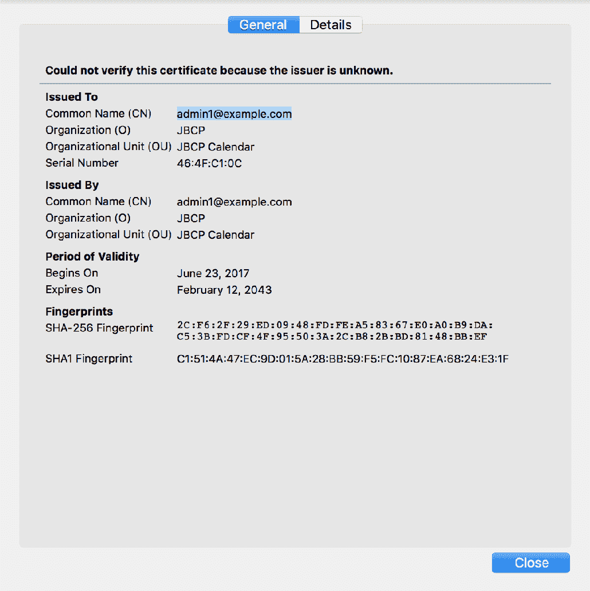
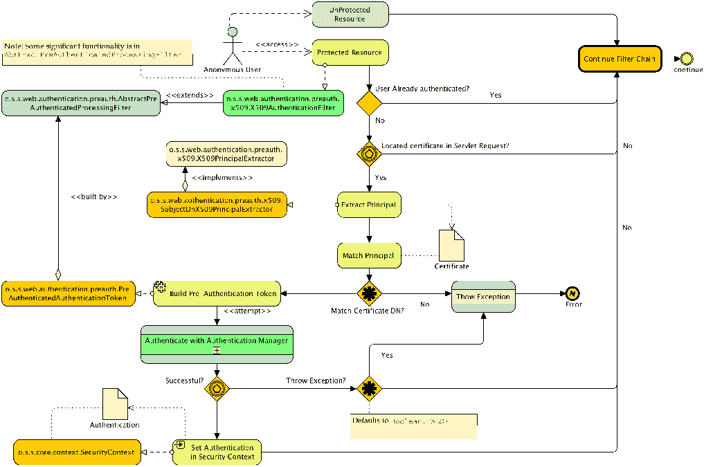

# 使用 TLS 进行客户端证书身份验证

尽管用户名和密码认证非常常见，但正如我们在[第 1 章](01.html)、*不安全应用程序剖析*和[第 2 章](02.html)、*Spring Security 入门*中所讨论的，存在允许用户提供不同类型凭据的身份验证形式。SpringSecurity 也满足了这些要求。在本章中，我们将超越基于表单的身份验证，探索使用可信客户端证书的身份验证。

在本章中，我们将介绍以下主题：

*   了解如何在用户浏览器和兼容服务器之间协商客户端证书身份验证
*   配置 Spring 安全性以使用客户端证书对用户进行身份验证
*   了解 Spring Security 中客户端证书认证的体系结构
*   探索与客户端证书身份验证相关的高级配置选项
*   查看处理客户端证书身份验证时的优缺点和常见故障排除步骤

# 客户端证书身份验证是如何工作的？

客户端证书身份验证需要服务器请求信息和浏览器响应，以协商客户端（即用户的浏览器）和服务器应用程序之间的可信身份验证关系。这种信任关系是通过使用可信任和可验证的凭证交换建立的，称为**证书**。

与目前为止我们所看到的许多不同，对于客户端证书身份验证，servlet 容器或应用程序服务器本身通常负责协商浏览器和服务器之间的信任关系，方法是请求证书、评估证书并将其视为有效证书。

客户端证书认证也称为**相互认证**，是**安全套接字层**（**SSL**协议及其后续协议**传输层安全**（**TLS**协议的一部分。由于相互身份验证是 SSL 和 TLS 协议的一部分，因此，为了使用客户端证书身份验证，需要 HTTPS 连接（用 SSL 或 TLS 保护）。有关 Spring Security 中 SSL/TLS 支持的更多详细信息，请参阅附录*附加参考资料*中的讨论和 SSL/TLS 的实现。在 Tomcat（或您一直在使用的应用服务器以及示例）中设置 SSL/TLS 是实现客户端证书身份验证所必需的。如附录*附加参考资料*中所述，在本章剩余部分中，我们将 SSL/TLS 称为 SSL。

以下序列图说明了协商 SSL 连接和验证用于相互身份验证的客户端证书的信任时，客户端浏览器和 web 服务器之间的交互：


我们可以看到，两个证书（服务器和客户端证书）的交换提供了身份验证，即双方都是已知的，并且可以信任他们安全地继续他们的对话。为了清晰起见，我们省略了 SSL 握手的一些细节，并信任证书本身的检查；但是，我们鼓励您进一步阅读 SSL 和 TLS 协议，以及一般的证书，因为有很多关于这些主题的好参考指南。*RFC 5246*、*传输层安全（TLS）协议版本 1.2*（[http://tools.ietf.org/html/rfc5246](http://tools.ietf.org/html/rfc5246) ），是开始阅读客户证书演示的好地方，如果您想了解更多细节，*SL 和 TLS：设计和构建安全系统，Eric Rescorla，Addison Wesley*[https://www.amazon.com/SSL-TLS-Designing-Building-Systems/dp/0201615983](https://www.amazon.com/SSL-TLS-Designing-Building-Systems/dp/0201615983) 对协议及其实施进行了极其详细的审查。

基于客户端证书的身份验证的另一个名称是 X.509 身份验证。术语 X.509 源于 X.509 标准，最初由 ITU-T 组织发布，用于基于 X.500 标准的目录（LDAP 的起源，您可能会从[第 6 章](06.html)、*LDAP 目录服务*中回忆到）。后来，该标准被改编用于保护互联网通信安全。

我们在这里提到这一点是因为 SpringSecurity 中与此主题相关的许多类都参考了 X.509。请记住，X.509 并没有定义相互身份验证协议本身，而是定义了证书的格式和结构以及包含的可信证书颁发机构。

# 设置客户端证书身份验证基础结构

不幸的是，作为一名独立的开发人员，在与 Spring Security 相对容易地集成之前，要想尝试客户端证书身份验证，需要进行一些非常重要的配置和设置。由于这些设置步骤往往会给初次开发人员带来很多问题，我们认为带您了解这些步骤很重要。

我们假设您使用的是本地自签名服务器证书、自签名客户端证书和 ApacheTomcat。这是大多数开发环境的典型特征；但是，您可能有权访问有效的服务器证书、**证书颁发机构**（**CA**）或其他应用程序服务器。如果是这种情况，您可以使用这些设置说明作为指导，并以类似的方式配置您的环境。请参阅附录*附加参考资料*中的 SSL 设置说明，以获取有关配置 Tomcat 和 Spring Security 以在独立环境中使用 SSL 的帮助。

# 了解公钥基础结构的用途

本章着重于为学习和教育目的建立一个独立的发展环境。但是，在大多数情况下，当您将 Spring Security 集成到现有的客户端证书安全环境中时，将有大量的基础设施（通常是硬件和软件的组合）提供功能，例如证书授予和管理、用户自助服务和撤销。这种类型的环境定义了一个公钥基础设施——硬件、软件和安全策略的组合，从而形成一个高度安全的身份验证驱动的网络生态系统。

除了用于 web 应用程序身份验证之外，这些环境中的证书或硬件设备还可用于安全、不可否认的电子邮件（使用 S/MIME）、网络身份验证，甚至物理建筑访问（使用基于 PKCS 11 的硬件设备）。

虽然这样一个环境的管理开销可能很高（并且需要 IT 和流程的卓越性才能很好地实施），但对于技术专业人员来说，它可以说是最安全的操作环境之一。

# 创建客户端证书密钥对

通过使用`keytool`命令生成密钥对，以与创建自签名服务器证书相同的方式创建自签名客户端证书。客户端证书密钥对的不同之处在于，它要求密钥存储对 web 浏览器可用，并要求将客户端的公钥加载到服务器的信任存储中（稍后我们将解释这是什么）。

如果您现在不想生成自己的密钥，可以跳到下一节，使用示例章节`./src/main/resources/keys`文件夹中的示例证书。否则，创建客户端密钥对，如下所示：

```
keytool -genkeypair -alias jbcpclient -keyalg RSA -validity 365 -keystore jbcp_clientauth.p12 -storetype PKCS12
```

您可以在 Oracle 的站点[找到关于`keytool`的其他信息以及所有配置选项 http://docs.oracle.com/javase/8/docs/technotes/tools/unix/keytool.html/keytool.html](http://docs.oracle.com/javase/8/docs/technotes/tools/unix/keytool.html/keytool.html) 。

对于这个用例，`keytool`的大多数参数都是相当随意的。但是，当提示为客户端证书设置名字和姓氏（通用名或 CN，所有者 DN 的一部分）时，请确保第一个提示的答案与我们在 Spring Security JDBC 存储中设置的用户匹配。例如，`admin1@example.com`是一个合适的值，因为我们在 Spring Security 中有`admin1@example.com`用户设置。命令行交互的示例如下所示：

```
What is your first and last name?
[Unknown]: admin1@example.com
... etc
Is CN=admin1@example.com, OU=JBCP Calendar, O=JBCP, L=Park City, ST=UT, C=US correct?
[no]: yes
```

我们将在配置 Spring 安全性以访问通过证书身份验证的用户的信息时了解这一点的重要性。在 Tomcat 中设置证书身份验证之前，我们还有最后一步，这将在下一节中解释。

# 配置 Tomcat 信任存储

回想一下，密钥对的定义包括私钥和公钥。与 SSL 证书验证和保护服务器通信类似，客户端证书的有效性需要由创建它的认证机构进行验证。

由于我们已经使用`keytool`命令创建了自己的自签名客户端证书，Java VM 不会隐式信任它，因为它是由可信证书颁发机构分配的。

让我们来看看下面的步骤：

1.  我们需要强制 Tomcat 将该证书识别为可信证书。我们通过从密钥对导出公钥并将其添加到 Tomcat 信任存储中来实现这一点。
2.  同样，如果您现在不想执行此步骤，您可以使用`.src/main/resources/keys`中现有的信任存储，并跳到本节后面配置`server.xml`的地方。

3.  我们将公钥导出到名为`jbcp_clientauth.cer`的标准证书文件中，如下所示：

```
 keytool -exportcert -alias jbcpclient -keystore jbcp_clientauth.p12 
      -storetype PKCS12 -storepass changeit -file jbcp_clientauth.cer
```

4.  接下来，我们将把证书导入到信任存储中（这将创建信任存储，但在典型的部署场景中，信任存储中可能已经有一些其他证书）：

```
 keytool -importcert -alias jbcpclient -keystore tomcat.truststore 
      -file jbcp_clientauth.cer
```

前面的命令将创建名为`tomcat.truststore`的信任存储并提示您输入密码（我们选择了密码`changeit`。您还将看到有关该证书的一些信息，并最终被要求确认您确实信任该证书，如下所示：

```
 Owner: CN=admin1@example.com, OU=JBCP Calendar, O=JBCP, L=Park City,
      ST=UT, C=US Issuer: CN=admin1@example.com, OU=JBCP Calendar, O=JBCP, L=Park City,
      ST=UT, C=US Serial number: 464fc10c Valid from: Fri Jun 23 11:10:19 MDT 2017 until: Thu Feb 12 10:10:19 
      MST 2043      //Certificate fingerprints:

 MD5: 8D:27:CE:F7:8B:C3:BD:BD:64:D6:F5:24:D8:A1:8B:50 SHA1: C1:51:4A:47:EC:9D:01:5A:28:BB:59:F5:FC:10:87:EA:68:24:E3:1F SHA256: 2C:F6:2F:29:ED:09:48:FD:FE:A5:83:67:E0:A0:B9:DA:C5:3B:
      FD:CF:4F:95:50:3A:
      2C:B8:2B:BD:81:48:BB:EF Signature algorithm name: SHA256withRSA Version: 3      //Extensions

 #1: ObjectId: 2.5.29.14 Criticality=false
 SubjectKeyIdentifier [
 KeyIdentifier [
 0000: 29 F3 A7 A1 8F D2 87 4B   EA 74 AC 8A 4B BC 4B 5D 
      )......K.t..K.K]
 0010: 7C 9B 44 4A                                       ..DJ
 ]
 ]
 Trust this certificate? [no]: yes
```

记住新的`tomcat.truststore`文件的位置，因为我们需要在 Tomcat 配置中引用它。

密钥存储和信任存储有什么区别？
**Java 安全套接字扩展**（**JSSE**文档）将密钥存储定义为私钥及其对应公钥的存储机制。密钥存储（包含密钥对）用于加密或解密安全消息，等等。信任存储旨在验证身份时仅存储受信任通信伙伴的公钥（类似于在证书身份验证中使用信任存储）。然而，在许多常见的管理场景中，密钥存储和信任存储被合并到一个文件中（在 Tomcat 中，这将通过使用连接器的`keystoreFile`和`truststoreFile`属性来实现）。文件本身的格式可以完全相同。实际上，每个文件可以是任何 JSSE 支持的密钥库格式，包括**Java 密钥库**（**JKS**）、PKCS 12 等等。

5.  如前所述，我们假设您已经配置了 SSL 连接器，如附录*附加参考资料*中所述。如果您在`server.xml`中没有看到`keystoreFile`或`keystorePass`属性，则表示您应该访问附录*附加参考资料*来设置 SSL。
6.  最后，我们需要将 Tomcat 指向信任存储并启用客户端证书身份验证。这是通过向 Tomcat`server.xml`文件中的 SSL 连接器添加三个附加属性来实现的，如下所示：

```
//sever.xml

<Connector port="8443" protocol="HTTP/1.1" SSLEnabled="true"
maxThreads="150" scheme="https" secure="true"
sslProtocol="TLS"
keystoreFile="<KEYSTORE_PATH>/tomcat.keystore"
keystorePass="changeit"
truststoreFile="<CERT_PATH>/tomcat.truststore"
truststorePass="changeit"
clientAuth="true"
/>
```

`server.xml`文件可在`TOMCAT_HOME/conf/server.xml`找到。如果您使用 Eclipse 或 Spring 工具套件与 Tomcat 交互，您将发现一个名为`Servers`的项目，其中包含`server.xml`。例如，如果您使用的是 Tomcat8，那么 Eclipse 工作区中的路径可能与`localhost-config/server.xml`中的`/Servers/Tomcat v7.0 Server`类似。

7.  这应该是在建立 SSL 连接时触发 Tomcat 请求客户端证书所需的剩余配置。当然，您需要确保用完整路径替换`<CERT_PATH>`和`<KEYSTORE_PATH>`。例如，在基于 Unix 的操作系统上，路径可能如下所示：`/home/mickknutson/packt/chapter8/keys/tomcat.keystore`。
8.  继续并尝试启动 Tomcat，以确保服务器启动时日志中没有任何错误。

还有一种方法可以将 Tomcat 配置为可选地使用客户端证书身份验证，我们将在本章后面启用它。目前，我们甚至需要使用客户端证书来连接 Tomcat 服务器。这使得诊断您是否已正确设置变得更容易！

# 在 Spring 引导中配置 Tomcat

我们还可以在 Spring Boot 中配置嵌入式 Tomcat 实例，这就是我们在本章剩余部分将如何使用 Tomcat。

将 Spring Boot 配置为使用新创建的证书与 YAML 条目的属性一样简单，如以下代码段所示：

```
    server:
    port: 8443
    ssl:
       key-store: "classpath:keys/jbcp_clientauth.p12"
       key-store-password: changeit
       keyStoreType: PKCS12
       keyAlias: jbcpclient
       protocol: TLS
```

最后一步是将证书导入客户端浏览器。

# 将证书密钥对导入浏览器

根据您使用的浏览器，导入证书的过程可能会有所不同。我们将在此处提供 Firefox、Chrome 和 Internet Explorer 的安装说明，但如果您使用的是其他浏览器，请咨询其帮助部分或您喜爱的搜索引擎以获得帮助。

# 使用 Firefox

执行以下步骤在 Firefox 中导入包含客户端证书密钥对的密钥存储：

1.  单击编辑|首选项。
2.  点击高级按钮。
3.  单击加密选项卡。
4.  单击查看证书按钮。证书管理器窗口应打开。
5.  单击“您的证书”选项卡。
6.  点击导入。。。按钮
7.  浏览到保存`jbcp_clientauth.p12`文件的位置并选择它。您需要输入创建文件时使用的密码（即`changeit`）。

应该导入客户端证书，并且您应该在列表中看到它。

# 使用铬

执行以下步骤导入包含 Chrome 中客户端证书密钥对的密钥存储：

1.  单击浏览器工具栏上的扳手图标。
2.  选择设置。
3.  单击“显示高级设置…”。。。。
4.  在 HTTPS/SSL 部分，单击管理证书。。。按钮
5.  在您的证书选项卡中，单击导入。。。按钮

6.  浏览到保存`jbcp_clientauth.p12`文件的位置并选择它。
7.  您需要输入创建文件时使用的密码（即`changeit`）。
8.  点击 OK。

# 使用 Internet Explorer

由于 Internet Explorer 与 Windows 操作系统紧密集成，因此导入密钥存储会更容易一些。让我们来看看下面的步骤：

1.  双击 Windows 资源管理器中的`jbcp_clientauth.p12`文件。证书导入向导窗口应打开。
2.  单击 Next 并接受默认值，直到系统提示您输入证书密码。
3.  输入证书密码（即`changeit`）并单击下一步。
4.  接受默认设置并自动选择证书存储选项，然后单击下一步。
5.  点击 Finish。

要验证证书是否正确安装，您需要执行另一系列步骤：

1.  打开 Internet Explorer 中的工具菜单（*Alt*+*X*。
2.  单击 Internet 选项菜单项。
3.  单击内容选项卡。
4.  单击证书按钮。
5.  单击“个人”选项卡（如果尚未选中）。你应该看到这里列出的证书。

# 包装测试

现在，您应该能够使用客户端证书连接到 JBCP 日历站点。导航至`https://localhost:8443/`，注意使用 HTTPS 和`8443`。如果所有设置都正确，当您尝试在 Firefox 中访问站点时，应提示您输入证书，证书显示如下：



但是，您会注意到，如果您试图访问站点的受保护部分，例如“我的事件”部分，您将被重定向到登录页面。这是因为我们还没有配置 Spring 安全性来识别证书中的信息。此时，客户端和服务器之间的协商已在 Tomcat 服务器本身停止。

您应该从`chapter08.00-calendar`的代码开始。

# 客户端证书身份验证疑难解答

不幸的是，如果我们说第一次正确配置客户端证书身份验证而不出错很容易，那我们就是在骗你。事实上，尽管这是一个非常强大的安全设备，但浏览器和 web 服务器制造商都没有对其进行充分的记录，错误消息（如果存在）充其量也可能令人困惑，最糟糕的情况下可能会产生误导。

请记住，在这一点上，我们根本没有在等式中涉及到 Spring 安全性，因此调试器很可能不会帮助您（除非您手头有 Tomcat 源代码）。有一些常见的错误和需要检查的东西。

访问站点时，不会提示您输入证书。有很多可能的原因，这可能是最令人费解的问题，试图解决。以下是一些需要检查的内容：

1.  确保证书已安装在您正在使用的浏览器客户端中。有时，如果您以前尝试访问该网站但被拒绝，则需要重新启动整个浏览器（关闭所有窗口）。
2.  确保您正在访问服务器的 SSL 端口（在开发设置中通常为`8443`），并在 URL 中选择了 HTTPS 协议。客户端证书不会出现在不安全的浏览器连接中。确保浏览器也信任服务器 SSL 证书，即使您必须强制它信任自签名证书。
3.  确保您已将`clientAuth`指令添加到 Tomcat 配置中（或您正在使用的任何应用程序服务器的等效指令）。
4.  如果所有其他操作都失败，请使用网络分析仪或数据包嗅探器，如 Wireshark（[http://www.wireshark.org/](http://www.wireshark.org/) 或小提琴手 2（[http://www.fiddler2.com/](http://www.fiddler2.com/) ），查看网络流量和 SSL 密钥交换（首先与您的 IT 部门联系，许多公司不允许在其网络上使用此类工具）。

5.  如果您使用的是自签名客户端证书，请确保公钥已导入服务器的信任存储。如果您使用的是 CA 分配的证书，请确保 JVM 信任 CA，或者将 CA 证书导入服务器的信任存储。
6.  特别是，Internet Explorer 根本不报告客户端证书失败的详细信息（它只报告一个一般性的`Page Cannot be Displayed`错误）。使用 Firefox 诊断您看到的问题是否与客户端证书有关。

# 在 Spring Security 中配置客户端证书身份验证

与我们目前使用的身份验证机制不同，使用客户端证书身份验证会导致服务器对用户的请求进行预身份验证。由于服务器（Tomcat）已经确定用户提供了有效且可信的证书，因此 Spring Security 可以简单地信任此有效性断言。

安全登录过程的一个重要组成部分仍然缺失，即已验证用户的授权。这就是我们对 Spring 安全性的配置，我们必须向 Spring 安全性添加一个组件，该组件将识别来自用户 HTTP 会话（由 Tomcat 填充）的证书身份验证信息，然后根据 Spring 安全性`UserDetailsService`调用验证提供的凭证。调用`UserDetailsService`将确定 Spring Security 是否知道证书中声明的用户，然后根据通常的登录规则分配`GrantedAuthority`。

# 使用安全命名空间配置客户端证书身份验证

由于 LDAP 配置的复杂性，配置客户端证书身份验证是一种受欢迎的暂缓措施。如果我们使用的是安全命名空间样式的配置，那么添加客户端证书身份验证是一个简单的单行配置更改，添加在`HttpSecurity`声明中。继续对提供的`SecurityConfig.java`配置进行以下更改：

```
//src/main/java/com/packtpub/springsecurity/configuration/SecurityConfig.java
    http.x509().userDetailsService(userDetailsService);
```

注意`.x509()`方法引用了我们现有的`userDetailsService()`配置。为简单起见，我们使用[第 5 章](05.html)中所述的`UserDetailsServiceImpl`实现，*使用 Spring 数据进行身份验证*。但是，我们可以轻松地将其与任何其他实现（即，[第 4 章](04.html)、*基于 JDBC 的身份验证*中介绍的基于 LDAP 或 JDBC 的实现）交换。

重新启动应用程序后，将再次提示您输入客户端证书，但这一次，您应该能够访问需要授权的站点区域。您可以从日志中看到（如果您启用了日志），您已作为`admin1@example.com`用户登录。

您的代码应该类似于`chapter08.01-calendar`。

# Spring Security 如何使用证书信息？

如前所述，Spring Security 参与证书交换的目的是从提供的证书中获取信息，并将用户的凭据映射到用户服务。在`.x509()`方法的使用中，我们没有看到的是使这种情况发生的魔力。回想一下，当我们设置客户端证书时，与 LDAP DN 类似的 DN 与证书相关联：

```
    Owner: CN=admin@example.com, OU=JBCP Calendar, O=JBCP, L=Park City, ST=UT, C=US
```

Spring Security 使用此 DN 中的信息来确定主体的实际用户名，它将在`UserDetailsService`中查找此信息。特别是，它允许指定正则表达式，该正则表达式用于匹配与证书建立的 DN 的一部分，以及将 DN 的这一部分用作主体名称。`.x509()`方法的隐式默认配置如下：

```
  http.x509()
   .userDetailsService(userDetailsService)
 .subjectPrincipalRegex("CN=(.*?),");
```

我们可以看到，这个正则表达式将匹配`admin1@example.com`值作为主体的名称。此正则表达式必须包含单个匹配组，但可以将其配置为支持应用程序的用户名和 DN 颁发要求。例如，如果组织证书的 DNs 包含`email`或`userid`字段，则可以修改正则表达式以使用这些值作为已验证主体的名称。

# Spring 安全证书认证的工作原理

让我们在下图的帮助下，回顾一下参与审查和评估客户机证书并将其转换为 Spring 安全认证会话的各种参与者：



我们可以看到，`o.s.s.web.authentication.preauth.x509.X509AuthenticationFilter`负责检查未经验证的用户提交客户端证书的请求。如前所述，如果它看到请求包含有效的客户端证书，它将使用与证书所有者的 DN 匹配的正则表达式，使用`o.s.s.web.authentication.preauth.x509.SubjectDnX509PrincipalExtractor`提取主体。

请注意，尽管上图表明未经身份验证的用户会检查证书，但当出示的证书标识的用户不同于先前经过身份验证的用户时，也可以执行检查。这将导致使用新提供的凭据发出新的身份验证请求。这样做的原因应该很清楚，每当用户提供一组新的凭据时，应用程序必须意识到这一点，并以负责任的方式作出反应，确保用户仍然能够访问它。

一旦证书被接受（或拒绝/忽略），与其他身份验证机制一样，将构建一个`Authentication`令牌并传递给`AuthenticationManager`进行身份验证。我们现在可以回顾一下身份验证令牌的`o.s.s.web.authentication.preauth.PreAuthenticatedAuthenticationProvider`处理的非常简短的说明：


尽管我们不会详细讨论它们，但是 Spring Security 还支持许多其他预认证机制。一些示例包括 JavaEE 角色映射（`J2eePreAuthenticatedProcessingFilter`）、WebSphere 集成（`WebSpherePreAuthenticatedProcessingFilter`）和站点 Minder 风格的身份验证（`RequestHeaderAuthenticationFilter`）。如果您了解客户端证书身份验证的流程，那么了解这些其他身份验证类型将非常容易。

# 使用 AuthenticationEntryPoint 处理未经身份验证的请求

由于`X509AuthenticationFilter`将在验证失败时继续处理请求，因此我们需要处理用户未成功验证且已请求受保护资源的情况。Spring Security 允许开发人员通过插入一个定制的`o.s.s.web.AuthenticationEntryPoint`实现来定制它。在默认表单登录场景中，`LoginUrlAuthenticationEntryPoint`用于在用户被拒绝访问受保护资源且未经身份验证时将用户重定向到登录页面。

相反，在典型的客户端证书身份验证环境中，根本不支持其他身份验证方法（请记住，Tomcat 希望在 Spring 安全表单登录之前就获得证书）。因此，保留重定向到表单登录页面的默认行为是没有意义的。相反，我们将修改入口点，使用`o.s.s.web.authentication.Http403ForbiddenEntryPoint`返回`HTTP 403 Forbidden`消息。继续并在您的`SecurityConfig.java`文件中进行以下更新，如下所示：

```
    //src/main/java/com/packtpub/springsecurity/configuration/SecurityConfig.java

    @Autowired
 private Http403ForbiddenEntryPoint forbiddenEntryPoint;    http.exceptionHandling()
 .authenticationEntryPoint(forbiddenEntryPoint)       .accessDeniedPage("/errors/403");
    ...
    @Bean
    public Http403ForbiddenEntryPoint forbiddenEntryPoint(){
       return new Http403ForbiddenEntryPoint();
    }
```

现在，如果用户试图访问受保护的资源，但无法提供有效的证书，则会显示以下页面，而不是重定向到登录页面：


您的代码现在应该看起来像`chapter08.02-calendar`。

通常使用客户端证书身份验证执行的其他配置或应用程序流调整如下：

*   完全删除基于表单的登录页面
*   删除注销链接（因为没有理由注销，因为浏览器将始终显示用户的证书）
*   删除重命名用户帐户和更改密码的功能
*   删除用户注册功能（除非您能够将其与颁发新证书相关联）

# 支持双模认证

某些环境也可能同时支持基于证书和基于表单的身份验证。如果在您的环境中是这种情况，那么使用 Spring 安全性支持它也是可能的（而且很简单）。我们可以简单地保留默认的`AuthenticationEntryPoint`界面（重定向到基于表单的登录页面），并允许用户在不提供客户端证书的情况下使用标准登录表单登录。

如果您选择以这种方式配置应用程序，则需要调整 Tomcat SSL 设置（根据您的应用程序服务器进行适当更改）。只需将`clientAuth`指令更改为`want`，而不是`true`：

```
   <Connector port="8443" protocol="HTTP/1.1" SSLEnabled="true"
       maxThreads="150" scheme="https" secure="true"
       sslProtocol="TLS"
       keystoreFile="conf/tomcat.keystore"
       keystorePass="password"
       truststoreFile="conf/tomcat.truststore"
       truststorePass="password"
       clientAuth="want"
       />
```

我们还需要删除我们在上一个练习中配置的`authenticationEntryPoint()`方法，这样，如果用户在第一次查询浏览器时无法提供有效的证书，那么标准的基于表单的身份验证工作流就会接管。

尽管这很方便，但关于双模（基于表单和基于证书）身份验证，有几点需要记住，如下所示：

*   如果有一次证书身份验证失败，大多数浏览器都不会重新向用户提交证书，因此请确保您的用户知道他们可能需要重新进入浏览器以再次提交证书。
*   回想一下，使用证书对用户进行身份验证不需要密码；但是，如果您仍在使用`UserDetailsService`来支持基于表单的身份验证用户，则该`UserDetailsService`对象可能与您用于提供有关用户的`PreAuthenticatedAuthenticationProvider`信息的`UserDetailsService`对象相同。这会带来潜在的安全风险，因为您打算仅使用证书登录的用户可能会使用表单登录凭据进行身份验证。

有几种方法可以解决此问题，如下所示：

*   确保使用证书进行身份验证的用户在您的用户存储中具有适当的强密码。
*   考虑自定义您的用户存储区，以便清楚地识别启用基于表单登录的用户。这可以通过表中保存用户帐户信息的附加字段进行跟踪，并对`JpaDaoImpl`对象使用的 SQL 查询进行轻微调整。
*   为以证书验证用户身份登录的用户配置一个单独的用户详细信息存储，以便将他们与允许使用基于表单登录的用户完全隔离。
*   双模式身份验证可以是站点的一个强大补充，并且可以有效安全地部署，前提是您要记住用户将被授予访问权限的情况。

# 使用 Springbeans 配置客户端证书身份验证

在本章前面，我们回顾了客户端证书身份验证中涉及的类的流程。因此，对于我们来说，使用显式 bean 配置 JBCP 日历应该很简单。通过使用显式配置，我们可以使用其他配置选项。让我们看一看如何使用显式配置：

```
    //src/main/java/com/packtpub/springsecurity/configuration/SecurityConfig.java

    @Bean
    public X509AuthenticationFilter x509Filter(AuthenticationManager  
    authenticationManager){
       return new X509AuthenticationFilter(){{
           setAuthenticationManager(authenticationManager);
       }};
    }
   @Bean
    public PreAuthenticatedAuthenticationProvider    
    preauthAuthenticationProvider(AuthenticationUserDetailsService   
    authenticationUserDetailsService){
       return new PreAuthenticatedAuthenticationProvider(){{
         setPreAuthenticatedUserDetailsService(authenticationUserDetailsService);
       }};
    }
    @Bean
    public UserDetailsByNameServiceWrapper   
    authenticationUserDetailsService(UserDetailsService userDetailsService){
       return new UserDetailsByNameServiceWrapper(){{
           setUserDetailsService(userDetailsService);
       }};
    }
```

我们还需要删除`x509()`方法，将`x509Filter`添加到我们的过滤链中，并将`AuthenticationProvider`实现添加到`AuthenticationManger`：

```
    //src/main/java/com/packtpub/springsecurity/configuration/SecurityConfig.java

    @Override
    protected void configure(HttpSecurity http) throws Exception {
       http.x509()
 //.userDetailsService(userDetailsService)           .x509AuthenticationFilter(x509Filter());
    ...
    }
    @Override
    public void configure(AuthenticationManagerBuilder auth)
    throws Exception {
       auth
 .authenticationProvider(preAuthAuthenticationProvider)         .userDetailsService(userDetailsService)
         .passwordEncoder(passwordEncoder());
    }
```

现在，尝试一下该应用程序。从用户的角度来看，没有什么变化，但作为开发人员，我们已经打开了许多附加配置选项的大门。

您的代码现在应该看起来像`chapter08.03-calendar`。

# 基于 bean 的配置的附加功能

基于 Springbean 的配置的使用通过公开 bean 属性为我们提供了额外的功能，这些 bean 属性不是通过配置的安全命名空间样式公开的。

`X509AuthenticationFilter`上提供的其他属性如下：

| **物业** | **说明** | **违约** |
| `continueFilterChainOn UnsuccessfulAuthentication` | 如果为 false，则失败的身份验证将引发异常，而不是允许请求继续。这通常是在需要有效证书才能访问安全站点的情况下设置的。如果为 true，则筛选器链将继续，即使身份验证失败。 | `true` |
| `checkForPrincipalChanges` | 如果为 true，则筛选器将检查当前经过身份验证的用户名是否与客户端证书中显示的用户名不同。如果是这样，将执行针对新证书的身份验证，HTTP 会话将无效（可选，请参阅下一个属性）。如果为 false，则一旦用户通过身份验证，即使他们提供不同的凭据，他们也将保持身份验证。 | `false` |
| `invalidateSessionOn PrincipalChange` | 如果为 true，并且请求中的主体发生更改，则用户的 HTTP 会话将在重新验证之前失效。如果为 false，会话将保持不变，注意这可能会带来安全风险。 | `true` |

`PreAuthenticatedAuthenticationProvider`实现有几个有趣的属性可供我们使用，如下表所示：

| **物业** | **说明** | **违约** |
| `preAuthenticatedUser`
`DetailsService` | 此属性用于根据从证书中提取的用户名构建完整的`UserDetails`对象。 | 没有一个 |
| `throwExceptionWhen`
`TokenRejected` | 如果为 true，则当令牌构造不正确（不包含用户名或证书）时，将引发`BadCredentialsException`异常。在专门使用证书的环境中，它通常设置为`true`。 | 没有一个 |

除了这些属性之外，还有许多其他机会可以实现证书身份验证中涉及的接口或扩展类，以进一步自定义您的实现。

# 实现客户端证书身份验证时的注意事项

客户端证书身份验证虽然高度安全，但并不适用于所有人，也不适合于所有情况。

下面列出了客户端证书身份验证的优点：

*   证书建立了一个相互信任和可验证的框架，双方（客户机和服务器）都是他们所说的人
*   如果正确实现，基于证书的身份验证比其他形式的身份验证更难欺骗或篡改
*   如果使用并正确配置了受良好支持的浏览器，则客户端证书身份验证可以有效地充当单一登录解决方案，从而实现对所有证书安全应用程序的透明登录

下面列出了客户端证书身份验证的缺点：

*   证书的使用通常需要整个用户群体拥有证书。这可能导致用户培训负担和管理负担。大多数大规模部署基于证书的身份验证的组织必须具有足够的自助服务和帮助台支持，以进行证书维护、过期跟踪和用户帮助。
*   证书的使用通常是全有或全无的，这意味着由于 web 服务器配置的复杂性或较差的应用程序支持，不提供混合模式身份验证和对未经认证的用户的支持。
*   用户群中的所有用户（包括使用移动设备的用户）可能都不支持证书的使用。
*   支持基于证书的身份验证所需的基础结构的正确配置可能需要高级 IT 知识。

如您所见，客户端证书身份验证既有优点也有缺点。正确实施后，它可以成为用户非常方便的访问模式，并具有非常有吸引力的安全性和不可否认性。您需要确定您的特定情况，以查看这种类型的身份验证是否合适。

# 总结

在本章中，我们研究了基于客户端证书的身份验证的体系结构、流程和 Spring 安全支持。我们已经介绍了客户端证书（相互）身份验证的概念和总体流程。我们探讨了为自签名 SSL 和客户端证书场景配置 ApacheTomcat 所需的重要步骤。

我们还了解了如何配置 Spring 安全性以理解客户端提供的基于证书的凭据。我们介绍了与证书身份验证相关的 Spring 安全类的体系结构。我们还知道如何配置 Springbean 风格的客户端证书环境。我们还讨论了这种身份验证的优缺点。

对于不熟悉客户端证书的开发人员来说，被这种环境的许多复杂性弄糊涂是很常见的。我们希望本章使这个复杂的主题更容易理解和实现！在下一章中，我们将讨论如何使用 OpenID 实现单点登录。