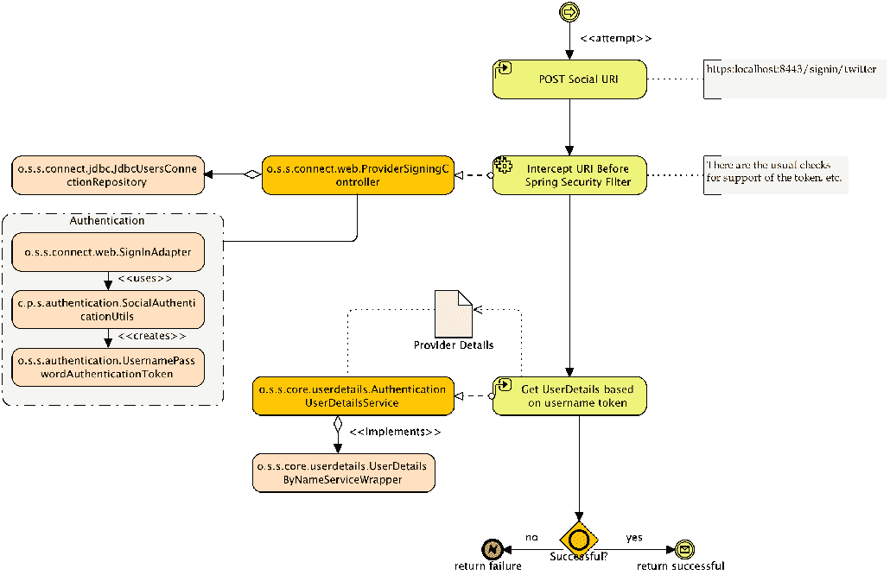
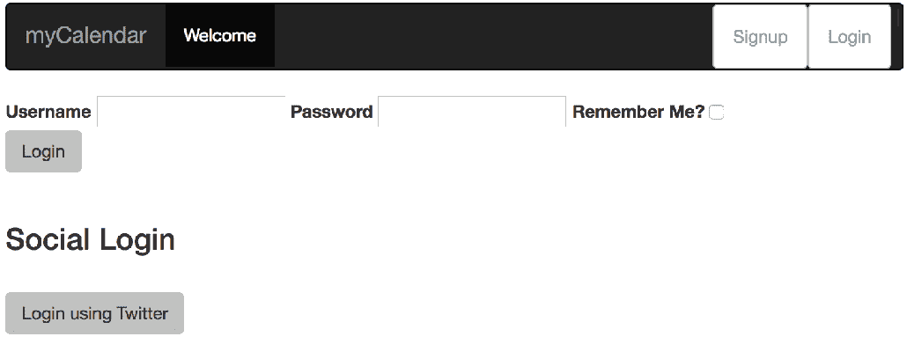
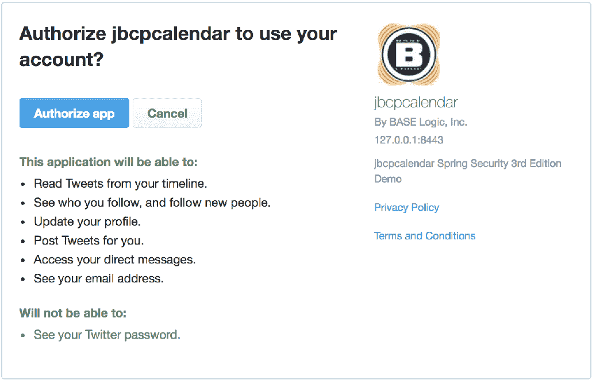
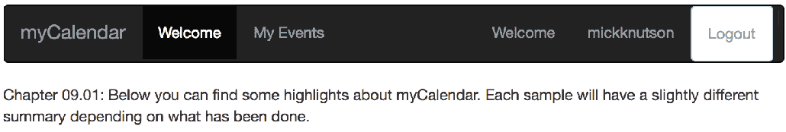
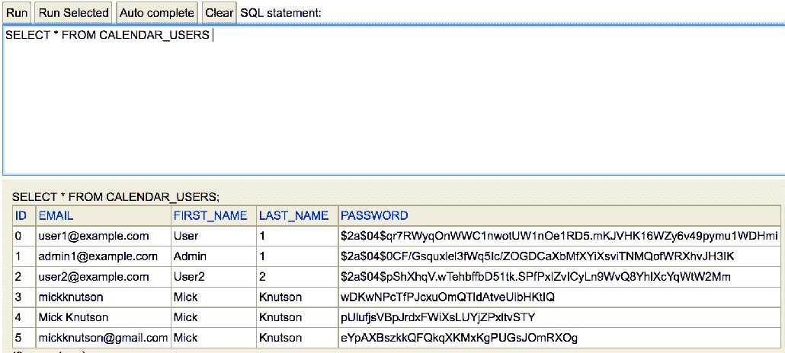
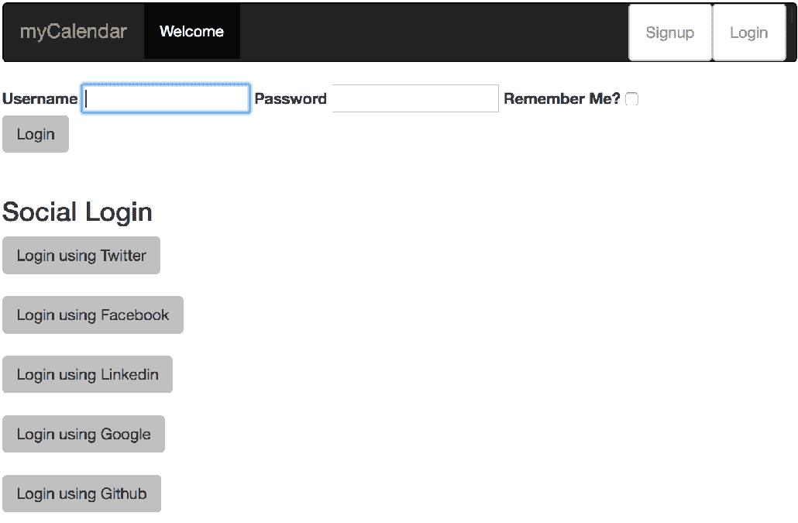

# 九、向 OAuth 2 开放

**OAuth 2**是一种非常流行的可信身份管理形式，允许用户通过单个可信提供商管理其身份。这一方便的功能为用户提供了安全性，可以使用受信任的 OAuth 2 提供商存储他们的密码和个人信息，也可以根据要求公开个人信息。此外，支持 OAuth2 的网站提供了这样的信心：提供 OAuth2 凭据的用户就是他们所说的用户。

在本章中，我们将介绍以下主题：

*   学习在不到 5 分钟的时间内设置自己的 OAuth 2 应用
*   使用 OAuth 2 的快速实现配置 JBCP 日历应用
*   学习 OAuth 2 的概念架构，以及它如何为您的站点提供可靠的用户访问
*   实现基于 OAuth2 的用户注册
*   正在试验 OAuth 2 属性交换的用户配置文件功能
*   演示如何触发对以前的 OAuth 2 提供程序的自动认证
*   检查基于 OAuth 2 的登录提供的安全性

# 有前途的非统组织世界 2

作为一名应用开发人员，您可能听说过很多关于 OAuth2 的术语。OAuth 2 已被世界各地的 web 服务和软件公司广泛采用，并且是这些公司交互和共享信息方式的组成部分。但到底是什么呢？简而言之，OAuth2 是一个协议，允许不同的各方以安全可靠的方式共享信息和资源。

OAuth1.0 呢？

基于同样的动机，OAuth 1.0 于 2007 年设计并批准。然而，有人批评它过于复杂，并且还存在规范不精确的问题，这导致了不安全的实现。所有这些问题都导致了 OAuth 1.0 的采用率低下，并最终导致了 OAuth 2 的设计和创建。OAuth 2 是 OAuth 1.0 的继承者。

还需要注意的是，OAuth 2 与 OAuth 1.0 不向后兼容，因此 OAuth 2 应用无法与 OAuth 1.0 服务提供商集成。

这种通过受信任的第三方登录的方式已经存在了很长时间，形式多种多样（例如，**Microsoft Passport**在一段时间内成为网络上最著名的中央登录服务之一）。OAuth2 的显著优点是，OAuth2 提供者只需要实现公共 OAuth2 协议，就可以与任何试图与 OAuth2 集成登录的站点兼容。

您可以参考[中的 OAuth 2.0 规范 https://tools.ietf.org/html/rfc6749](https://tools.ietf.org/html/rfc6749) 。

下图说明了在登录过程中集成 OAuth 2 的站点与 Facebook OAuth 2 提供商之间的高级关系，例如：



我们可以看到，提交表单帖子将启动对 OAuth 提供者的请求，导致提供者显示一个授权对话框，要求用户允许`jbcpcalendar`从您的 OAuth 提供者帐户获得特定信息的权限。此请求包含一个名为`code`的`uri`参数。一旦授权，用户将重定向回`jbcpcalendar`，并且`code`参数包含在`uri`参数中。然后，请求再次重定向到 OAuth 提供者，以授权`jbcpcalendar`。然后，OAuth 提供者用一个`access_token`响应，该`access_token`可用于访问用户的 OAuth 信息，该用户的 OAuth 信息`jbcpcalendar`被授予访问权限。

不要毫不含糊地相信 OAuth 2！

在这里，您可以看到一个基本假设，它可以愚弄系统的用户。我们可以注册一个 OAuth 2 提供商帐户，这会使我们看起来像是 James Gosling，尽管我们显然不是。不要因为用户有一个听起来令人信服的 OAuth 2（或 OAuth 2 委托提供者）而错误地假设他/她是真实的人，而不需要其他形式的身份证明。换一种方式想想，如果有人来到你家门口声称他是詹姆斯·戈斯林，你会让他进来而不验证他的身份吗？

然后，启用 OAuth 2 的应用将用户重定向到 OAuth 2 提供程序，用户向提供程序提供其凭据，然后由提供程序负责做出访问决策。一旦提供者做出了访问决定，提供者就会将用户重定向到原始站点，该站点现在可以确保用户的真实性。一旦您尝试过 OAuth2，它就更容易理解了。现在让我们将 OAuth 2 添加到 JBCP 日历登录屏幕！

# 注册 OAuth 2 应用

为了从本节的练习中获得完整的价值（并能够测试登录），您需要使用服务提供商创建一个应用。目前，SpringSocial 支持 Twitter、Facebook、Google、LinkedIn 和 GitHub，而且这个列表还在不断增长。

为了充分利用本章中的练习，我们建议您至少拥有 Twitter 和 GitHub 帐户。我们已经为`jbcpcalendar`应用建立了帐户，我们将在本章剩余部分使用该帐户。

# 使用 SpringSecurity启用 OAuth 认证

在接下来的几章中，我们可以看到外部认证提供者之间的一个共同主题。SpringSecurity 为实际在 Spring 生态系统之外开发的提供者集成提供了方便的包装。

在这种情况下，Spring 社会项目（[http://projects.spring.io/spring-social/](http://projects.spring.io/spring-social/) 为 Spring Security OAuth 2 功能提供底层 OAuth 2 提供程序发现和请求/响应协商。

# 其他必需的依赖项

让我们来看看下面的步骤：

1.  为了利用 OAuth，我们需要包括特定于提供者的依赖项及其可传递依赖项。这可以通过更新`build.gradle`文件在 Gradle 中完成，如以下代码段所示：

```java
        //build.gradle

        compile("org.springframework.boot:spring-boot-starter-
        social-facebook")
        compile("org.springframework.boot:spring-boot-starter-
        social-linkedin")
        compile("org.springframework.boot:spring-boot-starter-
        social-twitter")
```

2.  使用 SpringBoot 包括对 Facebook、Twitter 和 LinkedIn starter 依赖项的引用，如前面的代码片段所示。要添加其他提供程序，必须包括提供程序依赖项和版本。这可以通过更新`build.gradle`文件在 Gradle 中完成，如以下代码段所示：

```
        //build.gradle

        compile("org.springframework.social:spring-social-google:
        latest.release ")
        compile("org.springframework.social:spring-social-github:
        latest.release ")
        compile("org.springframework.social:spring-social-linkedin:
        latest.release ")
```

您应该从`chapter09.00-calendar`中的源代码开始。

3.  在编写 OAuth 登录表单时，我们需要将`username`和`password`字段替换为 OAuth 字段。继续并对您的`login.html`文件进行以下更新：

```
        //src/main/resources/templates/login.html

         <div class="form-actions">
            <input id="submit" class="btn" name="submit" type="submit" 
            value="Login"/>
           </div>
         </form>
       <br/>
         <h3>Social Login</h3>
       <br />
        <form th:action="@{/signin/twitter}" method="POST"
        class="form-horizontal">
         <input type="hidden" name="scope" value="public_profile" />
        <div class="form-actions">
        <input id="twitter-submit" class="btn" type="submit" 
        value="Login using  
        Twitter"/>
         </div>
        </form>
       </div>
```

4.  我们可以对注册表单进行类似的编辑，如以下代码段所示：

```
         //src/main/resources/templates/signup/form.html

        </fieldset>
        </form>
         <br/>
           <h3>Social Login</h3>
         <br/>
 <form th:action="@{/signin/twitter}" method="POST" 
           class="form-horizontal">
 <input type="hidden" name="scope" value="public_profile" />        <div class="form-actions">
         <input id="twitter-submit" class="btn" type="submit" 
         value="Login using Twitter"/>
        </div>
        </form>
         </div>
```

您会注意到，我们添加了一个 scope 字段来定义我们在认证期间感兴趣检索的 OAuth 2 详细信息。

**OAuth 2.0 API Scopes:** Scopes allow a provider to define the API data accessible to client applications. When an API is created by a provider, they define one scope for each API represented and action. Once an API is created and define the scopes, the client applications can request these defined permissions when they initiate an authorization flow and include them in the access token as part of the scope request parameter.

每个提供程序的 API 作用域可能略有不同，例如`r_basicprofile`和`r_emailaddress`，但 API 作用域也仅限于应用配置。因此，应用可能只请求访问电子邮件或联系人，而不请求访问整个用户配置文件或提供商操作，如张贴到用户的墙上。

您会注意到，在 OAuth 2 登录时，我们不提供**记住我**选项。这是因为与供应商之间的重定向导致**记住我**复选框值丢失，因此当用户成功通过认证时，他们不再具有指示的**记住我**选项。这是不幸的，但最终提高了 OAuth 2 作为站点登录机制的安全性，因为 OAuth 2 强制用户在每次登录时都与提供者建立信任关系。

# 在 Spring Security 中配置 OAuth 2 支持

使用**Spring Social**，我们可以启用 OAuth 2 特定的提供者端点来拦截提供者表单提交。

# 本地用户连接存储库

`UsersConnectionRepository` 接口是一个数据访问接口，用于管理用户与服务提供商连接的全局存储。它提供应用于多个用户记录的数据访问操作，如以下代码段所示：

```
    //src/main/java/com/packtpub/springsecurity/configuration/SocialConfig.java

    @Autowired

    private UsersConnectionRepository usersConnectionRepository;

    @Autowired

     private ProviderConnectionSignup providerConnectionSignup;

    @Bean

    public ProviderSignInController providerSignInController() {

       ((JdbcUsersConnectionRepository) usersConnectionRepository)

       .setConnectionSignUp(providerConnectionSignup);

       ...

    }

```

# 为提供程序详细信息创建本地数据库条目

Spring Security 支持将提供者详细信息保存在一组单独的数据库表中，以防我们希望将用户保存在本地数据存储中，但不希望将该数据包含在现有的`User`表中：

```
    //src/main/java/com/packtpub/springsecurity/configuration/
    SocialDatabasePopulator.java

    @Component
    public class SocialDatabasePopulator
    implements InitializingBean {
       private final DataSource dataSource;
       @Autowired
    public SocialDatabasePopulator(final DataSource dataSource) {
    this.dataSource = dataSource;
     }
    @Override
    public void afterPropertiesSet() throws Exception {
       ClassPathResource resource = new ClassPathResource(
       "org/springframework/social/connect/jdbc/
       JdbcUsersConnectionRepository.sql");
       executeSql(resource);
     }
    private void executeSql(final Resource resource) {
     ResourceDatabasePopulator populator = new ResourceDatabasePopulator();
     populator.setContinueOnError(true);
     populator.addScript(resource);
     DatabasePopulatorUtils.execute(populator, dataSource);
     }
  }
```

此`InitializingBean`接口在加载时执行，将执行位于类路径上`spring-social-core-[VERSION].jar`文件中的`JdbcUsersConnectionRepository.sql`，将以下模式植入我们的本地数据库：

```
    spring-social-core-  [VERSION].jar#org/springframework/social/connect/jdbc/
    JdbcUsersConnectionRepository.sql

    create table UserConnection(
      userId varchar(255) not null,
      providerId varchar(255) not null,
      providerUserId varchar(255),
      rank int not null,
      displayName varchar(255),
      profileUrl varchar(512),
      imageUrl varchar(512),
      accessToken varchar(512) not null,
      secret varchar(512),
      refreshToken varchar(512),
      expireTime bigint,
      primary key (userId, providerId, providerUserId));

      create unique index UserConnectionRank on UserConnection(userId, providerId,  
      rank);
```

现在我们有了一个存储提供者详细信息的表，我们可以配置`ConnectionRepository`在运行时保存提供者详细信息。

# 自定义 UserConnectionRepository 接口

我们需要创建一个`UserConnectionRepository` 接口，我们可以利用`JdbcUsersConnectionRepository` 作为实现，它基于我们在加载时生成的`JdbcUsersConnectionRepository.sql` 模式，如下所示：

```
      //src/main/java/com/packtpub/springsecurity/configuration/

      DatabaseSocialConfigurer.java

      public class DatabaseSocialConfigurer extends SocialConfigurerAdapter {

        private final DataSource dataSource;

        public DatabaseSocialConfigurer(DataSource dataSource) {

         this.dataSource = dataSource;

       }

      @Override

      public UsersConnectionRepository getUsersConnectionRepository(

      ConnectionFactoryLocator connectionFactoryLocator) {

          TextEncryptor textEncryptor = Encryptors.noOpText();

          return new JdbcUsersConnectionRepository(

          dataSource, connectionFactoryLocator, textEncryptor);

     }

      @Override

     public void addConnectionFactories(ConnectionFactoryConfigurer config,

     Environment env) {

          super.addConnectionFactories(config, env);

       }

   }

```

现在，每次用户连接到注册提供商时，连接详细信息都会保存到本地数据库中。

# ConnectionSignup 流

为了将提供程序详细信息保存到本地存储库中，我们创建了一个`ConnectionSignup`对象，这是一个命令，在无法从`Connection`映射`userid`的情况下注册新用户，该命令允许在提供程序登录尝试期间从连接数据隐式创建本地用户配置文件：

```
    //src/main/java/com/packtpub/springsecurity/authentication/
    ProviderConnectionSignup.java

    @Service
     public class ProviderConnectionSignup implements ConnectionSignUp {
        ...; 
    @Override
    public String execute(Connection<?> connection) {
       ...
     }
    }
```

# 执行 OAuth 2 提供程序连接工作流

为了保存提供程序的详细信息，我们需要从提供程序获取可用的详细信息，这些信息可以通过 OAuth 2 连接获得。接下来，我们根据可用的细节创建一个`CalendarUser`表。请注意，我们至少需要创建一个`GrantedAuthority`角色。在这里，我们使用`CalendarUserAuthorityUtils#createAuthorities`创建`ROLE_USER``GrantedAuthority`：

```
    //src/main/java/com/packtpub/springsecurity/authentication/
    ProviderConnectionSignup.java

    @Service
    public class ProviderConnectionSignup implements ConnectionSignUp {
         ...
    @Override
    public String execute(Connection<?> connection) {
        UserProfile profile = connection.fetchUserProfile();
        CalendarUser user = new CalendarUser();
        if(profile.getEmail() != null){
             user.setEmail(profile.getEmail());
          }
        else if(profile.getUsername() != null){
             user.setEmail(profile.getUsername());
         }
        else {
             user.setEmail(connection.getDisplayName());
         }
             user.setFirstName(profile.getFirstName());
             user.setLastName(profile.getLastName());
             user.setPassword(randomAlphabetic(32));
             CalendarUserAuthorityUtils.createAuthorities(user);
             ...
         }
      }

```

# 添加 OAuth2 用户

现在我们已经根据提供商详细信息创建了`CalendarUser`，我们需要使用`CalendarUserDao`将该`User`帐户保存到我们的数据库中。然后我们返回`CalendarUser`电子邮件，因为这是我们在 JBCP 日历中使用的用户名，如下所示：

```
//src/main/java/com/packtpub/springsecurity/authentication/
ProviderConnectionSignup.java

@Service
public class ProviderConnectionSignup
implements ConnectionSignUp {
 @Autowired private CalendarUserDao calendarUserDao;  @Override
 public String execute(Connection<?> connection) {...
calendarUserDao.createUser(user); return user.getEmail();
   }
}
```

现在，根据提供商的详细信息，我们的数据库中有一个本地`User`帐户。

这是一个额外的数据库条目，因为我们之前已经将提供者详细信息保存到了`UserConnection`表中。

# OAuth 2 控制器登录流

现在，为了完成`SocialConfig.java`配置，我们需要构造`ProviderSignInController`，它被初始化为`ConnectionFactoryLocator`、`usersConnectionRepository`和`SignInAdapter`。`ProviderSignInController`接口是一个 Spring MVC 控制器，用于处理提供商用户登录流。对`/signin/{providerId}`的 HTTP`POST`请求启动用户使用`{providerId}`登录。向`/signin/{providerId}?oauth_token&amp;oauth_verifier||code`提交 HTTP`GET`请求将收到`{providerId}`认证回调并建立连接。

`ServiceLocator`接口用于创建`ConnectionFactory`实例。根据 Spring Boot 的`AutoConfiguration`中包含的服务提供商，此工厂支持通过`providerId`和`apiType`进行查找：

```
    //src/main/java/com/packtpub/springsecurity/configuration/SocialConfig.java

    @Autowired
    private ConnectionFactoryLocator connectionFactoryLocator;
    @Bean
    public ProviderSignInController providerSignInController() {
        ...
        return new ProviderSignInController(connectionFactoryLocator,
        usersConnectionRepository, authSignInAdapter());
    }
```

这将允许拦截对特定提供者`uri`的提交，并将开始 OAuth 2 连接流。

# 自动用户认证

让我们来看看下面的步骤：

1.  `ProviderSignInController`控制器使用认证`SignInAdapter`进行初始化，该认证用于通过使用指定 ID 登录本地用户帐户来完成提供商登录尝试：

```
        //src/main/java/com/packtpub/springsecurity/configuration/
        SocialConfig.java

        @Bean
        public SignInAdapter authSignInAdapter() {
           return (userId, connection, request) -> {
             SocialAuthenticationUtils.authenticate(connection);
             return null;
           };
         }
```

2.  在`SingInAdapter`bean 中，从前面的代码片段中，我们使用自定义认证实用程序方法以`UsernamePasswordAuthenticationToken`的形式创建`Authentication`对象，并根据 OAuth 2 提供程序返回的详细信息将其添加到`SecurityContext`：

```
        //src/main/java/com/packtpub/springsecurity/authentication/
        SocialAuthenticationUtils.java

        public class SocialAuthenticationUtils {
       public static void authenticate(Connection<?> connection) {
         UserProfile profile = connection.fetchUserProfile();
         CalendarUser user = new CalendarUser();
         if(profile.getEmail() != null){
             user.setEmail(profile.getEmail());
           }
         else if(profile.getUsername() != null){
             user.setEmail(profile.getUsername());
          }
         else {
             user.setEmail(connection.getDisplayName());
           }
             user.setFirstName(profile.getFirstName());
             user.setLastName(profile.getLastName());
             UsernamePasswordAuthenticationToken authentication = new  
             UsernamePasswordAuthenticationToken(user, null,        
             CalendarUserAuthorityUtils.createAuthorities(user));
             SecurityContextHolder.getContext()
             .setAuthentication(authentication);
           }
        }
```

连接提供程序所需的最后详细信息是创建提供程序应用时获得的应用 ID 和密钥，如下所示：

```
        //src/main/resources/application.yml:

        spring
        ## Social Configuration:
        social:
        twitter:
 appId: cgceheRX6a8EAE74JUeiRi8jZ
 appSecret: XR0J2N0Inzy2y2poxzot9oSAaE6MIOs4QHSWzT8dyeZaaeawep
```

3.  现在我们有了连接到 Twitter JBCP 日历所需的详细信息，并且可以启动 JBCP 日历并使用 Twitter 提供商登录。

您的代码现在应该看起来像`chapter09.01-calendar`。

4.  此时，您应该能够使用 Twitter 的 OAuth 2 提供程序完成完整登录。发生的重定向如下所示，首先，我们启动 OAuth 2 提供程序登录，如以下屏幕截图所示：



然后我们被重定向到提供商授权页面，请求用户向`jbcpcalendar`应用授予权限，如以下屏幕截图所示：



5.  授权`jbcpcalendar`应用后，用户被重定向到`jbcpcalendar`应用，并使用提供商显示名称自动登录：



6.  此时，用户存在于应用中，并通过单个`GrantedAuthority`的`ROLE_USER`进行认证和授权，但如果我们导航到“我的事件”，则允许用户查看此页面。但是，`CalendarUser`不存在任何事件：


7.  尝试为此用户创建事件，以验证在`CalendarUser`表中正确创建的用户凭据。
8.  为了验证提供者详细信息是否正确创建，我们可以打开 H2 管理控制台并查询`USERCONNECTION`表以验证是否保存了标准连接详细信息，如以下屏幕截图所示：


9.  此外，我们还可以验证`CALENDAR_USERS`表，该表中还填充了提供商详细信息：


现在，我们已经在本地数据库中注册了用户，并且我们还能够基于对特定提供商详细信息的授权访问与注册提供商进行交互。

# 其他 OAuth 2 提供程序

我们已经使用 SpringSocial 当前的三个支持提供商之一成功地集成了一个 OAuth2 提供商。还有其他几个供应商可供选择；我们将再增加几个提供商，这样我们的用户就有了不止一个选择。SpringSocial 目前在本地支持 Twitter、Facebook 和 LinkedIn 提供商。包括额外的提供者将需要额外的库来获得此支持，本章后面将介绍这一点。

让我们来看看下面的步骤：

1.  为了将 Facebook 或 LinkedIn 提供程序添加到 JBCP 日历应用中，需要设置其他应用属性，并且每个配置的提供程序将自动向

# OAuth2 用户注册问题

如果支持多个提供者，则需要解决的一个问题是返回的各种提供者详细信息之间的用户名冲突。

如果您使用列出的每个提供者登录到 JBCP 日历应用，然后查询存储在 H2 中的数据，您将发现根据用户的帐户详细信息，这些数据可能是相似的，如果不完全相同的话。

在下面的`USERCONNECTION`表中，我们可以看到来自每个提供者的`USERID`列数据是相似的：


在`CALENDARUSER`表中，我们有两个可能的问题。首先，用于`EMAIL`的用户详细信息，即 JBCP 日历用户`ID`，不是某些提供商的电子邮件。其次，两个不同提供商的用户标识符仍然可能相同：



我们不打算深入探讨检测和纠正这一可能问题的各种方法，但值得注意，以供将来参考。

# 注册非标准 OAuth 2 提供程序

为了包含其他提供程序，我们需要执行一些额外的步骤，将自定义提供程序包含到登录流中，如下所示：

1.  对于每个提供者，我们需要在我们的`build.gradle`文件中包含提供者依赖项，如下所示：

```
        //build.gradle

        dependencies {
          ...
          compile("org.springframework.social:spring-social-google:
          ${springSocialGoogleVersion}")
          compile("org.springframework.social:spring-social-github:
          ${springSocialGithubVersion}")
        }
```

2.  接下来，我们将使用每个提供者的`appId`和`appSecret`密钥的以下附加应用属性将提供者注册到 JBCP 日历应用中：

```
        //src/main/resources/application.yml

        spring:
          social:
            # Google
 google:
 appId: 947438796602-uiob88a5kg1j9mcljfmk00quok7rphib.apps.
                 googleusercontent.com
 appSecret: lpYZpF2IUgNXyXdZn-zY3gpR
           # Github
 github:
 appId: 71649b756d29b5a2fc84
 appSecret: 4335dcc0131ed62d757cc63e2fdc1be09c38abbf
```

3.  每个新的提供者必须通过添加相应的`ConnectionFactory`接口来注册。我们可以为我们打算支持的每个新提供商向自定义`DatabaseSocialConfigurer.java`文件添加一个新的`ConnectionFactory`条目，如下所示：

```
        //src/main/java/com/packtpub/springsecurity/configuration/
        DatabaseSocialConfigurer.java

        public class DatabaseSocialConfigurer 
        extends SocialConfigurerAdapter {
           ...
        @Override
        public void addConnectionFactories(
        ConnectionFactoryConfigurer config, Environment env) {
               super.addConnectionFactories(config, env);

            // Adding GitHub Connection with properties
           // from application.yml
 config.addConnectionFactory(
 new GitHubConnectionFactory(
 env.getProperty("spring.social.github.appId"),
 env.getProperty("spring.social.github.appSecret")));
          // Adding Google Connection with properties
```

```
         // from application.yml
 config.addConnectionFactory(
 new GoogleConnectionFactory(
 env.getProperty("spring.social.google.appId"),
 env.getProperty("spring.social.google.appSecret")));
             }
         }
```

4.  我们现在可以将新的登录选项添加到我们的`login.html`文件和`form.html`注册页面，为每个新提供商添加一个新的`<form>`标签：

```
        //src/main/resources/templates/login.html

        <h3>Social Login</h3>
        ...
 <form th:action="@{/signin/google}" method="POST"        class="form-horizontal">
        <input type="hidden" name="scope" value="profile" />
        <div class="form-actions">
           <input id="google-submit" class="btn" type="submit" 
           value="Login using  
           Google"/>
        </div>
      </form>
     <br />

 <form th:action="@{/signin/github}" method="POST"       class="form-horizontal">
       <input type="hidden" name="scope" value="public_profile" />
       <div class="form-actions">
         <input id="github-submit" class="btn" type="submit"
         value="Login using  
         Github"/>
       </div>
     </form&gt;
```

5.  现在，我们有了连接到 JBCP 日历的其他提供者所需的详细信息。我们可以重新启动 JBCP 日历应用，并使用其他 OAuth 2 提供程序测试登录。现在登录时，我们将看到其他提供商选项，如以下屏幕截图所示：



# OAuth 2 安全吗？

由于对 OAuth 2 的支持依赖于 OAuth 2 提供程序的可信度和提供程序响应的可验证性，因此安全性和真实性对于应用对用户基于 OAuth 2 的登录具有信心至关重要。

幸运的是，OAuth 2 规范的设计者非常清楚这一点，并实施了一系列验证步骤来防止响应伪造、重播攻击和其他类型的篡改，如下所述：

*   由于共享密钥（在初始请求之前由启用 OAuth 2 的站点创建）和响应本身上的单向散列消息签名的组合，防止了响应伪造。恶意用户在没有访问共享密钥和签名算法的情况下篡改任何响应字段中的数据将生成无效响应。
*   **重播攻击**是由于包含了一个 nonce 或一次性使用的随机密钥而被阻止的，该密钥应该由启用 OAuth 2 的站点记录，以便它永远不能被重用。这样，即使是试图重新发出响应 URL 的用户也将被阻止，因为接收站点将确定先前使用了 nonce，并将使请求无效。
*   最有可能导致用户交互受损的攻击形式是中间人攻击，恶意用户可以拦截用户在其计算机和 OAuth 2 提供商之间的交互。在这种情况下，假设的攻击者可以记录用户浏览器和 OAuth 2 提供程序之间的对话，并记录启动请求时使用的密钥。在这种情况下，攻击者将需要非常高的成熟度和合理的 OAuth 2 签名规范的完整实现简言之，这不太可能以任何规律发生。

# 总结

在本章中，我们回顾了 OAuth 2，这是一种相对较新的用户认证和凭证管理技术。OAuth2 在网络上的影响非常广泛，在过去一两年中，它在可用性和可接受性方面取得了长足的进步。现代 web 上大多数面向公众的站点都应该计划使用某种形式的 OAuth 2 支持，JBCP 日历应用也不例外！

在本章中，我们学习了以下主题 OAuth 2 认证机制及其高级体系结构和关键术语。我们还了解了 OAuth2 登录和 JBCP 日历应用的自动用户注册。

我们还介绍了 OAuth 2 的自动登录和 OAuth 2 登录响应的安全性。

我们介绍了使用 SpringSecurity实现的最简单的单点登录机制之一。缺点之一是它不支持单个注销的标准机制。在下一章中，我们将探讨 CAS，它是另一种标准的单点登录协议，也支持单点注销。