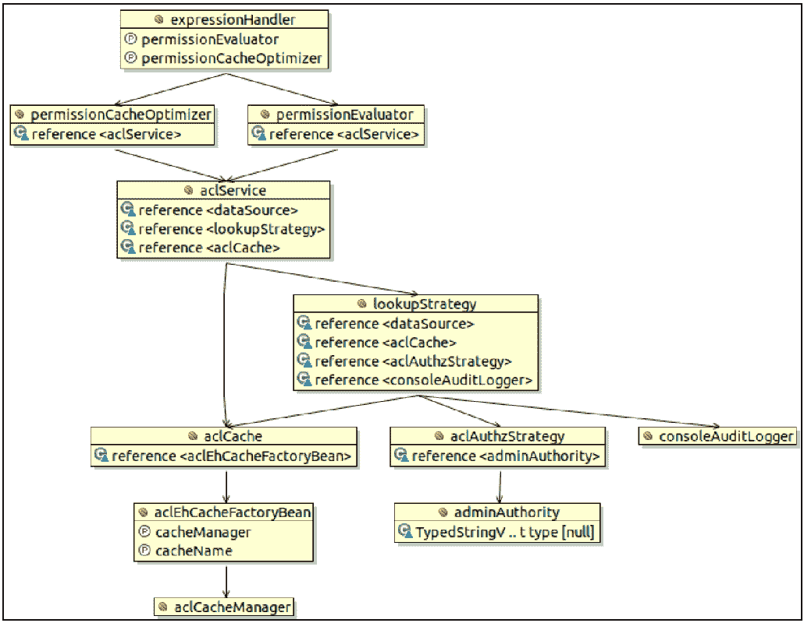
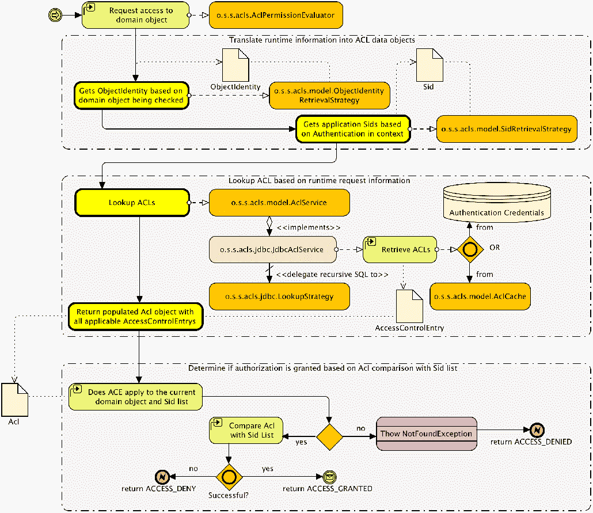
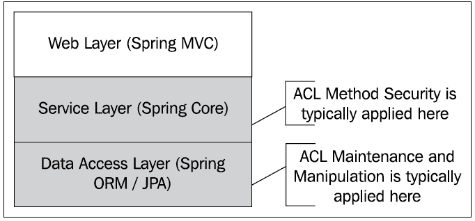

# 访问控制列表

在本章中，我们将讨论复杂的主题**访问控制列表**（**ACL**），它可以提供丰富的域对象实例级授权模型。Spring Security 附带了一个强大但复杂的访问控制列表模块，可以很好地满足中小型实现的需要。

在本章中，我们将介绍以下主题：

*   理解 ACL 的概念模型
*   回顾 Spring Security ACL 模块中 ACL 概念的术语和应用
*   构建和检查支持 SpringACL 所需的数据库架构
*   通过注释和 SpringBean 配置 JBCP 日历以使用 ACL 安全的业务方法
*   执行高级配置，包括自定义 ACL 权限、启用 ACL 的 JSP 标记检查和方法安全性、可变 ACL 和智能缓存
*   检查 ACL 部署的体系结构注意事项和规划场景

# ACL 的概念模块

非 web 层安全难题的最后一块是业务对象级别的安全性，应用于业务层或业务层之下。此级别的安全性是使用称为 ACL 或 ACL 的技术实现的。用一句话概括 ACL 的目标 ACL 允许基于组、业务对象和逻辑操作的唯一组合来指定一组组权限。

例如，JBCP 日历的 ACL 声明可能声明给定用户必须对其自己的事件进行写访问。这可以如下所示：

| **用户名** | **组** | **对象** | **权限** |
| `mick` |  | `event_01` | `read`、`write` |
|  | `ROLE_USER` | `event_123` | `read` |
|  | `ANONYMOUS` | 任何事件 | `none` |

您可以看到，这个 ACL 非常容易被人读取-`mick`拥有`read`和`write`访问自己事件的权限（`event_01`）；其他注册用户可以读取`mick`事件，但匿名用户不能。简而言之，这种类型的规则矩阵是 ACL 试图将安全系统及其业务数据综合为代码、访问检查和元数据的组合。大多数真正启用 ACL 的系统都有极其复杂的 ACL 列表，可以想象整个系统中有数百万条条目。尽管这听起来非常复杂，但适当的预先推理和实现以及一个功能强大的安全库可以使 ACL 管理变得非常可行。

如果您使用基于 Microsoft Windows 或 Unix/Linux 的计算机，您每天都会体验到 ACL 的魔力。大多数现代计算机操作系统使用 ACL 指令作为其文件存储系统的一部分，允许基于用户或组、文件或目录以及权限的组合授予权限。在 Microsoft Windows 中，您可以通过右键单击文件并检查其安全属性（属性|安全性）来查看文件的某些 ACL 功能，如以下屏幕截图所示：


在浏览各种组或用户和权限时，您将能够看到 ACL 的输入组合是可见的和直观的。

# Spring Security 中的访问控制列表

Spring Security 支持 ACL 驱动的授权检查，以防止安全系统的各个用户访问各个域对象。就像在 OS 文件系统示例中一样，可以使用 Spring 安全 ACL 组件来构建业务对象和组或主体的逻辑树结构。请求者和请求者的权限交叉点（继承的或显式的）用于确定允许的访问。

对于接近 Spring Security 的 ACL 功能的用户来说，由于其复杂性，再加上文档和示例的相对缺乏，很常见。设置 ACL 基础设施可能相当复杂，存在许多相互依赖性，并且依赖于基于 bean 的配置机制，这与 Spring Security 的其余部分非常不同（您将在设置初始配置时看到）。

Spring Security ACL 模块是一个合理的基线，但打算广泛构建该功能的用户可能会遇到一系列令人沮丧的限制和设计选择，这些限制和选择（在大多数情况下）在 Spring Security 早期首次引入时没有得到纠正。不要因为这些限制而气馁！ACL 模块是在应用程序中嵌入丰富的访问控制，并进一步检查和保护用户操作和数据的强大方法。

在深入研究配置 SpringSecurityACL 支持之前，我们需要回顾一些关键术语和概念。

Spring ACL 系统中安全参与者身份的主要单元是**安全身份**（**SID**。SID 是一种逻辑结构，可用于抽象单个主体或组的身份（`GrantedAuthority`。在确定特定主体的允许访问级别时，您构建的 ACL 数据模型定义的`SIDs`对象用作显式和派生访问控制规则的基础。

如果使用`SIDs`定义 ACL 系统中的参与者，则安全等式的另一半是安全对象本身的定义。单个安全对象的标识被称为（毫不奇怪）对象标识。对象标识的默认 Spring ACL 实现要求在单个对象实例级别定义 ACL 规则，这意味着，如果需要，系统中的每个对象都可以有一个单独的访问规则。

单个访问规则称为**访问控制条目**（**ACE**。ACE 是以下因素的组合：

*   应用规则的参与者的 SID
*   应用规则的对象标识
*   应应用于给定`SID`和声明对象标识的许可
*   对于给定的`SID`和对象标识，是否应允许或拒绝声明的许可

Spring ACL 系统作为一个整体的目的是评估每个安全方法调用，并确定是否应根据适用的 ACE 允许在方法中操作一个或多个对象。在运行时根据调用者和正在使用的对象评估适用的 ACE。

Spring 安全 ACL 的实现非常灵活。尽管本章的大部分内容详细介绍了 Spring Security ACL 模块的开箱即用功能，但是请记住，所示的许多规则表示默认实现，在许多情况下，可以根据更复杂的需求覆盖这些实现。

SpringSecurity 使用有用的值对象来表示与这些概念实体中的每一个相关联的数据。下表列出了这些问题：

| **ACL 概念对象** | **Java 对象** |
| 希德 | `o.s.s.acls.model.Sid` |
| 对象标识 | `o.s.s.acls.model.ObjectIdentity` |
| 国际计算语言学协会 | `o.s.s.acls.model.Acl` |
| 王牌 | `o.s.s.acls.model.AccessControlEntry` |

让我们完成启用 SpringSecurityACL 组件的过程，以便在 JBCP 日历应用程序中进行简单演示。

# Spring 安全 ACL 支持的基本配置

尽管我们之前暗示，在 SpringSecurity 中配置 ACL 支持需要基于 bean 的配置（它确实需要这样做），但如果您选择，您可以使用 ACL 支持，同时保留更简单的安全 XML 命名空间配置。在本章剩余的示例中，我们将重点介绍基于 Java 的配置。

# 梯度依赖

与大多数章节一样，为了使用本章中的功能，我们需要添加一些依赖项。我们添加的依赖项列表，以及关于何时需要它们的注释，可以检查如下：

```
    build.gradle
    dependencies {
       // ACL
       compile('org.springframework.security:spring-security-acl')
      compile('net.sf.ehcache:ehcache')
       ...
    }
```

# 定义一个简单的目标场景

我们的简单目标场景是只授予`user2@example.com`对生日派对事件的读取权限。所有其他用户将无权访问任何事件。您会发现，这与我们的其他示例不同，因为`user2@example.com`与生日聚会事件没有其他关联。

尽管有几种方法可以设置 ACL 检查，但我们的首选方法是遵循我们在本章的方法级注释中使用的基于注释的方法。这很好地将 ACL 的使用从实际的接口声明中抽象出来，并允许在以后（如果您愿意的话）用 ACL 以外的内容替换角色声明。

我们将为`CalendarService.getEvents`方法添加注释，该方法根据当前用户对事件的权限过滤每个事件：

```
    src/main/java/com/packtpub/springsecurity/service/CalendarService.java
    @PostFilter("hasPermission(filterObject, 'read')")
    List<Event> getEvents();
```

你应该从`chapter12.00-calendar`开始。

# 将 ACL 表添加到 H2 数据库

我们需要做的第一件事是添加所需的表和数据，以支持内存 H2 数据库中的持久 ACL 条目。为此，我们将在`schema.sql`中的嵌入式数据库声明中添加一个新的 SQL DDL 文件和相应的数据。我们将在本章后面对每个文件进行分解。

我们在本章源代码中包含了以下`schema.sql`文件，该文件基于 Spring Security reference 附录*附加参考资料*中包含的模式文件：

```
src/main/resources/schema.sql
-- ACL Schema --
create table acl_sid (
id bigint generated by default as identity(start with 100) not
   null primary key,
principal boolean not null,
sid varchar_ignorecase(100) not null,
constraint uk_acl_sid unique(sid,principal) );

create table acl_class (
id bigint generated by default as identity(start with 100) not
   null primary key,
class varchar_ignorecase(500) not null,
constraint uk_acl_class unique(class) );

create table acl_object_identity (
id bigint generated by default as identity(start with 100) not
   null primary key,
object_id_class bigint not null,
object_id_identity bigint not null,
parent_object bigint,
owner_sid bigint not null,
entries_inheriting boolean not null,
constraint uk_acl_objid
   unique(object_id_class,object_id_identity),
constraint fk_acl_obj_parent foreign
   key(parent_object)references acl_object_identity(id),
constraint fk_acl_obj_class foreign
   key(object_id_class)references acl_class(id),
constraint fk_acl_obj_owner foreign key(owner_sid)references
   acl_sid(id) );

create table acl_entry (
id bigint generated by default as identity(start with 100) not
   null primary key,
acl_object_identity bigint not null,
ace_order int not null,
sid bigint not null,
mask integer not null,
granting boolean not null,
audit_success boolean not null,
audit_failure boolean not null,
constraint uk_acl_entry unique(acl_object_identity,ace_order),
constraint fk_acl_entry_obj_id foreign key(acl_object_identity)
references acl_object_identity(id),
constraint fk_acl_entry_sid foreign key(sid) references
   acl_sid(id) );
```

前面的代码将生成以下数据库架构：


您可以看到`SIDs`、`OBJECT_IDENTITY`和 ACEs 的概念如何直接映射到数据库模式。从概念上讲，这很方便，因为我们可以将 ACL 系统的心智模型以及如何直接将其强制执行映射到数据库。

如果您已经将其与 Spring 安全文档提供的 H2 数据库模式交叉引用，您会注意到我们已经做了一些通常会影响用户的调整。详情如下:

*   将`ACL_CLASS.CLASS`列从默认值`100`更改为`500`字符。一些长的、完全限定的类名不适合使用`100`字符。
*   使用有意义的名称命名外键，以便更容易诊断故障。

如果您使用的是另一个数据库，如 Oracle，则必须将 DDL 转换为 DDL 和特定于数据库的数据类型。

配置完 ACL 系统的其余部分后，我们将返回数据库，设置一些基本 ACE，以最原始的形式验证 ACL 功能。

# 配置 SecurityExpressionHandler

我们需要配置`<global-method-security>`以启用注释（我们将根据预期的 ACL 权限进行注释），并引用自定义访问决策管理器。

我们还需要提供一个知道如何评估权限的`o.s.s.access.expression.SecurityExpressionHandler`实现。更新您的`SecurityConfig.java`配置，如下所示：

```
    src/main/java/com/packtpub/springsecurity/configuration/SecurityConfig.java 
 @EnableGlobalMethodSecurity(prePostEnabled = true)    @Import(AclConfig.class)
    public class SecurityConfig extends WebSecurityConfigurerAdapter {
```

这是我们在`AclConfig.java`文件中为您定义的`DefaultMethodSecurityExpressionHandler`对象的 bean 引用，如下所示：

```
    src/main/java/com/packtpub/springsecurity/configuration/AclConfig.java
    @Bean
    public DefaultMethodSecurityExpressionHandler expressionHandler(){
       DefaultMethodSecurityExpressionHandler dmseh =
       new DefaultMethodSecurityExpressionHandler();
      dmseh.setPermissionEvaluator(permissionEvaluator());
       dmseh.setPermissionCacheOptimizer(permissionCacheOptimizer());
       return dmseh; 
    }
```

即使是相对简单的 ACL 配置，正如我们在场景中所做的那样，也需要设置许多必需的依赖项。正如我们前面提到的，SpringSecurityACL 模块提供了许多组件，您可以组装这些组件来提供一组像样的 ACL 功能。请注意，我们将在下图中引用的所有组件都是框架的一部分：



# AclPermissionCacheOptimizer 对象

`DefaultMethodSecurityExpressionHandler`对象有两个依赖项。`AclPermissionCacheOptimizer`对象用于在单个 JDBCSELECT 语句中为对象集合的所有 ACL 初始化缓存。可以检查本章中包含的相对简单的配置，如下所示：

```
     src/main/java/com/packtpub/springsecurity/configuration/AclConfig.java
     @Bean
    public AclPermissionCacheOptimizer permissionCacheOptimizer(){
       return new AclPermissionCacheOptimizer(aclService());
    }
```

# 优化 ACL 权限缓存

然后，`DefaultMethodSecurityExpressionHandler`对象委托给`PermissionEvalulator`实例。在本章中，我们使用 ACL，以便我们将使用`AclPermissionEvaluator`的 bean 读取我们在数据库中定义的 ACL。您可以查看为`permissionEvaluator`提供的配置，如下所示：

```
src/main/java/com/packtpub/springsecurity/configuration/AclConfig.java
@Bean
public AclPermissionEvaluator permissionEvaluator(){
   return new AclPermissionEvaluator(aclService());
}
```

# JdbcMutableAclService 对象

在这一点上，我们已经看到两次使用`aclService`ID 引用`th`。`aclService`ID 解析为`o.s.s.acls.model.AclService`的一个实现，该实现负责（通过委托）将有关 ACL 保护的对象的信息转换为预期 ACE：

```
src/main/java/com/packtpub/springsecurity/configuration/AclConfig.java
@Autowired 
private DataSource dataSource;
@Bean
public JdbcMutableAclService aclService(){
```

```
   return new JdbcMutableAclService(dataSource,
                                     lookupStrategy(),
                                     aclCache());
}
```

我们将使用`o.s.s.acls.jdbc.JdbcMutableAclService`，这是`o.s.s.acls.model.AclService`的默认实现。这个实现是现成的，可以使用我们在本练习最后一步中定义的模式。`JdbcMutableAclService`对象还将使用递归 SQL 和后处理来理解对象和`SID`层次结构，并确保将这些层次结构的表示传递回`AclPermissionEvaluator`。

# BasicLookupStrategy 类

`JdbcMutableAclService`类使用了我们在嵌入式数据库声明中定义的同一个 JDBC`dataSource`实例，它还委托给`o.s.s.acls.jdbc.LookupStrategy`的一个实现，该实现只负责实际进行数据库查询和解析 ACL 请求。Spring Security 提供的唯一`LookupStrategy`实现是`o.s.s.acls.jdbc.BasicLookupStrategy`，定义如下：

```
src/main/java/com/packtpub/springsecurity/configuration/AclConfig.java
@Bean
public LookupStrategy lookupStrategy(){
   return new BasicLookupStrategy(
           dataSource,
           aclCache(),
           aclAuthorizationStrategy(),
           consoleAuditLogger());
}
```

现在，`BasicLookupStrategy`是一种相对复杂的野兽。记住，它的目的是将要保护的`ObjectIdentity`声明列表转换为数据库中实际适用的 ACE 列表。正如 Po.T2A.声明可以是递归的，这被证明是一个相当具有挑战性的问题，并且一个可能经历大量使用的系统应该考虑为性能对数据库的影响而生成的 SQL。

# 使用最小公分母进行查询

请注意，`BasicLookupStrategy`旨在通过严格遵守标准 ANSI SQL 语法，特别是`left [outer] joins`与所有数据库兼容。一些较旧的数据库（特别是，**Oracle8i**）不支持此连接语法，因此请确保您验证 SQL 的语法和结构是否与特定数据库兼容！

使用非标准 SQL 执行分层查询肯定还有更高效的依赖数据库的方法，例如 Oracle 的`CONNECT BY`语句和许多其他数据库的**公共表表达式**（**CTE**功能，包括 PostgreSQL 和 Microsoft SQL Server。

正如您在[第 4 章](04.html)*基于 JDBC 的身份验证*的示例中所了解的，在`UserDetailsService`属性的`JdbcDaoImpl`实现中使用自定义模式是公开的，以允许配置`BasicLookupStrategy`使用的 SQL。请参阅 Javadoc 和源代码本身，了解它们是如何使用的，以便能够正确地应用于自定义模式。

我们可以看到，`LookupStrategy`需要引用 AclService 使用的同一个 JDBC`dataSource`实例。其他三个参考几乎将我们带到了依赖链的末尾。

# EhcacheBasedAcache

`o.s.s.acls.model.AclCache`接口声明了一个用于缓存`ObjectIdentity`到 ACL 映射的接口，以防止冗余（和昂贵的）数据库查找。Spring Security 仅附带一个`AclCache`实现，使用第三方库`Ehcache`。

`Ehcache`是一个开源的、基于内存和磁盘的缓存库，广泛应用于许多开源和商业 Java 产品中。正如本章前面提到的，Spring Security 附带了 ACL 缓存的默认实现，它依赖于配置的`Ehcache`实例的可用性，它使用该实例存储 ACL 信息，而不是从数据库读取 ACL。

虽然`Ehcache`的深度配置不是我们想在本节中介绍的内容，但我们将介绍 SpringACL 如何使用缓存，并引导您完成基本的默认配置。

设置`Ehcache`很简单，我们将简单地声明`o.s.s.acls.domain.EhCacheBasedAclCache`以及来自 Spring Core 的两个依赖 bean，它们管理`Ehcache`实例化并公开几个有用的配置属性。与我们的其他 bean 一样，我们已经在`AclConfig.java`中提供了以下配置：

```
src/main/java/com/packtpub/springsecurity/configuration/AclConfig.java
@Bean
public EhCacheBasedAclCache aclCache(){
   return new EhCacheBasedAclCache(ehcache(),
           permissionGrantingStrategy(),
           aclAuthorizationStrategy()
           );
}

@Bean
public PermissionGrantingStrategy permissionGrantingStrategy(){
   return new DefaultPermissionGrantingStrategy(consoleAuditLogger());
}

@Bean
public Ehcache ehcache(){
   EhCacheFactoryBean cacheFactoryBean = new EhCacheFactoryBean();
   cacheFactoryBean.setCacheManager(cacheManager());
   cacheFactoryBean.setCacheName("aclCache");
   cacheFactoryBean.setMaxBytesLocalHeap("1M");
   cacheFactoryBean.setMaxEntriesLocalHeap(0L);
   cacheFactoryBean.afterPropertiesSet();
   return cacheFactoryBean.getObject();
}

@Bean
public CacheManager cacheManager(){
   EhCacheManagerFactoryBean cacheManager = new EhCacheManagerFactoryBean();
   cacheManager.setAcceptExisting(true);   cacheManager.setCacheManagerName(CacheManager.getInstance().getName());
   cacheManager.afterPropertiesSet();
return cacheManager.getObject();
}
```

# ConsoleAuditLogger 类

`o.s.s.acls.jdbc.BasicLookupStrategy`的下一个简单依赖项是`o.s.s.acls.domain.AuditLogger`接口的实现，该接口由`BasicLookupStrategy`类用于审核 ACL 和 ACE 查找。与`AclCache`接口类似，Spring Security 只提供了一个实现，它只是简单地登录到控制台。我们将使用另一个单行 bean 声明对其进行配置：

```
src/main/java/com/packtpub/springsecurity/configuration/AclConfig.java
@Bean
public ConsoleAuditLogger consoleAuditLogger(){
   return new ConsoleAuditLogger();
}
```

# AclAuthorizationStrategyImpl 接口

要解决的最后一个依赖关系是`o.s.s.acls.domain.AclAuthorizationStrategy`接口的实现，在从数据库加载 ACL 期间，该接口实际上没有任何直接责任。相反，此接口的实现负责根据更改类型确定是否允许对 ACL 或 ACE 进行运行时更改。我们将在稍后讨论可变 ACL 时对此进行更多解释，因为逻辑流有些复杂，与完成初始配置无关。最终配置要求如下：

```
src/main/java/com/packtpub/springsecurity/configuration/AclConfig.java
@Bean
public AclAuthorizationStrategy aclAuthorizationStrategy() {
   return new AclAuthorizationStrategyImpl(
           new SimpleGrantedAuthority("ROLE_ADMINISTRATOR")
   );
}
```

您可能想知道对 ID 为`adminAuthority`的 bean 的引用是为了什么？`AclAuthorizationStrategyImpl`提供了指定`GrantedAuthority`的功能，该功能是允许在运行时对可变 ACL 执行特定操作所必需的。我们将在本章后面介绍这些。

最后，我们需要更新我们的`SecurityConfig.java`文件以加载我们的`AclConfig.java`文件，如下所示：

```
src/main/java/com/packtpub/springsecurity/configuration/SecurityConfig.java
@Import(AclConfig.class) public class SecurityConfig extends WebSecurityConfigurerAdapter {
```

我们最终完成了开箱即用的 Spring 安全 ACL 实现的基本配置。下一步也是最后一步需要我们将一个简单的 ACL 和 ACE 插入 H2 数据库并进行测试！

# 创建简单的 ACL 条目

回想一下，我们非常简单的场景是只允许`user2@example.com`访问生日聚会事件，并确保没有其他事件可访问。您可能会发现，返回几页数据库模式图来了解我们插入的数据以及插入原因是很有帮助的。

我们已经在示例应用程序中包含了一个名为`data.sql`的文件。本节中解释的所有 SQL 都将来自您可以随意试验的文件，并根据我们提供的示例 SQL 添加更多测试用例。事实上，我们鼓励您试验示例数据！

让我们来看一下创建一个简单的 ACL 条目的步骤：

1.  首先，我们需要用任何或所有域对象类填充`ACL_CLASS`表，在我们的示例中，这些域对象类可能具有 ACL 规则，这就是我们的`Event`类：

```
        src/main/resources/data.sql
        insert into acl_class (id, class) values (10, 
        'com.packtpub.springsecurity.domain.Event');
```

对于`ACL_CLASS`表，我们选择使用介于`10`到`19`之间的主键；对于`ACL_SID`表，我们选择使用介于`20`到`29`之间的主键，依此类推。这将有助于更容易地理解哪些数据与哪个表关联。请注意，我们的`Event`表以主键`100`开头。这些便利设施仅用于示例目的，不建议用于生产目的。

2.  接下来，在`ACL_SID`表中添加与 ACE 相关联的`SIDs`种子。记住，`SIDs`可以是角色，也可以是用户，我们将在这里填充角色和`user2@example.com`。
3.  虽然角色的`SID`对象很简单，但用户的`SID`对象并没有那么清晰。出于我们的目的，用户名用于`SID`。有关角色和用户如何解析`SIDs`的更多信息，请参阅`o.s.s.acls.domain.SidRetrievalStrategyImpl`。如果默认值不满足您的需要，可以在`AclPermissionCacheOptimizer`和`AclPermissionEvaluator`中注入自定义`o.s.s.acls.model.SidRetrievalStrategy`默认值。对于我们的示例，我们不需要这种定制，但如果有必要，最好知道它是可用的：

```
        src/main/resources/data.sql
        insert into acl_sid (id, principal, sid) values (20, true,  
        'user2@example.com');
        insert into acl_sid (id, principal, sid) values (21, false, 
        'ROLE_USER');
        insert into acl_sid (id, principal, sid) values (22, false, 
        'ROLE_ADMIN');
```

事情开始变得复杂的表是`ACL_OBJECT_IDENTITY`表，该表用于声明单个域对象实例、它们的父对象实例（如果有）和所属`SID`。例如，此表表示我们正在保护的`Event`对象。我们将插入具有以下属性的行：

*   类型为`Event`的域对象，即外键`10`，通过`OBJECT_ID_CLASS`列发送到我们的`ACL_CLASS`表。
*   `100`（`OBJECT_ID_IDENTITY`列）的域对象主键。这是我们的`Event`对象的外键（尽管没有数据库约束）。
*   `user2@example.com`的所有者`SID`，是通过`OWNER_SID`列指向`ACL_SID`的外键`20`。

用 ID 为`100`（生日事件）、`101`和`102`表示我们事件的 SQL 如下：

```
    src/main/resources/data.sql
    insert into acl_object_identity(id,object_id_identity,object_id_class,
    parent_object,owner_sid,entries_inheriting)
    values (30, 100, 10, null, 20, false);
    insert into acl_object_identity(id,object_id_identity,object_id_class,
    parent_object,owner_sid,entries_inheriting) 
    values (31, 101, 10, null, 21, false);
    insert into acl_object_identity(id,object_id_identity,object_id_class,
    parent_object,owner_sid,entries_inheriting)
    values (32, 102, 10, null, 21, false);
```

请记住，拥有者`SID`也可以代表一个角色，就 ACL 系统而言，这两种类型的规则功能相同。

最后，我们将添加一个与此对象实例相关的 ACE，它声明允许`user2@example.com`对生日事件进行读取访问：

```
    src/main/resources/data.sql
    insert into acl_entry
   (acl_object_identity, ace_order, sid, mask, granting, audit_success, 
   audit_failure) values(30, 1, 20, 1, true, true, true);
```

此处的`MASK`列表示位掩码，用于授予分配给所述`SID`对象的权限。我们将在本章后面详细解释这一点，不幸的是，它并不像听起来那么有用。

现在，我们可以启动应用程序并运行示例场景。尝试使用`user2@example.com`/`user2`登录并访问所有事件页面。您将看到仅列出生日事件。使用`admin1@example.com`/`admin1`登录并查看所有事件页面时，将不显示任何事件。但是，如果我们直接导航到某个事件，它将不会受到保护。根据本章所学内容，您能否找出如何确保直接访问事件？

如果您还没有弄清楚，您可以通过对`CalendarService`进行以下更新来确保对事件的直接访问，如下所示：

```
    src/main/java/com/packtpub/springsecurity/service/CalendarService.java
    @PostAuthorize("hasPermission(filterObject, 'read') " +
    "or hasPermission(filterObject, 'admin_read')")
    Event getEvent(int eventId);
```

我们现在有了一个基于 ACL 的安全性的基本工作设置（尽管这是一个非常简单的场景）。让我们继续讲解我们在演练过程中所看到的概念，然后回顾一个典型的 Spring ACL 实现中的两个注意事项，在使用之前，您应该考虑这些问题。

您的代码应该类似于`chapter12.01-calendar`。

值得注意的是，我们在创建事件时没有创建新的 ACL 条目。因此，在当前状态下，如果创建事件，将收到类似以下的错误：

`Exception during execution of Spring Security application! Unable to find ACL information for object identity org.springframework.security.acls.domain.ObjectIdentityImpl[Type: com.packtpub.springsecurity.domain.Event; Identifier: 103]`。

# 高级 ACL 主题

我们在配置 ACL 环境期间略过的一些高级主题与 ACE 权限和使用`GrantedAuthority`指标来帮助 ACL 环境确定是否允许对 ACL 进行某些类型的运行时更改有关。现在我们有了一个工作环境，我们将回顾这些更高级的主题。

# 权限如何工作

权限只不过是由整数中的位表示的单个逻辑标识符。访问控制项基于位掩码向`SIDs`授予权限，位掩码包括适用于该访问控制项的所有权限的逻辑 AND。

默认权限实现`o.s.s.acls.domain.BasePermission`定义了一系列表示常见 ACL 授权谓词的整数值。这些整数值对应于整数中设置的单个位，因此具有整数值`1`的`BasePermission`、`WRITE`的值具有`21`或`2`的逐位值。

下图对这些问题进行了说明：


我们可以看到，由于对权限值应用了**读取**和**写入**权限，因此**样本**权限位掩码的整数值为**3**。上图中显示的所有标准整数单权限值在`BasePermission`对象中定义为静态常量。

`BasePermission`中包含的逻辑常量只是 ACE 中常用权限的合理基线，在 Spring 安全框架中没有语义意义。对于非常复杂的 ACL 实现来说，发明自己的自定义权限是很常见的，用依赖于域或业务的权限来扩充最佳实践示例。

一个经常让用户困惑的问题是位掩码在实践中是如何使用的，因为许多数据库要么不支持按位逻辑，要么不以可伸缩的方式支持按位逻辑。SpringACL 打算通过在应用程序上而不是数据库上计算与位掩码相关的适当权限来解决这个问题。

查看解析过程很重要，我们将看到`AclPermissionEvaluator`如何将方法本身上声明的权限（在我们的示例中，使用`@PostFilter`注释）解析为实际 ACL 权限。

下图说明了 Spring ACL 针对请求主体的相关 ACE 评估已声明权限的过程：



我们看到，`AclPermissionEvaluator`依赖于实现两个接口`o.s.s.acls.model.ObjectIdentityRetrievalStrategy`和`o.s.s.acls.model.SidRetrievalStrategy`的类来检索适用于授权检查的`ObjectIdentity`和`SIDs`。关于这些策略，需要注意的重要一点是默认实现类如何根据授权检查的上下文实际确定要返回的`ObjectIdentity`和`SIDs`对象。

`ObjectIdentity`对象有两个属性`type`和`identifier`，它们是从运行时检查的对象派生的，用于声明 ACE 条目。默认的`ObjectIdentityRetrievalStrategy`接口使用完全限定的类名填充`type`属性。`identifier`属性由签名为`Serializable getId()`的方法的结果填充，该方法在实际对象实例上调用。

由于您的对象不需要实现与 ACL 检查兼容的接口，因此对于实现 Spring Security ACL 的开发人员来说，实现具有特定签名的方法的要求可能会令人惊讶。提前计划并确保您的域对象包含此方法！您还可以实现自己的`ObjectIdentityRetrievalStrategy`类（或开箱即用实现的子类）来调用您选择的方法。不幸的是，该方法的名称和类型签名是不可配置的。

不幸的是，`AclImpl`的实际实现直接比较`@PostFilter`注释中指定的 SpEL 表达式中指定的权限和数据库中 ACE 上存储的权限，而不使用位逻辑。Spring 安全社区正在讨论这是无意的还是按预期的方式工作，但无论如何，在声明具有权限组合的用户时，您需要小心，因为`AclEntryVoter`必须配置所有权限组合，或者 ACE 需要忽略这样一个事实，即权限字段旨在存储多个值，而不是每个 ACE 存储一个权限。

如果您想用我们的简单场景验证这一点，请将我们授予`user2@example.com`SID 的`READ`权限更改为`Read`和`Write`的位掩码组合，转换为`3`的值。这将在`data.sql`文件中更新，如下所示：

```
    src/main/resources/data.sql
    insert into acl_entry
   (acl_object_identity, ace_order, sid, mask, granting, 
   audit_success, audit_failure) values(30, 1, 20, 3, true, true, true);
```

您的代码应该类似于`chapter12.02-calendar`。

# 自定义 ACL 权限声明

正如前面关于权限声明的讨论所述，权限只是整数位值的逻辑名称。因此，可以扩展`o.s.s.acls.domain.BasePermission`类并声明您自己的权限。这里我们将介绍一个非常简单的场景，其中我们创建了一个名为`ADMIN_READ`的新 ACL 权限。这是一个权限，将仅授予管理用户，并将分配给保护只有管理员才能读取的资源。尽管这是 JBCP 日历应用程序的一个人为示例，但在处理个人身份信息（例如，社会安全号码等）的情况下，这种自定义权限的使用非常常见。我们在[第 1 章](01.html)、*不安全应用程序剖析*中介绍了 PII。

让我们通过执行以下步骤开始进行支持此操作所需的更改：

1.  第一步是用我们自己的`com.packtpub.springsecurity.acls.domain.CustomPermission`类扩展`BasePermission`类，如下所示：

```
        package com.packtpub.springsecurity.acls.domain;
        public class CustomPermission extends BasePermission {
           public static final Permission ADMIN_READ = new 
           CustomPermission(1 << 5, 'M'); // 32
           public CustomPermission(int mask, char code) {
               super(mask, code);
           }
        }
```

2.  接下来，我们需要配置`o.s.s.acls.domain.PermissionFactory`默认实现`o.s.s.acls.domain.DefaultPermissionFactory`，以注册我们的自定义权限逻辑值。`PermissionFactory`的作用是将权限位掩码解析为逻辑权限值（可以通过常量值引用，也可以通过名称引用，例如在应用程序的其他区域中的`ADMIN_READ`）。`PermissionFactory`实例要求向其注册任何自定义权限，以便进行适当的查找。我们已经包括注册我们的`CustomPermission`类的以下配置，如下所示：

```
        src/main/java/com/packtpub/springsecurity/configuration/
        AclConfig.java
        @Bean
        public DefaultPermissionFactory permissionFactory(){
         return new DefaultPermissionFactory(CustomPermission.class);
        }
```

3.  接下来，我们需要用定制的`DefaultPermissionFactory`接口覆盖`BasicLookupStrategy`和`AclPermissionEvaluator`接口的默认`PermissionFactory`实例。对您的`security-acl.xml`文件进行以下更新：

```
src/main/java/com/packtpub/springsecurity/configuration/AclConfig.java
@Bean
public AclPermissionEvaluator permissionEvaluator(){
   AclPermissionEvaluator pe = new
                               AclPermissionEvaluator(aclService());
 pe.setPermissionFactory(permissionFactory());   return pe;
}
@Bean
public LookupStrategy lookupStrategy(){
   BasicLookupStrategy ls = new BasicLookupStrategy(
                                       dataSource,
                                       aclCache(),
                                      aclAuthorizationStrategy(),
                                      consoleAuditLogger());
 ls.setPermissionFactory(permissionFactory());   return ls;
}
```

4.  我们还需要添加 SQL 查询，以利用新的权限将会议呼叫（`acl_object_identity ID of 31`事件的访问权授予`admin1@example.com`。对`data.sql`进行以下更新：

```
        src/main/resources/data.sql
        insert into acl_sid (id, principal, sid) values (23, true,   
        'admin1@example.com');
        insert into acl_entry (acl_object_identity, ace_order, sid, 
        mask, granting, audit_success, audit_failure) 
        values(31, 1, 23, 32, true, true, true);
```

我们可以看到，ACE 数据中引用了新的整数位掩码值`32`。这有意地与 Java 代码中定义的新`ADMIN_READ ACL`权限相对应。会议呼叫事件由其主键（存储在`object_id_identity`列中）值`31`在`ACL_OBJECT_IDENTITY`表中引用。

5.  最后一步是更新我们的`CalendarService's getEvents()`方法以使用我们的新权限，如下所示：

```
        @PostFilter("hasPermission(filterObject, 'read') " + "or    
        hasPermission(filterObject, 'admin_read')")
        List<Event> getEvents();
```

所有这些配置就绪后，我们可以再次启动站点并测试自定义 ACL 权限。根据我们配置的示例数据，以下是当各种可用用户单击类别时应该发生的情况：

| **用户名/密码** | **生日派对活动** | **电话会议活动** | **其他事件** |
| `user2@example.com`/`user2` | 通过`READ`允许 | 否认 | 否认 |
| `admin1@example.com`/`admin1` | 否认 | 通过`ADMIN_READ`允许 | 否认 |
| `user1@example.com`/`user1` | 否认 | 否认 | 否认 |

我们可以看到，即使使用我们的简单案例，我们现在也能够以非常有限的方式扩展 SpringACL 功能，以说明这种细粒度访问控制系统的强大功能。

您的代码应该类似于`chapter12.03-calendar`。

# 启用 ACL 权限评估

我们在[第 2 章](02.html)、*Spring Security 入门*中看到，Spring Security JSP 标记库提供了向用户公开身份验证相关数据的功能，并根据各种规则限制用户可以看到的内容。到目前为止，在本书中，我们使用了构建在 Spring Security 之上的 Thymeleaf 安全标记库。

同样的标签库也可以直接与启用 ACL 的系统交互！通过简单的实验，我们围绕主页列表中的前两个类别配置了一个简单的 ACL 授权场景。让我们看看下面的步骤，了解如何在我们的胸腺页面中启用 ACL 权限评估：

1.  首先，我们需要从`CalendarService`接口中的`getEvents()`方法中删除`@PostFilter`注释，以便让 JSP 标记库有机会过滤掉不允许显示的事件。现在继续并移除`@PostFilter`，如下所示：

```
        src/main/java/com/packtpub/springsecurity/service/
        CalendarService.java
        List<Event> getEvents();
```

2.  现在我们已经删除了`@PostFilter`，我们可以利用`<sec:authorize-acl>`标记隐藏用户实际上无权访问的事件。请参阅上一节中的表，作为到目前为止我们配置的访问规则的复习！
3.  我们将使用**`<sec:authorize-acl>`**标记包装每个事件的显示，声明检查要显示的对象的权限列表：

```
        src/main/resources/templates/events/list.html
        <tr th:each="event : ${events}"
 sec:authorize-acl="${event} :: '1,32'">           <td th:text="${#calendars.format(event.when, 
           'yyyy-MM-dd HH:mm')}">today</td>
           <td th:text="${event.owner.name}"></td>
           <td th:text="${event.attendee.name}"> </td>
           <td><a th:href="@{'/events/{id}'(id=${event.id})}"
           th:text="${event.summary}"></a></td>
        </tr>
```

4.  想一想我们希望在这里发生什么，我们希望用户只看到他们实际拥有`READ`或`ADMIN_READ`（我们的自定义权限）访问权限的项目。但是，要使用标记库，我们需要使用权限掩码，该掩码可从下表中引用：

| **名称** | **面罩** |
| `READ` | `1` |
| `WRITE` | `2` |
| `ADMIN_READ` | `32` |

在幕后，标签实现使用了本章前面讨论的相同的`SidRetrievalStrategy`和`ObjectIdentityRetrievalStrategy`接口。因此，访问检查的计算遵循与启用 ACL 的方法安全投票相同的工作流程。稍后我们将看到，标记实现也将使用相同的`PermissionEvaluator`。

我们已经用引用了`DefaultMethodSecurityExpressionHandler`的`expressionHandler`元素配置了`GlobalMethodSecurityConfiguration`配置。`DefaultMethodSecurityExpressionHandler`实现知道我们的`AclPermissionEvaluator`接口，但我们还必须让 Spring Security 的 web 层知道`AclPermissionEvalulator`。仔细想想，这种对称性是有意义的，因为保护方法和 HTTP 请求是保护两种截然不同的资源。幸运的是，SpringSecurity 的抽象使这变得相当简单。

5.  添加一个`DefaultWebSecurityExpressionHandler`处理程序，该处理程序引用我们已经定义的 ID 为`permissionEvaluator`的 bean：

```
        src/main/java/com/packtpub/springsecurity/configuration/
        AclConfig.java
        @Bean
        public DefaultWebSecurityExpressionHandler webExpressionHandler(){
           return new DefaultWebSecurityExpressionHandler(){{
              setPermissionEvaluator(permissionEvaluator());
          }};
        }
```

6.  现在更新`SecurityConfig.java`以参考我们的`webExpressionHandler`实现，如下所示：

```
        src/main/java/com/packtpub/springsecurity/configuration/
        SecurityConfig.java
        @Autowired
        private DefaultWebSecurityExpressionHandler webExpressionHandler;
        @Override
        protected void configure(HttpSecurity http) throws Exception {
           http.authorizeRequests()
             .expressionHandler(webExpressionHandler);
           ...
        }
```

您可以看到这些步骤与我们在方法安全性中添加权限处理支持的方式非常相似。这次比较简单，因为我们可以重用 ID 为`PermissionEvaluator`的同一个 bean，我们已经配置了这个 bean。

启动我们的应用程序，尝试以不同的用户身份访问“所有事件”页面。您会发现，现在使用我们的标记库而不是`@PostFilter`注释隐藏了用户不允许的事件。我们仍然知道，直接访问事件将允许用户看到它。然而，通过将您在本章学到的知识与您在本章中学习的`@PostAuthorize`注释相结合，可以很容易地增加这一点。

您的代码应该类似于`chapter12.04-calendar`。

# 可变 ACL 和授权

尽管 JBCP 日历应用程序没有实现完整的用户管理功能，但您的应用程序很可能具有一些常见功能，例如新用户注册和管理用户维护。到目前为止，缺少我们在应用程序启动时使用 SQL 插入所解决的这些特性并没有阻止我们展示 Spring 安全性和 Spring ACL 的许多特性。

但是，正确处理对已声明 ACL 的运行时更改，或在系统中添加或删除用户，对于维护基于 ACL 的授权环境的一致性和安全性至关重要。Spring ACL 通过可变 ACL（`o.s.s.acls.model.MutableAcl`的概念解决了这个问题。

扩展标准 ACL 接口，`MutableAcl`接口允许运行时操纵 ACL 字段，以更改特定 ACL 的内存表示形式。此附加功能包括创建、更新或删除 ACE、更改 ACL 所有权和其他有用功能。

因此，我们可能期望 SpringACL 模块能够以一种方式将运行时 ACL 更改持久化到 JDBC 数据存储中，事实上确实如此。`o.s.s.acls.jdbc.JdbcMutableAclService`类可用于创建、更新和删除数据库中的`MutableAcl`实例，以及对 ACL 的其他支持表进行一般维护（处理`SIDs`、`ObjectIdentity`和域对象类名）。

回想本章前面的内容，`AclAuthorizationStrategyImpl`类允许我们为可变 ACL 上的操作指定管理角色。它们作为 bean 配置的一部分提供给构造函数。构造函数参数及其含义如下所示：

| **Arg#** | **它做什么？** |
| 1. | 指示主体在运行时取得 ACL 保护对象的所有权所需的权限 |
| 2. | 指示主体在运行时更改 ACL 保护对象的审核所需的权限 |
| 3. | 指示主体在运行时对受 ACL 保护的对象进行任何其他类型的更改（创建、更新和删除）所需的权限 |

当列出三个参数时，我们只指定了一个构造函数参数，这可能会让人困惑。AclAuthorizationStrategyImpl 类还可以接受一个`GrantedAuthority`，然后将用于所有三个参数。如果我们希望在所有操作中使用相同的`GrantedAuthority`，这是很方便的。

JdbcMutableAclService 接口包含许多用于在运行时操作 ACL 和 ACE 数据的方法。虽然这些方法本身是可以理解的（`createAcl`、`updateAcl`和`deleteAcl`），但即使是高级 Spring Security 用户也很难正确配置和使用`JdbcMutableAclService`。

让我们修改`CalendarService`为新创建的事件创建一个新的 ACL。

# 向新创建的事件添加 ACL

当前，如果用户创建了一个新事件，那么用户在“所有事件”视图中将看不到该事件，因为我们使用`<sec:authorize-acl>`标记仅显示用户有权访问的事件对象。让我们更新我们的`DefaultCalendarService`界面，这样当用户创建一个新事件时，他们将被授予对该事件的读取权限，并在“所有事件”页面上为他们显示该事件。

让我们看看下面的步骤，将 ACL 添加到新创建的事件：

1.  第一步是更新我们的构造函数以接受`MutableAclService and UserContext`：

```
        src/main/java/com/packtpub/springsecurity/service/
        DefaultCalendarService.java
        public class DefaultCalendarService implements CalendarService {
           ...
           private final MutableAclService aclService;
           private final UserContext userContext;
            @Autowired
            public DefaultCalendarService(EventDao eventDao,
            CalendarUserDao userDao, CalendarUserRepository userRepository,
            PasswordEncoder passwordEncoder, MutableAclService aclService,
            UserContext userContext) {
                   ...
                  this.aclService = aclService;
                  this.userContext = userContext;
               }
```

2.  然后，我们需要更新我们的`createEvent`方法，以便也为当前用户创建 ACL。进行以下更改：

```
        src/main/java/com/packtpub/springsecurity/service/
        DefaultCalendarService.java
        @Transactional
        public int createEvent(Event event) {
 int result = eventDao.createEvent(event); event.setId(result); // Add new ACL Entry: MutableAcl acl = aclService.createAcl
           (new ObjectIdentityImpl(event)); PrincipalSid sid = new PrincipalSid(
 userContext.getCurrentUser().getEmail()); acl.setOwner(sid); acl.insertAce(0, BasePermission.READ, sid, true); aclService.updateAcl(acl); return result;        }
```

3.  `JdbcMutableAclService`界面使用当前用户作为创建的`MutableAcl`界面的默认所有者。我们选择再次显式设置所有者，以演示如何覆盖它。

4.  然后，我们添加一个新 ACE 并保存 ACL。就这些。
5.  启动应用程序并使用`user1@example.com`/`user1`登录。
6.  访问“所有事件”页面，查看当前没有列出任何事件。然后，创建一个新事件，它将在下次访问“所有事件”页面时显示。如果您以任何其他用户的身份登录，则该事件在“所有事件”页面上将不可见。但是，它可能对用户可见，因为我们没有对其他页面应用安全性。我们再次鼓励您尝试自己保护这些页面。

您的代码应该类似于`chapter12.05-calendar`。

# 典型 ACL 部署的注意事项

实际上，在真正的业务应用程序中部署 SpringACL 往往非常复杂。我们总结了 SpringACL 的覆盖范围以及大多数 SpringACL 实现场景中出现的一些注意事项。

# ACL 可伸缩性和性能建模

对于中小型应用程序，添加 ACL 是非常容易管理的，虽然它会增加数据库存储和运行时性能的开销，但影响不大。但是，根据 ACL 和 ACE 建模的粒度，中大型应用程序中的数据库行数可能会非常惊人，即使是经验最丰富的数据库管理员也会遇到这种情况。

假设我们要扩展 ACL 以覆盖 JBCP 日历应用程序的扩展版本。假设用户可以管理帐户、将图片发布到事件以及管理（添加/删除用户）事件。我们将对数据建模如下：

*   所有用户都有帐户。
*   10%的用户能够管理事件。用户可以管理的平均事件数为两个。
*   每个客户的事件都是安全的（只读），但管理员也需要能够访问（读/写）。
*   10%的客户将被允许发布图片。每个用户的平均帖子数为 20 篇。
*   发布的图片将按用户和管理员进行保护（读写）。所有其他用户发布的图片将为只读。

根据我们对 ACL 系统的了解，我们知道数据库表具有以下可伸缩性属性：

| **表** | **带数据的刻度** | **可扩展性说明** |
| `ACL_CLASS` | 不 | 每个域类需要一行。 |
| `ACL_SID` | 是（用户） | 每个角色需要一行（`GrantedAuthority`。每个用户帐户需要一行（如果每个用户都有单个域对象的安全保护）。 |
| `ACL_OBJECT_IDENTITY` | 是（每个类的域类实例） | 安全域对象的每个实例需要一行。 |
| `ACL_ENTRY` | 是（域对象实例单个 ACE 条目） | 每个 ACE 需要一行；单个域对象可能需要多行。 |

我们可以看到`ACL_CLASS`并没有真正的可伸缩性问题（大多数系统的域类少于 1000 个）。`ACL_SID`表将根据系统中的用户数进行线性缩放。这可能并不重要，因为其他与用户相关的表也将以这种方式进行扩展（用户帐户等）。

关注的两个表格是`ACL_OBJECT_IDENTITY`和`ACL_ENTRY`。如果我们对单个客户的订单建模所需的估计行进行建模，我们会得出以下估计：

| **表** | **每个事件的 ACL 数据** | **每张图片贴的 ACL 数据** |
| `ACL_OBJECT_IDENTITY` | 单个事件需要一行。 | 单个职位需要一行。 |
| `ACL_ENTRY` | 三行—所有者（用户`SID`需要一行进行读访问，管理组`SID`需要两行（一行进行读访问，一行进行写访问）。 | 四行一行用于用户组`SID`的读访问，一行用于所有者的写访问，两行用于管理组`SID`（与事件一样） |

然后，我们可以根据上一页的使用假设，计算以下 ACL 可伸缩性矩阵，如下所示：

| **表/对象** | **比例因子** | **估计值（低）** | **估计值（高）** |
| `Users` |  | `10,000` | `1,000,000` |
| `Events` | `# Users * 0.1 * 2` | `2,000` | `200,000` |
| `Picture Posts` | `# Users * 0.1 * 20` | `20,000` | `2,000,000` |
| `ACL_SID` | `# Users` | `10,000` | `1,000,000` |
| `ACL_OBJECT_IDENTITY` | `# Events + # Picture Posts` | `220,000` | `2,200,000` |
| `ACL_ENTRY` | `(# Events * 3) + (# Picture Posts * 4)` | `86,000` | `8,600,000` |

从这些仅基于典型 ACL 实现中可能涉及和保护的业务对象子集的预测中，您可以看到，专用于存储 ACL 信息的数据库行数可能会相对于实际业务数据线性增长（或更快）。特别是在大型系统规划中，预测可能使用的 ACL 数据量非常重要。对于非常复杂的系统来说，拥有与 ACL 存储相关的数亿行并不罕见。

# 不要折扣定制开发成本

利用 SpringACL 安全的环境通常需要大量的开发工作，这些工作超出了我们到目前为止所描述的配置步骤。我们的示例配置场景有以下限制：

*   没有提供用于响应事件操纵修改或权限修改的工具
*   并非所有应用程序都在使用权限。例如，“我的事件”页面和直接导航到事件都不安全

应用程序未有效使用 ACL 层次结构。如果我们将 ACL 安全性推广到整个站点，这些限制将显著影响功能。这就是为什么在规划跨应用程序的 Spring ACL 卷展时，必须仔细检查域数据被操作的所有位置，确保这些位置正确更新 ACL 和 ACE 规则，并使缓存无效，这一点至关重要。通常，方法和数据的安全发生在服务或业务应用程序层，维护 ACL 和 ACE 所需的钩子发生在数据访问层。



如果您正在处理一个合理的标准应用程序体系结构，并对功能进行适当的隔离和封装，那么很可能存在一个易于识别的中心位置来进行这些更改。另一方面，如果您正在处理一个已经转移的体系结构（或者从一开始就没有设计好），那么在数据操作代码中添加 ACL 功能和支持挂钩可能会非常困难。

正如前面所暗示的，重要的是要记住，自 Acegi1.x 问世以来，SpringACL 体系结构没有发生重大变化。在此期间，许多用户试图实现它，并记录和记录了几个重要的限制，其中许多限制在 Spring Security JIRA 存储库（[中捕获 http://jira.springframework.org/](http://jira.springframework.org/) 。问题`SEC-479`是一些关键限制的有用切入点，其中许多限制在 Spring Security 3 中仍未解决，并且（如果它们适用于您的情况）可能需要大量自定义编码来解决。

以下是一些最重要和常见的问题：

*   ACL 基础结构需要一个数字主键。对于使用 GUID 或 UUID 主键的应用程序（由于现代数据库中更高效的支持，主键出现的频率更高），这可能是一个很大的限制。
*   在撰写本文时，JIRA 问题 SEC-1140 记录了默认 ACL 实现无法使用逐位运算符正确比较权限位掩码的问题。我们在前面关于权限的部分中介绍了这一点。
*   配置 SpringACL 的方法与 SpringSecurity 的其余部分之间存在一些不一致之处。一般来说，您可能会遇到类委托或属性未通过 DI 公开的区域，这就需要一种重写和重写策略，这种策略可能非常耗时，维护起来也非常昂贵。
*   权限位掩码实现为整数，因此有 32 个可能的位。扩展默认位分配以指示对单个对象属性的权限有些常见（例如，分配位以读取员工的社会保险号）。复杂部署的每个域对象可能有超过 32 个属性，在这种情况下，唯一的选择是围绕此限制重新构建域对象。

根据特定应用程序的要求，您可能会遇到其他问题，特别是在实现某些类型的自定义时，需要更改的类的数量。

# 我应该使用 Spring 安全 ACL 吗？

正如应用 Spring 安全性作为一个整体的细节高度依赖于业务一样，Spring ACL 支持的应用也是如此。事实上，由于 ACL 支持与业务方法和域对象的紧密耦合，ACL 支持更是如此。我们希望本 Spring ACL 指南解释了分析 Spring ACL 以在应用程序中使用所需的重要高级和低级配置和概念，并能帮助您确定其功能并使其与实际使用相匹配。

# 总结

在本章中，我们重点介绍了基于 ACL 的安全性，以及 SpringACL 模块如何实现这种安全性的具体细节。

我们回顾了 ACL 的基本概念，以及为什么它们可以成为非常有效的授权解决方案的许多原因。此外，您还学习了与 SpringACL 实现相关的关键概念，包括 ACE、SID 和对象标识。我们检查了支持分层 ACL 系统所需的数据库模式和逻辑设计。我们配置了所有必需的 Springbean 以启用 SpringACL 模块，并增强了其中一个服务接口以使用带注释的方法授权。然后，我们将数据库中的现有用户以及站点本身使用的业务对象绑定到 ACE 声明和支持数据的样本集中。我们回顾了 SpringACL 权限处理的相关概念。我们扩展了对 Spring 安全性 Thymeleaf 标记库和 SpEL 表达式语言（用于方法安全性）的了解，以利用 ACL 检查。我们讨论了可变 ACL 的概念，并回顾了可变 ACL 环境中所需的基本配置和自定义编码。我们开发了一个自定义 ACL 权限，并配置了应用程序以证明其有效性。我们配置并分析了`Ehcache`缓存管理器的使用，以减少 Spring ACL 对数据库的影响。我们分析了在复杂业务应用程序中使用 SpringACL 系统的影响和设计考虑。

这就结束了我们关于 Spring 安全 ACL 的讨论。在下一章中，我们将深入探讨 Spring 安全性是如何工作的。