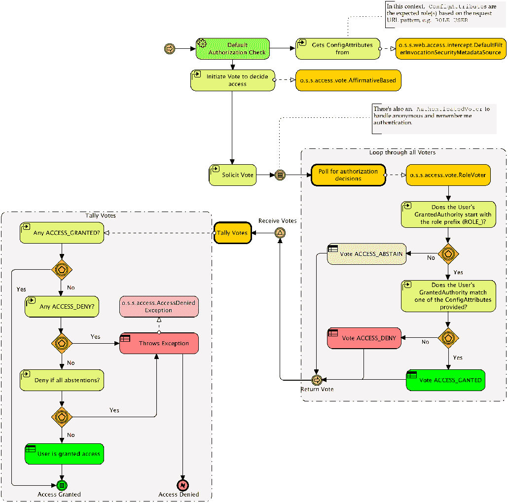
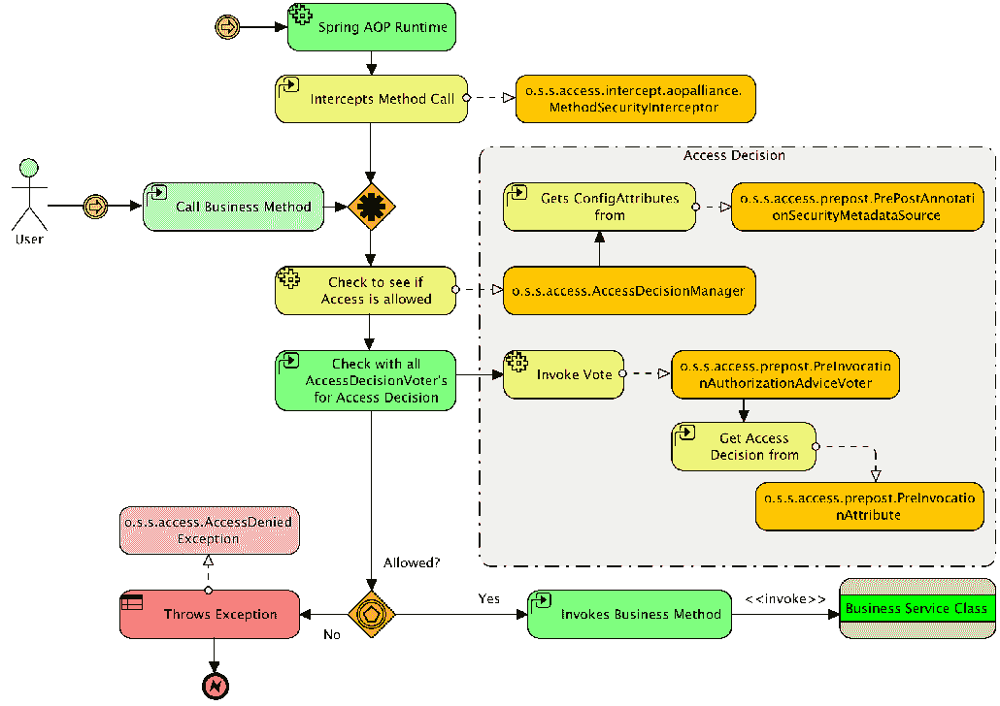
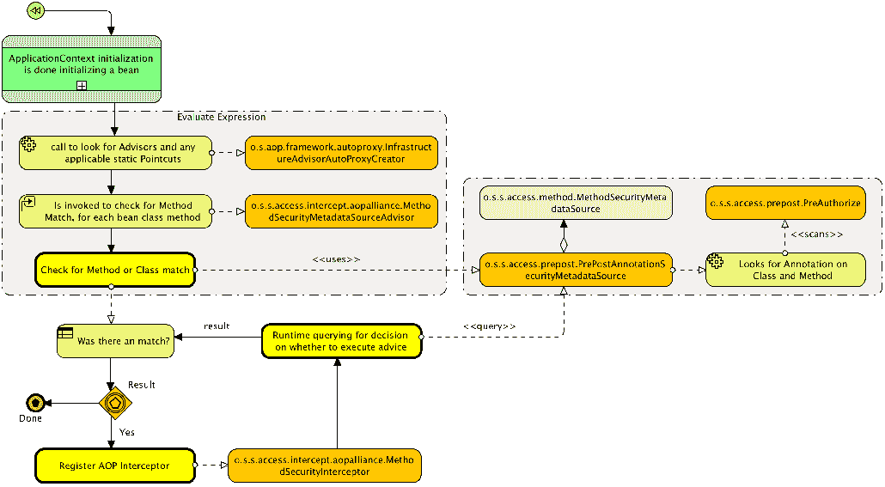

# 自定义授权

在本章中，我们将为 Spring Security 的密钥授权 API 编写一些自定义实现。完成这项工作后，我们将使用对自定义实现的理解来理解 SpringSecurity 的授权体系结构是如何工作的。

在本章中，我们将介绍以下主题：

*   了解授权的工作原理
*   编写由数据库支持的自定义`SecurityMetaDataSource`而不是`antMatchers()`方法
*   创建自定义 SpEL 表达式
*   实现一个自定义的`PermissionEvaluator`对象，该对象允许封装我们的权限

# 批准请求

与身份验证过程一样，Spring Security 提供了一个`o.s.s.web.access.intercept.FilterSecurityInterceptor`servlet 过滤器，该过滤器负责决定是否接受或拒绝特定请求。在调用过滤器时，主体已通过身份验证，因此系统知道有效用户已登录；请记住，我们在[第 3 章](03.html)中实现了`List<GrantedAuthority> getAuthorities()`方法，该方法返回主体的权限列表，即自定义身份验证。一般来说，授权过程将使用此方法中的信息（由`Authentication`接口定义）来确定对于特定请求，是否应允许该请求。

请记住，授权是一个二进制决策——用户要么有权访问安全资源，要么没有。在授权方面没有任何含糊不清之处。

智能面向对象设计在 Spring 安全框架中非常普遍，授权决策管理也不例外。

在 Spring Security 中，`o.s.s.access.AccessDecisionManager`接口指定了两种简单且符合逻辑的方法，它们合理地适合请求的处理决策流，如下所示：

*   `Supports`：此逻辑操作实际上包括两种方法，允许`AccessDecisionManager`实现报告是否支持当前请求。
*   `Decide`：这允许`AccessDecisionManager`实现基于请求上下文和安全配置来验证是否应该允许访问和接受请求。`Decide`方法实际上没有返回值，而是通过抛出异常来指示拒绝来报告拒绝请求。

特定类型的异常可以进一步指示应用程序为解决授权决策而采取的操作。`o.s.s.access.AccessDeniedException`接口是授权领域最常见的异常抛出，需要过滤链进行特殊处理。

`AccessDecisionManager`的实现完全可以使用标准 Springbean 绑定和引用进行配置。默认的`AccessDecisionManager`实现提供了基于`AccessDecisionVoter`和选票聚合的访问授权机制。

投票人是授权序列中的参与者，其工作是评估以下任何或所有事项：

*   安全资源请求的上下文（例如请求 IP 地址的 URL）
*   用户提供的凭据（如果有）
*   正在访问的安全资源
*   系统的配置参数和资源本身

`AccessDecisionManager`实现还负责将所请求资源的访问声明（在代码中称为`o.s.s.access.ConfigAttribute`接口的实现）传递给投票者。对于 web URL，投票者将拥有有关资源访问声明的信息。如果我们查看非常基本的配置文件的 URL 截获声明，我们将看到`ROLE_USER`被声明为用户试图访问的资源的访问配置，如下所示：

```
    .antMatchers("/**").hasRole("USER");
```

根据投票者的知识，它将决定用户是否应该访问资源。Spring Security 允许投票者做出三个决策之一，其逻辑定义映射到接口中的常量，如下表所示：

| **决策类型** | **说明** |
| `Grant (ACCESS_GRANTED)` | 投票人建议允许访问该资源。 |
| `Deny (ACCESS_DENIED)` | 投票人建议拒绝访问该资源。 |
| `Abstain (ACCESS_ABSTAIN)` | 投票人在获取资源时弃权（不做决定）。发生这种情况的原因有很多，例如：

*   选民没有确凿的信息
*   投票者无法决定此类型的请求

 |

正如您可能已经从访问决策相关对象和接口的设计中猜到的那样，Spring 安全性的这一部分已经被设计成可以应用于身份验证和访问控制场景，而这些场景并不是专门在 web 域中。在本章后面讨论方法级安全性时，我们将遇到投票者和访问决策管理者。

当我们把这些放在一起时，web 请求的默认授权检查的总体流程类似于下图：



我们可以看到，`ConfigAttribute`的抽象允许将数据从配置声明（保留在`o.s.s.web.access.intercept.DefaultFilterinvocationSecurityMetadataSource`接口中）传递给负责对`ConfigAttribute`进行操作的投票者，而不需要任何干预类来理解`ConfigAttribute`的内容。这种关注点的分离为构建新类型的安全声明（如在方法安全性中声明的声明）提供了坚实的基础，同时利用了相同的访问决策模式。

# 访问决策聚合的配置

Spring Security 实际上允许在安全命名空间中配置`AccessDecisionManager`。`<http>`元素上的`access-decision-manager-ref`属性允许您指定对`AccessDecisionManager`实现的 Springbean 引用。Spring Security 附带了此接口的三种实现，都在`o.s.s.access.vote`包中，如下所示：

| **类名** | **说明** |
| `AffirmativeBased` | 如果任何投票人同意访问，则无论先前是否拒绝，都会立即允许访问。 |
| `ConsensusBased` | 多数票（同意或拒绝）支配`AccessDecisionManager`的决定。打破平局和处理空票（仅包含弃权票）是可配置的。 |
| `UnanimousBased` | 所有选民都必须允许进入，否则，进入将被拒绝。 |

# 配置基于一致性的访问决策管理器

如果我们想修改应用程序以使用 access 决策管理器，我们需要两个修改。为此，我们将`accessDecisionManager`条目添加到`SecurityConfig.java`文件中的`http`元素中，如下所示：

```
    //src/main/java/com/packtpub/springsecurity/configuration/
    SecurityConfig.java

    http.authorizeRequests()
         .anyRequest()
         .authenticated()
         .accessDecisionManager(accessDecisionManager());
```

这是一个标准的 Springbean 引用，因此它应该对应于 bean 的`id`属性。然后我们可以定义`UnanimousBased`bean，如下面的代码片段所示。请注意，我们不会在练习中实际使用此配置：

```
//src/main/java/com/packtpub/springsecurity/configuration/SecurityConfig.java

@Bean
public AccessDecisionManager accessDecisionManager() {
   List<AccessDecisionVoter<? extends Object>> decisionVoters
           = Arrays.asList(
           new AuthenticatedVoter(),
           new RoleVoter(),
           new WebExpressionVoter()
   );

   return new UnanimousBased(decisionVoters);
}
```

你可能想知道`decisionVoters`财产是关于什么的。在我们声明自己的`AccessDecisionManager`之前，此属性是自动配置的。默认的`AccessDecisionManager`类要求我们声明为做出认证决策而咨询的投票者列表。这里列出的两个投票者是安全命名空间配置提供的默认值。

SpringSecurity 的选民不多，但实施一个新的选民是微不足道的。正如我们将在本章后面看到的，在大多数情况下，不需要创建自定义投票器，因为这通常可以使用自定义表达式甚至自定义`o.s.s.access.PermissionEvaluator`来实现。

我们在这里引用的两个投票者实现如下：

| **类名** | **说明** | **示例** |
| `o.s.s.access.vote.RoleVoter` | 检查用户是否具有匹配的已声明角色。要求属性定义以逗号分隔的名称列表。前缀是预期的，但可以选择配置。 | `access="ROLE_USER,ROLE_ADMIN"` |
| `o.s.s.access.vote.AuthenticatedVoter` | 支持允许通配符匹配的特殊声明：

*   `IS_AUTHENTICATED_FULLY`如果提供了新的用户名和密码，则允许访问。
*   `IS_AUTHENTICATED_REMEMBERED`如果用户已使用记忆我功能进行身份验证，则允许访问。
*   `IS_AUTHENTICATED_ANONYMOUSLY`允许匿名用户访问

 | `access="IS_AUTHENTICATED_ANONYMOUSLY"` |

# 基于表达式的请求授权

正如您所料，SpEL 处理由不同的`Voter`实现`o.s.s.web.access.expression.WebExpressionVoter`提供，它了解如何计算 SpEL 表达式。为此，`WebExpressionVoter`类依赖于`SecurityExpressionHandler`接口的实现。`SecurityExpressionHandler`接口负责计算表达式并提供表达式中引用的特定于安全性的方法。此接口的默认实现公开了在`o.s.s.web.access.expression.WebSecurityExpressionRoot`类中定义的方法。

这些类之间的流程和关系如下图所示：


既然我们知道了如何请求授权，那么让我们通过一些关键接口的定制实现来巩固我们的理解。

# 自定义请求授权

Spring Security 授权的真正威力在于它对定制需求的适应性。让我们探讨几个场景，它们将有助于加强我们对整个体系结构的理解。

# 动态定义对 URL 的访问控制

Spring Security 提供了几种将`ConfigAttribute`对象映射到资源的方法。例如，`antMatchers()`方法确保开发人员可以简单地限制对其 web 应用程序中特定 HTTP 请求的访问。在幕后，`o.s.s.acess.SecurityMetadataSource`的一个实现使用这些映射进行填充，并进行查询，以确定授权发出任何给定 HTTP 请求所需的内容。

虽然`antMatchers()`方法非常简单，但有时可能需要提供一种自定义机制来确定 URL 映射。例如，如果应用程序需要能够动态提供访问控制规则。让我们演示如何将 URL 授权配置移动到数据库中。

# 配置 RequestConfigMappingService

第一步是能够从数据库中获取必要的信息。这将替换从安全 bean 配置中读取`antMatchers()`方法的逻辑。为了做到这一点，本章的示例代码包含`JpaRequestConfigMappingService`，它将从表示为`RequestConfigMapping`的数据库中获取蚂蚁模式和表达式的映射。相当简单的实现如下所示：

```
    // src/main/java/com/packtpub/springsecurity/web/access/intercept/
   JpaRequestConfigMappingService.java

    @Repository("requestConfigMappingService")
    public class JpaRequestConfigMappingService
    implements RequestConfigMappingService {
       @Autowired
   private SecurityFilterMetadataRepository securityFilterMetadataRepository;

   @Autowired
   public JpaRequestConfigMappingService(
           SecurityFilterMetadataRepository sfmr
   ) {
       this.securityFilterMetadataRepository = sfmr;
   }

   @Override
   public List<RequestConfigMapping> getRequestConfigMappings() {
       List<RequestConfigMapping> rcm =
           securityFilterMetadataRepository
               .findAll()
               .stream()
               .sorted((m1, m2) -> {
               return m1.getSortOrder() - m2.getSortOrder()
               })
               .map(md -> {
                   return new RequestConfigMapping(
                            new AntPathRequestMatcher 
                             (md.getAntPattern()),
                             new SecurityConfig 
                             (md.getExpression()));
              }).collect(toList());
       return rcm;
   }
}
```

需要注意的是，正如`antMatchers()`方法一样，顺序也很重要。因此，我们确保结果按`sort_order`列排序。服务创建一个`AntRequestMatcher`并将其与`ConfigAttribute`的实例`SecurityConfig`关联。这将提供 HTTP 请求到`ConfigAttribute`对象的映射，Spring Security 可以使用这些对象来保护我们的 URL。

我们需要创建一个域对象，供 JPA 映射到，如下所示：

```
// src/main/java/com/packtpub/springsecurity/domain/SecurityFilterMetadata.java

@Entity
@Table(name = "security_filtermetadata")
public class SecurityFilterMetadata implements Serializable {

   @Id
   @GeneratedValue(strategy = GenerationType.AUTO)
   private Integer id;
   private String antPattern;
   private String expression;
   private Integer sortOrder;

... setters / getters ...
}
```

最后，我们需要创建一个 Spring 数据存储库对象，如下所示：

```
    // src/main/java/com/packtpub/springsecurity/repository/
    SecurityFilterMetadataRepository.java

   public interface SecurityFilterMetadataRepository
   extends JpaRepository<SecurityFilterMetadata, Integer> {}
```

为了让新服务工作，我们需要使用模式和访问控制映射初始化数据库。与服务实现一样，我们的模式非常简单：

```
// src/main/resources/schema.sql

...
create table security_filtermetadata (
 id         INTEGER GENERATED BY DEFAULT AS IDENTITY,
 ant_pattern VARCHAR(1024) NOT NULL unique,
 expression VARCHAR(1024) NOT NULL,
 sort_order INTEGER NOT NULL,
 PRIMARY KEY (id) 
);
```

然后，我们可以使用来自`SecurityConfig.java`文件的相同`antMatchers()`映射来生成`schema.sql`文件：

```
// src/main/resources/data.sql

*--* Security Filter Metadata *--* 
insert into security_filtermetadata(id,ant_pattern,expression,sort_order) values (110, '/admin/h2/**','permitAll',10);

insert into security_filtermetadata(id,ant_pattern,expression,sort_order) values (115, '/','permitAll',15);

insert into security_filtermetadata(id,ant_pattern,expression,sort_order) values (120, '/login/*','permitAll',20);

insert into security_filtermetadata(id,ant_pattern,expression,sort_order) values (140, '/logout','permitAll',30);

insert into security_filtermetadata(id,ant_pattern,expression,sort_order) values (130, '/signup/*','permitAll',40);

insert into security_filtermetadata(id,ant_pattern,expression,sort_order) values (150, '/errors/**','permitAll',50);

insert into security_filtermetadata(id,ant_pattern,expression,sort_order) values (160, '/admin/**','hasRole("ADMIN")',60);

insert into security_filtermetadata(id,ant_pattern,expression,sort_order) values (160, '/events/','hasRole("ADMIN")',60);

insert into security_filtermetadata(id,ant_pattern,expression,sort_order) values (170, '/**','hasRole("USER")',70);
```

此时，您的代码应该以`chapter13.00-calendar`开头。

# 自定义 SecurityMetadataSource 实现

为了让 Spring Security 了解我们的 URL 映射，我们需要提供一个定制的`FilterInvocationSecurityMetadataSource`实现。`FilterInvocationSecurityMetadataSource`包扩展了`SecurityMetadataSource`接口，在给定特定 HTTP 请求的情况下，该接口为 Spring Security 提供了确定是否应授予访问权限所需的信息。让我们来看看我们如何利用我们的 Tur3T3 接口来实现一个 Ty4T4 接口：

```
    //src/main/java/com/packtpub/springsecurity/web/access/intercept/
    FilterInvocationServiceSecurityMetadataSource.java

    @Component("filterInvocationServiceSecurityMetadataSource")
    public class FilterInvocationServiceSecurityMetadataSource implements
    FilterInvocationSecurityMetadataSource, InitializingBean{
           ¦ constructor and member variables omitted ...

       public Collection<ConfigAttribute> getAllConfigAttributes() {
           return this.delegate.getAllConfigAttributes();
       }

       public Collection<ConfigAttribute> getAttributes(Object object) {
           return this.delegate.getAttributes(object);
       }

       public boolean supports(Class<?> clazz) {
           return this.delegate.supports(clazz);
       }

       public void afterPropertiesSet() throws Exception {
       List<RequestConfigMapping> requestConfigMappings =
       requestConfigMappingService.getRequestConfigMappings();
       LinkedHashMap requestMap = new 
       LinkedHashMap(requestConfigMappings.size());
       for(RequestConfigMapping requestConfigMapping 
       requestConfigMappings) {
           RequestMatcher matcher = 
               requestConfigMapping.getMatcher();
           Collection<ConfigAttribute> attributes =
                   requestConfigMapping.getAttributes();
           requestMap.put(matcher,attributes);
       }
           this.delegate =
           new 
           ExpressionBasedFilterInvocationSecurityMetadataSource
          (requestMap,expressionHandler);
       }
    }
```

我们可以使用`RequestConfigMappingService`接口创建一个映射到`ConfigAttribute`对象的`RequestMatcher`对象的映射。然后，我们将所有工作委托给`ExpressionBasedFilterInvocationSecurityMetadataSource`的一个实例。为简单起见，当前的实现需要重新启动应用程序以获取更改。不过，只要稍作改动，我们就可以避免这种不便。

# 注册自定义 SecurityMetadataSource

现在，我们只剩下配置`FilterInvocationServiceSecurityMetadataSource.`了，唯一的问题是 Spring Security 不支持直接配置自定义`FilterInvocationServiceSecurityMetadataSource`接口。这并不太难，因此我们将在我们的`SecurityConfig`文件中向我们的`FilterSecurityInterceptor`注册此`SecurityMetadataSource`：

```
    // src/main/java/com/packtpub/springsecurity/configuration/
    SecurityConfig.java

   @Override
    public void configure(final WebSecurity web) throws Exception {
       ...
       final HttpSecurity http = getHttp();
       web.postBuildAction(() -> {
       FilterSecurityInterceptor fsi = http.getSharedObject
       (FilterSecurityInterceptor.class);
       fsi.setSecurityMetadataSource(metadataSource);
       web.securityInterceptor(fsi);
       });
    }
```

这将设置我们的自定义`SecurityMetadataSource`接口，其中`FilterSecurityInterceptor`对象作为默认元数据源。

# 删除 antMatchers（）方法

现在数据库被用来映射我们的安全配置，我们可以从我们的`SecurityConfig.java`文件中删除`antMatchers()`方法。继续并删除它们，使配置看起来类似于以下代码段：

```
    // src/main/java/com/packtpub/springsecurity/configuration/
    SecurityConfig.java

    @Override
    protected void configure(HttpSecurity http) throws Exception {

    // No interceptor methods
    // http.authorizeRequests()
    //     .antMatchers("/").permitAll()
         ...

    http.formLogin()
         ...

    http.logout()
         ...
```

如果您使用一个`http antMatchers`表达式，则不会调用自定义表达式处理程序。

现在，您应该能够启动应用程序并进行测试，以确保我们的 URL 得到应有的安全保护。我们的用户不会注意到差异，但我们知道我们的 URL 映射现在保存在数据库中。

您的代码现在应该看起来像`chapter13.01-calendar`。

# 创建自定义表达式

`o.s.s.access.expression.SecurityExpresssionHandler`接口是 Spring 安全性如何抽象 Spring 表达式的创建和初始化方式。与`SecurityMetadataSource`接口一样，有一个用于为 web 请求创建表达式和为安全方法创建表达式的实现。在本节中，我们将探讨如何轻松添加新表达式。

# 配置自定义 SecurityExpressionRoot

假设我们希望支持一个名为`isLocal`的自定义 web 表达式，如果主机是 localhost，则返回`true`，否则返回 false。这种新方法可以确保 SQL 控制台只能从部署 web 应用程序的同一台机器上访问，从而为我们的 SQL 控制台提供额外的安全性。

这是一个人工示例，它没有添加任何安全好处，因为主机来自 HTTP 请求的头。这意味着，即使恶意用户向外部域发出请求，也可能会插入一个标头，说明该主机是本地主机。

我们看到的所有表达式都是可用的，因为`SecurityExpressionHandler`接口通过`o.s.s.access.expression.SecurityExpressionRoot`实例使它们可用。如果打开此对象，您将发现我们在 Spring 表达式中使用的方法和属性（即，`hasRole`、`hasPermission`等），它们在 web 和方法安全性中都很常见。子类提供特定于 web 和方法表达式的方法。例如，`o.s.s.web.access.expression.WebSecurityExpressionRoot`为 web 请求提供了`hasIpAddress`方法。

要创建自定义 web`SecurityExpressionhandler`，我们首先需要创建`WebSecurityExpressionRoot`的子类，该子类定义了我们的`isLocal`方法，如下所示：

```
    //src/main/java/com/packtpub/springsecurity/web/access/expression/
    CustomWebSecurityExpressionRoot.java

    public class CustomWebSecurityExpressionRoot extends
     WebSecurityExpressionRoot {

      public CustomWebSecurityExpressionRoot(Authentication a, 
      FilterInvocation fi) {
       super(a, fi);
       }

      public boolean isLocal() {
            return "localhost".equals(request.getServerName());
       }
   }
```

需要注意的是，`getServerName()`返回`Host`标题值中提供的值。这意味着恶意用户可以向标头中注入不同的值以绕过约束。但是，大多数应用服务器和代理都可以强制执行`Host`头的值。在利用这种方法之前，请阅读适当的文档，以确保恶意用户不会注入`Host`头值来绕过这种约束。

# 配置自定义 SecurityExpressionHandler

为了使我们的新方法变得可用，我们需要创建一个使用新根对象的定制`SecurityExpressionHandler`接口。这就像扩展`WebSecurityExpressionHandler`一样简单，如下所示：

```
    //src/main/java/com/packtpub/springsecurity/web/access/expression/
    CustomWebSecurityExpressionHandler.java

    @Component
    public class CustomWebSecurityExpressionHandler extends  
           DefaultWebSecurityExpressionHandler {
       private final AuthenticationTrustResolver trustResolver =
       new AuthenticationTrustResolverImpl();

       protected SecurityExpressionOperations
       createSecurityExpressionRoot(Authentication authentication, 
       FilterInvocation fi)    
    {
          WebSecurityExpressionRoot root = new 
          CustomWebSecurityExpressionRoot(authentication, fi);
           root.setPermissionEvaluator(getPermissionEvaluator());
           root.setTrustResolver(trustResolver);
           root.setRoleHierarchy(getRoleHierarchy());
         return root;
       }
    }
```

除了使用包含新方法的`CustomWebSecurityExpressionRoot,`之外，我们执行与超类相同的步骤。`CustomWebSecurityExpressionRoot`成为我们 SpEL 表达的根。

有关更多详细信息，请参阅[中 Spring 参考中的 SpEL 文档 http://static.springsource.org/spring/docs/current/spring-framework-reference/html/expressions.html](http://static.springsource.org/spring/docs/current/spring-framework-reference/html/expressions.html) 。

# 配置和使用 CustomWebSecurityExpressionHandler

让我们看看下面的配置步骤：

1.  我们现在需要配置`CustomWebSecurityExpressionHandler`。幸运的是，使用 Spring 安全命名空间配置支持可以很容易地做到这一点。将以下配置添加到`SecurityConfig.java`文件中：

```
    // src/main/java/com/packtpub/springsecurity/configuration/
    SecurityConfig.java

    http.authorizeRequests()
       .expressionHandler(customWebSecurityExpressionHandler);
```

2.  现在，让我们更新初始化 SQL 查询以使用新表达式。更新`data.sql`文件，使其要求用户为`ROLE_ADMIN`并从本地机器请求。您会注意到，由于 SpEL 支持 Java Bean 约定，我们可以编写本地代码而不是`isLocal`：

```
       // src/main/resources/data.sql

      insert into security_filtermetadata(id,ant_pattern,expression,sort_order) 
      values (160, '/admin/**','local and hasRole("ADMIN")',60);
```

3.  重新启动应用程序并使用`localhost:8443/admin/h2`和`admin1@example.com/admin1`访问 H2 控制台以查看管理控制台。如果使用`127.0.0.1:8443/admin/h2`和`admin1@example.com admin1`访问 H2 控制台，将显示拒绝访问页面。

您的代码应该类似于`chapter13.02-calendar`。

# CustomWebSecurityExpressionHandler 的替代方案

使用自定义表达式而不是使用`CustomWebSecurityExpressionHandler`接口的另一种方法是添加`@Component`web，如下所示：

```
    // src/main/java/com/packtpub/springsecurity/web/access/expression/
    CustomWebExpression.java

    @Component
     public class CustomWebExpression {
       public boolean isLocal(Authentication authentication,
                          HttpServletRequest request) {
       return "localhost".equals(request.getServerName());
   }
}
```

现在，让我们更新初始化 SQL 查询以使用新表达式。您会注意到，我们可以直接引用`@Component`，因为 SpEL 支持 Java Bean 约定：

```
// src/main/resources/data.sql

insert into security_filtermetadata(id,ant_pattern,expression,sort_order) values (160, '/admin/**','@customWebExpression.isLocal(authentication, request) and hasRole("ADMIN")',60);
```

# 方法安全性是如何工作的？

无论是否允许给定请求，方法安全性的访问决策机制在概念上与 web 请求访问的访问决策逻辑相同。`AccessDecisionManager`轮询一组`AccessDecisionVoters`，每个`AccessDecisionVoters`都可以提供一个允许或拒绝访问或弃权投票的决定。`AccessDecisionManager`的具体实现汇总了投票人的决策，并得出一个总体决策，以允许方法调用。

Web 请求访问决策不那么复杂，因为 servlet 过滤器的可用性使得拦截（和摘要拒绝）安全请求相对简单。由于方法调用可以在任何地方进行，包括 Spring Security 未直接配置的代码区域，因此 Spring Security 设计人员选择使用 Spring 管理的 AOP 方法来识别、评估和保护方法调用。

下面的高级流程说明了参与方法调用的授权决策的主要参与者：



我们可以看到，标准 SpringAOP 运行时调用了 SpringSecurity 的`o.s.s.access.intercept.aopalliance.MethodSecurityInterceptor`，以拦截感兴趣的方法调用。从这里开始，根据前面的流程图，是否允许方法调用的逻辑相对简单。

此时，我们可能想知道方法安全特性的性能。显然，`MethodSecurityInterceptor`不能为应用程序中的每个方法调用调用，那么方法或类上的注释如何导致 AOP 拦截？

首先，默认情况下不会为所有 Spring 管理的 bean 调用 AOP 代理。相反，如果在 Spring 安全配置中定义了`@EnableGlobalMethodSecurity`，则将注册一个标准的 Spring AOP`o.s.beans.factory.config.BeanPostProcessor`，该 AOP 将内省 AOP 配置，以查看是否有任何 AOP 顾问指示需要代理（和拦截）。此工作流是标准的 Spring AOP 处理（称为 AOP 自动代理），本质上没有任何特定于 Spring 安全性的功能。所有注册的`BeanPostProcessor`在 spring`ApplicationContext`初始化时运行，毕竟 SpringBean 配置已经发生。

AOP 自动代理功能查询所有已注册的`PointcutAdvisor`，以查看是否存在解决应应用 AOP 建议的方法调用的 AOP 切入点。Spring Security 实现了`o.s.s.access.intercept.aopalliance.MethodSecurityMetadataSourceAdvisor`类，该类检查任何和所有配置的方法安全性，并设置适当的 AOP 拦截。请注意，只有声明了方法安全规则的接口或类才会被 AOP 代理！

请注意，强烈建议在接口上而不是在实现类上声明 AOP 规则（和其他安全注释）。类的使用，虽然可以使用带有 Spring 的 CGLIB 代理，但可能会意外地改变应用程序的行为，并且在语义上通常不如接口上的安全声明（通过 AOP）正确。`MethodSecurityMetadataSourceAdvisor`将使用 AOP 建议影响方法的决策委托给`o.s.s.access.method.MethodSecurityMetadataSource`实例。不同形式的方法安全注释都有自己的`MethodSecurityMetadataSource`实现，用于依次内省每个方法和类，并添加要在运行时执行的 AOP 建议。

下图说明了此过程是如何发生的：



根据应用程序中配置的 SpringBean 数量以及您拥有的安全方法注释数量，添加方法安全代理可能会增加初始化 ApplicationContext 所需的时间。然而，一旦您的 Spring 上下文被初始化，对单个代理 bean 的性能影响可以忽略不计。

现在我们已经了解了如何使用 AOP 应用 Spring 安全性，让我们通过创建一个自定义`PermissionEvaluator`来加强对 Spring 安全性授权的理解。

# 创建自定义 PermissionEvaluator

在上一章中，我们演示了可以使用 Spring Security 的内置`PermissionEvaluator`实现`AclPermissionEvaluator`来限制对应用程序的访问。虽然功能强大，但这往往比必要的更复杂。我们还发现了 SpEL 如何构造能够保护应用程序安全的复杂表达式。虽然很简单，但使用复杂表达式的缺点之一是逻辑不集中。幸运的是，我们可以很容易地创建一个定制的`PermissionEvaluator`，它能够集中我们的授权逻辑，并且仍然可以避免使用 ACL 的复杂性。

# 日历许可评估器

我们的定制`PermissionEvaluator`的简化版本不包含任何验证，如下所示：

```
//src/main/java/com/packtpub/springsecurity/access/CalendarPermissionEvaluator.java

public final class CalendarPermissionEvaluator implements PermissionEvaluator {
   private final EventDao eventDao;

   public CalendarPermissionEvaluator(EventDao eventDao) {
       this.eventDao = eventDao;
   }

   public boolean hasPermission(Authentication authentication, Object 
   targetDomainObject, Object permission) {
       // should do instanceof check since could be any domain object
       return hasPermission(authentication, (Event) targetDomainObject, permission);
   }

   public boolean hasPermission(Authentication authentication, 
   Serializable targetId, String targetType,
           Object permission) {
       // missing validation and checking of the targetType
       Event event = eventDao.getEvent((Integer)targetId);
       return hasPermission(authentication, event, permission);
   }

   private boolean hasPermission(Authentication authentication, 
   Event event, Object permission) {
       if(event == null) {
           return true;
       }
       String currentUserEmail = authentication.getName();
       String ownerEmail = extractEmail(event.getOwner());
       if("write".equals(permission)) {
           return currentUserEmail.equals(ownerEmail);
       } else if("read".equals(permission)) {
           String attendeeEmail = 
           extractEmail(event.getAttendee());
           return currentUserEmail.equals(attendeeEmail) || 
           currentUserEmail.equals(ownerEmail);
       }
       throw new IllegalArgumentException("permission 
       "+permission+" is not supported.");
   }

   private String extractEmail(CalendarUser user) {
       if(user == null) {
           return null;
       }
       return user.getEmail();
   }
}
```

该逻辑与我们已经使用的 Spring 表达式非常相似，只是它区分了读访问和写访问。如果当前用户的用户名与`Event`对象的所有者电子邮件匹配，则授予读写访问权限。如果当前用户的电子邮件与与会者的电子邮件匹配，则授予读取权限。否则，访问将被拒绝。

需要注意的是，每个域对象都使用一个`PermissionEvaluator`。因此，在现实世界中，我们必须首先执行`instanceof`检查。例如，如果我们还保护我们的`CalendarUser`对象，那么这些对象可以被传递到同一个实例中。有关这些微小更改的完整示例，请参阅本书中包含的示例代码。

# 配置 CalendarPermissionEvaluator

然后，我们可以利用本章提供的`CustomAuthorizationConfig.java`配置来提供一个使用我们的`CalendarPermissionEvaluator`的`ExpressionHandler`，如下所示：

```
 //src/main/java/com/packtpub/springsecurity/configuration/
 CustomAuthorizationConfig.java

@Bean
public DefaultMethodSecurityExpressionHandler defaultExpressionHandler(EventDao eventDao){
   DefaultMethodSecurityExpressionHandler deh = new DefaultMethodSecurityExpressionHandler();
   deh.setPermissionEvaluator(
           new CalendarPermissionEvaluator(eventDao));
   return deh;
}
```

配置应该类似于[第 12 章](12.html)、*访问控制列表*中的配置，只是我们现在使用的是`CalendarPermissionEvalulator`类而不是`AclPermissionEvaluator`。

接下来，我们通知 Spring Security 使用我们定制的`ExpressionHandler`，在`SecurityConfig.java`中添加以下配置。

```
    //src/main/java/com/packtpub/springsecurity/configuration/SecurityConfig.java
    http.authorizeRequests().expressionHandler
    (customWebSecurityExpressionHandler);
```

在配置中，我们确保启用了`prePostEnabled`，并将配置指向我们的`ExpressionHandler`定义。同样，配置应该与我们在[第 11 章](https://cdp.packtpub.com/spring_security__third_edition/wp-admin/post.php?post=169&action=edit)、*细粒度访问控制*中的配置非常相似。

# 保护我们的日历服务

最后，我们可以使用一个`@PostAuthorize`注释来保护我们的`CalendarService getEvent(int eventId)`方法。您会注意到，此步骤与我们在[第 1 章](01.html)、*剖析不安全应用程序*中所做的完全相同，我们只更改了`PermissionEvaluator`的实现：

```
    //src/main/java/com/packtpub/springsecurity/service/CalendarService.java

    @PostAuthorize("hasPermission(returnObject,'read')")
    Event getEvent(int eventId);
```

如果您尚未这样做，请重新启动应用程序，以用户名/密码`admin1@example.com/admin1`登录，并使用欢迎页面上的链接访问电话会议活动（`events/101`。将显示“拒绝访问”页面。但是，我们希望`ROLE_ADMIN`用户能够访问所有事件。

# 自定义 PermissionEvaluator 的好处

由于只有一个方法受到保护，因此更新注释以检查用户是否具有`ROLE_ADMIN`角色或权限是很简单的。然而，如果我们已经保护了所有使用事件的服务方法，它将变得相当麻烦。相反，我们可以只更新我们的`CalendarPermissionEvaluator`。进行以下更改：

```
private boolean hasPermission(Authentication authentication, Event event, Object permission) {
   if(event == null) {
       return true;
   }
   GrantedAuthority adminRole =
           new SimpleGrantedAuthority("ROLE_ADMIN");
   if(authentication.getAuthorities().contains(adminRole)) {
       return true;
   }
   ...
}
```

现在，重新启动应用程序并重复上一个练习。这一次，电话会议事件将成功显示。您可以看到，封装我们的授权逻辑的能力是非常有益的。但是，有时扩展表达式本身可能很有用。

您的代码应该类似于`chapter13.03-calendar`。

# 总结

在阅读了本章之后，您应该对 Spring 安全授权如何处理 HTTP 请求和方法有了深入的了解。有了这些知识和提供的具体示例，您还应该知道如何扩展授权以满足您的需要。具体来说，在本章中，我们介绍了 HTTP 请求和方法的 Spring 安全授权体系结构。我们还演示了如何从数据库配置安全 URL。

我们还了解了如何创建自定义`PermissionEvaluator`对象和自定义 Spring 安全表达式。

在下一章中，我们将探讨 Spring 安全性如何执行会话管理。我们还将了解如何使用它来限制对应用程序的访问。