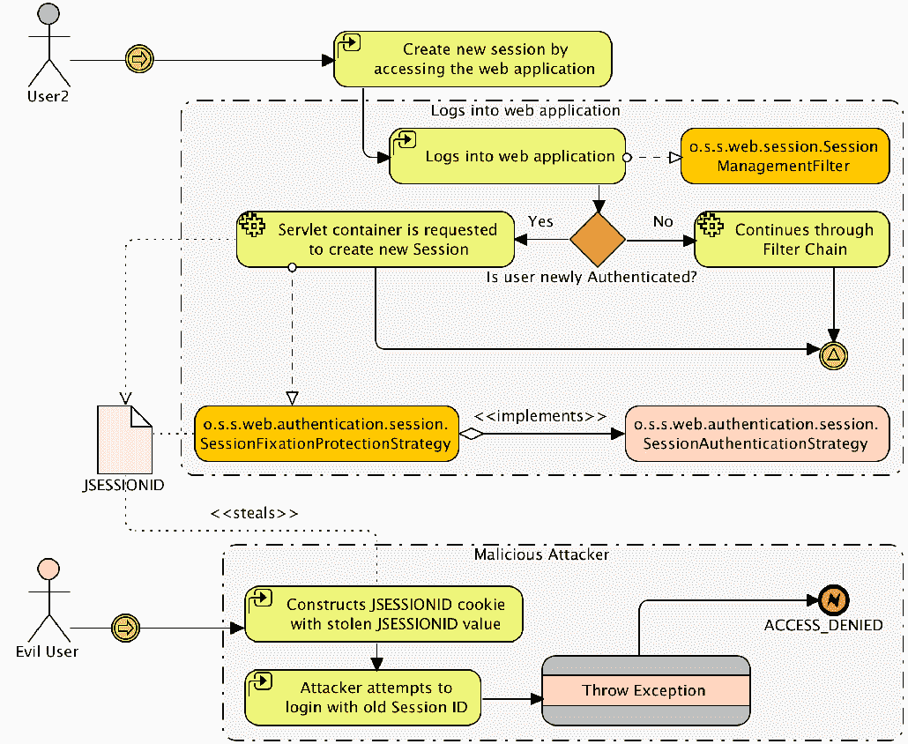
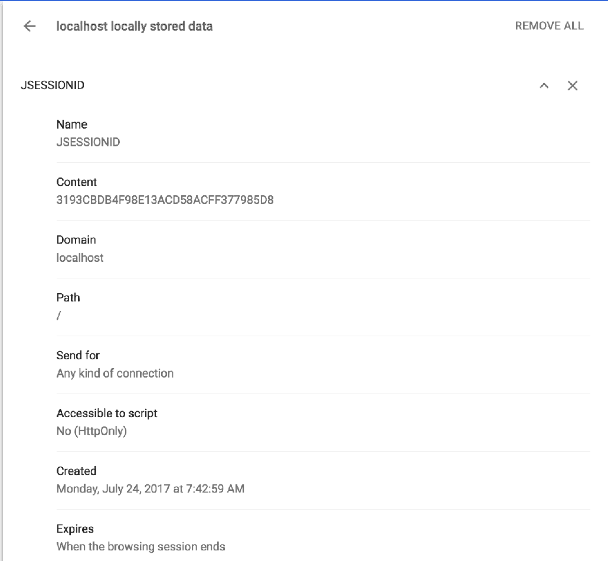
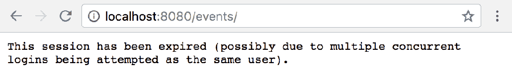

# 十四、会话管理

本章讨论 Spring Security 的会话管理功能。它以一个 Spring Security 如何防御会话固定的示例开始。然后，我们将讨论如何利用并发控制来限制对每个用户许可的软件的访问。我们还将了解如何利用会话管理实现管理功能。最后，我们将探索`HttpSession`在 Spring Security 中的使用方式，以及如何控制其创建。

以下是本章将涉及的主题列表：

*   会话管理/会话固定
*   并发控制
*   管理登录用户
*   `HttpSession`在 Spring Security 中如何使用以及如何控制创建
*   如何使用`DebugFilter`类发现`HttpSession`的创建位置

# 配置会话固定保护

由于我们使用的是安全命名空间样式的配置，会话固定保护已经代表我们进行了配置。如果我们想显式地将其配置为镜像默认设置，我们将执行以下操作：

```java
    http.sessionManagement()
    .sessionFixation().migrateSession();
```

**会话固定保护**是该框架的一项功能，除非您尝试充当恶意用户，否则您很可能不会注意到它。我们将向您展示如何模拟会话窃取攻击；在此之前，了解会话固定的作用以及它所防止的攻击类型非常重要。

# 理解会话固定攻击

会话固定是一种攻击类型，恶意用户试图窃取系统未经认证用户的会话。这可以通过使用各种技术来实现，这些技术会导致攻击者获得用户的唯一会话标识符（例如，`JSESSIONID`。如果攻击者创建一个 cookie 或 URL 参数，其中包含用户的`JSESSIONID`标识符，则攻击者可以访问该用户的会话。

虽然这显然是一个问题，但通常情况下，如果用户未经认证，他们就没有输入任何敏感信息。如果在对用户进行认证后继续使用相同的会话标识符，这将成为一个更为严重的问题。如果在认证后使用相同的标识符，攻击者现在可以访问经过认证的用户的会话，而无需知道他们的用户名或密码！

在这一点上，你可能会嘲笑不相信，认为这在现实世界中是极不可能发生的。事实上，会话窃取攻击经常发生。我们建议您花一些时间阅读由**开放式 Web 应用安全项目**（**OWASP**组织（[组织）发布的关于该主题的内容丰富的文章和案例研究 http://www.owasp.org/](http://www.owasp.org/) ）。具体来说，您需要阅读 OWASP 前 10 名列表。攻击者和恶意用户是真实存在的，如果您不了解他们通常使用的技术并知道如何避免这些技术，他们可能会对您的用户、应用或公司造成非常真实的损害。

下图说明了会话固定攻击的工作原理：


现在我们已经了解了这样的攻击是如何工作的，我们将了解 SpringSecurity 可以做些什么来防止它。

# 使用 Spring Security 防止会话固定攻击

如果我们可以防止用户在认证之前拥有的相同会话在认证之后被使用，那么我们可以有效地使攻击者对会话 ID 的了解变得无用。Spring Security 会话固定保护通过在用户经过认证时显式创建新会话并使其旧会话无效来解决此问题。

让我们看看下面的图表：



我们可以看到，一个新的过滤器`o.s.s.web.session.SessionManagementFilter`负责评估某个特定用户是否经过了新的认证。如果用户是新认证的，配置的`o.s.s.web.authentication.session.SessionAuthenticationStrategy`接口将决定如何操作。`o.s.s.web.authentication.session.SessionFixationProtectionStrategy`将创建一个新会话（如果用户已有会话），并将现有会话的内容复制到新会话。这看起来很简单。但是，正如我们在前面的图中所看到的，它有效地防止了恶意用户在对未知用户进行认证后重用会话 ID。

# 模拟会话固定攻击

此时，您可能希望了解模拟会话固定攻击所涉及的内容：

1.  首先需要在`SecurityConfig.java`文件中禁用会话固定保护，将`sessionManagement()`方法添加为`http`元素的子元素。

您应该从`chapter14.00-calendar`的代码开始。

让我们看看下面的代码片段：

```
    //src/main/java/com/packtpub/springsecurity/configuration/
    SecurityConfig.java

    http.sessionManagement().sessionFixation().none();
```

您的代码现在应该看起来像`chapter14.01-calendar`。

2.  接下来，您需要打开两个浏览器。我们将在 Google Chrome 中启动会话，从那里窃取会话，攻击者将使用 Firefox 中窃取的会话登录。我们将使用 Google Chrome 和 Firefox web developer 插件来查看和操作 cookie。Firefox web developer 插件可从[下载 https://addons.mozilla.org/en-US/firefox/addon/web-developer/](https://addons.mozilla.org/en-US/firefox/addon/web-developer/) 。Google Chrome 的 web 开发工具是内置的。
3.  在 Google Chrome 中打开 JBCP 日历主页。

4.  接下来，在主菜单中，导航到编辑引擎盖下的|首选项|。在隐私类别中，按内容设置。。。按钮接下来，在 Cookies 设置中，按所有 Cookies 和站点数据。。。按钮最后，在搜索字段中输入`localhost`，如下所示：



5.  选择`JSESSIONID`cookie，将内容值复制到剪贴板，然后登录到 JBCP 日历应用。如果您重复查看 Cookie 信息命令，您将看到登录后`JSESSIONID`没有改变，这使您容易受到会话固定攻击！
6.  在 Firefox 中，打开 JBCP 日历网站。您将被分配一个会话 cookie，您可以使用*Ctrl*+*F2*打开底部 cookie 控制台来查看该 cookie。然后输入`cookie list [enter]`以显示当前页面的 cookies。
7.  为了完成我们的破解，我们将点击编辑 Cookie 选项并粘贴到我们从 Google Chrome 复制到剪贴板的`JSESSIONID`Cookie 中，如以下屏幕截图所示：


8.  请记住，Firefox 的新版本也包括 web 开发者工具。但是，您需要确保使用的是扩展，而不是内置扩展，因为它提供了额外的功能。

我们的会话固定已完成！如果您现在在 Firefox 中重新加载页面，您将看到您是以使用 Google Chrome 登录的同一用户的身份登录的，但不知道用户名和密码。你害怕恶意用户了吗？

现在，重新启用会话固定保护并重试此练习。您将看到，在本例中，`JSESSIONID`在用户登录后发生变化。根据我们对会话固定攻击如何发生的理解，这意味着我们降低了毫无戒心的用户成为此类攻击受害者的可能性。干得好！

谨慎的开发人员应该注意，有很多方法可以窃取会话 cookie，其中一些方法（如 XSS）甚至可能使会话固定保护的站点易受攻击。有关防止此类攻击的其他资源，请咨询 OWASP 站点。

# 比较会话固定保护选项

`session-fixation-protection`属性具有以下三个选项，允许您更改其行为，如下所示：

| **属性值** | **说明** |
| `none()` | 此选项禁用会话固定保护，并且（除非其他`sessionManagement()`属性为非默认）不配置`SessionManagementFilter`。 |
| `migrateSession()` | 当对用户进行认证并分配新会话时，它确保将旧会话的所有属性移动到新会话。 |
| `newSession()` | 当用户通过认证时，将创建一个新会话，并且不会迁移旧（未经认证）会话中的任何属性。 |

在大多数情况下，`migrateSession()`的默认行为适用于希望在用户经过认证后保留用户会话重要属性（如点击兴趣和购物车）的站点。

# 限制每个用户的并发会话数

在软件行业，软件通常是按用户销售的。这意味着，作为软件开发人员，我们有兴趣确保每个用户只存在一个会话，以打击帐户共享。Spring Security 的并发会话控制确保单个用户不能同时拥有超过固定数量的活动会话（通常为一个）。要确保强制执行此最大限制，需要几个组件协同工作，以准确跟踪用户会话活动中的更改。

让我们配置该功能，检查它的工作原理，然后测试它！

# 配置并发会话控制

现在我们已经了解了并发会话控制中涉及的不同组件，设置它应该更有意义。让我们看看下面的配置并发会话控制的步骤：

1.  首先，您更新您的`security.xml`文件如下：

```
        // src/main/java/com/packtpub/springsecurity/configuration/
        SecurityConfig.java

        http.sessionManagement().maximumSessions(1)
```

2.  接下来，我们需要在`SecurityConfig.java`部署描述符中启用`o.s.s.web.session.HttpSessionEventPublisher`，以便 servlet 容器将会话生命周期事件通知 Spring Security（通过`HttpSessionEventPublisher`，如下所示：

```
        // src/main/java/com/packtpub/springsecurity/configuration/ 
        SecurityConfig.java

        @Bean
        public HttpSessionEventPublisher httpSessionEventPublisher() {
            return new HttpSessionEventPublisher();
        }
```

有了这两个配置位，并发会话控制现在将被激活。让我们看看它的实际功能，然后我们将演示如何测试它。

# 理解并发会话控制

并发会话控制使用`o.s.s.core.session.SessionRegistry`来维护活动 HTTP 会话的列表以及与之关联的经过认证的用户。会话创建和过期后，注册表将根据`HttpSessionEventPublisher`发布的会话生命周期事件实时更新，以跟踪每个已验证用户的活动会话数。

请参阅下图：


`SessionAuthenticationStrategy`的扩展`o.s.s.web.authentication.session.ConcurrentSessionControlStrategy`是跟踪新会话的方法，也是实际执行并发控制的方法。每次用户访问安全站点时，`SessionManagementFilter`用于对照`SessionRegistry`检查活动会话。如果用户的活动会话不在`SessionRegistry`中跟踪的活动会话列表中，则最近使用最少的会话立即过期。

修改后的并发会话控制过滤链中的次要参与者为`o.s.s.web.session.ConcurrentSessionFilter`。此筛选器将识别过期会话（通常是 servlet 容器或`ConcurrentSessionControlStrategy`接口强制过期的会话），并通知用户其会话已过期。

既然我们已经了解了并发会话控制是如何工作的，那么我们应该可以很容易地重现一个实施并发会话控制的场景。

您的代码现在应该看起来像`chapter14.02-calendar`。

# 测试并发会话控制

正如我们在验证会话固定保护时所做的那样，我们需要通过执行以下步骤访问两个 web 浏览器：

1.  在 Google Chrome 中，以`user1@example.com/user1`登录该站点。
2.  现在，在 Firefox 中，以同一用户身份登录该站点。
3.  最后，回到谷歌浏览器并采取任何行动。您将看到一条消息，指示您的会话已过期，如以下屏幕截图所示：



如果您正在使用此应用并收到此消息，您可能会感到困惑。这是因为它显然不是一种友好的通知方法，即一次只有一个用户可以访问应用。但是，它确实说明了会话已被软件强制终止。

并发会话控制对于新的 SpringSecurity 用户来说是一个很难理解的概念。许多用户试图实现它，却没有真正了解它是如何工作的以及它的好处是什么。如果您试图启用这个强大的功能，但它似乎没有如您所期望的那样工作，请确保您已正确配置了所有内容，然后回顾本节中的理论解释，希望它们能帮助您了解可能的错误！

当会话过期事件发生时，我们可能应该将用户重定向到登录页面，并向他们提供一条消息，以指示出现了什么问题。

# 配置过期会话重定向

幸运的是，当并发会话控制标记用户时，有一种简单的方法可以将用户引导到友好页面（通常是登录页面），只需指定`expired-url`属性并将其设置为应用中的有效页面。更新您的`security.xml`文件如下：

```
    //src/main/java/com/packtpub/springsecurity/configuration/SecurityConfig.java

    http.sessionManagement()
    .maximumSessions(1)
 .expiredUrl("/login/form?expired")    ;
```

在我们的应用中，这将用户重定向到标准登录表单。然后，我们将使用 query 参数显示一条友好消息，表明我们确定他们有多个活动会话，应该再次登录。更新您的`login.html`页面，使用此参数显示我们的消息：

```
    //src/main/resources/templates/login.html

    ...
    <div th:if="${param.expired != null}" class="alert alert-success">
    <strong>Session Expired</strong>
   <span>You have been forcibly logged out due to multiplesessions 
   on the same account (only one activesession per user is allowed).</span>
   </div>
    <label for="username">Username</label>
```

通过使用 Google Chrome 和 Firefox 以用户`admin1@example.com`/`admin1`的身份登录，尝试一下。这一次，您将看到一个带有自定义错误消息的登录页面。

您的代码现在应该看起来像`chapter14.03-calendar`。

# 并发控制的常见问题

使用同一用户登录不会触发注销事件有几个常见原因。第一种情况发生在使用自定义`UserDetails`（正如我们在[第 3 章](03.html)、*自定义认证*中所做的那样）时，而 equals 和`hashCode`方法没有正确实现。这是因为默认的`SessionRegistry`实现使用内存中的映射来存储`UserDetails`。为了解决这个问题，您必须确保您已经正确地实现了`hashCode`和 equals 方法。

第二个问题发生在当用户会话被持久化到磁盘时重新启动应用容器时。容器启动备份后，已使用有效会话登录的用户将登录。但是，用于确定用户是否已登录的内存中映射`SessionRegistry`将为空。这意味着 Spring Security 将报告用户未登录，即使用户已登录。要解决此问题，需要在禁用容器内会话持久性的同时使用自定义`SessionRegistry`，或者必须实现特定于容器的方式，以确保在启动时将持久化会话填充到内存映射中。

另一个原因是，在编写本文时，没有为 memberme 特性实现并发控制。如果用户通过 MemberMe 进行认证，则不会强制执行该并发控制。有一个 JIRA 来实现此功能，因此如果您的应用同时需要记住我和并发控制，请参考它以获取任何更新：[https://jira.springsource.org/browse/SEC-2028](https://jira.springsource.org/browse/SEC-2028)

我们将讨论的最后一个常见原因是并发控制在具有默认`SessionRegistry`实现的集群环境中不起作用。如前所述，默认实现使用内存映射。这意味着，如果`user1`登录到应用服务器 A，则他们登录的事实将与该服务器相关联。因此，如果`user1`随后向应用服务器 B 进行认证，则应用服务器 B 将不知道先前关联的认证。

# 阻止认证而不是强制注销

如果用户已经有会话，SpringSecurity 还可以阻止用户登录到应用。这意味着 Spring Security 将阻止第二个用户登录，而不是强制原始用户注销。配置更改如下所示：

```
    //src/main/java/com/packtpub/springsecurity/configuration/SecurityConfig.java

    http.sessionManagement()
    .maximumSessions(1)
    .expiredUrl("/login/form?expired")
 .maxSessionsPreventsLogin(true);
```

使用 Google Chrome 进行更新并登录日历应用。现在，尝试使用同一用户使用 Firefox 登录日历应用。您应该可以从`login.html`文件中看到我们的自定义错误消息。

您的代码现在应该看起来像`chapter14.04-calendar`。

这种方法有一个缺点，如果不仔细考虑，可能是不明显的。尝试在不注销的情况下关闭 Google Chrome，然后再次打开它。现在，再次尝试登录应用。您将发现无法登录。这是因为当浏览器关闭时，`JSESSIONID`cookie 被删除。但是，应用不知道这一点，因此用户仍然被认为是经过认证的。您可以将其视为一种内存泄漏，因为`HttpSession`仍然存在，但没有指向它的指针（`JSESSIONID`cookie 不见了）。直到会话超时，我们的用户才能再次进行认证。谢天谢地，一旦会话超时，我们的`SessionEventPublisher`界面将从`SessionRegistry`界面中删除该用户。我们可以从中得到的是，如果用户忘记注销并关闭浏览器，他们将无法登录到应用，直到会话超时。

正如在[第 7 章](07.html)*记住我的服务*中所述，如果浏览器在关闭后仍决定记住某个会话，则此实验可能不起作用。通常，如果插件或浏览器配置为还原会话，就会发生这种情况。在这种情况下，您可能需要手动删除`JSESSIONID`cookie，以模拟关闭浏览器。

# 并发会话控制的其他好处

并发会话控制的另一个好处是，`SessionRegistry`的存在是为了跟踪活动（或者过期）会话。这意味着，通过执行以下步骤，我们可以获得关于系统中存在哪些用户活动的运行时信息（至少对于经过认证的用户）：

1.  如果不想启用并发会话控制，甚至可以这样做。只需将`maximumSessions`设置为`-1`，会话跟踪将保持启用状态，即使不会强制执行最大值。相反，我们将使用本章`SessionConfig.java`文件中提供的显式 bean 配置，如下所示：

```
        //src/main/java/com/packtpub/springsecurity/configuration/
        SessionConfig.java

        @Bean
        public SessionRegistry sessionRegistry(){
         return new SessionRegistryImpl();
        }
```

2.  我们已经将`SessionConfig.java`文件的导入添加到`SecurityConfig.java`文件中。因此，我们所需要做的就是引用我们的`SecurityConfig.java`文件中的自定义配置。继续并用以下代码片段替换当前的`sessionManagement`和`maximumSessions`配置：

```
        //src/main/java/com/packtpub/springsecurity/configuration/
        SecurityConfig.java

        http.sessionManagement()
        .maximumSessions(-1)
        .sessionRegistry(sessionRegistry)
        .expiredUrl("/login/form?expired")
        .maxSessionsPreventsLogin(true);
```

您的代码现在应该看起来像`chapter14.05-calendar`。

现在，我们的应用将允许对同一用户进行无限次的认证。但是，我们可以使用`SessionRegistry`强制用户注销。让我们看看如何使用这些信息来增强用户的安全性。

# 显示用户的活动会话

您可能已经看到有多少网站允许用户查看并强制注销其帐户的会话。我们可以很容易地使用这个强制注销功能来做同样的事情。我们已经提供了`UserSessionController`，获取当前登录用户的活动会话。您可以看到如下实现：

```
    //src/main/java/com/packtpub/springsecurity/web/controllers/
    UserSessionController.java

    @Controller
    public class UserSessionController {
     private final SessionRegistry sessionRegistry;
    @Autowired
     public UserSessionController(SessionRegistry sessionRegistry) {
      this.sessionRegistry = sessionRegistry;
    }
      @GetMapping("/user/sessions/")
    public String sessions(Authentication authentication, ModelMap model) {
    List<SessionInformation> sessions = sessionRegistry.getAllSessions
    (authentication.getPrincipal(), false);
    model.put("sessions", sessions);
      return "user/sessions";
     }
      @DeleteMapping(value="/user/sessions/{sessionId}")
     public String removeSession(@PathVariable String sessionId,
      RedirectAttributes redirectAttrs) {
    SessionInformation sessionInformation = sessionRegistry.
    getSessionInformation(sessionId);
    if(sessionInformation != null) {
       sessionInformation.expireNow();
    }
```

```
       redirectAttrs.addFlashAttribute("message", "Session was removed");
       return "redirect:/user/sessions/";
       }
    }
```

我们的 sessions 方法将使用 Spring MVC 自动获取当前的 SpringSecurity`Authentication`。如果我们不使用 Spring MVC，我们也可以从`SecurityContextHolder`获取当前`Authentication`，如[第 3 章](03.html)、*自定义认证*中所述。然后使用主体获取当前用户的所有`SessionInformation`对象。通过迭代我们的`sessions.html`文件中的`SessionInformation`对象，可以轻松显示信息，如下所示：

```
//src/main/resources/templates/sessions.html

...
<tr th:each="session : ${sessions}">
<td th:text="${#calendars.format(session.lastRequest, 'yyyy-MM-dd HH:mm')}">
</td>
<td th:text="${session.sessionId}"></td>
<td>
<form action="#" th:action="@{'/user/sessions/{id}'(id=${session.sessionId})}"
th:method="delete" cssClass="form-horizontal">
<input type="submit" value="Delete" class="btn"/>
</form>
</td>
</tr>
...
```

您现在可以安全地启动 JBCP 日历应用，并使用 Google Chrome 中的`user1@example.com`/`user1`登录。现在，使用 Firefox 登录并点击右上角的`user1@example.com`链接。然后，您将看到显示屏上列出的两个会话，如以下屏幕截图所示：


在 Firefox 中，单击第一个会话的删除按钮。这会将请求发送到我们的`UserSessionsController`的`deleteSession`方法。这表示会话应该终止。现在，导航到 Google Chrome 中的任何页面。您将看到自定义消息，说明会话已被强制终止。虽然消息可以使用更新，但我们发现这是一个很好的功能，用户可以终止其他活动会话。

其他可能的用途包括允许管理员列出和管理所有活动会话，显示站点上活动用户的数量，甚至扩展信息以包括 IP 地址或位置信息等内容。

# Spring Security 如何使用 HttpSession 方法？

我们已经讨论了 Spring Security 如何使用`SecurityContextHolder`来确定当前登录的用户。然而，我们还没有解释`SecurityContextHolder`是如何被 SpringSecurity 自动填充的。其秘密在于`o.s.s.web.context.SecurityContextPersistenceFilter`过滤器和`o.s.s.web.context.SecurityContextRepository`接口。让我们看看下面的图表：


以下是对上图中所示每个步骤的说明：

1.  在每个 web 请求开始时，`SecurityContextPersistenceFilter`负责使用`SecurityContextRepository`获取当前的`SecurityContext`实现。
2.  紧接着，它将`SecurityContext`设置为`SecurityContextHolder`。
3.  对于 web 请求的其余部分，`SecurityContext`可通过`SecurityContextHolder`访问。例如，如果 Spring MVC 控制器或`CalendarService`想要访问`SecurityContext`，它可以使用`SecurityContextHolder`来访问它。
4.  然后，在每个请求结束时，`SecurityContextPersistenceFilter`从`SecurityContextHolder`获取`SecurityContext`。
5.  紧接着，`SecurityContextPersistenceFilter`将`SecurityContext`保存在`SecurityContextRepository`中。这确保了如果在 web 请求期间的任何时间点更新了`SecurityContext`（即，当用户创建新帐户时，如[第 3 章](https://cdp.packtpub.com/spring_security__third_edition/wp-admin/post.php?post=42&action=edit)中所述，*自定义认证*`SecurityContext`被保存。
6.  最后，`SecurityContextPersistenceFilter`清除`SecurityContextHolder`。

现在出现的问题是，这与`HttpSession`有什么关系？默认的`SecurityContextRepository`实现将所有这些绑定在一起，它使用`HttpSession`。

# HttpSessionSecurityContextRepository 接口

`SecurityContextRepository`的默认实现`o.s.s.web.context.HttpSessionSecurityContextRepository`使用`HttpSession`检索并存储当前`SecurityContext`实现。没有其他现成的`SecurityContextRepository`实现。然而，由于`HttpSession`的用法是在`SecurityContextRepository`接口后面抽象出来的，因此如果需要，我们可以很容易地编写自己的实现。

# 配置 Spring Security 如何使用 HttpSession

Spring Security 能够在 Spring Security 创建会话时进行配置。这可以通过`http`元素的`create-session`属性来完成。下表列出了这些选项的摘要：

| **属性值** | **说明** |
| --- | --- |
| `ifRequired` | Spring Security 将仅在需要会话时创建会话（默认值）。 |
| `always` | 如果会话不存在，Spring Security 将主动创建会话。 |
| `never` | SpringSecurity 永远不会创建会话，但如果应用确实创建了会话，它将使用会话。这意味着如果有一个`HttpSession`方法，`SecurityContext`将被持久化或从中检索。 |
| `stateless` | Spring Security 不会创建会话，并将忽略获取 Spring 的会话`Authentication`。在这种情况下，将使用`NullSecurityContextRepository`，这将始终表明当前`SecurityContext`为`null`。 |

在实践中，控制会话创建可能比最初看起来更困难。这是因为这些属性只控制 Spring Security 对`HttpSession`的使用的一个子集。它不适用于应用中的任何其他组件，例如 JSP。为了帮助确定`HttpSession`方法是何时创建的，我们可以添加 SpringSecurity 的`DebugFilter`。

# 使用 Spring Security 的 DebugFilter 进行调试

让我们看看下面的步骤，了解如何使用 Spring Security 的 Tyt T0 来调试：

1.  更新您的`SecurityConfig.java`文件，使其会话策略为`NEVER`。另外，在`@EnableWebSecurity`注释的`true`中添加`debug`标志，以便我们可以跟踪会话创建的时间。更新内容如下所示：

```
        //src/main/java/com/packtpub/springsecurity/configuration/
        SecurityConfig.java

       @Configuration
        @Enable WebSecurity(debug = true)
        public class SecurityConfig extends WebSecurityConfigurerAdapter {
           ...
          http.sessionManagement()
         .sessionCreationPolicy(SessionCreationPolicy.NEVER);
```

2.  启动应用时，应该会看到类似于以下写入标准输出的代码。如果尚未启用，请确保已在 Spring Security debugger 类别的所有级别启用日志记录：

```
            ********************************************************************  
            **********       Security debugging is enabled.             *************
            **********   This may include sensitive information.     *************
            **********     Do not use in a production system!         *************
            ********************************************************************
```

3.  现在，清除您的 cookies（这可以在 Firefox 中通过*Shift*+*Ctrl*+*Delete*完成），启动应用，并直接导航到`http://localhost:8080`。当我们查看 cookies 时，正如我们在本章前面所做的那样，我们可以看到，`JSESSIONID`是创建的，尽管我们声明 Spring Security 不应该创建`HttpSession`。再次查看日志，您将看到创建`HttpSession`的代码的调用堆栈，如下所示：

```
            ************************************************************
            2017-07-25 18:02:31.802 INFO 71368 --- [nio-8080-exec-1] 
            Spring Security Debugger                 :
            ************************************************************
            New HTTP session created: 2A708D1C3AAD508160E6189B69D716DB
```

4.  在本例中，我们的 JSP 页面负责创建新的`HttpSession`方法。事实上，默认情况下，所有 JSP 都将创建一个新的`HttpSession`方法，除非在每个 JSP 的顶部包含以下代码：

```
        <%@ page session="false" %>
```

`DebugFilter`还有许多其他用途，我们鼓励您自己探索，例如，确定请求何时与特定 URL 匹配，调用哪些 SpringSecurity 过滤器，等等。

# 总结

阅读本章后，您应该熟悉 Spring Security 如何管理会话并防止会话固定攻击。我们还知道如何使用 SpringSecurity 的并发控制来防止同一用户多次被认证。

我们还探讨了如何利用并发控制来允许用户终止与其帐户关联的会话。此外，我们还了解了如何配置 SpringSecurity 创建会话。我们还介绍了如何使用 Spring Security 的`DebugFilter`过滤器来解决与 Spring 相关的问题。

我们还了解了安全性，包括确定`HttpSession`方法是何时创建的，以及是什么导致了它的创建。

关于 Spring Security 会话管理的讨论到此结束。在下一章中，我们将讨论有关将 SpringSecurity 与其他框架集成的一些细节。