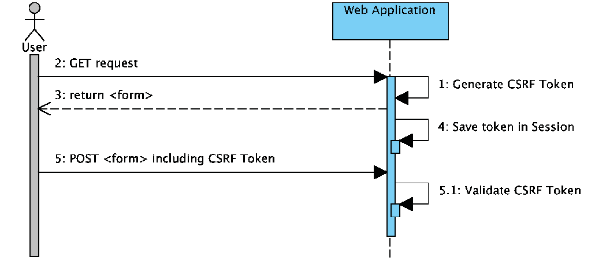

# 十五、附加的 SpringSecurity 特性

在本章中，我们将探讨本书中尚未涉及的几个其他 SpringSecurity特性，包括以下主题：

*   **跨站点脚本**（**XSS**）
*   **跨站点请求伪造****CSRF**
*   同步器令牌
*   **点击劫持**

我们将了解如何使用以下方法包括各种 HTTP 头以防止常见的安全漏洞：

*   `Cache-Control`
*   `Content-Type Options`
*   **HTTP 严格传输安全**（**HSTS**）
*   `X-Frame-Options`
*   `X-XSS-Protection`

在阅读本章之前，您应该已经了解了 SpringSecurity的工作原理。这意味着您应该已经能够在一个简单的 web 应用中设置认证和授权。如果您无法做到这一点，您需要确保在继续本章之前，您已经阅读了[第 3 章](03.html)、*海关认证*。如果您牢记 SpringSecurity的基本概念，并且理解要集成的框架，那么与其他框架集成就相当简单了。

# 安全漏洞

在互联网时代，存在大量可能被利用的漏洞。了解更多基于 web 的漏洞的重要资源是位于[的**开放式 web 应用安全项目**（**OWASP**）https://www.owasp.org](https://www.owasp.org/) 。

除了作为了解各种漏洞的重要资源外，OWASP 还根据行业趋势对前 10 个漏洞进行了分类。

# 跨站点脚本

XSS 攻击涉及已注入受信任站点的恶意脚本。

XSS 攻击发生在攻击者利用给定的 web 应用进行攻击时，该 web 应用通常允许以基于浏览器的脚本的形式将不通风的输入发送到网站，然后由网站的其他用户执行。

基于提供给网站的已验证或未编码信息，攻击者可以利用多种形式进行攻击。

这个问题的核心是希望用户信任正在发送的站点信息。最终用户的浏览器无法知道脚本不应被信任，因为他们对正在浏览的网站存在隐性信任。因为它认为脚本来自可信来源，所以恶意脚本可以访问浏览器保留并与该网站一起使用的任何 cookie、会话令牌或其他敏感信息。

XSS 可以通过以下序列图来描述：


# 跨站点请求伪造

CSRF 是一种欺骗受害者提交恶意请求的攻击。这类攻击继承或劫持受害者的身份和特权，并代表受害者执行未经授权的功能和访问。

对于 web 应用，大多数浏览器自动包含与站点关联的凭据，其中包括用户会话、cookie、IP 地址、Windows 域凭据等。

因此，如果用户当前在某个站点上进行了认证，那么该站点将无法区分受害者发送的伪造请求和合法的法院请求。

CSRF 攻击的目标是导致服务器状态更改的功能，例如更改受害者的电子邮件地址或密码，或参与金融交易。

这迫使受害者检索对攻击者没有好处的数据，因为攻击者没有收到响应；受害者确实如此。因此，CSRF 攻击改变目标状态的请求。

以下序列图详细说明了 CSRF 攻击将如何发生：


可能会采取几种不同的设计措施来防止 CSRF，但是，秘密 cookie、HTTP POST 请求、多步骤事务、URL 重写和 HTTPS 等措施无法防止此类攻击。

OWASP 的 10 大安全漏洞列表将 CSRF 列为第八大最常见攻击[https://www.owasp.org/index.php/Cross-Site_Request_Forgery_（CSRF）](https://www.owasp.org/index.php/Cross-Site_Request_Forgery_(CSRF))。

# 同步器令牌

解决方案是使用同步器令牌模式。这个解决方案是为了确保每个请求除了会话 cookie 之外，还需要一个随机生成的令牌作为 HTTP 参数。提交请求时，服务器必须查找参数的预期值，并将其与请求中的实际值进行比较。如果值不匹配，则请求应失败。

*跨站点请求伪造（CSRF）预防备忘单*建议将同步器令牌模式作为 CSRF 攻击的可行解决方案：[https://www.owasp.org/index.php/Cross-Site_Request_Forgery_（CSRF）_ 预防 _ 作弊 _ 表#一般建议：_ 同步器 _ 令牌 _ 模式](https://www.owasp.org/index.php/Cross-Site_Request_Forgery_(CSRF)_Prevention_Cheat_Sheet#General_Recommendation:_Synchronizer_Token_Pattern)

放松期望是只需要更新状态的每个 HTTP 请求的令牌。这是安全的，因为同源策略确保恶意站点无法读取响应。此外，我们不希望在 HTTP`GET`中包含随机令牌，因为这可能导致令牌泄漏。

让我们来看看我们的例子是如何改变的。假设随机生成的令牌存在于 HTTP 参数`named _csrf`中。例如，转账请求如下所示：

```java
POST /transfer HTTP/1.1
Host: bank.example.com
Cookie: JSESSIONID=randomid; Domain=bank.example.com; Secure; HttpOnly
Content-Type: application/x-www-form-urlencoded
amount=100.00&routingNumber=1234&account=9876&_csrf=<secure-random token>
```

您会注意到，我们添加了带有随机值的`_csrf`参数。现在，恶意网站将无法猜测`_csrf`参数的正确值（必须在恶意网站上明确提供），当服务器将实际令牌与预期令牌进行比较时，传输将失败。

下图显示了同步器令牌模式的标准用例：



# SpringSecurity中的同步器令牌支持

Spring Security 提供默认启用的同步器令牌支持。您可能已经从前面的章节中注意到，在我们的`SecurityConfig.java`文件中，我们已经禁用了 CSRF 保护，如以下代码片段所示：

```
//src/main/java/com/packtpub/springsecurity/configuration/SecurityConfig.java

protected void configure(HttpSecurity http) throws Exception {
...
// CSRF protection is enabled by default.
http.csrf().disable(); ...
}
```

在本书中，到目前为止，我们已经禁用了同步器令牌保护，因此我们可以关注其他安全问题。

如果我们在这一点上启动应用，我们可以运行安全性，并且不会向任何页面添加同步器令牌支持。

您应该从`chapter16.00-calendar`的代码开始。

# 何时使用 CSRF 保护

建议您对任何可由浏览器或普通用户处理的请求使用 CSRF 保护。如果您只创建非浏览器客户端使用的服务，则很可能需要禁用 CSRF 保护。

# CSRF 保护和 JSON

一个常见的问题是：我是否需要保护 JavaScript 发出的 JSON 请求？简而言之，这要看情况而定。但是，您必须非常小心，因为存在可能影响 JSON 请求的 CSRF 漏洞。例如，恶意用户可以使用以下形式使用 JSON 创建 CSRF：

```
    <form action="https://example.com/secureTransaction" method="post"   
    enctype="text/plain">
    <input name='{"amount":100,"routingNumber":"maliciousRoutingNumber",
    "account":"evilsAccountNumber", "ignore_me":"' value='test"}'
    type='hidden'>
    <input type="submit" value="Win Money!"/>
    </form>This will produce the following JSON structure{ "amount":   
    100,"routingNumber": "maliciousRoutingNumber","account": 
    "maliciousAccountNumber","ignore_me": "=test"
    }
```

如果应用未验证内容类型方法，则它将暴露于此漏洞。根据设置，验证内容类型方法的 Spring MVC 应用仍然可以通过更新 URL 后缀以`.json`结尾来利用，如下代码所示：

```
    <form action="https://example.com/secureTransaction.json" method="post"        
    enctype="text/plain">
    <input name='{"amount":100,"routingNumber":"maliciousRoutingNumber",
    "account":"maliciousAccountNumber", "ignore_me":"' value='test"}' 
    type='hidden'>
    <input type="submit" value="Win Money!"/>
    </form>
```

# CSRF 和无状态浏览器应用

如果您的应用是无状态的呢？这并不一定意味着你得到了保护。事实上，如果用户不需要在 web 浏览器中对给定的请求执行任何操作，那么他们可能仍然容易受到 CSRF 攻击。

例如，考虑一个使用自定义 cookie 的应用，该 cookie 包含其内的所有状态来进行认证，而不是 AutoT0\. cookie。当 CSRF 攻击发生时，定制 cookie 将与请求一起发送，发送方式与我们前面示例中发送的`JSESSIONID`cookie 相同。

使用基本认证的用户也容易受到 CSRF 攻击，因为浏览器将自动在任何请求中包含用户名和密码，与我们前面示例中发送的`JSESSIONID`cookie 的方式相同。

# 使用弹簧安全 CSRF 保护

那么，使用 Spring Security 保护我们的站点免受 CSRF 攻击需要采取哪些步骤？使用 Spring Security 的 CSRF 保护的步骤如下：

1.  使用适当的 HTTP 动词。
2.  配置 CSRF 保护。
3.  包括 CSRF 令牌。

# 使用适当的 HTTP 动词

防范 CSRF 攻击的第一步是确保您的网站使用正确的 HTTP 谓词。具体来说，在使用 Spring Security 的 CSRF 支持之前，您需要确保您的应用正在使用`PATCH`、`POST`、`PUT`和/或`DELETE`来修改状态。

这不是 Spring Security 支持的限制，而是正确防止 CSRF 的一般要求。原因是在 HTTP`GET`方法中包含私有信息可能会导致信息泄漏。

请参阅*RFC 2616*、*第 15.1.3 节*、*在 URI 的*中编码敏感信息，了解使用`POST`代替`GET`处理敏感信息（[的一般指导 https://www.w3.org/Protocols/rfc2616/rfc2616-sec15.html#sec15.1.3](https://www.w3.org/Protocols/rfc2616/rfc2616-sec15.html#sec15.1.3) 。

# 配置 CSRF 保护

下一步是在应用中包括 Spring Security 的 CSRF 保护。一些框架通过使用户的会话无效来处理无效的 CSRF 令牌，但这会导致其自身的问题。相反，默认情况下，Spring Security 的 CSRF 保护将产生 HTTP 403 拒绝访问。这可以通过配置`AccessDeniedHandler`以不同方式处理`InvalidCsrfTokenException`来定制。

出于被动性原因，如果您使用的是 XML 配置，则必须使用`<csrf>`元素显式启用 CSRF 保护。有关其他定制，请参阅`<csrf>`元素的文档。

记录 SEC-2347 以确保 Spring Security 4.x 的 XML 命名空间配置在默认情况下启用 CSRF 保护（[https://github.com/spring-projects/spring-security/issues/2574](https://github.com/spring-projects/spring-security/issues/2574) ）。

# 默认 CSRF 支持

默认情况下，通过 Java 配置启用 CSRF 保护。有关如何配置 CSRF 保护的其他定制，请参阅`csrf()`的 Javadoc。

为了在这个配置中更加详细，我们将向我们的`SecurityConfig.java`文件中添加 CSRS 方法，如下所示：

```
//src/main/java/com/packtpub/springsecurity/configuration/SecurityConfig.java
    @Override
```

```
    public void configure(HttpSecurity http) throws Exception {
 http.csrf();    }
```

# 在

<form>提交文件中包含 CSRF 令牌</form>

最后一步是确保将 CSRF 令牌包括在所有的`PATCH`、`POST`、`PUT`和`DELETE`方法中。一种方法是使用`_csrf`请求属性获取当前`CsrfToken`令牌。使用 JSP 执行此操作的示例如下所示：

```
    <c:url var="logoutUrl" value="/logout"/>
    <form action="${logoutUrl}" method="post">
      <input type="submit" value="Log out" />
 <input type="hidden"name="${_csrf.parameterName}" value="${_csrf.token}"/>
    </form>
```

# 使用 Spring Security JSP 标记库包括 CSRF 令牌

如果启用了 CSRF 保护，此标记将插入一个隐藏的表单字段，其中包含 CSRF 保护令牌的正确名称和值。如果未启用 CSRF 保护，则此标签没有输出。

通常，Spring Security 会自动为您使用的任何`<form:form>`标记插入一个 CSRF 表单字段，但如果由于某种原因您无法使用`<form:form>`，则`csrfInput`是一个方便的替代品。

您应该将此标记放在 HTML`<form></form>`块中，通常您会将其他输入字段放在该块中。请勿将此标签放置在弹簧`<form:form></form:form>`块内。Spring Security 自动处理 Spring 表单，如下所示：

```
    <form method="post" action="/logout">
 <sec:csrfInput />      ...
    </form>
```

# 默认 CSRF 令牌支持

如果您使用的是 Spring MVC`<form:form>`标记或 Thymeleaf 2.1+，并且您将`@EnableWebSecurity`替换为`@EnableWebMvcSecurity`，则`CsrfToken`令牌将自动包含在您的令牌中（使用我们正在处理的`CsrfRequestDataValue`令牌）。

因此，在这本书中，我们在所有网页上都使用了 Thymeleaf。如果我们在 Spring Security 中启用 CSRF 支持，则 Thymeleaf 默认启用 CSRF 支持。

您应该从`chapter16.01-calendar`的代码开始。

如果我们启动 JBCP 日历应用并导航到登录页面`https://localhost:8443/login.html`，我们可以查看`login.html`页面的生成源，如下所示：

```
    <form method="POST" action="/login" ...>
      ...
 <input type="hidden" name="_csrf" value="e86c9744-5b7d-4d5f-81d5-450463222908">
    </form>
```

# Ajax 和 JSON 请求

如果您使用的是 JSON，则无法在 HTTP 参数中提交 CSRF 令牌。相反，您可以在 HTTP 头中提交令牌。典型的模式是在`<meta>`HTML 标记中包含 CSRF 标记。JSP 示例如下所示：

```
    <html>
       <head>
 <meta name="_csrf" content="${_csrf.token}"/>         <!-- default header name is X-CSRF-TOKEN -->
 <meta name="_csrf_header" content="${_csrf.headerName}"/>         ...
       </head>
     ¦
```

您可以使用 Spring Security JSP 标记库中更简单的`csrfMetaTags`标记，而不是手动创建元标记。

# csrfMetaTags 标签

如果启用了 CSRF 保护，此标记将插入包含 CSRF 保护令牌表单字段、头名称和 CSRF 保护令牌值的元标记。这些元标记对于在应用的 JavaScript 中使用 CSRF 保护非常有用。

您应该将`csrfMetaTags`标记放在 HTML`<head></head>`块中，通常在该块中放置其他元标记。使用此标记后，可以使用 JavaScript 轻松访问表单字段名、标题名和令牌值，如下所示：

```
<html>
   <head>
       ...
 <sec:csrfMetaTags />       <script type="text/javascript" language="javascript">
 var csrfParameter = $("meta[name='_csrf_parameter']").attr("content"); var csrfHeader = $("meta[name='_csrf_header']").attr("content"); var csrfToken = $("meta[name='_csrf']").attr("content");           ...
       <script>
   </head>
   ...
```

如果 CSRF 保护未启用，`csrfMetaTags`不输出任何内容。

# jQuery 用法

然后，您可以在所有 Ajax 请求中包含该令牌。如果您使用的是 jQuery，则可以使用以下代码段完成此操作：

```
$(function () {
var token = $("meta[name='_csrf']").attr("content");
var header = $("meta[name='_csrf_header']").attr("content");
$(document).ajaxSend(function(e, xhr, options) {
   xhr.setRequestHeader(header, token);
});
});
```

# 使用 cujoJS 的 rest.js 模块

作为 jQuery 的替代方案，我们建议使用 cujoJS 的`rest.js`模块。`rest.js`模块为以 RESTful 方式处理 HTTP 请求和响应提供高级支持。核心功能是将 HTTP 客户端上下文化的能力，通过将拦截器链接到客户端，根据需要添加行为，如下所示：

```
    var client = rest.chain(csrf, {
    token: $("meta[name='_csrf']").attr("content"),
    name: $("meta[name='_csrf_header']").attr("content")
    });
```

配置的客户端可以与需要向受 CSRF 保护的资源发出请求的应用的任何组件共享。`rest.js`和 jQuery 之间的一个显著区别是，使用配置的客户端发出的唯一请求将包含 CSRF 令牌，而在 jQuery 中，所有请求都将包含该令牌。能够确定哪些请求接收令牌有助于防止将 CSRF 令牌泄漏给第三方。

有关`rest.js`
[的更多信息，请参考`rest.js`参考文档 https://github.com/cujojs/rest/tree/master/docs](https://github.com/cujojs/rest/tree/master/docs) [）。](https://github.com/cujojs/rest/tree/master/docs)

# CSRF 注意事项

在 Spring Security 中实现 CSRF 时，有一些需要注意的注意事项。

# 超时

一个问题是预期的 CSRF 令牌存储在`HttpSession`方法中，因此一旦`HttpSession`方法过期，您配置的`AccessDeniedHandler`处理程序将收到`InvalidCsrfTokenException`。如果您使用的是默认的`AccessDeniedHandler`处理程序，浏览器将获得 HTTP 403 并显示错误消息。

您可能会问，为什么预期的`CsrfToken`令牌没有存储在 cookie 中。这是因为存在已知的漏洞，其中头（指定 cookie）可以由另一个域设置。

这也是 RubyonRails 不再跳过 CSRF 检查的原因，当存在头 X-request-With 时（[http://weblog.rubyonrails.org/2011/2/8/csrf-protection-bypass-in-ruby-on-rails/](http://weblog.rubyonrails.org/2011/2/8/csrf-protection-bypass-in-ruby-on-rails/) ）。

*网络应用安全联盟*（[http://www.webappsec.org](http://www.webappsec.org/) 有一个关于使用 CSRF 的详细线程和一个 HTTP 307 重定向来执行利用 CSRF cookies 的攻击。

请参阅此[www.webappsec.org](http://www.webappsec.org/)线程，了解如何在[执行漏洞利用的详细信息 http://lists.webappsec.org/pipermail/websecurity_lists.webappsec.org/2011-February/007533.html](http://lists.webappsec.org/pipermail/websecurity_lists.webappsec.org/2011-February/007533.html) 。

另一个缺点是，通过删除状态（超时），如果某些内容被破坏，您将失去强制终止令牌的能力。

缓解活动用户超时的一个简单方法是使用一些 JavaScript，让用户知道他们的会话即将过期。用户可以单击按钮继续并刷新会话。

或者，指定一个定制的`AccessDeniedHandler`处理程序允许您以任何方式处理`InvalidCsrfTokenException`，如下面的代码所示：

```
//src/main/java/com/packtpub/springsecurity/configuration/SecurityConfig.java

@Override
public void configure(HttpSecurity http) throws Exception {
 http.exceptionHandling() .accessDeniedHandler(accessDeniedHandler); }
@Bean
public CustomAccessDeniedHandler accessDeniedHandler(){
 return new CustomAccessDeniedHandler(); }
```

# 登录

为了防止伪造的登录请求，登录表单也应该受到 CSRF 攻击的保护。由于`CsrfToken`令牌存储在`HttpSession`中，这意味着一旦访问`CsrfToken`属性，就会创建一个`HttpSession`方法。虽然这在 RESTful/无状态体系结构中听起来很糟糕，但现实情况是，状态是实现实际安全性所必需的。没有国家，如果令牌被破坏，我们将无能为力。实际上，CSRF 令牌的大小非常小，对我们的体系结构的影响应该可以忽略不计。

攻击者可以伪造请求，使用攻击者的凭据将受害者登录到目标网站；这称为登录 CSRF（[https://en.wikipedia.org/wiki/Cross-site_request_forgery#Forging_login_requests](https://en.wikipedia.org/wiki/Cross-site_request_forgery#Forging_login_requests) ）。

# 注销

添加 CSRF 将更新`LogoutFilter`过滤器，使其仅使用 HTTP`POST`。这可以确保注销需要 CSRF 令牌，并且恶意用户无法强制注销您的用户。

一种方法是使用`<form>`标记注销。如果需要 HTML 链接，可以使用 JavaScript 让链接执行 HTTP`POST`（可以是隐藏形式）。对于禁用 JavaScript 的浏览器，您可以选择使用链接将用户带到注销确认页面，该页面将执行 HTTP`POST`。

如果您想在注销时使用 HTTP`GET`，您可以这样做，但请记住，通常不建议这样做。例如，当使用任何 HTTP 方法请求注销 URL 模式时，以下 Java 配置将执行注销：

```
//src/main/java/com/packtpub/springsecurity/configuration/SecurityConfig.java

@Override
protected void configure(HttpSecurity http) throws Exception {
 http.logout() .logoutRequestMatcher( new AntPathRequestMatcher("/logout")); }
```

# 安全 HTTP 响应头

以下各节讨论 SpringSecurity 对向响应中添加各种安全头的支持。

# 默认安全标头

SpringSecurity 允许用户轻松地注入默认安全头，以帮助保护其应用。以下是 Spring security 提供的当前默认安全头的列表：

*   `Cache-Control`
*   `Content-Type Options`
*   HTTP 严格传输安全
*   `X-Frame-Options`
*   `X-XSS-Protection`

虽然这些头中的每一个都被认为是最佳实践，但应该注意的是，并非所有客户机都使用这些头，因此鼓励进行额外的测试。出于被动性原因，如果您使用的是 SpringSecurity 的 XML 名称空间支持，则必须显式启用安全标头。使用不带子元素的`<headers>`元素可以轻松添加所有默认标题。

*记录 SEC-2348*以确保 Spring Security 4.x 的 XML 命名空间配置在默认情况下启用安全标头（[https://github.com/spring-projects/spring-security/issues/2575](https://github.com/spring-projects/spring-security/issues/2575) ）。

如果您使用的是 SpringSecurity 的 Java 配置，那么默认情况下会添加所有默认安全头。可以使用 Java 配置禁用它们，如下所示：

```
//src/main/java/com/packtpub/springsecurity/configuration/SecurityConfig.java

@Override
protected void configure(HttpSecurity http) throws Exception {
 http.headers().disable(); }
```

以下代码将安全标头添加到响应中。当使用`WebSecurityConfigurerAdapter`的默认构造函数时默认激活。接受`WebSecurityConfigurerAdapter`提供的默认值，或者只调用`headers()`方法而不调用其他方法，相当于下面的代码片段：

```
@Override
protected void configure(HttpSecurity http) throws Exception {
   http
 .headers() .contentTypeOptions() .and() .xssProtection() .and() .cacheControl() .and() .httpStrictTransportSecurity() .and() .frameOptions()         .and()
     ...;
}
```

一旦您指定了任何应该包含的标题，那么只有这些标题才会被包含。例如，以下配置将仅包括对 X-Frame-Options 的支持：

```
@Override
protected void configure(HttpSecurity http) throws Exception {
   ...
 http.headers().frameOptions(); }
```

# 缓存控制

过去，Spring Security 要求您为 web 应用提供自己的`Cache-Control`方法。这在当时似乎是合理的，但浏览器缓存已经发展到包括用于安全连接的缓存。这意味着用户可以查看经过认证的页面、注销，然后恶意用户可以使用浏览器历史记录查看缓存的页面。

为了帮助缓解这种情况，Spring Security 添加了`Cache-Control`支持，它将在您的响应中插入以下标题：

```
Cache-Control: no-cache, no-store, max-age=0, must-revalidate
Pragma: no-cache
Expires: 0
```

简单地添加没有子元素的`headers()`方法将自动添加`Cache-Control`和许多其他保护选项。但是，如果您只需要`Cache-Control`，可以使用 Spring Security 的 Java 配置和`cacheControl()`方法启用此功能，如下所示：

```
@Override
protected void configure(HttpSecurity http) throws Exception {
   http.headers()
 .cacheControl(); }
```

如果您想缓存特定的响应，您的应用可以有选择地调用`HttpServletResponse.setHeader(String,String)`来覆盖 Spring Security 设置的头。这对于确保正确缓存 CSS、JavaScript 和图像等内容非常有用。

当使用 SpringWebMVC 时，这通常在您的配置中完成。例如，以下配置将确保为所有资源设置缓存头：

```
@EnableWebMvc
public class WebMvcConfiguration
extends WebMvcConfigurerAdapter {
   @Override
   public void addResourceHandlers(
                   ResourceHandlerRegistry registry) {
 registry .addResourceHandler("/resources/**") .addResourceLocations("/resources/") .setCachePeriod(3_155_6926);   }
   // ...
}
```

# 内容类型选项

历史上，浏览器（包括 Internet Explorer）会尝试使用内容嗅探来猜测请求的内容类型。这允许浏览器通过猜测未指定内容类型的资源的内容类型来改善用户体验。例如，如果浏览器遇到未指定内容类型的 JavaScript 文件，它将能够猜测内容类型，然后执行它。

在允许上载内容时，还应该做许多其他事情，例如仅在不同的域中显示文档、确保设置了内容类型标题、清理文档等等。然而，这些措施超出了 SpringSecurity 提供的范围。还必须指出，禁用内容嗅探时，必须指定内容类型才能正常工作。

内容嗅探的问题在于，这允许恶意用户使用 polyglot（一个有效的多内容类型文件）来执行 XSS 攻击。例如，某些网站可能允许用户向网站提交有效的 postscript 文档并进行查看。恶意用户可能创建一个也是有效 JavaScript 文件的 postscript 文档，并使用它执行 XSS 攻击（[http://webblaze.cs.berkeley.edu/papers/barth-caballero-song.pdf](http://webblaze.cs.berkeley.edu/papers/barth-caballero-song.pdf) ）。

可以通过向响应中添加以下标题来禁用内容嗅探：

```
    X-Content-Type-Options: nosniff
```

与`Cache-Control`元素一样，当使用无子元素的`headers()`方法时，默认情况下会添加`nosniff`指令。默认情况下，X-Content-Type-Options 头添加到 SpringSecurityJava 配置中。如果希望对标题进行更多控制，可以使用以下代码显式指定内容类型选项：

```
@Override
protected void configure(HttpSecurity http) throws Exception {
   http.headers()
       .contentTypeOptions();
}
```

# HTTP 严格传输安全

当您输入银行网站时，您是输入`mybank.example.com`还是输入`https://mybank.example.com`？如果省略了 HTTPS 协议，则可能受到中间人攻击的影响。即使网站重定向到`https://**my**bank.example.com`，恶意用户也可能拦截初始 HTTP 请求并操纵响应（重定向到`https://**mi**bank.example.com`并窃取其凭据）。

许多用户省略了 HTTPS 协议，这就是创建 HST 的原因。

根据*RFC6797*的规定，HSTS 报头只注入 HTTPS 响应。为了让浏览器确认标头，浏览器必须首先信任签署用于建立连接的 SSL 证书的 CA，而不仅仅是 SSL 证书（[https://tools.ietf.org/html/rfc6797](https://tools.ietf.org/html/rfc6797) ）。

一旦`mybank.example.com`被添加为 HSTS 主机，浏览器就可以预先知道对`mybank.example.com`的任何请求都应该被解释为`https://mybank.example.com`。这大大减少了中间人攻击发生的可能性。

将站点标记为 HSTS 主机的一种方法是将主机预加载到浏览器中。另一种方法是将`Strict-Transport-Security`头添加到响应中。例如，以下命令将指示浏览器将域作为 HSTS 主机处理一年（一年中大约有`31,536,000`秒）：

```
    Strict-Transport-Security: max-age=31536000 ; includeSubDomains
```

可选的`includeSubDomains`指令指示 Spring Security 将子域（如`secure.mybank.example.com`）也视为 HSTS 域。

与其他头一样，当指定的`headers()`方法没有子元素时，Spring Security 会将前一个头添加到响应中，但当您使用 Java 配置时，它会自动添加。您也只能通过`hsts()`方法使用 HSTS 头，如下代码所示：

```
@Override
protected void configure(HttpSecurity http) throws Exception {
   http.headers()
 .hsts(); }
```

# X-Frame-Options

允许您的网站添加到框架可能是一个安全问题。例如，使用聪明的 CSS 样式，用户可能会被骗点击他们不想点击的东西。

在[处查看点击劫持视频演示 https://www.youtube.com/watch?v=3mk0RySeNsU](https://www.youtube.com/watch?v=3mk0RySeNsU) 。

例如，登录到其银行的用户可能会单击授予其他用户访问权限的按钮。这种攻击称为点击劫持。

在[阅读更多关于点击劫持的信息 https://www.owasp.org/index.php/Clickjacking](https://www.owasp.org/index.php/Clickjacking) 。

另一种处理点击劫持的现代方法是使用内容安全策略。springsecurity 并没有提供这方面的支持，因为规范还没有发布，而且要复杂一些。但是，您可以使用静态标题特性来实现这一点。要了解此问题的最新情况，并了解如何使用 Spring Security 实现它，请参阅*SEC-2117*中的[https://github.com/spring-projects/spring-security/issues/2342](https://github.com/spring-projects/spring-security/issues/2342) 。

有许多方法可以减轻点击劫持攻击。例如，为了保护传统浏览器免受点击劫持攻击，您可以使用断帧代码。虽然不是完美的，但对于传统浏览器来说，框架中断代码是最好的选择。

解决点击劫持问题的更现代方法是使用 X-Frame-Options 标题，如下所示：

```
    X-Frame-Options: DENY
```

`X-Frame-Options`响应标头指示浏览器防止响应中包含此标头的任何站点在帧内呈现。与其他响应头一样，当指定了没有子元素的`headers()`方法时，会自动包含该响应头。您还可以显式指定 frame options 元素，以控制将哪些标头添加到响应中，如下所示：

```
@Override
protected void configure(HttpSecurity http) throws Exception {
   http.headers()
 .frameOptions(); }
```

如果要更改 X-Frame-Options 标题的值，则可以使用`XFrameOptionsHeaderWriter instance`。

一些浏览器内置了过滤反射的 XSS 攻击的支持。这绝非万无一失，但它确实有助于 XSS 保护。

过滤通常在默认情况下处于启用状态，因此添加标头只需确保它处于启用状态，并指示浏览器在检测到 XSS 攻击时执行什么操作。例如，过滤器可能会尝试以最小侵入性的方式更改内容，以仍然呈现所有内容。有时，这种类型的替换本身可能成为 XSS 漏洞。相反，最好是阻止内容，而不是试图修复它。为此，我们可以添加以下标题：

```
    X-XSS-Protection: 1; mode=block
```

当指定的`headers()`方法没有子元素时，默认包含此标头。我们可以使用`xssProtection`元素显式声明它，如下所示：

```
@Override
protected void configure(HttpSecurity http) throws Exception {
   http.headers()
       .xssProtection();
}
```

# 自定义标题

SpringSecurity 有一些机制，可以方便地向应用添加更多常见的安全头。但是，它还提供了钩子来支持添加自定义头。

# 静态标题

有时，您可能希望向应用中注入定制的安全标头，但这些标头不受开箱即用的支持。例如，您可能希望尽早支持内容安全策略，以确保仅从同一来源加载资源。由于对内容安全策略的支持尚未最终确定，浏览器使用两个常用扩展标题之一来实现该功能。这意味着我们需要两次注入该政策。标题示例可在以下代码段中看到：

```
X-Content-Security-Policy: default-src 'self'
X-WebKit-CSP: default-src 'self'
```

使用 Java 配置时，可以使用`header()`方法将这些头添加到响应中，如下所示：

```
@Override
protected void configure(HttpSecurity http) throws Exception {
   http.headers()
       .addHeaderWriter(
         new StaticHeadersWriter(
               "X-Content-Security-Policy",
               "default-src 'self'"))
       .addHeaderWriter(
           new StaticHeadersWriter(
               "X-WebKit-CSP",
               "default-src 'self'"));
}
```

# HeadersWriter 实例

当名称空间或 Java 配置不支持所需的头时，您可以创建自定义`HeadersWriter`实例，甚至提供`HeadersWriter`的自定义实现。

让我们看一个例子，使用一个自定义实例的也许您希望允许为同一来源构建内容框架。通过将策略属性设置为 AUT1 T1，可以很容易地支持这一点，但是让我们来看看使用 Type T2Ay 属性的更为明确的示例，如下面的代码片段所示：

```
@Override
protected void configure(HttpSecurity http) throws Exception {
   http.headers()
       .addHeaderWriter(
           new XFrameOptionsHeaderWriter(
               XFrameOptionsMode.SAMEORIGIN));
}
```

# DelegatingRequestMatcherHeaderWriter 类

有时，您可能只想为某些请求编写头。例如，您可能只想保护您的登录页面不被框接。您可以使用`DelegatingRequestMatcherHeaderWriter`类来完成此操作。使用 Java 配置时，可以使用以下代码完成此操作：

```
@Override
protected void configure(HttpSecurity http) throws Exception {
 DelegatingRequestMatcherHeaderWriter headerWriter = new DelegatingRequestMatcherHeaderWriter( new AntPathRequestMatcher("/login"), new XFrameOptionsHeaderWriter());   http.headers()
       .addHeaderWriter(headerWriter);
}
```

# 总结

在本章中，我们介绍了几个安全漏洞，并使用 Spring security 规避这些漏洞。阅读本章后，您应该了解 CSRF 的威胁以及使用同步器令牌来防止 CSRF。

您还应该知道如何使用`Cache-Control`、`Content-Type Options`、HSTS、`X-Frame-Options`和`X-XSS-Protection`方法包含各种 HTTP 头以防止常见的安全漏洞。

在下一章中，我们将讨论如何从 SpringSecurity3.x 迁移到 SpringSecurity4.2。