# 十八、附加参考资料

在本附录中，我们将介绍一些我们认为有用的参考资料（基本上没有记录），但内容过于全面，无法在章节中插入。

# JBCP 日历示例代码入门

正如我们在[第 1 章](01.html)*对不安全应用*的剖析中所述，我们假设您已经安装了 JDK。您可以从 Oracle 网站[下载 JDKhttp://www.oracle.com/technetwork/java/javase/downloads/index.html](http://www.oracle.com/technetwork/java/javase/downloads/index.html) 。您需要安装 JDK 8 才能运行代码示例。代码库使用了许多与 JDK 7 不兼容的 JDK 8 特性，而且还没有人试图用 IDE 和项目依赖性来解决各种 JDK 9 问题。

# 渐变构建工具

本书中的所有代码都是使用 Gradle 构建工具构建的，并且在一章一章的多模块构建中进行组织。您可以在[找到本地获取 Gradle 的说明和选项 https://gradle.org/install/](https://gradle.org/install/) 。

不需要本地安装 Gradle，因为源代码的根已经安装了 Gradle 包装器。Gradle 包装器可以安装在任何子模块中。您可以在[找到有关 Gradle 包装器的其他信息 https://docs.gradle.org/current/userguide/gradle_wrapper.html](https://docs.gradle.org/current/userguide/gradle_wrapper.html) 。

下载示例代码
您可以下载您在[账户购买的所有 Packt 书籍的示例代码文件 http://www.packtpub.com](http://www.packtpub.com/) 。如果您从其他地方购买本书，您可以访问[http://www.packtpub.com/support](http://www.packtpub.com/support) 并注册，将文件直接通过电子邮件发送给您。

# GradleIDE 插件

代码库已经配置了 IntelliJ 和 EclipseIDE 插件。这意味着 Gradle 可以创建所有必要的 IDE 项目文件，而不是手动导入代码库，尽管您不必使用这些插件。

要使用这些插件，请打开代码库根目录下的终端或命令提示符窗口。要执行插件，请在 OSX 或 Linux 上发出以下命令：

```java
$ ./gradlew idea
```

运行此任务后，每个目录中将有几个 IDEA 项目文件，如以下屏幕截图所示：


如果您在 Windows 计算机上，将发出以下命令：

```
C:\jbcdcalendar> gradlew.bat idea
```

前面的示例执行`gradlew`脚本，即 Gradle 包装器，然后给出 IDE 文件创建的命令。IntelliJ 项目文件是通过`idea`任务创建的，STS 或任何基于 Eclipse 的 IDE 项目文件都是通过 Eclipse 任务创建的。

运行 Eclipse 任务后，每个目录中将有几个 Eclipse 项目文件和目录：

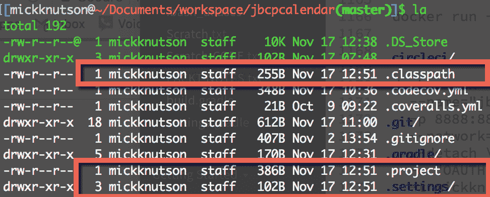

# 智能思想

本书中使用的大多数图表都取自 Jet Brains 的 IntelliJ IDEA（[https://www.jetbrains.com/idea/](https://www.jetbrains.com/idea/) ）。IDEA 对多模块 Gradle 构建有极好的支持。

IDEA 将允许您导入现有项目，或者您只需从源代码库的根目录打开`build.gradle`文件，IDEA 将为您创建必要的项目文件。

使用 Gradle`idea`任务创建 IDEA 项目文件后，可以使用导入项目选项导入整个项目，如以下屏幕截图所示：


然后，系统将提示您选择 IDEA 将如何执行此 Gradle 构建的各种选项，如以下屏幕截图所示：

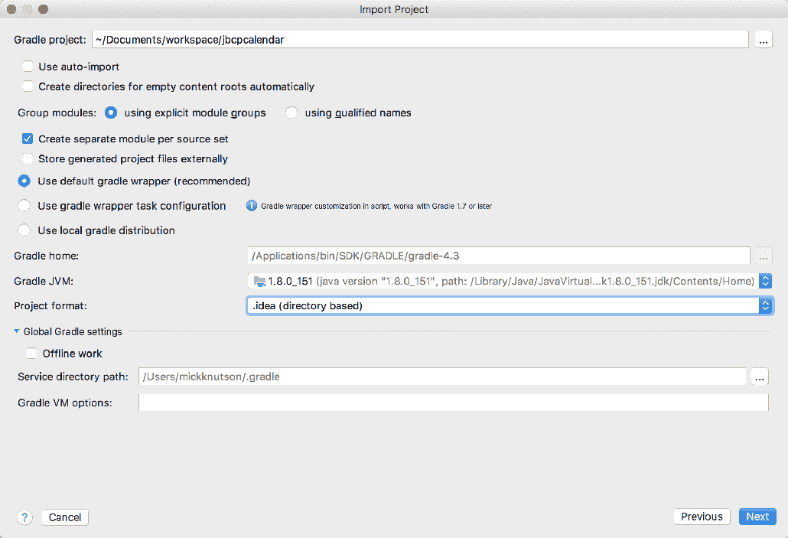

关于 Gradle 项目的 IDEA 导入的特别说明
在前面的清单中，您会注意到有一个使用 Gradle 包装任务配置的选项，而不是选择的选项，即使用默认的 Gradle 包装（推荐）选项。唯一的区别是使用了 Gradle wrapper 任务配置选项，它将在每个项目目录中创建一个 Gradle wrapper 实例。如果您希望在终端或命令行上执行构建命令，而不必安装本地版本的 Gradle，这将非常有用。否则，IDEA 将处理所有项目的 Gradle 包装调用。

导入项目后，您将能够使用任何章节，布局将如以下屏幕截图所示：

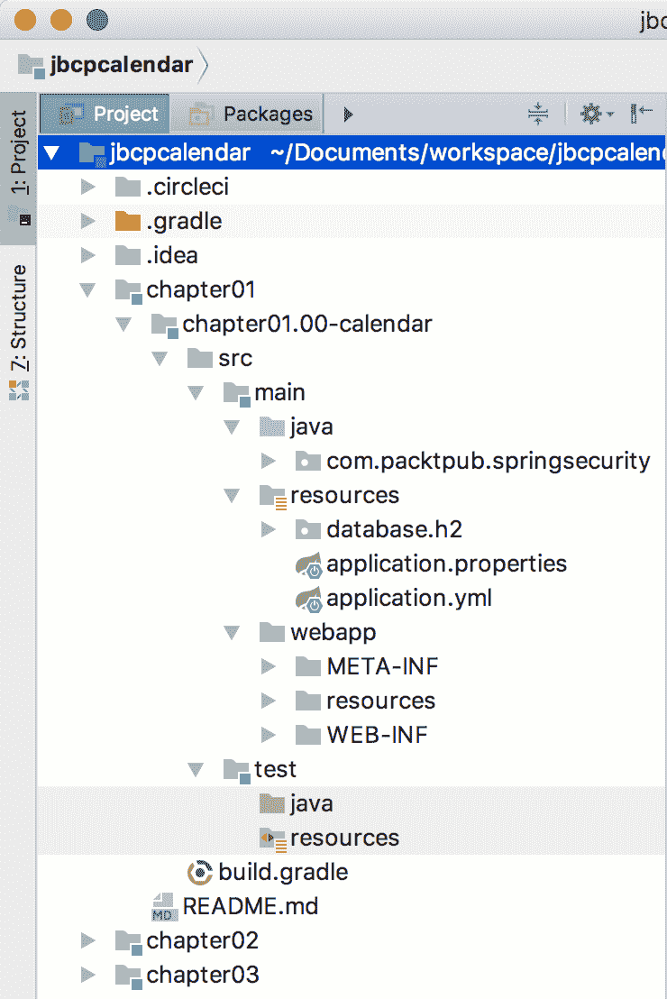

# Spring 工具套件还是 Eclipse

如果使用 STS，我们假设您可以访问**Spring 工具套件**（**STS**）3.9.1。您可以从[下载 STShttps://spring.io/tools/sts](https://spring.io/tools/sts) 。STS 版本 3.9.1 基于 Eclipse 氧气 1a（4.7.1a），您可以在[找到更多关于氧气释放的信息 https://www.eclipse.org/ide/](https://www.eclipse.org/ide/) 。

# 创建新工作区

最好创建一个新的工作区，以尽量减少与环境的差异，这可以通过执行以下步骤来完成：

1.  当您第一次打开 STS 时，它将提示您输入工作区位置。如果您以前使用过 STS，则可能需要转到文件|切换工作区|其他以创建新工作区。建议输入不包含任何空间的工作区位置。例如，请查看以下屏幕截图：


2.  创建新工作区后，您将希望通过单击欢迎选项卡上的关闭按钮退出欢迎屏幕，如以下屏幕截图所示：

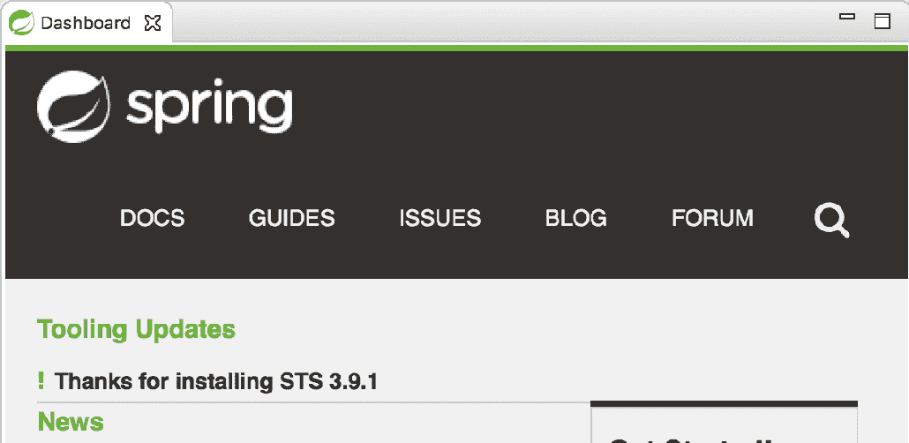

# 示例代码结构

示例代码在一个`.zip`文件中结构化，包含多模块 Gradle 项目的文件夹。每个文件夹名为`chapterNN`，其中`NN`为章节号。每个`chapterNN`文件夹都有包含每个里程碑项目的附加文件夹，格式为`chapterNN.mm-calendar`，其中`NN`是章节号，`mm`是该章节内的里程碑。为简单起见，建议您将源提取到不包含任何空格的路径。每个里程碑都是本章中的一个检查点，允许您轻松地将代码与本书的代码进行比较。例如，`chapter02.03-calendar`包含日历应用[第 2 章](02.html)*Spring Security 入门*中的里程碑编号`03`。上述项目的位置为`~/jbcpcalendar/chapter02/chapter02.03-calendar`。

[第一章](01.html)、*剖析一个不安全的应用*、[第二章](02.html)、*开始使用 Spring Security*已经创建为 Spring IO 项目，而不是使用 Spring Boot 作为项目基础。[第三章](03.html)、*自定义认证*将日历项目转换为 Spring Boot 代码库，在[第五章](05.html)中*SpringData认证*中，JDBC 被 SpringData替换为持久化机制。

为了使每一章尽可能独立，本书中的大部分章节都是基于[第 9 章](09.html)、*对 OpenID 开放*或[第 15 章](09.html)、*附加弹簧安全功能*构建的。这意味着，在大多数情况下，您可以通读[第 9 章](09.html)*打开 OpenID*，然后跳转到本书的其他部分。然而，这也意味着，重要的是在每一章开始时都要使用该章的里程碑`00`源代码，而不是继续使用上一章的代码。这确保了代码的起始位置与章节的起始位置相同。

虽然你不需要执行任何步骤就可以看完整本书，但我们建议从里程碑`00`开始每一章，并执行书中的步骤。这将确保你从书中得到最大的收获。您可以使用里程碑版本复制大部分代码，或者在遇到问题时比较代码。

# 导入样本

在我们将这个 Gradle 项目导入 Eclipse 之前，您必须从 Eclipse 市场安装一个 Gradle 插件。在写这本书的时候只有两种选择。一个是 Gradle IDE 包（[http://marketplace.eclipse.org/content/gradle-ide-pack](http://marketplace.eclipse.org/content/gradle-ide-pack) ），但是这个项目没有被维护，如果你安装了这个插件，Eclipse 会警告你并建议你迁移到**Buildship Gradle Integration**插件（ [http://marketplace.eclipse.org/content/buildship-gradle-integration](http://marketplace.eclipse.org/content/buildship-gradle-integration) ）。安装后，您将可以选择导入现有的 Gradle 项目。

从新工作区开始，执行以下步骤：

1.  转到文件|导入并选择现有 Gradle 项目，如以下屏幕截图所示：


2.  单击 Next>，如以下屏幕截图所示：

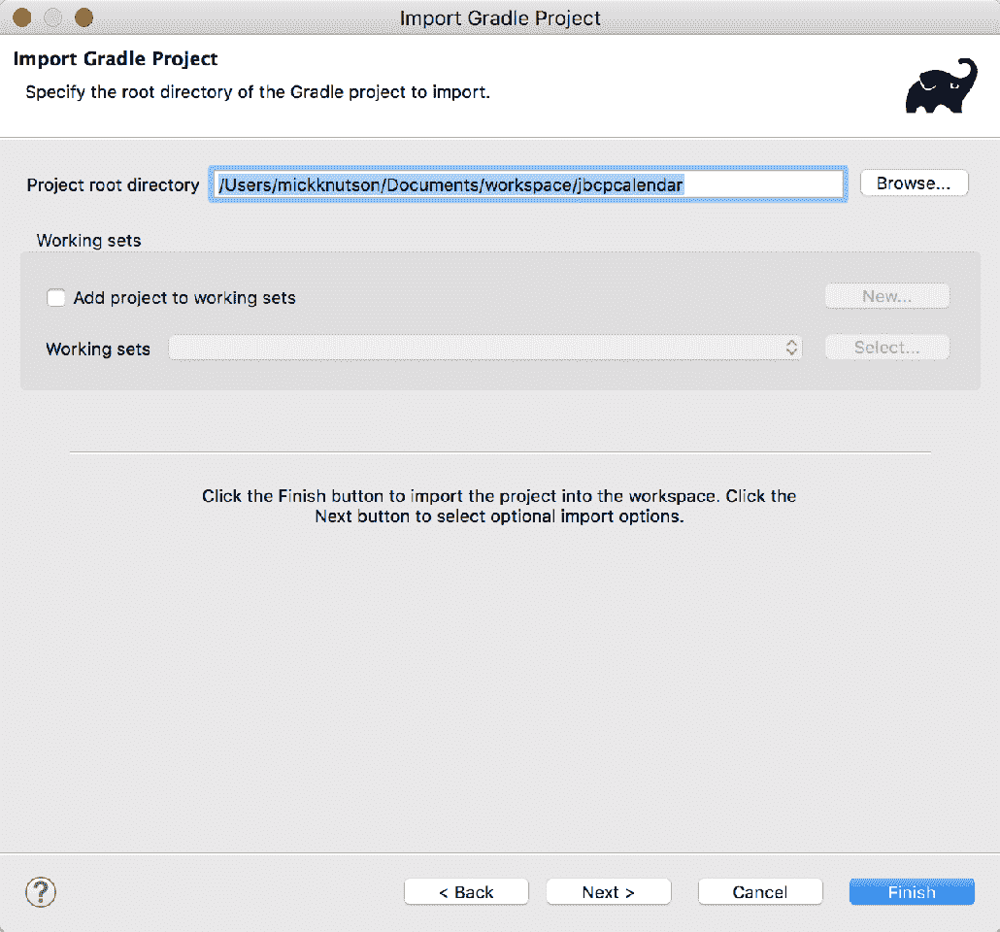

3.  单击下一步>，如以下屏幕截图所示：

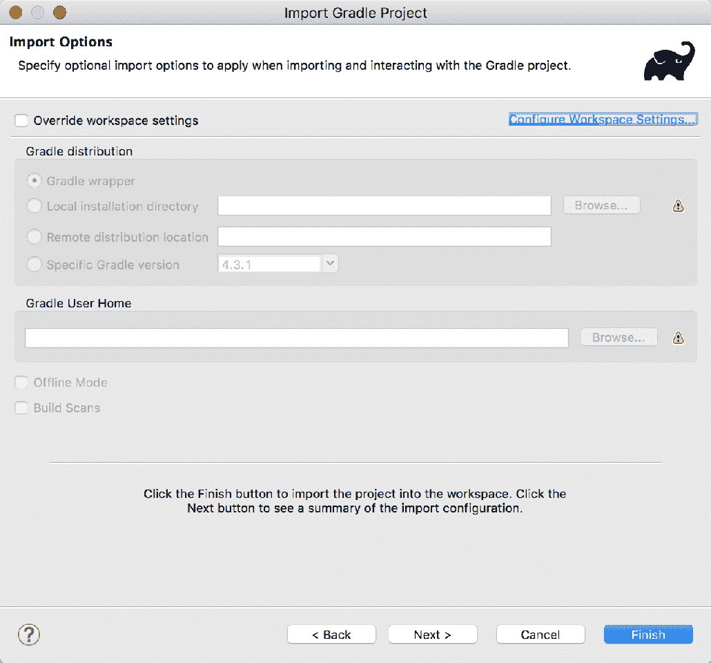

确保保留默认设置，除非您希望使用本地安装的 Gradle。

4.  浏览到将代码导出到的位置，然后选择代码的父文件夹。您将看到列出的所有项目。您可以选择感兴趣的项目，也可以选择所有项目。如果您决定导入所有项目，您可以轻松地关注当前章节，因为命名约定将确保项目按照它们在书中的显示顺序进行排序：

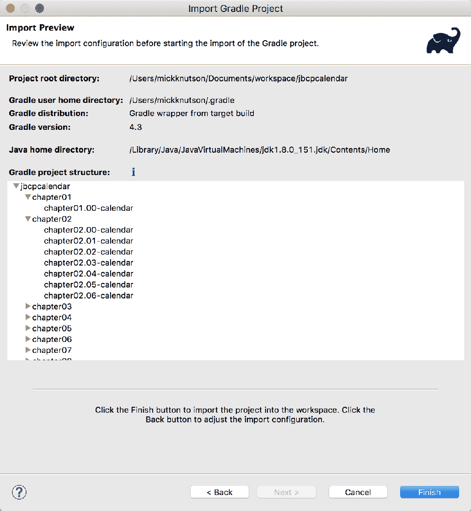

5.  点击 Finish。将导入所有选定的项目。如果您没有经常使用 Gradle，下载依赖项将需要一段时间。

下载依赖项需要 internet 连接。

项目运行的更新说明将在每个章节的`README.md`文件中找到。这确保了在对 STS 进行更新时，仍然可以使用最新的工具构建和运行代码。

# 运行样本

要在 IDEA 或 STS 中运行示例应用，需要做一些事情。在所有的项目中，Gradle 都配置了一个 Tomcat 插件来运行嵌入式实例，以帮助您更快地开始。

# 在 IDEA 中启动样本

运行里程碑项目可以通过为每个项目创建一个`Run/Debug Configuration`条目来完成。

从新工作区开始，执行以下步骤：

1.  转到文件|运行并选择编辑配置…，如以下屏幕截图所示：

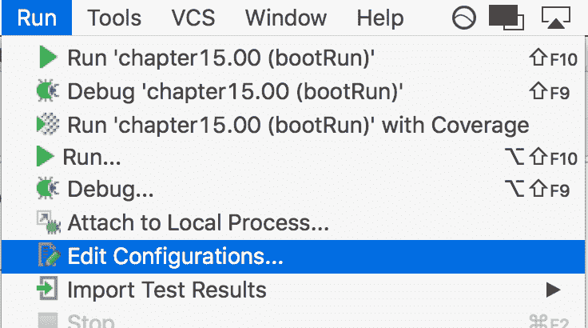

2.  您将看到添加新配置的选项。选择左上角的加号（+）以选择新的渐变配置，如以下屏幕截图所示：

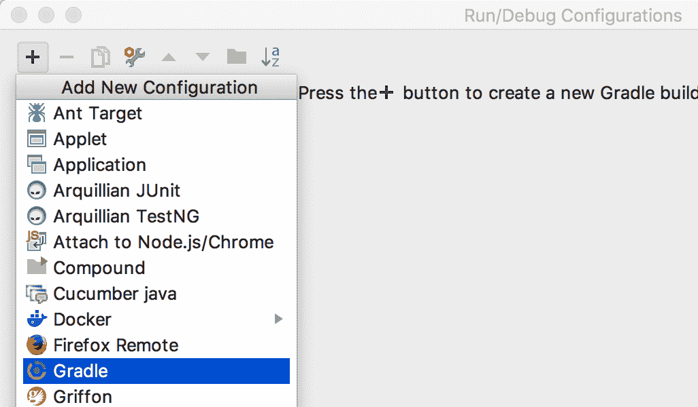

3.  现在，您可以给它一个类似于`chapter15.00 (bootRun)`的名称，并为此配置选择实际的里程碑目录。最后，在任务选项下输入`bootRun`执行，如下图所示：

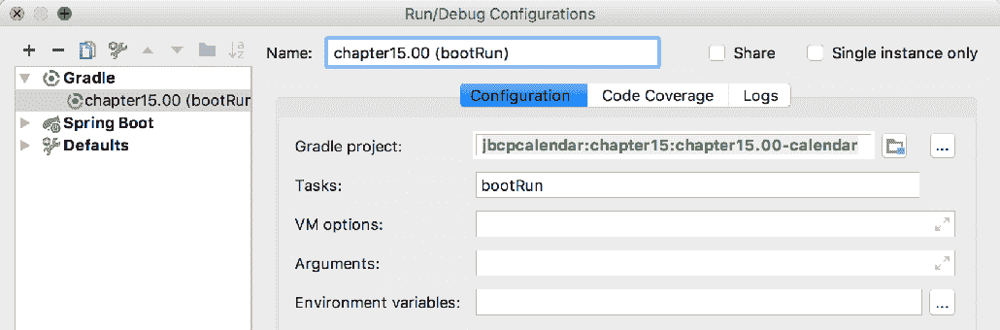

4.  选择要执行的配置；点击绿色运行按钮或使用*Shift*+*F10*键，如下图所示：


# 梯度任务

在[第一章](01.html)、*剖析一个不安全的应用*、[第二章](02.html)、*启动 Spring Security*中，运行该项目的梯度任务将是*tomcatRun*。在本书的其余章节中，使用了 Spring Boot，启动项目的 Gradle 任务将是`bootRun`。

# 在 STS 中启动样本

在 STS 中，还创建了运行配置，需要为每个要运行的里程碑项目包含相同的信息，如以下屏幕截图所示：

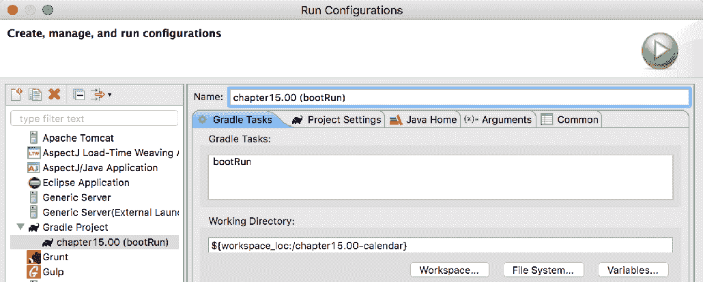

# 在 STS 中使用 HTTPS

部分章节的示例代码（即[第 8 章](08.html)、*与 TLS 的客户端证书认证*、[第 9 章](09.html)、*向 OAuth2 开放*、[第 10 章](10.html)、*与中央认证服务*单点登录）需要使用 HTTPS 才能使示例代码正常工作。

所有项目都已配置为运行 HTTPS；大多数配置在属性或 YAM 文件中进行管理。

现在，当您从 Gradle 在嵌入式 Tomcat 服务器上运行示例代码时，您可以连接到`http://localhost:8080 or to https://localhost:8443`。

# Tomcat 中的 HTTPS 设置

在本节中，我们将概述如何在 Tomcat 中设置 HTTPS 以向应用提供 TLS。所有包含的项目都在嵌入式 Tomcat 实例中运行，但我们将介绍证书创建过程以及在独立 Tomcat 实例中运行这些应用的一些技巧。

# 生成服务器证书

如果您还没有证书，则必须首先生成一个证书。如果愿意，您可以跳过这一步并使用`tomcat.keystore`文件，该文件包含一个证书，该证书位于本书样本源的`etc`目录中。在命令提示下输入以下命令行：

```
$ keytool -genkey -alias jbcpcalendar -keypass changeit -keyalg RSA \
-keystore tomcat.keystore
Enter keystore password: changeit
Re-enter new password: changeitWhat is your first and last name? [Unknown]: localhost
What is the name of your organizational unit? [Unknown]: JBCP Calendar
What is the name of your organization? [Unknown]: JBCP
What is the name of your City or Locality? [Unknown]: Anywhere 
What is the name of your State or Province? [Unknown]: UT
What is the two-letter country code for this unit? [Unknown]: US
Is CN=localhost, OU=JBCP Calendar, O=JBCP, L=Anywhere, ST=UT, C=US correct? [no]: yes
```

大多数值都是不言自明的，但您需要确保“您的名字和姓氏是什么？”的答案是访问 web 应用的主机。这是确保 SSL 握手成功所必需的。

您现在应该在当前目录中有一个名为`tomcat.keystore`的文件。您可以在同一目录中使用以下命令查看其内容：

```
$ keytool -list -v -keystore tomcat.keystore
Enter keystore password: changeit
Keystore type: JKS
Keystore provider: SUN
...
Alias name: jbcpcalendar
...
Owner: CN=localhost, OU=JBCP Calendar, O=JBCP, L=Anywhere, ST=UT, C=US
Issuer: CN=localhost, OU=JBCP Calendar, O=JBCP, L=Anywhere, ST=UT, C=US
```

正如您可能已经猜到的，使用`changeit`作为密码是不安全的，因为这是许多 JDK 实现中使用的默认密码。在生产环境中，您应该使用安全密码，而不是像`changeit`这样简单的密码。

有关`keytool`命令的更多信息，请参阅 Oracle 网站[上的文档 https://docs.oracle.com/javase/9/tools/keytool.htm](https://docs.oracle.com/javase/9/tools/keytool.htm) 。如果您遇到问题，您可能还会发现*CAS SSL 故障排除和参考指南*很有帮助（[https://apereo.github.io/cas/5.1.x/installation/Troubleshooting-Guide.html](https://apereo.github.io/cas/5.1.x/installation/Troubleshooting-Guide.html) ）。

# 配置 Tomcat 连接器以使用 SSL

在本节中，我们将讨论如何通过执行以下步骤将 Tomcat 8.5 连接器配置为 SSL：

1.  打开下载
    Tomcat 8.5 时附带的`server.xml`文件。您可以在 Tomcat 服务器主目录的`conf`目录中找到它。在您的`server.xml`文件中找到以下条目：

```
    <!--
    <Connector port="8443" protocol="HTTP/1.1" SSLEnabled="true" maxThreads="150"    
    scheme="https" secure="true" clientAuth="false" sslProtocol="TLS" />
```

2.  取消对连接器的注释，并将`keystoreFile`属性的值修改为上一节中密钥库的位置。另外，请确保更新`keystorePass`属性的值，使其成为生成密钥库时使用的密码。下面的代码片段中显示了一个示例，但请确保同时更新了`keystoreFile`和`keystorePass`的值：

```
    <Connector port="8443" protocol="HTTP/1.1" SSLEnabled="true"  maxThreads="150"    
    scheme="https" secure="true" clientAuth="false" sslProtocol="TLS"
    keystoreFile="/home/mickknutson/packt/etc/tomcat.keystore"
    keystorePass="changeit"/>
```

3.  您现在应该能够启动 Tomcat 并在`https://locahost:8443/`访问它。有关在 Tomcat 上配置 SSL 的更多信息，请参阅[中的*SSL 配置如何*http://tomcat.apache.org/tomcat-8.5-doc/ssl-howto.html](http://tomcat.apache.org/tomcat-8.5-doc/ssl-howto.html) 。

# 基本 Tomcat SSL 终止指南

本节旨在帮助设置 Tomcat 在使用 SSL 终端时使用 SSL。其思想是由外部实体（如负载平衡器）管理 SSL 连接，而不是 Tomcat。这意味着从客户端（即 web 浏览器）到负载平衡器的连接是通过 HTTPS 进行的，并且是安全的。从负载平衡器到 Tomcat 的连接是通过 HTTP 进行的，不安全。对于提供任何安全层的这种设置，从负载平衡器到 Tomcat 的连接应该通过专用网络。

这个设置导致的问题是 Tomcat 现在认为客户端正在使用 HTTP，因此重定向将被发送，就好像存在 HTTP 连接一样。为了避免这种情况，您可以修改配置以指示 Tomcat 它位于代理服务器后面。

以下示例是一个完整的连接器，将用于采用客户端证书认证的 Tomcat 部署：

```
    //server.xml

    <Connector
    scheme="https"
    secure="true"
    proxyPort="443"
    proxyHost="example.com"
    port="8443"
    protocol="HTTP/1.1"
```

```
    redirectPort="443"
    maxThreads="750"
    connectionTimeout="20000" />
```

`server.xml`文件可在`TOMCAT_HOME/conf/server.xml`找到。如果您使用 Eclipse 或 Spring 工具套件与 Tomcat 交互，您将发现一个名为`Servers`的项目，其中包含`server.xml`文件。例如，如果您使用的是 Tomcat8.5，Eclipse 工作区中的路径可能类似于`localhost-config/server.xml`中的`/Servers/Tomcat v8.5 Server`。

请注意，没有对`keystore`的引用，因为 Tomcat 不管理 SSL 连接。此设置将覆盖`HttpServletRequest`对象，使其相信连接是 HTTPS，以便正确执行重定向。但是，它将继续接受 HTTP 连接。如果客户端也可以进行 HTTP 连接，则可以创建一个不包含 HTTPS 设置的单独连接器。然后，代理服务器可以根据原始请求是 HTTP 还是 HTTPS 向相应的连接器发送请求。

有关更多信息，请参阅
[中的*Tomcat 代理如何*文档 http://tomcat.apache.org/tomcat-8.5-doc/proxy-howto.html](http://tomcat.apache.org/tomcat-8.5-doc/proxy-howto.html) 。如果您使用的是不同的应用，可以参考他们的文档以了解如何使用代理服务器。